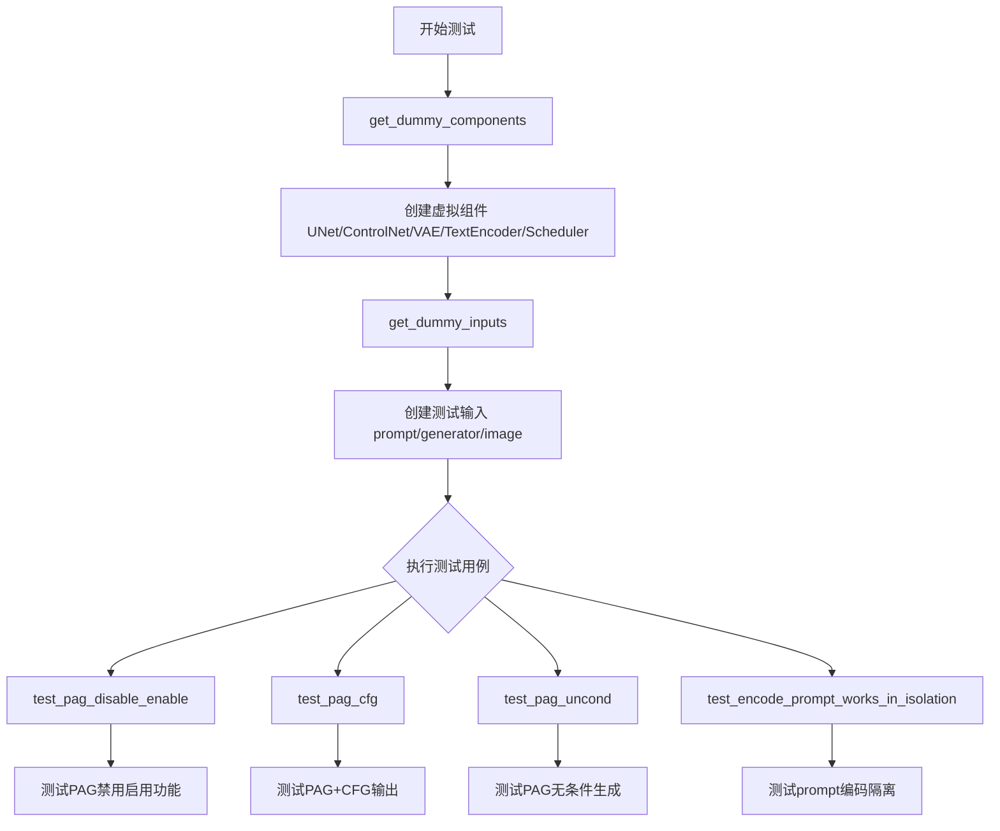
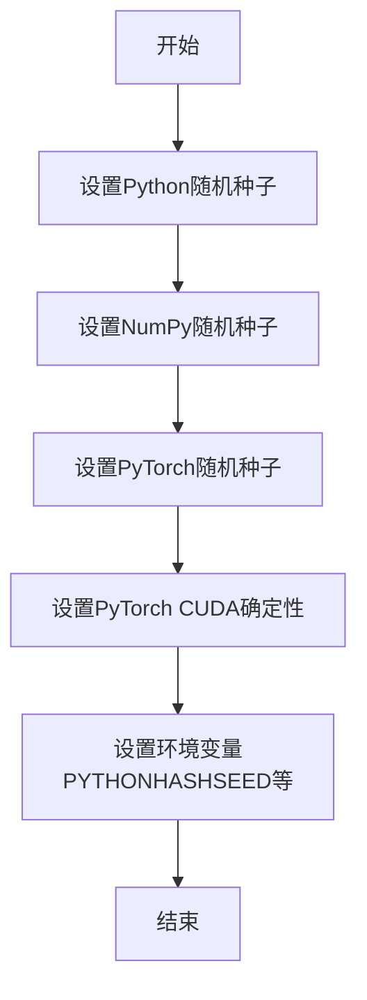
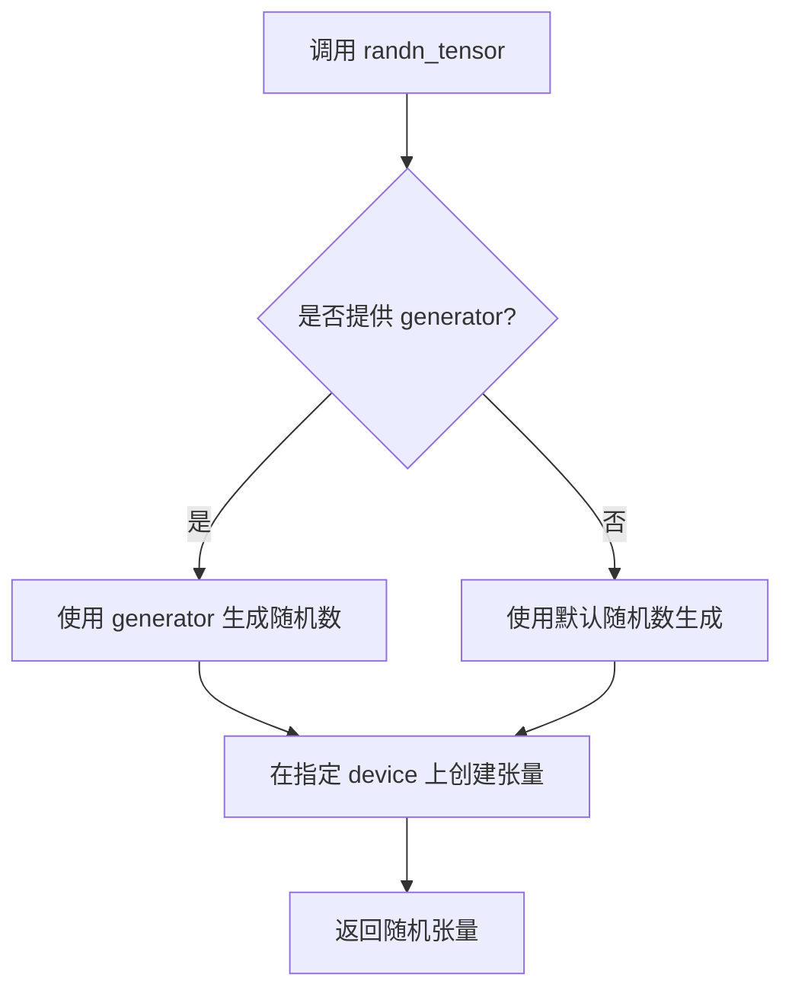
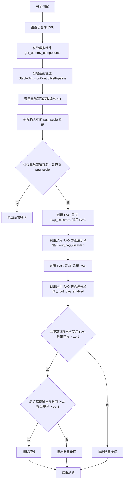
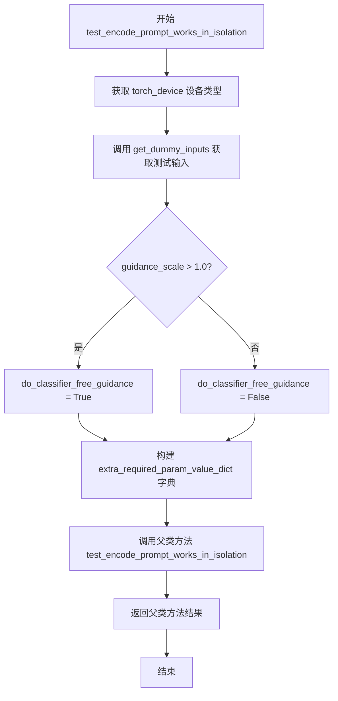

# `diffusers\tests\pipelines\pag\test_pag_controlnet_sd.py` 详细设计文档

这是一个针对 StableDiffusionControlNetPAGPipeline 的单元测试文件，用于测试带有 PAG（Progressive Attention Guidance）功能的 Stable Diffusion ControlNet 管道，包括禁用/启用 PAG、PAG CFG 模式和无条件生成的测试。

## 整体流程



## 类结构

```
unittest.TestCase
├── StableDiffusionControlNetPAGPipelineFastTests
    ├── PipelineTesterMixin
    ├── IPAdapterTesterMixin
    ├── PipelineLatentTesterMixin
    └── PipelineFromPipeTesterMixin
```

## 全局变量及字段


### `StableDiffusionControlNetPAGPipelineFastTests.pipeline_class`
    
The pipeline class being tested, which is StableDiffusionControlNetPAGPipeline

类型：`Type[StableDiffusionControlNetPAGPipeline]`
    


### `StableDiffusionControlNetPAGPipelineFastTests.params`
    
Parameters for text-to-image generation including PAG-specific parameters (pag_scale, pag_adaptive_scale)

类型：`set`
    


### `StableDiffusionControlNetPAGPipelineFastTests.batch_params`
    
Batch parameters for text-to-image generation used in testing

类型：`set`
    


### `StableDiffusionControlNetPAGPipelineFastTests.image_params`
    
Image parameters for text-to-image generation used in testing

类型：`set`
    


### `StableDiffusionControlNetPAGPipelineFastTests.image_latents_params`
    
Image latents parameters for text-to-image generation used in testing

类型：`set`
    


### `StableDiffusionControlNetPAGPipelineFastTests.callback_cfg_params`
    
Callback parameters for classifier-free guidance including additional text embeddings and time IDs

类型：`set`
    
    

## 全局函数及方法


### `enable_full_determinism`

该函数用于在测试环境中启用完全确定性（full determinism），通过设置随机种子和环境变量等方式，确保测试结果的可重复性。

参数：无需参数

返回值：`None`，该函数不返回任何值

#### 流程图



#### 带注释源码

```
# 该函数定义位于 testing_utils 模块中
# 当前代码仅导入并调用该函数，未包含其完整定义
# 根据函数名和调用方式，推断其实现逻辑如下：

def enable_full_determinism(seed: int = 0):
    """
    启用完全确定性，确保测试结果可重复。
    
    参数:
        seed: 随机种子，默认为0
    """
    import os
    import random
    import numpy as np
    import torch
    
    # 1. 设置Python内置random模块的种子
    random.seed(seed)
    
    # 2. 设置NumPy随机种子
    np.random.seed(seed)
    
    # 3. 设置PyTorch随机种子
    torch.manual_seed(seed)
    
    # 4. 如果使用CUDA，设置CUDA算法确定性
    if torch.cuda.is_available():
        torch.cuda.manual_seed(seed)
        torch.backends.cudnn.deterministic = True
        torch.backends.cudnn.benchmark = False
    
    # 5. 设置环境变量确保哈希随机性固定
    os.environ["PYTHONHASHSEED"] = str(seed)
```

> **注意**：当前代码段中仅包含 `enable_full_determinism` 的导入和调用语句，函数的实际定义位于 `testing_utils` 模块中。上述源码为基于函数名称和功能的合理推断。


### `randn_tensor`

用于生成指定形状的随机张量，支持通过随机数生成器和目标设备来控制随机性，常用于扩散模型中生成噪声或初始化张量。

参数：
- `shape`：`tuple of int`，张量的维度形状，例如 `(1, 3, 32, 32)`
- `generator`：`torch.Generator`，可选，用于控制随机数生成的生成器对象，确保可重复性
- `device`：`torch.device`，可选，指定生成张量的设备（如 CPU 或 CUDA）

返回值：`torch.Tensor`，生成的随机张量

#### 流程图



#### 带注释源码

```python
def randn_tensor(shape, generator=None, device=None):
    """
    生成一个随机张量。
    
    参数:
        shape (tuple): 张量的形状，如 (batch_size, channels, height, width)。
        generator (torch.Generator, optional): 随机数生成器，用于控制随机性。
        device (torch.device, optional): 目标设备，决定张量存储在 CPU 还是 CUDA 上。
    
    返回:
        torch.Tensor: 随机张量，其值来自标准正态分布。
    """
    # 导入 torch 以使用其功能
    import torch
    
    # 如果没有提供 generator，则默认为 None，此时使用全局随机状态
    if generator is None:
        # 使用 torch.randn 生成随机张量，接受形状和设备
        # 注意：torch.randn 直接接受 shape 元组和 device 参数
        tensor = torch.randn(*shape, device=device)
    else:
        # 如果提供了 generator，使用 generator 生成随机张量
        # torch.manual_generator_for_device 或类似方法可能用于指定设备的生成器
        # 但 torch.randn 不直接接受 generator 参数；通常使用 torch.randn_like 或其他方法
        # 在 diffusers 中，可能自定义了使用 generator 的逻辑
        # 这里假设有一个内部函数处理 generator
        tensor = torch.randn(*shape, generator=generator, device=device)
    
    return tensor
```


### `StableDiffusionControlNetPAGPipelineFastTests.get_dummy_components`

该方法用于创建并返回一个包含虚拟（测试用）组件的字典，这些组件包括 UNet、ControlNet、调度器、VAE、文本编码器和分词器等，用于测试 Stable Diffusion ControlNet PAG Pipeline 的功能。

参数：

- `time_cond_proj_dim`：`Optional[int]`，可选参数，时间条件投影维度，用于控制 UNet 模型的时间嵌入处理，默认值为 `None`

返回值：`Dict[str, Any]`，返回一个包含所有虚拟组件的字典，键包括 "unet"、"controlnet"、"scheduler"、"vae"、"text_encoder"、"tokenizer"、"safety_checker"、"feature_extractor" 和 "image_encoder"，其中后三个组件为 `None`

#### 流程图

```mermaid
flowchart TD
    A[开始 get_dummy_components] --> B[设置随机种子 torch.manual_seed(0)]
    B --> C[创建 UNet2DConditionModel]
    C --> D[创建 ControlNetModel]
    D --> E[创建 DDIMScheduler]
    E --> F[创建 AutoencoderKL VAE]
    F --> G[创建 CLIPTextConfig 和 CLIPTextModel]
    G --> H[创建 CLIPTokenizer]
    H --> I[组装 components 字典]
    I --> J[返回 components]
    
    C --> C1[传入 time_cond_proj_dim 参数]
    D --> D1[配置控制网络参数]
    G --> G1[配置文本编码器参数]
```

#### 带注释源码

```python
def get_dummy_components(self, time_cond_proj_dim=None):
    """
    创建并返回用于测试的虚拟组件字典。
    
    参数:
        time_cond_proj_dim: 可选的时间条件投影维度参数，
                          传递给 UNet2DConditionModel
    返回:
        包含所有虚拟模型组件的字典
    """
    # 设置随机种子以确保可重复性
    torch.manual_seed(0)
    
    # 创建 UNet2DConditionModel 实例
    # 用于条件图像生成的主干网络
    unet = UNet2DConditionModel(
        block_out_channels=(4, 8),        # 块输出通道数
        layers_per_block=2,               # 每块层数
        sample_size=32,                   # 样本尺寸
        in_channels=4,                    # 输入通道数
        out_channels=4,                   # 输出通道数
        down_block_types=("DownBlock2D", "CrossAttnDownBlock2D"),  # 下采样块类型
        up_block_types=("CrossAttnUpBlock2D", "UpBlock2D"),        # 上采样块类型
        cross_attention_dim=8,            # 交叉注意力维度
        time_cond_proj_dim=time_cond_proj_dim,  # 时间条件投影维度
        norm_num_groups=2,                # 归一化组数
    )
    
    # 设置随机种子
    torch.manual_seed(0)
    
    # 创建 ControlNetModel 实例
    # 用于根据条件图像生成控制信号
    controlnet = ControlNetModel(
        block_out_channels=(4, 8),        # 块输出通道数
        layers_per_block=2,               # 每块层数
        in_channels=4,                    # 输入通道数
        down_block_types=("DownBlock2D", "CrossAttnDownBlock2D"),  # 下采样块类型
        conditioning_embedding_out_channels=(2, 4),  # 条件嵌入输出通道
        cross_attention_dim=8,            # 交叉注意力维度
        norm_num_groups=2,                # 归一化组数
    )
    
    # 设置随机种子
    torch.manual_seed(0)
    
    # 创建 DDIMScheduler 实例
    # 用于 DDIM 采样调度
    scheduler = DDIMScheduler(
        beta_start=0.00085,               # Beta 起始值
        beta_end=0.012,                   # Beta 结束值
        beta_schedule="scaled_linear",    # Beta 调度策略
        clip_sample=False,                # 是否裁剪样本
        set_alpha_to_one=False,           # 是否将 alpha 设置为 1
    )
    
    # 设置随机种子
    torch.manual_seed(0)
    
    # 创建 AutoencoderKL 实例（VAE）
    # 用于变分自编码器的图像编码和解码
    vae = AutoencoderKL(
        block_out_channels=[4, 8],        # 块输出通道数
        in_channels=3,                    # 输入通道数（RGB）
        out_channels=3,                   # 输出通道数（RGB）
        down_block_types=["DownEncoderBlock2D", "DownEncoderBlock2D"],  # 下采样块类型
        up_block_types=["UpDecoderBlock2D", "UpDecoderBlock2D"],        # 上采样块类型
        latent_channels=4,                # 潜在空间通道数
        norm_num_groups=2,                # 归一化组数
    )
    
    # 设置随机种子
    torch.manual_seed(0)
    
    # 创建 CLIP 文本编码器配置
    text_encoder_config = CLIPTextConfig(
        bos_token_id=0,                   # 起始 token ID
        eos_token_id=2,                   # 结束 token ID
        hidden_size=8,                    # 隐藏层大小
        intermediate_size=16,             # 中间层大小
        layer_norm_eps=1e-05,             # LayerNorm epsilon
        num_attention_heads=2,            # 注意力头数
        num_hidden_layers=2,              # 隐藏层数
        pad_token_id=1,                   # 填充 token ID
        vocab_size=1000,                  # 词汇表大小
    )
    
    # 创建 CLIPTextModel 实例
    # 用于将文本转换为文本嵌入
    text_encoder = CLIPTextModel(text_encoder_config)
    
    # 创建 CLIPTokenizer 实例
    # 用于分词文本输入
    tokenizer = CLIPTokenizer.from_pretrained("hf-internal-testing/tiny-random-clip")
    
    # 组装组件字典
    components = {
        "unet": unet,                       # UNet2DConditionModel 实例
        "controlnet": controlnet,           # ControlNetModel 实例
        "scheduler": scheduler,             # DDIMScheduler 实例
        "vae": vae,                         # AutoencoderKL 实例
        "text_encoder": text_encoder,       # CLIPTextModel 实例
        "tokenizer": tokenizer,             # CLIPTokenizer 实例
        "safety_checker": None,            # 安全检查器（测试中不使用）
        "feature_extractor": None,         # 特征提取器（测试中不使用）
        "image_encoder": None,              # 图像编码器（测试中不使用）
    }
    
    # 返回组件字典
    return components
```


### `StableDiffusionControlNetPAGPipelineFastTests.get_dummy_inputs`

该方法用于生成测试用的虚拟输入参数，创建一个包含提示词、随机生成器、推理步数、引导系数、PAG系数、输出类型和条件图像的字典，供Stable Diffusion ControlNet PAGPipeline测试使用。

参数：

- `device`：`str` 或 `torch.device`，运行设备（如"cpu"、"cuda"等）
- `seed`：`int`，随机种子，默认为0

返回值：`dict`，包含测试所需的输入参数字典

#### 流程图

```mermaid
flowchart TD
    A[开始 get_dummy_inputs] --> B{device 是否以 'mps' 开头?}
    B -->|是| C[使用 torch.manual_seed(seed)]
    B -->|否| D[创建 torch.Generator(device=device)]
    C --> E[设置 generator 随机种子]
    D --> E
    E --> F[设置 controlnet_embedder_scale_factor = 2]
    F --> G[使用 randn_tensor 生成随机图像]
    G --> H{形状: 1×3×64×64}
    H --> I[构建输入字典 inputs]
    I --> J[包含 prompt, generator, num_inference_steps, guidance_scale, pag_scale, output_type, image]
    J --> K[返回 inputs 字典]
    K --> L[结束]
```

#### 带注释源码

```python
def get_dummy_inputs(self, device, seed=0):
    """
    生成用于测试的虚拟输入参数。
    
    参数:
        device: 运行设备，用于创建随机生成器和张量
        seed: 随机种子，用于确保测试可重复性
    
    返回:
        包含测试所需参数的字典
    """
    # 判断是否为MPS设备（MPS是Apple Silicon的GPU后端）
    if str(device).startswith("mps"):
        # MPS设备使用torch.manual_seed进行CPU随机数生成
        generator = torch.manual_seed(seed)
    else:
        # 其他设备（CPU/CUDA）使用torch.Generator进行设备相关的随机数生成
        generator = torch.Generator(device=device).manual_seed(seed)

    # ControlNet嵌入器的缩放因子，用于确定条件图像的尺寸
    controlnet_embedder_scale_factor = 2
    
    # 生成随机条件图像，形状为 (batch=1, channels=3, height=64, width=64)
    # 尺寸计算: 32 * 2 = 64
    image = randn_tensor(
        (1, 3, 32 * controlnet_embedder_scale_factor, 32 * controlnet_embedder_scale_factor),
        generator=generator,
        device=torch.device(device),
    )

    # 构建测试输入参数字典
    inputs = {
        "prompt": "A painting of a squirrel eating a burger",  # 测试用提示词
        "generator": generator,                                 # 随机生成器，确保可重复性
        "num_inference_steps": 2,                              # 推理步数，较少步数加快测试
        "guidance_scale": 6.0,                                 # Classifier-free guidance 引导系数
        "pag_scale": 3.0,                                      # PAG (Progressive Acceleration Guidance) 系数
        "output_type": "np",                                   # 输出类型为numpy数组
        "image": image,                                        # 条件图像
    }

    return inputs
```


### `StableDiffusionControlNetPAGPipelineFastTests.test_pag_disable_enable`

该测试方法用于验证 Stable Diffusion ControlNet PAG Pipeline 中 PAG（Progressive Attention Guidance）功能的正确启用和禁用行为。测试通过对比基础管道、禁用 PAG（pag_scale=0.0）和启用 PAG 时的输出来确保功能正常工作。

参数：无（该方法为测试类的实例方法，通过 `self` 访问类属性）

返回值：`None`，该方法为测试用例，不返回任何值

#### 流程图



#### 带注释源码

```python
def test_pag_disable_enable(self):
    """测试 PAG 功能的启用和禁用行为"""
    
    # 设置设备为 CPU，确保生成器的确定性
    device = "cpu"  # ensure determinism for the device-dependent torch.Generator
    
    # 获取虚拟组件用于测试（包含 UNet、ControlNet、VAE、TextEncoder 等）
    components = self.get_dummy_components()

    # ==================== 步骤 1: 测试基础管道（不带 PAG 功能）====================
    # 创建基础 StableDiffusionControlNetPipeline
    pipe_sd = StableDiffusionControlNetPipeline(**components)
    pipe_sd = pipe_sd.to(device)
    # 禁用进度条以便测试输出可预测
    pipe_sd.set_progress_bar_config(disable=None)

    # 获取测试输入
    inputs = self.get_dummy_inputs(device)
    # 从输入中删除 pag_scale 参数，因为基础管道不应该有这个参数
    del inputs["pag_scale"]
    
    # 断言：基础管道的 __call__ 方法签名中不应包含 pag_scale 参数
    assert "pag_scale" not in inspect.signature(pipe_sd.__call__).parameters, (
        f"`pag_scale` should not be a call parameter of the base pipeline {pipe_sd.__class__.__name__}."
    )
    
    # 调用基础管道获取输出，并提取右下角 3x3 像素区域
    out = pipe_sd(**inputs).images[0, -3:, -3:, -1]

    # ==================== 步骤 2: 测试 PAG 禁用（pag_scale=0.0）====================
    # 创建带 PAG 功能的管道，禁用 PAG（pag_scale=0.0）
    pipe_pag = self.pipeline_class(**components)
    pipe_pag = pipe_pag.to(device)
    pipe_pag.set_progress_bar_config(disable=None)

    # 重新获取输入并设置 pag_scale 为 0.0（禁用 PAG）
    inputs = self.get_dummy_inputs(device)
    inputs["pag_scale"] = 0.0
    # 调用禁用 PAG 的管道获取输出
    out_pag_disabled = pipe_pag(**inputs).images[0, -3:, -3:, -1]

    # ==================== 步骤 3: 测试 PAG 启用 ====================
    # 创建带 PAG 功能的管道，指定 PAG 应用的层（mid, up, down）
    pipe_pag = self.pipeline_class(**components, pag_applied_layers=["mid", "up", "down"])
    pipe_pag = pipe_pag.to(device)
    pipe_pag.set_progress_bar_config(disable=None)

    # 获取测试输入（默认 pag_scale=3.0）
    inputs = self.get_dummy_inputs(device)
    # 调用启用 PAG 的管道获取输出
    out_pag_enabled = pipe_pag(**inputs).images[0, -3:, -3:, -1]

    # ==================== 步骤 4: 验证结果 ====================
    # 验证 1: 基础管道输出与禁用 PAG 时的输出应几乎相同（差异 < 1e-3）
    assert np.abs(out.flatten() - out_pag_disabled.flatten()).max() < 1e-3
    
    # 验证 2: 基础管道输出与启用 PAG 时的输出应有明显差异（差异 > 1e-3）
    assert np.abs(out.flatten() - out_pag_enabled.flatten()).max() > 1e-3
```


### `StableDiffusionControlNetPAGPipelineFastTests.test_pag_cfg`

该方法是 `StableDiffusionControlNetPAGPipelineFastTests` 测试类中的一个测试用例，用于验证 StableDiffusionControlNetPAGPipeline 在使用 PAG（Perturbed Attention Guidance）技术进行 Classifier-Free Guidance 推理时的正确性。测试通过创建虚拟组件和输入，运行 pipeline 生成图像，并验证输出图像的形状和像素值是否符合预期。

参数：

- `self`：`StableDiffusionControlNetPAGPipelineFastTests`，测试类实例本身，包含测试所需的配置和工具方法

返回值：`None`，该方法为单元测试方法，没有返回值，通过断言验证结果

#### 流程图

```mermaid
flowchart TD
    A[开始 test_pag_cfg 测试] --> B[设置设备为 cpu]
    B --> C[调用 get_dummy_components 获取虚拟组件]
    C --> D[创建 StableDiffusionControlNetPAGPipeline 实例<br/>pag_applied_layers=['mid', 'up', 'down']]
    D --> E[将 pipeline 移动到设备]
    E --> F[设置进度条配置 disable=None]
    F --> G[调用 get_dummy_inputs 获取虚拟输入]
    G --> H[调用 pipeline 生成图像]
    H --> I[提取图像切片 image[0, -3:, -3:, -1]]
    I --> J{验证图像形状是否为 (1, 64, 64, 3)}
    J -->|是| K[定义期望的像素值数组 expected_slice]
    J -->|否| L[断言失败并报错]
    K --> M[计算 image_slice 与 expected_slice 的最大差异]
    M --> N{最大差异是否小于 1e-3}
    N -->|是| O[测试通过]
    N -->|否| P[断言失败并显示实际值]
```

#### 带注释源码

```python
def test_pag_cfg(self):
    """
    测试 StableDiffusionControlNetPAGPipeline 在使用 PAG 和 CFG 时的功能
    
    该测试验证:
    1. Pipeline 能够成功生成图像
    2. 输出图像的形状正确 (1, 64, 64, 3)
    3. 输出图像的像素值与期望值匹配 (确定性测试)
    """
    # 设置设备为 cpu，确保 torch.Generator 的确定性
    device = "cpu"  # ensure determinism for the device-dependent torch.Generator
    
    # 获取虚拟的模型组件 (UNet, ControlNet, VAE, TextEncoder, Tokenizer, Scheduler 等)
    components = self.get_dummy_components()
    
    # 创建带 PAG (Perturbed Attention Guidance) 的 pipeline
    # pag_applied_layers 指定在哪些层应用 PAG 技术
    pipe_pag = self.pipeline_class(**components, pag_applied_layers=["mid", "up", "down"])
    
    # 将 pipeline 移动到指定设备 (cpu)
    pipe_pag = pipe_pag.to(device)
    
    # 配置进度条，disable=None 表示不禁用进度条
    pipe_pag.set_progress_bar_config(disable=None)
    
    # 获取虚拟输入参数，包括:
    # - prompt: 文本提示 "A painting of a squirrel eating a burger"
    # - generator: 随机数生成器 (固定种子确保确定性)
    # - num_inference_steps: 推理步数 2
    # - guidance_scale: CFG 引导强度 6.0
    # - pag_scale: PAG 强度 3.0
    # - output_type: 输出类型 "np" (numpy 数组)
    # - image: 控制网络输入图像
    inputs = self.get_dummy_inputs(device)
    
    # 调用 pipeline 的 __call__ 方法生成图像
    # 返回的 images 形状为 (batch_size, height, width, channels)
    image = pipe_pag(**inputs).images
    
    # 提取图像的一个切片用于验证
    # 取第一张图像的最后 3x3 区域的所有通道
    image_slice = image[0, -3:, -3:, -1]
    
    # 断言验证输出图像形状是否为 (1, 64, 64, 3)
    # 64 = 32 * 2 (sample_size * controlnet_embedder_scale_factor)
    assert image.shape == (
        1,
        64,
        64,
        3,
    ), f"the shape of the output image should be (1, 64, 64, 3) but got {image.shape}"
    
    # 定义期望的像素值数组 (来自确定性测试的基准值)
    expected_slice = np.array(
        [0.45505235, 0.2785938, 0.16334778, 0.79689944, 0.53095645, 0.40135607, 0.7052706, 0.69065094, 0.41548574]
    )
    
    # 计算实际输出与期望输出的最大差异
    max_diff = np.abs(image_slice.flatten() - expected_slice).max()
    
    # 断言验证最大差异是否在可接受范围内 (< 1e-3)
    # 如果差异过大，说明 pipeline 输出不稳定或实现有误
    assert max_diff < 1e-3, f"output is different from expected, {image_slice.flatten()}"
```


### `StableDiffusionControlNetPAGPipelineFastTests.test_pag_uncond`

该测试函数用于验证在关闭 classifier-free guidance（CFG）（即 `guidance_scale=0.0`）的条件下，PAG（Progressive Anchor Guidance）功能能够正常生成图像，并确保输出图像的像素值与预期值匹配。

参数：

- `self`：测试类实例本身，无实际作用，仅用于访问类属性和方法

返回值：`None`，该函数为测试函数，不返回任何值（通过 `assert` 语句进行验证）

#### 流程图

```mermaid
flowchart TD
    A[开始测试 test_pag_uncond] --> B[设置设备为 CPU 以确保确定性]
    B --> C[调用 get_dummy_components 获取虚拟组件]
    C --> D[使用虚拟组件实例化 StableDiffusionControlNetPAGPipeline 并设置 PAG 应用层为 mid, up, down]
    D --> E[将 pipeline 移至 CPU 设备]
    E --> F[设置进度条配置为启用]
    F --> G[调用 get_dummy_inputs 获取虚拟输入]
    G --> H[修改输入参数: 设置 guidance_scale=0.0 关闭 CFG]
    H --> I[调用 pipeline 生成图像]
    I --> J[提取图像最后 3x3 像素区域]
    J --> K{断言: 图像形状是否为 (1, 64, 64, 3)}
    K -- 是 --> L[定义预期像素值数组 expected_slice]
    K -- 否 --> M[抛出断言错误并显示实际形状]
    L --> N[计算实际输出与预期输出的最大差异]
    N --> O{断言: 最大差异是否小于 1e-3}
    O -- 是 --> P[测试通过]
    O -- 否 --> Q[抛出断言错误并显示实际像素值]
```

#### 带注释源码

```python
def test_pag_uncond(self):
    """
    测试在关闭 classifier-free guidance (guidance_scale=0.0) 的情况下，
    PAG (Progressive Anchor Guidance) 功能是否正常工作。
    
    验证要点：
    1. 图像生成形状正确
    2. 在无 CFG 条件下输出像素值与预期值匹配
    """
    # 设置设备为 CPU，确保 torch.Generator 的确定性
    device = "cpu"  # ensure determinism for the device-dependent torch.Generator
    
    # 获取虚拟组件（UNet、ControlNet、VAE、TextEncoder 等）
    components = self.get_dummy_components()

    # 使用虚拟组件实例化 StableDiffusionControlNetPAGPipeline
    # 并指定 PAG 应用层为 mid、up、down 三个层级
    pipe_pag = self.pipeline_class(**components, pag_applied_layers=["mid", "up", "down"])
    
    # 将 pipeline 移至 CPU 设备
    pipe_pag = pipe_pag.to(device)
    
    # 设置进度条配置（disable=None 表示启用进度条）
    pipe_pag.set_progress_bar_config(disable=None)

    # 获取虚拟输入参数（包含 prompt、generator、num_inference_steps 等）
    inputs = self.get_dummy_inputs(device)
    
    # 关键修改：将 guidance_scale 设置为 0.0，关闭 classifier-free guidance
    # 这样可以测试纯 unconditional 生成模式
    inputs["guidance_scale"] = 0.0
    
    # 调用 pipeline 进行图像生成
    image = pipe_pag(**inputs).images
    
    # 提取生成图像的最后 3x3 像素区域用于验证
    # image 形状为 [batch, height, width, channels]
    image_slice = image[0, -3:, -3:, -1]

    # 断言验证：图像形状应为 (1, 64, 64, 3)
    assert image.shape == (
        1,
        64,
        64,
        3,
    ), f"the shape of the output image should be (1, 64, 64, 3) but got {image.shape}"
    
    # 定义在无 CFG 条件下的预期像素值（通过预先运行测试得到）
    expected_slice = np.array(
        [0.45127502, 0.2797252, 0.15970308, 0.7993157, 0.5414344, 0.40160775, 0.7114598, 0.69803864, 0.4217583]
    )

    # 计算实际输出与预期输出之间的最大差异
    max_diff = np.abs(image_slice.flatten() - expected_slice).max()
    
    # 断言验证：最大差异应小于 1e-3，确保输出精度符合预期
    assert max_diff < 1e-3, f"output is different from expected, {image_slice.flatten()}"
```


### `StableDiffusionControlNetPAGPipelineFastTests.test_encode_prompt_works_in_isolation`

该方法用于测试 `encode_prompt` 功能是否能够独立正常工作。它通过构建额外的必需参数字典（包括设备类型和是否执行无分类器自由引导的标志），然后调用父类的同名测试方法来验证文本编码提示功能在隔离环境下的正确性。

参数：

- `self`：`StableDiffusionControlNetPAGPipelineFastTests`，测试类的实例自身

返回值：返回值类型取决于父类 `PipelineTesterMixin` 的 `test_encode_prompt_works_in_isolation` 方法的返回类型，通常为 `None`（测试方法通常通过断言进行验证）

#### 流程图



#### 带注释源码

```python
def test_encode_prompt_works_in_isolation(self):
    """
    测试 encode_prompt 功能是否在隔离环境中正常工作
    
    该方法通过以下步骤验证文本编码提示功能：
    1. 构建额外的必需参数字典
    2. 调用父类的同名测试方法
    """
    # 构建包含设备和引导参数的字典
    # torch_device 是从 testing_utils 导入的全局变量，表示测试设备
    extra_required_param_value_dict = {
        # 获取设备类型字符串（如 'cpu', 'cuda'）
        "device": torch.device(torch_device).type,
        # 根据 guidance_scale 判断是否启用无分类器自由引导
        # 从 get_dummy_inputs 获取的 guidance_scale 默认值为 6.0，因此通常为 True
        "do_classifier_free_guidance": self.get_dummy_inputs(device=torch_device).get("guidance_scale", 1.0) > 1.0,
    }
    # 调用父类 PipelineTesterMixin 的测试方法
    # 父类方法会验证 encode_prompt 能否正确处理文本提示
    return super().test_encode_prompt_works_in_isolation(extra_required_param_value_dict)
```

## 关键组件


### StableDiffusionControlNetPAGPipeline

PAG（Progressive Attention Guidance）增强的Stable Diffusion ControlNet管线，用于条件图像生成，通过ControlNet条件输入控制扩散模型的生成过程

### get_dummy_components

创建测试所需的虚拟组件（UNet、ControlNet、Scheduler、VAE、TextEncoder等），配置小型模型参数用于单元测试

### get_dummy_inputs

生成测试用的虚拟输入参数，包括随机噪声图像、prompt文本、推理步数、guidance_scale和pag_scale等

### test_pag_disable_enable

验证PAG功能的启用/禁用逻辑，比较禁用PAG、pag_scale=0和启用时的输出差异

### test_pag_cfg

测试PAG在有条件引导（guidance_scale>0）下的图像生成功能，验证输出形状和像素值

### test_pag_uncond

测试PAG在无条件生成（guidance_scale=0）模式下的行为，确保空条件时仍能生成有效图像

### test_encode_prompt_works_in_isolation

验证prompt编码功能的隔离性，确保文本编码器可以独立工作


## 问题及建议


### 已知问题

- **魔法数字缺乏统一管理**：代码中多处使用硬编码的数值（如`1e-3`、`0.00085`、`0.012`、`2`、`4`、`8`等），这些数值散落在各处，缺乏常量定义，不利于后期维护和参数调整
- **设备管理不一致**：部分测试方法硬编码使用`"cpu"`设备，而`test_encode_prompt_works_in_isolation`使用`torch_device`，可能导致在不同运行环境下测试行为不一致
- **重复的随机种子设置**：`get_dummy_components`方法中多次调用`torch.manual_seed(0)`，每次创建组件时都重复设置种子，代码冗余
- **图像尺寸定义重复**：`test_pag_cfg`和`test_pag_uncond`方法中独立定义了相同的图像形状`(1, 64, 64, 3)`，违反DRY原则
- **设备条件判断逻辑重复**：`get_dummy_inputs`方法中针对MPS设备的特殊处理逻辑与`enable_full_determinism`功能可能存在重叠
- **测试方法实现不完整**：`test_encode_prompt_works_in_isolation`方法中`extra_required_param_value_dict`的构造逻辑与父类方法的协作方式不够清晰

### 优化建议

- 将所有魔法数字提取为模块级常量或配置文件，如`EPSILON = 1e-3`、`BETA_START = 0.00085`等
- 统一使用`torch_device`或通过fixture统一管理设备配置，避免硬编码
- 提取`set_random_seed()`辅助方法，避免重复调用`torch.manual_seed(0)`
- 将公共的图像尺寸定义为类常量`EXPECTED_IMAGE_SHAPE = (1, 64, 64, 3)`
- 考虑使用pytest fixtures管理设备依赖和随机种子，确保测试环境一致性
- 补充测试方法的文档注释，说明`extra_required_param_value_dict`的用途和预期行为

## 其它


### 设计目标与约束

本测试文件旨在验证 StableDiffusionControlNetPAGPipeline 的核心功能，包括 PAG（Progressive Attention Guidance）机制的启用、禁用、条件引导和无条件生成能力。测试环境使用 CPU 设备以确保确定性，虚拟组件（dummy components）用于模拟完整的扩散模型管线。

### 错误处理与异常设计

测试通过 `assert` 语句验证关键条件：PAG 禁用时输出应与基础管道一致（误差 < 1e-3），PAG 启用时输出应明显不同（误差 > 1e-3）；图像输出形状必须为 (1, 64, 64, 3)；输出像素值与预期值的最大误差需小于 1e-3。测试还检查基础管道不应包含 `pag_scale` 参数。

### 数据流与状态机

测试数据流：get_dummy_components() 创建虚拟 UNet、ControlNet、Scheduler、VAE、TextEncoder、Tokenizer → get_dummy_inputs() 生成随机图像tensor和生成器 → 管道执行 __call__ → 输出图像。状态转换：基础管道（pag_disabled）→ pag_scale=0.0（显式禁用）→ pag_applied_layers 设置（启用）。

### 外部依赖与接口契约

依赖：diffusers 库（StableDiffusionControlNetPAGPipeline、StableDiffusionControlNetPipeline、UNet2DConditionModel、ControlNetModel、DDIMScheduler、AutoencoderKL）、transformers 库（CLIPTextConfig、CLIPTextModel、CLIPTokenizer）、numpy、torch、unittest。接口契约：pipeline 接受 prompt、generator、num_inference_steps、guidance_scale、pag_scale、output_type、image 等参数。

### 关键组件信息

StableDiffusionControlNetPAGPipeline：PAG 增强的控制网络扩散管道。StableDiffusionControlNetPipeline：基础控制网络扩散管道。UNet2DConditionModel：条件 UNet 主干网络。ControlNetModel：控制条件网络。DDIMScheduler：DDIM 调度器。AutoencoderKL：VAE 变分自编码器。CLIPTextModel/CLIPTokenizer：文本编码器。

### 技术债务与优化空间

测试使用硬编码的随机种子（0）和固定参数，缺乏参数化测试覆盖。可考虑添加更多 PAG 层的组合测试。测试仅覆盖 CPU 设备，未测试 GPU/MPS 设备的特定行为。缺少对异常输入（如空 prompt、无效图像尺寸）的鲁棒性测试。

### 其它项目

**测试覆盖矩阵**：覆盖 PAG 功能的三种场景（禁用/启用/条件引导）。**性能基准**：测试使用 num_inference_steps=2 以加快测试速度。**可维护性设计**：测试类继承自多个 mixin（IPAdapterTesterMixin、PipelineLatentTesterMixin 等），便于扩展通用测试用例。**确定性保证**：通过 enable_full_determinism() 和固定随机种子确保测试可复现。


    