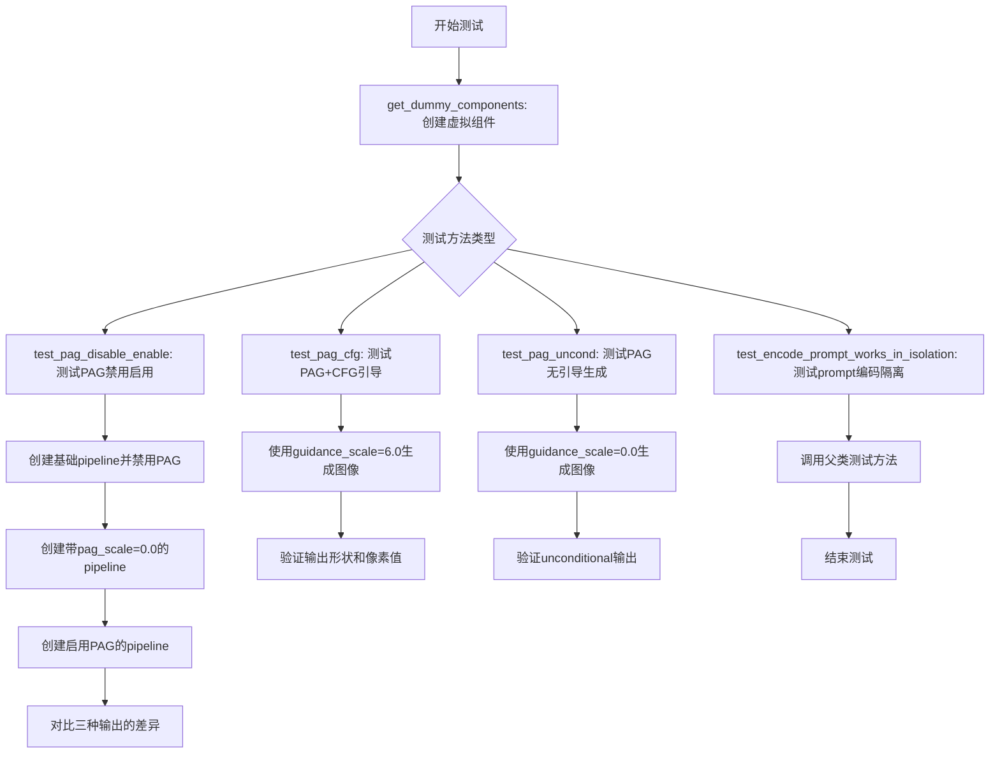
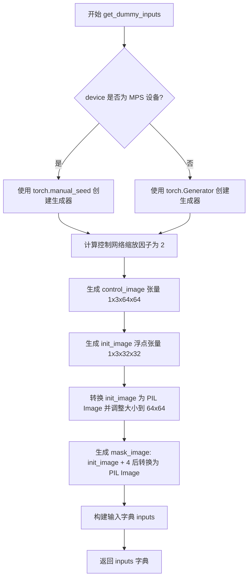
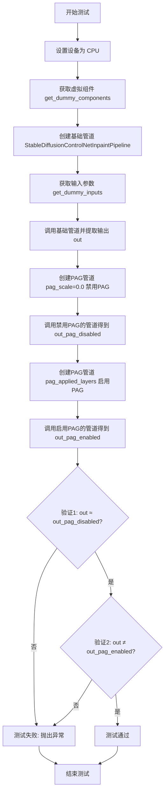
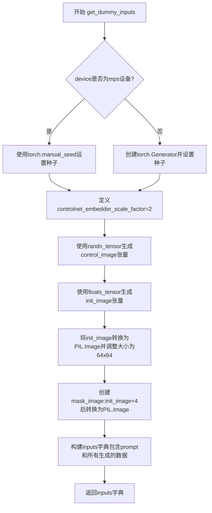
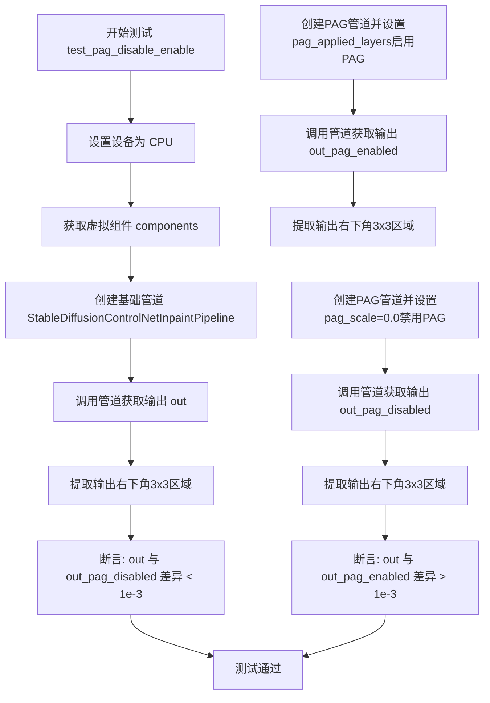
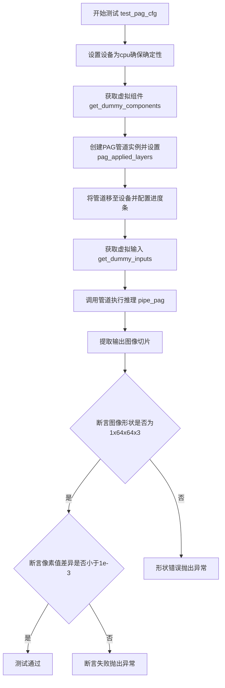
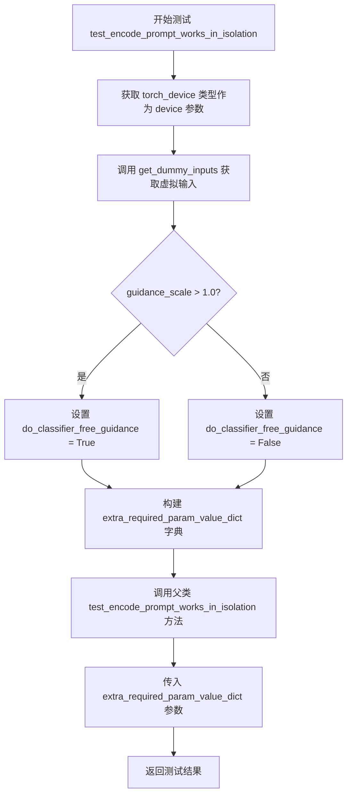

# `diffusers\tests\pipelines\pag\test_pag_controlnet_sd_inpaint.py` 详细设计文档

这是一个针对StableDiffusionControlNetPAGInpaintPipeline的单元测试类，用于测试ControlNet引导的图像修复功能，支持PAG（Progressive Adversarial Guidance）渐进对抗引导技术。该测试类通过多个测试方法验证PAG功能的启用/禁用、CFG引导和 unconditional 生成等核心行为。

## 整体流程



## 类结构

```
unittest.TestCase (Python标准测试基类)
└── StableDiffusionControlNetPAGInpaintPipelineFastTests (自定义测试类)
    ├── PipelineLatentTesterMixin (latent测试混入)
    ├── PipelineKarrasSchedulerTesterMixin (Karras调度器测试混入)
    └── PipelineTesterMixin (通用pipeline测试混入)
```

## 全局变量及字段


### `enable_full_determinism`
    
启用完全确定性以保证测试可复现性（全局函数调用）

类型：`函数调用`
    


### `StableDiffusionControlNetPAGInpaintPipelineFastTests.pipeline_class`
    
Pipeline类引用 StableDiffusionControlNetPAGInpaintPipeline

类型：`类对象`
    


### `StableDiffusionControlNetPAGInpaintPipelineFastTests.params`
    
文本引导图像修复参数集合

类型：`frozenset`
    


### `StableDiffusionControlNetPAGInpaintPipelineFastTests.batch_params`
    
批量图像修复参数集合

类型：`frozenset`
    


### `StableDiffusionControlNetPAGInpaintPipelineFastTests.image_params`
    
仅测试control_image的图像参数

类型：`frozenset`
    


### `StableDiffusionControlNetPAGInpaintPipelineFastTests.image_latents_params`
    
图像潜在向量参数集合

类型：`frozenset`
    


### `StableDiffusionControlNetPAGInpaintPipelineFastTests.get_dummy_components`
    
创建虚拟模型组件用于测试，无参数，返回类型dict，包含unet、controlnet、scheduler、vae、text_encoder、tokenizer等虚拟组件

类型：`方法`
    


### `StableDiffusionControlNetPAGInpaintPipelineFastTests.get_dummy_inputs`
    
生成虚拟输入数据包括prompt、图像、mask等，参数device(str)和seed(int)，返回类型dict，包含prompt、generator、num_inference_steps、guidance_scale、pag_scale、output_type、image、mask_image、control_image等键

类型：`方法`
    


### `StableDiffusionControlNetPAGInpaintPipelineFastTests.test_pag_disable_enable`
    
测试PAG功能的禁用和启用行为，无参数，返回类型None，执行断言验证PAG禁用和启用时的输出差异

类型：`方法`
    


### `StableDiffusionControlNetPAGInpaintPipelineFastTests.test_pag_cfg`
    
测试PAG结合CFG引导的图像生成，无参数，返回类型None，执行断言验证输出图像shape和像素值

类型：`方法`
    


### `StableDiffusionControlNetPAGInpaintPipelineFastTests.test_pag_uncond`
    
测试PAG在无引导时的生成效果，无参数，返回类型None，执行断言验证无guidance时的输出

类型：`方法`
    


### `StableDiffusionControlNetPAGInpaintPipelineFastTests.test_encode_prompt_works_in_isolation`
    
测试prompt编码的隔离性，无直接参数（继承自父类），返回类型继承自父类方法返回值，执行断言验证prompt编码的独立性

类型：`方法`
    
    

## 全局函数及方法


### `StableDiffusionControlNetPAGInpaintPipelineFastTests.get_dummy_components`

创建虚拟的UNet、ControlNet、Scheduler、VAE、TextEncoder、Tokenizer等组件，用于测试Stable Diffusion ControlNet PAG Inpaint Pipeline。

参数：

- `self`：`self`，调用该方法的类实例本身

返回值：`dict`，包含虚拟组件的字典，包括unet、controlnet、scheduler、vae、text_encoder、tokenizer、safety_checker、feature_extractor和image_encoder

#### 流程图

```mermaid
flowchart TD
    A[开始] --> B[设置随机种子 torch.manual_seed(0)]
    B --> C[创建UNet2DConditionModel]
    C --> D[创建ControlNetModel]
    D --> E[创建DDIMScheduler]
    E --> F[创建AutoencoderKL]
    F --> G[创建CLIPTextConfig和CLIPTextModel]
    G --> H[创建CLIPTokenizer]
    H --> I[组装components字典]
    I --> J[返回components字典]
```

#### 带注释源码

```python
def get_dummy_components(self):
    # 固定随机种子以确保测试的可重复性
    torch.manual_seed(0)
    # 创建虚拟的UNet2DConditionModel组件
    # 用于条件图像生成的去噪网络
    unet = UNet2DConditionModel(
        block_out_channels=(32, 64),      # 块的输出通道数
        layers_per_block=2,               # 每个块的层数
        sample_size=32,                   # 样本尺寸
        in_channels=9,                    # 输入通道数 (4 latents + 4 time embeddings + 1 mask)
        out_channels=4,                   # 输出通道数
        down_block_types=("DownBlock2D", "CrossAttnDownBlock2D"),  # 下采样块类型
        up_block_types=("CrossAttnUpBlock2D", "UpBlock2D"),        # 上采样块类型
        cross_attention_dim=32,           # 交叉注意力维度
    )
    
    # 固定随机种子
    torch.manual_seed(0)
    # 创建虚拟的ControlNetModel组件
    # 用于从控制图像提取条件的网络
    controlnet = ControlNetModel(
        block_out_channels=(32, 64),      # 块的输出通道数
        layers_per_block=2,               # 每个块的层数
        in_channels=4,                    # 输入通道数 (RGB图像 + mask)
        down_block_types=("DownBlock2D", "CrossAttnDownBlock2D"),  # 下采样块类型
        cross_attention_dim=32,           # 交叉注意力维度
        conditioning_embedding_out_channels=(16, 32),  # 条件嵌入输出通道
    )
    
    # 固定随机种子
    torch.manual_seed(0)
    # 创建虚拟的DDIMScheduler组件
    # 用于扩散模型的调度器
    scheduler = DDIMScheduler(
        beta_start=0.00085,               # Beta起始值
        beta_end=0.012,                   # Beta结束值
        beta_schedule="scaled_linear",    # Beta调度策略
        clip_sample=False,                # 是否裁剪采样
        set_alpha_to_one=False,           # 是否设置alpha为1
    )
    
    # 固定随机种子
    torch.manual_seed(0)
    # 创建虚拟的AutoencoderKL组件
    # 用于变分自编码器，将图像编码到潜在空间
    vae = AutoencoderKL(
        block_out_channels=[32, 64],      # 块的输出通道数
        in_channels=3,                   # 输入通道数 (RGB)
        out_channels=3,                   # 输出通道数 (RGB)
        down_block_types=["DownEncoderBlock2D", "DownEncoderBlock2D"],  # 下采样编码块类型
        up_block_types=["UpDecoderBlock2D", "UpDecoderBlock2D"],        # 上采样解码块类型
        latent_channels=4,                # 潜在空间通道数
    )
    
    # 固定随机种子
    torch.manual_seed(0)
    # 创建虚拟的CLIPTextConfig配置
    # 用于文本编码器的配置
    text_encoder_config = CLIPTextConfig(
        bos_token_id=0,                   # 句子开始token ID
        eos_token_id=2,                   # 句子结束token ID
        hidden_size=32,                   # 隐藏层大小
        intermediate_size=37,              # 中间层大小
        layer_norm_eps=1e-05,             # LayerNorm epsilon
        num_attention_heads=4,            # 注意力头数
        num_hidden_layers=5,              # 隐藏层数量
        pad_token_id=1,                   # 填充token ID
        vocab_size=1000,                  # 词汇表大小
    )
    # 创建虚拟的CLIPTextModel组件
    # 用于将文本编码为嵌入向量
    text_encoder = CLIPTextModel(text_encoder_config)
    
    # 从预训练模型加载虚拟的CLIPTokenizer
    # 用于将文本分词为token
    tokenizer = CLIPTokenizer.from_pretrained("hf-internal-testing/tiny-random-clip")
    
    # 组装所有虚拟组件到字典中
    components = {
        "unet": unet,                      # UNet条件扩散模型
        "controlnet": controlnet,          # ControlNet控制模型
        "scheduler": scheduler,            # DDIM调度器
        "vae": vae,                        # 变分自编码器
        "text_encoder": text_encoder,      # 文本编码器
        "tokenizer": tokenizer,            # 分词器
        "safety_checker": None,            # 安全检查器 (测试中不使用)
        "feature_extractor": None,         # 特征提取器 (测试中不使用)
        "image_encoder": None,             # 图像编码器 (测试中不使用)
    }
    # 返回包含所有虚拟组件的字典
    return components
```


### `StableDiffusionControlNetPAGInpaintPipelineFastTests.get_dummy_inputs`

该方法用于生成测试用的虚拟输入数据，包括 prompt 文本、随机数生成器、图像、mask 图像和 control 图像等，模拟 Stable Diffusion ControlNet 图像修复管道的输入参数。

参数：

- `self`：实例本身，包含类属性信息
- `device`：`str` 或 `torch.device`，目标设备，用于创建随机数生成器和张量
- `seed`：`int`，随机种子，默认为 0，用于确保测试的可重复性

返回值：`dict`，包含以下键值对：

- `prompt`：`str`，生成图像的文本描述
- `generator`：`torch.Generator`，随机数生成器
- `num_inference_steps`：`int`，推理步数
- `guidance_scale`：`float`，分类器自由引导比例
- `pag_scale`：`float`，PAG（Progressive Attention Guidance）缩放比例
- `output_type`：`str`，输出类型（numpy 数组）
- `image`：`PIL.Image.Image`，原始图像
- `mask_image`：`PIL.Image.Image`，掩码图像
- `control_image`：`torch.Tensor`，控制网络引导图像

#### 流程图



#### 带注释源码

```python
def get_dummy_inputs(self, device, seed=0):
    """
    生成测试用的虚拟输入参数，用于 Stable Diffusion ControlNet 图像修复管道测试。
    
    参数:
        device: 目标设备 (如 'cpu', 'cuda', 'mps')
        seed: 随机种子，确保测试可重复性
    
    返回:
        包含所有管道调用所需参数的字典
    """
    
    # 根据设备类型选择合适的随机数生成器创建方式
    # MPS 设备需要特殊处理，使用 torch.manual_seed 而非 torch.Generator
    if str(device).startswith("mps"):
        generator = torch.manual_seed(seed)
    else:
        generator = torch.Generator(device=device).manual_seed(seed)

    # 控制网络嵌入器的缩放因子，用于确定控制图像的尺寸
    controlnet_embedder_scale_factor = 2
    
    # 生成控制网络的引导图像 (1, 3, 64, 64)
    # 使用随机张量并指定生成器和设备
    control_image = randn_tensor(
        (1, 3, 32 * controlnet_embedder_scale_factor, 32 * controlnet_embedder_scale_factor),
        generator=generator,
        device=torch.device(device),
    )
    
    # 生成初始图像张量 (1, 3, 32, 32)
    # 使用 floats_tensor 生成浮点型随机张量
    init_image = floats_tensor((1, 3, 32, 32), rng=random.Random(seed)).to(device)
    
    # 将张量从 (B, C, H, W) 转换为 (B, H, W, C) 格式
    # 并取第一个样本，形状变为 (32, 32, 3)
    init_image = init_image.cpu().permute(0, 2, 3, 1)[0]

    # 将 numpy 数组转换为 PIL Image
    # 1. 将浮点值转换为 uint8
    # 2. 转换为 RGB 格式
    # 3. 调整大小到 64x64
    image = Image.fromarray(np.uint8(init_image)).convert("RGB").resize((64, 64))
    
    # 生成掩码图像：在原始图像基础上加 4，作为区分度
    mask_image = Image.fromarray(np.uint8(init_image + 4)).convert("RGB").resize((64, 64))

    # 构建完整的输入参数字典
    inputs = {
        "prompt": "A painting of a squirrel eating a burger",  # 测试用提示词
        "generator": generator,                                  # 随机数生成器
        "num_inference_steps": 2,                               # 推理步数（较少以加快测试）
        "guidance_scale": 6.0,                                  # CFG 引导强度
        "pag_scale": 3.0,                                       # PAG 缩放因子
        "output_type": "np",                                   # 输出为 numpy 数组
        "image": image,                                         # 原始输入图像
        "mask_image": mask_image,                               # 修复掩码
        "control_image": control_image,                         # 控制网络引导图像
    }

    return inputs
```


### `test_pag_disable_enable`

验证PAG（Progressive Attention Guidance）功能在禁用时输出与基础pipeline一致，启用时输出与基础pipeline不同，确保PAG机制正常工作。

参数：

- `self`：`StableDiffusionControlNetPAGInpaintPipelineFastTests`，调用该方法的类实例本身

返回值：`None`，该方法为测试方法，不返回任何值

#### 流程图



#### 带注释源码

```python
def test_pag_disable_enable(self):
    """验证PAG禁用时输出与base pipeline一致，启用时输出不同"""
    
    # 步骤1: 设置设备为CPU，确保确定性输出
    # device: 字符串，指定运行设备为cpu以确保torch.Generator的确定性
    device = "cpu"
    
    # 步骤2: 获取虚拟组件
    # components: 字典，包含unet, controlnet, scheduler, vae, text_encoder, tokenizer等
    components = self.get_dummy_components()

    # ============================================================
    # 步骤3: 创建并测试基础管道（不带PAG功能）
    # ============================================================
    
    # pipe_sd: StableDiffusionControlNetInpaintPipeline，基础图像修复管道
    pipe_sd = StableDiffusionControlNetInpaintPipeline(**components)
    pipe_sd = pipe_sd.to(device)
    pipe_sd.set_progress_bar_config(disable=None)

    # inputs: 字典，包含prompt, generator, num_inference_steps, guidance_scale等
    inputs = self.get_dummy_inputs(device)
    
    # 删除pag_scale参数，因为基础管道不支持该参数
    del inputs["pag_scale"]
    
    # 断言验证：基础管道不应包含pag_scale参数
    # 使用inspect模块检查__call__方法的签名
    assert "pag_scale" not in inspect.signature(pipe_sd.__call__).parameters, (
        f"`pag_scale` should not be a call parameter of the base pipeline {pipe_sd.__calss__.__name__}."
    )
    
    # 调用基础管道并提取最后3x3像素的最后一个通道
    # out: numpy数组，形状为(3, 3)，基础管道输出
    out = pipe_sd(**inputs).images[0, -3:, -3:, -1]

    # ============================================================
    # 步骤4: 创建并测试PAG禁用管道 (pag_scale=0.0)
    # ============================================================
    
    # pipe_pag: StableDiffusionControlNetPAGInpaintPipeline，PAG图像修复管道
    pipe_pag = self.pipeline_class(**components)
    pipe_pag = pipe_pag.to(device)
    pipe_pag.set_progress_bar_config(disable=None)

    inputs = self.get_dummy_inputs(device)
    
    # 设置pag_scale=0.0以禁用PAG功能
    inputs["pag_scale"] = 0.0
    
    # 获取禁用PAG时的输出
    # out_pag_disabled: numpy数组，形状为(3, 3)，PAG禁用时的输出
    out_pag_disabled = pipe_pag(**inputs).images[0, -3:, -3:, -1]

    # ============================================================
    # 步骤5: 创建并测试PAG启用管道
    # ============================================================
    
    # 配置PAG应用层为mid, up, down
    pipe_pag = self.pipeline_class(**components, pag_applied_layers=["mid", "up", "down"])
    pipe_pag = pipe_pag.to(device)
    pipe_pag.set_progress_bar_config(disable=None)

    inputs = self.get_dummy_inputs(device)
    
    # 默认pag_scale=3.0（从get_dummy_inputs获取），启用PAG
    # out_pag_enabled: numpy数组，形状为(3, 3)，PAG启用时的输出
    out_pag_enabled = pipe_pag(**inputs).images[0, -3:, -3:, -1]

    # ============================================================
    # 步骤6: 验证结果
    # ============================================================
    
    # 验证1: PAG禁用时输出应与基础管道一致
    # 使用最大绝对误差判断，阈值设为1e-3
    assert np.abs(out.flatten() - out_pag_disabled.flatten()).max() < 1e-3
    
    # 验证2: PAG启用时输出应与基础管道不同
    assert np.abs(out.flatten() - out_pag_enabled.flatten()).max() > 1e-3
```


### `StableDiffusionControlNetPAGInpaintPipelineFastTests.test_pag_cfg`

验证PAG（Perturbed Attention Guidance）+CFG（Classifier-Free Guidance）引导生成的图像形状和像素值符合预期

参数：

-  `self`：`self`，测试类实例本身

返回值：`None`，无返回值（测试方法，使用assert断言验证）

#### 流程图

```mermaid
flowchart TD
    A[开始测试] --> B[设置设备为CPU确保确定性]
    B --> C[获取虚拟组件配置]
    C --> D[创建PAG管道实例<br/>pag_applied_layers=['mid', 'up', 'down']]
    D --> E[将管道移至设备并设置进度条]
    E --> F[获取虚拟输入数据]
    F --> G[调用管道生成图像]
    G --> H[提取图像右下角3x3像素块]
    H --> I{图像形状是否为<br/>(1, 64, 64, 3)?}
    I -->|是| J[定义预期像素值切片]
    I -->|否| K[断言失败抛出异常]
    J --> L[计算实际与预期像素差值最大值]
    L --> M{差值是否 < 1e-3?}
    M -->|是| N[测试通过]
    M -->|否| O[断言失败抛出异常]
```

#### 带注释源码

```python
def test_pag_cfg(self):
    """验证PAG+CFG引导生成的图像形状和像素值符合预期"""
    
    # 设置设备为CPU，确保torch.Generator的确定性
    device = "cpu"
    
    # 获取用于测试的虚拟（dummy）组件
    # 包括：UNet、ControlNet、Scheduler、VAE、TextEncoder、Tokenizer等
    components = self.get_dummy_components()

    # 创建PAG类型的Stable Diffusion ControlNet Inpaint Pipeline实例
    # pag_applied_layers指定PAG应用的层：mid(中间层)、up(上采样层)、down(下采样层)
    pipe_pag = self.pipeline_class(**components, pag_applied_layers=["mid", "up", "down"])
    
    # 将管道移至指定设备（CPU）
    pipe_pag = pipe_pag.to(device)
    
    # 设置进度条配置，disable=None表示不禁用进度条
    pipe_pag.set_progress_bar_config(disable=None)

    # 获取虚拟输入数据
    # 包含：prompt, generator, num_inference_steps, guidance_scale, 
    # pag_scale, output_type, image, mask_image, control_image
    inputs = self.get_dummy_inputs(device)
    
    # 调用管道进行推理，生成图像
    image = pipe_pag(**inputs).images
    
    # 提取图像的一个切片：从第一张图像的右下角取3x3像素块
    # image shape: (batch, height, width, channels)
    image_slice = image[0, -3:, -3:, -1]

    # 断言验证输出图像的形状是否为(1, 64, 64, 3)
    # 1: batch size, 64x64: 图像宽高, 3: RGB通道
    assert image.shape == (
        1,
        64,
        64,
        3,
    ), f"the shape of the output image should be (1, 64, 64, 3) but got {image.shape}"
    
    # 定义预期像素值切片（来自已知正确的输出）
    expected_slice = np.array(
        [0.7488756, 0.61194265, 0.53382546, 0.5993959, 0.6193306, 0.56880975, 0.41277143, 0.5050145, 0.49376273]
    )

    # 计算实际输出与预期输出的最大差值
    max_diff = np.abs(image_slice.flatten() - expected_slice).max()
    
    # 断言验证像素值差异是否在可接受范围内（< 1e-3）
    assert max_diff < 1e-3, f"output is different from expected, {image_slice.flatten()}"
```


### `StableDiffusionControlNetPAGInpaintPipelineFastTests.test_pag_uncond`

验证PAG（Probabilistic Adaptive Guidance）在guidance_scale=0时的无条件生成功能，确保管道能够在没有文本引导的情况下正确运行并输出预期形状和像素值的图像。

参数：

- `self`：`StableDiffusionControlNetPAGInpaintPipelineFastTests`，隐式参数，测试类实例本身

返回值：`None`，无返回值，该方法为单元测试方法，通过断言验证输出正确性

#### 流程图

```mermaid
flowchart TD
    A[开始 test_pag_uncond] --> B[设置 device = 'cpu']
    B --> C[获取虚拟组件 get_dummy_components]
    C --> D[创建 PAG 管道并设置 pag_applied_layers]
    D --> E[获取虚拟输入 get_dummy_inputs]
    E --> F[设置 guidance_scale = 0.0 实现无条件生成]
    F --> G[调用管道生成图像 pipe_pag(inputs)]
    G --> H[断言图像形状为 (1, 64, 64, 3)]
    H --> I[定义期望像素值数组 expected_slice]
    I --> J[计算实际输出与期望的最大差异]
    J --> K{最大差异 < 1e-3?}
    K -->|是| L[测试通过]
    K -->|否| M[抛出断言错误]
    L --> N[结束]
    M --> N
```

#### 带注释源码

```python
def test_pag_uncond(self):
    """
    验证PAG在guidance_scale=0时的unconditional生成
    """
    # 设置设备为cpu以确保确定性，避免不同设备的torch.Generator行为差异
    device = "cpu"  # ensure determinism for the device-dependent torch.Generator
    
    # 获取测试所需的虚拟组件（UNet, ControlNet, VAE, Scheduler, TextEncoder等）
    components = self.get_dummy_components()

    # 创建PAG修复的ControlNet inpaint管道，并指定PAG应用的层
    # pag_applied_layers指定了在哪些层应用PAG技术（mid/up/down块）
    pipe_pag = self.pipeline_class(**components, pag_applied_layers=["mid", "up", "down"])
    pipe_pag = pipe_pag.to(device)  # 将管道移至指定设备
    pipe_pag.set_progress_bar_config(disable=None)  # 配置进度条

    # 获取虚拟输入数据（包含prompt、图像、mask等）
    inputs = self.get_dummy_inputs(device)
    
    # 设置guidance_scale为0.0，实现无条件生成（unconditional generation）
    # 此时模型不会受到文本prompt的引导，仅基于噪声和图像特征生成
    inputs["guidance_scale"] = 0.0
    
    # 调用管道进行推理生成图像
    image = pipe_pag(**inputs).images
    # 提取图像右下角3x3区域的像素值用于验证
    image_slice = image[0, -3:, -3:, -1]

    # 断言输出图像形状符合预期：(batch=1, height=64, width=64, channels=3)
    assert image.shape == (
        1,
        64,
        64,
        3,
    ), f"the shape of the output image should be (1, 64, 64, 3) but got {image.shape}"
    
    # 定义期望的像素值数组（针对无条件生成场景的预期输出）
    expected_slice = np.array(
        [0.7410303, 0.5989337, 0.530866, 0.60571927, 0.6162597, 0.5719856, 0.4187478, 0.5101238, 0.4978468]
    )

    # 计算实际输出与期望输出之间的最大差异
    max_diff = np.abs(image_slice.flatten() - expected_slice).max()
    
    # 断言最大差异在允许范围内（小于1e-3），确保输出的正确性
    assert max_diff < 1e-3, f"output is different from expected, {image_slice.flatten()}"
```


### `StableDiffusionControlNetPAGInpaintPipelineFastTests.test_encode_prompt_works_in_isolation`

该方法用于测试prompt编码功能在特定参数配置下的隔离工作，通过构造包含设备类型和分类器自由引导标志的字典参数，调用父类的相同测试方法来验证编码器在不同配置下的正确性和独立性。

参数：

- `self`：`StableDiffusionControlNetPAGInpaintPipelineFastTests` 类型，当前测试类实例的隐式引用
- `extra_required_param_value_dict`：未在当前方法签名中显式声明，但通过代码逻辑可知是一个 `Dict[str, Any]` 类型，包含传递给父类测试方法的额外参数，键为 "device"（设备类型字符串）和 "do_classifier_free_guidance"（布尔值，表示是否启用无分类器引导）

返回值：`Any` 类型，返回父类 `test_encode_prompt_works_in_isolation` 方法的执行结果，通常是测试断言或 `None`

#### 流程图

```mermaid
flowchart TD
    A[开始执行 test_encode_prompt_works_in_isolation] --> B[获取 torch_device 对应的设备类型]
    B --> C[调用 get_dummy_inputs 获取虚拟输入参数]
    C --> D{guidance_scale 是否大于 1.0}
    D -->|是| E[do_classifier_free_guidance = True]
    D -->|否| F[do_classifier_free_guidance = False]
    E --> G[构建 extra_required_param_value_dict 字典]
    F --> G
    G --> H[调用父类方法 super().test_encode_prompt_works_in_isolation 传递参数字典]
    H --> I[返回父类方法的执行结果]
    I --> J[结束]
```

#### 带注释源码

```python
def test_encode_prompt_works_in_isolation(self):
    """
    测试 prompt 编码在特定参数下的隔离工作
    
    该测试方法通过构造额外的必需参数字典，验证编码器功能
    在不同设备配置和引导策略下的独立性和正确性
    """
    # 构建传递给父类测试方法的额外参数字典
    extra_required_param_value_dict = {
        # 获取当前测试设备的类型字符串（如 'cpu', 'cuda' 等）
        "device": torch.device(torch_device).type,
        # 根据虚拟输入的 guidance_scale 判断是否启用无分类器引导
        # guidance_scale > 1.0 时启用 CFG，否则禁用
        "do_classifier_free_guidance": self.get_dummy_inputs(device=torch_device).get("guidance_scale", 1.0) > 1.0,
    }
    # 调用父类（PipelineTesterMixin）的同名测试方法
    # 传入构造的参数字典进行实际的编码隔离性测试
    return super().test_encode_prompt_works_in_isolation(extra_required_param_value_dict)
```


### `StableDiffusionControlNetPAGInpaintPipelineFastTests.get_dummy_components`

创建虚拟模型组件用于测试，初始化并返回一个包含 UNet、ControlNet、Scheduler、VAE、TextEncoder、Tokenizer 等模型组件的字典，用于 Stable Diffusion ControlNet PAG Inpaint Pipeline 的单元测试。

参数：

- 该方法无参数（`self` 为隐含参数）

返回值：`Dict[str, Any]`，返回一个字典，包含用于测试的所有虚拟模型组件，包括 unet、controlnet、scheduler、vae、text_encoder、tokenizer、safety_checker、feature_extractor 和 image_encoder。

#### 流程图

```mermaid
flowchart TD
    A[开始 get_dummy_components] --> B[设置随机种子 torch.manual_seed(0)]
    B --> C[创建 UNet2DConditionModel 虚拟组件]
    C --> D[设置随机种子 torch.manual_seed(0)]
    D --> E[创建 ControlNetModel 虚拟组件]
    E --> F[设置随机种子 torch.manual_seed(0)]
    F --> G[创建 DDIMScheduler 虚拟组件]
    G --> H[设置随机种子 torch.manual_seed(0)]
    H --> I[创建 AutoencoderKL 虚拟组件]
    I --> J[设置随机种子 torch.manual_seed(0)]
    J --> K[创建 CLIPTextConfig 配置]
    K --> L[创建 CLIPTextModel 虚拟组件]
    L --> M[创建 CLIPTokenizer 虚拟组件]
    M --> N[构建 components 字典]
    N --> O[返回 components 字典]
    O --> P[结束]
```

#### 带注释源码

```python
def get_dummy_components(self):
    # 使用固定的随机种子确保测试的可重复性
    torch.manual_seed(0)
    
    # 创建虚拟的 UNet2DConditionModel 组件
    # 用于图像生成的去噪过程
    unet = UNet2DConditionModel(
        block_out_channels=(32, 64),          # 块输出通道数
        layers_per_block=2,                   # 每个块的层数
        sample_size=32,                       # 样本尺寸
        in_channels=9,                       # 输入通道数（4图像+4mask+1潜在）
        out_channels=4,                       # 输出通道数
        down_block_types=("DownBlock2D", "CrossAttnDownBlock2D"),  # 下采样块类型
        up_block_types=("CrossAttnUpBlock2D", "UpBlock2D"),         # 上采样块类型
        cross_attention_dim=32,               # 交叉注意力维度
    )
    
    # 重新设置随机种子确保组件一致性
    torch.manual_seed(0)
    
    # 创建虚拟的 ControlNetModel 组件
    # 用于控制图像生成过程
    controlnet = ControlNetModel(
        block_out_channels=(32, 64),          # 块输出通道数
        layers_per_block=2,                   # 每个块的层数
        in_channels=4,                       # 输入通道数（条件图像）
        down_block_types=("DownBlock2D", "CrossAttnDownBlock2D"),  # 下采样块类型
        cross_attention_dim=32,               # 交叉注意力维度
        conditioning_embedding_out_channels=(16, 32),  # 条件嵌入输出通道
    )
    
    # 重新设置随机种子确保调度器一致性
    torch.manual_seed(0)
    
    # 创建虚拟的 DDIMScheduler 组件
    # 用于扩散模型的噪声调度
    scheduler = DDIMScheduler(
        beta_start=0.00085,                   # beta 起始值
        beta_end=0.012,                       # beta 结束值
        beta_schedule="scaled_linear",        # beta 调度方式
        clip_sample=False,                    # 是否裁剪采样
        set_alpha_to_one=False,              # 是否设置 alpha 为 1
    )
    
    # 重新设置随机种子确保 VAE 一致性
    torch.manual_seed(0)
    
    # 创建虚拟的 AutoencoderKL 组件
    # 用于图像的编码和解码
    vae = AutoencoderKL(
        block_out_channels=[32, 64],          # 块输出通道数
        in_channels=3,                       # 输入通道数（RGB）
        out_channels=3,                      # 输出通道数
        down_block_types=["DownEncoderBlock2D", "DownEncoderBlock2D"],  # 下采样编码块
        up_block_types=["UpDecoderBlock2D", "UpDecoderBlock2D"],         # 上采样解码块
        latent_channels=4,                   # 潜在空间通道数
    )
    
    # 重新设置随机种子确保文本编码器一致性
    torch.manual_seed(0)
    
    # 创建虚拟的 CLIPTextConfig 配置
    # 用于文本编码器的配置
    text_encoder_config = CLIPTextConfig(
        bos_token_id=0,                       # 句子开始 token ID
        eos_token_id=2,                       # 句子结束 token ID
        hidden_size=32,                      # 隐藏层大小
        intermediate_size=37,                # 中间层大小
        layer_norm_eps=1e-05,                # 层归一化 epsilon
        num_attention_heads=4,               # 注意力头数
        num_hidden_layers=5,                 # 隐藏层数量
        pad_token_id=1,                      # 填充 token ID
        vocab_size=1000,                     # 词汇表大小
    )
    
    # 创建虚拟的 CLIPTextModel 组件
    # 用于将文本编码为向量表示
    text_encoder = CLIPTextModel(text_encoder_config)
    
    # 创建虚拟的 CLIPTokenizer 组件
    # 用于将文本分词为 token
    tokenizer = CLIPTokenizer.from_pretrained("hf-internal-testing/tiny-random-clip")

    # 构建组件字典，包含所有虚拟模型组件
    components = {
        "unet": unet,                         # UNet2DConditionModel 实例
        "controlnet": controlnet,             # ControlNetModel 实例
        "scheduler": scheduler,               # DDIMScheduler 实例
        "vae": vae,                           # AutoencoderKL 实例
        "text_encoder": text_encoder,         # CLIPTextModel 实例
        "tokenizer": tokenizer,               # CLIPTokenizer 实例
        "safety_checker": None,               # 安全检查器（测试中设为 None）
        "feature_extractor": None,            # 特征提取器（测试中设为 None）
        "image_encoder": None,                # 图像编码器（测试中设为 None）
    }
    
    # 返回包含所有虚拟组件的字典
    return components
```


### `StableDiffusionControlNetPAGInpaintPipelineFastTests.get_dummy_inputs`

该方法用于生成虚拟（dummy）输入数据，模拟 Stable Diffusion ControlNet PAG Inpaint Pipeline 所需的输入参数，包括提示词、引导图像、蒙版图像等，用于单元测试场景。

参数：

- `self`：隐式参数，测试类实例本身
- `device`：`str` 或 `torch.device`，指定生成张量所在的设备（如 "cpu"、"cuda"）
- `seed`：`int`，随机种子，默认为 0，用于确保测试的可重复性

返回值：`Dict[str, Any]`，返回包含以下键的字典：
- `prompt`（str）：文本提示词
- `generator`（torch.Generator）：PyTorch 随机数生成器
- `num_inference_steps`（int）：推理步数
- `guidance_scale`（float）：分类器自由引导比例
- `pag_scale`（float）：PAG（Progressive Adversarial Guidance）引导比例
- `output_type`（str）：输出类型
- `image`（PIL.Image）：输入图像
- `mask_image`（PIL.Image）：蒙版图像
- `control_image`（torch.Tensor）：ControlNet 控制图像

#### 流程图



#### 带注释源码

```python
def get_dummy_inputs(self, device, seed=0):
    """
    生成用于测试的虚拟输入数据。
    
    参数:
        device: 目标设备字符串或torch.device对象
        seed: 随机种子,默认值为0
    
    返回:
        包含所有pipeline输入参数的字典
    """
    # 根据设备类型选择随机数生成方式
    # MPS设备需要特殊处理,直接使用torch.manual_seed
    if str(device).startswith("mps"):
        generator = torch.manual_seed(seed)
    else:
        # 其他设备创建PyTorch Generator对象并设置种子
        generator = torch.Generator(device=device).manual_seed(seed)

    # ControlNet嵌入器的缩放因子,用于确定控制图像的尺寸
    controlnet_embedder_scale_factor = 2
    
    # 生成随机控制图像张量,形状为 (1, 3, 64, 64)
    # 使用指定的generator确保可重复性
    control_image = randn_tensor(
        (1, 3, 32 * controlnet_embedder_scale_factor, 32 * controlnet_embedder_scale_factor),
        generator=generator,
        device=torch.device(device),
    )
    
    # 生成初始图像张量,形状为 (1, 3, 32, 32)
    init_image = floats_tensor((1, 3, 32, 32), rng=random.Random(seed)).to(device)
    
    # 将张量从 CHW 格式转换为 HWC 格式,并提取第一张图像
    init_image = init_image.cpu().permute(0, 2, 3, 1)[0]

    # 将numpy数组转换为PIL图像,调整为64x64大小
    # 原始init_image值加上4作为mask图像,创造视觉差异
    image = Image.fromarray(np.uint8(init_image)).convert("RGB").resize((64, 64))
    mask_image = Image.fromarray(np.uint8(init_image + 4)).convert("RGB").resize((64, 64))

    # 构建完整的输入参数字典
    inputs = {
        "prompt": "A painting of a squirrel eating a burger",  # 文本提示词
        "generator": generator,  # 随机数生成器,确保输出可重复
        "num_inference_steps": 2,  # 推理步数,较少步数用于快速测试
        "guidance_scale": 6.0,  # CFG引导强度
        "pag_scale": 3.0,  # PAG引导强度,测试时使用
        "output_type": "np",  # 输出为numpy数组
        "image": image,  # 待修复的输入图像
        "mask_image": mask_image,  # 修复区域的蒙版
        "control_image": control_image,  # ControlNet控制图像
    }

    return inputs
```


### `StableDiffusionControlNetPAGInpaintPipelineFastTests.test_pag_disable_enable`

该测试方法用于验证 StableDiffusionControlNetPAGInpaintPipeline 中 PAG（Progressive Attention Guidance）功能的禁用和启用行为，确保当 PAG 被禁用时（pag_scale=0.0）输出与基础管道相同，而启用时输出与基础管道不同。

参数：
- 该方法无显式参数，通过 `self.get_dummy_components()` 和 `self.get_dummy_inputs(device)` 获取所需数据

返回值：`None`，该方法为测试用例，通过断言验证 PAG 功能行为

#### 流程图



#### 带注释源码

```python
def test_pag_disable_enable(self):
    """
    测试 PAG 功能的禁用和启用行为
    - 验证禁用 PAG (pag_scale=0.0) 时输出与基础管道一致
    - 验证启用 PAG 时输出与基础管道不同
    """
    device = "cpu"  # 确保确定性，使用 CPU 设备
    
    # 步骤1: 获取虚拟组件（UNet, ControlNet, VAE, Scheduler, TextEncoder, Tokenizer 等）
    components = self.get_dummy_components()

    # ========== 基础管道测试（无 PAG）==========
    # 创建不带 PAG 功能的基础修复管道
    pipe_sd = StableDiffusionControlNetInpaintPipeline(**components)
    pipe_sd = pipe_sd.to(device)
    pipe_sd.set_progress_bar_config(disable=None)

    # 获取测试输入，删除 pag_scale 参数
    inputs = self.get_dummy_inputs(device)
    del inputs["pag_scale"]
    
    # 验证基础管道不应该有 pag_scale 参数
    assert "pag_scale" not in inspect.signature(pipe_sd.__call__).parameters, (
        f"`pag_scale` should not be a call parameter of the base pipeline {pipe_sd.__calss__.__name__}."
    )
    
    # 执行基础管道推理，提取输出图像右下角 3x3 区域
    out = pipe_sd(**inputs).images[0, -3:, -3:, -1]

    # ========== PAG 禁用测试 (pag_scale=0.0) ==========
    # 使用 PAG 管道但设置 pag_scale=0.0 禁用 PAG
    pipe_pag = self.pipeline_class(**components)
    pipe_pag = pipe_pag.to(device)
    pipe_pag.set_progress_bar_config(disable=None)

    inputs = self.get_dummy_inputs(device)
    inputs["pag_scale"] = 0.0  # 禁用 PAG
    
    # 执行推理，提取输出
    out_pag_disabled = pipe_pag(**inputs).images[0, -3:, -3:, -1]

    # ========== PAG 启用测试 ==========
    # 使用 PAG 管道并指定 pag_applied_layers 启用 PAG
    pipe_pag = self.pipeline_class(**components, pag_applied_layers=["mid", "up", "down"])
    pipe_pag = pipe_pag.to(device)
    pipe_pag.set_progress_bar_config(disable=None)

    inputs = self.get_dummy_inputs(device)
    # 使用默认 pag_scale (从 get_dummy_inputs 获取的 3.0)
    
    # 执行推理，提取输出
    out_pag_enabled = pipe_pag(**inputs).images[0, -3:, -3:, -1]

    # ========== 断言验证 ==========
    # 验证禁用 PAG 时输出应与基础管道相同（误差 < 1e-3）
    assert np.abs(out.flatten() - out_pag_disabled.flatten()).max() < 1e-3
    
    # 验证启用 PAG 时输出应与基础管道不同（误差 > 1e-3）
    assert np.abs(out.flatten() - out_pag_enabled.flatten()).max() > 1e-3
```


### `StableDiffusionControlNetPAGInpaintPipelineFastTests.test_pag_cfg`

该测试方法用于验证PAG（Progressive Ambiguity Guidance）结合CFG（Classifier-Free Guidance）引导的图像修复功能是否正常工作，通过创建管道、输入提示词和条件图像、执行推理，最后断言输出图像的形状和像素值是否符合预期。

#### 参数

无显式参数（测试方法使用类实例属性和内部方法获取所需数据）

#### 流程图



#### 带注释源码

```python
def test_pag_cfg(self):
    """测试PAG结合CFG引导的图像生成功能"""
    
    # 设置设备为cpu，确保torch.Generator的确定性
    device = "cpu"
    
    # 获取虚拟组件（UNet、ControlNet、Scheduler、VAE、TextEncoder等）
    components = self.get_dummy_components()
    
    # 创建带PAG功能的ControlNet图像修复管道，指定PAG应用的层
    # "mid"表示中间层，"up"表示上采样层，"down"表示下采样层
    pipe_pag = self.pipeline_class(**components, pag_applied_layers=["mid", "up", "down"])
    
    # 将管道移至指定设备
    pipe_pag = pipe_pag.to(device)
    
    # 配置进度条（disable=None表示启用进度条）
    pipe_pag.set_progress_bar_config(disable=None)
    
    # 获取虚拟输入数据，包括：
    # - prompt: 提示词"A painting of a squirrel eating a burger"
    # - generator: 随机数生成器
    # - num_inference_steps: 推理步数2步
    # - guidance_scale: CFG引导尺度6.0
    # - pag_scale: PAG引导尺度3.0
    # - output_type: 输出类型"np"
    # - image: 输入图像
    # - mask_image: 掩码图像
    # - control_image: ControlNet控制图像
    inputs = self.get_dummy_inputs(device)
    
    # 执行图像生成推理
    image = pipe_pag(**inputs).images
    
    # 提取输出图像右下角3x3区域的像素值
    image_slice = image[0, -3:, -3:, -1]
    
    # 断言输出图像形状为(1, 64, 64, 3)
    # 1: batch大小, 64x64: 图像分辨率, 3: RGB通道
    assert image.shape == (1, 64, 64, 3), \
        f"the shape of the output image should be (1, 64, 64, 3) but got {image.shape}"
    
    # 定义预期的像素值切片（用于回归测试）
    expected_slice = np.array(
        [0.7488756, 0.61194265, 0.53382546, 0.5993959, 0.6193306, 0.56880975, 0.41277143, 0.5050145, 0.49376273]
    )
    
    # 计算实际输出与预期输出的最大差异
    max_diff = np.abs(image_slice.flatten() - expected_slice).max()
    
    # 断言最大差异小于1e-3，确保输出确定性
    assert max_diff < 1e-3, f"output is different from expected, {image_slice.flatten()}"
```


### `StableDiffusionControlNetPAGInpaintPipelineFastTests.test_pag_uncond`

该测试方法用于验证 PAG（Prompt-Guided Attention Guidance）在无分类器自由引导（guidance_scale=0.0）时的生成效果，确保 PAG 机制在纯随机生成（无文本引导）情况下能够正常工作并产生预期输出。

参数：
- `self`：测试类实例本身，包含了测试所需的pipeline_class、params等类属性

返回值：`None`，该方法为单元测试方法，通过assert断言验证输出图像的正确性

#### 流程图

```mermaid
flowchart TD
    A[开始测试 test_pag_uncond] --> B[设置device为cpu确保确定性]
    B --> C[获取虚拟组件 get_dummy_components]
    C --> D[创建PAG pipeline并设置pag_applied_layers]
    D --> E[将pipeline移至device]
    E --> F[禁用进度条]
    F --> G[获取虚拟输入 get_dummy_inputs]
    G --> H[设置guidance_scale=0.0 关闭引导]
    H --> I[调用pipeline生成图像]
    I --> J[提取图像最后3x3区域]
    J --> K{断言图像形状是否为[1, 64, 64, 3]}
    K -->|是| L[定义预期像素值expected_slice]
    K -->|否| M[抛出形状错误异常]
    L --> N[计算max_diff]
    N --> O{断言max_diff < 1e-3}
    O -->|是| P[测试通过]
    O -->|否| Q[抛出输出不匹配异常]
```

#### 带注释源码

```python
def test_pag_uncond(self):
    """测试PAG在无引导时的生成效果
    
    该测试验证当guidance_scale=0.0时（即不使用分类器自由引导），
    PAG机制仍能正常工作并产生符合预期的输出
    """
    
    # 设置device为cpu，确保torch.Generator的确定性
    device = "cpu"
    
    # 获取用于测试的虚拟组件（UNet, ControlNet, VAE, Scheduler, TextEncoder等）
    components = self.get_dummy_components()
    
    # 创建PAG pipeline实例，指定PAG应用的层为["mid", "up", "down"]
    # 这些层将应用Prompt-Guided Attention Guidance
    pipe_pag = self.pipeline_class(**components, pag_applied_layers=["mid", "up", "down"])
    
    # 将pipeline移至指定device
    pipe_pag = pipe_pag.to(device)
    
    # 设置进度条配置，disable=None表示不禁用进度条
    pipe_pag.set_progress_bar_config(disable=None)
    
    # 获取虚拟输入数据（包含prompt, generator, num_inference_steps等）
    inputs = self.get_dummy_inputs(device)
    
    # 关键设置：将guidance_scale设为0.0，关闭分类器自由引导
    # 这样生成将只依赖于PAG机制，不使用文本条件引导
    inputs["guidance_scale"] = 0.0
    
    # 调用pipeline进行图像生成
    image = pipe_pag(**inputs).images
    
    # 提取生成图像的最后3x3区域用于验证
    image_slice = image[0, -3:, -3:, -1]
    
    # 断言输出图像形状为(1, 64, 64, 3)
    assert image.shape == (
        1,
        64,
        64,
        3,
    ), f"the shape of the output image should be (1, 64, 64, 3) but got {image.shape}"
    
    # 定义预期像素值（通过预先运行测试获得的标准输出）
    expected_slice = np.array(
        [0.7410303, 0.5989337, 0.530866, 0.60571927, 0.6162597, 0.5719856, 0.4187478, 0.5101238, 0.4978468]
    )
    
    # 计算实际输出与预期输出的最大差异
    max_diff = np.abs(image_slice.flatten() - expected_slice).max()
    
    # 断言最大差异小于1e-3，确保输出的正确性
    assert max_diff < 1e-3, f"output is different from expected, {image_slice.flatten()}"
```


### `StableDiffusionControlNetPAGInpaintPipelineFastTests.test_encode_prompt_works_in_isolation`

该方法用于测试prompt编码的隔离性，验证文本编码器能够在隔离环境下正确处理prompt，不受pipeline其他组件的影响。该方法通过调用父类的测试方法并传递额外的必需参数来完成测试。

参数：

- `self`：`unittest.TestCase`，测试类的实例本身，包含测试所需的上下文和辅助方法

返回值：`unittest.TestResult`，父类测试方法的执行结果，表示测试的通过或失败状态

#### 流程图



#### 带注释源码

```python
def test_encode_prompt_works_in_isolation(self):
    """
    测试prompt编码的隔离性
    验证文本编码器能够在隔离环境下正确处理prompt
    """
    # 构建额外的必需参数字典，用于配置测试环境
    extra_required_param_value_dict = {
        # 获取当前测试设备类型（如 'cuda', 'cpu', 'mps'等）
        "device": torch.device(torch_device).type,
        # 根据guidance_scale判断是否启用无分类器指导引导
        # 如果guidance_scale > 1.0，则启用CFG
        "do_classifier_free_guidance": self.get_dummy_inputs(device=torch_device).get("guidance_scale", 1.0) > 1.0,
    }
    # 调用父类（PipelineTesterMixin）的测试方法
    # 传递额外参数以满足测试环境需求
    return super().test_encode_prompt_works_in_isolation(extra_required_param_value_dict)
```

## 关键组件


### StableDiffusionControlNetPAGInpaintPipeline

Stable Diffusion ControlNet PAG图像修复流水线，结合ControlNet条件控制和PAG（Probably Approximately Guidance）技术实现文本引导的图像修复功能。

### ControlNetModel

ControlNet条件控制网络，用于接收额外的控制图像（如边缘图、姿态图等）并将其条件信息注入到扩散模型的生成过程中。

### UNet2DConditionModel

条件UNet2D模型，扩散模型的核心去噪网络，负责在潜在空间中逐步去除噪声并生成图像特征。

### AutoencoderKL

变分自编码器（VAE），负责将图像编码到潜在空间以及从潜在空间解码回图像空间。

### CLIPTextModel / CLIPTokenizer

CLIP文本编码器组件，将文本提示（prompt）转换为高维向量表示，用于条件引导图像生成。

### DDIMScheduler

DDIM调度器，负责控制扩散模型的采样步骤和时间步调度，影响生成过程的速度与质量。

### 张量索引与惰性加载

使用randn_tensor和floats_tensor按需生成随机张量，以及通过PIL/numpy进行图像的延迟加载和转换，避免一次性加载大量数据。

### PAG (Probably Approximately Guidance) 策略

PAG技术通过pag_scale参数控制无分类器引导（CFG）的强度，实现更灵活的条件控制，支持pag_applied_layers指定应用PAG的网络层（mid、up、down）。

### 图像修复参数

包含init_image（初始图像）、mask_image（遮罩图像）和control_image（控制图像），分别用于图像修复的目标区域、修复遮罩和条件控制输入。

### 测试混合类

PipelineLatentTesterMixin、PipelineKarrasSchedulerTesterMixin和PipelineTesterMixin提供通用测试接口，用于验证流水线的潜在变量处理、Karras调度器和通用功能。


## 问题及建议


### 已知问题

- **拼写错误**：在 `test_pag_disable_enable` 方法中存在 `__calss__` 拼写错误，应为 `__class__`，这会导致运行时错误
- **硬编码的随机种子**：多次使用 `torch.manual_seed(0)` 且未做隔离，可能导致测试之间存在隐式依赖，破坏测试的独立性和可重复性
- **设备兼容性处理不一致**：`get_dummy_inputs` 方法中对 MPS 设备有特殊处理 (`if str(device).startswith("mps")`)，但 `test_pag_disable_enable` 等方法直接使用 `"cpu"` 硬编码，设备处理逻辑不统一
- **测试覆盖不完整**：`image_params` 仅包含 `control_image`，跳过了 `image` 和 `mask_image` 参数的测试；`safety_checker`、`feature_extractor`、`image_encoder` 被设置为 `None` 但未测试非 `None` 场景
- **硬编码的魔法数字和期望值**：多处使用硬编码的数值如 `2` (num_inference_steps)、`6.0` (guidance_scale)、`3.0` (pag_scale) 以及像素值期望数组，缺乏配置化和参数化
- **缺少 MPS 设备完整支持**：测试方法未考虑 `torch_device` 为 MPS 时的情况，可能导致在 Apple Silicon 设备上测试覆盖不足

### 优化建议

- **修复拼写错误**：将 `pipe_sd.__calss__.__name__` 更正为 `pipe_sd.__class__.__name__`
- **统一设备处理**：在所有测试方法中使用统一的设备获取逻辑，或添加 `@pytest.mark.device` 等标记来明确设备依赖
- **参数化测试**：将硬编码的测试参数（seed、steps、guidance_scale 等）提取为类属性或配置常量，便于维护和扩展
- **增强测试隔离**：在每个测试方法开始时显式设置随机种子，或使用 fixture 管理随机状态，避免测试间相互影响
- **补充缺失测试**：添加对 `image`、`mask_image` 参数的测试用例，以及对可选组件非 `None` 场景的验证
- **提取公共逻辑**：将重复的 pipeline 创建和配置代码提取为共享方法或 fixture，减少代码冗余

## 其它


### 设计目标与约束

本测试文件旨在验证StableDiffusionControlNetPAGInpaintPipeline在启用PAG（Perturbed Attention Guidance）功能时的正确性，包括PAG的启用/禁用、CFG（Classifier-Free Guidance）模式以及无引导模式的测试。测试约束包括：必须在CPU设备上运行以确保确定性结果，使用固定的随机种子（seed=0）保证可复现性，测试图像尺寸固定为64x64像素，推理步数设置为2步以加快测试速度。

### 错误处理与异常设计

测试用例通过assert语句进行断言验证，包括：1）验证PAG禁用时输出与基础管道输出一致（误差小于1e-3）；2）验证PAG启用时输出与禁用时不同（误差大于1e-3）；3）验证输出图像形状为(1, 64, 64, 3)；4）验证输出图像数值与预期值匹配（误差小于1e-3）。当管道参数不符合预期时（如基础管道不应包含pag_scale参数），会抛出AssertionError并提供详细的错误信息。

### 外部依赖与接口契约

本测试依赖以下核心组件接口：StableDiffusionControlNetPAGInpaintPipeline（待测试管道类）需接受unet、controlnet、scheduler、vae、text_encoder、tokenizer等组件；StableDiffusionControlNetInpaintPipeline（基准管道）用于对比测试；PipelineLatentTesterMixin、PipelineKarrasSchedulerTesterMixin、PipelineTesterMixin提供通用测试方法。输入参数契约：prompt字符串、generator（torch.Generator）、num_inference_steps整数、guidance_scale浮点数、pag_scale浮点数、output_type字符串、image和mask_image（PIL.Image对象）、control_image（torch.Tensor）。

### 测试覆盖范围

本测试文件覆盖三个核心测试场景：1）test_pag_disable_enable验证PAG功能的启用和禁用逻辑；2）test_pag_cfg验证在有引导（guidance_scale>0）情况下PAG的正常工作；3）test_pag_uncond验证在无引导（guidance_scale=0）情况下PAG的正常工作。继承的mixin测试类提供了更多通用测试场景，包括prompt编码隔离性测试、潜在变量一致性测试等。

### 性能考虑

测试采用最小化配置以提升执行效率：UNet和ControlNet使用较小的block_out_channels（32, 64）和layers_per_block（2）；图像分辨率设置为64x64的最小尺寸；推理步数仅为2步；使用CPU设备进行确定性计算。这些优化措施确保测试套件能够快速完成，同时保持对核心功能的验证能力。

### 配置与参数设计

管道支持两种初始化方式：1）基础模式不传入pag_applied_layers参数；2）PAG模式传入pag_applied_layers参数（如["mid", "up", "down"]）指定应用PAG的层。测试参数包括：guidance_scale=6.0（高引导强度）、pag_scale=3.0（中等PAG强度）、num_inference_steps=2（快速推理）、output_type="np"（返回numpy数组）。测试使用的调度器为DDIMScheduler，beta_schedule为"scaled_linear"。

### 版本兼容性

本测试文件依赖于diffusers库的最新API设计，包括：AutoencoderKL、ControlNetModel、DDIMScheduler、StableDiffusionControlNetInpaintPipeline、StableDiffusionControlNetPAGInpaintPipeline、UNet2DConditionModel等类。测试还依赖transformers库的CLIPTextConfig、CLIPTextModel、CLIPTokenizer。代码兼容性注释表明该实现基于HuggingFace的Apache License 2.0开源协议。

### 随机性与确定性

为确保测试的可复现性，代码采用多层确定性控制：1）enable_full_determinism()函数全局设置确定性模式；2）每个组件初始化前都调用torch.manual_seed(0)设置种子；3）get_dummy_inputs方法根据设备类型选择合适的随机数生成器（MPS设备使用torch.manual_seed，其他设备使用torch.Generator）；4）测试固定使用seed=0生成所有测试数据。


    