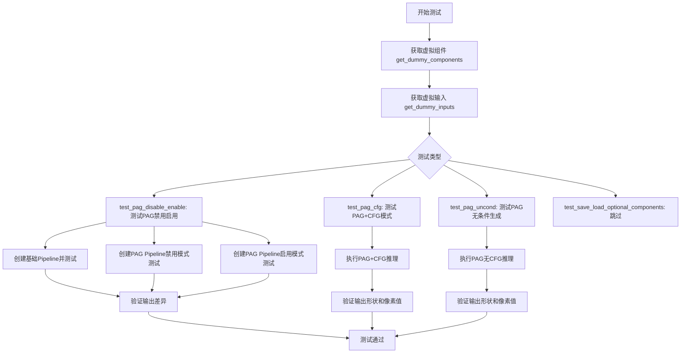
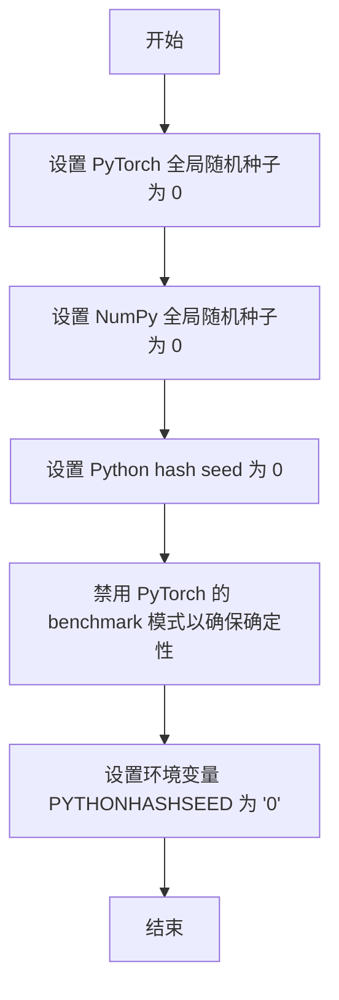
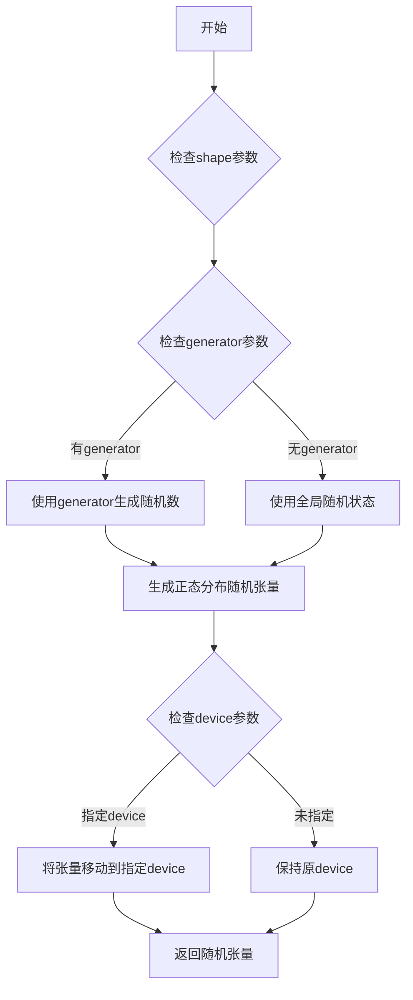
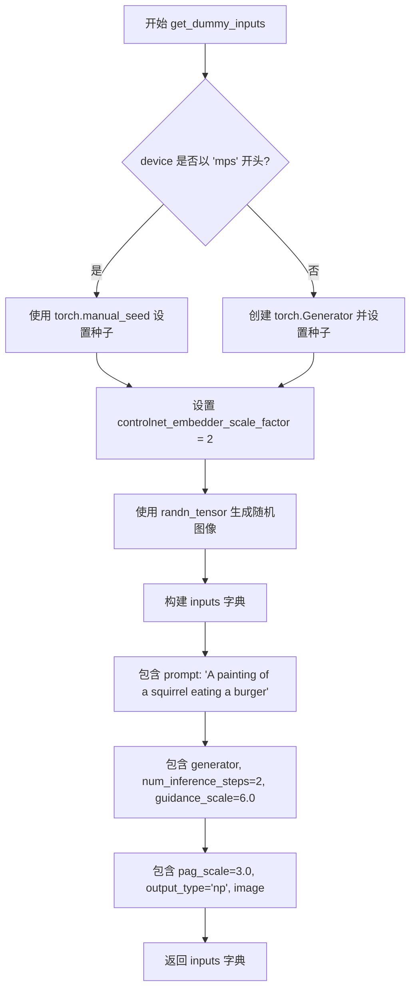
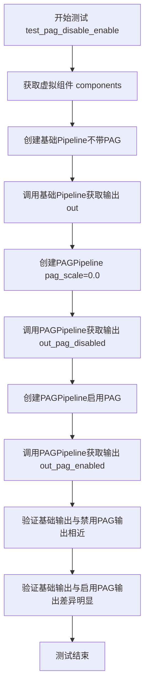
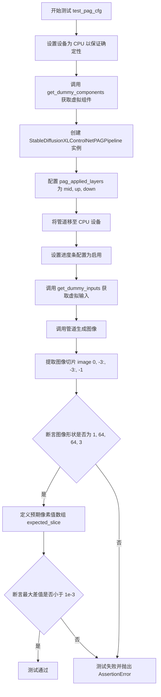

# `diffusers\tests\pipelines\pag\test_pag_controlnet_sdxl.py` 详细设计文档

这是一个针对 Stable Diffusion XL ControlNet PAG Pipeline 的单元测试文件，测试了 PAG (Progressive Attention Guidance) 功能的禁用/启用、CFG 模式和 unconditional 生成场景，验证了 ControlNet 与 SDXL 结合的图像生成管道的正确性。

## 整体流程



## 类结构

```
unittest.TestCase (基类)
├── PipelineTesterMixin (测试混入)
├── IPAdapterTesterMixin (IP适配器测试混入)
├── PipelineLatentTesterMixin (潜在变量测试混入)
└── PipelineFromPipeTesterMixin (管道继承测试混入)
    └── StableDiffusionXLControlNetPAGPipelineFastTests (具体测试类)
```

## 全局变量及字段


### `unet`
    
UNet模型，用于扩散模型的噪声预测和图像生成

类型：`UNet2DConditionModel`
    


### `controlnet`
    
ControlNet模型，用于根据输入图像控制扩散模型的生成过程

类型：`ControlNetModel`
    


### `scheduler`
    
欧拉离散调度器，用于管理扩散模型的噪声调度和时间步

类型：`EulerDiscreteScheduler`
    


### `vae`
    
变分自编码器，用于潜在空间的图像编码和解码

类型：`AutoencoderKL`
    


### `text_encoder`
    
CLIP文本编码器，用于将文本提示编码为嵌入向量

类型：`CLIPTextModel`
    


### `tokenizer`
    
CLIP分词器，用于将文本分词为token ID

类型：`CLIPTokenizer`
    


### `text_encoder_2`
    
带投影的CLIP文本编码器，用于双文本编码器配置

类型：`CLIPTextModelWithProjection`
    


### `tokenizer_2`
    
第二个CLIP分词器，用于双文本编码器配置

类型：`CLIPTokenizer`
    


### `feature_extractor`
    
特征提取器，此测试中为None

类型：`NoneType`
    


### `image_encoder`
    
图像编码器，此测试中为None

类型：`NoneType`
    


### `components`
    
包含所有模型组件的字典，用于初始化管道

类型：`dict`
    


### `generator`
    
PyTorch随机数生成器，用于确保测试的可重复性

类型：`torch.Generator`
    


### `image`
    
随机噪声张量，用作ControlNet的输入条件图像

类型：`torch.Tensor`
    


### `inputs`
    
包含所有推理参数的字典，如prompt、guidance_scale等

类型：`dict`
    


### `out`
    
基础管道（无PAG）的输出图像数组

类型：`numpy.ndarray`
    


### `out_pag_disabled`
    
PAG禁用时的输出图像数组（pag_scale=0.0）

类型：`numpy.ndarray`
    


### `out_pag_enabled`
    
PAG启用时的输出图像数组

类型：`numpy.ndarray`
    


### `image_slice`
    
输出图像的切片，用于数值比较

类型：`numpy.ndarray`
    


### `expected_slice`
    
期望的输出图像切片数值

类型：`numpy.ndarray`
    


### `max_diff`
    
实际输出与期望输出之间的最大绝对差异

类型：`float`
    


### `StableDiffusionXLControlNetPAGPipelineFastTests.pipeline_class`
    
被测试的管道类，即StableDiffusionXLControlNetPAGPipeline

类型：`type`
    


### `StableDiffusionXLControlNetPAGPipelineFastTests.params`
    
管道调用参数集合，包含文本到图像参数及PAG相关参数（pag_scale、pag_adaptive_scale）

类型：`set`
    


### `StableDiffusionXLControlNetPAGPipelineFastTests.batch_params`
    
批量推理参数集合，用于测试批量生成功能

类型：`set`
    


### `StableDiffusionXLControlNetPAGPipelineFastTests.image_params`
    
图像输入参数集合，用于测试图像到图像的生成

类型：`set`
    


### `StableDiffusionXLControlNetPAGPipelineFastTests.image_latents_params`
    
潜在图像参数集合，用于测试潜在空间的图像处理

类型：`set`
    


### `StableDiffusionXLControlNetPAGPipelineFastTests.callback_cfg_params`
    
回调配置参数集合，包含文本嵌入和时间ID等PAG配置参数

类型：`set`
    
    

## 全局函数及方法


### `enable_full_determinism`

该函数用于确保测试的完全确定性，通过设置全局随机种子（PyTorch、NumPy、Python hash seed等）来保证测试结果的可重复性。在测试类定义之前调用此函数，以便所有后续的随机操作都能产生一致的结果。

参数： 无

返回值：`None`，该函数不返回任何值。

#### 流程图



#### 带注释源码

```python
# 注意：由于此函数是从 testing_utils 模块导入的，
# 以下是根據其使用方式和典型的确定性设置逻辑推断的实现

def enable_full_determinism(seed: int = 0, workers: bool = True):
    """
    确保测试的完全确定性，通过设置各种随机种子和环境变量。
    
    参数：
        seed: int, 随机种子值，默认为 0
        workers: bool, 是否为 DataLoader 设置 worker_init_fn 以确保多进程情况下的确定性
    """
    # 设置 PyTorch 全局随机种子
    torch.manual_seed(seed)
    
    # 设置 NumPy 全局随机种子
    np.random.seed(seed)
    
    # 设置 Python hash seed 以确保字典遍历顺序的一致性
    # 通过环境变量实现
    import os
    os.environ["PYTHONHASHSEED"] = str(seed)
    
    # 禁用 PyTorch 的 cuDNN benchmark 模式
    # 这确保了卷积算法的确定性选择
    if torch.cuda.is_available():
        torch.backends.cudnn.benchmark = False
    
    # 设置 PyTorch 确定性算法
    torch.use_deterministic_algorithms(True, warn_only=True)
    
    # 如果需要，为 DataLoader workers 设置确定性
    if workers:
        # 在 DataLoader 中使用 worker_init_fn 来确保每个 worker 的种子一致性
        def worker_init_fn(worker_id):
            worker_seed = seed + worker_id
            np.random.seed(worker_seed)
            torch.manual_seed(worker_seed)
        
        # 这个函数会在创建 DataLoader 时被使用
        pass

# 在测试文件中的调用位置
enable_full_determinism()  # 使用默认参数 seed=0
```


### randn_tensor

该函数是 `diffusers` 库中的一个工具函数，用于生成符合正态分布（高斯分布）的随机张量，主要用于扩散模型 pipelines 中生成随机噪声或初始潜在变量。

参数：

- `shape`：`tuple` 或 `int`，输出张量的形状
- `generator`：`torch.Generator`（可选），用于控制随机数生成的确定性
- `device`：`torch.device`，指定生成张量所在的设备（CPU 或 CUDA）
- `dtype`：`torch.dtype`（可选），指定张量的数据类型
- `seed`：`int`（可选），随机种子

返回值：`torch.Tensor`，返回符合正态分布的随机张量

#### 流程图



#### 带注释源码

由于 `randn_tensor` 定义在 `diffusers.utils.torch_utils` 模块中，不在当前测试文件内，下面展示的是该函数在当前文件中的调用方式及其使用上下文：

```python
# 导入声明（在文件顶部）
from diffusers.utils.torch_utils import randn_tensor

# 在 get_dummy_inputs 方法中的调用示例
def get_dummy_inputs(self, device, seed=0):
    # 根据设备类型创建随机数生成器
    if str(device).startswith("mps"):
        generator = torch.manual_seed(seed)
    else:
        generator = torch.Generator(device=device).manual_seed(seed)

    # 控制网络嵌入器缩放因子
    controlnet_embedder_scale_factor = 2
    
    # 使用 randn_tensor 生成随机图像张量（符合正态分布）
    # shape: (1, 3, 64, 64) - 1张3通道64x64的图像
    # generator: 确保测试可复现的随机数生成器
    # device: 张量存放的设备
    image = randn_tensor(
        (1, 3, 32 * controlnet_embedder_scale_factor, 32 * controlnet_embedder_scale_factor),
        generator=generator,
        device=torch.device(device),
    )

    # 构建完整的测试输入字典
    inputs = {
        "prompt": "A painting of a squirrel eating a burger",
        "generator": generator,
        "num_inference_steps": 2,
        "guidance_scale": 6.0,
        "pag_scale": 3.0,
        "output_type": "np",
        "image": image,
    }

    return inputs
```

> **注意**：完整的 `randn_tensor` 函数源代码位于 `diffusers/utils/torch_utils.py` 模块中，当前测试文件仅导入并使用了该函数。如需查看完整实现，请参考 `diffusers` 库的源代码。


### `StableDiffusionXLControlNetPAGPipelineFastTests.get_dummy_components`

该方法用于创建虚拟组件（dummy components），为Stable Diffusion XL ControlNet PAG Pipeline的单元测试提供所需的全部模型组件，包括UNet、ControlNet、VAE、文本编码器、调度器等。

参数：

- `time_cond_proj_dim`：`Optional[int]`，可选参数，用于指定时间条件投影维度（time conditional projection dimension），影响UNet的时间嵌入处理，默认为None

返回值：`Dict[str, Any]`，返回一个包含所有虚拟组件的字典，包括unet、controlnet、scheduler、vae、text_encoder、tokenizer、text_encoder_2、tokenizer_2、feature_extractor和image_encoder

#### 流程图

```mermaid
flowchart TD
    A[开始 get_dummy_components] --> B[设置随机种子 torch.manual_seed(0)]
    B --> C[创建 UNet2DConditionModel]
    C --> D[设置随机种子 torch.manual_seed(0)]
    D --> E[创建 ControlNetModel]
    E --> F[设置随机种子 torch.manual_seed(0)]
    F --> G[创建 EulerDiscreteScheduler]
    G --> H[设置随机种子 torch.manual_seed(0)]
    H --> I[创建 AutoencoderKL]
    I --> J[设置随机种子 torch.manual_seed(0)]
    J --> K[创建 CLIPTextConfig]
    K --> L[创建 CLIPTextModel]
    L --> M[创建 CLIPTokenizer]
    M --> N[创建 CLIPTextModelWithProjection]
    N --> O[创建第二个 CLIPTokenizer]
    O --> P[组装 components 字典]
    P --> Q[返回 components]
```

#### 带注释源码

```python
def get_dummy_components(self, time_cond_proj_dim=None):
    # 注释：使用固定随机种子确保测试的可重复性
    torch.manual_seed(0)
    
    # 注释：创建UNet2DConditionModel - 用于去噪过程的UNet模型
    # 注释：配置了SD2特定的参数如attention_head_dim、transformer_layers_per_block等
    unet = UNet2DConditionModel(
        block_out_channels=(32, 64),       # 块输出通道数
        layers_per_block=2,                # 每个块的层数
        sample_size=32,                    # 样本尺寸
        in_channels=4,                     # 输入通道数（latent space）
        out_channels=4,                    # 输出通道数
        down_block_types=("DownBlock2D", "CrossAttnDownBlock2D"),  # 下采样块类型
        up_block_types=("CrossAttnUpBlock2D", "UpBlock2D"),        # 上采样块类型
        attention_head_dim=(2, 4),         # 注意力头维度
        use_linear_projection=True,         # 使用线性投影
        addition_embed_type="text_time",   # 额外的嵌入类型
        addition_time_embed_dim=8,         # 时间嵌入维度
        transformer_layers_per_block=(1, 2),  # 每个块的Transformer层数
        projection_class_embeddings_input_dim=80,  # 投影类嵌入输入维度
        cross_attention_dim=64,            # 交叉注意力维度
        time_cond_proj_dim=time_cond_proj_dim,  # 时间条件投影维度（可选参数）
    )
    
    torch.manual_seed(0)
    
    # 注释：创建ControlNetModel - 用于条件控制的ControlNet模型
    controlnet = ControlNetModel(
        block_out_channels=(32, 64),
        layers_per_block=2,
        in_channels=4,
        down_block_types=("DownBlock2D", "CrossAttnDownBlock2D"),
        conditioning_embedding_out_channels=(16, 32),  # 条件嵌入输出通道
        attention_head_dim=(2, 4),
        use_linear_projection=True,
        addition_embed_type="text_time",
        addition_time_embed_dim=8,
        transformer_layers_per_block=(1, 2),
        projection_class_embeddings_input_dim=80,
        cross_attention_dim=64,
    )
    
    torch.manual_seed(0)
    
    # 注释：创建EulerDiscreteScheduler - 用于扩散采样调度的欧拉离散调度器
    scheduler = EulerDiscreteScheduler(
        beta_start=0.00085,           # Beta起始值
        beta_end=0.012,               # Beta结束值
        steps_offset=1,              # 步骤偏移
        beta_schedule="scaled_linear",  # Beta调度策略
        timestep_spacing="leading",   # 时间步间距
    )
    
    torch.manual_seed(0)
    
    # 注释：创建AutoencoderKL - 用于变分自编码器的VAE模型
    vae = AutoencoderKL(
        block_out_channels=[32, 64],
        in_channels=3,                # RGB图像通道
        out_channels=3,
        down_block_types=["DownEncoderBlock2D", "DownEncoderBlock2D"],
        up_block_types=["UpDecoderBlock2D", "UpDecoderBlock2D"],
        latent_channels=4,            # Latent空间通道数
    )
    
    torch.manual_seed(0)
    
    # 注释：创建CLIPTextConfig - 文本编码器的配置
    text_encoder_config = CLIPTextConfig(
        bos_token_id=0,               # 句子开始标记ID
        eos_token_id=2,              # 句子结束标记ID
        hidden_size=32,              # 隐藏层大小
        intermediate_size=37,        # 中间层大小
        layer_norm_eps=1e-05,        # LayerNorm epsilon
        num_attention_heads=4,       # 注意力头数
        num_hidden_layers=5,        # 隐藏层数
        pad_token_id=1,              # 填充标记ID
        vocab_size=1000,             # 词汇表大小
        hidden_act="gelu",           # 激活函数
        projection_dim=32,           # 投影维度
    )
    
    # 注释：创建第一个CLIPTextModel - 主文本编码器
    text_encoder = CLIPTextModel(text_encoder_config)
    
    # 注释：从预训练模型加载CLIPTokenizer - 主分词器
    tokenizer = CLIPTokenizer.from_pretrained("hf-internal-testing/tiny-random-clip")
    
    # 注释：创建第二个CLIPTextModelWithProjection - 用于SDXL的第二个文本编码器
    text_encoder_2 = CLIPTextModelWithProjection(text_encoder_config)
    
    # 注释：加载第二个分词器（SDXL使用双文本编码器架构）
    tokenizer_2 = CLIPTokenizer.from_pretrained("hf-internal-testing/tiny-random-clip")
    
    # 注释：组装所有组件到字典中返回
    components = {
        "unet": unet,                      # UNet去噪模型
        "controlnet": controlnet,          # ControlNet条件控制模型
        "scheduler": scheduler,             # 扩散调度器
        "vae": vae,                        # 变分自编码器
        "text_encoder": text_encoder,      # 主文本编码器
        "tokenizer": tokenizer,             # 主分词器
        "text_encoder_2": text_encoder_2,   # 第二文本编码器（SDXL）
        "tokenizer_2": tokenizer_2,         # 第二分词器（SDXL）
        "feature_extractor": None,          # 特征提取器（可选）
        "image_encoder": None,              # 图像编码器（可选，用于IP-Adapter）
    }
    
    return components  # 返回包含所有虚拟组件的字典
```


### `StableDiffusionXLControlNetPAGPipelineFastTests.get_dummy_inputs`

该方法是一个测试辅助函数，用于生成虚拟输入数据，以便在测试 Stable Diffusion XL ControlNet PAG Pipeline 时使用。它根据给定的设备和种子生成随机输入，包括提示词、生成器、推理步数、引导比例、PAG 缩放比例、输出类型和条件图像。

参数：

- `self`：隐式参数，测试类实例本身
- `device`：`str` 或 `torch.device`，目标设备（如 "cpu"、"cuda"、"mps"），用于创建随机生成器和张量
- `seed`：`int`，默认值 0，用于设置随机种子以确保测试的可重复性

返回值：`Dict[str, Any]`，返回一个包含所有必要输入参数的字典，包括 prompt（提示词）、generator（随机生成器）、num_inference_steps（推理步数）、guidance_scale（引导比例）、pag_scale（PAG 缩放比例）、output_type（输出类型）和 image（条件图像）

#### 流程图



#### 带注释源码

```python
def get_dummy_inputs(self, device, seed=0):
    """
    生成用于测试的虚拟输入参数。
    
    参数:
        device: 目标设备（如 'cpu', 'cuda', 'mps'）
        seed: 随机种子，默认值为 0
    
    返回:
        包含测试所需所有输入参数的字典
    """
    
    # 判断设备类型，MPS (Apple Silicon) 需要特殊处理
    if str(device).startswith("mps"):
        # MPS 设备使用 torch.manual_seed 而非 Generator
        generator = torch.manual_seed(seed)
    else:
        # 其他设备创建 Generator 对象并设置种子
        generator = torch.Generator(device=device).manual_seed(seed)

    # 控制网嵌入器的缩放因子，用于确定条件图像的尺寸
    controlnet_embedder_scale_factor = 2
    
    # 生成随机条件图像，尺寸为 (1, 3, 64, 64)
    # 32 * 2 = 64，即基础尺寸乘以缩放因子
    image = randn_tensor(
        (1, 3, 32 * controlnet_embedder_scale_factor, 32 * controlnet_embedder_scale_factor),
        generator=generator,
        device=torch.device(device),
    )

    # 构建完整的输入参数字典
    inputs = {
        "prompt": "A painting of a squirrel eating a burger",  # 文本提示词
        "generator": generator,  # 随机生成器，确保可重复性
        "num_inference_steps": 2,  # 推理步数，较少步数用于快速测试
        "guidance_scale": 6.0,  # CFG 引导比例
        "pag_scale": 3.0,  # PAG (Progressive Attention Guidance) 缩放比例
        "output_type": "np",  # 输出类型为 numpy 数组
        "image": image,  # 条件图像
    }

    return inputs
```


### `StableDiffusionXLControlNetPAGPipelineFastTests.test_pag_disable_enable`

该测试方法用于验证Stable Diffusion XL ControlNet PAGPipeline中PAG（Prompt-guided Attention Guidance）功能的正确禁用和启用行为。通过对比基础Pipeline、PAG禁用（pag_scale=0.0）和PAG启用时的输出图像，确PAG功能在不同配置下的正确性。

参数：

- `self`：隐式参数，测试类实例本身

返回值：`None`，该方法为测试方法，无返回值，通过assert断言验证行为

#### 流程图



#### 带注释源码

```python
def test_pag_disable_enable(self):
    """
    测试PAG功能的禁用和启用行为
    验证当pag_scale=0.0时PAG被禁用，输出与基础Pipeline一致
    验证当pag_scale>0时PAG被启用，输出与基础Pipeline不同
    """
    # 使用CPU设备确保torch.Generator的确定性
    device = "cpu"
    # 获取虚拟组件用于测试
    components = self.get_dummy_components()

    # ==== 步骤1: 创建基础Pipeline（不带PAG功能） ====
    pipe_sd = StableDiffusionXLControlNetPipeline(**components)
    pipe_sd = pipe_sd.to(device)
    pipe_sd.set_progress_bar_config(disable=None)

    # 获取测试输入
    inputs = self.get_dummy_inputs(device)
    # 删除pag_scale参数，因为基础Pipeline不应该有这个参数
    del inputs["pag_scale"]
    # 验证基础Pipeline的__call__方法签名中不包含pag_scale参数
    assert "pag_scale" not in inspect.signature(pipe_sd.__call__).parameters, (
        f"`pag_scale` should not be a call parameter of the base pipeline {pipe_sd.__class__.__name__}."
    )
    # 获取基础Pipeline的输出图像（取最后3x3像素块）
    out = pipe_sd(**inputs).images[0, -3:, -3:, -1]

    # ==== 步骤2: 创建PAGPipeline并禁用PAG（pag_scale=0.0） ====
    pipe_pag = self.pipeline_class(**components)
    pipe_pag = pipe_pag.to(device)
    pipe_pag.set_progress_bar_config(disable=None)

    # 获取测试输入并设置pag_scale为0.0以禁用PAG
    inputs = self.get_dummy_inputs(device)
    inputs["pag_scale"] = 0.0
    out_pag_disabled = pipe_pag(**inputs).images[0, -3:, -3:, -1]

    # ==== 步骤3: 创建PAGPipeline并启用PAG ====
    pipe_pag = self.pipeline_class(**components, pag_applied_layers=["mid", "up", "down"])
    pipe_pag = pipe_pag.to(device)
    pipe_pag.set_progress_bar_config(disable=None)

    inputs = self.get_dummy_inputs(device)
    out_pag_enabled = pipe_pag(**inputs).images[0, -3:, -3:, -1]

    # ==== 步骤4: 验证结果 ====
    # 验证禁用PAG时输出与基础Pipeline相同（误差小于1e-3）
    assert np.abs(out.flatten() - out_pag_disabled.flatten()).max() < 1e-3
    # 验证启用PAG时输出与基础Pipeline不同（差异大于1e-3）
    assert np.abs(out.flatten() - out_pag_enabled.flatten()).max() > 1e-3
```


### `StableDiffusionXLControlNetPAGPipelineFastTests.test_pag_cfg`

该方法是 `StableDiffusionXLControlNetPAGPipelineFastTests` 测试类中的一个测试用例，用于验证 Stable Diffusion XL ControlNet PAG Pipeline 在启用 PAG（Prompt-Aware Guidance）且使用 CFG（Classifier-Free Guidance）时的功能正确性。测试创建带有 PAG 应用层的管道，生成图像，并验证输出图像的形状和像素值是否与预期值匹配。

参数：

- `self`：隐式参数，表示测试类实例本身，无类型，方法的调用者

返回值：无明确返回值（`None`），该方法为 `unittest.TestCase` 的测试方法，通过 `assert` 语句进行断言验证，若所有断言通过则测试成功

#### 流程图



#### 带注释源码

```python
def test_pag_cfg(self):
    """
    测试 StableDiffusionXLControlNetPAGPipeline 在启用 PAG 和 CFG 时的功能。
    验证管道能够正确生成指定尺寸的图像，并且输出像素值与预期值匹配。
    """
    # 设置设备为 CPU，以确保与设备相关的 torch.Generator 的确定性
    device = "cpu"  # ensure determinism for the device-dependent torch.Generator
    
    # 获取用于测试的虚拟（dummy）组件
    # 这些组件是小型的模型配置，用于快速测试
    components = self.get_dummy_components()
    
    # 创建带有 PAG 应用层的管道实例
    # pag_applied_layers 指定在哪些层应用 PAG（Prompt-Aware Guidance）
    pipe_pag = self.pipeline_class(**components, pag_applied_layers=["mid", "up", "down"])
    
    # 将管道移至指定设备（CPU）
    pipe_pag = pipe_pag.to(device)
    
    # 设置进度条配置，disable=None 表示不禁用进度条
    pipe_pag.set_progress_bar_config(disable=None)
    
    # 获取虚拟输入参数，包括 prompt、generator、num_inference_steps 等
    inputs = self.get_dummy_inputs(device)
    
    # 调用管道的 __call__ 方法生成图像
    # 返回的 images 是一个包含生成图像的数组
    image = pipe_pag(**inputs).images
    
    # 提取图像的一个切片用于验证
    # 取最后 3x3 像素区域，并取最后一个通道（通常是 RGB 中的一个）
    image_slice = image[0, -3:, -3:, -1]
    
    # 断言：验证生成的图像形状是否为 (1, 64, 64, 3)
    # 1 表示批量大小，64x64 表示图像高度和宽度，3 表示通道数（RGB）
    assert image.shape == (
        1,
        64,
        64,
        3,
    ), f"the shape of the output image should be (1, 64, 64, 3) but got {image.shape}"
    
    # 定义预期的像素值切片
    # 这些值是在特定随机种子下预期的输出
    expected_slice = np.array([0.7036, 0.5613, 0.5526, 0.6129, 0.5610, 0.5842, 0.4228, 0.4612, 0.5017])
    
    # 计算生成图像切片与预期值之间的最大绝对差值
    max_diff = np.abs(image_slice.flatten() - expected_slice).max()
    
    # 断言：验证最大差值是否小于阈值 1e-3
    # 如果大于阈值，说明输出与预期不符，测试失败
    assert max_diff < 1e-3, f"output is different from expected, {image_slice.flatten()}"
```


### `StableDiffusionXLControlNetPAGPipelineFastTests.test_pag_uncond`

该测试函数用于验证 PAG（Progressive Anchor Guidance）功能在无分类器引导（classifier-free guidance，CFG）关闭时的行为。具体来说，它创建一个配置了 PAG 的 StableDiffusionXLControlNetPipeline，并将 `guidance_scale` 设置为 0.0，然后验证管道能够正确生成图像且输出与预期值匹配。

参数：

- `self`：`StableDiffusionXLControlNetPAGPipelineFastTests`，测试类的实例，包含测试所需的配置和方法

返回值：`None`，该函数为测试函数，不返回任何值，仅通过断言验证结果

#### 流程图

```mermaid
flowchart TD
    A[开始测试 test_pag_uncond] --> B[设置 device = 'cpu']
    B --> C[调用 get_dummy_components 获取虚拟组件]
    C --> D[创建 StableDiffusionXLControlNetPAGPipeline 实例]
    D --> E[将管道移至 device 并禁用进度条]
    E --> F[调用 get_dummy_inputs 获取虚拟输入]
    F --> G[设置 guidance_scale = 0.0 关闭 CFG]
    G --> H[调用管道生成图像: pipe_pag(**inputs)]
    H --> I[提取图像切片: image[0, -3:, -3:, -1]]
    I --> J{断言 image.shape == (1, 64, 64, 3)}
    J -->|是| K[定义 expected_slice 预期像素值]
    J -->|否| L[抛出断言错误]
    K --> M[计算 max_diff = |image_slice - expected_slice|.max]
    M --> N{max_diff < 1e-3}
    N -->|是| O[测试通过]
    N -->|否| P[抛出断言错误]
    L --> P
    O --> Q[结束测试]
    P --> Q
```

#### 带注释源码

```python
def test_pag_uncond(self):
    """
    测试 PAG 功能在无分类器引导（guidance_scale=0.0）时的行为。
    验证管道能够在关闭 CFG 的情况下正确生成图像。
    """
    # 设置设备为 CPU，确保与设备相关的 torch.Generator 的确定性
    device = "cpu"  # ensure determinism for the device-dependent torch.Generator
    
    # 获取虚拟组件（UNet、ControlNet、Scheduler、VAE、TextEncoder 等）
    components = self.get_dummy_components()

    # 创建配置了 PAG 的管道，指定 PAG 应用于 mid、up、down 层
    pipe_pag = self.pipeline_class(**components, pag_applied_layers=["mid", "up", "down"])
    
    # 将管道移至指定设备
    pipe_pag = pipe_pag.to(device)
    
    # 设置进度条配置，disable=None 表示不禁用进度条
    pipe_pag.set_progress_bar_config(disable=None)

    # 获取虚拟输入参数（prompt、generator、num_inference_steps 等）
    inputs = self.get_dummy_inputs(device)
    
    # 设置 guidance_scale = 0.0，关闭分类器-free guidance
    inputs["guidance_scale"] = 0.0
    
    # 调用管道生成图像
    image = pipe_pag(**inputs).images
    
    # 提取图像的一个切片用于验证（取最后 3x3 像素的最后通道）
    image_slice = image[0, -3:, -3:, -1]

    # 断言：验证生成的图像形状为 (1, 64, 64, 3)
    assert image.shape == (
        1,
        64,
        64,
        3,
    ), f"the shape of the output image should be (1, 64, 64, 3) but got {image.shape}"
    
    # 定义预期的像素值切片（用于回归测试）
    expected_slice = np.array([0.6888, 0.5398, 0.5603, 0.6086, 0.5541, 0.5957, 0.4332, 0.4643, 0.5154])

    # 计算实际输出与预期值的最大差异
    max_diff = np.abs(image_slice.flatten() - expected_slice).max()
    
    # 断言：验证最大差异小于阈值 1e-3
    assert max_diff < 1e-3, f"output is different from expected, {image_slice.flatten()}"
```


### `StableDiffusionXLControlNetPAGPipelineFastTests.test_save_load_optional_components`

该方法是一个单元测试函数，用于测试管道的保存和加载可选组件功能。当前该测试被装饰器跳过，标记为"我们已在其他位置测试此功能"。

参数：

- `self`：`StableDiffusionXLControlNetPAGPipelineFastTests`，测试类的实例，代表当前测试对象

返回值：`None`，该方法不返回任何值（仅包含 `pass` 语句）

#### 流程图

```mermaid
flowchart TD
    A[开始测试 test_save_load_optional_components] --> B{检查装饰器}
    B --> C[@unittest.skip 装饰器]
    C --> D{测试是否执行?}
    D -->|否| E[跳过测试<br/>消息: 'We test this functionality elsewhere already.']
    D -->|是| F[执行测试逻辑]
    E --> G[测试结束<br/>状态: SKIPPED]
    F --> G
    
    style E fill:#ff9900
    style G fill:#66ccff
```

#### 带注释源码

```python
@unittest.skip("We test this functionality elsewhere already.")
def test_save_load_optional_components(self):
    """
    测试管道保存和加载可选组件的功能。
    
    该测试方法用于验证 StableDiffusionXLControlNetPAGPipeline 管道
    的可选组件（如 feature_extractor, image_encoder 等）能够正确保存
    和加载。
    
    当前实现：
    - 使用 @unittest.skip 装饰器跳过测试执行
    - 跳过原因：该功能已在其他测试中覆盖
    - 方法体仅包含 pass 语句，不执行任何实际操作
    
    参数:
        self: 测试类实例，继承自 unittest.TestCase
        
    返回值:
        None: 不返回任何值
    """
    pass  # 测试主体为空，已被跳过执行
```

## 关键组件


### StableDiffusionXLControlNetPAGPipelineFastTests

测试类，用于验证 Stable Diffusion XL ControlNet PAG Pipeline 的功能，继承自多个测试Mixin类，提供PAG（Progressive Attention Guidance）功能的单元测试。

### get_dummy_components

创建虚拟组件的方法，初始化UNet2DConditionModel、ControlNetModel、AutoencoderKL、CLIPTextModel等核心模型，用于测试环境的快速验证。

### get_dummy_inputs

创建虚拟输入的方法，使用randn_tensor生成随机张量作为控制图像，构建包含prompt、generator、num_inference_steps、guidance_scale、pag_scale等参数的输入字典。

### test_pag_disable_enable

测试PAG禁用和启用功能的用例，验证当pag_scale=0.0时输出与基础管道相同，以及pag启用时输出与禁用时存在差异。

### test_pag_cfg

测试PAG条件引导功能的用例，验证在guidance_scale>0时PAG管道的输出图像形状和像素值是否符合预期。

### test_pag_uncond

测试PAG无条件生成功能的用例，验证在guidance_scale=0.0时PAG管道能够正确生成图像。

### randn_tensor

来自diffusers.utils.torch_utils的辅助函数，用于生成指定形状的随机张量，支持设备指定和随机种子控制。

### EulerDiscreteScheduler

调度器组件，用于控制扩散模型的采样过程，配置beta参数、时间步偏移和调度策略。

### PipelineTesterMixin, IPAdapterTesterMixin, PipelineLatentTesterMixin, PipelineFromPipeTesterMixin

测试Mixin类，提供通用的管道测试方法和断言逻辑，支持批量测试、潜在变量测试和管道继承测试。


## 问题及建议


### 已知问题

-   **代码重复**：`get_dummy_components` 方法复制自 `tests.pipelines.controlnet.test_controlnet_sdxl.StableDiffusionXLControlNetPipelineFastTests`，虽然有注释说明，但违反了 DRY 原则
-   **魔法数字**：存在多处硬编码的数值如 `1e-3`、`0.00085`、`0.012`、`steps_offset=1` 等，缺乏常量定义
-   **脆弱的断言方式**：使用 `inspect.signature` 检查参数存在性的方式不够稳健，参数名变化会导致测试逻辑错误
-   **资源未释放**：测试方法中创建了 pipeline 实例但未在测试完成后显式释放，可能导致内存占用
-   **测试覆盖不完整**：`test_save_load_optional_components` 方法仅包含 `pass` 语句，实际上没有执行任何测试
-   **硬编码的期望值**：图像输出的期望数值（如 `expected_slice = np.array([0.7036, 0.5613, ...])`）直接嵌入代码中，模型微小变化会导致测试失败
-   **设备处理不一致**：对 `mps` 设备和其他设备使用不同的随机数生成逻辑，增加了维护复杂度

### 优化建议

-   将 `get_dummy_components` 提取到共享的测试工具模块中，避免代码重复
-   将配置常量（如阈值、调度器参数、图像尺寸）提取为类级别或模块级别的常量
-   使用 `@unittest.skipIf` 或条件跳过替代 `inspect.signature` 的动态检查方式
-   在测试类中实现 `tearDown` 方法以释放 pipeline 资源，或使用 pytest fixture 管理生命周期
-   实现 `test_save_load_optional_components` 的真实测试逻辑或移除该方法
-   考虑使用参数化测试框架（如 `parameterized` 库）重构相似测试用例，减少重复代码
-   将设备相关的随机数生成逻辑统一封装为工具函数
-   为断言添加更详细的错误信息，帮助快速定位问题

## 其它


### 设计目标与约束

验证StableDiffusionXLControlNetPAGPipeline的PAG（Progressive Attention Guidance）功能是否正确实现，包括PAG的启用/禁用、CFG（Classifier-Free Guidance）模式以及无引导模式的正确性。

### 错误处理与异常设计

测试通过unittest框架进行断言验证，使用np.abs比较输出差异确保数值正确性。对于设备兼容性（如mps设备）有特殊处理，使用torch.manual_seed代替Generator。

### 数据流与状态机

测试流程：获取dummy components → 构建pipeline → 设置设备 → 调用pipeline → 验证输出图像。PAG功能通过pag_scale参数控制，pag_applied_layers指定应用PAG的层（mid/up/down）。

### 外部依赖与接口契约

依赖transformers库的CLIPTextConfig/CLIPTextModel/CLIPTextModelWithProjection/CLIPTokenizer；依赖diffusers库的StableDiffusionXLControlNetPAGPipeline、UNet2DConditionModel、ControlNetModel、AutoencoderKL、EulerDiscreteScheduler等。

### 性能考虑与基准

使用dummy components和少量推理步数（num_inference_steps=2）加速测试，图像尺寸较小（64x64），确保测试快速执行。

### 安全与权限考量

测试在CPU设备上执行以保证确定性，使用固定随机种子确保结果可复现。

### 配置与参数说明

关键参数：pag_scale（PAG强度）、pag_applied_layers（应用PAG的层列表）、guidance_scale（CFG强度）、num_inference_steps（推理步数）。

### 测试覆盖范围与限制

当前测试覆盖：PAG启用/禁用、CFG模式、无引导模式。已跳过test_save_load_optional_components测试。

### 版本与兼容性说明

使用EulerDiscreteScheduler，SD2-specific配置包括attention_head_dim、use_linear_projection、addition_embed_type等。
    