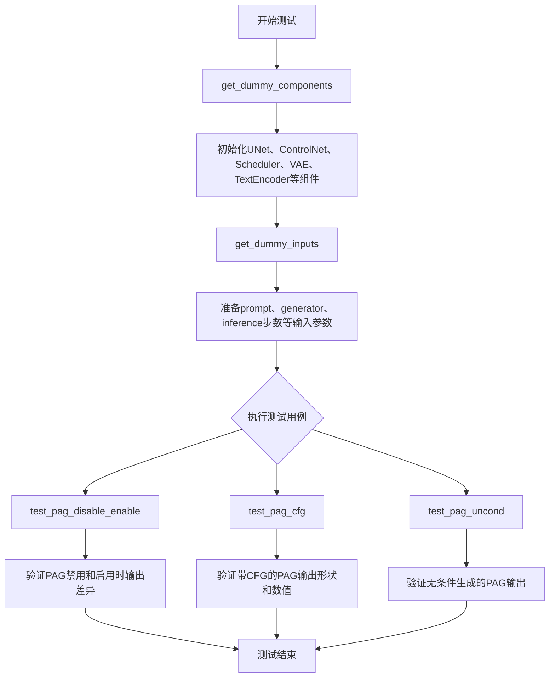
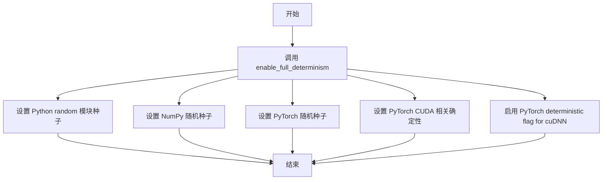
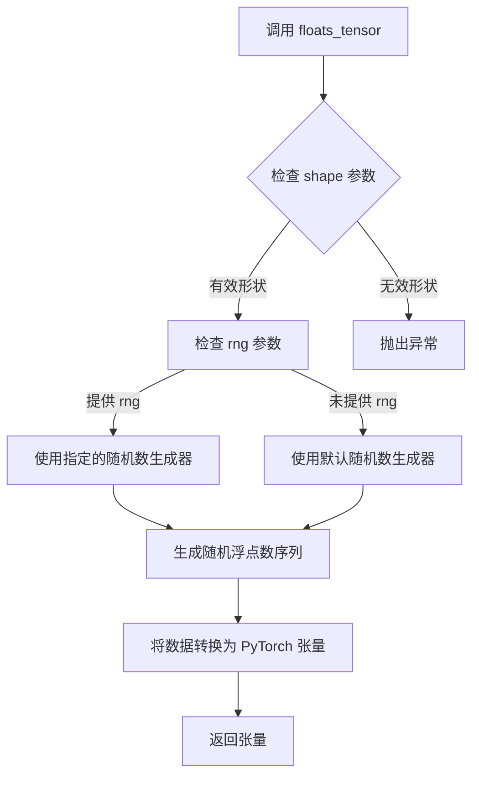
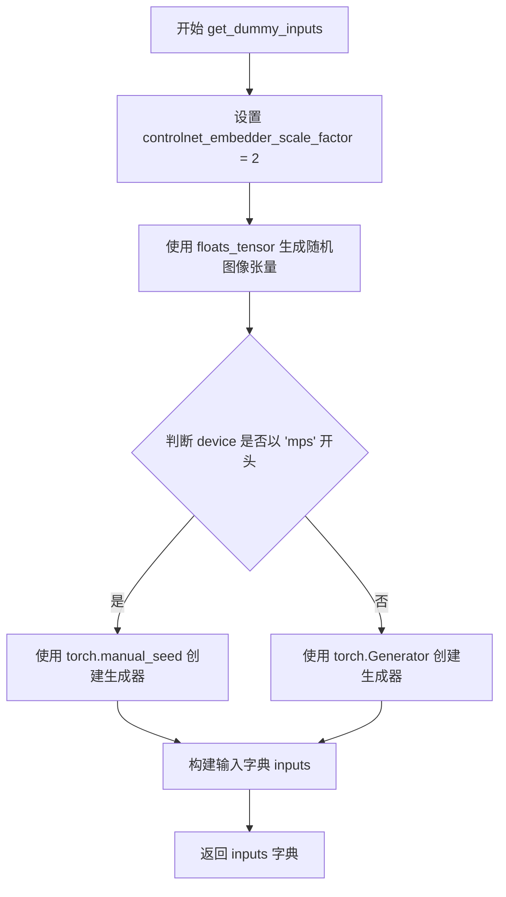
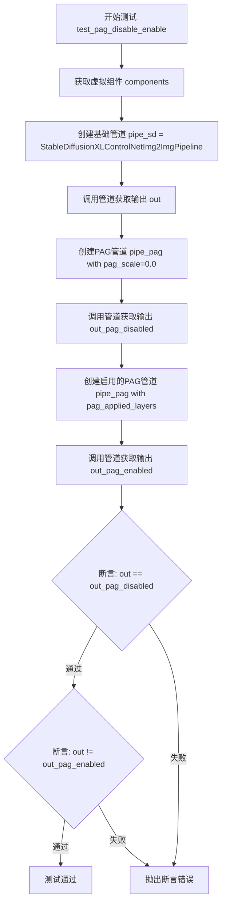
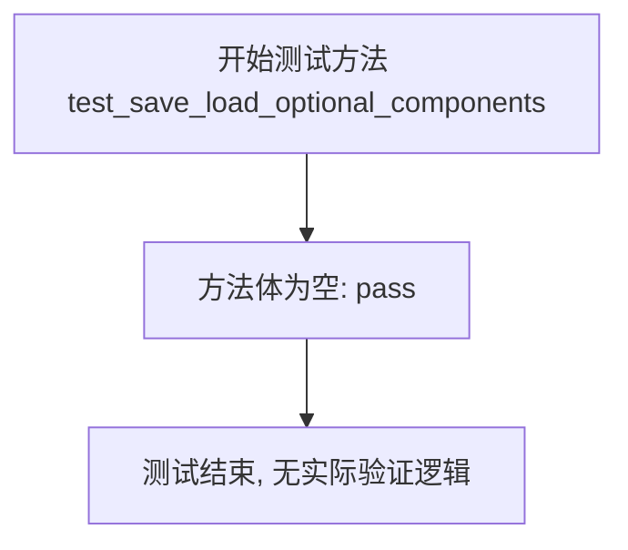
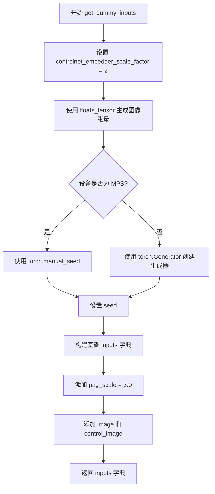
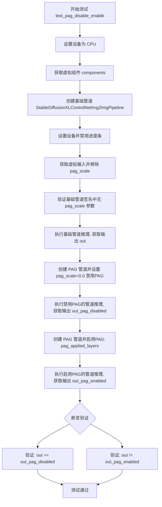
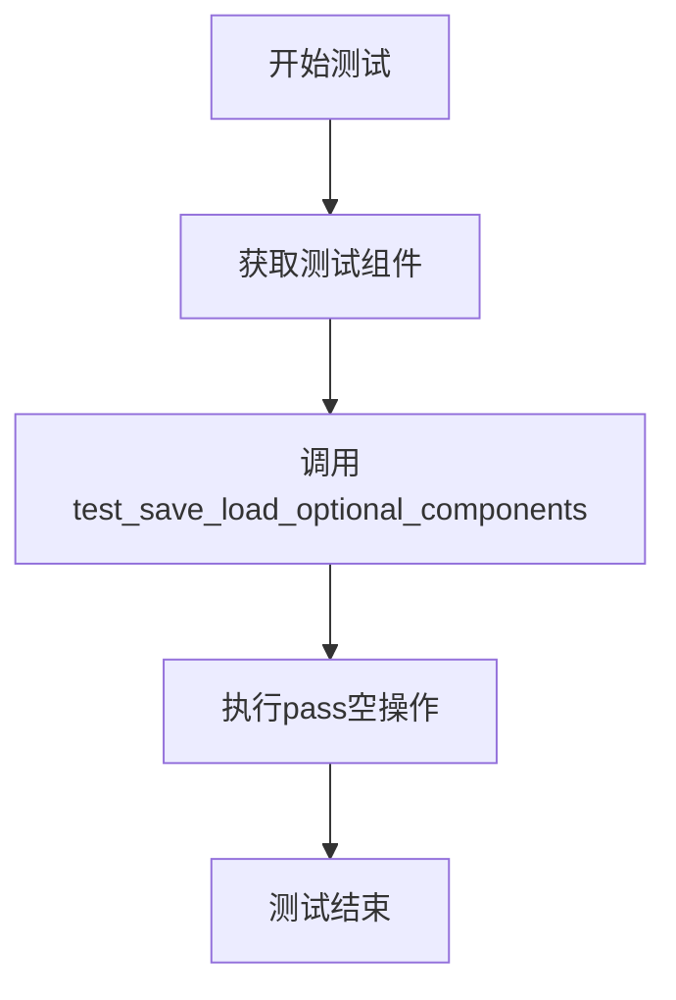

# `diffusers\tests\pipelines\pag\test_pag_controlnet_sdxl_img2img.py` 详细设计文档

这是一个针对 StableDiffusionXLControlNetPAGImg2ImgPipeline 的单元测试文件，包含了多个测试用例，用于验证该 Pipeline 在图像到图像生成任务中的功能正确性，特别是对 PAG (Progressive Attention Guidance) 技术的禁用/启用、CFG (Classifier-Free Guidance) 和无条件生成的支持。

## 整体流程



## 类结构

```
unittest.TestCase (Python标准库)
├── IPAdapterTesterMixin (diffusers测试mixin)
├── PipelineLatentTesterMixin (diffusers测试mixin)
├── PipelineTesterMixin (diffusers测试mixin)
├── PipelineFromPipeTesterMixin (diffusers测试mixin)
└── StableDiffusionXLControlNetPAGImg2ImgPipelineFastTests (被测测试类)
```

## 全局变量及字段


### `enable_full_determinism`
    
设置PyTorch和NumPy的完全确定性以确保测试可重复性

类型：`function`
    


### `IMAGE_TO_IMAGE_IMAGE_PARAMS`
    
图像到图像任务所需的图像参数集合

类型：`frozenset[str]`
    


### `TEXT_GUIDED_IMAGE_VARIATION_BATCH_PARAMS`
    
文本引导图像变体任务的批量推理参数集合

类型：`frozenset[str]`
    


### `TEXT_TO_IMAGE_CALLBACK_CFG_PARAMS`
    
文本到图像任务中回调函数的配置参数集合

类型：`frozenset[str]`
    


### `StableDiffusionXLControlNetPAGImg2ImgPipelineFastTests.pipeline_class`
    
被测试的流水线类，指向StableDiffusionXLControlNetPAGImg2ImgPipeline

类型：`type[StableDiffusionXLControlNetPAGImg2ImgPipeline]`
    


### `StableDiffusionXLControlNetPAGImg2ImgPipelineFastTests.params`
    
单次推理参数集合，包含文本引导图像变体参数及pag_scale和pag_adaptive_scale

类型：`set[str]`
    


### `StableDiffusionXLControlNetPAGImg2ImgPipelineFastTests.batch_params`
    
批量推理参数集合，用于测试批量图像生成

类型：`set[str]`
    


### `StableDiffusionXLControlNetPAGImg2ImgPipelineFastTests.image_params`
    
输入图像参数集合，定义图像到图像任务的输入参数

类型：`set[str]`
    


### `StableDiffusionXLControlNetPAGImg2ImgPipelineFastTests.image_latents_params`
    
图像潜在向量参数集合，用于处理图像的潜在表示

类型：`set[str]`
    


### `StableDiffusionXLControlNetPAGImg2ImgPipelineFastTests.callback_cfg_params`
    
回调配置参数集合，包含文本嵌入、时间ID等配置参数

类型：`set[str]`
    
    

## 全局函数及方法


### `enable_full_determinism`

这是一个从 `testing_utils` 模块导入的全局函数，用于确保测试的完全确定性（通过设置随机种子等方式，使多次运行产生相同的结果）。

参数：
- （无参数）

返回值：`无返回值`（`None`），该函数直接修改全局状态以确保确定性。

#### 流程图



#### 带注释源码

```
# 说明：此函数从 ...testing_utils 模块导入，未在此文件中定义
# 根据函数名称和调用方式推测其功能如下：

def enable_full_determinism(seed: int = 0, deterministic_cudnn: bool = True):
    """
    启用完全确定性，确保测试结果可复现。
    
    参数：
        seed: 随机种子，默认为 0
        deterministic_cudnn: 是否启用 cuDNN 确定性，默认为 True
    
    返回值：
        None
    """
    # 设置 Python 内置 random 模块的随机种子
    random.seed(seed)
    
    # 设置 NumPy 的随机种子
    np.random.seed(seed)
    
    # 设置 PyTorch CPU 和 CUDA 的随机种子
    torch.manual_seed(seed)
    torch.cuda.manual_seed_all(seed)
    
    # 强制 PyTorch 使用确定性算法
    torch.backends.cudnn.deterministic = deterministic_cudnn
    torch.backends.cudnn.benchmark = False
    
    # 设置 PyTorch 的其他确定性选项
    torch.use_deterministic_algorithms(True)
    
    # 如果使用 CUDA，还需设置 CUDA 相关的确定性
    if torch.cuda.is_available():
        torch.cuda.manual_seed(seed)
```

#### 备注

- **函数来源**：`from ...testing_utils import enable_full_determinism`
- **调用位置**：文件第 43 行 `enable_full_determinism()`
- **调用目的**：在测试文件加载时全局设置随机种子，确保后续所有随机操作可复现，这对于单元测试的稳定性和调试至关重要


### `floats_tensor`

`floats_tensor` 是一个测试工具函数，用于生成指定形状的随机浮点数 PyTorch 张量，常用于单元测试中创建模拟输入数据。

参数：

- `shape`：`tuple`，表示张量的维度形状，例如 `(1, 3, 32, 32)`
- `rng`：`random.Random`，Python 随机数生成器实例，用于控制随机性（可选参数，可能还有默认值）

返回值：`torch.Tensor`，包含随机浮点数值的 PyTorch 张量

#### 流程图



#### 带注释源码

```python
# 根据代码中的使用方式推断的实现
def floats_tensor(shape, rng=None):
    """
    生成指定形状的随机浮点数 PyTorch 张量
    
    参数:
        shape: 张量的维度元组，如 (batch, channels, height, width)
        rng: 可选的随机数生成器，默认使用 random.Random
    
    返回:
        包含随机浮点数的 torch.Tensor
    """
    # 如果未提供随机数生成器，使用默认的 random.Random
    if rng is None:
        rng = random.Random()
    
    # 根据形状生成随机浮点数列表
    # random.random() 生成 [0.0, 1.0) 范围内的随机浮点数
    total_elements = 1
    for dim in shape:
        total_elements *= dim
    
    # 生成随机浮点数据
    values = [rng.random() for _ in range(total_elements)]
    
    # 将数据重塑为指定形状的 PyTorch 张量
    tensor = torch.tensor(values).reshape(shape)
    
    return tensor

# 代码中的实际调用示例：
# image = floats_tensor(
#     (1, 3, 32 * controlnet_embedder_scale_factor, 32 * controlnet_embedder_scale_factor),
#     rng=random.Random(seed),
# ).to(device)
```


### `StableDiffusionXLControlNetPAGImg2ImgPipelineFastTests.get_dummy_components`

该方法用于创建并返回Stable Diffusion XL ControlNet PAG（Plug-and-Play）Img2ImgPipeline测试所需的虚拟组件字典，包括UNet、ControlNet、调度器、VAE、文本编码器等，这些组件均使用随机种子初始化以确保测试的可重复性。

参数：

- `skip_first_text_encoder`：`bool`，可选参数（默认值为False），用于控制是否跳过第一个文本编码器及其对应的tokenizer

返回值：`dict`，返回一个包含所有pipeline组件的字典，键为组件名称，值为对应的模型实例或None

#### 流程图

```mermaid
flowchart TD
    A[开始 get_dummy_components] --> B[设置随机种子 torch.manual_seed(0)]
    B --> C[创建 UNet2DConditionModel]
    C --> D[创建 ControlNetModel]
    D --> E[创建 EulerDiscreteScheduler]
    E --> F[创建 AutoencoderKL]
    F --> G[创建 CLIPTextConfig]
    G --> H[创建 CLIPTextModel 和 CLIPTokenizer]
    H --> I[创建 CLIPTextModelWithProjection 和 CLIPTokenizer]
    I --> J{skip_first_text_encoder?}
    J -->|False| K[text_encoder和tokenizer正常赋值]
    J -->|True| L[text_encoder和tokenizer设为None]
    K --> M[组装components字典]
    L --> M
    M --> N[返回components字典]
```

#### 带注释源码

```python
# Copied from tests.pipelines.controlnet.test_controlnet_sdxl_img2img.ControlNetPipelineSDXLImg2ImgFastTests.get_dummy_components
def get_dummy_components(self, skip_first_text_encoder=False):
    """
    创建并返回Stable Diffusion XL ControlNet PAG Img2Img Pipeline测试所需的虚拟组件
    
    参数:
        skip_first_text_encoder: bool, 是否跳过第一个文本编码器，默认为False
    
    返回:
        dict: 包含所有pipeline组件的字典
    """
    # 设置随机种子确保测试可重复性
    torch.manual_seed(0)
    # 创建UNet2DConditionModel - 用于去噪的U-Net模型
    unet = UNet2DConditionModel(
        block_out_channels=(32, 64),           # 输出通道数
        layers_per_block=2,                    # 每个块的层数
        sample_size=32,                        # 样本大小
        in_channels=4,                         # 输入通道数（latent space）
        out_channels=4,                        # 输出通道数
        down_block_types=("DownBlock2D", "CrossAttnDownBlock2D"),  # 下采样块类型
        up_block_types=("CrossAttnUpBlock2D", "UpBlock2D"),         # 上采样块类型
        # SD2-specific config below
        attention_head_dim=(2, 4),            # 注意力头维度
        use_linear_projection=True,           # 使用线性投影
        addition_embed_type="text_time",      # 额外嵌入类型
        addition_time_embed_dim=8,            # 时间嵌入维度
        transformer_layers_per_block=(1, 2),  # 每个块的transformer层数
        projection_class_embeddings_input_dim=80,  # 6 * 8 + 32
        cross_attention_dim=64 if not skip_first_text_encoder else 32,  # 交叉注意力维度
    )
    
    torch.manual_seed(0)
    # 创建ControlNetModel - 用于条件控制的ControlNet模型
    controlnet = ControlNetModel(
        block_out_channels=(32, 64),          # 输出通道数
        layers_per_block=2,                    # 每个块的层数
        in_channels=4,                         # 输入通道数
        down_block_types=("DownBlock2D", "CrossAttnDownBlock2D"),  # 下采样块类型
        conditioning_embedding_out_channels=(16, 32),  # 条件嵌入输出通道
        # SD2-specific config below
        attention_head_dim=(2, 4),            # 注意力头维度
        use_linear_projection=True,           # 使用线性投影
        addition_embed_type="text_time",      # 额外嵌入类型
        addition_time_embed_dim=8,            # 时间嵌入维度
        transformer_layers_per_block=(1, 2),  # 每个块的transformer层数
        projection_class_embeddings_input_dim=80,  # 6 * 8 + 32
        cross_attention_dim=64,               # 交叉注意力维度
    )
    
    torch.manual_seed(0)
    # 创建EulerDiscreteScheduler - 欧拉离散调度器
    scheduler = EulerDiscreteScheduler(
        beta_start=0.00085,                   # beta起始值
        beta_end=0.012,                       # beta结束值
        steps_offset=1,                       # 步骤偏移
        beta_schedule="scaled_linear",        # beta调度策略
        timestep_spacing="leading",           # 时间步间距
    )
    
    torch.manual_seed(0)
    # 创建AutoencoderKL - 变分自编码器
    vae = AutoencoderKL(
        block_out_channels=[32, 64],          # 输出通道数
        in_channels=3,                        # 输入通道数（RGB图像）
        out_channels=3,                       # 输出通道数
        down_block_types=["DownEncoderBlock2D", "DownEncoderBlock2D"],  # 下采样编码块
        up_block_types=["UpDecoderBlock2D", "UpDecoderBlock2D"],       # 上采样解码块
        latent_channels=4,                   # 潜在空间通道数
    )
    
    torch.manual_seed(0)
    # 创建CLIPTextConfig - CLIP文本编码器配置
    text_encoder_config = CLIPTextConfig(
        bos_token_id=0,                       # 句子开始token ID
        eos_token_id=2,                       # 句子结束token ID
        hidden_size=32,                       # 隐藏层大小
        intermediate_size=37,                  # 中间层大小
        layer_norm_eps=1e-05,                 # LayerNorm epsilon
        num_attention_heads=4,                # 注意力头数量
        num_hidden_layers=5,                  # 隐藏层数量
        pad_token_id=1,                       # 填充token ID
        vocab_size=1000,                      # 词汇表大小
        # SD2-specific config below
        hidden_act="gelu",                     # 激活函数
        projection_dim=32,                    # 投影维度
    )
    
    # 创建第一个CLIPTextModel
    text_encoder = CLIPTextModel(text_encoder_config)
    # 加载第一个CLIPTokenizer
    tokenizer = CLIPTokenizer.from_pretrained("hf-internal-testing/tiny-random-clip")

    # 创建第二个CLIPTextModelWithProjection（SDXL通常有双文本编码器）
    text_encoder_2 = CLIPTextModelWithProjection(text_encoder_config)
    # 加载第二个CLIPTokenizer
    tokenizer_2 = CLIPTokenizer.from_pretrained("hf-internal-testing/tiny-random-clip")

    # 组装所有组件到字典中
    components = {
        "unet": unet,                                      # UNet条件模型
        "controlnet": controlnet,                          # ControlNet模型
        "scheduler": scheduler,                             # 调度器
        "vae": vae,                                         # 变分自编码器
        "text_encoder": text_encoder if not skip_first_text_encoder else None,  # 第一个文本编码器
        "tokenizer": tokenizer if not skip_first_text_encoder else None,         # 第一个分词器
        "text_encoder_2": text_encoder_2,                  # 第二个文本编码器（含投影）
        "tokenizer_2": tokenizer_2,                         # 第二个分词器
        "image_encoder": None,                             # 图像编码器（未使用）
        "feature_extractor": None,                          # 特征提取器（未使用）
    }
    return components
```


### `StableDiffusionXLControlNetPAGImg2ImgPipelineFastTests.get_dummy_inputs`

该方法用于生成测试所需的虚拟输入数据（dummy inputs），为 StableDiffusionXLControlNetPAGImg2ImgPipeline 管道测试构建包含提示词、图像、控制图像及推理参数（引导 scale、PAG scale 等）的字典对象。

参数：

- `self`：隐式参数，`StableDiffusionXLControlNetPAGImg2ImgPipelineFastTests` 类实例，代表测试类本身
- `device`：`str`，目标计算设备（如 "cpu"、"cuda" 等），用于将生成的张量移动到指定设备
- `seed`：`int`，默认值为 `0`，随机数生成器的种子，确保测试可复现

返回值：`Dict[str, Any]`，返回一个包含以下键的字典：

- `prompt`（str）：测试用提示词 "A painting of a squirrel eating a burger"
- `generator`（torch.Generator）：PyTorch 随机数生成器
- `num_inference_steps`（int）：推理步数，固定为 2
- `guidance_scale`（float）：引导 scale，固定为 6.0
- `pag_scale`（float）：PAG scale，固定为 3.0
- `output_type`（str）：输出类型，固定为 "np"（NumPy 数组）
- `image`（torch.Tensor）：输入图像张量
- `control_image`（torch.Tensor）：控制图像张量

#### 流程图



#### 带注释源码

```python
def get_dummy_inputs(self, device, seed=0):
    """
    生成用于测试 StableDiffusionXLControlNetPAGImg2ImgPipeline 的虚拟输入数据。
    
    参数:
        device (str): 目标计算设备（如 "cpu"、"cuda"）
        seed (int): 随机种子，默认值为 0，用于确保测试可复现
    
    返回:
        dict: 包含管道推理所需参数的字典
    """
    # 控制网络嵌入器的缩放因子，用于确定图像分辨率
    # 32 * 2 = 64，因此生成的图像尺寸为 (1, 3, 64, 64)
    controlnet_embedder_scale_factor = 2
    
    # 使用 floats_tensor 生成随机浮点张量作为测试图像
    # 形状: (batch=1, channels=3, height=64, width=64)
    image = floats_tensor(
        (1, 3, 32 * controlnet_embedder_scale_factor, 32 * controlnet_embedder_scale_factor),
        rng=random.Random(seed),  # 使用指定种子确保可复现性
    ).to(device)  # 将张量移动到目标设备
    
    # 根据设备类型创建随机数生成器
    # MPS (Apple Silicon) 设备使用 torch.manual_seed
    if str(device).startswith("mps"):
        generator = torch.manual_seed(seed)
    else:
        # 其他设备（如 CUDA、CPU）使用 torch.Generator
        generator = torch.Generator(device=device).manual_seed(seed)
    
    # 构建包含所有推理参数的字典
    inputs = {
        "prompt": "A painting of a squirrel eating a burger",  # 测试用文本提示
        "generator": generator,  # 随机数生成器，确保扩散过程可复现
        "num_inference_steps": 2,  # 推理步数，较少步数用于快速测试
        "guidance_scale": 6.0,  # CFG 引导强度
        "pag_scale": 3.0,  # PAG (Progressive Attention Guidance) 缩放因子
        "output_type": "np",  # 输出为 NumPy 数组
        "image": image,  # 输入图像（用于 img2img）
        "control_image": image,  # 控制图像（用于 ControlNet 条件）
    }
    
    return inputs
```


### `StableDiffusionXLControlNetPAGImg2ImgPipelineFastTests.test_pag_disable_enable`

该测试方法验证了 Stable Diffusion XL ControlNet PAG（Probabilistic Attention Guidance）Img2ImgPipeline 中 PAG 功能的启用和禁用行为，确保当 `pag_scale=0.0` 时输出与基础管道一致，而启用 PAG 时输出与基础管道不同。

参数： 无（该方法是 unittest.TestCase 的成员方法，通过 self 访问测试类的属性和方法）

返回值： `None`，该方法为测试函数，通过断言验证行为，不返回任何值

#### 流程图



#### 带注释源码

```python
def test_pag_disable_enable(self):
    """
    测试 PAG 功能的启用和禁用行为
    
    验证：
    1. 基础管道（无 PAG）可以正常运行
    2. 当 pag_scale=0.0 时，PAG 管道输出与基础管道一致
    3. 当 pag_scale>0 时，PAG 管道输出与基础管道不同
    """
    # 使用 CPU 设备以确保确定性结果
    device = "cpu"
    
    # 获取虚拟组件（用于测试的假模型组件）
    components = self.get_dummy_components()

    # --- 步骤1: 测试基础管道（无 PAG 功能）---
    # 创建基础 StableDiffusionXLControlNetImg2ImgPipeline
    pipe_sd = StableDiffusionXLControlNetImg2ImgPipeline(**components)
    pipe_sd = pipe_sd.to(device)
    pipe_sd.set_progress_bar_config(disable=None)

    # 获取输入（不包含 pag_scale 参数）
    inputs = self.get_dummy_inputs(device)
    del inputs["pag_scale"]  # 移除 pag_scale
    
    # 验证基础管道不应该有 pag_scale 参数
    assert "pag_scale" not in inspect.signature(pipe_sd.__call__).parameters, (
        f"`pag_scale` should not be a call parameter of the base pipeline {pipe_sd.__class__.__name__}."
    )
    
    # 执行推理并获取输出图像的右下角 3x3 区域
    out = pipe_sd(**inputs).images[0, -3:, -3:, -1]

    # --- 步骤2: 测试 PAG 禁用（pag_scale=0.0）---
    # 创建 PAG 管道
    pipe_pag = self.pipeline_class(**components)
    pipe_pag = pipe_pag.to(device)
    pipe_pag.set_progress_bar_config(disable=None)

    # 获取输入并设置 pag_scale=0.0（禁用 PAG）
    inputs = self.get_dummy_inputs(device)
    inputs["pag_scale"] = 0.0
    
    # 执行推理
    out_pag_disabled = pipe_pag(**inputs).images[0, -3:, -3:, -1]

    # --- 步骤3: 测试 PAG 启用 ---
    # 创建启用了 PAG 的管道，指定应用 PAG 的层
    pipe_pag = self.pipeline_class(**components, pag_applied_layers=["mid", "up", "down"])
    pipe_pag = pipe_pag.to(device)
    pipe_pag.set_progress_bar_config(disable=None)

    # 获取输入（使用默认的 pag_scale=3.0）
    inputs = self.get_dummy_inputs(device)
    
    # 执行推理
    out_pag_enabled = pipe_pag(**inputs).images[0, -3:, -3:, -1]

    # --- 步骤4: 断言验证 ---
    # 验证：PAG 禁用时输出应与基础管道相同（差异小于 1e-3）
    assert np.abs(out.flatten() - out_pag_disabled.flatten()).max() < 1e-3
    
    # 验证：PAG 启用时输出应与基础管道不同（差异大于 1e-3）
    assert np.abs(out.flatten() - out_pag_enabled.flatten()).max() > 1e-3
```


### `StableDiffusionXLControlNetPAGImg2ImgPipelineFastTests.test_save_load_optional_components`

该方法是一个测试用例，用于验证 StableDiffusionXLControlNetPAGImg2ImgPipeline 管道在保存和加载可选组件时的正确性。当前方法体为空（pass），尚未实现具体测试逻辑。

参数：

- `self`：`StableDiffusionXLControlNetPAGImg2ImgPipelineFastTests`，测试类实例本身，用于访问类属性和方法

返回值：`None`，该方法为测试用例，无返回值

#### 流程图



#### 带注释源码

```python
def test_save_load_optional_components(self):
    """
    测试管道保存和加载可选组件的功能。
    
    该测试方法旨在验证 StableDiffusionXLControlNetPAGImg2ImgPipeline 
    及其父类在序列化（save）和反序列化（load）过程中对可选组件的处理能力。
    可选组件可能包括:
    - text_encoder (第一个文本编码器)
    - tokenizer (第一个分词器)
    - text_encoder_2 (第二个文本编码器)
    - tokenizer_2 (第二个分词器)
    - image_encoder (图像编码器)
    - feature_extractor (特征提取器)
    
    当前实现为占位符(pass), 等待后续实现具体的保存/加载测试逻辑。
    通常此类测试会:
    1. 创建管道实例
    2. 保存管道到磁盘
    3. 从磁盘加载管道
    4. 验证加载后的管道能正常工作
    5. 特别验证可选组件为None时的情况
    """
    pass  # TODO: 实现保存加载可选组件的测试逻辑
```


### `StableDiffusionXLControlNetPAGImg2ImgPipelineFastTests.test_pag_cfg`

该方法是针对Stable Diffusion XL ControlNet PAG（Progressive Anchor Guidance）Img2Img管道的集成测试，验证PAG功能在CFG（Classifier-Free Guidance）模式下的正确性。测试创建虚拟组件和输入，调用管道生成图像，并验证输出图像的形状和像素值是否符合预期。

参数：

- `self`：隐式参数，`StableDiffusionXLControlNetPAGImg2ImgPipelineFastTests`类型，当前测试类实例

返回值：`None`，该方法为单元测试方法，通过assert断言验证功能，不返回任何值

#### 流程图

```mermaid
flowchart TD
    A[开始 test_pag_cfg] --> B[设置device为cpu保证确定性]
    B --> C[调用get_dummy_components获取虚拟组件]
    C --> D[创建pipeline实例并设置pag_applied_layers]
    D --> E[将pipeline移至cpu设备]
    E --> F[设置进度条配置disable=None]
    F --> G[调用get_dummy_inputs获取测试输入]
    G --> H[调用pipeline生成图像]
    H --> I[提取图像切片 image[0, -3:, -3:, -1]]
    I --> J{验证图像形状是否为1,64,64,3}
    J -->|是| K[定义期望像素值数组]
    J -->|否| L[抛出断言错误]
    K --> M[计算最大差异]
    M --> N{最大差异 < 1e-3}
    N -->|是| O[测试通过]
    N -->|否| P[抛出断言错误]
```

#### 带注释源码

```python
def test_pag_cfg(self):
    """测试PAG功能在CFG模式下的正确性"""
    # 设置设备为cpu，确保torch.Generator的确定性
    device = "cpu"  # ensure determinism for the device-dependent torch.Generator
    
    # 获取虚拟组件（UNet、ControlNet、VAE、Tokenizer等）
    components = self.get_dummy_components()

    # 创建PAG pipeline实例，指定PAG应用的层为mid、up、down
    pipe_pag = self.pipeline_class(**components, pag_applied_layers=["mid", "up", "down"])
    # 将pipeline移至cpu设备
    pipe_pag = pipe_pag.to(device)
    # 设置进度条配置，disable=None表示不禁用进度条
    pipe_pag.set_progress_bar_config(disable=None)

    # 获取虚拟输入（包含prompt、generator、num_inference_steps等）
    inputs = self.get_dummy_inputs(device)
    # 调用pipeline进行推理，获取生成的图像
    image = pipe_pag(**inputs).images
    # 提取图像的最后3x3像素切片用于验证
    image_slice = image[0, -3:, -3:, -1]

    # 断言验证输出图像形状为(1, 64, 64, 3)
    assert image.shape == (
        1,
        64,
        64,
        3,
    ), f"the shape of the output image should be (1, 64, 64, 3) but got {image.shape}"
    
    # 定义期望的像素值数组（来自已知正确输出）
    expected_slice = np.array(
        [0.5562928, 0.44882968, 0.4588066, 0.63200223, 0.5694165, 0.4955688, 0.6126959, 0.57588536, 0.43827885]
    )

    # 计算生成图像与期望图像的最大差异
    max_diff = np.abs(image_slice.flatten() - expected_slice).max()
    # 断言验证最大差异小于1e-3
    assert max_diff < 1e-3, f"output is different from expected, {image_slice.flatten()}"
```


### `StableDiffusionXLControlNetPAGImg2ImgPipelineFastTests.test_pag_uncond`

该测试方法用于验证 StableDiffusionXLControlNetPAGImg2ImgPipeline 在无分类器引导（guidance_scale=0.0）且启用 PAG（Progressive Acceleration Guidance）的情况下的图像生成功能是否正常，确保输出图像的形状和像素值符合预期。

参数：

- `self`：`StableDiffusionXLControlNetPAGImg2ImgPipelineFastTests`，测试类实例本身，代表当前测试用例

返回值：`None`（无返回值），该方法为测试用例，通过断言验证图像生成结果是否符合预期

#### 流程图

```mermaid
flowchart TD
    A[开始] --> B[设置设备为 CPU]
    B --> C[获取虚拟组件 components]
    C --> D[创建 pipe_pag 管道<br/>传入 components 和<br/>pag_applied_layers]
    D --> E[将管道移至设备]
    E --> F[设置进度条配置]
    F --> G[获取虚拟输入 inputs]
    G --> H[设置 guidance_scale = 0.0<br/>禁用分类器引导]
    H --> I[调用管道生成图像<br/>pipe_pag\*\*inputs]
    I --> J[提取图像切片<br/>image[0, -3:, -3:, -1]]
    J --> K{断言图像形状<br/>== (1, 64, 64, 3)}
    K -->|是| L[定义期望像素值数组]
    K -->|否| M[抛出 AssertionError]
    L --> N[计算最大差异<br/>max_diff]
    N --> O{max_diff < 1e-3?}
    O -->|是| P[测试通过]
    O -->|否| Q[抛出 AssertionError]
```

#### 带注释源码

```python
def test_pag_uncond(self):
    """测试在guidance_scale=0.0（无分类器引导）且启用PAG时管道能否正常生成图像"""
    
    # 设置设备为CPU，确保torch.Generator的确定性
    device = "cpu"  # ensure determinism for the device-dependent torch.Generator
    
    # 获取用于测试的虚拟组件（UNet、VAE、ControlNet、Scheduler等）
    components = self.get_dummy_components()
    
    # 创建PAG管道，指定PAG应用于mid、up、down层
    pipe_pag = self.pipeline_class(**components, pag_applied_layers=["mid", "up", "down"])
    
    # 将管道移至指定设备
    pipe_pag = pipe_pag.to(device)
    
    # 设置进度条配置，disable=None表示不禁用进度条
    pipe_pag.set_progress_bar_config(disable=None)
    
    # 获取虚拟输入参数（包含prompt、generator、num_inference_steps等）
    inputs = self.get_dummy_inputs(device)
    
    # 设置guidance_scale为0.0，禁用分类器引导（CFG）
    # 这是测试PAG在无引导条件下的行为
    inputs["guidance_scale"] = 0.0
    
    # 调用管道生成图像
    image = pipe_pag(**inputs).images
    
    # 提取生成图像的右下角3x3像素切片用于验证
    image_slice = image[0, -3:, -3:, -1]
    
    # 断言图像形状是否符合预期 (batch=1, height=64, width=64, channels=3)
    assert image.shape == (
        1,
        64,
        64,
        3,
    ), f"the shape of the output image should be (1, 64, 64, 3) but got {image.shape}"
    
    # 定义期望的像素值数组（用于验证图像生成质量）
    expected_slice = np.array(
        [0.5543988, 0.45614323, 0.4665692, 0.6202247, 0.5598917, 0.49621183, 0.6084159, 0.5712314, 0.43945464]
    )
    
    # 计算生成图像与期望图像的最大像素差异
    max_diff = np.abs(image_slice.flatten() - expected_slice).max()
    
    # 断言最大差异是否在可接受范围内（小于0.001）
    assert max_diff < 1e-3, f"output is different from expected, {image_slice.flatten()}"
```


### `StableDiffusionXLControlNetPAGImg2ImgPipelineFastTests.get_dummy_components`

该方法用于生成虚拟（测试用）组件，包括UNet、ControlNet调度器、VAE、文本编码器和分词器等，用于Stable Diffusion XL ControlNet PAGImg2Img流水线的单元测试。通过预设随机种子确保组件配置的一致性，支持可选跳过第一个文本编码器。

参数：

- `skip_first_text_encoder`：`bool`，可选参数，是否跳过第一个文本编码器（当为True时，text_encoder和tokenizer设为None），默认为False

返回值：`dict`，返回包含所有虚拟组件的字典，键包括"unet"、"controlnet"、"scheduler"、"vae"、"text_encoder"、"tokenizer"、"text_encoder_2"、"tokenizer_2"、"image_encoder"、"feature_extractor"

#### 流程图

```mermaid
flowchart TD
    A[开始 get_dummy_components] --> B[设置 torch.manual_seed(0)]
    B --> C[创建 UNet2DConditionModel]
    C --> D[设置 torch.manual_seed(0)]
    D --> E[创建 ControlNetModel]
    E --> F[设置 torch.manual_seed(0)]
    F --> G[创建 EulerDiscreteScheduler]
    G --> H[设置 torch.manual_seed(0)]
    H --> I[创建 AutoencoderKL]
    I --> J[设置 torch.manual_seed(0)]
    J --> K[创建 CLIPTextConfig]
    K --> L[创建 CLIPTextModel]
    L --> M[创建 CLIPTokenizer]
    M --> N[创建 CLIPTextModelWithProjection]
    N --> O[创建第二个 CLIPTokenizer]
    O --> P{skip_first_text_encoder?}
    P -->|True| Q[text_encoder=None, tokenizer=None]
    P -->|False| R[保留 text_encoder 和 tokenizer]
    Q --> S[构建 components 字典]
    R --> S
    S --> T[返回 components 字典]
```

#### 带注释源码

```python
# Copied from tests.pipelines.controlnet.test_controlnet_sdxl_img2img.ControlNetPipelineSDXLImg2ImgFastTests.get_dummy_components
def get_dummy_components(self, skip_first_text_encoder=False):
    """
    生成用于测试的虚拟组件
    
    参数:
        skip_first_text_encoder: bool, 是否跳过第一个文本编码器，默认为False
    
    返回:
        dict: 包含所有虚拟组件的字典
    """
    # 设置随机种子以确保可重复性
    torch.manual_seed(0)
    
    # 创建UNet2DConditionModel组件，用于图像去噪过程
    unet = UNet2DConditionModel(
        block_out_channels=(32, 64),          # 输出通道数
        layers_per_block=2,                    # 每层块数
        sample_size=32,                        # 样本尺寸
        in_channels=4,                         # 输入通道数（latent空间）
        out_channels=4,                        # 输出通道数
        down_block_types=("DownBlock2D", "CrossAttnDownBlock2D"),  # 下采样块类型
        up_block_types=("CrossAttnUpBlock2D", "UpBlock2D"),        # 上采样块类型
        # SD2-specific config below
        attention_head_dim=(2, 4),            # 注意力头维度
        use_linear_projection=True,           # 使用线性投影
        addition_embed_type="text_time",      # 额外嵌入类型
        addition_time_embed_dim=8,            # 时间嵌入维度
        transformer_layers_per_block=(1, 2),  # 每块transformer层数
        projection_class_embeddings_input_dim=80,  # 6 * 8 + 32
        cross_attention_dim=64 if not skip_first_text_encoder else 32,  # 交叉注意力维度
    )
    
    torch.manual_seed(0)
    
    # 创建ControlNetModel组件，用于条件图像生成控制
    controlnet = ControlNetModel(
        block_out_channels=(32, 64),
        layers_per_block=2,
        in_channels=4,
        down_block_types=("DownBlock2D", "CrossAttnDownBlock2D"),
        conditioning_embedding_out_channels=(16, 32),
        # SD2-specific config below
        attention_head_dim=(2, 4),
        use_linear_projection=True,
        addition_embed_type="text_time",
        addition_time_embed_dim=8,
        transformer_layers_per_block=(1, 2),
        projection_class_embeddings_input_dim=80,  # 6 * 8 + 32
        cross_attention_dim=64,
    )
    
    torch.manual_seed(0)
    
    # 创建欧拉离散调度器，用于扩散模型的时间步调度
    scheduler = EulerDiscreteScheduler(
        beta_start=0.00085,
        beta_end=0.012,
        steps_offset=1,
        beta_schedule="scaled_linear",
        timestep_spacing="leading",
    )
    
    torch.manual_seed(0)
    
    # 创建变分自编码器(VAE)，用于图像的编码和解码
    vae = AutoencoderKL(
        block_out_channels=[32, 64],
        in_channels=3,
        out_channels=3,
        down_block_types=["DownEncoderBlock2D", "DownEncoderBlock2D"],
        up_block_types=["UpDecoderBlock2D", "UpDecoderBlock2D"],
        latent_channels=4,
    )
    
    torch.manual_seed(0)
    
    # 创建CLIP文本编码器配置
    text_encoder_config = CLIPTextConfig(
        bos_token_id=0,
        eos_token_id=2,
        hidden_size=32,
        intermediate_size=37,
        layer_norm_eps=1e-05,
        num_attention_heads=4,
        num_hidden_layers=5,
        pad_token_id=1,
        vocab_size=1000,
        # SD2-specific config below
        hidden_act="gelu",
        projection_dim=32,
    )
    
    # 创建第一个文本编码器模型
    text_encoder = CLIPTextModel(text_encoder_config)
    
    # 加载第一个分词器
    tokenizer = CLIPTokenizer.from_pretrained("hf-internal-testing/tiny-random-clip")

    # 创建第二个带投影的文本编码器（SDXL需要两个文本编码器）
    text_encoder_2 = CLIPTextModelWithProjection(text_encoder_config)
    
    # 加载第二个分词器
    tokenizer_2 = CLIPTokenizer.from_pretrained("hf-internal-testing/tiny-random-clip")

    # 组装所有组件到字典中
    components = {
        "unet": unet,                                    # UNet条件模型
        "controlnet": controlnet,                        # ControlNet模型
        "scheduler": scheduler,                          # 调度器
        "vae": vae,                                      # 变分自编码器
        # 根据skip_first_text_encoder决定是否包含第一个文本编码器
        "text_encoder": text_encoder if not skip_first_text_encoder else None,
        "tokenizer": tokenizer if not skip_first_text_encoder else None,
        "text_encoder_2": text_encoder_2,                # 第二个文本编码器
        "tokenizer_2": tokenizer_2,                      # 第二个分词器
        "image_encoder": None,                          # 图像编码器（未使用）
        "feature_extractor": None,                      # 特征提取器（未使用）
    }
    return components
```


### `StableDiffusionXLControlNetPAGImg2ImgPipelineFastTests.get_dummy_inputs`

该方法用于生成测试用的虚拟输入数据（dummy inputs），为 Stable Diffusion XL ControlNet 图像到图像（Img2Img）管道（含 PAG 调整）提供测试所需的参数，包括提示词、生成器、推理步数、引导强度、PAG 缩放因子、输出类型、输入图像和控制图像。

参数：

- `self`：`StableDiffusionXLControlNetPAGImg2ImgPipelineFastTests`，隐式的测试类实例
- `device`：`str`，目标设备（如 "cpu"、"cuda" 等），用于创建张量和生成器
- `seed`：`int`，随机种子，默认值为 0，用于确保测试的可重复性

返回值：`dict`，包含以下键值对的字典：
  - `"prompt"`：`str`，文本提示词
  - `generator`：`torch.Generator`，随机生成器
  - `num_inference_steps`：`int`，推理步数
  - `guidance_scale`：`float`，引导强度
  - `pag_scale`：`float`，PAG 调整的缩放因子
  - `output_type`：`str`，输出类型（"np" 表示 numpy）
  - `image`：`torch.Tensor`，输入图像张量
  - `control_image`：`torch.Tensor`，控制图像张量

#### 流程图



#### 带注释源码

```python
def get_dummy_inputs(self, device, seed=0):
    # 控制网嵌入器的缩放因子，用于计算图像尺寸
    controlnet_embedder_scale_factor = 2
    
    # 生成随机浮点张量作为测试图像
    # 形状: (1, 3, 32 * 2, 32 * 2) = (1, 3, 64, 64)
    # 使用指定的随机种子确保可重复性
    image = floats_tensor(
        (1, 3, 32 * controlnet_embedder_scale_factor, 32 * controlnet_embedder_scale_factor),
        rng=random.Random(seed),
    ).to(device)

    # 根据设备类型创建随机生成器
    # MPS 设备使用 torch.manual_seed，其他设备使用 torch.Generator
    if str(device).startswith("mps"):
        generator = torch.manual_seed(seed)
    else:
        generator = torch.Generator(device=device).manual_seed(seed)

    # 构建输入参数字典
    inputs = {
        "prompt": "A painting of a squirrel eating a burger",  # 测试用提示词
        "generator": generator,                                  # 随机生成器
        "num_inference_steps": 2,                               # 推理步数（最小值用于快速测试）
        "guidance_scale": 6.0,                                   # Classifier-free guidance 强度
        "pag_scale": 3.0,                                        # PAG 调整的缩放因子
        "output_type": "np",                                     # 输出为 numpy 数组
        "image": image,                                          # 输入图像
        "control_image": image,                                  # 控制图像（与输入图像相同）
    }

    return inputs
```


### `StableDiffusionXLControlNetPAGImg2ImgPipelineFastTests.test_pag_disable_enable`

该测试方法验证了 Stable Diffusion XL ControlNet PAG（Prompt Attentive Guidance）图像到图像管道的启用和禁用功能。测试通过比较基础管道、PAG禁用（pag_scale=0.0）和PAG启用三种情况下的输出图像像素值，确保PAG功能在禁用时与基础管道一致，启用时产生明显的差异。

参数：

- `self`：测试类实例本身，无需显式传递

返回值：`None`，该方法为 `unittest.TestCase` 的测试方法，通过断言验证功能，不返回任何值

#### 流程图



#### 带注释源码

```python
def test_pag_disable_enable(self):
    """
    测试 PAG (Prompt Attentive Guidance) 功能的启用和禁用行为
    
    该测试验证:
    1. 基础管道 (StableDiffusionXLControlNetImg2ImgPipeline) 不接受 pag_scale 参数
    2. 当 pag_scale=0.0 时, PAG 管道输出应与基础管道一致
    3. 当 pag_scale>0 时, PAG 管道输出应与基础管道不同
    """
    # 设置设备为 CPU 以确保确定性结果
    # 避免使用 GPU/MPS 等设备依赖的 torch.Generator
    device = "cpu"
    
    # 获取用于测试的虚拟组件
    # 包括: unet, controlnet, scheduler, vae, text_encoder, tokenizer 等
    components = self.get_dummy_components()

    # ========== 第一部分: 测试基础管道 (无 PAG 支持) ==========
    
    # 使用虚拟组件创建基础图像到图像管道
    pipe_sd = StableDiffusionXLControlNetImg2ImgPipeline(**components)
    # 将管道移至指定设备
    pipe_sd = pipe_sd.to(device)
    # 设置进度条配置 (disable=None 表示不禁用进度条)
    pipe_sd.set_progress_bar_config(disable=None)

    # 获取测试用的虚拟输入
    inputs = self.get_dummy_inputs(device)
    # 从输入中删除 pag_scale 参数
    del inputs["pag_scale"]
    
    # 断言验证: 基础管道的 __call__ 方法签名中不应包含 pag_scale 参数
    # 这是因为基础管道不支持 PAG 功能
    assert "pag_scale" not in inspect.signature(pipe_sd.__call__).parameters, (
        f"`pag_scale` should not be a call parameter of the base pipeline {pipe_sd.__class__.__name__}."
    )
    
    # 执行基础管道推理
    # 获取输出图像的右下角 3x3 区域用于后续比较
    out = pipe_sd(**inputs).images[0, -3:, -3:, -1]

    # ========== 第二部分: 测试 PAG 禁用 (pag_scale=0.0) ==========
    
    # 创建 PAG 管道实例 (使用相同的虚拟组件)
    pipe_pag = self.pipeline_class(**components)
    pipe_pag = pipe_pag.to(device)
    pipe_pag.set_progress_bar_config(disable=None)

    # 获取测试输入
    inputs = self.get_dummy_inputs(device)
    # 设置 pag_scale=0.0 以禁用 PAG 功能
    inputs["pag_scale"] = 0.0
    
    # 执行禁用 PAG 的管道推理
    out_pag_disabled = pipe_pag(**inputs).images[0, -3:, -3:, -1]

    # ========== 第三部分: 测试 PAG 启用 ==========
    
    # 创建 PAG 管道实例, 并指定 PAG 应用的层
    # pag_applied_layers 指定在哪些层应用 PAG: mid(中间层), up(上采样层), down(下采样层)
    pipe_pag = self.pipeline_class(**components, pag_applied_layers=["mid", "up", "down"])
    pipe_pag = pipe_pag.to(device)
    pipe_pag.set_progress_bar_config(disable=None)

    # 获取测试输入 (不含 pag_scale, 使用默认值)
    inputs = self.get_dummy_inputs(device)
    
    # 执行启用 PAG 的管道推理
    out_pag_enabled = pipe_pag(**inputs).images[0, -3:, -3:, -1]

    # ========== 第四部分: 断言验证 ==========
    
    # 验证 PAG 禁用时 (pag_scale=0.0) 的输出应与基础管道一致
    # 使用最大绝对差值小于 1e-3 作为判定标准
    assert np.abs(out.flatten() - out_pag_disabled.flatten()).max() < 1e-3
    
    # 验证 PAG 启用时的输出应与基础管道不同
    # 最大绝对差值应大于 1e-3
    assert np.abs(out.flatten() - out_pag_enabled.flatten()).max() > 1e-3
```


### `StableDiffusionXLControlNetPAGImg2ImgPipelineFastTests.test_save_load_optional_components`

该测试方法用于验证Stable Diffusion XL ControlNet PAG图像到图像管道在保存和加载时对可选组件（如text_encoder、tokenizer等）的处理能力，确保管道在序列化与反序列化过程中能够正确保留或恢复可选组件的状态。

参数：

- `self`：隐式参数，TestCase实例，表示测试类本身

返回值：`None`，该测试方法不返回任何值，仅执行测试逻辑

#### 流程图



#### 带注释源码

```python
def test_save_load_optional_components(self):
    """
    测试保存和加载可选组件的功能。
    
    该测试方法用于验证管道在序列化（save）和反序列化（load）过程中
    对可选组件（如text_encoder、tokenizer等）的处理能力。
    通常包括：
    1. 创建包含可选组件的管道实例
    2. 保存管道到磁盘或内存
    3. 重新加载管道
    4. 验证可选组件被正确保留或处理
    
    注意：当前函数体为空（pass），测试尚未实现。
    """
    pass  # TODO: 实现保存加载可选组件的测试逻辑
```


### `StableDiffusionXLControlNetPAGImg2ImgPipelineFastTests.test_pag_cfg`

该测试方法用于验证Stable Diffusion XL ControlNet PAG（Progressive Anchor Guidance）Img2ImgPipeline在启用CFG（Classifier-Free Guidance）时的功能正确性。它通过创建虚拟组件和输入，执行管道生成图像，并验证输出图像的形状和像素值是否符合预期。

参数：

- `self`：测试类实例，包含测试所需的属性和方法

返回值：无（测试方法，通过断言验证结果）

#### 流程图

```mermaid
flowchart TD
    A[开始测试 test_pag_cfg] --> B[设置device为cpu以保证确定性]
    B --> C[调用get_dummy_components获取虚拟组件]
    C --> D[创建StableDiffusionXLControlNetPAGImg2ImgPipeline实例<br/>并指定pag_applied_layers=['mid', 'up', 'down']]
    D --> E[将pipeline移动到device]
    E --> F[设置progress bar配置disable=None]
    F --> G[调用get_dummy_inputs获取虚拟输入]
    G --> H[执行pipeline生成图像: pipe_pag\*\*inputs]
    H --> I[提取生成的图像和图像切片]
    I --> J{验证图像形状是否为<br/>(1, 64, 64, 3)}
    J -->|是| K[定义期望的像素值数组]
    K --> L{验证输出与期望值的<br/>最大差异是否小于1e-3}
    L -->|是| M[测试通过]
    L -->|否| N[测试失败: 输出与期望不符]
    J -->|否| O[测试失败: 图像形状不正确]
```

#### 带注释源码

```python
def test_pag_cfg(self):
    """
    测试PAG功能在启用CFG时的正确性
    验证: 1) 输出图像形状正确 2) 像素值在预期范围内
    """
    
    # 步骤1: 设置设备为cpu，确保随机数生成器的确定性
    # 这样可以保证每次测试运行产生相同的结果，便于调试和复现
    device = "cpu"  # ensure determinism for the device-dependent torch.Generator
    
    # 步骤2: 获取虚拟组件
    # 调用类方法获取预配置的UNet、ControlNet、Scheduler、VAE、TextEncoder等组件
    # 这些组件使用随机种子0初始化，确保可复现性
    components = self.get_dummy_components()
    
    # 步骤3: 创建PAG pipeline实例
    # 使用虚拟组件创建StableDiffusionXLControlNetPAGImg2ImgPipeline
    # 并指定pag_applied_layers=['mid', 'up', 'down']表示在哪些层应用PAG
    pipe_pag = self.pipeline_class(**components, pag_applied_layers=["mid", "up", "down"])
    
    # 步骤4: 将pipeline移至指定设备(CPU)
    pipe_pag = pipe_pag.to(device)
    
    # 步骤5: 设置进度条配置
    # disable=None表示不禁用进度条，保持默认行为
    pipe_pag.set_progress_bar_config(disable=None)
    
    # 步骤6: 获取虚拟输入
    # 包含prompt、generator、num_inference_steps、guidance_scale、pag_scale等参数
    inputs = self.get_dummy_inputs(device)
    
    # 步骤7: 执行pipeline生成图像
    # 使用**inputs解包字典参数，调用管道的__call__方法
    # 这会执行完整的SDXL ControlNet PAG Img2Img推理流程
    image = pipe_pag(**inputs).images
    
    # 步骤8: 提取图像切片用于验证
    # 取图像的第一个样本，提取右下角3x3区域用于像素值验证
    image_slice = image[0, -3:, -3:, -1]
    
    # 步骤9: 验证输出图像形状
    # SDXL输出应为512x512，但经过虚拟组件配置后为64x64
    # 通道顺序为RGB，形状为(1, height, width, channels)
    assert image.shape == (
        1,
        64,
        64,
        3,
    ), f"the shape of the output image should be (1, 64, 64, 3) but got {image.shape}"
    
    # 步骤10: 定义期望的像素值切片
    # 这些值是在特定随机种子下使用虚拟组件运行后的预期输出
    # 用于验证管道输出的正确性
    expected_slice = np.array(
        [0.5562928, 0.44882968, 0.4588066, 0.63200223, 0.5694165, 0.4955688, 0.6126959, 0.57588536, 0.43827885]
    )
    
    # 步骤11: 计算实际输出与期望输出的最大差异
    # 使用numpy的绝对值差异计算，flatten()将3x3数组展平为1D
    max_diff = np.abs(image_slice.flatten() - expected_slice).max()
    
    # 步骤12: 验证差异在容差范围内
    # 容差设为1e-3(0.001)，确保数值精度符合要求
    assert max_diff < 1e-3, f"output is different from expected, {image_slice.flatten()}"
```


### `StableDiffusionXLControlNetPAGImg2ImgPipelineFastTests.test_pag_uncond`

该测试函数用于验证 Stable Diffusion XL ControlNet PAG（Probabilistic Adaptive Guidance）Img2Img Pipeline 在无条件生成模式（guidance_scale=0.0）下的功能正确性，确保 PAG 在关闭引导的情况下仍能正常生成图像。

参数：

- `self`：测试类实例，无需显式传递

返回值：`None`，无返回值（测试函数，仅执行断言）

#### 流程图

```mermaid
flowchart TD
    A[开始测试 test_pag_uncond] --> B[设置设备为 CPU]
    B --> C[获取虚拟组件 get_dummy_components]
    C --> D[创建 PAG Pipeline<br/>pag_applied_layers=['mid', 'up', 'down']]
    D --> E[将 Pipeline 移至 CPU 设备]
    E --> F[设置进度条配置]
    F --> G[获取虚拟输入 get_dummy_inputs]
    G --> H[设置 guidance_scale=0.0<br/>启用无条件生成模式]
    H --> I[调用 Pipeline 生成图像]
    I --> J[提取图像切片 image[0, -3:, -3:, -1]]
    J --> K{断言：图像形状 == (1, 64, 64, 3)?}
    K -->|是| L[定义期望像素值数组]
    L --> M{断言：max_diff < 1e-3?}
    M -->|是| N[测试通过]
    M -->|否| O[测试失败: 输出与期望不符]
    K -->|否| P[测试失败: 图像形状错误]
    N --> Z[结束]
    O --> Z
    P --> Z
```

#### 带注释源码

```python
def test_pag_uncond(self):
    """
    测试函数：验证 PAG 在无条件生成模式（guidance_scale=0.0）下的功能
    
    测试目标：
    1. 验证在关闭 CFG 引导的情况下，PAG 仍能正常生成图像
    2. 验证生成的图像形状正确
    3. 验证输出像素值在预期范围内
    """
    
    # 步骤1: 设置设备为 CPU，确保 torch.Generator 的确定性
    device = "cpu"  # ensure determinism for the device-dependent torch.Generator
    
    # 步骤2: 获取虚拟组件（UNet、VAE、ControlNet、TextEncoder等）
    # 这些是用于测试的轻量级模型配置
    components = self.get_dummy_components()
    
    # 步骤3: 创建 PAG Pipeline，指定应用 PAG 的层
    # pag_applied_layers=["mid", "up", "down"] 表示在 UNet 的中间层、上采样层和下采样层应用 PAG
    pipe_pag = self.pipeline_class(**components, pag_applied_layers=["mid", "up", "down"])
    
    # 步骤4: 将 Pipeline 移至指定设备
    pipe_pag = pipe_pag.to(device)
    
    # 步骤5: 设置进度条配置，disable=None 表示不强制禁用进度条
    pipe_pag.set_progress_bar_config(disable=None)
    
    # 步骤6: 获取虚拟输入，包含 prompt、generator、图像等
    inputs = self.get_dummy_inputs(device)
    
    # 步骤7: 设置 guidance_scale=0.0，启用无条件生成模式
    # 这意味着模型不会使用 CFG（Classifier-Free Guidance）进行生成
    inputs["guidance_scale"] = 0.0
    
    # 步骤8: 调用 Pipeline 进行图像生成
    image = pipe_pag(**inputs).images
    
    # 步骤9: 提取生成的图像切片用于验证
    # 取最后一个通道的右下角 3x3 区域
    image_slice = image[0, -3:, -3:, -1]
    
    # 步骤10: 断言验证图像形状
    assert image.shape == (
        1,
        64,
        64,
        3,
    ), f"the shape of the output image should be (1, 64, 64, 3) but got {image.shape}"
    
    # 步骤11: 定义期望的像素值（通过多次运行获得的参考值）
    expected_slice = np.array(
        [0.5543988, 0.45614323, 0.4665692, 0.6202247, 0.5598917, 0.49621183, 0.6084159, 0.5722314, 0.43945464]
    )
    
    # 步骤12: 计算实际输出与期望值的最大差异
    max_diff = np.abs(image_slice.flatten() - expected_slice).max()
    
    # 步骤13: 断言验证输出正确性
    # 允许 1e-3 的数值误差
    assert max_diff < 1e-3, f"output is different from expected, {image_slice.flatten()}"
```

## 关键组件


### StableDiffusionXLControlNetPAGImg2ImgPipeline

核心测试管道类，继承自多个测试Mixin，用于测试带有PAG（Progressive Attention Guidance）和ControlNet的Stable Diffusion XL图像到图像生成能力

### PAG (Progressive Attention Guidance)

渐进式注意力引导技术，通过pag_scale参数控制注意力引导的强度，支持pag_applied_layers配置（mid、up、down层），可增强图像生成的质量和细节控制

### ControlNetModel

控制网络模型，根据输入的control_image条件图像生成额外的控制信号，指导主生成网络的输出，实现对生成图像结构的精确控制

### UNet2DConditionModel

条件2D U-Net模型，是Stable Diffusion的核心去噪模块，接收文本嵌入、时间步和条件信息进行迭代去噪处理

### AutoencoderKL

变分自编码器（VAE），负责将图像编码为潜在表示以及从潜在表示解码回图像，在扩散模型中用于压缩和解压图像数据

### CLIPTextModel / CLIPTextModelWithProjection

CLIP文本编码器，将输入的prompt文本转换为高维语义嵌入向量，为生成过程提供文本条件信息，支持双文本编码器架构

### EulerDiscreteScheduler

欧拉离散调度器，管理扩散模型的去噪时间步调度，控制噪声从高斯分布逐步退化为清晰图像的过程

### IPAdapterTesterMixin

IP-Adapter测试混入类，提供对图像提示适配器功能的测试支持

### PipelineLatentTesterMixin

潜在变量测试混入类，验证管道在潜在空间中的操作正确性

### PipelineTesterMixin

管道测试混入类，提供通用的管道功能测试方法

### PipelineFromPipeTesterMixin

管道继承测试混入类，验证从基础管道派生的高级管道功能

### get_dummy_components

虚拟组件生成方法，创建测试所需的虚拟UNet、ControlNet、VAE、文本编码器、调度器等所有组件，用于隔离测试环境

### get_dummy_inputs

虚拟输入生成方法，创建测试用的虚拟输入参数，包括prompt、生成器、推理步数、引导系数、PAG系数、输入图像等


## 问题及建议


### 已知问题

- **空实现的测试方法**：`test_save_load_optional_components` 方法为空（只有 `pass`），这是一个未完成的测试用例
- **魔法数字和硬编码值**：多处使用硬编码的数值如 `num_inference_steps=2`、`guidance_scale=6.0`、`pag_scale=3.0`、图像尺寸 `64`、`64`、比较阈值 `1e-3` 等，缺乏常量定义
- **重复的设备设置代码**：多处重复 `device = "cpu"` 和 `pipe_xxx.to(device)` 以及 `pipe_xxx.set_progress_bar_config(disable=None)` 的代码
- **重复的随机种子设置**：`get_dummy_components` 方法中多次调用 `torch.manual_seed(0)`（至少6次），可以优化为只调用一次
- **缺少边界条件测试**：没有测试 `pag_scale` 的边界值（如负数、极大值）、`num_inference_steps=0` 或负数等异常输入
- **断言信息冗余**：断言中的错误信息包含大量重复的上下文信息，可提取为辅助函数

### 优化建议

- 实现 `test_save_load_optional_components` 方法，或将其标记为 `@unittest.skip` 并说明原因
- 将测试参数提取为类级别的常量或配置文件，提高可维护性
- 创建一个 `setup_pipeline` 辅助方法，将设备设置、模型加载等重复代码封装
- 在 `get_dummy_components` 开头一次性设置随机种子，避免重复调用
- 添加异常输入的测试用例，验证 pipeline 的错误处理能力
- 创建一个自定义的断言辅助函数，减少断言代码的冗余

## 其它


### 设计目标与约束

本测试类的设计目标是为 StableDiffusionXLControlNetPAGImg2ImgPipeline 提供全面的单元测试覆盖，验证 PAG（Progressive Anisotropic Guidance）机制的正确性、稳定性和性能。约束条件包括：1) 仅支持 PyTorch 后端；2) 测试使用 CPU 设备以确保确定性；3) 测试推理步数设置为最小值（2步）以加快测试速度；4) 所有随机操作需使用固定种子以确保可复现性。

### 错误处理与异常设计

测试中未显式使用异常捕获机制，但通过断言验证多个关键场景：1) `pag_scale` 参数不应出现在基础 Pipeline 的调用签名中；2) 输出图像尺寸必须符合预期 (1, 64, 64, 3)；3) 输出数值与期望值的差异必须小于 1e-3；4) 禁用与启用 PAG 的输出必须存在显著差异。设备兼容性处理方面，针对 MPS 设备使用 `torch.manual_seed` 而非 `torch.Generator`，以确保跨设备一致性。

### 数据流与状态机

测试数据流如下：1) 首先通过 `get_dummy_components` 创建虚拟模型组件（UNet、ControlNet、VAE、TextEncoder、Scheduler 等）；2) 通过 `get_dummy_inputs` 生成测试输入（随机图像、提示词、生成器、推理参数等）；3) 构造 Pipeline 实例并移动到指定设备；4) 执行 Pipeline 推理；5) 验证输出图像的形状和数值正确性。状态转换包括：创建组件 → 初始化 Pipeline → 设置设备 → 执行推理 → 验证输出。

### 外部依赖与接口契约

主要外部依赖包括：transformers 库提供 CLIPTextConfig、CLIPTextModel、CLIPTextModelWithProjection、CLIPTokenizer；diffusers 库提供 AutoencoderKL、ControlNetModel、EulerDiscreteScheduler、StableDiffusionXLControlNetImg2ImgPipeline、StableDiffusionXLControlNetPAGImg2ImgPipeline、UNet2DConditionModel；torch 提供张量操作和随机种子控制；numpy 用于数值比较；unittest 提供测试框架。接口契约要求 Pipeline 接收包含 prompt、generator、num_inference_steps、guidance_scale、pag_scale、output_type、image、control_image 等参数的字典，并返回包含 images 属性的对象。

### 测试用例设计

测试用例设计遵循以下原则：1) 最小化原则：使用最少的推理步数和最小的模型配置以加快测试速度；2) 确定性原则：所有随机操作使用固定种子确保可复现；3) 隔离原则：每个测试方法独立创建 Pipeline 实例；4) 覆盖原则：覆盖关键场景包括 PAG 禁用/启用、CFG 引导、无条件生成等。

### 关键测试场景说明

test_pag_disable_enable 验证三个场景：基础 Pipeline 不包含 pag_scale 参数、PAG 禁用时（pag_scale=0.0）输出应与基础 Pipeline 一致、PAG 启用时输出应与基础 Pipeline 存在差异。test_pag_cfg 验证在启用 PAG 和 CFG（guidance_scale=6.0）情况下的输出正确性。test_pag_uncond 验证在启用 PAG 但关闭 CFG（guidance_scale=0.0）情况下的输出正确性。test_save_load_optional_components 为空实现，留作未来可选组件保存/加载测试。

### 配置参数详解

params 定义了 Pipeline 的主要测试参数，包括标准文本引导图像变体批次参数加上 pag_scale 和 pag_adaptive_scale。batch_params 定义批次测试参数。image_params 和 image_latents_params 定义图像到图像测试参数。callback_cfg_params 定义 CFG 回调参数并额外包含 add_text_embeds、add_time_ids、add_neg_time_ids。get_dummy_components 中的关键配置参数包括 cross_attention_dim（根据 skip_first_text_encoder 动态调整）、projection_class_embeddings_input_dim=80、transformer_layers_per_block 等。

### 技术债务与优化空间

技术债务包括：1) test_save_load_optional_components 为空实现，需要补充；2) 缺少对 pag_applied_layers 参数不同取值的测试；3) 缺少对 pag_adaptive_scale 参数的测试；4) 缺少对多图像批次处理的测试；5) 缺少对不同 scheduler 配置的测试。优化建议：1) 添加更多边界条件测试（如极值的 pag_scale）；2) 添加性能基准测试；3) 添加与其他 Pipeline 的输出一致性测试。

### 参考实现与继承关系

本测试类继承自多个 mixin 类：IPAdapterTesterMixin（IP适配器测试）、PipelineLatentTesterMixin（潜在变量测试）、PipelineTesterMixin（基础 Pipeline 测试）、PipelineFromPipeTesterMixin（从管道创建测试），并继承 unittest.TestCase。测试逻辑参考了 tests/pipelines/controlnet/test_controlnet_sdxl_img2img 中的 ControlNetPipelineSDXLImg2ImgFastTests 实现，并针对 PAG 特性进行了扩展。

### 测试环境要求

测试环境要求：1) Python 3.x；2) PyTorch；3) Transformers；4) Diffusers；5) NumPy；6) 设备支持 CPU 或 MPS；7) 确定性通过 enable_full_determinism 启用。测试使用 torch.manual_seed(0) 确保所有随机初始化的一致性。

### PAG 机制说明

PAG（Progressive Anisotropic Guidance）是一种引导生成技术，通过 pag_scale 参数控制引导强度，通过 pag_applied_layers 指定应用 PAG 的层（mid、up、down）。当 pag_scale=0.0 时，PAG 被完全禁用，输出应与基础 Pipeline 一致。该机制用于增强生成图像的质量和可控性。

    