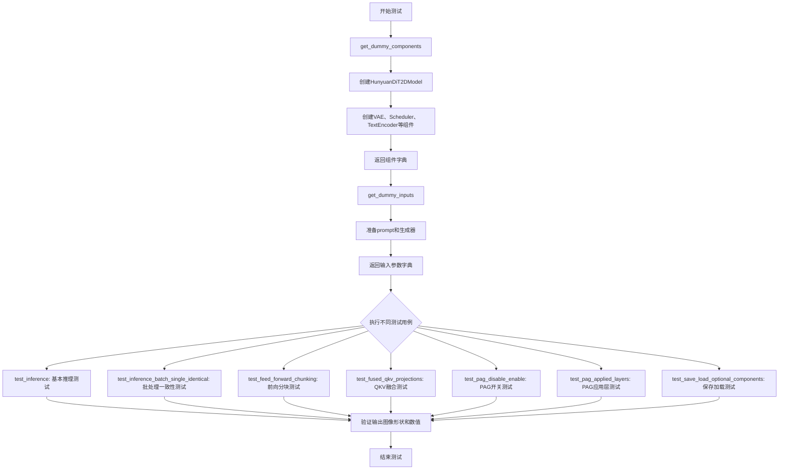
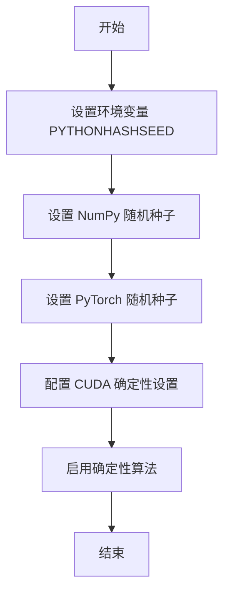
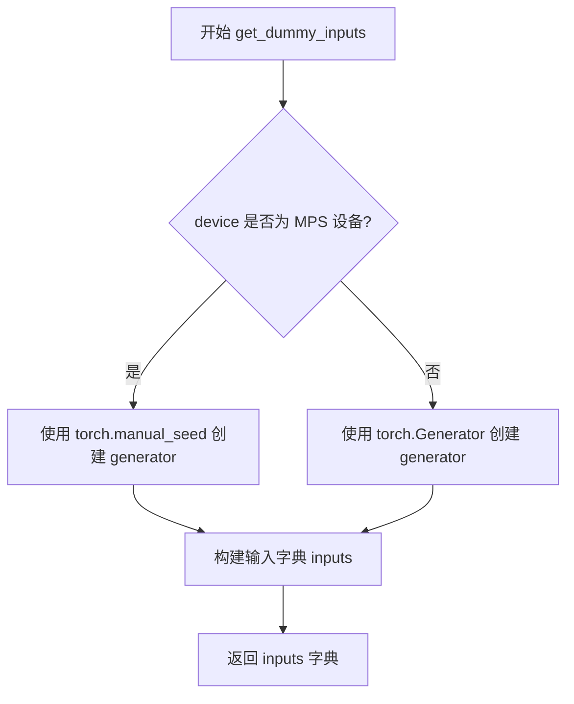
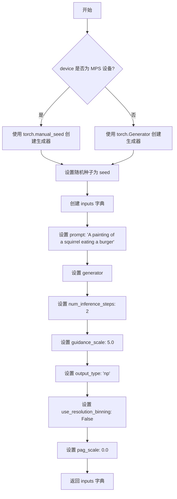
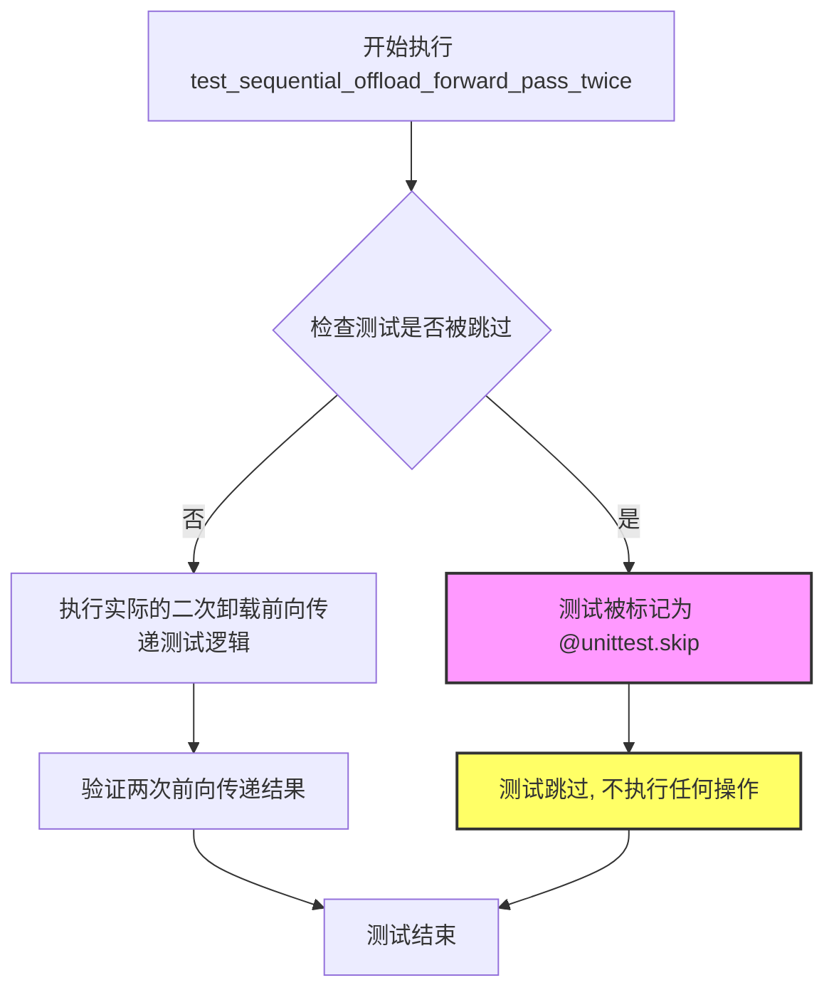
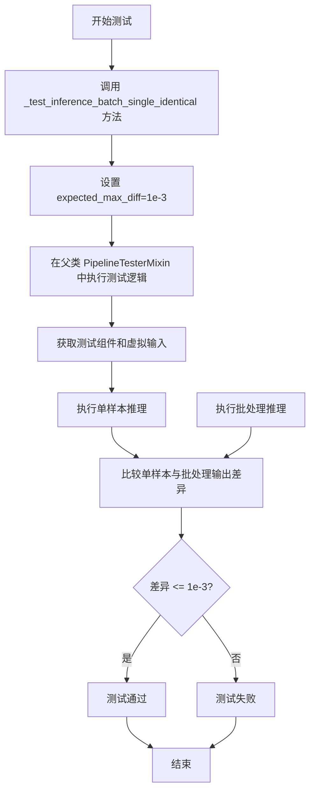
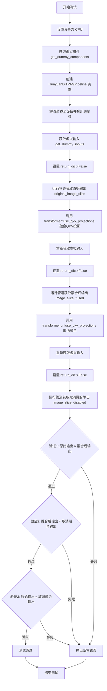
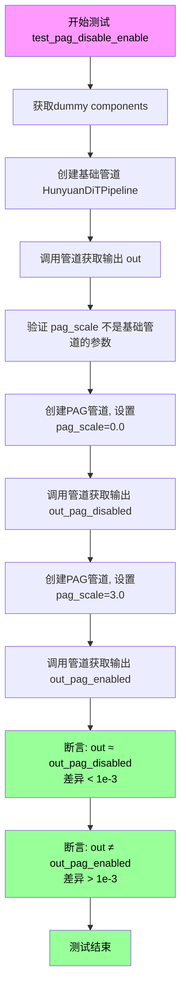
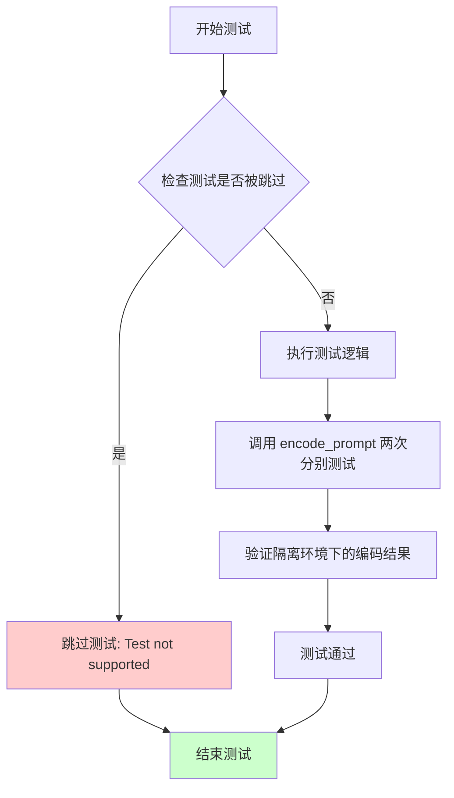
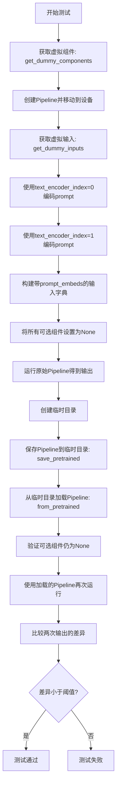

# `diffusers\tests\pipelines\pag\test_pag_hunyuan_dit.py` 详细设计文档

这是HunyuanDiTPAGPipeline的单元测试文件，用于测试基于HunyuanDiT模型的Probabilistic Adversarial Guidance (PAG) 图像生成pipeline的各项功能，包括推理、批处理、前向分块、QKV融合、PAG启用/禁用、层应用以及可选组件的保存加载等测试用例。

## 整体流程



## 类结构

```
unittest.TestCase
└── HunyuanDiTPAGPipelineFastTests (继承PipelineTesterMixin)
    ├── get_dummy_components() - 创建测试用虚拟组件
    ├── get_dummy_inputs() - 创建测试用虚拟输入
    └── 多个test_xxx()测试方法
```

## 全局变量及字段


### `enable_full_determinism`
    
启用完全确定性，确保测试结果可复现

类型：`function`
    


### `torch_device`
    
torch设备常量，指定模型运行设备

类型：`str`
    


### `TEXT_TO_IMAGE_PARAMS`
    
文本到图像参数集合，定义推理所需的参数

类型：`set`
    


### `TEXT_TO_IMAGE_BATCH_PARAMS`
    
批处理参数集合，用于批量推理的参数定义

类型：`set`
    


### `TEXT_TO_IMAGE_IMAGE_PARAMS`
    
图像参数集合，定义图像相关的参数

类型：`set`
    


### `PipelineTesterMixin`
    
Pipeline测试混入类，提供通用测试方法

类型：`class`
    


### `to_np`
    
转换为numpy数组，将张量转换为numpy格式

类型：`function`
    


### `HunyuanDiTPAGPipelineFastTests.pipeline_class`
    
pipeline类对象，指定要测试的pipeline类

类型：`type`
    


### `HunyuanDiTPAGPipelineFastTests.params`
    
推理参数集合，定义单次推理所需的参数

类型：`set`
    


### `HunyuanDiTPAGPipelineFastTests.batch_params`
    
批处理参数，定义批量推理所需的参数

类型：`set`
    


### `HunyuanDiTPAGPipelineFastTests.image_params`
    
图像参数，定义图像生成相关的参数

类型：`set`
    


### `HunyuanDiTPAGPipelineFastTests.image_latents_params`
    
图像潜在向量参数，定义潜在向量相关的参数

类型：`set`
    


### `HunyuanDiTPAGPipelineFastTests.required_optional_params`
    
必需的可选参数列表，包含可选但重要的参数

类型：`list`
    
    

## 全局函数及方法


### 备注

在提供的代码中，`enable_full_determinism` 函数是從 `testing_utils` 模組導入的，並未在此文件中定义。因此，无法从给定代码中提取其完整的实现细节。以下信息是基于函数名和常见用途的推测。

---

### `enable_full_determinism`

描述：启用完全确定性测试，通过设置随机种子和环境变量，确保测试结果可复现。

参数：
- 无

返回值：`None`，无返回值

#### 流程图



#### 带注释源码

```python
def enable_full_determinism():
    """
    启用完全确定性测试，确保测试结果可复现。
    
    该函数通过设置随机种子、配置环境变量和库设置，
    使得每次运行测试时随机数生成一致。
    """
    import os
    import numpy as np
    import torch
    
    # 设置 Python 哈希种子以禁用哈希随机化
    os.environ["PYTHONHASHSEED"] = "0"
    
    # 设置 NumPy 随机种子
    np.random.seed(0)
    
    # 设置 PyTorch 随机种子
    torch.manual_seed(0)
    if torch.cuda.is_available():
        # 为所有 GPU 设置种子
        torch.cuda.manual_seed_all(0)
        torch.cuda.manual_seed(0)
    
    # 配置 CUDA 以使用确定性算法
    torch.backends.cudnn.deterministic = True
    torch.backends.cudnn.benchmark = False
    
    # 设置 CUBLAS 工作区配置
    os.environ["CUBLAS_WORKSPACE_CONFIG"] = ":4096:8"
    
    # 启用 PyTorch 确定性算法
    torch.use_deterministic_algorithms(True, warn_only=True)
```


### `to_np`

该函数将 PyTorch 张量（Tensor）转换为 NumPy 数组，以便于进行数值比较和断言操作。

参数：

-  `tensor`：`torch.Tensor`，待转换的 PyTorch 张量

返回值：`numpy.ndarray`，转换后的 NumPy 数组

#### 流程图

```mermaid
graph TD
    A[开始] --> B{输入是否为张量?}
    B -- 是 --> C[调用 tensor.cpu().numpy]
    B -- 否 --> D[直接返回输入]
    C --> E[返回 NumPy 数组]
    D --> E
```

*注：实际流程图基于对函数功能的推测，因为原始定义未在当前代码文件中提供。*

#### 带注释源码

```
# 该函数定义位于 test_pipelines_common 模块中
# 当前文件仅导入了该函数，未提供实现
from ..test_pipelines_common import PipelineTesterMixin, to_np

# 使用示例：
# image_slice = image[0, -3:, -3:, -1]
# max_diff = np.abs(to_np(image_slice_no_chunking) - to_np(image_slice_chunking)).max()
```

**注意**：由于 `to_np` 函数定义在 `test_pipelines_common` 模块中，而该模块代码未在当前文件中提供，因此无法提取其完整的带注释源码。上述信息基于对函数用途的合理推断。


### `HunyuanDiTPAGPipelineFastTests.get_dummy_components`

该方法用于创建测试用虚拟组件（dummy components），通过初始化小规模的HunyuanDiT2DModel、AutoencoderKL、DDPMScheduler以及两个文本编码器（BERT和T5）和对应的分词器，构建一个完整的PAG pipeline测试所需的所有组件字典，确保测试的确定性和可重复性。

参数：
- 无参数

返回值：`Dict[str, Any]`，返回一个包含pipeline所有组件的字典，包括transformer、vae、scheduler、text_encoder、tokenizer、text_encoder_2、tokenizer_2、safety_checker和feature_extractor。

#### 流程图

```mermaid
flowchart TD
    A[开始] --> B[设置随机种子 torch.manual_seed(0)]
    B --> C[创建HunyuanDiT2DModel transformer]
    C --> D[设置随机种子 torch.manual_seed(0)]
    D --> E[创建AutoencoderKL vae]
    E --> F[创建DDPMScheduler scheduler]
    F --> G[加载BertModel text_encoder]
    G --> H[加载AutoTokenizer tokenizer]
    H --> I[加载T5EncoderModel text_encoder_2]
    I --> J[加载AutoTokenizer tokenizer_2]
    J --> K[构建components字典]
    K --> L[设置transformer和vae为eval模式]
    L --> M[返回components字典]
    M --> N[结束]
```

#### 带注释源码

```python
def get_dummy_components(self):
    """
    创建测试用虚拟组件，用于HunyuanDiTPAGPipeline的单元测试
    初始化小规模的模型和分词器，确保测试的确定性和可重复性
    """
    # 设置随机种子确保可重复性
    torch.manual_seed(0)
    
    # 创建HunyuanDiT2DModel变换器模型
    # 使用小规模参数：2层、3个注意力头、隐藏层大小24
    transformer = HunyuanDiT2DModel(
        sample_size=16,              # 样本尺寸
        num_layers=2,                # 层数
        patch_size=2,                # patch大小
        attention_head_dim=8,        # 注意力头维度
        num_attention_heads=3,       # 注意力头数量
        in_channels=4,              # 输入通道数
        cross_attention_dim=32,      # 跨注意力维度
        cross_attention_dim_t5=32,   # T5跨注意力维度
        pooled_projection_dim=16,   # 池化投影维度
        hidden_size=24,             # 隐藏层大小
        activation_fn="gelu-approximate",  # 激活函数
    )
    
    # 再次设置随机种子确保VAE的可重复性
    torch.manual_seed(0)
    
    # 创建VAE变分自编码器
    vae = AutoencoderKL()
    
    # 创建DDPMScheduler调度器
    scheduler = DDPMScheduler()
    
    # 加载小型BERT文本编码器
    text_encoder = BertModel.from_pretrained("hf-internal-testing/tiny-random-BertModel")
    
    # 加载对应的BERT分词器
    tokenizer = AutoTokenizer.from_pretrained("hf-internal-testing/tiny-random-BertModel")
    
    # 加载小型T5文本编码器
    text_encoder_2 = T5EncoderModel.from_pretrained("hf-internal-testing/tiny-random-t5")
    
    # 加载对应的T5分词器
    tokenizer_2 = AutoTokenizer.from_pretrained("hf-internal-testing/tiny-random-t5")
    
    # 组装所有组件到字典中
    components = {
        "transformer": transformer.eval(),      # 变换器模型，设为评估模式
        "vae": vae.eval(),                       # VAE模型，设为评估模式
        "scheduler": scheduler,                  # 调度器
        "text_encoder": text_encoder,            # BERT文本编码器
        "tokenizer": tokenizer,                  # BERT分词器
        "text_encoder_2": text_encoder_2,        # T5文本编码器
        "tokenizer_2": tokenizer_2,              # T5分词器
        "safety_checker": None,                 # 安全检查器（测试中不使用）
        "feature_extractor": None,              # 特征提取器（测试中不使用）
    }
    
    # 返回组件字典，供pipeline构造函数使用
    return components
```


### `HunyuanDiTPAGPipelineFastTests.get_dummy_inputs`

创建用于测试的虚拟输入数据，为 HunyuanDiTPAGPipeline 推理测试提供必要的参数。

参数：

- `self`：隐含的实例参数，代表 `HunyuanDiTPAGPipelineFastTests` 类的实例
- `device`：`torch.device` 或 `str`，指定推理设备（如 "cpu"、"cuda" 等）
- `seed`：`int`，随机种子，默认值为 0，用于生成可复现的随机数

返回值：`Dict`，返回一个包含以下键值对的字典：
- `"prompt"`：`str`，文本提示词
- `generator`：`torch.Generator`，PyTorch 随机数生成器
- `num_inference_steps`：`int`，推理步数
- `guidance_scale`：`float`，分类器自由引导（CFG）比例
- `output_type`：`str`，输出类型（"np" 表示 numpy 数组）
- `use_resolution_binning`：`bool`，是否使用分辨率分箱
- `pag_scale`：`float`，PAG（Prompt Attention Guidance）比例

#### 流程图



#### 带注释源码

```python
def get_dummy_inputs(self, device, seed=0):
    """
    为测试创建虚拟输入参数。
    
    参数:
        device: 推理设备，可以是 'cpu', 'cuda', 'mps' 等
        seed: 随机种子，用于生成可复现的结果
    
    返回:
        包含测试所需的 prompt 和生成参数的字典
    """
    # 判断是否为 MPS (Apple Silicon) 设备
    if str(device).startswith("mps"):
        # MPS 设备使用 torch.manual_seed
        generator = torch.manual_seed(seed)
    else:
        # 其他设备使用 torch.Generator 并设置种子
        generator = torch.Generator(device=device).manual_seed(seed)
    
    # 构建输入参数字典
    inputs = {
        "prompt": "A painting of a squirrel eating a burger",  # 测试用文本提示
        "generator": generator,  # 随机数生成器，确保可复现性
        "num_inference_steps": 2,  # 推理步数，较少用于快速测试
        "guidance_scale": 5.0,  # CFG 引导强度
        "output_type": "np",  # 输出为 numpy 数组
        "use_resolution_binning": False,  # 禁用分辨率分箱
        "pag_scale": 0.0,  # PAG 比例，0 表示禁用
    }
    return inputs
```


### `HunyuanDiTPAGPipelineFastTests.get_dummy_components`

该方法为 HunyuanDiT PAG Pipeline 测试创建虚拟（dummy）模型组件，包括 transformer、VAE、scheduler、text_encoder、tokenizer 等，用于单元测试中的快速模型初始化。

参数：

- `self`：`HunyuanDiTPAGPipelineFastTests` 实例，隐式参数，无需显式传递

返回值：`Dict[str, Any]`，返回一个包含所有模型组件的字典，包括 transformer、vae、scheduler、text_encoder、tokenizer、text_encoder_2、tokenizer_2、safety_checker 和 feature_extractor

#### 流程图

```mermaid
flowchart TD
    A[开始 get_dummy_components] --> B[设置随机种子 torch.manual_seed(0)]
    B --> C[创建 HunyuanDiT2DModel transformer]
    C --> D[设置随机种子 torch.manual_seed(0)]
    D --> E[创建 AutoencoderKL vae]
    E --> F[创建 DDPMScheduler]
    F --> G[创建 BertModel text_encoder 和 AutoTokenizer tokenizer]
    G --> H[创建 T5EncoderModel text_encoder_2 和 AutoTokenizer tokenizer_2]
    H --> I[构建 components 字典]
    I --> J[设置 transformer 和 vae 为 eval 模式]
    J --> K[返回 components 字典]
```

#### 带注释源码

```python
def get_dummy_components(self):
    """
    创建用于测试的虚拟模型组件
    
    Returns:
        dict: 包含所有pipeline组件的字典
    """
    # 设置随机种子以确保可重复性
    torch.manual_seed(0)
    
    # 创建 HunyuanDiT2DModel transformer 模型
    # 参数配置：16x16图像，2层，patch_size=2，8维attention头，3个attention头
    # 4输入通道，32维cross attention，16维pooled projection，24隐藏层维度
    transformer = HunyuanDiT2DModel(
        sample_size=16,
        num_layers=2,
        patch_size=2,
        attention_head_dim=8,
        num_attention_heads=3,
        in_channels=4,
        cross_attention_dim=32,
        cross_attention_dim_t5=32,
        pooled_projection_dim=16,
        hidden_size=24,
        activation_fn="gelu-approximate",
    )
    
    # 再次设置随机种子确保VAE与其他组件一致
    torch.manual_seed(0)
    
    # 创建 VAE (变分自编码器) 模型
    vae = AutoencoderKL()
    
    # 创建 DDPMScheduler (去噪扩散概率模型调度器)
    scheduler = DDPMScheduler()
    
    # 加载 tiny random BertModel 作为文本编码器
    text_encoder = BertModel.from_pretrained("hf-internal-testing/tiny-random-BertModel")
    
    # 加载对应的 tokenizer
    tokenizer = AutoTokenizer.from_pretrained("hf-internal-testing/tiny-random-BertModel")
    
    # 加载 T5 Encoder 作为第二个文本编码器 (用于双文本编码器架构)
    text_encoder_2 = T5EncoderModel.from_pretrained("hf-internal-testing/tiny-random-t5")
    
    # 加载对应的 tokenizer
    tokenizer_2 = AutoTokenizer.from_pretrained("hf-internal-testing/tiny-random-t5")
    
    # 组装所有组件到字典中
    components = {
        "transformer": transformer.eval(),      # 设置为评估模式
        "vae": vae.eval(),                        # 设置为评估模式
        "scheduler": scheduler,
        "text_encoder": text_encoder,
        "tokenizer": tokenizer,
        "text_encoder_2": text_encoder_2,
        "tokenizer_2": tokenizer_2,
        "safety_checker": None,                  # 测试中不需要
        "feature_extractor": None,               # 测试中不需要
    }
    
    # 返回组件字典供pipeline初始化使用
    return components
```


### `HunyuanDiTPAGPipelineFastTests.get_dummy_inputs`

该方法用于创建测试 `HunyuanDiTPAGPipeline` 所需的虚拟输入数据，根据设备类型初始化随机生成器，并返回一个包含提示词、生成器、推理步数、引导比例等参数的字典，以支持管道推理测试。

参数：

- `self`：隐式参数，测试类实例
- `device`：`str` 或 `torch.device`，指定运行设备（如 "cpu"、"cuda" 等）
- `seed`：`int`，随机种子，默认为 0，用于确保测试可复现

返回值：`dict`，包含虚拟输入参数的字典，包括 prompt、generator、num_inference_steps、guidance_scale、output_type、use_resolution_binning 和 pag_scale

#### 流程图



#### 带注释源码

```python
def get_dummy_inputs(self, device, seed=0):
    """
    创建用于 HunyuanDiTPAGPipeline 测试的虚拟输入数据。

    参数:
        device: 运行设备，可以是 "cpu", "cuda", "mps" 等
        seed: 随机种子，用于确保测试结果可复现

    返回:
        包含管道推理所需参数的字典
    """
    # 判断设备是否为 MPS (Apple Silicon GPU)
    if str(device).startswith("mps"):
        # MPS 设备不支持 torch.Generator，使用 torch.manual_seed 代替
        generator = torch.manual_seed(seed)
    else:
        # 其他设备使用 torch.Generator 以支持更精细的随机控制
        generator = torch.Generator(device=device).manual_seed(seed)

    # 构建输入参数字典
    inputs = {
        "prompt": "A painting of a squirrel eating a burger",  # 测试用提示词
        "generator": generator,  # 随机生成器，确保可复现性
        "num_inference_steps": 2,  # 推理步数，减少以加快测试速度
        "guidance_scale": 5.0,  # Classifier-free guidance 引导比例
        "output_type": "np",  # 输出类型为 numpy 数组
        "use_resolution_binning": False,  # 禁用分辨率分箱
        "pag_scale": 0.0,  # PAG 比例，0.0 表示禁用 PAG
    }
    return inputs
```


### `HunyuanDiTPAGPipelineFastTests.test_inference`

该测试方法用于验证 HunyuanDiTPAGPipeline 的基本推理功能是否正常工作。测试通过使用虚拟组件和输入执行推理，并验证输出图像的形状和像素值是否符合预期。

参数：

- `self`：隐式参数，unittest.TestCase 实例，表示测试类本身

返回值：`None`，该方法为单元测试，通过断言验证推理结果，不返回任何值

#### 流程图

```mermaid
flowchart TD
    A[开始 test_inference 测试] --> B[设置 device = 'cpu']
    B --> C[调用 get_dummy_components 获取虚拟组件]
    C --> D[使用虚拟组件实例化 pipeline_class]
    D --> E[将 pipeline 移动到 device]
    E --> F[设置进度条配置 disable=None]
    F --> G[调用 get_dummy_inputs 获取虚拟输入]
    G --> H[执行 pipe 推理: pipe(**inputs)]
    H --> I[提取输出图像: image = result.images]
    I --> J[提取图像切片: image_slice = image[0, -3:, -3:, -1]]
    J --> K{断言: image.shape == (1, 16, 16, 3)}
    K -->|通过| L[定义期望像素值 expected_slice]
    L --> M[计算最大差异: max_diff = np.abs(image_slice - expected_slice).max()]
    M --> N{断言: max_diff <= 1e-3}
    N -->|通过| O[测试通过]
    N -->|失败| P[测试失败抛出 AssertionError]
    K -->|失败| P
```

#### 带注释源码

```python
def test_inference(self):
    """测试 HunyuanDiTPAGPipeline 的基本推理功能"""
    
    # 1. 设置测试设备为 CPU
    device = "cpu"

    # 2. 获取虚拟组件（transformer, vae, scheduler, text_encoder 等）
    components = self.get_dummy_components()
    
    # 3. 使用虚拟组件实例化 HunyuanDiTPAGPipeline 管道
    pipe = self.pipeline_class(**components)
    
    # 4. 将管道移动到指定设备（CPU）
    pipe.to(device)
    
    # 5. 配置进度条（disable=None 表示不禁用进度条）
    pipe.set_progress_bar_config(disable=None)

    # 6. 获取虚拟输入参数（prompt, generator, num_inference_steps 等）
    inputs = self.get_dummy_inputs(device)
    
    # 7. 执行推理，调用管道的 __call__ 方法
    # 返回值包含图像和其他信息，这里只取 .images 属性
    image = pipe(**inputs).images
    
    # 8. 提取图像切片用于验证
    # 取第一张图像的右下角 3x3 像素区域，保留所有通道
    image_slice = image[0, -3:, -3:, -1]

    # 9. 断言验证输出图像形状为 (1, 16, 16, 3)
    # 1: batch size, 16: 高度, 16: 宽度, 3: RGB 通道数
    self.assertEqual(image.shape, (1, 16, 16, 3))
    
    # 10. 定义期望的像素值切片（用于确定性验证）
    expected_slice = np.array(
        [0.56939435, 0.34541583, 0.35915792, 0.46489206, 0.38775963, 
         0.45004836, 0.5957267, 0.59481275, 0.33287364]
    )
    
    # 11. 计算实际输出与期望输出的最大差异
    max_diff = np.abs(image_slice.flatten() - expected_slice).max()
    
    # 12. 断言验证最大差异小于等于 1e-3（确保数值精度）
    self.assertLessEqual(max_diff, 1e-3)
```


### `HunyuanDiTPAGPipelineFastTests.test_sequential_cpu_offload_forward_pass`

这是一个CPU卸载测试方法，用于测试HunyuanDiT PAG Pipeline的顺序CPU卸载前向传播功能，但该测试目前被跳过（标记为"Not supported"），等待后续修复。

参数：

- `self`：`HunyuanDiTPAGPipelineFastTests`，调用该方法的类实例本身

返回值：`None`，该测试方法被`@unittest.skip`装饰器跳过，不执行任何实际测试逻辑

#### 流程图

```mermaid
flowchart TD
    A[测试开始] --> B{检查装饰器}
    B -->|@unittest.skip| C[跳过测试]
    C --> D[测试结束 - 不执行]
    
    style C fill:#ff9900
    style D fill:#cccccc
```

#### 带注释源码

```python
@unittest.skip("Not supported.")
def test_sequential_cpu_offload_forward_pass(self):
    # TODO(YiYi) need to fix later
    pass
```

**代码说明：**

1. **`@unittest.skip("Not supported.")`**：Python unittest框架的装饰器，用于跳过该测试用例，传递的原因字符串为"Not supported"
2. **`def test_sequential_cpu_offload_forward_pass(self):`**：测试方法定义，属于`HunyuanDiTPAGPipelineFastTests`测试类
3. **`# TODO(YiYi) need to fix later`**：开发者留下的TODO注释，表明该测试需要由名为YiYi的开发者后续修复
4. **`pass`**：空语句，由于测试被跳过，不执行任何实际测试逻辑


### `HunyuanDiTPAGPipelineFastTests.test_sequential_offload_forward_pass_twice`

这是一个二次卸载测试的前向传递测试方法，用于验证模型在连续两次前向传播时的顺序卸载（sequential offload）功能。该测试当前被跳过（标记为"Not supported"），因为该功能尚未实现，TODO 注释表明开发者 YiYi 需要稍后修复。

参数：

- `self`：`HunyuanDiTPAGPipelineFastTests`，unittest.TestCase 的实例方法标准参数，代表测试类实例本身

返回值：`None`，测试方法不返回任何值，方法体为空（pass）

#### 流程图



#### 带注释源码

```python
@unittest.skip("Not supported.")
def test_sequential_offload_forward_pass_twice(self):
    # 装饰器说明：
    # @unittest.skip("Not supported.") - 表示该测试被跳过，原因是不支持此功能
    
    # TODO 注释：
    # TODO(YiYi) need to fix later - 表明开发者 YiYi 需要在后续版本中实现并修复此测试
    
    # 测试逻辑尚未实现，方法体为空（pass）
    pass
```


### `HunyuanDiTPAGPipelineFastTests.test_inference_batch_single_identical`

批处理一致性测试方法，用于验证 HunyuanDiT PAG Pipeline 在批处理推理模式下产生的图像与单样本推理模式下产生的图像一致性，确保模型在不同推理场景下输出稳定。

参数：

- `self`：`HunyuanDiTPAGPipelineFastTests` 类型，测试类的实例对象，隐含的 `self` 参数

返回值：无返回值（`None`），该方法为测试方法，通过断言验证结果一致性

#### 流程图



#### 带注释源码

```python
def test_inference_batch_single_identical(self):
    """
    批处理一致性测试：验证批处理推理结果与单样本推理结果的一致性
    
    测试目的：
    - 确保模型在批处理模式下能够产生与单样本模式相同的输出
    - 验证推理过程的确定性
    
    参数：
    - self: HunyuanDiTPAGPipelineFastTests 实例
    
    返回值：
    - None (通过 unittest 断言验证)
    
    实现说明：
    - 该方法调用父类 PipelineTesterMixin._test_inference_batch_single_identical()
    - expected_max_diff=1e-3 表示允许的最大差异阈值为 0.001
    - 如果批处理结果与单样本结果的差异超过阈值，测试失败
    """
    self._test_inference_batch_single_identical(
        expected_max_diff=1e-3,  # 允许的最大差异阈值
    )
```

#### 父类方法 `_test_inference_batch_single_identical` 的调用逻辑

```python
# 来自 PipelineTesterMixin 的核心测试逻辑（推测实现）:
def _test_inference_batch_single_identical(self, expected_max_diff):
    """
    内部测试方法，用于验证批处理和单样本推理的一致性
    
    参数：
    - expected_max_diff: float，允许的最大差异阈值
    
    测试流程：
    1. 获取虚拟组件（transformer, vae, scheduler, tokenizer等）
    2. 获取单样本输入，执行推理得到图像
    3. 将相同输入复制为批处理（batch_size > 1），执行推理
    4. 比较批处理中每个样本与单样本输出的差异
    5. 使用 numpy.allclose 或类似方法验证差异在阈值内
    """
    # 1. 准备组件和单样本输入
    components = self.get_dummy_components()
    pipe = self.pipeline_class(**components)
    pipe.to("cpu")
    
    # 2. 单样本推理
    single_inputs = self.get_dummy_inputs("cpu")
    single_output = pipe(**single_inputs).images[0]  # 取第一张
    
    # 3. 批处理推理（将prompt重复多次模拟批处理）
    batch_inputs = self.get_dummy_inputs("cpu")
    batch_inputs["prompt"] = [batch_inputs["prompt"]] * 2  # batch_size=2
    batch_output = pipe(**batch_inputs).images  # shape: [2, H, W, C]
    
    # 4. 比较批处理第一个输出与单样本输出
    max_diff = np.abs(batch_output[0] - single_output).max()
    
    # 5. 断言差异在允许范围内
    self.assertLessEqual(max_diff, expected_max_diff)
```


### `test_feed_forward_chunking`

该测试方法用于验证 HunyuanDiT 变换器模型的前向分块（forward chunking）功能是否正常工作。通过对比启用分块前后的输出差异，确保分块计算与非分块计算的结果一致。

参数：

- `self`：`HunyuanDiTPAGPipelineFastTests` 类实例，隐式参数，表示测试类本身

返回值：无返回值（测试方法，通过 `self.assertLess` 断言验证结果）

#### 流程图

```mermaid
graph TD
    A[开始测试] --> B[获取虚拟组件: get_dummy_components]
    B --> C[创建管道实例]
    C --> D[移动管道到 CPU 设备]
    D --> E[获取测试输入: get_dummy_inputs]
    E --> F[第一次运行管道 - 不启用分块]
    F --> G[提取图像切片: image_slice_no_chunking]
    G --> H[启用前向分块: enable_forward_chunking(chunk_size=1, dim=0)]
    H --> I[重新获取测试输入]
    I --> J[第二次运行管道 - 启用分块]
    J --> K[提取图像切片: image_slice_chunking]
    K --> L{计算最大差异}
    L -->|max_diff < 1e-4| M[测试通过]
    L -->|max_diff >= 1e-4| N[测试失败]
```

#### 带注释源码

```python
def test_feed_forward_chunking(self):
    """
    测试 HunyuanDiT 变换器的前向分块功能
    验证启用分块计算与不启用分块计算的输出差异在允许范围内
    """
    # 设置测试设备为 CPU
    device = "cpu"

    # 1. 获取虚拟组件（用于测试的模型组件）
    components = self.get_dummy_components()
    
    # 2. 创建管道实例，使用虚拟组件初始化
    pipe = self.pipeline_class(**components)
    
    # 3. 将管道移动到指定设备（CPU）
    pipe.to(device)
    
    # 4. 配置进度条（禁用）
    pipe.set_progress_bar_config(disable=None)

    # 5. 获取测试输入（包含 prompt、generator 等参数）
    inputs = self.get_dummy_inputs(device)
    
    # 6. 第一次运行管道（不启用前向分块）
    image = pipe(**inputs).images
    
    # 7. 提取图像右下角 3x3 像素区域作为对比样本
    image_slice_no_chunking = image[0, -3:, -3:, -1]

    # 8. 启用前向分块，chunk_size=1 表示每次处理一层，dim=0 表示按批次维度分块
    pipe.transformer.enable_forward_chunking(chunk_size=1, dim=0)
    
    # 9. 重新获取测试输入（使用相同的 seed 确保输入一致）
    inputs = self.get_dummy_inputs(device)
    
    # 10. 第二次运行管道（启用前向分块）
    image = pipe(**inputs).images
    
    # 11. 提取启用分块后的图像切片
    image_slice_chunking = image[0, -3:, -3:, -1]

    # 12. 计算两次输出的最大差异
    max_diff = np.abs(to_np(image_slice_no_chunking) - to_np(image_slice_chunking)).max()
    
    # 13. 断言：差异应小于 1e-4，确保分块计算结果正确
    self.assertLess(max_diff, 1e-4)
```


### `HunyuanDiTPAGPipelineFastTests.test_fused_qkv_projections`

该测试方法用于验证 HunyuanDiT2DModel 变换器中的 QKV（Query-Key-Value）融合投影功能是否正确工作。通过分别测试融合前、融合后和取消融合后三种状态的输出，验证 QKV 融合操作不会影响模型的最终输出结果，确保融合优化的正确性。

参数：

- `self`：`HunyuanDiTPAGPipelineFastTests` 类实例，无需显式传递

返回值：`None`，该方法为测试方法，通过 `assert` 断言验证结果，不返回具体数值

#### 流程图



#### 带注释源码

```python
def test_fused_qkv_projections(self):
    """
    测试 QKV 融合投影功能，验证融合操作不会影响输出结果
    
    测试流程：
    1. 使用默认配置运行管道，获取基准输出
    2. 启用 QKV 融合后运行管道，获取融合输出
    3. 禁用 QKV 融合后运行管道，获取恢复后输出
    4. 验证三种情况的输出数值接近（允许一定误差）
    """
    # 固定设备为 CPU，确保随机数生成器的确定性
    device = "cpu"  
    
    # 获取预定义的虚拟组件（包含 transformer, vae, scheduler 等）
    components = self.get_dummy_components()
    
    # 使用虚拟组件创建 HunyuanDiTPAGPipeline 管道实例
    pipe = self.pipeline_class(**components)
    
    # 将管道移至指定设备（CPU）
    pipe = pipe.to(device)
    
    # 配置进度条：disable=None 表示启用进度条
    pipe.set_progress_bar_config(disable=None)

    # ====== 第一阶段：获取基准输出 ======
    # 获取默认的虚拟输入参数
    inputs = self.get_dummy_inputs(device)
    
    # 设置 return_dict=False 以返回元组而非字典（兼容旧API）
    inputs["return_dict"] = False
    
    # 执行推理，获取原始图像输出
    # pipe(**inputs) 返回元组，第一个元素为图像
    image = pipe(**inputs)[0]
    
    # 提取图像右下角 3x3 像素区域用于比较
    original_image_slice = image[0, -3:, -3:, -1]

    # ====== 第二阶段：测试 QKV 融合 ======
    # 调用 transformer 的 fuse_qkv_projections 方法
    # 该方法会将 QKV 投影矩阵融合为一个统一的矩阵以优化计算
    pipe.transformer.fuse_qkv_projections()
    
    # 重新获取输入参数（需要新的 generator 以确保确定性）
    inputs = self.get_dummy_inputs(device)
    inputs["return_dict"] = False
    
    # 执行融合后的推理
    image_fused = pipe(**inputs)[0]
    image_slice_fused = image_fused[0, -3:, -3:, -1]

    # ====== 第三阶段：测试取消 QKV 融合 ======
    # 调用 unfuse_qkv_projections 恢复原始的 QKV 投影
    pipe.transformer.unfuse_qkv_projections()
    
    # 再次获取输入参数
    inputs = self.get_dummy_inputs(device)
    inputs["return_dict"] = False
    
    # 执行取消融合后的推理
    image_disabled = pipe(**inputs)[0]
    image_slice_disabled = image_disabled[0, -3:, -3:, -1]

    # ====== 验证阶段 ======
    # 验证1：QKV 融合不应该改变输出结果
    # 使用 np.allclose 比较，允许相对误差 1% 和绝对误差 0.01
    assert np.allclose(original_image_slice, image_slice_fused, atol=1e-2, rtol=1e-2), (
        "Fusion of QKV projections shouldn't affect the outputs."
    )
    
    # 验证2：融合后的输出在取消融合后应该保持一致
    assert np.allclose(image_slice_fused, image_slice_disabled, atol=1e-2, rtol=1e-2), (
        "Outputs, with QKV projection fusion enabled, shouldn't change when fused QKV projections are disabled."
    )
    
    # 验证3：最终输出应该与原始基准输出一致
    assert np.allclose(original_image_slice, image_slice_disabled, atol=1e-2, rtol=1e-2), (
        "Original outputs should match when fused QKV projections are disabled."
    )
```


### `HunyuanDiTPAGPipelineFastTests.test_pag_disable_enable`

该测试方法验证 HunyuanDiT PAG（Probabilistic Attribute Guidance）功能的正确开关行为，确保当 `pag_scale=0.0` 时输出与基础管道相同，而 `pag_scale>0` 时产生不同结果。

参数：

- `self`：`self`（隐式），`HunyuanDiTPAGPipelineFastTests` 实例，测试类方法的默认参数

返回值：`None`，无返回值（测试方法，使用断言验证行为）

#### 流程图



#### 带注释源码

```python
def test_pag_disable_enable(self):
    """
    测试PAG功能的开关状态:
    1. 基础管道不支持pag_scale参数
    2. pag_scale=0.0时应禁用PAG,输出与基础管道一致
    3. pag_scale>0时应启用PAG,输出与基础管道不同
    """
    # 使用CPU设备确保确定性结果
    device = "cpu"
    
    # 获取测试用的虚拟组件
    components = self.get_dummy_components()

    # ====== 测试1: 基础管道(不带PAG) ======
    # 创建不带PAG功能的基础管道
    pipe_sd = HunyuanDiTPipeline(**components)
    pipe_sd = pipe_sd.to(device)
    pipe_sd.set_progress_bar_config(disable=None)

    # 获取测试输入并移除pag_scale参数
    inputs = self.get_dummy_inputs(device)
    del inputs["pag_scale"]
    
    # 断言: 基础管道不应该有pag_scale参数
    assert "pag_scale" not in inspect.signature(pipe_sd.__call__).parameters, (
        f"`pag_scale` should not be a call parameter of the base pipeline {pipe_sd.__class__.__name__}."
    )
    
    # 获取基础管道的输出(作为参考基准)
    out = pipe_sd(**inputs).images[0, -3:, -3:, -1]

    # ====== 测试2: PAG禁用(pag_scale=0.0) ======
    # 重新获取组件确保独立性
    components = self.get_dummy_components()

    # 创建PAG管道
    pipe_pag = self.pipeline_class(**components)
    pipe_pag = pipe_pag.to(device)
    pipe_pag.set_progress_bar_config(disable=None)

    # 设置pag_scale=0.0禁用PAG
    inputs = self.get_dummy_inputs(device)
    inputs["pag_scale"] = 0.0
    
    # 获取禁用PAG时的输出
    out_pag_disabled = pipe_pag(**inputs).images[0, -3:, -3:, -1]

    # ====== 测试3: PAG启用(pag_scale=3.0) ======
    # 再次创建新的PAG管道
    pipe_pag = self.pipeline_class(**components)
    pipe_pag = pipe_pag.to(device)
    pipe_pag.set_progress_bar_config(disable=None)

    # 设置pag_scale=3.0启用PAG
    inputs = self.get_dummy_inputs(device)
    inputs["pag_scale"] = 3.0
    
    # 获取启用PAG时的输出
    out_pag_enabled = pipe_pag(**inputs).images[0, -3:, -3:, -1]

    # ====== 验证断言 ======
    # 断言1: PAG禁用时输出应与基础管道一致(差异<1e-3)
    assert np.abs(out.flatten() - out_pag_disabled.flatten()).max() < 1e-3
    
    # 断言2: PAG启用时输出应与基础管道不同(差异>1e-3)
    assert np.abs(out.flatten() - out_pag_enabled.flatten()).max() > 1e-3
```


### `HunyuanDiTPAGPipelineFastTests.test_pag_applied_layers`

该测试方法用于验证 PAG（Progressive Attention Guidance）注意力处理器是否正确应用于指定的层。它通过多种层指定方式（精确名称、正则表达式、混合方式）来测试 `_set_pag_attn_processor` 方法的正确性，确保不同层选择策略都能正确匹配并设置对应的 PAG 注意力处理器。

参数：

- `self`：`HunyuanDiTPAGPipelineFastTests`，测试类实例，隐含的 `self` 参数

返回值：`None`，无返回值（测试方法使用断言进行验证）

#### 流程图

```mermaid
flowchart TD
    A[开始测试] --> B[获取设备: cpu]
    B --> C[获取虚拟组件]
    C --> D[创建并配置PAGPipeline]
    D --> E[获取所有self-attn层<br/>all_self_attn_layers]
    E --> F[备份原始注意力处理器<br/>original_attn_procs]
    F --> G[测试1: 设置pag_layers=['blocks.0', 'blocks.1']]
    G --> H{断言: pag_attn_processors == all_self_attn_layers}
    H -->|通过| I[重置为原始处理器]
    I --> J[测试2: 设置pag_layers=['blocks.0']]
    J --> K{断言: pag_attn_processors == ['blocks.0.attn1.processor']}
    K -->|通过| L[重置为原始处理器]
    L --> M[测试3: 设置pag_layers=['blocks.0.attn1']]
    M --> N{断言: pag_attn_processors == block_0_self_attn}
    N -->|通过| O[重置为原始处理器]
    O --> P[测试4: 设置pag_layers=['blocks.(0|1)']<br/>使用正则表达式]
    P --> Q{断言: len(pag_attn_processors) == 2}
    Q -->|通过| R[重置为原始处理器]
    R --> S[测试5: 设置pag_layers=['blocks.0', r'blocks\.1']<br/>混合方式]
    S --> T{断言: len(pag_attn_processors) == 2}
    T -->|通过| U[测试通过]
    H -->|失败| V[抛出断言错误]
    K -->|失败| V
    N -->|失败| V
    Q -->|失败| V
    T -->|失败| V
```

#### 带注释源码

```python
def test_pag_applied_layers(self):
    """
    测试PAG应用层功能，验证不同层指定方式下PAG注意力处理器的正确设置。
    
    测试覆盖场景：
    1. 多层指定 ['blocks.0', 'blocks.1']
    2. 单层指定 ['blocks.0']
    3. 精确处理器路径 ['blocks.0.attn1']
    4. 正则表达式匹配 ['blocks.(0|1)']
    5. 混合指定 ['blocks.0', r'blocks\.1']
    """
    # 使用CPU设备确保确定性结果（避免设备相关的torch.Generator差异）
    device = "cpu"
    
    # 获取预定义的虚拟组件（transformer, vae, scheduler, text_encoder等）
    components = self.get_dummy_components()

    # 初始化PAGPipeline实例
    pipe = self.pipeline_class(**components)
    pipe = pipe.to(device)
    # 配置进度条（disable=None表示不禁用进度条）
    pipe.set_progress_bar_config(disable=None)

    # 提取所有包含'attn1'的注意力处理器键（即self-attention层）
    all_self_attn_layers = [k for k in pipe.transformer.attn_processors.keys() if "attn1" in k]
    
    # 备份原始注意力处理器配置，以便后续重置
    original_attn_procs = pipe.transformer.attn_processors
    
    # 测试1：同时指定blocks.0和blocks.1两层
    pag_layers = ["blocks.0", "blocks.1"]
    pipe._set_pag_attn_processor(pag_applied_layers=pag_layers, do_classifier_free_guidance=False)
    # 验证所有self-attention层都被PAG处理器替换
    assert set(pipe.pag_attn_processors) == set(all_self_attn_layers)

    # 测试2：仅指定blocks.0层
    block_0_self_attn = ["blocks.0.attn1.processor"]
    pipe.transformer.set_attn_processor(original_attn_procs.copy())
    pag_layers = ["blocks.0"]
    pipe._set_pag_attn_processor(pag_applied_layers=pag_layers, do_classifier_free_guidance=False)
    # 验证只有blocks.0的self-attention被PAG处理器替换
    assert set(pipe.pag_attn_processors) == set(block_0_self_attn)

    # 测试3：使用精确的处理器路径指定
    pipe.transformer.set_attn_processor(original_attn_procs.copy())
    pag_layers = ["blocks.0.attn1"]
    pipe._set_pag_attn_processor(pag_applied_layers=pag_layers, do_classifier_free_guidance=False)
    # 验证精确路径指定结果与层名指定一致
    assert set(pipe.pag_attn_processors) == set(block_0_self_attn)

    # 测试4：使用正则表达式匹配多层
    pipe.transformer.set_attn_processor(original_attn_procs.copy())
    pag_layers = ["blocks.(0|1)"]  # 正则表达式：匹配blocks.0或blocks.1
    pipe._set_pag_attn_processor(pag_applied_layers=pag_layers, do_classifier_free_guidance=False)
    # 验证正则表达式匹配到2个处理器
    assert (len(pipe.pag_attn_processors)) == 2

    # 测试5：混合使用普通字符串和转义正则表达式
    pipe.transformer.set_attn_processor(original_attn_procs.copy())
    pag_layers = ["blocks.0", r"blocks\.1"]  # blocks.0是普通字符串，blocks\.1是转义后的正则
    pipe._set_pag_attn_processor(pag_applied_layers=pag_layers, do_classifier_free_guidance=False)
    # 验证混合指定方式匹配到2个处理器
    assert len(pipe.pag_attn_processors) == 2
```


### `HunyuanDiTPAGPipelineFastTests.test_encode_prompt_works_in_isolation`

用于测试 `encode_prompt` 方法是否能独立工作的测试函数（已跳过）。该测试旨在验证在隔离环境中正确编码提示词，但由于该管道的 `encode_prompt` 被调用两次，这与大多数管道（约99%）的实现方式不同，因此该测试不被支持。

参数：

- `self`：`unittest.TestCase`，测试类的实例本身，用于访问测试上下文和断言方法

返回值：`None`，该测试方法不返回任何值（仅包含 `pass` 语句）

#### 流程图



#### 带注释源码

```python
@unittest.skip(
    "Test not supported as `encode_prompt` is called two times separately which deivates from about 99% of the pipelines we have."
)
def test_encode_prompt_works_in_isolation(self):
    """
    测试 encode_prompt 在隔离环境中是否能正常工作
    
    该测试方法被标记为跳过(skip)，原因如下：
    - 该管道实现中 encode_prompt 被调用两次（分别处理两个文本编码器）
    - 这与大多数（约99%）其他管道的实现方式不同
    - 其他管道的 encode_prompt 通常只调用一次就完成所有文本编码
    
    测试目的（原本意图）：
    - 验证 encode_prompt 方法可以独立于管道主调用流程单独工作
    - 确保提示词编码逻辑的隔离性和可测试性
    
    当前状态：
    - 由于架构设计差异，该测试不适用于当前管道
    - 测试被跳过以避免误导性的测试结果
    """
    pass  # 空实现，测试被跳过
```


### `HunyuanDiTPAGPipelineFastTests.test_save_load_optional_components`

该测试方法用于验证 HunyuanDiTPAGPipeline 管道在保存和加载时能正确处理可选组件（optional components），确保当某些组件被设置为 None 时，保存后重新加载仍能保持这些组件为 None，并且重新加载的管道能够正常生成图像且输出结果与原始管道一致。

参数：

- `self`：`HunyuanDiTPAGPipelineFastTests` 类型，测试类的实例本身，包含测试所需的组件和配置

返回值：`None`，无返回值，这是一个单元测试方法，通过断言验证功能正确性

#### 流程图



#### 带注释源码

```python
def test_save_load_optional_components(self):
    """
    测试保存和加载可选组件的功能。
    验证当某些组件设置为None时，保存后重新加载仍能保持None状态，
    并且重新加载的管道能正常生成图像。
    """
    # 步骤1: 获取虚拟组件配置
    components = self.get_dummy_components()
    
    # 步骤2: 使用虚拟组件创建Pipeline并移动到指定设备
    pipe = self.pipeline_class(**components)
    pipe.to(torch_device)
    pipe.set_progress_bar_config(disable=None)

    # 步骤3: 获取虚拟输入参数
    inputs = self.get_dummy_inputs(torch_device)

    # 从输入中提取关键参数
    prompt = inputs["prompt"]
    generator = inputs["generator"]
    num_inference_steps = inputs["num_inference_steps"]
    output_type = inputs["output_type"]

    # 步骤4: 使用第一个文本编码器（text_encoder_index=0）编码prompt
    # 获取文本嵌入和注意力掩码
    (
        prompt_embeds,
        negative_prompt_embeds,
        prompt_attention_mask,
        negative_prompt_attention_mask,
    ) = pipe.encode_prompt(prompt, device=torch_device, dtype=torch.float32, text_encoder_index=0)

    # 步骤5: 使用第二个文本编码器（text_encoder_index=1）编码prompt
    # 支持双文本编码器架构（如T5和BERT）
    (
        prompt_embeds_2,
        negative_prompt_embeds_2,
        prompt_attention_mask_2,
        negative_prompt_attention_mask_2,
    ) = pipe.encode_prompt(
        prompt,
        device=torch_device,
        dtype=torch.float32,
        text_encoder_index=1,
    )

    # 步骤6: 构建包含预计算嵌入的输入字典
    # 使用预计算的embeddings可以避免重复编码
    inputs = {
        "prompt_embeds": prompt_embeds,
        "prompt_attention_mask": prompt_attention_mask,
        "negative_prompt_embeds": negative_prompt_embeds,
        "negative_prompt_attention_mask": negative_prompt_attention_mask,
        "prompt_embeds_2": prompt_embeds_2,
        "prompt_attention_mask_2": prompt_attention_mask_2,
        "negative_prompt_embeds_2": negative_prompt_embeds_2,
        "negative_prompt_attention_mask_2": negative_prompt_attention_mask_2,
        "generator": generator,
        "num_inference_steps": num_inference_steps,
        "output_type": output_type,
        "use_resolution_binning": False,
    }

    # 步骤7: 将Pipeline的所有可选组件设置为None
    # 可选组件通常包括safety_checker、feature_extractor等
    for optional_component in pipe._optional_components:
        setattr(pipe, optional_component, None)

    # 步骤8: 使用设置了可选组件为None的Pipeline运行推理
    output = pipe(**inputs)[0]

    # 步骤9-11: 保存和加载Pipeline
    with tempfile.TemporaryDirectory() as tmpdir:
        # 保存Pipeline到临时目录
        pipe.save_pretrained(tmpdir)
        # 从临时目录加载Pipeline
        pipe_loaded = self.pipeline_class.from_pretrained(tmpdir)
        pipe_loaded.to(torch_device)
        pipe_loaded.set_progress_bar_config(disable=None)

    # 步骤12: 验证可选组件在加载后仍然为None
    for optional_component in pipe._optional_components:
        self.assertTrue(
            getattr(pipe_loaded, optional_component) is None,
            f"`{optional_component}` did not stay set to None after loading.",
        )

    # 步骤13: 使用加载的Pipeline再次运行推理
    inputs = self.get_dummy_inputs(torch_device)

    generator = inputs["generator"]
    num_inference_steps = inputs["num_inference_steps"]
    output_type = inputs["output_type"]

    # 重新构建输入字典（使用相同的预计算嵌入）
    inputs = {
        "prompt_embeds": prompt_embeds,
        "prompt_attention_mask": prompt_attention_mask,
        "negative_prompt_embeds": negative_prompt_embeds,
        "negative_prompt_attention_mask": negative_prompt_attention_mask,
        "prompt_embeds_2": prompt_embeds_2,
        "prompt_attention_mask_2": prompt_attention_mask_2,
        "negative_prompt_embeds_2": negative_prompt_embeds_2,
        "negative_prompt_attention_mask_2": negative_prompt_attention_mask_2,
        "generator": generator,
        "num_inference_steps": num_inference_steps,
        "output_type": output_type,
        "use_resolution_binning": False,
    }

    # 步骤14: 使用加载的Pipeline运行推理
    output_loaded = pipe_loaded(**inputs)[0]

    # 步骤15: 比较原始输出和加载后输出的差异
    max_diff = np.abs(to_np(output) - to_np(output_loaded)).max()
    # 验证差异小于阈值，确保保存/加载过程没有引入误差
    self.assertLess(max_diff, 1e-4)
```

## 关键组件


### HunyuanDiTPAGPipeline

HunyuanDiT模型的PAG（Progressive Attention Guidance）流水线，支持文本到图像生成，具备PAG启用/禁用、QKV融合、前向分块等高级功能。

### HunyuanDiTPipeline

基础HunyuanDiT流水线，不包含PAG功能，用于与PAG流水线进行输出对比测试。

### HunyuanDiT2DModel

扩散变换器模型，负责去噪过程中的特征提取和图像生成，配置包括2层、24隐藏维度、3个注意力头。

### AutoencoderKL

变分自编码器（VAE），负责潜在空间的编码和解码，将图像转换为潜在表示并从潜在表示重建图像。

### DDPMScheduler

去噪扩散概率模型调度器，控制扩散过程中的噪声添加和去除schedule。

### BertModel

第一个文本编码器（CLIP风格），将文本提示编码为嵌入向量，用于条件引导图像生成。

### T5EncoderModel

第二个文本编码器（T5风格），提供额外的文本表示能力，增强文本理解。

### PAG（Progressive Attention Guidance）

渐进注意力引导机制，通过pag_scale参数控制引导强度，支持在指定的注意力层（attn1）应用PAG。

### QKV投影融合

将注意力机制中的Query、Key、Value投影融合为单一矩阵运算，提升推理效率。

### Forward Chunking

前向分块技术，通过enable_forward_chunking实现dim=0维度分块处理，降低内存占用。

### _set_pag_attn_processor

PAG注意力处理器设置方法，支持正则表达式匹配层名称（如"blocks.(0|1)"），灵活选择应用PAG的层。

### encode_prompt

文本提示编码方法，支持分别使用text_encoder_index=0和1编码两个文本编码器，返回prompt_embeds和attention_mask。

### _optional_components

可选组件管理机制，支持safety_checker和feature_extractor等组件的动态加载与卸载。

## 问题及建议


### 已知问题

- **硬编码的Magic Numbers和阈值**：多处使用硬编码的数值如`num_inference_steps=2`、`guidance_scale=5.0`、`pag_scale`、图像尺寸`(1, 16, 16, 3)`以及浮点阈值`1e-3`、`1e-4`、`1e-2`，缺乏配置化管理。
- **重复代码块**：设备设置代码`pipe.to(device)`和`pipe.set_progress_bar_config(disable=None)`在多个测试方法中重复出现，未提取为公共方法。
- **重复创建组件对象**：`get_dummy_components()`在每个测试中被多次调用创建新实例，导致不必要的内存开销和测试运行时间增加。
- **被跳过的测试未修复**：`test_sequential_cpu_offload_forward_pass`、`test_sequential_offload_forward_pass_twice`和`test_encode_prompt_works_in_isolation`三个测试被标记为跳过且包含TODO注释说明需要修复，表明存在未解决的功能问题。
- **缺少边界条件和异常测试**：测试仅覆盖正常流程，缺少对无效输入、设备不支持、内存溢出等边界情况和异常场景的验证。
- **变量命名不够清晰**：如`out`、`out_pag_disabled`、`out_pag_enabled`等变量名缺乏描述性，代码可读性较差。
- **测试隔离性不足**：部分测试方法修改全局状态（如`pipe.transformer.enable_forward_chunking()`、`fuse_qkv_projections()`），可能影响后续测试结果。
- **断言信息不够详细**：使用`assertLess`、`assertLessEqual`等通用断言，失败时缺乏上下文信息，不利于快速定位问题。

### 优化建议

- **提取公共配置和辅助方法**：将设备设置、组件创建等重复代码提取为类级别的`setUp`方法或私有辅助方法，减少代码冗余。
- **集中管理测试常量**：创建配置类或常量文件统一管理所有Magic Numbers和阈值，便于维护和调整。
- **修复跳过的测试**：优先解决被跳过的三个测试用例，补充对CPU offload和prompt编码隔离功能的测试覆盖。
- **增加边界值测试**：添加对空prompt、极大/极小分辨率、不支持设备类型等异常情况的测试用例。
- **改进断言信息**：使用自定义断言消息或pytest的参数化测试，提供更详细的失败上下文。
- **优化测试执行效率**：考虑使用类级别的fixture缓存组件实例，对独立测试使用`@torch.no_grad()`减少显存占用。
- **增强代码可读性**：为关键变量和复杂逻辑添加注释，简化长表达式，改进变量命名使其更具描述性。

## 其它


### 设计目标与约束

本测试模块的设计目标是验证HunyuanDiTPAGPipeline的功能正确性和稳定性，包括：1) 验证Pipeline的基础推理能力；2) 测试PAG（Probabilistic Attention Guidance）功能的启用/禁用/层级控制；3) 验证模型保存和加载功能；4) 测试前向分块、QKV融合等性能优化特性。约束条件：测试必须在CPU上具备确定性，使用固定的随机种子确保结果可复现。

### 错误处理与异常设计

测试中通过`@unittest.skip`装饰器跳过不支持的测试用例（如`test_sequential_cpu_offload_forward_pass`和`test_sequential_offload_forward_pass_twice`），并在测试方法内部使用`assert`语句进行断言验证。当输出与预期不符时，会抛出`AssertionError`异常。`test_pag_disable_enable`测试中使用了`inspect.signature`来验证参数合法性。

### 数据流与状态机

测试数据流为：1) 通过`get_dummy_components()`初始化虚拟组件（transformer、vae、scheduler、text_encoder等）；2) 通过`get_dummy_inputs()`构造输入参数（prompt、generator、num_inference_steps等）；3) 将组件实例化为pipeline并调用`__call__`方法执行推理；4) 验证输出的图像维度、像素值与预期值的差异。状态机转换：初始化状态 → 推理执行状态 → 结果验证状态。

### 外部依赖与接口契约

本测试依赖以下外部组件和接口契约：1) `diffusers`库中的`HunyuanDiTPAGPipeline`、`HunyuanDiTPipeline`、`HunyuanDiT2DModel`、`AutoencoderKL`、`DDPMScheduler`；2) `transformers`库中的`AutoTokenizer`、`BertModel`、`T5EncoderModel`；3) 测试工具`PipelineTesterMixin`提供的标准测试接口。Pipeline必须实现`_optional_components`属性、`encode_prompt`方法、`save_pretrained`和`from_pretrained`类方法，以及`_set_pag_attn_processor`方法。

### 性能基准与度量标准

测试采用以下度量标准：1) 图像输出维度必须为(1, 16, 16, 3)；2) 推理结果与预期值的最大差异（max_diff）必须小于等于1e-3或1e-4；3) PAG禁用时输出应与base pipeline一致；4) PAG启用时输出应与禁用时不同（差异>1e-3）；5) QKV融合前后的输出应近似相等（atol=1e-2, rtol=1e-2）。

### 版本兼容性考虑

测试代码指定了Python编码为UTF-8，并明确标注了Apache License 2.0版权信息。使用了`torch_device`等测试工具来适配不同的设备环境（MPS/CPU/CUDA）。对MPS设备使用`torch.manual_seed`而非`torch.Generator`以确保兼容性。

    