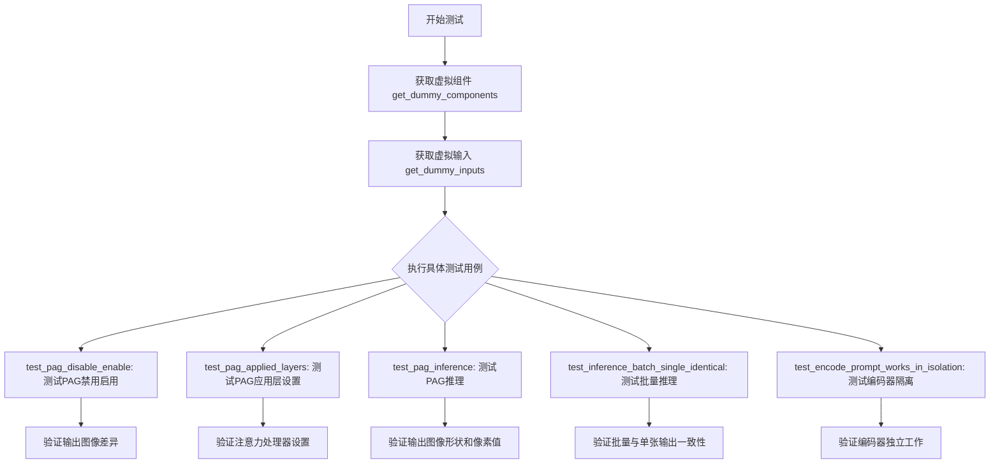
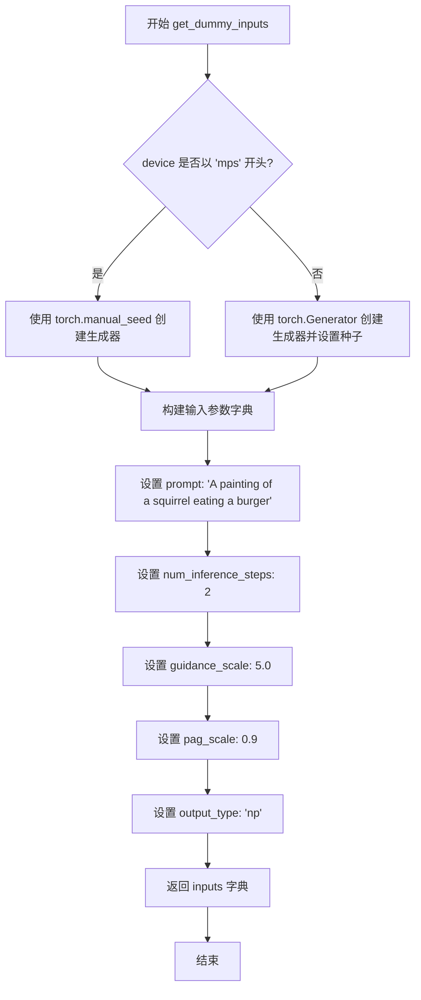
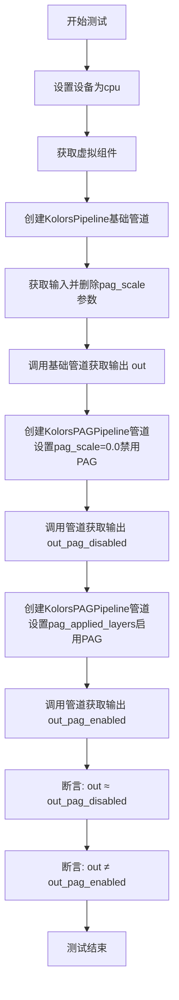
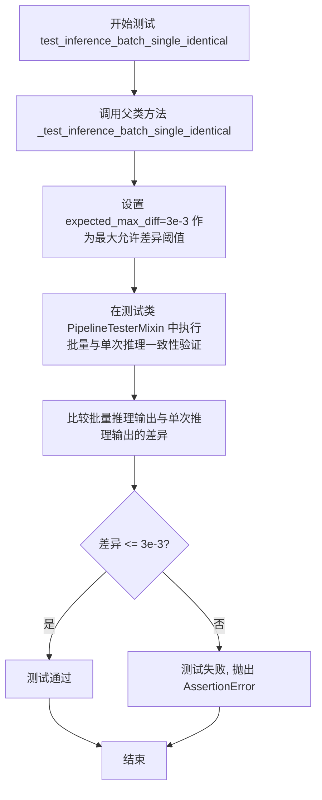
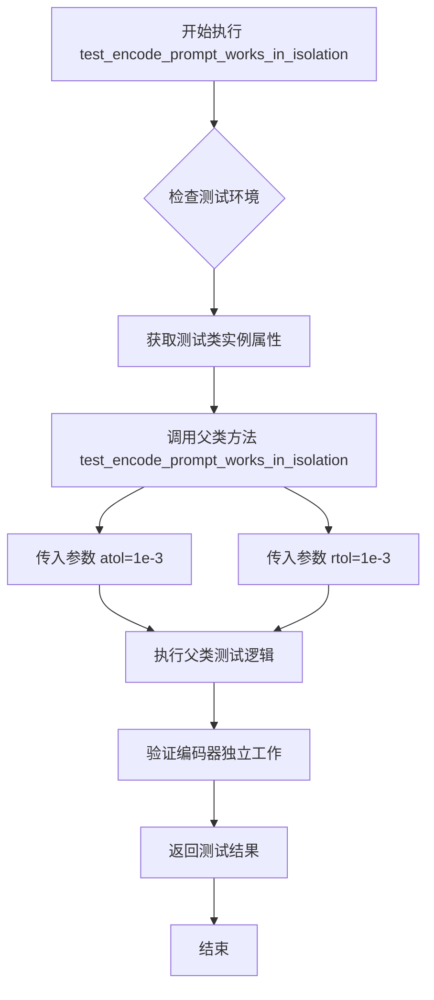
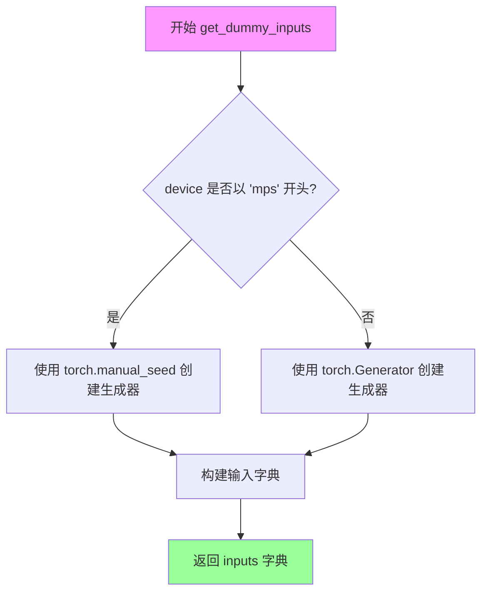
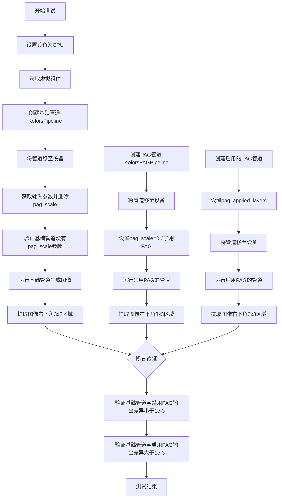
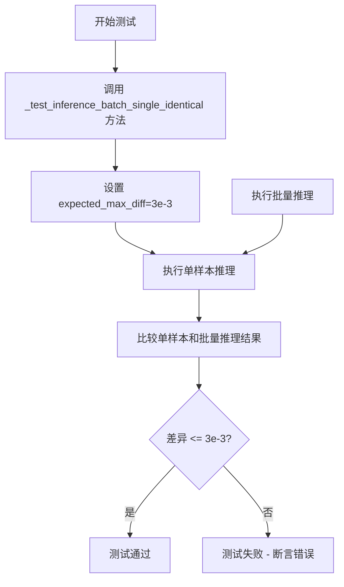

# `diffusers\tests\pipelines\pag\test_pag_kolors.py` 详细设计文档

这是 Hugging Face diffusers 库中 KolorsPAGPipeline（Kolors 文本到图像生成模型的 Prompt Acceleration Guidance 变体）的单元测试文件，用于测试 PAG 功能的各种场景，包括启用/禁用、层应用、推理结果等。

## 整体流程



## 类结构

```
KolorsPAGPipelineFastTests (测试类)
├── 继承自 PipelineTesterMixin
├── 继承自 PipelineFromPipeTesterMixin
└── 继承自 unittest.TestCase
```

## 全局变量及字段


### `np`
    
NumPy库别名，用于数值计算

类型：`module`
    


### `torch`
    
PyTorch库别名，用于深度学习张量操作

类型：`module`
    


### `enable_full_determinism`
    
启用完全确定性测试的函数，确保测试结果可复现

类型：`function`
    


### `KolorsPAGPipelineFastTests.pipeline_class`
    
测试的管道类，指向KolorsPAGPipeline

类型：`Type[KolorsPAGPipeline]`
    


### `KolorsPAGPipelineFastTests.params`
    
文本到图像参数集合，包含pag_scale和pag_adaptive_scale参数

类型：`set`
    


### `KolorsPAGPipelineFastTests.batch_params`
    
批处理参数集合，用于批量推理测试

类型：`set`
    


### `KolorsPAGPipelineFastTests.image_params`
    
图像参数集合，用于图像相关测试

类型：`set`
    


### `KolorsPAGPipelineFastTests.image_latents_params`
    
图像潜在向量参数集合，用于潜在向量相关测试

类型：`set`
    


### `KolorsPAGPipelineFastTests.callback_cfg_params`
    
回调配置参数集合，包含add_text_embeds和add_time_ids

类型：`set`
    


### `KolorsPAGPipelineFastTests.supports_dduf`
    
是否支持DDUF标志，该测试类不支持DDUF

类型：`bool`
    
    

## 全局函数及方法


### `KolorsPAGPipelineFastTests.get_dummy_components`

该方法用于创建测试专用的虚拟组件（dummy components），包括 UNet2DConditionModel、EulerDiscreteScheduler、AutoencoderKL、ChatGLMModel 和 ChatGLMTokenizer，并返回一个包含这些组件的字典，供 KolorsPAGPipeline 单元测试使用。

**参数：**

- `time_cond_proj_dim`：`Optional[int]`，可选参数，控制时间条件投影维度，用于配置 UNet 的时间嵌入层，默认为 `None`

**返回值：**`Dict[str, Any]`，返回一个字典，包含以下键值对：
- `"unet"`：`UNet2DConditionModel` 实例
- `"scheduler"`：`EulerDiscreteScheduler` 实例
- `"vae"`：`AutoencoderKL` 实例
- `"text_encoder"`：`ChatGLMModel` 实例
- `"tokenizer"`：`ChatGLMTokenizer` 实例
- `"image_encoder"`：`None`
- `"feature_extractor"`：`None`

#### 流程图

```mermaid
flowchart TD
    A[开始 get_dummy_components] --> B[设置随机种子 torch.manual_seed(0)]
    B --> C[创建 UNet2DConditionModel]
    C --> D[创建 EulerDiscreteScheduler]
    D --> E[设置随机种子 torch.manual_seed(0)]
    E --> F[创建 AutoencoderKL]
    F --> G[设置随机种子 torch.manual_seed(0)]
    G --> H[加载 ChatGLMModel 预训练模型]
    H --> I[加载 ChatGLMTokenizer 预训练模型]
    I --> J[构建 components 字典]
    J --> K[返回 components 字典]
    
    C -->|time_cond_proj_dim参数| C
```

#### 带注释源码

```python
# coding=utf-8
# Copyright 2025 HuggingFace Inc.
#
# Licensed under the Apache License, Version 2.0 (the "License");
# you may not use this file except in compliance with the License.
# You may obtain a copy of the License at
#
#     http://www.apache.org/licenses/LICENSE-2.0
#
# Unless required by applicable law or agreed to in writing, software
# distributed under the License is distributed on an "AS IS" BASIS,
# WITHOUT WARRANTIES OR CONDITIONS OF ANY KIND, either express or implied.
# See the License for the specific language governing permissions and
# limitations under the License.

def get_dummy_components(self, time_cond_proj_dim=None):
    """
    创建用于测试的虚拟组件（Dummy Components）
    
    该方法生成 KolorsPAGPipeline 所需的所有模型组件，用于单元测试。
    每次创建组件前都会设置随机种子以确保可重复性。
    
    参数:
        time_cond_proj_dim: 可选参数，传递给 UNet 的时间条件投影维度
        
    返回:
        包含所有组件的字典
    """
    # 设置随机种子，确保 UNet 的初始化可重复
    torch.manual_seed(0)
    
    # 创建虚拟 UNet2DConditionModel 模型
    # 配置参数：
    # - block_out_channels: 下采样/上采样通道数 (2, 4)
    # - layers_per_block: 每个块的层数 2
    # - time_cond_proj_dim: 时间条件投影维度（可选）
    # - sample_size: 输入样本尺寸 32
    # - in_channels/out_channels: 输入输出通道数 4
    # - down_block_types/up_block_types: 下采样/上采样块类型
    # - attention_head_dim: 注意力头维度 (2, 4)
    # - use_linear_projection: 使用线性投影
    # - addition_embed_type: 额外的嵌入类型为 "text_time"
    # - addition_time_embed_dim: 时间嵌入维度 8
    # - transformer_layers_per_block: Transformer 层数 (1, 2)
    # - projection_class_embeddings_input_dim: 类别嵌入输入维度 56
    # - cross_attention_dim: 跨注意力维度 8
    # - norm_num_groups: 归一化组数 1
    unet = UNet2DConditionModel(
        block_out_channels=(2, 4),
        layers_per_block=2,
        time_cond_proj_dim=time_cond_proj_dim,
        sample_size=32,
        in_channels=4,
        out_channels=4,
        down_block_types=("DownBlock2D", "CrossAttnDownBlock2D"),
        up_block_types=("CrossAttnUpBlock2D", "UpBlock2D"),
        # specific config below
        attention_head_dim=(2, 4),
        use_linear_projection=True,
        addition_embed_type="text_time",
        addition_time_embed_dim=8,
        transformer_layers_per_block=(1, 2),
        projection_class_embeddings_input_dim=56,
        cross_attention_dim=8,
        norm_num_groups=1,
    )
    
    # 创建虚拟调度器（Scheduler）
    # 使用 EulerDiscreteScheduler 配置参数：
    # - beta_start/beta_end: Beta 曲线起止值
    # - steps_offset: 步骤偏移量 1
    # - beta_schedule: Beta 调度策略 "scaled_linear"
    # - timestep_sp时间间隔策略 "leading"
    scheduler = EulerDiscreteScheduler(
        beta_start=0.00085,
        beta_end=0.012,
        steps_offset=1,
        beta_schedule="scaled_linear",
        timestep_spacing="leading",
    )
    
    # 设置随机种子，确保 VAE 的初始化可重复
    torch.manual_seed(0)
    
    # 创建虚拟 VAE 模型
    # 配置参数：
    # - block_out_channels: 块输出通道 [32, 64]
    # - in_channels/out_channels: 输入输出通道 3
    # - down_block_types/up_block_types: 编码器/解码器块类型
    # - latent_channels: 潜在空间通道数 4
    # - sample_size: 样本尺寸 128
    vae = AutoencoderKL(
        block_out_channels=[32, 64],
        in_channels=3,
        out_channels=3,
        down_block_types=["DownEncoderBlock2D", "DownEncoderBlock2D"],
        up_block_types=["UpDecoderBlock2D", "UpDecoderBlock2D"],
        latent_channels=4,
        sample_size=128,
    )
    
    # 设置随机种子，确保 Text Encoder 的初始化可重复
    torch.manual_seed(0)
    
    # 加载虚拟 ChatGLMModel
    # 从 HuggingFace Hub 加载 tiny-random-chatglm3-6b 模型
    # 设置 dtype 为 float32
    text_encoder = ChatGLMModel.from_pretrained(
        "hf-internal-testing/tiny-random-chatglm3-6b", torch_dtype=torch.float32
    )
    
    # 加载虚拟 ChatGLMTokenizer
    tokenizer = ChatGLMTokenizer.from_pretrained("hf-internal-testing/tiny-random-chatglm3-6b")

    # 组装所有组件到字典中
    # 包含 7 个键值对：
    # - unet: UNet2DConditionModel 实例
    # - scheduler: EulerDiscreteScheduler 实例
    # - vae: AutoencoderKL 实例
    # - text_encoder: ChatGLMModel 实例
    # - tokenizer: ChatGLMTokenizer 实例
    # - image_encoder: None（当前未使用）
    # - feature_extractor: None（当前未使用）
    components = {
        "unet": unet,
        "scheduler": scheduler,
        "vae": vae,
        "text_encoder": text_encoder,
        "tokenizer": tokenizer,
        "image_encoder": None,
        "feature_extractor": None,
    }
    
    # 返回组件字典，供 KolorsPAGPipeline 初始化使用
    return components
```


### `KolorsPAGPipelineFastTests.get_dummy_inputs`

该方法用于创建测试用的虚拟输入参数，为 KolorsPAGPipeline 的单元测试提供一致的输入数据。根据设备类型（MPS 或其他）创建随机数生成器，并返回一个包含提示词、生成器、推理步数、引导系数、PAG 缩放因子和输出类型的字典。

参数：

- `self`：隐式参数，测试类实例
- `device`：`str`，目标设备字符串，用于创建 PyTorch 随机数生成器（如 "cpu"、"cuda"、"mps"）
- `seed`：`int`（默认值：0），随机种子，用于确保测试的可重复性

返回值：`dict`，包含测试所需输入参数的字典，键包括 prompt（提示词）、generator（随机生成器）、num_inference_steps（推理步数）、guidance_scale（引导系数）、pag_scale（PAG 缩放因子）、output_type（输出类型）

#### 流程图



#### 带注释源码

```python
def get_dummy_inputs(self, device, seed=0):
    """
    创建用于测试的虚拟输入参数。
    
    参数:
        device: 目标设备字符串，用于确定如何创建随机数生成器
        seed: 随机种子，默认值为 0，用于确保测试结果可重复
    
    返回:
        包含测试输入参数的字典
    """
    # 判断设备类型，MPS (Apple Silicon) 需要特殊处理
    if str(device).startswith("mps"):
        # MPS 设备使用 torch.manual_seed 直接设置种子
        generator = torch.manual_seed(seed)
    else:
        # 其他设备（cpu/cuda）使用 torch.Generator 创建随机生成器
        generator = torch.Generator(device=device).manual_seed(seed)
    
    # 构建输入参数字典
    inputs = {
        "prompt": "A painting of a squirrel eating a burger",  # 测试用提示词
        "generator": generator,                                  # 随机生成器对象
        "num_inference_steps": 2,                               # 推理步数（少量步数用于快速测试）
        "guidance_scale": 5.0,                                   # CFG 引导系数
        "pag_scale": 0.9,                                       # PAG 缩放因子
        "output_type": "np",                                    # 输出类型为 numpy 数组
    }
    return inputs
```


### `KolorsPAGPipelineFastTests.test_pag_disable_enable`

该测试方法验证 PAG（Perturbed Attention Guidance）功能的禁用和启用是否正常工作。通过对比基础管道、无 PAG 的管道和启用 PAG 的管道输出，确保 PAG 功能在禁用时输出与基础管道一致，在启用时产生明显不同的结果。

参数：

- `self`：隐式参数，测试类实例

返回值：`None`，该方法为测试函数，通过断言验证逻辑，不返回具体值

#### 流程图



#### 带注释源码

```python
def test_pag_disable_enable(self):
    """
    测试PAG功能的禁用和启用
    验证当pag_scale=0.0时输出与基础管道一致
    验证当启用PAG时输出与基础管道不同
    """
    # 1. 设置设备为cpu，确保torch.Generator的确定性
    device = "cpu"
    
    # 2. 获取虚拟组件（用于测试的假模型组件）
    components = self.get_dummy_components()

    # ==================== 基础管道测试（无PAG）====================
    # 3. 创建基础管道KolorsPipeline（不带PAG功能）
    pipe_sd = KolorsPipeline(**components)
    pipe_sd = pipe_sd.to(device)
    pipe_sd.set_progress_bar_config(disable=None)  # 不禁用进度条

    # 4. 获取测试输入
    inputs = self.get_dummy_inputs(device)
    # 5. 删除pag_scale参数，确保基础管道不包含此参数
    del inputs["pag_scale"]
    
    # 6. 验证基础管道不应有pag_scale参数
    assert "pag_scale" not in inspect.signature(pipe_sd.__call__).parameters, (
        f"`pag_scale` should not be a call parameter of the base pipeline {pipe_sd.__class__.__name__}."
    )
    
    # 7. 调用基础管道获取输出（作为参考基准）
    out = pipe_sd(**inputs).images[0, -3:, -3:, -1]  # 取最后3x3像素

    # ==================== PAG禁用测试 ====================
    # 8. 创建PAG管道，设置pag_scale=0.0禁用PAG
    pipe_pag = self.pipeline_class(**components)  # 使用KolorsPAGPipeline
    pipe_pag = pipe_pag.to(device)
    pipe_pag.set_progress_bar_config(disable=None)

    # 9. 重新获取输入并设置pag_scale=0.0
    inputs = self.get_dummy_inputs(device)
    inputs["pag_scale"] = 0.0
    
    # 10. 获取禁用PAG的输出
    out_pag_disabled = pipe_pag(**inputs).images[0, -3:, -3:, -1]

    # ==================== PAG启用测试 ====================
    # 11. 创建PAG管道，启用PAG应用到mid、up、down层
    pipe_pag = self.pipeline_class(**components, pag_applied_layers=["mid", "up", "down"])
    pipe_pag = pipe_pag.to(device)
    pipe_pag.set_progress_bar_config(disable=None)

    # 12. 获取新输入
    inputs = self.get_dummy_inputs(device)
    
    # 13. 获取启用PAG的输出（使用默认pag_scale=0.9）
    out_pag_enabled = pipe_pag(**inputs).images[0, -3:, -3:, -1]

    # ==================== 验证断言 ====================
    # 14. 验证禁用PAG时输出与基础管道一致（差异<1e-3）
    assert np.abs(out.flatten() - out_pag_disabled.flatten()).max() < 1e-3
    
    # 15. 验证启用PAG时输出与基础管道不同（差异>1e-3）
    assert np.abs(out.flatten() - out_pag_enabled.flatten()).max() > 1e-3
```


### `KolorsPAGPipelineFastTests.test_pag_applied_layers`

该测试函数用于验证 KolorsPAGPipeline 中 PAG（Probabilistic Augmented Generation）应用层设置逻辑的正确性。通过传入不同的 `pag_applied_layers` 参数（如 "mid"、"down"、"up"、具体块路径等），验证 `_set_pag_attn_processor` 方法能否正确地将 PAG 注意力处理器映射到 UNet 模型对应的自注意力层，并正确处理无效层级路径的异常情况。

参数：

- `self`：`KolorsPAGPipelineFastTests`，测试类实例隐式参数

返回值：`None`，该函数为测试方法，通过断言（assert）验证功能，无显式返回值

#### 流程图

```mermaid
flowchart TD
    A[开始测试 test_pag_applied_layers] --> B[设置设备为 CPU, 获取虚拟组件]
    B --> C[创建 KolorsPAGPipeline 并加载到 CPU]
    C --> D[获取所有 self-attention 层名称]
    D --> E[测试 pag_layers=['mid', 'down', 'up']]
    E --> F{验证所有自注意力层都设置了 PAG 处理器}
    F -->|通过| G[测试 pag_layers=['mid']]
    F -->|失败| Z[测试失败]
    G --> H{验证仅中间块自注意力层设置了 PAG}
    H -->|通过| I[测试 pag_layers=['mid_block']]
    H -->|失败| Z
    I --> J{验证中间块层设置正确}
    J -->|通过| K[测试 pag_layers=['mid_block.attentions.0']]
    J -->|失败| Z
    K --> L{验证精确块路径设置正确}
    L -->|通过| M[测试无效路径 'mid_block.attentions.1']
    L -->|失败| Z
    M --> N{验证抛出 ValueError 异常}
    N -->|是| O[测试 pag_layers=['down']]
    N -->|否| Z
    O --> P{验证下采样层设置 4 个 PAG 处理器}
    P -->|通过| Q[测试无效路径 'down_blocks.0']
    Q --> R{验证抛出 ValueError}
    R -->|是| S[测试 pag_layers=['down_blocks.1']]
    R -->|否| Z
    S --> T{验证 down_blocks.1 设置 4 个处理器}
    T -->|通过| U[测试 pag_layers=['down_blocks.1.attentions.1']]
    T -->|失败| Z
    U --> V{验证精确下采样块设置 2 个处理器}
    V -->|通过| W[测试通过]
    V -->|失败| Z
```

#### 带注释源码

```python
def test_pag_applied_layers(self):
    """
    测试 PAG 应用层设置功能。
    
    验证 _set_pag_attn_processor 方法能够正确处理不同的 pag_applied_layers 参数：
    1. 顶级层级名称（如 'mid', 'down', 'up'）
    2. 块级层级名称（如 'mid_block', 'down_blocks.0'）
    3. 精确层级路径（如 'mid_block.attentions.0.transformer_blocks.0.attn1'）
    4. 无效层级路径应抛出 ValueError
    """
    # 设置设备为 CPU，确保 torch.Generator 的确定性
    device = "cpu"  
    
    # 获取用于测试的虚拟组件（UNet、VAE、Scheduler、Text Encoder 等）
    components = self.get_dummy_components()

    # 创建基础 pipeline 并加载到 CPU 设备
    pipe = self.pipeline_class(**components)
    pipe = pipe.to(device)
    
    # 禁用进度条显示，确保测试输出一致性
    pipe.set_progress_bar_config(disable=None)

    # ========== 测试 1: 验证 'mid', 'down', 'up' 映射到所有自注意力层 ==========
    # 获取 UNet 中所有包含 'attn1' 的自注意力处理器键名
    all_self_attn_layers = [k for k in pipe.unet.attn_processors.keys() if "attn1" in k]
    
    # 保存原始注意力处理器配置，用于后续测试重置
    original_attn_procs = pipe.unet.attn_processors
    
    # 设置 PAG 注意力处理器到 'mid', 'down', 'up' 层级
    pag_layers = ["mid", "down", "up"]
    pipe._set_pag_attn_processor(pag_applied_layers=pag_layers, do_classifier_free_guidance=False)
    
    # 断言：PAG 处理器应覆盖所有自注意力层
    assert set(pipe.pag_attn_processors) == set(all_self_attn_layers)

    # ========== 测试 2: 验证 'mid' 仅映射到中间块自注意力层 ==========
    # 恢复原始注意力处理器
    pipe.unet.set_attn_processor(original_attn_procs.copy())
    
    # 中间块预期的自注意力层名称列表
    all_self_attn_mid_layers = [
        "mid_block.attentions.0.transformer_blocks.0.attn1.processor",
        "mid_block.attentions.0.transformer_blocks.1.attn1.processor",
    ]
    
    # 仅设置 'mid' 层级
    pag_layers = ["mid"]
    pipe._set_pag_attn_processor(pag_applied_layers=pag_layers, do_classifier_free_guidance=False)
    
    # 断言：仅中间块自注意力层设置了 PAG 处理器
    assert set(pipe.pag_attn_processors) == set(all_self_attn_mid_layers)

    # ========== 测试 3: 验证 'mid_block' 等同于 'mid' ==========
    pipe.unet.set_attn_processor(original_attn_procs.copy())
    pag_layers = ["mid_block"]
    pipe._set_pag_attn_processor(pag_applied_layers=pag_layers, do_classifier_free_guidance=False)
    
    # 断言：'mid_block' 应映射到相同的中间块层
    assert set(pipe.pag_attn_processors) == set(all_self_attn_mid_layers)

    # ========== 测试 4: 验证精确块路径 'mid_block.attentions.0' ==========
    pipe.unet.set_attn_processor(original_attn_procs.copy())
    pag_layers = ["mid_block.attentions.0"]
    pipe._set_pag_attn_processor(pag_applied_layers=pag_layers, do_classifier_free_guidance=False)
    
    # 断言：精确路径应映射到对应的层
    assert set(pipe.pag_attn_processors) == set(all_self_attn_mid_layers)

    # ========== 测试 5: 验证无效路径 'mid_block.attentions.1' 抛出异常 ==========
    pipe.unet.set_attn_processor(original_attn_procs.copy())
    pag_layers = ["mid_block.attentions.1"]  # 该层不存在
    
    # 断言：应抛出 ValueError
    with self.assertRaises(ValueError):
        pipe._set_pag_attn_processor(pag_applied_layers=pag_layers, do_classifier_free_guidance=False)

    # ========== 测试 6: 验证 'down' 映射到所有下采样块自注意力层 ==========
    pipe.unet.set_attn_processor(original_attn_procs.copy())
    pag_layers = ["down"]
    pipe._set_pag_attn_processor(pag_applied_layers=pag_layers, do_classifier_free_guidance=False)
    
    # 断言：下采样层应设置 4 个 PAG 处理器
    assert len(pipe.pag_attn_processors) == 4

    # ========== 测试 7: 验证无效块路径 'down_blocks.0' 抛出异常 ==========
    pipe.unet.set_attn_processor(original_attn_procs.copy())
    pag_layers = ["down_blocks.0"]  # 无效的块索引
    
    # 断言：应抛出 ValueError
    with self.assertRaises(ValueError):
        pipe._set_pag_attn_processor(pag_applied_layers=pag_layers, do_classifier_free_guidance=False)

    # ========== 测试 8: 验证有效块路径 'down_blocks.1' ==========
    pipe.unet.set_attn_processor(original_attn_procs.copy())
    pag_layers = ["down_blocks.1"]
    pipe._set_pag_attn_processor(pag_applied_layers=pag_layers, do_classifier_free_guidance=False)
    
    # 断言：应设置 4 个 PAG 处理器
    assert len(pipe.pag_attn_processors) == 4

    # ========== 测试 9: 验证精确路径 'down_blocks.1.attentions.1' ==========
    pipe.unet.set_attn_processor(original_attn_procs.copy())
    pag_layers = ["down_blocks.1.attentions.1"]
    pipe._set_pag_attn_processor(pag_applied_layers=pag_layers, do_classifier_free_guidance=False)
    
    # 断言：精确路径应设置 2 个 PAG 处理器
    assert len(pipe.pag_attn_processors) == 2
```


### `KolorsPAGPipelineFastTests.test_pag_inference`

该测试方法用于验证 KolorsPAGPipeline 的 PAG（Perturbed Attention Guidance）推理功能是否正常工作。测试创建带有 PAG 应用的注意力层（mid、up、down）的管道，执行推理并验证输出图像的形状和像素值是否与预期一致。

参数：

- `self`：测试类实例本身，无需额外参数

返回值：`None`，该方法为测试用例，通过断言验证功能，不返回具体数值

#### 流程图

```mermaid
flowchart TD
    A[开始测试] --> B[设置设备为 CPU]
    B --> C[获取虚拟组件: get_dummy_components]
    C --> D[创建 KolorsPAGPipeline<br/>pag_applied_layers=['mid', 'up', 'down']]
    D --> E[将管道移至设备并配置进度条]
    E --> F[获取虚拟输入: get_dummy_inputs]
    F --> G[执行管道推理: pipe_pag inputs]
    G --> H[提取图像切片: image[0, -3:, -3:, -1]]
    H --> I{断言图像形状<br/>== (1, 64, 64, 3)?}
    I -->|是| J[定义预期像素值数组]
    I -->|否| K[测试失败]
    J --> L[计算最大差异<br/>max_diff]
    L --> M{max_diff <= 1e-3?}
    M -->|是| N[测试通过]
    M -->|否| K
```

#### 带注释源码

```python
def test_pag_inference(self):
    """
    测试 KolorsPAGPipeline 的 PAG 推理功能。
    验证管道能够使用指定的 PAG 应用层生成正确形状和像素值的图像。
    """
    # 设置设备为 CPU，确保 torch.Generator 的确定性
    device = "cpu"  # ensure determinism for the device-dependent torch.Generator
    
    # 获取虚拟组件（UNet、VAE、Scheduler、Text Encoder、Tokenizer 等）
    components = self.get_dummy_components()

    # 创建 KolorsPAGPipeline 实例，指定 PAG 应用的层为 ['mid', 'up', 'down']
    # 这意味着 PAG 扰动将应用于中间、上采样和下采样块的自注意力层
    pipe_pag = self.pipeline_class(**components, pag_applied_layers=["mid", "up", "down"])
    
    # 将管道移至指定设备（CPU）
    pipe_pag = pipe_pag.to(device)
    
    # 配置进度条，disable=None 表示不禁用进度条
    pipe_pag.set_progress_bar_config(disable=None)

    # 获取虚拟输入参数（prompt、generator、num_inference_steps、guidance_scale 等）
    inputs = self.get_dummy_inputs(device)
    
    # 执行管道推理，生成图像
    image = pipe_pag(**inputs).images
    
    # 提取图像切片：取第一张图像的右下角 3x3 像素区域
    # image 形状为 (batch, height, width, channels)
    image_slice = image[0, -3:, -3:, -1]

    # 断言输出图像形状为 (1, 64, 64, 3)
    # 验证管道生成的图像尺寸符合预期
    assert image.shape == (
        1,
        64,
        64,
        3,
    ), f"the shape of the output image should be (1, 64, 64, 3) but got {image.shape}"
    
    # 定义预期的像素值数组（来自已知正确的输出）
    expected_slice = np.array(
        [0.26030684, 0.43192005, 0.4042826, 0.4189067, 0.5181305, 0.3832534, 0.472135, 0.4145031, 0.43726248]
    )

    # 计算实际输出与预期输出的最大绝对差异
    max_diff = np.abs(image_slice.flatten() - expected_slice).max()
    
    # 断言最大差异小于等于 1e-3，确保输出数值精度符合要求
    self.assertLessEqual(max_diff, 1e-3)
```


### `test_inference_batch_single_identical`

该测试方法用于验证批量推理（batch inference）与单样本推理（single inference）的一致性，确保在使用相同的随机种子和参数时，批量处理与逐个处理的输出结果差异在可接受的阈值范围内。

参数：

- `self`：实例方法隐含参数，类型为 `KolorsPAGPipelineFastTests`（测试类实例），代表当前测试对象

返回值：`None`（测试方法无显式返回值）

#### 流程图



#### 带注释源码

```python
def test_inference_batch_single_identical(self):
    """
    测试批量推理与单次推理的一致性。
    
    该方法继承自 PipelineTesterMixin，调用父类的 _test_inference_batch_single_identical 方法，
    验证在使用相同的随机种子和推理参数时，批量推理（batch_size > 1）的输出与
    多次单次推理（batch_size = 1）的输出是否在数值上保持一致。
    
    参数:
        self: KolorsPAGPipelineFastTests 的实例对象
        
    返回值:
        None: 测试方法不返回任何值，结果通过断言机制报告
        
    注意事项:
        - expected_max_diff 设置为 3e-3 (0.003)，允许批量与单次推理之间
          存在最大 0.3% 的数值差异，这考虑了浮点数运算的精度误差
        - 该测试继承自 PipelineTesterMixin 基类，具体的比较逻辑在基类中实现
    """
    # 调用父类 PipelineTesterMixin 提供的测试方法
    # expected_max_diff=3e-3 指定了批量推理与单次推理结果之间的最大允许差异
    self._test_inference_batch_single_identical(expected_max_diff=3e-3)
```


### `KolorsPAGPipelineFastTests.test_encode_prompt_works_in_isolation`

该测试方法用于验证文本编码提示（prompt）功能能够独立工作，通过调用父类的测试方法并指定绝对误差容限（atol）和相对误差容限（rtol）来确保编码结果的准确性。

参数：

- `self`：`KolorsPAGPipelineFastTests`，表示测试类实例本身

返回值：`unittest.TestCase.test_encode_prompt_works_in_isolation` 的返回值，通常为 `None`，表示测试执行完成

#### 流程图



#### 带注释源码

```python
def test_encode_prompt_works_in_isolation(self):
    """
    测试文本编码提示功能能够独立工作。
    
    该方法验证 KolorsPAGPipeline 的文本编码器能够正确、独立地
    对提示文本进行编码，并且与基础管道的行为一致。
    
    参数:
        self: KolorsPAGPipelineFastTests 实例，包含了测试所需的
              组件和配置信息
    
    返回值:
        返回父类 test_encode_prompt_works_in_isolation 方法的执行结果
    
    细节:
        - atol=1e-3: 绝对误差容限，用于数值比较的绝对精度要求
        - rtol=1e-3: 相对误差容限，用于数值比较的相对精度要求
        - 调用父类方法确保测试逻辑的复用性和一致性
    """
    return super().test_encode_prompt_works_in_isolation(atol=1e-3, rtol=1e-3)
```


### `KolorsPAGPipelineFastTests.get_dummy_components`

该方法用于创建虚拟（dummy）模型组件，以便在不需要加载真实预训练权重的情况下对 KolorsPAGPipeline 进行单元测试。它初始化了 UNet2DConditionModel、EulerDiscreteScheduler、AutoencoderKL、ChatGLMModel（文本编码器）和 ChatGLMTokenizer（分词器）等关键组件，并返回一个包含这些组件的字典。

参数：

- `time_cond_proj_dim`：`int` 或 `None`，可选参数，用于指定 UNet 模型的时间条件投影维度。如果为 `None`，则使用默认值

返回值：`Dict[str, Any]`，返回一个字典，包含以下键值对：
- `"unet"`：`UNet2DConditionModel` 实例
- `"scheduler"`：`EulerDiscreteScheduler` 实例
- `"vae"`：`AutoencoderKL` 实例
- `"text_encoder"`：`ChatGLMModel` 实例
- `"tokenizer"`：`ChatGLMTokenizer` 实例
- `"image_encoder"`：`None`
- `"feature_extractor"`：`None`

#### 流程图

```mermaid
flowchart TD
    A[开始 get_dummy_components] --> B{检查 time_cond_proj_dim 参数}
    B -->|提供值| C[使用传入的 time_cond_proj_dim]
    B -->|默认值 None| D[使用模型默认配置]
    C --> E[设置随机种子 torch.manual_seed(0)]
    D --> E
    E --> F[创建 UNet2DConditionModel]
    F --> G[创建 EulerDiscreteScheduler]
    G --> H[设置随机种子 torch.manual_seed(0)]
    H --> I[创建 AutoencoderKL VAE]
    I --> J[设置随机种子 torch.manual_seed(0)]
    J --> K[加载 ChatGLMModel 文本编码器]
    K --> L[加载 ChatGLMTokenizer 分词器]
    L --> M[构建 components 字典]
    M --> N[返回 components 字典]
```

#### 带注释源码

```python
def get_dummy_components(self, time_cond_proj_dim=None):
    """
    创建虚拟组件字典，用于测试 KolorsPAGPipeline
    
    参数:
        time_cond_proj_dim: 可选的时间条件投影维度参数，
                           会传递给 UNet2DConditionModel
    
    返回:
        包含所有 pipeline 组件的字典
    """
    # 设置随机种子确保测试可重复性
    torch.manual_seed(0)
    
    # 创建虚拟 UNet2DConditionModel
    # 用于图像去噪的条件扩散模型
    unet = UNet2DConditionModel(
        block_out_channels=(2, 4),           # 下采样/上采样块的通道数
        layers_per_block=2,                  # 每个块中的层数
        time_cond_proj_dim=time_cond_proj_dim, # 时间条件投影维度
        sample_size=32,                      # 样本空间分辨率
        in_channels=4,                       # 输入通道数（latent space）
        out_channels=4,                      # 输出通道数
        # 下采样块类型
        down_block_types=("DownBlock2D", "CrossAttnDownBlock2D"),
        # 上采样块类型
        up_block_types=("CrossAttnUpBlock2D", "UpBlock2D"),
        # 注意力头维度
        attention_head_dim=(2, 4),
        # 使用线性投影
        use_linear_projection=True,
        # 添加嵌入类型为 text_time（文本+时间）
        addition_embed_type="text_time",
        addition_time_embed_dim=8,           # 时间嵌入维度
        # 每个 transformer 块的层数
        transformer_layers_per_block=(1, 2),
        # 投影类嵌入输入维度
        projection_class_embeddings_input_dim=56,
        cross_attention_dim=8,               # 交叉注意力维度
        norm_num_groups=1,                   # 组归一化组数
    )
    
    # 创建 Euler 离散调度器
    # 用于控制扩散过程的噪声调度
    scheduler = EulerDiscreteScheduler(
        beta_start=0.00085,                  # beta 起始值
        beta_end=0.012,                      # beta 结束值
        steps_offset=1,                      # 步骤偏移
        beta_schedule="scaled_linear",       # beta 调度方案
        timestep_spacing="leading",           # 时间步间隔方式
    )
    
    # 重新设置随机种子
    torch.manual_seed(0)
    
    # 创建虚拟 VAE（变分自编码器）
    # 用于将图像编码到潜在空间和解码回像素空间
    vae = AutoencoderKL(
        block_out_channels=[32, 64],         # VAE 块的通道数
        in_channels=3,                       # RGB 输入通道
        out_channels=3,                      # RGB 输出通道
        # 下采样编码器块类型
        down_block_types=["DownEncoderBlock2D", "DownEncoderBlock2D"],
        # 上采样解码器块类型
        up_block_types=["UpDecoderBlock2D", "UpDecoderBlock2D"],
        latent_channels=4,                  # 潜在空间通道数
        sample_size=128,                     # 样本大小
    )
    
    # 重新设置随机种子
    torch.manual_seed(0)
    
    # 加载虚拟 ChatGLM 文本编码器
    # 用于将文本提示编码为嵌入向量
    text_encoder = ChatGLMModel.from_pretrained(
        "hf-internal-testing/tiny-random-chatglm3-6b", 
        torch_dtype=torch.float32
    )
    
    # 加载虚拟 ChatGLM 分词器
    # 用于将文本分割为 token
    tokenizer = ChatGLMTokenizer.from_pretrained(
        "hf-internal-testing/tiny-random-chatglm3-6b"
    )
    
    # 组装所有组件到字典中
    components = {
        "unet": unet,                        # UNet 去噪模型
        "scheduler": scheduler,              # 噪声调度器
        "vae": vae,                          # VAE 编解码器
        "text_encoder": text_encoder,        # 文本编码器
        "tokenizer": tokenizer,              # 文本分词器
        "image_encoder": None,               # 图像编码器（可选，未使用）
        "feature_extractor": None,           # 特征提取器（可选，未使用）
    }
    
    return components
```


### `KolorsPAGPipelineFastTests.get_dummy_inputs`

获取用于测试 KolorsPAGPipeline 的虚拟输入数据，根据设备类型创建随机数生成器，并返回一个包含提示词、生成器、推理步数、引导_scale、pag_scale 和输出类型的字典。

参数：

- `self`：类实例，隐含的类实例参数
- `device`：`str` 或 `torch.device`，指定运行设备，用于创建对应的随机数生成器
- `seed`：`int`，随机种子，默认值为 0，用于控制随机数生成的可重复性

返回值：`Dict[str, Any]`，返回包含虚拟输入参数的字典，包含以下键值对：
- `prompt`：提示词字符串
- `generator`：PyTorch 随机数生成器
- `num_inference_steps`：推理步数
- `guidance_scale`：引导比例
- `pag_scale`：PAG（Progressive Attention Guidance）比例
- `output_type`：输出类型

#### 流程图



#### 带注释源码

```python
def get_dummy_inputs(self, device, seed=0):
    """
    获取用于测试 KolorsPAGPipeline 的虚拟输入数据。
    
    参数:
        device: 运行设备，支持 CPU、CUDA、MPS 等
        seed: 随机种子，用于确保测试的可重复性
    
    返回:
        包含测试所需输入参数的字典
    """
    # 判断设备类型，MPS (Apple Silicon) 需要特殊处理
    if str(device).startswith("mps"):
        # MPS 设备使用 torch.manual_seed 而非 Generator
        generator = torch.manual_seed(seed)
    else:
        # 其他设备使用 torch.Generator 创建可复现的随机生成器
        generator = torch.Generator(device=device).manual_seed(seed)
    
    # 构建测试输入字典
    inputs = {
        "prompt": "A painting of a squirrel eating a burger",  # 测试用提示词
        "generator": generator,                                  # 随机数生成器
        "num_inference_steps": 2,                                 # 推理步数（测试用最小值）
        "guidance_scale": 5.0,                                    # CFG 引导比例
        "pag_scale": 0.9,                                         # PAG 比例
        "output_type": "np",                                      # 输出为 NumPy 数组
    }
    return inputs
```


### `KolorsPAGPipelineFastTests.test_pag_disable_enable`

该测试方法用于验证 KolorsPAGPipeline 中 PAG（Prompt Attention Guidance）功能的禁用和启用是否正常工作。测试通过比较基础管道、PAG 禁用（pag_scale=0.0）和 PAG 启用三种情况下的输出图像，确保禁用时输出与基础管道一致，启用时输出与基础管道不同。

参数：

- `self`：`KolorsPAGPipelineFastTests`，测试类实例，隐式参数，包含测试所需的上下文和方法

返回值：`None`，该方法无返回值，通过断言验证功能正确性

#### 流程图



#### 带注释源码

```python
def test_pag_disable_enable(self):
    """
    测试PAG功能的禁用和启用。
    验证：
    1. 基础管道（无PAG）输出
    2. PAG禁用（pag_scale=0.0）时输出应与基础管道相同
    3. PAG启用时输出应与基础管道不同
    """
    # 设置设备为CPU以确保torch.Generator的确定性
    device = "cpu"  # ensure determinism for the device-dependent torch.Generator
    
    # 获取用于测试的虚拟组件（UNet、VAE、调度器等）
    components = self.get_dummy_components()

    # ========== 基础管道测试（无PAG功能）==========
    # 创建基础KolorsPipeline（不支持PAG）
    pipe_sd = KolorsPipeline(**components)
    # 将管道移至指定设备
    pipe_sd = pipe_sd.to(device)
    # 设置进度条配置
    pipe_sd.set_progress_bar_config(disable=None)

    # 获取测试输入
    inputs = self.get_dummy_inputs(device)
    # 删除pag_scale参数，因为基础管道不支持该参数
    del inputs["pag_scale"]
    
    # 验证基础管道的__call__方法签名中不包含pag_scale参数
    assert "pag_scale" not in inspect.signature(pipe_sd.__call__).parameters, (
        f"`pag_scale` should not be a call parameter of the base pipeline {pipe_sd.__class__.__name__}."
    )
    
    # 运行基础管道并提取图像右下角3x3像素
    out = pipe_sd(**inputs).images[0, -3:, -3:, -1]

    # ========== PAG禁用测试（pag_scale=0.0）==========
    # 创建PAG管道
    pipe_pag = self.pipeline_class(**components)
    pipe_pag = pipe_pag.to(device)
    pipe_pag.set_progress_bar_config(disable=None)

    # 获取输入并设置pag_scale为0.0以禁用PAG
    inputs = self.get_dummy_inputs(device)
    inputs["pag_scale"] = 0.0
    # 运行禁用PAG的管道
    out_pag_disabled = pipe_pag(**inputs).images[0, -3:, -3:, -1]

    # ========== PAG启用测试 ==========
    # 创建启用的PAG管道，指定应用PAG的层
    pipe_pag = self.pipeline_class(**components, pag_applied_layers=["mid", "up", "down"])
    pipe_pag = pipe_pag.to(device)
    pipe_pag.set_progress_bar_config(disable=None)

    # 获取输入并运行启用PAG的管道
    inputs = self.get_dummy_inputs(device)
    out_pag_enabled = pipe_pag(**inputs).images[0, -3:, -3:, -1]

    # ========== 断言验证 ==========
    # 验证禁用PAG时输出与基础管道相同（差异小于1e-3）
    assert np.abs(out.flatten() - out_pag_disabled.flatten()).max() < 1e-3
    # 验证启用PAG时输出与基础管道不同（差异大于1e-3）
    assert np.abs(out.flatten() - out_pag_enabled.flatten()).max() > 1e-3
```


### `KolorsPAGPipelineFastTests.test_pag_applied_layers`

测试PAG（Perturbed Attention Guidance）应用层功能，验证不同的层名称配置（如"mid"、"up"、"down"及其组合）是否正确应用到UNet的注意力处理器，并确保无效的层名称会抛出适当的异常。

参数：

- `self`：`KolorsPAGPipelineFastTests`，测试类实例本身，包含pipeline_class等属性

返回值：`None`，无返回值（测试方法，通过断言验证正确性）

#### 流程图

```mermaid
flowchart TD
    A[开始测试 test_pag_applied_layers] --> B[创建pipeline实例]
    B --> C[获取所有self-attention层名称]
    C --> D{测试1: pag_layers=['mid','down','up']}
    D --> E[调用_set_pag_attn_processor]
    E --> F[断言: pag_attn_processors == all_self_attn_layers]
    F --> G{测试2: pag_layers=['mid']}
    G --> H[验证只包含mid层]
    H --> I{测试3: pag_layers=['mid_block']}
    I --> J[验证mid_block映射到mid层]
    J --> K{测试4: pag_layers=['mid_block.attentions.0']}
    K --> L[验证具体块映射]
    L --> M{测试5: pag_layers=['mid_block.attentions.1']}
    M --> N[断言抛出ValueError]
    N --> O{测试6: pag_layers=['down']}
    O --> P[验证down层数量为4]
    P --> Q{测试7: pag_layers=['down_blocks.0']}
    Q --> R[断言抛出ValueError]
    R --> S{测试8: pag_layers=['down_blocks.1']}
    S --> T[验证down_blocks.1应用]
    T --> U{测试9: pag_layers=['down_blocks.1.attentions.1']}
    U --> V[验证具体层数量为2]
    V --> W[结束测试]
```

#### 带注释源码

```python
def test_pag_applied_layers(self):
    """
    测试PAG应用层功能：验证不同的层名称配置是否正确应用到UNet的注意力处理器
    """
    # 使用CPU设备确保torch.Generator的确定性
    device = "cpu"  # ensure determinism for the device-dependent torch.Generator
    
    # 获取虚拟组件（UNet, VAE, TextEncoder等）
    components = self.get_dummy_components()

    # 创建基础pipeline
    pipe = self.pipeline_class(**components)
    pipe = pipe.to(device)
    pipe.set_progress_bar_config(disable=None)

    # ========== 测试1: pag_layers = ["mid","up","down"] ==========
    # 应该应用到所有self-attention层
    all_self_attn_layers = [k for k in pipe.unet.attn_processors.keys() if "attn1" in k]
    original_attn_procs = pipe.unet.attn_processors
    pag_layers = ["mid", "down", "up"]
    pipe._set_pag_attn_processor(pag_applied_layers=pag_layers, do_classifier_free_guidance=False)
    # 验证PAG处理器覆盖所有自注意力层
    assert set(pipe.pag_attn_processors) == set(all_self_attn_layers)

    # ========== 测试2: pag_layers = ["mid"] ==========
    # 重置注意力处理器
    pipe.unet.set_attn_processor(original_attn_procs.copy())
    pag_layers = ["mid"]
    pipe._set_pag_attn_processor(pag_applied_layers=pag_layers, do_classifier_free_guidance=False)
    # 预期只包含中间块的两个transformer block的attn1
    all_self_attn_mid_layers = [
        "mid_block.attentions.0.transformer_blocks.0.attn1.processor",
        "mid_block.attentions.0.transformer_blocks.1.attn1.processor",
    ]
    assert set(pipe.pag_attn_processors) == set(all_self_attn_mid_layers)

    # ========== 测试3: pag_layers = ["mid_block"] ==========
    # 测试"mid_block"别名是否映射到"mid"
    pipe.unet.set_attn_processor(original_attn_procs.copy())
    pag_layers = ["mid_block"]
    pipe._set_pag_attn_processor(pag_applied_layers=pag_layers, do_classifier_free_guidance=False)
    assert set(pipe.pag_attn_processors) == set(all_self_attn_mid_layers)

    # ========== 测试4: pag_layers = ["mid_block.attentions.0"] ==========
    # 测试更具体的层路径
    pipe.unet.set_attn_processor(original_attn_procs.copy())
    pag_layers = ["mid_block.attentions.0"]
    pipe._set_pag_attn_processor(pag_applied_layers=pag_layers, do_classifier_free_guidance=False)
    assert set(pipe.pag_attn_processors) == set(all_self_attn_mid_layers)

    # ========== 测试5: 无效层名称应抛出ValueError ==========
    # pag_applied_layers = ["mid.block_0.attentions_1"] 不存在于模型中
    pipe.unet.set_attn_processor(original_attn_procs.copy())
    pag_layers = ["mid_block.attentions.1"]  # attentions.1不存在（只有attentions.0）
    with self.assertRaises(ValueError):
        pipe._set_pag_attn_processor(pag_applied_layers=pag_layers, do_classifier_free_guidance=False)

    # ========== 测试6: pag_layers = ["down"] ==========
    # "down"应该应用到down_blocks中的所有self-attention层
    pipe.unet.set_attn_processor(original_attn_procs.copy())
    pag_layers = ["down"]
    pipe._set_pag_attn_processor(pag_applied_layers=pag_layers, do_classifier_free_guidance=False)
    # 验证PAG处理器数量为4（down_blocks.0有2个，down_blocks.1有2个）
    assert len(pipe.pag_attn_processors) == 4

    # ========== 测试7: 无效的down_blocks.0 ==========
    pipe.unet.set_attn_processor(original_attn_procs.copy())
    pag_layers = ["down_blocks.0"]  # 语法不支持，应抛出ValueError
    with self.assertRaises(ValueError):
        pipe._set_pag_attn_processor(pag_applied_layers=pag_layers, do_classifier_free_guidance=False)

    # ========== 测试8: pag_layers = ["down_blocks.1"] ==========
    pipe.unet.set_attn_processor(original_attn_procs.copy())
    pag_layers = ["down_blocks.1"]
    pipe._set_pag_attn_processor(pag_applied_layers=pag_layers, do_classifier_free_guidance=False)
    assert len(pipe.pag_attn_processors) == 4

    # ========== 测试9: pag_layers = ["down_blocks.1.attentions.1"] ==========
    # 指定具体的down block和attention层
    pipe.unet.set_attn_processor(original_attn_procs.copy())
    pag_layers = ["down_blocks.1.attentions.1"]
    pipe._set_pag_attn_processor(pag_applied_layers=pag_layers, do_classifier_free_guidance=False)
    # 验证只有2个处理器（down_blocks.1的两个transformer blocks）
    assert len(pipe.pag_attn_processors) == 2
```


### `KolorsPAGPipelineFastTests.test_pag_inference`

该测试方法用于验证KolorsPAGPipeline的PAG（Prompt Attention Guidance）推理功能是否正常工作，通过检查输出图像的形状和像素值与预期值的一致性来确保推理过程的正确性。

参数：
- `self`：隐式参数，TestCase实例，包含测试所需的组件和辅助方法

返回值：`None`，该方法为测试用例，通过断言验证结果，不返回具体数据

#### 流程图

```mermaid
flowchart TD
    A[开始测试 test_pag_inference] --> B[设置设备为CPU确保确定性]
    B --> C[获取虚拟组件 get_dummy_components]
    C --> D[创建KolorsPAGPipeline实例并指定pag_applied_layers]
    D --> E[将Pipeline移动到设备并禁用进度条]
    E --> F[获取虚拟输入 get_dummy_inputs]
    F --> G[执行Pipeline推理获取图像]
    G --> H[提取图像切片 image[0, -3:, -3:, -1]]
    H --> I{断言图像形状是否为 (1, 64, 64, 3)}
    I -->|是| J[定义预期像素值数组 expected_slice]
    J --> K{计算最大像素差异}
    K --> L{差异是否 <= 1e-3}
    L -->|是| M[测试通过]
    L -->|否| N[测试失败抛出断言错误]
    I -->|否| N
```

#### 带注释源码

```python
def test_pag_inference(self):
    """
    测试KolorsPAGPipeline的PAG推理功能
    验证输出图像的形状和像素值是否符合预期
    """
    # 设置设备为CPU，确保torch.Generator的确定性
    device = "cpu"  # ensure determinism for the device-dependent torch.Generator
    
    # 获取虚拟组件（UNet、VAE、文本编码器等），用于测试
    components = self.get_dummy_components()

    # 创建带有PAG应用的层的Pipeline实例
    # pag_applied_layers指定了PAG应用于中间层、上采样层和下采样层
    pipe_pag = self.pipeline_class(**components, pag_applied_layers=["mid", "up", "down"])
    
    # 将Pipeline移动到指定设备
    pipe_pag = pipe_pag.to(device)
    
    # 配置进度条，禁用进度条输出
    pipe_pag.set_progress_bar_config(disable=None)

    # 获取虚拟输入参数（提示词、随机种子、推理步数等）
    inputs = self.get_dummy_inputs(device)
    
    # 执行推理并获取生成的图像
    # 传入提示词"A painting of a squirrel eating a burger"和相关参数
    image = pipe_pag(**inputs).images
    
    # 提取图像右下角3x3像素区域用于验证
    # image shape: [batch, height, width, channels]
    image_slice = image[0, -3:, -3:, -1]

    # 断言验证输出图像形状是否为(1, 64, 64, 3)
    assert image.shape == (
        1,
        64,
        64,
        3,
    ), f"the shape of the output image should be (1, 64, 64, 3) but got {image.shape}"
    
    # 定义预期的像素值数组（来自确定性推理的基准值）
    expected_slice = np.array(
        [0.26030684, 0.43192005, 0.4042826, 0.4189067, 0.5181305, 0.3832534, 0.472135, 0.4145031, 0.43726248]
    )

    # 计算实际输出与预期值的最大绝对差异
    max_diff = np.abs(image_slice.flatten() - expected_slice).max()
    
    # 断言最大差异是否在允许的误差范围内（1e-3）
    self.assertLessEqual(max_diff, 1e-3)
```


### `KolorsPAGPipelineFastTests.test_inference_batch_single_identical`

该测试方法用于验证 KolorsPAGPipeline 批量推理的一致性，确保对单个样本进行推理和对多个相同样本进行批量推理时，产生的图像结果在指定的误差范围内一致（最大差异不超过 3e-3），以确保推理过程的确定性和稳定性。

参数：

- `self`：`KolorsPAGPipelineFastTests`，测试类实例本身，隐含参数

返回值：`None`，无返回值，该方法为测试用例，通过断言验证结果而非返回数据

#### 流程图



#### 带注释源码

```python
def test_inference_batch_single_identical(self):
    """
    测试批量推理一致性。
    
    该测试方法继承自 PipelineTesterMixin，通过调用混入的测试框架
    验证 KolorsPAGPipeline 在单样本推理和批量推理场景下输出的一致性。
    使用 expected_max_diff=3e-3 作为最大允许差异阈值，确保数值精度。
    """
    # 调用父类/混入的测试方法进行批量一致性验证
    # expected_max_diff=3e-3 表示单样本和批量推理结果之间的最大差异
    # 必须小于等于该阈值才能通过测试
    self._test_inference_batch_single_identical(expected_max_diff=3e-3)
```


### `KolorsPAGPipelineFastTests.test_encode_prompt_works_in_isolation`

该测试方法用于验证文本编码器能够独立正常工作，通过调用父类 `PipelineTesterMixin` 的同名测试方法，并指定绝对容差（atol=1e-3）和相对容差（rtol=1e-3）来确保数值比较的精度要求。

参数：

- `self`：当前测试类的实例，用于访问测试上下文和组件

返回值：`mixed`，调用父类 `test_encode_prompt_works_in_isolation` 方法的返回值（通常为 `None` 或 `TestResult`）

#### 流程图

```mermaid
flowchart TD
    A[开始测试<br/>test_encode_prompt_works_in_isolation] --> B[设置容差参数<br/>atol=1e-3, rtol=1e-3]
    B --> C[调用父类方法<br/>super().test_encode_prompt_works_in_isolation]
    C --> D{父类执行测试逻辑}
    D -->|测试通过| E[返回父类返回值<br/>通常为None]
    D -->|测试失败| F[抛出断言异常]
    E --> G[测试结束]
    F --> G
```

#### 带注释源码

```python
def test_encode_prompt_works_in_isolation(self):
    """
    测试编码提示功能在隔离环境下是否正常工作。
    
    该测试方法继承自 PipelineTesterMixin，验证文本编码器
    能够正确处理输入的提示文本并生成文本嵌入向量。
    使用较严格的容差参数确保数值精度要求。
    
    参数:
        self: KolorsPAGPipelineFastTests 实例
        
    返回值:
        mixed: 父类测试方法的返回值
    """
    # 调用父类 PipelineTesterMixin 的 test_encode_prompt_works_in_isolation 方法
    # 传入绝对容差 atol=1e-3 和相对容差 rtol=1e-3
    # 用于数值比较时的精度要求
    return super().test_encode_prompt_works_in_isolation(atol=1e-3, rtol=1e-3)
```

## 关键组件


### KolorsPAGPipelineFastTests

主测试类，继承自`PipelineTesterMixin`和`PipelineFromPipeTesterMixin`，用于测试KolorsPAGPipeline的各种功能，包括PAG启用/禁用、层应用、推理等。

### KolorsPAGPipeline

被测试的Pipeline类，支持PAG（Progressive Attention Guidance）功能，用于文本到图像生成任务。

### get_dummy_components

创建虚拟组件的工厂方法，返回包含UNet2DConditionModel、EulerDiscreteScheduler、AutoencoderKL、ChatGLMModel和ChatGLMTokenizer等组件的字典，用于测试。

### get_dummy_inputs

创建虚拟输入的工厂方法，生成测试用的prompt、generator、num_inference_steps、guidance_scale、pag_scale和output_type等参数。

### PAG (Progressive Attention Guidance)

核心功能组件，通过pag_scale参数控制渐进式注意力引导的强度，用于提升生成图像的质量和一致性。

### pag_attn_processors

PAG的注意力处理器集合，通过`_set_pag_attn_processor`方法设置，用于在指定的UNet层上应用PAG。

### pag_applied_layers

PAG应用的层列表，支持"mid"、"up"、"down"等层级指定，可精确控制PAG在UNet的哪些注意力层生效。

### test_pag_disable_enable

测试PAG功能的启用和禁用逻辑，验证当pag_scale=0.0时与基础Pipeline输出一致，pag_scale>0时产生不同结果。

### test_pag_applied_layers

测试PAG应用层的配置逻辑，验证不同层指定方式（"mid"、"down"、"up"或具体路径）是否正确映射到对应的self-attention层。

### test_pag_inference

测试PAG Pipeline的推理功能，验证输出图像的形状和数值是否符合预期。

### UNet2DConditionModel

UNet条件生成模型，在PAG中作为核心的去噪网络，其attention层会被PAG处理器替换。

### EulerDiscreteScheduler

欧拉离散调度器，用于控制去噪过程中的时间步长安排。

### AutoencoderKL

变分自编码器模型，负责将潜在空间表示解码为最终图像。

### ChatGLMModel & ChatGLMTokenizer

ChatGLM文本编码器模型和分词器，负责将文本prompt编码为文本嵌入向量供UNet使用。


## 问题及建议


### 已知问题

-   **重复的管道设置代码**：在 `test_pag_disable_enable` 和其他测试方法中，管道初始化、设备转移和进度条配置代码大量重复（`pipe = pipe.to(device)` 和 `pipe.set_progress_bar_config(disable=None)`），违反 DRY 原则。
-   **硬编码的测试阈值**：`test_pag_inference` 中的 `expected_slice` 是硬编码的数值数组，如果底层模型实现发生变化，这些值需要手动更新，维护成本较高。
-   **Magic Numbers 缺乏解释**：多处使用 `1e-3`、`3e-3` 等精度阈值，但未对这些阈值的选取原因进行注释，增加了后期理解和维护的难度。
-   **测试方法过长**：`test_pag_applied_layers` 方法包含大量重复的测试逻辑（设置处理器、断言、恢复处理器），代码行数超过 60 行，可读性和可维护性较差。
-   **设备处理特殊逻辑**：`get_dummy_inputs` 中对 MPS 设备进行了特殊处理（`if str(device).startswith("mps")`），这种条件分支可能导致测试行为在不同设备上不一致，增加潜在的不确定性。
-   **测试状态修改**：`test_pag_applied_layers` 直接修改 `pipe.unet.attn_processors`，虽然通过 `original_attn_procs` 尝试恢复，但如果测试中途失败，可能导致状态泄漏。
-   **缺少资源清理**：测试类没有使用 `tearDown` 方法进行资源清理（如显存释放），在大规模测试运行时可能导致资源占用问题。

### 优化建议

-   **提取公共设置逻辑**：将管道初始化、设备转移和进度条配置的公共代码提取到 `setUp` 方法或单独的辅助方法中，例如 `self._setup_pipeline(pipe)`。
-   **参数化测试**：使用 `unittest.subTest` 或 pytest 的参数化功能重构 `test_pag_applied_layers`，减少重复代码。
-   **添加常量定义**：将精度阈值定义为类常量或模块级常量，并添加注释说明其含义，例如 `EPSILON = 1e-3  # 浮点数比较的容差`。
-   **统一设备处理**：在 `get_dummy_inputs` 中统一处理所有设备的 generator 创建逻辑，移除特殊分支，或者在测试类级别统一指定运行设备。
-   **增强错误恢复**：在 `tearDown` 方法中添加状态恢复逻辑，确保测试失败时也能清理环境；或者使用 pytest 的 `fixture` 管理测试资源。
-   **改进硬编码值管理**：将 `expected_slice` 等预期输出值提取到测试数据文件或配置中，便于后续维护和更新。

## 其它


### 设计目标与约束

本测试文件旨在验证 KolorsPAGPipeline（PAG，即 Perturbed Attention Guidance）的核心功能正确性，包括 PAG 的启用/禁用逻辑、应用层选择、推理输出质量以及批量推理一致性。测试约束如下：设备固定为 CPU 以确保确定性结果，推理步数设为 2 以加速测试，输出图像尺寸固定为 64x64，数值精度容差设为 1e-3。

### 错误处理与异常设计

测试中通过 `assert` 语句进行断言验证，使用 `self.assertRaises(ValueError)` 捕获预期的 ValueError 异常（如传入不存在的 PAG 应用层时）。对于设备相关的随机数生成器，根据设备类型（MPS 或其他）采用不同的初始化方式，确保测试可复现。数值比较使用 `np.abs().max()` 进行浮点数近似比较，设置容差阈值避免精度问题导致的误判。

### 数据流与状态机

测试数据流如下：get_dummy_components() 创建虚拟模型组件 → get_dummy_inputs() 构建输入字典 → pipeline 加载组件并移动到设备 → 调用 __call__ 执行推理 → 验证输出图像形状和数值。PAG 开关状态机：pag_scale=0.0 禁用 PAG，pag_scale>0 启用 PAG，pag_applied_layers 控制作用层范围。

### 外部依赖与接口契约

依赖外部模块包括：diffusers 库的 KolorsPAGPipeline、KolorsPipeline、UNet2DConditionModel、AutoencoderKL、EulerDiscreteScheduler、ChatGLMModel、ChatGLMTokenizer；numpy 用于数值比较；torch 用于张量操作。测试继承 PipelineTesterMixin 和 PipelineFromPipeTesterMixin，需遵循其定义的接口契约，包括 params、batch_params、image_params 等配置结构。

### 性能指标与基准

测试性能基准：单次推理 2 步，预期输出形状 (1, 64, 64, 3)，数值精度最大误差不超过 1e-3，批量推理单样本一致性最大误差不超过 3e-3。测试设计为"FastTests"级别，通过减少推理步数和虚拟模型来加速执行。

### 兼容性考虑

代码兼容 Python 3.x、PyTorch、NumPy 和 diffusers 库。设备兼容性：显式处理 MPS 设备使用 torch.manual_seed 而非 torch.Generator，确保 Apple Silicon 设备测试可复现。框架版本：依赖 diffusers 的 pipeline 架构设计，需兼容测试时使用的 diffusers 版本。

### 测试覆盖范围

覆盖场景包括：PAG 功能启用/禁用、多种 PAG 应用层配置（mid/up/down、mid_block、具体 attention 层）、无效层配置错误触发、推理输出质量、批量推理一致性、prompt 编码隔离性。覆盖率待提升：未覆盖多 prompt 批处理、guidance_scale 动态调整、pag_adaptive_scale 参数、梯度计算等场景。

### 关键测试点说明

test_pag_disable_enable 验证禁用 PAG 时输出与基础 pipeline 一致，启用 PAG 时输出差异显著。test_pag_applied_layers 验证层选择逻辑的正确性，支持多层、单个层、块级、attention 子层等多种粒度指定方式。test_pag_inference 验证最终输出图像的形状和数值符合预期基准。

    