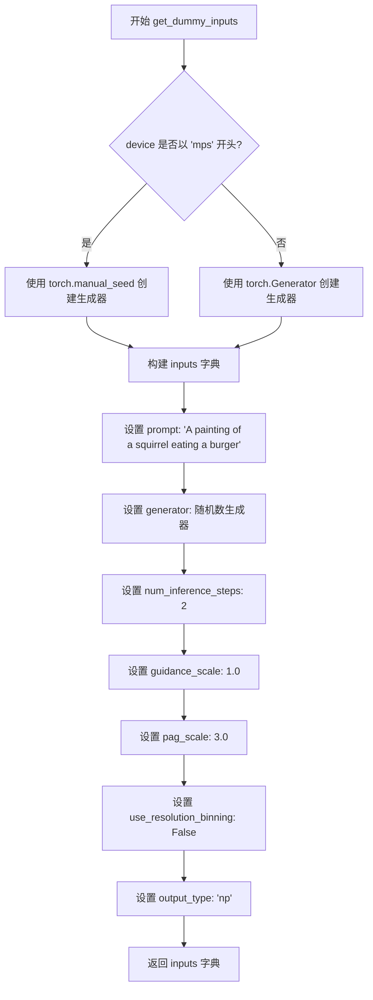
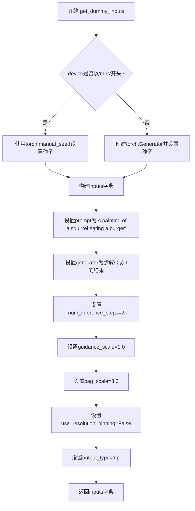
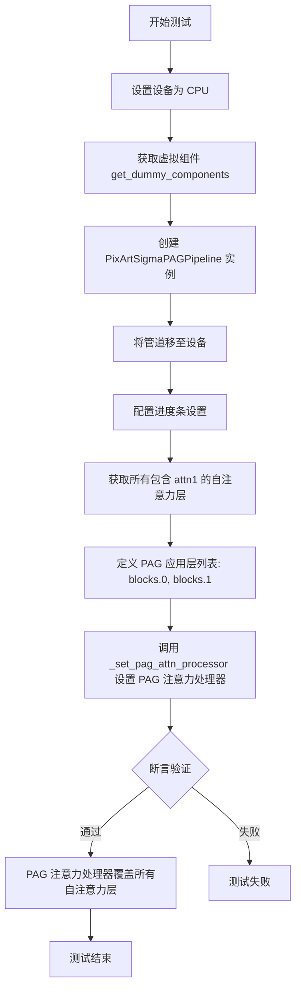
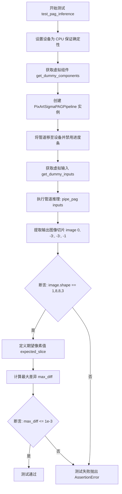
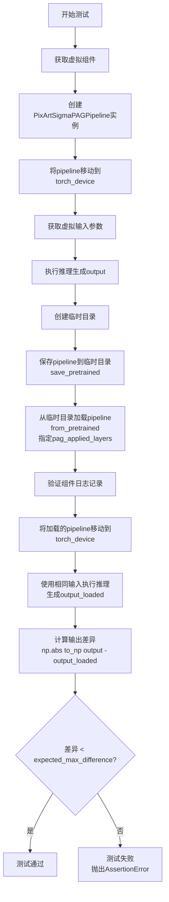
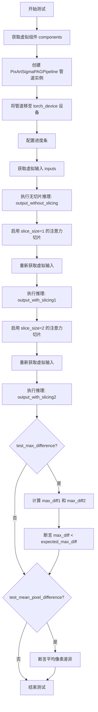
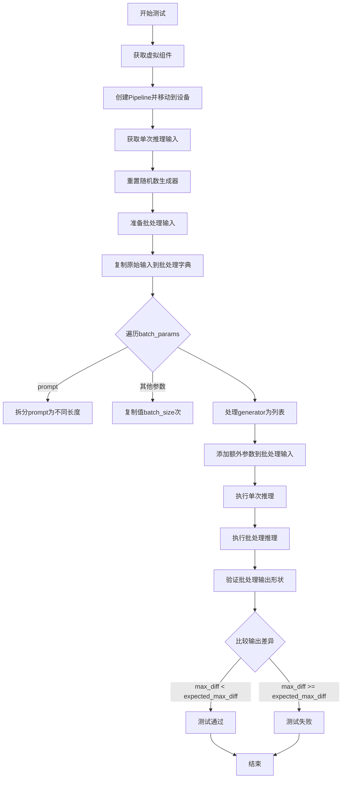
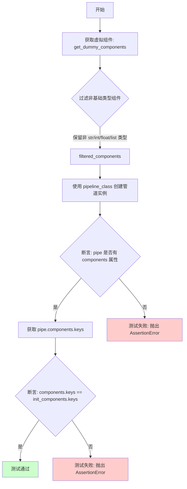

# `diffusers\tests\pipelines\pag\test_pag_pixart_sigma.py` 详细设计文档

This file contains unit tests for the PixArtSigmaPAGPipeline, verifying its core functionalities including Prompt Aspect Guidance (PAG) enable/disable states, layer application logic, inference output validity, serialization/deserialization, attention slicing performance, and batch processing consistency.

## 整体流程

```mermaid
graph TD
    Start[Start Test Execution] --> Init[Initialize Test Class]
    Init --> GetComponents[Call get_dummy_components]
    GetComponents --> GetInputs[Call get_dummy_inputs]
    GetInputs --> Instantiate[Instantiate PixArtSigmaPAGPipeline]
    Instantiate --> Run[Pipeline __call__ (Inference)]
    Run --> Validate[Assert Results (Shape, Pixel Diff, Logger)]
    Validate --> End[End Test]
```

## 类结构

```
unittest.TestCase (Python Standard Library)
└── PipelineTesterMixin (Custom Test Helper)
    └── PixArtSigmaPAGPipelineFastTests (Subject Under Test)
        ├── (Dependencies) PixArtTransformer2DModel
        ├── (Dependencies) AutoencoderKL
        ├── (Dependencies) DDIMScheduler
        ├── (Dependencies) T5EncoderModel
        └── (Dependencies) AutoTokenizer
```

## 全局变量及字段


### `enable_full_determinism`
    
Enables torch full determinism for reproducible tests

类型：`Function`
    


### `torch_device`
    
Device to run tests on (cuda/cpu)

类型：`str`
    


### `to_np`
    
Utility to convert tensor to numpy

类型：`Function`
    


### `TEXT_TO_IMAGE_PARAMS`
    
Standard set of text-to-image pipeline parameters

类型：`Set`
    


### `TEXT_TO_IMAGE_BATCH_PARAMS`
    
Standard set of batch parameters

类型：`Set`
    


### `TEXT_TO_IMAGE_IMAGE_PARAMS`
    
Standard set of image parameters

类型：`Set`
    


### `PipelineTesterMixin`
    
Base class providing common pipeline testing utilities

类型：`Class`
    


### `CaptureLogger`
    
Context manager to capture logging output

类型：`Class`
    


### `PixArtSigmaPAGPipelineFastTests.pipeline_class`
    
The pipeline class being tested (PixArtSigmaPAGPipeline)

类型：`Type`
    


### `PixArtSigmaPAGPipelineFastTests.params`
    
Parameters required for the pipeline call (TEXT_TO_IMAGE_PARAMS + PAG params)

类型：`Set`
    


### `PixArtSigmaPAGPipelineFastTests.batch_params`
    
Parameters that support batching

类型：`Set`
    


### `PixArtSigmaPAGPipelineFastTests.image_params`
    
Parameters related to image generation

类型：`Set`
    


### `PixArtSigmaPAGPipelineFastTests.image_latents_params`
    
Parameters related to latents

类型：`Set`
    


### `PixArtSigmaPAGPipelineFastTests.required_optional_params`
    
List of optional params that must be mutable

类型：`List`
    
    

## 全局函数及方法


### `PixArtSigmaPAGPipelineFastTests.get_dummy_components`

该方法用于初始化并返回一个包含虚拟模型组件的字典（Transformer、VAE、Scheduler、Text Encoder、Tokenizer），使用固定随机种子（0）确保测试的可重复性。

参数：
- 该方法无显式参数（隐式参数为 `self`，表示类实例）

返回值：`dict`，返回一个包含5个键的字典，分别为 `transformer`（PixArtTransformer2DModel）、`vae`（AutoencoderKL）、`scheduler`（DDIMScheduler）、`text_encoder`（T5EncoderModel）和 `tokenizer`（AutoTokenizer），所有模型组件均设置为评估模式（.eval()）

#### 流程图

```mermaid
flowchart TD
    A[开始 get_dummy_components] --> B[设置随机种子 torch.manual_seed(0)]
    B --> C[创建 PixArtTransformer2DModel 实例]
    C --> D[再次设置随机种子 torch.manual_seed(0)]
    D --> E[创建 AutoencoderKL 实例]
    E --> F[创建 DDIMScheduler 实例]
    F --> G[加载预训练的 T5EncoderModel]
    G --> H[加载预训练的 AutoTokenizer]
    H --> I[构建 components 字典]
    I --> J[设置 transformer 和 vae 为 eval 模式]
    J --> K[返回 components 字典]
```

#### 带注释源码

```python
def get_dummy_components(self):
    """
    初始化并返回包含虚拟模型组件的字典，用于测试目的。
    使用固定随机种子确保测试的可重复性。
    """
    # 设置随机种子，确保Transformer初始化的一致性
    torch.manual_seed(0)
    
    # 创建PixArt Transformer模型实例，配置参数用于测试
    transformer = PixArtTransformer2DModel(
        sample_size=8,              # 样本大小
        num_layers=2,               # 层数
        patch_size=2,               # 补丁大小
        attention_head_dim=8,       # 注意力头维度
        num_attention_heads=3,      # 注意力头数量
        caption_channels=32,        # 字幕通道数
        in_channels=4,              # 输入通道数
        cross_attention_dim=24,     # 交叉注意力维度
        out_channels=8,             # 输出通道数
        attention_bias=True,        # 是否使用注意力偏置
        activation_fn="gelu-approximate",  # 激活函数
        num_embeds_ada_norm=1000,   # Ada_norm嵌入数
        norm_type="ada_norm_single", # 归一化类型
        norm_elementwise_affine=False, # 逐元素仿射归一化
        norm_eps=1e-6,              # 归一化 epsilon
    )
    
    # 再次设置随机种子，确保VAE初始化的一致性
    torch.manual_seed(0)
    
    # 创建AutoencoderKL（VAE）实例，用于图像的编码和解码
    vae = AutoencoderKL()

    # 创建DDIM调度器，用于去噪扩散模型的采样调度
    scheduler = DDIMScheduler()
    
    # 加载预训练的T5文本编码器（测试用的小型随机模型）
    text_encoder = T5EncoderModel.from_pretrained("hf-internal-testing/tiny-random-t5")

    # 加载预训练的T5分词器，与文本编码器配套使用
    tokenizer = AutoTokenizer.from_pretrained("hf-internal-testing/tiny-random-t5")

    # 构建组件字典，将所有模型组件封装在一起
    components = {
        "transformer": transformer.eval(),  # Transformer模型，设置为评估模式
        "vae": vae.eval(),                   # VAE模型，设置为评估模式
        "scheduler": scheduler,              # 调度器
        "text_encoder": text_encoder,        # 文本编码器
        "tokenizer": tokenizer,               # 分词器
    }
    
    # 返回包含所有组件的字典，供Pipeline初始化使用
    return components
```


### `PixArtSigmaPAGPipelineFastTests.get_dummy_inputs`

该方法为 PixArt Sigma 图像生成管道准备测试所需的输入参数字典，根据目标设备类型（MPS 或其他）创建相应随机数生成器，并设置图像生成的关键参数（如提示词、推理步数、引导比例等）。

参数：

- `self`：`PixArtSigmaPAGPipelineFastTests`，测试类实例本身
- `device`：`str` 或 `torch.device`，目标设备，用于创建与设备兼容的随机数生成器
- `seed`：`int`，随机种子，用于生成可复现的结果（默认值为 `0`）

返回值：`Dict[str, Any]`，包含管道推理所需参数的字典，包括 prompt（提示词）、generator（随机数生成器）、num_inference_steps（推理步数）、guidance_scale（引导比例）、pag_scale（PAG 缩放因子）、use_resolution_binning（是否使用分辨率分箱）、output_type（输出类型）

#### 流程图



#### 带注释源码

```python
def get_dummy_inputs(self, device, seed=0):
    """
    准备用于管道推理的虚拟输入参数字典。
    
    参数:
        device: 目标设备字符串（如 'cpu', 'cuda', 'mps'）
        seed: 随机种子，用于确保测试结果的可复现性
    
    返回:
        包含图像生成所需参数的字典
    """
    # 针对 Apple Silicon 的 MPS 设备特殊处理
    if str(device).startswith("mps"):
        # MPS 设备不支持 torch.Generator，使用 torch.manual_seed 替代
        generator = torch.manual_seed(seed)
    else:
        # 其他设备使用 torch.Generator 以支持更精确的随机数控制
        generator = torch.Generator(device=device).manual_seed(seed)
    
    # 构建包含所有必要生成参数的字典
    inputs = {
        "prompt": "A painting of a squirrel eating a burger",  # 文本提示词
        "generator": generator,  # 随机数生成器，确保可复现性
        "num_inference_steps": 2,  # 推理步数，测试时使用最小值
        "guidance_scale": 1.0,  # 无分类器自由引导比例
        "pag_scale": 3.0,  # PAG（Progressive Attribute Guidance）缩放因子
        "use_resolution_binning": False,  # 禁用分辨率分箱
        "output_type": "np",  # 输出为 numpy 数组
    }
    return inputs
```


### `PixArtSigmaPAGPipelineFastTests.get_dummy_components`

该方法用于创建一个包含模拟（dummy）组件的字典，这些组件包括Transformer模型、VAE模型、调度器、文本编码器和分词器，专门用于PixArtSigmaPAGPipeline的单元测试，以确保测试环境的一致性和可重复性。

参数：

- `self`：`PixArtSigmaPAGPipelineFastTests`，表示类的实例本身，无需显式传递

返回值：`Dict[str, Any]`，返回一个字典，包含五个键值对，分别对应`transformer`（PixArtTransformer2DModel）、`vae`（AutoencoderKL）、`scheduler`（DDIMScheduler）、`text_encoder`（T5EncoderModel）和`tokenizer`（AutoTokenizer），用于初始化PixArtSigmaPAGPipeline进行测试。

#### 流程图

```mermaid
flowchart TD
    A[开始 get_dummy_components] --> B[设置随机种子 torch.manual_seed(0)]
    B --> C[创建 PixArtTransformer2DModel]
    C --> D[设置随机种子 torch.manual_seed(0)]
    D --> E[创建 AutoencoderKL]
    E --> F[创建 DDIMScheduler]
    F --> G[加载 T5EncoderModel 预训练模型]
    G --> H[加载 AutoTokenizer 分词器]
    H --> I[构建 components 字典]
    I --> J[返回 components 字典]
    
    C -->|transformer| I
    E -->|vae| I
    F -->|scheduler| I
    G -->|text_encoder| I
    H -->|tokenizer| I
```

#### 带注释源码

```python
def get_dummy_components(self):
    """
    创建用于单元测试的模拟组件。
    
    该方法初始化所有必需的模型组件，包括Transformer、VAE、调度器、
    文本编码器和分词器，用于测试PixArtSigmaPAGPipeline的各项功能。
    """
    # 设置随机种子，确保Transformer初始化的一致性
    torch.manual_seed(0)
    
    # 创建PixArt Transformer模型实例，配置参数用于快速测试
    # sample_size: 输入图像的空间尺寸
    # num_layers: Transformer层数
    # patch_size: 图像分块大小
    # attention_head_dim: 注意力头维度
    # num_attention_heads: 注意力头数量
    # caption_channels: caption编码通道数
    # in_channels: 输入通道数
    # cross_attention_dim: 交叉注意力维度
    # out_channels: 输出通道数
    # attention_bias: 是否使用注意力偏置
    # activation_fn: 激活函数类型
    # num_embeds_ada_norm: AdaNorm嵌入数
    # norm_type: 归一化类型
    # norm_elementwise_affine: 是否使用逐元素仿射归一化
    # norm_eps: 归一化epsilon值
    transformer = PixArtTransformer2DModel(
        sample_size=8,
        num_layers=2,
        patch_size=2,
        attention_head_dim=8,
        num_attention_heads=3,
        caption_channels=32,
        in_channels=4,
        cross_attention_dim=24,
        out_channels=8,
        attention_bias=True,
        activation_fn="gelu-approximate",
        num_embeds_ada_norm=1000,
        norm_type="ada_norm_single",
        norm_elementwise_affine=False,
        norm_eps=1e-6,
    )
    
    # 重新设置随机种子，确保VAE初始化与Transformer独立的可重复性
    torch.manual_seed(0)
    
    # 创建变分自编码器（VAE）模型
    # 使用默认配置，用于图像的编码和解码
    vae = AutoencoderKL()

    # 创建DDIM调度器
    # 用于控制扩散过程中的噪声调度策略
    scheduler = DDIMScheduler()
    
    # 加载预训练的T5文本编码器
    # 使用HuggingFace测试用的小型随机模型
    text_encoder = T5EncoderModel.from_pretrained("hf-internal-testing/tiny-random-t5")

    # 加载对应的分词器
    # 用于将文本提示转换为模型可处理的token ID序列
    tokenizer = AutoTokenizer.from_pretrained("hf-internal-testing/tiny-random-t5")

    # 组装所有组件到字典中
    # 使用.eval()将模型设置为评估模式，确保BatchNorm和Dropout等层在推理模式下工作
    components = {
        "transformer": transformer.eval(),
        "vae": vae.eval(),
        "scheduler": scheduler,
        "text_encoder": text_encoder,
        "tokenizer": tokenizer,
    }
    
    # 返回组件字典，供PixArtSigmaPAGPipeline构造函数使用
    return components
```


### `PixArtSigmaPAGPipelineFastTests.get_dummy_inputs`

该方法用于创建测试用的虚拟输入参数，包括文本提示词、随机数生成器和推理参数。主要服务于PixArtSigmaPAGPipeline的单元测试，提供标准化的测试输入数据。

参数：

- `device`：`torch.device` 或 `str`，目标设备（cpu、cuda或mps等），用于创建随机数生成器
- `seed`：`int`，随机种子（默认值：0），用于确保测试的可重复性

返回值：`Dict[str, Any]`，包含以下键值的字典：
- `prompt`：str，测试用文本提示词
- `generator`：torch.Generator，随机数生成器
- `num_inference_steps`：int，推理步数
- `guidance_scale`：float，分类器自由引导比例
- `pag_scale`：float，PAG（Progressive Attention Guidance）缩放因子
- `use_resolution_binning`：bool，是否使用分辨率分箱
- `output_type`：str，输出类型（np表示numpy数组）

#### 流程图



#### 带注释源码

```python
def get_dummy_inputs(self, device, seed=0):
    """
    创建用于测试的虚拟输入参数
    
    参数:
        device: 目标设备，用于创建随机数生成器
        seed: 随机种子，确保测试可重复性
    
    返回:
        包含测试输入的字典
    """
    # 判断设备类型，MPS设备需要特殊处理
    if str(device).startswith("mps"):
        # MPS设备不支持torch.Generator，使用torch.manual_seed替代
        generator = torch.manual_seed(seed)
    else:
        # 在指定设备上创建随机数生成器并设置种子
        generator = torch.Generator(device=device).manual_seed(seed)
    
    # 构建完整的测试输入字典
    inputs = {
        "prompt": "A painting of a squirrel eating a burger",  # 测试用文本提示
        "generator": generator,                                  # 随机数生成器
        "num_inference_steps": 2,                               # 推理步数（较少以加快测试）
        "guidance_scale": 1.0,                                  # 无分类器引导比例
        "pag_scale": 3.0,                                       # PAG缩放因子
        "use_resolution_binning": False,                        # 禁用分辨率分箱
        "output_type": "np",                                    # 输出为numpy数组
    }
    return inputs
```


### `PixArtSigmaPAGPipelineFastTests.test_pag_disable_enable`

该测试方法用于验证PixArtSigmaPAGPipeline中PAG（Prompt-Guided Attention Guidance）功能的正确性，通过对比基准管道（无PAG）、PAG禁用（pag_scale=0.0）和PAG启用（pag_scale=3.0）三种情况下的输出，确认为禁用时输出与基准管道一致，启用时输出与基准管道存在差异。

参数：

- `self`：`PixArtSigmaPAGPipelineFastTests`，测试类实例本身

返回值：`None`，该方法为测试方法，不返回任何值

#### 流程图

```mermaid
flowchart TD
    A[开始测试] --> B[设置设备为cpu]
    B --> C[获取虚拟组件: get_dummy_components]
    C --> D[创建基准管道: PixArtSigmaPipeline]
    D --> E[获取虚拟输入: get_dummy_inputs<br/>不包含pag_scale参数]
    E --> F[运行基准管道<br/>获取输出图像out]
    F --> G[创建PAG管道<br/>设置pag_applied_layers=['blocks.1']]
    G --> H[获取虚拟输入<br/>设置pag_scale=0.0禁用PAG]
    H --> I[运行PAG禁用管道<br/>获取输出out_pag_disabled]
    I --> J[重新创建PAG管道]
    J --> K[获取虚拟输入<br/>使用默认pag_scale=3.0]
    K --> L[运行PAG启用管道<br/>获取输出out_pag_enabled]
    L --> M{断言<br/>out == out_pag_disabled<br/>误差<1e-3}
    M --> N{断言<br/>out != out_pag_enabled<br/>误差>1e-3}
    M -->|失败| O[测试失败]
    N -->|失败| O
    N -->|通过| P[测试通过]
```

#### 带注释源码

```python
def test_pag_disable_enable(self):
    """测试PAG功能：禁用PAG应与基准管道输出相同，启用PAG应与基准管道输出不同"""
    
    # 1. 设置设备为CPU，确保torch.Generator的确定性
    device = "cpu"  # ensure determinism for the device-dependent torch.Generator
    
    # 2. 获取虚拟组件（transformer, vae, scheduler, text_encoder, tokenizer）
    components = self.get_dummy_components()

    # ========== 测试基准管道（无PAG功能）==========
    # 3. 创建基准管道（不包含PAG功能）
    pipe = PixArtSigmaPipeline(**components)
    pipe = pipe.to(device)
    pipe.set_progress_bar_config(disable=None)

    # 4. 获取虚拟输入（不含pag_scale参数）
    inputs = self.get_dummy_inputs(device)
    del inputs["pag_scale"]  # 删除pag_scale参数
    
    # 5. 验证基准管道签名中不包含pag_scale参数
    assert "pag_scale" not in inspect.signature(pipe.__call__).parameters, (
        f"`pag_scale` should not be a call parameter of the base pipeline {pipe.__class__.__name__}."
    )
    
    # 6. 运行基准管道，获取输出（取最后3x3像素块）
    out = pipe(**inputs).images[0, -3:, -3:, -1]

    # ========== 测试PAG禁用（pag_scale=0.0）==========
    # 7. 配置PAG应用层
    components["pag_applied_layers"] = ["blocks.1"]
    
    # 8. 创建PAG管道
    pipe_pag = self.pipeline_class(**components)
    pipe_pag = pipe_pag.to(device)
    pipe_pag.set_progress_bar_config(disable=None)

    # 9. 获取输入，设置pag_scale=0.0禁用PAG
    inputs = self.get_dummy_inputs(device)
    inputs["pag_scale"] = 0.0
    
    # 10. 运行PAG禁用管道
    out_pag_disabled = pipe_pag(**inputs).images[0, -3:, -3:, -1]

    # ========== 测试PAG启用 ==========
    # 11. 重新创建PAG管道
    pipe_pag = self.pipeline_class(**components)
    pipe_pag = pipe_pag.to(device)
    pipe_pag.set_progress_bar_config(disable=None)

    # 12. 获取输入（使用默认pag_scale=3.0）
    inputs = self.get_dummy_inputs(device)
    
    # 13. 运行PAG启用管道
    out_pag_enabled = pipe_pag(**inputs).images[0, -3:, -3:, -1]

    # ========== 断言验证 ==========
    # 14. 验证：禁用PAG时输出应与基准管道相同（误差<1e-3）
    assert np.abs(out.flatten() - out_pag_disabled.flatten()).max() < 1e-3
    
    # 15. 验证：启用PAG时输出应与基准管道不同（误差>1e-3）
    assert np.abs(out.flatten() - out_pag_enabled.flatten()).max() > 1e-3
```


### `PixArtSigmaPAGPipelineFastTests.test_pag_applied_layers`

该测试方法用于验证 PAG（Probabilistic Attention Guidance）功能可以正确地应用于指定的 transformer 层。它通过设置特定的 `pag_applied_layers`（如 "blocks.0" 和 "blocks.1"），并断言所有匹配的自注意力层（attn1）都被正确配置为 PAG 注意力处理器。

参数：无（该测试方法不接收外部参数，使用类内部定义的组件和输入）

返回值：无（该方法为 `void`，使用 `assert` 语句进行断言验证）

#### 流程图



#### 带注释源码

```python
def test_pag_applied_layers(self):
    """
    测试 PAG 功能是否正确应用于指定的层。
    
    该测试验证：
    1. 能够通过 pag_applied_layers 参数指定要应用 PAG 的层
    2. 设置后，pipe.pag_attn_processors 包含所有匹配的自注意力层
    """
    # 使用 CPU 设备以确保确定性（torch.Generator 依赖于设备）
    device = "cpu"
    
    # 获取测试所需的虚拟组件（transformer, vae, scheduler, text_encoder, tokenizer）
    components = self.get_dummy_components()

    # 创建基础管道（使用 PixArtSigmaPAGPipeline）
    pipe = self.pipeline_class(**components)
    pipe = pipe.to(device)
    
    # 配置进度条（disable=None 表示不禁用进度条）
    pipe.set_progress_bar_config(disable=None)

    # 获取所有包含 "attn1" 的自注意力层名称
    # 例如：'blocks.0.attn1', 'blocks.1.attn1' 等
    all_self_attn_layers = [k for k in pipe.transformer.attn_processors.keys() if "attn1" in k]
    
    # 定义要应用 PAG 的层列表（块级别）
    pag_layers = ["blocks.0", "blocks.1"]
    
    # 调用内部方法设置 PAG 注意力处理器
    # 参数 do_classifier_free_guidance=False 表示不使用 classifier-free guidance
    pipe._set_pag_attn_processor(pag_applied_layers=pag_layers, do_classifier_free_guidance=False)
    
    # 断言：设置的 PAG 注意力处理器应该覆盖所有自注意力层
    # 这验证了 PAG 能够正确地应用于指定层及其所有子注意力层
    assert set(pipe.pag_attn_processors) == set(all_self_attn_layers)
```


### `PixArtSigmaPAGPipelineFastTests.test_pag_inference`

该测试方法用于验证 PixArtSigmaPAGPipeline 在启用 PAG（Prompt Attention Guidance）功能时的基本推理输出 shape 和数值正确性，确保输出图像尺寸为 (1, 8, 8, 3) 且像素值在预期范围内。

参数：

- `self`：测试类实例本身，无额外参数

返回值：`None`，该方法为测试方法，不返回任何值（测试断言通过即表示成功）

#### 流程图



#### 带注释源码

```python
def test_pag_inference(self):
    """
    测试 PixArtSigmaPAGPipeline 在 PAG 模式下的基本推理功能。
    验证输出图像的形状和像素值是否符合预期。
    """
    # 1. 设置设备为 CPU，确保随机数生成器的确定性
    #    （torch.Generator 在 CPU 上更易控制）
    device = "cpu"  # ensure determinism for the device-dependent torch.Generator
    
    # 2. 获取虚拟组件（transformer, vae, scheduler, text_encoder, tokenizer）
    #    用于测试的轻量级模型配置
    components = self.get_dummy_components()

    # 3. 创建 PAG 管道实例并移至指定设备
    pipe_pag = self.pipeline_class(**components)
    pipe_pag = pipe_pag.to(device)
    
    # 4. 禁用进度条输出（测试环境不需要）
    pipe_pag.set_progress_bar_config(disable=None)

    # 5. 获取虚拟输入参数
    #    包含: prompt, generator, num_inference_steps, guidance_scale, 
    #          pag_scale, use_resolution_binning, output_type
    inputs = self.get_dummy_inputs(device)
    
    # 6. 执行推理并获取输出图像
    #    返回值包含多张图像，取第一张
    image = pipe_pag(**inputs).images
    
    # 7. 提取图像右下角 3x3 区域及最后一个通道（RGB 中的 R）
    #    用于像素值比对
    image_slice = image[0, -3:, -3:, -1]

    # 8. 断言输出图像形状为 (1, 8, 8, 3)
    #    1=批次大小, 8=高度, 8=宽度, 3=RGB通道
    assert image.shape == (
        1,
        8,
        8,
        3,
    ), f"the shape of the output image should be (1, 8, 8, 3) but got {image.shape}"
    
    # 9. 定义期望的像素值切片（基于已知正确输出）
    expected_slice = np.array([0.6499, 0.3250, 0.3572, 0.6780, 0.4453, 0.4582, 0.2770, 0.5168, 0.4594])

    # 10. 计算实际输出与期望输出的最大差异
    max_diff = np.abs(image_slice.flatten() - expected_slice).max()
    
    # 11. 断言最大差异小于等于 1e-3（千分之一）
    self.assertLessEqual(max_diff, 1e-3)
```


### `PixArtSigmaPAGPipelineFastTests.test_save_load_local`

该测试方法用于验证 PixArtSigmaPAGPipeline 在包含 PAG（Progressive Attention Guidance）层情况下的序列化和反序列化功能，确保保存后的模型重新加载时能够产生与原始模型一致的输出结果。

参数：

- `self`：`PixArtSigmaPAGPipelineFastTests`，测试类实例本身
- `expected_max_difference`：`float`，期望输出之间的最大差异阈值，默认为 `1e-4`

返回值：无返回值（`None`），该方法为 unittest 测试用例，通过断言验证正确性

#### 流程图



#### 带注释源码

```python
def test_save_load_local(self, expected_max_difference=1e-4):
    """
    测试 pipeline 在包含 PAG 层时的序列化和反序列化功能。
    
    Args:
        expected_max_difference: 期望输出之间的最大差异阈值
    """
    # Step 1: 获取虚拟组件（transformer, vae, scheduler, text_encoder, tokenizer）
    components = self.get_dummy_components()
    
    # Step 2: 使用组件创建 PixArtSigmaPAGPipeline 实例
    pipe = self.pipeline_class(**components)

    # Step 3: 将 pipeline 移动到指定的计算设备（CPU/CUDA）
    pipe.to(torch_device)
    
    # Step 4: 配置进度条（disable=None 表示不禁用进度条）
    pipe.set_progress_bar_config(disable=None)

    # Step 5: 获取测试输入参数
    inputs = self.get_dummy_inputs(torch_device)
    
    # Step 6: 执行推理，获取原始输出
    # output 包含图像数组，索引 [0] 获取第一张图像
    output = pipe(**inputs)[0]

    # Step 7: 设置日志记录器，用于捕获加载过程中的日志
    logger = logging.get_logger("diffusers.pipelines.pipeline_utils")
    logger.setLevel(diffusers.logging.INFO)

    # Step 8: 创建临时目录用于保存 pipeline
    with tempfile.TemporaryDirectory() as tmpdir:
        # Step 9: 保存 pipeline 到临时目录
        # safe_serialization=False 表示不使用安全序列化（允许非安全格式）
        pipe.save_pretrained(tmpdir, safe_serialization=False)

        # Step 10: 从临时目录加载 pipeline，并指定 pag_applied_layers
        # 这是一个关键测试点：验证带 PAG 层配置的 pipeline 能否正确加载
        with CaptureLogger(logger) as cap_logger:
            pipe_loaded = self.pipeline_class.from_pretrained(
                tmpdir, 
                pag_applied_layers=["blocks.1"]
            )

        # Step 11: 验证所有非可选组件都在日志中被记录
        for name in pipe_loaded.components.keys():
            if name not in pipe_loaded._optional_components:
                assert name in str(cap_logger)

        # Step 12: 将加载的 pipeline 移动到指定设备
        pipe_loaded.to(torch_device)
        
        # Step 13: 配置加载后的 pipeline 进度条
        pipe_loaded.set_progress_bar_config(disable=None)

    # Step 14: 使用相同的输入参数对加载后的 pipeline 进行推理
    inputs = self.get_dummy_inputs(torch_device)
    output_loaded = pipe_loaded(**inputs)[0]

    # Step 15: 计算原始输出和加载后输出的差异
    # to_np 将张量转换为 numpy 数组
    max_diff = np.abs(to_np(output) - to_np(output_loaded)).max()
    
    # Step 16: 断言差异在可接受范围内
    # 如果差异大于 expected_max_difference，测试失败
    self.assertLess(max_diff, expected_max_difference)
```


### `PixArtSigmaPAGPipelineFastTests.test_attention_slicing_forward_pass`

该测试方法用于验证 PixArtSigmaPAGPipeline 在启用注意力切片（attention slicing）功能时的推理一致性。通过对比无切片、slice_size=1 和 slice_size=2 三种情况下的输出图像，确保注意力切片不会影响最终的生成结果。

参数：

- `self`：`PixArtSigmaPAGPipelineFastTests`，测试类的实例，指向当前的测试对象
- `test_max_difference`：`bool`，默认为 `True`，是否测试最大像素差异
- `test_mean_pixel_difference`：`bool`，默认为 `True`，是否测试平均像素差异
- `expected_max_diff`：`float`，默认为 `1e-3`，允许的最大差异阈值

返回值：`None`，该方法为单元测试方法，无返回值，通过断言验证推理一致性

#### 流程图



#### 带注释源码

```python
# 单元测试方法：验证注意力切片功能的推理一致性
# 测试确保启用 attention slicing 不会影响生成图像的质量
def test_attention_slicing_forward_pass(
    self, test_max_difference=True, test_mean_pixel_difference=True, expected_max_diff=1e-3
):
    # 步骤1: 获取预定义的虚拟组件（transformer, vae, scheduler, text_encoder, tokenizer）
    components = self.get_dummy_components()
    
    # 步骤2: 使用虚拟组件实例化 PixArtSigmaPAGPipeline 管道
    pipe = self.pipeline_class(**components)

    # 步骤3: 将管道移至指定的测试设备（torch_device）
    pipe.to(torch_device)
    
    # 步骤4: 配置进度条（disable=None 表示不禁用进度条）
    pipe.set_progress_bar_config(disable=None)

    # 步骤5: 设置生成器设备为 CPU（确保随机性可复现）
    generator_device = "cpu"
    
    # 步骤6: 获取虚拟输入（包含 prompt, generator, num_inference_steps 等）
    inputs = self.get_dummy_inputs(generator_device)
    
    # 步骤7: 执行无注意力切片的推理，获取基准输出
    # 这是正常推理，attention_slicing 默认关闭
    output_without_slicing = pipe(**inputs)[0]

    # 步骤8: 启用注意力切片，slice_size=1 表示每个 slice 处理 1 个 token
    # 注意：slice_size=1 实际上不会进行切片，只是启用该功能
    pipe.enable_attention_slicing(slice_size=1)
    
    # 步骤9: 重新获取输入以确保随机种子一致
    inputs = self.get_dummy_inputs(generator_device)
    
    # 步骤10: 执行 slice_size=1 的推理
    output_with_slicing1 = pipe(**inputs)[0]

    # 步骤11: 启用 slice_size=2 的注意力切片
    # 此时会将 attention 计算分片为 2 个部分进行处理
    pipe.enable_attention_slicing(slice_size=2)
    
    # 步骤12: 重新获取输入
    inputs = self.get_dummy_inputs(generator_device)
    
    # 步骤13: 执行 slice_size=2 的推理
    output_with_slicing2 = pipe(**inputs)[0]

    # 步骤14: 如果启用最大差异测试，计算各输出与基准的差异
    if test_max_difference:
        # 计算 slice_size=1 输出与无切片输出的最大差异
        max_diff1 = np.abs(to_np(output_with_slicing1) - to_np(output_without_slicing)).max()
        
        # 计算 slice_size=2 输出与无切片输出的最大差异
        max_diff2 = np.abs(to_np(output_with_slicing2) - to_np(output_without_slicing)).max()
        
        # 断言：注意力切片不应影响推理结果
        # 如果差异超过 expected_max_diff，测试失败
        self.assertLess(
            max(max_diff1, max_diff2),
            expected_max_diff,
            "Attention slicing should not affect the inference results",
        )

    # 步骤15: 如果启用平均像素差异测试
    if test_mean_pixel_difference:
        # 验证 slice_size=1 与无切片的平均像素差异
        assert_mean_pixel_difference(to_np(output_with_slicing1[0]), to_np(output_without_slicing[0]))
        
        # 验证 slice_size=2 与无切片的平均像素差异
        assert_mean_pixel_difference(to_np(output_with_slicing2[0]), to_np(output_without_slicing[0]))
```


### `PixArtSigmaPAGPipelineFastTests.test_dict_tuple_outputs_equivalent`

该测试方法验证 PixArtSigmaPAGPipeline 在返回字典格式和元组格式时的输出一致性，确保两种返回方式产生等效的结果。

参数：

- `expected_slice`：`Optional[Any]`，用于测试的期望输出切片，如果为 None 则直接运行管道获取输出
- `expected_max_difference`：`float`，默认为 1e-4，允许的最大像素差异阈值

返回值：`None`，该方法为单元测试，通过 `assertLess` 断言验证差异小于阈值，不返回实际数据

#### 流程图

```mermaid
flowchart TD
    A[开始测试] --> B[获取虚拟组件]
    B --> C[创建并配置管道]
    C --> D{expected_slice是否为None}
    D -->|是| E[调用管道获取输出: output = pipe(...)[0]
    D -->|否| F[使用提供的expected_slice作为output]
    E --> G[调用管道获取元组输出: output_tuple = pipe(..., return_dict=False)[0]
    F --> G
    G --> H{expected_slice是否为None}
    H -->|是| I[直接比较output和output_tuple]
    H -->|否| J{output_tuple维度是否为5}
    J -->|否| K[提取output_tuple的切片并展平]
    J -->|是| L[提取5维output_tuple的切片并展平]
    K --> M[计算max_diff]
    L --> M
    I --> M
    M --> N{断言max_diff < expected_max_difference}
    N -->|通过| O[测试通过]
    N -->|失败| P[测试失败]
```

#### 带注释源码

```python
def test_dict_tuple_outputs_equivalent(self, expected_slice=None, expected_max_difference=1e-4):
    """
    测试当output_type为dict和tuple时，返回结果是否等价
    
    参数:
        expected_slice: 可选的期望输出切片，用于复用已保存的输出进行测试
        expected_max_difference: 允许的最大像素差异，默认1e-4
    """
    # 步骤1: 获取虚拟组件（transformer, vae, scheduler, text_encoder, tokenizer）
    components = self.get_dummy_components()
    
    # 步骤2: 使用虚拟组件创建PixArtSigmaPAGPipeline管道实例
    pipe = self.pipeline_class(**components)
    
    # 步骤3: 将管道移动到测试设备并配置进度条
    pipe.to(torch_device)
    pipe.set_progress_bar_config(disable=None)
    
    # 步骤4: 设置生成器设备为CPU以确保确定性
    generator_device = "cpu"
    
    # 步骤5: 获取默认的虚拟输入参数
    # 步骤6: 根据expected_slice是否存在决定如何获取输出
    if expected_slice is None:
        # 正常调用管道，默认返回dict格式（output_type="np"）
        # 只取返回的第一个元素（images）
        output = pipe(**self.get_dummy_inputs(generator_device))[0]
    else:
        # 复用已保存的输出切片
        output = expected_slice
    
    # 步骤7: 使用return_dict=False强制管道返回tuple格式
    output_tuple = pipe(**self.get_dummy_inputs(generator_device), return_dict=False)[0]
    
    # 步骤8: 计算字典输出和元组输出之间的差异
    if expected_slice is None:
        # 直接比较两个输出数组
        max_diff = np.abs(to_np(output) - to_np(output_tuple)).max()
    else:
        # 处理不同维度的输出情况
        if output_tuple.ndim != 5:
            # 4D输出: 提取最后3x3像素并展平比较
            max_diff = np.abs(to_np(output) - to_np(output_tuple)[0, -3:, -3:, -1].flatten()).max()
        else:
            # 5D输出: 提取最后3x3x1像素并展平比较
            max_diff = np.abs(to_np(output) - to_np(output_tuple)[0, -3:, -3:, -1, -1].flatten()).max()
    
    # 步骤9: 断言差异小于允许的最大差异阈值
    self.assertLess(max_diff, expected_max_difference)
```


### `PixArtSigmaPAGPipelineFastTests.test_inference_batch_single_identical`

该测试方法用于验证PixArtSigmaPAGPipeline在批处理推理（batch inference）与单次推理（single inference）模式下输出结果的一致性，确保两种推理方式生成相同的图像结果。

参数：

- `self`：测试类实例本身
- `batch_size`：`int`，批处理大小，默认为2
- `expected_max_diff`：`float`，期望的最大像素差异阈值，默认为1e-4
- `additional_params_copy_to_batched_inputs`：`list`，需要复制到批处理输入的额外参数列表，默认为`["num_inference_steps"]`

返回值：`None`，该方法为测试用例，通过assert语句验证一致性，不返回任何值

#### 流程图



#### 带注释源码

```python
def test_inference_batch_single_identical(
    self,
    batch_size=2,
    expected_max_diff=1e-4,
    additional_params_copy_to_batched_inputs=["num_inference_steps"],
):
    """
    测试批处理推理与单次推理的一致性
    
    参数:
        batch_size: 批处理大小，默认为2
        expected_max_diff: 允许的最大差异阈值
        additional_params_copy_to_batched_inputs: 需要复制到批处理输入的参数列表
    """
    # 获取虚拟组件用于测试
    components = self.get_dummy_components()
    
    # 创建Pipeline实例并移动到测试设备
    pipe = self.pipeline_class(**components)
    pipe.to(torch_device)
    pipe.set_progress_bar_config(disable=None)
    
    # 获取单次推理的虚拟输入
    inputs = self.get_dummy_inputs(torch_device)
    
    # 重置随机数生成器，确保测试可重复性
    inputs["generator"] = self.get_generator(0)
    
    # 获取logger并设置日志级别为FATAL以减少输出
    logger = logging.get_logger(pipe.__module__)
    logger.setLevel(level=diffusers.logging.FATAL)
    
    # 准备批处理输入字典，复制原始输入
    batched_inputs = {}
    batched_inputs.update(inputs)
    
    # 遍历批处理参数，将单次输入转换为批处理格式
    for name in self.batch_params:
        if name not in inputs:
            continue
        
        value = inputs[name]
        if name == "prompt":
            # 对prompt进行不同长度的分割，最后一个添加很长的后缀
            len_prompt = len(value)
            batched_inputs[name] = [value[: len_prompt // i] for i in range(1, batch_size + 1)]
            batched_inputs[name][-1] = 100 * "very long"
        else:
            # 其他参数复制batch_size次
            batched_inputs[name] = batch_size * [value]
    
    # 为每个批处理输入创建独立的generator，确保结果可复现
    if "generator" in inputs:
        batched_inputs["generator"] = [self.get_generator(i) for i in range(batch_size)]
    
    # 设置批处理大小
    if "batch_size" in inputs:
        batched_inputs["batch_size"] = batch_size
    
    # 复制额外的参数到批处理输入
    for arg in additional_params_copy_to_batched_inputs:
        batched_inputs[arg] = inputs[arg]
    
    # 执行单次推理
    output = pipe(**inputs)
    
    # 执行批处理推理
    output_batch = pipe(**batched_inputs)
    
    # 验证批处理输出的batch维度正确
    assert output_batch[0].shape[0] == batch_size
    
    # 计算第一个批处理输出与单次输出的差异
    # 比较相同prompt生成的图像是否一致
    max_diff = np.abs(to_np(output_batch[0][0]) - to_np(output[0][0])).max()
    
    # 断言差异小于阈值，确保一致性
    assert max_diff < expected_max_diff
```


### `PixArtSigmaPAGPipelineFastTests.test_components_function`

该测试方法验证 PixArtSigmaPAGPipeline 管道实例的 `components` 属性是否与初始化时传入的组件键完全匹配，确保管道的组件注册机制正确工作。

参数：

- `self`：`PixArtSigmaPAGPipelineFastTests`，测试类实例本身，隐式参数

返回值：`None`，该方法为单元测试方法，通过断言验证，不返回任何值

#### 流程图



#### 带注释源码

```python
def test_components_function(self):
    """
    测试 components 属性是否与初始化键匹配
    
    该测试验证：
    1. 管道实例具有 components 属性
    2. components 的键与初始化时传入的组件键完全一致
    """
    # 第一步：获取虚拟组件配置
    # get_dummy_components() 返回包含以下组件的字典：
    # - transformer: PixArtTransformer2DModel
    # - vae: AutoencoderKL  
    # - scheduler: DDIMScheduler
    # - text_encoder: T5EncoderModel
    # - tokenizer: AutoTokenizer
    init_components = self.get_dummy_components()
    
    # 第二步：过滤掉基础类型和非模型组件
    # 仅保留模型/处理器类型的组件（排除 str, int, float, list 等基础类型）
    # 这确保测试只关注核心模型组件
    init_components = {k: v for k, v in init_components.items() if not isinstance(v, (str, int, float, list))}
    
    # 第三步：创建管道实例
    # 使用过滤后的组件字典实例化管道
    # pipeline_class = PixArtSigmaPAGPipeline
    pipe = self.pipeline_class(**init_components)
    
    # 第四步：断言验证
    # 验证点1: 确保管道对象具有 components 属性
    self.assertTrue(hasattr(pipe, "components"))
    
    # 验证点2: 确保 components 的键集合与初始化组件的键集合完全一致
    # 使用 set 比较以忽略顺序差异
    self.assertTrue(set(pipe.components.keys()) == set(init_components.keys()))
```

## 关键组件


### PixArtSigmaPAGPipeline

主测试管道类，继承自PipelineTesterMixin和unittest.TestCase，用于测试PixArt Sigma模型的PAG（Perturbed Attention Guidance）功能，包含PAG禁用启用测试、PAG应用层测试、推理测试、保存加载测试、注意力切片测试等。

### PixArtTransformer2DModel

PixArt Sigma的Transformer 2D模型，用于图像生成的核心组件，在测试中配置了2层、8x8样本大小、3个注意力头等参数。

### AutoencoderKL

变分自编码器（VAE）模型，负责将图像在潜在空间和像素空间之间进行转换，用于编码和解码图像。

### DDIMScheduler

DDIM调度器，用于去噪扩散概率模型（DDIM）推理过程中的噪声调度，控制去噪步骤。

### T5EncoderModel

T5文本编码器模型，负责将文本提示编码为文本嵌入向量，为图像生成提供文本条件。

### AutoTokenizer

T5分词器，负责将文本提示转换为token IDs，供文本编码器处理。

### PAG（Perturbed Attention Guidance）

代码中的关键功能组件，通过pag_scale和pag_adtest_adaptive_scale参数控制，用于提升图像生成质量。

### get_dummy_components

全局函数，用于创建测试所需的虚拟组件字典，包含transformer、vae、scheduler、text_encoder和tokenizer。

### get_dummy_inputs

全局函数，用于创建测试所需的虚拟输入参数，包含prompt、generator、num_inference_steps、guidance_scale、pag_scale等。

### test_pag_disable_enable

测试方法，用于验证PAG功能的禁用和启用是否正常工作，验证禁用时输出与基础管道一致。

### test_pag_applied_layers

测试方法，用于验证PAG应用层的设置是否正确，确保PAG正确应用于指定的transformer层。

### test_pag_inference

测试方法，用于验证PAG管道推理的正确性，检查输出图像的形状和像素值。

### test_save_load_local

测试方法，用于验证管道的保存和加载功能，确保PAG配置（pag_applied_layers）能正确序列化和反序列化。

### test_attention_slicing_forward_pass

测试方法，用于验证注意力切片功能，确保持续注意力切片时输出与不使用切片时一致。

### test_dict_tuple_outputs_equivalent

测试方法，用于验证管道输出格式的等价性，确保字典格式和元组格式输出结果一致。

### test_inference_batch_single_identical

测试方法，用于验证批处理推理与单样本推理的一致性，确保批处理不会影响输出质量。

### test_components_function

测试方法，用于验证管道组件的正确暴露，确保components属性包含所有必需的初始化组件。


## 问题及建议


### 已知问题

- **测试代码重复**：多个测试方法中重复出现设备设置 (`device = "cpu"`)、pipeline 创建 (`pipe = ...to(device)`)、进度条配置 (`pipe.set_progress_bar_config(disable=None)`) 等相似代码，增加了维护成本。
- **硬编码的阈值和数值**：`test_pag_inference` 中的 `expected_slice = np.array([0.6499, 0.3250, ...])` 是硬编码的浮点数组，任何模型内部实现的微小变化都可能导致测试失败，降低了测试的鲁棒性。
- **Magic Numbers 散落**：多处使用魔法数字如 `1e-3`、`1e-4`、`slice_size=1`、`slice_size=2`、`num_inference_steps=2` 等，缺乏统一常量定义，可读性和可维护性差。
- **外部模型依赖**：测试依赖外部预训练模型 `"hf-internal-testing/tiny-random-t5"`，网络不可用或模型变更会导致测试失败。
- **测试方法参数冗长**：`test_attention_slicing_forward_pass` 和 `test_inference_batch_single_identical` 等方法参数过多（超过 5 个参数），影响可读性和调用便利性。
- **缺失的测试隔离**：部分测试修改了全局状态（如 `logger.setLevel`），未在测试后恢复，可能影响其他测试的执行环境。
- **未实现的测试占位**：`test_save_load_optional_components` 直接跳过并留空，但有 `@unittest.skip` 装饰器标记，说明该测试场景可能尚未完全实现或被遗忘。

### 优化建议

- **提取公共 fixture**：利用 `unittest.TestCase` 的 `setUp` 方法或 pytest fixture，将设备初始化、pipeline 创建等公共逻辑提取出来，减少代码重复。
- **参数化与配置中心**：将魔法数字集中到类常量或配置字典中管理，例如 `REQUIRED_MAX_DIFF = 1e-3`、`DEFAULT_SLICE_SIZE = 1` 等。
- **使用相对比较或容差范围**：将 `expected_slice` 替换为基于基准输出的相对比较，或扩大容差范围以适应模型微小波动。
- **Mock 外部依赖**：使用 `unittest.mock` 或本地小型模型权重替代远程模型加载，提升测试的独立性和执行速度。
- **简化长参数方法**：将过长的参数列表封装为数据类（dataclass）或配置对象，提升方法签名清晰度。
- **测试环境隔离**：在修改全局状态（如 logger 级别）时，使用 `setUp` 和 `tearDown` 确保恢复，或使用 `unittest.TestCase` 的上下文管理器。
- **完善跳过测试**：明确 `test_save_load_optional_components` 的实现计划，或移除该占位方法，避免代码库中存在"死代码"。

## 其它


### 设计目标与约束

该测试文件旨在验证 PixArtSigmaPAGPipeline（基于 PixArt Sigma 的 PAG 引导图像生成管道）的功能正确性，包括 PAG（Progressive Attention Guidance）功能的启用/禁用、层应用、推理结果正确性、模型保存与加载、注意力切片、批处理一致性等核心功能。约束条件包括：必须使用 CPU 设备以确保确定性结果，测试使用虚拟（dummy）组件而非真实预训练模型，输出图像尺寸为 (1, 8, 8, 3)，最大像素差异容忍度为 1e-3 至 1e-4。

### 错误处理与异常设计

测试中的错误处理主要通过 assert 语句实现，包括：验证 pag_scale 参数在基管道中不存在；验证 PAG 禁用时输出与基管道一致（差异 < 1e-3）；验证 PAG 启用时输出与基管道不同（差异 > 1e-3）；验证保存/加载后输出一致性；验证注意力切片不影响推理结果。测试使用 unittest 框架的 assertLessEqual 和 assertLess 方法进行断言，skip 装饰器用于跳过已覆盖的测试用例。

### 数据流与状态机

测试数据流如下：get_dummy_components() 创建虚拟 transformer、VAE、scheduler、text_encoder、tokenizer；get_dummy_inputs() 生成测试输入（prompt、generator、num_inference_steps、guidance_scale、pag_scale 等）；测试方法执行管道调用并验证输出。状态转换包括：管道初始化 → 设备转移（to(device)）→ 进度条配置 → 执行推理 → 输出验证。PAG 相关状态：pag_scale=0.0 表示禁用，pag_scale>0 表示启用，pag_applied_layers 定义应用 PAG 的注意力层。

### 外部依赖与接口契约

主要外部依赖包括：transformers 库（AutoTokenizer、T5EncoderModel）、diffusers 库（AutoencoderKL、DDIMScheduler、PixArtSigmaPAGPipeline、PixArtSigmaPipeline、PixArtTransformer2DModel）、numpy、torch、unittest。接口契约方面：pipeline_class 必须是 PixArtSigmaPAGPipeline；params 必须包含 TEXT_TO_IMAGE_PARAMS 加上 pag_scale 和 pag_adaptive_scale；get_dummy_components() 返回包含 transformer、vae、scheduler、text_encoder、tokenizer 的字典；get_dummy_inputs() 返回包含 prompt、generator、num_inference_steps、guidance_scale、pag_scale、use_resolution_binning、output_type 的字典。

### 性能考虑

测试性能考虑包括：使用小规模虚拟模型（num_layers=2、patch_size=2、num_attention_heads=3）降低计算开销；num_inference_steps 设置为 2 减少推理步数；使用 CPU 设备确保确定性但可能较慢；enable_attention_slicing 测试验证切片优化不影响结果正确性。测试未包含性能基准测试，主要关注功能正确性验证。

### 测试策略

测试采用单元测试策略，使用 unittest 框架。测试覆盖包括：功能测试（test_pag_disable_enable、test_pag_applied_layers、test_pag_inference）、集成测试（test_save_load_local）、性能相关测试（test_attention_slicing_forward_pass）、一致性测试（test_dict_tuple_outputs_equivalent、test_inference_batch_single_identical）、组件测试（test_components_function）。测试使用确定性随机种子（torch.manual_seed(0)）确保可重复性。

### 配置管理

配置通过以下方式管理：参数集合（params、batch_params、image_params、image_latents_params）定义管道调用参数；get_dummy_components() 硬编码虚拟模型配置；get_dummy_inputs() 硬编码测试输入；pipeline_class 类属性指定被测管道；required_optional_params 指定可选参数要求。配置变更（如 pag_applied_layers）通过动态修改 components 字典实现。

### 版本兼容性

代码引用了特定版本相关功能：PixArtSigmaPAGPipeline 和 PixArtSigmaPipeline 需要兼容的 diffusers 版本；T5EncoderModel.from_pretrained 需要 transformers 库支持；测试使用了 PAG（Progressive Attention Guidance）功能，该功能可能需要特定版本的 diffusers。当前代码无版本检查机制，依赖运行时导入错误报告问题。

### 资源管理

资源管理包括：使用 tempfile.TemporaryDirectory() 自动清理临时文件；管道通过 to(device) 管理设备资源；Generator 对象在 get_dummy_inputs() 中创建；无显式的资源释放代码，依赖 Python 垃圾回收。测试未包含大规模资源压力测试。

### 安全性考虑

测试代码安全性考虑：使用 hf-internal-testing/tiny-random-t5 虚拟模型而非真实模型，避免潜在的安全风险；无用户输入处理；无敏感数据操作；测试在隔离环境中运行。代码遵循 Apache License 2.0 开源协议。

    