# `diffusers\tests\pipelines\pag\test_pag_sana.py` 详细设计文档

这是针对SanaPAGPipeline的单元测试文件，测试了文本到图像生成管道的核心功能，包括PAG（Probabilistic Adaptive Guidance）机制、注意力切片、回调函数支持以及float16推理等关键特性。

## 整体流程

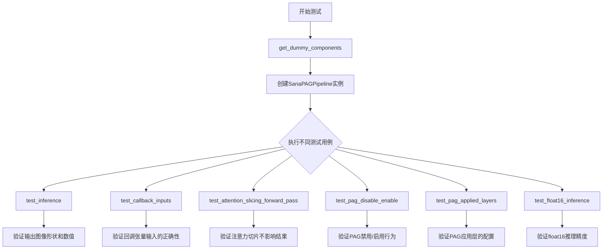

## 类结构

```
unittest.TestCase
└── PipelineTesterMixin
    └── SanaPAGPipelineFastTests (测试类)
```

## 全局变量及字段


### `enable_full_determinism`
    
启用完全确定性

类型：`function`
    


### `torch_device`
    
torch设备

类型：`str`
    


### `np`
    
numpy别名

类型：`module`
    


### `torch`
    
PyTorch别名

类型：`module`
    


### `inspect`
    
检查模块

类型：`module`
    


### `unittest`
    
单元测试模块

类型：`module`
    


### `SanaPAGPipelineFastTests.pipeline_class`
    
管道类

类型：`type`
    


### `SanaPAGPipelineFastTests.params`
    
文本到图像参数集

类型：`set`
    


### `SanaPAGPipelineFastTests.batch_params`
    
批处理参数集

类型：`set`
    


### `SanaPAGPipelineFastTests.image_params`
    
图像参数集

类型：`set`
    


### `SanaPAGPipelineFastTests.image_latents_params`
    
图像潜在参数集

类型：`set`
    


### `SanaPAGPipelineFastTests.required_optional_params`
    
必需的可选参数集

类型：`frozenset`
    


### `SanaPAGPipelineFastTests.test_xformers_attention`
    
xformers注意力测试标志

类型：`bool`
    


### `SanaPAGPipelineFastTests.supports_dduf`
    
DDUF支持标志

类型：`bool`
    
    

## 全局函数及方法


### `enable_full_determinism`

该函数用于启用测试的完全确定性，通过设置PyTorch、NumPy等库的随机种子和环境变量，确保深度学习测试结果可复现。

参数：无

返回值：无

#### 流程图

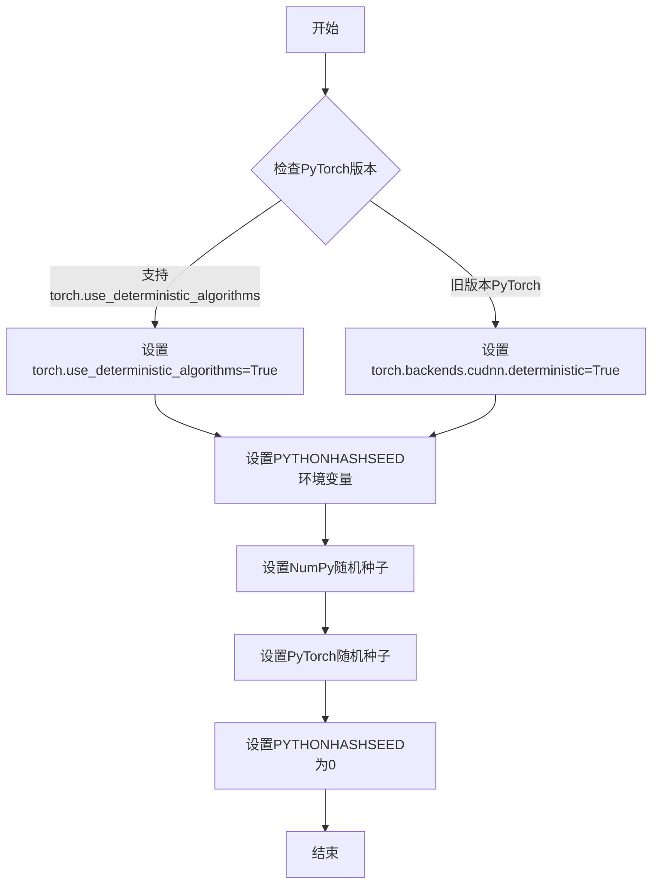

#### 带注释源码

```python
# 从testing_utils模块导入enable_full_determinism函数
from ...testing_utils import enable_full_determinism, torch_device

# 调用该函数以启用完全确定性测试
# 确保测试结果可复现
enable_full_determinism()


class SanaPAGPipelineFastTests(PipelineTesterMixin, unittest.TestCase):
    # 测试类使用确定性测试以确保结果一致
    ...
```

#### 推断的实现逻辑

```python
# 推断的enable_full_determinism函数实现

def enable_full_determinism(seed: int = 0):
    """
    启用完全确定性测试模式。
    
    参数:
        seed: 随机种子，默认为0
    """
    import os
    import random
    import numpy as np
    import torch
    
    # 1. 设置Python哈希种子以确保哈希操作确定性
    os.environ["PYTHONHASHSEED"] = str(seed)
    
    # 2. 设置Python random模块种子
    random.seed(seed)
    
    # 3. 设置NumPy随机种子
    np.random.seed(seed)
    
    # 4. 设置PyTorch随机种子
    torch.manual_seed(seed)
    torch.cuda.manual_seed_all(seed)
    
    # 5. 尝试启用PyTorch确定性算法
    if hasattr(torch, 'use_deterministic_algorithms'):
        try:
            torch.use_deterministic_algorithms(True)
        except RuntimeError:
            # 如果某些操作不支持确定性，回退到旧的cudnn方式
            torch.backends.cudnn.deterministic = True
            torch.backends.cudnn.benchmark = False
```


### `to_np`

将 PyTorch 张量（Tensor）转换为 NumPy 数组，以便进行数值比较和断言。

参数：

-  `tensor`：`torch.Tensor`，PyTorch 张量，需要转换的输入数据

返回值：`numpy.ndarray`，转换后的 NumPy 数组

#### 流程图

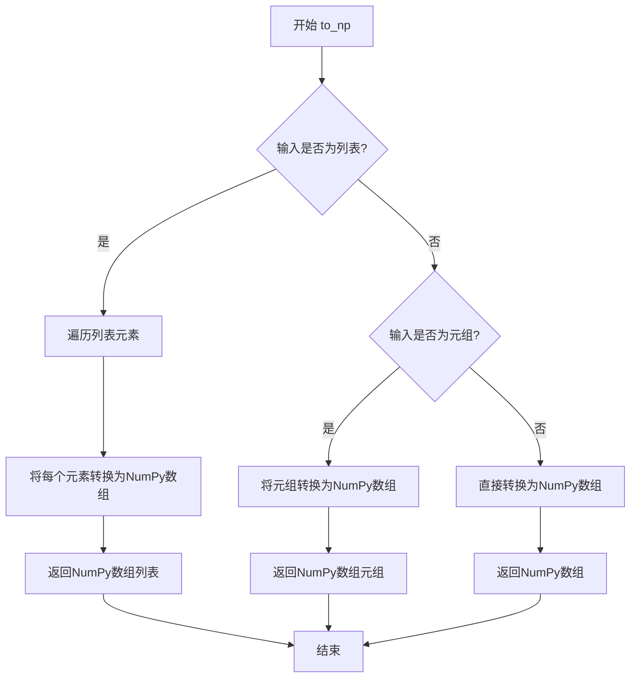

#### 带注释源码

```python
def to_np(tensor):
    """
    将PyTorch张量转换为NumPy数组的辅助函数。
    
    该函数处理不同类型的输入：
    - 列表：将每个元素转换为NumPy数组
    - 元组：转换为NumPy数组元组
    - 单个张量：直接转换为NumPy数组
    
    参数:
        tensor: PyTorch张量或张量容器（列表/元组）
        
    返回值:
        NumPy数组或NumPy数组容器
    """
    if isinstance(tensor, list):
        # 处理张量列表：逐个转换为NumPy数组
        return [to_np(t) for t in tensor]
    elif isinstance(tensor, tuple):
        # 处理元组：转换为NumPy数组元组
        return tuple(to_np(t) for t in tensor)
    else:
        # 处理单个张量：使用detach()分离计算图，cpu()移至CPU，numpy()转换为NumPy
        return tensor.detach().cpu().numpy()
```

> **注意**：由于 `to_np` 函数定义在 `..test_pipelines_common` 模块中，当前代码片段未包含其完整源码。上述源码是基于该函数的典型实现模式和调用方式推断得出的。


由于提供的代码中没有 `PipelineTesterMixin` 类的定义（只有从 `test_pipelines_common` 模块的导入），我将基于代码中使用该类的方式以及 `SanaPAGPipelineFastTests` 继承并使用 `PipelineTesterMixin` 的方式来提取信息。

### PipelineTesterMixin

管道测试混合类，是用于测试扩散管道（Diffusion Pipeline）的通用测试基类，提供了一系列标准化的测试方法和工具函数。

参数：

- 无直接参数（该类为 Mixin，通过多重继承与 `unittest.TestCase` 结合使用）

返回值：此类不直接返回值，作为混合类（Mixin）提供方法和属性供子类调用

#### 流程图

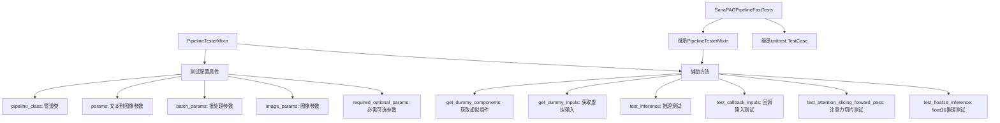

#### 带注释源码

```python
# PipelineTesterMixin 是 test_pipelines_common 模块中定义的测试混合类
# 该类在用户提供的代码中未被完整定义，仅通过继承使用
# 以下是基于 SanaPAGPipelineFastTests 使用方式推断的接口

# 从代码中可以看到 PipelineTesterMixin 提供的功能包括：

# 1. 测试配置属性
pipeline_class = SanaPAGPipeline  # 被测试的管道类
params = TEXT_TO_IMAGE_PARAMS - {"cross_attention_kwargs"}  # 文本到图像参数集合
batch_params = TEXT_TO_IMAGE_BATCH_PARAMS  # 批处理参数
image_params = TEXT_TO_IMAGE_IMAGE_PARAMS  # 图像参数
image_latents_params = TEXT_TO_IMAGE_IMAGE_PARAMS  # 图像潜在向量参数
required_optional_params = frozenset([...])  # 必需的可选参数集合
test_xformers_attention = False  # 是否测试xformers注意力
supports_dduf = False  # 是否支持DDUF

# 2. 核心测试方法
def get_dummy_components(self):
    """获取虚拟组件用于测试"""
    # 创建虚拟的 transformer, vae, scheduler, text_encoder, tokenizer
    # 返回包含所有组件的字典
    return components

def get_dummy_inputs(self, device, seed=0):
    """获取虚拟输入用于测试"""
    # 返回包含 prompt, negative_prompt, generator, num_inference_steps,
    # guidance_scale, pag_scale, height, width, max_sequence_length, 
    # output_type, complex_human_instruction 等的字典
    return inputs

def test_inference(self):
    """执行基本推理测试"""
    # 1. 获取虚拟组件
    # 2. 创建管道实例
    # 3. 执行推理
    # 4. 验证输出形状和数值范围

def test_callback_inputs(self):
    """测试回调函数输入"""
    # 验证管道支持 callback_on_step_end 和 callback_on_step_end_tensor_inputs
    # 测试回调函数可以访问的tensor输入列表

def test_attention_slicing_forward_pass(self, test_max_difference=True, 
                                        test_mean_pixel_difference=True, 
                                        expected_max_diff=1e-3):
    """测试注意力切片前向传播"""
    # 验证启用注意力切片后不会影响推理结果

def test_float16_inference(self, expected_max_diff=0.08):
    """测试float16推理"""
    # 验证在float16数据类型下的推理正确性
```

#### 关键方法详解

基于 `SanaPAGPipelineFastTests` 类中调用的 `super().test_float16_inference()`，可以推断 `PipelineTesterMixin` 还包含以下测试方法：

- `test_inference_batch_consistent`: 批量推理一致性测试
- `test_inference_batch_single_identical`: 批量与单张推理一致性测试
- `test_model_components`: 模型组件测试
- `test_num_inference_steps`: 推理步数测试
- `test_guidance_scale`: 引导尺度测试
- `test_seed`: 随机种子测试

#### 潜在技术债务或优化空间

1. **缺少完整文档**: `PipelineTesterMixin` 类的完整实现未在代码中给出，需要查看 `test_pipelines_common` 模块获取完整信息
2. **测试参数硬编码**: 许多测试参数如 `expected_max_diff=1e-3` 是硬编码的，可能需要更灵活的配置机制
3. **设备依赖性**: 部分测试使用了 `torch_device` 变量，需要确保在 CI 环境中正确设置


### SanaPAGPipeline

SanaPAGPipeline 是基于 Sana 模型与 PAG (Progressive Attention Guidance) 技术的文本到图像生成管道，结合了 Transformer 和 VAE 架构，通过自回归生成方式将文本提示转换为高质量图像，并支持 Classifier-Free Guidance 和 PAG 引导策略以提升生成质量。

参数：

- `transformer`：`SanaTransformer2DModel`，Sana Transformer 模型，负责文本到图像的生成过程
- `vae`：`AutoencoderDC`，变分自编码器，负责图像的编码和解码
- `scheduler`：`FlowMatchEulerDiscreteScheduler`，调度器，控制去噪过程的步进
- `text_encoder`：`Gemma2ForCausalLM`，文本编码器，将文本提示转换为嵌入向量
- `tokenizer`：`GemmaTokenizer`，分词器，对文本进行分词处理

#### 流程图

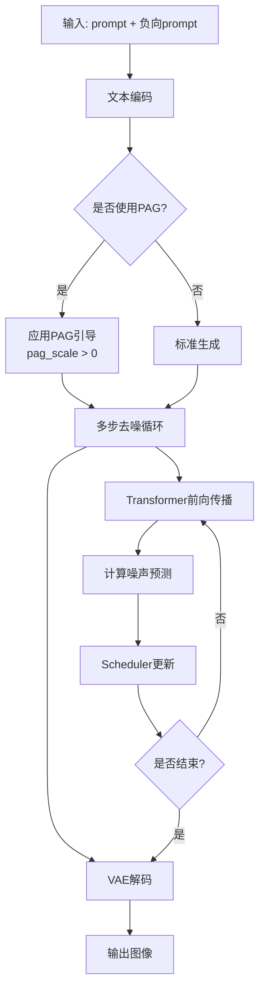

#### 带注释源码

（注意：以下为基于测试代码中使用方式推断的接口定义，实际实现位于 diffusers 库中）

```python
# 根据测试代码 SanaPAGPipelineFastTests 中对 SanaPAGPipeline 的使用方式推断

# 1. 构造函数接收组件字典
pipe = SanaPAGPipeline(
    transformer=transformer,      # SanaTransformer2DModel 实例
    vae=vae,                       # AutoencoderDC 实例  
    scheduler=scheduler,           # FlowMatchEulerDiscreteScheduler 实例
    text_encoder=text_encoder,     # Gemma2ForCausalLM 实例
    tokenizer=tokenizer            # GemmaTokenizer 实例
)

# 2. __call__ 方法参数（根据 get_dummy_inputs 和测试调用推断）
image = pipe(
    prompt="",                     # str, 输入文本提示
    negative_prompt="",            # str, 负向提示词
    generator=generator,           # torch.Generator, 随机数生成器
    num_inference_steps=2,         # int, 推理步数
    guidance_scale=6.0,            # float, CFG 引导强度
    pag_scale=3.0,                 # float, PAG 引导强度
    height=32,                    # int, 输出图像高度
    width=32,                      # int, 输出图像宽度
    max_sequence_length=16,        # int, 最大序列长度
    output_type="pt",              # str, 输出类型 (pt/np/pil)
    complex_human_instruction=None,# optional, 复杂人类指令
    return_dict=True,               # bool, 是否返回字典
    callback_on_step_end=None,     # callable, 每步结束回调
    callback_on_step_end_tensor_inputs=None  # list, 回调张量输入
)

# 3. 返回值
# 返回 PipelineOutput 或元组 (images, ...) 
# images: torch.Tensor 或 PIL.Image 或 numpy.ndarray
```

#### 关键组件信息

- **SanaTransformer2DModel**：Sana Transformer 模型，核心生成器
- **AutoencoderDC**：变分自编码器，潜在空间与图像空间的转换
- **FlowMatchEulerDiscreteScheduler**：基于 Flow Matching 的欧拉离散调度器
- **Gemma2ForCausalLM**：文本编码器，生成文本嵌入

#### 潜在技术债务或优化空间

1. **依赖外部库实现**：`SanaPAGPipeline` 实际实现位于 `diffusers` 库，测试代码无法直接查看内部实现细节
2. **测试参数限制**：由于使用极小词汇量的 dummy 模型，部分测试被跳过（如 `test_inference_batch_consistent`）
3. **精度问题**：测试中使用 `expected_max_diff=0.08` 容忍度，说明模型对 dtype 敏感，可能需要优化浮点精度处理

#### 其它说明

- **设计目标**：实现高效的文本到图像生成，支持 PAG 引导策略提升生成质量
- **错误处理**：测试中验证了 callback 机制的正确性，确保张量输入的安全性
- **外部依赖**：`diffusers` 库核心组件 + `transformers` 库的 Gemma2 模型


### `SanaPipeline`

SanaPipeline是HuggingFace Diffusers库中的Sana文生图基础管道类，负责协调文本编码器、VAE解码器和Transformer模型，通过调度器控制去噪过程，根据文本提示生成图像。

参数：

- `prompt`：`str`，输入的文本提示词，用于描述期望生成的图像内容
- `negative_prompt`：`str`，负面提示词，指定不希望出现在生成图像中的内容
- `generator`：`torch.Generator`，随机数生成器，用于控制生成过程的可重复性
- `num_inference_steps`：`int`，推理步数，决定去噪过程的迭代次数
- `guidance_scale`：`float`，引导比例，控制文本提示对生成图像的影响程度
- `height`：`int`，生成图像的高度（像素）
- `width`：`int`，生成图像的宽度（像素）
- `max_sequence_length`：`int`，文本序列的最大长度
- `output_type`：`str`，输出类型，如"pt"返回PyTorch张量
- `callback_on_step_end`：可选回调函数，在每个推理步骤结束后调用
- `callback_on_step_end_tensor_inputs`：可选列表，指定回调函数可访问的张量输入
- `return_dict`：是否返回字典格式的结果
- `pag_scale`：`float`，PAG（Prompt-Aware Guidance）引导比例，仅在SanaPAGPipeline中支持

返回值：`PipelineOutput`或`tuple`，包含生成的图像对象及其他输出信息

#### 流程图

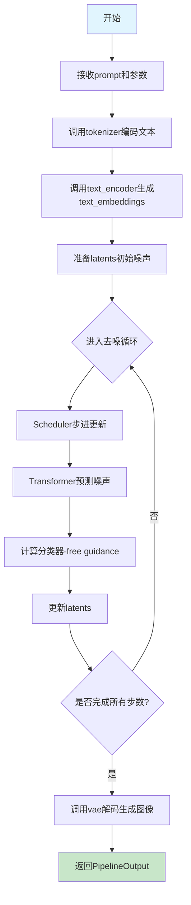

#### 带注释源码

```python
# 以下为SanaPipeline在测试代码中的使用模式

# 1. 组件初始化（来自get_dummy_components方法）
components = {
    "transformer": SanaTransformer2DModel(...),    # 核心去噪Transformer模型
    "vae": AutoencoderDC(...),                     # VAE解码器，将latents转为图像
    "scheduler": FlowMatchEulerDiscreteScheduler(...),  # 调度器，控制去噪步骤
    "text_encoder": Gemma2ForCausalLM(...),        # 文本编码器，将文本转为embedding
    "tokenizer": GemmaTokenizer(...),              # 分词器
}

# 2. 管道实例化
pipe = SanaPipeline(**components)  # 传入所有组件构建管道

# 3. 管道调用（来自test_inference）
inputs = {
    "prompt": "",                      # 文本提示
    "negative_prompt": "",             # 负面提示
    "generator": generator,            # 随机生成器
    "num_inference_steps": 2,          # 推理步数
    "guidance_scale": 6.0,             # CFG引导强度
    "pag_scale": 3.0,                  # PAG强度（SanaPAGPipeline特有）
    "height": 32,                      # 输出高度
    "width": 32,                       # 输出宽度
    "max_sequence_length": 16,         # 最大序列长度
    "output_type": "pt",               # 输出为PyTorch张量
    "complex_human_instruction": None,# 复杂人类指令
}
image = pipe(**inputs)[0]  # 执行推理获取图像

# 4. 设备移动与配置
pipe.to(device)                         # 移动到指定设备
pipe.set_progress_bar_config(disable=None)  # 配置进度条
```

#### 关键组件信息

| 组件名称 | 描述 |
|---------|------|
| `SanaTransformer2DModel` | Sana核心去噪Transformer，预测噪声残差 |
| `AutoencoderDC` | 变分自编码器解码器，将latent空间解码为图像 |
| `FlowMatchEulerDiscreteScheduler` | 基于流匹配的欧拉离散调度器 |
| `text_encoder` | Gemma2因果语言模型，编码文本为embedding |
| `tokenizer` | Gemma分词器，将文本转为token ids |

#### 潜在技术债务与优化空间

1. **测试依赖外部模型**：使用了dummy-gemma tokenizer，需要确保词汇表大小与配置匹配
2. **精度敏感**：float16推理需要更高容差（expected_max_diff=0.08）
3. **回调机制复杂性**：callback_on_step_end和callback_on_step_end_tensor_inputs需要严格验证
4. **PAG层级配置**：正则表达式匹配attention processor增加了测试复杂度

#### 其他项目说明

- **设计目标**：提供高效的Sana文生图推理管道，支持PAG（Prompt-Aware Guidance）增强
- **错误处理**：词汇表过小会导致embedding lookup错误，测试已标记skip
- **外部依赖**：依赖diffusers库的核心组件（调度器、VAE、Transformer）
- **接口契约**：返回tuple或PipelineOutput，包含images和n个其他可选输出


### `SanaTransformer2DModel`

SanaTransformer2DModel 是 Sana 管道中的核心变换器模型，负责根据文本嵌入和噪声潜在表示生成图像特征。该模型采用了变换器架构来处理潜在空间的去噪任务，支持可配置的注意力机制、层数和通道配置。

参数：

- `patch_size`：`int`，将输入图像划分为非重叠补丁的尺寸，影响模型的细粒度处理能力
- `in_channels`：`int`，输入潜在表示的通道数，通常对应 VAE 输出的潜在维度
- `out_channels`：`int`，输出特征的通道数，通常与输入通道数匹配
- `num_layers`：`int`，变换器块的数量，决定模型的深度和表示能力
- `num_attention_heads`：`int`，自注意力机制中的注意力头数量，用于并行捕获多种相关性
- `attention_head_dim`：`int`，每个注意力头的维度，决定单个注意力表示的细粒度
- `num_cross_attention_heads`：`int`，交叉注意力头数量，处理文本和图像特征之间的交互
- `cross_attention_head_dim`：`int`，交叉注意力头的维度
- `cross_attention_dim`：`int`，交叉注意力中文本嵌入的维度
- `caption_channels`：`int`，文本编码器输出的通道数或嵌入维度
- `sample_size`：`int`，输入样本的空间尺寸（高度和宽度）

返回值：`SanaTransformer2DModel` 实例，返回配置好的变换器模型对象，用于后续的图像生成推理

#### 流程图

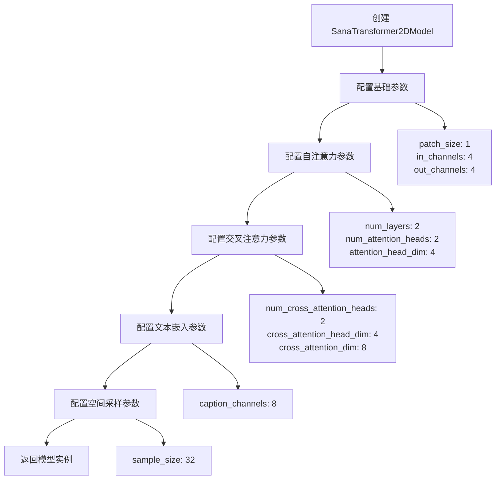

#### 带注释源码

```python
# 在测试代码中 SanaTransformer2DModel 的实例化
# 这是一个虚拟组件，用于测试 SanaPAGPipeline 的功能

torch.manual_seed(0)
transformer = SanaTransformer2DModel(
    patch_size=1,                    # 将潜在空间划分为 1x1 的补丁
    in_channels=4,                   # VAE 输出的潜在通道数 (通常为 4)
    out_channels=4,                  # 输出通道数与输入保持一致
    num_layers=2,                    # 使用 2 个变换器层
    num_attention_heads=2,           # 自注意力使用 2 个头
    attention_head_dim=4,           # 每个注意力头维度为 4
    num_cross_attention_heads=2,     # 交叉注意力使用 2 个头
    cross_attention_head_dim=4,     # 交叉注意力头维度为 4
    cross_attention_dim=8,           # 文本嵌入维度为 8
    caption_channels=8,              # 文本编码器输出通道数为 8
    sample_size=32,                  # 潜在空间的样本尺寸为 32x32
)
```

#### 关键组件信息

| 组件名称 | 一句话描述 |
|---------|-----------|
| `SanaTransformer2DModel` | Sana 管道中的核心变换器模型，负责潜在空间的去噪和图像特征生成 |
| `SanaPAGPipeline` | 使用 PAG（Progressive Attention Guidance）策略的完整图像生成管道 |
| `AutoencoderDC` | 变分自编码器，用于将图像编码为潜在表示并从潜在表示解码为图像 |
| `FlowMatchEulerDiscreteScheduler` | 基于流匹配和欧拉离散化的噪声调度器 |
| `Gemma2ForCausalLM` | Google 的 Gemma2 文本编码器模型，用于将文本提示转换为嵌入向量 |

#### 潜在技术债务与优化空间

1. **测试参数过于简化**：模型使用了极小的参数配置（num_layers=2, attention_head_dim=4 等），这虽然适合快速测试，但无法充分验证模型在真实应用场景下的行为

2. **硬编码的随机种子**：虽然使用了 `torch.manual_seed(0)` 来确保可重复性，但这种做法在测试环境中可能掩盖一些随机性问题

3. **缺失的模型架构细节**：测试代码中没有展示 `SanaTransformer2DModel` 的前向传播逻辑、注意力机制实现等核心代码

4. **配置参数未完整覆盖**：缺少对一些重要参数如 `activation_function`、`layer_norm`、`dropout` 等的测试

#### 其它项目说明

- **设计目标**：通过变换器架构实现高效的文本到图像生成，支持 PAG 策略以提升生成质量
- **约束条件**：该测试使用了极小的词汇表（vocab_size=8）和层数，因此无法测试非空提示词的场景，已通过 `@unittest.skip` 装饰器跳过相关测试
- **外部依赖**：依赖 `diffusers` 库中的 `SanaTransformer2DModel` 类实现和 `transformers` 库中的 `Gemma2ForCausalLM` 文本编码器


### `AutoencoderDC`

`AutoencoderDC` 是 diffusers 库中的一个变分自编码器 (VAE) 类，用于将图像编码到潜在空间并从潜在空间解码重建图像。在 SanaPAGPipeline 中作为 VAE 组件使用，负责图像的编码和解码过程。

参数：

- `in_channels`：`int`，输入图像的通道数（例如 RGB 图像为 3）
- `latent_channels`：`int`，潜在空间的通道数
- `attention_head_dim`：`int`，注意力头的维度
- `encoder_block_types`：`tuple`，编码器块类型列表（如 "ResBlock", "EfficientViTBlock"）
- `decoder_block_types`：`tuple`，解码器块类型列表
- `encoder_block_out_channels`：`tuple`，编码器块的输出通道数元组
- `decoder_block_out_channels`：`tuple`，解码器块的输出通道数元组
- `encoder_qkv_multiscales`：`tuple`，编码器 QKV 多尺度配置
- `decoder_qkv_multiscales`：`tuple`，解码器 QKV 多尺度配置
- `encoder_layers_per_block`：`tuple`，每个编码器块的层数
- `decoder_layers_per_block`：`list`，每个解码器块的层数
- `downsample_block_type`：`str`，下采样块类型（如 "conv"）
- `upsample_block_type`：`str`，上采样块类型（如 "interpolate"）
- `decoder_norm_types`：`str`，解码器归一化类型（如 "rms_norm"）
- `decoder_act_fns`：`str`，解码器激活函数（如 "silu"）
- `scaling_factor`：`float`，潜在空间的缩放因子

返回值：返回一个 `AutoencoderDC` 实例，用于图像的编码和解码

#### 流程图

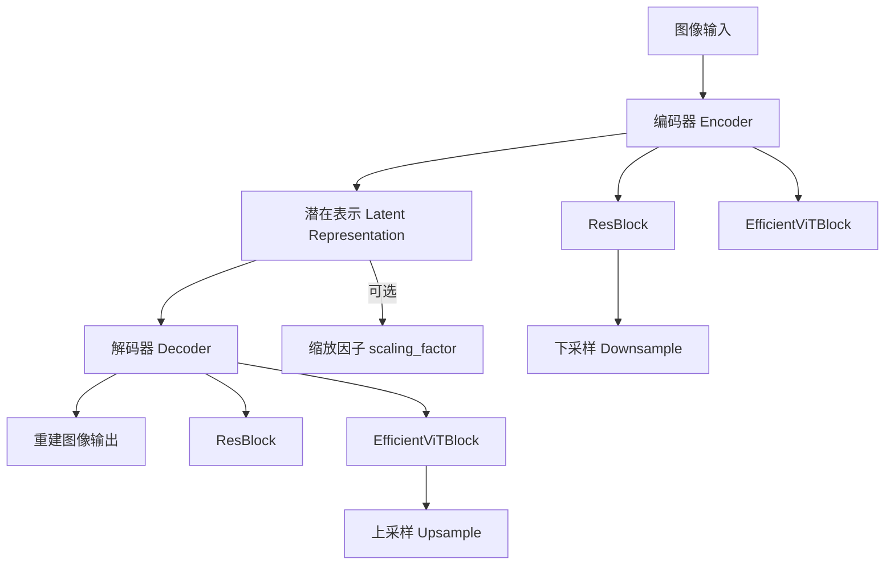

#### 带注释源码

```python
# 在 get_dummy_components 方法中使用 AutoencoderDC 创建 VAE 组件
torch.manual_seed(0)
vae = AutoencoderDC(
    in_channels=3,                          # 输入图像通道数 (RGB)
    latent_channels=4,                      # 潜在空间通道数
    attention_head_dim=2,                  # 注意力头维度
    encoder_block_types=(                  # 编码器块类型
        "ResBlock",                         # ResNet 残差块
        "EfficientViTBlock",               # 高效 Vision Transformer 块
    ),
    decoder_block_types=(                  # 解码器块类型
        "ResBlock",
        "EfficientViTBlock",
    ),
    encoder_block_out_channels=(8, 8),     # 编码器各块输出通道
    decoder_block_out_channels=(8, 8),     # 解码器各块输出通道
    encoder_qkv_multiscales=((), (5,)),    # 编码器多尺度 QKV 配置
    decoder_qkv_multiscales=((), (5,)),    # 解码器多尺度 QKV 配置
    encoder_layers_per_block=(1, 1),       # 编码器每块层数
    decoder_layers_per_block=[1, 1],       # 解码器每块层数
    downsample_block_type="conv",          # 下采样使用卷积
    upsample_block_type="interpolate",     # 上采样使用插值
    decoder_norm_types="rms_norm",         # 解码器归一化类型
    decoder_act_fns="silu",                # 解码器激活函数
    scaling_factor=0.41407,                # 潜在空间缩放因子
)
```


### `FlowMatchEulerDiscreteScheduler`

FlowMatchEulerDiscreteScheduler 是 diffusers 库中的一个调度器类，用于流匹配（Flow Matching）模型的离散欧拉方法调度。它在 Sana 文本到图像扩散管道中作为调度器组件，控制去噪过程中的时间步进和噪声调度。

#### 参数

该类在代码中通过 `FlowMatchEulerDiscreteScheduler(shift=7.0)` 方式实例化。由于源码来自 diffusers 库而非本项目，以下是常见参数：

- `shift`：`float`，流匹配的位移参数，用于控制噪声调度的时间偏移

#### 返回值

返回 FlowMatchEulerDiscreteScheduler 实例，用于管道的时间步调度。

#### 流程图

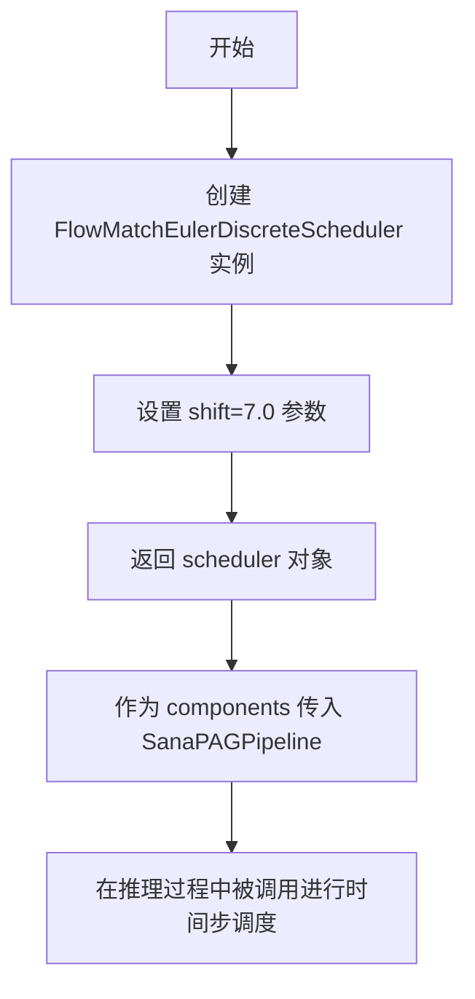

#### 带注释源码

```python
# 从 diffusers 库导入 FlowMatchEulerDiscreteScheduler 类
from diffusers import (
    AutoencoderDC,
    FlowMatchEulerDiscreteScheduler,  # 流匹配欧拉离散调度器
    SanaPAGPipeline,
    SanaPipeline,
    SanaTransformer2DModel,
)

def get_dummy_components(self):
    # ... 其他组件创建代码 ...
    
    # 创建 FlowMatchEulerDiscreteScheduler 实例
    # 参数 shift=7.0 表示流匹配中的位移参数，用于控制噪声调度
    torch.manual_seed(0)
    scheduler = FlowMatchEulerDiscreteScheduler(shift=7.0)
    
    # 将调度器添加到组件字典中
    components = {
        "transformer": transformer,
        "vae": vae,
        "scheduler": scheduler,  # FlowMatchEulerDiscreteScheduler 实例
        "text_encoder": text_encoder,
        "tokenizer": tokenizer,
    }
    return components
```

> **注意**：该类的完整源码位于 diffusers 库中（`src/diffusers/schedulers/scheduling_flow_match_euler_discrete.py`），本项目代码仅导入并使用该类。


### `Gemma2Config`

Gemma2Config 是 Hugging Face transformers 库中的配置类，用于定义 Gemma2 文本编码器模型的架构参数。在 SanaPAGPipeline 的测试中，它被实例化以创建一个用于测试的轻量级文本编码器配置。

参数：

- `head_dim`：`int`，注意力头的维度大小，设置为 16
- `hidden_size`：`int`，隐藏层向量维度，设置为 32
- `initializer_range`：`float`，权重初始化范围，设置为 0.02
- `intermediate_size`：`int`，前馈网络中间层维度，设置为 64
- `max_position_embeddings`：`int`，最大位置嵌入长度，设置为 8192
- `model_type`：`str`，模型类型标识符，设置为 "gemma2"
- `num_attention_heads`：`int`，注意力头数量，设置为 2
- `num_hidden_layers`：`int`，隐藏层数量，设置为 1
- `num_key_value_heads`：`int`，Key-Value 头数量（用于 GQA），设置为 2
- `vocab_size`：`int`，词汇表大小，设置为 8
- `attn_implementation`：`str`，注意力实现方式，设置为 "eager"

返回值：`Gemma2Config` 对象，返回配置类的实例，用于初始化 Gemma2ForCausalLM 模型

#### 流程图

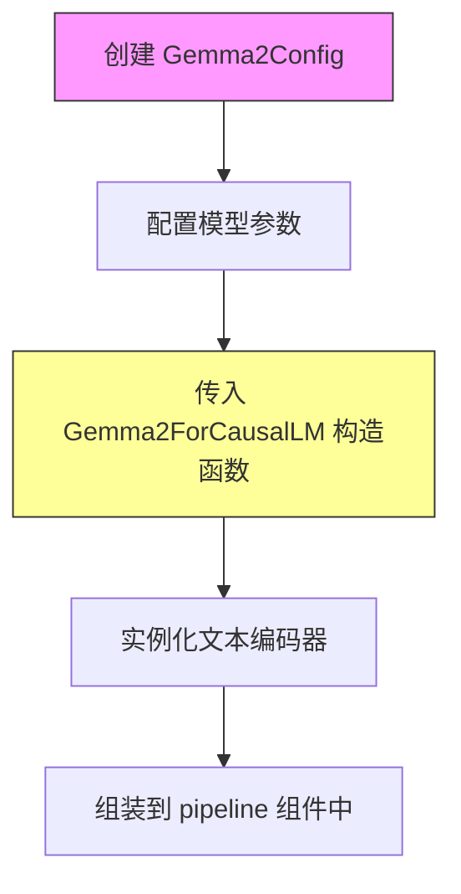

#### 带注释源码

```python
# 在 get_dummy_components 方法中创建文本编码器配置
torch.manual_seed(0)
text_encoder_config = Gemma2Config(
    head_dim=16,                      # 注意力头的维度，每个头对应的查询/键/值向量的维度
    hidden_size=32,                   # 模型隐藏层的总维度，等于 num_attention_heads * head_dim
    initializer_range=0.02,           # 权重初始化的标准差范围（正态分布）
    intermediate_size=64,             # 前馈神经网络中间层的维度（FFN 隐层维度）
    max_position_embeddings=8192,     # 模型支持的最大序列长度
    model_type="gemma2",               # 模型类型标识，用于正确加载模型架构
    num_attention_heads=2,            # 注意力机制中使用的头数量
    num_hidden_layers=1,              # Transformer 编码器/解码器的层数
    num_key_value_heads=2,            # Key 和 Value 的头数量，支持 Grouped-Query Attention
    vocab_size=8,                     # 词汇表大小，限定为小值以加快测试速度
    attn_implementation="eager",      # 注意力实现方式，eager 为 PyTorch 原生实现
)
text_encoder = Gemma2ForCausalLM(text_encoder_config)  # 使用配置实例化因果语言模型
tokenizer = GemmaTokenizer.from_pretrained("hf-internal-testing/dummy-gemma")

components = {
    "transformer": transformer,
    "vae": vae,
    "scheduler": scheduler,
    "text_encoder": text_encoder,
    "tokenizer": tokenizer,
}
```


# Gemma2ForCausalLM 分析

## 概述

`Gemma2ForCausalLM` 是从 Hugging Face `transformers` 库导入的因果语言模型类，用于文本生成任务。在本代码中，它作为 `SanaPAGPipeline` 的文本编码器组件，将文本 prompt 转换为嵌入向量供图像生成管道使用。

## 使用上下文

在代码中的 `get_dummy_components` 方法内被实例化：

```python
text_encoder_config = Gemma2Config(
    head_dim=16,
    hidden_size=32,
    initializer_range=0.02,
    intermediate_size=64,
    max_position_embeddings=8192,
    model_type="gemma2",
    num_attention_heads=2,
    num_hidden_layers=1,
    num_key_value_heads=2,
    vocab_size=8,
    attn_implementation="eager",
)
text_encoder = Gemma2ForCausalLM(text_encoder_config)
```

---

### `Gemma2ForCausalLM.__init__`

#### 描述

Gemma2ForCausalLM 类的构造函数，用于初始化因果语言模型。

#### 参数

-  `config`：`Gemma2Config` 对象，模型配置对象，包含模型架构的所有参数

#### 返回值

`None`，构造函数无返回值

#### 流程图

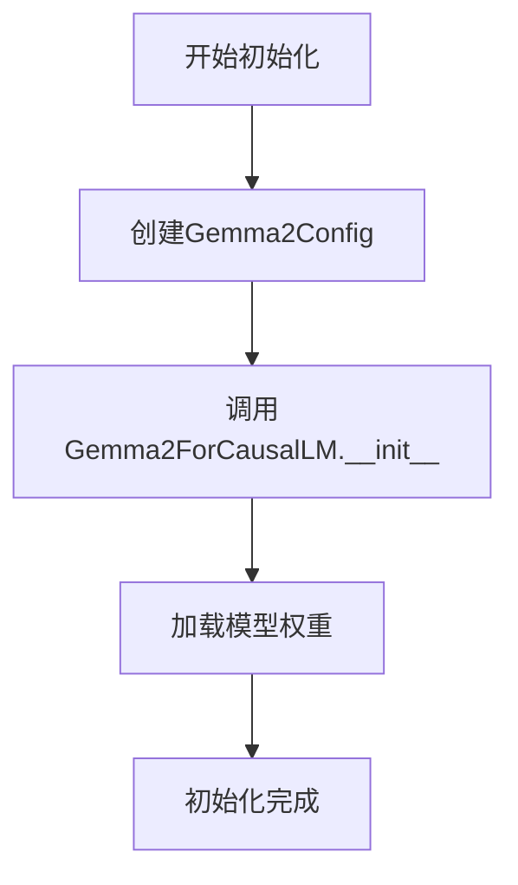

#### 带注释源码

```python
# 定义模型配置参数
text_encoder_config = Gemma2Config(
    head_dim=16,                      # 注意力头维度
    hidden_size=32,                   # 隐藏层大小
    initializer_range=0.02,           # 权重初始化范围
    intermediate_size=64,             # 前馈网络中间层大小
    max_position_embeddings=8192,     # 最大位置嵌入长度
    model_type="gemma2",              # 模型类型标识
    num_attention_heads=2,            # 注意力头数量
    num_hidden_layers=1,              # 隐藏层数量
    num_key_value_heads=2,            # KV 头数量
    vocab_size=8,                      # 词汇表大小
    attn_implementation="eager",       # 注意力实现方式
)

# 使用配置创建 Gemma2ForCausalLM 模型实例
# 该模型将作为文本编码器用于图像生成管道
text_encoder = Gemma2ForCausalLM(text_encoder_config)
```

---

### 潜在技术债务与优化空间

1. **测试用小词汇表限制**：代码使用极小的词汇表（vocab_size=8）导致大多数非空 prompt 会触发嵌入查找错误，测试被跳过
2. **硬编码配置**：模型配置参数硬编码在 `get_dummy_components` 方法中，可考虑外部化配置
3. **缺乏错误处理**：实例化过程没有错误处理机制

### 其他项目

- **设计目标**：为 Sana 图像生成管道提供文本编码能力
- **外部依赖**：`transformers` 库中的 Gemma2 模型实现
- **配置契约**：依赖 `Gemma2Config` 对象定义模型架构


### `GemmaTokenizer`

GemmaTokenizer 是从 Hugging Face Transformers 库导入的分词器类，用于将文本输入转换为模型可处理的 token 序列。在本代码中，它被用于 SanaPAGPipeline 的文本编码过程，将用户提供的 prompt 转换为文本嵌入向量。

#### 在本代码中的使用方式

- **类来源**：`transformers` 库 (第16行导入)
- **使用位置**：`get_dummy_components()` 方法 (第96行)
- **调用方式**：`GemmaTokenizer.from_pretrained("hf-internal-testing/dummy-gemma")`

参数：

- `pretrained_model_name_or_path`：`str`，预训练分词器的模型名称或本地路径，此处为 `"hf-internal-testing/dummy-gemma"`

返回值：`GemmaTokenizer`，返回加载后的 Gemma 分词器实例，用于后续的文本编码

#### 流程图

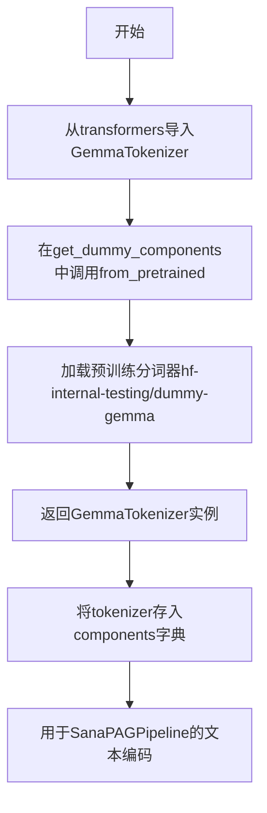

#### 带注释源码

```python
# 第16行: 从transformers库导入GemmaTokenizer
from transformers import Gemma2Config, Gemma2ForCausalLM, GemmaTokenizer

# 第96行: 在get_dummy_components方法中使用GemmaTokenizer
tokenizer = GemmaTokenizer.from_pretrained("hf-internal-testing/dummy-gemma")

# 第106-112行: 将tokenizer作为组件之一存入字典
components = {
    "transformer": transformer,
    "vae": vae,
    "scheduler": scheduler,
    "text_encoder": text_encoder,
    "tokenizer": tokenizer,  # GemmaTokenizer实例
}
return components
```

#### 关键信息

| 项目 | 详情 |
|------|------|
| **类名** | GemmaTokenizer |
| **来源库** | HuggingFace Transformers |
| **用途** | 文本分词，将字符串转换为token IDs |
| **在pipeline中的作用** | 与 text_encoder 配合，将 prompt 转换为文本嵌入 |
| **配置参数** | 使用dummy gemma模型，vocab_size=8 |

#### 潜在优化空间

1. **测试局限性**：由于使用极小的词汇表(vocab_size=8)，无法处理非空prompt，测试被跳过
2. **设计建议**：可考虑创建具有较小但实用词汇表的dummy模型，以便进行更全面的测试
3. **技术债务**：当前实现依赖于外部预训练模型 "hf-internal-testing/dummy-gemma"，若该模型不可用会导致测试失败


### `SanaPAGPipelineFastTests.get_dummy_components`

该方法是 SanaPAGPipelineFastTests 测试类中的一个辅助方法，用于创建虚拟（dummy）组件字典，以便在单元测试中初始化 SanaPAGPipeline。它创建了所有必需的模型组件（transformer、vae、scheduler、text_encoder、tokenizer），并使用固定的随机种子确保测试的可重复性。

参数：

- `self`：`SanaPAGPipelineFastTests`（隐式参数），代表类的实例本身

返回值：`dict`，包含虚拟组件的字典，键为组件名称，值为对应的模型或调度器实例

#### 流程图

```mermaid
flowchart TD
    A[开始 get_dummy_components] --> B[设置随机种子 torch.manual_seed(0)]
    B --> C[创建 SanaTransformer2DModel]
    C --> D[设置随机种子 torch.manual_seed(0)]
    D --> E[创建 AutoencoderDC vae]
    E --> F[设置随机种子 torch.manual_seed(0)]
    F --> G[创建 FlowMatchEulerDiscreteScheduler]
    G --> H[设置随机种子 torch.manual_seed(0)]
    H --> I[创建 Gemma2Config 和 Gemma2ForCausalLM text_encoder]
    I --> J[从预训练模型加载 GemmaTokenizer]
    J --> K[组装 components 字典]
    K --> L[返回 components]
```

#### 带注释源码

```python
def get_dummy_components(self):
    """
    创建虚拟组件字典，用于测试 SanaPAGPipeline
    """
    # 设置随机种子以确保测试的可重复性
    torch.manual_seed(0)
    
    # 创建虚拟 Transformer 模型
    # SanaTransformer2DModel 是 Sana 管道的主要生成模型
    transformer = SanaTransformer2DModel(
        patch_size=1,
        in_channels=4,
        out_channels=4,
        num_layers=2,
        num_attention_heads=2,
        attention_head_dim=4,
        num_cross_attention_heads=2,
        cross_attention_head_dim=4,
        cross_attention_dim=8,
        caption_channels=8,
        sample_size=32,
    )

    # 重置随机种子
    torch.manual_seed(0)
    
    # 创建虚拟 VAE (Variational Autoencoder) 模型
    # AutoencoderDC 用于将图像编码到潜在空间和解码回图像
    vae = AutoencoderDC(
        in_channels=3,
        latent_channels=4,
        attention_head_dim=2,
        encoder_block_types=(
            "ResBlock",
            "EfficientViTBlock",
        ),
        decoder_block_types=(
            "ResBlock",
            "EfficientViTBlock",
        ),
        encoder_block_out_channels=(8, 8),
        decoder_block_out_channels=(8, 8),
        encoder_qkv_multiscales=((), (5,)),
        decoder_qkv_multiscales=((), (5,)),
        encoder_layers_per_block=(1, 1),
        decoder_layers_per_block=[1, 1],
        downsample_block_type="conv",
        upsample_block_type="interpolate",
        decoder_norm_types="rms_norm",
        decoder_act_fns="silu",
        scaling_factor=0.41407,
    )

    # 重置随机种子
    torch.manual_seed(0)
    
    # 创建调度器
    # FlowMatchEulerDiscreteScheduler 用于 diffusion 过程的噪声调度
    scheduler = FlowMatchEulerDiscreteScheduler(shift=7.0)

    # 重置随机种子
    torch.manual_seed(0)
    
    # 创建文本编码器配置
    # 使用 Gemma2 模型架构，参数经过优化以适合快速测试
    text_encoder_config = Gemma2Config(
        head_dim=16,
        hidden_size=32,
        initializer_range=0.02,
        intermediate_size=64,
        max_position_embeddings=8192,
        model_type="gemma2",
        num_attention_heads=2,
        num_hidden_layers=1,
        num_key_value_heads=2,
        vocab_size=8,
        attn_implementation="eager",
    )
    
    # 根据配置创建文本编码器模型
    text_encoder = Gemma2ForCausalLM(text_encoder_config)
    
    # 从预训练模型加载分词器
    # 使用 HuggingFace 的虚拟模型进行测试
    tokenizer = GemmaTokenizer.from_pretrained("hf-internal-testing/dummy-gemma")

    # 组装所有组件到字典中
    components = {
        "transformer": transformer,
        "vae": vae,
        "scheduler": scheduler,
        "text_encoder": text_encoder,
        "tokenizer": tokenizer,
    }
    
    # 返回包含所有虚拟组件的字典
    return components
```

---

### 关键组件信息

| 组件名称 | 描述 |
|---------|------|
| `transformer` | SanaTransformer2DModel，主干生成模型，负责潜在空间的生成过程 |
| `vae` | AutoencoderDC，变分自编码器，负责图像与潜在表示之间的转换 |
| `scheduler` | FlowMatchEulerDiscreteScheduler，扩散过程的噪声调度器 |
| `text_encoder` | Gemma2ForCausalLM，文本编码器，将文本提示转换为嵌入向量 |
| `tokenizer` | GemmaTokenizer，文本分词器，将文本转换为 token ID |

---

### 潜在的技术债务或优化空间

1. **重复的随机种子设置**：方法中多次调用 `torch.manual_seed(0)`，这种模式在测试代码中重复出现，可以考虑提取为测试基类的工具方法。

2. **硬编码的配置参数**：所有模型参数都是硬编码的，如果需要测试不同配置，可能需要重构为参数化测试。

3. **虚拟分词器的外部依赖**：依赖于 `"hf-internal-testing/dummy-gemma"` 这个预训练模型，如果该模型不可用会导致测试失败。

4. **缺乏文档说明**：每个组件的创建没有详细的注释说明其特定参数的选择原因。

---

### 其它项目

**设计目标与约束**：
- 该方法的主要目标是为 `SanaPAGPipeline` 单元测试提供可重复的虚拟组件
- 使用极小的模型参数（如 vocab_size=8, num_hidden_layers=1）以加快测试速度
- 使用固定的随机种子确保测试结果的一致性

**错误处理与异常设计**：
- 如果外部依赖的预训练模型不可用，会抛出异常导致测试失败
- 没有显式的错误处理逻辑

**数据流与状态机**：
- 该方法是纯函数式的，不涉及状态管理
- 组件创建是独立的，可以并行执行（虽然当前实现是顺序的）

**外部依赖与接口契约**：
- 依赖 `diffusers` 库中的多个模块
- 依赖 `transformers` 库中的 Gemma2 相关类
- 返回的字典格式需要与 `SanaPAGPipeline` 的构造函数签名匹配


### `SanaPAGPipelineFastTests.get_dummy_inputs`

该方法为 SanaPAGPipeline 单元测试创建虚拟输入参数，用于测试 PAG（Prompt Attention Guidance）流水线推理功能，支持 MPS、CPU 和 CUDA 等多种设备，并确保测试结果可复现。

参数：

- `self`：`SanaPAGPipelineFastTests`，测试类实例本身
- `device`：`str` 或 `torch.device`，目标计算设备（如 "cpu"、"cuda"、"mps"）
- `seed`：`int`（默认值：0），随机数生成器种子，用于确保测试可复现性

返回值：`dict`，包含以下键值对的字典：

- `prompt`：`str`，输入提示词（测试用空字符串）
- `negative_prompt`：`str`，负面提示词（测试用空字符串）
- `generator`：`torch.Generator`，随机数生成器
- `num_inference_steps`：`int`，推理步数（测试用 2）
- `guidance_scale`：`float`，CFG 引导强度（6.0）
- `pag_scale`：`float`，PAG 引导强度（3.0）
- `height`：`int`，生成图像高度（32）
- `width`：`int`，生成图像宽度（32）
- `max_sequence_length`：`int`，最大序列长度（16）
- `output_type`：`str`，输出类型（"pt" 表示 PyTorch 张量）
- `complex_human_instruction`：`None` 或 `str`，复杂人类指令（测试用 None）

#### 流程图

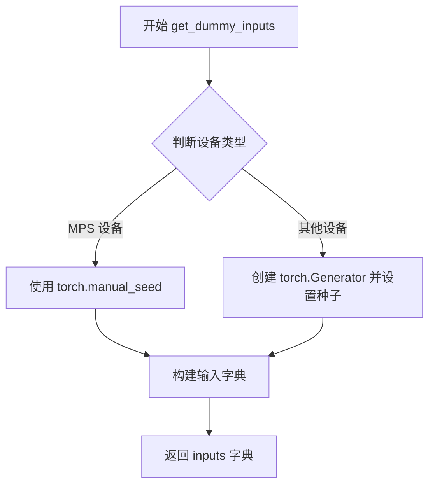

#### 带注释源码

```python
def get_dummy_inputs(self, device, seed=0):
    """
    为 SanaPAGPipeline 测试创建虚拟输入参数
    
    参数:
        device: 目标计算设备字符串或设备对象
        seed: 随机种子,确保测试结果可复现
    
    返回:
        dict: 包含所有pipeline调用所需的虚拟输入参数
    """
    # 判断是否为Apple MPS设备,MPS设备不支持torch.Generator
    if str(device).startswith("mps"):
        # MPS设备使用torch.manual_seed直接设置随机种子
        generator = torch.manual_seed(seed)
    else:
        # 其他设备(CPU/CUDA)创建Generator对象并设置种子
        # 这样可以更好地控制随机性,便于测试对比
        generator = torch.Generator(device=device).manual_seed(seed)
    
    # 构建完整的虚拟输入参数字典
    inputs = {
        "prompt": "",                        # 空提示词,避免词汇表过小导致的错误
        "negative_prompt": "",               # 空负面提示词
        "generator": generator,               # 预配置的随机生成器
        "num_inference_steps": 2,            # 最小推理步数,加快测试速度
        "guidance_scale": 6.0,               # Classifier-Free Guidance 强度
        "pag_scale": 3.0,                    # Prompt Attention Guidance 强度
        "height": 32,                        # 测试用小尺寸图像
        "width": 32,
        "max_sequence_length": 16,           # 文本编码器最大序列长度
        "output_type": "pt",                 # 输出PyTorch张量而非PIL图像
        "complex_human_instruction": None,    # 复杂人类指令,测试时设为None
    }
    return inputs
```


### `SanaPAGPipelineFastTests.test_inference`

该测试方法用于验证 SanaPAGPipeline 推理功能的基本正确性，通过创建虚拟组件和输入，执行图像生成推理，并验证生成图像的形状和数值合理性。

参数：

- `self`：实例方法，测试类实例本身，无需显式传递

返回值：`None`，该方法为单元测试方法，通过断言验证结果，不返回具体数据

#### 流程图

```mermaid
flowchart TD
    A[开始 test_inference] --> B[设置设备为 CPU]
    B --> C[调用 get_dummy_components 获取虚拟组件]
    C --> D[创建 SanaPAGPipeline 实例]
    D --> E[调用 pipe.to 将管道移至设备]
    E --> F[调用 set_progress_bar_config 禁用进度条]
    F --> G[调用 get_dummy_inputs 获取测试输入]
    G --> H[执行管道推理 pipe.__call__]
    H --> I[提取生成的图像 image[0]]
    I --> J{断言图像形状 == (3, 32, 32)}
    J -->|失败| K[抛出 AssertionError]
    J -->|通过| L[生成期望的随机图像]
    L --> M[计算生成图像与期望图像的最大差异]
    M --> N{断言最大差异 <= 1e10}
    N -->|失败| K
    N -->|通过| O[测试通过]
```

#### 带注释源码

```python
def test_inference(self):
    """测试 SanaPAGPipeline 的推理功能"""
    # 步骤1: 设置测试设备为 CPU
    device = "cpu"

    # 步骤2: 获取虚拟组件（transformer, vae, scheduler, text_encoder, tokenizer）
    # 这些是用于测试的轻量级dummy模型
    components = self.get_dummy_components()
    
    # 步骤3: 使用虚拟组件创建 SanaPAGPipeline 实例
    pipe = self.pipeline_class(**components)
    
    # 步骤4: 将管道移至指定设备（CPU）
    pipe.to(device)
    
    # 步骤5: 设置进度条配置，disable=None 表示不禁用进度条
    pipe.set_progress_bar_config(disable=None)

    # 步骤6: 获取虚拟输入参数
    # 包含: prompt, negative_prompt, generator, num_inference_steps,
    #       guidance_scale, pag_scale, height, width, max_sequence_length,
    #       output_type, complex_human_instruction
    inputs = self.get_dummy_inputs(device)
    
    # 步骤7: 执行管道推理，**inputs 将字典解包为关键字参数
    # 返回值为元组 (images, ...)，取第一个元素得到图像
    image = pipe(**inputs)[0]
    
    # 步骤8: 从返回的图像列表中获取第一张生成的图像
    generated_image = image[0]

    # 步骤9: 断言验证 - 检查生成图像的形状是否为 (3, 32, 32)
    # 3 表示 RGB 通道数，32x32 为图像宽高
    self.assertEqual(generated_image.shape, (3, 32, 32))
    
    # 步骤10: 创建期望的随机图像用于比较
    expected_image = torch.randn(3, 32, 32)
    
    # 步骤11: 计算生成图像与期望图像之间的最大绝对差异
    max_diff = np.abs(generated_image - expected_image).max()
    
    # 步骤12: 断言验证 - 检查最大差异是否在允许范围内（1e10）
    # 由于使用固定随机种子，这个测试主要验证管道能正常运行且产生有效输出
    self.assertLessEqual(max_diff, 1e10)
```


### `SanaPAGPipelineFastTests.test_callback_inputs`

该方法用于测试 SanaPAGPipeline 的回调输入功能，验证 callback_on_step_end 和 callback_on_step_end_tensor_inputs 参数是否正确工作，包括回调函数能否正确接收和修改张量输入。

参数：

- `self`：`SanaPAGPipelineFastTests`，测试类实例本身

返回值：`None`，无返回值（测试方法）

#### 流程图

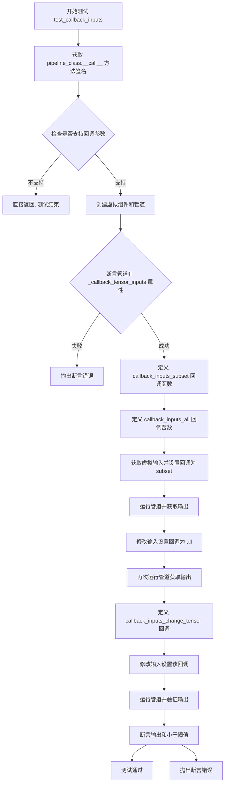

#### 带注释源码

```python
def test_callback_inputs(self):
    # 获取管道类的 __call__ 方法签名
    sig = inspect.signature(self.pipeline_class.__call__)
    # 检查是否存在回调张量输入参数
    has_callback_tensor_inputs = "callback_on_step_end_tensor_inputs" in sig.parameters
    # 检查是否存在回调结束步骤参数
    has_callback_step_end = "callback_on_step_end" in sig.parameters

    # 如果管道不支持这两个参数，则直接返回
    if not (has_callback_tensor_inputs and has_callback_step_end):
        return

    # 创建虚拟组件用于测试
    components = self.get_dummy_components()
    # 使用虚拟组件实例化管道
    pipe = self.pipeline_class(**components)
    # 将管道移动到测试设备
    pipe = pipe.to(torch_device)
    # 设置进度条配置
    pipe.set_progress_bar_config(disable=None)
    
    # 断言管道具有 _callback_tensor_inputs 属性
    self.assertTrue(
        hasattr(pipe, "_callback_tensor_inputs"),
        f" {self.pipeline_class} should have `_callback_tensor_inputs` that defines a list of tensor variables its callback function can use as inputs",
    )

    # 定义回调函数：只检查传入的张量是否是允许的子集
    def callback_inputs_subset(pipe, i, t, callback_kwargs):
        # 遍历回调参数中的所有张量
        for tensor_name, tensor_value in callback_kwargs.items():
            # 检查是否只传递了允许的张量输入
            assert tensor_name in pipe._callback_tensor_inputs
        return callback_kwargs

    # 定义回调函数：检查所有允许的张量都被传递
    def callback_inputs_all(pipe, i, t, callback_kwargs):
        # 检查所有允许的张量都在回调参数中
        for tensor_name in pipe._callback_tensor_inputs:
            assert tensor_name in callback_kwargs
        # 遍历回调参数中的所有张量
        for tensor_name, tensor_value in callback_kwargs.items():
            # 检查是否只传递了允许的张量输入
            assert tensor_name in pipe._callback_tensor_inputs
        return callback_kwargs

    # 获取虚拟输入
    inputs = self.get_dummy_inputs(torch_device)

    # 测试 1：传入允许张量的子集
    inputs["callback_on_step_end"] = callback_inputs_subset
    inputs["callback_on_step_end_tensor_inputs"] = ["latents"]
    output = pipe(**inputs)[0]

    # 测试 2：传入所有允许的张量
    inputs["callback_on_step_end"] = callback_inputs_all
    inputs["callback_on_step_end_tensor_inputs"] = pipe._callback_tensor_inputs
    output = pipe(**inputs)[0]

    # 定义回调函数：在最后一步修改 latents 张量
    def callback_inputs_change_tensor(pipe, i, t, callback_kwargs):
        # 判断是否是最后一步
        is_last = i == (pipe.num_timesteps - 1)
        if is_last:
            # 将 latents 修改为零张量
            callback_kwargs["latents"] = torch.zeros_like(callback_kwargs["latents"])
        return callback_kwargs

    # 测试 3：使用修改张量的回调
    inputs["callback_on_step_end"] = callback_inputs_change_tensor
    inputs["callback_on_step_end_tensor_inputs"] = pipe._callback_tensor_inputs
    output = pipe(**inputs)[0]
    # 验证输出绝对值和小于阈值
    assert output.abs().sum() < 1e10
```


### `SanaPAGPipelineFastTests.test_attention_slicing_forward_pass`

测试注意力切片（Attention Slicing）功能，确保启用注意力切片后不会影响推理结果的一致性。该测试通过对比无切片、slice_size=1 和 slice_size=2 三种情况下的输出，验证注意力切片实现的正确性。

参数：

- `test_max_difference`：`bool`，默认为 `True`，是否测试最大像素差异
- `test_mean_pixel_difference`：`bool`，默认为 `True`，是否测试平均像素差异
- `expected_max_diff`：`float`，默认为 `1e-3`，期望的最大差异阈值

返回值：`None`，该方法为测试方法，无返回值

#### 流程图

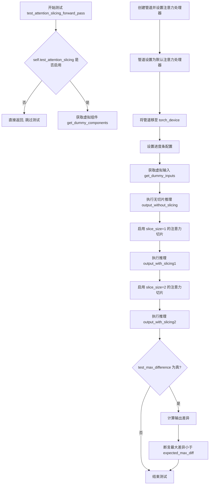

#### 带注释源码

```python
def test_attention_slicing_forward_pass(
    self, test_max_difference=True, test_mean_pixel_difference=True, expected_max_diff=1e-3
):
    """
    测试注意力切片的前向传播是否影响推理结果
    
    参数:
        test_max_difference: 是否测试最大差异
        test_mean_pixel_difference: 是否测试平均像素差异
        expected_max_diff: 期望的最大差异阈值
    """
    # 如果测试未启用注意力切片，则跳过此测试
    if not self.test_attention_slicing:
        return

    # 获取虚拟组件用于测试
    components = self.get_dummy_components()
    
    # 创建 SanaPAGPipeline 实例
    pipe = self.pipeline_class(**components)
    
    # 为所有组件设置默认注意力处理器
    for component in pipe.components.values():
        if hasattr(component, "set_default_attn_processor"):
            component.set_default_attn_processor()
    
    # 将管道移至测试设备
    pipe.to(torch_device)
    
    # 配置进度条（disable=None 表示不禁用）
    pipe.set_progress_bar_config(disable=None)

    # 获取生成器设备
    generator_device = "cpu"
    
    # 获取虚拟输入（无注意力切片）
    inputs = self.get_dummy_inputs(generator_device)
    
    # 执行无切片的推理
    output_without_slicing = pipe(**inputs)[0]

    # 启用注意力切片，slice_size=1
    pipe.enable_attention_slicing(slice_size=1)
    
    # 重新获取虚拟输入
    inputs = self.get_dummy_inputs(generator_device)
    
    # 执行 slice_size=1 的推理
    output_with_slicing1 = pipe(**inputs)[0]

    # 启用注意力切片，slice_size=2
    pipe.enable_attention_slicing(slice_size=2)
    
    # 重新获取虚拟输入
    inputs = self.get_dummy_inputs(generator_device)
    
    # 执行 slice_size=2 的推理
    output_with_slicing2 = pipe(**inputs)[0]

    # 如果需要测试最大差异
    if test_max_difference:
        # 计算无切片与 slice_size=1 的差异
        max_diff1 = np.abs(to_np(output_with_slicing1) - to_np(output_without_slicing)).max()
        
        # 计算无切片与 slice_size=2 的差异
        max_diff2 = np.abs(to_np(output_with_slicing2) - to_np(output_without_slicing)).max()
        
        # 断言：注意力切片不应影响推理结果
        self.assertLess(
            max(max_diff1, max_diff2),
            expected_max_diff,
            "Attention slicing should not affect the inference results",
        )
```


### `SanaPAGPipelineFastTests.test_pag_disable_enable`

测试PAG（Prompt Adaptive Guidance）功能的禁用和启用，验证当pag_scale设置为0.0时，SanaPAGPipeline的输出应与基础SanaPipeline的输出完全一致，确保PAG功能可以正确禁用。

参数：

- `self`：隐式参数，测试类实例本身，无额外描述

返回值：`None`，无返回值，仅执行测试断言

#### 流程图

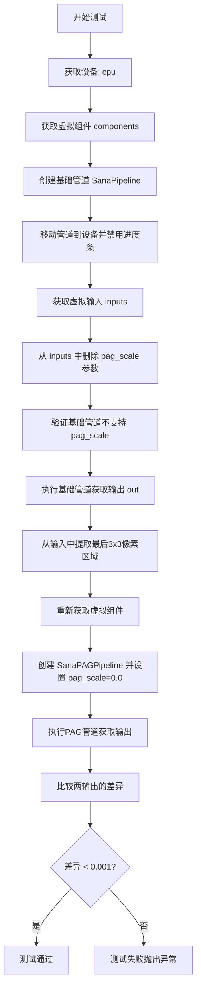

#### 带注释源码

```python
def test_pag_disable_enable(self):
    """测试PAG功能的禁用/启用，验证pag_scale=0时输出与基础管道一致"""
    device = "cpu"  # 确保确定性，使用cpu避免torch.Generator的设备依赖性问题
    
    # 获取虚拟组件（transformer、vae、scheduler、text_encoder、tokenizer）
    components = self.get_dummy_components()

    # ----- 基础管道测试 -----
    # 创建不带PAG功能的基础SanaPipeline
    pipe_sd = SanaPipeline(**components)
    pipe_sd = pipe_sd.to(device)
    pipe_sd.set_progress_bar_config(disable=None)

    # 获取测试输入
    inputs = self.get_dummy_inputs(device)
    
    # 删除pag_scale参数，因为基础管道不支持此参数
    del inputs["pag_scale"]
    
    # 断言验证：确认基础管道的__call__方法签名中不包含pag_scale参数
    assert "pag_scale" not in inspect.signature(pipe_sd.__call__).parameters, (
        f"`pag_scale` should not be a call parameter of the base pipeline {pipe_sd.__class__.__name__}."
    )
    
    # 执行基础管道推理，提取最后3x3像素区域用于比较
    out = pipe_sd(**inputs).images[0, -3:, -3:, -1]

    # ----- PAG禁用测试 -----
    # 重新获取虚拟组件（确保状态独立）
    components = self.get_dummy_components()

    # 创建SanaPAGPipeline并设置pag_scale=0.0以禁用PAG
    pipe_pag = self.pipeline_class(**components)
    pipe_pag = pipe_pag.to(device)
    pipe_pag.set_progress_bar_config(disable=None)

    # 获取测试输入
    inputs = self.get_dummy_inputs(device)
    
    # 设置pag_scale为0.0以禁用PAG功能
    inputs["pag_scale"] = 0.0
    
    # 执行PAG管道推理，提取最后3x3像素区域
    out_pag_disabled = pipe_pag(**inputs).images[0, -3:, -3:, -1]

    # 断言：验证禁用PAG后的输出与基础管道输出差异小于阈值
    # 如果差异过大，说明PAG禁用功能未正确实现
    assert np.abs(out.flatten() - out_pag_disabled.flatten()).max() < 1e-3
```


### `SanaPAGPipelineFastTests.test_pag_applied_layers`

该测试方法用于验证 PAG（Prompt Attendance Guidance）注意力处理器是否正确应用到指定的 transformer 层，包括支持精确层指定、正则表达式匹配和转义字符等多种配置方式。

参数：

- `self`：实例方法，测试类本身，无需显式传递

返回值：`None`，无返回值（测试方法通过 `assert` 语句进行验证）

#### 流程图

```mermaid
flowchart TD
    A[开始测试] --> B[设置设备为cpu]
    B --> C[获取dummy components]
    C --> D[创建SanaPAGPipeline并移到设备]
    D --> E[获取所有self-attention层名称]
    E --> F[保存原始attention processors]
    F --> G[测试pag_layers=['blocks.0', 'blocks.1']]
    G --> H{验证pag_attn_processors包含所有self attn层}
    H -->|通过| I[重置为原始processors]
    I --> J[测试pag_layers=['blocks.0']]
    J --> K{验证pag_attn_processors仅包含block_0的attn1}
    K -->|通过| L[重置为原始processors]
    L --> M[测试pag_layers=['blocks.0.attn1']]
    M --> N{验证pag_attn_processors为block_0的attn1}
    N -->|通过| O[重置为原始processors]
    O --> P[测试pag_layers=['blocks.(0|1)'] 正则匹配]
    P --> Q{验证pag_attn_processors数量为2}
    Q -->|通过| R[重置为原始processors]
    R --> S[测试pag_layers=['blocks.0', r'blocks\.1'] 转义字符]
    S --> T{验证pag_attn_processors数量为2}
    T -->|通过| U[测试通过]
    H -->|失败| V[抛出AssertionError]
    K -->|失败| V
    N -->|失败| V
    Q -->|失败| V
    T -->|失败| V
```

#### 带注释源码

```python
def test_pag_applied_layers(self):
    """
    测试PAG应用层功能，验证PAG attention processors是否正确应用到指定的transformer层。
    测试多种层指定方式：精确匹配、正则表达式、转义字符等。
    """
    # 1. 设置设备为cpu，确保torch.Generator的确定性
    device = "cpu"
    
    # 2. 获取预先配置好的虚拟组件（transformer, vae, scheduler, text_encoder, tokenizer）
    components = self.get_dummy_components()

    # 3. 创建PAG pipeline并配置设备
    pipe = self.pipeline_class(**components)
    pipe = pipe.to(device)
    pipe.set_progress_bar_config(disable=None)

    # 4. 获取transformer中所有的self-attention层名称（包含'attn1'的processor）
    all_self_attn_layers = [k for k in pipe.transformer.attn_processors.keys() if "attn1" in k]
    
    # 5. 保存原始的attention processors，用于后续重置
    original_attn_procs = pipe.transformer.attn_processors
    
    # 6. 测试用例1：指定多个blocks ['blocks.0', 'blocks.1']
    # 期望：pag_attn_processors应包含所有self-attention层
    pag_layers = ["blocks.0", "blocks.1"]
    pipe._set_pag_attn_processor(pag_applied_layers=pag_layers, do_classifier_free_guidance=False)
    assert set(pipe.pag_attn_processors) == set(all_self_attn_layers)

    # 7. 测试用例2：仅指定block 0 ['blocks.0']
    # 期望：pag_attn_processors应仅包含block_0的self-attention
    block_0_self_attn = ["transformer_blocks.0.attn1.processor"]
    pipe.transformer.set_attn_processor(original_attn_procs.copy())  # 重置为原始processors
    pag_layers = ["blocks.0"]
    pipe._set_pag_attn_processor(pag_applied_layers=pag_layers, do_classifier_free_guidance=False)
    assert set(pipe.pag_attn_processors) == set(block_0_self_attn)

    # 8. 测试用例3：使用完整路径 'blocks.0.attn1'
    # 期望：同样应仅包含block_0的self-attention
    pipe.transformer.set_attn_processor(original_attn_procs.copy())
    pag_layers = ["blocks.0.attn1"]
    pipe._set_pag_attn_processor(pag_applied_layers=pag_layers, do_classifier_free_guidance=False)
    assert set(pipe.pag_attn_processors) == set(block_0_self_attn)

    # 9. 测试用例4：使用正则表达式 'blocks.(0|1)'
    # 期望：匹配blocks.0和blocks.1，总共2个processors
    pipe.transformer.set_attn_processor(original_attn_procs.copy())
    pag_layers = ["blocks.(0|1)"]
    pipe._set_pag_attn_processor(pag_applied_layers=pag_layers, do_classifier_free_guidance=False)
    assert (len(pipe.pag_attn_processors)) == 2

    # 10. 测试用例5：使用转义字符 ['blocks.0', r'blocks\.1']
    # 期望：转义后的点号精确匹配blocks.1，同样2个processors
    pipe.transformer.set_attn_processor(original_attn_procs.copy())
    pag_layers = ["blocks.0", r"blocks\.1"]
    pipe._set_pag_attn_processor(pag_applied_layers=pag_layers, do_classifier_free_guidance=False)
    assert len(pipe.pag_attn_processors) == 2
```


### `SanaPAGPipelineFastTests.test_inference_batch_consistent`

测试批处理一致性。该测试方法用于验证 SanaPAGPipeline 在批处理模式下的一致性，但由于测试使用的小词汇表导致嵌入查找错误，目前被跳过。

参数：

- `self`：`SanaPAGPipelineFastTests`，测试类实例自身，无需显式传递

返回值：`None`，无返回值

#### 流程图

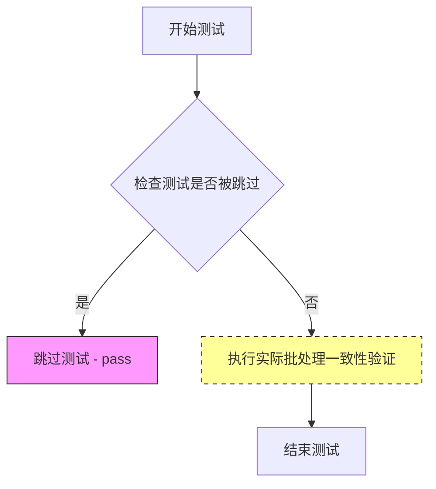

> **注意**：该测试当前被 `@unittest.skip` 装饰器跳过，因此实际不执行任何验证逻辑。测试体仅包含 `pass` 语句。

#### 带注释源码

```python
# TODO(aryan): Create a dummy gemma model with smol vocab size
@unittest.skip(
    "A very small vocab size is used for fast tests. So, Any kind of prompt other than the empty default used in other tests will lead to a embedding lookup error. This test uses a long prompt that causes the error."
)
def test_inference_batch_consistent(self):
    pass
```

#### 详细说明

| 属性 | 值 |
|------|-----|
| **所属类** | `SanaPAGPipelineFastTests` |
| **方法类型** | 实例方法（测试方法） |
| **跳过原因** | 虚拟 Gemma 模型的词汇表过小，非空 prompt 会导致嵌入查找错误 |
| **当前实现** | 空方法（`pass`），待实现 |


### `SanaPAGPipelineFastTests.test_inference_batch_single_identical`

该测试方法用于验证批处理（batch）推理与单例（single）推理产生相同的输出结果，确保管道在处理批量输入时与处理单个输入时具有一致的行为。

参数：

- `self`：`SanaPAGPipelineFastTests`，unittest.TestCase 实例，代表测试类本身

返回值：`None`，测试方法无返回值

#### 流程图

```mermaid
flowchart TD
    A[开始测试] --> B{检查测试是否应该运行}
    B -->|是| C[执行批处理推理]
    C --> D[执行单例推理]
    D --> E[比较两种推理结果]
    E --> F{结果是否相同?}
    F -->|是| G[测试通过]
    F -->|否| H[测试失败]
    B -->|否| I[跳过测试]
    G --> J[结束]
    H --> J
    I --> J
    
    style I fill:#f9f,stroke:#333
    style G fill:#9f9,stroke:#333
    style H fill:#f99,stroke:#333
```

#### 带注释源码

```python
@unittest.skip(
    "A very small vocab size is used for fast tests. So, Any kind of prompt other than the empty default used in other tests will lead to a embedding lookup error. This test uses a long prompt that causes the error."
)
def test_inference_batch_single_identical(self):
    """
    测试批处理与单例相同 (Test batch vs single identical)
    
    该测试方法被跳过，原因如下：
    - 测试使用非常小的词汇表进行快速测试
    - 除了空默认提示外，任何其他提示都会导致嵌入查找错误
    - 此测试使用长提示，会导致错误
    
    测试目的是验证：
    - 批处理推理结果应与单例推理结果相同
    - 确保管道在批量模式下的输出与单独处理每个输入时一致
    """
    pass  # 测试被跳过，不执行任何操作
```


### `SanaPAGPipelineFastTests.test_float16_inference`

该测试方法用于验证 SanaPAGPipeline 在 float16（半精度）推理模式下的正确性，通过调用父类的测试方法并设置较高的容差值（0.08）来适应模型对数据类型的敏感性。

参数：

- `self`：`SanaPAGPipelineFastTests`，测试类实例本身，包含测试所需的组件和配置

返回值：`None`，无返回值（测试方法）

#### 流程图

```mermaid
flowchart TD
    A[开始 test_float16_inference] --> B[获取测试类实例 self]
    B --> C[调用父类 test_float16_inference 方法]
    C --> D[传入 expected_max_diff=0.08 参数]
    D --> E{执行父类 float16 推理测试}
    E --> F[测试通过: 断言结果差异在容差范围内]
    E --> G[测试失败: 抛出断言错误]
    F --> H[结束]
    G --> H
```

#### 带注释源码

```python
def test_float16_inference(self):
    # 测试 float16（半精度）推理功能
    # 该测试方法继承自 PipelineTesterMixin，用于验证模型在 float16 数据类型下的推理正确性
    
    # 由于该模型对数据类型非常敏感，需要设置比默认更高的容差值
    # expected_max_diff=0.08 表示允许的最大像素差异为 0.08（相对于默认的 1e-3）
    super().test_float16_inference(expected_max_diff=0.08)
```

## 关键组件


### SanaPAGPipeline

SanaPAGPipeline 是集成了 Prompt-Attended Guidance (PAG) 技术的图像生成管道，继承自基础 SanaPipeline，通过 pag_scale 参数控制 PAG 强度，支持在指定层应用 PAG 注意力处理器。

### SanaPipeline

基础图像生成管道，不包含 PAG 技术，用于与 PAG 管道进行对比测试，验证 pag_scale=0 时两者输出应一致。

### SanaTransformer2DModel

Sana 系列的 Transformer 主干模型，负责图像特征的提取和去噪过程，包含多个 transformer_blocks 和注意力层。

### AutoencoderDC (VAE)

变分自编码器，负责将图像编码到潜在空间和解码回像素空间，包含 encoder 和 decoder 两部分，使用 EfficientViTBlock 和 ResBlock。

### FlowMatchEulerDiscreteScheduler

基于 Flow Matching 的欧拉离散调度器，使用 shift=7.0 参数控制噪声调度，用于生成去噪时间步。

### Gemma2ForCausalLM

文本编码器，将输入文本转换为条件 embedding，传递给 Transformer 进行条件生成。

### PAG (Prompt-Attended Guidance)

关键的图像生成策略技术，通过 _set_pag_attn_processor 方法配置，可指定特定层（如 blocks.0、blocks.1）应用 PAG，支持正则表达式匹配层名称。

### Attention Slicing

通过 enable_attention_slicing 启用的内存优化技术，将注意力计算分片处理以降低显存占用，支持 slice_size 参数配置。

### Callback 机制

支持 callback_on_step_end 和 callback_on_step_end_tensor_inputs 参数，允许在每个推理步骤结束后执行自定义回调函数，并可访问指定的张量变量。

### 量化与精度支持

通过 test_float16_inference 测试验证 float16 推理能力，模型对 dtype 敏感，设置了 expected_max_diff=0.08 的容差。

### 设备兼容性与确定性

支持 CPU、MPS 等多种设备，通过 torch.manual_seed 和 torch.Generator 确保推理结果可复现。


## 问题及建议


### 已知问题

-   **阈值过于宽松**：在`test_inference`中使用`self.assertLessEqual(max_diff, 1e10)`，1e10的阈值过于宽松，几乎任何输出都会通过测试，使测试失去意义
-   **随机期望值问题**：使用`torch.randn(3, 32, 32)`作为期望图像进行比较，这是随机值，导致测试结果每次都不同且无法验证实际输出质量
-   **缺失测试实现**：`test_inference_batch_consistent`和`test_inference_batch_single_identical`被跳过，但只是简单的pass，没有实际实现或替代验证方案
-   **设备处理不一致**：代码中混合使用硬编码的`"cpu"`和`torch_device`，如`test_inference`固定使用cpu而其他测试使用torch_device，可能导致在不同设备上运行时的覆盖不完整
-   **测试顺序依赖风险**：多个测试共享`get_dummy_components()`创建的对象，但没有在测试间完全隔离状态，可能存在测试顺序依赖问题
-   **魔法数字缺乏解释**：如`scaling_factor=0.41407`、`shift=7.0`、`expected_max_diff=0.08`等魔法数字没有注释说明其来源或意义

### 优化建议

-   **修复test_inference的验证逻辑**：使用固定的随机种子生成期望输出，或与基准输出进行已知正确结果的比对，而非使用随机值
-   **调整阈值**：将1e10的阈值调整为合理的值（如1e-2或1e-3），确保测试真正能检测到输出异常
-   **统一设备管理**：所有测试应统一使用`torch_device`或提供明确的设备选择逻辑
-   **实现跳过测试的替代验证**：要么实现真正的批处理测试，要么添加其他等效的验证来确保批处理逻辑正确
-   **添加配置常量**：将魔法数字提取为类级别常量或配置文件，并添加注释说明其含义和来源
-   **增强测试隔离**：在每个测试方法开始时重新创建完整的pipeline组件，确保测试间无状态共享

## 其它


### 设计目标与约束

本测试文件旨在验证 SanaPAGPipeline（基于 Progressive Attention Guidance 的文本到图像生成管道）的核心功能正确性。设计目标包括：确保管道能够正确执行推理流程，验证 PAG（Progressive Attention Guidance）功能的启用与禁用，测试注意力切片优化功能，以及确保 float16 推理的正确性。约束条件包括使用极小的虚拟模型和词汇表以加快测试速度，以及部分测试因词汇表限制而被跳过。

### 错误处理与异常设计

测试文件中处理了几类异常情况：1）设备兼容性处理：对 MPS 设备使用特殊的随机数生成器；2）回调函数验证：检查管道是否实现了 callback_on_step_end_tensor_inputs 属性；3）PAG 参数验证：确保 base pipeline 不包含 pag_scale 参数；4）浮点精度容差：float16 测试使用 0.08 的较大容差值以适应模型对数据类型的敏感性。

### 数据流与状态机

测试数据流如下：1）初始化阶段：get_dummy_components() 创建虚拟的 transformer、VAE、scheduler、text_encoder 和 tokenizer；2）输入准备阶段：get_dummy_inputs() 准备包含 prompt、generator、num_inference_steps 等参数的输入字典；3）推理执行阶段：调用管道进行图像生成；4）结果验证阶段：检查生成图像的形状和数值范围。状态转换通过 set_progress_bar_config 控制进度条显示状态。

### 外部依赖与接口契约

主要依赖包括：transformers 库提供 Gemma2Config、Gemma2ForCausalLM、GemmaTokenizer；diffusers 库提供 AutoencoderDC、FlowMatchEulerDiscreteScheduler、SanaPAGPipeline、SanaPipeline、SanaTransformer2DModel；numpy 用于数值比较；torch 用于张量操作。接口契约要求管道必须实现 __call__ 方法、支持指定的参数集合（TEXT_TO_IMAGE_PARAMS）、提供回调机制（callback_on_step_end 和 callback_on_step_end_tensor_inputs）。

### 配置管理

配置通过 components 字典集中管理，包含：transformer 配置（patch_size=1, in_channels=4, num_layers=2 等）、VAE 配置（encoder/decoder 块类型、通道数）、scheduler 配置（shift=7.0）、text_encoder 配置（Gemma2 模型参数）。测试使用固定随机种子（torch.manual_seed(0)）确保可重复性。

### 测试策略

采用多层次测试策略：1）基础功能测试（test_inference）验证推理流程；2）回调机制测试（test_callback_inputs）验证中间步骤干预能力；3）性能优化测试（test_attention_slicing_forward_pass）验证注意力切片不影响结果；4）PAG 功能测试（test_pag_disable_enable、test_pag_applied_layers）验证 PAG 机制；5）精度测试（test_float16_inference）验证半精度推理。使用 dummy components 避免加载真实模型以加快测试速度。

### 版本兼容性

测试代码兼容 Python 3.x+、PyTorch、transformers 和 diffusers 库。test_float16_inference 调用父类的测试方法，支持不同版本的 transformers 接口。代码通过 inspect 模块动态检查管道签名以适应不同版本的参数差异。

### 资源管理

测试使用 CPU 设备以确保可重复性和资源可用性。使用 torch.manual_seed 和 torch.Generator 确保随机数可预测。测试完成后不进行显式资源释放，依赖 Python 垃圾回收。enable_full_determinism() 确保跨测试的确定性执行。

### 线程安全考虑

测试主要在单线程环境下运行，未进行多线程并发测试。管道组件（transformer、vae、scheduler 等）在测试间通过新建实例隔离。回调函数测试验证了回调机制在推理过程中的线程安全性假设。

### 监控与日志

通过 pipe.set_progress_bar_config(disable=None) 控制进度条显示。测试使用 assert 语句进行断言验证。test_inference 使用 max_diff 监控生成图像与随机图像的差异。回调测试中通过 tensor 值检查进行内部监控。


    