# `diffusers\tests\pipelines\pag\test_pag_sd.py` 详细设计文档

该文件包含Stable Diffusion PAG（Probabilistic Adaptive Guidance）Pipeline的单元测试和集成测试，用于验证PAG功能在文本到图像生成任务中的正确性，包括PAG的禁用/启用、应用层配置、推理流程和条件生成等核心功能。

## 整体流程

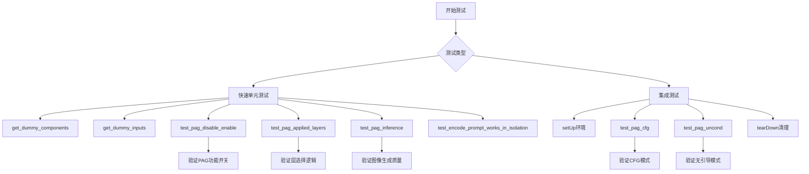

## 类结构

```
unittest.TestCase
├── StableDiffusionPAGPipelineFastTests (快速测试类)
│   ├── PipelineTesterMixin
│   ├── IPAdapterTesterMixin
│   ├── PipelineLatentTesterMixin
│   └── PipelineFromPipeTesterMixin
└── StableDiffusionPAGPipelineIntegrationTests (集成测试类)
```

## 全局变量及字段


### `device`
    
运行设备，指定为cpu或mps等设备字符串

类型：`str`
    


### `components`
    
包含unet、scheduler、vae、text_encoder、tokenizer等模型组件的字典

类型：`dict`
    


### `inputs`
    
包含prompt、generator、num_inference_steps、guidance_scale等推理参数的字典

类型：`dict`
    


### `out`
    
基础管道（不带PAG）输出的图像数组

类型：`numpy.ndarray`
    


### `out_pag_disabled`
    
PAG禁用时（pag_scale=0.0）管道输出的图像数组

类型：`numpy.ndarray`
    


### `out_pag_enabled`
    
PAG启用时管道输出的图像数组

类型：`numpy.ndarray`
    


### `pipe_sd`
    
基础Stable Diffusion管道实例，不带PAG功能

类型：`StableDiffusionPipeline`
    


### `pipe_pag`
    
带PAG（Progressive Attention Guidance）功能的Stable Diffusion管道实例

类型：`StableDiffusionPAGPipeline`
    


### `generator`
    
PyTorch随机数生成器，用于确保推理过程的可重复性

类型：`torch.Generator`
    


### `image`
    
管道生成的图像数组，形状为(batch, height, width, channels)

类型：`numpy.ndarray`
    


### `image_slice`
    
图像的切片部分，用于输出验证和比较

类型：`numpy.ndarray`
    


### `expected_slice`
    
预期的图像切片值，用于与实际输出进行比对验证

类型：`numpy.ndarray`
    


### `max_diff`
    
实际输出与预期输出之间的最大绝对差异值

类型：`float`
    


### `all_self_attn_layers`
    
包含所有自注意力层（attn1）名称的列表

类型：`list`
    


### `original_attn_procs`
    
UNet原始注意力处理器的字典副本

类型：`dict`
    


### `pag_layers`
    
指定PAG应用层的列表，如['mid', 'up', 'down']等

类型：`list`
    


### `pipeline`
    
从预训练模型加载的文本到图像自动管道

类型：`AutoPipelineForText2Image`
    


### `cross_attention_dim`
    
交叉注意力机制的维度参数

类型：`int`
    


### `pag_scale`
    
PAG缩放因子，控制注意力引导的强度

类型：`float`
    


### `guidance_scale`
    
分类器自由引导比例，控制文本prompt对生成图像的影响程度

类型：`float`
    


### `StableDiffusionPAGPipelineFastTests.pipeline_class`
    
测试使用的管道类，指向StableDiffusionPAGPipeline

类型：`type`
    


### `StableDiffusionPAGPipelineFastTests.params`
    
管道调用参数集合，包含TEXT_TO_IMAGE_PARAMS及pag_scale、pag_adaptive_scale

类型：`set`
    


### `StableDiffusionPAGPipelineFastTests.batch_params`
    
批处理参数集合，用于批量推理测试

类型：`set`
    


### `StableDiffusionPAGPipelineFastTests.image_params`
    
图像相关参数集合，用于图像处理测试

类型：`set`
    


### `StableDiffusionPAGPipelineFastTests.image_latents_params`
    
潜在空间图像参数集合，用于潜在变量测试

类型：`set`
    


### `StableDiffusionPAGPipelineFastTests.callback_cfg_params`
    
回调配置参数集合，包含add_text_embeds和add_time_ids等

类型：`set`
    


### `StableDiffusionPAGPipelineIntegrationTests.pipeline_class`
    
集成测试使用的管道类，指向StableDiffusionPAGPipeline

类型：`type`
    


### `StableDiffusionPAGPipelineIntegrationTests.repo_id`
    
HuggingFace模型仓库ID，指定预训练模型的路径

类型：`str`
    
    

## 全局函数及方法


### gc.collect

Python 标准库的垃圾回收函数，用于手动触发 Python 的垃圾回收机制，释放不再使用的内存对象，防止内存泄漏。在测试框架中，通常在测试环境初始化和清理时调用，以确保 GPU 内存和 Python 对象被正确释放。

参数：

- 无参数

返回值：`int`，返回被回收的不可达对象数量

#### 流程图

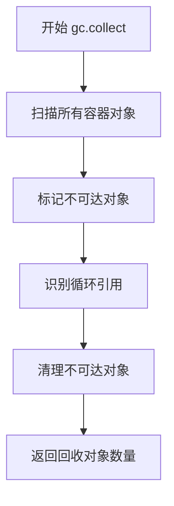

#### 带注释源码

```python
# 触发 Python 垃圾回收
gc.collect()

# 在 setUp 方法中 - 测试前清理内存
def setUp(self):
    super().setUp()
    gc.collect()  # 清理之前的测试残留对象，释放内存
    backend_empty_cache(torch_device)  # 清理 GPU 缓存

# 在 tearDown 方法中 - 测试后清理内存
def tearDown(self):
    super().tearDown()
    gc.collect()  # 清理当前测试产生的对象，防止内存泄漏
    backend_empty_cache(torch_device)  # 清理 GPU 缓存
```


### `backend_empty_cache`

该函数是一个测试工具函数，用于清理GPU缓存以释放内存，通常在测试的初始化（setUp）和清理（tearDown）阶段调用，以防止内存泄漏和内存溢出错误。

参数：

- `device`：`torch.device` 或 `str`，目标设备，用于指定要清理缓存的设备（如 "cuda:0"、"cpu" 等）

返回值：`None`，无返回值

#### 流程图

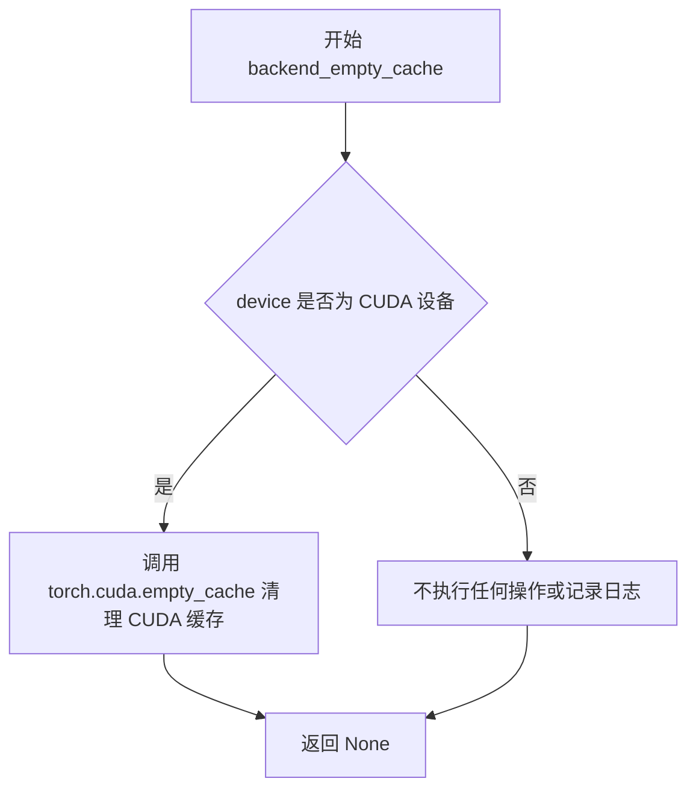

#### 带注释源码

```
# backend_empty_cache 函数定义（位于 testing_utils 模块中，此处为推断实现）
# 该函数在提供的代码中未被定义，仅从 testing_utils 模块导入并使用

def backend_empty_cache(device):
    """
    清理指定设备上的 GPU 缓存以释放内存。
    
    参数:
        device: torch.device 或 str, 目标设备
    返回:
        None
    """
    if isinstance(device, str) and device.startswith("cuda"):
        # 如果设备是 CUDA 设备，调用 PyTorch 的 empty_cache 方法
        torch.cuda.empty_cache()
    elif hasattr(device, 'type') and device.type == 'cuda':
        # 如果 device 是 torch.device 对象且类型为 cuda
        torch.cuda.empty_cache()
    # 对于 CPU 设备，不执行任何操作
    
# 在代码中的实际调用方式：
backend_empty_cache(torch_device)  # torch_device 是从 testing_utils 导入的全局变量
```

#### 使用示例

在提供的代码中，该函数被用于 `StableDiffusionPAGPipelineIntegrationTests` 测试类：

```python
class StableDiffusionPAGPipelineIntegrationTests(unittest.TestCase):
    # ...
    
    def setUp(self):
        super().setUp()
        gc.collect()  # 首先调用 Python 垃圾回收
        backend_empty_cache(torch_device)  # 然后清理 GPU 缓存
    
    def tearDown(self):
        super().tearDown()
        gc.collect()
        backend_empty_cache(torch_device)
```

#### 关键信息

| 项目 | 详情 |
|------|------|
| 函数名 | `backend_empty_cache` |
| 模块 | `testing_utils`（外部模块，未在当前代码文件中定义） |
| 用途 | 清理 GPU 内存缓存，防止测试过程中的内存泄漏 |
| 依赖 | `torch.cuda.empty_cache()` |


### `enable_full_determinism`

设置 PyTorch 和相关库的随机种子，以确保深度学习模型在推理或训练过程中的完全确定性，使多次运行产生相同的结果。

参数： None

返回值： None

#### 流程图

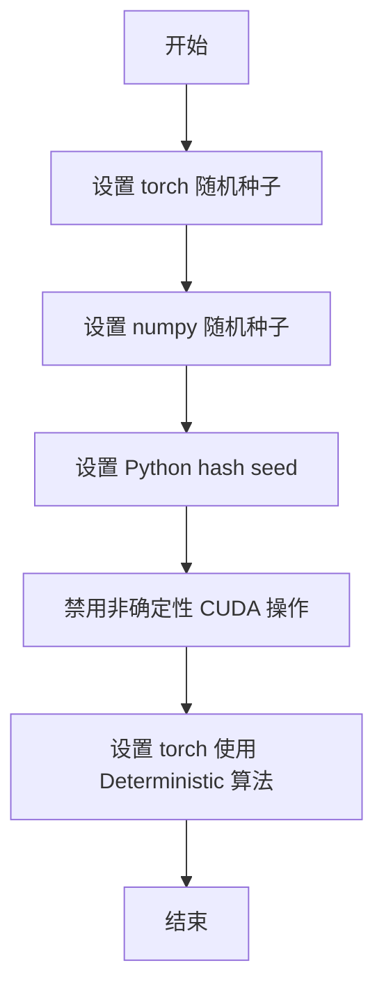

#### 带注释源码

```python
# 该函数从 testing_utils 模块导入，但在当前代码文件中直接调用
# 导入来源
from ...testing_utils import (
    backend_empty_cache,
    enable_full_determinism,  # <-- 从 testing_utils 模块导入
    require_torch_accelerator,
    slow,
    torch_device,
)

# 在模块级别直接调用，设置全局随机种子以确保测试可重复性
enable_full_determinism()
```

---

**注意**：根据提供的代码片段，`enable_full_determinism` 函数的完整定义不在当前文件中，它是从 `...testing_utils` 模块导入的外部函数。该函数通常用于：

1. 设置 `torch.manual_seed()` 和 `torch.cuda.manual_seed_all()`
2. 设置 `numpy.random.seed()`
3. 设置 Python 环境变量 `PYTHONHASHSEED`
4. 禁用 CUDA 的非确定性操作（如 `torch.backends.cudnn.deterministic = True`）
5. 启用 PyTorch 的确定性模式（如 `torch.use_deterministic_algorithms()`）

具体实现需要查看 `testing_utils` 模块的源代码。


### `np.abs`

`np.abs` 是 NumPy 库中的数学函数，用于计算输入数组中每个元素的绝对值。

参数：

-  `x`：数组或类数组对象（`ndarray`、`list`、`tuple` 等），需要计算绝对值的输入数据
-  `dtype`：（可选）指定输出数组的数据类型

返回值：`ndarray`，返回包含输入元素绝对值的新数组，形状与输入相同。

#### 流程图

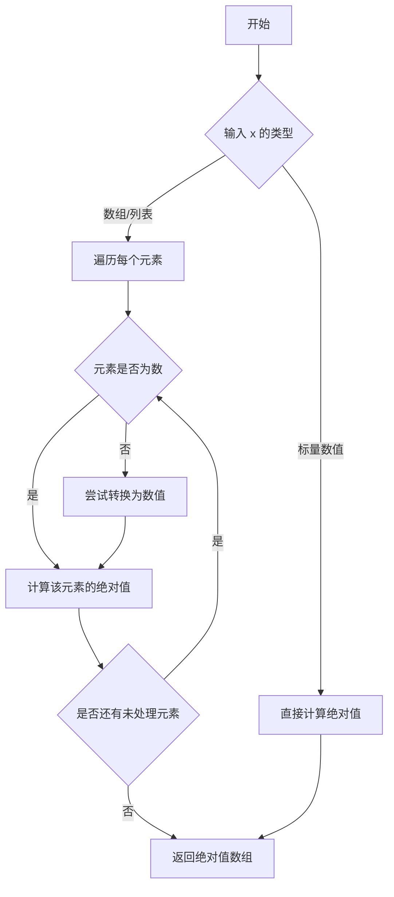

#### 带注释源码

```
# np.abs 函数的典型实现逻辑（简化版）
def abs_function(x):
    """
    计算输入的绝对值
    
    参数:
        x: 数值或数组
    
    返回:
        绝对值结果
    """
    # 如果是复数，计算模
    if isinstance(x, complex):
        return math.sqrt(x.real**2 + x.imag**2)
    
    # 如果是数组，递归处理每个元素
    if hasattr(x, '__iter__'):
        return type(x)(abs_function(item) for item in x)
    
    # 普通数值：正数返回自身，负数取反
    return -x if x < 0 else x
```

**注意**：上述源码为简化演示。实际 `np.abs` 实现位于 NumPy 核心 C 代码中，支持多维数组、向量化操作和各种数据类型的高效计算。在当前测试代码中的典型用法如下：

```python
# 用法示例（来自测试代码）
max_diff = np.abs(image_slice.flatten() - expected_slice).max()
assert max_diff < 1e-3
```

该函数在测试文件中用于：
1. 比较图像输出的差异（`test_pag_disable_enable`）
2. 验证推理结果的正确性（`test_pag_inference`）
3. 集成测试中的图像对比（`test_pag_cfg`、`test_pag_uncond`）


# 分析结果

## 注意

在提供的代码中，`np.array` **不是**该文件中定义的函数或方法，而是 **NumPy 库中被导入并使用的函数**。代码中有多处使用了 `np.array` 来创建 NumPy 数组，例如：

```python
expected_slice = np.array(
    [0.22802538, 0.44626093, 0.48905736, 0.29633686, 0.36400637, 0.4724258, 0.4678891, 0.32260418, 0.41611585]
)
```

`np.array` 是外部库函数，不属于此代码文件的内部设计范畴。

---

## 替代方案

以下是该代码文件中**实际定义的函数/方法**的详细信息，您可以选择其中一个进行详细分析：

| 序号 | 函数/方法名 | 描述 |
|------|-------------|------|
| 1 | `StableDiffusionPAGPipelineFastTests.get_dummy_components` | 创建虚拟的模型组件（UNet、VAE、TextEncoder等）用于单元测试 |
| 2 | `StableDiffusionPAGPipelineFastTests.get_dummy_inputs` | 创建虚拟的推理输入参数 |
| 3 | `StableDiffusionPAGPipelineIntegrationTests.get_inputs` | 创建集成测试用的输入参数 |
| 4 | `test_pag_disable_enable` | 测试PAG（Progressive Attention Guidance）的禁用/启用功能 |
| 5 | `test_pag_applied_layers` | 测试PAG应用层的正确性 |
| 6 | `test_pag_inference` | 测试PAG推理的输出正确性 |

---

如果您希望我详细分析上述**任何一个函数/方法**，请回复序号或名称，我将为您提供完整的文档，包括：
- 详细描述
- 参数信息
- 返回值信息
- Mermaid 流程图
- 带注释的源码


### `StableDiffusionPAGPipelineFastTests.get_dummy_components`

该方法用于创建虚拟（dummy）组件字典，为 Stable Diffusion PAG Pipeline 的单元测试提供必要的模型组件。它初始化一个最小配置的 UNet2DConditionModel、DDIMScheduler、AutoencoderKL、CLIPTextModel 和 CLIPTokenizer，所有组件均使用极小的参数维度以确保测试执行速度快且资源占用低。

参数：

- `time_cond_proj_dim`：`Optional[int]`，可选参数，用于指定时间条件投影维度，默认值为 None

返回值：`Dict[str, Any]`，返回一个包含所有虚拟组件的字典，键包括 "unet"、"scheduler"、"vae"、"text_encoder"、"tokenizer"、"safety_checker"、"feature_extractor" 和 "image_encoder"

#### 流程图

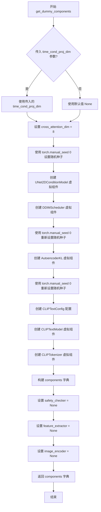

#### 带注释源码

```python
def get_dummy_components(self, time_cond_proj_dim=None):
    """
    创建用于测试的虚拟组件字典
    
    参数:
        time_cond_proj_dim: 可选的时间条件投影维度，用于 UNet 模型
    
    返回:
        包含所有虚拟组件的字典
    """
    # 设置交叉注意力维度为 8（最小配置以加快测试）
    cross_attention_dim = 8

    # 设置随机种子以确保测试可重复性
    torch.manual_seed(0)
    # 创建虚拟 UNet2DConditionModel 组件
    # 参数使用最小配置：block_out_channels=(4, 8), layers_per_block=2, sample_size=32
    unet = UNet2DConditionModel(
        block_out_channels=(4, 8),           # UNet 块的输出通道数
        layers_per_block=2,                   # 每个块的层数
        sample_size=32,                       # 样本尺寸
        time_cond_proj_dim=time_cond_proj_dim, # 时间条件投影维度（可选）
        in_channels=4,                        # 输入通道数
        out_channels=4,                       # 输出通道数
        down_block_types=("DownBlock2D", "CrossAttnDownBlock2D"), # 下采样块类型
        up_block_types=("CrossAttnUpBlock2D", "UpBlock2D"),       # 上采样块类型
        cross_attention_dim=cross_attention_dim,                 # 交叉注意力维度
        norm_num_groups=2,                   # 归一化组数
    )
    
    # 创建虚拟 DDIMScheduler 调度器组件
    # 使用标准 Stable Diffusion 调度参数
    scheduler = DDIMScheduler(
        beta_start=0.00085,                   # Beta 起始值
        beta_end=0.012,                       # Beta 结束值
        beta_schedule="scaled_linear",       # Beta 调度策略
        clip_sample=False,                    # 是否裁剪样本
        set_alpha_to_one=False,               # 是否设置 alpha 为 1
    )
    
    # 重新设置随机种子，确保 VAE 的可重复性
    torch.manual_seed(0)
    # 创建虚拟 AutoencoderKL (VAE) 组件
    vae = AutoencoderKL(
        block_out_channels=[4, 8],           # VAE 块的输出通道数
        in_channels=3,                       # 输入通道数 (RGB 图像)
        out_channels=3,                      # 输出通道数
        down_block_types=["DownEncoderBlock2D", "DownEncoderBlock2D"], # 下采样块类型
        up_block_types=["UpDecoderBlock2D", "UpDecoderBlock2D"],       # 上采样块类型
        latent_channels=4,                   # 潜在空间通道数
        norm_num_groups=2,                   # 归一化组数
    )
    
    # 重新设置随机种子，确保文本编码器的可重复性
    torch.manual_seed(0)
    # 创建 CLIP 文本编码器配置（最小配置）
    text_encoder_config = CLIPTextConfig(
        bos_token_id=0,                      # 句子开始 token ID
        eos_token_id=2,                      # 句子结束 token ID
        hidden_size=cross_attention_dim,     # 隐藏层大小
        intermediate_size=16,                # 中间层大小
        layer_norm_eps=1e-05,                # LayerNorm epsilon
        num_attention_heads=2,               # 注意力头数
        num_hidden_layers=2,                 # 隐藏层数量
        pad_token_id=1,                      # 填充 token ID
        vocab_size=1000,                     # 词汇表大小（远小于真实模型）
    )
    
    # 创建虚拟 CLIPTextModel 文本编码器组件
    text_encoder = CLIPTextModel(text_encoder_config)
    
    # 创建虚拟 CLIPTokenizer 分词器
    # 从预训练模型加载 tiny-random-clip（测试用小型模型）
    tokenizer = CLIPTokenizer.from_pretrained("hf-internal-testing/tiny-random-clip")

    # 组装所有组件到字典中
    components = {
        "unet": unet,                         # UNet 2D 条件模型
        "scheduler": scheduler,              # DDIM 调度器
        "vae": vae,                           # VAE 自编码器
        "text_encoder": text_encoder,         # 文本编码器
        "tokenizer": tokenizer,               # 分词器
        "safety_checker": None,               # 安全检查器（测试中设为 None）
        "feature_extractor": None,            # 特征提取器（测试中设为 None）
        "image_encoder": None,               # 图像编码器（测试中设为 None）
    }
    
    # 返回完整的组件字典
    return components
```


### `StableDiffusionPAGPipelineFastTests.get_dummy_inputs`

该方法用于生成 Stable Diffusion PAG Pipeline 测试所需的虚拟输入参数，封装了提示词、随机数生成器、推理步数、引导比例、PAG 比例和输出类型等关键配置。

参数：

- `self`：隐式的测试类实例引用，代表当前测试对象
- `device`：`str` 或 `torch.device`，目标设备，用于创建随机数生成器
- `seed`：`int`，默认值 0，用于设置随机数生成器的种子，确保测试可复现

返回值：`Dict[str, Any]`，包含用于管道推理的虚拟输入字典，包含 prompt、generator、num_inference_steps、guidance_scale、pag_scale 和 output_type 等键

#### 流程图

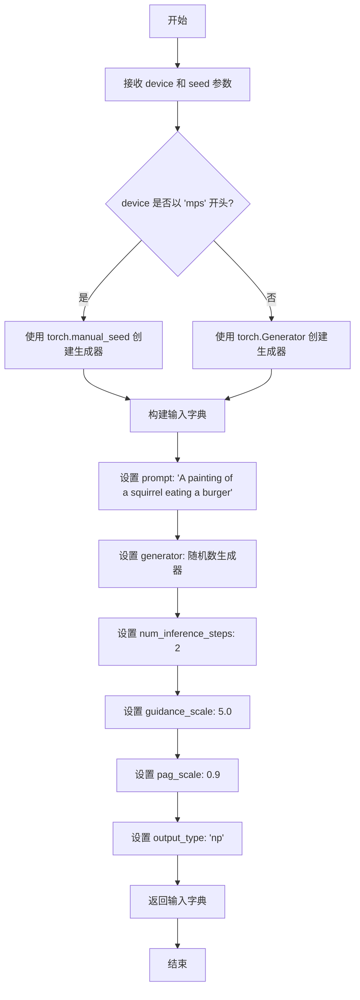

#### 带注释源码

```python
def get_dummy_inputs(self, device, seed=0):
    """
    生成用于测试 StableDiffusionPAGPipeline 的虚拟输入参数。
    
    该方法根据给定的设备和种子创建随机数生成器，并返回一个包含
    推理所需全部参数的字典，用于测试管道的各项功能。
    
    参数:
        self: 测试类实例，包含管道配置信息
        device: str 或 torch.device - 目标设备，用于创建随机数生成器
        seed: int - 随机数种子，默认值为 0，确保测试可复现
    
    返回:
        dict: 包含以下键的字典:
            - prompt (str): 测试用提示词
            - generator (torch.Generator): 随机数生成器
            - num_inference_steps (int): 推理步数
            - guidance_scale (float): CFG 引导比例
            - pag_scale (float): PAG 应用比例
            - output_type (str): 输出类型
    """
    # 针对 Apple Silicon MPS 设备特殊处理，使用 CPU 随机种子
    if str(device).startswith("mps"):
        # MPS 设备不支持 torch.Generator，使用 CPU 随机种子
        generator = torch.manual_seed(seed)
    else:
        # 在指定设备上创建随机数生成器并设置种子
        generator = torch.Generator(device=device).manual_seed(seed)
    
    # 构建完整的输入参数字典
    inputs = {
        "prompt": "A painting of a squirrel eating a burger",  # 测试用提示词
        "generator": generator,  # 随机数生成器，确保输出可复现
        "num_inference_steps": 2,  # 快速测试用推理步数
        "guidance_scale": 5.0,  # Classifier-free guidance 强度
        "pag_scale": 0.9,  # Prompt-guided Attention 比例
        "output_type": "np",  # 输出为 NumPy 数组
    }
    return inputs
```


### `StableDiffusionPAGPipelineFastTests.test_pag_disable_enable`

该测试方法用于验证 PAG（Progressive Acceleration Guidance）功能的禁用与启用行为。它首先创建基础 StableDiffusionPipeline 获取基准输出，然后创建 PAG 管道分别在 `pag_scale=0.0`（禁用状态）和正常启用状态下生成输出，最后通过数值比较断言：禁用时输出应与基准管道一致（差异<1e-3），启用时输出应与基准管道不同（差异>1e-3）。

参数：无（仅使用 `self` 实例属性）

返回值：`None`（测试方法，无返回值）

#### 流程图

```mermaid
flowchart TD
    A[开始测试] --> B[获取设备 cpu 和虚拟组件]
    B --> C[创建基础 StableDiffusionPipeline]
    C --> D[调用管道获取基准输出 out]
    D --> E[创建 PAG 管道并设置 pag_scale=0.0]
    E --> F[调用管道获取禁用状态输出 out_pag_disabled]
    F --> G[创建启用状态的 PAG 管道<br/>pag_applied_layers=['mid', 'up', 'down']]
    G --> H[调用管道获取启用状态输出 out_pag_enabled]
    H --> I{验证结果}
    I -->|断言1| J[abs(out - out_pag_disabled) < 1e-3]
    I -->|断言2| K[abs(out - out_pag_enabled) > 1e-3]
    J --> L[测试通过]
    K --> L
```

#### 带注释源码

```python
def test_pag_disable_enable(self):
    """
    测试 PAG 功能的禁用与启用行为。
    验证：
    1. 当 pag_scale=0.0 时，PAG 禁用，输出应与基础管道一致
    2. 当 PAG 启用时，输出应与基础管道不同
    """
    # 使用 cpu 设备以确保基于 torch.Generator 的确定性
    device = "cpu"
    # 获取虚拟组件（UNet、VAE、Scheduler、TextEncoder、Tokenizer 等）
    components = self.get_dummy_components()

    # ========== 步骤1: 创建基础管道（不使用 PAG） ==========
    pipe_sd = StableDiffusionPipeline(**components)
    pipe_sd = pipe_sd.to(device)
    pipe_sd.set_progress_bar_config(disable=None)

    # 获取虚拟输入，移除 pag_scale 参数
    inputs = self.get_dummy_inputs(device)
    del inputs["pag_scale"]
    # 断言：基础管道的调用签名中不应包含 pag_scale 参数
    assert "pag_scale" not in inspect.signature(pipe_sd.__call__).parameters, (
        f"`pag_scale` should not be a call parameter of the base pipeline {pipe_sd.__class__.__name__}."
    )
    # 获取基准输出（取右下角 3x3 像素块）
    out = pipe_sd(**inputs).images[0, -3:, -3:, -1]

    # ========== 步骤2: 使用 pag_scale=0.0 禁用 PAG ==========
    pipe_pag = self.pipeline_class(**components)
    pipe_pag = pipe_pag.to(device)
    pipe_pag.set_progress_bar_config(disable=None)

    inputs = self.get_dummy_inputs(device)
    inputs["pag_scale"] = 0.0  # 禁用 PAG
    out_pag_disabled = pipe_pag(**inputs).images[0, -3:, -3:, -1]

    # ========== 步骤3: 启用 PAG ==========
    # 指定 PAG 应用到 mid、up、down 三个层
    pipe_pag = self.pipeline_class(**components, pag_applied_layers=["mid", "up", "down"])
    pipe_pag = pipe_pag.to(device)
    pipe_pag.set_progress_bar_config(disable=None)

    inputs = self.get_dummy_inputs(device)
    out_pag_enabled = pipe_pag(**inputs).images[0, -3:, -3:, -1]

    # ========== 步骤4: 断言验证 ==========
    # 断言1: 禁用 PAG 时的输出应与基础管道一致（差异 < 1e-3）
    assert np.abs(out.flatten() - out_pag_disabled.flatten()).max() < 1e-3
    # 断言2: 启用 PAG 时的输出应与基础管道不同（差异 > 1e-3）
    assert np.abs(out.flatten() - out_pag_enabled.flatten()).max() > 1e-3
```


### `StableDiffusionPAGPipelineFastTests.test_pag_applied_layers`

该方法是一个单元测试，用于验证StableDiffusionPAGPipeline中PAG（Perturbed Attention Guidance）应用层的功能正确性。它通过设置不同的`pag_applied_layers`参数（如"mid"、"up"、"down"及其更细粒度的路径），测试PAG注意力处理器的正确设置，并验证无效的层级名称会抛出`ValueError`异常。

参数：
- `self`：隐式参数，测试类实例本身

返回值：`None`，该方法为`unittest.TestCase`的测试方法，通过`assert`语句验证行为，不返回任何值

#### 流程图

```mermaid
flowchart TD
    A[开始测试 test_pag_applied_layers] --> B[设置设备为CPU]
    B --> C[获取虚拟组件 components]
    C --> D[创建并配置PAGPipeline实例]
    
    D --> E[测试pag_layers=['down','mid','up']]
    E --> E1[获取所有self-attention层]
    E1 --> E2[调用_set_pag_attn_processor设置PAG处理器]
    E2 --> E3[断言: pag_attn_processors == all_self_attn_layers]
    
    E3 --> F[测试pag_layers=['mid']]
    F --> F1[重置attn_processor]
    F1 --> F2[调用_set_pag_attn_processor]
    F2 --> F3[断言: pag_attn_processors == mid层self-attention]
    
    F3 --> G[测试pag_layers=['mid_block']]
    G --> G1[重置attn_processor]
    G1 --> G2[调用_set_pag_attn_processor]
    G2 --> G3[断言: pag_attn_processors == mid层self-attention]
    
    G3 --> H[测试pag_layers=['mid_block.attentions_0']]
    H --> H1[重置attn_processor]
    H1 --> H2[调用_set_pag_attn_processor]
    H2 --> H3[断言: pag_attn_processors == mid层self-attention]
    
    H3 --> I[测试无效pag_layers=['mid_block.attentions_1']]
    I --> I1[重置attn_processor]
    I1 --> I2[断言抛出ValueError异常]
    
    I2 --> J[测试pag_layers=['down']]
    J --> J1[重置attn_processor]
    J1 --> J2[调用_set_pag_attn_processor]
    J2 --> J3[断言: len(pag_attn_processors) == 2]
    
    J3 --> K[测试无效pag_layers=['down_blocks.0']]
    K --> K1[重置attn_processor]
    K1 --> K2[断言抛出ValueError异常]
    
    K2 --> L[测试pag_layers=['down_blocks.1']]
    L --> L1[重置attn_processor]
    L1 --> L2[调用_set_pag_attn_processor]
    L2 --> L3[断言: len(pag_attn_processors) == 2]
    
    L3 --> M[测试pag_layers=['down_blocks.1.attentions.1']]
    M --> M1[重置attn_processor]
    M1 --> M2[调用_set_pag_attn_processor]
    M2 --> M3[断言: len(pag_attn_processors) == 1]
    
    M3 --> N[测试结束]
```

#### 带注释源码

```python
def test_pag_applied_layers(self):
    """
    测试PAG应用层的功能，验证不同粒度的pag_applied_layers参数
    是否能正确设置对应的PAG注意力处理器
    """
    # 设置设备为CPU，确保torch.Generator的确定性
    device = "cpu"
    
    # 获取虚拟的模型组件（UNet、VAE、Scheduler、TextEncoder等）
    components = self.get_dummy_components()

    # 创建基础pipeline
    pipe = self.pipeline_class(**components)
    pipe = pipe.to(device)
    pipe.set_progress_bar_config(disable=None)

    # ============================================================
    # 测试1: pag_applied_layers = ["mid","up","down"] 
    # 预期: 应用到所有self-attention层 (attn1)
    # ============================================================
    # 获取UNet中所有的self-attention层名称（包含"attn1"的键）
    all_self_attn_layers = [k for k in pipe.unet.attn_processors.keys() if "attn1" in k]
    
    # 保存原始的attention processors以便后续重置
    original_attn_procs = pipe.unet.attn_processors
    
    # 设置PAG应用到down、mid、up三个块的所有层
    pag_layers = ["down", "mid", "up"]
    pipe._set_pag_attn_processor(pag_applied_layers=pag_layers, do_classifier_free_guidance=False)
    
    # 验证所有self-attention层都被PAG处理器替换
    assert set(pipe.pag_attn_processors) == set(all_self_attn_layers)

    # ============================================================
    # 测试2-4: 测试不同粒度的mid层指定方式
    # ============================================================
    # 恢复原始attn processors
    pipe.unet.set_attn_processor(original_attn_procs.copy())
    
    # 定义mid block中所有的self-attention层
    all_self_attn_mid_layers = [
        "mid_block.attentions.0.transformer_blocks.0.attn1.processor",
    ]
    
    # 测试2: pag_layers = ["mid"]
    pag_layers = ["mid"]
    pipe._set_pag_attn_processor(pag_applied_layers=pag_layers, do_classifier_free_guidance=False)
    assert set(pipe.pag_attn_processors) == set(all_self_attn_mid_layers)

    # 测试3: pag_layers = ["mid_block"]
    pipe.unet.set_attn_processor(original_attn_procs.copy())
    pag_layers = ["mid_block"]
    pipe._set_pag_attn_processor(pag_applied_layers=pag_layers, do_classifier_free_guidance=False)
    assert set(pipe.pag_attn_processors) == set(all_self_attn_mid_layers)

    # 测试4: pag_layers = ["mid_block.attentions.0"]
    pipe.unet.set_attn_processor(original_attn_procs.copy())
    pag_layers = ["mid_block.attentions.0"]
    pipe._set_pag_attn_processor(pag_applied_layers=pag_layers, do_classifier_free_guidance=False)
    assert set(pipe.pag_attn_processors) == set(all_self_attn_mid_layers)

    # ============================================================
    # 测试5: 无效的mid层路径应抛出ValueError
    # ============================================================
    pipe.unet.set_attn_processor(original_attn_procs.copy())
    pag_layers = ["mid_block.attentions_1"]  # 该路径不存在
    with self.assertRaises(ValueError):
        pipe._set_pag_attn_processor(pag_applied_layers=pag_layers, do_classifier_free_guidance=False)

    # ============================================================
    # 测试6-9: 测试down块的不同指定方式
    # ============================================================
    # 测试6: pag_layers = ["down"]
    pipe.unet.set_attn_processor(original_attn_procs.copy())
    pag_layers = ["down"]
    pipe._set_pag_attn_processor(pag_applied_layers=pag_layers, do_classifier_free_guidance=False)
    assert len(pipe.pag_attn_processors) == 2

    # 测试7: 无效的down块索引应抛出ValueError
    pipe.unet.set_attn_processor(original_attn_procs.copy())
    pag_layers = ["down_blocks.0"]  # 索引0不存在attention
    with self.assertRaises(ValueError):
        pipe._set_pag_attn_processor(pag_applied_layers=pag_layers, do_classifier_free_guidance=False)

    # 测试8: pag_layers = ["down_blocks.1"]
    pipe.unet.set_attn_processor(original_attn_procs.copy())
    pag_layers = ["down_blocks.1"]
    pipe._set_pag_attn_processor(pag_applied_layers=pag_layers, do_classifier_free_guidance=False)
    assert len(pipe.pag_attn_processors) == 2

    # 测试9: 更细粒度的指定
    pipe.unet.set_attn_processor(original_attn_procs.copy())
    pag_layers = ["down_blocks.1.attentions.1"]
    pipe._set_pag_attn_processor(pag_applied_layers=pag_layers, do_classifier_free_guidance=False)
    assert len(pipe.pag_attn_processors) == 1
```


### `StableDiffusionPAGPipelineFastTests.test_pag_inference`

这是一个单元测试方法，用于验证 Stable Diffusion PAG（Prompt Attention Guidance）管道的基本推理功能是否正常工作。测试创建虚拟组件和输入，执行图像生成，并验证输出图像的形状和像素值是否符合预期。

参数：

- `self`：`StableDiffusionPAGPipelineFastTests`，测试类的实例，隐含的 `self` 参数

返回值：`None`，测试方法无返回值，通过断言验证结果

#### 流程图

```mermaid
flowchart TD
    A[开始测试 test_pag_inference] --> B[设置设备为 CPU]
    B --> C[获取虚拟组件: get_dummy_components]
    C --> D[创建 PAG Pipeline 并设置应用层: pag_applied_layers=['mid', 'up', 'down']]
    D --> E[将 Pipeline 移至设备]
    E --> F[设置进度条配置: disable=None]
    F --> G[获取虚拟输入: get_dummy_inputs]
    G --> H[执行推理: pipe_pag.__call__]
    H --> I[提取图像切片: image[0, -3:, -3:, -1]]
    I --> J[断言图像形状为 (1, 64, 64, 3)]
    J --> K[定义期望的像素值数组]
    K --> L[计算最大差异: np.abs]
    L --> M{最大差异 <= 1e-3?}
    M -->|是| N[测试通过]
    M -->|否| O[测试失败抛出 AssertionError]
```

#### 带注释源码

```python
def test_pag_inference(self):
    """测试 Stable Diffusion PAG Pipeline 的基本推理功能"""
    
    # 设置设备为 CPU，确保 torch.Generator 的确定性
    device = "cpu"  # ensure determinism for the device-dependent torch.Generator
    
    # 获取虚拟的模型组件（UNet、VAE、TextEncoder、Tokenizer 等）
    components = self.get_dummy_components()
    
    # 创建 PAG Pipeline，指定 PAG 应用层为 ['mid', 'up', 'down']
    # 这表示 PAG 将应用于中间层、上采样层和下采样层的自注意力
    pipe_pag = self.pipeline_class(**components, pag_applied_layers=["mid", "up", "down"])
    
    # 将 Pipeline 移至指定设备（CPU）
    pipe_pag = pipe_pag.to(device)
    
    # 配置进度条，disable=None 表示不禁用进度条
    pipe_pag.set_progress_bar_config(disable=None)
    
    # 获取虚拟输入参数（prompt、generator、num_inference_steps 等）
    inputs = self.get_dummy_inputs(device)
    
    # 执行推理，获取生成的图像
    image = pipe_pag(**inputs).images
    
    # 提取图像的一个切片：取第一张图像的最后 3x3 区域
    # image 形状为 (batch, height, width, channels)
    image_slice = image[0, -3:, -3:, -1]
    
    # 断言输出图像形状为 (1, 64, 64, 3)
    # batch=1, height=64, width=64, channels=3(RGB)
    assert image.shape == (
        1,
        64,
        64,
        3,
    ), f"the shape of the output image should be (1, 64, 64, 3) but got {image.shape}"
    
    # 定义期望的像素值数组（用于确定性测试）
    # 这些值是在特定随机种子下生成的预期输出
    expected_slice = np.array(
        [0.22802538, 0.44626093, 0.48905736, 0.29633686, 0.36400637, 0.4724258, 0.4678891, 0.32260418, 0.41611585]
    )
    
    # 计算实际输出与期望输出的最大差异
    max_diff = np.abs(image_slice.flatten() - expected_slice).max()
    
    # 断言最大差异小于等于 1e-3，确保输出确定性
    self.assertLessEqual(max_diff, 1e-3)
```


### `StableDiffusionPAGPipelineFastTests.test_encode_prompt_works_in_isolation`

该测试方法用于验证 `StableDiffusionPAGPipeline` 的 `encode_prompt` 方法能否在隔离环境中正常工作。它通过构造额外的必需参数字典（包含设备和分类器自由引导标志），调用父类的同名测试方法来确保文本编码功能在不同的配置下都能正常运行。

参数：

- `self`：`StableDiffusionPAGPipelineFastTests` 实例本身，无需显式传递

返回值：`any`，返回父类 `PipelineTesterMixin.test_encode_prompt_works_in_isolation` 方法的执行结果

#### 流程图

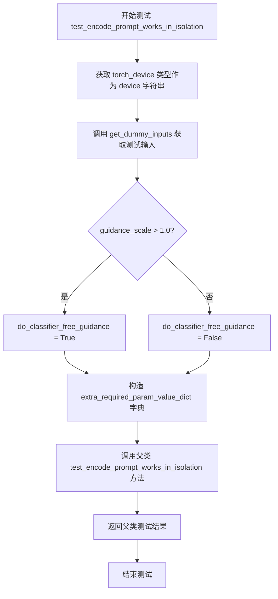

#### 带注释源码

```python
def test_encode_prompt_works_in_isolation(self):
    """
    测试 encode_prompt 方法在隔离环境中是否能正常工作。
    该测试通过调用父类的同名方法实现，需要先准备好额外的参数。
    """
    # 构造包含额外必需参数的字典
    # device: 从全局 torch_device 获取设备类型（如 'cuda', 'cpu', 'mps'）
    # do_classifier_free_guidance: 根据 guidance_scale 是否大于 1.0 决定是否启用分类器自由引导
    extra_required_param_value_dict = {
        "device": torch.device(torch_device).type,
        "do_classifier_free_guidance": self.get_dummy_inputs(device=torch_device).get("guidance_scale", 1.0) > 1.0,
    }
    # 调用父类 PipelineTesterMixin 的测试方法，传入额外的参数字典
    # 父类方法将使用这些参数来配置测试环境
    return super().test_encode_prompt_works_in_isolation(extra_required_param_value_dict)
```


### `StableDiffusionPAGPipelineIntegrationTests.setUp`

该方法是测试类的初始化方法，在每个测试方法执行前被调用，用于执行基础的清理工作，包括调用父类的setUp方法、强制垃圾回收以及清空GPU缓存，以确保测试环境的干净和一致性。

参数：

- `self`：测试类的实例对象，表示当前的测试类实例

返回值：`None`，无返回值

#### 流程图

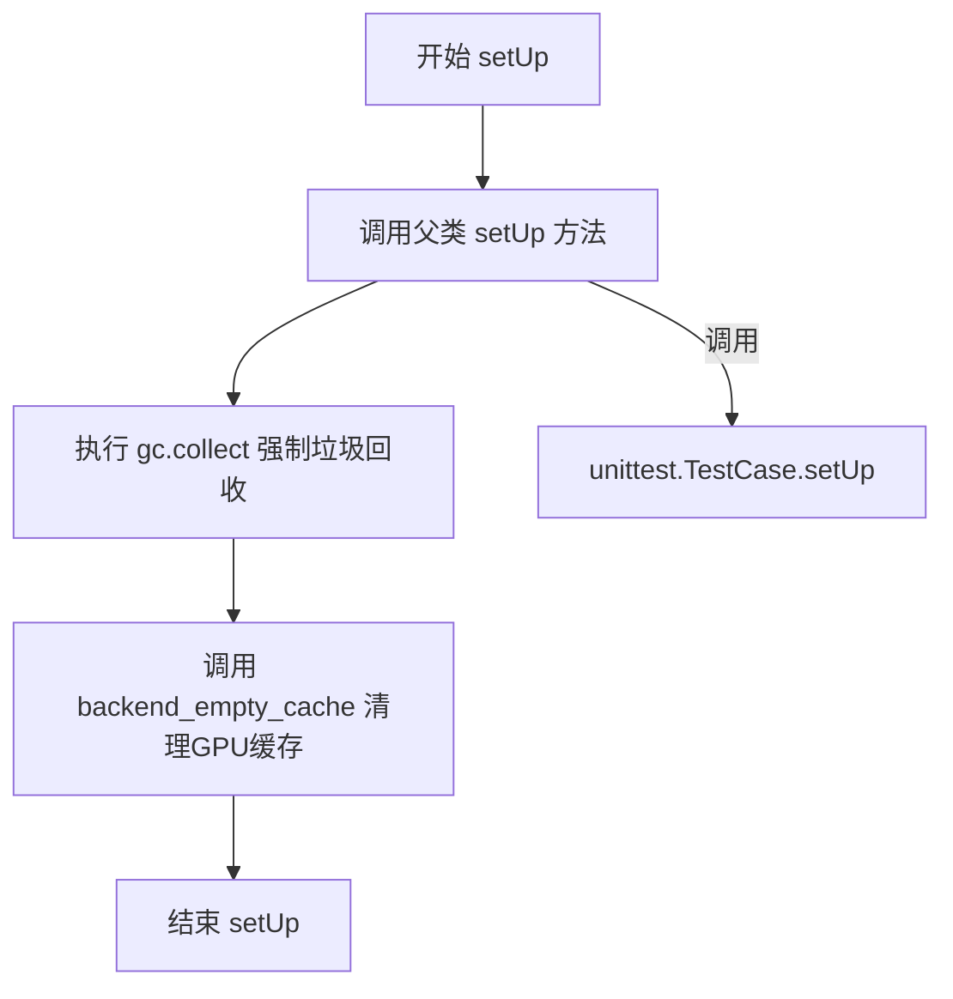

#### 带注释源码

```
def setUp(self):
    # 调用父类 unittest.TestCase 的 setUp 方法
    # 确保测试框架的基础初始化逻辑被执行
    super().setUp()
    
    # 手动触发 Python 的垃圾回收机制
    # 清理当前环境中不再使用的对象，释放内存
    gc.collect()
    
    # 调用后端工具函数清空 GPU 缓存
    # 确保 GPU 内存得到释放，防止测试之间的内存泄漏
    # torch_device 是从 testing_utils 导入的全局变量，表示当前测试使用的设备
    backend_empty_cache(torch_device)
```

#### 详细说明

该方法是 `StableDiffusionPAGPipelineIntegrationTests` 测试类的初始化钩子方法，属于 unittest 测试框架的标准接口。当测试框架运行每个测试方法（如 `test_pag_cfg`、`test_pag_uncond`）之前，会自动调用此方法。

主要职责是确保测试环境的一致性和干净性：
1. 调用父类方法以保持测试框架的兼容性
2. 通过 `gc.collect()` 强制 Python 解释器回收不再引用的对象
3. 通过 `backend_empty_cache(torch_device)` 清空 GPU 显存缓存，这对于在 GPU 上运行深度学习模型的测试尤为重要，可以避免因显存不足导致的测试失败

该方法没有参数（除标准的 `self` 外），也没有返回值，符合 unittest 框架对 `setUp` 方法的约定。


### `StableDiffusionPAGPipelineIntegrationTests.tearDown`

这是 `StableDiffusionPAGPipelineIntegrationTests` 测试类的 teardown 方法，用于在每个测试用例执行完成后进行资源清理工作。该方法继承自 `unittest.TestCase`，通过调用垃圾回收和清空 GPU 缓存来释放测试过程中占用的内存资源，确保测试环境不会因为残留数据而导致内存泄漏或影响后续测试的执行。

参数：

- `self`：`unittest.TestCase`，隐含的实例参数，表示测试类的当前实例

返回值：`None`，无返回值，执行清理操作后直接结束

#### 流程图

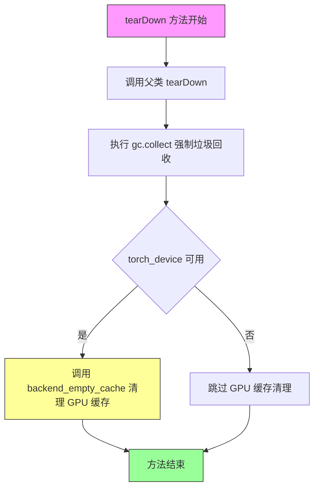

#### 带注释源码

```python
def tearDown(self):
    """
    测试用例结束后的清理方法。
    
    该方法在每个测试方法执行完毕后自动调用，用于清理测试过程中
    产生的临时对象和释放 GPU 内存资源。
    
    注意:
        - 必须调用 super().tearDown() 以确保父类清理逻辑正常执行
        - gc.collect() 强制 Python 垃圾回收器运行，回收测试中创建的循环引用对象
        - backend_empty_cache 清理 GPU 显存，防止显存泄漏
    """
    # 调用父类 (unittest.TestCase) 的 tearDown 方法
    # 确保父类中定义的清理逻辑得以执行
    super().tearDown()
    
    # 强制调用 Python 垃圾回收器
    # 回收测试过程中创建的临时对象和循环引用
    gc.collect()
    
    # 调用后端工具函数清空 GPU 缓存
    # torch_device 是全局变量，表示当前测试使用的 PyTorch 设备
    # 该函数会清理 GPU 显存中的缓存数据
    backend_empty_cache(torch_device)
```


### `StableDiffusionPAGPipelineIntegrationTests.get_inputs`

该方法用于生成调用 Stable Diffusion PAG Pipeline 进行推理所需的输入参数字典，包括提示词、负提示词、生成器、推理步数、引导比例等配置。

参数：

- `self`：`StableDiffusionPAGPipelineIntegrationTests`，测试类的实例
- `device`：`torch.device`，推理目标设备，用于指定 pipeline 执行推理的设备
- `generator_device`：`str`，默认为 `"cpu"`，生成器设备，用于创建随机数生成器
- `seed`：`int`，默认为 `1`，随机种子，用于确保生成结果的可复现性
- `guidance_scale`：`float`，默认为 `7.0`，引导比例（CFG scale），控制文本提示对生成图像的影响程度

返回值：`Dict[str, Any]`，包含以下键值对：
- `prompt` (`str`)：正向提示词
- `negative_prompt` (`str`)：负向提示词
- `generator` (`torch.Generator`)：随机数生成器
- `num_inference_steps` (`int`)：推理步数，固定为 3
- `guidance_scale` (`float`)：CFG 引导比例
- `pag_scale` (`float`)：PAG 比例，固定为 3.0
- `output_type` (`str`)：输出类型，固定为 `"np"` (numpy array)

#### 流程图

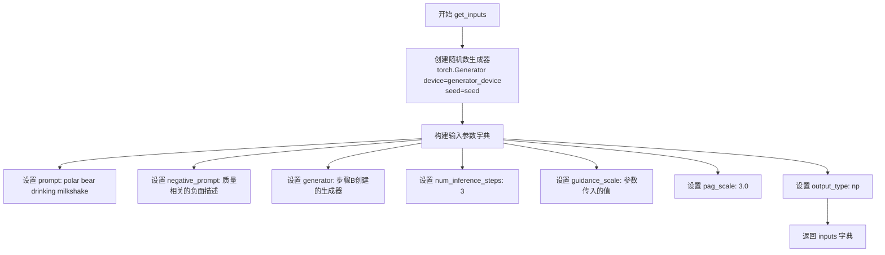

#### 带注释源码

```python
def get_inputs(self, device, generator_device="cpu", seed=1, guidance_scale=7.0):
    """
    生成用于 Stable Diffusion PAG Pipeline 推理的输入参数字典。
    
    参数:
        device: 推理目标设备
        generator_device: 生成器设备，默认为 "cpu"
        seed: 随机种子，默认为 1
        guidance_scale: 引导比例，默认为 7.0
    
    返回:
        包含推理所需参数的字典
    """
    # 根据指定设备创建随机数生成器，并用种子初始化以确保可复现性
    generator = torch.Generator(device=generator_device).manual_seed(seed)
    
    # 构建完整的输入参数字典
    inputs = {
        # 正向提示词：描述期望生成的图像内容
        "prompt": "a polar bear sitting in a chair drinking a milkshake",
        
        # 负向提示词：指定不希望出现的图像特征
        "negative_prompt": "deformed, ugly, wrong proportion, low res, bad anatomy, worst quality, low quality",
        
        # 随机数生成器，确保图像生成的可复现性
        "generator": generator,
        
        # 推理步数： diffusion 模型的迭代次数
        "num_inference_steps": 3,
        
        # 引导比例：控制文本条件对生成的影响程度
        "guidance_scale": guidance_scale,
        
        # PAG 比例：PAG (Prompt Aesthetic Guidance) 强度
        "pag_scale": 3.0,
        
        # 输出类型：返回 numpy 数组格式
        "output_type": "np",
    }
    return inputs
```


### `StableDiffusionPAGPipelineIntegrationTests.test_pag_cfg`

该函数是一个集成测试方法，用于测试StableDiffusionPAGPipeline在启用PAG（Prompt Attention Guidance）和CFG（Classifier-Free Guidance）模式下的图像生成功能。它通过加载预训练模型，执行推理，并验证输出图像是否符合预期的像素值范围来确保管道的正确性。

参数：

- `self`：测试类实例本身，包含类属性如`repo_id`等

返回值：无返回值（`None`），该方法为`unittest.TestCase`的测试方法，通过断言进行验证

#### 流程图

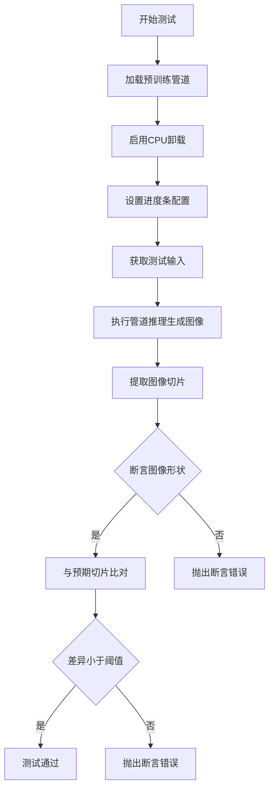

#### 带注释源码

```python
def test_pag_cfg(self):
    """
    测试PAG（Prompt Attention Guidance）与CFG（Classifier-Free Guidance）集成功能
    
    该测试验证StableDiffusionPAGPipeline在启用PAG和CFG模式下的
    图像生成是否符合预期输出
    """
    # 使用AutoPipelineForText2Image加载预训练模型
    # 参数enable_pag=True启用PAG功能
    # torch_dtype=torch.float16使用半精度浮点数以减少显存占用
    pipeline = AutoPipelineForText2Image.from_pretrained(
        self.repo_id, 
        enable_pag=True, 
        torch_dtype=torch.float16
    )
    
    # 启用模型CPU卸载，将不活跃的模块移至CPU以节省显存
    pipeline.enable_model_cpu_offload(device=torch_device)
    
    # 配置进度条，disable=None表示不禁用进度条
    pipeline.set_progress_bar_config(disable=None)

    # 获取测试输入参数，包括prompt、negative_prompt、generator等
    inputs = self.get_inputs(torch_device)
    
    # 执行管道推理，生成图像
    # inputs包含：prompt, negative_prompt, generator, num_inference_steps, 
    #             guidance_scale, pag_scale, output_type
    image = pipeline(**inputs).images

    # 提取图像右下角3x3区域的像素值并展平
    # image[0]取第一张图像，[-3:, -3:, -1]取最后3行、3列、最后一个通道
    image_slice = image[0, -3:, -3:, -1].flatten()
    
    # 断言生成图像的形状为(1, 512, 512, 3)
    assert image.shape == (1, 512, 512, 3)

    # 定义预期的像素值切片
    expected_slice = np.array(
        [0.58251953, 0.5722656, 0.5683594, 0.55029297, 0.52001953, 
         0.52001953, 0.49951172, 0.45410156, 0.50146484]
    )
    
    # 断言实际输出与预期输出的最大差异小于1e-3
    # 确保图像生成结果的数值精度
    assert np.abs(image_slice.flatten() - expected_slice).max() < 1e-3, (
        f"output is different from expected, {image_slice.flatten()}"
    )
```


### `StableDiffusionPAGPipelineIntegrationTests.test_pag_uncond`

该函数是一个集成测试，用于验证 Stable Diffusion PAG 管道在无分类器自由引导（guidance_scale=0.0）条件下的功能是否正常。它加载预训练模型，配置 PAG（Perturbed Attention Guidance）功能，执行推理并验证输出图像是否符合预期。

参数：

- `self`：`unittest.TestCase`，测试类的实例，隐式参数

返回值：`numpy.ndarray`，管道生成的图像数组

#### 流程图

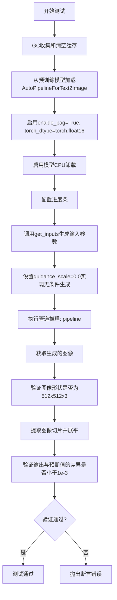

#### 带注释源码

```python
def test_pag_uncond(self):
    """
    测试PAG在无分类器自由引导（guidance_scale=0.0）条件下的功能。
    验证PAG算法在纯随机/无条件生成时仍能正常工作。
    """
    # 从预训练模型加载自动管道，启用PAG功能，使用float16精度
    pipeline = AutoPipelineForText2Image.from_pretrained(
        self.repo_id, 
        enable_pag=True,  # 启用Perturbed Attention Guidance
        torch_dtype=torch.float16  # 使用半精度以加速推理
    )
    
    # 启用模型CPU卸载以节省显存
    pipeline.enable_model_cpu_offload(device=torch_device)
    
    # 配置进度条（disable=None表示不禁用进度条）
    pipeline.set_progress_bar_config(disable=None)

    # 获取输入参数，guidance_scale=0.0表示无分类器自由引导
    # 即只使用无条件生成，不使用条件生成
    inputs = self.get_inputs(torch_device, guidance_scale=0.0)
    
    # 执行管道推理生成图像
    # 这里会使用PAG算法但不使用CFG引导
    image = pipeline(**inputs).images

    # 提取图像右下角3x3区域并展平
    image_slice = image[0, -3:, -3:, -1].flatten()
    
    # 断言输出图像形状为512x512x3
    assert image.shape == (1, 512, 512, 3)
    
    # 预期输出切片值（用于回归测试）
    expected_slice = np.array(
        [0.5986328, 0.52441406, 0.3972168, 0.4741211, 0.34985352, 
         0.22705078, 0.4128418, 0.2866211, 0.31713867]
    )
    
    # 验证实际输出与预期值的最大差异小于阈值
    assert np.abs(image_slice.flatten() - expected_slice).max() < 1e-3, (
        f"output is different from expected, {image_slice.flatten()}"
    )
```

## 关键组件


### StableDiffusionPAGPipelineFastTests

快速测试类，继承多个测试Mixin，用于测试PAG（Progressive Attention Guidance）功能的各项行为，包括禁用/启用、应用层配置和推理结果验证。

### StableDiffusionPAGPipelineIntegrationTests

集成测试类，使用真实模型（stable-diffusion-v1-5）在GPU上测试PAG功能的端到端流程，验证CFG和无条件生成场景。

### get_dummy_components

创建虚拟组件的方法，生成测试所需的UNet、Scheduler、VAE、TextEncoder和Tokenizer等轻量级组件，用于快速单元测试。

### get_dummy_inputs

创建虚拟输入的方法，生成包含prompt、generator、num_inference_steps、guidance_scale、pag_scale等参数的测试输入字典。

### test_pag_disable_enable

测试PAG禁用和启用功能，验证当pag_scale=0时输出与基线pipeline一致，pag_scale>0时输出与基线不同。

### test_pag_applied_layers

测试PAG应用层的配置逻辑，验证不同层名称（如"mid"、"up"、"down"或完整路径）能正确映射到UNet的自注意力层。

### test_pag_inference

测试PAG推理功能，验证PAG pipeline能生成预期尺寸（64x64x3）的图像，并检查输出像素值与预期值的差异。

### _set_pag_attn_processor

内部方法，根据pag_applied_layers参数动态配置UNet的注意力处理器，将标准注意力替换为PAG专用处理器。

### pag_attn_processors

PAG注意力处理器字典，存储被替换为PAG处理器的自注意力层，用于在推理时应用Progressive Attention Guidance。

### PAG (Progressive Attention Guidance)

一种提升Stable Diffusion图像质量的引导技术，通过在推理过程中对自注意力层进行干预来改善生成效果。

### AutoPipelineForText2Image

HuggingFace Diffusers库的自动 pipeline 加载器，支持通过enable_pag=True参数启用PAG功能。


## 问题及建议


### 已知问题

-   **重复代码过多**：`test_pag_applied_layers` 方法中多次重复执行 `pipe.unet.set_attn_processor(original_attn_procs.copy())`，未提取为辅助方法
-   **测试用例不完整**：注释中提到 `"mid_block.attentions.0.transformer_blocks.1.attn1.processor"` 却被注释掉，导致测试覆盖不全面
- **硬编码值过多**：多处使用硬编码的种子值（如 `seed=0`、`seed=1`）、图像尺寸（`64x64`、`512x512`）和魔数（`1e-3`），缺乏常量定义
- **缺少梯度禁用**：推理测试中未使用 `torch.no_grad()` 或 `@torch.no_grad()` 装饰器，会导致不必要的内存消耗
- **集成测试效率低**：`StableDiffusionPAGPipelineIntegrationTests` 每次测试都重新加载模型和执行 `gc.collect()`、`backend_empty_cache()`，缺乏模型缓存机制
- **错误消息可读性差**：部分断言的错误消息格式不规范，如 `f"output is different from expected, {image_slice.flatten()}"` 重复调用 `.flatten()`
- **注释与代码不一致**：如 `test_pag_applied_layers` 中注释描述与实际测试逻辑存在偏差

### 优化建议

-   将 `pipe.unet.set_attn_processor(original_attn_procs.copy())` 提取为测试类的辅助方法（如 `_reset_attn_processor`）
-   定义模块级常量替代硬编码值（如 `DEFAULT_SEED = 0`、`EXPECTED_IMAGE_SIZE = (1, 64, 64, 3)`、`TOLERANCE = 1e-3`）
-   为所有推理测试添加 `@torch.no_grad()` 装饰器或上下文管理器，减少内存占用
-   考虑在 `setUp` 中缓存已加载的模型，或使用 pytest fixtures 实现模型复用
-   统一错误消息格式，避免重复调用 `.flatten()`
-   补全被注释的测试用例，确保 `all_self_attn_mid_layers` 列表完整
-   清理并统一注释与实际代码逻辑的一致性

## 其它


### 设计目标与约束

本文档描述的测试代码旨在验证StableDiffusionPAGPipeline的正确性和功能完整性。设计目标包括：验证PAG（Probabilistic Adaptive Guidance）功能的启用/禁用机制、验证PAG应用层次配置的准确性、确保Pipeline在文本到图像生成任务中的输出符合预期。约束条件包括：测试必须在CPU设备上确保确定性结果、集成测试需要GPU加速器支持、使用固定随机种子以确保可复现性。

### 错误处理与异常设计

代码中的错误处理主要通过unittest框架的assert语句实现。具体包括：使用`np.abs().max() < 1e-3`进行浮点数近似相等判断、使用`with self.assertRaises(ValueError)`捕获并验证PAG层次配置错误时的异常抛出、使用`inspect.signature()`检查参数签名以验证API契约。测试未覆盖运行时资源不足、模型加载失败等场景的错误处理。

### 数据流与状态机

测试数据流如下：get_dummy_components()创建虚拟模型组件 → get_dummy_inputs()生成测试输入参数 → 调用pipeline执行推理 → 验证输出图像维度与像素值。状态机方面：Pipeline经历初始化 → 配置设置 → 前向传播 → 结果验证四个主要状态。测试中的状态转换包括：设备迁移(to(device))、进度条配置(set_progress_bar_config)、注意力处理器设置(_set_pag_attn_processor)。

### 外部依赖与接口契约

核心依赖包括：diffusers库提供的StableDiffusionPAGPipeline、UNet2DConditionModel、DDIMScheduler、AutoencoderKL；transformers库提供的CLIPTextModel、CLIPTokenizer；PyTorch和NumPy提供张量计算能力。接口契约方面：pipeline接受prompt、generator、num_inference_steps、guidance_scale、pag_scale、output_type等参数；返回包含images属性的对象，images维度应为(1, 64, 64, 3)或(1, 512, 512, 3)。

### 测试环境要求

测试环境要求包括：Python 3.8+、PyTorch 2.0+、diffusers库最新稳定版、transformers库、NumPy。硬件要求方面：单元测试可在CPU上运行，集成测试需要至少8GB显存的GPU加速器。环境变量torch_device用于指定计算设备。

### 性能基准与资源需求

单元测试预期执行时间：每个测试方法在1-5秒内完成，主要取决于模型初始化时间。集成测试预期执行时间：每个测试方法在30-120秒完成，受限于扩散模型的推理步数和模型加载时间。内存占用：单元测试约需2-4GB RAM，集成测试约需6-8GB GPU显存。

### 集成测试与持续集成

集成测试通过@slow和@require_torch_accelerator装饰器标记，仅在CI环境中GPU可用时执行。测试流程包括：setUp方法执行gc.collect()和backend_empty_cache()清理资源，tearDown方法执行相同的资源清理操作，确保测试隔离性。

### 测试覆盖范围分析

当前测试覆盖了PAG核心功能：pag_scale参数的影响、pag_applied_layers配置的不同粒度、CFG（Classifier-Free Guidance）模式下的PAG行为、无条件生成时的PAG行为。但缺少以下测试：多批次生成测试、负面提示词影响测试、不同的scheduler类型测试、模型保存与加载测试、内存泄漏检测测试。

### 技术债务与优化空间

代码中存在以下技术债务：测试类继承结构复杂（多层mixin），增加了理解难度；集成测试使用硬编码的repo_id "stable-diffusion-v1-5/stable-diffusion-v1-5"，缺乏灵活性；测试断言使用硬编码的期望像素值数组，当模型更新时需要手动更新；缺少参数化测试，部分测试代码重复。优化方向：可以考虑引入pytest参数化减少代码重复、将期望值抽象为配置文件、添加更多边界条件测试。


    