# `diffusers\tests\pipelines\pag\test_pag_sd3.py` 详细设计文档

这是一个针对 StableDiffusion3PAGPipeline 的单元测试文件，测试了 Stable Diffusion 3 模型在 PAG（Probabilistic Artistic Generation）模式下的各种功能，包括不同提示词处理、QKV投影融合、PAG启用/禁用以及PAG应用层的设置。

## 整体流程

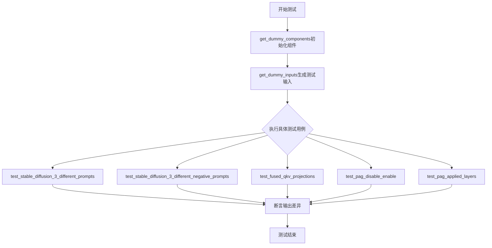

## 类结构

```
unittest.TestCase
└── StableDiffusion3PAGPipelineFastTests (继承PipelineTesterMixin)
    ├── 字段: pipeline_class
    ├── 字段: params
    ├── 字段: batch_params
    ├── 字段: test_xformers_attention
    ├── 方法: get_dummy_components()
    ├── 方法: get_dummy_inputs()
    ├── 方法: test_stable_diffusion_3_different_prompts()
    ├── 方法: test_stable_diffusion_3_different_negative_prompts()
    ├── 方法: test_fused_qkv_projections()
    ├── 方法: test_pag_disable_enable()
    └── 方法: test_pag_applied_layers()
```

## 全局变量及字段


### `torch_device`
    
测试设备标识

类型：`str`
    


### `np`
    
NumPy库

类型：`module`
    


### `torch`
    
PyTorch库

类型：`module`
    


### `inspect`
    
Python检查模块

类型：`module`
    


### `unittest`
    
单元测试框架

类型：`module`
    


### `StableDiffusion3PAGPipelineFastTests.pipeline_class`
    
测试的管道类

类型：`type`
    


### `StableDiffusion3PAGPipelineFastTests.params`
    
管道调用参数集合

类型：`frozenset`
    


### `StableDiffusion3PAGPipelineFastTests.batch_params`
    
批量参数集合

类型：`frozenset`
    


### `StableDiffusion3PAGPipelineFastTests.test_xformers_attention`
    
xformers注意力测试标志

类型：`bool`
    
    

## 全局函数及方法


### `AutoTokenizer.from_pretrained()`

该函数是 Hugging Face Transformers 库中的类方法，用于从预训练模型路径或模型 ID 加载对应的分词器（Tokenizer），支持自动识别不同模型架构的分词器类型。

参数：

- `pretrained_model_name_or_path`：`str`，模型名称（如 "hf-internal-testing/tiny-random-t5"）或本地模型路径

返回值：`PreTrainedTokenizer`，返回加载后的分词器对象，包含词表、特殊标记、编码方法等

#### 流程图

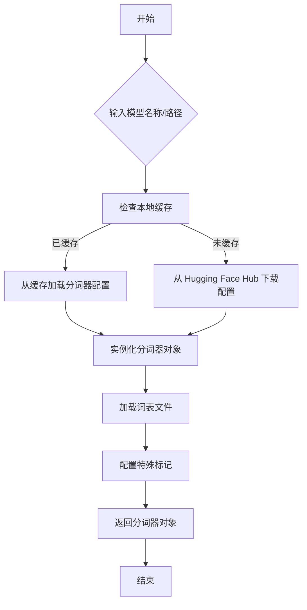

#### 带注释源码

```python
# 从 transformers 库导入 AutoTokenizer 类
from transformers import AutoTokenizer

# 调用类方法 from_pretrained 加载预训练分词器
# 参数: pretrained_model_name_or_path - 模型名称或本地路径
# 返回值: PreTrainedTokenizer 实例
tokenizer_3 = AutoTokenizer.from_pretrained("hf-internal-testing/tiny-random-t5")
```


### `CLIPTextModelWithProjection`

创建并返回一个预训练的CLIP文本编码器模型（带投影层），该模型可以将文本输入编码为固定维度的向量表示，用于Stable Diffusion 3等生成模型的文本条件输入。

参数：

- `config`：`CLIPTextConfig`，CLIP文本编码器的配置对象，包含模型架构参数（如hidden_size、num_hidden_layers、num_attention_heads等）

返回值：`CLIPTextModelWithProjection`，CLIP文本编码器模型实例，包含投影层用于输出文本嵌入

#### 流程图

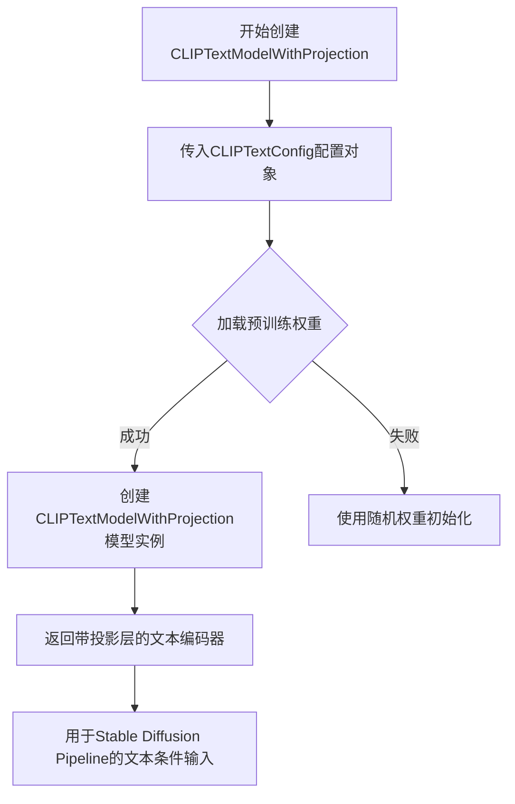

#### 带注释源码

```python
# 定义CLIP文本编码器配置参数
clip_text_encoder_config = CLIPTextModelWithProjection(
    bos_token_id=0,           # 开始 token ID
    eos_token_id=2,           # 结束 token ID
    hidden_size=32,           # 隐藏层维度
    intermediate_size=37,     # 前馈网络中间层维度
    layer_norm_eps=1e-05,     # LayerNorm epsilon
    num_attention_heads=4,   # 注意力头数量
    num_hidden_layers=5,      # 隐藏层数量
    pad_token_id=1,           # 填充 token ID
    vocab_size=1000,          # 词汇表大小
    hidden_act="gelu",        # 激活函数
    projection_dim=32,        # 投影维度
)

# 使用配置创建CLIP文本编码器模型（带投影层）
# 该模型继承自transformers的PreTrainedModel
# 包含文本编码器和投影层，可输出句子级别的文本嵌入
torch.manual_seed(0)
text_encoder = CLIPTextModelWithProjection(clip_text_encoder_config)
```

#### 关键组件信息

| 组件名称 | 一句话描述 |
|---------|-----------|
| `CLIPTextConfig` | CLIP文本编码器的配置类，定义模型架构参数 |
| `CLIPTextModelWithProjection` | Hugging Face transformers库提供的预训练CLIP文本编码器，带投影层输出 |

#### 技术债务与优化空间

1. **硬编码配置**：文本编码器配置参数在`get_dummy_components`方法中硬编码，可考虑外部化配置
2. **模型重复实例化**：代码中创建了三个文本编码器（`text_encoder`、`text_encoder_2`、`text_encoder_3`），其中两个配置相同但分别实例化，可能导致资源浪费
3. **设备迁移缺失**：创建后未显式调用`.to(torch_device)`进行设备迁移，可能导致后续计算在CPU上进行

#### 其它说明

- **设计目标**：为Stable Diffusion 3 Pipeline提供多模态文本编码能力，支持CLIP和T5两种文本编码器
- **外部依赖**：依赖`transformers`库的`CLIPTextModelWithProjection`和`CLIPTextConfig`
- **使用场景**：在`get_dummy_components`中创建，用于单元测试StableDiffusion3PAGPipeline和StableDiffusion3Pipeline


### `T5EncoderModel.from_pretrained()`

从 Hugging Face Hub 或本地路径加载预训练的 T5 编码器模型（`T5EncoderModel`），并返回一个配置好的模型实例。该方法是 `transformers` 库提供的类方法，用于模型的自动下载、缓存和加载。

参数：

- `pretrained_model_name_or_path`：`str`，模型标识符或本地路径，用于指定要加载的预训练模型（如 "hf-internal-testing/tiny-random-t5"）

返回值：`T5EncoderModel`，加载完成的 T5 编码器模型实例，包含模型权重和配置信息

#### 流程图

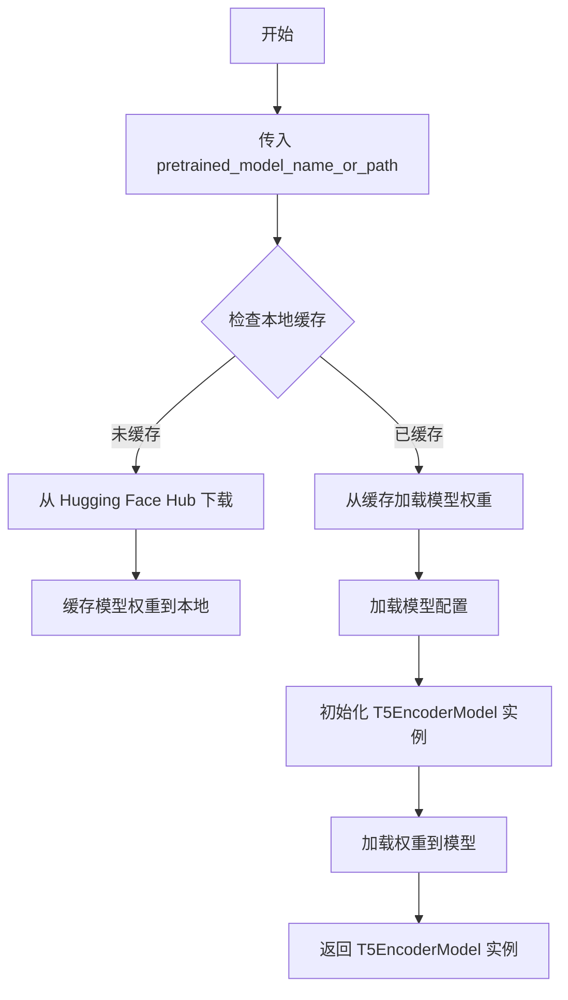

#### 带注释源码

```python
# 从 transformers 库导入 T5EncoderModel
from transformers import T5EncoderModel

# 调用类方法 from_pretrained 加载预训练模型
# 参数: pretrained_model_name_or_path - 模型在 Hugging Face Hub 上的标识符
# 返回值: 加载完成的 T5EncoderModel 实例
text_encoder_3 = T5EncoderModel.from_pretrained("hf-internal-testing/tiny-random-t5")

# 在此测试代码中，该模型被用作 Stable Diffusion 3 pipeline 的第三个文本编码器
# 用于处理第三组 prompt（text_encoder_3 和 tokenizer_3）
```


### `AutoencoderKL`

该函数用于创建一个变分自编码器（VAE）模型，主要用于 Stable Diffusion 3 管道中，将输入图像编码到潜在空间并从潜在空间解码重建图像。

参数：

- `sample_size`：`int`，输入图像的分辨率（高度和宽度）
- `in_channels`：`int`，输入图像的通道数（例如 RGB 图像为 3）
- `out_channels`：`int`，输出图像的通道数
- `block_out_channels`：`tuple`，每个分辨率级别输出通道数的元组
- `layers_per_block`：`int`，每个块中的层数
- `latent_channels`：`int`，潜在空间的通道数
- `norm_num_groups`：`int`，归一化组的数量
- `use_quant_conv`：`bool`，是否使用量化卷积层
- `use_post_quant_conv`：`bool`，是否使用后量化卷积层
- `shift_factor`：`float`，潜在空间的偏移因子
- `scaling_factor`：`float`，潜在空间的缩放因子

返回值：`AutoencoderKL`，返回创建的 VAE 模型实例

#### 流程图

```mermaid
flowchart TD
    A[开始创建 AutoencoderKL] --> B[配置模型参数]
    B --> C[sample_size=32]
    B --> D[in_channels=3]
    B --> E[out_channels=3]
    B --> F[block_out_channels=(4,)]
    B --> G[layers_per_block=1]
    B --> H[latent_channels=4]
    B --> I[norm_num_groups=1]
    B --> J[use_quant_conv=False]
    B --> K[use_post_quant_conv=False]
    B --> L[shift_factor=0.0609]
    B --> M[scaling_factor=1.5035]
    C & D & E & F & G & H & I & J & K & L & M --> N[实例化 AutoencoderKL 模型]
    N --> O[返回 VAE 模型实例]
```

#### 带注释源码

```python
# 创建 AutoencoderKL VAE 模型实例
torch.manual_seed(0)  # 设置随机种子以确保可重复性
vae = AutoencoderKL(
    sample_size=32,              # 输入图像的空间分辨率（32x32）
    in_channels=3,               # RGB 图像有 3 个通道（红、绿、蓝）
    out_channels=3,              # 输出图像同样为 3 个通道
    block_out_channels=(4,),     # 编码器/解码器各层的输出通道数
    layers_per_block=1,          # 每个块中包含的层数
    latent_channels=4,           # 潜在空间的通道数，用于存储压缩后的表示
    norm_num_groups=1,           # 组归一化的组数，用于稳定训练
    use_quant_conv=False,        # 是否使用量化卷积（通常在推理时使用）
    use_post_quant_conv=False,   # 是否使用后量化卷积层
    shift_factor=0.0609,         # 潜在空间的偏移因子，用于调整潜在表示
    scaling_factor=1.5035,       # 潜在空间的缩放因子，用于调整潜在表示的尺度
)
```


### `FlowMatchEulerDiscreteScheduler`

该函数用于创建 FlowMatchEulerDiscreteScheduler 调度器实例，这是 Stable Diffusion 3 管道中使用的离散欧拉调度器，用于在扩散过程中逐步去噪并生成图像。

参数：

- 该函数不接受任何显式参数，使用默认配置

返回值：`FlowMatchEulerDiscreteScheduler`（调度器实例），返回创建的 FlowMatchEulerDiscreteScheduler 调度器对象，用于控制扩散模型的采样过程

#### 流程图

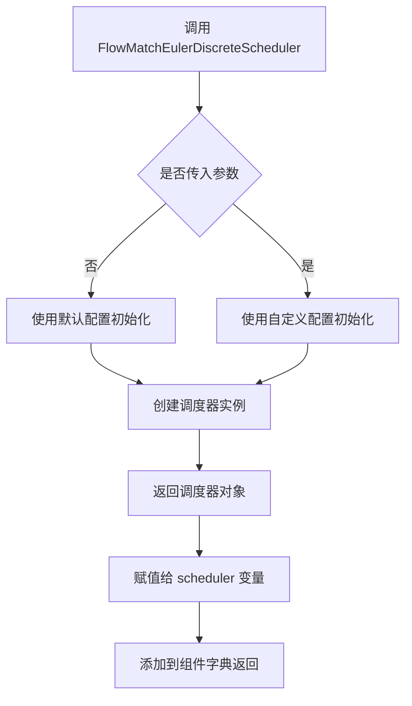

#### 带注释源码

```python
# 在 get_dummy_components 方法中创建调度器
# FlowMatchEulerDiscreteScheduler 是 diffusers 库提供的调度器
# 用于 Stable Diffusion 3 的 Flow Match 采样
scheduler = FlowMatchEulerDiscreteScheduler()

# 将调度器添加到组件字典中
return {
    "scheduler": scheduler,  # 调度器实例，用于控制去噪过程
    "text_encoder": text_encoder,
    "text_encoder_2": text_encoder_2,
    "text_encoder_3": text_encoder_3,
    "tokenizer": tokenizer,
    "tokenizer_2": tokenizer_2,
    "tokenizer_3": tokenizer_3,
    "transformer": transformer,
    "vae": vae,
}
```


### `SD3Transformer2DModel`

SD3Transformer2DModel 是 Stable Diffusion 3 管道中的核心 Transformer 组件，负责将文本嵌入（prompt embeddings）和噪声潜变量（noisy latents）进行联合处理，通过多层 Transformer 块实现文本到图像的特征转换，是实现图像生成的关键神经网络模块。

参数：

- `sample_size`：`int`，输入潜变量的空间尺寸（高度和宽度）
- `patch_size`：`int`，将输入分割为 patches 的大小，用于 patchify 操作
- `in_channels`：`int`，输入通道数，通常为潜在空间的通道数（如 4）
- `num_layers`：`int`，Transformer 块的数量
- `attention_head_dim`：`int`，每个注意力头的维度
- `num_attention_heads`：`int`，注意力头的数量
- `caption_projection_dim`：`int`，文本 caption 嵌入的投影维度，用于将文本特征映射到与潜变量兼容的空间
- `joint_attention_dim`：`int`，联合注意力的维度，支持文本和图像特征的交叉注意力
- `pooled_projection_dim`：`int`，池化后的投影维度，用于输出 logits 或其他聚合特征
- `out_channels`：`int`，输出通道数，通常与输入通道数一致

返回值：`SD3Transformer2DModel`，返回一个初始化后的 Transformer 模型实例，用于后续的推理或训练

#### 流程图

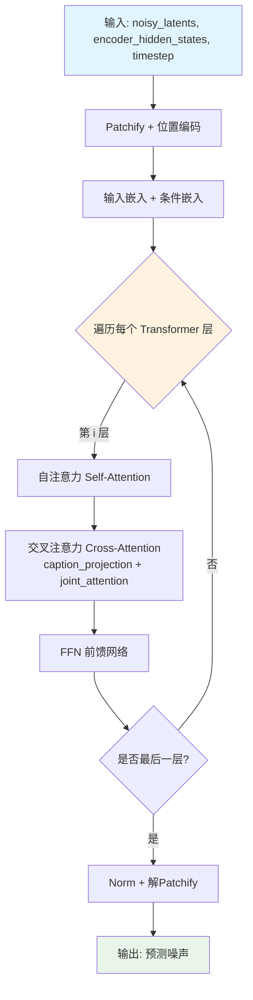

#### 带注释源码

```python
# 在测试中创建虚拟组件时调用 SD3Transformer2DModel
transformer = SD3Transformer2DModel(
    sample_size=32,           # 输入潜变量的空间尺寸 32x32
    patch_size=1,             # patch 大小为 1，可能用于最小粒度处理
    in_channels=4,           # 输入通道数，对应 VAE 潜在空间的通道数
    num_layers=2,             # 2 层 Transformer 块，用于快速测试
    attention_head_dim=8,    # 每个注意力头的维度为 8
    num_attention_heads=4,   # 4 个注意力头，总注意力维度 4*8=32
    caption_projection_dim=32,  # 文本嵌入投影到 32 维空间
    joint_attention_dim=32,     # 联合注意力维度，支持文本-图像交互
    pooled_projection_dim=64,   # 池化投影输出维度
    out_channels=4,            # 输出通道数，与输入保持一致
)
```


### `check_qkv_fusion_matches_attn_procs_length`

检查QKV融合后的注意力处理器数量是否与原始注意力处理器数量相匹配，确保融合操作没有丢失任何注意力处理器。

参数：

-  `model`：`SD3Transformer2DModel`，需要进行QKV融合检查的Transformer模型
-  `original_attn_processors`：`dict`，原始的注意力处理器字典，键为处理器名称，值为处理器实例

返回值：`bool`，如果融合后的处理器数量与原始处理器数量相匹配返回True，否则返回False

#### 流程图

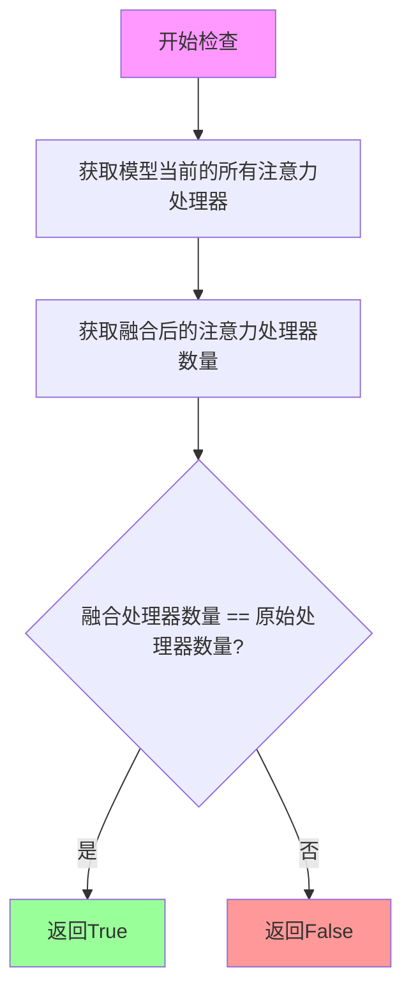

#### 带注释源码

```
# 此函数定义在 ..test_pipelines_common 模块中
# 从提供的代码中无法看到其完整实现，但根据调用上下文可以推断其逻辑：

def check_qkv_fusion_matches_attn_procs_length(model, original_attn_processors):
    """
    检查QKV融合后的处理器数量是否与原始处理器数量匹配
    
    参数:
        model: SD3Transformer2DModel实例，已经执行了fuse_qkv_projections()的模型
        original_attn_processors: 字典，融合前的原始注意力处理器
    
    返回值:
        bool: 融合后的处理器数量是否与原始数量一致
    """
    # 1. 获取融合后模型的所有注意力处理器
    # 2. 比较融合后的处理器数量与原始处理器数量
    # 3. 如果数量一致，说明融合操作正确保留了所有处理器
    # 4. 如果数量不一致，说明融合过程中可能丢失了某些处理器
    
    # 根据调用示例:
    # check_qkv_fusion_matches_attn_procs_length(
    #     pipe.transformer, 
    #     pipe.transformer.original_attn_processors
    # )
    
    fused_attn_processors = model.attn_processors
    return len(fused_attn_processors) == len(original_attn_processors)
```

#### 补充说明

该函数是diffusers库中用于测试QKV融合功能的辅助函数，主要用于验证：

1. **融合完整性**：确保`fuse_qkv_projections()`方法没有丢失任何注意力处理器
2. **向后兼容性**：验证融合后的模型仍然保持与原始模型相同的处理器结构
3. **测试覆盖**：在`test_fused_qkv_projections`测试方法中使用，确保QKV融合功能的正确性


### `check_qkv_fusion_processors_exist`

该函数用于检查transformer模型中的所有注意力处理器是否都已成功融合为QKV融合处理器。这是Stable Diffusion 3模型中QKV投影融合功能测试的一部分，确保融合后的注意力处理器符合预期。

参数：

- `transformer`：`torch.nn.Module`（具体为`SD3Transformer2DModel`），需要检查的transformer模型对象

返回值：`bool`，如果所有注意力处理器都已融合返回`True`，否则返回`False`

#### 流程图

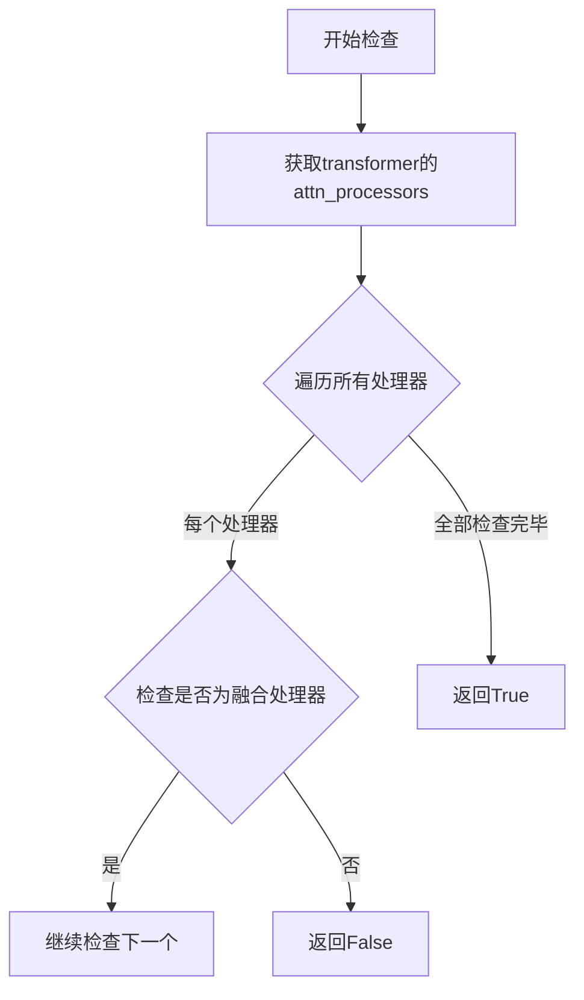

#### 带注释源码

由于该函数是从`..test_pipelines_common`模块导入的，其实现不在当前代码文件中。以下是基于使用方式的推断：

```python
def check_qkv_fusion_processors_exist(transformer):
    """
    检查transformer模型中的所有注意力处理器是否都已融合为QKV融合处理器。
    
    参数:
        transformer: 包含attn_processors属性的模型对象
        
    返回:
        bool: 所有处理器都融合返回True，否则返回False
    """
    # 获取所有注意力处理器
    attn_processors = transformer.attn_processors
    
    # 遍历每个处理器，检查是否都是融合类型的处理器
    for name, processor in attn_processors.items():
        # 检查处理器是否为融合处理器类型
        # 如果存在未融合的处理器，返回False
        if not is_fused_processor(processor):
            return False
    
    # 所有处理器都已融合
    return True
```

**调用示例（来自代码）：**

```python
# 在test_fused_qkv_projections方法中调用
pipe.transformer.fuse_qkv_projections()  # 先融合QKV投影
assert check_qkv_fusion_processors_exist(pipe.transformer), (
    "Something wrong with the fused attention processors. Expected all the attention processors to be fused."
)
```


### `StableDiffusion3PAGPipelineFastTests.get_dummy_components`

该方法用于初始化并返回一个包含 Stable Diffusion 3 模型所需的所有虚拟（测试）组件的字典，包括文本编码器、VAE、Transformer、调度器等，以便进行单元测试。

参数：
- `self`：`StableDiffusion3PAGPipelineFastTests`，隐式参数，表示当前测试类实例

返回值：`dict`，返回一个键值对字典，包含测试所需的虚拟组件（scheduler、text_encoder、text_encoder_2、text_encoder_3、tokenizer、tokenizer_2、tokenizer_3、transformer、vae）

#### 流程图

```mermaid
flowchart TD
    A[开始 get_dummy_components] --> B[设置随机种子 torch.manual_seed(0)]
    B --> C[创建虚拟 SD3Transformer2DModel]
    C --> D[创建 CLIPTextConfig 配置]
    D --> E[创建虚拟 CLIPTextModelWithProjection text_encoder]
    E --> F[创建虚拟 CLIPTextModelWithProjection text_encoder_2]
    F --> G[加载预训练 T5EncoderModel text_encoder_3]
    G --> H[加载 CLIPTokenizer tokenizer 和 tokenizer_2]
    H --> I[加载 AutoTokenizer tokenizer_3]
    I --> J[创建虚拟 AutoencoderKL vae]
    J --> K[创建 FlowMatchEulerDiscreteScheduler scheduler]
    K --> L[组装并返回组件字典]
```

#### 带注释源码

```python
def get_dummy_components(self):
    """
    初始化并返回测试用的虚拟组件字典。
    该方法创建用于单元测试的虚拟模型组件，确保测试可重复执行。
    """
    # 设置随机种子以确保测试结果的可重复性
    torch.manual_seed(0)
    
    # 创建虚拟的 SD3Transformer2DModel（核心扩散变换器）
    transformer = SD3Transformer2DModel(
        sample_size=32,           # 输入样本尺寸
        patch_size=1,             # 补丁大小
        in_channels=4,            # 输入通道数
        num_layers=2,             # 变换器层数
        attention_head_dim=8,     # 注意力头维度
        num_attention_heads=4,    # 注意力头数量
        caption_projection_dim=32,  # 标题投影维度
        joint_attention_dim=32,    # 联合注意力维度
        pooled_projection_dim=64,  # 池化投影维度
        out_channels=4,           # 输出通道数
    )
    
    # 配置 CLIP 文本编码器参数
    clip_text_encoder_config = CLIPTextConfig(
        bos_token_id=0,           # 起始符 ID
        eos_token_id=2,           # 结束符 ID
        hidden_size=32,           # 隐藏层大小
        intermediate_size=37,     # 中间层大小
        layer_norm_eps=1e-05,     # 层归一化 epsilon
        num_attention_heads=4,    # 注意力头数
        num_hidden_layers=5,      # 隐藏层数
        pad_token_id=1,           # 填充符 ID
        vocab_size=1000,          # 词汇表大小
        hidden_act="gelu",        # 隐藏层激活函数
        projection_dim=32,        # 投影维度
    )

    # 创建虚拟的 CLIPTextModelWithProjection（文本编码器1）
    torch.manual_seed(0)
    text_encoder = CLIPTextModelWithProjection(clip_text_encoder_config)

    # 创建虚拟的 CLIPTextModelWithProjection（文本编码器2）
    torch.manual_seed(0)
    text_encoder_2 = CLIPTextModelWithProjection(clip_text_encoder_config)

    # 加载虚拟的 T5 编码器（文本编码器3）
    text_encoder_3 = T5EncoderModel.from_pretrained("hf-internal-testing/tiny-random-t5")

    # 加载虚拟的分词器
    tokenizer = CLIPTokenizer.from_pretrained("hf-internal-testing/tiny-random-clip")
    tokenizer_2 = CLIPTokenizer.from_pretrained("hf-internal-testing/tiny-random-clip")
    tokenizer_3 = AutoTokenizer.from_pretrained("hf-internal-testing/tiny-random-t5")

    # 创建虚拟的 VAE（变分自编码器）
    torch.manual_seed(0)
    vae = AutoencoderKL(
        sample_size=32,           # 样本尺寸
        in_channels=3,            # 输入通道数
        out_channels=3,           # 输出通道数
        block_out_channels=(4,),  # 块输出通道数
        layers_per_block=1,       # 每块层数
        latent_channels=4,        # 潜在空间通道数
        norm_num_groups=1,        # 归一化组数
        use_quant_conv=False,     # 是否使用量化卷积
        use_post_quant_conv=False, # 是否使用后量化卷积
        shift_factor=0.0609,      # 偏移因子
        scaling_factor=1.5035,    # 缩放因子
    )

    # 创建调度器（欧拉离散调度器）
    scheduler = FlowMatchEulerDiscreteScheduler()

    # 返回包含所有虚拟组件的字典
    return {
        "scheduler": scheduler,
        "text_encoder": text_encoder,
        "text_encoder_2": text_encoder_2,
        "text_encoder_3": text_encoder_3,
        "tokenizer": tokenizer,
        "tokenizer_2": tokenizer_2,
        "tokenizer_3": tokenizer_3,
        "transformer": transformer,
        "vae": vae,
    }
```


### `StableDiffusion3PAGPipelineFastTests.get_dummy_inputs`

生成虚拟输入数据，用于测试 StableDiffusion3PAGPipeline。

参数：

- `self`：测试类实例本身（隐含参数），代表当前测试类的实例
- `device`：`torch.device` 或 `str`，目标设备，用于判断是否为 MPS 设备
- `seed`：`int`，随机种子，默认为 0，用于确保测试的可重复性

返回值：`dict`，包含以下键值对的字典：
- `prompt`（str）：测试用的提示词
- `generator`（torch.Generator）：随机数生成器
- `num_inference_steps`（int）：推理步数
- `guidance_scale`（float）：引导 scale
- `output_type`（str）：输出类型
- `pag_scale`（float）：PAG scale

#### 流程图

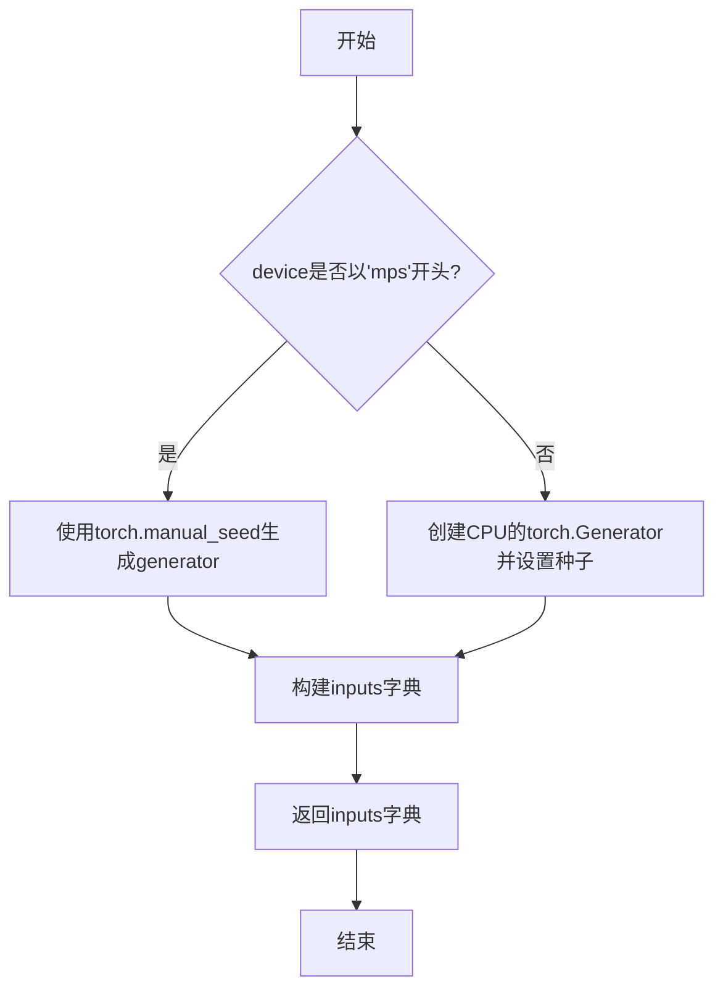

#### 带注释源码

```python
def get_dummy_inputs(self, device, seed=0):
    """
    生成虚拟输入数据，用于测试 StableDiffusion3PAGPipeline。
    
    参数:
        device: 目标设备，用于判断是否为 MPS 设备
        seed: 随机种子，确保测试的可重复性
    
    返回:
        包含虚拟输入的字典
    """
    # 判断设备是否为 MPS (Apple Silicon)
    if str(device).startswith("mps"):
        # MPS 设备使用 torch.manual_seed
        generator = torch.manual_seed(seed)
    else:
        # 其他设备使用 CPU 上的 Generator
        generator = torch.Generator(device="cpu").manual_seed(seed)

    # 构建测试所需的输入参数字典
    inputs = {
        "prompt": "A painting of a squirrel eating a burger",  # 测试用提示词
        "generator": generator,  # 随机数生成器，确保确定性
        "num_inference_steps": 2,  # 推理步数
        "guidance_scale": 5.0,  # Classifier-free guidance scale
        "output_type": "np",  # 输出为 numpy 数组
        "pag_scale": 0.0,  # PAG (Perturbed Attention Guidance) scale，0 表示禁用
    }
    return inputs
```


### `StableDiffusion3PAGPipelineFastTests.test_stable_diffusion_3_different_prompts`

该测试方法用于验证 StableDiffusion3PAGPipeline 在使用不同提示词（prompt、prompt_2、prompt_3）时能够产生明显不同的输出图像，确保多提示词条件下的图像生成逻辑正常工作。

参数：

- `self`：`unittest.TestCase`，测试类的实例自身

返回值：`None`，该方法为测试方法，无返回值，通过断言验证结果

#### 流程图

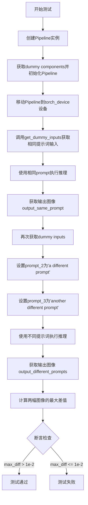

#### 带注释源码

```python
def test_stable_diffusion_3_different_prompts(self):
    """
    测试方法：验证使用不同提示词时Pipeline输出不同的图像
    
    测试流程：
    1. 创建Pipeline并加载虚拟组件
    2. 使用相同提示词生成图像
    3. 使用不同提示词生成图像
    4. 断言两次输出存在明显差异
    """
    # 步骤1: 创建Pipeline实例，使用虚拟组件并移动到指定设备
    pipe = self.pipeline_class(**self.get_dummy_components()).to(torch_device)

    # 步骤2: 获取虚拟输入参数（包含默认prompt）
    inputs = self.get_dummy_inputs(torch_device)
    # 使用相同提示词"A painting of a squirrel eating a burger"执行推理
    # 获取第一张生成的图像
    output_same_prompt = pipe(**inputs).images[0]

    # 步骤3: 重新获取输入参数，修改多提示词
    inputs = self.get_dummy_inputs(torch_device)
    # 设置第二个提示词（用于多提示词条件生成）
    inputs["prompt_2"] = "a different prompt"
    # 设置第三个提示词
    inputs["prompt_3"] = "another different prompt"
    # 使用不同的提示词组合执行推理
    output_different_prompts = pipe(**inputs).images[0]

    # 步骤4: 计算两张图像之间的最大绝对差值
    max_diff = np.abs(output_same_prompt - output_different_prompts).max()

    # 断言：验证使用不同提示词时输出确实不同
    # 差值应该大于阈值1e-2，证明多提示词功能正常工作
    assert max_diff > 1e-2
```


### `StableDiffusion3PAGPipelineFastTests.test_stable_diffusion_3_different_negative_prompts`

该测试方法用于验证 StableDiffusion3PAGPipeline 在使用不同负提示词（negative_prompt）时能够生成不同的图像输出，确保负提示词对图像生成过程产生实际影响。

参数：

- `self`：`StableDiffusion3PAGPipelineFastTests`，测试类实例本身，包含测试所需的资源和配置

返回值：`None`，无返回值（测试方法，通过断言验证行为）

#### 流程图

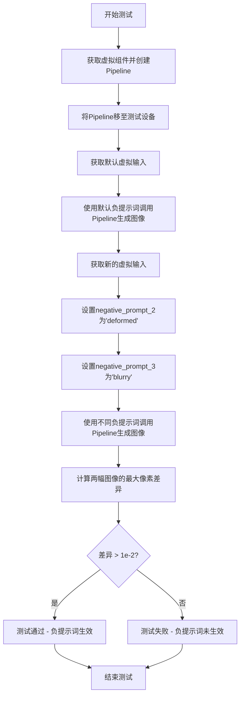

#### 带注释源码

```python
def test_stable_diffusion_3_different_negative_prompts(self):
    """
    测试负提示词对SD3 PAG Pipeline输出的影响
    
    验证当提供不同的负提示词时，生成的图像应该有所不同。
    这确保了负提示词功能在Pipeline中正常工作。
    """
    # 使用虚拟组件创建Pipeline实例并移至测试设备
    # 虚拟组件通过get_dummy_components()方法生成，包含模型、tokenizer等
    pipe = self.pipeline_class(**self.get_dummy_components()).to(torch_device)

    # 获取默认的虚拟输入参数
    # 包含prompt、generator、num_inference_steps等推理所需参数
    inputs = self.get_dummy_inputs(torch_device)
    
    # 第一次推理：使用默认负提示词（未设置negative_prompt参数）
    # 生成基准图像用于后续比较
    output_same_prompt = pipe(**inputs).images[0]

    # 获取另一组虚拟输入用于第二次推理
    inputs = self.get_dummy_inputs(torch_device)
    
    # 设置第二个文本编码器的负提示词
    # 负提示词用于指导模型避免生成特定内容
    inputs["negative_prompt_2"] = "deformed"
    
    # 设置第三个文本编码器的负提示词
    inputs["negative_prompt_3"] = "blurry"
    
    # 第二次推理：使用不同的负提示词
    # 期望生成与第一次不同的图像
    output_different_prompts = pipe(**inputs).images[0]

    # 计算两幅图像之间的最大绝对像素差异
    # 使用numpy的abs函数计算差异矩阵，然后取最大值
    max_diff = np.abs(output_same_prompt - output_different_prompts).max()

    # 断言：验证负提示词确实改变了输出
    # 如果差异小于等于1e-2，则说明负提示词未生效，测试失败
    # 期望差异大于0.01（1e-2）
    assert max_diff > 1e-2
```


### `StableDiffusion3PAGPipelineFastTests.test_fused_qkv_projections`

该测试方法验证 StableDiffusion3PAGPipeline 中 QKV（Query-Key-Value）投影融合功能是否正常工作，确保融合前后输出结果一致，且融合与解融操作不影响最终生成图像的质量。

参数：

- `self`：无，类实例方法的隐式参数

返回值：`None`，该方法为测试用例，通过断言验证功能正确性，不返回具体数据

#### 流程图

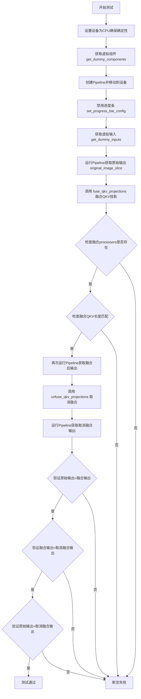

#### 带注释源码

```python
def test_fused_qkv_projections(self):
    """
    测试QKV投影融合功能是否正常工作
    
    测试流程：
    1. 创建pipeline并生成原始输出
    2. 融合QKV投影后生成输出，验证输出一致
    3. 取消融合后生成输出，验证与原始输出一致
    """
    # 步骤1: 设置设备为CPU，确保torch.Generator的确定性
    device = "cpu"
    
    # 步骤2: 获取虚拟组件（用于测试的轻量级模型配置）
    components = self.get_dummy_components()
    
    # 步骤3: 创建pipeline并移动到指定设备
    pipe = self.pipeline_class(**components)
    pipe = pipe.to(device)
    
    # 步骤4: 设置进度条配置（disable=None表示不禁用进度条）
    pipe.set_progress_bar_config(disable=None)
    
    # 步骤5: 获取虚拟输入参数
    inputs = self.get_dummy_inputs(device)
    
    # 步骤6: 运行pipeline获取原始输出（融合前）
    image = pipe(**inputs).images
    # 提取图像右下角3x3区域用于比较
    original_image_slice = image[0, -3:, -3:, -1]
    
    # 步骤7: 调用transformer的fuse_qkv_projections方法融合QKV投影
    # 融合后多个attention head的QKV矩阵会合并为一个矩阵，提高推理效率
    pipe.transformer.fuse_qkv_projections()
    
    # 步骤8: 验证融合后的attention processors是否存在
    assert check_qkv_fusion_processors_exist(pipe.transformer), (
        "Something wrong with the fused attention processors. "
        "Expected all the attention processors to be fused."
    )
    
    # 步骤9: 验证融合后的QKV投影与原始attention processors数量匹配
    assert check_qkv_fusion_matches_attn_procs_length(
        pipe.transformer, pipe.transformer.original_attn_processors
    ), "Something wrong with the attention processors concerning the fused QKV projections."
    
    # 步骤10: 使用融合后的QKV投影再次运行pipeline
    inputs = self.get_dummy_inputs(device)
    image = pipe(**inputs).images
    image_slice_fused = image[0, -3:, -3:, -1]
    
    # 步骤11: 调用unfuse_qkv_projections取消QKV投影融合
    pipe.transformer.unfuse_qkv_projections()
    
    # 步骤12: 使用取消融合后的配置运行pipeline
    inputs = self.get_dummy_inputs(device)
    image = pipe(**inputs).images
    image_slice_disabled = image[0, -3:, -3:, -1]
    
    # 步骤13: 断言验证 - 融合QKV投影不应影响输出结果
    assert np.allclose(original_image_slice, image_slice_fused, atol=1e-3, rtol=1e-3), (
        "Fusion of QKV projections shouldn't affect the outputs."
    )
    
    # 步骤14: 断言验证 - 融合与取消融合的输出应该一致
    assert np.allclose(image_slice_fused, image_slice_disabled, atol=1e-3, rtol=1e-3), (
        "Outputs, with QKV projection fusion enabled, shouldn't change when fused QKV projections are disabled."
    )
    
    # 步骤15: 断言验证 - 原始输出与取消融合后的输出应匹配（允许更大误差）
    assert np.allclose(original_image_slice, image_slice_disabled, atol=1e-2, rtol=1e-2), (
        "Original outputs should match when fused QKV projections are disabled."
    )
```


### `StableDiffusion3PAGPipelineFastTests.test_pag_disable_enable`

该测试方法验证了PAG（Prompt Attention Guidance）功能的启用和禁用逻辑，通过对比基线管道（无PAG参数）与PAG管道在`pag_scale=0`时的输出是否一致，来确认PAG禁用功能工作正常。

参数：

- `self`：`StableDiffusion3PAGPipelineFastTests`，测试类的实例本身

返回值：`None`，无返回值（测试方法）

#### 流程图

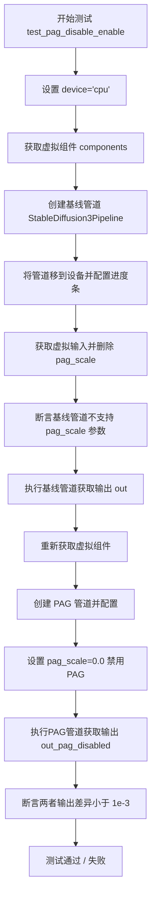

#### 带注释源码

```python
def test_pag_disable_enable(self):
    """
    测试PAG（Prompt Attention Guidance）功能的启用和禁用。
    验证当 pag_scale=0 时，PAG管道的输出应与基线管道一致。
    """
    # 确保确定性，使用 CPU 设备
    device = "cpu"  # ensure determinism for the device-dependent torch.Generator
    
    # 获取虚拟组件（transformer、text_encoder、vae、scheduler等）
    components = self.get_dummy_components()

    # ========== 基线管道测试（无PAG） ==========
    # 创建基线管道（不带PAG功能的普通SD3管道）
    pipe_sd = StableDiffusion3Pipeline(**components)
    pipe_sd = pipe_sd.to(device)
    pipe_sd.set_progress_bar_config(disable=None)

    # 获取虚拟输入参数
    inputs = self.get_dummy_inputs(device)
    # 删除 pag_scale 参数，确保基线管道不使用该参数
    del inputs["pag_scale"]
    
    # 断言：验证基线管道不应该有 pag_scale 参数
    assert "pag_scale" not in inspect.signature(pipe_sd.__call__).parameters, (
        f"`pag_scale` should not be a call parameter of the base pipeline {pipe_sd.__class__.__name__}."
    )
    
    # 执行基线管道，获取输出图像（最后3x3像素块）
    out = pipe_sd(**inputs).images[0, -3:, -3:, -1]

    # ========== PAG 管道测试（pag_scale=0 禁用PAG） ==========
    # 重新获取虚拟组件（确保独立性）
    components = self.get_dummy_components()

    # 创建 PAG 管道（带有PAG功能的管道）
    pipe_pag = self.pipeline_class(**components)
    pipe_pag = pipe_pag.to(device)
    pipe_pag.set_progress_bar_config(disable=None)

    # 获取虚拟输入
    inputs = self.get_dummy_inputs(device)
    # 设置 pag_scale=0.0 以禁用PAG功能
    inputs["pag_scale"] = 0.0
    
    # 执行PAG管道，获取输出图像
    out_pag_disabled = pipe_pag(**inputs).images[0, -3:, -3:, -1]

    # 断言：验证禁用PAG后的输出与基线管道输出一致
    # 允许的最大差异阈值为 1e-3
    assert np.abs(out.flatten() - out_pag_disabled.flatten()).max() < 1e-3, (
        "PAG disabled output should match base pipeline output when pag_scale=0"
    )
```


### `StableDiffusion3PAGPipelineFastTests.test_pag_applied_layers`

该测试方法用于验证 PAG（Prompt Attention Guidance）应用层的设置功能，通过不同的层配置方式（如精确层名称、正则表达式等）来测试 `_set_pag_attn_processor` 方法是否能正确设置 PAG 注意力处理器。

参数：

- `self`：无参数类型，表示类实例本身

返回值：无返回值类型（`None`），该测试方法无显式返回值，仅通过断言验证逻辑

#### 流程图

```mermaid
flowchart TD
    A[开始测试 test_pag_applied_layers] --> B[设置 device = cpu]
    B --> C[获取虚拟组件 components]
    C --> D[创建并初始化 pipeline]
    E[获取所有带 attn 的注意力处理器层名称]
    F[保存原始注意力处理器]
    G[测试1: pag_layers = blocks.0, blocks.1]
    H{断言: pag_attn_processors == all_self_attn_layers}
    I[测试2: pag_layers = blocks.0]
    J{断言: pag_attn_processors == block_0_self_attn}
    K[测试3: pag_layers = blocks.0.attn]
    L{断言: pag_attn_processors == block_0_self_attn}
    M[测试4: pag_layers = blocks.(0|1] 正则]
    N{断言: len(pag_attn_processors) == 2}
    O[测试5: pag_layers = blocks.0, blocks\.1]
    P{断言: len(pag_attn_processors) == 2}
    Q[结束测试]
    
    D --> E
    E --> F
    F --> G
    G --> H
    H --> I
    I --> J
    J --> K
    K --> L
    L --> M
    M --> N
    N --> O
    O --> P
    P --> Q
```

#### 带注释源码

```python
def test_pag_applied_layers(self):
    """测试 PAG 应用层的设置功能，验证不同层配置下 PAG 注意力处理器的设置是否正确"""
    
    # 设置设备为 CPU，确保随机数生成器的确定性
    device = "cpu"  # ensure determinism for the device-dependent torch.Generator
    
    # 获取虚拟组件用于测试
    components = self.get_dummy_components()

    # base pipeline - 创建并初始化基础管道
    pipe = self.pipeline_class(**components)
    pipe = pipe.to(device)
    pipe.set_progress_bar_config(disable=None)

    # 获取所有包含 'attn' 的自注意力层名称
    all_self_attn_layers = [k for k in pipe.transformer.attn_processors.keys() if "attn" in k]
    
    # 保存原始注意力处理器，以便后续测试重置
    original_attn_procs = pipe.transformer.attn_processors
    
    # 测试1: 设置多个层 blocks.0 和 blocks.1，应包含所有自注意力层
    pag_layers = ["blocks.0", "blocks.1"]
    pipe._set_pag_attn_processor(pag_applied_layers=pag_layers, do_classifier_free_guidance=False)
    assert set(pipe.pag_attn_processors) == set(all_self_attn_layers)

    # 测试2: 仅设置 blocks.0，应只包含第一个 transformer block 的注意力处理器
    block_0_self_attn = ["transformer_blocks.0.attn.processor"]
    pipe.transformer.set_attn_processor(original_attn_procs.copy())
    pag_layers = ["blocks.0"]
    pipe._set_pag_attn_processor(pag_applied_layers=pag_layers, do_classifier_free_guidance=False)
    assert set(pipe.pag_attn_processors) == set(block_0_self_attn)

    # 测试3: 使用 blocks.0.attn 格式，应等效于 blocks.0
    pipe.transformer.set_attn_processor(original_attn_procs.copy())
    pag_layers = ["blocks.0.attn"]
    pipe._set_pag_attn_processor(pag_applied_layers=pag_layers, do_classifier_free_guidance=False)
    assert set(pipe.pag_attn_processors) == set(block_0_self_attn)

    # 测试4: 使用正则表达式 blocks.(0|1)，匹配两个块
    pipe.transformer.set_attn_processor(original_attn_procs.copy())
    pag_layers = ["blocks.(0|1)"]
    pipe._set_pag_attn_processor(pag_applied_layers=pag_layers, do_classifier_free_guidance=False)
    assert (len(pipe.pag_attn_processors)) == 2

    # 测试5: 混合使用字符串和转义字符 blocks.0 和 blocks\.1
    pipe.transformer.set_attn_processor(original_attn_procs.copy())
    pag_layers = ["blocks.0", r"blocks\.1"]
    pipe._set_pag_attn_processor(pag_applied_layers=pag_layers, do_classifier_free_guidance=False)
    assert len(pipe.pag_attn_processors) == 2
```

## 关键组件


### StableDiffusion3PAGPipelineFastTests

核心功能测试类，继承自unittest.TestCase和PipelineTesterMixin，用于测试Stable Diffusion 3的PAG（Perturbed Attention Guidance）流水线功能，包括多提示词支持、QKV融合投影以及PAG启用/禁用逻辑。

### get_dummy_components

创建虚拟的diffusers组件（包括SD3Transformer2DModel、多个CLIP文本编码器、T5编码器、VAE和调度器），用于单元测试的依赖注入，返回包含所有模型组件的字典。

### get_dummy_inputs

生成虚拟推理输入参数，包含提示词、随机数生成器、推理步数、guidance_scale、output_type和pag_scale，返回符合管道调用规范的输入字典。

### test_stable_diffusion_3_different_prompts

测试多提示词（prompt/prompt_2/prompt_3）功能，验证不同提示词生成的图像存在显著差异（max_diff > 1e-2）。

### test_stable_diffusion_3_different_negative_prompts

测试多负面提示词（negative_prompt/negative_prompt_2/negative_prompt_3）功能，验证不同负面提示词对生成结果的影响。

### test_fused_qkv_projections

测试transformer的QKV投影融合功能，验证fuse_qkv_projections()和unfuse_qkv_projections()方法不影响输出结果，包含注意力处理器融合状态的检查。

### test_pag_disable_enable

测试PAG功能的启用和禁用逻辑，验证当pag_scale=0时PAG管道输出与基础管道输出一致。

### test_pag_applied_layers

测试PAG应用的层级配置，支持正则表达式（如"blocks.(0|1)"）和字符串列表方式指定注意力处理器，验证_set_pag_attn_processor方法的层级过滤功能。

### SD3Transformer2DModel

虚拟的SD3 Transformer 2D模型配置，包含2层、4个注意力头、8维注意力头维度、32维投影维度等参数。

### CLIPTextModelWithProjection

双CLIP文本编码器（text_encoder和text_encoder_2），用于文本到嵌入的转换，支持双提示词联合注意力。

### T5EncoderModel

第三文本编码器（text_encoder_3），基于T5架构，提供额外的文本编码能力。

### AutoencoderKL

VAE模型，用于潜在空间的编解码，配置了量化卷积相关参数（use_quant_conv、use_post_quant_conv）。

### FlowMatchEulerDiscreteScheduler

基于Flow Matching的Euler离散调度器，用于 diffusion 过程的噪声调度。

### PipelineTesterMixin

测试混入类，提供流水线通用测试方法，包括QKV融合检查函数（check_qkv_fusion_matches_attn_procs_length、check_qkv_fusion_processors_exist）。


## 问题及建议


### 已知问题

-   **多提示测试逻辑缺陷**：`test_stable_diffusion_3_different_prompts` 和 `test_stable_diffusion_3_different_negative_prompts` 方法中虽然设置了 `prompt_2`、`prompt_3` 或 `negative_prompt_2`、`negative_prompt_3` 参数，但传递给管道的 `inputs` 字典中只包含了默认的 `prompt`，未实际传递多提示参数，导致测试无法验证多提示功能
-   **硬编码设备不一致**：部分测试方法（如 `test_fused_qkv_projections`、`test_pag_disable_enable`、`test_pag_applied_layers`）硬编码使用 `"cpu"` 设备，而 `get_dummy_inputs` 方法会根据设备类型（特别是 MPS）调整 generator 创建方式，这种不一致可能导致某些设备上的测试行为差异
-   **TODO 注释遗留**：代码中存在 TODO 注释（`# TODO (sayakpaul): will refactor this once fuse_qkv_projections() has been added to the pipeline level.`），表明相关功能尚未完全集成到 pipeline 层面，存在技术债务
-   **变量命名与实际逻辑不符**：变量 `output_same_prompt` 在两个测试方法中实际存储的是不同提示的输出结果，命名具有误导性
-   **缺乏资源清理**：测试类中没有使用 `setUp`/`tearDown` 方法进行资源管理，pipeline 对象在使用后未被显式释放，可能导致显存占用
-   **正则表达式测试覆盖不足**：`test_pag_applied_layers` 中对正则表达式 `"blocks.(0|1)"` 和 `r"blocks\.1"` 的测试逻辑基本重复，缺少对更复杂正则模式的验证

### 优化建议

-   修复多提示测试：在传递 `inputs` 时显式包含 `prompt_2`、`prompt_3`（或 `negative_prompt_2`、`negative_prompt_3`）参数，确保测试真正验证多提示功能
-   统一设备管理：在测试类中引入 `setUp` 方法统一设置测试设备，避免在各个测试方法中硬编码设备类型
-   消除 TODO：推动完成 `fuse_qkv_projections()` 在 pipeline 级别的集成，或创建跟踪 Issue
-   改进变量命名：使用更准确的变量名如 `output_with_default_prompt` 或 `output_base_prompt`
-   添加资源清理：实现 `tearDown` 方法或在测试后显式删除 pipeline 对象以释放 GPU 显存
-   增强测试覆盖：添加更多正则表达式边界情况的测试，并验证无效正则表达式时的错误处理

## 其它


### 设计目标与约束

本测试文件旨在验证StableDiffusion3PAGPipeline的核心功能，包括多提示词处理、负提示词处理、QKV融合投影、PAG（Progressive Attention Guidance）禁用启用以及PAG应用层配置等功能。测试采用虚拟（dummy）组件进行单元测试，确保pipeline在CPU设备上的确定性行为。测试约束包括：设备限定为CPU以保证确定性、不测试xformers注意力机制（test_xformers_attention=False）、以及使用固定的随机种子确保测试可重复性。

### 错误处理与异常设计

测试中主要使用assert语句进行验证，包括：1）验证不同提示词产生不同输出的max_diff > 1e-2；2）验证QKV融合后输出与原始输出一致性（np.allclose with atol=1e-3, rtol=1e-3）；3）验证PAG禁用时与基础pipeline输出一致性（max_diff < 1e-3）；4）验证PAG应用层设置的正确性（set比较）。当断言失败时，unittest框架会自动捕获并报告错误位置和详细信息。

### 数据流与状态机

测试数据流如下：get_dummy_components()创建虚拟的transformer、text_encoder、vae、scheduler等组件 → get_dummy_inputs()生成包含prompt、generator、num_inference_steps、guidance_scale等参数的输入字典 → 调用pipeline.__call__(**inputs)执行推理 → 验证输出的images。状态机方面：pipeline经历初始化（加载组件）→ 设置设备 → 执行推理 → 返回结果的过程；PAG相关测试还涉及fuse_qkv_projections()和unfuse_qkv_projections()的状态切换。

### 外部依赖与接口契约

主要外部依赖包括：1）transformers库提供CLIPTextModelWithProjection、CLIPTokenizer、T5EncoderModel、AutoTokenizer；2）diffusers库提供AutoencoderKL、FlowMatchEulerDiscreteScheduler、SD3Transformer2DModel、StableDiffusion3PAGPipeline、StableDiffusion3Pipeline；3）numpy用于数组比较；4）torch用于张量操作。接口契约方面：pipeline接受prompt、generator、num_inference_steps、guidance_scale、output_type、pag_scale等参数；返回包含images属性的对象；get_dummy_components()返回包含scheduler、text_encoder、tokenizer等键的字典。

### 配置与参数说明

测试中的关键配置参数包括：1）pipeline_class指定为StableDiffusion3PAGPipeline；2）params和batch_params定义可测试的参数集合；3）get_dummy_components()中transformer配置sample_size=32、patch_size=1、in_channels=4、num_layers=2、attention_head_dim=8、num_attention_heads=4；4）vae配置latent_channels=4、shift_factor=0.0609、scaling_factor=1.5035；5）get_dummy_inputs()中num_inference_steps=2、guidance_scale=5.0、pag_scale=0.0。这些配置确保测试在最小化资源消耗的同时覆盖核心功能路径。

### 测试覆盖范围

本测试文件覆盖以下测试场景：1）test_stable_diffusion_3_different_prompts：验证多提示词（prompt_2、prompt_3）产生不同输出；2）test_stable_diffusion_3_different_negative_prompts：验证多负提示词（negative_prompt_2、negative_prompt_3）产生不同输出；3）test_fused_qkv_projections：验证QKV融合投影功能不影响输出正确性；4）test_pag_disable_enable：验证PAG禁用时与基础pipeline输出一致；5）test_pag_applied_layers：验证PAG应用层的正确设置，包括精确匹配和正则表达式匹配。

### 性能考量

测试在CPU设备上执行以确保确定性，num_inference_steps设为2以减少计算时间。test_fused_qkv_projections中进行了三次推理（原始、融合、取消融合），可通过优化减少重复计算。虚拟组件（tiny-random模型）大幅降低了资源需求，但可能无法完全反映真实模型的性能特征。测试中使用torch.manual_seed(0)和np.random确保可重复性。

### 兼容性考虑

代码对设备兼容性做了处理：get_dummy_inputs()中针对mps设备使用torch.manual_seed(seed)，其他设备使用torch.Generator(device="cpu")。当前测试明确指定device="cpu"以确保确定性。测试未覆盖CUDA、mps等设备的特定行为，可能存在设备相关的问题未被检测。PAG相关功能假设transformer具有attn_processors属性和fuse/unfuse_qkv_projections方法，对其他架构的兼容性需进一步验证。

### 测试数据管理

测试使用虚拟组件而非真实预训练模型：text_encoder和text_encoder_2使用相同的CLIPTextConfig配置；text_encoder_3使用T5EncoderModel.from_pretrained("hf-internal-testing/tiny-random-t5")；tokenizer系列使用hf-internal-testing/tiny-random-*。这些虚拟模型来自Hugging Face的测试仓库，确保测试可在离线环境下运行。所有随机种子统一使用0（torch.manual_seed(0)），确保测试结果的可重复性。

    