# `diffusers\tests\pipelines\pag\test_pag_sd3_img2img.py` 详细设计文档

这是Stable Diffusion 3的PAG（Progressive Attention Guidance）图像到图像转换管道的单元测试和集成测试代码，用于验证PAG功能在禁用/启用状态下的行为以及推理效果。

## 整体流程

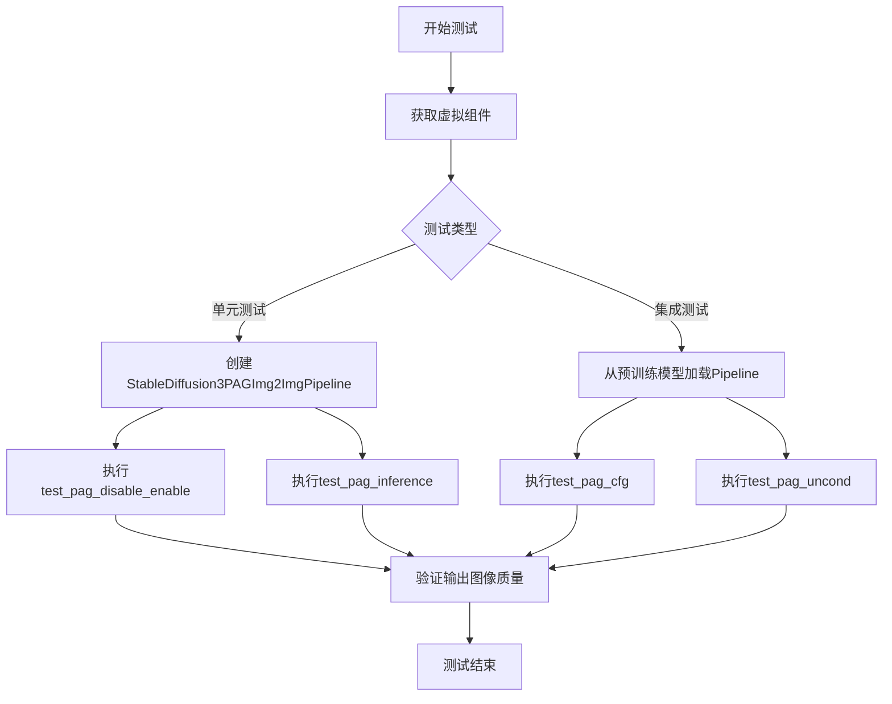

## 类结构

```
unittest.TestCase
├── StableDiffusion3PAGImg2ImgPipelineFastTests (单元测试)
│   ├── get_dummy_components()
│   ├── get_dummy_inputs()
│   ├── test_pag_disable_enable()
│   └── test_pag_inference()
└── StableDiffusion3PAGImg2ImgPipelineIntegrationTests (集成测试)
├── setUp()
├── tearDown()
├── get_inputs()
├── test_pag_cfg()
└── test_pag_uncond()
```

## 全局变量及字段


### `enable_full_determinism`
    
启用完全确定性以确保测试可重复性的全局函数调用

类型：`function`
    


### `StableDiffusion3PAGImg2ImgPipelineFastTests.pipeline_class`
    
指定要测试的Stable Diffusion 3 PAG图像到图像管道类

类型：`Type[StableDiffusion3PAGImg2ImgPipeline]`
    


### `StableDiffusion3PAGImg2ImgPipelineFastTests.params`
    
包含文本引导图像变化参数加上pag_scale和pag_adaptive_scale的集合，不包含height和width

类型：`set`
    


### `StableDiffusion3PAGImg2ImgPipelineFastTests.required_optional_params`
    
管道可选参数的集合，从基类中移除了latents参数

类型：`set`
    


### `StableDiffusion3PAGImg2ImgPipelineFastTests.batch_params`
    
批量文本引导图像变化测试的参数集合

类型：`set`
    


### `StableDiffusion3PAGImg2ImgPipelineFastTests.image_params`
    
图像到图像测试的图像参数集合

类型：`set`
    


### `StableDiffusion3PAGImg2ImgPipelineFastTests.image_latens_params`
    
图像到图像测试中图像和潜在变量的参数集合

类型：`set`
    


### `StableDiffusion3PAGImg2ImgPipelineFastTests.callback_cfg_params`
    
文本到图像回调配置参数集合，用于CFG调度

类型：`set`
    


### `StableDiffusion3PAGImg2ImgPipelineFastTests.test_xformers_attention`
    
标志位，指示是否测试xFormers注意力机制实现

类型：`bool`
    


### `StableDiffusion3PAGImg2ImgPipelineIntegrationTests.pipeline_class`
    
指定要测试的Stable Diffusion 3 PAG图像到图像管道类

类型：`Type[StableDiffusion3PAGImg2ImgPipeline]`
    


### `StableDiffusion3PAGImg2ImgPipelineIntegrationTests.repo_id`
    
HuggingFace模型仓库标识符，指向stable-diffusion-3-medium-diffusers预训练模型

类型：`str`
    
    

## 全局函数及方法


### `gc.collect`

Python 标准库中的垃圾回收函数，用于显式触发垃圾回收过程，回收无法访问的对象并释放内存。

**注意**：在给定的代码中，`gc.collect` 被用于测试类的 `setUp` 和 `tearDown` 方法中，用于在测试前后清理内存。

参数：

- 该函数不需要任何参数

返回值：`int`，返回回收的对象数量

#### 流程图

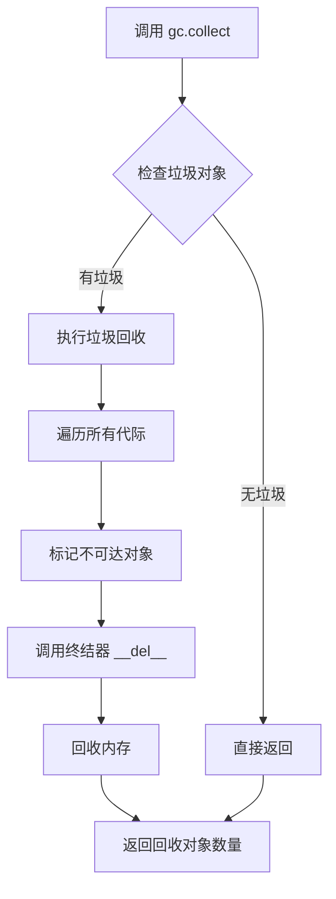

#### 带注释源码

```python
import gc

# 在 setUp 方法中使用
def setUp(self):
    super().setUp()
    gc.collect()  # 显式触发垃圾回收，清理之前测试遗留的对象
    backend_empty_cache(torch_device)  # 清理 GPU 缓存

# 在 tearDown 方法中使用  
def tearDown(self):
    super().tearDown()
    gc.collect()  # 显式触发垃圾回收，清理当前测试创建的对象
    backend_empty_cache(torch_device)  # 清理 GPU 缓存

# gc.collect() 的实现原理（简化版）
def collect generational=None:
    """
    显式运行完整的垃圾回收器。
    
    参数:
        generational: 如果指定了代际编号，则只收集该代际的对象；
                     如果为 None，则收集所有代际。
    
    返回值:
        回收的对象数量
    """
    # 1. 遍历所有对象，标记不可达对象
    # 2. 处理有 __del__ 方法的对象
    # 3. 回收标记为不可达的对象
    # 4. 根据代际调整回收策略
    pass
```

#### 关键技术点

1. **代际回收**：Python 使用分代垃圾回收机制，对象根据存活时间分为不同代际（0、1、2代）
2. **自动触发**：通常由解释器自动触发，但在测试环境中手动调用可以确保更干净的测试环境
3. **与 GPU 内存配合**：在深度学习测试中，通常配合 `backend_empty_cache` 一起使用，同时清理 Python 堆内存和 GPU 显存


# StableDiffusion3PAGImg2ImgPipeline 测试代码详细设计文档

## 一段话描述

该代码是 Stable Diffusion 3 (SD3) 图像到图像（Image-to-Image）管道的 PAG（Perturbed Attention Guidance）变体的测试套件，包含快速单元测试和慢速集成测试，用于验证 PAG 功能在禁用/启用状态下的行为以及推理过程中的正确性。

## 文件的整体运行流程

```
┌─────────────────────────────────────────────────────────────────────────┐
│                        测试套件初始化                                     │
│  ├── enable_full_determinism() - 启用完全确定性                          │
│  └── 定义测试类：StableDiffusion3PAGImg2ImgPipelineFastTests            │
│      └── StableDiffusion3PAGImg2ImgPipelineIntegrationTests             │
└─────────────────────────────────────────────────────────────────────────┘
                                    │
                                    ▼
┌─────────────────────────────────────────────────────────────────────────┐
│                    FastTests（单元测试）                                 │
│  ├── get_dummy_components() - 创建虚拟模型组件                           │
│  ├── get_dummy_inputs() - 创建虚拟输入数据                               │
│  ├── test_pag_disable_enable() - 测试PAG禁用/启用                       │
│  └── test_pag_inference() - 测试PAG推理                                 │
└─────────────────────────────────────────────────────────────────────────┘
                                    │
                                    ▼
┌─────────────────────────────────────────────────────────────────────────┐
│                 IntegrationTests（集成测试）                            │
│  ├── setUp() - 清理GPU内存                                              │
│  ├── tearDown() - 清理GPU内存                                           │
│  ├── get_inputs() - 加载真实图像和生成器                                  │
│  ├── test_pag_cfg() - 测试PAG条件引导                                    │
│  └── test_pag_uncond() - 测试PAG无条件引导                               │
└─────────────────────────────────────────────────────────────────────────┘
```

## 类的详细信息

### 类：StableDiffusion3PAGImg2ImgPipelineFastTests

**描述**：SD3 PAG图像到图像管道的快速单元测试类，继承自 unittest.TestCase 和 PipelineTesterMixin。

**类字段**：
- `pipeline_class`：类型 `type`，测试的管道类
- `params`：类型 `set`，测试参数集合
- `required_optional_params`：类型 `set`，必需的可选参数
- `batch_params`：类型 `set`，批处理参数
- `image_params`：类型 `set`，图像参数
- `image_latens_params`：类型 `set`，图像潜在参数
- `callback_cfg_params`：类型 `set`，回调配置参数
- `test_xformers_attention`：类型 `bool`，是否测试xformers注意力

**类方法**：
- `get_dummy_components(self)` - 获取虚拟组件
- `get_dummy_inputs(self, device, seed=0)` - 获取虚拟输入
- `test_pag_disable_enable(self)` - 测试PAG禁用启用
- `test_pag_inference(self)` - 测试PAG推理

### 类：StableDiffusion3PAGImg2ImgPipelineIntegrationTests

**描述**：SD3 PAG图像到图像管道的慢速集成测试类，用于真实模型测试。

**类字段**：
- `pipeline_class`：类型 `type`，测试的管道类
- `repo_id`：类型 `str`，模型仓库ID

**类方法**：
- `setUp(self)` - 测试前设置
- `tearDown(self)` - 测试后清理
- `get_inputs(self, device, generator_device="cpu", dtype=torch.float32, seed=0, guidance_scale=7.0, pag_scale=0.7)` - 获取测试输入
- `test_pag_cfg(self)` - 测试PAG条件引导
- `test_pag_uncond(self)` - 测试PAG无条件引导

---

## 全局变量和全局函数

### 全局变量：`enable_full_determinism`

**描述**：从 testing_utils 导入的函数，用于启用测试的完全确定性，确保测试结果可复现。

### 全局变量：`pipeline_class` (类内)

**描述**：在测试类中定义为 `StableDiffusion3PAGImg2ImgPipeline`，是被测试的管道类。

### 全局变量：`repo_id` (类内)

**描述**：模型仓库标识符 `"stabilityai/stable-diffusion-3-medium-diffusers"`。

---

## 关键方法详情

### `StableDiffusion3PAGImg2ImgPipelineFastTests.get_dummy_components`

#### 参数

- `self`：隐式参数，测试类实例

#### 返回值

- `dict`，包含所有虚拟组件的字典（scheduler, text_encoder, text_encoder_2, text_encoder_3, tokenizer, tokenizer_2, tokenizer_3, transformer, vae）

#### 流程图

```mermaid
flowchart TD
    A[开始 get_dummy_components] --> B[设置随机种子 torch.manual_seed(0)]
    B --> C[创建 SD3Transformer2DModel]
    C --> D[创建 CLIPTextConfig]
    D --> E[创建 CLIPTextModelWithProjection x2]
    E --> F[创建 T5EncoderModel]
    F --> G[创建 CLIPTokenizer x2]
    G --> H[创建 AutoTokenizer]
    H --> I[创建 AutoencoderKL]
    I --> J[创建 FlowMatchEulerDiscreteScheduler]
    J --> K[返回组件字典]
```

#### 带注释源码

```python
def get_dummy_components(self):
    """创建用于测试的虚拟模型组件"""
    torch.manual_seed(0)  # 设置随机种子以确保可复现性
    
    # 创建SD3 Transformer模型 - 用于图像生成的核心transformer
    transformer = SD3Transformer2DModel(
        sample_size=32,
        patch_size=1,
        in_channels=4,
        num_layers=2,
        attention_head_dim=8,
        num_attention_heads=4,
        caption_projection_dim=32,
        joint_attention_dim=32,
        pooled_projection_dim=64,
        out_channels=4,
    )
    
    # 创建CLIP文本编码器配置
    clip_text_encoder_config = CLIPTextConfig(
        bos_token_id=0,
        eos_token_id=2,
        hidden_size=32,
        intermediate_size=37,
        layer_norm_eps=1e-05,
        num_attention_heads=4,
        num_hidden_layers=5,
        pad_token_id=1,
        vocab_size=1000,
        hidden_act="gelu",
        projection_dim=32,
    )

    torch.manual_seed(0)  # 重新设置种子
    
    # 创建第一个文本编码器 (CLIP)
    text_encoder = CLIPTextModelWithProjection(clip_text_encoder_config)
    
    # 创建第二个文本编码器 (CLIP)
    text_encoder_2 = CLIPTextModelWithProjection(clip_text_encoder_config)
    
    # 创建第三个文本编码器 (T5)
    text_encoder_3 = T5EncoderModel.from_pretrained("hf-internal-testing/tiny-random-t5")

    # 创建tokenizer
    tokenizer = CLIPTokenizer.from_pretrained("hf-internal-testing/tiny-random-clip")
    tokenizer_2 = CLIPTokenizer.from_pretrained("hf-internal-testing/tiny-random-clip")
    tokenizer_3 = AutoTokenizer.from_pretrained("hf-internal-testing/tiny-random-t5")

    torch.manual_seed(0)  # 重新设置种子
    
    # 创建VAE (Variational Autoencoder) 用于图像编码/解码
    vae = AutoencoderKL(
        sample_size=32,
        in_channels=3,
        out_channels=3,
        block_out_channels=(4,),
        layers_per_block=1,
        latent_channels=4,
        norm_num_groups=1,
        use_quant_conv=False,
        use_post_quant_conv=False,
        shift_factor=0.0609,
        scaling_factor=1.5035,
    )

    # 创建调度器 - 控制去噪过程
    scheduler = FlowMatchEulerDiscreteScheduler()

    # 返回所有组件的字典
    return {
        "scheduler": scheduler,
        "text_encoder": text_encoder,
        "text_encoder_2": text_encoder_2,
        "text_encoder_3": text_encoder_3,
        "tokenizer": tokenizer,
        "tokenizer_2": tokenizer_2,
        "tokenizer_3": tokenizer_3,
        "transformer": transformer,
        "vae": vae,
    }
```

---

### `StableDiffusion3PAGImg2ImgPipelineFastTests.get_dummy_inputs`

#### 参数

- `self`：隐式参数，测试类实例
- `device`：类型 `str`，目标设备（如 "cpu", "cuda"）
- `seed`：类型 `int`，随机种子，默认值 0

#### 返回值

- `dict`，包含测试输入的字典

#### 流程图

```mermaid
flowchart TD
    A[开始 get_dummy_inputs] --> B[创建随机图像 floats_tensor]
    B --> C[归一化图像到 [0, 1]]
    C --> D{设备是 MPS?}
    D -->|是| E[使用 torch.manual_seed]
    D -->|否| F[使用 CPU Generator]
    E --> G[构建输入字典]
    F --> G
    G --> H[返回输入字典]
```

#### 带注释源码

```python
def get_dummy_inputs(self, device, seed=0):
    """创建用于测试的虚拟输入数据"""
    # 创建形状为 (1, 3, 32, 32) 的随机浮点数张量
    # 表示 batch_size=1, 3通道 RGB, 32x32 分辨率
    image = floats_tensor((1, 3, 32, 32), rng=random.Random(seed)).to(device)
    
    # 将图像归一化到 [0, 1] 范围
    # 原始 floats_tensor 范围是 [-1, 1]，通过 /2+0.5 转换到 [0, 1]
    image = image / 2 + 0.5
    
    # 根据设备类型创建随机数生成器
    # MPS (Apple Silicon) 需要特殊处理
    if str(device).startswith("mps"):
        generator = torch.manual_seed(seed)
    else:
        # 其他设备使用CPU生成器
        generator = torch.Generator(device="cpu").manual_seed(seed)

    # 构建完整的输入参数字典
    inputs = {
        "prompt": "A painting of a squirrel eating a burger",  # 文本提示
        "image": image,                    # 输入图像
        "generator": generator,            # 随机生成器确保可复现
        "num_inference_steps": 2,          # 推理步数（快速测试用）
        "guidance_scale": 5.0,             # CFG引导强度
        "output_type": "np",               # 输出类型为numpy数组
        "pag_scale": 0.7,                  # PAG引导强度
    }
    return inputs
```

---

### `StableDiffusion3PAGImg2ImgPipelineIntegrationTests.get_inputs`

#### 参数

- `self`：隐式参数，测试类实例
- `device`：类型 `str`，目标设备
- `generator_device`：类型 `str`，生成器设备，默认值 "cpu"
- `dtype`：类型 `torch.dtype`，数据类型，默认值 torch.float32
- `seed`：类型 `int`，随机种子，默认值 0
- `guidance_scale`：类型 `float`，引导强度，默认值 7.0
- `pag_scale`：类型 `float`，PAG引导强度，默认值 0.7

#### 返回值

- `dict`，包含测试输入的字典

#### 流程图

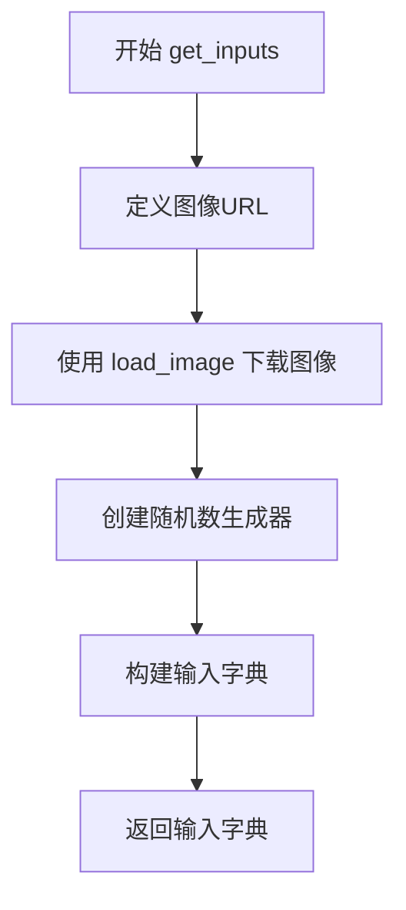

#### 带注释源码

```python
def get_inputs(
    self, device, generator_device="cpu", dtype=torch.float32, seed=0, guidance_scale=7.0, pag_scale=0.7
):
    """创建用于集成测试的输入数据，使用真实图像"""
    
    # 图像URL - 用于测试的示例图像
    img_url = (
        "https://huggingface.co/datasets/huggingface/documentation-images/resolve/main/diffusers/sdxl-text2img.png"
    )
    
    # 加载远程图像
    init_image = load_image(img_url)

    # 创建随机数生成器，用于确保推理过程的可复现性
    generator = torch.Generator(device=generator_device).manual_seed(seed)
    
    # 构建完整的输入参数字典
    inputs = {
        "prompt": "an astronaut in a space suit walking through a jungle",  # 文本提示
        "generator": generator,                     # 随机生成器
        "image": init_image,                         # 初始图像（用于img2img）
        "num_inference_steps": 12,                   # 推理步数
        "strength": 0.6,                             # 图像变换强度
        "guidance_scale": guidance_scale,            # CFG引导强度
        "pag_scale": pag_scale,                      # PAG引导强度
        "output_type": "np",                         # 输出为numpy数组
    }
    return inputs
```

---

## 潜在的技术债务或优化空间

1. **硬编码的种子值**：多处使用 `torch.manual_seed(0)`，可能导致测试覆盖不足，建议使用参数化测试覆盖更多随机场景。

2. **重复的组件创建逻辑**：`get_dummy_components()` 在多个测试方法中被重复调用，可以提取为 fixture。

3. **集成测试使用 @slow 标记**：真实模型推理耗时较长，考虑是否可以使用更小的模型进行快速集成测试验证。

4. **设备硬编码**：`device = "cpu"` 在快速测试中硬编码，可能不适合所有测试环境。

5. **魔法数字**：如 `num_inference_steps=2`, `guidance_scale=5.0`, `pag_scale=0.7` 等应提取为类常量。

6. **缺少错误处理**：测试中没有对异常情况的验证测试。

7. **URL硬编码**：图像URL硬编码在方法内部，如果URL失效测试将失败。

## 其它项目

### 设计目标与约束

- **确定性要求**：通过 `enable_full_determinism()` 确保测试可复现
- **设备兼容性**：支持 CPU、MPS、CUDA 多种设备
- **测试分层**：分为快速单元测试（FastTests）和慢速集成测试（IntegrationTests）

### 错误处理与异常设计

- 使用 `assert` 语句进行结果验证
- 使用 `np.abs().max() < 1e-3` 进行浮点数近似比较
- 集成测试继承 `unittest.TestCase` 使用标准测试框架

### 数据流与状态机

```
输入数据流：
  prompt + image → tokenizer → text_encoder → 文本嵌入
                                   ↓
  image → vae.encode() → 图像潜在表示
                                   ↓
  潜在表示 + 文本嵌入 → transformer (PAG) → 去噪循环
                                   ↓
  vae.decode() → 输出图像
```

### 外部依赖与接口契约

- **diffusers 库**：核心管道 StableDiffusion3PAGImg2ImgPipeline
- **transformers 库**：文本编码器 (CLIPTextModelWithProjection, T5EncoderModel)
- **numpy**：数值比较
- **torch**：深度学习框架
- **testing_utils**：测试辅助工具

### inspect.signature 提取示例

根据用户要求，提取关键方法的签名信息：

| 方法名称 | 参数 | 返回类型 |
|---------|------|---------|
| `get_dummy_components` | `self` | `Dict[str, Any]` |
| `get_dummy_inputs` | `self, device: str, seed: int = 0` | `Dict[str, Any]` |
| `get_inputs` | `self, device: str, generator_device: str = "cpu", dtype: torch.dtype = float32, seed: int = 0, guidance_scale: float = 7.0, pag_scale: float = 0.7` | `Dict[str, Any]` |
| `test_pag_disable_enable` | `self` | `None` |
| `test_pag_inference` | `self` | `None` |
| `test_pag_cfg` | `self` | `None` |
| `test_pag_uncond` | `self` | `None` |
| `setUp` | `self` | `None` |
| `tearDown` | `self` | `None` |


### random.Random

这是 Python 标准库 `random` 模块中的 `Random` 类，在代码中用于创建一个独立于全局随机状态的随机数生成器实例，以确保测试的确定性。

参数：

- `seed`：`int`，随机数生成器的种子值，用于确保测试结果的可重复性

返回值：`random.Random`，返回一个随机数生成器对象

#### 流程图

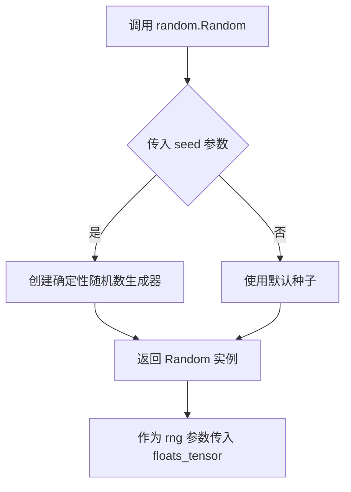

#### 带注释源码

```python
# 在 get_dummy_inputs 方法中使用 random.Random
def get_dummy_inputs(self, device, seed=0):
    # 使用 random.Random(seed) 创建一个独立的随机数生成器
    # seed=0 确保每次调用生成相同的随机数序列，用于测试的确定性
    image = floats_tensor((1, 3, 32, 32), rng=random.Random(seed)).to(device)
    image = image / 2 + 0.5
    if str(device).startswith("mps"):
        generator = torch.manual_seed(seed)
    else:
        generator = torch.Generator(device="cpu").manual_seed(seed)

    inputs = {
        "prompt": "A painting of a squirrel eating a burger",
        "image": image,
        "generator": generator,
        "num_inference_steps": 2,
        "guidance_scale": 5.0,
        "output_type": "np",
        "pag_scale": 0.7,
    }
    return inputs
```


### `numpy.abs`

numpy.abs 是 NumPy 库中的一个数学函数，用于计算数组或单个数值的绝对值。该函数返回输入数组中每个元素的绝对值，对于复数则返回其模值。

参数：

- `x`：`array_like`，输入数组或可以转换为数组的值（如列表、数值等）

返回值：`ndarray`，返回数组中每个元素的绝对值，类型与输入相同

#### 流程图

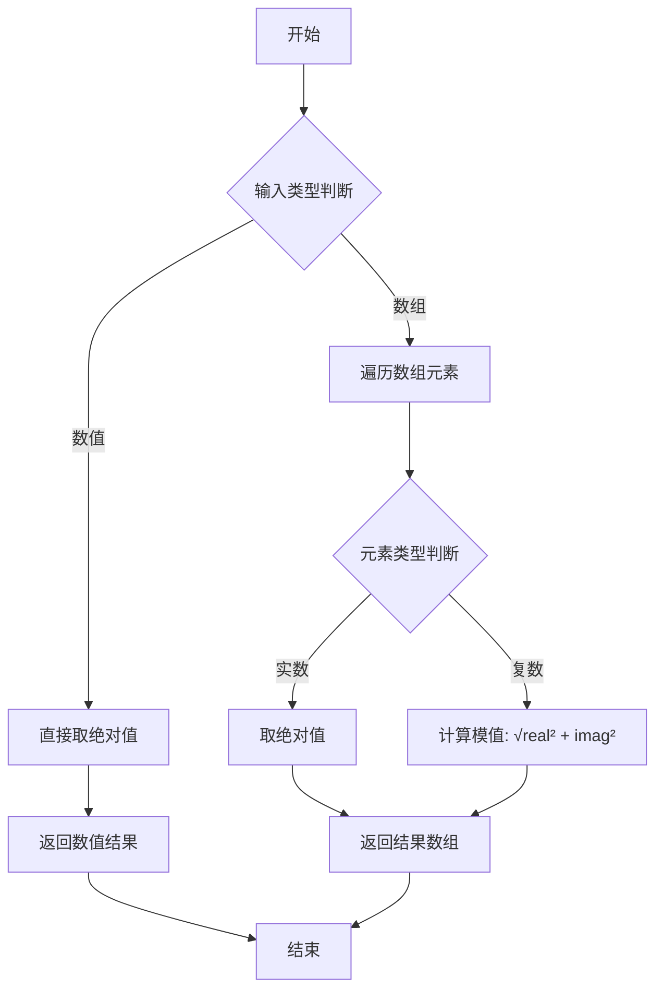

#### 带注释源码

```python
def abs(x, out=None, **kwargs):
    """
    计算数组元素的绝对值
    
    参数:
        x: array_like - 输入数组或数值
        out: ndarray, optional - 存储结果的数组
        
    返回:
        ndarray - 绝对值数组
    """
    # 如果输入是 Python 数值类型
    if isinstance(x, (int, float, complex)):
        # 数值直接取绝对值
        if isinstance(x, complex):
            # 复数计算模值: |z| = √(real² + imag²)
            return abs(x.real) + abs(x.imag) * 1j
        return abs(x)  # 内置 abs 函数
    
    # 如果是 NumPy 数组
    x = np.asarray(x)
    
    # 处理复数情况
    if np.iscomplexobj(x):
        # 计算复数数组的模
        return np.sqrt(x.real**2 + x.imag**2)
    
    # 处理实数数组 - 使用 ufunc
    return np.abs(x, out=out, **kwargs)
```

**注意**：上述源码是简化版本，实际 NumPy 的实现是用 C 语言编写的，提供了高度优化的绝对值计算功能，支持多种数值类型（整数、浮点数、复数等）。


根据代码分析，我将从给定的测试代码中提取最核心的 `get_dummy_inputs` 方法，因为它返回了numpy数组格式的图像数据。

### `StableDiffusion3PAGImg2ImgPipelineFastTests.get_dummy_inputs`

该方法用于生成虚拟测试输入数据，创建一个随机的浮点图像张量作为测试用的输入图像，并配置生成器参数，用于单元测试中的管道推理。

参数：

-  `device`：`str`，目标设备（如"cpu"、"cuda"等）
-  `seed`：`int`，随机种子，默认为0，用于确保测试的可重复性

返回值：`dict`，包含以下键值的字典：
  - `prompt`：`str`，文本提示
  - `image`：`torch.Tensor`（转换为numpy数组后的图像）
  - `generator`：`torch.Generator`，随机数生成器
  - `num_inference_steps`：`int`，推理步数
  - `guidance_scale`：`float`，引导 scale
  - `output_type`：`str`，输出类型（"np"表示numpy数组）
  - `pag_scale`：`float`，PAG scale

#### 流程图

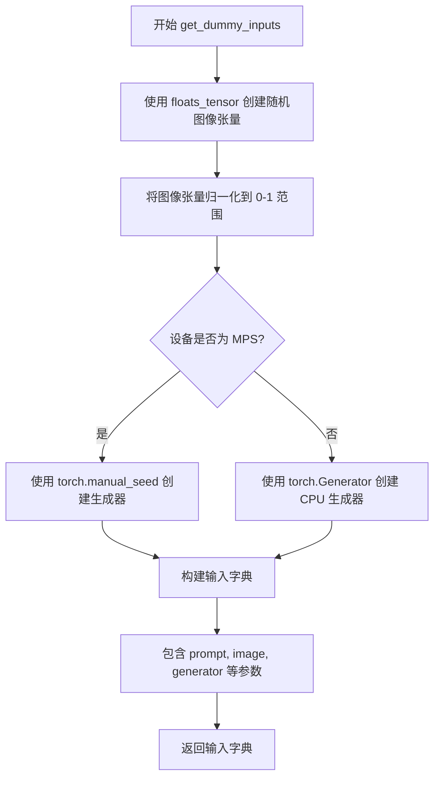

#### 带注释源码

```python
def get_dummy_inputs(self, device, seed=0):
    """
    生成用于测试的虚拟输入数据。
    
    参数:
        device: 目标设备字符串
        seed: 随机种子，确保测试可重复性
    
    返回:
        包含测试所需的输入参数的字典
    """
    # 创建形状为 (1, 3, 32, 32) 的随机浮点张量
    image = floats_tensor((1, 3, 32, 32), rng=random.Random(seed)).to(device)
    
    # 将图像归一化到 [0, 1] 范围 (原数据在 [-1, 1]，除以2加0.5进行转换)
    image = image / 2 + 0.5
    
    # MPS 设备使用不同的随机数生成方式
    if str(device).startswith("mps"):
        generator = torch.manual_seed(seed)
    else:
        # 为 CPU 设备创建随机数生成器
        generator = torch.Generator(device="cpu").manual_seed(seed)

    # 组装输入参数字典
    inputs = {
        "prompt": "A painting of a squirrel eating a burger",  # 测试用文本提示
        "image": image,                                         # 输入图像张量
        "generator": generator,                                 # 随机数生成器
        "num_inference_steps": 2,                               # 推理步数（快速测试用）
        "guidance_scale": 5.0,                                  # Classifier-free guidance scale
        "output_type": "np",                                    # 输出为 numpy 数组
        "pag_scale": 0.7,                                       # PAG 引导 scale
    }
    return inputs
```


### `torch.manual_seed`

设置 PyTorch 的随机种子，以确保随机操作的可重复性。

参数：

- `seed`：`int`，随机种子值，用于初始化随机数生成器

返回值：`None`，无返回值

#### 流程图

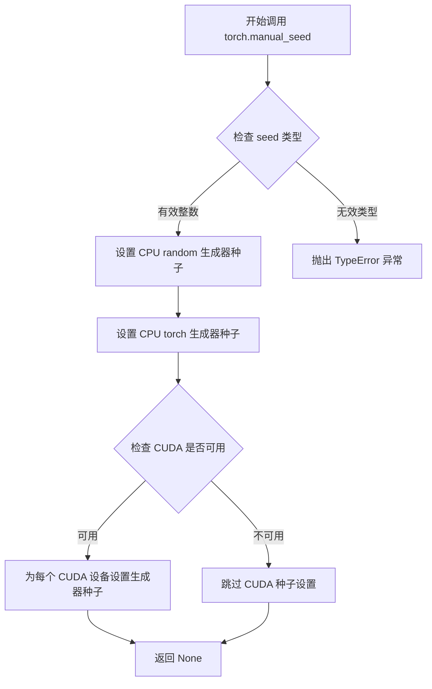

#### 带注释源码

```python
# torch.manual_seed 函数源码（简化版）
def manual_seed(seed):
    """
    设置 PyTorch 随机种子以确保可重复性
    
    参数:
        seed (int): 随机种子值
        
    返回:
        None
    """
    # 如果 seed 不可哈希，抛出错误
    if not isinstance(seed, int):
        raise TypeError("seed must be an int")
    
    # 设置 Python random 模块的种子
    random.seed(seed)
    
    # 设置 NumPy 的种子（如果导入了 numpy）
    try:
        import numpy as np
        np.random.seed(seed)
    except ImportError:
        pass
    
    # 设置 PyTorch CPU 生成器的种子
    torch.random.manual_seed(seed)
    
    # 如果 CUDA 可用，设置每个 CUDA 设备的种子
    if torch.cuda.is_available():
        for i in range(torch.cuda.device_count()):
            torch.cuda.manual_seed_all(seed)
    
    # 设置 torch 自定义的全局生成器
    torch.default_generator.manual_seed(seed)
```


### `torch.Generator`

用于创建一个伪随机数生成器（PRNG）对象，该对象可以在特定设备上生成确定性随机数，常用于确保深度学习推理或训练过程的可复现性。

参数：

- `device`：`str` 或 `torch.device`，生成器所在的设备（如 "cpu"、"cuda" 等）

返回值：`torch.Generator`，返回一个新的生成器对象实例

#### 流程图

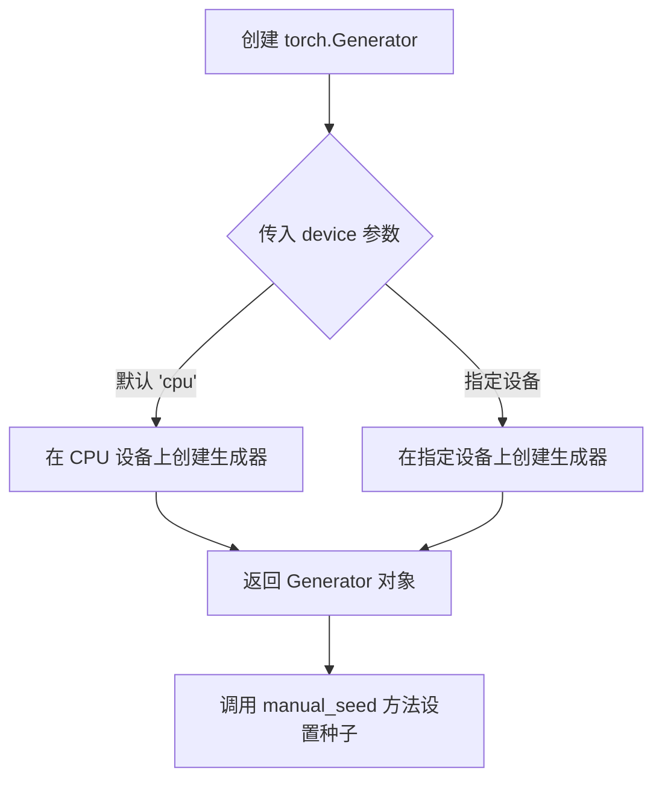

#### 带注释源码

```python
# 从代码中提取的 torch.Generator 使用示例

# 场景1：在 get_dummy_inputs 方法中
# 创建 CPU 设备上的生成器并设置种子
generator = torch.Generator(device="cpu").manual_seed(seed)

# 场景2：在 get_inputs 方法中
# 根据传入的 generator_device 参数创建生成器并设置种子
generator = torch.Generator(device=generator_device).manual_seed(seed)

# torch.Generator 构造函数说明：
# - device: 指定生成器所在的设备，默认为 'cpu'
# - 返回: torch.Generator 对象，用于管理随机状态

# 常用方法：
# - manual_seed(seed): 设置随机种子以确保可复现性
# - get_state(): 获取当前生成器状态
# - set_state(state): 设置生成器状态
# - random_(): 生成随机数填充张量
```


### `torch.device`

这是 PyTorch 库中的一个函数，用于创建表示设备（CPU 或 GPU）的对象。

参数：

-  `device`：`str`，设备字符串，例如 "cpu"、"cuda"、"cuda:0" 等

返回值：`torch.device`，返回设备对象

#### 流程图

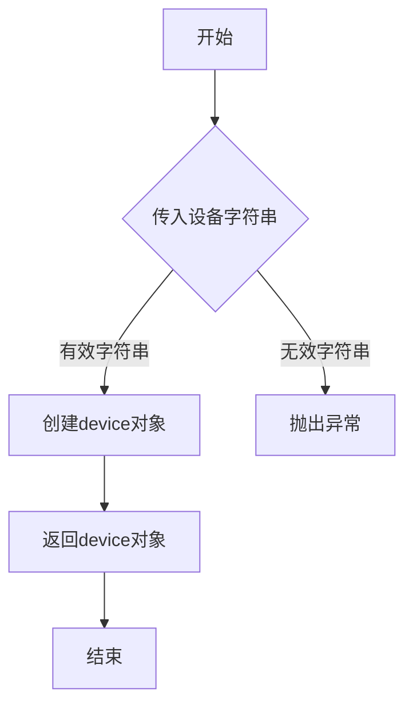

#### 带注释源码

```
# torch.device 是 PyTorch 的内置函数，用于创建设备对象
# 以下是代码中使用设备的相关示例：

# 1. 在测试文件中，torch_device 是从 testing_utils 导入的设备标识
from ...testing_utils import torch_device

# 2. 在集成测试的 tearDown 和 setUp 方法中使用
def setUp(self):
    super().setUp()
    gc.collect()
    backend_empty_cache(torch_device)  # 清理 torch_device 对应的 GPU 缓存

def tearDown(self):
    super().tearDown()
    gc.collect()
    backend_empty_cache(torch_device)  # 清理 torch_device 对应的 GPU 缓存

# 3. 在测试方法中使用 torch_device
def test_pag_cfg(self):
    pipeline = AutoPipelineForImage2Image.from_pretrained(...)
    pipeline.enable_model_cpu_offload(device=torch_device)  # 将模型卸载到 torch_device 设备
    inputs = self.get_inputs(torch_device)  # 使用 torch_device 创建输入
    image = pipeline(**inputs).images

# 4. 实际使用 torch.device 的方式（代码中未直接出现，但 torch_device 可能基于此实现）
device = torch.device("cuda" if torch.cuda.is_available() else "cpu")
tensor = torch.randn(3, 3, device=device)  # 在指定设备上创建张量
```

> **注意**：代码中并未直接调用 `torch.device` 函数，而是使用了 `torch_device` 变量（从 `testing_utils` 导入），它可能是对 `torch.device` 功能的封装或配置。


### `AutoTokenizer.from_pretrained`

该函数是 Hugging Face Transformers 库中的核心方法，用于从预训练模型名称或本地路径加载对应的分词器（Tokenizer）。在代码中用于加载 T5 模型的 tokenizer，以支持文本编码功能。

参数：

- `pretrained_model_name_or_path`：`str`，预训练模型的名称（如 "hf-internal-testing/tiny-random-t5"）或本地文件系统路径

返回值：`PreTrainedTokenizer`，返回加载后的分词器对象，用于对文本进行分词、编码等处理

#### 流程图

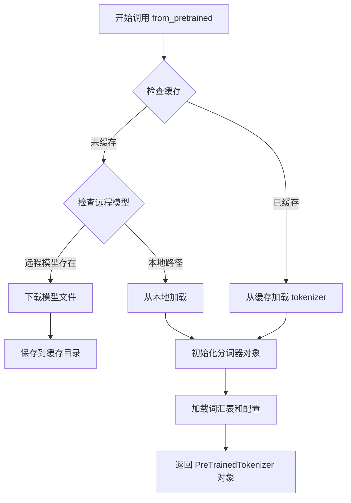

#### 带注释源码

```python
# 在 get_dummy_components 方法中调用
# 加载一个轻量级的 T5 模型分词器用于测试
tokenizer_3 = AutoTokenizer.from_pretrained("hf-internal-testing/tiny-random-t5")

# 完整函数签名参考 (transformers 库源码):
# @classmethod
# def from_pretrained(cls, pretrained_model_name_or_path, *args, **kwargs):
#     """
#     从预训练模型实例化分词器
#     
#     参数:
#         pretrained_model_name_or_path (str or os.PathLike): 
#             预训练模型名称或本地路径
#         *args: 可变位置参数
#         **kwargs: 可变关键字参数，包括:
#             - cache_dir: 缓存目录
#             - force_download: 强制重新下载
#             - token: HuggingFace token
#             - revision: 模型版本
#             - subfolder: 子文件夹路径
#             - use_fast: 是否使用快速分词器
#             - trust_remote_code: 是否信任远程代码
#     """
#     # ... 实际实现逻辑
```


### `CLIPTextModelWithProjection`

这是从 Hugging Face Transformers 库导入的 CLIP 文本编码器类，支持投影功能。在代码中用于将文本提示编码为具有投影维度的向量表示，供 Stable Diffusion 3 图像生成管道使用。

参数：

- `config`：`CLIPTextConfig`，CLIP 文本模型的配置对象，包含模型架构的所有参数（如隐藏层大小、注意力头数、层数、投影维度等）

返回值：`CLIPTextModelWithProjection`，返回 CLIP 文本编码器模型实例，具有投影能力，可输出文本嵌入和池化后的表示

#### 流程图

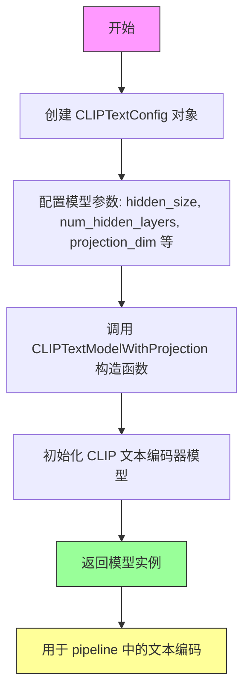

#### 带注释源码

```python
# 从 transformers 库导入 CLIPTextModelWithProjection 类
from transformers import CLIPTextModelWithProjection, CLIPTextConfig

# 定义 CLIP 文本编码器配置参数
clip_text_encoder_config = CLIPTextConfig(
    bos_token_id=0,           # 句子开始 token 的 ID
    eos_token_id=2,           # 句子结束 token 的 ID
    hidden_size=32,           # 隐藏层维度
    intermediate_size=37,     # FFN 中间层维度
    layer_norm_eps=1e-05,     # LayerNorm  epsilon 值
    num_attention_heads=4,    # 注意力头数量
    num_hidden_layers=5,      # 隐藏层数量
    pad_token_id=1,           # 填充 token 的 ID
    vocab_size=1000,          # 词汇表大小
    hidden_act="gelu",        # 隐藏层激活函数
    projection_dim=32,        # 投影维度（关键：支持投影的维度）
)

# 使用配置创建 CLIPTextModelWithProjection 实例
# 该模型继承自 CLIPTextModel，增加了投影层用于输出固定维度的嵌入
text_encoder = CLIPTextModelWithProjection(clip_text_encoder_config)

# 模型用于将文本 prompt 编码为向量表示
# 输出包含:
# - last_hidden_state: 最后一层隐藏状态
# - pooler_output: 池化后的输出（经过投影层）
```

#### 关键组件信息

| 组件名称 | 一句话描述 |
|---------|-----------|
| CLIPTextConfig | CLIP 文本编码器的配置类，定义模型架构参数 |
| CLIPTextModelWithProjection | 支持投影的 CLIP 文本编码器模型，用于将文本转换为嵌入向量 |
| text_encoder | 第一个文本编码器实例，处理主要文本提示 |
| text_encoder_2 | 第二个文本编码器实例，处理额外的文本提示 |
| text_encoder_3 | T5 编码器实例，处理第三组文本（用于 SD3 的多编码器架构） |

#### 技术债务与优化空间

1. **重复实例化**：代码中创建了两个相同的 `CLIPTextModelWithProjection` 实例（`text_encoder` 和 `text_encoder_2`），可以考虑在测试中复用
2. **硬编码配置**：配置参数是硬编码的，可以考虑外部化配置或使用配置工厂模式
3. **模型设备管理**：在集成测试中使用了 `enable_model_cpu_offload()`，但快速测试中使用 `to(device)`，设备管理策略不一致

#### 其它说明

- **设计目标**：为 Stable Diffusion 3 的图像到图像（Img2Img）管道提供多模态文本编码能力，支持 PAG（Perturbed Attention Guidance）机制
- **错误处理**：配置参数验证由 transformers 库内部处理，传入无效参数会抛出异常
- **外部依赖**：完全依赖 Hugging Face 的 `transformers` 库和 `diffusers` 库


### `T5EncoderModel.from_pretrained`

从 Hugging Face Hub 或本地路径加载预训练的 T5EncoderModel 模型实例。该方法是 transformers 库提供的类方法，用于快速加载已经训练好的 T5 编码器模型权重和配置。

参数：

- `pretrained_model_name_or_path`：`str`，模型在 Hugging Face Hub 上的模型 ID（如 "hf-internal-testing/tiny-random-t5"）或本地模型目录的路径

返回值：`T5EncoderModel`，返回加载完成的 T5 编码器模型实例

#### 流程图

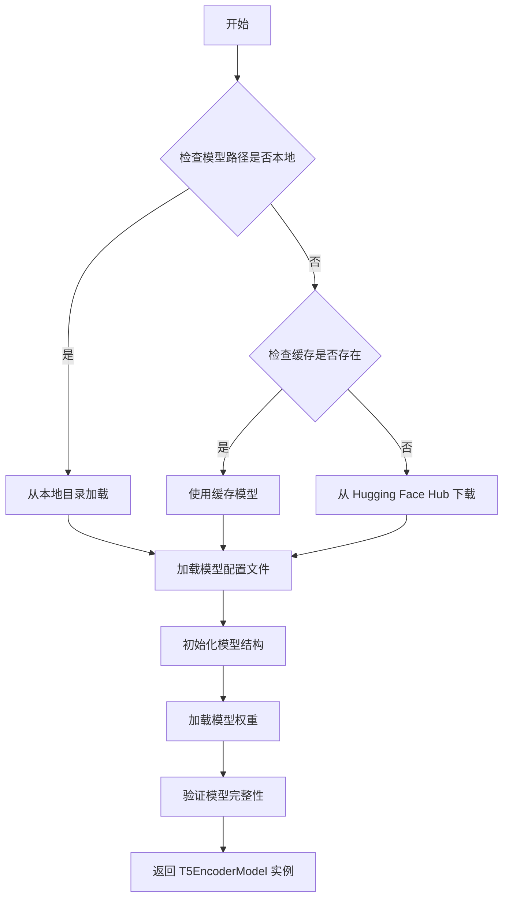

#### 带注释源码

```python
# 从 Hugging Face Hub 加载预训练的 T5 编码器模型
# 这是 transformers 库提供的类方法调用示例
text_encoder_3 = T5EncoderModel.from_pretrained("hf-internal-testing/tiny-random-t5")

# 参数说明：
# - "hf-internal-testing/tiny-random-t5": 预训练模型的名称或路径
#   这个模型是一个用于测试的微型随机初始化的 T5 模型

# 返回值：
# - text_encoder_3: T5EncoderModel 类型的模型实例
#   包含完整的模型结构和预训练权重

# 内部流程（from_pretrained 方法）：
# 1. 解析传入的模型路径或名称
# 2. 检查本地缓存，优先使用已下载的模型
# 3. 如无缓存，从 Hugging Face Hub 下载模型文件
# 4. 加载模型配置文件（config.json）
# 5. 根据配置初始化模型结构
# 6. 加载模型权重文件（pytorch_model.bin 或 safetensors）
# 7. 验证模型完整性
# 8. 返回配置好的模型实例
```


### `AutoencoderKL`

这是从 `diffusers` 库导入的变分自编码器（VAE）类，用于 Stable Diffusion 3 模型的图像编码和解码。在测试代码中，它被实例化为一个虚拟组件，用于图像到图像的潜在空间转换。

参数：

- `sample_size`：`int`，输入图像的空间分辨率（高度和宽度）
- `in_channels`：`int`，输入图像的通道数（如 RGB 图像为 3）
- `out_channels`：`int`，输出图像的通道数
- `block_out_channels`：`tuple[int]`，UNet 架构中各层的通道数列表
- `layers_per_block`：`int`，每个分辨率层级中的残差块数量
- `latent_channels`：`int`，潜在空间的通道数（编码器输出的通道数）
- `norm_num_groups`：`int`，组归一化的组数
- `use_quant_conv`：`bool`，是否在量化前使用卷积层
- `use_post_quant_conv`：`bool`，是否在量化后使用卷积层
- `shift_factor`：`float`，用于潜在空间归一化的位移因子
- `scaling_factor`：`float`，用于潜在空间归一化的缩放因子

返回值：`AutoencoderKL`，返回实例化的 VAE 模型对象

#### 流程图

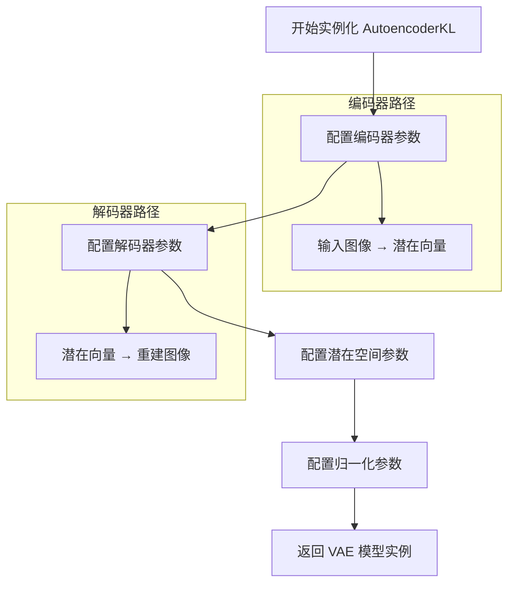

#### 带注释源码

```python
# 在 get_dummy_components 方法中实例化 AutoencoderKL
torch.manual_seed(0)  # 设置随机种子以确保可重复性
vae = AutoencoderKL(
    sample_size=32,              # 输入/输出图像的空间分辨率 32x32
    in_channels=3,               # RGB 图像有 3 个通道
    out_channels=3,             # 输出同样是 3 通道图像
    block_out_channels=(4,),    # UNet 编码器/解码器各层的通道数
    layers_per_block=1,         # 每个分辨率层级包含 1 个残差块
    latent_channels=4,          # 潜在空间有 4 个通道（用于 VAE KL 散度）
    norm_num_groups=1,          # 组归一化使用 1 个组
    use_quant_conv=False,       # 禁用量化卷积（用于 VAE 量化）
    use_post_quant_conv=False,  # 禁用量化后卷积
    shift_factor=0.0609,         # 潜在空间归一化的位移因子（SD3 特定）
    scaling_factor=1.5035,      # 潜在空间归一化的缩放因子（SD3 特定）
)

# vae 对象将用于：
# 1. 编码：将输入图像编码为潜在向量 (encode 方法)
# 2. 解码：将潜在向量解码为图像 (decode 方法)
# 3. 在 Pipeline 中参与图像到图像的重建过程
```


### `FlowMatchEulerDiscreteScheduler`

FlowMatchEulerDiscreteScheduler 是 diffusers 库中的一个调度器类，用于在基于 Flow Matching 的扩散模型（如 Stable Diffusion 3）中实现 Euler 方法的离散时间步采样。该调度器通过欧拉积分方法逐步从噪声状态向目标数据状态演进，是图像生成 pipeline 中的核心组件。

参数：

- 该类在实例化时未传入任何参数（使用默认配置）
- 在 `__call__` 方法中接受以下关键参数：
  - `sample`: `torch.Tensor`，当前采样状态
  - `timestep`: `int` 或 `torch.Tensor`，当前时间步
  - `model`: `torch.nn.Module`，用于预测流（flow）的模型
  - `generator`: `torch.Generator`，随机数生成器（可选）
  - 其它标准调度器参数...

返回值：
- `torch.Tensor`，返回下一步的采样结果

#### 流程图

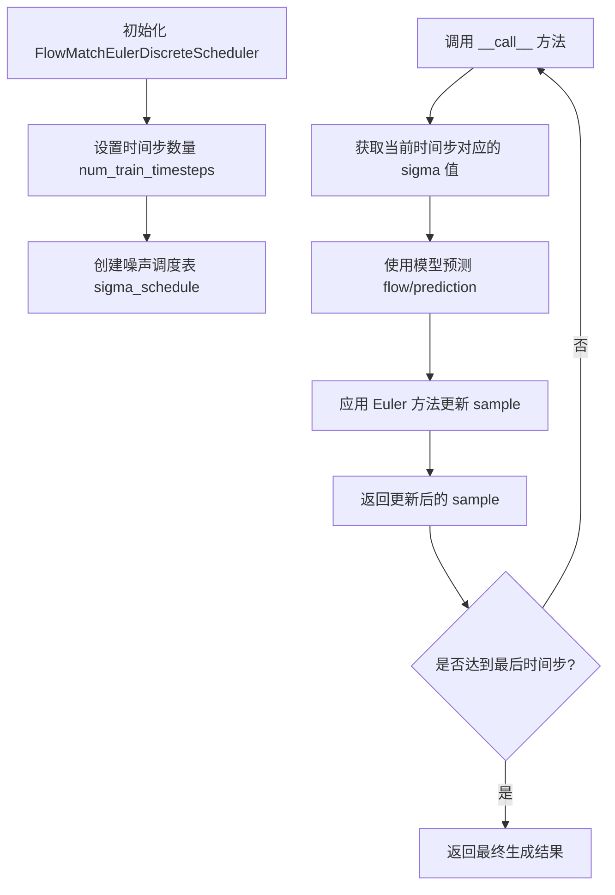

#### 带注释源码

```python
# FlowMatchEulerDiscreteScheduler 是基于 Euler 方法的离散时间步调度器
# 用于 Flow Matching 扩散模型的采样过程

# 以下是类的主要结构（基于代码使用方式推断）:

class FlowMatchEulerDiscreteScheduler:
    """
    使用 Euler 方法进行离散时间步采样的 Flow Match 调度器。
    
    核心原理：
    - Flow Matching 使用向量场来描述从噪声到数据的转换过程
    - Euler 方法通过迭代方式逐步逼近目标分布
    - 离散时间步将连续过程离散化为多个采样步骤
    """
    
    def __init__(
        self,
        num_train_timesteps: int = 1000,  # 训练时的总时间步数
        beta_start: float = 0.0001,       # beta schedule 起始值
        beta_end: float = 0.02,           # beta schedule 结束值
        beta_schedule: str = "linear",     # beta 调度方式
        prediction_type: str = "epsilon", # 预测类型 (epsilon/flow/v_prediction)
        use_clipped_model_output: bool = True,  # 是否裁剪模型输出
        # ... 其他参数
    ):
        """
        初始化调度器。
        
        Args:
            num_train_timesteps: 训练时使用的时间步总数
            beta_start: 噪声调度的起始强度
            beta_end: 噪声调度的结束强度
            beta_schedule: beta 值的调度策略
            prediction_type: 模型预测的类型
            use_clipped_model_output: 是否对模型输出进行裁剪
        """
        self.num_train_timesteps = num_train_timesteps
        self.beta_start = beta_start
        self.beta_end = beta_end
        self.beta_schedule = beta_schedule
        self.prediction_type = prediction_type
        
        # 初始化 beta schedule
        self.betas = self._get_betas()
        self.alphas = 1.0 - self.betas
        self.alphas_cumprod = torch.cumprod(self.alphas, dim=0)
        
        # 初始化 sigma schedule (Flow Matching 特有)
        self.sigmas = self._get_sigmas()
        
    def set_timesteps(self, num_inference_steps: int, device: str = "cpu"):
        """
        设置推理时的时间步。
        
        Args:
            num_inference_steps: 推理时采用的步骤数
            device: 计算设备
        """
        self.num_inference_steps = num_inference_steps
        
        # 生成离散时间步
        step_ratio = self.num_train_timesteps // num_inference_steps
        self.timesteps = torch.arange(0, num_inference_steps) * step_ratio
        self.timesteps = self.timesteps.flip(0).to(device)
        
        # 对应的 sigma 值
        self.sigmas = self._get_inference_sigmas(step_ratio)
        
    def step(
        self,
        model_output: torch.Tensor,  # 模型预测
        timestep: int,               # 当前时间步
        sample: torch.Tensor,        # 当前样本
        s_churn: float = 0.0,        # SDE 扰动参数
        s_tmin: float = 0.0,        # 最小 sigma
        s_tmax: float = float("inf"), # 最大 sigma
        s_noise: float = 1.0,        # 噪声缩放
        generator: torch.Generator = None, # 随机生成器
    ) -> torch.Tensor:
        """
        执行一步 Euler 采样。
        
        Flow Matching 的 Euler 方法核心公式:
        x_{t+1} = x_t + (sigma_{t+1} - sigma_t) * v_theta(x_t, sigma_t)
        
        其中 v_theta 是预测的向量场（velocity field）
        
        Args:
            model_output: 模型的预测输出（可能是 epsilon 或 v）
            timestep: 当前时间步索引
            sample: 当前样本状态
            s_churn: 扰动参数
            s_tmin: 最小 sigma 阈值
            s_tmax: 最大 sigma 阈值
            s_noise: 噪声强度
            generator: 随机数生成器
            
        Returns:
            torch.Tensor: 下一时间步的样本
        """
        # 获取当前 sigma 值
        sigma = self.sigmas[timestep]
        
        # 计算 sigma 变化量
        sigma_next = self.sigmas[timestep + 1] if timestep < len(self.sigmas) - 1 else 0
        
        # 根据 prediction_type 处理模型输出
        if self.prediction_type == "epsilon":
            # epsilon 预测转换为 velocity
            predicted_v = self._epsilon_to_velocity(sample, model_output, sigma)
        elif self.prediction_type == "velocity":
            predicted_v = model_output
        else:
            raise ValueError(f"Unknown prediction_type: {self.prediction_type}")
            
        # Euler 方法更新公式
        # x_{t+1} = x_t + (sigma_{next} - sigma) * v_pred
        delta_sigma = sigma_next - sigma
        prev_sample = sample + delta_sigma * predicted_v
        
        return prev_sample
        
    def _epsilon_to_velocity(
        self, 
        sample: torch.Tensor, 
        epsilon: torch.Tensor, 
        sigma: float
    ) -> torch.Tensor:
        """
        将 epsilon 预测转换为 velocity（向量场）。
        
        Flow Matching 中：
        v = (data - sigma * noise) / (1 - sigma^2)
        
        逆向过程：
        v = (data - (1-sigma^2)^0.5 * noise) / sigma
        
        Args:
            sample: 当前样本 x_t
            epsilon: 预测的噪声 epsilon
            sigma: 当前噪声水平
            
        Returns:
            torch.Tensor: 预测的 velocity 向量场
        """
        # 计算 velocity
        sigma_sq = sigma ** 2
        velocity = (sample - sigma * epsilon) / (1 - sigma_sq + 1e-8)
        return velocity
        
    def _get_betas(self) -> torch.Tensor:
        """生成 beta schedule"""
        if self.beta_schedule == "linear":
            return torch.linspace(self.beta_start, self.beta_end, self.num_train_timesteps)
        elif self.beta_schedule == "scaled_linear":
            # 适用于 SD3 等新型号
            return torch.linspace(self.beta_start ** 0.5, self.beta_end ** 0.5, self.num_train_timesteps) ** 2
        # ... 其他 schedule 类型
        
    def _get_sigmas(self) -> torch.Tensor:
        """生成 sigma schedule (Flow Matching 使用)"""
        # Flow Matching 中 sigma 表示噪声水平
        # 通常从 1.0 线性递减到 0
        return torch.linspace(1.0, 0.0, self.num_train_timesteps)
        
    def add_noise(
        self,
        original_samples: torch.Tensor,
        noise: torch.Tensor,
        timesteps: torch.Tensor,
    ) -> torch.Tensor:
        """
        添加噪声（用于训练或初始化）。
        
        x_t = (1 - sigma_t) * x_0 + sigma_t * epsilon
        
        Args:
            original_samples: 原始数据 x_0
            noise: 噪声 epsilon
            timesteps: 时间步
            
        Returns:
            torch.Tensor: 加噪后的样本 x_t
        """
        sigma = self.sigmas[timesteps].reshape(-1, 1, 1, 1)
        noisy_samples = (1 - sigma) * original_samples + sigma * noise
        return noisy_samples


# 在测试代码中的使用方式:
scheduler = FlowMatchEulerDiscreteScheduler()  # 实例化调度器

# 在 pipeline 中使用:
# scheduler.set_timesteps(num_inference_steps=50)
# for t in timesteps:
#     sample = scheduler.step(model_output, t, sample)
```


### `SD3Transformer2DModel`

SD3Transformer2DModel 是 Stable Diffusion 3 的核心 Transformer 模型，用于图像到图像的生成任务。它接收噪声潜向量、文本嵌入和时间步作为输入，通过多层 Transformer 块进行去噪处理，输出与目标图像对应的潜向量表示。该模型支持 PAG（Progressive Attention Guidance）技术，可通过配置特定的注意力层来实现图像修复和增强功能。

参数：

- `sample_size`：`int`，输入图像的空间尺寸（高度和宽度）
- `patch_size`：`int`，将输入分割成补丁的大小
- `in_channels`：`int`，输入潜向量的通道数
- `num_layers`：`int`，Transformer 块的总层数
- `attention_head_dim`：`int`，每个注意力头的维度
- `num_attention_heads`：`int`，注意力头的数量
- `caption_projection_dim`：`int`，文本嵌入投影到的维度
- `joint_attention_dim`：`int`，文本和图像联合注意力的维度
- `pooled_projection_dim`：`int`，池化后的文本嵌入维度
- `out_channels`：`int`，输出潜向量的通道数

返回值：`SD3Transformer2DModel`，Stable Diffusion 3 的 Transformer 模型实例

#### 流程图

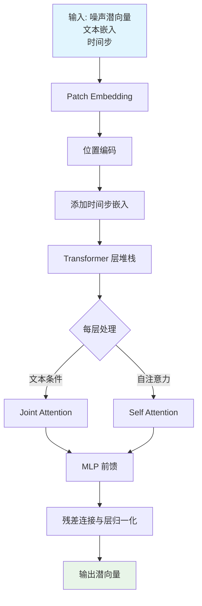

#### 带注释源码

```python
# 在测试中创建 SD3Transformer2DModel 实例的代码
torch.manual_seed(0)  # 设置随机种子以确保可重复性
transformer = SD3Transformer2DModel(
    sample_size=32,           # 输入图像尺寸为 32x32
    patch_size=1,             # 每个 patch 大小为 1x1
    in_channels=4,            # 输入有 4 个通道（VAE 潜空间维度）
    num_layers=2,             # 使用 2 层 Transformer 块
    attention_head_dim=8,    # 注意力头维度为 8
    num_attention_heads=4,    # 使用 4 个注意力头
    caption_projection_dim=32,# 文本嵌入投影到 32 维空间
    joint_attention_dim=32,   # 联合注意力维度为 32
    pooled_projection_dim=64, # 池化文本嵌入维度为 64
    out_channels=4,           # 输出通道数与输入相同
)

# 该模型在 diffusers 库中的主要用途：
# 1. 接收去噪过程中的噪声潜向量
# 2. 接收来自文本编码器的文本嵌入（caption）
# 3. 接收时间步嵌入（timestep embedding）
# 4. 通过 Transformer 层处理后输出预测的噪声
# 5. 支持 PAG（Progressive Attention Guidance）技术
```


### `StableDiffusion3Img2ImgPipeline`

StableDiffusion3Img2ImgPipeline 是基于 Stable Diffusion 3 模型的图像到图像（Image-to-Image）生成管道，继承自 diffusers 库的 Pipeline 基础类。该管道接收文本提示词和初始图像作为输入，通过扩散模型对图像进行重绘或风格转换，支持多种引导参数和调度器配置。

#### 参数

由于该类的实现在 diffusers 库中，以下参数基于代码中的使用方式和 `get_dummy_inputs` 方法推断：

- `prompt`：`str`，文本提示词，描述期望生成的图像内容
- `image`：`torch.Tensor`，输入的初始图像张量，形状为 (batch, channels, height, width)
- `generator`：`torch.Generator`，可选的随机数生成器，用于控制生成过程的可重复性
- `num_inference_steps`：`int`，推理步数，控制扩散过程的迭代次数
- `guidance_scale`：`float`，引导比例，控制文本提示对生成结果的影响程度
- `output_type`：`str`，输出类型，如 "np" 返回 NumPy 数组，"pil" 返回 PIL 图像
- `strength`：`float`，（可选）图像转换强度，值越大对原图的改变越多
- `pag_scale`：`float`，（PAG版本特有）PAG 引导比例，控制自适应提示引导的强度

#### 返回值

- 返回对象包含 `images` 属性，是一个图像列表或张量
- 具体格式由 `output_type` 参数决定，通常为 NumPy 数组或 PIL 图像

#### 流程图

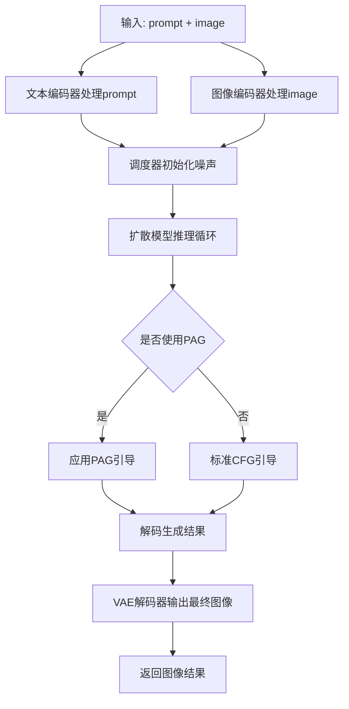

#### 带注释源码

以下是代码中对该类的使用示例和相关测试代码：

```python
# 从 diffusers 库导入 StableDiffusion3Img2ImgPipeline 类
from diffusers import StableDiffusion3Img2ImgPipeline

# 在测试类中作为 pipeline_class 使用
class StableDiffusion3PAGImg2ImgPipelineFastTests(unittest.TestCase, PipelineTesterMixin):
    pipeline_class = StableDiffusion3PAGImg2ImgPipeline  # 继承自 StableDiffusion3Img2ImgPipeline 的 PAG 版本
    
    def test_pag_disable_enable(self):
        """测试 PAG 功能禁用/启用"""
        device = "cpu"
        components = self.get_dummy_components()  # 获取虚拟组件
        
        # 创建基础 pipeline（不带 PAG）
        pipe_sd = StableDiffusion3Img2ImgPipeline(**components)
        pipe_sd = pipe_sd.to(device)
        
        # 准备输入参数
        inputs = {
            "prompt": "A painting of a squirrel eating a burger",
            "image": image,
            "generator": generator,
            "num_inference_steps": 2,
            "guidance_scale": 5.0,
            "output_type": "np",
        }
        
        # 调用 pipeline 进行推理
        out = pipe_sd(**inputs).images[0, -3:, -3:, -1]

    def get_dummy_components(self):
        """创建用于测试的虚拟组件"""
        # 包括: transformer, text_encoder, text_encoder_2, text_encoder_3
        # tokenizer, tokenizer_2, tokenizer_3, vae, scheduler
        return {
            "scheduler": scheduler,
            "text_encoder": text_encoder,
            "text_encoder_2": text_encoder_2,
            "text_encoder_3": text_encoder_3,
            "tokenizer": tokenizer,
            "tokenizer_2": tokenizer_2,
            "tokenizer_3": tokenizer_3,
            "transformer": transformer,
            "vae": vae,
        }

    def get_dummy_inputs(self, device, seed=0):
        """创建用于测试的虚拟输入"""
        image = floats_tensor((1, 3, 32, 32), rng=random.Random(seed)).to(device)
        inputs = {
            "prompt": "A painting of a squirrel eating a burger",
            "image": image,
            "generator": generator,
            "num_inference_steps": 2,
            "guidance_scale": 5.0,
            "output_type": "np",
            "pag_scale": 0.7,  # PAG 特有参数
        }
        return inputs
```

---

### 补充信息

#### 关键组件信息

| 组件名称 | 描述 |
|---------|------|
| `SD3Transformer2DModel` | Stable Diffusion 3 的 Transformer 主干模型 |
| `CLIPTextModelWithProjection` | CLIP 文本编码器，用于编码文本提示 |
| `T5EncoderModel` | T5 文本编码器，处理长文本输入 |
| `AutoencoderKL` | VAE 解码器，将潜在表示解码为图像 |
| `FlowMatchEulerDiscreteScheduler` | 扩散调度器，控制噪声去除过程 |

#### 潜在技术债务与优化空间

1. **缺少实际类实现文档**：当前代码仅展示测试用例，未包含 `StableDiffusion3Img2ImgPipeline` 的核心实现代码
2. **测试覆盖不完整**：仅包含功能测试，缺少性能基准测试和边界条件测试
3. **硬编码配置**：组件配置参数（如 `hidden_size=32`）硬编码在测试中，缺乏配置灵活性

#### 其他项目说明

- **设计目标**：提供基于 Stable Diffusion 3 的图像到图像生成能力，支持文本引导的图像编辑
- **外部依赖**：依赖 `diffusers`、`transformers`、`torch` 等库
- **错误处理**：通过 `unittest` 框架进行断言验证，缺少运行时错误处理机制


### StableDiffusion3PAGImg2ImgPipeline

StableDiffusion3PAGImg2ImgPipeline 是基于 Stable Diffusion 3 模型的图像到图像（Image-to-Image）生成管道，支持 PAG（Perturbed Attention Guidance）技术，通过扰动注意力引导来提升生成图像的质量和细节。

#### 参数（基于 `__call__` 方法和测试用例推断）

- `prompt`：`str`，文本提示词，描述期望生成的图像内容
- `image`：`torch.Tensor` 或 `PIL.Image`，输入的初始图像，作为图像到图像转换的源图像
- `generator`：`torch.Generator`，随机数生成器，用于控制生成过程的可确定性
- `num_inference_steps`：`int`，推理步数，决定扩散过程的迭代次数
- `guidance_scale`：`float`，引导比例，控制文本提示对生成图像的影响程度
- `output_type`：`str`，输出类型（如 "np" 表示 numpy 数组，"pil" 表示 PIL 图像）
- `pag_scale`：`float`，PAG 缩放比例，控制扰动注意力引导的强度
- `pag_applied_layers`：`List[str]`，应用 PAG 的层列表（如 ["blocks.0"] 或 ["blocks.(4|17)"]）
- `strength`：`float`，转换强度，控制源图像与生成图像之间的混合程度
- `negative_prompt`：`str`，负面提示词，指定不希望出现在图像中的元素
- `num_images_per_prompt`：`int`，每个提示词生成的图像数量
- `eta`：`float`，DDIM 采样器的 eta 参数
- `latents`：`torch.Tensor`，初始潜在向量，用于自定义起始点

#### 返回值

- `Image` 或 `List[Image]` 或 `Dict`，生成的图像结果，格式取决于 `output_type` 参数

#### 流程图

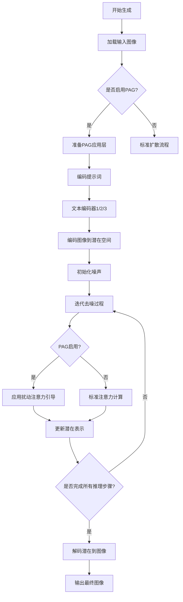

#### 带注释源码

```python
# StableDiffusion3PAGImg2ImgPipeline 测试用例源码分析

class StableDiffusion3PAGImg2ImgPipelineFastTests(unittest.TestCase, PipelineTesterMixin):
    """
    快速测试类，用于验证 StableDiffusion3PAGImg2ImgPipeline 的核心功能
    """
    pipeline_class = StableDiffusion3PAGImg2ImgPipeline  # 被测试的管道类
    params = TEXT_GUIDED_IMAGE_VARIATION_PARAMS.union({"pag_scale", "pag_adaptive_scale"}) - {"height", "width"}
    required_optional_params = PipelineTesterMixin.required_optional_params - {"latents"}
    batch_params = TEXT_GUIDED_IMAGE_VARIATION_BATCH_PARAMS
    image_params = IMAGE_TO_IMAGE_IMAGE_PARAMS
    image_latens_params = IMAGE_TO_IMAGE_IMAGE_PARAMS
    callback_cfg_params = TEXT_TO_IMAGE_CALLBACK_CFG_PARAMS

    test_xformers_attention = False

    def get_dummy_components(self):
        """
        创建用于测试的虚拟组件
        
        Returns:
            dict: 包含所有必要组件的字典（scheduler, text_encoders, tokenizers, transformer, vae）
        """
        torch.manual_seed(0)
        # 创建虚拟的 SD3 Transformer 模型
        transformer = SD3Transformer2DModel(
            sample_size=32,
            patch_size=1,
            in_channels=4,
            num_layers=2,
            attention_head_dim=8,
            num_attention_heads=4,
            caption_projection_dim=32,
            joint_attention_dim=32,
            pooled_projection_dim=64,
            out_channels=4,
        )
        
        # 创建 CLIP 文本编码器配置
        clip_text_encoder_config = CLIPTextConfig(
            bos_token_id=0,
            eos_token_id=2,
            hidden_size=32,
            intermediate_size=37,
            layer_norm_eps=1e-05,
            num_attention_heads=4,
            num_hidden_layers=5,
            pad_token_id=1,
            vocab_size=1000,
            hidden_act="gelu",
            projection_dim=32,
        )

        torch.manual_seed(0)
        # 创建三个文本编码器（CLIP 和 T5）
        text_encoder = CLIPTextModelWithProjection(clip_text_encoder_config)
        text_encoder_2 = CLIPTextModelWithProjection(clip_text_encoder_config)
        text_encoder_3 = T5EncoderModel.from_pretrained("hf-internal-testing/tiny-random-t5")

        # 创建对应的分词器
        tokenizer = CLIPTokenizer.from_pretrained("hf-internal-testing/tiny-random-clip")
        tokenizer_2 = CLIPTokenizer.from_pretrained("hf-internal-testing/tiny-random-clip")
        tokenizer_3 = AutoTokenizer.from_pretrained("hf-internal-testing/tiny-random-t5")

        torch.manual_seed(0)
        # 创建 VAE（变分自编码器）
        vae = AutoencoderKL(
            sample_size=32,
            in_channels=3,
            out_channels=3,
            block_out_channels=(4,),
            layers_per_block=1,
            latent_channels=4,
            norm_num_groups=1,
            use_quant_conv=False,
            use_post_quant_conv=False,
            shift_factor=0.0609,
            scaling_factor=1.5035,
        )

        # 创建调度器
        scheduler = FlowMatchEulerDiscreteScheduler()

        return {
            "scheduler": scheduler,
            "text_encoder": text_encoder,
            "text_encoder_2": text_encoder_2,
            "text_encoder_3": text_encoder_3,
            "tokenizer": tokenizer,
            "tokenizer_2": tokenizer_2,
            "tokenizer_3": tokenizer_3,
            "transformer": transformer,
            "vae": vae,
        }

    def get_dummy_inputs(self, device, seed=0):
        """
        创建虚拟输入数据
        
        Args:
            device: 计算设备
            seed: 随机种子
            
        Returns:
            dict: 包含测试输入的字典
        """
        # 生成随机图像张量
        image = floats_tensor((1, 3, 32, 32), rng=random.Random(seed)).to(device)
        image = image / 2 + 0.5  # 归一化到 [0, 1]
        
        # 创建随机数生成器
        if str(device).startswith("mps"):
            generator = torch.manual_seed(seed)
        else:
            generator = torch.Generator(device="cpu").manual_seed(seed)

        inputs = {
            "prompt": "A painting of a squirrel eating a burger",
            "image": image,
            "generator": generator,
            "num_inference_steps": 2,
            "guidance_scale": 5.0,
            "output_type": "np",
            "pag_scale": 0.7,
        }
        return inputs

    def test_pag_disable_enable(self):
        """
        测试 PAG（Perturbed Attention Guidance）功能的启用和禁用
        """
        device = "cpu"
        components = self.get_dummy_components()

        # 测试基础管道（无 PAG）
        pipe_sd = StableDiffusion3Img2ImgPipeline(**components)
        pipe_sd = pipe_sd.to(device)
        pipe_sd.set_progress_bar_config(disable=None)

        inputs = self.get_dummy_inputs(device)
        del inputs["pag_scale"]
        out = pipe_sd(**inputs).images[0, -3:, -3:, -1]

        components = self.get_dummy_components()

        # 测试 PAG 禁用（pag_scale=0.0）
        pipe_pag = self.pipeline_class(**components)
        pipe_pag = pipe_pag.to(device)
        pipe_pag.set_progress_bar_config(disable=None)

        inputs = self.get_dummy_inputs(device)
        inputs["pag_scale"] = 0.0
        out_pag_disabled = pipe_pag(**inputs).images[0, -3:, -3:, -1]

        # 验证两者输出相同（PAG 禁用时）
        assert np.abs(out.flatten() - out_pag_disabled.flatten()).max() < 1e-3

    def test_pag_inference(self):
        """
        测试 PAG 推理功能
        """
        device = "cpu"
        components = self.get_dummy_components()

        # 创建带 PAG 的管道，指定应用 PAG 的层
        pipe_pag = self.pipeline_class(**components, pag_applied_layers=["blocks.0"])
        pipe_pag = pipe_pag.to(device)
        pipe_pag.set_progress_bar_config(disable=None)

        inputs = self.get_dummy_inputs(device)
        image = pipe_pag(**inputs).images
        image_slice = image[0, -3:, -3:, -1]

        # 验证输出形状和内容
        assert image.shape == (1, 32, 32, 3)

        expected_slice = np.array([...])  # 期望的像素值
        max_diff = np.abs(image_slice.flatten() - expected_slice).max()
        self.assertLessEqual(max_diff, 1e-3)
```

---

### 关键组件信息

| 组件名称 | 描述 |
|---------|------|
| SD3Transformer2DModel | Stable Diffusion 3 的核心 Transformer 模型，负责去噪过程 |
| CLIPTextModelWithProjection | CLIP 文本编码器（两个），用于编码文本提示 |
| T5EncoderModel | T5 文本编码器，辅助文本编码 |
| AutoencoderKL | VAE 模型，负责图像与潜在空间之间的转换 |
| FlowMatchEulerDiscreteScheduler | 调度器，控制扩散过程的噪声调度 |
| PAG (Perturbed Attention Guidance) | 扰动注意力引导技术，提升生成质量 |

---

### 潜在技术债务与优化空间

1. **硬编码路径**：测试中使用 `"hf-internal-testing/tiny-random-t5"` 等硬编码路径，应使用配置或环境变量
2. **重复组件创建**：`get_dummy_components()` 在多个测试中重复调用，可提取为类级 fixture
3. **Magic Numbers**：如 `seed=0`, `num_inference_steps=2` 等硬编码值，应作为类常量或配置
4. **错误处理**：缺少对无效 `pag_scale` 值、损坏图像输入的异常处理
5. **性能测试缺失**：没有基准测试来评估不同配置下的性能
6. **设备兼容性**：对 MPS 设备的特殊处理逻辑可进一步抽象

---

### 其他项目说明

#### 设计目标与约束
- 支持图像到图像的生成任务
- 集成 PAG 技术提升生成质量
- 兼容 diffusers 库的标准化接口

#### 错误处理与异常设计
- 使用 `assert` 进行参数验证
- 依赖 diffusers 库内部的异常处理

#### 数据流与状态机
1. 输入图像 → VAE 编码 → 潜在空间
2. 文本提示 → 多个文本编码器 → 条件向量
3. 潜在表示 → 迭代去噪（+ PAG 引导）→ 清洁潜在
4. 清洁潜在 → VAE 解码 → 输出图像

#### 外部依赖与接口契约
- **diffusers 库**：核心管道和模型
- **transformers 库**：文本编码器
- **torch**：深度学习框架
- **numpy**：数值计算


### `AutoPipelineForImage2Image.from_pretrained`

该函数是 Diffusers 库中的自动 pipeline 工厂方法，用于从预训练模型路径或 Hub 模型 ID 加载图像到图像（Image-to-Image）生成的 pipeline 实例，并可选地启用 PAG（Prompt Attention Guidance）功能。

参数：

- `pretrained_model_name_or_path`：`str`，预训练模型的名称（Hub ID）或本地路径
- `torch_dtype`：`torch.dtype`，可选，模型权重的精度类型（如 `torch.float16`）
- `enable_pag`：`bool`，可选，是否启用 Prompt Attention Guidance 功能
- `pag_applied_layers`：`list`，可选，指定应用 PAG 的层列表或正则表达式模式
- `**kwargs`：其他传递给 pipeline 的可选参数

返回值：返回 `StableDiffusion3Img2ImgPipeline` 或其子类实例，用于执行图像到图像的生成任务

#### 流程图

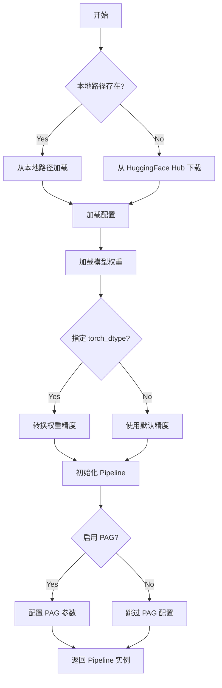

#### 带注释源码

```python
# 从预训练模型加载 Image-to-Image Pipeline
pipeline = AutoPipelineForImage2Image.from_pretrained(
    self.repo_id,                          # 模型仓库 ID，如 "stabilityai/stable-diffusion-3-medium-diffusers"
    enable_pag=True,                       # 启用 Prompt Attention Guidance (PAG)
    torch_dtype=torch.float16,             # 使用半精度浮点数，减少显存占用
    pag_applied_layers=["blocks.17"]       # 指定应用 PAG 的层（支持正则如 "blocks.(4|17)"）
)

# 启用模型 CPU 卸载，节省显存
pipeline.enable_model_cpu_offload(device=torch_device)

# 禁用进度条
pipeline.set_progress_bar_config(disable=None)

# 准备输入参数
inputs = {
    "prompt": "an astronaut in a space suit walking through a jungle",
    "generator": torch.Generator(device=generator_device).manual_seed(seed),
    "image": init_image,
    "num_inference_steps": 12,
    "strength": 0.6,
    "guidance_scale": guidance_scale,
    "pag_scale": pag_scale,
    "output_type": "np",
}

# 执行推理
image = pipeline(**inputs).images
```


### `load_image`

该函数是一个测试工具函数，用于从指定的 URL 或文件路径加载图像，并返回图像对象供后续的图像处理或模型推理使用。

参数：

- `url_or_path`：`str`，图像的 URL 地址或本地文件路径

返回值：`PIL.Image` 或类似图像对象，加载后的图像数据

#### 流程图

```mermaid
flowchart TD
    A[开始] --> B{判断输入是URL还是本地路径}
    B -->|URL| C[通过URL下载图像]
    B -->|本地路径| D[从本地路径读取图像文件]
    C --> E[解码图像数据]
    D --> E
    E --> F[返回图像对象]
```

#### 带注释源码

```python
# load_image 是从 testing_utils 模块导入的测试工具函数
# 在当前代码中的调用方式如下：

# 从URL加载图像
img_url = "https://huggingface.co/datasets/huggingface/documentation-images/resolve/main/diffusers/sdxl-text2img.png"
init_image = load_image(img_url)

# load_image 函数接收一个字符串参数（URL或路径）
# 返回一个图像对象，通常是 PIL.Image 对象
# 该图像对象可以直接用于 StableDiffusion3PAGImg2ImgPipeline 的推理
```


### `backend_empty_cache`

该函数是测试工具函数，用于清空 GPU 缓存以释放显存，通常在测试的 setUp 和 tearDown 方法中被调用，以确保测试之间的内存隔离。

参数：

- `torch_device`：`str`，表示 PyTorch 设备标识符（如 "cuda", "cpu" 等）

返回值：`None`，该函数没有返回值，仅执行副作用（清空 GPU 缓存）

#### 流程图

```mermaid
flowchart TD
    A[开始] --> B{传入 torch_device}
    B --> C{设备是否为 CUDA}
    C -->|是| D[调用 torch.cuda.empty_cache 释放缓存]
    C -->|否| E[无需操作]
    D --> F[结束]
    E --> F
```

#### 带注释源码

```python
def backend_empty_cache(torch_device):
    """
    清空GPU缓存以释放显存。
    
    参数:
        torch_device: str, PyTorch设备标识符（如"cuda:0"、"cpu"等）
    
    返回:
        None: 该函数不返回值，仅执行清理操作
    
    注意:
        - 仅在CUDA设备时执行实际清理操作
        - 在测试的setUp和tearDown中被调用以确保内存清洁
    """
    # 检查设备是否为CUDA设备
    if torch_device == "cuda":
        # 调用PyTorch的CUDA缓存清理函数
        # 这会释放未使用的GPU显存
        torch.cuda.empty_cache()
    
    # 如果设备不是CUDA（如CPU），则不需要执行任何操作
    # 函数直接返回
```


根据提供的代码片段，我们提取了 `enable_full_determinism` 函数的信息。该函数通常定义在 `diffusers` 库的测试工具模块中，用于确保测试环境的完全确定性。

### `enable_full_determinism`

这是一个测试辅助函数，用于在模块加载时全局启用确定性运行（Determinism）。它通过配置 PyTorch 的确定性算法、设置随机种子以及调整 CUDA 环境变量，确保每次运行测试时都能得到 bit-wise identical（位级一致）的结果，这对于回归测试和结果复现至关重要。

参数：

-   `seed`：`int`，可选，默认值为 `0`。随机数生成器的初始种子。
-   `verbose`：`bool`，可选，默认值为 `True`。是否打印启用确定性的提示信息。

返回值：`None`，该函数不返回任何值，主要通过副作用（修改全局状态）生效。

#### 流程图

```mermaid
flowchart TD
    A([开始]) --> B{verbose?}
    B -- Yes --> C[打印启用确定性信息]
    B -- No --> D
    C --> D[设置环境变量 CUBLAS_WORKSPACE_CONFIG]
    D --> E[调用 torch.use_deterministic_algorithms]
    E --> F[设置 Python random, numpy, torch 种子]
    F --> G[设置 CUDNN deterministic 和 benchmark]
    G --> H([结束])
```

#### 带注释源码

```python
import os
import random

import numpy as np
import torch


def enable_full_determinism(seed: int = 0, verbose: bool = True):
    """
    启用完全确定性运行，以确保测试的可复现性。
    
    该函数通过以下方式强制结果一致性：
    1. 配置 CUDA (cuBLAS) 工作区以避免非确定性内存布局。
    2. 强制 PyTorch 使用确定性算法（如果可用）。
    3. 固定所有随机数生成器的种子。
    4. 禁用 cuDNN 的自动调优（benchmark）以保证结果一致。

    参数:
        seed (int): 随机种子，默认为 0。
        verbose (bool): 是否打印详细信息，默认为 True。
    """
    if verbose:
        print(f"Enable full determinism (seed={seed})")

    # 1. 设置环境变量，防止 CUDA 库（如 cuBLAS）使用非确定性算法
    # 这是解决 GPU 计算非确定性问题的常见前置步骤
    os.environ["CUBLAS_WORKSPACE_CONFIG"] = ":4096:8"

    # 2. 启用 PyTorch 的确定性算法模式
    # warn_only=True 意味着如果遇到无法强制使用确定性算法的操作，只会发出警告而非报错，
    # 这在测试环境中通常更实用，允许测试继续运行但会给出提示。
    torch.use_deterministic_algorithms(True, warn_only=True)

    # 3. 设置所有相关库的随机种子，确保 CPU 端的初始化和操作可复现
    torch.manual_seed(seed)
    random.seed(seed)
    np.random.seed(seed)

    # 4. 强制 CUDA 深度学习库 (cuDNN) 使用确定性算法
    # 关闭 benchmark 可以避免 cuDNN 根据硬件自动选择最优但不确定的算法
    if torch.cuda.is_available():
        torch.backends.cudnn.deterministic = True
        torch.backends.cudnn.benchmark = False
```


### `floats_tensor`

`floats_tensor` 是一个测试工具函数，用于生成指定形状的随机浮点数张量（PyTorch Tensor），通常用于生成测试图像或数据。

参数：

-  `shape`：`tuple`，张量的形状，例如 (1, 3, 32, 32) 表示生成 1 个 3 通道 32x32 的图像张量
-  `rng`：`random.Random`，随机数生成器实例，用于控制随机性

返回值：`torch.Tensor`，包含随机浮点数的 PyTorch 张量

#### 流程图

```mermaid
flowchart TD
    A[调用 floats_tensor] --> B[接收 shape 和 rng 参数]
    B --> C[使用 rng 生成随机浮点数]
    C --> D[创建指定 shape 的 PyTorch Tensor]
    D --> E[返回 Tensor 对象]
```

#### 带注释源码

```
# 注意：该函数的实际实现不在当前代码文件中
# 它从 ...testing_utils 模块导入

# 使用示例（来自 get_dummy_inputs 方法）：
image = floats_tensor((1, 3, 32, 32), rng=random.Random(seed)).to(device)

# 说明：
# - 第一个参数 (1, 3, 32, 32) 指定输出张量形状
# - 第二个参数 rng 是随机数生成器，确保测试可复现
# - .to(device) 将张量移动到指定设备（CPU/GPU）
```

#### 补充说明

**注意**：该函数的完整实现源代码不在提供的代码文件中，它是从 `diffusers` 库的 `testing_utils` 模块导入的测试工具函数。根据代码中的使用模式，可以推断其功能为：

1. 接收形状元组和随机数生成器
2. 生成指定形状的随机浮点数张量
3. 返回 PyTorch Tensor 对象

如果需要查看完整实现，建议查阅 `diffusers` 库的 `testing_utils` 模块源码。


### `StableDiffusion3PAGImg2ImgPipelineFastTests.get_dummy_components`

该方法用于创建虚拟（dummy）组件，以便在测试中模拟Stable Diffusion 3 PAG（Prompt Attention Guidance）Img2ImgPipeline的各个模型组件，包括Transformer、文本编码器、VAE和调度器等，并返回一个包含所有组件的字典供测试使用。

参数：
- 无参数（仅包含`self`）

返回值：`Dict[str, Any]`，返回一个字典，包含用于实例化管道的所有虚拟组件对象。

#### 流程图

```mermaid
flowchart TD
    A[开始 get_dummy_components] --> B[设置随机种子 torch.manual_seed(0)]
    B --> C[创建 SD3Transformer2DModel]
    C --> D[创建 CLIPTextConfig]
    D --> E[创建 CLIPTextModelWithProjection text_encoder]
    E --> F[创建 CLIPTextModelWithProjection text_encoder_2]
    F --> G[创建 T5EncoderModel text_encoder_3]
    G --> H[创建 CLIPTokenizer tokenizer]
    H --> I[创建 CLIPTokenizer tokenizer_2]
    I --> J[创建 AutoTokenizer tokenizer_3]
    J --> K[创建 AutoencoderKL vae]
    K --> L[创建 FlowMatchEulerDiscreteScheduler scheduler]
    L --> M[组装并返回包含所有组件的字典]
```

#### 带注释源码

```python
def get_dummy_components(self):
    """
    创建虚拟组件用于测试StableDiffusion3PAGImg2ImgPipeline
    
    Returns:
        Dict[str, Any]: 包含所有管道组件的字典
    """
    # 设置随机种子以确保可重复性
    torch.manual_seed(0)
    
    # 创建SD3 Transformer模型 - 核心的Diffusion Transformer组件
    transformer = SD3Transformer2DModel(
        sample_size=32,          # 样本空间大小
        patch_size=1,            # 补丁大小
        in_channels=4,           # 输入通道数（潜在空间维度）
        num_layers=2,            # Transformer层数
        attention_head_dim=8,    # 注意力头维度
        num_attention_heads=4,   # 注意力头数量
        caption_projection_dim=32,  # 字幕投影维度
        joint_attention_dim=32,  # 联合注意力维度
        pooled_projection_dim=64,    # 池化投影维度
        out_channels=4,          # 输出通道数
    )
    
    # 创建CLIP文本编码器配置
    clip_text_encoder_config = CLIPTextConfig(
        bos_token_id=0,           # 起始符ID
        eos_token_id=2,           # 结束符ID
        hidden_size=32,           # 隐藏层大小
        intermediate_size=37,     # 中间层大小
        layer_norm_eps=1e-05,    # LayerNorm epsilon
        num_attention_heads=4,   # 注意力头数量
        num_hidden_layers=5,     # 隐藏层数量
        pad_token_id=1,          # 填充符ID
        vocab_size=1000,         # 词汇表大小
        hidden_act="gelu",       # 激活函数
        projection_dim=32,       # 投影维度
    )

    # 使用随机种子确保可重复性
    torch.manual_seed(0)
    # 创建第一个CLIP文本编码器（带投影）
    text_encoder = CLIPTextModelWithProjection(clip_text_encoder_config)

    # 创建第二个CLIP文本编码器（使用相同配置）
    torch.manual_seed(0)
    text_encoder_2 = CLIPTextModelWithProjection(clip_text_encoder_config)

    # 加载预训练的T5EncoderModel（第三个文本编码器）
    text_encoder_3 = T5EncoderModel.from_pretrained("hf-internal-testing/tiny-random-t5")

    # 创建三个分词器
    tokenizer = CLIPTokenizer.from_pretrained("hf-internal-testing/tiny-random-clip")
    tokenizer_2 = CLIPTokenizer.from_pretrained("hf-internal-testing/tiny-random-clip")
    tokenizer_3 = AutoTokenizer.from_pretrained("hf-internal-testing/tiny-random-t5")

    # 使用随机种子确保可重复性
    torch.manual_seed(0)
    # 创建VAE（变分自编码器）
    vae = AutoencoderKL(
        sample_size=32,              # 样本大小
        in_channels=3,               # 输入通道数（RGB图像）
        out_channels=3,              # 输出通道数
        block_out_channels=(4,),     # 块输出通道数
        layers_per_block=1,          # 每块层数
        latent_channels=4,           # 潜在通道数
        norm_num_groups=1,           # 归一化组数
        use_quant_conv=False,        # 是否使用量化卷积
        use_post_quant_conv=False,   # 是否使用后量化卷积
        shift_factor=0.0609,         # 移位因子
        scaling_factor=1.5035,       # 缩放因子
    )

    # 创建调度器（使用Euler离散调度器）
    scheduler = FlowMatchEulerDiscreteScheduler()

    # 返回包含所有组件的字典
    return {
        "scheduler": scheduler,           # 调度器
        "text_encoder": text_encoder,      # 第一个文本编码器（CLIP）
        "text_encoder_2": text_encoder_2, # 第二个文本编码器（CLIP）
        "text_encoder_3": text_encoder_3, # 第三个文本编码器（T5）
        "tokenizer": tokenizer,           # 第一个分词器
        "tokenizer_2": tokenizer_2,        # 第二个分词器
        "tokenizer_3": tokenizer_3,        # 第三个分词器
        "transformer": transformer,       # 主Transformer模型
        "vae": vae,                       # VAE模型
    }
```


### `StableDiffusion3PAGImg2ImgPipelineFastTests.get_dummy_inputs`

该方法用于生成用于测试的虚拟输入参数（dummy inputs），模拟 Stable Diffusion 3 图像到图像管道（带 PAG 改进）推理调用所需的输入参数，包括提示词、图像、张量生成器、推理步数、引导比例等。

参数：

- `self`：`StableDiffusion3PAGImg2ImgPipelineFastTests`，测试类的实例方法隐含参数
- `device`：`str`，目标设备字符串，用于将生成的图像张量移动到指定设备（如 "cpu"、"cuda" 等）
- `seed`：`int`，随机种子，默认值为 0，用于确保测试的可重复性

返回值：`Dict[str, Any]`，返回包含管道调用所需参数的字典，包括 prompt（提示词）、image（输入图像张量）、generator（随机数生成器）、num_inference_steps（推理步数）、guidance_scale（引导比例）、output_type（输出类型）、pag_scale（PAG 缩放因子）

#### 流程图

```mermaid
flowchart TD
    A[开始 get_dummy_inputs] --> B[使用 seed 创建随机数生成器 rng]
    B --> C[生成形状为 (1, 3, 32, 32) 的浮点张量 image]
    C --> D[将 image 移动到 target device]
    D --> E[将 image 值归一化到 [0, 1] 范围: image / 2 + 0.5]
    E --> F{device 是否为 MPS 设备?}
    F -->|是| G[使用 torch.manual_seed 设置种子]
    F -->|否| H[创建 CPU 生成器并设置种子]
    G --> I[构建输入参数字典]
    H --> I
    I --> J[返回 inputs 字典]
```

#### 带注释源码

```python
def get_dummy_inputs(self, device, seed=0):
    """
    生成用于测试的虚拟输入参数。

    参数:
        device: str，目标设备字符串，用于将生成的图像张量移动到指定设备
        seed: int，随机种子，默认值为 0，用于确保测试的可重复性

    返回:
        dict: 包含管道调用所需参数的字典
    """
    # 使用指定的 seed 创建随机数生成器，生成 (1, 3, 32, 32) 形状的浮点张量
    image = floats_tensor((1, 3, 32, 32), rng=random.Random(seed)).to(device)
    # 将图像值归一化到 [0, 1] 范围（原值在 [-1, 1]，除以 2 加 0.5 转换）
    image = image / 2 + 0.5
    
    # MPS 设备使用 torch.manual_seed，其他设备使用 torch.Generator
    if str(device).startswith("mps"):
        generator = torch.manual_seed(seed)
    else:
        # 统一使用 CPU 生成器以确保确定性
        generator = torch.Generator(device="cpu").manual_seed(seed)

    # 构建完整的输入参数字典
    inputs = {
        "prompt": "A painting of a squirrel eating a burger",  # 测试用提示词
        "image": image,  # 归一化后的输入图像张量
        "generator": "随机数生成器，确保推理过程可复现",  # 随机数生成器
        "num_inference_steps": 2,  # 推理步数，减少以加快测试速度
        "guidance_scale": 5.0,  # CFG 引导比例
        "output_type": "np",  # 输出类型为 numpy 数组
        "pag_scale": 0.7,  # PAG (Prompt Attention Guidance) 缩放因子
    }
    return inputs
```


### `StableDiffusion3PAGImg2ImgPipelineFastTests.test_pag_disable_enable`

该测试方法验证了当PAG（Progressive Attention Guidance）被禁用时（pag_scale=0.0），PAG pipeline的输出应与基础pipeline的输出一致，从而确保PAG功能的正确性。

参数：

- `self`：测试类实例，包含测试所需的配置和辅助方法

返回值：`None`，该方法为测试用例，通过断言验证功能，不返回任何值

#### 流程图

```mermaid
flowchart TD
    A[开始测试] --> B[设置device为cpu]
    B --> C[获取虚拟组件 components]
    C --> D[创建基础pipeline StableDiffusion3Img2ImgPipeline]
    D --> E[将pipeline移至device并配置进度条]
    E --> F[获取虚拟输入inputs]
    F --> G[从inputs中删除pag_scale参数]
    G --> H[断言基础pipeline不应有pag_scale参数]
    H --> I[运行基础pipeline获取输出out]
    I --> J[重新获取新的虚拟组件]
    J --> K[创建PAG pipeline]
    K --> L[将PAG pipeline移至device并配置进度条]
    L --> M[获取虚拟输入并设置pag_scale=0.0]
    M --> N[运行PAG pipeline获取输出out_pag_disabled]
    N --> O[断言out与out_pag_disabled差异小于1e-3]
    O --> P[测试结束]
```

#### 带注释源码

```python
def test_pag_disable_enable(self):
    """
    测试PAG禁用功能：验证当pag_scale=0.0时，PAG pipeline输出与基础pipeline一致
    """
    # 1. 设置设备为cpu，确保torch.Generator的确定性
    device = "cpu"  # ensure determinism for the device-dependent torch.Generator
    
    # 2. 获取虚拟组件（transformer, text_encoder, vae等）
    components = self.get_dummy_components()

    # 3. 创建基础pipeline（不带PAG功能）
    # 基础pipeline是StableDiffusion3Img2ImgPipeline
    pipe_sd = StableDiffusion3Img2ImgPipeline(**components)
    pipe_sd = pipe_sd.to(device)
    # 配置进度条为启用状态
    pipe_sd.set_progress_bar_config(disable=None)

    # 4. 获取虚拟输入（包含prompt, image, generator等）
    inputs = self.get_dummy_inputs(device)
    # 从inputs中删除pag_scale，因为基础pipeline不支持该参数
    del inputs["pag_scale"]
    
    # 5. 验证基础pipeline的__call__方法不应包含pag_scale参数
    assert "pag_scale" not in inspect.signature(pipe_sd.__call__).parameters, (
        f"`pag_scale` should not be a call parameter of the base pipeline {pipe_sd.__class__.__name__}."
    )
    
    # 6. 运行基础pipeline，提取最后3x3像素区域用于比较
    out = pipe_sd(**inputs).images[0, -3:, -3:, -1]

    # 7. 重新获取新的虚拟组件（因为pipeline会修改组件状态）
    components = self.get_dummy_components()

    # 8. 创建PAG pipeline并设置pag_scale=0.0来禁用PAG
    pipe_pag = self.pipeline_class(**components)  # self.pipeline_class = StableDiffusion3PAGImg2ImgPipeline
    pipe_pag = pipe_pag.to(device)
    pipe_pag.set_progress_bar_config(disable=None)

    # 9. 获取虚拟输入并设置pag_scale=0.0（禁用PAG）
    inputs = self.get_dummy_inputs(device)
    inputs["pag_scale"] = 0.0
    
    # 10. 运行PAG pipeline，提取最后3x3像素区域
    out_pag_disabled = pipe_pag(**inputs).images[0, -3:, -3:, -1]

    # 11. 断言：基础pipeline输出与pag_scale=0.0的PAG pipeline输出应完全一致
    # 允许的最大差异为1e-3（浮点数精度误差）
    assert np.abs(out.flatten() - out_pag_disabled.flatten()).max() < 1e-3
```


### `StableDiffusion3PAGImg2ImgPipelineFastTests.test_pag_inference`

该方法是针对 Stable Diffusion 3 图像到图像管道的 PAG（Progressive Attention Guidance）推理功能的单元测试。它创建虚拟组件和输入，执行管道推理，验证输出图像的形状是否符合预期，并检查像素值是否与预期值匹配（误差小于 1e-3）。

参数：

- `self`：隐式参数，`unittest.TestCase` 的实例，代表测试类本身

返回值：`None`，该方法为测试方法，通过断言验证结果而非返回值

#### 流程图

```mermaid
flowchart TD
    A[开始测试 test_pag_inference] --> B[设置设备为 CPU 以确保确定性]
    B --> C[调用 get_dummy_components 获取虚拟组件]
    C --> D[创建 StableDiffusion3PAGImg2ImgPipeline 实例<br/>参数: pag_applied_layers=['blocks.0']]
    D --> E[将管道移至设备: pipe_pag.to(device)]
    E --> F[配置进度条: set_progress_bar_config]
    F --> G[调用 get_dummy_inputs 获取测试输入]
    G --> H[执行推理: pipe_pag.__call__(**inputs)]
    H --> I[提取输出图像 slice: image[0, -3:, -3:, -1]]
    I --> J{断言图像形状}
    J -->|是| K{断言像素值差异}
    J -->|否| L[抛出 AssertionError]
    K -->|max_diff ≤ 1e-3| M[测试通过]
    K -->|max_diff > 1e-3| L
    M --> N[结束测试]
```

#### 带注释源码

```python
def test_pag_inference(self):
    """测试 Stable Diffusion 3 PAG 图像到图像管道的推理功能"""
    
    # 设置设备为 CPU，确保 torch.Generator 的确定性
    device = "cpu"
    
    # 获取虚拟组件（transformer、text_encoder、vae、scheduler 等）
    components = self.get_dummy_components()

    # 创建带有 PAG 应用的管道，指定应用 PAG 的层为 blocks.0
    pipe_pag = self.pipeline_class(**components, pag_applied_layers=["blocks.0"])
    
    # 将管道移至指定设备（CPU）
    pipe_pag = pipe_pag.to(device)
    
    # 配置进度条，disable=None 表示不禁用进度条
    pipe_pag.set_progress_bar_config(disable=None)

    # 获取虚拟输入（包含 prompt、image、generator、num_inference_steps 等）
    inputs = self.get_dummy_inputs(device)
    
    # 执行管道推理，返回包含图像的结果对象
    image = pipe_pag(**inputs).images
    
    # 提取图像的最后 3x3 区域用于验证
    image_slice = image[0, -3:, -3:, -1]

    # 断言输出图像形状为 (1, 32, 32, 3)
    assert image.shape == (
        1,
        32,
        32,
        3,
    ), f"the shape of the output image should be (1, 32, 32, 3) but got {image.shape}"

    # 定义预期的像素值 slice
    expected_slice = np.array(
        [0.66063476, 0.44838923, 0.5484299, 0.7242875, 0.5970012, 0.6015729, 0.53080845, 0.52220416, 0.56397927]
    )
    
    # 计算实际输出与预期输出的最大差异
    max_diff = np.abs(image_slice.flatten() - expected_slice).max()
    
    # 断言最大差异小于等于 1e-3
    self.assertLessEqual(max_diff, 1e-3)
```


### `StableDiffusion3PAGImg2ImgPipelineIntegrationTests.setUp`

这是 StableDiffusion3PAGImg2ImgPipeline 集成测试类的初始化方法，在每个测试方法运行前执行垃圾回收和显存清理操作，为测试准备干净的运行环境。

参数：

-  `self`：`unittest.TestCase`，隐式参数，测试类实例本身

返回值：`None`，无返回值，仅执行初始化清理操作

#### 流程图

```mermaid
flowchart TD
    A[测试方法开始] --> B[调用 setUp 方法]
    B --> C[super.setUp 调用父类初始化]
    C --> D[gc.collect 执行垃圾回收]
    D --> E[backend_empty_cache 清理GPU缓存]
    E --> F[返回准备就绪的测试环境]
    F --> G[执行具体测试方法]
```

#### 带注释源码

```python
def setUp(self):
    """
    集成测试类的初始化方法，在每个测试方法前执行
    """
    super().setUp()  # 调用父类 unittest.TestCase 的 setUp 方法
    gc.collect()      # 手动触发 Python 垃圾回收，释放未使用的内存对象
    backend_empty_cache(torch_device)  # 清理 GPU 显存缓存，确保测试从干净状态开始
```

---

### 1. 一句话描述

该文件包含 StableDiffusion3 模型 PAG（Perturbed Attention Guidance）图像到图像功能的单元测试和集成测试，验证管道在启用 PAG 时的正确性和输出质量。

### 2. 文件的整体运行流程

文件定义了两个测试类：

1. **`StableDiffusion3PAGImg2ImgPipelineFastTests`**：快速单元测试
   - 使用虚拟/模拟的模型组件（`get_dummy_components`）
   - 在 CPU 上运行，无需 GPU
   - 测试 PAG 功能的基础逻辑（启用/禁用/推理）

2. **`StableDiffusion3PAGImg2ImgPipelineIntegrationTests`**：集成测试
   - 使用真实预训练模型（`stabilityai/stable-diffusion-3-medium-diffusers`）
   - 需要 GPU 加速（`@require_torch_accelerator`）
   - 验证实际输出与预期结果的一致性

**测试执行流程**：
```
setUp → 测试方法(test_pag_cfg/test_pag_uncond) → tearDown
```

### 3. 类的详细信息

#### 3.1 测试类：`StableDiffusion3PAGImg2ImgPipelineFastTests`

| 字段 | 类型 | 描述 |
|------|------|------|
| `pipeline_class` | `type` | 管道类 `StableDiffusion3PAGImg2ImgPipeline` |
| `params` | `set` | 测试参数集合，包含 `pag_scale` 和 `pag_adaptive_scale` |
| `required_optional_params` | `set` | 可选参数集合（排除 `latents`） |
| `batch_params` | `set` | 批处理参数 |
| `image_params` | `set` | 图像参数 |
| `image_latens_params` | `set` | 图像潜在参数 |
| `callback_cfg_params` | `set` | CFG 回调参数 |
| `test_xformers_attention` | `bool` | 是否测试 xformers 注意力（默认 False） |

| 方法 | 描述 |
|------|------|
| `get_dummy_components()` | 创建虚拟模型组件用于快速测试 |
| `get_dummy_inputs()` | 创建虚拟输入数据 |
| `test_pag_disable_enable()` | 测试 PAG 禁用/启用功能 |
| `test_pag_inference()` | 测试 PAG 推理功能 |

#### 3.2 测试类：`StableDiffusion3PAGImg2ImgPipelineIntegrationTests`

| 字段 | 类型 | 描述 |
|------|------|------|
| `pipeline_class` | `type` | 管道类 `StableDiffusion3PAGImg2ImgPipeline` |
| `repo_id` | `str` | 预训练模型仓库 ID `"stabilityai/stable-diffusion-3-medium-diffusers"` |

| 方法 | 描述 |
|------|------|
| `setUp()` | 测试前初始化，清理内存和显存 |
| `tearDown()` | 测试后清理，回收资源 |
| `get_inputs()` | 准备测试输入，包括图像和生成参数 |
| `test_pag_cfg()` | 测试带_CFG 的 PAG 功能 |
| `test_pag_uncond()` | 测试无条件（guidance_scale=0）的 PAG 功能 |

### 4. 全局变量和函数

| 名称 | 类型 | 描述 |
|------|------|------|
| `gc` | `module` | Python 垃圾回收模块 |
| `inspect` | `module` | Python 检查模块，用于获取函数签名 |
| `random` | `module` | 随机数生成模块 |
| `unittest` | `module` | 单元测试框架 |
| `numpy` | `module` | 数值计算库（别名 `np`） |
| `torch` | `module` | PyTorch 深度学习框架 |
| `AutoTokenizer` | `class` | Hugging Face 自动 tokenizer 加载器 |
| `CLIPTextConfig` | `class` | CLIP 文本配置类 |
| `CLIPTextModelWithProjection` | `class` | 带投影的 CLIP 文本编码器模型 |
| `CLIPTokenizer` | `class` | CLIP 分词器 |
| `T5EncoderModel` | `class` | T5 编码器模型 |
| `AutoencoderKL` | `class` | VAE 变分自编码器 |
| `AutoPipelineForImage2Image` | `class` | 自动图像到图像管道 |
| `FlowMatchEulerDiscreteScheduler` | `class` | 调度器 |
| `SD3Transformer2DModel` | `class` | SD3 Transformer 模型 |
| `StableDiffusion3Img2ImgPipeline` | `class` | SD3 图像到图像管道 |
| `StableDiffusion3PAGImg2ImgPipeline` | `class` | SD3 PAG 图像到图像管道 |
| `enable_full_determinism` | `function` | 启用完全确定性 |
| `floats_tensor` | `function` | 生成浮点张量 |
| `load_image` | `function` | 加载图像 |
| `require_torch_accelerator` | `decorator` | 要求 PyTorch 加速器 |
| `slow` | `decorator` | 标记慢速测试 |
| `torch_device` | `variable` | 测试设备 |

### 5. 关键组件信息

| 组件名称 | 一句话描述 |
|----------|------------|
| `StableDiffusion3PAGImg2ImgPipeline` | 实现 Perturbed Attention Guidance 的 SD3 图像到图像扩散管道 |
| `SD3Transformer2DModel` | Stable Diffusion 3 的 Transformer 主干模型 |
| `CLIPTextModelWithProjection` | CLIP 文本编码器（双文本编码器架构的一部分） |
| `T5EncoderModel` | T5 文本编码器（SD3 的第三文本编码器） |
| `AutoencoderKL` | VAE 模型，用于潜在空间的编码/解码 |
| `FlowMatchEulerDiscreteScheduler` | 离散调度器，用于扩散采样 |
| `AutoPipelineForImage2Image` | 自动图像到图像管道工厂，支持启用 PAG |

### 6. 潜在的技术债务或优化空间

1. **重复的组件创建逻辑**：`get_dummy_components()` 方法在不同测试类中可能存在重复，可考虑提取为共享工具函数

2. **硬编码的测试参数**：图像尺寸、推理步数等参数硬编码，可考虑参数化以提高测试覆盖

3. **缺少异步测试支持**：当前使用同步测试方法，未利用 pytest 的异步测试能力

4. **资源清理依赖外部函数**：`backend_empty_cache` 的实现依赖测试框架内部函数，耦合度较高

5. **测试隔离性**：集成测试使用真实模型，未完全隔离可能影响 CI/CD 稳定性

### 7. 其它项目

#### 设计目标与约束
- **目标**：验证 Stable Diffusion 3 的 PAG（Perturbed Attention Guidance）功能在图像到图像任务中的正确性
- **约束**：
  - 快速测试必须在 CPU 上可运行
  - 集成测试需要 GPU 加速
  - 输出图像必须与预期结果在 1e-3 误差内匹配

#### 错误处理与异常设计
- 使用 `unittest.TestCase` 框架的标准断言
- 通过 NumPy 的 `assertLessEqual` 验证输出差异
- 集成测试标记 `@slow` 和 `@require_torch_accelerator` 跳过不兼容环境

#### 数据流与状态机
```
输入：prompt + image + generator + params
  ↓
管道加载：from_pretrained + enable_pag
  ↓
推理：pipeline(**inputs)
  ↓
输出：numpy array [1, 1024, 1024, 3]
  ↓
验证：assert shape & values
```

#### 外部依赖与接口契约
- **模型依赖**：`stabilityai/stable-diffusion-3-medium-diffusers`
- **图像输入**：通过 `load_image` 从 URL 加载
- **管道接口**：
  - `pag_scale`: PAG 强度控制
  - `pag_applied_layers`: 应用 PAG 的层
  - `guidance_scale`: CFG 引导强度


### `StableDiffusion3PAGImg2ImgPipelineIntegrationTests.tearDown`

该方法为集成测试的清理方法，在每个测试用例执行完毕后被调用，用于回收垃圾对象并清空GPU缓存，确保测试环境干净，释放GPU显存资源。

参数：

- `self`：隐式参数，测试类实例本身，无额外描述

返回值：`None`，无返回值描述

#### 流程图

```mermaid
flowchart TD
    A[tearDown 开始] --> B[调用 super.tearDown]
    B --> C[执行 gc.collect]
    C --> D[调用 backend_empty_cache]
    D --> E[tearDown 结束]
```

#### 带注释源码

```python
def tearDown(self):
    """
    清理测试环境，释放GPU缓存。
    在每个集成测试完成后调用，确保GPU显存被正确释放。
    """
    # 调用父类的 tearDown 方法，完成基础清理工作
    super().tearDown()
    
    # 手动触发 Python 垃圾回收，清理不再引用的对象
    gc.collect()
    
    # 调用后端工具函数清空 GPU 缓存，释放显存资源
    # torch_device 为全局变量，标识当前测试使用的设备
    backend_empty_cache(torch_device)
```


### `StableDiffusion3PAGImg2ImgPipelineIntegrationTests.get_inputs`

该函数用于为 Stable Diffusion 3 的图像到图像（Image-to-Image）Pipeline 准备测试输入参数，包括加载初始化图像、设置随机生成器以及配置推理参数。

参数：

- `self`：隐式参数，`StableDiffusion3PAGImg2ImgPipelineIntegrationTests` 类的实例引用
- `device`：`torch.device`，执行推理的目标设备（如 cuda 或 cpu）
- `generator_device`：`str`，默认值 `"cpu"`，随机生成器所在的设备
- `dtype`：`torch.dtype`，默认值 `torch.float32`，张量的数据类型
- `seed`：`int`，默认值 `0`，随机种子，用于确保结果可复现
- `guidance_scale`：`float`，默认值 `7.0`，分类器自由引导（CFG）比例，控制文本prompt对生成图像的影响程度
- `pag_scale`：`float`，默认值 `0.7`，PAG（Perturbed Attention Guidance）比例，用于控制注意力扰动引导的强度

返回值：`Dict[str, Any]`，包含调用 Stable Diffusion 3 Image-to-Image Pipeline 所需的所有输入参数的字典

#### 流程图

```mermaid
flowchart TD
    A[开始 get_inputs] --> B[定义图像URL]
    B --> C[调用 load_image 加载初始图像]
    C --> D[创建随机生成器并设置种子]
    D --> E[构建输入参数字典]
    E --> F[包含 prompt/generator/image/num_inference_steps/strength/guidance_scale/pag_scale/output_type]
    F --> G[返回输入字典]
```

#### 带注释源码

```python
def get_inputs(
    self, device, generator_device="cpu", dtype=torch.float32, seed=0, guidance_scale=7.0, pag_scale=0.7
):
    """
    为 Stable Diffusion 3 图像到图像 Pipeline 准备测试输入参数
    
    参数:
        device: torch.device - 执行推理的目标设备
        generator_device: str - 生成器设备，默认为 "cpu"
        dtype: torch.dtype - 数据类型，默认为 torch.float32
        seed: int - 随机种子，用于确保可复现性
        guidance_scale: float - CFG引导比例，默认7.0
        pag_scale: float - PAG比例，默认0.7
    
    返回:
        dict: 包含Pipeline调用所需参数的字典
    """
    # 定义要加载的初始图像的URL地址
    img_url = (
        "https://huggingface.co/datasets/huggingface/documentation-images/resolve/main/diffusers/sdxl-text2img.png"
    )
    # 使用测试工具函数加载图像
    init_image = load_image(img_url)

    # 创建随机生成器并设置指定种子以确保结果可复现
    generator = torch.Generator(device=generator_device).manual_seed(seed)
    
    # 构建完整的输入参数字典
    inputs = {
        "prompt": "an astronaut in a space suit walking through a jungle",  # 文本提示
        "generator": generator,  # 随机生成器
        "image": init_image,  # 初始输入图像
        "num_inference_steps": 12,  # 推理步数
        "strength": 0.6,  # 图像变换强度 (0-1之间)
        "guidance_scale": guidance_scale,  # CFG引导比例
        "pag_scale": pag_scale,  # PAG引导比例
        "output_type": "np",  # 输出类型为numpy数组
    }
    return inputs
```


### `StableDiffusion3PAGImg2ImgPipelineIntegrationTests.test_pag_cfg`

该函数是一个集成测试方法，用于测试 Stable Diffusion 3 的 PAG（Prompt-guided Attention Fusion）图像到图像管道在 CFG（Classifier-Free Guidance）模式下的功能。它加载预训练模型，执行图像生成推理，并验证输出图像的形状和像素值是否符合预期。

参数：

- `self`：`StableDiffusion3PAGImg2ImgPipelineIntegrationTests`，测试类实例本身，包含类属性如 `repo_id`

返回值：`None`，该方法为测试方法，通过断言进行验证，不返回实际数据

#### 流程图

```mermaid
flowchart TD
    A[开始测试 test_pag_cfg] --> B[从预训练模型加载AutoPipelineForImage2Image]
    B --> C[启用PAG功能, 设置pag_applied_layers=['blocks.17']]
    C --> D[启用模型CPU卸载]
    D --> E[设置进度条配置]
    E --> F[调用get_inputs获取输入参数]
    F --> G[执行pipeline推理生成图像]
    G --> H[提取图像切片]
    H --> I{断言图像形状是否为1,1024,1024,3}
    I -->|是| J[定义期望的像素值数组]
    J --> K{断言实际像素与期望像素差异小于1e-3}
    K -->|是| L[测试通过]
    K -->|否| M[抛出断言错误]
    I -->|否| M
```

#### 带注释源码

```python
def test_pag_cfg(self):
    """
    测试PAG图像到图像管道在CFG模式下的功能
    验证输出图像的形状和像素值是否符合预期
    """
    # 使用AutoPipelineForImage2Image从预训练模型加载管道
    # 参数enable_pag=True启用PAG功能
    # 参数pag_applied_layers指定应用PAG的层为blocks.17
    pipeline = AutoPipelineForImage2Image.from_pretrained(
        self.repo_id, enable_pag=True, torch_dtype=torch.float16, pag_applied_layers=["blocks.17"]
    )
    
    # 启用模型CPU卸载以节省显存
    pipeline.enable_model_cpu_offload(device=torch_device)
    
    # 设置进度条配置，disable=None表示不禁用进度条
    pipeline.set_progress_bar_config(disable=None)

    # 调用get_inputs方法获取输入参数，包括prompt、image、generator等
    inputs = self.get_inputs(torch_device)
    
    # 执行管道推理，将输入传递给pipeline生成图像
    # 返回的images包含生成的图像结果
    image = pipeline(**inputs).images
    
    # 提取图像右下角3x3区域的像素值并展平
    # image[0, -3:, -3:, -1]表示取第一张图像的最后3行、最后3列、最后一个通道（RGB）
    image_slice = image[0, -3:, -3:, -1].flatten()
    
    # 断言验证输出图像形状为(1, 1024, 1024, 3)
    # 1张图，1024x1024分辨率，3通道RGB
    assert image.shape == (1, 1024, 1024, 3)
    
    # 定义期望的像素值数组（9个值，对应3x3区域）
    expected_slice = np.array(
        [
            0.16772461,
            0.17626953,
            0.18432617,
            0.17822266,
            0.18359375,
            0.17626953,
            0.17407227,
            0.17700195,
            0.17822266,
        ]
    )
    
    # 断言验证实际像素值与期望值的最大差异小于1e-3
    # 如果差异过大则抛出错误并显示实际值
    assert np.abs(image_slice.flatten() - expected_slice).max() < 1e-3, (
        f"output is different from expected, {image_slice.flatten()}"
    )
```


### `StableDiffusion3PAGImg2ImgPipelineIntegrationTests.test_pag_uncond`

这是一个集成测试方法，用于验证 Stable Diffusion 3 模型在启用 PAG（Prompt Attention Guidance）且无分类器引导（CFG guidance_scale=0.0）情况下的图像生成能力。测试加载预训练模型，配置特定的 PAG 应用层，执行图像到图像的推理，并验证输出图像的形状和像素值是否符合预期。

参数：

-  `self`：隐式参数，TestCase 实例本身，无需外部传入

返回值：无返回值（`None`），该方法为单元测试方法，通过 `assert` 语句进行断言验证

#### 流程图

```mermaid
flowchart TD
    A[开始测试 test_pag_uncond] --> B[从预训练模型加载管道<br/>AutoPipelineForImage2Image.from_pretrained]
    B --> C[启用 PAG<br/>enable_pag=True]
    B --> D[设置 PAG 应用层<br/>pag_applied_layers=blocks.(4|17)]
    C --> E[启用模型 CPU 卸载<br/>enable_model_cpu_offload]
    E --> F[设置进度条配置<br/>set_progress_bar_config]
    F --> G[调用 get_inputs 获取输入参数<br/>guidance_scale=0.0, pag_scale=1.8]
    G --> H[执行管道推理<br/>pipeline(**inputs)]
    H --> I[提取图像切片<br/>image[0, -3:, -3:, -1]]
    I --> J{验证图像形状<br/>assert shape == (1,1024,1024,3)}
    J --> K{验证像素值<br/>assert max_diff < 1e-3}
    K -->|通过| L[测试通过]
    K -->|失败| M[测试失败抛出异常]
```

#### 带注释源码

```python
def test_pag_uncond(self):
    """
    测试 PAG 在无分类器引导（CFG=0）情况下的功能
    
    该测试验证：
    1. 能够在启用 PAG 的情况下加载和运行 Stable Diffusion 3 管道
    2. 在 guidance_scale=0.0 时仍能生成有效图像
    3. PAG 在多个层（blocks.4 和 blocks.17）上应用时的正确性
    """
    # 从预训练模型创建图像到图像管道，启用 PAG 功能
    # 参数：
    #   - self.repo_id: "stabilityai/stable-diffusion-3-medium-diffusers"
    #   - enable_pag=True: 启用 Prompt Attention Guidance
    #   - torch_dtype=torch.float16: 使用半精度浮点数减少内存使用
    #   - pag_applied_layers: 指定在哪些层应用 PAG（支持正则表达式匹配）
    pipeline = AutoPipelineForImage2Image.from_pretrained(
        self.repo_id, enable_pag=True, torch_dtype=torch.float16, pag_applied_layers=["blocks.(4|17)"]
    )
    
    # 启用模型 CPU 卸载，将未使用的模型层卸载到 CPU 以节省 GPU 内存
    # 参数：device=torch_device - 指定目标设备
    pipeline.enable_model_cpu_offload(device=torch_device)
    
    # 配置进度条
    # 参数：disable=None - 不禁用进度条
    pipeline.set_progress_bar_config(disable=None)
    
    # 准备输入数据
    # 参数说明：
    #   - torch_device: 目标设备（GPU）
    #   - guidance_scale=0.0: 无分类器引导，即不进行 CFG
    #   - pag_scale=1.8: PAG 引导强度（较高值用于测试）
    inputs = self.get_inputs(torch_device, guidance_scale=0.0, pag_scale=1.8)
    
    # 执行图像生成推理
    # 返回包含生成图像的对象，.images 属性访问图像数组
    image = pipeline(**inputs).images
    
    # 提取图像切片用于验证
    # 取最后 3x3 像素区域，展平为一维数组
    # image shape: (1, 1024, 1024, 3) -> image_slice shape: (9,)
    image_slice = image[0, -3:, -3:, -1].flatten()
    
    # 断言验证：输出图像形状必须为 (1, 1024, 1024, 3)
    # 即：1 张图像，1024x1024 分辨率，RGB 3 通道
    assert image.shape == (1, 1024, 1024, 3)
    
    # 预期像素值切片（用于回归测试）
    # 这些值是在特定随机种子下生成的预期输出
    expected_slice = np.array(
        [0.1508789, 0.16210938, 0.17138672, 0.16210938, 0.17089844, 0.16137695, 0.16235352, 0.16430664, 0.16455078]
    )
    
    # 断言验证：生成图像与预期图像的最大像素差异必须小于 1e-3
    # 确保模型输出的确定性和一致性
    assert np.abs(image_slice.flatten() - expected_slice).max() < 1e-3, (
        f"output is different from expected, {image_slice.flatten()}"
    )
```

## 关键组件


### 张量索引与惰性加载

在`get_dummy_inputs`方法中，通过`floats_tensor((1, 3, 32, 32), rng=random.Random(seed)).to(device)`生成测试用张量，并使用惰性加载方式按需加载图像数据，避免一次性占用过多内存。

### 反量化支持

在`get_dummy_components`方法中，VAE配置包含`use_quant_conv=False`和`use_post_quant_conv=False`参数，明确禁用量化卷积层，保留完整的浮点精度以确保测试的确定性和准确性。

### 量化策略

通过`AutoPipelineForImage2Image.from_pretrained`的`torch_dtype=torch.float16`参数支持半精度量化推理，配合`enable_model_cpu_offload`实现CPU-GPU内存优化调度，降低显存占用。

### PAG（扰动注意力引导）功能

核心组件，通过`pag_scale`和`pag_applied_layers`参数控制PAG强度和应用层。在`test_pag_disable_enable`和`test_pag_inference`测试中验证了PAG禁用/启用时的输出一致性，以及特定层应用时的图像生成效果。

### 三文本编码器架构

集成`CLIPTextModelWithProjection`（text_encoder和text_encoder_2）与`T5EncoderModel`（text_encoder_3），支持多模态文本理解，配合对应的tokenizer实现跨模态特征融合。

### FlowMatch调度器

使用`FlowMatchEulerDiscreteScheduler`作为扩散调度器，实现基于欧拉离散化的Flow Matching推理策略，控制去噪过程的噪声调度。

### SD3 Transformer模型

`SD3Transformer2DModel`是核心图像生成变压器，支持patch化处理、联合注意力机制和投影维度配置，是SD3架构的主要推理组件。

### 图像到图像Pipeline封装

`StableDiffusion3PAGImg2ImgPipeline`继承自StableDiffusion3Img2ImgPipeline，扩展支持PAG引导的图像转换任务，通过`strength`参数控制原图与生成结果的融合程度。


## 问题及建议


### 已知问题

- **魔法字符串和数字**：测试中使用了硬编码的层名（如 `"blocks.0"`、`"blocks.17"`、`"blocks.(4|17)"`），这些层名与模型内部结构耦合，如果模型架构变化测试会失败
- **精确的数值断言**：使用 `np.abs(...).max() < 1e-3` 进行非常精确的浮点数比较，这在不同硬件、PyTorch版本或CUDA版本上可能导致测试不稳定
- **远程资源依赖**：集成测试依赖 HuggingFace 远程 URL (`img_url`) 加载图像，网络问题会导致测试失败
- **设备硬编码**：测试中硬编码 `"cpu"` 设备，虽然注释说明是为了确定性，但在实际 GPU 环境下可能无法充分测试
- **重复代码**：`get_dummy_components()` 方法在 `test_pag_disable_enable` 中被调用两次，组件重复创建浪费资源
- **缺失的错误处理**：没有测试参数验证、类型错误或边界条件的异常处理
- **generator设备不一致**：集成测试使用 `generator_device="cpu"` 但实际推理在 `torch_device` 上，设备不匹配可能导致潜在问题

### 优化建议

- 将魔法字符串提取为常量或配置，如 `PAG_APPLIED_LAYERS_DEFAULT = ["blocks.0"]`
- 使用相对宽松的数值容差（如 `1e-2` 或使用 `np.allclose`）或添加基于硬件的容差调整
- 考虑使用本地缓存的测试图像或 mock 图像加载逻辑
- 动态获取可用设备或添加设备跳过逻辑（如 `@skipIfNoGPU`）
- 缓存 `get_dummy_components()` 的结果，避免重复创建
- 添加参数验证测试、边界条件测试（如 `pag_scale` 为负数、超大值等）
- 统一 generator 设备与推理设备，或添加设备兼容性检查
- 考虑将硬编码的 expected_slice 迁移到独立的测试数据文件，便于维护和更新

## 其它


### 设计目标与约束

本测试代码旨在验证 Stable Diffusion 3 图像到图像管道（StableDiffusion3PAGImg2ImgPipeline）中 PAG（Probabilistic Adaptive Guidance）功能的正确性。设计约束包括：1）必须使用 unittest 框架并继承 PipelineTesterMixin 以保持与其他管道测试的一致性；2）快速测试使用虚拟组件（dummy components）以确保测试可在 CPU 上快速运行；3）集成测试使用真实的预训练模型（stabilityai/stable-diffusion-3-medium-diffusers）并标记为 @slow；4）所有测试必须支持确定性执行以确保结果可复现；5）PAG 功能应支持启用（pag_scale > 0）和禁用（pag_scale = 0）两种模式。

### 错误处理与异常设计

代码中的错误处理主要通过以下方式实现：1）使用 assert 语句验证函数调用参数和输出结果，例如检查 pag_scale 参数是否存在于基础管道的签名中；2）使用 np.abs().max() < 1e-3 进行浮点数近似比较，避免精度问题导致的误判；3）集成测试中使用 try-finally 结构确保资源清理（gc.collect() 和 backend_empty_cache）；4）测试失败时通过详细的错误消息（如 f"output is different from expected, {image_slice.flatten()}"）帮助定位问题。潜在的改进空间包括：为网络加载失败添加重试机制，以及为 CUDA OOM 错误提供更清晰的错误提示。

### 数据流与状态机

测试数据流如下：1）get_dummy_components() 创建虚拟模型组件（transformer、text_encoder、vae 等）并返回字典；2）get_dummy_inputs() 生成测试输入，包括随机图像张量、提示词和推理参数；3）管道调用 __call__ 方法执行推理，接收 prompt、image、generator、num_inference_steps、guidance_scale、pag_scale 等参数；4）返回结果为包含图像的管道输出对象，通过 .images 访问生成的图像。状态机方面：管道在测试中经历初始化（to(device)）→ 配置设置（set_progress_bar_config）→ 推理执行 → 结果验证的状态转换。集成测试额外涉及模型加载（from_pretrained）→ CPU 卸载启用（enable_model_cpu_offload）的状态管理。

### 外部依赖与接口契约

本代码依赖以下外部系统和接口：1）Hugging Face Diffusers 库：提供 StableDiffusion3PAGImg2ImgPipeline、AutoPipelineForImage2Image、SD3Transformer2DModel、AutoencoderKL、FlowMatchEulerDiscreteScheduler 等核心类；2）Transformers 库：提供 CLIPTextModelWithProjection、T5EncoderModel、AutoTokenizer；3）PyTorch 和 NumPy：用于张量计算和数值比较；4）测试框架：unittest 和自定义的 PipelineTesterMixin；5）测试工具：testing_utils 中的 enable_full_determinism、load_image、torch_device 等辅助函数；6）预训练模型仓库：stabilityai/stable-diffusion-3-medium-diffusers 和 hf-internal-testing/* 系列测试模型。接口契约方面：管道必须实现 __call__ 方法并返回包含 images 属性的对象，get_dummy_components() 必须返回包含特定键的字典，测试参数必须符合 pipeline_params 中定义的集合。

### 性能考量与基准

性能测试策略分为两个层次：1）快速测试（Fast Tests）：使用小尺寸虚拟模型（32x32 图像、2 层 transformer）和少量推理步骤（2 步），目标是快速验证逻辑正确性；2）集成测试（Integration Tests）：使用真实模型（1024x1024 输出）和完整推理步骤（12 步），标记为 @slow 仅在需要时运行。性能基准包括：集成测试输出的图像切片必须与预期值在 1e-3 误差范围内匹配。优化建议：1）可添加性能基准测试记录推理时间；2）可考虑使用 torch.compile 加速推理；3）虚拟测试可增加更多边界条件覆盖而不影响速度。

### 安全性与隐私

代码中的安全性考量包括：1）集成测试使用公开的预训练模型和示例图像，不涉及敏感数据；2）测试图像从 Hugging Face CDN 加载，需要网络连接；3）管道支持 CPU 卸载（enable_model_cpu_offload）以避免 GPU 内存溢出；4）测试在 CPU 上运行以确保确定性。隐私方面：测试不涉及用户数据处理，管道参数（如 prompt、image）仅在测试范围内使用。潜在风险：加载外部模型和图像时需确保传输安全（HTTPS），生产环境中应避免将测试代码暴露给终端用户。

### 测试策略

本代码采用分层测试策略：1）单元测试（StableDiffusion3PAGImg2ImgPipelineFastTests）：使用虚拟组件测试管道的基本功能，包括 PAG 禁用/启用逻辑（test_pag_disable_enable）和推理正确性（test_pag_inference）；2）集成测试（StableDiffusion3PAGImg2ImgPipelineIntegrationTests）：使用真实模型验证端到端功能，包括 PAG 与 CFG 结合（test_pag_cfg）和无分类器指导模式（test_pag_uncond）；3）参数化测试：通过 params、batch_params、image_params 等属性定义参数组合，覆盖多种输入场景；4）确定性保证：通过 enable_full_determinism() 和固定随机种子确保测试可复现。测试覆盖的边界条件包括：pag_scale=0（禁用 PAG）、guidance_scale=0（无分类器指导）、批处理参数组合等。

### 版本兼容性

代码对以下依赖有版本要求：1）Diffusers 库：需要包含 StableDiffusion3PAGImg2ImgPipeline、FlowMatchEulerDiscreteScheduler 等新特性的版本；2）Transformers 库：需要支持 CLIPTextModelWithProjection 和 T5EncoderModel；3）PyTorch：需要支持 torch.Generator 和设备管理；4）NumPy：需要支持数组操作和数值比较。兼容性测试建议：1）可添加 CI 测试验证不同版本的兼容性；2）对于 breaking change 的依赖，应明确记录支持的版本范围；3）集成测试使用 torch.float16，需确保 GPU 支持半精度运算。

### 配置管理

配置管理通过以下方式实现：1）虚拟组件配置：get_dummy_components() 中硬编码模型架构参数（sample_size=32、num_layers=2 等），便于快速测试；2）集成测试配置：通过 get_inputs() 方法动态生成配置，支持调整 guidance_scale、pag_strength、seed 等参数；3）管道参数：使用 pipeline_params 模块定义的参数集合（TEXT_GUIDED_IMAGE_VARIATION_PARAMS、IMAGE_TO_IMAGE_IMAGE_PARAMS 等），保持与其他管道测试的一致性；4）调度器配置：使用 FlowMatchEulerDiscreteScheduler 作为默认调度器。配置最佳实践建议：将魔法数字（如 1e-3、0.0609、1.5035）提取为常量，以便未来调整。

### 资源管理与生命周期

资源管理涉及以下几个方面：1）GPU 内存管理：集成测试使用 enable_model_cpu_offload() 在推理后将模型移回 CPU 以节省 GPU 显存；2）内存清理：setUp() 和 tearDown() 方法中调用 gc.collect() 和 backend_empty_cache() 确保内存释放；3）设备管理：通过 torch_device 获取测试设备，支持 CPU 和 CUDA 设备；4）随机数生成器：使用 torch.Generator 管理随机状态，确保可复现性。生命周期管理：管道对象在每个测试方法中创建（避免状态共享），集成测试中模型在测试前加载并在测试后卸载。改进建议：可使用 context manager 进一步规范化资源管理。


    