# `diffusers\tests\pipelines\pag\test_pag_sd_img2img.py` 详细设计文档

这是一个针对StableDiffusionPAGImg2ImgPipeline的测试文件，包含单元测试和集成测试，用于验证PAG（Progressive Attention Guidance）图像到图像生成功能的正确性，包括PAG的启用/禁用、推理效果、配置参数和无条件生成等场景。

## 整体流程

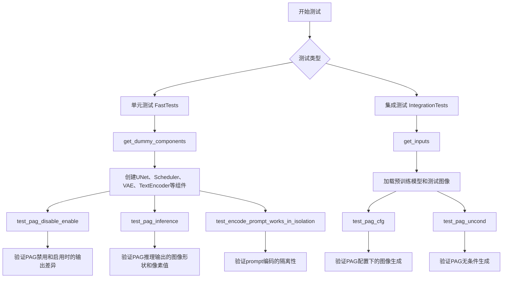

## 类结构

```
unittest.TestCase
├── StableDiffusionPAGImg2ImgPipelineFastTests
│   ├── IPAdapterTesterMixin
│   ├── PipelineLatentTesterMixin
│   ├── PipelineKarrasSchedulerTesterMixin
│   └── PipelineTesterMixin
└── StableDiffusionPAGImg2ImgPipelineIntegrationTests
```

## 全局变量及字段


### `enable_full_determinism`
    
Enables full determinism for reproducible test results across runs

类型：`function`
    


### `StableDiffusionPAGImg2ImgPipelineFastTests.pipeline_class`
    
The pipeline class being tested, representing the Stable Diffusion PAG image-to-image pipeline

类型：`Type[StableDiffusionPAGImg2ImgPipeline]`
    


### `StableDiffusionPAGImg2ImgPipelineFastTests.params`
    
Set of call parameters for the pipeline including text-guided image variation params and PAG-specific params (pag_scale, pag_adaptive_scale), excluding height and width

类型：`set`
    


### `StableDiffusionPAGImg2ImgPipelineFastTests.required_optional_params`
    
Set of optional parameters that are required for the pipeline, derived from PipelineTesterMixin but excluding latents

类型：`set`
    


### `StableDiffusionPAGImg2ImgPipelineFastTests.batch_params`
    
Set of parameters that can be used for batch processing in text-guided image variation tasks

类型：`set`
    


### `StableDiffusionPAGImg2ImgPipelineFastTests.image_params`
    
Set of parameters related to input images for image-to-image pipelines

类型：`set`
    


### `StableDiffusionPAGImg2ImgPipelineFastTests.image_latents_params`
    
Set of parameters related to image latents for image-to-image pipelines

类型：`set`
    


### `StableDiffusionPAGImg2ImgPipelineFastTests.callback_cfg_params`
    
Set of parameters for callback configuration in text-to-image pipelines with classifier-free guidance

类型：`set`
    


### `StableDiffusionPAGImg2ImgPipelineIntegrationTests.pipeline_class`
    
The pipeline class being tested for integration, representing the Stable Diffusion PAG image-to-image pipeline

类型：`Type[StableDiffusionPAGImg2ImgPipeline]`
    


### `StableDiffusionPAGImg2ImgPipelineIntegrationTests.repo_id`
    
HuggingFace model repository ID for loading the Stable Diffusion 1.5 pretrained model

类型：`str`
    
    

## 全局函数及方法


### `StableDiffusionPAGImg2ImgPipelineFastTests.get_dummy_components`

该方法用于创建并返回 Stable Diffusion 图像到图像（PAG 变体）管道所需的所有虚拟（测试用）组件，包括 UNet、调度器、VAE、文本编码器、分词器等，并可选择性地配置时间条件投影维度。

参数：

- `time_cond_proj_dim`：`int` 或 `None`，可选参数，用于指定 UNet 的时间条件投影维度，默认为 `None`

返回值：`Dict[str, Any]`，返回一个包含管道组件的字典，包括 `"unet"`、`"scheduler"`、`"vae"`、`"text_encoder"`、`"tokenizer"`、`"safety_checker"`、`"feature_extractor"` 和 `"image_encoder"` 等键

#### 流程图

```mermaid
flowchart TD
    A[开始 get_dummy_components] --> B[设置随机种子 torch.manual_seed(0)]
    B --> C[创建 UNet2DConditionModel]
    C --> D[创建 EulerDiscreteScheduler]
    D --> E[设置随机种子 torch.manual_seed(0)]
    E --> F[创建 AutoencoderKL VAE]
    F --> G[创建 CLIPTextConfig]
    G --> H[创建 CLIPTextModel]
    H --> I[创建 CLIPTokenizer]
    I --> J[组装 components 字典]
    J --> K[返回 components]
```

#### 带注释源码

```python
def get_dummy_components(self, time_cond_proj_dim=None):
    """
    创建并返回用于测试的虚拟组件字典。
    
    参数:
        time_cond_proj_dim: 可选参数，指定UNet的时间条件投影维度
        
    返回:
        包含管道所有组件的字典
    """
    # 设置随机种子以确保可重复性
    torch.manual_seed(0)
    
    # 创建 UNet2DConditionModel 实例
    # 用于条件图像生成的 U-Net 模型
    unet = UNet2DConditionModel(
        block_out_channels=(32, 64),        # 模块输出通道数
        layers_per_block=2,                 # 每个块的层数
        time_cond_proj_dim=time_cond_proj_dim,  # 时间条件投影维度（可选）
        sample_size=32,                     # 样本尺寸
        in_channels=4,                      # 输入通道数（latent 空间）
        out_channels=4,                     # 输出通道数
        down_block_types=("DownBlock2D", "CrossAttnDownBlock2D"),  # 下采样块类型
        up_block_types=("CrossAttnUpBlock2D", "UpBlock2D"),        # 上采样块类型
        cross_attention_dim=32,             # 交叉注意力维度
    )
    
    # 创建欧拉离散调度器
    # 控制扩散模型的噪声调度
    scheduler = EulerDiscreteScheduler(
        beta_start=0.00085,                 # Beta 起始值
        beta_end=0.012,                     # Beta 结束值
        steps_offset=1,                     # 步骤偏移量
        beta_schedule="scaled_linear",      # Beta 调度方案
        timestep_spacing="leading",         # 时间步长间距
    )
    
    # 重新设置随机种子确保 VAE 的确定性
    torch.manual_seed(0)
    
    # 创建自编码器 KL 模型
    # 用于将图像编码到 latent 空间和解码回来
    vae = AutoencoderKL(
        block_out_channels=[32, 64],        # 块输出通道数
        in_channels=3,                      # 输入通道数（RGB）
        out_channels=3,                     # 输出通道数
        down_block_types=["DownEncoderBlock2D", "DownEncoderBlock2D"],  # 下采样编码块
        up_block_types=["UpDecoderBlock2D", "UpDecoderBlock2D"],        # 上采样解码块
        latent_channels=4,                 # Latent 通道数
        sample_size=128,                    # 样本尺寸
    )
    
    # 创建 CLIP 文本编码器配置
    text_encoder_config = CLIPTextConfig(
        bos_token_id=0,                      # 句子开始 token ID
        eos_token_id=2,                      # 句子结束 token ID
        hidden_size=32,                     # 隐藏层大小
        intermediate_size=37,               # 中间层大小
        layer_norm_eps=1e-05,               # LayerNorm  epsilon
        num_attention_heads=4,              # 注意力头数
        num_hidden_layers=5,               # 隐藏层数
        pad_token_id=1,                     # 填充 token ID
        vocab_size=1000,                    # 词汇表大小
    )
    
    # 创建 CLIP 文本编码器模型
    text_encoder = CLIPTextModel(text_encoder_config)
    
    # 创建 CLIP 分词器
    # 使用预训练的小规模 CLIP 模型
    tokenizer = CLIPTokenizer.from_pretrained("hf-internal-testing/tiny-random-clip")

    # 组装所有组件到字典中
    components = {
        "unet": unet,                        # UNet 条件模型
        "scheduler": scheduler,             # 噪声调度器
        "vae": vae,                          # 变分自编码器
        "text_encoder": text_encoder,        # 文本编码器
        "tokenizer": tokenizer,              # 分词器
        "safety_checker": None,             # 安全检查器（测试中禁用）
        "feature_extractor": None,           # 特征提取器（测试中禁用）
        "image_encoder": None,               # 图像编码器（测试中禁用）
    }
    
    # 返回完整的组件字典
    return components
```


### `StableDiffusionPAGImg2ImgPipelineFastTests.get_dummy_tiny_autoencoder`

这是一个测试辅助方法，用于创建一个配置简单的小型自编码器（AutoencoderTiny）实例，主要用于单元测试场景。该方法返回一个配置了特定通道数的小型变分自编码器，用于扩散模型的图像编码和解码测试。

参数：

- 无

返回值：`AutoencoderTiny`，返回一个配置好的小型自编码器实例，包含3个输入通道、3个输出通道和4个潜在通道。

#### 流程图

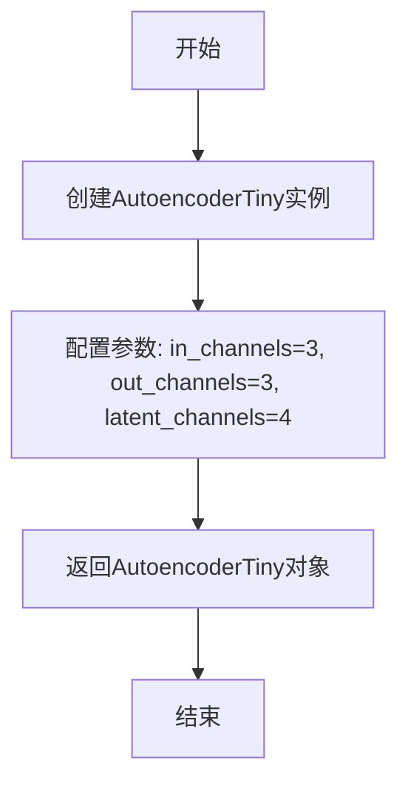

#### 带注释源码

```python
def get_dummy_tiny_autoencoder(self):
    """
    创建并返回一个配置简单的小型自编码器（AutoencoderTiny）实例。
    
    该方法主要用于测试目的，创建的编码器具有以下配置：
    - in_channels=3: 输入通道数，对应RGB图像的3个颜色通道
    - out_channels=3: 输出通道数，同样对应RGB图像的3个颜色通道
    - latent_channels=4: 潜在空间通道数，用于压缩表示
    
    Returns:
        AutoencoderTiny: 一个配置好的小型自编码器实例，可用于测试PAG（Progressive Attention Guidance）
                       图像到图像pipeline的集成功能。
    """
    return AutoencoderTiny(in_channels=3, out_channels=3, latent_channels=4)
```


### `StableDiffusionPAGImg2ImgPipelineFastTests.get_dummy_inputs`

该方法用于生成测试 Stable Diffusion Img2Img Pipeline 所需的虚拟输入数据，包括随机图像、生成器、推理步数、引导系数等参数，为后续的 Pipeline 功能测试提供标准化的输入样本。

参数：

- `device`：`torch.device`，指定计算设备（CPU/CUDA/MPS）
- `seed`：`int`，随机种子，默认为 0，用于确保测试结果的可复现性

返回值：`Dict`，包含以下键值的字典：
- `prompt`：`str`，文本提示词
- `image`：`torch.Tensor`，输入图像张量
- `generator`：`torch.Generator`，随机数生成器
- `num_inference_steps`：`int`，推理步数
- `guidance_scale`：`float`， Classifier-Free Guidance 强度
- `pag_scale`：`float`，PAG（Progressive Animation Guidance）强度
- `output_type`：`str`，输出类型（numpy 数组）

#### 流程图

```mermaid
flowchart TD
    A[开始 get_dummy_inputs] --> B[使用 floats_tensor 生成随机图像张量]
    B --> C[将图像张量移动到指定设备]
    C --> D[图像值归一化到 [0, 1] 范围]
    D --> E{设备是否为 MPS?}
    E -->|是| F[使用 torch.manual_seed 创建生成器]
    E -->|否| G[使用 torch.Generator 创建生成器]
    F --> H[设置生成器随机种子]
    G --> H
    H --> I[构建输入参数字典]
    I --> J[返回 inputs 字典]
```

#### 带注释源码

```python
def get_dummy_inputs(self, device, seed=0):
    # 使用 floats_tensor 生成形状为 (1, 3, 32, 32) 的随机浮点数张量
    # rng=random.Random(seed) 确保随机性的可复现性
    image = floats_tensor((1, 3, 32, 32), rng=random.Random(seed)).to(device)
    
    # 将图像数值从 [-1, 1] 归一化到 [0, 1] 范围
    # 原始 floats_tensor 生成的值域为 [-1, 1]
    image = image / 2 + 0.5
    
    # MPS 设备不支持 torch.Generator，需要特殊处理
    if str(device).startswith("mps"):
        # MPS 设备使用 torch.manual_seed
        generator = torch.manual_seed(seed)
    else:
        # 其他设备（CPU/CUDA）使用 torch.Generator 并设置随机种子
        generator = torch.Generator(device=device).manual_seed(seed)
    
    # 构建测试所需的完整输入参数字典
    inputs = {
        "prompt": "A painting of a squirrel eating a burger",  # 测试用文本提示
        "image": image,                                        # 输入图像张量
        "generator": generator,                                # 随机生成器确保可复现性
        "num_inference_steps": 2,                              # 较少步数加快测试速度
        "guidance_scale": 6.0,                                  # CFG 引导强度
        "pag_scale": 0.9,                                       # PAG 引导强度
        "output_type": "np",                                   # 输出为 numpy 数组
    }
    return inputs
```


### `StableDiffusionPAGImg2ImgPipelineFastTests.test_pag_disable_enable`

该测试方法用于验证 Stable Diffusion 图像到图像管道中 PAG（Progressive Adversarial Generation）功能的正确禁用和启用行为。测试通过比较基础管道输出、PAG 禁用时的输出以及 PAG 启用时的输出，确保 PAG 功能在禁用时不影响基础输出，在启用时能够产生明显不同的结果。

参数：

- `self`：无需传入，由测试框架自动管理

返回值：无返回值（`None`），该方法通过断言验证功能正确性

#### 流程图

```mermaid
flowchart TD
    A[开始测试] --> B[获取虚拟组件]
    B --> C[创&#x5EFA; StableDiffusionImg2ImgPipeline &#x57FA;&#x7840;&#x7B49;&#x7B49;]
    C --> D[&#x8BBE;&#x7F6E;&#x8BBE;&#x5907;&#x4E3A; cpu]
    D --> E[&#x83B7;&#x53D6;&#x865A;&#x62DF;&#x8F93;&#x5165; &#x53C2;&#x6570;]
    E --> F[&#x8C03;&#x7528;&#x57FA;&#x7840;&#x7B49;&#x7B49; &#x83B7;&#x53D6;&#x8F93;&#x51FA; out]
    F --> G[&#x521B;&#x5EFA; StableDiffusionPAGImg2ImgPipeline]
    G --> H[&#x8BBE;&#x7F6E; pag_scale=0.0 &#x7981;&#x7528; PAG]
    H --> I[&#x83B7;&#x53D6;&#x7981;&#x7528;&#x65F6;&#x8F93;&#x51FA; out_pag_disabled]
    I --> J[&#x521B;&#x5EFA; &#x542F;&#x7528;PAG&#x7684;&#x7B49;&#x7B49;]
    J --> K[&#x83B7;&#x53D6;&#x542F;&#x7528;&#x65F6;&#x8F93;&#x51FA; out_pag_enabled]
    K --> L{&#x9A8C;&#x8BC1; out == out_pag_disabled}
    L -->|True| M{&#x9A8C;&#x8BC1; out != out_pag_enabled}
    M -->|True| N[&#x6D4B;&#x8BD5;&#x901A;&#x8FC7;]
    M -->|False| O[&#x6D4B;&#x8BD5;&#x5931;&#x8D25;]
    L -->|False| O
```

#### 带注释源码

```python
def test_pag_disable_enable(self):
    """
    测试 PAG 功能的禁用和启用行为。
    验证：
    1. 当 pag_scale=0.0 时，输出应与基础管道相同
    2. 当 PAG 启用时，输出应与基础管道不同
    """
    # 使用 CPU 设备以确保确定性结果，因为 torch.Generator 依赖设备
    device = "cpu"
    
    # 获取测试所需的虚拟组件（UNet、VAE、文本编码器等）
    components = self.get_dummy_components()

    # ========== 第一部分：基础管道测试（无 PAG） ==========
    # 创建标准 StableDiffusionImg2ImgPipeline（不具备 PAG 功能）
    pipe_sd = StableDiffusionImg2ImgPipeline(**components)
    # 将管道移至指定设备
    pipe_sd = pipe_sd.to(device)
    # 设置进度条配置，disable=None 表示不禁用进度条
    pipe_sd.set_progress_bar_config(disable=None)

    # 获取虚拟输入参数
    inputs = self.get_dummy_inputs(device)
    # 移除 pag_scale 参数，因为基础管道不支持该参数
    del inputs["pag_scale"]
    
    # 验证基础管道的调用签名中不包含 pag_scale 参数
    assert "pag_scale" not in inspect.signature(pipe_sd.__call__).parameters, (
        f"`pag_scale` should not be a call parameter of the base pipeline {pipe_sd.__class__.__name__}."
    )
    
    # 执行推理并获取输出的右下角 3x3 区域
    out = pipe_sd(**inputs).images[0, -3:, -3:, -1]

    # ========== 第二部分：PAG 禁用测试（pag_scale=0.0） ==========
    # 创建具备 PAG 功能的管道类
    pipe_pag = self.pipeline_class(**components)
    pipe_pag = pipe_pag.to(device)
    pipe_pag.set_progress_bar_config(disable=None)

    # 获取输入并设置 pag_scale 为 0.0 以禁用 PAG
    inputs = self.get_dummy_inputs(device)
    inputs["pag_scale"] = 0.0
    # 执行推理，获取禁用 PAG 时的输出
    out_pag_disabled = pipe_pag(**inputs).images[0, -3:, -3:, -1]

    # ========== 第三部分：PAG 启用测试 ==========
    # 创建启用 PAG 的管道，指定应用 PAG 的层
    pipe_pag = self.pipeline_class(**components, pag_applied_layers=["mid", "up", "down"])
    pipe_pag = pipe_pag.to(device)
    pipe_pag.set_progress_bar_config(disable=None)

    # 使用默认 pag_scale（从 get_dummy_inputs 获取）执行推理
    inputs = self.get_dummy_inputs(device)
    out_pag_enabled = pipe_pag(**inputs).images[0, -3:, -3:, -1]

    # ========== 第四部分：验证断言 ==========
    # 验证当 PAG 禁用时（pag_scale=0.0），输出应与基础管道相同
    # 使用最大绝对差值小于 1e-3 作为相等判断标准
    assert np.abs(out.flatten() - out_pag_disabled.flatten()).max() < 1e-3
    
    # 验证当 PAG 启用时，输出应与基础管道不同
    # 使用最大绝对差值大于 1e-3 作为不同判断标准
    assert np.abs(out.flatten() - out_pag_enabled.flatten()).max() > 1e-3
```


### `StableDiffusionPAGImg2ImgPipelineFastTests.test_pag_inference`

该测试方法用于验证 Stable Diffusion PAG（Progressive Attention Guidance）图像到图像管道的推理功能，测试管道能否正确生成指定尺寸（32x32）的图像，并通过数值断言确保输出图像的像素值与预期值在允许误差范围内一致。

参数：

- `self`：`StableDiffusionPAGImg2ImgPipelineFastTests`，测试类实例本身，用于访问类方法和属性

返回值：无（`None`），该方法为测试方法，使用断言进行验证，不返回具体值

#### 流程图

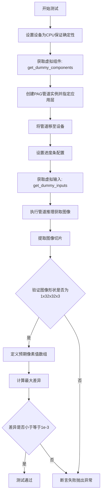

#### 带注释源码

```python
def test_pag_inference(self):
    """
    测试PAG图像到图像管道的推理功能
    
    该测试方法验证:
    1. 管道能够成功执行推理并生成图像
    2. 输出图像的形状正确 (1, 32, 32, 3)
    3. 输出图像的像素值与预期值匹配
    """
    # 设置设备为CPU，确保torch.Generator的确定性
    device = "cpu"  # ensure determinism for the device-dependent torch.Generator
    
    # 获取虚拟组件（UNet、VAE、Scheduler、TextEncoder等）
    components = self.get_dummy_components()

    # 创建PAG管道实例，指定PAG应用的层
    pipe_pag = self.pipeline_class(**components, pag_applied_layers=["mid", "up", "down"])
    
    # 将管道移至指定设备
    pipe_pag = pipe_pag.to(device)
    
    # 设置进度条配置，disable=None表示不禁用进度条
    pipe_pag.set_progress_bar_config(disable=None)

    # 获取虚拟输入参数（prompt、image、generator等）
    inputs = self.get_dummy_inputs(device)
    
    # 执行管道推理并获取生成的图像
    image = pipe_pag(**inputs).images
    
    # 提取图像右下角3x3区域及最后一个通道
    image_slice = image[0, -3:, -3:, -1]

    # 断言验证输出图像形状是否符合预期
    assert image.shape == (
        1,
        32,
        32,
        3,
    ), f"the shape of the output image should be (1, 32, 32, 3) but got {image.shape}"

    # 定义预期输出的像素值（用于回归测试）
    expected_slice = np.array(
        [0.44203848, 0.49598145, 0.42248967, 0.6707724, 0.5683791, 0.43603387, 0.58316565, 0.60077155, 0.5174199]
    )
    
    # 计算实际输出与预期输出的最大差异
    max_diff = np.abs(image_slice.flatten() - expected_slice).max()
    
    # 断言验证差异在允许范围内（小于等于0.001）
    self.assertLessEqual(max_diff, 1e-3)
```


### `StableDiffusionPAGImg2ImgPipelineFastTests.test_encode_prompt_works_in_isolation`

该方法是一个测试函数，用于验证文本编码提示（prompt）功能在隔离环境下能否正常工作。它通过构建额外的必需参数字典（包括设备和分类器自由引导标志），调用父类的同名测试方法来执行具体的验证逻辑。

参数：

- `self`：隐式参数，测试类实例本身，无类型描述
- `extra_required_param_value_dict`：字典类型，包含额外的必需参数字典，传递给父类测试方法用于配置测试环境

返回值：返回类型取决于父类 `test_encode_prompt_works_in_isolation` 方法的返回类型，通常为 `None` 或 `unittest.TestResult`，描述父类测试方法的执行结果

#### 流程图

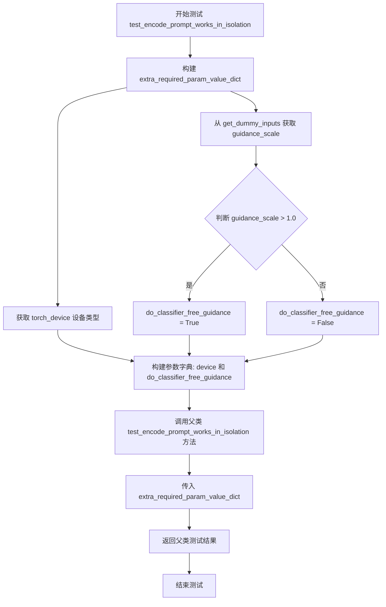

#### 带注释源码

```python
def test_encode_prompt_works_in_isolation(self):
    """
    测试 encode_prompt 方法在隔离环境下是否能正常工作
    
    该测试方法重写了父类的同名测试方法，用于验证 StableDiffusionPAGImg2ImgPipeline
    中的文本编码提示功能。主要是为了处理 PAG（Progressive Attribute Guidance）相关的
    额外参数配置。
    """
    # 构建额外的必需参数字典，用于传递给父类测试方法
    extra_required_param_value_dict = {
        # 获取当前测试设备的类型（如 'cuda', 'cpu', 'mps' 等）
        "device": torch.device(torch_device).type,
        
        # 判断是否需要执行 classifier-free guidance
        # 通过检查 guidance_scale 是否大于 1.0 来决定
        # 如果 guidance_scale > 1.0，则需要执行 classifier-free guidance
        "do_classifier_free_guidance": self.get_dummy_inputs(device=torch_device).get("guidance_scale", 1.0) > 1.0,
    }
    
    # 调用父类的测试方法，传入额外的参数字典
    # 父类方法将执行具体的 encode_prompt 隔离测试逻辑
    return super().test_encode_prompt_works_in_isolation(extra_required_param_value_dict)
```


### `StableDiffusionPAGImg2ImgPipelineIntegrationTests.setUp`

该方法为集成测试类提供初始化设置，在每个测试方法执行前调用，用于回收垃圾并清空GPU缓存，以确保测试环境的干净状态。

参数：

- `self`：对象实例本身，代表当前的测试类实例

返回值：`None`，无返回值描述

#### 流程图

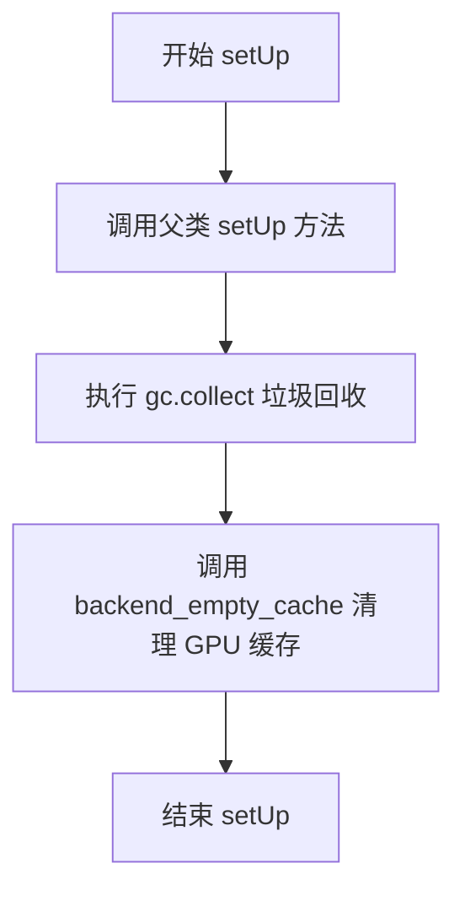

#### 带注释源码

```python
def setUp(self):
    """
    测试前置设置方法，在每个测试方法运行前被调用。
    用于初始化测试环境和清理资源。
    """
    # 调用父类的 setUp 方法，确保父类的初始化逻辑也被执行
    super().setUp()
    
    # 手动触发 Python 的垃圾回收，释放不再使用的对象
    gc.collect()
    
    # 清空 GPU 缓存，释放 GPU 显存，确保测试从干净的环境开始
    # torch_device 是从 testing_utils 导入的全局变量，表示当前测试设备
    backend_empty_cache(torch_device)
```


### `StableDiffusionPAGImg2ImgPipelineIntegrationTests.tearDown`

清理测试环境，释放GPU内存并回收垃圾资源，确保测试间的隔离性。

参数：

- `self`：隐式参数，类型为 `StableDiffusionPAGImg2ImgPipelineIntegrationTests`，表示测试类实例本身

返回值：`None`，无返回值，执行清理操作后直接结束

#### 流程图

```mermaid
flowchart TD
    A[tearDown 开始] --> B[调用 super&#40;&#41;.tearDown]
    B --> C[执行 gc.collect&#40;&#41; 回收垃圾对象]
    C --> D[调用 backend_empty_cache&#40;torch_device&#41; 释放GPU缓存]
    D --> E[tearDown 结束]
```

#### 带注释源码

```python
def tearDown(self):
    """
    测试用例清理方法，在每个测试方法执行完毕后自动调用。
    用于释放测试过程中占用的资源，防止测试间的相互影响。
    """
    # 调用父类的 tearDown 方法，执行父类定义的清理逻辑
    super().tearDown()
    
    # 手动触发 Python 垃圾回收，释放测试中创建的临时对象
    gc.collect()
    
    # 清理 GPU 缓存，释放 CUDA 内存，确保后续测试有足够的 GPU 资源可用
    # torch_device 是从 testing_utils 导入的全局变量，表示当前测试使用的设备
    backend_empty_cache(torch_device)
```


### `StableDiffusionPAGImg2ImgPipelineIntegrationTests.get_inputs`

该函数用于为集成测试生成图像生成所需的各种输入参数，包括提示词、初始图像、生成器、推理步数、强度、引导比例、PAG缩放比例和输出类型等。

参数：

- `device`：`torch.device`，指定运行设备（如 CPU 或 CUDA 设备）
- `generator_device`：`str`，生成器设备类型，默认为 "cpu"
- `dtype`：`torch.dtype`，张量数据类型，默认为 torch.float32
- `seed`：`int`，随机种子，用于确保可重复性，默认为 0

返回值：`dict`，包含以下键值对：
- `prompt`：`str`，文本提示词
- `image`：加载的 PIL Image 对象
- `generator`：`torch.Generator`，随机数生成器
- `num_inference_steps`：`int`，推理步数
- `strength`：`float`，图像变换强度
- `guidance_scale`：`float`，无分类器引导比例
- `pag_scale`：`float`，PAG（Perturbed Attention Guidance）缩放比例
- `output_type`：`str`，输出类型

#### 流程图

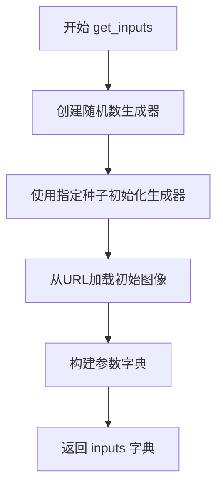

#### 带注释源码

```python
def get_inputs(self, device, generator_device="cpu", dtype=torch.float32, seed=0):
    """
    为集成测试生成输入参数。
    
    参数:
        device: torch.device - 运行设备
        generator_device: str - 生成器设备，默认为 "cpu"
        dtype: torch.dtype - 数据类型，默认为 torch.float32
        seed: int - 随机种子，默认为 0
    
    返回:
        dict: 包含图像生成所需参数的字典
    """
    # 使用指定设备创建随机数生成器，并用种子初始化
    generator = torch.Generator(device=generator_device).manual_seed(seed)
    
    # 从 Hugging Face 数据集加载测试用初始图像
    init_image = load_image(
        "https://huggingface.co/datasets/diffusers/test-arrays/resolve/main"
        "/stable_diffusion_img2img/sketch-mountains-input.png"
    )
    
    # 构建完整的输入参数字典
    inputs = {
        "prompt": "a fantasy landscape, concept art, high resolution",  # 文本提示词
        "image": init_image,                       # 输入图像
        "generator": generator,                    # 随机生成器
        "num_inference_steps": 3,                 # 推理步数
        "strength": 0.75,                          # 图像强度 (0-1)
        "guidance_scale": 7.5,                     # 无分类器引导强度
        "pag_scale": 3.0,                          # PAG 缩放因子
        "output_type": "np",                       # 输出为 numpy 数组
    }
    return inputs
```


### `StableDiffusionPAGImg2ImgPipelineIntegrationTests.test_pag_cfg`

该方法是一个集成测试，用于验证在启用PAG（Progressive Acceleration Guidance）的情况下，Stable Diffusion图像到图像管道的分类器自由引导（CFG）功能是否正常工作。

参数：

- `self`：隐式参数，表示测试类的实例本身。

返回值：`None`，该方法通过断言验证管道输出的图像是否符合预期，没有显式的返回值。

#### 流程图

```mermaid
flowchart TD
    A[开始测试] --> B[从预训练模型加载管道<br/>enable_pag=True, torch_dtype=torch.float16]
    B --> C[启用模型CPU卸载]
    C --> D[设置进度条配置]
    D --> E[获取测试输入<br/>调用get_inputs方法]
    E --> F[执行管道推理<br/>pipeline(**inputs)]
    F --> G[提取输出图像]
    G --> H[断言图像形状<br/>应为 (1, 512, 512, 3)]
    H --> I[提取图像切片<br/>image[0, -3:, -3:, -1]]
    I --> J[定义预期像素值数组]
    J --> K[断言输出与预期差异 < 1e-3]
    K --> L[测试通过]
```

#### 带注释源码

```python
def test_pag_cfg(self):
    """
    测试PAG在CFG（分类器自由引导）模式下的功能。
    验证启用PAG的Stable Diffusion图像到图像管道能够正确生成图像，
    并且输出与预期的像素值匹配。
    """
    
    # 1. 从预训练模型创建支持PAG的自动图像到图像管道
    # 使用 enable_pag=True 启用PAG功能，使用float16精度以加速推理
    pipeline = AutoPipelineForImage2Image.from_pretrained(
        self.repo_id, 
        enable_pag=True, 
        torch_dtype=torch.float16
    )
    
    # 2. 启用模型CPU卸载，将不使用的模型层移到CPU以节省显存
    pipeline.enable_model_cpu_offload(device=torch_device)
    
    # 3. 设置进度条配置，disable=None表示不禁用进度条
    pipeline.set_progress_bar_config(disable=None)
    
    # 4. 获取测试输入参数
    # 输入参数包括：prompt、image、generator、num_inference_steps、strength、guidance_scale、pag_scale、output_type
    inputs = self.get_inputs(torch_device)
    
    # 5. 执行管道推理，获取生成的图像
    image = pipeline(**inputs).images
    
    # 6. 从生成的图像中提取最后3x3像素区域
    # 提取右下角的像素值用于验证
    image_slice = image[0, -3:, -3:, -1].flatten()
    
    # 7. 断言验证输出图像的形状
    # 期望形状为 (1, 512, 512, 3) - 批量大小1，高512，宽512，RGB 3通道
    assert image.shape == (1, 512, 512, 3), f"Expected shape (1, 512, 512, 3), got {image.shape}"
    
    # 8. 定义预期的像素值数组
    # 这些值是预先计算的正确输出，用于对比验证
    expected_slice = np.array(
        [0.58251953, 0.5722656, 0.5683594, 0.55029297, 0.52001953, 0.52001953, 0.49951172, 0.45410156, 0.50146484]
    )
    
    # 9. 断言验证生成的图像与预期值的差异
    # 使用最大绝对误差作为判断标准，阈值设为1e-3（0.001）
    # 如果差异大于阈值，抛出包含实际值的错误信息
    assert np.abs(image_slice.flatten() - expected_slice).max() < 1e-3, (
        f"output is different from expected, {image_slice.flatten()}"
    )
```


### `StableDiffusionPAGImg2ImgPipelineIntegrationTests.test_pag_uncond`

该测试方法用于验证在无分类器自由引导（CFG）模式下（guidance_scale=0.0），PAG（Progressive Aggregation Guidance）功能能否正确工作。它通过加载预训练的Stable Diffusion模型，传入guidance_scale=0.0的条件进行推理，并验证输出图像的形状和像素值是否符合预期。

参数：此方法无显式参数（使用self和从get_inputs获取的inputs）

返回值：`None`，该方法通过断言进行测试验证，无显式返回值

#### 流程图

```mermaid
flowchart TD
    A[开始测试 test_pag_uncond] --> B[从预训练模型加载AutoPipelineForImage2Image<br/>enable_pag=True, torch_dtype=torch.float16]
    B --> C[启用模型CPU卸载<br/>enable_model_cpu_offload]
    C --> D[设置进度条配置<br/>set_progress_bar_config]
    D --> E[调用get_inputs获取输入参数<br/>guidance_scale=0.0]
    E --> F[执行管道推理<br/>pipeline(**inputs)]
    F --> G[提取输出图像<br/>image = result.images]
    G --> H[获取图像切片<br/>image[0, -3:, -3:, -1]]
    H --> I{断言: image.shape == (1, 512, 512, 3)}
    I -->|是| J[定义期望像素值数组]
    J --> K{断言: 输出与期望差异 < 1e-3}
    K -->|是| L[测试通过]
    K -->|否| M[抛出断言错误]
    I -->|否| M
```

#### 带注释源码

```python
def test_pag_uncond(self):
    """
    测试在无分类器自由引导（guidance_scale=0.0）下PAG功能是否正常工作
    
    该测试验证了:
    1. 管道能够正确加载并启用PAG功能
    2. 在guidance_scale=0.0时，管道仍然能够生成有效图像
    3. 输出的图像形状和像素值符合预期
    """
    # 从预训练模型加载图像到图像管道，启用PAG功能，使用float16精度
    pipeline = AutoPipelineForImage2Image.from_pretrained(
        self.repo_id, 
        enable_pag=True, 
        torch_dtype=torch.float16
    )
    
    # 启用模型CPU卸载以节省GPU显存
    pipeline.enable_model_cpu_offload(device=torch_device)
    
    # 设置进度条配置，disable=None表示不禁用进度条
    pipeline.set_progress_bar_config(disable=None)

    # 获取测试输入参数，guidance_scale=0.0表示无引导（unconditional）
    inputs = self.get_inputs(torch_device, guidance_scale=0.0)
    
    # 执行管道推理，获取生成的图像
    image = pipeline(**inputs).images

    # 提取图像右下角3x3区域的像素值并展平
    image_slice = image[0, -3:, -3:, -1].flatten()
    
    # 断言输出图像形状为(1, 512, 512, 3)
    assert image.shape == (1, 512, 512, 3)
    
    # 定义期望的像素值数组（用于无引导情况下的基准验证）
    expected_slice = np.array(
        [0.5986328, 0.52441406, 0.3972168, 0.4741211, 0.34985352, 0.22705078, 0.4128418, 0.2866211, 0.31713867]
    )

    # 断言实际输出与期望值的最大差异小于1e-3
    assert np.abs(image_slice.flatten() - expected_slice).max() < 1e-3, (
        f"output is different from expected, {image_slice.flatten()}"
    )
```


### `StableDiffusionPAGImg2ImgPipelineFastTests.get_dummy_components`

该方法用于创建虚拟（dummy）组件集合，生成 Stable Diffusion PAG（Progressive Acceleration Guidance）Img2Img Pipeline 测试所需的所有模型组件，包括 UNet、VAE、Scheduler、Text Encoder 和 Tokenizer 等，用于单元测试而不需要加载真实的预训练模型权重。

参数：

- `time_cond_proj_dim`：`Optional[int]`，可选参数，指定 UNet 的时间条件投影维度（time conditioning projection dimension），用于控制时间嵌入的维度，若为 None 则使用默认值。

返回值：`Dict[str, Any]`，返回一个字典，包含构建 StableDiffusionPAGImg2ImgPipeline 所需的所有组件键值对，键包括 "unet"、"scheduler"、"vae"、"text_encoder"、"tokenizer"、"safety_checker"、"feature_extractor" 和 "image_encoder"。

#### 流程图

```mermaid
flowchart TD
    A[开始 get_dummy_components] --> B[设置随机种子 torch.manual_seed(0)]
    B --> C[创建 UNet2DConditionModel]
    C --> D[创建 EulerDiscreteScheduler]
    D --> E[设置随机种子 torch.manual_seed(0)]
    E --> F[创建 AutoencoderKL VAE]
    F --> G[创建 CLIPTextConfig 文本编码器配置]
    G --> H[创建 CLIPTextModel 文本编码器]
    H --> I[创建 CLIPTokenizer 分词器]
    I --> J[组装 components 字典]
    J --> K[返回 components]
```

#### 带注释源码

```python
def get_dummy_components(self, time_cond_proj_dim=None):
    """
    创建虚拟组件用于测试 StableDiffusionPAGImg2ImgPipeline
    
    参数:
        time_cond_proj_dim: 可选，UNet的时间条件投影维度，默认值为None
    
    返回:
        包含所有pipeline组件的字典
    """
    # 设置随机种子以确保可重复性
    torch.manual_seed(0)
    
    # 创建 UNet2DConditionModel - 用于图像去噪的核心模型
    # 参数说明:
    #   - block_out_channels: UNet的通道数配置 (32, 64)
    #   - layers_per_block: 每个块中的层数 (2)
    #   - time_cond_proj_dim: 时间条件投影维度，由参数传入
    #   - sample_size: 输入样本的空间尺寸 (32)
    #   - in_channels: 输入通道数 (4，对应latent空间)
    #   - out_channels: 输出通道数 (4)
    #   - down_block_types: 下采样块类型
    #   - up_block_types: 上采样块类型
    #   - cross_attention_dim: 交叉注意力维度 (32)
    unet = UNet2DConditionModel(
        block_out_channels=(32, 64),
        layers_per_block=2,
        time_cond_proj_dim=time_cond_proj_dim,
        sample_size=32,
        in_channels=4,
        out_channels=4,
        down_block_types=("DownBlock2D", "CrossAttnDownBlock2D"),
        up_block_types=("CrossAttnUpBlock2D", "UpBlock2D"),
        cross_attention_dim=32,
    )
    
    # 创建 EulerDiscreteScheduler - 用于离散时间步的调度器
    # 参数说明:
    #   - beta_start: beta_schedule起始值 (0.00085)
    #   - beta_end: beta_schedule结束值 (0.012)
    #   - steps_offset: 步骤偏移量 (1)
    #   - beta_schedule: beta调度方式 ("scaled_linear")
    #   - timestep_spacing: 时间步间距方式 ("leading")
    scheduler = EulerDiscreteScheduler(
        beta_start=0.00085,
        beta_end=0.012,
        steps_offset=1,
        beta_schedule="scaled_linear",
        timestep_spacing="leading",
    )
    
    # 重新设置随机种子以确保VAE的可重复性
    torch.manual_seed(0)
    
    # 创建 AutoencoderKL - VAE变分自编码器用于图像编码/解码
    # 参数说明:
    #   - block_out_channels: VAE编码器/解码器的通道数配置 [32, 64]
    #   - in_channels: 输入图像通道数 (3，RGB)
    #   - out_channels: 输出图像通道数 (3，RGB)
    #   - down_block_types: 下采样块类型
    #   - up_block_types: 上采样块类型
    #   - latent_channels: latent空间通道数 (4)
    #   - sample_size: 样本空间尺寸 (128)
    vae = AutoencoderKL(
        block_out_channels=[32, 64],
        in_channels=3,
        out_channels=3,
        down_block_types=["DownEncoderBlock2D", "DownEncoderBlock2D"],
        up_block_types=["UpDecoderBlock2D", "UpDecoderBlock2D"],
        latent_channels=4,
        sample_size=128,
    )
    
    # 创建 CLIPTextConfig - 文本编码器的配置
    # 使用极小配置以加快测试速度
    text_encoder_config = CLIPTextConfig(
        bos_token_id=0,           # 句子起始token ID
        eos_token_id=2,           # 句子结束token ID
        hidden_size=32,           # 隐藏层维度
        intermediate_size=37,     # 中间层维度
        layer_norm_eps=1e-05,     # LayerNorm epsilon
        num_attention_heads=4,    # 注意力头数
        num_hidden_layers=5,      # 隐藏层数量
        pad_token_id=1,           # 填充token ID
        vocab_size=1000,          # 词汇表大小
    )
    
    # 创建 CLIPTextModel - CLIP文本编码器模型
    text_encoder = CLIPTextModel(text_encoder_config)
    
    # 创建 CLIPTokenizer - CLIP分词器
    # 从预训练模型加载tiny版本用于测试
    tokenizer = CLIPTokenizer.from_pretrained("hf-internal-testing/tiny-random-clip")
    
    # 组装所有组件到字典中
    components = {
        "unet": unet,                      # UNet2DConditionModel实例
        "scheduler": scheduler,            # EulerDiscreteScheduler实例
        "vae": vae,                        # AutoencoderKL实例
        "text_encoder": text_encoder,      # CLIPTextModel实例
        "tokenizer": tokenizer,            # CLIPTokenizer实例
        "safety_checker": None,            # 安全检查器（测试中禁用）
        "feature_extractor": None,        # 特征提取器（测试中禁用）
        "image_encoder": None,             # 图像编码器（用于IP-Adapter，测试中禁用）
    }
    
    # 返回完整的组件字典
    return components
```


### `StableDiffusionPAGImg2ImgPipelineFastTests.get_dummy_tiny_autoencoder`

该方法用于创建并返回一个配置简化的微型自编码器（AutoencoderTiny）实例，主要用于测试目的。该自编码器具有3个输入通道、3个输出通道和4个潜在通道，可作为Stable Diffusion图像到图像流水线的轻量级替代组件。

参数： 无

返回值：`AutoencoderTiny`，返回一个配置好的微型自编码器实例，用于测试环境中替代完整的VAE组件。

#### 流程图

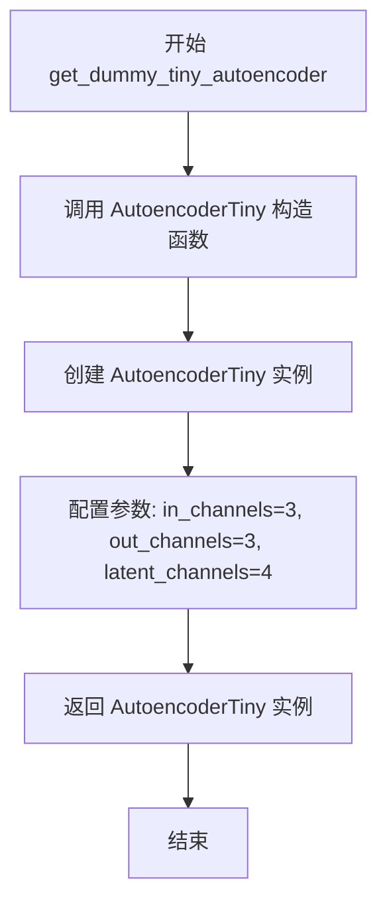

#### 带注释源码

```python
def get_dummy_tiny_autoencoder(self):
    """
    创建一个用于测试的微型自编码器（AutoencoderTiny）实例。
    
    该方法返回一个配置简化的自编码器，用于在单元测试中替代完整的VAE组件，
    以加快测试执行速度并降低资源消耗。
    
    参数:
        无（仅使用self作为实例方法）
    
    返回值:
        AutoencoderTiny: 配置好的微型自编码器实例
            - in_channels: 3 (RGB图像通道数)
            - out_channels: 3 (输出图像通道数)
            - latent_channels: 4 (潜在空间通道数)
    """
    return AutoencoderTiny(in_channels=3, out_channels=3, latent_channels=4)
```


### `StableDiffusionPAGImg2ImgPipelineFastTests.get_dummy_inputs`

该方法用于生成Stable Diffusion图像到图像（Img2Img）管道的虚拟测试输入，创建一个包含提示词、预处理图像、随机生成器及推理参数的字典，供单元测试验证PAG（Prompt Attention Guidance）功能使用。

参数：

- `device`：`torch.device`，指定张量和生成器运行的设备（如"cpu"、"cuda"等）
- `seed`：`int`，随机数生成器的种子，默认值为0，用于确保测试的可重复性

返回值：`Dict[str, Any]`，返回包含以下键的字典：
- `prompt`（str）：测试用提示词
- `image`（torch.Tensor）：预处理后的图像张量，形状为(1, 3, 32, 32)，值域归一化到[0, 1]
- `generator`（torch.Generator）：PyTorch随机生成器，用于确保采样确定性
- `num_inference_steps`（int）：推理步数
- `guidance_scale`（float）：引导比例
- `pag_scale`（float）：PAG缩放因子
- `output_type`（str）：输出类型，此处为"np"（NumPy数组）

#### 流程图

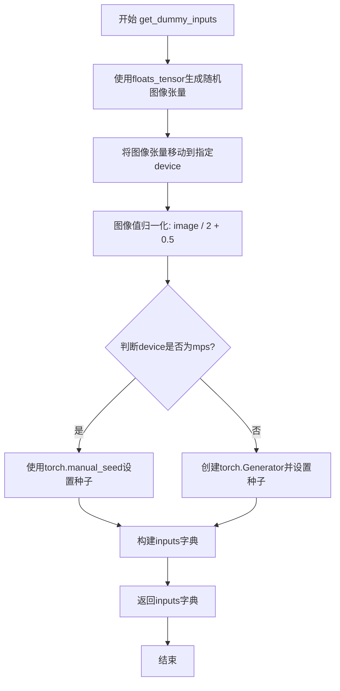

#### 带注释源码

```python
def get_dummy_inputs(self, device, seed=0):
    """
    生成用于测试Stable Diffusion Img2Img管道的虚拟输入参数。
    
    参数:
        device: torch.device, 运行设备
        seed: int, 随机种子，默认0
    
    返回:
        dict: 包含图像生成所需参数的字典
    """
    # 使用floats_tensor生成形状为(1, 3, 32, 32)的随机浮点数张量
    # rng=random.Random(seed)确保随机数生成的可重复性
    image = floats_tensor((1, 3, 32, 32), rng=random.Random(seed)).to(device)
    
    # 将图像值域从[-1, 1]归一化到[0, 1]
    # 原始floats_tensor生成的值范围通常是[-1, 1]
    image = image / 2 + 0.5
    
    # 针对Apple MPS设备的特殊处理
    # MPS (Metal Performance Shaders) 不支持torch.Generator
    if str(device).startswith("mps"):
        # MPS设备使用torch.manual_seed直接设置CPU随机种子
        generator = torch.manual_seed(seed)
    else:
        # 其他设备（CPU/CUDA）创建设备特定的生成器并设置种子
        # 确保在GPU上也能够实现确定性生成
        generator = torch.Generator(device=device).manual_seed(seed)
    
    # 构建完整的输入参数字典
    # 这些参数将传递给StableDiffusionPAGImg2ImgPipeline的__call__方法
    inputs = {
        "prompt": "A painting of a squirrel eating a burger",  # 测试用简短提示词
        "image": image,                                         # 输入图像张量
        "generator": generator,                                 # 随机生成器确保可重复性
        "num_inference_steps": 2,                               # 最小推理步数用于快速测试
        "guidance_scale": 6.0,                                   # Classifier-free guidance强度
        "pag_scale": 0.9,                                        # Prompt Attention Guidance强度
        "output_type": "np",                                    # 输出NumPy数组而非PIL图像
    }
    
    return inputs
```


### `StableDiffusionPAGImg2ImgPipelineFastTests.test_pag_disable_enable`

该测试方法验证了 Stable Diffusion PAG（Progressive Attention Guidance）图像到图像管道中 PAG 功能的禁用和启用逻辑。通过对比基础管道（无 PAG 参数）、PAG 禁用（pag_scale=0.0）和 PAG 启用时的输出，验证 PAG 功能是否正确工作。

参数：

- 无显式参数（除了隐式的 `self`）

返回值：`None`，无返回值（测试方法）

#### 流程图

```mermaid
flowchart TD
    A[开始测试] --> B[获取虚拟组件 components]
    B --> C[创建基础管道 StableDiffusionImg2ImgPipeline]
    C --> D[验证基础管道无 pag_scale 参数]
    D --> E[获取虚拟输入并调用基础管道]
    E --> F[提取输出图像的右下角 3x3 区域]
    F --> G[创建 PAG 管道, 设置 pag_scale=0.0 禁用 PAG]
    G --> H[调用禁用 PAG 的管道]
    H --> I[提取输出图像的右下角 3x3 区域]
    I --> J[创建 PAG 管道, 启用 PAG, pag_applied_layers=['mid', 'up', 'down']]
    J --> K[调用启用 PAG 的管道]
    K --> L[提取输出图像的右下角 3x3 区域]
    L --> M{验证: 基础输出 ≈ PAG禁用输出?}
    M -->|是| N{验证: 基础输出 ≠ PAG启用输出?}
    N -->|是| O[测试通过]
    N -->|否| P[测试失败 - PAG启用时输出应不同]
    M -->|否| Q[测试失败 - PAG禁用时输出应相同]
```

#### 带注释源码

```python
def test_pag_disable_enable(self):
    """
    测试 PAG (Progressive Attention Guidance) 功能的禁用和启用
    
    测试逻辑:
    1. 基础管道 (StableDiffusionImg2ImgPipeline) 不支持 pag_scale 参数
    2. PAG 管道在 pag_scale=0.0 时应产生与基础管道相同的输出
    3. PAG 管道在 pag_scale>0 时应产生与基础管道不同的输出
    """
    # 使用 CPU 设备确保 determinism，确保 torch.Generator 的确定性
    device = "cpu"
    
    # 获取虚拟组件 (UNet, VAE, Scheduler, TextEncoder, Tokenizer 等)
    components = self.get_dummy_components()

    # ===== 步骤 1: 测试基础管道 (不带 PAG 功能) =====
    # 创建基础的 StableDiffusionImg2ImgPipeline
    pipe_sd = StableDiffusionImg2ImgPipeline(**components)
    pipe_sd = pipe_sd.to(device)
    # 设置进度条配置, disable=None 表示不禁用进度条
    pipe_sd.set_progress_bar_config(disable=None)

    # 获取虚拟输入
    inputs = self.get_dummy_inputs(device)
    # 从虚拟输入中删除 pag_scale (基础管道不应有这个参数)
    del inputs["pag_scale"]
    
    # 验证: 确认基础管道的 __call__ 方法没有 pag_scale 参数
    assert "pag_scale" not in inspect.signature(pipe_sd.__call__).parameters, (
        f"`pag_scale` should not be a call parameter of the base pipeline {pipe_sd.__call__.__class__.__name__}."
    )
    
    # 调用基础管道并获取输出图像的右下角 3x3 区域 (取最后一个通道)
    out = pipe_sd(**inputs).images[0, -3:, -3:, -1]

    # ===== 步骤 2: 测试 PAG 禁用 (pag_scale=0.0) =====
    # 创建 PAG 管道, 传入相同组件
    pipe_pag = self.pipeline_class(**components)
    pipe_pag = pipe_pag.to(device)
    pipe_pag.set_progress_bar_config(disable=None)

    # 获取新的虚拟输入
    inputs = self.get_dummy_inputs(device)
    # 设置 pag_scale=0.0 以禁用 PAG 功能
    inputs["pag_scale"] = 0.0
    # 调用管道并获取输出
    out_pag_disabled = pipe_pag(**inputs).images[0, -3:, -3:, -1]

    # ===== 步骤 3: 测试 PAG 启用 =====
    # 创建 PAG 管道, 指定应用 PAG 的层: mid, up, down
    pipe_pag = self.pipeline_class(**components, pag_applied_layers=["mid", "up", "down"])
    pipe_pag = pipe_pag.to(device)
    pipe_pag.set_progress_bar_config(disable=None)

    # 获取新的虚拟输入 (使用默认的 pag_scale=0.9)
    inputs = self.get_dummy_inputs(device)
    # 调用管道并获取输出
    out_pag_enabled = pipe_pag(**inputs).images[0, -3:, -3:, -1]

    # ===== 步骤 4: 验证结果 =====
    # 验证 PAG 禁用时 (pag_scale=0.0) 输出与基础管道相同 (允许 1e-3 的浮点误差)
    assert np.abs(out.flatten() - out_pag_disabled.flatten()).max() < 1e-3
    
    # 验证 PAG 启用时输出与基础管道不同 (差值应大于 1e-3)
    assert np.abs(out.flatten() - out_pag_enabled.flatten()).max() > 1e-3
```


### `StableDiffusionPAGImg2ImgPipelineFastTests.test_pag_inference`

该方法是一个单元测试，用于验证 StableDiffusionPAGImg2ImgPipeline 在图像到图像（Image-to-Image）任务中的推理功能是否正常。测试会创建虚拟组件、初始化管道、执行推理，并验证输出图像的形状和像素值是否与预期相符。

参数：

- `self`：无，方法所属的测试类实例

返回值：`None`，无返回值（测试方法，仅通过断言验证）

#### 流程图

```mermaid
flowchart TD
    A[开始测试 test_pag_inference] --> B[设置设备为 CPU 以保证确定性]
    B --> C[调用 get_dummy_components 获取虚拟组件]
    C --> D[使用虚拟组件和 pag_applied_layers 参数初始化管道]
    D --> E[将管道移动到设备]
    E --> F[配置进度条显示]
    F --> G[调用 get_dummy_inputs 获取虚拟输入]
    G --> H[执行管道推理获取生成的图像]
    H --> I[提取图像切片 image[0, -3:, -3:, -1]]
    I --> J{断言图像形状是否为 (1, 32, 32, 3)}
    J -->|是| K[定义期望的像素值数组 expected_slice]
    K --> L[计算实际输出与期望值的最大差异]
    L --> M{断言最大差异是否 <= 1e-3}
    M -->|是| N[测试通过]
    M -->|否| O[测试失败]
    J -->|否| O
```

#### 带注释源码

```python
def test_pag_inference(self):
    # 设置设备为 CPU，确保设备依赖的 torch.Generator 的确定性
    device = "cpu"  # ensure determinism for the device-dependent torch.Generator
    
    # 获取虚拟组件（UNet、VAE、文本编码器、分词器等）
    components = self.get_dummy_components()

    # 使用虚拟组件初始化 StableDiffusionPAGImg2ImgPipeline 管道
    # 并指定 PAG 应用的层：mid（中间层）、up（上层）、down（下层）
    pipe_pag = self.pipeline_class(**components, pag_applied_layers=["mid", "up", "down"])
    
    # 将管道移动到指定设备（CPU）
    pipe_pag = pipe_pag.to(device)
    
    # 设置进度条配置，disable=None 表示不禁用进度条
    pipe_pag.set_progress_bar_config(disable=None)

    # 获取虚拟输入参数（提示词、图像、生成器、推理步数等）
    inputs = self.get_dummy_inputs(device)
    
    # 执行管道推理，返回结果并获取生成的图像
    image = pipe_pag(**inputs).images
    
    # 提取图像的一个切片：取第一张图像的右下角 3x3 像素区域
    # 切片形状为 (3, 3, 3)，最后一个维度为 RGB 通道
    image_slice = image[0, -3:, -3:, -1]

    # 断言：验证输出图像的形状是否为 (1, 32, 32, 3)
    # 1=批量大小, 32=高度, 32=宽度, 3=RGB 通道
    assert image.shape == (
        1,
        32,
        32,
        3,
    ), f"the shape of the output image should be (1, 32, 32, 3) but got {image.shape}"

    # 定义期望的像素值数组（用于验证推理结果的正确性）
    expected_slice = np.array(
        [0.44203848, 0.49598145, 0.42248967, 0.6707724, 0.5683791, 0.43603387, 0.58316565, 0.60077155, 0.5174199]
    )
    
    # 计算实际输出切片与期望值的最大差异
    max_diff = np.abs(image_slice.flatten() - expected_slice).max()
    
    # 断言：验证最大差异是否在可接受范围内（<= 1e-3）
    self.assertLessEqual(max_diff, 1e-3)
```


### `StableDiffusionPAGImg2ImgPipelineFastTests.test_encode_prompt_works_in_isolation`

该测试方法用于验证 `encode_prompt` 方法在隔离环境下能否正确工作，通过构建额外的必需参数字典（包含设备类型和分类器自由引导标志）并传递给父类的同名测试方法来完成验证。

参数：
- `self`：测试类实例本身，无显式参数

返回值：`Any`，返回父类 `PipelineTesterMixin.test_encode_prompt_works_in_isolation` 方法的返回值，该方法通常执行一系列断言验证 prompt 编码的隔离性。

#### 流程图

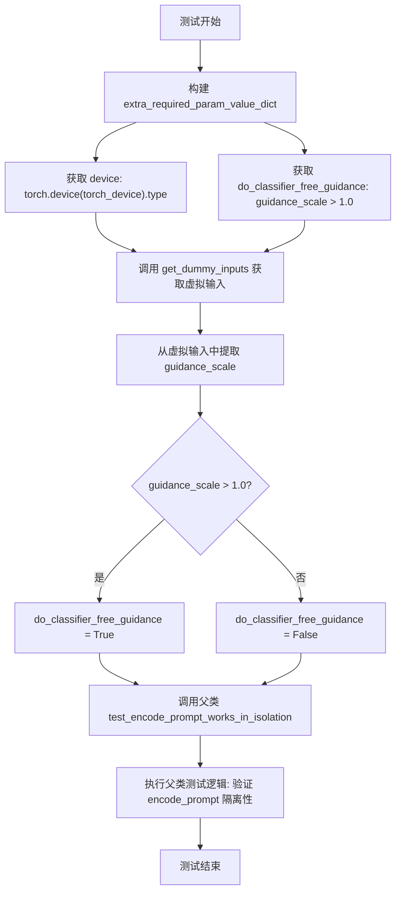

#### 带注释源码

```python
def test_encode_prompt_works_in_isolation(self):
    """
    测试 encode_prompt 方法在隔离环境下能否正确工作。
    该测试通过传递额外的必需参数字典给父类方法来实现。
    """
    # 构建额外的必需参数字典
    # 包含设备类型和分类器自由引导标志
    extra_required_param_value_dict = {
        # 获取当前设备的类型（如 'cuda', 'cpu' 等）
        "device": torch.device(torch_device).type,
        # 从虚拟输入中获取 guidance_scale，判断是否大于 1.0
        # 如果大于 1.0，则需要进行分类器自由引导
        "do_classifier_free_guidance": self.get_dummy_inputs(device=torch_device).get("guidance_scale", 1.0) > 1.0,
    }
    # 调用父类的同名测试方法，传入额外的参数字典
    # 父类方法将验证 encode_prompt 在不同条件下的隔离性
    return super().test_encode_prompt_works_in_isolation(extra_required_param_value_dict)
```


### `StableDiffusionPAGImg2ImgPipelineIntegrationTests.setUp`

该方法是 `StableDiffusionPAGImg2ImgPipelineIntegrationTests` 集成测试类的初始化方法（setUp），在每个测试方法执行前被 unittest 框架自动调用。其核心功能是执行垃圾回收和清理 GPU 缓存，为测试准备干净的环境，确保测试之间不会相互影响。

参数：

- `self`：`StableDiffusionPAGImg2ImgPipelineIntegrationTests`，表示当前测试类的实例对象，隐式参数无需显式传递

返回值：`None`，该方法不返回任何值，仅执行环境清理操作

#### 流程图

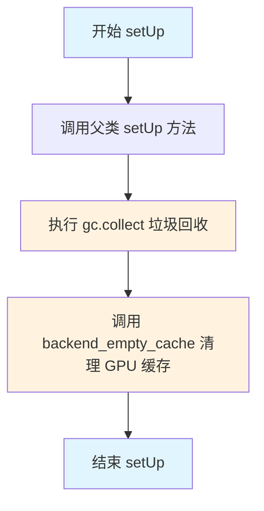

#### 带注释源码

```python
def setUp(self):
    # 调用父类的 setUp 方法，执行 unittest.TestCase 的标准初始化
    super().setUp()
    
    # 执行 Python 垃圾回收，释放不再使用的内存对象
    # 这有助于在测试之间清理内存，防止内存泄漏影响后续测试
    gc.collect()
    
    # 调用后端工具函数清理 GPU 缓存（torch.cuda.empty_cache）
    # 确保 GPU 显存被释放，为当前测试提供干净的 GPU 环境
    # torch_device 是全局变量，表示测试使用的设备（如 'cuda' 或 'cpu'）
    backend_empty_cache(torch_device)
```


### `StableDiffusionPAGImg2ImgPipelineIntegrationTests.tearDown`

该函数是测试类的清理方法，在每个测试用例执行完毕后被调用，用于回收垃圾并清空GPU显存，以确保测试环境不会因为残留数据而影响后续测试。

参数：

- `self`：隐式参数，`unittest.TestCase` 实例本身，无需显式传递

返回值：`None`，无返回值

#### 流程图

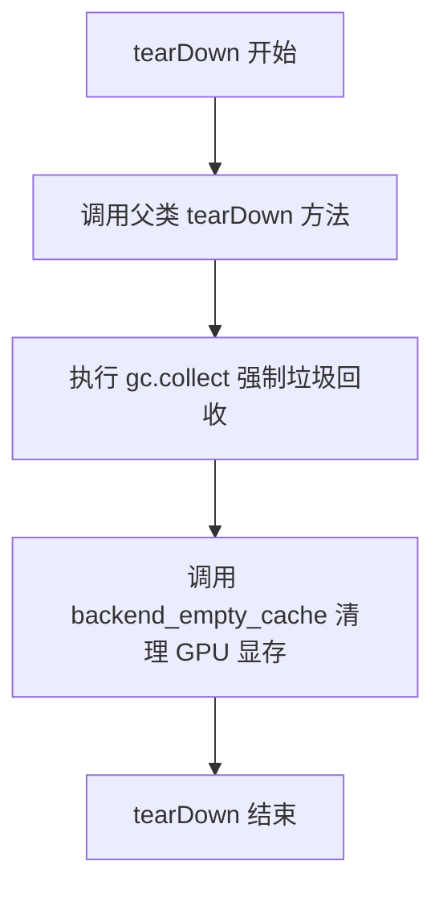

#### 带注释源码

```python
def tearDown(self):
    """
    测试清理方法，在每个测试用例完成后执行
    用于清理测试过程中产生的内存占用和GPU缓存
    """
    # 调用父类的 tearDown 方法，执行 unittest.TestCase 的标准清理逻辑
    super().tearDown()
    
    # 强制进行 Python 垃圾回收，释放测试过程中创建的对象内存
    gc.collect()
    
    # 调用后端工具函数清空 GPU 显存缓存，防止显存泄漏影响后续测试
    backend_empty_cache(torch_device)
```


### `StableDiffusionPAGImg2ImgPipelineIntegrationTests.get_inputs`

该方法用于为Stable Diffusion图像到图像（Image-to-Image）管道生成测试输入参数，封装了prompt、初始图像、生成器、推理步数、强度、引导系数、PAG缩放和输出类型等关键配置。

参数：

- `self`：隐式参数，StableDiffusionPAGImg2ImgPipelineIntegrationTests的实例，代表测试类本身
- `device`：`torch.device`，指定模型运行的目标设备（如CPU或CUDA设备）
- `generator_device`：`str`，默认为"cpu"，用于创建随机数生成器的设备
- `dtype`：`torch.dtype`，默认为`torch.float32`，张量的数据类型
- `seed`：`int`，默认为0，用于随机数生成的种子，确保测试可复现

返回值：`dict`，包含以下键值对：
- `prompt`（str）：生成图像的文本提示
- `image`（PIL.Image或torch.Tensor）：输入的初始图像
- `generator`（torch.Generator）：随机数生成器
- `num_inference_steps`（int）：推理步数
- `strength`（float）：图像变换强度
- `guidance_scale`（float）：分类器自由引导（CFG）系数
- `pag_scale`（float）：PAG（Perturbed Attention Guidance）缩放因子
- `output_type`（str）：输出类型，这里是"np"（numpy数组）

#### 流程图

```mermaid
flowchart TD
    A[开始 get_inputs] --> B[接收参数: device, generator_device, dtype, seed]
    B --> C[使用seed创建torch.Generator]
    C --> D[使用load_image加载远程初始图像]
    D --> E[构建inputs字典]
    E --> F[设置prompt: 'a fantasy landscape, concept art, high resolution']
    E --> G[设置image: init_image]
    E --> H[设置generator: generator]
    E --> I[设置num_inference_steps: 3]
    E --> J[设置strength: 0.75]
    E --> K[设置guidance_scale: 7.5]
    E --> L[设置pag_scale: 3.0]
    E --> M[设置output_type: 'np']
    F --> N[返回inputs字典]
    G --> N
    H --> N
    I --> N
    J --> N
    K --> N
    L --> N
    M --> N
    N --> O[结束]
```

#### 带注释源码

```python
def get_inputs(self, device, generator_device="cpu", dtype=torch.float32, seed=0):
    """
    生成Stable Diffusion图像到图像管道的测试输入参数。
    
    参数:
        device: 模型运行的设备
        generator_device: 随机生成器的设备，默认为"cpu"
        dtype: 张量数据类型，默认为torch.float32
        seed: 随机种子，默认为0，确保可复现性
    
    返回:
        包含管道推理所需参数的字典
    """
    # 使用指定种子在generator_device上创建随机数生成器，确保测试可复现
    generator = torch.Generator(device=generator_device).manual_seed(seed)
    
    # 从HuggingFace加载测试用的初始图像（山脉素描图）
    init_image = load_image(
        "https://huggingface.co/datasets/diffusers/test-arrays/resolve/main"
        "/stable_diffusion_img2img/sketch-mountains-input.png"
    )
    
    # 构建完整的输入参数字典，用于传递给管道
    inputs = {
        "prompt": "a fantasy landscape, concept art, high resolution",  # 文本提示
        "image": init_image,          # 初始输入图像
        "generator": generator,       # 随机数生成器
        "num_inference_steps": 3,     # 推理步数（较少步数用于快速测试）
        "strength": 0.75,             # 图像变换强度（0-1之间）
        "guidance_scale": 7.5,        # CFG引导强度
        "pag_scale": 3.0,             # PAG缩放因子（Perturbed Attention Guidance）
        "output_type": "np",          # 输出为numpy数组
    }
    return inputs  # 返回包含所有输入参数的字典
```


### `StableDiffusionPAGImg2ImgPipelineIntegrationTests.test_pag_cfg`

这是一个集成测试方法，用于测试Stable Diffusion PAG（Perturbed Attention Guidance）图像到图像Pipeline在启用CFG（Classifier-Free Guidance）时的功能。测试加载预训练的Stable Diffusion 1.5模型，启用PAG功能，执行图像生成推理，并验证输出图像是否符合预期的像素值。

参数：

- `self`：隐式参数，`unittest.TestCase`类型，当前测试实例

返回值：无显式返回值，通过`assert`断言验证图像生成结果

#### 流程图

```mermaid
flowchart TD
    A[开始测试] --> B[加载预训练模型]
    B --> C[使用AutoPipelineForImage2Image创建Pipeline<br/>enable_pag=True, torch_dtype=torch.float16]
    C --> D[启用模型CPU卸载<br/>enable_model_cpu_offload]
    D --> E[配置进度条<br/>set_progress_bar_config]
    E --> F[获取测试输入<br/>get_inputs torch_device]
    F --> G[执行图像生成<br/>pipeline(**inputs)]
    G --> H[提取图像切片<br/>image[0, -3:, -3:, -1].flatten]
    H --> I{断言验证}
    I -->|通过| J[测试通过]
    I -->|失败| K[抛出断言错误]
    
    F --> F1[创建Generator设置随机种子]
    F1 --> F2[加载测试图片<br/>sketch-mountains-input.png]
    F2 --> F3[构建输入参数字典]
    F3 --> F4[返回inputs字典]
    F4 --> G
    
    I --> I1[验证图像形状<br/>assert image.shape == 1, 512, 512, 3]
    I1 --> I2[对比预期像素值<br/>np.abs - expected_slice < 1e-3]
```

#### 带注释源码

```python
def test_pag_cfg(self):
    """
    测试PAG图像生成Pipeline在启用CFG模式下的功能
    
    测试流程：
    1. 从预训练模型加载支持PAG的图像到图像Pipeline
    2. 配置模型推理参数（float16精度、CPU卸载）
    3. 执行图像生成推理
    4. 验证输出图像的形状和像素值是否符合预期
    """
    # 步骤1: 使用AutoPipelineForImage2Image创建支持PAG的Pipeline
    # repo_id: "Jiani/stable-diffusion-1.5" - 预训练模型仓库
    # enable_pag=True - 启用Perturbed Attention Guidance功能
    # torch_dtype=torch.float16 - 使用半精度加速推理
    pipeline = AutoPipelineForImage2Image.from_pretrained(
        self.repo_id, 
        enable_pag=True, 
        torch.float16
    )
    
    # 步骤2: 启用模型CPU卸载，优化内存使用
    # 将不活跃的模型层卸载到CPU，保留当前计算层在GPU
    pipeline.enable_model_cpu_offload(device=torch_device)
    
    # 配置进度条显示（disable=None表示启用进度条）
    pipeline.set_progress_bar_config(disable=None)
    
    # 步骤3: 获取测试输入参数
    # 使用torch_device作为目标设备
    inputs = self.get_inputs(torch_device)
    # get_inputs返回的字典包含：
    # {
    #     "prompt": "a fantasy landscape, concept art, high resolution",
    #     "image": init_image,  # 从URL加载的测试图片
    #     "generator": generator,  # 固定随机种子确保可复现性
    #     "num_inference_steps": 3,  # 推理步数
    #     "strength": 0.75,  # 图像变换强度
    #     "guidance_scale": 7.5,  # CFG引导强度
    #     "pag_scale": 3.0,  # PAG引导强度
    #     "output_type": "np"  # 输出为numpy数组
    # }
    
    # 执行Pipeline推理，生成图像
    image = pipeline(**inputs).images
    
    # 步骤4: 提取图像切片用于验证
    # 取图像右下角3x3区域的像素值
    image_slice = image[0, -3:, -3:, -1].flatten()
    
    # 验证1: 确保输出图像形状正确
    # Stable Diffusion 1.5默认输出512x512 RGB图像
    assert image.shape == (1, 512, 512, 3)
    
    # 验证2: 定义预期的像素值切片（用于回归测试）
    # 这些值是通过历史运行确定的预期输出
    expected_slice = np.array([
        0.58251953, 0.5722656, 0.5683594, 
        0.55029297, 0.52001953, 0.52001953, 
        0.49951172, 0.45410156, 0.50146484
    ])
    
    # 验证3: 确保输出与预期值差异在容差范围内
    # 使用最大绝对误差小于1e-3作为判定标准
    assert np.abs(image_slice.flatten() - expected_slice).max() < 1e-3, (
        f"output is different from expected, {image_slice.flatten()}"
    )
```


### `StableDiffusionPAGImg2ImgPipelineIntegrationTests.test_pag_uncond`

这是一个集成测试方法，用于测试在 guidance_scale=0.0（即不使用 Classifier-Free Guidance）时，Stable Diffusion PAG（Perturbed Attention Guidance）图像到图像pipeline的正确性。

参数：

- `self`：`StableDiffusionPAGImg2ImgPipelineIntegrationTests`，测试类实例本身

返回值：`None`，该方法为测试方法，通过断言验证结果，不返回任何值

#### 流程图

```mermaid
flowchart TD
    A[开始测试 test_pag_uncond] --> B[从预训练模型加载 AutoPipelineForImage2Image<br/>enable_pag=True, torch_dtype=torch.float16]
    B --> C[启用模型 CPU 卸载<br/>pipeline.enable_model_cpu_offload]
    C --> D[设置进度条配置<br/>pipeline.set_progress_bar_config]
    D --> E[调用 get_inputs 获取输入参数<br/>guidance_scale=0.0]
    E --> F[执行 pipeline 推理<br/>pipeline(**inputs)]
    F --> G[提取输出图像<br/>image = pipeline(...).images]
    G --> H[获取图像切片<br/>image[0, -3:, -3:, -1].flatten]
    H --> I{断言验证}
    I -->|通过| J[测试通过]
    I -->|失败| K[抛出 AssertionError]
    
    style A fill:#f9f,stroke:#333
    style J fill:#9f9,stroke:#333
    style K fill:#f99,stroke:#333
```

#### 带注释源码

```python
def test_pag_uncond(self):
    """
    测试在无条件生成（guidance_scale=0.0）时，PAG（Perturbed Attention Guidance）
    图像到图像pipeline的输出是否符合预期。
    
    该测试验证：
    1. pipeline能够成功加载并运行
    2. 输出图像的形状正确 (1, 512, 512, 3)
    3. 输出图像的像素值与预期值接近（误差小于1e-3）
    """
    # 步骤1: 从预训练模型创建支持PAG的AutoPipelineForImage2Image
    # enable_pag=True 启用Perturbed Attention Guidance
    # torch_dtype=torch.float16 使用半精度浮点数以提高推理速度
    pipeline = AutoPipelineForImage2Image.from_pretrained(
        self.repo_id, 
        enable_pag=True, 
        torch_dtype=torch.float16
    )
    
    # 步骤2: 启用模型CPU卸载，以节省GPU内存
    # 当GPU内存不足时，将不常用的模型层卸载到CPU
    pipeline.enable_model_cpu_offload(device=torch_device)
    
    # 步骤3: 设置进度条配置
    # disable=None 表示不禁用进度条
    pipeline.set_progress_bar_config(disable=None)
    
    # 步骤4: 获取测试输入参数
    # guidance_scale=0.0 表示不使用Classifier-Free Guidance (CFG)
    # 这里的"uncond"测试目的是验证即使在无条件生成情况下，PAG也能正常工作
    inputs = self.get_inputs(torch_device, guidance_scale=0.0)
    
    # 步骤5: 执行pipeline推理，获取生成的图像
    image = pipeline(**inputs).images
    
    # 步骤6: 提取图像切片用于验证
    # 取图像右下角3x3区域，展平为一维数组
    image_slice = image[0, -3:, -3:, -1].flatten()
    
    # 步骤7: 断言验证输出图像形状
    # 期望形状为 (1, 512, 512, 3) - batch_size=1, 高=512, 宽=512, RGB通道=3
    assert image.shape == (1, 512, 512, 3)
    
    # 步骤8: 定义预期输出切片
    # 这些值是在已知良好环境下生成的参考输出
    expected_slice = np.array(
        [0.5986328, 0.52441406, 0.3972168, 0.4741211, 0.34985352, 0.22705078, 
         0.4128418, 0.2866211, 0.31713867]
    )
    
    # 步骤9: 断言验证输出图像像素值与预期值的最大误差
    # 使用np.abs计算绝对误差，然后取最大值
    # 要求最大误差小于1e-3，以确保数值精度
    assert np.abs(image_slice.flatten() - expected_slice).max() < 1e-3, (
        f"output is different from expected, {image_slice.flatten()}"
    )
```

## 关键组件


### StableDiffusionPAGImg2ImgPipeline

带有PAG（Progressive Attention Guidance，逐步注意力引导）功能的Stable Diffusion图像到图像生成管道，用于实现基于文本提示的图像转换和编辑任务。

### PAG（逐步注意力引导）机制

一种通过pag_scale参数控制生成过程中注意力引导强度的技术，允许在禁用（pag_scale=0.0）和启用状态间切换，并支持指定应用层（mid、up、down）来实现差异化的引导效果。

### 虚拟组件工厂（get_dummy_components）

创建测试所需的虚拟模型组件，包括UNet2DConditionModel（条件U-Net）、EulerDiscreteScheduler（离散调度器）、AutoencoderKL（变分自编码器）、CLIPTextModel和CLIPTokenizer（文本编码器），用于单元测试的快速初始化。

### 虚拟输入生成器（get_dummy_inputs）

生成符合管道调用规范的测试输入，包含提示词、初始图像、随机生成器、推理步数、引导比例、PAG强度等参数。

### test_pag_disable_enable

验证PAG功能的启用/禁用逻辑，确保在禁用时输出与基础管道一致，启用时产生明显差异，用于测试PAG开关的正确性。

### test_pag_inference

验证PAG管道在启用状态下能正确生成图像，并比对输出与预期值的差异，确保生成结果的正确性。

### test_pag_cfg

集成测试，验证PAG与Classifier-Free Guidance（无分类器引导）的结合使用，通过加载真实模型（stable-diffusion-1.5）进行端到端测试。

### test_pag_uncond

集成测试，验证PAG在无条件生成（guidance_scale=0.0）模式下的表现，确保PAG机制能在无文本引导时独立工作。

### 管道配置参数

包含pag_scale（引导强度）、pag_adaptive_scale（自适应缩放）、pag_applied_layers（应用层列表，如mid/up/down）等PAG特有参数，用于控制生成行为。


## 问题及建议


### 已知问题

- **冗余方法定义**: `get_dummy_tiny_autoencoder` 方法被定义但在测试中从未被调用，造成死代码。
- **不完整的测试覆盖**: `test_encode_prompt_works_in_isolation` 方法仅调用父类方法但未添加实际测试逻辑或断言，无法验证额外参数是否正确工作。
- **魔法数字和硬编码值**: 代码中大量使用硬编码的数值（如 `1e-3`、`0.9`、`6.0`、`3.0`），缺乏常量定义，降低了可维护性。
- **设备处理不一致**: 在 `get_dummy_inputs` 中使用 `str(device).startswith("mps")` 进行特殊处理，但这种字符串匹配方式不够健壮。
- **集成测试的脆弱性**: `test_pag_cfg` 和 `test_pag_uncond` 使用硬编码的预期像素值进行比对，当模型权重或依赖库版本变化时测试容易失败。
- **重复代码模式**: `get_dummy_components` 方法在每个测试方法中被重复调用，未使用 pytest fixture 或 unittest 的 setUp 机制进行缓存。
- **继承层次复杂**: 测试类继承了5个不同的mixin和unittest.TestCase，形成复杂的MRO（方法解析顺序），增加了调试难度。

### 优化建议

- **提取魔法数字为常量**: 创建配置类或常量模块，将阈值、比例系数等魔法数字集中管理。
- **完善测试方法实现**: 为 `test_encode_pag_enable_works_in_isolation` 添加完整的测试逻辑和断言。
- **使用 pytest fixtures**: 利用 pytest 的 `@pytest.fixture` 装饰器共享 `get_dummy_components` 等耗时创建的对象。
- **移除未使用代码**: 删除 `get_dummy_tiny_autoencoder` 方法或将其移到实际使用的位置。
- **改进设备检测**: 使用 `torch.backends.mps.is_available()` 替代字符串匹配方式处理 MPS 设备。
- **使用参数化测试**: 对于集成测试中的多种场景（cfg/uncond），考虑使用 `@pytest.mark.parametrize` 减少重复代码。
- **添加异常处理**: 为集成测试中的模型加载添加 try-except 块，处理网络或模型加载失败的情况。
- **简化继承结构**: 考虑使用组合而非继承，或者将复杂的mixin继承拆分为更小的测试单元。

## 其它


### 设计目标与约束

本测试模块旨在验证StableDiffusionPAGImg2ImgPipeline在图像到图像生成任务中的正确性，涵盖PAG功能启用/禁用、推理结果正确性、Prompt编码隔离性等核心场景。测试约束包括：使用CPU设备保证确定性结果，使用预定义的虚拟组件(dummy components)进行快速单元测试，以及使用真实模型进行慢速集成测试。

### 错误处理与异常设计

测试用例通过assert语句进行结果验证，包括：1)图像形状验证assert image.shape == (1, 32, 32, 3)；2)数值精度验证np.abs(...).max() < 1e-3；3)参数存在性验证pag_scale参数检查。当测试失败时，unittest框架会自动捕获AssertionError并报告详细的差异信息。

### 数据流与状态机

测试数据流如下：get_dummy_inputs生成随机种子控制的输入字典(包含prompt/image/generator/num_inference_steps/guidance_scale/pag_scale/output_type)，通过pipeline __call__执行推理，最终返回包含images的Output对象。PAG状态转换：pag_scale=0.0时等同于禁用PAG，pag_scale>0时启用PAG并应用到mid/up/down层。

### 外部依赖与接口契约

本模块依赖以下外部组件：1)transformers库提供CLIPTextConfig/CLIPTextModel/CLIPTokenizer；2)diffusers库提供UNet2DConditionModel/AutoencoderKL/EulerDiscreteScheduler/StableDiffusionPAGImg2ImgPipeline等；3)numpy和torch用于数值计算；4)testing_utils提供floats_tensor/load_image等测试工具。接口契约要求pipeline必须支持指定的params参数集(包含PAG特有的pag_scale和pag_adaptive_scale参数)。

### 性能考虑与测试策略

测试采用分层策略：FastTests使用虚拟组件和2步推理实现快速验证，IntegrationTests使用真实模型(512x512分辨率)和3步推理进行完整性验证。资源管理通过gc.collect()和backend_empty_cache()在setUp/tearDown中清理GPU内存，使用enable_model_cpu_offload()优化显存占用。

### 安全性与合规性

代码包含Apache 2.0许可证头部声明，明确版权归属和使用限制。测试依赖的模型repo_id="Jiali/stable-diffusion-1.5"需要自行确保访问权限和合规性。测试过程中不涉及敏感数据处理，所有图像输入均来自公开测试数据集。

    