# `diffusers\tests\pipelines\pag\test_pag_sd_inpaint.py` 详细设计文档

这是一个用于测试 Stable Diffusion PAG (Probabilistic Adaptive Guidance) 图像修复流水线的测试文件，包含单元测试和集成测试，验证 PAG 技术在图像修复任务中的应用，包括注意力层应用、推理质量和分类器自由引导等功能。

## 整体流程

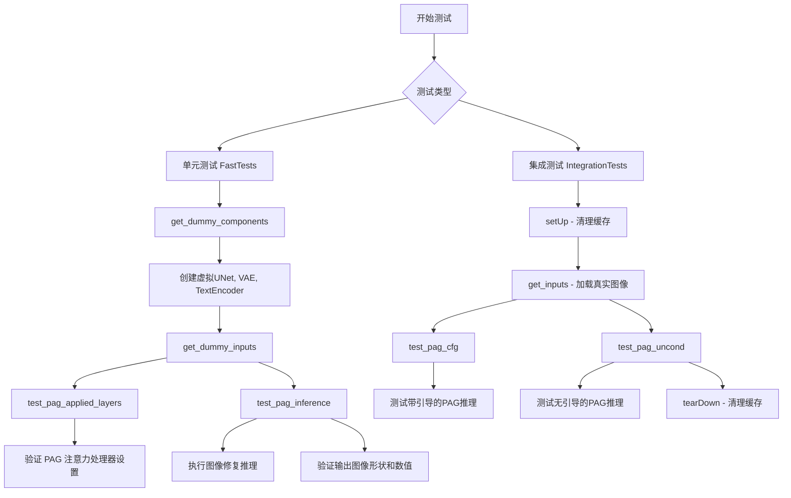

## 类结构

```
unittest.TestCase (基类)
├── StableDiffusionPAGInpaintPipelineFastTests
│   ├── get_dummy_components()
│   ├── get_dummy_inputs()
│   ├── test_pag_applied_layers()
 │   ├── test_pag_inference()
 │   └── test_encode_prompt_works_in_isolation()
 └── StableDiffusionPAGPipelineIntegrationTests (@slow)
     ├── setUp()
     ├── tearDown()
     ├── get_inputs()
     ├── test_pag_cfg()
     └── test_pag_uncond()
```

## 全局变量及字段


### `StableDiffusionPAGInpaintPipelineFastTests.pipeline_class`
    
指定用于测试的Stable Diffusion PAG图像修复管道类

类型：`Type[StableDiffusionPAGInpaintPipeline]`
    


### `StableDiffusionPAGInpaintPipelineFastTests.params`
    
包含文本引导图像修复管道的参数集合，包括pag_scale和pag_adaptive_scale

类型：`set`
    


### `StableDiffusionPAGInpaintPipelineFastTests.batch_params`
    
定义批量图像修复的参数集合，用于批量推理测试

类型：`frozenset`
    


### `StableDiffusionPAGInpaintPipelineFastTests.image_params`
    
图像参数集合，当前为空，表示不需要额外的图像参数

类型：`frozenset`
    


### `StableDiffusionPAGInpaintPipelineFastTests.image_latents_params`
    
图像潜在向量参数集合，当前为空，用于潜在变量测试

类型：`frozenset`
    


### `StableDiffusionPAGInpaintPipelineFastTests.callback_cfg_params`
    
包含文本嵌入、时间ID、掩码和掩码图像潜在向量等回调配置参数

类型：`set`
    


### `StableDiffusionPAGPipelineIntegrationTests.pipeline_class`
    
指定用于集成测试的Stable Diffusion PAG图像修复管道类

类型：`Type[StableDiffusionPAGInpaintPipeline]`
    


### `StableDiffusionPAGPipelineIntegrationTests.repo_id`
    
HuggingFace模型仓库ID，指向stable-diffusion-v1-5模型

类型：`str`
    
    

## 全局函数及方法


### `enable_full_determinism`

该函数用于启用完全确定性模式，通过设置 Python、NumPy 和 PyTorch 的随机种子以及禁用 CUDA 算法的非确定性优化，确保测试或推理过程的结果可重复。

参数：

- 无

返回值：`None`，无返回值（该函数直接修改全局状态）

#### 流程图

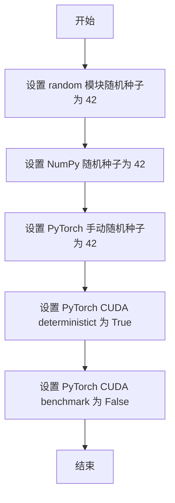

#### 带注释源码

```python
# 该函数从 testing_utils 模块导入
# 在测试文件开头被调用，用于确保整个测试过程的完全确定性
enable_full_determinism()


# enable_full_determinism 函数定义推断（基于代码用途）
# 该函数通常定义在 testing_utils.py 中，内容可能如下：

def enable_full_determinism(seed: int = 42):
    """
    启用完全确定性，确保测试结果可重复。
    
    参数:
        seed: 随机种子，默认为 42
    """
    # 1. 设置 Python 内置 random 模块的随机种子
    random.seed(seed)
    
    # 2. 设置 NumPy 的随机种子
    np.random.seed(seed)
    
    # 3. 设置 PyTorch 的手动随机种子
    torch.manual_seed(seed)
    
    # 4. 启用 CUDA determinism，确保每次运行结果一致
    # 这会使某些操作变慢但保证可重复性
    torch.backends.cudnn.deterministic = True
    
    # 5. 禁用 cudnn.benchmark
    # 禁用后虽然可能影响性能，但能避免因自动优化导致的非确定性结果
    torch.backends.cudnn.benchmark = False
    
    # 6. 如果使用 CUDA，也设置 CUDA 的种子
    if torch.cuda.is_available():
        torch.cuda.manual_seed_all(seed)
        torch.cuda.manual_seed(seed)
```

#### 补充说明

1. **设计目标**：确保在测试环境或复现实验结果时，所有随机因素都被固定，使得每次运行产生完全相同的结果。

2. **影响范围**：该函数影响 Python 的 `random` 模块、NumPy、PyTorch（CPU 和 CUDA）的随机数生成，以及可能影响 CUDA 操作的非确定性算法。

3. **性能权衡**：启用完全确定性（特别是 `cudnn.deterministic = True`）可能会导致某些操作变慢，因为需要使用确定性的算法而非优化后的非确定性算法。

4. **使用场景**：主要用于单元测试和集成测试，确保测试结果的稳定性；在研究或生产环境中，如果需要可重复的推理结果，也应调用此函数。


### `StableDiffusionPAGInpaintPipelineFastTests.get_dummy_components`

该方法用于创建并返回一个包含 Stable Diffusion 图像修复管道所需的所有虚拟组件（dummy components）的字典，主要用于单元测试。这些组件包括 UNet 模型、调度器、VAE 编码器、文本编码器和分词器，通过固定随机种子确保测试的可重复性。

参数：

- `time_cond_proj_dim`：`int` 或 `None`，可选参数，用于设置 UNet2DConditionModel 的时间条件投影维度，默认为 `None`

返回值：`dict`，返回包含以下键的字典：
- `unet`：UNet2DConditionModel 实例
- `scheduler`：PNDMScheduler 实例
- `vae`：AutoencoderKL 实例
- `text_encoder`：CLIPTextModel 实例
- `tokenizer`：CLIPTokenizer 实例
- `safety_checker`：None
- `feature_extractor`：None
- `image_encoder`：None

#### 流程图

```mermaid
flowchart TD
    A[开始 get_dummy_components] --> B[设置随机种子 torch.manual_seed(0)]
    B --> C[创建 UNet2DConditionModel]
    C --> D[创建 PNDMScheduler]
    D --> E[设置随机种子 torch.manual_seed(0)]
    E --> F[创建 AutoencoderKL]
    F --> G[设置随机种子 torch.manual_seed(0)]
    G --> H[创建 CLIPTextConfig]
    H --> I[创建 CLIPTextModel]
    I --> J[创建 CLIPTokenizer]
    J --> K[组装 components 字典]
    K --> L[返回 components]
```

#### 带注释源码

```python
def get_dummy_components(self, time_cond_proj_dim=None):
    """
    创建并返回用于测试的虚拟组件字典。
    
    参数:
        time_cond_proj_dim: 可选的时间条件投影维度，用于 UNet2DConditionModel
    返回:
        包含所有管道组件的字典
    """
    # 设置随机种子以确保测试可重复性
    torch.manual_seed(0)
    # 创建 UNet2DConditionModel - 用于去噪的神经网络
    unet = UNet2DConditionModel(
        block_out_channels=(32, 64),  # UNet 的块输出通道数
        time_cond_proj_dim=time_cond_proj_dim,  # 时间条件投影维度
        layers_per_block=2,  # 每个块的层数
        sample_size=32,  # 样本尺寸
        in_channels=4,  # 输入通道数（latent 空间）
        out_channels=4,  # 输出通道数
        down_block_types=("DownBlock2D", "CrossAttnDownBlock2D"),  # 下采样块类型
        up_block_types=("CrossAttnUpBlock2D", "UpBlock2D"),  # 上采样块类型
        cross_attention_dim=32,  # 交叉注意力维度
    )
    # 创建调度器 - 控制去噪过程的调度
    scheduler = PNDMScheduler(skip_prk_steps=True)
    
    # 重新设置种子以确保 VAE 的确定性
    torch.manual_seed(0)
    # 创建 VAE - 用于图像编码/解码的变分自编码器
    vae = AutoencoderKL(
        block_out_channels=[32, 64],  # VAE 的块输出通道数
        in_channels=3,  # 输入通道数（RGB 图像）
        out_channels=3,  # 输出通道数
        down_block_types=["DownEncoderBlock2D", "DownEncoderBlock2D"],  # 下编码块类型
        up_block_types=["UpDecoderBlock2D", "UpDecoderBlock2D"],  # 上解码块类型
        latent_channels=4,  # 潜在空间通道数
    )
    
    # 重新设置种子以确保文本编码器的确定性
    torch.manual_seed(0)
    # 创建 CLIP 文本编码器配置
    text_encoder_config = CLIPTextConfig(
        bos_token_id=0,  # 句子开始标记 ID
        eos_token_id=2,  # 句子结束标记 ID
        hidden_size=32,  # 隐藏层大小
        intermediate_size=37,  # 中间层大小
        layer_norm_eps=1e-05,  # 层归一化 epsilon
        num_attention_heads=4,  # 注意力头数
        num_hidden_layers=5,  # 隐藏层数量
        pad_token_id=1,  # 填充标记 ID
        vocab_size=1000,  # 词汇表大小
    )
    # 创建 CLIP 文本编码器模型
    text_encoder = CLIPTextModel(text_encoder_config)
    # 创建 CLIP 分词器
    tokenizer = CLIPTokenizer.from_pretrained("hf-internal-testing/tiny-random-clip")

    # 组装所有组件到字典中
    components = {
        "unet": unet,  # UNet 去噪模型
        "scheduler": "scheduler",  # 调度器
        "vae": vae,  # VAE 编码器/解码器
        "text_encoder": text_encoder,  # 文本编码器
        "tokenizer": tokenizer,  # 分词器
        "safety_checker": None,  # 安全检查器（测试中设为 None）
        "feature_extractor": None,  # 特征提取器（测试中设为 None）
        "image_encoder": None,  # 图像编码器（测试中设为 None）
    }
    return components
```


### `StableDiffusionPAGInpaintPipelineFastTests.get_dummy_inputs`

该方法用于生成测试 Stable Diffusion PAG Inpainting Pipeline 的虚拟输入数据，包括预处理图像、掩码图像、提示词文本、随机生成器以及推理相关的参数配置，返回一个包含所有必要输入参数的字典对象。

参数：

- `device`：`torch.device`，指定计算设备（如 CPU 或 CUDA 设备）
- `seed`：`int`，随机种子，默认值为 0，用于确保测试结果的可重复性

返回值：`Dict[str, Any]`，返回一个包含以下键的字典：
  - `prompt`：文本提示词
  - `image`：初始图像（PIL Image）
  - `mask_image`：掩码图像（PIL Image）
  - `generator`：随机数生成器
  - `num_inference_steps`：推理步数
  - `guidance_scale`：引导强度
  - `strength`：图像强度
  - `pag_scale`：PAG 缩放因子
  - `output_type`：输出类型

#### 流程图

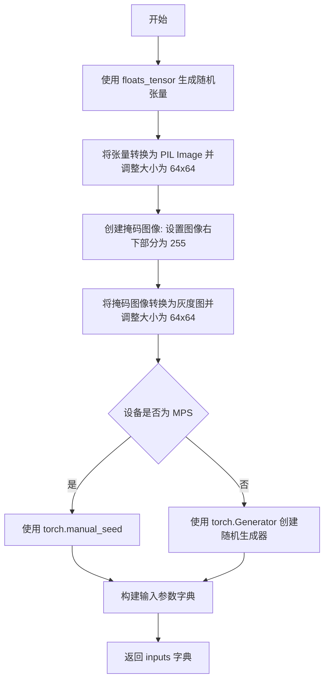

#### 带注释源码

```python
def get_dummy_inputs(self, device, seed=0):
    # TODO: use tensor inputs instead of PIL, this is here just to leave the old expected_slices untouched
    # 使用 floats_tensor 生成一个 (1, 3, 32, 32) 的随机浮点张量，并移动到指定设备
    image = floats_tensor((1, 3, 32, 32), rng=random.Random(seed)).to(device)
    # 将张量从 (B, C, H, W) 转换为 (B, H, W, C) 格式，并取第一张图像
    image = image.cpu().permute(0, 2, 3, 1)[0]
    # 将 numpy 数组转换为 PIL Image，调整大小为 64x64
    init_image = Image.fromarray(np.uint8(image)).convert("RGB").resize((64, 64))
    # create mask: 将图像的右下角区域（从第8行第8列开始）设置为白色（255）
    image[8:, 8:, :] = 255
    # 将掩码图像转换为灰度图并调整大小为 64x64
    mask_image = Image.fromarray(np.uint8(image)).convert("L").resize((64, 64))

    # 根据设备类型选择随机数生成方式
    if str(device).startswith("mps"):
        # MPS 设备使用 torch.manual_seed
        generator = torch.manual_seed(seed)
    else:
        # 其他设备使用 torch.Generator 创建随机生成器
        generator = torch.Generator(device=device).manual_seed(seed)
    
    # 构建包含所有测试输入参数的字典
    inputs = {
        "prompt": "A painting of a squirrel eating a burger",  # 文本提示词
        "image": init_image,           # 初始图像
        "mask_image": mask_image,      # 掩码图像
        "generator": generator,       # 随机生成器
        "num_inference_steps": 2,      # 推理步数
        "guidance_scale": 6.0,         # classifier-free guidance 强度
        "strength": 1.0,               # 图像变换强度
        "pag_scale": 0.9,              # Progressive Attention Guidance 缩放因子
        "output_type": "np",           # 输出类型为 numpy 数组
    }
    return inputs
```


### `StableDiffusionPAGInpaintPipelineFastTests.test_pag_applied_layers`

该测试函数用于验证 PAG（Probabilistic Attribute Guidance）应用于 UNet 自注意力层的功能是否正确。它测试了不同层级的 `pag_applied_layers` 配置（如下 `"mid"`、`"down"`、`"up"` 或更具体的路径如 `"mid_block.attentions_0"`）是否能正确地选择并应用到对应的自注意力层，同时验证无效层级会抛出预期的异常。

参数：

- `self`：测试类实例，无需显式传递

返回值：无（`None`），该函数为测试方法，使用断言验证逻辑正确性

#### 流程图

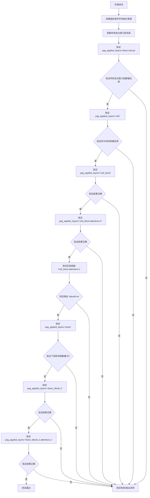

#### 带注释源码

```python
def test_pag_applied_layers(self):
    """测试 PAG 应用的层配置是否正确"""
    # 设置设备为 CPU 以确保确定性
    device = "cpu"
    # 获取虚拟组件（UNet、VAE、Scheduler、TextEncoder 等）
    components = self.get_dummy_components()

    # ========== 步骤 1: 创建基础管道 ==========
    # 使用虚拟组件初始化 StableDiffusionPAGInpaintPipeline 管道
    pipe = self.pipeline_class(**components)
    pipe = pipe.to(device)
    pipe.set_progress_bar_config(disable=None)

    # 获取所有自注意力层（attn1）的处理器键
    # 例如: 'down_blocks.1.attentions.0.transformer_blocks.0.attn1.processor'
    all_self_attn_layers = [k for k in pipe.unet.attn_processors.keys() if "attn1" in k]
    # 保存原始注意力处理器
    original_attn_procs = pipe.unet.attn_processors.copy()

    # ========== 测试用例 1: 应用到所有层级 ==========
    # pag_applied_layers = ["mid","up","down"] 应该应用到所有自注意力层
    pag_layers = ["down", "mid", "up"]
    pipe._set_pag_attn_processor(pag_applied_layers=pag_layers, do_classifier_free_guidance=False)
    # 验证 PAG 注意力处理器数量等于所有自注意力层数量
    assert set(pipe.pag_attn_processors) == set(all_self_attn_layers)

    # ========== 测试用例 2: 仅应用到中间块 ==========
    # 指定 "mid" 或 "mid_block" 或 "mid_block.attentions.0" 应该只应用到中间块的自注意力层
    all_self_attn_mid_layers = [
        "mid_block.attentions.0.transformer_blocks.0.attn1.processor",
        # "mid_block.attentions.0.transformer_blocks.1.attn1.processor",  # 注释掉的层
    ]
    # 重置为原始处理器
    pipe.unet.set_attn_processor(original_attn_procs.copy())
    # 测试 "mid"
    pag_layers = ["mid"]
    pipe._set_pag_attn_processor(pag_applied_layers=pag_layers, do_classifier_free_guidance=False)
    assert set(pipe.pag_attn_processors) == set(all_self_attn_mid_layers)

    # 重置并测试 "mid_block"
    pipe.unet.set_attn_processor(original_attn_procs.copy())
    pag_layers = ["mid_block"]
    pipe._set_pag_attn_processor(pag_applied_layers=pag_layers, do_classifier_free_guidance=False)
    assert set(pipe.pag_attn_processors) == set(all_self_attn_mid_layers)

    # 重置并测试 "mid_block.attentions.0"
    pipe.unet.set_attn_processor(original_attn_procs.copy())
    pag_layers = ["mid_block.attentions.0"]
    pipe._set_pag_attn_processor(pag_applied_layers=pag_layers, do_classifier_free_guidance=False)
    assert set(pipe.pag_attn_processors) == set(all_self_attn_mid_layers)

    # ========== 测试用例 3: 无效层级应抛出异常 ==========
    # 指定不存在的层级 "mid_block.attentions_1" 应该抛出 ValueError
    pipe.unet.set_attn_processor(original_attn_procs.copy())
    pag_layers = ["mid_block.attentions.1"]
    with self.assertRaises(ValueError):
        pipe._set_pag_attn_processor(pag_applied_layers=pag_layers, do_classifier_free_guidance=False)

    # ========== 测试用例 4: 下采样块层级测试 ==========
    # 测试 "down" 应该应用到下采样块的所有自注意力层
    pipe.unet.set_attn_processor(original_attn_procs.copy())
    pag_layers = ["down"]
    pipe._set_pag_attn_processor(pag_applied_layers=pag_layers, do_classifier_free_guidance=False)
    # 验证 PAG 处理器数量为 2
    assert len(pipe.pag_attn_processors) == 2

    # 测试 "down_blocks.0" 应该无效（无自注意力层）
    pipe.unet.set_attn_processor(original_attn_procs.copy())
    pag_layers = ["down_blocks.0"]
    with self.assertRaises(ValueError):
        pipe._set_pag_attn_processor(pag_applied_layers=pag_layers, do_classifier_free_guidance=False)

    # 测试 "down_blocks.1" 应该有 2 个处理器
    pipe.unet.set_attn_processor(original_attn_procs.copy())
    pag_layers = ["down_blocks.1"]
    pipe._set_pag_attn_processor(pag_applied_layers=pag_layers, do_classifier_free_guidance=False)
    assert len(pipe.pag_attn_processors) == 2

    # 测试 "down_blocks.1.attentions.1" 应该只有 1 个处理器
    pipe.unet.set_attn_processor(original_attn_procs.copy())
    pag_layers = ["down_blocks.1.attentions.1"]
    pipe._set_pag_attn_processor(pag_applied_layers=pag_layers, do_classifier_free_guidance=False)
    assert len(pipe.pag_attn_processors) == 1
```


### `StableDiffusionPAGInpaintPipelineFastTests.test_pag_inference`

该函数是 Stable Diffusion PAG（Progressive Adversarial Guidance）修复管道的集成测试方法，用于验证 P AG 在图像修复任务中的推理功能是否正常工作。它通过创建虚拟组件和输入，执行管道推理，并验证输出图像的形状和像素值是否符合预期。

参数：

- `self`：隐式参数，测试类实例本身

返回值：`None`，该方法为测试方法，不返回任何值，仅通过断言验证结果

#### 流程图

```mermaid
flowchart TD
    A[开始测试] --> B[设置设备为CPU确保确定性]
    B --> C[获取虚拟组件<br/>调用 get_dummy_components]
    C --> D[创建 PAG 管道实例<br/>传入 pag_applied_layers=['mid', 'up', 'down']]
    D --> E[将管道移至设备并配置进度条]
    E --> F[获取虚拟输入<br/>调用 get_dummy_inputs]
    F --> G[执行管道推理<br/>pipe_pag(**inputs)]
    G --> H[提取图像切片<br/>image[0, -3:, -3:, -1]]
    H --> I{断言图像形状<br/>是否为 (1, 64, 64, 3)}
    I -->|是| J[计算与预期切片的最大差异]
    J --> K{最大差异 < 1e-3?}
    K -->|是| L[测试通过]
    K -->|否| M[抛出断言错误<br/>输出不同]
    I -->|否| N[抛出断言错误<br/>形状不匹配]
    M --> O[结束]
    N --> O
    L --> O
```

#### 带注释源码

```python
def test_pag_inference(self):
    """
    测试 PAG（Progressive Adversarial Guidance）在图像修复管道中的推理功能。
    验证管道能够正确执行图像修复推理，并输出预期形状和像素范围的图像。
    """
    # 设置设备为 CPU，确保使用 torch.Generator 时的确定性
    device = "cpu"  # ensure determinism for the device-dependent torch.Generator
    
    # 获取虚拟组件（UNet、VAE、Scheduler、Text Encoder、Tokenizer 等）
    components = self.get_dummy_components()

    # 创建 PAG 管道实例，指定 PAG 应用的层为 ['mid', 'up', 'down']
    # pag_applied_layers 参数指定在哪些层应用 PAG 机制
    pipe_pag = self.pipeline_class(**components, pag_applied_layers=["mid", "up", "down"])
    
    # 将管道移至指定设备
    pipe_pag = pipe_pag.to(device)
    
    # 配置进度条，disable=None 表示启用进度条
    pipe_pag.set_progress_bar_config(disable=None)

    # 获取虚拟输入数据（提示词、图像、掩码、生成器、推理步数等）
    inputs = self.get_dummy_inputs(device)
    
    # 执行管道推理，调用 __call__ 方法生成图像
    # 返回包含图像的结果对象，通过 .images 访问图像数组
    image = pipe_pag(**inputs).images
    
    # 提取图像右下角 3x3 像素区域，保留所有颜色通道
    # image shape: [batch, height, width, channels]
    image_slice = image[0, -3:, -3:, -1]

    # 断言验证输出图像形状是否符合预期
    # 期望形状: (1, 64, 64, 3) - 批大小1，64x64分辨率，RGB 3通道
    assert image.shape == (
        1,
        64,
        64,
        3,
    ), f"the shape of the output image should be (1, 64, 64, 3) but got {image.shape}"

    # 定义预期像素值切片（基于已知正确输出）
    expected_slice = np.array([0.7190, 0.5807, 0.6007, 0.5600, 0.6350, 0.6639, 0.5680, 0.5664, 0.5230])
    
    # 计算实际输出与预期输出的最大绝对差异
    max_diff = np.abs(image_slice.flatten() - expected_slice).max()
    
    # 断言验证输出像素值误差在允许范围内（小于 1e-3）
    assert max_diff < 1e-3, f"output is different from expected, {image_slice.flatten()}"
```


### `StableDiffusionPAGInpaintPipelineFastTests.test_encode_prompt_works_in_isolation`

该测试方法用于验证文本提示编码功能在隔离环境下的正确性，通过传入额外的参数值字典和容差设置来测试父类的 `test_encode_prompt_works_in_isolation` 方法。

参数：

- `self`：`StableDiffusionPAGInpaintPipelineFastTests` 类型，测试类实例本身
- `extra_required_param_value_dict`：`dict` 类型，传递给父类测试方法的额外参数字典，包含 device 和 do_classifier_free_guidance 配置
- `atol`：`float` 类型，绝对容差参数，设置为 `1e-3`，用于数值比较
- `rtol`：`float` 类型，相对容差参数，设置为 `1e-3`，用于数值比较

返回值：`None`，该方法继承自父类，父类方法为测试用例无返回值

#### 流程图

```mermaid
flowchart TD
    A[开始测试 test_encode_prompt_works_in_isolation] --> B[构建 extra_required_param_value_dict]
    B --> C[获取 device 类型]
    B --> D[获取 do_classifier_free_guidance 值]
    C --> E[调用 super().test_encode_prompt_works_in_isolation]
    D --> E
    E --> F[传入参数 extra_required_param_value_dict, atol=1e-3, rtol=1e-3]
    F --> G[执行父类测试方法]
    G --> H[测试完成]
```

#### 带注释源码

```python
def test_encode_prompt_works_in_isolation(self):
    """
    测试文本提示编码在隔离环境下的工作状态
    
    该测试方法继承自父类测试套件，通过传入额外的参数配置
    来验证 StableDiffusionPAGInpaintPipeline 的提示编码功能
    """
    # 构建需要传递给父类测试方法的额外参数字典
    extra_required_param_value_dict = {
        # 获取当前测试设备的类型（如 'cuda', 'cpu', 'mps' 等）
        "device": torch.device(torch_device).type,
        # 根据虚拟输入的 guidance_scale 判断是否需要 classifier free guidance
        # guidance_scale > 1.0 时启用无分类器引导
        "do_classifier_free_guidance": self.get_dummy_inputs(device=torch_device).get("guidance_scale", 1.0) > 1.0,
    }
    # 调用父类的测试方法，传入额外参数和数值容差设置
    # atol=1e-3: 绝对容差
    # rtol=1e-3: 相对容差
    return super().test_encode_prompt_works_in_isolation(extra_required_param_value_dict, atol=1e-3, rtol=1e-3)
```


### `StableDiffusionPAGPipelineIntegrationTests.setUp`

该方法为测试类 `StableDiffusionPAGPipelineIntegrationTests` 的初始化方法，在每个测试方法执行前被调用，用于清理垃圾收集和GPU缓存，确保测试环境处于干净的初始状态。

参数：

- `self`：无类型（实例方法隐式参数），代表测试类实例本身

返回值：`None`，该方法不返回任何值，仅执行清理操作

#### 流程图

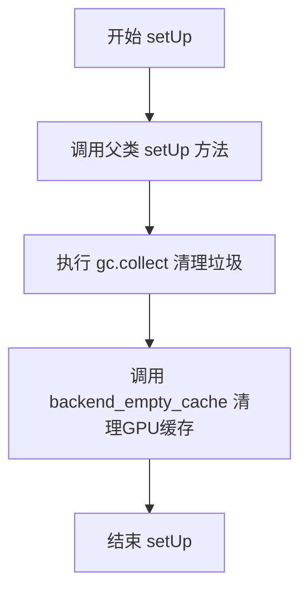

#### 带注释源码

```python
def setUp(self):
    """
    测试方法开始前的初始化设置
    """
    # 调用父类的 setUp 方法，执行 unittest.TestCase 的标准初始化
    super().setUp()
    
    # 手动触发 Python 垃圾回收，释放不再使用的内存对象
    gc.collect()
    
    # 清理 GPU/PyTorch 的缓存内存，确保测试环境干净
    # torch_device 是全局变量，表示当前使用的计算设备
    backend_empty_cache(torch_device)
```


### `StableDiffusionPAGPipelineIntegrationTests.tearDown`

该方法是测试框架的清理方法，在每个集成测试执行完成后被自动调用，用于释放GPU内存和触发Python垃圾回收，以确保测试之间的资源隔离，避免内存泄漏。

参数：

- `self`：`StableDiffusionPAGPipelineIntegrationTests`，测试类实例本身，代表当前测试对象

返回值：`None`，该方法不返回任何值，仅执行清理操作

#### 流程图

```mermaid
flowchart TD
    A[tearDown 方法开始] --> B[调用 super().tearDown]
    B --> C[执行 gc.collect 触发垃圾回收]
    C --> D[调用 backend_empty_cache 清理GPU缓存]
    D --> E[tearDown 方法结束]
    
    B -->|调用父类清理| F[父类 tearDown 逻辑]
    F --> C
    
    D -->|清理torch_device对应GPU内存| G[释放CUDA/Vulkan等后端缓存]
    G --> E
```

#### 带注释源码

```python
def tearDown(self):
    """
    测试用例完成后的清理方法。
    
    该方法在每个测试方法执行完毕后自动调用，负责：
    1. 调用父类的tearDown方法完成基础清理
    2. 触发Python垃圾回收释放CPU内存
    3. 清理GPU显存缓存防止OOM
    """
    # 调用父类（unittest.TestCase）的tearDown方法
    # 确保执行框架级别的清理逻辑
    super().tearDown()
    
    # 手动触发Python的垃圾回收器
    # 释放测试过程中产生的临时对象和循环引用
    gc.collect()
    
    # 清理深度学习框架（PyTorch）的GPU缓存
    # 释放GPU显存，防止测试间内存泄漏
    # torch_device 是测试工具类中定义的全局变量，表示测试使用的设备
    backend_empty_cache(torch_device)
```


### `StableDiffusionPAGPipelineIntegrationTests.get_inputs`

该方法用于生成Stable Diffusion PAG Inpainting pipeline的测试输入数据，包括从网络加载初始图像和掩码图像，配置生成器参数，并返回一个包含所有推理参数的字典。

参数：

- `self`：隐式参数，测试类实例
- `device`：`torch.device`，用于指定输出设备
- `generator_device`：`str`，生成器设备，默认为"cpu"
- `seed`：`int`，随机种子，默认为0
- `guidance_scale`：`float`，Classifier-free guidance缩放因子，默认为7.0

返回值：`Dict`，包含以下键值的字典：
- `prompt` (str)：文本提示
- `generator` (torch.Generator)：随机生成器
- `image` (PIL.Image)：初始图像
- `mask_image` (PIL.Image)：掩码图像
- `strength` (float)：图像处理强度
- `num_inference_steps` (int)：推理步数
- `guidance_scale` (float)：guidance缩放因子
- `pag_scale` (float)：PAG缩放因子
- `output_type` (str)：输出类型

#### 流程图

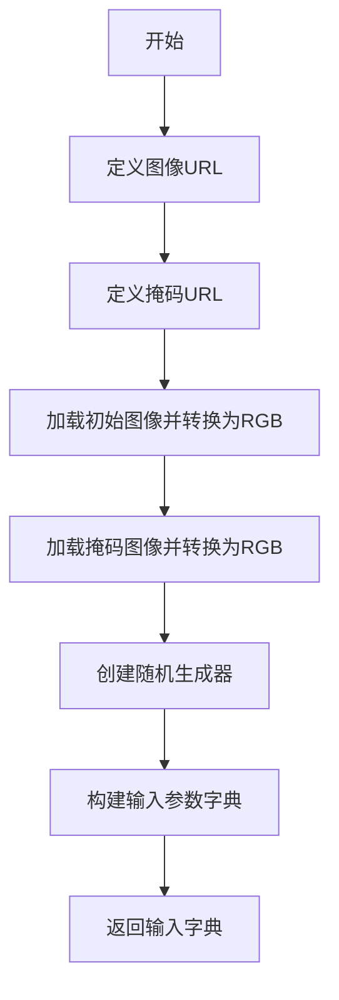

#### 带注释源码

```python
def get_inputs(self, device, generator_device="cpu", seed=0, guidance_scale=7.0):
    """
    生成Stable Diffusion PAG Inpainting pipeline的测试输入参数
    
    参数:
        device: torch.device - 用于指定输出设备
        generator_device: str - 生成器设备，默认为"cpu"
        seed: int - 随机种子，默认为0
        guidance_scale: float - Classifier-free guidance缩放因子，默认为7.0
    
    返回:
        dict: 包含pipeline推理所需的所有参数
    """
    # 定义需要加载的示例图像URL（一只老虎坐在长椅上的图片）
    img_url = "https://raw.githubusercontent.com/CompVis/latent-diffusion/main/data/inpainting_examples/overture-creations-5sI6fQgYIuo.png"
    # 定义对应掩码图像的URL
    mask_url = "https://raw.githubusercontent.com/CompVis/latent-diffusion/main/data/inpainting_examples/overture-creations-5sI6fQgYIuo_mask.png"

    # 从URL加载初始图像并转换为RGB格式
    init_image = load_image(img_url).convert("RGB")
    # 从URL加载掩码图像并转换为RGB格式
    mask_image = load_image(mask_url).convert("RGB")

    # 创建指定设备的随机生成器，并设置随机种子以确保可重复性
    generator = torch.Generator(device=generator_device).manual_seed(seed)
    
    # 构建完整的输入参数字典，包含所有pipeline需要的配置
    inputs = {
        "prompt": "A majestic tiger sitting on a bench",  # 文本提示
        "generator": generator,                          # 随机生成器
        "image": init_image,                              # 待修复的初始图像
        "mask_image": mask_image,                         # 修复区域的掩码
        "strength": 0.8,                                  # 图像处理强度
        "num_inference_steps": 3,                         # 推理步数
        "guidance_scale": guidance_scale,                 # CFG缩放因子
        "pag_scale": 3.0,                                  # PAG方法专用缩放因子
        "output_type": "np",                              # 输出类型为numpy数组
    }
    return inputs
```


### `StableDiffusionPAGPipelineIntegrationTests.test_pag_cfg`

这是一个集成测试方法，用于测试PAG（Probably Approximately Correct）配置下的Stable Diffusion图像修复管道的推理功能，验证管道在启用PAG时能够正确生成图像，并通过与预期输出切片进行比较来确保图像质量。

参数：

- `self`：无显式参数，隐式参数，表示测试类实例本身

返回值：无返回值，该方法为`unittest.TestCase`的测试方法，通过断言验证结果

#### 流程图

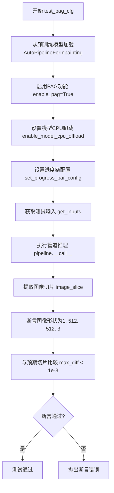

#### 带注释源码

```python
def test_pag_cfg(self):
    """
    测试PAG配置下Stable Diffusion图像修复管道的推理功能
    
    该测试方法验证:
    1. 能够从预训练模型加载启用PAG的图像修复管道
    2. 管道能够成功执行推理并生成图像
    3. 生成的图像形状符合预期 (1, 512, 512, 3)
    4. 图像输出质量与预期值接近 (误差小于1e-3)
    """
    # 从预训练模型加载自动图像修复管道，启用PAG功能，使用float16精度
    pipeline = AutoPipelineForInpainting.from_pretrained(
        self.repo_id,  # "stable-diffusion-v1-5/stable-diffusion-v1-5"
        enable_pag=True,  # 启用PAG (Probably Approximately Correct) 功能
        torch_dtype=torch.float16  # 使用半精度浮点数以加速推理
    )
    
    # 启用模型CPU卸载，将不常用的模型层卸载到CPU以节省显存
    pipeline.enable_model_cpu_offload(device=torch_device)
    
    # 设置进度条配置，disable=None表示不禁用进度条
    pipeline.set_progress_bar_config(disable=None)
    
    # 获取测试输入参数，包括提示词、图像、mask等
    inputs = self.get_inputs(torch_device)
    
    # 执行管道推理，传入输入参数，获取生成的图像
    image = pipeline(**inputs).images
    
    # 提取图像最后3x3像素区域并展平，用于与预期值比较
    image_slice = image[0, -3:, -3:, -1].flatten()
    
    # 断言生成的图像形状为 (1, 512, 512, 3)
    assert image.shape == (1, 512, 512, 3)
    
    # 定义预期的图像切片值（用于回归测试）
    expected_slice = np.array(
        [0.38793945, 0.4111328, 0.47924805, 0.39208984, 0.4165039, 0.41674805, 0.37060547, 0.36791992, 0.40625]
    )
    
    # 断言实际输出与预期值的最大差异小于阈值1e-3
    # 如果差异过大则抛出错误并显示实际输出
    assert np.abs(image_slice.flatten() - expected_slice).max() < 1e-3, (
        f"output is different from expected, {image_slice.flatten()}"
    )
```


### `StableDiffusionPAGPipelineIntegrationTests.test_pag_uncond`

该测试方法用于验证 PAG（Progressive Attribute Guidance）pipeline 在无分类器自由引导（guidance_scale=0.0）条件下的推理功能是否正常，通过对比输出图像的形状和像素值与预期值来判断测试是否通过。

参数：

- `self`：`unittest.TestCase`，测试用例实例本身

返回值：`None`，该方法为测试函数，执行断言验证而非返回值

#### 流程图

```mermaid
flowchart TD
    A[开始测试] --> B[加载预训练模型: AutoPipelineForInpainting.from_pretrained]
    B --> C[启用模型CPU卸载: pipeline.enable_model_cpu_offload]
    C --> D[设置进度条配置: pipeline.set_progress_bar_config]
    D --> E[获取测试输入: get_inputs with guidance_scale=0.0]
    E --> F[执行pipeline推理: pipeline(**inputs)]
    F --> G[提取图像切片: image[0, -3:, -3:, -1].flatten]
    G --> H{断言: 图像形状 == (1, 512, 512, 3)}
    H -->|是| I{断言: 像素差异 < 1e-3}
    H -->|否| J[测试失败: AssertionError]
    I -->|是| K[测试通过]
    I -->|否| J
    K --> L[结束测试]
```

#### 带注释源码

```python
def test_pag_uncond(self):
    """
    测试PAG pipeline在无分类器自由引导（guidance_scale=0.0）条件下的推理功能
    
    该测试验证:
    1. 模型能够正常加载并运行
    2. 输出图像形状正确
    3. 输出图像像素值与预期值匹配（用于回归测试）
    """
    # 从预训练模型加载带有PAG功能的inpainting pipeline
    # enable_pag=True 启用PAG功能
    # torch_dtype=torch.float16 使用半精度浮点数以减少显存占用
    pipeline = AutoPipelineForInpainting.from_pretrained(
        self.repo_id, 
        enable_pag=True, 
        torch_dtype=torch.float16
    )
    
    # 启用模型CPU卸载，将不使用的模型层移到CPU以节省显存
    pipeline.enable_model_cpu_offload(device=torch_device)
    
    # 设置进度条配置，disable=None 表示不禁用进度条
    pipeline.set_progress_bar_config(disable=None)
    
    # 获取测试输入，guidance_scale=0.0 表示不使用分类器自由引导
    # 这会使得模型只基于文本提示生成图像，不使用负面提示的引导
    inputs = self.get_inputs(torch_device, guidance_scale=0.0)
    
    # 执行pipeline推理，获取生成的图像
    image = pipeline(**inputs).images
    
    # 提取图像右下角3x3区域的像素值并展平
    # 用于与预期值进行对比
    image_slice = image[0, -3:, -3:, -1].flatten()
    
    # 断言：验证输出图像的形状是否为 (1, 512, 512, 3)
    assert image.shape == (1, 512, 512, 3)
    
    # 定义预期的像素值slice（用于回归测试）
    # 这些值是通过之前的测试运行得出的基准值
    expected_slice = np.array(
        [0.3876953, 0.40356445, 0.4934082, 0.39697266, 0.41674805, 0.41015625, 0.375, 0.36914062, 0.40649414]
    )
    
    # 断言：验证输出图像像素值与预期值的最大差异是否在容忍范围内
    # 如果差异大于1e-3，说明模型输出发生了非预期变化
    assert np.abs(image_slice.flatten() - expected_slice).max() < 1e-3, (
        f"output is different from expected, {image_slice.flatten()}"
    )
```


### `StableDiffusionPAGInpaintPipelineFastTests.get_dummy_components`

该方法用于生成测试所需的虚拟（dummy）组件，构建一个完整的 Stable Diffusion PAG（Progressive Attention Guidance）Inpainting Pipeline 所需的所有模型组件，包括 UNet、VAE、文本编码器、分词器、调度器等，以便进行单元测试。

参数：

- `time_cond_proj_dim`：`Optional[int]`，可选参数，用于指定 UNet 模型的时间条件投影维度，默认为 None

返回值：`Dict[str, Any]`，返回一个字典，包含构建 StableDiffusionPAGInpaintPipeline 所需的所有组件，键名包括 "unet"、"scheduler"、"vae"、"text_encoder"、"tokenizer"、"safety_checker"、"feature_extractor"、"image_encoder"

#### 流程图

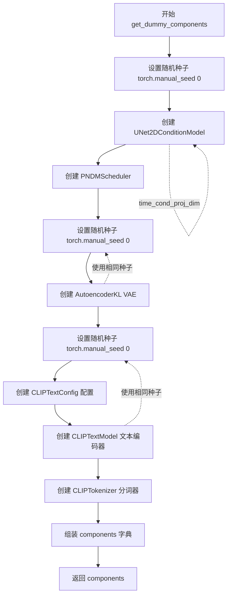

#### 带注释源码

```python
def get_dummy_components(self, time_cond_proj_dim=None):
    """
    生成用于测试的虚拟组件，构建完整的 Stable Diffusion PAG Inpainting Pipeline
    
    参数:
        time_cond_proj_dim: 可选的时间条件投影维度参数，传递给 UNet2DConditionModel
    
    返回:
        包含所有pipeline组件的字典
    """
    # 设置随机种子以确保测试可重复性
    torch.manual_seed(0)
    
    # 创建 UNet2DConditionModel - 用于图像去噪的核心模型
    unet = UNet2DConditionModel(
        block_out_channels=(32, 64),        # UNet 编码器/解码器块输出通道数
        time_cond_proj_dim=time_cond_proj_dim,  # 时间条件投影维度（可选）
        layers_per_block=2,                  # 每个块的层数
        sample_size=32,                     # 输入样本尺寸
        in_channels=4,                     # 输入通道数（latent space）
        out_channels=4,                    # 输出通道数
        down_block_types=("DownBlock2D", "CrossAttnDownBlock2D"),  # 下采样块类型
        up_block_types=("CrossAttnUpBlock2D", "UpBlock2D"),        # 上采样块类型
        cross_attention_dim=32,             # 跨注意力维度
    )
    
    # 创建 PNDMScheduler - 扩散模型的调度器（scheduler）
    scheduler = PNDMScheduler(skip_prk_steps=True)
    
    # 重新设置随机种子，确保VAE初始化可重复
    torch.manual_seed(0)
    
    # 创建 AutoencoderKL - VAE模型用于潜在空间编码/解码
    vae = AutoencoderKL(
        block_out_channels=[32, 64],        # VAE编码器/解码器块输出通道
        in_channels=3,                      # 输入RGB图像通道数
        out_channels=3,                     # 输出RGB图像通道数
        down_block_types=["DownEncoderBlock2D", "DownEncoderBlock2D"],  # 下编码器块类型
        up_block_types=["UpDecoderBlock2D", "UpDecoderBlock2D"],        # 上解码器块类型
        latent_channels=4,                  # 潜在空间通道数
    )
    
    # 再次设置随机种子，确保文本编码器初始化可重复
    torch.manual_seed(0)
    
    # 创建 CLIP 文本编码器配置
    text_encoder_config = CLIPTextConfig(
        bos_token_id=0,                     # 句子开始token ID
        eos_token_id=2,                     # 句子结束token ID
        hidden_size=32,                    # 隐藏层维度
        intermediate_size=37,               # FFN中间层维度
        layer_norm_eps=1e-05,               # LayerNorm epsilon
        num_attention_heads=4,              # 注意力头数量
        num_hidden_layers=5,                # Transformer层数
        pad_token_id=1,                     # 填充token ID
        vocab_size=1000,                    # 词汇表大小
    )
    
    # 根据配置创建 CLIP 文本编码器模型
    text_encoder = CLIPTextModel(text_encoder_config)
    
    # 加载分词器（使用预训练的小型随机模型）
    tokenizer = CLIPTokenizer.from_pretrained("hf-internal-testing/tiny-random-clip")
    
    # 组装所有组件到字典中
    components = {
        "unet": unet,                        # UNet去噪模型
        "scheduler": scheduler,              # 扩散调度器
        "vae": vae,                          # VAE编解码器
        "text_encoder": text_encoder,        # CLIP文本编码器
        "tokenizer": tokenizer,              # CLIP分词器
        "safety_checker": None,              # 安全检查器（测试中设为None）
        "feature_extractor": None,           # 特征提取器（测试中设为None）
        "image_encoder": None,               # 图像编码器（测试中设为None）
    }
    
    return components
```


### `StableDiffusionPAGInpaintPipelineFastTests.get_dummy_inputs`

该方法是一个测试辅助函数，用于生成用于 Stable Diffusion PAG（Progressive Attention Guidance）图像修复 pipeline 的虚拟输入数据。它创建一个随机图像、相应的掩码图像以及包含推理参数的字典，以支持单元测试和集成测试。

参数：

- `self`：隐式参数，StableDiffusionPAGInpaintPipelineFastTests 类的实例
- `device`：`torch.device`，指定生成张量和随机数生成器所在的设备
- `seed`：`int`，随机种子，用于确保测试的可重复性，默认值为 0

返回值：`dict`，包含以下键值对的字典：
  - `prompt`（str）：用于生成的文本提示
  - `image`（PIL.Image.Image）：初始图像（RGB 格式，调整大小为 64x64）
  - `mask_image`（PIL.Image.Image）：掩码图像（灰度格式，调整大小为 64x64）
  - `generator`（torch.Generator）：PyTorch 随机数生成器，用于确保确定性
  - `num_inference_steps`（int）：推理步数
  - `guidance_scale`（float）：分类器自由引导比例
  - `strength`（float）：图像到图像转换强度
  - `pag_scale`（float）：PAG 引导比例
  - `output_type`（str）：输出类型（"np" 表示 numpy 数组）

#### 流程图

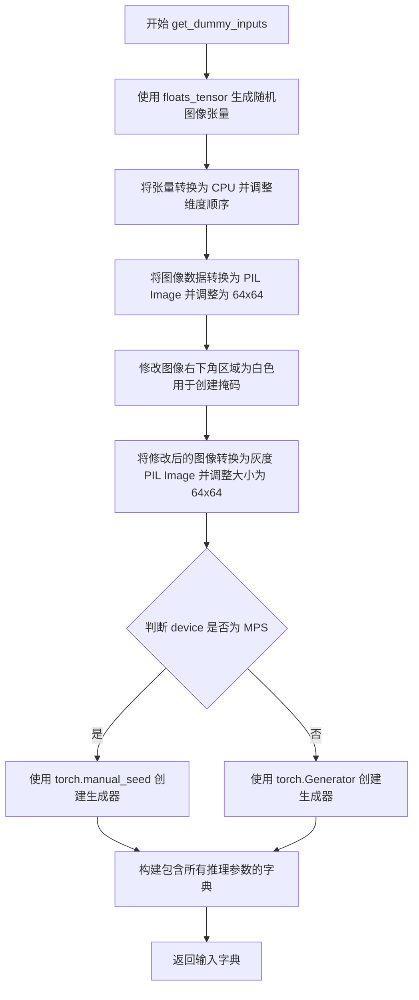

#### 带注释源码

```python
def get_dummy_inputs(self, device, seed=0):
    # TODO: use tensor inputs instead of PIL, this is here just to leave the old expected_slices untouched
    # 说明：TODO 注释表明未来应该使用张量输入而不是 PIL 图像，以保持向后兼容性
    
    # 使用 floats_tensor 生成一个形状为 (1, 3, 32, 32) 的随机浮点数张量
    # rng=random.Random(seed) 确保使用确定性随机数生成器
    image = floats_tensor((1, 3, 32, 32), rng=random.Random(seed)).to(device)
    
    # 将张量移到 CPU 并调整维度顺序：从 (1, 3, 32, 32) 变为 (32, 32, 3)
    # permute(0, 2, 3, 1) 将通道维度移到最后
    image = image.cpu().permute(0, 2, 3, 1)[0]
    
    # 将 numpy 数组转换为 uint8，然后创建 PIL RGB 图像并调整大小为 64x64
    init_image = Image.fromarray(np.uint8(image)).convert("RGB").resize((64, 64))
    
    # 创建掩码：将图像右下角区域（从第8行第8列开始）设为白色（255）
    image[8:, 8:, :] = 255
    
    # 将修改后的图像转换为灰度格式作为掩码图像，并调整大小为 64x64
    mask_image = Image.fromarray(np.uint8(image)).convert("L").resize((64, 64))

    # 根据设备类型创建随机数生成器
    # MPS (Apple Silicon) 设备需要特殊处理，使用 torch.manual_seed
    if str(device).startswith("mps"):
        generator = torch.manual_seed(seed)
    else:
        # 其他设备（如 CPU、CUDA）使用 torch.Generator 并设置种子
        generator = torch.Generator(device=device).manual_seed(seed)
    
    # 构建包含所有 pipeline 输入参数的字典
    inputs = {
        "prompt": "A painting of a squirrel eating a burger",  # 文本提示
        "image": init_image,        # 要修复的输入图像
        "mask_image": mask_image,   # 修复区域的掩码
        "generator": generator,     # 随机数生成器确保可重复性
        "num_inference_steps": 2,   # 推理步数（较少用于快速测试）
        "guidance_scale": 6.0,      # CFG 引导强度
        "strength": 1.0,           # 图像转换强度（1.0 表示完全转换）
        "pag_scale": 0.9,          # PAG 引导比例
        "output_type": "np",        # 输出为 numpy 数组
    }
    return inputs  # 返回包含所有输入参数的字典
```


### `StableDiffusionPAGInpaintPipelineFastTests.test_pag_applied_layers`

该测试方法用于验证 `StableDiffusionPAGInpaintPipeline` 中 `_set_pag_attn_processor` 方法对 `pag_applied_layers` 参数的正确处理，涵盖不同层级字符串（如 `"mid"`、`"down"`、`"mid_block.attentions.0"` 等）到 UNet 注意力处理器的映射逻辑，并包含预期的异常捕获场景。

参数：

- 该方法无显式参数（`self` 为隐式参数，表示测试类实例）

返回值：`None`，该方法为测试方法，通过 `assert` 语句验证逻辑正确性，无返回值。

#### 流程图

```mermaid
flowchart TD
    A[开始测试 test_pag_applied_layers] --> B[设置设备为 CPU]
    B --> C[获取虚拟组件 get_dummy_components]
    C --> D[创建管道实例并移动到设备]
    D --> E[获取所有 self-attention 层名称]
    E --> F[测试 pag_layers=['down', 'mid', 'up']]
    F --> G{验证 pag_attn_processors 集合等于所有 self-attention 层}
    G -->|通过| H[重置注意力处理器]
    H --> I[测试 pag_layers=['mid']]
    I --> J{验证仅包含 mid_block 的 self-attention 层}
    J -->|通过| K[重置并测试 'mid_block']
    K --> L[重置并测试 'mid_block.attentions.0']
    L --> M[测试 'mid_block.attentions.1' - 应抛出 ValueError]
    M --> N{捕获 ValueError 异常}
    N -->|是| O[重置并测试 'down']
    O --> P{验证 pag_attn_processors 长度为 2}
    P -->|通过| Q[重置并测试 'down_blocks.0' - 应抛出 ValueError]
    Q --> R{捕获 ValueError 异常}
    R -->|是| S[重置并测试 'down_blocks.1']
    S --> T{验证长度为 2}
    T -->|通过| U[重置并测试 'down_blocks.1.attentions.1']
    U --> V{验证长度为 1}
    V -->|通过| W[测试结束]
    G -->|失败| X[测试失败]
    J -->|失败| X
    P -->|失败| X
    T -->|失败| X
    V -->|失败| X
```

#### 带注释源码

```python
def test_pag_applied_layers(self):
    """
    测试 _set_pag_attn_processor 方法对不同 pag_applied_layers 参数的处理逻辑。
    验证层级字符串（如 'mid'、'down'、'mid_block.attentions.0'）能否正确映射到
    UNet 的注意力处理器，并测试非法层级时的异常抛出。
    """
    # 使用 CPU 设备以确保确定性，避免设备依赖的 torch.Generator 结果不一致
    device = "cpu"
    # 获取虚拟组件（UNet、VAE、Scheduler、TextEncoder 等）
    components = self.get_dummy_components()

    # 创建管道实例并移动到指定设备
    pipe = self.pipeline_class(**components)
    pipe = pipe.to(device)
    # 禁用进度条配置
    pipe.set_progress_bar_config(disable=None)

    # === 测试 1: pag_layers = ["down", "mid", "up"] ===
    # 预期：应用至所有 self-attention 层（attn1）
    all_self_attn_layers = [k for k in pipe.unet.attn_processors.keys() if "attn1" in k]
    # 保存原始注意力处理器以便后续重置
    original_attn_procs = pipe.unet.attn_processors.copy()
    pag_layers = ["down", "mid", "up"]
    # 调用内部方法设置 PAG 注意力处理器
    pipe._set_pag_attn_processor(pag_applied_layers=pag_layers, do_classifier_free_guidance=False)
    # 断言：PAG 处理器应覆盖所有 self-attention 层
    assert set(pipe.pag_attn_processors) == set(all_self_attn_layers)

    # === 测试 2: pag_layers = ["mid"] ===
    # 预期：仅应用至 mid_block 中的 self-attention 层
    # 定义期望的 mid_block self-attention 层名称列表
    all_self_attn_mid_layers = [
        "mid_block.attentions.0.transformer_blocks.0.attn1.processor",
        # "mid_block.attentions.0.transformer_blocks.1.attn1.processor",  # 注释掉的层
    ]
    pipe.unet.set_attn_processor(original_attn_procs.copy())
    pag_layers = ["mid"]
    pipe._set_pag_attn_processor(pag_applied_layers=pag_layers, do_classifier_free_guidance=False)
    assert set(pipe.pag_attn_processors) == set(all_self_attn_mid_layers)

    # === 测试 3: pag_layers = ["mid_block"] ===
    # 预期：与 ["mid"] 等效，应用至 mid_block
    pipe.unet.set_attn_processor(original_attn_procs.copy())
    pag_layers = ["mid_block"]
    pipe._set_pag_attn_processor(pag_applied_layers=pag_layers, do_classifier_free_guidance=False)
    assert set(pipe.pag_attn_processors) == set(all_self_attn_mid_layers)

    # === 测试 4: pag_layers = ["mid_block.attentions.0"] ===
    # 预期：更细粒度指定，应用至 mid_block.attentions.0 块内的所有 self-attention 层
    pipe.unet.set_attn_processor(original_attn_procs.copy())
    pag_layers = ["mid_block.attentions.0"]
    pipe._set_pag_attn_processor(pag_applied_layers=pag_layers, do_classifier_free_guidance=False)
    assert set(pipe.pag_attn_processors) == set(all_self_attn_mid_layers)

    # === 测试 5: pag_layers = ["mid_block.attentions.1"] ===
    # 预期：该路径不存在于模型中，应抛出 ValueError
    pipe.unet.set_attn_processor(original_attn_procs.copy())
    pag_layers = ["mid_block.attentions.1"]
    with self.assertRaises(ValueError):
        pipe._set_pag_attn_processor(pag_applied_layers=pag_layers, do_classifier_free_guidance=False)

    # === 测试 6: pag_layers = ["down"] ===
    # 预期：应用至 down_blocks 中的所有 self-attention 层（实际为 down_blocks.1）
    pipe.unet.set_attn_processor(original_attn_procs.copy())
    pag_layers = ["down"]
    pipe._set_pag_attn_processor(pag_applied_layers=pag_layers, do_classifier_free_guidance=False)
    assert len(pipe.pag_attn_processors) == 2

    # === 测试 7: pag_layers = ["down_blocks.0"] ===
    # 预期：down_blocks.0 无注意力层（仅 DownBlock2D），应抛出 ValueError
    pipe.unet.set_attn_processor(original_attn_procs.copy())
    pag_layers = ["down_blocks.0"]
    with self.assertRaises(ValueError):
        pipe._set_pag_attn_processor(pag_applied_layers=pag_layers, do_classifier_free_guidance=False)

    # === 测试 8: pag_layers = ["down_blocks.1"] ===
    # 预期：应用至 down_blocks.1（CrossAttnDownBlock2D）中的所有 self-attention 层
    pipe.unet.set_attn_processor(original_attn_procs.copy())
    pag_layers = ["down_blocks.1"]
    pipe._set_pag_attn_processor(pag_applied_layers=pag_layers, do_classifier_free_guidance=False)
    assert len(pipe.pag_attn_processors) == 2

    # === 测试 9: pag_layers = ["down_blocks.1.attentions.1"] ===
    # 预期：最细粒度指定，仅应用至特定的注意力块
    pipe.unet.set_attn_processor(original_attn_procs.copy())
    pag_layers = ["down_blocks.1.attentions.1"]
    pipe._set_pag_attn_processor(pag_applied_layers=pag_layers, do_classifier_free_guidance=False)
    assert len(pipe.pag_attn_processors) == 1
```


### `StableDiffusionPAGInpaintPipelineFastTests.test_pag_inference`

该方法是一个单元测试函数，用于测试 StableDiffusionPAGInpaintPipeline 在图像修复（inpainting）任务中的推理功能，验证管道能够正确应用 PAG（Probabilistic Adaptive Guidance）技术并生成符合预期形状和像素值的输出图像。

参数：
- `self`：隐式参数，测试类实例本身，无需额外描述

返回值：`None`，该方法没有显式返回值，仅通过断言进行验证

#### 流程图

```mermaid
flowchart TD
    A[开始测试] --> B[设置device为cpu确保确定性]
    B --> C[调用get_dummy_components获取虚拟组件]
    C --> D[使用pag_applied_layers创建管道实例]
    D --> E[将管道移动到device]
    E --> F[设置进度条配置]
    F --> G[调用get_dummy_inputs获取测试输入]
    G --> H[执行管道推理获取图像]
    H --> I[提取图像切片 image[0, -3:, -3:, -1]]
    I --> J{断言图像形状}
    J -->|失败| K[抛出形状不匹配异常]
    J -->|成功| L[计算最大差异]
    L --> M{断言最大差异小于1e-3}
    M -->|失败| N[抛出输出差异异常]
    M -->|成功| O[测试通过]
```

#### 带注释源码

```python
def test_pag_inference(self):
    """
    测试 StableDiffusionPAGInpaintPipeline 的推理功能
    验证管道在应用 PAG (Probabilistic Adaptive Guidance) 后的输出正确性
    """
    # 设置设备为 CPU 以确保与设备相关的 torch.Generator 的确定性
    device = "cpu"  # ensure determinism for the device-dependent torch.Generator
    
    # 获取虚拟组件（UNet、VAE、文本编码器、调度器等）
    components = self.get_dummy_components()

    # 创建带有 PAG 应用的管道实例
    # pag_applied_layers 参数指定在哪些层应用 PAG 技术
    pipe_pag = self.pipeline_class(**components, pag_applied_layers=["mid", "up", "down"])
    
    # 将管道移至指定设备
    pipe_pag = pipe_pag.to(device)
    
    # 配置进度条（disable=None 表示不禁用进度条）
    pipe_pag.set_progress_bar_config(disable=None)

    # 获取虚拟输入数据（包含提示词、图像、mask图像、生成器等）
    inputs = self.get_dummy_inputs(device)
    
    # 执行推理并获取生成的图像
    image = pipe_pag(**inputs).images
    
    # 提取图像右下角 3x3 像素区域用于验证
    image_slice = image[0, -3:, -3:, -1]

    # 断言输出图像形状为 (1, 64, 64, 3)
    assert image.shape == (
        1,
        64,
        64,
    ), f"the shape of the output image should be (1, 64, 64, 3) but got {image.shape}"

    # 预期像素值（基于已知正确输出）
    expected_slice = np.array([0.7190, 0.5807, 0.6007, 0.5600, 0.6350, 0.6639, 0.5680, 0.5664, 0.5230])
    
    # 计算实际输出与预期输出的最大差异
    max_diff = np.abs(image_slice.flatten() - expected_slice).max()
    
    # 断言最大差异小于阈值 1e-3
    assert max_diff < 1e-3, f"output is different from expected, {image_slice.flatten()}"
```


### `StableDiffusionPAGInpaintPipelineFastTests.test_encode_prompt_works_in_isolation`

该测试方法用于验证在隔离环境下 `encode_prompt` 功能是否正常工作，通过调用父类的测试方法并传入特定的容差参数来确保数值计算的精度。

参数：

- `self`：测试类实例，隐含参数，表示当前测试对象

返回值：`任意类型`，返回父类测试方法的执行结果，通常为 `None`（测试框架的测试方法通常返回 `None`，测试结果通过断言机制体现）

#### 流程图

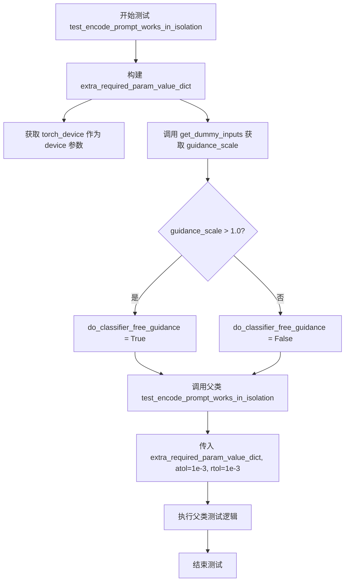

#### 带注释源码

```python
def test_encode_prompt_works_in_isolation(self):
    """
    测试 encode_prompt 在隔离环境下的功能。
    该测试继承自 PipelineTesterMixin，用于验证文本编码器
    能否正确处理 prompt 并且在 classifier_free_guidance 模式下
    正确生成条件和非条件 embeddings。
    
    Returns:
        父类测试方法的返回值，通常为 None（通过断言验证）
    """
    # 构建额外的必需参数字典
    # device: 当前测试设备类型（如 'cuda', 'cpu', 'mps'）
    extra_required_param_value_dict = {
        "device": torch.device(torch_device).type,
        # do_classifier_free_guidance: 根据 guidance_scale 判断是否启用 classifier free guidance
        # 如果 guidance_scale > 1.0 则启用，否则禁用
        "do_classifier_free_guidance": self.get_dummy_inputs(device=torch_device).get("guidance_scale", 1.0) > 1.0,
    }
    # 调用父类的测试方法，传入额外参数和数值容差
    # atol: 绝对容差，用于浮点数比较
    # rtol: 相对容差，用于浮点数比较
    return super().test_encode_prompt_works_in_isolation(extra_required_param_value_dict, atol=1e-3, rtol=1e-3)
```


### `StableDiffusionPAGPipelineIntegrationTests.setUp`

该方法是 `StableDiffusionPAGPipelineIntegrationTests` 测试类的初始化方法，在每个测试方法执行前被调用，用于清理 GPU 内存和缓存，确保测试环境的干净和一致性。

参数：

- `self`：实例方法隐含参数，类型为 `StableDiffusionPAGPipelineIntegrationTests`（继承自 `unittest.TestCase`），表示测试类的实例本身。

返回值：`None`，该方法没有返回值，用于执行测试前的环境准备工作。

#### 流程图

```mermaid
flowchart TD
    A[setUp 方法开始] --> B[调用 super().setUp]
    B --> C[执行 gc.collect 垃圾回收]
    C --> D[调用 backend_empty_cache 清理缓存]
    D --> E[setUp 方法结束]
```

#### 带注释源码

```python
def setUp(self):
    """
    测试用例初始化方法，在每个测试方法执行前自动调用。
    用于准备测试环境，清理GPU内存和缓存。
    """
    # 调用父类 unittest.TestCase 的 setUp 方法
    # 确保父类的初始化逻辑被执行
    super().setUp()
    
    # 执行 Python 垃圾回收，释放不再使用的对象内存
    # 这有助于在测试前清理之前测试可能遗留的对象
    gc.collect()
    
    # 调用后端工具函数清理 GPU 缓存
    # torch_device 是全局变量，表示当前测试使用的设备（如 'cuda' 或 'cpu'）
    # 这一步对于 GPU 测试尤为重要，可以避免内存溢出
    backend_empty_cache(torch_device)
```


### `StableDiffusionPAGPipelineIntegrationTests.tearDown`

该方法是测试框架的标准 teardown 钩子，用于在每个集成测试方法执行完成后清理资源，确保释放 GPU 内存并执行垃圾回收，防止测试之间的内存泄漏。

参数：
- `self`：隐式参数，`StableDiffusionPAGPipelineIntegrationTests` 实例本身，无需显式传递

返回值：`None`，无返回值

#### 流程图

```mermaid
flowchart TD
    A[tearDown 开始] --> B[调用 super().tearDown]
    B --> C[执行 gc.collect 垃圾回收]
    C --> D[调用 backend_empty_cache 清理GPU缓存]
    D --> E[tearDown 结束]
    
    style A fill:#f9f,color:#000
    style E fill:#9f9,color:#000
```

#### 带注释源码

```python
def tearDown(self):
    """
    测试方法执行完成后的清理工作。
    
    该方法在每个测试方法运行结束后被调用，用于：
    1. 调用父类的 tearDown 方法
    2. 强制进行 Python 垃圾回收，释放测试过程中产生的对象
    3. 清空 GPU 显存缓存，防止显存泄漏
    """
    # 调用父类 (unittest.TestCase) 的 tearDown 方法
    # 确保父类的清理逻辑被执行
    super().tearDown()
    
    # 手动触发 Python 垃圾回收器
    # 回收测试过程中创建的临时对象，释放内存
    gc.collect()
    
    # 调用后端特定的清空缓存函数
    # 清理 GPU 显存中的缓存数据
    # torch_device 是全局变量，表示当前使用的 PyTorch 设备
    backend_empty_cache(torch_device)
```


### `StableDiffusionPAGPipelineIntegrationTests.get_inputs`

该方法用于准备集成测试所需的输入参数。它从指定的URL加载初始图像和掩码图像，并配置生成器参数，用于测试Stable Diffusion PAG（Progressive Anchor Guidance）图像修复管道的功能。

参数：

- `device`：`torch.device`，执行推理的目标设备
- `generator_device`：`str`，生成器使用的设备，默认为"cpu"
- `seed`：`int`，随机种子，用于确保生成的可重复性，默认为0
- `guidance_scale`：`float`，分类器自由引导的guidance scale参数，默认为7.0

返回值：`Dict`，包含以下键的字典：
- `prompt`：文本提示
- `generator`：PyTorch生成器对象
- `image`：初始图像（PIL.Image.Image）
- `mask_image`：掩码图像（PIL.Image.Image）
- `strength`：图像修复强度
- `num_inference_steps`：推理步数
- `guidance_scale`：引导比例
- `pag_scale`：PAG比例
- `output_type`：输出类型

#### 流程图

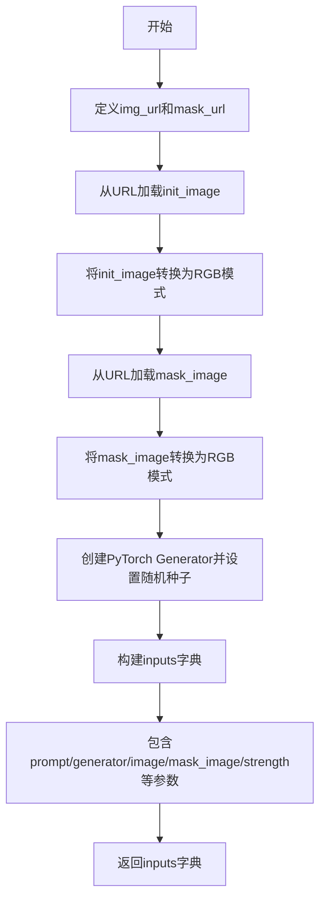

#### 带注释源码

```python
def get_inputs(self, device, generator_device="cpu", seed=0, guidance_scale=7.0):
    """
    准备Stable Diffusion PAG图像修复管道的测试输入参数
    
    参数:
        device: torch.device - 执行推理的目标设备
        generator_device: str - 生成器设备，默认为"cpu"
        seed: int - 随机种子，确保可重复性，默认为0
        guidance_scale: float - 引导比例，默认为7.0
    
    返回:
        dict: 包含管道推理所需的所有输入参数
    """
    # 定义要修复的初始图像URL（来自CompVis/latent-diffusion项目）
    img_url = "https://raw.githubusercontent.com/CompVis/latent-diffusion/main/data/inpainting_examples/overture-creations-5sI6fQgYIuo.png"
    
    # 定义掩码图像URL（用于指定需要修复的区域）
    mask_url = "https://raw.githubusercontent.com/CompVis/latent-diffusion/main/data/inpainting_examples/overture-creations-5sI6fQgYIuo_mask.png"

    # 从URL加载初始图像并转换为RGB模式
    init_image = load_image(img_url).convert("RGB")
    
    # 从URL加载掩码图像并转换为RGB模式
    mask_image = load_image(mask_url).convert("RGB")

    # 创建PyTorch生成器并设置随机种子以确保可重复性
    generator = torch.Generator(device=generator_device).manual_seed(seed)
    
    # 构建完整的输入参数字典
    inputs = {
        "prompt": "A majestic tiger sitting on a bench",  # 文本提示
        "generator": generator,  # 随机生成器
        "image": init_image,  # 初始图像
        "mask_image": mask_image,  # 掩码图像
        "strength": 0.8,  # 修复强度（0-1之间）
        "num_inference_steps": 3,  # 推理步数
        "guidance_scale": guidance_scale,  # 引导比例
        "pag_scale": 3.0,  # PAG（Progressive Anchor Guidance）比例
        "output_type": "np",  # 输出类型为numpy数组
    }
    return inputs
```


### `StableDiffusionPAGPipelineIntegrationTests.test_pag_cfg`

该测试方法用于验证 Stable Diffusion PAG（Prompt Ascend Gradient）pipeline 在 Classifier-Free Guidance 模式下的图像修复（inpainting）功能是否正常工作，通过加载预训练模型并执行推理，最后对比输出图像与预期结果的一致性。

参数：

- `self`：隐式参数，`unittest.TestCase` 实例，代表测试类本身

返回值：`None`，无返回值（测试方法，通过断言验证正确性）

#### 流程图

```mermaid
flowchart TD
    A[开始测试] --> B[从预训练模型加载 AutoPipelineForInpainting<br/>设置 enable_pag=True, torch_dtype=torch.float16]
    B --> C[启用模型 CPU 卸载<br/>pipeline.enable_model_cpu_offload]
    C --> D[设置进度条配置<br/>pipeline.set_progress_bar_config]
    D --> E[获取测试输入<br/>调用 get_inputs 方法]
    E --> F[执行 pipeline 推理<br/>pipeline(**inputs)]
    F --> G[获取输出图像<br/>image = pipeline(...).images]
    G --> H[提取图像切片<br/>image_slice = image[0, -3:, -3:, -1].flatten()]
    H --> I[断言图像形状<br/>assert image.shape == (1, 512, 512, 3)]
    I --> J[定义预期切片<br/>expected_slice = np.array[...]]
    J --> K[断言输出与预期一致<br/>assert np.abs(...).max() < 1e-3]
    K --> L[结束测试]
```

#### 带注释源码

```python
def test_pag_cfg(self):
    """
    测试 PAG pipeline 在 CFG 模式下的图像修复推理功能。
    
    该测试执行以下步骤：
    1. 加载预训练的 Stable Diffusion v1.5 inpainting 模型，启用 PAG 功能
    2. 将模型加载到 GPU（使用 float16 精度）
    3. 启用 CPU 卸载以节省显存
    4. 执行图像修复推理
    5. 验证输出图像的形状和像素值
    """
    # 步骤 1: 从预训练模型创建支持 PAG 的自动 pipeline
    # enable_pag=True 启用 Prompt Ascend Gradient 功能
    # torch_dtype=torch.float16 使用半精度浮点数以减少显存占用
    pipeline = AutoPipelineForInpainting.from_pretrained(
        self.repo_id, 
        enable_pag=True, 
        torch_dtype=torch.float16
    )
    
    # 步骤 2: 启用模型 CPU 卸载
    # 当模型不在推理时，将模型权重卸载到 CPU，节省 GPU 显存
    pipeline.enable_model_offload(device=torch_device)
    
    # 步骤 3: 设置进度条配置
    # disable=None 表示启用进度条显示
    pipeline.set_progress_bar_config(disable=None)
    
    # 步骤 4: 获取测试输入数据
    # 包括：提示词、图像、掩码、生成器、推理步数、引导系数等
    inputs = self.get_inputs(torch_device)
    
    # 步骤 5: 执行图像修复推理
    # **inputs 将字典解包为关键字参数传递给 pipeline
    # 返回的 images 属性包含生成的图像结果
    image = pipeline(**inputs).images
    
    # 步骤 6: 提取图像切片用于验证
    # 取图像右下角 3x3 区域，并展平为一维数组
    image_slice = image[0, -3:, -3:, -1].flatten()
    
    # 步骤 7: 断言验证图像形状
    # 验证输出为单张 512x512x3 的 RGB 图像
    assert image.shape == (1, 512, 512, 3), \
        f"Expected image shape (1, 512, 512, 3), got {image.shape}"
    
    # 步骤 8: 定义预期输出切片
    # 基于确定性输入和相同模型权重得出的预期像素值
    expected_slice = np.array([
        0.38793945, 0.4111328, 0.47924805, 
        0.39208984, 0.4165039, 0.41674805, 
        0.37060547, 0.36791992, 0.40625
    ])
    
    # 步骤 9: 断言验证输出像素值
    # 允许的最大误差为 1e-3，确保数值精度符合预期
    assert np.abs(image_slice.flatten() - expected_slice).max() < 1e-3, \
        f"Output is different from expected, {image_slice.flatten()}"
```


### `StableDiffusionPAGPipelineIntegrationTests.test_pag_uncond`

这是一个集成测试方法，用于验证 Stable Diffusion PAG（Prompt-Aware Guidance）Inpainting Pipeline 在无分类器自由引导（guidance_scale=0.0）条件下的输出是否符合预期，确保模型在关闭引导时仍能正确生成图像。

参数：

- `self`：测试类实例本身，由 unittest 框架自动传入

返回值：`None`，该方法为测试方法，通过断言验证输出，不返回任何值

#### 流程图

```mermaid
flowchart TD
    A[测试开始] --> B[加载预训练模型<br/>AutoPipelineForInpainting.from_pretrained]
    B --> C[启用模型CPU卸载<br/>enable_model_cpu_offload]
    C --> D[设置进度条配置<br/>set_progress_bar_config]
    D --> E[获取测试输入<br/>get_inputs with guidance_scale=0.0]
    E --> F[执行Pipeline推理<br/>pipeline.__call__]
    F --> G[提取图像切片<br/>image[0, -3:, -3:, -1]]
    G --> H{断言验证}
    H -->|通过| I[测试通过]
    H -->|失败| J[抛出AssertionError]
```

#### 带注释源码

```python
def test_pag_uncond(self):
    """
    测试 PAG Inpainting Pipeline 在无分类器自由引导 (guidance_scale=0.0) 下的输出。
    验证模型在关闭引导时仍能生成有效图像，并检查输出图像的形状和像素值是否符合预期。
    """
    # 1. 从预训练模型加载支持 PAG 的 Inpainting Pipeline
    #    - enable_pag=True: 启用 Prompt-Aware Guidance 功能
    #    - torch_dtype=torch.float16: 使用半精度浮点数以减少显存占用
    pipeline = AutoPipelineForInpainting.from_pretrained(
        self.repo_id, 
        enable_pag=True, 
        torch_dtype=torch.float16
    )
    
    # 2. 启用模型 CPU 卸载功能
    #    当模型不在推理时，将模型权重卸载到 CPU 以节省 GPU 显存
    pipeline.enable_model_cpu_offload(device=torch_device)
    
    # 3. 配置进度条显示
    #    disable=None 表示启用进度条显示
    pipeline.set_progress_bar_config(disable=None)

    # 4. 获取测试输入数据
    #    guidance_scale=0.0 表示无分类器自由引导，测试模型的 unconditional 生成能力
    inputs = self.get_inputs(torch_device, guidance_scale=0.0)
    
    # 5. 执行 Pipeline 推理，生成修复后的图像
    #    **inputs 将字典解包为关键字参数传递给 pipeline
    image = pipeline(**inputs).images

    # 6. 提取图像右下角 3x3 区域的像素值并展平
    #    用于与预期值进行对比验证
    image_slice = image[0, -3:, -3:, -1].flatten()
    
    # 7. 断言验证输出图像的形状
    #    期望形状为 (1, 512, 512, 3)，即 1 张 512x512 的 RGB 图像
    assert image.shape == (1, 512, 512, 3), (
        f"Output image shape should be (1, 512, 512, 3), but got {image.shape}"
    )

    # 8. 定义预期的图像像素值切片
    #    这些值是在特定随机种子下使用相同模型配置生成的参考输出
    expected_slice = np.array([
        0.3876953, 0.40356445, 0.4934082, 
        0.39697266, 0.41674805, 0.41015625, 
        0.375, 0.36914062, 0.40649414
    ])
    
    # 9. 断言验证生成图像与预期值的差异
    #    使用最大绝对误差 (max) 进行对比，阈值设为 1e-3 (0.001)
    assert np.abs(image_slice.flatten() - expected_slice).max() < 1e-3, (
        f"Output is different from expected, {image_slice.flatten()}"
    )
```

## 关键组件


### StableDiffusionPAGInpaintPipeline

PAG（Prompt Attention Guidance）图像修复管道，继承自diffusers库，用于根据文本提示和掩码对图像进行修复，同时应用PAG技术来增强生成质量。

### PNDMScheduler

调度器，用于管理去噪过程中的噪声调度，控制推理步骤的数量和噪声去除的策略。

### UNet2DConditionModel

条件UNet模型，是Stable Diffusion的核心组件，负责在潜在空间中进行去噪处理，接受文本嵌入和时间步条件信息。

### AutoencoderKL

变分自编码器（VAE）模型，用于将图像编码到潜在空间以及从潜在空间解码回图像，支持图像的压缩和重建。

### CLIPTextModel & CLIPTokenizer

文本编码器组件，将文本提示转换为高维向量表示，用于条件生成图像。

### _set_pag_attn_processor

PAG注意力处理器设置方法，负责配置哪些层的自注意力需要应用PAG技术，支持按层级（如mid、up、down）或具体层路径指定。

### get_dummy_components

测试辅助方法，创建用于单元测试的虚拟组件（UNet、VAE、文本编码器等），包含预定义的模型配置。

### get_dummy_inputs

测试辅助方法，生成虚拟输入数据，包括浮点张量图像、掩码图像、生成器配置和推理参数。

### test_pag_applied_layers

测试方法，验证PAG应用层级的正确性，包括全层级应用、具体块应用和无效层级拒绝等场景。

### test_pag_inference

测试方法，验证PAG管道在启用PAG情况下的推理功能，检查输出图像的形状和数值正确性。

### AutoPipelineForInpainting

自动管道工厂类，支持从预训练模型加载图像修复管道，并可通过enable_pag参数启用PAG功能。

### enable_pag 参数

控制是否启用Prompt Attention Guidance技术的开关，启用后会在去噪过程中应用PAG策略。

### pag_scale 与 pag_adaptive_scale

PAG相关参数，控制PAG强度和自适应缩放，用于调节PAG对生成结果的影响程度。


## 问题及建议


### 已知问题

- **外部网络依赖**：集成测试通过 URL 加载图像（`img_url` 和 `mask_url`），网络不可用或 URL 失效会导致测试失败，缺乏本地 fallback 机制
- **硬编码的测试数据**：期望的输出 slice 值（如 `expected_slice`）和参数（如 `pag_scale=0.9`、`guidance_scale=6.0`）硬编码在测试中，降低了代码的可维护性
- **被注释的测试代码**：`test_pag_applied_layers` 中有被注释掉的预期层 `"mid_block.attentions.0.transformer_blocks.1.attn1.processor"`，可能表示未完成的测试逻辑
- **设备兼容性处理不一致**：`get_dummy_inputs` 中对 MPS 设备使用 `torch.manual_seed()` 而其他设备使用 `torch.Generator(device=device).manual_seed()`，这种差异可能导致行为不一致
- **测试断言信息不完整**：部分断言只显示实际值，未提供足够的上下文信息（如 `test_pag_cfg` 中的断言）
- **缺乏参数边界验证**：未对 `pag_scale`、`pag_adaptive_scale` 等参数的有效范围进行验证测试
- **资源清理可能不彻底**：虽然调用了 `gc.collect()` 和 `backend_empty_cache()`，但未验证 GPU 内存是否真正释放

### 优化建议

- 将外部图像 URL 替换为本地测试资源或使用 mock 对象，避免网络依赖
- 将硬编码的测试参数和期望值提取为测试类的类常量或配置文件
- 完成被注释的测试逻辑或移除注释，明确测试意图
- 统一随机数生成方式，考虑使用 pytest fixtures 管理设备参数
- 增强断言信息，包含更多上下文帮助调试失败原因
- 添加参数边界值测试，验证 `pag_scale` 负值、过大值等边界情况
- 使用 `torch.cuda.memory_allocated()` 或类似机制验证内存清理是否成功

## 其它


### 设计目标与约束

本测试文件旨在验证StableDiffusionPAGInpaintPipeline的功能正确性，主要设计目标包括：(1) 确保PAG(Progressive Attention Guidance)技术在图像修复任务中的正确应用；(2) 验证不同PAG应用层级的正确性；(3) 测试Pipeline在CPU和GPU环境下的推理结果一致性；(4) 通过单元测试和集成测试确保代码质量。约束条件包括：需要CUDA支持（对于加速测试）、需要足够的内存加载大型模型、测试必须在规定时间内完成（通过@slow装饰器区分快速测试和完整测试）。

### 错误处理与异常设计

代码中的错误处理主要通过以下方式实现：(1) 使用self.assertRaises()捕获预期异常，如test_pag_applied_layers中当传入不存在的层时会抛出ValueError；(2) 使用数值比较的容差（atol=1e-3, rtol=1e-3）处理浮点数精度问题；(3) 通过np.abs().max() < 1e-3断言验证输出图像与期望值的差异在可接受范围内。对于不可恢复的错误（如模型加载失败），测试框架会自动标记为失败。

### 数据流与状态机

测试数据流遵循以下路径：(1) get_dummy_components()创建虚拟模型组件（UNet、VAE、TextEncoder等）；(2) get_dummy_inputs()生成测试输入（prompt、image、mask_image、generator等）；(3) Pipeline接收输入后执行推理；(4) 输出图像结果用于断言验证。状态机方面：测试通过setUp()进行初始化，通过tearDown()进行资源清理；Pipeline在测试中经历加载→配置→推理→结果验证的完整生命周期。

### 外部依赖与接口契约

主要外部依赖包括：(1) diffusers库：提供StableDiffusionPAGInpaintPipeline、AutoencoderKL、PNDMScheduler等核心类；(2) transformers库：提供CLIPTextConfig、CLIPTextModel、CLIPTokenizer；(3) PyTorch：提供张量运算和模型定义；(4) PIL：图像处理；(5) numpy：数值计算。接口契约方面：pipeline_class必须继承正确的Mixin类（PipelineTesterMixin等），params和batch_params必须包含必要的参数集，_set_pag_attn_processor()方法必须接受pag_applied_layers参数并返回正确的attn_processors。

### 测试覆盖范围

测试覆盖范围包括：(1) PAG应用层级测试：验证"down"、"mid"、"up"以及具体块级别的层选择功能；(2) 图像修复推理测试：验证输出图像形状和像素值；(3) Prompt编码隔离测试：确保encode_prompt方法独立工作；(4) 集成测试：使用真实模型（stable-diffusion-v1-5）验证端到端流程；(5) 引导_scale测试：验证CFG（Cfg）和无CFG情况下的输出。测试使用虚拟组件进行快速验证，使用真实模型进行完整验证。

### 性能考虑与基准

性能相关配置包括：(1) num_inference_steps=2（快速测试）vs num_inference_steps=3（集成测试）；(2) 使用torch.float16减少内存占用；(3) enable_model_cpu_offload()优化GPU内存使用；(4) gc.collect()和backend_empty_cache()确保内存及时释放。基准性能指标：虚拟组件测试应在秒级完成，集成测试由于加载大型模型需要更长时间，使用@slow装饰器标记耗时测试。

### 可维护性与扩展性设计

代码可维护性设计包括：(1) get_dummy_components()和get_dummy_inputs()方法封装创建逻辑，便于复用和修改；(2) 使用类属性（params、batch_params、callback_cfg_params）集中管理参数配置；(3) 通过Mixin类（IPAdapterTesterMixin等）实现功能模块化。扩展性方面：可通过继承StableDiffusionPAGInpaintPipelineFastTests添加新的测试方法，可通过修改params添加新参数支持，可通过调整get_dummy_components()中的配置测试不同的模型架构。

### 资源清理与生命周期管理

资源管理策略包括：(1) setUp()方法在每个测试前执行初始化；(2) tearDown()方法在测试后执行清理（gc.collect()和backend_empty_cache()）；(3) 使用torch.manual_seed()确保测试可重复性；(4) 虚拟组件测试使用CPU设备确保确定性。集成测试特别关注GPU内存管理：使用enable_model_cpu_offload()避免OOM，使用torch.float16减少显存占用。

### 测试环境要求

环境要求包括：(1) Python 3.x环境；(2) PyTorch支持（CPU或CUDA）；(3) 依赖库：diffusers、transformers、PIL、numpy；(4) 集成测试需要下载stable-diffusion-v1-5模型（约4GB）；(5) @slow装饰的测试需要较长执行时间；(6) @require_torch_accelerator装饰的测试需要GPU支持。设备兼容性：代码通过torch_device变量支持不同设备，通过str(device).startswith("mps")处理Apple Silicon特殊需求。

    