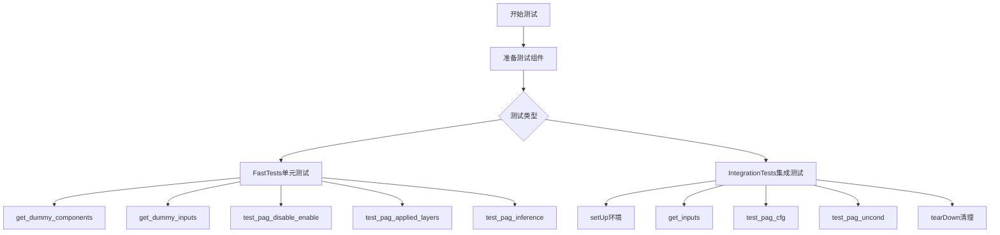
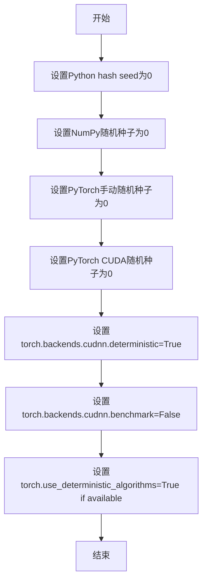
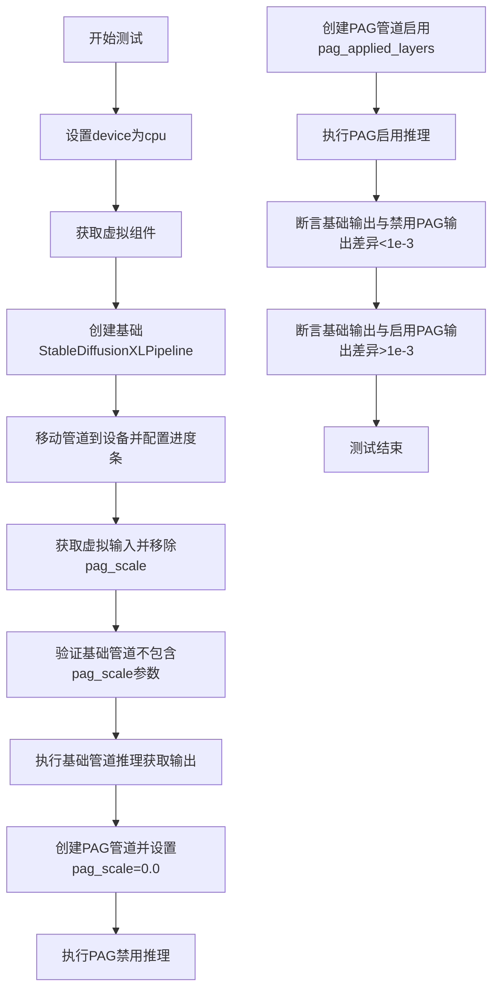
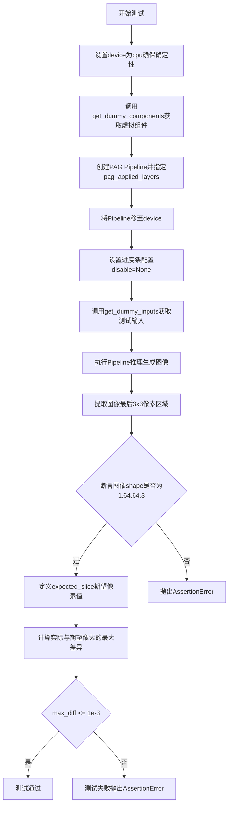
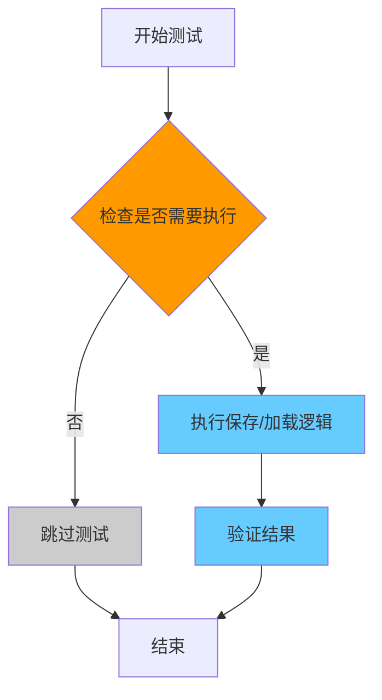
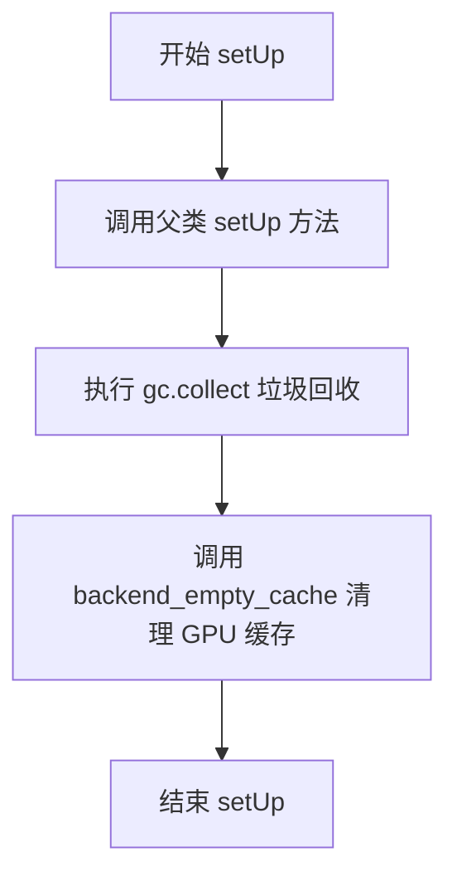
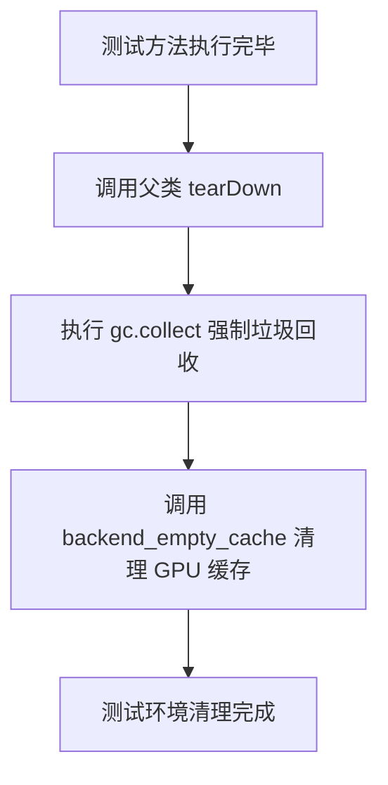
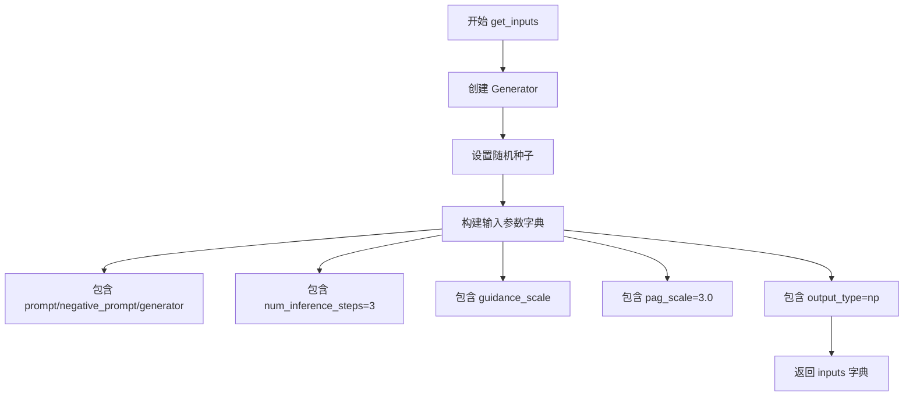

# `diffusers\tests\pipelines\pag\test_pag_sdxl.py` 详细设计文档

这是一个针对Stable Diffusion XL PAG（Prompt Attention Guidance）流水线的测试文件，包含单元测试和集成测试，用于验证PAG功能的禁用/启用、应用层配置和推理效果。

## 整体流程



## 类结构

```
unittest.TestCase
├── StableDiffusionXLPAGPipelineFastTests
│   ├── PipelineTesterMixin
│   ├── IPAdapterTesterMixin
│   ├── PipelineLatentTesterMixin
│   └── PipelineFromPipeTesterMixin
└── StableDiffusionXLPAGPipelineIntegrationTests
```

## 全局变量及字段


### `StableDiffusionXLPAGPipelineFastTests.pipeline_class`
    
被测试的StableDiffusionXLPAGPipeline管道类

类型：`Type[StableDiffusionXLPAGPipeline]`
    


### `StableDiffusionXLPAGPipelineFastTests.params`
    
包含TEXT_TO_IMAGE_PARAMS加上pag_scale和pag_adaptive_scale的参数字典

类型：`set`
    


### `StableDiffusionXLPAGPipelineFastTests.batch_params`
    
文本到图像批处理参数的集合

类型：`set`
    


### `StableDiffusionXLPAGPipelineFastTests.image_params`
    
图像参数的集合，用于测试图像输出

类型：`set`
    


### `StableDiffusionXLPAGPipelineFastTests.image_latents_params`
    
图像潜在变量的参数集合

类型：`set`
    


### `StableDiffusionXLPAGPipelineFastTests.callback_cfg_params`
    
包含TEXT_TO_IMAGE_CALLBACK_CFG_PARAMS加上add_text_embeds和add_time_ids的回调配置参数

类型：`set`
    


### `StableDiffusionXLPAGPipelineIntegrationTests.pipeline_class`
    
被测试的StableDiffusionXLPAGPipeline管道类

类型：`Type[StableDiffusionXLPAGPipeline]`
    


### `StableDiffusionXLPAGPipelineIntegrationTests.repo_id`
    
HuggingFace模型仓库ID，指向stabilityai/stable-diffusion-xl-base-1.0

类型：`str`
    
    

## 全局函数及方法


### `enable_full_determinism`

该函数用于启用PyTorch和相关库（NumPy）的完全确定性运行模式，确保测试或实验结果可复现。它通过设置随机种子、配置PyTorch的后端选项（如cuDNN）来禁用非确定性操作，从而在多次运行中获得一致的输出。

参数：无

返回值：无

#### 流程图



#### 带注释源码

```python
# 该函数定义在 diffusers.testing_utils 模块中
# 位置：diffusers/testing_utils.py

def enable_full_determinism():
    """
    启用完全确定性运行模式，确保测试结果可复现。
    
    该函数通过以下方式实现确定性：
    1. 设置Python的hash seed为固定值
    2. 设置NumPy和PyTorch的随机种子
    3. 配置cuDNN使用确定性算法
    4. 启用PyTorch的确定性算法模式
    """
    # 设置Python hash种子，确保字典等数据结构的迭代顺序一致
    os.environ["PYTHONHASHSEED"] = "0"
    
    # 设置NumPy随机种子
    np.random.seed(0)
    
    # 设置PyTorch CPU随机种子
    torch.manual_seed(0)
    
    # 设置PyTorch CUDA随机种子
    torch.cuda.manual_seed_all(0)
    
    # 强制cuDNN使用确定性算法（以牺牲性能为代价）
    torch.backends.cudnn.deterministic = True
    
    # 禁用cuDNN自动调优（确保每次使用相同的卷积算法）
    torch.backends.cudnn.benchmark = False
    
    # 如果可用，启用PyTorch的确定性算法模式
    if hasattr(torch, "use_deterministic_algorithms"):
        try:
            torch.use_deterministic_algorithms(True)
        except Exception:
            # 某些操作可能不完全支持确定性，回退到基础设置
            pass
```


### `StableDiffusionXLPAGPipelineFastTests.get_dummy_components`

该方法用于生成 Stable Diffusion XL PAG Pipeline 测试所需的虚拟（dummy）组件对象，包括 UNet、VAE、调度器、文本编码器等，并返回一个包含所有组件的字典。

参数：

- `time_cond_proj_dim`：`Optional[int]`，可选参数，时间条件投影维度（time conditional projection dimension），用于配置 UNet 模型，默认为 `None`

返回值：`Dict[str, Any]`，返回包含以下键的字典：
- `"unet"`：UNet2DConditionModel 实例
- `"scheduler"`：EulerDiscreteScheduler 实例
- `"vae"`：AutoencoderKL 实例
- `"text_encoder"`：CLIPTextModel 实例
- `"tokenizer"`：CLIPTokenizer 实例
- `"text_encoder_2"`：CLIPTextModelWithProjection 实例
- `"tokenizer_2"`：CLIPTokenizer 实例
- `"image_encoder"`：None
- `"feature_extractor"`：None

#### 流程图

```mermaid
flowchart TD
    A[开始 get_dummy_components] --> B[设置随机种子 torch.manual_seed(0)]
    B --> C[创建 UNet2DConditionModel]
    C --> D[创建 EulerDiscreteScheduler]
    D --> E[设置随机种子 torch.manual_seed(0)]
    E --> F[创建 AutoencoderKL]
    F --> G[设置随机种子 torch.manual_seed(0)]
    G --> H[创建 CLIPTextConfig]
    H --> I[创建 CLIPTextModel]
    I --> J[创建 CLIPTokenizer]
    J --> K[创建 CLIPTextModelWithProjection]
    K --> L[创建另一个 CLIPTokenizer]
    L --> M[组装 components 字典]
    M --> N[返回 components]
    
    C -.->|time_cond_proj_dim参数| C
```

#### 带注释源码

```python
def get_dummy_components(self, time_cond_proj_dim=None):
    """
    生成用于测试的虚拟组件。
    
    参数:
        time_cond_proj_dim: 可选的时间条件投影维度，用于配置UNet
    返回:
        包含所有pipeline组件的字典
    """
    # 设置随机种子以确保测试可重复性
    torch.manual_seed(0)
    
    # 创建 UNet2DConditionModel - 用于去噪的UNet模型
    unet = UNet2DConditionModel(
        block_out_channels=(2, 4),        # 块输出通道数
        layers_per_block=2,                # 每层块数
        time_cond_proj_dim=time_cond_proj_dim,  # 时间条件投影维度
        sample_size=32,                    # 样本尺寸
        in_channels=4,                     # 输入通道数
        out_channels=4,                    # 输出通道数
        down_block_types=("DownBlock2D", "CrossAttnDownBlock2D"),  # 下采样块类型
        up_block_types=("CrossAttnUpBlock2D", "UpBlock2D"),       # 上采样块类型
        # SD2-specific config below
        attention_head_dim=(2,4),          # 注意力头维度
        use_linear_projection=True,        # 使用线性投影
        addition_embed_type="text_time",   # 附加嵌入类型
        addition_time_embed_dim=8,         # 附加时间嵌入维度
        transformer_layers_per_block=(1, 2),  # 每块transformer层数
        projection_class_embeddings_input_dim=80,  # 投影类嵌入输入维度
        cross_attention_dim=64,            # 交叉注意力维度
        norm_num_groups=1,                 # 归一化组数
    )
    
    # 创建 EulerDiscreteScheduler - 离散调度器
    scheduler = EulerDiscreteScheduler(
        beta_start=0.00085,                # beta起始值
        beta_end=0.012,                    # beta结束值
        steps_offset=1,                    # 步数偏移
        beta_schedule="scaled_linear",    # beta调度策略
        timestep_spacing="leading",       # 时间步间距
    )
    
    # 重新设置随机种子以确保VAE的可重复性
    torch.manual_seed(0)
    
    # 创建 AutoencoderKL - VAE变分自编码器
    vae = AutoencoderKL(
        block_out_channels=[32, 64],       # 块输出通道
        in_channels=3,                     # 输入通道 (RGB)
        out_channels=3,                    # 输出通道 (RGB)
        down_block_types=["DownEncoderBlock2D", "DownEncoderBlock2D"],  # 下采样编码块
        up_block_types=["UpDecoderBlock2D", "UpDecoderBlock2D"],        # 上采样解码块
        latent_channels=4,                # 潜在空间通道数
        sample_size=128,                  # 样本尺寸
    )
    
    # 重新设置随机种子以确保文本编码器的可重复性
    torch.manual_seed(0)
    
    # 创建 CLIP 文本编码器配置
    text_encoder_config = CLIPTextConfig(
        bos_token_id=0,                    # 起始符ID
        eos_token_id=2,                    # 结束符ID
        hidden_size=32,                    # 隐藏层大小
        intermediate_size=37,              # 中间层大小
        layer_norm_eps=1e-05,               # 层归一化epsilon
        num_attention_heads=4,             # 注意力头数
        num_hidden_layers=5,               # 隐藏层数
        pad_token_id=1,                    # 填充符ID
        vocab_size=1000,                   # 词汇表大小
        # SD2-specific config below
        hidden_act="gelu",                 # 激活函数
        projection_dim=32,                 # 投影维度
    )
    
    # 创建第一个 CLIP 文本编码器模型
    text_encoder = CLIPTextModel(text_encoder_config)
    
    # 从预训练模型加载 tokenizer
    tokenizer = CLIPTokenizer.from_pretrained("hf-internal-testing/tiny-random-clip")
    
    # 创建第二个带投影的 CLIP 文本编码器 (用于双文本编码器支持)
    text_encoder_2 = CLIPTextModelWithProjection(text_encoder_config)
    
    # 加载第二个 tokenizer
    tokenizer_2 = CLIPTokenizer.from_pretrained("hf-internal-testing/tiny-random-clip")
    
    # 组装所有组件到字典中
    components = {
        "unet": unet,                       # UNet去噪模型
        "scheduler": scheduler,             # 调度器
        "vae": vae,                         # VAE变分自编码器
        "text_encoder": text_encoder,      # 主文本编码器
        "tokenizer": tokenizer,             # 主tokenizer
        "text_encoder_2": text_encoder_2,  # 第二文本编码器
        "tokenizer_2": tokenizer_2,         # 第二tokenizer
        "image_encoder": None,              # 图像编码器 (测试中设为None)
        "feature_extractor": None,          # 特征提取器 (测试中设为None)
    }
    
    # 返回组件字典供pipeline使用
    return components
```


### `StableDiffusionXLPAGPipelineFastTests.get_dummy_inputs`

该方法用于生成 Stable Diffusion XL PAG Pipeline 测试所需的虚拟输入参数，封装了提示词、随机数生成器、推理步数、引导系数等关键参数，以支持自动化测试流程的确定性执行。

参数：

- `self`：隐式参数，测试类实例本身
- `device`：`str`，目标设备标识符，用于创建对应的随机数生成器（如 "cpu"、"cuda" 等）
- `seed`：`int`，随机种子，默认值为 0，用于确保测试结果的可复现性

返回值：`dict`，包含以下键值对的字典：
- `"prompt"`：`str`，测试用的提示词文本
- `generator`：`torch.Generator`，PyTorch 随机数生成器实例
- `"num_inference_steps"`：`int`，推理步数（固定为 2）
- `"guidance_scale"`：`float`，引导系数（固定为 5.0）
- `"pag_scale"`：`float`，PAG（Prompt Attention Guidance）缩放因子（固定为 0.9）
- `"output_type"`：`str`，输出类型（固定为 "np"，即 NumPy 数组）

#### 流程图

```mermaid
flowchart TD
    A[开始 get_dummy_inputs] --> B{device 是否以 'mps' 开头?}
    B -->|是| C[使用 torch.manual_seed(seed)]
    B -->|否| D[创建 torch.Generator(device=device)]
    C --> E[调用 generator.manual_seed(seed)]
    D --> E
    E --> F[构建 inputs 字典]
    F --> G[设置 prompt: 'A painting of a squirrel eating a burger']
    G --> H[设置 generator]
    H --> I[设置 num_inference_steps: 2]
    I --> J[设置 guidance_scale: 5.0]
    J --> K[设置 pag_scale: 0.9]
    K --> L[设置 output_type: 'np']
    L --> M[返回 inputs 字典]
```

#### 带注释源码

```python
def get_dummy_inputs(self, device, seed=0):
    """
    生成用于 Stable Diffusion XL PAG Pipeline 测试的虚拟输入参数。
    
    参数:
        device (str): 目标设备标识符，用于创建随机数生成器。
        seed (int, optional): 随机种子，默认值为 0，用于确保测试可复现。
    
    返回:
        dict: 包含 pipeline 调用所需参数的字典。
    """
    # 判断设备类型，MPS (Apple Silicon) 需要特殊处理
    if str(device).startswith("mps"):
        # MPS 设备不支持 torch.Generator，使用 torch.manual_seed 代替
        generator = torch.manual_seed(seed)
    else:
        # 为指定设备创建随机数生成器并设置种子
        generator = torch.Generator(device=device).manual_seed(seed)
    
    # 构建测试输入参数字典
    inputs = {
        "prompt": "A painting of a squirrel eating a burger",  # 测试用提示词
        "generator": generator,                                  # 随机数生成器确保确定性
        "num_inference_steps": 2,                                # 少量推理步数加速测试
        "guidance_scale": 5.0,                                    # classifier-free guidance 强度
        "pag_scale": 0.9,                                         # Prompt Attention Guidance 缩放因子
        "output_type": "np",                                      # 输出为 NumPy 数组便于验证
    }
    return inputs
```


### `StableDiffusionXLPAGPipelineFastTests.test_pag_disable_enable`

该测试方法验证了 Stable Diffusion XL 的 PAG（Prompt Attention Guidance）功能的禁用和启用行为，确保当 PAG 被禁用时（pag_scale=0.0）输出与基础管道相同，而启用时产生不同的输出。

参数：

- `self`：隐式参数，表示测试类实例本身

返回值：`None`，测试方法无返回值，通过断言验证功能正确性

#### 流程图



#### 带注释源码

```python
def test_pag_disable_enable(self):
    """
    测试PAG功能的禁用和启用行为
    - 验证禁用PAG时输出与基础管道相同
    - 验证启用PAG时输出与基础管道不同
    """
    device = "cpu"  # 确保设备无关的torch.Generator的确定性
    
    # 获取虚拟组件用于测试
    components = self.get_dummy_components()

    # ===== 基础管道测试（期望PAG禁用时输出相同）=====
    # 创建不带PAG功能的StableDiffusionXLPipeline
    pipe_sd = StableDiffusionXLPipeline(**components)
    pipe_sd = pipe_sd.to(device)
    pipe_sd.set_progress_bar_config(disable=None)

    # 获取虚拟输入，移除pag_scale参数
    inputs = self.get_dummy_inputs(device)
    del inputs["pag_scale"]
    
    # 验证基础管道不包含pag_scale参数
    assert "pag_scale" not in inspect.signature(pipe_sd.__call__).parameters, (
        f"`pag_scale` should not be a call parameter of the base pipeline {pipe_sd.__class__.__name__}."
    )
    
    # 执行推理并提取输出图像的右下角3x3区域
    out = pipe_sd(**inputs).images[0, -3:, -3:, -1]

    # ===== PAG禁用测试（pag_scale=0.0）=====
    # 创建带PAG功能的管道
    pipe_pag = self.pipeline_class(**components)
    pipe_pag = pipe_pag.to(device)
    pipe_pag.set_progress_bar_config(disable=None)

    inputs = self.get_dummy_inputs(device)
    inputs["pag_scale"] = 0.0  # 设置pag_scale为0.0以禁用PAG
    out_pag_disabled = pipe_pag(**inputs).images[0, -3:, -3:, -1]

    # ===== PAG启用测试 ======
    # 创建带PAG功能的管道并指定应用PAG的层
    pipe_pag = self.pipeline_class(**components, pag_applied_layers=["mid", "up", "down"])
    pipe_pag = pipe_pag.to(device)
    pipe_pag.set_progress_bar_config(disable=None)

    inputs = self.get_dummy_inputs(device)
    out_pag_enabled = pipe_pag(**inputs).images[0, -3:, -3:, -1]

    # ===== 断言验证 =====
    # 验证禁用PAG时输出与基础管道相同（差异<1e-3）
    assert np.abs(out.flatten() - out_pag_disabled.flatten()).max() < 1e-3
    # 验证启用PAG时输出与基础管道不同（差异>1e-3）
    assert np.abs(out.flatten() - out_pag_enabled.flatten()).max() > 1e-3
```


### `StableDiffusionXLPAGPipelineFastTests.test_pag_applied_layers`

该测试方法用于验证 PAG（Progressive Attention Guidance）注意力处理器在 Stable Diffusion XL pipeline 中的层级选择功能是否正确。它通过多种层路径格式（如 "mid"、"down"、"up" 或完整的 "mid_block.attentions.0.transformer_blocks.0.attn1.processor"）来测试是否能够正确地将 PAG 处理器应用到指定的自注意力层，并验证无效层级会抛出预期的 ValueError。

参数：
- `self`：隐式参数，测试类实例本身

返回值：`None`，无返回值（测试方法）

#### 流程图

```mermaid
flowchart TD
    A[开始测试] --> B[创建虚拟组件并初始化Pipeline]
    B --> C[获取所有self-attention层]
    C --> D[测试pag_layers=['mid', 'down', 'up']]
    D --> E{验证所有self-attention层都被PAG处理}
    E -->|是| F[测试pag_layers=['mid']]
    F --> G{验证mid_block的self-attention层}
    G -->|是| H[测试pag_layers=['mid_block']]
    H --> I{验证mid_block的self-attention层}
    I -->|是| J[测试pag_layers=['mid_block.attentions.0']]
    J --> K{验证mid_block的self-attention层}
    K -->|是| L[测试pag_layers=['mid_block.attentions.1'] - 不存在的层]
    L --> M{捕获ValueError}
    M -->|成功捕获| N[测试pag_layers=['down']]
    N --> O{验证down_blocks的self-attention层数量}
    O -->|是| P[测试pag_layers=['down_blocks.0'] - 无效索引]
    P --> Q{捕获ValueError}
    Q -->|成功捕获| R[测试pag_layers=['down_blocks.1']]
    R --> S{验证down_blocks.1的self-attention层数量}
    S -->|是| T[测试pag_layers=['down_blocks.1.attentions.1']]
    T --> U{验证down_blocks.1.attentions.1的self-attention层数量}
    U -->|是| V[测试通过]
    V --> W[结束]
    
    E -->|否| X[测试失败]
    G -->|否| X
    I -->|否| X
    K -->|否| X
    M -->|未捕获| X
    O -->|否| X
    Q -->|未捕获| X
    S -->|否| X
    U -->|否| X
```

#### 带注释源码

```python
def test_pag_applied_layers(self):
    """
    测试PAG注意力处理器在不同层级的应用是否正确。
    验证通过_set_pag_attn_processor方法设置pag_applied_layers参数后，
    能否正确识别并应用到指定的自注意力层。
    """
    # 使用CPU设备以确保torch.Generator的确定性
    device = "cpu"
    
    # 获取用于测试的虚拟（dummy）组件
    components = self.get_dummy_components()

    # 创建基础pipeline并移至指定设备
    pipe = self.pipeline_class(**components)
    pipe = pipe.to(device)
    pipe.set_progress_bar_config(disable=None)

    # ============================================================
    # 测试1: pag_applied_layers = ["mid","up","down"] 
    # 应该应用到所有self-attention层
    # ============================================================
    # 收集所有包含"attn1"的自注意力处理器键名
    all_self_attn_layers = [k for k in pipe.unet.attn_processors.keys() if "attn1" in k]
    
    # 保存原始注意力处理器以供后续重置
    original_attn_procs = pipe.unet.attn_processors
    
    # 设置PAG处理器应用到mid、down、up层
    pag_layers = ["mid", "down", "up"]
    pipe._set_pag_attn_processor(pag_applied_layers=pag_layers, do_classifier_free_guidance=False)
    
    # 断言：PAG处理器应覆盖所有自注意力层
    assert set(pipe.pag_attn_processors) == set(all_self_attn_layers)

    # ============================================================
    # 测试2: pag_applied_layers = ["mid"] 
    # 应该只应用到mid_block中的所有self-attention层
    # ============================================================
    # 预期的mid_block自注意力层路径列表
    all_self_attn_mid_layers = [
        "mid_block.attentions.0.transformer_blocks.0.attn1.processor",
        "mid_block.attentions.0.transformer_blocks.1.attn1.processor",
    ]
    
    # 重置为原始注意力处理器
    pipe.unet.set_attn_processor(original_attn_procs.copy())
    
    # 测试仅应用mid层
    pag_layers = ["mid"]
    pipe._set_pag_attn_processor(pag_applied_layers=pag_layers, do_classifier_free_guidance=False)
    assert set(pipe.pag_attn_processors) == set(all_self_attn_mid_layers)

    # ============================================================
    # 测试3: 使用完整路径 "mid_block"
    # ============================================================
    pipe.unet.set_attn_processor(original_attn_procs.copy())
    pag_layers = ["mid_block"]
    pipe._set_pag_attn_processor(pag_applied_layers=pag_layers, do_classifier_free_guidance=False)
    assert set(pipe.pag_attn_processors) == set(all_self_attn_mid_layers)

    # ============================================================
    # 测试4: 使用更详细的路径 "mid_block.attentions.0"
    # ============================================================
    pipe.unet.set_attn_processor(original_attn_procs.copy())
    pag_layers = ["mid_block.attentions.0"]
    pipe._set_pag_attn_processor(pag_applied_layers=pag_layers, do_classifier_free_guidance=False)
    assert set(pipe.pag_attn_processors) == set(all_self_attn_mid_layers)

    # ============================================================
    # 测试5: 不存在的层级应该抛出ValueError
    # pag_applied_layers = ["mid_block.attentions.1"] 不存在
    # ============================================================
    pipe.unet.set_attn_processor(original_attn_procs.copy())
    pag_layers = ["mid_block.attentions.1"]
    with self.assertRaises(ValueError):
        pipe._set_pag_attn_processor(pag_applied_layers=pag_layers, do_classifier_free_guidance=False)

    # ============================================================
    # 测试6: pag_applied_layers = "down" 
    # 应该应用到down_blocks中的所有self-attention层
    # 预期有4个自注意力层
    # ============================================================
    pipe.unet.set_attn_processor(original_attn_procs.copy())
    pag_layers = ["down"]
    pipe._set_pag_attn_processor(pag_applied_layers=pag_layers, do_classifier_free_guidance=False)
    assert len(pipe.pag_attn_processors) == 4

    # ============================================================
    # 测试7: 无效的块索引应该抛出ValueError
    # down_blocks.0 在该模型中不存在
    # ============================================================
    pipe.unet.set_attn_processor(original_attn_procs.copy())
    pag_layers = ["down_blocks.0"]
    with self.assertRaises(ValueError):
        pipe._set_pag_attn_processor(pag_applied_layers=pag_layers, do_classifier_free_guidance=False)

    # ============================================================
    # 测试8: 有效的块索引 "down_blocks.1"
    # ============================================================
    pipe.unet.set_attn_processor(original_attn_procs.copy())
    pag_layers = ["down_blocks.1"]
    pipe._set_pag_attn_processor(pag_applied_layers=pag_layers, do_classifier_free_guidance=False)
    assert len(pipe.pag_attn_processors) == 4

    # ============================================================
    # 测试9: 更细粒度的路径 "down_blocks.1.attentions.1"
    # 预期有2个自注意力层
    # ============================================================
    pipe.unet.set_attn_processor(original_attn_procs.copy())
    pag_layers = ["down_blocks.1.attentions.1"]
    pipe._set_pag_attn_processor(pag_applied_layers=pag_layers, do_classifier_free_guidance=False)
    assert len(pipe.pag_attn_processors) == 2
```


### `StableDiffusionXLPAGPipelineFastTests.test_pag_inference`

该测试方法用于验证 StableDiffusionXLPAGPipeline 在 PAG（Prompt Attention Guidance）功能启用时的推理流程是否正常工作，通过比对生成的图像与预期像素值来确认管道的正确性。

参数：

- `self`：隐式参数，表示测试类实例本身，无类型描述

返回值：`None`，该方法为单元测试，通过断言验证输出，不返回任何值

#### 流程图



#### 带注释源码

```python
def test_pag_inference(self):
    """
    测试 StableDiffusionXLPAGPipeline 的 PAG 推理功能
    
    该测试方法验证在启用 PAG（Prompt Attention Guidance）的情况下，
    Pipeline 能够正确生成图像，并通过与预期像素值的比对来确认功能正确性。
    """
    # 设置设备为 CPU，确保 torch.Generator 的确定性
    device = "cpu"  # ensure determinism for the device-dependent torch.Generator
    
    # 获取虚拟组件（UNet、VAE、TextEncoder、Scheduler 等）
    components = self.get_dummy_components()

    # 创建 PAG Pipeline，指定 PAG 应用的层为 ["mid", "up", "down"]
    pipe_pag = self.pipeline_class(**components, pag_applied_layers=["mid", "up", "down"])
    
    # 将 Pipeline 移至指定设备
    pipe_pag = pipe_pag.to(device)
    
    # 设置进度条配置，disable=None 表示不禁用进度条
    pipe_pag.set_progress_bar_config(disable=None)

    # 获取虚拟输入参数（prompt、generator、num_inference_steps 等）
    inputs = self.get_dummy_inputs(device)
    
    # 执行推理并获取生成的图像
    image = pipe_pag(**inputs).images
    
    # 提取图像最后 3x3 区域的像素值（用于比对）
    image_slice = image[0, -3:, -3:, -1]

    # 断言图像形状是否符合预期 (batch=1, height=64, width=64, channels=3)
    assert image.shape == (
        1,
        64,
        64,
        3,
    ), f"the shape of the output image should be (1, 64, 64, 3) but got {image.shape}"
    
    # 定义期望的像素值 slice
    expected_slice = np.array([0.5382, 0.5439, 0.4704, 0.4569, 0.5234, 0.4834, 0.5289, 0.5039, 0.4764])

    # 计算实际输出与期望值的最大差异
    max_diff = np.abs(image_slice.flatten() - expected_slice).max()
    
    # 断言最大差异是否在允许范围内（1e-3）
    self.assertLessEqual(max_diff, 1e-3)
```


### `StableDiffusionXLPAGPipelineFastTests.test_save_load_optional_components`

该测试方法用于验证 StableDiffusionXLPAGPipeline 的可选组件（例如 image_encoder、feature_extractor 等）的保存和加载功能。由于该功能已在其他测试中覆盖，当前该测试被跳过。

参数：

- `self`：`StableDiffusionXLPAGPipelineFastTests`，测试类实例本身，无需显式传递

返回值：`None`，无返回值（该方法为空实现）

#### 流程图



#### 带注释源码

```python
@unittest.skip("We test this functionality elsewhere already.")
def test_save_load_optional_components(self):
    """
    测试 StableDiffusionXLPAGPipeline 的可选组件保存和加载功能。
    
    该测试方法用于验证 pipeline 在保存和加载时能够正确处理
    可选组件（如 image_encoder、feature_extractor 等）。
    
    当前实现：直接跳过，因为该功能已在其他测试中验证。
    
    Args:
        self: 测试类实例，包含 pipeline_class 等属性
        
    Returns:
        None
        
    Raises:
        unittest.SkipTest: 总是触发跳过异常
    """
    pass  # 空实现，测试被跳过
```


### `StableDiffusionXLPAGPipelineIntegrationTests.setUp`

该方法是一个测试初始化方法，用于在每个测试用例运行前清理 GPU 内存缓存，确保测试环境干净，避免因内存泄漏导致的测试不稳定。

参数：

- `self`：`unittest.TestCase`，当前测试类的实例，隐式参数

返回值：`None`，无返回值

#### 流程图



#### 带注释源码

```python
def setUp(self):
    """
    测试用例初始化方法，在每个测试方法运行前被调用。
    负责清理 GPU 内存缓存，确保测试环境的一致性。
    """
    # 调用父类的 setUp 方法，执行 unittest.TestCase 的标准初始化
    super().setUp()
    
    # 执行 Python 垃圾回收，释放不再使用的对象内存
    gc.collect()
    
    # 清理 GPU/CUDA 缓存，防止显存泄漏影响测试结果
    # torch_device 是全局变量，定义在 testing_utils 模块中
    backend_empty_cache(torch_device)
```


### `StableDiffusionXLPAGPipelineIntegrationTests.tearDown`

该方法是 unittest 测试框架的清理钩子，在每个测试方法执行完毕后自动调用，用于释放 GPU 内存资源并执行垃圾回收，以确保测试环境不会因为显存泄漏而影响后续测试的执行。

参数：
- `self`：隐式参数，代表测试类实例本身，无需显式传递

返回值：`None`，无返回值

#### 流程图



#### 带注释源码

```python
def tearDown(self):
    """
    测试方法执行完成后的清理钩子
    
    该方法在每个测试用例运行结束后被自动调用，
    用于释放测试过程中产生的GPU内存和Python对象，
    防止显存泄漏影响后续测试。
    """
    # 调用父类的tearDown方法，执行基类定义的清理逻辑
    super().tearDown()
    
    # 强制进行Python垃圾回收，释放不再使用的对象内存
    gc.collect()
    
    # 调用后端特定的缓存清理函数，清空GPU显存缓存
    # torch_device 是全局变量，表示当前测试使用的设备
    backend_empty_cache(torch_device)
```


### `StableDiffusionXLPAGPipelineIntegrationTests.get_inputs`

该方法是一个测试辅助函数，用于生成 Stable Diffusion XL PAG Pipeline 集成测试所需的输入参数字典，包含提示词、负向提示词、生成器、推理步数、引导比例、PAG缩放比例和输出类型等关键配置。

参数：

- `self`：隐式参数，`StableDiffusionXLPAGPipelineIntegrationTests` 实例本身
- `device`：`torch.device`，指定推理设备，用于验证设备兼容性
- `generator_device`：`str`，生成器设备，默认为 `"cpu"`
- `seed`：`int`，随机种子，默认为 `0`
- `guidance_scale`：`float`，引导比例（CFG），默认为 `7.0`

返回值：`Dict[str, Any]`，返回包含以下键的字典：
- `prompt`：`str`，正向提示词
- `negative_prompt`：`str`，负向提示词
- `generator`：`torch.Generator`，随机数生成器
- `num_inference_steps`：`int`，推理步数（固定为 3）
- `guidance_scale`：`float`，引导比例
- `pag_scale`：`float`，PAG（Prompt Attention Guidance）缩放比例（固定为 3.0）
- `output_type`：`str`，输出类型（固定为 `"np"`，即 NumPy 数组）

#### 流程图



#### 带注释源码

```python
def get_inputs(self, device, generator_device="cpu", seed=0, guidance_scale=7.0):
    """
    生成测试所需的输入参数字典。
    
    参数:
        device: 推理设备 (torch.device)
        generator_device: 生成器设备，默认为 "cpu"
        seed: 随机种子，默认为 0
        guidance_scale: 引导比例，默认为 7.0
    
    返回:
        包含所有 pipeline 调用参数的字典
    """
    # 根据指定设备创建随机数生成器，并设置种子以确保可复现性
    generator = torch.Generator(device=generator_device).manual_seed(seed)
    
    # 构建完整的输入参数字典
    inputs = {
        "prompt": "a polar bear sitting in a chair drinking a milkshake",  # 正向提示词
        "negative_prompt": "deformed, ugly, wrong proportion, low res, bad anatomy, worst quality, low quality",  # 负向提示词
        "generator": generator,  # 随机数生成器，确保输出可复现
        "num_inference_steps": 3,  # 推理步数，测试时使用较少步数加快速度
        "guidance_scale": guidance_scale,  # Classifier-Free Guidance 强度
        "pag_scale": 3.0,  # Prompt Attention Guidance 缩放因子
        "output_type": "np",  # 输出为 NumPy 数组
    }
    return inputs
```


### `StableDiffusionXLPAGPipelineIntegrationTests.test_pag_cfg`

该方法是一个集成测试，用于验证 PAG（Prompt Attack Guidance）与 CFG（Classifier-Free Guidance）结合使用时，StableDiffusionXL Pipeline 的核心功能。测试流程包括加载预训练模型、设置 CPU 卸载、生成图像，并断言输出图像的形状和像素值是否符合预期。

参数：

- `self`：集成测试类的实例，包含测试配置和辅助方法

返回值：`None`，该方法通过断言验证结果，不返回任何值

#### 流程图

```mermaid
flowchart TD
    A[开始测试 test_pag_cfg] --> B[从预训练模型加载 Pipeline<br/>AutoPipelineForText2Image.from_pretrained<br/>enable_pag=True, torch_dtype=torch.float16]
    B --> C[启用模型 CPU 卸载<br/>pipeline.enable_model_cpu_offload]
    C --> D[设置进度条配置<br/>pipeline.set_progress_bar_config]
    D --> E[获取输入参数<br/>调用 self.get_inputs 获取 prompt、negative_prompt、generator 等]
    E --> F[执行图像生成<br/>pipeline调用 __call__ 方法生成图像]
    F --> G[提取图像切片<br/>获取图像最后 3x3 区域并展平]
    G --> H{断言检查}
    H --> I1[检查图像形状 == (1, 1024, 1024, 3)]
    H --> I2[检查像素值与预期差异 < 1e-3]
    I1 --> J[测试通过]
    I2 --> J
```

#### 带注释源码

```python
def test_pag_cfg(self):
    """
    测试 PAG（Prompt Attack Guidance）与 CFG（Classifier-Free Guidance）结合的集成测试。
    该测试验证 StableDiffusionXLPAGPipeline 在启用 PAG 的情况下，
    能够正确生成符合预期尺寸和内容的图像。
    """
    # 使用 AutoPipelineForText2Image 从预训练模型加载 Pipeline
    # 参数:
    #   self.repo_id: "stabilityai/stable-diffusion-xl-base-1.0"
    #   enable_pag: True 表示启用 PAG（Prompt Attack Guidance）功能
    #   torch_dtype: torch.float16 使用半精度浮点数以减少内存占用
    pipeline = AutoPipelineForText2Image.from_pretrained(
        self.repo_id, 
        enable_pag=True, 
        torch_dtype=torch.float16
    )
    
    # 启用模型 CPU 卸载，将模型从 GPU 卸载到 CPU 以节省显存
    # 参数 device: torch_device 指定目标设备
    pipeline.enable_model_cpu_offload(device=torch_device)
    
    # 设置进度条配置，disable=None 表示显示进度条
    pipeline.set_progress_bar_config(disable=None)
    
    # 获取输入参数，包括:
    #   prompt: "a polar bear sitting in a chair drinking a milkshake"
    #   negative_prompt: 负面提示词，用于排除不良特征
    #   generator: 随机数生成器，确保可复现性
    #   num_inference_steps: 3 推理步数
    #   guidance_scale: 7.0 CFG 引导强度
    #   pag_scale: 3.0 PAG 引导强度
    #   output_type: "np" 输出为 numpy 数组
    inputs = self.get_inputs(torch_device)
    
    # 执行图像生成，调用 Pipeline 的 __call__ 方法
    # 返回包含图像的输出对象，.images 属性获取生成的图像数组
    image = pipeline(**inputs).images
    
    # 提取图像切片：获取第一张图像的右下角 3x3 区域并展平
    # 用于与预期值进行比对
    image_slice = image[0, -3:, -3:, -1].flatten()
    
    # 断言检查 1: 验证生成的图像形状是否符合预期
    # 期望形状为 (1, 1024, 1024, 3)
    # 即 1 张图像，1024x1024 分辨率，3 通道 (RGB)
    assert image.shape == (1, 1024, 1024, 3)
    
    # 预期像素值_slice，用于验证模型输出的确定性
    expected_slice = np.array(
        [0.3123679, 0.31725878, 0.32026544, 0.327533, 0.3266391, 0.3303998, 0.33544615, 0.34181812, 0.34102726]
    )
    
    # 断言检查 2: 验证生成的图像像素值与预期值的差异是否在允许范围内
    # 最大允许差异为 1e-3（千分之一）
    # 如果差异超出范围，抛出 AssertionError 并显示实际输出
    assert np.abs(image_slice.flatten() - expected_slice).max() < 1e-3, (
        f"output is different from expected, {image_slice.flatten()}"
    )
```


### `StableDiffusionXLPAGPipelineIntegrationTests.test_pag_uncond`

该测试方法验证了在 guidance_scale 设置为 0.0（即不使用 classifier-free guidance）时，PAG（Prompt-Aware Guidance）功能能够正确生成图像，并通过与预期像素值的比较来确保输出的正确性。

参数：

- `self`：隐式参数，测试类实例本身，无类型描述

返回值：`None`，该方法为测试用例，通过断言验证图像输出的正确性，无显式返回值

#### 流程图

```mermaid
flowchart TD
    A[开始测试 test_pag_uncond] --> B[从预训练模型加载 AutoPipelineForText2Image<br/>enable_pag=True, torch_dtype=torch.float16]
    B --> C[启用模型 CPU 卸载<br/>pipeline.enable_model_cpu_offload]
    C --> D[设置进度条配置<br/>pipeline.set_progress_bar_config]
    D --> E[调用 get_inputs 获取输入<br/>guidance_scale=0.0]
    E --> F[执行管道生成图像<br/>pipeline(**inputs).images]
    F --> G[提取图像切片<br/>image[0, -3:, -3:, -1].flatten]
    G --> H[断言图像形状为 1, 1024, 1024, 3]
    H --> I[断言图像切片与预期值的最大差异 < 1e-3]
    I --> J[测试结束]
```

#### 带注释源码

```python
def test_pag_uncond(self):
    """
    测试方法：验证在 guidance_scale=0.0（无分类器自由引导）时 PAG 管道功能
    
    该测试验证：
    1. 管道能够在没有 CFG 引导的情况下生成图像
    2. 生成的图像尺寸正确 (1024x1024)
    3. 输出像素值与预期值匹配（验证 PAG 功能正常工作）
    """
    
    # 步骤1: 从预训练模型加载支持 PAG 的自动文本到图像管道
    # repo_id: "stabilityai/stable-diffusion-xl-base-1.0"
    # enable_pag=True: 启用 Prompt-Aware Guidance 功能
    # torch_dtype=torch.float16: 使用半精度浮点数以减少内存占用
    pipeline = AutoPipelineForText2Image.from_pretrained(
        self.repo_id, 
        enable_pag=True, 
        torch_dtype=torch.float16
    )
    
    # 步骤2: 启用模型 CPU 卸载以节省显存
    # 当 GPU 显存不足时，将不活跃的模型层卸载到 CPU
    pipeline.enable_model_cpu_offload(device=torch_device)
    
    # 步骤3: 设置进度条配置
    # disable=None 表示不禁用进度条
    pipeline.set_progress_bar_config(disable=None)
    
    # 步骤4: 获取测试输入
    # guidance_scale=0.0 关键参数：设置为 0.0 表示不使用 CFG 引导
    # 仅测试 PAG 自身的引导能力
    inputs = self.get_inputs(torch_device, guidance_scale=0.0)
    
    # 步骤5: 执行管道生成图像
    # 传入 prompt 和参数，生成图像
    # 返回的 images 是一个包含生成图像的数组
    image = pipeline(**inputs).images
    
    # 步骤6: 提取图像切片用于验证
    # 取第一张图像的右下角 3x3 区域，并展平为一维数组
    # 用于与预期值进行快速比较
    image_slice = image[0, -3:, -3:, -1].flatten()
    
    # 步骤7: 断言验证图像形状
    # 期望形状: (batch_size=1, height=1024, width=1024, channels=3)
    assert image.shape == (1, 1024, 1024, 3)
    
    # 步骤8: 定义预期像素值切片
    # 这是预先计算的正确输出，用于验证管道正确性
    expected_slice = np.array([
        0.47400922, 0.48650584, 0.4839625, 
        0.4724013, 0.4890427, 0.49544555, 
        0.51707107, 0.54299414, 0.5224372
    ])
    
    # 步骤9: 断言验证输出正确性
    # 计算实际输出与预期输出的最大绝对误差
    # 如果误差小于 1e-3 (0.001)，则测试通过
    assert np.abs(image_slice.flatten() - expected_slice).max() < 1e-3, (
        f"output is different from expected, {image_slice.flatten()}"
    )
```

## 关键组件


### StableDiffusionXLPAGPipeline

Stable Diffusion XL 的 PAG（Probabilistic Adaptive Guidance）管道，用于文本到图像生成，支持 PAG 技术的启用、控制和测试。

### PAG（Probabilistic Adaptive Guidance）

一种自适应引导技术，通过在去噪过程中引入额外的噪声预测来改进图像生成质量，支持可配置的 PAG 缩放参数（pag_scale）和 PAG 应用层（pag_applied_layers）。

### 张量索引与惰性加载

通过 `image[0, -3:, -3:, -1]` 进行张量切片索引，用于提取生成的图像块进行验证，实现惰性加载以减少内存占用。

### 反量化支持

使用 `torch.float16` 半精度浮点数进行推理，配合 `enable_model_cpu_offload` 实现 CPU 和 GPU 之间的模型卸载，优化显存使用。

### PAG Attention Processor

自定义的注意力处理器，通过 `_set_pag_attn_processor` 方法动态设置 PAG 应用的层，支持按层级（如 "mid"、"up"、"down"）或具体层路径（如 "mid_block.attentions.0"）配置。

### 量化策略

测试中使用了 `torch_dtype=torch.float16` 进行半精度推理，通过 `enable_model_cpu_offload` 优化内存使用。

### 测试组件

包含单元测试类 `StableDiffusionXLPAGPipelineFastTests` 和集成测试类 `StableDiffusionXLPAGPipelineIntegrationTests`，分别用于快速验证和完整功能测试。


## 问题及建议


### 已知问题

- **代码重复**：`get_dummy_components` 方法直接从 `StableDiffusionXLPipelineFastTests` 复制过来，违反了 DRY 原则，应提取到共享的测试工具类中
- **魔法数字和硬编码值**：代码中多处使用硬编码的数值（如 `expected_slice` 数组、注意力层数量断言 `len(pipe.pag_attn_processors) == 4`），这些值与模型架构紧密耦合，模型结构变更时容易导致测试失败
- **缺失测试覆盖**：`test_save_load_optional_components` 方法被跳过且为空实现，optional components 的保存/加载功能未真正测试
- **集成测试网络依赖**：`test_pag_cfg` 和 `test_pag_uncond` 直接从 HuggingFace 加载预训练模型 `stabilityai/stable-diffusion-xl-base-1.0`，无网络时测试会失败，且无错误处理机制
- **资源清理风险**：集成测试的 `setUp` 和 `tearDown` 中调用 `gc.collect()` 和 `backend_empty_cache()`，但若测试中途异常，可能导致 GPU 内存未释放
- **断言信息不完整**：多处使用 `np.abs(...).max() < 1e-3` 进行数值比较，但未在断言消息中说明为何选择 1e-3 作为阈值

### 优化建议

- **提取公共测试组件**：将 `get_dummy_components` 和 `get_dummy_inputs` 移至共享的测试基类或工具模块中，消除代码重复
- **参数化测试**：将 `test_pag_applied_layers` 中的硬编码层数和路径改为从模型配置动态获取，提高测试健壮性
- **添加网络容错机制**：集成测试应捕获 `OSError` 或 `HTTPError` 并跳过（使用 `@unittest.skipIf`），而非直接失败
- **完善资源管理**：使用 `try-finally` 块确保 GPU 内存始终被释放，或考虑使用 context manager 封装资源清理逻辑
- **增加类型注解**：为 `get_dummy_components`、`get_dummy_inputs` 等方法添加返回类型注解，提升代码可维护性
- **移除空测试方法**：若 `test_save_load_optional_components` 确实无需测试，应删除该方法定义而非保留空实现

## 其它


### 设计目标与约束

本测试文件旨在验证 StableDiffusionXLPAGPipeline 的功能正确性，包括 PAG（Perturbed Attention Guidance）技术的禁用/启用、应用于不同层的配置以及推理结果的正确性。测试设计遵循以下约束：1）使用确定性随机种子确保测试可复现；2）所有测试在 CPU 设备上运行以保证一致性（集成测试除外）；3）集成测试需要 GPU 环境且标记为 slow；4）输出图像与预期值的差异必须小于 1e-3。

### 错误处理与异常设计

测试代码中的错误处理主要通过以下方式实现：使用 `assert` 语句进行前置条件验证和结果断言，例如验证 `pag_scale` 参数是否存在于基础管道的签名中、验证输出图像形状是否符合预期、验证 PAG 启用与禁用时输出差异是否符合预期。使用 `with self.assertRaises(ValueError)` 上下文管理器捕获并验证预期会抛出的异常，例如当指定的 PAG 应用层不存在于模型中时（如 `mid_block.attentions.1`）应抛出 `ValueError`。

### 数据流与状态机

测试数据流遵循以下路径：1）`get_dummy_components()` 创建虚拟的 UNet、VAE、文本编码器、调度器等组件；2）`get_dummy_inputs()` 生成包含 prompt、generator、推理步数、guidance_scale、pag_scale 等参数的输入字典；3）输入被传递到 pipeline 的 `__call__` 方法执行推理；4）输出包含生成的图像张量。状态转换主要体现在 pipeline 的不同配置状态：PAG 禁用状态（`pag_scale=0.0`）、PAG 启用状态（设置 `pag_applied_layers`）以及不同的 attention processor 状态切换。

### 外部依赖与接口契约

代码依赖以下外部组件：1）`diffusers` 库中的 `StableDiffusionXLPAGPipeline`、`StableDiffusionXLPipeline`、`UNet2DConditionModel`、`AutoencoderKL`、`EulerDiscreteScheduler` 等；2）`transformers` 库中的 `CLIPTextConfig`、`CLIPTextModel`、`CLIPTextModelWithProjection`、`CLIPTokenizer`；3）测试框架 `unittest`；4）数值计算库 `numpy`；5）深度学习框架 `torch`。接口契约包括：pipeline 必须支持 `__call__` 方法调用、`set_progress_bar_config` 方法配置进度条、`to` 方法进行设备迁移；components 字典必须包含特定键（unet、scheduler、vae、text_encoder、tokenizer 等）。

### 测试用例详细设计

测试用例分为两个类别：单元测试（FastTests）和集成测试（IntegrationTests）。单元测试包括：`test_pag_disable_enable` 验证 PAG 禁用和启用时输出差异；`test_pag_applied_layers` 验证不同层配置（mid、up、down、mid_block 等）下 attention processor 的正确设置；`test_pag_inference` 验证 PAG 推理输出的图像形状和像素值。集成测试包括：`test_pag_cfg` 验证带 classifier-free guidance 的 PAG 推理；`test_pag_uncond` 验证无条件（guidance_scale=0.0）的 PAG 推理。

### 资源管理与内存优化

代码中实现了资源管理机制：在集成测试的 `setUp` 和 `tearDown` 方法中使用 `gc.collect()` 和 `backend_empty_cache(torch_device)` 清理内存和 GPU 缓存。使用 `torch.manual_seed()` 设置随机种子确保可复现性。集成测试中使用 `enable_model_cpu_offload()` 实现模型 CPU 卸载以节省 GPU 显存。

### 并发与线程安全

测试代码本身为单线程执行，不涉及并发场景。但测试中使用的 `torch.Generator` 是设备相关的随机数生成器，在不同设备上可能存在线程安全问题，因此代码强制使用 CPU 设备上的 generator 以确保确定性。

### 配置参数说明

关键配置参数包括：`pag_scale` 控制 PAG 引导的强度，值为 0 时表示禁用 PAG；`pag_applied_layers` 指定应用 PAG 的层，可选值包括 "mid"、"up"、"down"、"mid_block"、"down_blocks.0" 等；`guidance_scale` 控制 classifier-free guidance 的强度；`num_inference_steps` 指定推理步数；`output_type` 指定输出格式（"np" 表示 numpy 数组）。

    