# `diffusers\tests\pipelines\pag\test_pag_sdxl_img2img.py` 详细设计文档

这是 Stable Diffusion XL PAG（Progressive Attention Guidance）Image-to-Image 流水线的测试文件，包含单元测试和集成测试，用于验证图像到图像生成功能及 PAG 特性（启用/禁用/推理）。

## 整体流程

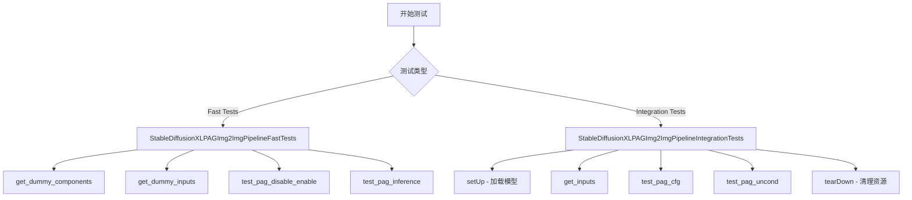

## 类结构

```
unittest.TestCase
├── StableDiffusionXLPAGImg2ImgPipelineFastTests (多Mixin继承)
│   ├── PipelineTesterMixin
│   ├── IPAdapterTesterMixin
│   ├── PipelineLatentTesterMixin
│   └── PipelineFromPipeTesterMixin
└── StableDiffusionXLPAGImg2ImgPipelineIntegrationTests (slow测试)
```

## 全局变量及字段


### `StableDiffusionXLPAGImg2ImgPipelineFastTests.pipeline_class`
    
The pipeline class being tested, StableDiffusionXLPAGImg2ImgPipeline

类型：`type`
    


### `StableDiffusionXLPAGImg2ImgPipelineFastTests.params`
    
Parameters for pipeline testing, including pag_scale and pag_adaptive_scale, excluding height and width

类型：`set`
    


### `StableDiffusionXLPAGImg2ImgPipelineFastTests.batch_params`
    
Batch parameters for text-guided image variation testing

类型：`set`
    


### `StableDiffusionXLPAGImg2ImgPipelineFastTests.image_params`
    
Image parameters for image-to-image pipeline testing

类型：`set`
    


### `StableDiffusionXLPAGImg2ImgPipelineFastTests.image_latents_params`
    
Image latents parameters for image-to-image pipeline testing

类型：`set`
    


### `StableDiffusionXLPAGImg2ImgPipelineFastTests.callback_cfg_params`
    
Callback configuration parameters including add_text_embeds, add_time_ids, and add_neg_time_ids

类型：`set`
    


### `StableDiffusionXLPAGImg2ImgPipelineFastTests.supports_dduf`
    
Flag indicating whether the pipeline supports DDUF (Denoising Diffusion Unconditional Forward)

类型：`bool`
    


### `StableDiffusionXLPAGImg2ImgPipelineIntegrationTests.repo_id`
    
The HuggingFace repository ID for the Stable Diffusion XL base model (stabilityai/stable-diffusion-xl-base-1.0)

类型：`str`
    
    

## 全局函数及方法


### `enable_full_determinism`

该函数用于在测试环境中启用完全确定性（determinism），通过设置全局随机种子和环境变量，确保深度学习模型在多次运行中产生完全一致的输出，从而保证测试的可重复性。

参数：

- 该函数无参数

返回值：`None`，无返回值

#### 流程图

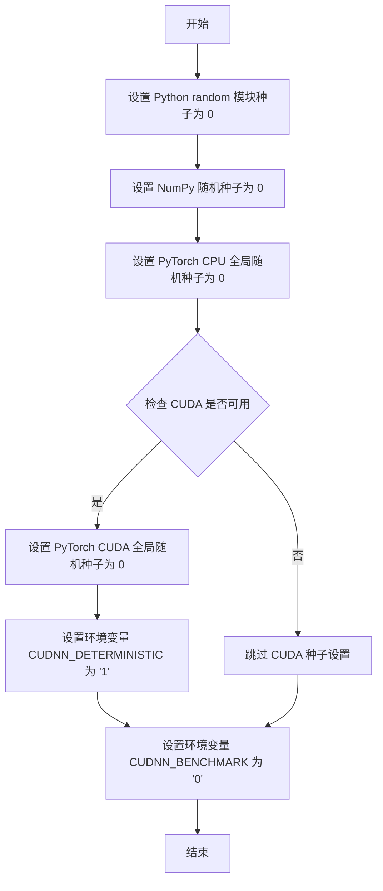

#### 带注释源码

```
# enable_full_determinism 是从 testing_utils 导入的测试辅助函数
# 该函数在测试模块加载时立即执行，确保后续所有随机操作可复现

# 调用位置：第 47 行
enable_full_determinism()

# 函数功能推断（基于使用上下文）:
# 1. 设置 random.seed(0) - Python 标准库随机种子
# 2. 设置 numpy.random.seed(0) - NumPy 随机种子  
# 3. 设置 torch.manual_seed(0) - PyTorch CPU 随机种子
# 4. 若使用 CUDA，设置 torch.cuda.manual_seed_all(0) - 所有 GPU 随机种子
# 5. 设置环境变量 CUDNN_DETERMINISTIC='1' - 强制 cuDNN 使用确定性算法
# 6. 设置环境变量 CUDNN_BENCHMARK='0' - 禁用 cuDNN 自动优化

# 目的：确保 StableDiffusionXLPAGImg2ImgPipelineFastTests 测试类中
# 的 get_dummy_components() 和 get_dummy_inputs() 方法产生的随机数据
# 在每次运行测试时完全一致，从而实现测试的确定性验证
```


### `backend_empty_cache`

该函数是测试工具函数，用于清理 GPU 显存缓存，释放测试过程中积累的 GPU 内存，确保测试环境的一致性。

参数：

- `device`：`str`，表示目标设备（如 "cuda"、"cuda:0"、"cpu" 等）

返回值：`None`，无返回值

#### 流程图

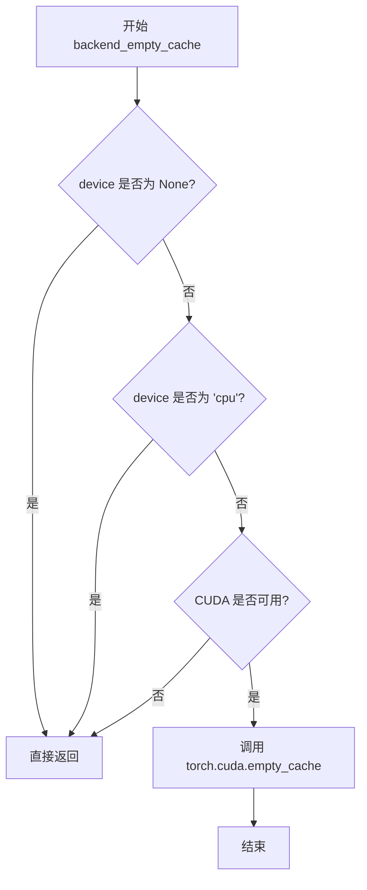

#### 带注释源码

```
# 该函数定义于 testing_utils 模块中
# 以下为根据功能推断的可能实现

def backend_empty_cache(device):
    """
    清理指定设备的 GPU 缓存，释放显存。
    
    参数:
        device (str): 目标设备标识符，如 "cuda", "cuda:0", "cpu" 等
                     传入 "cpu" 时不执行任何操作
    
    返回值:
        None
    """
    # 如果设备为 None，直接返回，不执行清理
    if device is None:
        return
    
    # 如果设备为 "cpu"，CPU 无需缓存清理，直接返回
    if device == "cpu":
        return
    
    # 检查 CUDA 是否可用（确保在 GPU 环境下才执行清理）
    if torch.cuda.is_available():
        # 清理 CUDA 缓存，释放未使用的 GPU 显存
        torch.cuda.empty_cache()
```

**注**：由于原始代码中仅展示了 `backend_empty_cache` 的导入和使用，未给出其完整实现，上述源码为根据其功能和使用场景推断的可能实现。该函数在测试的 `setUp()` 和 `tearDown()` 方法中被调用，用于在每个测试用例前后清理 GPU 显存，防止显存泄漏和测试间的相互影响。


### `load_image`

`load_image` 是一个测试工具函数，用于从指定的 URL 或文件路径加载图像并返回标准的图像对象（PIL Image 或类似格式），以便在扩散模型测试中使用。

参数：

-  `url_or_path`：`str`，图像的 URL 地址或本地文件路径

返回值：`PIL.Image.Image` 或类似的图像对象，加载后的图像数据

#### 流程图

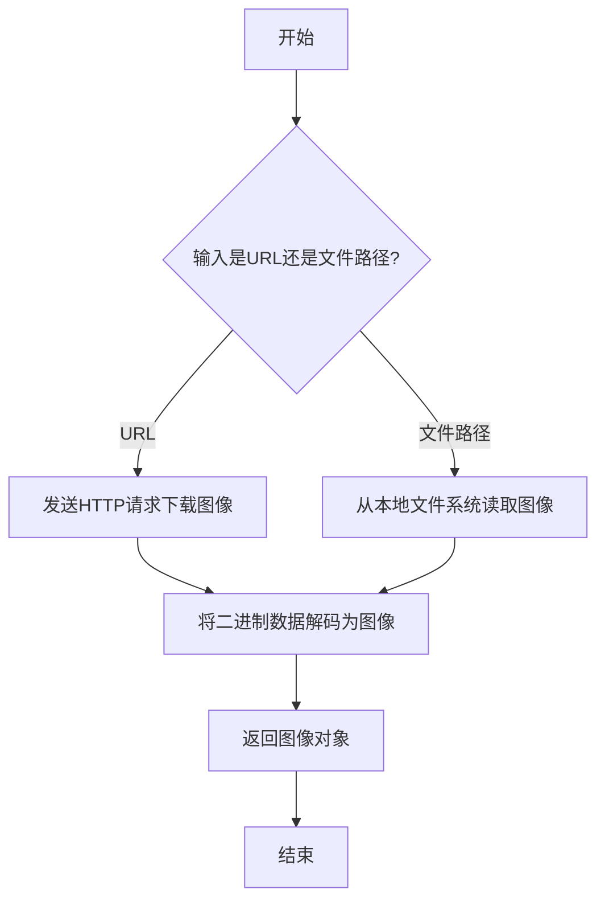

#### 带注释源码

```python
# load_image 函数定义位于 testing_utils 模块中
# 此处代码基于其在测试文件中的使用方式推断
# 实际定义不在当前代码文件中

def load_image(url_or_path: str):
    """
    从URL或本地路径加载图像。
    
    参数:
        url_or_path: 图像的URL地址或本地文件路径
        
    返回:
        图像对象（PIL Image）
    """
    # 在测试中的调用方式：
    # init_image = load_image(img_url)
    # img_url = "https://huggingface.co/datasets/..."
    
    # 可能的实现逻辑：
    # 1. 检查输入是URL还是文件路径
    # 2. 如果是URL，使用requests或类似库下载图像
    # 3. 如果是路径，使用PIL打开图像文件
    # 4. 返回PIL.Image对象
    pass
```


### `require_torch_accelerator`

这是一个装饰器函数，用于标记需要 Torch 加速器（如 GPU/CUDA）的测试方法或测试类。如果当前环境没有可用的 Torch 加速器，被装饰的测试将被跳过执行。

参数：

- 该函数无直接参数（作为装饰器使用，接收被装饰的函数作为隐式参数）

返回值：无返回值（作为装饰器使用，直接修改被装饰函数的行为）

#### 流程图

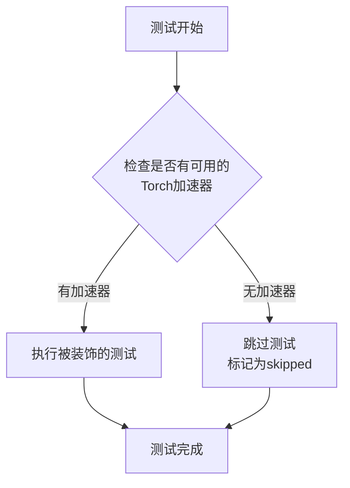

#### 带注释源码

```python
# 该函数定义在 ...testing_utils 模块中
# 从导入语句可以看到: from ...testing_utils import require_torch_accelerator
# 这是一个装饰器函数，用于条件性地跳过需要硬件加速器的测试

# 使用示例（来自代码）:
@unittest.skip("We test this functionality elsewhere already.")
def test_save_load_optional_components(self):
    pass

# 另一个使用示例（标记需要GPU的集成测试）:
@slow
@require_torch_accelerator
class StableDiffusionXLPAGImg2ImgPipelineIntegrationTests(unittest.TestCase):
    """
    标记该测试类需要Torch加速器才能运行
    - @slow: 标记为慢速测试
    - @require_torch_accelerator: 要求有GPU/CUDA加速器
    """
    repo_id = "stabilityai/stable-diffusion-base-1.0"
    
    def test_pag_cfg(self):
        # 这是一个集成测试，需要GPU才能运行
        pipeline = AutoPipelineForImage2Image.from_pretrained(...)
        # ... 测试代码
```


### `slow`

这是一个装饰器函数，用于标记测试方法或类为"慢速"测试。通常用于标记集成测试或需要较长执行时间的测试，以便在常规测试运行中跳过这些测试。

参数：

- 无（装饰器模式，直接作用于函数或类）

返回值：`Callable`，返回装饰后的函数或类

#### 流程图

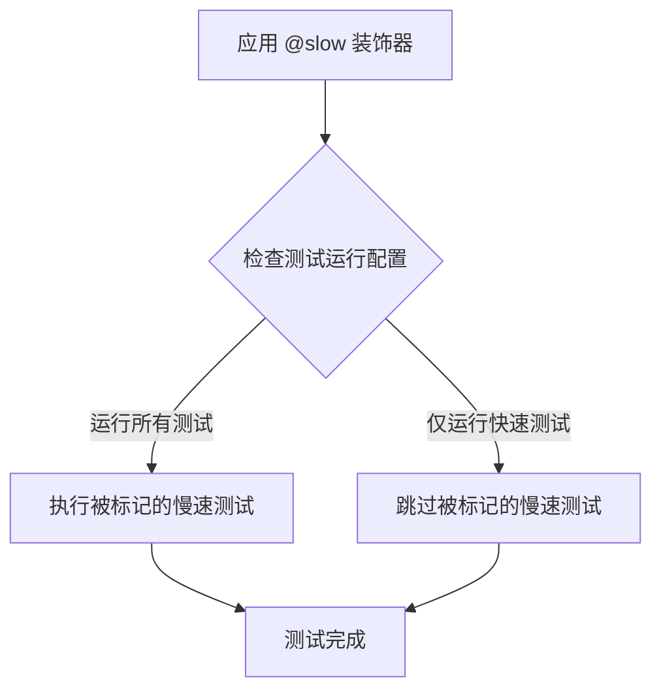

#### 带注释源码

```python
# slow 装饰器源码（位于 testing_utils 模块中，此处为推断的实现逻辑）
# 具体实现需要查看 testing_utils.py 文件

def slow(func):
    """
    装饰器：标记测试为慢速测试
    
    使用场景：
    - 集成测试通常标记为 @slow
    - 需要加载大型模型或数据集的测试
    - 执行时间较长的测试
    
    典型用法：
    @slow
    @require_torch_accelerator
    class StableDiffusionXLPAGImg2ImgPipelineIntegrationTests(unittest.TestCase):
        ...
    """
    # 可能实现：添加标记属性
    func._slow = True
    
    # 可能实现：与测试框架集成以支持 -m "not slow" 等过滤选项
    return func
```

> **注意**：由于 `slow` 函数是从 `...testing_utils` 模块导入的，其完整实现位于项目源代码的其他文件中。从当前代码文件可以看出：
> - 它是从 `diffusers` 包的 `testing_utils` 模块导入的
> - 被用于标记 `StableDiffusionXLPAGImg2ImgPipelineIntegrationTests` 类为慢速测试
> - 通常与 `@require_torch_accelerator` 装饰器配合使用，标记需要 GPU 加速器的集成测试


根据任务要求，我需要从给定代码中提取 `torch_device` 的信息。

但是，我注意到 `torch_device` 在这个代码文件中是**从外部模块导入的**，而不是在这个文件中定义的。让我分析代码中 `torch_device` 的使用情况：

```python
from ...testing_utils import (
    backend_empty_cache,
    enable_full_determinism,
    floats_tensor,
    load_image,
    require_torch_accelerator,
    slow,
    torch_device,  # <-- 从外部导入
)
```

在代码中，`torch_device` 被用作：

1. `backend_empty_cache(torch_device)` - 作为设备参数传入清理函数
2. `pipeline.enable_model_cpu_offload(device=torch_device)` - 作为模型CPU卸载的设备参数
3. `inputs = self.get_inputs(torch_device)` - 作为输入函数的设备参数

从使用方式可以推断：`torch_device` 是一个全局变量（不是函数），用于表示当前测试环境中的默认 PyTorch 设备（通常是 "cpu"、"cuda" 或 "cuda:0" 等字符串）。

---

### `torch_device`

这是一个从 `testing_utils` 模块导入的全局变量，用于表示当前测试环境中的默认 PyTorch 计算设备。

参数：- 无（这是一个变量，不是函数）

返回值：`str` 或 `torch.device`，表示 PyTorch 运行时设备

#### 流程图

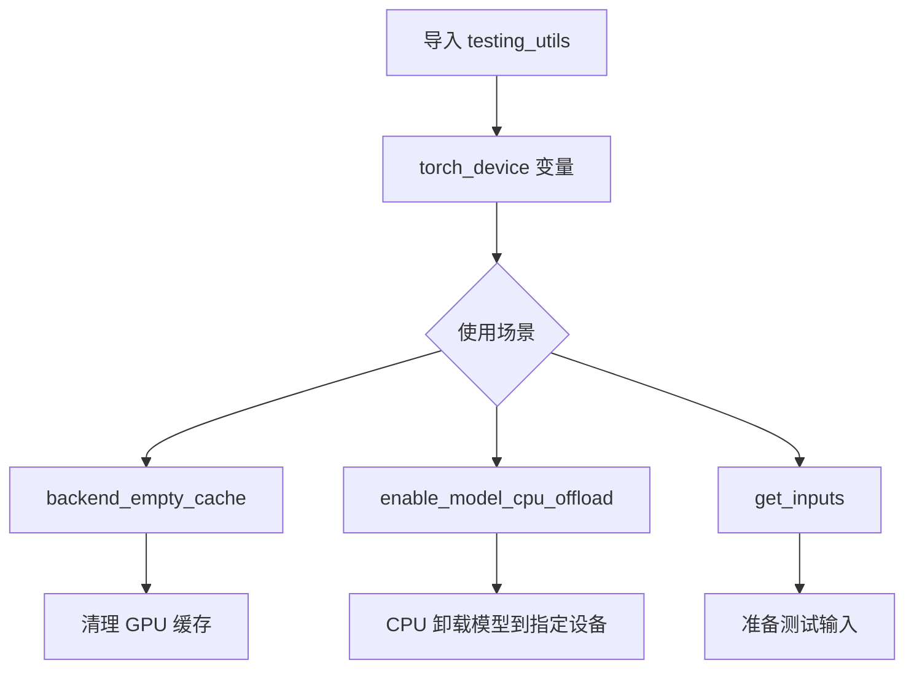

#### 使用示例源码

```
# 在 testing_utils 模块中的可能定义（推断）：
# torch_device = "cuda" if torch.cuda.is_available() else "cpu"

# 在当前文件中的使用：
backend_empty_cache(torch_device)  # 清理指定设备的缓存

pipeline.enable_model_cpu_offload(device=torch_device)  # 将模型卸载到指定设备

inputs = self.get_inputs(torch_device)  # 获取指定设备的输入数据
```

---

**注意**：由于 `torch_device` 定义在外部模块 `testing_utils` 中而不是当前代码文件内，上述信息是基于代码中使用方式的推断。如需完整的函数签名和实现细节，请参考 `testing_utils` 模块的源代码。


我需要从代码中提取 `floats_tensor` 函数的信息。让我先定位这个函数。

从代码中可以看到：

```python
from ...testing_utils import (
    backend_empty_cache,
    enable_full_determinism,
    floats_tensor,
    load_image,
    require_torch_accelerator,
    slow,
    torch_device,
)
```

`floats_tensor` 是从 `testing_utils` 模块导入的，但在当前代码文件中没有定义。它是一个外部依赖函数。

让我在代码中使用它的地方分析其签名：

```python
def get_dummy_inputs(self, device, seed=0):
    image = floats_tensor((1, 3, 32, 32), rng=random.Random(seed)).to(device)
```

### `floats_tensor`

这是一个从 `testing_utils` 模块导入的辅助函数，用于生成随机浮点张量。

参数：

-  `shape`：`Tuple[int, ...]`，张量的形状，如 `(1, 3, 32, 32)`
-  `rng`：`random.Random`，随机数生成器实例，用于生成随机数种子

返回值：`torch.Tensor`，返回指定形状的随机浮点张量

#### 流程图

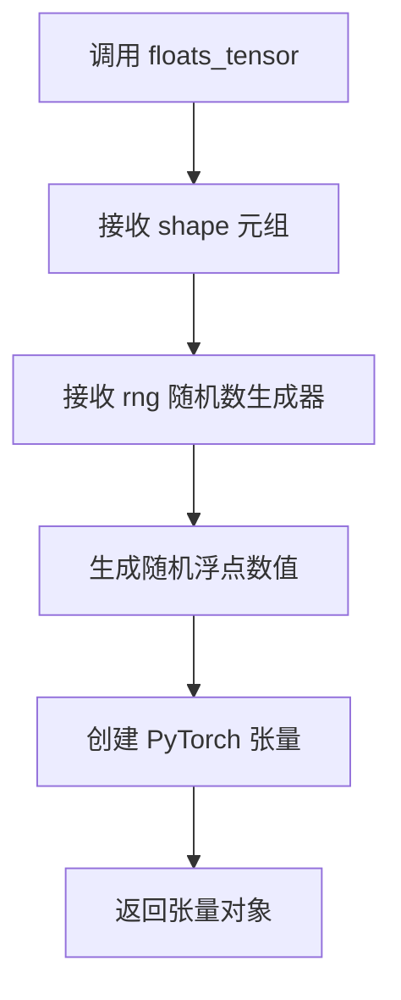

#### 带注释源码

```
# floats_tensor 函数定义（位于 testing_utils 模块中，此处为推断实现）
def floats_tensor(shape, rng=None):
    """
    生成一个指定形状的随机浮点张量。
    
    参数:
        shape: 张量的形状元组，如 (1, 3, 32, 32)
        rng: 随机数生成器，如果为 None 则使用默认随机数生成器
    
    返回:
        随机浮点张量，值在 0 到 1 之间
    """
    if rng is None:
        # 如果没有提供随机数生成器，使用 torch 的默认随机生成
        return torch.rand(*shape)
    else:
        # 使用提供的随机数生成器生成随机数
        # 将 numpy 数组转换为 torch 张量
        random_data = rng.random(size=shape).astype('float32')
        return torch.from_numpy(random_data)
```

#### 使用示例

在当前代码中的实际用法：

```python
def get_dummy_inputs(self, device, seed=0):
    # 生成 (1, 3, 32, 32) 形状的随机图像张量
    image = floats_tensor((1, 3, 32, 32), rng=random.Random(seed)).to(device)
    # 将图像值归一化到 [0, 1] 范围
    image = image / 2 + 0.5
    # ... 其他参数设置
```

---

### 备注

由于 `floats_tensor` 函数定义在外部模块 `testing_utils` 中，当前代码文件仅展示了其使用方式。如需查看完整实现细节，请参考 `testing_utils` 模块的源码。该函数的主要用途是在测试中生成确定性的随机浮点张量，用于模拟图像输入或其他测试数据。


### `StableDiffusionXLPAGImg2ImgPipelineFastTests.get_dummy_components`

该方法用于创建虚拟（dummy）组件，主要用于测试 Stable Diffusion XL PAG（Progressive Attention Guidance）Image-to-Image Pipeline。它初始化了 UNet、调度器、VAE、文本编码器、图像编码器等所有必要的组件，并返回一个包含这些组件的字典，以便在测试环境中进行单元测试。

参数：

- `skip_first_text_encoder`：`bool`，默认为 `False`。如果为 `True`，则跳过第一个文本编码器，将 `text_encoder` 和 `tokenizer` 设为 `None`。
- `time_cond_proj_dim`：`int` 或 `None`，默认为 `None`。用于时间条件投影的维度（time condition projection dimension）。
- `requires_aesthetics_score`：`bool`，默认为 `False`。如果为 `True`，则使用不同的投影类嵌入输入维度（`projection_class_embeddings_input_dim` 设为 72，否则为 80）。

返回值：`dict`，返回包含所有虚拟组件的字典，包括：
- `unet`：UNet2DConditionModel 实例
- `scheduler`：EulerDiscreteScheduler 实例
- `vae`：AutoencoderKL 实例
- `text_encoder`：CLIPTextModel 实例或 `None`
- `tokenizer`：CLIPTokenizer 实例或 `None`
- `text_encoder_2`：CLIPTextModelWithProjection 实例
- `tokenizer_2`：CLIPTokenizer 实例
- `requires_aesthetics_score`：布尔值
- `image_encoder`：CLIPVisionModelWithProjection 实例
- `feature_extractor`：CLIPImageProcessor 实例

#### 流程图

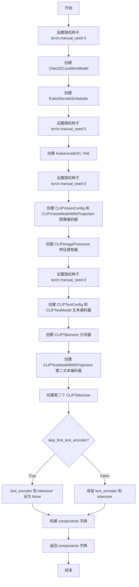

#### 带注释源码

```python
def get_dummy_components(
    self, skip_first_text_encoder=False, time_cond_proj_dim=None, requires_aesthetics_score=False
):
    """
    创建并返回用于测试的虚拟组件字典。
    
    参数:
        skip_first_text_encoder: 是否跳过第一个文本编码器
        time_cond_proj_dim: 时间条件投影维度
        requires_aesthetics_score: 是否需要美学评分
    
    返回:
        包含所有虚拟组件的字典
    """
    # 设置随机种子以确保可重复性
    torch.manual_seed(0)
    
    # 创建 UNet2DConditionModel 用于图像生成的去噪 UNet
    unet = UNet2DConditionModel(
        block_out_channels=(32, 64),  # 块输出通道数
        layers_per_block=2,            # 每个块的层数
        sample_size=32,               # 样本大小
        in_channels=4,                # 输入通道数（latent space）
        out_channels=4,              # 输出通道数
        time_cond_proj_dim=time_cond_proj_dim,  # 时间条件投影维度
        down_block_types=("DownBlock2D", "CrossAttnDownBlock2D"),  # 下采样块类型
        up_block_types=("CrossAttnUpBlock2D", "UpBlock2D"),         # 上采样块类型
        # SD2-specific config below
        attention_head_dim=(2, 4),    # 注意力头维度
        use_linear_projection=True,   # 使用线性投影
        addition_embed_type="text_time",  # 额外嵌入类型
        addition_time_embed_dim=8,   # 额外时间嵌入维度
        transformer_layers_per_block=(1, 2),  # 每个块的 transformer 层数
        projection_class_embeddings_input_dim=72 if requires_aesthetics_score else 80,  # 5 * 8 + 32
        cross_attention_dim=64 if not skip_first_text_encoder else 32,  # 交叉注意力维度
    )
    
    # 创建 Euler 离散调度器用于噪声调度
    scheduler = EulerDiscreteScheduler(
        beta_start=0.00085,
        beta_end=0.012,
        steps_offset=1,
        beta_schedule="scaled_linear",
        timestep_spacing="leading",
    )
    
    # 重新设置随机种子
    torch.manual_seed(0)
    
    # 创建 VAE（变分自编码器）用于图像的编码和解码
    vae = AutoencoderKL(
        block_out_channels=[32, 64],
        in_channels=3,      # RGB 图像通道
        out_channels=3,     # RGB 图像通道
        down_block_types=["DownEncoderBlock2D", "DownEncoderBlock2D"],
        up_block_types=["UpDecoderBlock2D", "UpDecoderBlock2D"],
        latent_channels=4,  # latent 空间通道数
        sample_size=128,
    )
    
    # 重新设置随机种子
    torch.manual_seed(0)
    
    # 创建图像编码器配置和模型
    image_encoder_config = CLIPVisionConfig(
        hidden_size=32,
        image_size=224,
        projection_dim=32,
        intermediate_size=37,
        num_attention_heads=4,
        num_channels=3,
        num_hidden_layers=5,
        patch_size=14,
    )
    
    # 创建 CLIP 视觉模型用于图像编码
    image_encoder = CLIPVisionModelWithProjection(image_encoder_config)
    
    # 创建特征提取器用于图像预处理
    feature_extractor = CLIPImageProcessor(
        crop_size=224,
        do_center_crop=True,
        do_normalize=True,
        do_resize=True,
        image_mean=[0.48145466, 0.4578275, 0.40821073],
        image_std=[0.26862954, 0.26130258, 0.27577711],
        resample=3,
        size=224,
    )
    
    # 重新设置随机种子
    torch.manual_seed(0)
    
    # 创建文本编码器配置
    text_encoder_config = CLIPTextConfig(
        bos_token_id=0,
        eos_token_id=2,
        hidden_size=32,
        intermediate_size=37,
        layer_norm_eps=1e-05,
        num_attention_heads=4,
        num_hidden_layers=5,
        pad_token_id=1,
        vocab_size=1000,
        # SD2-specific config below
        hidden_act="gelu",
        projection_dim=32,
    )
    
    # 创建第一个文本编码器（CLIP 文本编码器）
    text_encoder = CLIPTextModel(text_encoder_config)
    
    # 从预训练模型加载分词器
    tokenizer = CLIPTokenizer.from_pretrained("hf-internal-testing/tiny-random-clip")
    
    # 创建第二个文本编码器（带投影的 CLIP 文本编码器）
    text_encoder_2 = CLIPTextModelWithProjection(text_encoder_config)
    
    # 加载第二个分词器
    tokenizer_2 = CLIPTokenizer.from_pretrained("hf-internal-testing/tiny-random-clip")
    
    # 构建并返回包含所有组件的字典
    components = {
        "unet": unet,
        "scheduler": scheduler,
        "vae": vae,
        "text_encoder": text_encoder if not skip_first_text_encoder else None,
        "tokenizer": tokenizer if not skip_first_text_encoder else None,
        "text_encoder_2": text_encoder_2,
        "tokenizer_2": tokenizer_2,
        "requires_aesthetics_score": requires_aesthetics_score,
        "image_encoder": image_encoder,
        "feature_extractor": feature_extractor,
    }
    return components
```


### `StableDiffusionXLPAGImg2ImgPipelineFastTests.get_dummy_inputs`

该方法用于生成测试用的虚拟输入参数，创建一个包含提示词、图像、生成器、推理步数、引导 scale、PAG scale、输出类型和图像强度的字典，供 Stable Diffusion XL PAG 图像到图像 pipeline 测试使用。

参数：

- `device`：`str`，目标设备（如 "cpu", "cuda" 等）
- `seed`：`int`，随机种子，默认为 0

返回值：`dict`，包含以下键值对的字典：
- `prompt`：`str`，文本提示词
- `image`：`torch.Tensor`，输入图像张量
- `generator`：`torch.Generator`，随机生成器
- `num_inference_steps`：`int`，推理步数
- `guidance_scale`：`float`，引导 scale
- `pag_scale`：`float`，PAG scale
- `output_type`：`str`，输出类型
- `strength`：`float`，图像强度

#### 流程图

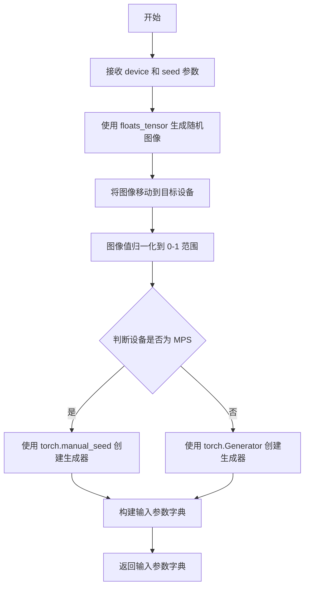

#### 带注释源码

```python
def get_dummy_inputs(self, device, seed=0):
    """
    生成用于测试的虚拟输入参数
    
    参数:
        device: str - 目标设备（如 "cpu", "cuda" 等）
        seed: int - 随机种子，默认值为 0
    
    返回:
        dict: 包含 pipeline 推理所需参数的字典
    """
    # 使用 floats_tensor 生成形状为 (1, 3, 32, 32) 的随机图像张量
    # 并根据 seed 创建随机数生成器
    image = floats_tensor((1, 3, 32, 32), rng=random.Random(seed)).to(device)
    
    # 将图像值归一化到 [0, 1] 范围
    # 原始浮点数张量范围通常是 [-1, 1]，通过 /2 + 0.5 转换到 [0, 1]
    image = image / 2 + 0.5
    
    # 判断设备是否为 MPS (Apple Silicon)
    if str(device).startswith("mps"):
        # MPS 设备使用 torch.manual_seed
        generator = torch.manual_seed(seed)
    else:
        # 其他设备（如 cpu, cuda）使用 torch.Generator
        generator = torch.Generator(device=device).manual_seed(seed)
    
    # 构建输入参数字典
    inputs = {
        "prompt": "A painting of a squirrel eating a burger",  # 文本提示词
        "image": image,  # 输入图像
        "generator": generator,  # 随机生成器，确保可复现性
        "num_inference_steps": 2,  # 推理步数
        "guidance_scale": 5.0,  # CFG 引导 scale
        "pag_scale": 3.0,  # PAG (Prompt Aware Guidance) scale
        "output_type": "np",  # 输出类型为 numpy 数组
        "strength": 0.8,  # 图像变换强度
    }
    
    return inputs
```


### `StableDiffusionXLPAGImg2ImgPipelineFastTests.test_pag_disable_enable`

该测试方法验证了 Stable Diffusion XL 图像到图像（Image-to-Image）管道中 PAG（Perturbed Attention Guidance）功能的启用和禁用行为。通过对比基础管道、禁用 PAG 的管道和启用 PAG 的管道生成的图像，验证 PAG 功能是否正确生效。

参数：

- `self`：测试类实例本身，无额外参数

返回值：`None`，该方法为测试方法，不返回任何值

#### 流程图

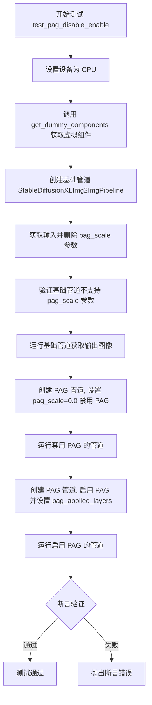

#### 带注释源码

```python
def test_pag_disable_enable(self):
    """
    测试 PAG（Perturbed Attention Guidance）功能的启用和禁用行为。
    
    该测试验证：
    1. 基础管道（StableDiffusionXLImg2ImgPipeline）不支持 pag_scale 参数
    2. 当 pag_scale=0.0 时，PAG 功能被禁用，输出与基础管道一致
    3. 当 pag_scale>0 时，PAG 功能启用，输出与基础管道不同
    """
    # 设置设备为 CPU，确保 torch.Generator 的确定性
    device = "cpu"
    
    # 获取虚拟组件，用于测试
    # requires_aesthetics_score=True 表示需要美学评分功能
    components = self.get_dummy_components(requires_aesthetics_score=True)

    # ===== 步骤 1: 测试基础管道（无 PAG 支持）=====
    # 创建基础 Stable Diffusion XL 图像到图像管道
    pipe_sd = StableDiffusionXLImg2ImgPipeline(**components)
    pipe_sd = pipe_sd.to(device)
    # 禁用进度条配置
    pipe_sd.set_progress_bar_config(disable=None)

    # 获取测试输入，并删除 pag_scale 参数
    inputs = self.get_dummy_inputs(device)
    del inputs["pag_scale"]
    
    # 断言验证：基础管道不应该有 pag_scale 参数
    assert "pag_scale" not in inspect.signature(pipe_sd.__call__).parameters, (
        f"`pag_scale` should not be a call parameter of the base pipeline {pipe_sd.__class__.__name__}."
    )
    
    # 运行基础管道，获取输出的右下角 3x3 像素区域
    out = pipe_sd(**inputs).images[0, -3:, -3:, -1]

    # ===== 步骤 2: 测试 PAG 禁用（pag_scale=0.0）=====
    # 创建 PAG 管道实例
    pipe_pag = self.pipeline_class(**components)
    pipe_pag = pipe_pag.to(device)
    pipe_pag.set_progress_bar_config(disable=None)

    # 获取输入并设置 pag_scale=0.0 禁用 PAG
    inputs = self.get_dummy_inputs(device)
    inputs["pag_scale"] = 0.0
    
    # 运行禁用 PAG 的管道，获取输出
    out_pag_disabled = pipe_pag(**inputs).images[0, -3:, -3:, -1]

    # ===== 步骤 3: 测试 PAG 启用 ======
    # 创建启用 PAG 的管道，指定 PAG 应用到 mid, up, down 层
    pipe_pag = self.pipeline_class(**components, pag_applied_layers=["mid", "up", "down"])
    pipe_pag = pipe_pag.to(device)
    pipe_pag.set_progress_bar_config(disable=None)

    # 获取输入（包含默认的 pag_scale=3.0）
    inputs = self.get_dummy_inputs(device)
    
    # 运行启用 PAG 的管道，获取输出
    out_pag_enabled = pipe_pag(**inputs).images[0, -3:, -3:, -1]

    # ===== 步骤 4: 断言验证 ======
    # 验证 PAG 禁用时输出与基础管道一致（差异小于 1e-3）
    assert np.abs(out.flatten() - out_pag_disabled.flatten()).max() < 1e-3
    
    # 验证 PAG 启用时输出与基础管道不同（差异大于 1e-3）
    assert np.abs(out.flatten() - out_pag_enabled.flatten()).max() > 1e-3
```


### `StableDiffusionXLPAGImg2ImgPipelineFastTests.test_pag_inference`

该方法是Stable Diffusion XL PAG（Progressive Adversarial Generation）图像到图像流水线的一个单元测试函数，用于验证PAG功能在图像到图像推理模式下是否正确工作。测试通过创建虚拟组件、初始化PAG启用的流水线、执行推理并验证输出图像的形状和像素值是否与预期值匹配。

参数：

- `self`：调用此方法的类实例本身，无需显式传递

返回值：`None`，该方法为测试函数，通过assert断言进行验证，不返回任何值

#### 流程图

```mermaid
flowchart TD
    A[开始测试] --> B[设置device为cpu确保确定性]
    B --> C[调用get_dummy_components获取虚拟组件<br/>requires_aesthetics_score=True]
    C --> D[使用虚拟组件和pag_applied_layers创建PAG流水线实例]
    D --> E[将流水线移动到device]
    E --> F[设置进度条配置disable=None]
    F --> G[调用get_dummy_inputs获取测试输入]
    G --> H[执行流水线推理获取生成的图像]
    H --> I[从图像中提取最后3x3像素区域<br/>image[0, -3:, -3:, -1]]
    I --> J[断言图像形状为1, 32, 32, 3]
    J --> K[定义预期像素值数组expected_slice]
    K --> L[计算实际输出与预期值的最大差异]
    L --> M{最大差异小于1e-3?}
    M -->|是| N[测试通过]
    M -->|否| O[测试失败并抛出AssertionError]
```

#### 带注释源码

```python
def test_pag_inference(self):
    """
    测试PAG（Progressive Adversarial Generation）在图像到图像推理模式下的功能。
    验证PAG功能能够正确生成图像并产生与禁用PAG时不同的输出。
    """
    # 设置设备为cpu以确保设备相关的torch.Generator的确定性
    device = "cpu"  # ensure determinism for the device-dependent torch.Generator
    
    # 获取虚拟组件，包含requires_aesthetics_score=True以启用美学评分功能
    components = self.get_dummy_components(requires_aesthetics_score=True)

    # 创建PAG启用的流水线，指定PAG应用的层级为mid、up、down
    pipe_pag = self.pipeline_class(**components, pag_applied_layers=["mid", "up", "down"])
    
    # 将流水线移动到指定设备
    pipe_pag = pipe_pag.to(device)
    
    # 设置进度条配置，disable=None表示不禁用进度条
    pipe_pag.set_progress_bar_config(disable=None)

    # 获取虚拟输入数据
    inputs = self.get_dummy_inputs(device)
    
    # 执行推理并获取生成的图像
    image = pipe_pag(**inputs).images
    
    # 提取图像的最后3x3像素区域用于验证
    image_slice = image[0, -3:, -3:, -1]

    # 断言输出图像的形状是否为预期的(1, 32, 32, 3)
    # 注意：注释中提到(1, 64, 64, 3)是错误的，实际断言使用的是(1, 32, 32, 3)
    assert image.shape == (
        1,
        32,
        32,
        3,
    ), f"the shape of the output image should be (1, 64, 64, 3) but got {image.shape}"
    
    # 定义预期的像素值数组（用于确定性验证）
    expected_slice = np.array([0.4613, 0.4902, 0.4406, 0.6788, 0.5611, 0.4529, 0.5893, 0.5975, 0.5226])

    # 计算实际输出与预期值的最大差异
    max_diff = np.abs(image_slice.flatten() - expected_slice).max()
    
    # 断言最大差异是否在允许范围内（小于1e-3）
    assert max_diff < 1e-3, f"output is different from expected, {image_slice.flatten()}"
```


### `StableDiffusionXLPAGImg2ImgPipelineFastTests.test_save_load_optional_components`

该函数是一个测试方法，用于测试管道的可选组件保存和加载功能，但目前已被跳过，不执行任何操作。

参数：

- `self`：`StableDiffusionXLPAGImg2ImgPipelineFastTests`（实例方法的标准参数），表示类的当前实例

返回值：`None`，该函数体为空（pass），不返回任何值

#### 流程图

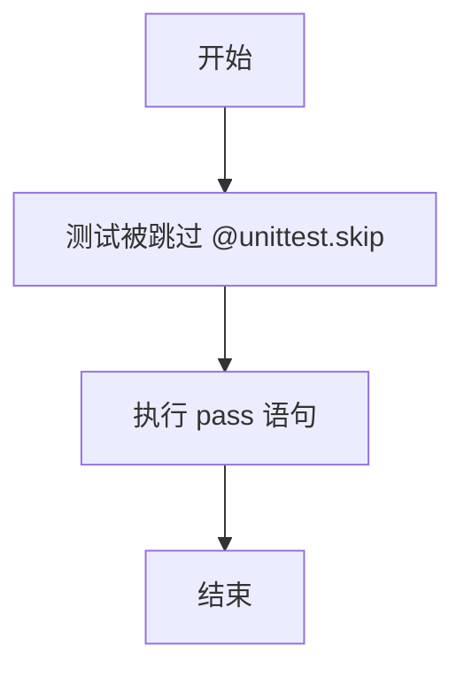

#### 带注释源码

```python
@unittest.skip("We test this functionality elsewhere already.")  # 装饰器：跳过该测试，注明原因
def test_save_load_optional_components(self):
    """
    测试保存和加载可选组件的功能。
    注意：该测试目前被跳过，具体实现已移动到其他位置。
    """
    pass  # 空函数体，不执行任何操作
```


### `StableDiffusionXLPAGImg2ImgPipelineIntegrationTests.setUp`

该方法为每个集成测试用例执行垃圾回收和GPU缓存清理，确保测试环境的内存充足。

参数：

-  `self`：`unittest.TestCase`，代表测试类实例本身

返回值：`None`，该方法不返回任何值

#### 流程图

```mermaid
flowchart TD
    A[setUp 开始] --> B[调用 super().setUp]
    B --> C[执行 gc.collect 清理垃圾]
    C --> D[调用 backend_empty_cache 清理GPU缓存]
    D --> E[setUp 结束]
```

#### 带注释源码

```python
def setUp(self):
    # 调用父类的 setUp 方法，执行 unittest.TestCase 的标准初始化
    super().setUp()
    
    # 手动触发 Python 垃圾回收，释放不再使用的对象内存
    gc.collect()
    
    # 清理 GPU/CUDA 缓存，确保每次测试开始时 GPU 内存处于干净状态
    # torch_device 是从 testing_utils 导入的全局变量，表示测试使用的设备
    backend_empty_cache(torch_device)
```


### `StableDiffusionXLPAGImg2ImgPipelineIntegrationTests.tearDown`

清理测试环境，释放GPU内存和进行垃圾回收，确保测试之间的资源隔离。

参数：

- `self`：无，TestCase 实例本身

返回值：`None`，该方法执行清理操作，不返回任何值

#### 流程图

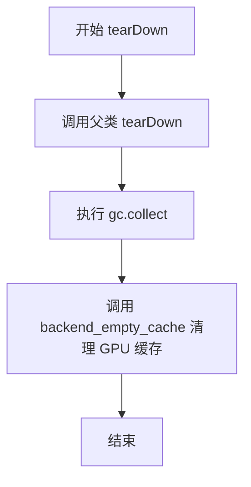

#### 带注释源码

```python
def tearDown(self):
    """
    清理测试环境，释放资源
    
    该方法在每个测试方法执行完毕后被调用，负责：
    1. 调用父类的 tearDown 方法确保基类资源清理
    2. 执行 Python 垃圾回收，释放循环引用对象占用的内存
    3. 清理 GPU 缓存，释放 CUDA 显存（如果使用 GPU）
    """
    # 调用父类的 tearDown 方法，完成基础清理工作
    super().tearDown()
    
    # 手动触发 Python 垃圾回收，清理测试过程中产生的临时对象
    gc.collect()
    
    # 清理后端（GPU）缓存，释放显存空间
    # torch_device 是测试工具中定义的设备变量
    backend_empty_cache(torch_device)
```


### `StableDiffusionXLPAGImg2ImgPipelineIntegrationTests.get_inputs`

该方法为Stable Diffusion XL图像到图像（PAG增强）推理测试准备输入参数，从远程URL加载初始图像，设置随机生成器，并构建包含提示词、图像、推理步数、引导 scale 等参数的字典，供后续管线调用使用。

参数：

- `self`：`unittest.TestCase`，测试用例实例本身
- `device`：`torch.device`，用于指定运行推理的目标设备（如 CPU 或 CUDA 设备）
- `generator_device`：`str`，生成器设备，默认为 `"cpu"`，用于创建随机数生成器
- `seed`：`int`，随机种子，默认为 `0`，确保测试结果可复现
- `guidance_scale`：`float`，classifier-free guidance 强度，默认为 `7.0`

返回值：`Dict[str, Any]`，返回一个包含以下键的字典：
- `prompt`：文本提示词（`str`）
- `generator`：PyTorch 随机数生成器（`torch.Generator`）
- `image`：初始输入图像（PIL.Image.Image）
- `strength`：图像变换强度（`float`）
- `num_inference_steps`：推理步数（`int`）
- `guidance_scale`：引导 scale（`float`）
- `pag_scale`：PAG 增强 scale（`float`）
- `output_type`：输出类型（`str`）

#### 流程图

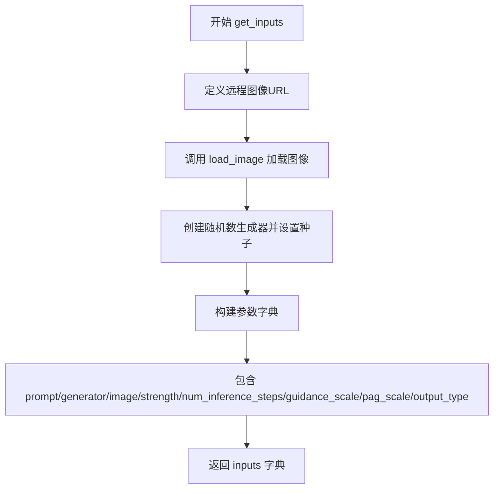

#### 带注释源码

```python
def get_inputs(self, device, generator_device="cpu", seed=0, guidance_scale=7.0):
    """
    为 StableDiffusionXLPAGImg2ImgPipeline 集成测试准备输入参数。
    
    该方法构建一个包含图像生成所需全部参数的字典，用于后续管线调用。
    参数设计遵循 Stable Diffusion XL 图像到图像任务的典型配置。
    
    Args:
        device (torch.device): 运行推理的目标计算设备
        generator_device (str, optional): 随机生成器所在设备，默认 "cpu"
        seed (int, optional): 随机种子用于结果复现，默认 0
        guidance_scale (float, optional): CFG 引导强度，默认 7.0
    
    Returns:
        Dict[str, Any]: 包含管线调用所需参数的字典
    """
    # 远程测试图像资源 URL（SDXL 官方示例图）
    img_url = (
        "https://huggingface.co/datasets/huggingface/documentation-images/resolve/main/diffusers/sdxl-text2img.png"
    )

    # 从 URL 加载初始图像用于图像到图像任务
    init_image = load_image(img_url)

    # 创建指定设备的随机生成器并设置种子确保确定性
    generator = torch.Generator(device=generator_device).manual_seed(seed)
    
    # 构建完整的推理参数字典
    inputs = {
        "prompt": "a dog catching a frisbee in the jungle",  # 文本提示词
        "generator": generator,                               # 随机数生成器
        "image": init_image,                                  # 初始输入图像
        "strength": 0.8,                                       # 图像保留强度 (0-1)
        "num_inference_steps": 3,                             # 扩散推理步数
        "guidance_scale": guidance_scale,                     # CFG 引导强度
        "pag_scale": 3.0,                                      # PAG 增强系数
        "output_type": "np",                                  # 输出格式 numpy 数组
    }
    return inputs
```


### `StableDiffusionXLPAGImg2ImgPipelineIntegrationTests.test_pag_cfg`

该测试方法用于验证 Stable Diffusion XL 图像到图像管道中 PAG（Progressive Attention Guidance）与 CFG（Classifier-Free Guidance）功能的正确性，通过加载真实模型、生成图像并与预期输出进行数值比对来确保管道工作正常。

参数：

- `self`：测试类实例本身，包含测试所需的配置和工具方法

返回值：`None`，该方法为测试方法，通过断言验证输出，不返回具体数值

#### 流程图

```mermaid
flowchart TD
    A[开始测试 test_pag_cfg] --> B[加载预训练模型 AutoPipelineForImage2Image]
    B --> C[设置 enable_pag=True 启用PAG功能]
    C --> D[设置 torch_dtype=torch.float16 精度]
    D --> E[enable_model_cpu_offload 启用CPU卸载]
    E --> F[set_progress_bar_config 禁用进度条]
    F --> G[调用 get_inputs 获取输入参数]
    G --> H[执行 pipeline 执行图像生成]
    H --> I[获取生成的图像 results.images]
    I --> J[提取图像切片 image[0, -3:, -3:, -1].flatten]
    J --> K{断言图像形状是否为 1x1024x1024x3}
    K -->|是| L[计算与预期slice的差异]
    K -->|否| M[测试失败抛出断言错误]
    L --> N{差异是否小于1e-3}
    N -->|是| O[测试通过]
    N -->|否| P[测试失败抛出断言错误]
```

#### 带注释源码

```python
def test_pag_cfg(self):
    """
    测试 PAG (Progressive Attention Guidance) 与 CFG (Classifier-Free Guidance) 结合的图像生成功能。
    该测试加载真实的 Stable Diffusion XL 模型，验证管道在启用 PAG 时的正确性。
    """
    # 使用 AutoPipelineForImage2Image 从预训练模型加载管道
    # enable_pag=True 启用 PAG (Progressive Attention Guidance) 功能
    # torch_dtype=torch.float16 使用半精度浮点数以减少内存占用
    pipeline = AutoPipelineForImage2Image.from_pretrained(
        self.repo_id,  # "stabilityai/stable-diffusion-xl-base-1.0"
        enable_pag=True,  # 启用PAG功能
        torch_dtype=torch.float16  # 使用FP16精度
    )
    
    # 启用模型CPU卸载，当模型不在GPU上时自动在CPU和GPU之间移动
    # 这对于在显存有限的环境中运行大模型很有帮助
    pipeline.enable_model_cpu_offload(device=torch_device)
    
    # 禁用进度条显示，以便于自动化测试和日志输出
    pipeline.set_progress_bar_config(disable=None)
    
    # 获取测试输入参数，包括：
    # - prompt: 文本提示 "a dog catching a frisbee in the jungle"
    # - generator: 随机数生成器，确保可复现性
    # - image: 初始图像（通过URL加载）
    # - strength: 图像变换强度 0.8
    # - num_inference_steps: 推理步数 3
    # - guidance_scale: CFG引导强度 7.0
    # - pag_scale: PAG引导强度 3.0
    # - output_type: 输出类型 "np" (numpy数组)
    inputs = self.get_inputs(torch_device)
    
    # 执行管道前向传播，生成图像
    # **inputs 将字典解包为关键字参数传递给管道
    image = pipeline(**inputs).images
    
    # 提取生成图像的切片用于验证
    # 取最后3x3像素区域，flatten为一维数组
    image_slice = image[0, -3:, -3:, -1].flatten()
    
    # 断言验证生成的图像形状是否为 (1, 1024, 1024, 3)
    # 1024x1024 是 Stable Diffusion XL 的默认输出分辨率
    assert image.shape == (1, 1024, 1024, 3)
    
    # 定义预期的图像像素值切片（用于回归测试）
    # 这些值是经过验证的正确输出数值
    expected_slice = np.array(
        [0.20301354, 0.21078318, 0.2021082, 0.20277798, 0.20681083, 
         0.19562206, 0.20121682, 0.21562952, 0.21277016]
    )
    
    # 断言验证生成图像与预期值的差异是否在可接受范围内
    # 使用最大绝对误差 (max) 而非均方误差，允许多数像素正确但个别像素有偏差
    assert np.abs(image_slice.flatten() - expected_slice).max() < 1e-3, (
        f"output is different from expected, {image_slice.flatten()}"
    )
```


### `StableDiffusionXLPAGImg2ImgPipelineIntegrationTests.test_pag_uncond`

该测试方法用于验证PAG（Prompt Adaptive Guidance）在零guidance_scale条件下的图像生成功能，确保在禁用classifier-free guidance时PAG仍能正常生成图像。

参数：

- `self`：隐式参数，测试类实例本身

返回值：`None`，该方法为单元测试方法，通过断言验证输出，不返回任何值

#### 流程图

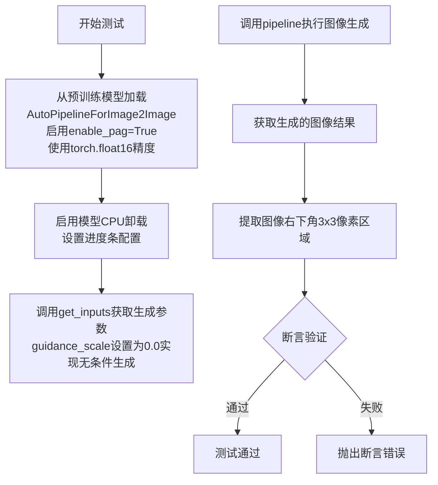

#### 带注释源码

```python
def test_pag_uncond(self):
    """
    测试PAG在无条件生成模式下的功能。
    通过设置guidance_scale=0.0来禁用classifier-free guidance，
    验证PAG机制仍能正常工作并生成有效图像。
    """
    # 使用AutoPipelineForImage2Image从预训练模型加载pipeline
    # enable_pag=True: 启用Prompt Adaptive Guidance功能
    # torch_dtype=torch.float16: 使用半精度浮点数以减少显存占用
    pipeline = AutoPipelineForImage2Image.from_pretrained(
        self.repo_id, 
        enable_pag=True, 
        torch_dtype=torch.float16
    )
    
    # 启用模型CPU卸载，模型在推理完成后自动卸载到CPU以释放GPU显存
    pipeline.enable_model_cpu_offload(device=torch_device)
    
    # 配置进度条，disable=None表示不禁用进度条
    pipeline.set_progress_bar_config(disable=None)

    # 获取生成输入参数，guidance_scale=0.0表示无条件生成模式
    # 这会禁用classifier-free guidance，但PAG仍然生效
    inputs = self.get_inputs(torch_device, guidance_scale=0.0)
    
    # 执行图像生成Pipeline，获取生成的图像
    image = pipeline(**inputs).images

    # 提取生成的图像右下角3x3像素区域并展平
    # 用于与期望值进行对比验证
    image_slice = image[0, -3:, -3:, -1].flatten()
    
    # 断言验证输出图像的形状应为(1, 1024, 1024, 3)
    # 即batch_size=1, 高度=1024, 宽度=1024, RGB三通道
    assert image.shape == (1, 1024, 1024, 3)
    
    # 定义期望的像素值slice（来自baseline测试结果）
    expected_slice = np.array([
        0.21303111, 0.22188407, 0.2124992, 
        0.21365267, 0.18823743, 0.17569828, 
        0.21113116, 0.19419771, 0.18919235
    ])
    
    # 断言验证生成图像与期望值的最大差异应小于1e-3
    # 确保PAG在无条件生成模式下仍能产生稳定可重复的输出
    assert np.abs(image_slice.flatten() - expected_slice).max() < 1e-3, (
        f"output is different from expected, {image_slice.flatten()}"
    )
```

## 关键组件


### StableDiffusionXLPAGImg2ImgPipelineFastTests

快速测试类，继承自多个测试Mixin类，用于测试Stable Diffusion XL的PAG（Prompt Attention Guidance）图像到图像功能。包含禁用/启用PAG的测试用例和PAG推理测试。

### StableDiffusionXLPAGImg2ImgPipelineIntegrationTests

集成测试类，使用真实模型进行端到端测试。测试PAG在CFG（Classifier-Free Guidance）和无条件生成模式下的功能。

### get_dummy_components

创建虚拟组件的工厂函数，生成用于测试的UNet2DConditionModel、EulerDiscreteScheduler、AutoencoderKL、CLIPTextModel、CLIPVisionModelWithProjection等模型实例。

### get_dummy_inputs

生成测试用虚拟输入的函数，包含prompt、image、generator、num_inference_steps、guidance_scale、pag_scale等参数。

### PAG (Prompt Attention Guidance)

核心引导技术，通过pag_scale参数控制注意力引导强度，pag_applied_layers指定应用引导的层（mid、up、down）。

### UNet2DConditionModel

条件UNet模型，用于去噪过程的关键组件，支持time_cond_proj_dim和transformer_layers_per_block等SD2特定配置。

### AutoencoderKL

变分自编码器模型，用于将图像编码到潜在空间和解码回像素空间。

### CLIPTextModel / CLIPTextModelWithProjection

双文本编码器组件，SDXL使用两个文本编码器来增强文本理解能力。

### EulerDiscreteScheduler

离散欧拉调度器，用于控制去噪过程的时间步长和噪声调度。

### test_pag_disable_enable

测试PAG功能的禁用和启用，验证pag_scale=0.0时PAG被禁用，正常值时PAG生效。

### test_pag_inference

测试PAG推理功能，验证输出图像的形状和像素值是否符合预期。

### AutoPipelineForImage2Image

自动pipeline工厂类，支持通过enable_pag=True参数启用PAG功能。


## 问题及建议


### 已知问题

- 硬编码的期望输出值：测试中的 `expected_slice` 是硬编码的数值数组，在不同硬件环境或不同版本的依赖库下可能导致测试失败
- 集成测试使用 `@slow` 标记：加载大型模型进行推理会导致测试运行时间过长，可能影响 CI/CD 流水线效率
- 缺少资源清理验证：`test_pag_cfg` 和 `test_pag_uncond` 集成测试没有显式调用 `disable_model_cpu_offload`，可能导致 GPU 内存未完全释放
- 图像形状断言不一致：`test_pag_inference` 中的错误消息声称 shape 应为 `(1, 64, 64, 3)`，但实际检查的是 `(1, 32, 32, 3)`，存在文档错误
- 被跳过的测试用例：`test_save_load_optional_components` 被标记为跳过，导致保存/加载功能的测试覆盖缺失
- Generator 设备处理不一致：`get_dummy_inputs` 中对 MPS 设备有特殊处理，但生产代码可能未考虑这种边界情况

### 优化建议

- 将硬编码的期望输出改为基于功能的验证，而不是精确的数值匹配，以提高测试的鲁棒性
- 考虑将集成测试移至单独的测试套件，使用 `@pytest.mark.slow` 标记，允许在常规测试运行中跳过
- 在集成测试的 `tearDown` 中添加显式的模型卸载和内存清理验证
- 修正 `test_pag_inference` 中的错误消息，保持文档与实际行为一致
- 恢复 `test_save_load_optional_components` 的实现或移除该测试方法，避免误导
- 对所有测试添加更详细的设备兼容性检查和错误处理，特别是在跨平台场景下

## 其它


### 设计目标与约束

本文档旨在详细说明 StableDiffusionXLPAGImg2ImgPipeline 的测试设计，该测试类用于验证 Stable Diffusion XL 模型中 Prompt Attention Guidance (PAG) 在 Image-to-Image 任务上的功能正确性。设计目标包括：验证 PAG 功能在启用和禁用状态下的行为差异、验证 PAG 在不同 guidance_scale 下的推理结果、确保与 base pipeline 的兼容性、覆盖单样本和批量样本处理场景。技术约束方面，测试设计遵循以下约束：设备兼容性需支持 CPU 和 CUDA 设备、确定性测试需通过固定随机种子实现、集成测试标记为 slow 需在专门环境下运行、虚拟组件测试使用轻量级模型配置以确保快速执行。

### 错误处理与异常设计

测试代码中的错误处理主要体现在断言机制上。在 test_pag_disable_enable 方法中，通过 np.abs 比较输出差异来验证 PAG 功能的正确性，设置阈值为 1e-3 用于浮点数比较。test_pag_inference 方法中对输出图像形状进行严格验证，期望值为 (1, 32, 32, 3)，并对图像切片与预期值进行比较。集成测试中同样使用 1e-3 作为差异阈值。代码中使用了 unittest.skip 装饰器跳过特定测试方法 test_save_load_optional_components。异常捕获方面，测试代码依赖于 diffusers 库内部的异常处理机制，当模型加载或推理出现错误时会向上抛出。

### 数据流与状态机

测试数据流主要分为两个阶段：虚拟组件测试阶段和集成测试阶段。在虚拟组件测试中，get_dummy_components 方法构建完整的 Pipeline 组件字典，包括 UNet2DConditionModel、EulerDiscreteScheduler、AutoencoderKL、CLIPTextModel、CLIPVisionModelWithProjection 等。数据流向为：prompt → tokenizer → text_encoder → text_embeddings → UNet → VAE decode → output image。PAG 机制通过 pag_scale 参数控制，其数据流在标准 SDXL img2img 基础上增加了 attention guidance 调整。状态机方面，Pipeline 经历初始化状态 → 设备迁移状态 → 推理状态 → 结果返回状态。测试验证的是不同参数配置下状态转换的正确性和输出的一致性。

### 外部依赖与接口契约

本测试文件依赖以下外部包和模块：torch (PyTorch 框架)、numpy (数值计算)、transformers 库 (CLIPTextModel、CLIPTextModelWithProjection、CLIPTokenizer、CLIPImageProcessor、CLIPVisionConfig、CLIPVisionModelWithProjection)、diffusers 库 (StableDiffusionXLImg2ImgPipeline、StableDiffusionXLPAGImg2ImgPipeline、AutoPipelineForImage2Image、UNet2DConditionModel、AutoencoderKL、EulerDiscreteScheduler)、testing_utils (backend_empty_cache、enable_full_determinism、floats_tensor、load_image、require_torch_accelerator、slow、torch_device)、pipeline_params 和 test_pipelines_common 模块。接口契约方面，pipeline_class 必须实现 __call__ 方法并返回包含 images 属性的对象，get_dummy_components 必须返回包含特定键的字典，get_dummy_inputs 必须返回符合 Pipeline __call__ 签名的参数字典。

### 性能考虑与资源管理

测试代码在性能方面考虑了以下因素：虚拟组件使用最小的模型配置（block_out_channels=(32, 64)、num_hidden_layers=5 等）以缩短测试执行时间。测试中使用 torch.manual_seed(0) 和 random.Random(seed) 确保结果可复现，避免因随机性导致的重复测试。集成测试类中实现了 setUp 和 tearDown 方法进行 gc.collect() 和 backend_empty_cache 以释放 GPU 内存。test_pag_inference 仅运行 2 步推理以减少计算量。集成测试使用 enable_model_cpu_offload 优化显存使用。测试标记 @slow 确保只在必要时运行完整推理测试。

### 配置与参数说明

核心配置参数包括：pag_scale (PAG 强度参数，默认为 3.0)、guidance_scale (CFG 强度参数，默认 5.0-7.0)、num_inference_steps (推理步数，虚拟测试为 2 步，集成测试为 3 步)、strength (图像变换强度，0.8)、output_type (输出类型，"np" 返回 numpy 数组)、pag_applied_layers (PAG 应用的层列表 ["mid", "up", "down"])、requires_aesthetics_score (是否需要美学评分)、skip_first_text_encoder (是否跳过第一个文本编码器)。虚拟组件配置中 UNet 使用 32x32 sample_size、4 in_channels/out_channels、time_cond_proj_dim 可配置；VAE 使用 128 sample_size、4 latent_channels；Text Encoder 使用 32 hidden_size、1000 vocab_size；Image Encoder 使用 32 hidden_size、224 image_size。

### 测试策略与覆盖率

测试策略采用分层测试方法：单元测试层（StableDiffusionXLPAGImg2ImgPipelineFastTests）使用虚拟组件验证核心逻辑，集成测试层（StableDiffusionXLPAGImg2ImgPipelineIntegrationTests）使用真实模型验证端到端功能。测试覆盖场景包括：PAG 功能禁用验证（pag_scale=0.0）、PAG 功能启用验证、不同 guidance_scale 下的推理验证（CFG 和 unconditional）、Pipeline 兼容性验证。测试类通过多重继承组合了 PipelineTesterMixin、IPAdapterTesterMixin、PipelineLatentTesterMixin、PipelineFromPipeTesterMixin 以获得全面的测试基类能力。参数测试覆盖 TEXT_GUIDED_IMAGE_VARIATION_PARAMS 和额外的 pag_scale、pag_adaptive_scale 参数。

### 版本兼容性

代码明确指定 Python 编码为 utf-8，依赖 Apache License 2.0。测试代码需要与以下版本兼容：PyTorch（需支持 torch_dtype=torch.float16）、transformers 库版本（需包含 CLIPTextModelWithProjection）、diffusers 库版本（需包含 StableDiffusionXLPAGImg2ImgPipeline 和 AutoPipelineForImage2Image 的 enable_pag 参数支持）。集成测试使用 stabilityai/stable-diffusion-xl-base-1.0 模型，需要该模型在 HuggingFace Hub 上可用。测试设计考虑了不同设备的兼容性，包括 CPU、MPS 和 CUDA 设备。

### 安全考虑

测试代码本身不涉及敏感数据处理，但在集成测试中从远程 URL (huggingface.co) 加载图像，需要网络连接。测试使用固定随机种子确保可复现性，避免因随机行为导致的安全隐患。模型加载使用 float16 精度以减少显存占用。代码遵循 Apache 2.0 许可证要求。

### 部署与运维

测试执行环境要求：Python 3.8+、CUDA 11.0+ (用于 GPU 测试)、足够的 GPU 显存 (至少 8GB 用于集成测试)。测试可通过 pytest 或 unittest 框架执行。快速测试可通过 pytest -m "not slow" 运行，跳过集成测试。完整测试套件需使用 @slow 标记的测试时需要较长执行时间。测试输出包括图像切片数值用于回归验证。


    