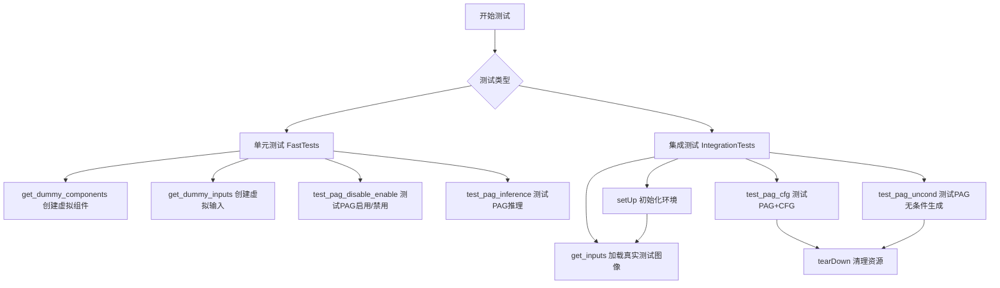
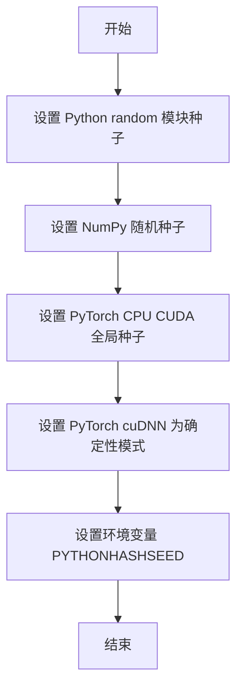
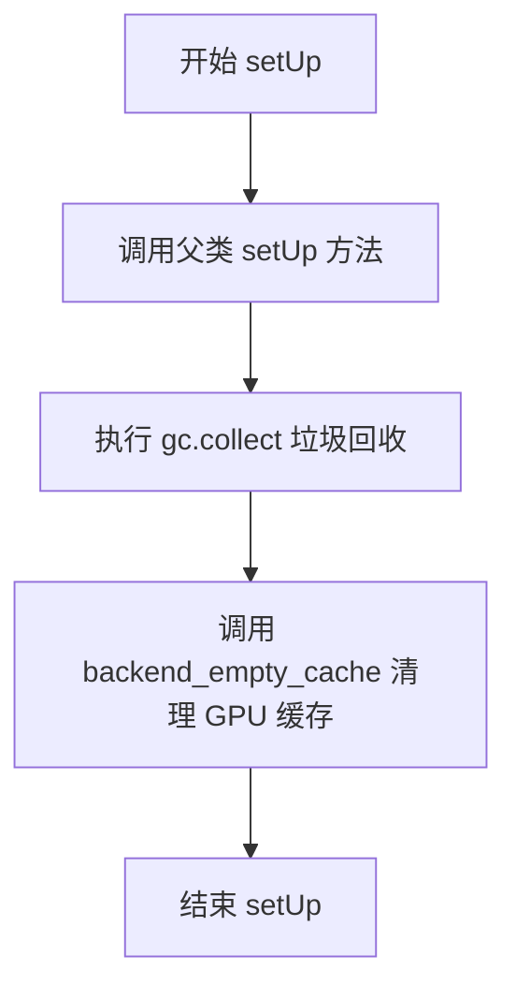
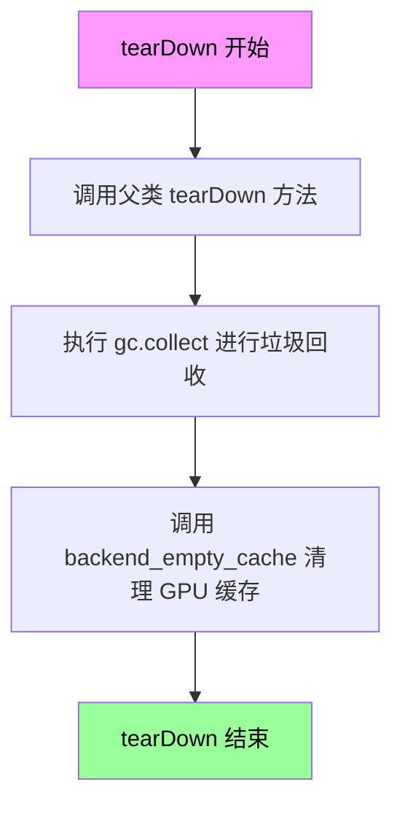
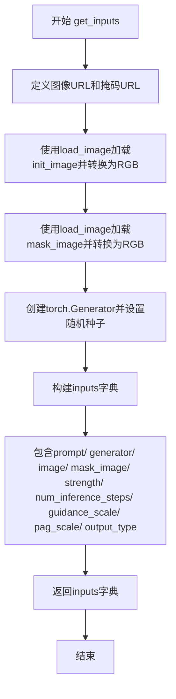
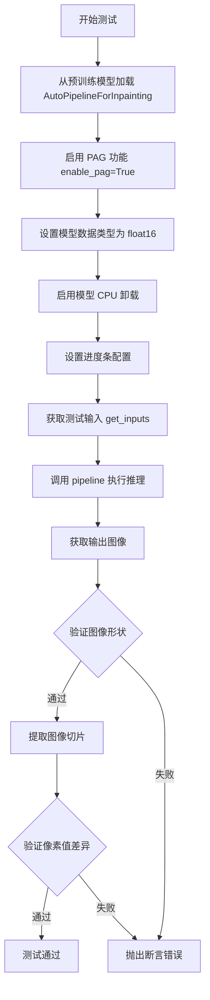
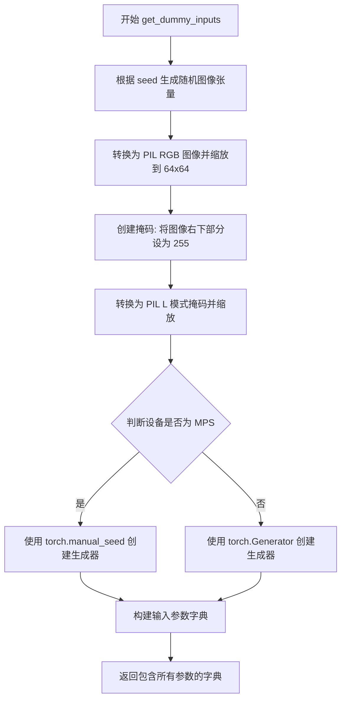
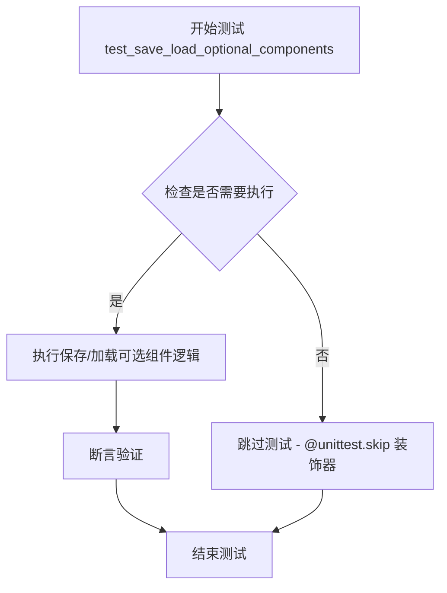
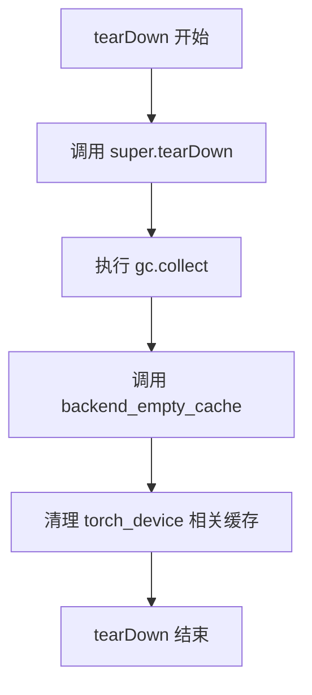
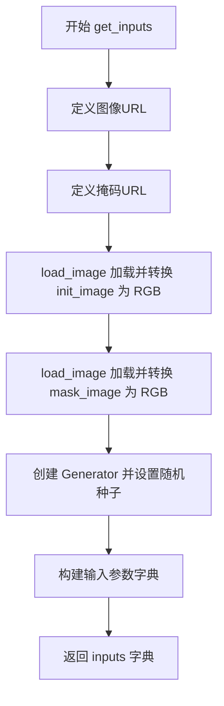

# `diffusers\tests\pipelines\pag\test_pag_sdxl_inpaint.py` 详细设计文档

该文件是Stable Diffusion XL Inpainting Pipeline（图像修复管道）的PAG（Progressive Attention Guidance）功能的单元测试和集成测试代码，用于验证PAG在图像修复任务中的启用/禁用、推理以及与Classifier-Free Guidance结合使用的正确性。

## 整体流程



## 类结构

```
unittest.TestCase
├── StableDiffusionXLPAGInpaintPipelineFastTests
│   ├── PipelineTesterMixin
│   ├── IPAdapterTesterMixin
│   ├── PipelineLatentTesterMixin
│   └── PipelineFromPipeTesterMixin
└── StableDiffusionXLPAGInpaintPipelineIntegrationTests
```

## 全局变量及字段


### `StableDiffusionXLPAGInpaintPipelineFastTests.pipeline_class`
    
被测试的 Stable Diffusion XL PAG 修复管道的类对象

类型：`Type[StableDiffusionXLPAGInpaintPipeline]`
    


### `StableDiffusionXLPAGInpaintPipelineFastTests.params`
    
单样本推理参数集合，包含文本引导图像修复参数加上 pag_scale 和 pag_adaptive_scale

类型：`set`
    


### `StableDiffusionXLPAGInpaintPipelineFastTests.batch_params`
    
批量推理参数集合，用于批量图像修复测试

类型：`frozenset`
    


### `StableDiffusionXLPAGInpaintPipelineFastTests.image_params`
    
图像参数集合，此处为空集表示无需额外图像参数

类型：`frozenset`
    


### `StableDiffusionXLPAGInpaintPipelineFastTests.image_latents_params`
    
图像潜在向量参数集合，此处为空集表示无需额外潜在向量参数

类型：`frozenset`
    


### `StableDiffusionXLPAGInpaintPipelineFastTests.callback_cfg_params`
    
回调配置参数集合，包含文本嵌入、时间ID、掩码和掩码图像潜在向量等

类型：`set`
    


### `StableDiffusionXLPAGInpaintPipelineFastTests.supports_dduf`
    
标志位，表示该管道不支持 DDUF（Decoder Denoising Upsampling Fusion）功能

类型：`bool`
    


### `StableDiffusionXLPAGInpaintPipelineIntegrationTests.repo_id`
    
用于集成测试的预训练模型仓库 ID（stabilityai/stable-diffusion-xl-base-1.0）

类型：`str`
    
    

## 全局函数及方法


### `enable_full_determinism`

该函数用于设置随机种子和环境变量，确保深度学习模型在运行时产生完全确定性的结果，以便测试和调试过程中的结果可复现。

参数：无

返回值：`None`，该函数不返回任何值

#### 流程图



#### 带注释源码

```python
# 该函数从 testing_utils 模块导入，源代码不在本文件中
# 基于函数名和调用方式的推断实现

def enable_full_determinism(seed: int = 0):
    """
    启用完全确定性运行，确保测试结果可复现
    
    参数:
        seed: 随机种子，默认为 0
    """
    import os
    import random
    import numpy as np
    import torch
    
    # 1. 设置 Python 内置 random 模块的种子
    random.seed(seed)
    
    # 2. 设置 NumPy 的随机种子
    np.random.seed(seed)
    
    # 3. 设置 PyTorch 的随机种子（CPU 和 CUDA）
    torch.manual_seed(seed)
    torch.cuda.manual_seed_all(seed)
    
    # 4. 强制 PyTorch 使用确定性算法
    # 这会影响某些操作（如池化、卷积）的性能，但保证可复现性
    torch.backends.cudnn.deterministic = True
    torch.backends.cudnn.benchmark = False
    
    # 5. 设置环境变量确保 Python 哈希的确定性
    os.environ["PYTHONHASHSEED"] = str(seed)
```

#### 使用示例

```python
# 在测试文件开头调用，确保所有后续随机操作可复现
enable_full_determinism()

# 然后创建测试用例
class StableDiffusionXLPAGInpaintPipelineFastTests(unittest.TestCase):
    # 测试代码...
```


### `StableDiffusionXLPAGInpaintPipelineFastTests.get_dummy_components`

该函数用于创建Stable Diffusion XL PAG Inpainting pipeline测试所需的虚拟组件（dummy components），包括UNet、VAE、文本编码器、图像编码器、调度器等模型实例，并返回一个包含所有组件的字典供测试使用。

参数：

- `skip_first_text_encoder`：`bool`，可选，是否跳过第一个文本编码器（当为`True`时，`text_encoder`和`tokenizer`将为`None`）
- `time_cond_proj_dim`：`int | None`，可选，时间条件投影维度，用于UNet模型
- `requires_aesthetics_score`：`bool`，可选，是否需要美学评分功能（影响`projection_class_embeddings_input_dim`参数）

返回值：`dict`，返回包含以下键的字典：`unet`（UNet2DConditionModel）、`scheduler`（EulerDiscreteScheduler）、`vae`（AutoencoderKL）、`text_encoder`（CLIPTextModel或None）、`tokenizer`（CLIPTokenizer或None）、`text_encoder_2`（CLIPTextModelWithProjection）、`tokenizer_2`（CLIPTokenizer）、`image_encoder`（CLIPVisionModelWithProjection）、`feature_extractor`（CLIPImageProcessor）、`requires_aesthetics_score`（布尔值）

#### 流程图

```mermaid
flowchart TD
    A[开始 get_dummy_components] --> B[设置随机种子 torch.manual_seed(0)]
    B --> C[创建 UNet2DConditionModel]
    C --> D[创建 EulerDiscreteScheduler]
    D --> E[设置随机种子并创建 AutoencoderKL]
    E --> F[设置随机种子并创建 CLIPTextConfig]
    F --> G[创建 CLIPTextModel 和 CLIPTokenizer]
    G --> H[创建 CLIPTextModelWithProjection 和 CLIPTokenizer_2]
    H --> I[设置随机种子并创建 CLIPVisionConfig]
    I --> J[创建 CLIPVisionModelWithProjection]
    J --> K[创建 CLIPImageProcessor]
    K --> L[构建 components 字典]
    L --> M{skip_first_text_encoder?}
    M -->|True| N[text_encoder 和 tokenizer 设为 None]
    M -->|False| O[保留 text_encoder 和 tokenizer]
    N --> P[返回 components 字典]
    O --> P
```

#### 带注释源码

```python
def get_dummy_components(
    self, skip_first_text_encoder=False, time_cond_proj_dim=None, requires_aesthetics_score=False
):
    """
    创建用于测试的虚拟组件（dummy components）
    
    参数:
        skip_first_text_encoder: 是否跳过第一个文本编码器
        time_cond_proj_dim: 时间条件投影维度
        requires_aesthetics_score: 是否需要美学评分
    返回:
        包含所有模型组件的字典
    """
    # 设置随机种子以确保可重复性
    torch.manual_seed(0)
    
    # 创建 UNet2DConditionModel - 用于去噪的UNet模型
    unet = UNet2DConditionModel(
        block_out_channels=(32, 64),         # UNet模块输出通道数
        layers_per_block=2,                   # 每个块的层数
        sample_size=32,                       # 样本尺寸
        in_channels=4,                        # 输入通道数（latent空间）
        out_channels=4,                       # 输出通道数
        time_cond_proj_dim=time_cond_proj_dim, # 时间条件投影维度
        down_block_types=("DownBlock2D", "CrossAttnDownBlock2D"),  # 下采样块类型
        up_block_types=("CrossAttnUpBlock2D", "UpBlock2D"),        # 上采样块类型
        attention_head_dim=(2, 4),           # 注意力头维度
        use_linear_projection=True,          # 使用线性投影
        addition_embed_type="text_time",     # 额外嵌入类型
        addition_time_embed_dim=8,           # 额外时间嵌入维度
        transformer_layers_per_block=(1, 2), # 每个块的transformer层数
        # 根据requires_aesthetics_score决定投影类别嵌入输入维度
        projection_class_embeddings_input_dim=72 if requires_aesthetics_score else 80,
        cross_attention_dim=64 if not skip_first_text_encoder else 32,  # 交叉注意力维度
    )
    
    # 创建调度器 - 控制去噪过程的时间步
    scheduler = EulerDiscreteScheduler(
        beta_start=0.00085,       # beta起始值
        beta_end=0.012,          # beta结束值
        steps_offset=1,           # 步数偏移
        beta_schedule="scaled_linear",  # beta调度策略
        timestep_spacing="leading",     # 时间步间距
    )
    
    # 设置随机种子并创建VAE（变分自编码器）
    torch.manual_seed(0)
    vae = AutoencoderKL(
        block_out_channels=[32, 64],   # VAE块输出通道
        in_channels=3,                 # 输入通道（RGB图像）
        out_channels=3,                # 输出通道
        down_block_types=["DownEncoderBlock2D", "DownEncoderBlock2D"],  # 下编码块类型
        up_block_types=["UpDecoderBlock2D", "UpDecoderBlock2D"],      # 上解码块类型
        latent_channels=4,            # latent空间通道数
        sample_size=128,               # 样本尺寸
    )
    
    # 设置随机种子并创建文本编码器配置
    torch.manual_seed(0)
    text_encoder_config = CLIPTextConfig(
        bos_token_id=0,              # 起始符ID
        eos_token_id=2,              # 结束符ID
        hidden_size=32,              # 隐藏层大小
        intermediate_size=37,        # 中间层大小
        layer_norm_eps=1e-05,        # LayerNorm epsilon
        num_attention_heads=4,       # 注意力头数
        num_hidden_layers=5,        # 隐藏层数
        pad_token_id=1,              # 填充符ID
        vocab_size=1000,             # 词汇表大小
        hidden_act="gelu",           # 激活函数
        projection_dim=32,           # 投影维度
    )
    
    # 创建第一个文本编码器模型
    text_encoder = CLIPTextModel(text_encoder_config)
    # 从预训练模型加载tokenizer
    tokenizer = CLIPTokenizer.from_pretrained("hf-internal-testing/tiny-random-clip")

    # 创建第二个文本编码器（带projection）
    text_encoder_2 = CLIPTextModelWithProjection(text_encoder_config)
    tokenizer_2 = CLIPTokenizer.from_pretrained("hf-internal-testing/tiny-random-clip")

    # 设置随机种子并创建图像编码器配置
    torch.manual_seed(0)
    image_encoder_config = CLIPVisionConfig(
        hidden_size=32,              # 隐藏层大小
        image_size=224,              # 图像尺寸
        projection_dim=32,           # 投影维度
        intermediate_size=37,        # 中间层大小
        num_attention_heads=4,       # 注意力头数
        num_channels=3,              # 通道数
        num_hidden_layers=5,        # 隐藏层数
        patch_size=14,               # patch大小
    )

    # 创建图像编码器模型
    image_encoder = CLIPVisionModelWithProjection(image_encoder_config)

    # 创建图像特征提取器
    feature_extractor = CLIPImageProcessor(
        crop_size=224,                      # 裁剪尺寸
        do_center_crop=True,               # 是否中心裁剪
        do_normalize=True,                 # 是否归一化
        do_resize=True,                    # 是否调整大小
        image_mean=[0.48145466, 0.4578275, 0.40821073],   # 图像均值
        image_std=[0.26862954, 0.26130258, 0.27577711],    # 图像标准差
        resample=3,                        # 重采样方式
        size=224,                          # 尺寸
    )

    # 组装所有组件到字典中
    components = {
        "unet": unet,                                # UNet去噪模型
        "scheduler": scheduler,                     # 调度器
        "vae": vae,                                  # VAE编解码器
        "text_encoder": text_encoder if not skip_first_text_encoder else None,  # 文本编码器1
        "tokenizer": tokenizer if not skip_first_text_encoder else None,        # tokenizer1
        "text_encoder_2": text_encoder_2,           # 文本编码器2
        "tokenizer_2": tokenizer_2,                 # tokenizer2
        "image_encoder": image_encoder,            # 图像编码器
        "feature_extractor": feature_extractor,    # 特征提取器
        "requires_aesthetics_score": requires_aesthetics_score,  # 美学评分标志
    }
    return components
```


### `StableDiffusionXLPAGInpaintPipelineFastTests.get_dummy_inputs`

该方法用于生成Stable Diffusion XL图像修复管道的虚拟测试输入数据，包括处理图像和掩码张量、创建随机生成器，并构建包含推理参数（如提示词、图像、掩码、推理步数、引导比例等）的字典，供后续测试使用。

参数：

- `device`：`str`，目标设备（如"cpu"或"cuda"），用于张量设备和随机生成器初始化
- `seed`：`int`，随机种子，默认值为0，用于确保测试的可重复性

返回值：`dict`，包含以下键值对：
- `prompt`：str，文本提示
- `image`：PIL.Image.Image，初始图像
- `mask_image`：PIL.Image.Image，掩码图像
- `generator`：torch.Generator，随机数生成器
- `num_inference_steps`：int，推理步数
- `guidance_scale`：float，引导比例
- `strength`：float，图像修复强度
- `pag_scale`：float，PAG（Prompt Attention Guidance）缩放因子
- `output_type`：str，输出类型

#### 流程图

```mermaid
flowchart TD
    A[开始] --> B[使用floats_tensor生成随机浮点张量]
    B --> C[转换为CPU张量并permute维度]
    C --> D[将张量转换为PIL图像并resize为64x64]
    D --> E[创建掩码: 设置image[8:, 8:, :]为255]
    E --> F[将掩码转换为灰度图并resize为64x64]
    F --> G{设备是否为mps?}
    G -->|是| H[使用torch.manual_seed创建生成器]
    G -->|否| I[使用torch.Generator创建生成器]
    H --> J[构建输入字典]
    I --> J
    J --> K[返回inputs字典]
```

#### 带注释源码

```python
def get_dummy_inputs(self, device, seed=0):
    # TODO: 使用张量输入替代PIL图像，此处保留是为了不影响旧的expected_slices
    # 生成形状为(1, 3, 32, 32)的随机浮点张量
    image = floats_tensor((1, 3, 32, 32), rng=random.Random(seed)).to(device)
    # 将张量移到CPU并调整维度顺序: (B, C, H, W) -> (B, H, W, C)
    image = image.cpu().permute(0, 2, 3, 1)[0]
    # 将numpy数组转换为PIL图像并转换为RGB模式，再resize为64x64
    init_image = Image.fromarray(np.uint8(image)).convert("RGB").resize((64, 64))
    
    # 创建掩码: 将图像右下角区域设为255(白色)
    image[8:, 8:, :] = 255
    # 将处理后的图像转换为灰度掩码图像并resize为64x64
    mask_image = Image.fromarray(np.uint8(image)).convert("L").resize((64, 64))

    # 根据设备类型创建随机生成器
    if str(device).startswith("mps"):
        # MPS设备使用torch.manual_seed
        generator = torch.manual_seed(seed)
    else:
        # 其他设备使用torch.Generator
        generator = torch.Generator(device=device).manual_seed(seed)
    
    # 构建测试输入字典，包含图像修复所需的所有参数
    inputs = {
        "prompt": "A painting of a squirrel eating a burger",
        "image": init_image,
        "mask_image": mask_image,
        "generator": generator,
        "num_inference_steps": 2,
        "guidance_scale": 6.0,
        "strength": 1.0,
        "pag_scale": 0.9,
        "output_type": "np",
    }
    return inputs
```


### `StableDiffusionXLPAGInpaintPipelineFastTests.test_pag_disable_enable`

该测试方法验证了 Stable Diffusion XL PAG (Prompt Attention Guidance) 修复管道的禁用和启用功能。测试分别运行基础管道（无 pag_scale 参数）、PAG 禁用模式（pag_scale=0.0）和 PAG 启用模式（pag_scale=0.9），并通过比较输出图像的差异来确认 PAG 功能在不同配置下的行为是否符合预期。

参数：

- `self`：隐式参数，测试类实例本身

返回值：`None`，该方法为测试用例，通过断言验证功能，不返回具体值

#### 流程图

```mermaid
flowchart TD
    A[开始测试] --> B[获取设备: cpu]
    B --> C[获取虚拟组件: requires_aesthetics_score=True]
    C --> D[创建基础管道 StableDiffusionXLInpaintPipeline]
    D --> E[移除输入中的 pag_scale]
    E --> F[断言: pag_scale 不在基础管道参数中]
    F --> G[运行基础管道推理]
    G --> H[获取输出图像块 out]
    H --> I[创建 PAG 管道, pag_scale=0.0]
    I --> J[运行 PAG 禁用模式推理]
    J --> K[获取输出图像块 out_pag_disabled]
    K --> L[创建 PAG 管道, pag_applied_layers=['mid', 'up', 'down']]
    L --> M[运行 PAG 启用模式推理]
    M --> N[获取输出图像块 out_pag_enabled]
    N --> O[断言: out ≈ out_pag_disabled 差异<1e-3]
    O --> P{断言通过?}
    P -->|是| Q[断言: out ≠ out_pag_enabled 差异>1e-3]
    Q --> R[测试通过]
    P -->|否| S[抛出断言错误]
```

#### 带注释源码

```python
def test_pag_disable_enable(self):
    """
    测试 PAG (Prompt Attention Guidance) 功能的禁用和启用行为
    
    测试流程:
    1. 验证基础管道不接受 pag_scale 参数
    2. 验证 pag_scale=0.0 时 PAG 功能被禁用，输出与基础管道一致
    3. 验证 pag_scale>0 时 PAG 功能启用，输出与基础管道不同
    """
    # 使用 cpu 设备确保确定性结果（torch.Generator 依赖设备）
    device = "cpu"
    
    # 获取虚拟组件，启用 aesthetics_score 需求
    components = self.get_dummy_components(requires_aesthetics_score=True)

    # ==== 步骤1: 测试基础管道 ====
    # 创建不带 PAG 功能的基础 inpainting 管道
    pipe_sd = StableDiffusionXLInpaintPipeline(**components)
    pipe_sd = pipe_sd.to(device)
    pipe_sd.set_progress_bar_config(disable=None)

    # 获取虚拟输入
    inputs = self.get_dummy_inputs(device)
    
    # 从输入中删除 pag_scale 参数
    del inputs["pag_scale"]
    
    # 断言：基础管道不应接受 pag_scale 参数
    assert "pag_scale" not in inspect.signature(pipe_sd.__call__).parameters, (
        f"`pag_scale` should not be a call parameter of the base pipeline {pipe_sd.__call__.__class__.__name__}."
    )
    
    # 运行基础管道推理并获取输出图像块
    out = pipe_sd(**inputs).images[0, -3:, -3:, -1]

    # ==== 步骤2: 测试 PAG 禁用模式 (pag_scale=0.0) ====
    # 创建 PAG 管道实例
    pipe_pag = self.pipeline_class(**components)
    pipe_pag = pipe_pag.to(device)
    pipe_pag.set_progress_bar_config(disable=None)

    # 获取虚拟输入并设置 pag_scale=0.0
    inputs = self.get_dummy_inputs(device)
    inputs["pag_scale"] = 0.0
    
    # 运行 PAG 禁用模式推理
    out_pag_disabled = pipe_pag(**inputs).images[0, -3:, -3:, -1]

    # ==== 步骤3: 测试 PAG 启用模式 ====
    # 创建带有指定 PAG 应用层的管道
    pipe_pag = self.pipeline_class(**components, pag_applied_layers=["mid", "up", "down"])
    pipe_pag = pipe_pag.to(device)
    pipe_pag.set_progress_bar_config(disable=None)

    # 获取虚拟输入（默认 pag_scale=0.9）
    inputs = self.get_dummy_inputs(device)
    
    # 运行 PAG 启用模式推理
    out_pag_enabled = pipe_pag(**inputs).images[0, -3:, -3:, -1]

    # ==== 步骤4: 验证结果 ====
    # 断言1: 禁用 PAG 时输出应与基础管道一致（差异小于阈值）
    assert np.abs(out.flatten() - out_pag_disabled.flatten()).max() < 1e-3
    
    # 断言2: 启用 PAG 时输出应与基础管道不同（差异大于阈值）
    assert np.abs(out.flatten() - out_pag_enabled.flatten()).max() > 1e-3
```


### `StableDiffusionXLPAGInpaintPipelineFastTests.test_pag_inference`

该测试方法用于验证 StableDiffusionXLPAGInpaintPipeline（Stable Diffusion XL 图像修复 Pipeline，支持 Progressive Adaptation Guidance）在使用 PAG（Progressive Adaptation Guidance）技术时的推理功能是否正确，通过检查输出图像的形状和像素值是否与预期相符来确保管道的核心推理逻辑正常工作。

参数：

- `self`：隐式参数，StableDiffusionXLPAGInpaintPipelineFastTests 类的实例，用于访问类的属性和方法

返回值：`void`，该方法为测试函数，无返回值，主要通过断言验证推理结果的正确性

#### 流程图

```mermaid
flowchart TD
    A[开始测试] --> B[设置设备为CPU保证确定性]
    B --> C[获取虚拟组件配置: requires_aesthetics_score=True]
    C --> D[创建PAG Pipeline实例<br/>pag_applied_layers=['mid', 'up', 'down']]
    D --> E[将Pipeline移至CPU设备]
    E --> F[配置进度条: disable=None]
    F --> G[获取虚拟输入数据]
    G --> H[执行Pipeline推理<br/>pipe_pag(**inputs)]
    H --> I[提取输出图像切片<br/>image[0, -3:, -3:, -1]]
    I --> J{断言图像形状<br/>是否为1x64x64x3}
    J -->|是| K[定义预期像素值数组]
    J -->|否| L[抛出形状错误断言]
    K --> M[计算最大像素差异<br/>max_diff]
    M --> N{断言max_diff < 1e-3}
    N -->|是| O[测试通过]
    N -->|否| P[抛出值错误断言]
    L --> Q[测试失败]
    O --> R[结束]
    P --> Q
```

#### 带注释源码

```python
def test_pag_inference(self):
    """
    测试函数：验证PAG图像修复Pipeline的推理功能
    
    该测试验证 StableDiffusionXLPAGInpaintPipeline 在使用 
    Progressive Adaptation Guidance (PAG) 技术时能够正确执行推理，
    并输出符合预期形状和像素值的图像结果。
    """
    
    # 设置设备为CPU，确保torch.Generator的确定性
    # CPU设备可以保证随机数生成的可重复性，便于测试验证
    device = "cpu"  # ensure determinism for the device-dependent torch.Generator
    
    # 获取虚拟组件配置，包含UNet、VAE、文本编码器等必要组件
    # requires_aesthetics_score=True 表示需要美学评分功能
    components = self.get_dummy_components(requires_aesthetics_score=True)
    
    # 创建支持PAG的Stable Diffusion XL图像修复Pipeline实例
    # pag_applied_layers=['mid', 'up', 'down'] 指定PAG应用于中间层、上采样层和下采样层
    pipe_pag = self.pipeline_class(**components, pag_applied_layers=["mid", "up", "down"])
    
    # 将Pipeline移至指定设备（CPU）
    pipe_pag = pipe_pag.to(device)
    
    # 配置进度条显示，disable=None 表示不禁用进度条
    pipe_pag.set_progress_bar_config(disable=None)
    
    # 获取测试用的虚拟输入数据
    # 包含prompt、image、mask_image、generator等必要参数
    inputs = self.get_dummy_inputs(device)
    
    # 执行Pipeline推理，生成修复后的图像
    # 返回包含图像的输出对象
    image = pipe_pag(**inputs).images
    
    # 提取图像切片用于验证
    # 取图像右下角3x3像素区域，保留所有通道
    image_slice = image[0, -3:, -3:, -1]
    
    # 断言验证输出图像形状
    # 期望形状为 (1, 64, 64, 3)，表示1张64x64的RGB图像
    assert image.shape == (
        1,
        64,
        64,
        3,
    ), f"the shape of the output image should be (1, 64, 64, 3) but got {image.shape}"
    
    # 定义预期的像素值数组（9个值，对应3x3像素区域）
    # 这些值是在特定随机种子下通过推理得到的基准值
    expected_slice = np.array([0.8366, 0.5513, 0.6105, 0.6213, 0.6957, 0.7400, 0.6614, 0.6102, 0.5239])
    
    # 计算实际输出与预期值之间的最大差异
    max_diff = np.abs(image_slice.flatten() - expected_slice).max()
    
    # 断言验证像素值差异在允许范围内
    # 允许的最大差异为 1e-3（千分之一）
    assert max_diff < 1e-3, f"output is different from expected, {image_slice.flatten()}"
```


### `StableDiffusionXLPAGInpaintPipelineFastTests.test_save_load_optional_components`

该方法用于测试管道的可选组件（如文本编码器、tokenizer 等）的保存和加载功能。由于该功能已在其他测试中覆盖，因此使用 `@unittest.skip` 装饰器跳过执行。

参数：

- `self`：`StableDiffusionXLPAGInpaintPipelineFastTests`，表示类的实例本身

返回值：`None`，该方法被跳过，不执行任何操作，也不返回任何值

#### 流程图

```mermaid
flowchart TD
    A[方法入口] --> B{检查装饰器}
    B -->|存在@unittest.skip| C[跳过测试执行]
    B -->|无装饰器| D[执行测试逻辑]
    C --> E[方法结束, 返回None]
    D --> E
```

#### 带注释源码

```python
@unittest.skip("We test this functionality elsewhere already.")
def test_save_load_optional_components(self):
    """
    测试可选组件的保存和加载功能。
    
    该测试方法用于验证 StableDiffusionXLPAGInpaintPipeline 管道中
    可选组件（如 text_encoder、tokenizer 等）的序列化和反序列化能力。
    
    注意：由于该功能已在其他测试套件中充分覆盖，此测试被跳过以避免重复。
    
    Args:
        self: StableDiffusionXLPAGInpaintPipelineFastTests 类的实例
        
    Returns:
        None: 方法被 @unittest.skip 装饰器跳过，不执行任何操作
        
    Raises:
        unittest.SkipTest: 由装饰器触发，表示测试被跳过
    """
    pass  # 方法体为空，测试被跳过
```


### `StableDiffusionXLPAGInpaintPipelineIntegrationTests.setUp`

该方法用于集成测试的初始化 setup 阶段，通过调用垃圾回收和清空后端缓存来确保测试环境干净，避免之前测试的残留状态影响当前测试结果。

参数：

- `self`：无显式参数，`unittest.TestCase` 的标准实例方法，代表测试类本身

返回值：`None`，无返回值，仅执行环境清理操作

#### 流程图



#### 带注释源码

```
def setUp(self):
    """
    集成测试的初始化方法，在每个测试方法执行前被调用。
    负责清理环境以确保测试的独立性和可重复性。
    """
    # 调用父类的 setUp 方法，执行 unittest.TestCase 的标准初始化逻辑
    super().setUp()
    
    # 手动触发 Python 垃圾回收，释放不再使用的对象内存
    gc.collect()
    
    # 清理深度学习框架（PyTorch）的 GPU 缓存，避免显存泄漏影响后续测试
    backend_empty_cache(torch_device)
```


### `StableDiffusionXLPAGInpaintPipelineIntegrationTests.tearDown`

该方法是测试类的清理方法，在每个集成测试执行完毕后被调用，用于释放GPU内存和执行垃圾回收，以确保测试环境不会因为残留的GPU张量或模型导致内存泄漏。

参数：

- `self`：`StableDiffusionXLPAGInpaintPipelineIntegrationTests`，测试类的实例本身

返回值：`None`，此方法不返回值，仅执行清理操作

#### 流程图



#### 带注释源码

```python
def tearDown(self):
    """
    测试类清理方法。
    
    在每个集成测试执行完毕后自动调用，用于：
    1. 调用父类的 tearDown 方法
    2. 强制进行 Python 垃圾回收，释放不再使用的对象
    3. 清理 GPU 缓存，释放 GPU 显存
    
    这对于避免因累积的 GPU 张量或模型导致内存泄漏至关重要，
    特别是在运行多个需要大量 GPU 内存的扩散模型测试时。
    """
    # 调用父类的 tearDown 方法，执行基本的测试清理
    super().tearDown()
    
    # 手动触发 Python 的垃圾回收器，收集已删除的对象
    gc.collect()
    
    # 调用后端特定的 GPU 缓存清理函数，释放 GPU 显存
    # torch_device 是测试工具中定义的当前测试设备
    backend_empty_cache(torch_device)
```


### `StableDiffusionXLPAGInpaintPipelineIntegrationTests.get_inputs`

该方法用于生成Stable Diffusion XL图像修复管道的测试输入参数，包括加载示例图像和掩码、设置随机生成器，以及构建包含推理所需所有参数的字典。

参数：

- `device`：`str` 或 `torch.device`，执行推理的目标设备（如"cuda:0"、"cpu"等）
- `generator_device`：`str`，随机生成器所在的设备，默认为"cpu"
- `seed`：`int`，随机种子，用于生成可复现的结果，默认为0
- `guidance_scale`：`float`，分类器自由引导尺度，控制文本提示对生成图像的影响程度，默认为7.0

返回值：`Dict[str, Any]`，返回包含以下键的字典：
- `prompt`（str）：文本提示
- `generator`（torch.Generator）：随机生成器对象
- `image`（PIL.Image）：初始图像
- `mask_image`（PIL.Image）：掩码图像
- `strength`（float）：图像修复强度
- `num_inference_steps`（int）：推理步数
- `guidance_scale`（float）：引导尺度
- `pag_scale`（float）：PAG（Prompt Attention Guidance）尺度
- `output_type`（str）：输出类型

#### 流程图



#### 带注释源码

```python
def get_inputs(self, device, generator_device="cpu", seed=0, guidance_scale=7.0):
    """
    生成Stable Diffusion XL图像修复管道的测试输入参数。
    
    参数:
        device: 执行推理的目标设备
        generator_device: 生成器设备，默认为"cpu"
        seed: 随机种子，默认为0
        guidance_scale: 引导尺度，默认为7.0
    
    返回:
        包含所有管道输入参数的字典
    """
    # 定义用于测试的示例图像URL（一只猫的图像）
    img_url = "https://raw.githubusercontent.com/CompVis/latent-diffusion/main/data/inpainting_examples/overture-creations-5sI6fQgYIuo.png"
    # 定义对应的掩码图像URL
    mask_url = "https://raw.githubusercontent.com/CompVis/latent-diffusion/main/data/inpainting_examples/overture-creations-5sI6fQgYIuo_mask.png"

    # 加载初始图像并转换为RGB格式
    init_image = load_image(img_url).convert("RGB")
    # 加载掩码图像并转换为RGB格式
    mask_image = load_image(mask_url).convert("RGB")

    # 创建PyTorch随机生成器并设置种子，以确保结果可复现
    generator = torch.Generator(device=generator_device).manual_seed(seed)
    
    # 构建完整的输入参数字典
    inputs = {
        "prompt": "A majestic tiger sitting on a bench",  # 文本提示
        "generator": generator,  # 随机生成器
        "image": init_image,  # 要修复的初始图像
        "mask_image": mask_image,  # 修复区域的掩码
        "strength": 0.8,  # 图像修复强度（0-1之间）
        "num_inference_steps": 3,  # 推理步数
        "guidance_scale": guidance_scale,  # 文本引导强度
        "pag_scale": 3.0,  # PAG（Prompt Attention Guidance）尺度
        "output_type": "np",  # 输出类型为numpy数组
    }
    return inputs
```


### `StableDiffusionXLPAGInpaintPipelineIntegrationTests.test_pag_cfg`

该测试方法用于验证 Stable Diffusion XL 图像修复管道在启用 PAG（Prompt Adaptive Guidance）功能时的 CFG（Classifier-Free Guidance）行为，验证输出图像的形状和像素值是否符合预期。

参数：

- `self`：测试类的实例方法，隐含参数

返回值：`None`，无返回值（测试方法）

#### 流程图



#### 带注释源码

```python
@unittest.skip("We test this functionality elsewhere already.")
def test_pag_cfg(self):
    """
    测试 PAG 在 CFG 模式下的图像修复功能
    
    该测试验证：
    1. 启用 PAG 后管道能正常生成图像
    2. 输出图像尺寸正确 (1, 1024, 1024, 3)
    3. 输出图像像素值与预期值误差小于 1e-3
    """
    # 从预训练模型加载自动图像修复管道，启用 PAG 功能
    # 参数:
    #   repo_id: 模型仓库 ID ("stabilityai/stable-diffusion-xl-base-1.0")
    #   enable_pag: 启用 Prompt Adaptive Guidance
    #   torch_dtype: 使用 float16 精度
    pipeline = AutoPipelineForInpainting.from_pretrained(
        self.repo_id,  # "stabilityai/stable-diffusion-xl-base-1.0"
        enable_pag=True,
        torch_dtype=torch.float16
    )
    
    # 启用模型 CPU 卸载以节省显存
    # 参数 device: 指定设备 (torch_device)
    pipeline.enable_model_cpu_offload(device=torch_device)
    
    # 禁用进度条
    pipeline.set_progress_bar_config(disable=None)
    
    # 获取测试输入参数
    # 返回包含 prompt, generator, image, mask_image, strength,
    # num_inference_steps, guidance_scale, pag_scale, output_type 的字典
    inputs = self.get_inputs(torch_device)
    
    # 执行管道推理，传入输入参数
    # 返回 PipelineOutput 对象，包含生成的图像
    image = pipeline(**inputs).images
    
    # 提取图像右下角 3x3 像素区域并展平
    # 用于与预期值对比
    image_slice = image[0, -3:, -3:, -1].flatten()
    
    # 断言输出图像形状为 (1, 1024, 1024, 3)
    # 验证单张图像，高宽均为 1024，RGB 3 通道
    assert image.shape == (1, 1024, 1024, 3)
    
    # 定义预期像素值切片
    # 这些值是预先计算的正确输出参考
    expected_slice = np.array([
        0.41385046, 0.39608297, 0.4360491,
        0.26872507, 0.32187328, 0.4242474,
        0.2603805, 0.34167895, 0.46561807
    ])
    
    # 验证实际输出与预期值的最大绝对误差小于 1e-3
    # 如果误差过大，抛出详细的断言错误信息
    assert np.abs(image_slice.flatten() - expected_slice).max() < 1e-3, (
        f"output is different from expected, {image_slice.flatten()}"
    )
```


### `StableDiffusionXLPAGInpaintPipelineIntegrationTests.test_pag_uncond`

这是一个集成测试方法，用于测试 Stable Diffusion XL Inpainting Pipeline 在启用 PAG (Probabilistic Adaptive Guidance) 且 guidance_scale=0.0（无条件生成）时的输出是否与预期一致。

参数：

- `self`：集成测试类的实例，代表当前测试对象

返回值：`None`，该方法为单元测试方法，通过断言验证功能，不返回具体数值

#### 流程图

```mermaid
flowchart TD
    A[开始测试 test_pag_uncond] --> B[从预训练模型加载 AutoPipelineForInpainting]
    B --> C[启用 PAG: enable_pag=True]
    C --> D[设置模型 CPU 卸载: enable_model_cpu_offload]
    D --> E[设置进度条配置: set_progress_bar_config]
    E --> F[获取测试输入: get_inputs with guidance_scale=0.0]
    F --> G[调用 pipeline 生成图像: pipeline(**inputs)]
    G --> H[提取图像切片: image[0, -3:, -3:, -1]]
    H --> I{断言: image.shape == (1, 1024, 1024, 3)}
    I -->|是| J{断言: 输出与期望值的差异 < 1e-3}
    I -->|否| K[测试失败 - 抛出 AssertionError]
    J -->|是| L[测试通过]
    J -->|否| K
```

#### 带注释源码

```python
def test_pag_uncond(self):
    """
    测试在 guidance_scale=0.0（无条件生成）时 PAG pipeline 的输出。
    用于验证当关闭 classifier-free guidance 时，PAG 机制仍能正确工作。
    """
    # 从预训练模型加载支持 PAG 的 Inpainting Pipeline
    # enable_pag=True 启用 Probabilistic Adaptive Guidance
    pipeline = AutoPipelineForInpainting.from_pretrained(
        self.repo_id, 
        enable_pag=True, 
        torch_dtype=torch.float16  # 使用半精度浮点数减少显存占用
    )
    
    # 启用模型 CPU 卸载以节省显存
    pipeline.enable_model_cpu_offload(device=torch_device)
    
    # 设置进度条配置，disable=None 表示不禁用进度条
    pipeline.set_progress_bar_config(disable=None)

    # 获取测试输入，guidance_scale=0.0 表示无条件生成（不依赖文本提示引导）
    inputs = self.get_inputs(torch_device, guidance_scale=0.0)
    
    # 执行推理生成图像
    image = pipeline(**inputs).images

    # 提取图像右下角 3x3 像素块并展平用于对比
    image_slice = image[0, -3:, -3:, -1].flatten()
    
    # 断言：验证输出图像尺寸正确
    assert image.shape == (1, 1024, 1024, 3)
    
    # 定义期望的像素值切片（用于回归测试）
    expected_slice = np.array(
        [0.41597816, 0.39302617, 0.44287828, 0.2687074, 0.28315824, 0.40582314, 0.20877528, 0.2380802, 0.39447647]
    )
    
    # 断言：验证实际输出与期望值的最大差异小于阈值 1e-3
    assert np.abs(image_slice.flatten() - expected_slice).max() < 1e-3, (
        f"output is different from expected, {image_slice.flatten()}"
    )
```


### `StableDiffusionXLPAGInpaintPipelineFastTests.get_dummy_components`

该方法用于创建和返回测试所需的虚拟组件字典，包括UNet2DConditionModel、EulerDiscreteScheduler、AutoencoderKL、CLIPTextModel、CLIPTokenizer、CLIPTextModelWithProjection、CLIPVisionModelWithProjection和CLIPImageProcessor等，用于测试StableDiffusionXLPAGInpaintPipeline。

参数：

- `skip_first_text_encoder`：`bool`，可选，是否跳过第一个文本编码器，默认为False
- `time_cond_proj_dim`：`Optional[int]`，可选，时间条件投影维度，用于UNet的时间嵌入
- `requires_aesthetics_score`：`bool`，可选，是否需要美学评分，默认为False

返回值：`Dict[str, Any]`，包含管道所需的所有虚拟组件的字典，包括unet、scheduler、vae、text_encoder、tokenizer、text_encoder_2、tokenizer_2、image_encoder、feature_extractor和requires_aesthetics_score

#### 流程图

```mermaid
flowchart TD
    A[开始 get_dummy_components] --> B[设置随机种子 torch.manual_seed(0)]
    B --> C[创建 UNet2DConditionModel]
    C --> D[创建 EulerDiscreteScheduler]
    D --> E[创建 AutoencoderKL]
    E --> F[创建 CLIPTextConfig 和 CLIPTextModel]
    F --> G[创建 CLIPTokenizer]
    G --> H[创建 CLIPTextModelWithProjection 和 tokenizer_2]
    H --> I[创建 CLIPVisionConfig 和 CLIPVisionModelWithProjection]
    I --> J[创建 CLIPImageProcessor]
    J --> K{skip_first_text_encoder?}
    K -->|True| L[text_encoder=None, tokenizer=None]
    K -->|False| M[保留 text_encoder 和 tokenizer]
    L --> N[构建 components 字典]
    M --> N
    N --> O[返回 components 字典]
```

#### 带注释源码

```python
def get_dummy_components(
    self, skip_first_text_encoder=False, time_cond_proj_dim=None, requires_aesthetics_score=False
):
    """
    创建用于测试的虚拟组件字典
    
    参数:
        skip_first_text_encoder: 是否跳过第一个文本编码器
        time_cond_proj_dim: UNet的时间条件投影维度
        requires_aesthetics_score: 是否需要美学评分功能
    """
    # 设置随机种子以确保可重复性
    torch.manual_seed(0)
    
    # 创建UNet2DConditionModel - 用于去噪的UNet模型
    unet = UNet2DConditionModel(
        block_out_channels=(32, 64),       # UNet块输出通道数
        layers_per_block=2,                  # 每个块的层数
        sample_size=32,                      # 样本尺寸
        in_channels=4,                       # 输入通道数（latent空间）
        out_channels=4,                      # 输出通道数
        time_cond_proj_dim=time_cond_proj_dim,  # 时间嵌入投影维度
        down_block_types=("DownBlock2D", "CrossAttnDownBlock2D"),  # 下采样块类型
        up_block_types=("CrossAttnUpBlock2D", "UpBlock2D"),          # 上采样块类型
        attention_head_dim=(2, 4),          # 注意力头维度
        use_linear_projection=True,          # 使用线性投影
        addition_embed_type="text_time",    # 额外嵌入类型
        addition_time_embed_dim=8,          # 额外时间嵌入维度
        transformer_layers_per_block=(1, 2),  # 每个块的Transformer层数
        projection_class_embeddings_input_dim=72 if requires_aesthetics_score else 80,  # 投影类嵌入输入维度
        cross_attention_dim=64 if not skip_first_text_encoder else 32,  # 交叉注意力维度
    )
    
    # 创建Euler离散调度器 - 用于去噪调度的采样器
    scheduler = EulerDiscreteScheduler(
        beta_start=0.00085,                  # Beta起始值
        beta_end=0.012,                      # Beta结束值
        steps_offset=1,                      # 步骤偏移
        beta_schedule="scaled_linear",       # Beta调度策略
        timestep_spacing="leading",          # 时间步间距
    )
    
    # 重新设置随机种子
    torch.manual_seed(0)
    
    # 创建AutoencoderKL - VAE模型用于潜在空间编码/解码
    vae = AutoencoderKL(
        block_out_channels=[32, 64],        # VAE块输出通道
        in_channels=3,                       # 输入通道（RGB图像）
        out_channels=3,                      # 输出通道
        down_block_types=["DownEncoderBlock2D", "DownEncoderBlock2D"],  # 下采样编码块
        up_block_types=["UpDecoderBlock2D", "UpDecoderBlock2D"],        # 上采样解码块
        latent_channels=4,                  # 潜在空间通道数
        sample_size=128,                    # 样本尺寸
    )
    
    # 重新设置随机种子
    torch.manual_seed(0)
    
    # 创建第一个文本编码器的配置
    text_encoder_config = CLIPTextConfig(
        bos_token_id=0,                      # 开始符ID
        eos_token_id=2,                      # 结束符ID
        hidden_size=32,                      # 隐藏层大小
        intermediate_size=37,                # 中间层大小
        layer_norm_eps=1e-05,                # 层归一化epsilon
        num_attention_heads=4,               # 注意力头数
        num_hidden_layers=5,                 # 隐藏层数
        pad_token_id=1,                      # 填充符ID
        vocab_size=1000,                     # 词汇表大小
        hidden_act="gelu",                   # 隐藏层激活函数
        projection_dim=32,                   # 投影维度
    )
    
    # 创建第一个CLIP文本编码器模型
    text_encoder = CLIPTextModel(text_encoder_config)
    
    # 创建第一个分词器
    tokenizer = CLIPTokenizer.from_pretrained("hf-internal-testing/tiny-random-clip")
    
    # 创建第二个带投影的CLIP文本编码器
    text_encoder_2 = CLIPTextModelWithProjection(text_encoder_config)
    
    # 创建第二个分词器
    tokenizer_2 = CLIPTokenizer.from_pretrained("hf-internal-testing/tiny-random-clip")
    
    # 重新设置随机种子
    torch.manual_seed(0)
    
    # 创建CLIP视觉编码器配置
    image_encoder_config = CLIPVisionConfig(
        hidden_size=32,                      # 隐藏层大小
        image_size=224,                      # 图像尺寸
        projection_dim=32,                   # 投影维度
        intermediate_size=37,                # 中间层大小
        num_attention_heads=4,               # 注意力头数
        num_channels=3,                      # 通道数
        num_hidden_layers=5,                # 隐藏层数
        patch_size=14,                       # 补丁大小
    )
    
    # 创建CLIP视觉编码器模型
    image_encoder = CLIPVisionModelWithProjection(image_encoder_config)
    
    # 创建图像特征提取器
    feature_extractor = CLIPImageProcessor(
        crop_size=224,                       # 裁剪尺寸
        do_center_crop=True,                 # 是否中心裁剪
        do_normalize=True,                   # 是否归一化
        do_resize=True,                       # 是否调整大小
        image_mean=[0.48145466, 0.4578275, 0.40821073],   # 图像均值
        image_std=[0.26862954, 0.26130258, 0.27577711],   # 图像标准差
        resample=3,                          # 重采样方法
        size=224,                            # 尺寸
    )
    
    # 组装所有组件到字典中
    components = {
        "unet": unet,                          # UNet去噪模型
        "scheduler": scheduler,               # 调度器
        "vae": vae,                           # VAE模型
        # 根据skip_first_text_encoder决定是否包含第一个文本编码器
        "text_encoder": text_encoder if not skip_first_text_encoder else None,
        "tokenizer": tokenizer if not skip_first_text_encoder else None,
        "text_encoder_2": text_encoder_2,     # 第二个文本编码器
        "tokenizer_2": tokenizer_2,            # 第二个分词器
        "image_encoder": image_encoder,       # 视觉编码器
        "feature_extractor": feature_extractor,  # 特征提取器
        "requires_aesthetics_score": requires_aesthetics_score,  # 是否需要美学评分
    }
    
    # 返回组件字典
    return components
```


### `StableDiffusionXLPAGInpaintPipelineFastTests.get_dummy_inputs`

该方法用于生成测试所需的虚拟输入数据（dummy inputs），包括图像、掩码图像、提示词以及推理参数，专门用于测试 Stable Diffusion XL PAG（Prompt Attention Guidance）Inpainting Pipeline 的功能。

参数：

- `self`：隐式参数，StableDiffusionXLPAGInpaintPipelineFastTests 类的实例
- `device`：`torch.device` 或 `str`，指定运行设备（如 "cpu"、"cuda" 等）
- `seed`：`int`（默认值：0），随机种子，用于生成可重现的测试图像数据

返回值：`dict`，包含以下键值对的字典：
  - `"prompt"`：`str`，生成图像的文本提示
  - `"image"`：`PIL.Image.Image`，初始图像（PIL RGB 图像）
  - `"mask_image"`：`PIL.Image.Image`，掩码图像（PIL L 模式图像）
  - `"generator"`：`torch.Generator`，PyTorch 随机数生成器
  - `"num_inference_steps"`：`int`，推理步数
  - `"guidance_scale"`：`float`，文本引导比例
  - `"strength"`：`float`，图像强度
  - `"pag_scale"`：`float`，PAG 缩放因子
  - `"output_type"`：`str`，输出类型（"np" 表示 numpy 数组）

#### 流程图



#### 带注释源码

```
def get_dummy_inputs(self, device, seed=0):
    # TODO: use tensor inputs instead of PIL, this is here just to leave the old expected_slices untouched
    # 1. 使用 floats_tensor 生成一个 (1, 3, 32, 32) 的随机浮点数张量，范围通常在 [0, 1]
    image = floats_tensor((1, 3, 32, 32), rng=random.Random(seed)).to(device)
    
    # 2. 将张量从 (B, C, H, W) 转换为 (B, H, W, C) 并取第一张图像
    image = image.cpu().permute(0, 2, 3, 1)[0]
    
    # 3. 将 numpy 数组转换为 PIL RGB 图像并缩放到 64x64
    init_image = Image.fromarray(np.uint8(image)).convert("RGB").resize((64, 64))
    
    # 4. 创建掩码：将图像右下部分（从第8行第8列开始）设为白色（255）
    image[8:, 8:, :] = 255
    
    # 5. 将修改后的图像转换为灰度 PIL 图像（L 模式）作为掩码，并缩放到 64x64
    mask_image = Image.fromarray(np.uint8(image)).convert("L").resize((64, 64))

    # 6. 根据设备类型创建随机数生成器
    if str(device).startswith("mps"):
        # MPS 设备使用 torch.manual_seed
        generator = torch.manual_seed(seed)
    else:
        # 其他设备使用 torch.Generator
        generator = torch.Generator(device=device).manual_seed(seed)
    
    # 7. 构建并返回包含所有推理参数的字典
    inputs = {
        "prompt": "A painting of a squirrel eating a burger",
        "image": init_image,
        "mask_image": mask_image,
        "generator": generator,
        "num_inference_steps": 2,
        "guidance_scale": 6.0,
        "strength": 1.0,
        "pag_scale": 0.9,
        "output_type": "np",
    }
    return inputs
```


### `StableDiffusionXLPAGInpaintPipelineFastTests.test_pag_disable_enable`

测试 PAG (Prompt Attention Guidance) 在 Stable Diffusion XL Inpainting Pipeline 中的禁用和启用功能是否正常工作。该测试通过对比基础 pipeline、禁用 PAG 的 pipeline 和启用 PAG 的 pipeline 的输出，验证 PAG 功能的正确性。

参数：无（仅包含隐含的 `self` 参数）

返回值：无（`None`，测试函数通过断言验证行为）

#### 流程图

```mermaid
flowchart TD
    A[开始测试] --> B[获取 dummy components<br/>requires_aesthetics_score=True]
    B --> C[创建基础 pipeline<br/>StableDiffusionXLInpaintPipeline]
    C --> D[设置 device=cpu<br/>禁用进度条]
    D --> E[获取 dummy inputs<br/>移除 pag_scale]
    E --> F[调用基础 pipeline<br/>获取输出 out]
    F --> G[创建 PAG pipeline<br/>StableDiffusionXLPAGInpaintPipeline]
    G --> H[设置 device=cpu<br/>禁用进度条]
    H --> I[获取 dummy inputs<br/>pag_scale=0.0 禁用 PAG]
    I --> J[调用 pipeline<br/>获取输出 out_pag_disabled]
    J --> K[重新创建 PAG pipeline<br/>pag_applied_layers=['mid', 'up', 'down']]
    K --> L[设置 device=cpu<br/>禁用进度条]
    L --> M[获取 dummy inputs<br/>pag_scale=0.9 启用 PAG]
    M --> N[调用 pipeline<br/>获取输出 out_pag_enabled]
    N --> O{验证1: out vs<br/>out_pag_disabled}
    O -->|差异 < 1e-3| P{验证2: out vs<br/>out_pag_enabled}
    O -->|差异 >= 1e-3| Q[测试失败]
    P -->|差异 > 1e-3| R[测试通过]
    P -->|差异 <= 1e-3| Q
    R --> S[结束测试]
```

#### 带注释源码

```python
def test_pag_disable_enable(self):
    """测试 PAG 功能在 inpainting pipeline 中的禁用和启用"""
    
    # 1. 设置设备为 CPU，确保确定性结果（因为 torch.Generator 依赖设备）
    device = "cpu"
    
    # 2. 获取测试所需的虚拟组件，requires_aesthetics_score=True 启用美学评分功能
    components = self.get_dummy_components(requires_aesthetics_score=True)
    
    # ========== 测试基础 Pipeline（无 PAG 功能） ==========
    
    # 3. 创建基础 Stable Diffusion XL Inpainting Pipeline
    pipe_sd = StableDiffusionXLInpaintPipeline(**components)
    pipe_sd = pipe_sd.to(device)  # 移至 CPU 设备
    pipe_sd.set_progress_bar_config(disable=None)  # 不禁用进度条
    
    # 4. 获取输入数据（不含 pag_scale 参数）
    inputs = self.get_dummy_inputs(device)
    del inputs["pag_scale"]  # 移除 pag_scale 参数
    
    # 5. 验证基础 pipeline 的调用签名中不应包含 pag_scale 参数
    assert "pag_scale" not in inspect.signature(pipe_sd.__call__).parameters, (
        f"`pag_scale` should not be a call parameter of the base pipeline {pipe_sd.__class__.__name__}."
    )
    
    # 6. 调用基础 pipeline 获取输出（作为参考基准）
    # 提取图像右下角 3x3 像素区域用于对比
    out = pipe_sd(**inputs).images[0, -3:, -3:, -1]
    
    # ========== 测试 PAG 禁用（pag_scale=0.0） ==========
    
    # 7. 创建 PAG pipeline（未指定 pag_applied_layers）
    pipe_pag = self.pipeline_class(**components)
    pipe_pag = pipe_pag.to(device)
    pipe_pag.set_progress_bar_config(disable=None)
    
    # 8. 获取输入数据，设置 pag_scale=0.0 禁用 PAG
    inputs = self.get_dummy_inputs(device)
    inputs["pag_scale"] = 0.0  # 禁用 PAG
    
    # 9. 调用禁用 PAG 的 pipeline 获取输出
    out_pag_disabled = pipe_pag(**inputs).images[0, -3:, -3:, -1]
    
    # ========== 测试 PAG 启用 ==========
    
    # 10. 创建 PAG pipeline，指定 PAG 应用的层 ['mid', 'up', 'down']
    pipe_pag = self.pipeline_class(**components, pag_applied_layers=["mid", "up", "down"])
    pipe_pag = pipe_pag.to(device)
    pipe_pag.set_progress_bar_config(disable=None)
    
    # 11. 获取输入数据（pag_scale 使用默认值 0.9）
    inputs = self.get_dummy_inputs(device)
    
    # 12. 调用启用 PAG 的 pipeline 获取输出
    out_pag_enabled = pipe_pag(**inputs).images[0, -3:, -3:, -1]
    
    # ========== 验证结果 ==========
    
    # 13. 验证：禁用 PAG 的输出应与基础 pipeline 输出几乎相同（差异 < 1e-3）
    # 因为 pag_scale=0.0 实际上禁用了 PAG 引导
    assert np.abs(out.flatten() - out_pag_disabled.flatten()).max() < 1e-3
    
    # 14. 验证：启用 PAG 的输出应与基础 pipeline 输出有明显差异（差异 > 1e-3）
    # 因为 PAG 引导会改变生成过程
    assert np.abs(out.flatten() - out_pag_enabled.flatten()).max() > 1e-3
```


### `StableDiffusionXLPAGInpaintPipelineFastTests.test_pag_inference`

该函数是Stable Diffusion XL PAG（Prompt-Adaptive Guidance）Inpaint管道的快速推理测试方法，用于验证PAG算法在图像修复任务中的正确性，包括输出图像形状和像素值与预期结果的一致性。

参数：

- `self`：TestCase，unittest测试类的隐含参数，代表测试用例实例本身

返回值：`None`，该方法为测试方法，通过assert语句进行断言验证，不返回任何值

#### 流程图

```mermaid
flowchart TD
    A[开始测试] --> B[设置device为cpu保证确定性]
    B --> C[调用get_dummy_components获取虚拟组件<br/>requires_aesthetics_score=True]
    C --> D[使用PAG配置创建管道实例<br/>pag_applied_layers=['mid', 'up', 'down']]
    D --> E[将管道移至device]
    E --> F[禁用进度条]
    F --> G[调用get_dummy_inputs获取测试输入]
    G --> H[执行管道推理获取图像]
    H --> I[提取图像切片<br/>image[0, -3:, -3:, -1]]
    I --> J{断言图像形状<br/>是否为1x64x64x3}
    J --> K{计算max_diff<br/>与expected_slice比较}
    K --> L{max_diff < 1e-3?}
    L -->|是| M[测试通过]
    L -->|否| N[测试失败<br/>抛出AssertionError]
```

#### 带注释源码

```python
def test_pag_inference(self):
    """
    测试PAG（Prompt-Adaptive Guidance）inpaint推理功能
    验证管道输出图像的形状和像素值是否符合预期
    """
    # 设置设备为cpu，确保torch.Generator的确定性
    device = "cpu"  # ensure determinism for the device-dependent torch.Generator
    
    # 获取虚拟组件，启用aesthetics_score需求
    components = self.get_dummy_components(requires_aesthetics_score=True)

    # 创建PAG inpaint管道，指定PAG应用的层
    pipe_pag = self.pipeline_class(**components, pag_applied_layers=["mid", "up", "down"])
    # 将管道移至指定设备
    pipe_pag = pipe_pag.to(device)
    # 禁用进度条配置
    pipe_pag.set_progress_bar_config(disable=None)

    # 获取虚拟输入数据
    inputs = self.get_dummy_inputs(device)
    # 执行推理，获取生成的图像
    image = pipe_pag(**inputs).images
    # 提取图像切片用于验证（取右下角3x3像素）
    image_slice = image[0, -3:, -3:, -1]

    # 断言输出图像形状为(1, 64, 64, 3)
    assert image.shape == (
        1,
        64,
        64,
        3,
    ), f"the shape of the output image should be (1, 64, 64, 3) but got {image.shape}"
    
    # 预期的像素值slice（来自预先计算的基准值）
    expected_slice = np.array([0.8366, 0.5513, 0.6105, 0.6213, 0.6957, 0.7400, 0.6614, 0.6102, 0.5239])

    # 计算实际输出与预期值的最大差异
    max_diff = np.abs(image_slice.flatten() - expected_slice).max()
    # 断言最大差异小于阈值1e-3
    assert max_diff < 1e-3, f"output is different from expected, {image_slice.flatten()}"
```


### `StableDiffusionXLPAGInpaintPipelineFastTests.test_save_load_optional_components`

该测试方法用于验证 StableDiffusionXLPAGInpaintPipeline 的可选组件保存与加载功能，但由于该功能已在其他测试中覆盖，当前被跳过执行。

参数：

- `self`：`StableDiffusionXLPAGInpaintPipelineFastTests`，测试类实例本身，包含测试所需的配置和方法

返回值：`None`，无返回值（方法体仅包含 `pass` 语句）

#### 流程图



#### 带注释源码

```python
@unittest.skip("We test this functionality elsewhere already.")
def test_save_load_optional_components(self):
    """
    测试 StableDiffusionXLPAGInpaintPipeline 的可选组件保存与加载功能。
    
    该测试方法用于验证管道的可选组件（如 text_encoder_2, tokenizer_2 等）
    是否能够正确地保存和加载。由于该功能已在其他测试用例中覆盖，
    因此使用 @unittest.skip 装饰器跳过此测试，避免重复测试。
    
    参数:
        self: 测试类实例，包含 get_dummy_components 等辅助方法
        
    返回值:
        None: 此方法不返回任何值，仅包含 pass 语句
    """
    pass  # 测试逻辑已跳过，具体实现见其他测试用例
```


### `StableDiffusionXLPAGInpaintPipelineIntegrationTests.setUp`

这是集成测试类的初始化方法，在每个测试方法执行前被调用，用于执行垃圾回收和清空 GPU 缓存，确保测试环境的干净状态。

参数：

- `self`：无类型（隐式参数），TestCase 实例本身

返回值：`None`，无返回值

#### 流程图

```mermaid
flowchart TD
    A[开始 setUp] --> B[调用 super().setUp]
    B --> C[执行 gc.collect]
    C --> D[调用 backend_empty_cache]
    D --> E[结束]
    
    B -.-> F[TestCase 基类初始化]
    C -.-> G[Python 垃圾回收]
    D -.-> H[PyTorch GPU 缓存清理]
```

#### 带注释源码

```python
def setUp(self):
    """
    测试方法执行前的初始化操作
    
    该方法覆盖了 unittest.TestCase 的 setUp，在每个测试方法运行前
    自动调用，用于清理资源和确保测试环境的一致性。
    """
    # 调用父类的 setUp 方法，执行 TestCase 基类的初始化逻辑
    super().setUp()
    
    # 手动触发 Python 垃圾回收，释放不再使用的对象内存
    gc.collect()
    
    # 清空 PyTorch 的 GPU 缓存，释放显存资源
    # torch_device 是全局变量，指向当前测试使用的设备
    backend_empty_cache(torch_device)
```

#### 相关全局变量

| 变量名 | 类型 | 描述 |
|--------|------|------|
| `gc` | `module` | Python 内置的垃圾回收模块，用于手动触发垃圾回收 |
| `torch_device` | `str` | 全局变量，表示当前 PyTorch 使用的设备（如 "cuda:0" 或 "cpu"） |
| `backend_empty_cache` | `function` | 从 `testing_utils` 导入的函数，用于清空 GPU 缓存 |

#### 技术说明

- **设计目的**：在运行集成测试前清理内存和显存，避免因资源泄漏导致的测试不稳定
- **与 tearDown 配合**：对应有 `tearDown` 方法执行相反的清理操作，形成测试前后的资源管理闭环
- **依赖项**：依赖于 `testing_utils` 模块中的 `backend_empty_cache` 函数和全局变量 `torch_device`


### `StableDiffusionXLPAGInpaintPipelineIntegrationTests.tearDown`

该方法是测试类的清理方法，在每个测试用例执行完毕后被调用，用于回收垃圾资源并清空GPU内存缓存，确保测试环境干净，防止内存泄漏。

参数：

- `self`：隐式参数，`StableDiffusionXLPAGInpaintPipelineIntegrationTests`类型，代表测试类实例本身

返回值：`None`，无返回值

#### 流程图



#### 带注释源码

```python
def tearDown(self):
    """
    测试用例清理方法
    
    该方法在每个测试方法执行完毕后自动调用，用于清理测试过程中
    产生的临时资源和GPU内存，确保测试环境不会因资源残留而影响
    后续测试的执行。
    """
    # 调用父类的 tearDown 方法，执行基本的单元测试清理工作
    super().tearDown()
    
    # 手动触发 Python 垃圾回收器，回收测试过程中创建的不可达对象
    # 这有助于释放循环引用对象占用的内存
    gc.collect()
    
    # 调用后端工具函数清空 GPU 缓存
    # torch_device 是全局变量，表示当前使用的 PyTorch 设备（如 'cuda' 或 'cpu'）
    # 该操作对于使用 GPU 进行推理的测试尤为重要，可避免 CUDA OOM 错误
    backend_empty_cache(torch_device)
```


### `StableDiffusionXLPAGInpaintPipelineIntegrationTests.get_inputs`

该方法用于为 Stable Diffusion XL 图像修复（Inpainting）集成测试准备输入数据。它从指定的 URL 加载示例图像和掩码图像，并构建包含提示词、生成器、图像、掩码以及推理参数（步数、引导比例、PAG 比例等）的字典，供后续管道推理使用。

参数：

- `self`：`StableDiffusionXLPAGInpaintPipelineIntegrationTests`，测试类实例本身
- `device`：`torch.device`，推理目标设备（如 CUDA 设备）
- `generator_device`：`str`，随机生成器设备，默认为 `"cpu"`
- `seed`：`int`，随机种子，用于生成可复现的结果，默认为 `0`
- `guidance_scale`：`float`，分类器自由引导（CFG）比例，默认为 `7.0`

返回值：`Dict[str, Any]`，包含以下键值的字典：
- `prompt` (`str`): 文本提示词
- `generator` (`torch.Generator`): 随机数生成器
- `image` (`PIL.Image.Image`): 初始图像
- `mask_image` (`PIL.Image.Image`): 掩码图像
- `strength` (`float`): 图像变换强度
- `num_inference_steps` (`int`): 推理步数
- `guidance_scale` (`float`): 引导比例
- `pag_scale` (`float`): PAG（Prompt Attention Guidance）比例
- `output_type` (`str`): 输出类型

#### 流程图



#### 带注释源码

```python
def get_inputs(self, device, generator_device="cpu", seed=0, guidance_scale=7.0):
    """
    为集成测试准备输入数据。

    参数:
        device: 推理目标设备
        generator_device: 生成器设备，默认为 "cpu"
        seed: 随机种子，用于结果可复现性
        guidance_scale: CFG 引导比例

    返回:
        包含管道推理所需参数的字典
    """
    # 示例图像 URL（包含内容的图像）
    img_url = "https://raw.githubusercontent.com/CompVis/latent-diffusion/main/data/inpainting_examples/overture-creations-5sI6fQgYIuo.png"
    # 掩码图像 URL（指定需要修复的区域）
    mask_url = "https://raw.githubusercontent.com/CompVis/latent-diffusion/main/data/inpainting_examples/overture-creations-5sI6fQgYIuo_mask.png"

    # 加载图像并转换为 RGB 格式
    init_image = load_image(img_url).convert("RGB")
    mask_image = load_image(mask_url).convert("RGB")

    # 创建指定设备的随机生成器并设置种子
    generator = torch.Generator(device=generator_device).manual_seed(seed)

    # 构建完整的输入参数字典
    inputs = {
        "prompt": "A majestic tiger sitting on a bench",  # 文本提示词
        "generator": generator,                           # 随机生成器
        "image": init_image,                               # 待修复的初始图像
        "mask_image": mask_image,                          # 修复区域的掩码
        "strength": 0.8,                                   # 图像变换强度
        "num_inference_steps": 3,                          # 推理步数（集成测试用较少步数）
        "guidance_scale": guidance_scale,                  # CFG 引导比例
        "pag_scale": 3.0,                                  # PAG 引导比例
        "output_type": "np",                               # 输出为 numpy 数组
    }
    return inputs
```


### `StableDiffusionXLPAGInpaintPipelineIntegrationTests.test_pag_cfg`

该测试方法用于验证 Stable Diffusion XL 图像修复管道在启用 PAG（Prompt Attention Guidance）功能时的 CFG（Classifier-Free Guidance）行为，通过加载预训练模型并执行推理，验证输出图像的像素值是否符合预期。

参数：

- `self`：`StableDiffusionXLPAGInpaintPipelineIntegrationTests`，测试类实例，隐式参数

返回值：`None`，无返回值（执行断言验证）

#### 流程图

```mermaid
flowchart TD
    A[开始 test_pag_cfg 测试] --> B[获取 repo_id: stabilityai/stable-diffusion-xl-base-1.0]
    B --> C[使用 AutoPipelineForInpainting.from_pretrained 加载管道<br/>enable_pag=True, torch_dtype=torch.float16]
    C --> D[启用模型 CPU 卸载: enable_model_cpu_offload]
    D --> E[设置进度条配置: set_progress_bar_config]
    E --> F[调用 get_inputs 获取输入参数<br/>包含 prompt, generator, image, mask_image 等]
    F --> G[执行管道推理: pipeline(**inputs)]
    G --> H[提取输出图像: image = pipeline(**inputs).images]
    H --> I[获取图像切片: image[0, -3:, -3:, -1].flatten]
    I --> J[断言图像形状为 1x1024x1024x3]
    J --> K[定义预期像素值数组 expected_slice]
    K --> L[断言输出与预期最大差异小于 1e-3]
    L --> M[测试通过 / 测试失败]
```

#### 带注释源码

```python
def test_pag_cfg(self):
    """
    测试 Stable Diffusion XL 图像修复管道在启用 PAG 时的 CFG 功能。
    该测试验证使用 PAG（Prompt Attention Guidance）技术进行图像修复时的
    Classifier-Free Guidance 行为是否符合预期。
    """
    # 使用 AutoPipelineForInpainting 加载预训练的 Stable Diffusion XL 管道
    # enable_pag=True 启用 PAG 功能
    # torch_dtype=torch.float16 使用半精度浮点数以减少内存占用
    pipeline = AutoPipelineForInpainting.from_pretrained(
        self.repo_id,  # "stabilityai/stable-diffusion-xl-base-1.0"
        enable_pag=True,
        torch_dtype=torch.float16
    )
    
    # 启用模型 CPU 卸载，将不使用的模型层卸载到 CPU 以节省 GPU 内存
    pipeline.enable_model_cpu_offload(device=torch_device)
    
    # 设置进度条配置，disable=None 表示不禁用进度条
    pipeline.set_progress_bar_config(disable=None)

    # 获取测试输入参数，包括：
    # - prompt: 提示词 "A majestic tiger sitting on a bench"
    # - generator: 随机数生成器，用于确保可重复性
    # - image: 输入图像（从 URL 加载）
    # - mask_image: 掩码图像（从 URL 加载）
    # - strength: 修复强度 0.8
    # - num_inference_steps: 推理步数 3
    # - guidance_scale: CFG 引导尺度 7.0
    # - pag_scale: PAG 引导尺度 3.0
    # - output_type: 输出类型 "np" (numpy)
    inputs = self.get_inputs(torch_device)
    
    # 执行管道推理，获取生成的图像
    image = pipeline(**inputs).images

    # 提取图像切片用于验证
    # 取最后一行的 3x3 区域并展平
    image_slice = image[0, -3:, -3:, -1].flatten()
    
    # 断言输出图像形状为 (1, 1024, 1024, 3)
    # 验证 SDXL 输出的高分辨率图像
    assert image.shape == (1, 1024, 1024, 3)
    
    # 定义预期像素值数组（9个值，对应3x3区域）
    expected_slice = np.array(
        [0.41385046, 0.39608297, 0.4360491, 0.26872507, 0.32187328, 
         0.4242474, 0.2603805, 0.34167895, 0.46561807]
    )
    
    # 断言输出与预期值的最大差异小于 1e-3
    # 确保管道输出的确定性和正确性
    assert np.abs(image_slice.flatten() - expected_slice).max() < 1e-3, (
        f"output is different from expected, {image_slice.flatten()}"
    )
```


### `StableDiffusionXLPAGInpaintPipelineIntegrationTests.test_pag_uncond`

该测试方法用于验证 PAG（Perturbed Attention Guidance）在无分类器引导（CFG=0）条件下的 Stable Diffusion XL 图像修复功能，通过对比生成的图像切片与预期值来确保管道正确工作。

参数：

- `self`：`StableDiffusionXLPAGInpaintPipelineIntegrationTests`，测试类实例本身

返回值：`None`，测试方法无返回值，通过断言进行验证

#### 流程图

```mermaid
flowchart TD
    A[开始测试 test_pag_uncond] --> B[从预训练模型加载 AutoPipelineForInpainting<br/>enable_pag=True, torch_dtype=torch.float16]
    B --> C[启用模型 CPU 卸载<br/>pipeline.enable_model_cpu_offload]
    C --> D[配置进度条显示<br/>pipeline.set_progress_bar_config]
    D --> E[调用 get_inputs 获取输入参数<br/>guidance_scale=0.0]
    E --> F[执行管道推理<br/>pipeline(**inputs)]
    F --> G[提取图像切片<br/>image[0, -3:, -3:, -1]]
    G --> H{断言: image.shape == (1, 1024, 1024, 3)}
    H --> I{断言: 输出与预期差异 < 1e-3}
    I --> J[测试通过]
    H --> K[测试失败: 抛出 AssertionError]
    I --> K
```

#### 带注释源码

```python
def test_pag_uncond(self):
    """
    测试 PAG 在无分类器引导（guidance_scale=0.0）条件下的图像修复功能。
    验证输出图像的形状和像素值是否符合预期。
    """
    # 步骤1: 从预训练模型加载支持 PAG 的图像修复管道
    # repo_id: "stabilityai/stable-diffusion-xl-base-1.0"
    # enable_pag=True: 启用 Perturbed Attention Guidance
    # torch_dtype=torch.float16: 使用半精度浮点数以减少显存占用
    pipeline = AutoPipelineForInpainting.from_pretrained(
        self.repo_id, 
        enable_pag=True, 
        torch_dtype=torch.float16
    )
    
    # 步骤2: 启用模型 CPU 卸载，将不使用的模型层移到 CPU 以节省显存
    pipeline.enable_model_cpu_offload(device=torch_device)
    
    # 步骤3: 配置进度条，disable=None 表示不禁用进度条
    pipeline.set_progress_bar_config(disable=None)
    
    # 步骤4: 准备输入参数
    # guidance_scale=0.0: 关键参数，设为 0 表示不使用分类器引导
    # 这会测试 PAG 机制在纯随机（无 CFG）情况下的表现
    inputs = self.get_inputs(torch_device, guidance_scale=0.0)
    
    # 步骤5: 执行推理，获取生成的图像
    # 图像形状应为 (batch_size, height, width, channels)
    image = pipeline(**inputs).images
    
    # 步骤6: 提取图像右下角 3x3 像素区域并展平
    # 用于与预期值进行精确对比
    image_slice = image[0, -3:, -3:, -1].flatten()
    
    # 步骤7: 断言输出图像的形状正确
    # 期望形状: (1, 1024, 1024, 3) - 1 张 1024x1024 的 RGB 图像
    assert image.shape == (1, 1024, 1024, 3)
    
    # 步骤8: 定义预期像素值切片
    # 这是预先计算好的参考输出，用于验证模型输出的正确性
    expected_slice = np.array(
        [0.41597816, 0.39302617, 0.44287828, 0.2687074, 0.28315824, 
         0.40582314, 0.20877528, 0.2380802, 0.39447647]
    )
    
    # 步骤9: 断言实际输出与预期值的最大差异小于阈值
    # 阈值 1e-3 (0.001) 是像素值精度要求
    assert np.abs(image_slice.flatten() - expected_slice).max() < 1e-3, (
        f"output is different from expected, {image_slice.flatten()}"
    )
```

## 关键组件


### StableDiffusionXLPAGInpaintPipeline

Stable Diffusion XL 图像修复管道，支持 PAG（Progressive Attention Guidance）技术，用于通过分层注意力引导提升图像修复质量。

### PAG（Progressive Attention Guidance）

一种引导技术，通过在去噪过程中逐步添加和调整注意力图，增强图像修复的细节保留和边缘一致性，支持可配置的 PAG 缩放因子（pag_scale）和自适应缩放（pag_adaptive_scale）。

### UNet2DConditionModel

条件 2D U-Net 模型，负责去噪过程的核心计算，将文本嵌入、时间步和掩码条件进行交叉注意力处理，生成修复后的图像潜在表示。

### AutoencoderKL

变分自编码器（VAE），负责将图像编码到潜在空间并从潜在表示解码回像素空间，支持图像修复中的潜在空间操作。

### CLIPTextModel 和 CLIPTextModelWithProjection

双文本编码器组件，将文本提示转换为文本嵌入，其中第二个编码器额外输出投影嵌入用于图像-文本对齐。

### CLIPTokenizer

文本分词器，将输入文本转换为模型可处理的 token ID 序列，支持双文本编码器架构。

### CLIPVisionModelWithProjection

视觉编码器（IP-Adapter 组件），将输入图像编码为视觉嵌入，用于基于图像提示的条件生成。

### CLIPImageProcessor

图像预处理组件，负责图像的中心裁剪、归一化和尺寸调整，为视觉编码器准备符合要求的输入图像。

### EulerDiscreteScheduler

离散欧拉采样调度器，负责在去噪过程中管理时间步的采样策略，支持多种 beta 调度和间隔模式。

### IPAdapterTesterMixin

IP-Adapter 测试混入类，提供图像提示适配器的通用测试方法，验证图像条件注入的正确性。

### PipelineLatentTesterMixin

潜在变量测试混入类，验证管道在潜在空间操作中的正确性，包括潜在变量的形状和范围检查。

### PipelineFromPipeTesterMixin

管道派生测试混入类，验证从基础管道派生的管道（如 PAG 管道）的功能完整性。


## 问题及建议


### 已知问题

- **测试隔离性问题**：`get_dummy_components` 方法内部多次调用 `torch.manual_seed(0)`，在并行测试或不同执行顺序下可能导致非确定性行为
- **硬编码的期望值**：测试中使用了大量硬编码的 expected_slice（如 `np.array([0.8366, 0.5513, 0.6105, ...])`），这些值在不同硬件平台上可能导致测试失败
- **设备处理不一致**：快速测试强制使用 `"cpu"` 设备以确保确定性，而集成测试使用 `torch_device`，这种不一致可能导致不同环境下的测试结果差异
- **无效代码**：`test_save_load_optional_components` 方法被完全跳过（只有 `pass`），属于死代码
- **资源管理不完善**：`setUp` 和 `tearDown` 中调用 `gc.collect()` 和 `backend_empty_cache`，但如果测试在到达 `tearDown` 之前失败，可能导致资源泄漏
- **缺少文档**：测试方法没有 docstrings，无法了解每个测试的目的和 PAG（Prompt Attention Guidance）的测试意图
- **魔数缺乏解释**：配置参数如 `beta_start=0.00085`、`beta_end=0.012`、`projection_dim=72` 等缺乏注释说明其用途
- **浮点数比较容差过严**：使用 `np.abs(...).max() < 1e-3` 进行浮点数比较，在不同精度或优化级别下可能产生误差

### 优化建议

- 将 `torch.manual_seed(0)` 移至测试类或模块级别，在测试方法内部使用 `torch.Generator` 进行局部随机控制
- 考虑使用相对容差（如 `np.allclose`）或环境相关的预期值进行浮点数比较
- 统一设备处理逻辑，在快速测试中也使用 `torch_device` 或添加环境变量控制
- 删除或实现 `test_save_load_optional_components` 方法，避免死代码
- 为所有测试方法添加 docstrings，说明测试目的、输入和预期输出
- 添加参数化或配置类来集中管理魔数，提高可维护性
- 考虑使用 pytest 的 `yield` 模式或上下文管理器来确保资源清理
- 将快速测试和集成测试分离到不同的文件或类中，提高代码组织清晰度

## 其它


### 设计目标与约束

本测试代码的设计目标是验证 StableDiffusionXLPAGInpaintPipeline 的 PAG（Progressive Attention Guidance）功能是否正确实现，包括 PAG 的启用/禁用行为、推理结果正确性、与基准管道的兼容性等。约束条件包括：测试必须在 CPU 设备上保证确定性结果（使用 torch.Generator），集成测试需要 GPU 加速支持（@require_torch_accelerator），部分测试因功能已在其他位置验证而被跳过（@unittest.skip）。

### 错误处理与异常设计

测试代码主要通过 assert 语句进行断言验证，包括：1) 检查输出图像维度是否为 (1, 64, 64, 3) 或 (1, 1024, 1024, 3)；2) 使用 np.abs().max() < 1e-3 验证数值精度；3) 检查函数签名中是否包含特定参数；4) 验证不同 PAG 配置下的输出差异性。异常处理主要依赖 unittest.TestCase 的标准测试框架，未实现自定义异常类。

### 数据流与状态机

测试数据流如下：get_dummy_components() 创建虚拟模型组件（UNet、VAE、TextEncoder、ImageEncoder等）→ get_dummy_inputs() 生成测试输入（prompt、image、mask_image、generator等）→ 管道调用 __call__ 方法执行推理 → 返回 PIL/Numpy 图像数组。状态转换：初始化状态（组件创建）→ 配置状态（设备设置、进度条配置）→ 执行状态（推理调用）→ 验证状态（结果断言）。

### 外部依赖与接口契约

核心依赖包括：transformers 库的 CLIP 模型（CLIPTextModel、CLIPTextModelWithProjection、CLIPVisionModelWithProjection、CLIPTokenizer、CLIPImageProcessor）；diffusers 库的 Stable Diffusion 组件（AutoencoderKL、UNet2DConditionModel、EulerDiscreteScheduler、StableDiffusionXLInpaintPipeline、StableDiffusionXLPAGInpaintPipeline）；辅助工具（PIL、numpy、torch）。接口契约：pipeline_class 必须是 StableDiffusionXLPAGInpaintPipeline；params 包含文本引导图像修复的标准参数加上 pag_scale 和 pag_adaptive_scale；batch_params 和 callback_cfg_params 定义批处理和回调配置参数。

### 性能考虑与基准测试

单元测试使用轻量级虚拟组件（hidden_size=32, num_hidden_layers=5）确保快速执行，仅需 2 个推理步骤。集成测试使用真实模型（stabilityai/stable-diffusion-xl-base-1.0），需要 3 个推理步骤和 float16 精度。性能优化措施：enable_model_cpu_offload() 用于 GPU 内存管理；gc.collect() 和 backend_empty_cache() 用于内存清理；测试默认在 CPU 上运行以保证确定性。

### 兼容性设计

代码兼容多种环境：1) 设备兼容性：支持 CUDA、MPS（Apple Silicon）和 CPU 设备，通过 str(device).startswith("mps") 特殊处理；2) 依赖版本：使用 unittest 框架确保 Python 2.7+ 兼容；3) 配置灵活性：通过 skip_first_text_encoder、time_cond_proj_dim、requires_aesthetics_score 等参数支持不同模型配置变体；4) 管道兼容性：支持通过 AutoPipelineForInpainting.from_pretrained() 配合 enable_pag=True 加载。

### 测试覆盖率说明

本测试文件覆盖以下场景：1) PAG 功能禁用（pag_scale=0.0）与基准管道一致性验证；2) PAG 功能启用（pag_applied_layers=["mid", "up", "down"]）的行为验证；3) CFG（Classifier-Free Guidance）模式测试；4) 无条件生成（guidance_scale=0.0）测试；5) 潜在美学评分（requires_aesthetics_score）支持。已跳过的测试：test_save_load_optional_components（功能已在其他位置验证）。

### 配置与参数说明

关键配置参数：pag_scale - PAG 引导强度，默认 0.9；pag_adaptive_scale - 自适应缩放因子；pag_applied_layers - 应用 PAG 的层（"mid", "up", "down"）；guidance_scale - CFG 引导强度；num_inference_steps - 推理步数；strength - 图像修复强度；output_type - 输出类型（"np" 返回 numpy 数组）。虚拟组件配置：unet block_out_channels=(32, 64)、layers_per_block=2、sample_size=32；vae latent_channels=4、sample_size=128；text_encoder hidden_size=32、projection_dim=32。

    