# `diffusers\tests\pipelines\pipeline_params.py` 详细设计文档

该文件定义了一系列不可变的参数集合（frozenset），用于测试不同类型的Diffusion Pipeline，包括文本到图像生成、图像变体生成、图像修复、音频生成等任务的参数和批量参数配置。这些参数集合主要供PipelineTesterMixin的子类使用，以标准化不同Pipeline的测试参数。

## 整体流程

```mermaid
graph TD
    A[模块加载] --> B[定义参数集合]
    B --> C[TEXT_TO_IMAGE_PARAMS]
    B --> D[IMAGE_VARIATION_PARAMS]
    B --> E[TEXT_GUIDED_IMAGE_VARIATION_PARAMS]
    B --> F[TEXT_GUIDED_IMAGE_INPAINTING_PARAMS]
    B --> G[IMAGE_INPAINTING_PARAMS]
    B --> H[IMAGE_GUIDED_IMAGE_INPAINTING_PARAMS]
    B --> I[UNCONDITIONAL_IMAGE_GENERATION_PARAMS]
    B --> J[CLASS_CONDITIONED_IMAGE_GENERATION_PARAMS]
    B --> K[TEXT_TO_AUDIO_PARAMS]
    B --> L[TOKENS_TO_AUDIO_GENERATION_PARAMS]
    B --> M[UNCONDITIONAL_AUDIO_GENERATION_PARAMS]
    B --> N[定义图像参数集合]
    B --> O[定义批量参数集合]
    B --> P[定义回调参数集合]
```



## 类结构

```
无类层次结构（纯数据定义模块）
```

## 全局变量及字段


### `TEXT_TO_IMAGE_PARAMS`
    
Canonical parameter set for text-to-image pipelines including prompt, dimensions, guidance scale, and embedding parameters

类型：`frozenset`
    


### `IMAGE_VARIATION_PARAMS`
    
Parameter set for image variation pipelines with image input, dimensions, and guidance scale

类型：`frozenset`
    


### `TEXT_GUIDED_IMAGE_VARIATION_PARAMS`
    
Parameter set for text-guided image variation pipelines combining prompt and image inputs

类型：`frozenset`
    


### `TEXT_GUIDED_IMAGE_INPAINTING_PARAMS`
    
Parameter set for text-guided image inpainting pipelines with prompt, image, and mask inputs

类型：`frozenset`
    


### `IMAGE_INPAINTING_PARAMS`
    
Parameter set for image inpainting pipelines with image and mask inputs

类型：`frozenset`
    


### `IMAGE_GUIDED_IMAGE_INPAINTING_PARAMS`
    
Parameter set for image-guided image inpainting pipelines using example image as reference

类型：`frozenset`
    


### `UNCONDITIONAL_IMAGE_GENERATION_PARAMS`
    
Minimal parameter set for unconditional image generation requiring only batch_size

类型：`frozenset`
    


### `CLASS_CONDITIONED_IMAGE_GENERATION_PARAMS`
    
Parameter set for class-conditioned image generation using class_labels

类型：`frozenset`
    


### `CLASS_CONDITIONED_IMAGE_GENERATION_BATCH_PARAMS`
    
Batch parameter set for class-conditioned image generation with class_labels

类型：`frozenset`
    


### `TEXT_TO_AUDIO_PARAMS`
    
Parameter set for text-to-audio pipelines including prompt, audio length, and guidance scale

类型：`frozenset`
    


### `TOKENS_TO_AUDIO_GENERATION_PARAMS`
    
Parameter set for token-to-audio generation pipelines using input_tokens

类型：`frozenset`
    


### `UNCONDITIONAL_AUDIO_GENERATION_PARAMS`
    
Parameter set for unconditional audio generation requiring only batch_size

类型：`frozenset`
    


### `TEXT_TO_IMAGE_IMAGE_PARAMS`
    
Empty parameter set for text-to-image image-specific parameters (no additional image params needed)

类型：`frozenset`
    


### `IMAGE_TO_IMAGE_IMAGE_PARAMS`
    
Parameter set for image-to-image pipelines requiring input image parameter

类型：`frozenset`
    


### `TEXT_TO_IMAGE_BATCH_PARAMS`
    
Batch parameter set for text-to-image pipelines with prompt and negative_prompt

类型：`frozenset`
    


### `IMAGE_VARIATION_BATCH_PARAMS`
    
Batch parameter set for image variation pipelines with image parameter

类型：`frozenset`
    


### `TEXT_GUIDED_IMAGE_VARIATION_BATCH_PARAMS`
    
Batch parameter set for text-guided image variation with prompt, image, and negative_prompt

类型：`frozenset`
    


### `TEXT_GUIDED_IMAGE_INPAINTING_BATCH_PARAMS`
    
Batch parameter set for text-guided image inpainting with prompt, image, mask, and negative_prompt

类型：`frozenset`
    


### `IMAGE_INPAINTING_BATCH_PARAMS`
    
Batch parameter set for image inpainting with image and mask parameters

类型：`frozenset`
    


### `IMAGE_GUIDED_IMAGE_INPAINTING_BATCH_PARAMS`
    
Batch parameter set for image-guided inpainting with example_image, image, and mask

类型：`frozenset`
    


### `UNCONDITIONAL_IMAGE_GENERATION_BATCH_PARAMS`
    
Empty batch parameter set for unconditional image generation

类型：`frozenset`
    


### `UNCONDITIONAL_AUDIO_GENERATION_BATCH_PARAMS`
    
Empty batch parameter set for unconditional audio generation

类型：`frozenset`
    


### `TEXT_TO_AUDIO_BATCH_PARAMS`
    
Batch parameter set for text-to-audio with prompt and negative_prompt

类型：`frozenset`
    


### `TOKENS_TO_AUDIO_GENERATION_BATCH_PARAMS`
    
Batch parameter set for token-to-audio generation with input_tokens

类型：`frozenset`
    


### `VIDEO_TO_VIDEO_BATCH_PARAMS`
    
Batch parameter set for video-to-video pipelines with prompt, negative_prompt, and video

类型：`frozenset`
    


### `TEXT_TO_IMAGE_CALLBACK_CFG_PARAMS`
    
Callback parameter set for text-to-image pipelines containing prompt_embeds for CFG monitoring

类型：`frozenset`
    


    

## 全局函数及方法


## 关键组件


### 参数集定义模块

该代码文件定义了一系列不可变的参数集合（frozenset），用于描述Diffusers库中不同类型Pipeline（如文本到图像、图像变换、图像修复、音频生成等）的标准化参数集，涵盖单个参数（params）和批处理参数（batch_params）两大类别。

### TEXT_TO_IMAGE_PARAMS（文本到图像参数集）

定义文本到图像pipeline的完整参数集合，包含prompt、height、width、guidance_scale、negative_prompt、prompt_embeds、negative_prompt_embeds、cross_attention_kwargs等8个参数，用于描述生成图像的提示词、尺寸、引导强度、负提示词和注意力控制参数。

### IMAGE_VARIATION_PARAMS（图像变化参数集）

定义图像变化（variation）pipeline的参数集合，包含image、height、width、guidance_scale等4个参数，用于对输入图像进行变换和生成新图像。

### TEXT_GUIDED_IMAGE_VARIATION_PARAMS（文本引导的图像变化参数集）

定义文本引导的图像变化pipeline的参数集合，包含prompt、image、height、width、guidance_scale、negative_prompt、prompt_embeds、negative_prompt_embeds等8个参数，结合文本提示词和参考图像生成新图像。

### TEXT_GUIDED_IMAGE_INPAINTING_PARAMS（文本引导的图像修复参数集）

定义文本引导的图像修复（inpainting）pipeline的参数集合，在TEXT_GUIDED_IMAGE_VARIATION_PARAMS基础上增加了mask_image参数，用于根据文本提示词和掩码对图像进行局部重绘。

### IMAGE_INPAINTING_PARAMS（图像修复参数集）

定义仅基于图像和掩码的修复pipeline参数集合，包含image、mask_image、height、width、guidance_scale等5个参数，不依赖文本提示词。

### IMAGE_GUIDED_IMAGE_INPAINTING_PARAMS（图像引导的图像修复参数集）

定义使用示例图像引导的图像修复pipeline参数集合，包含example_image、image、mask_image、height、width、guidance_scale等6个参数，用于基于参考图像风格进行修复。

### UNCONDITIONAL_IMAGE_GENERATION_PARAMS（无条件图像生成参数集）

定义无条件图像生成pipeline的参数集合，仅包含batch_size参数，用于批量生成不依赖任何条件的图像。

### CLASS_CONDITIONED_IMAGE_GENERATION_PARAMS（类别条件图像生成参数集）

定义类别条件图像生成pipeline的参数集合，包含class_labels参数，用于基于类别标签生成特定类别的图像。

### TEXT_TO_AUDIO_PARAMS（文本到音频参数集）

定义文本到音频（text-to-audio）pipeline的参数集合，包含prompt、audio_length_in_s、guidance_scale、negative_prompt、prompt_embeds、negative_prompt_embeds、cross_attention_kwargs等7个参数，用于根据文本生成音频。

### TOKENS_TO_AUDIO_GENERATION_PARAMS（Token到音频生成参数集）

定义基于输入token生成音频的pipeline参数集合，包含input_tokens参数，用于直接使用token序列生成音频。

### UNCONDITIONAL_AUDIO_GENERATION_PARAMS（无条件音频生成参数集）

定义无条件音频生成pipeline的参数集合，仅包含batch_size参数，用于批量生成不依赖任何条件的音频。

### IMAGE_PARAMS（图像参数子集）

定义与图像输入相关的参数子集，包括TEXT_TO_IMAGE_IMAGE_PARAMS（空集，表示文本到图像不需要额外图像输入）和IMAGE_TO_IMAGE_IMAGE_PARAMS（包含image参数，表示图像到图像pipeline需要输入图像）。

### BATCH_PARAMS（批处理参数集）

定义各种pipeline的批处理参数集合，包括TEXT_TO_IMAGE_BATCH_PARAMS（prompt、negative_prompt）、IMAGE_VARIATION_BATCH_PARAMS（image）、TEXT_GUIDED_IMAGE_VARIATION_BATCH_PARAMS（prompt、image、negative_prompt）、TEXT_GUIDED_IMAGE_INPAINTING_BATCH_PARAMS（prompt、image、mask_image、negative_prompt）、IMAGE_INPAINTING_BATCH_PARAMS（image、mask_image）、IMAGE_GUIDED_IMAGE_INPAINTING_BATCH_PARAMS（example_image、image、mask_image）、UNCONDITIONAL_IMAGE_GENERATION_BATCH_PARAMS（空）、UNCONDITIONAL_AUDIO_GENERATION_BATCH_PARAMS（空）、TEXT_TO_AUDIO_BATCH_PARAMS（prompt、negative_prompt）、TOKENS_TO_AUDIO_GENERATION_BATCH_PARAMS（input_tokens）、VIDEO_TO_VIDEO_BATCH_PARAMS（prompt、negative_prompt、video）等11种批处理参数集。

### TEXT_TO_IMAGE_CALLBACK_CFG_PARAMS（回调配置参数集）

定义文本到图像pipeline的回调配置参数，仅包含prompt_embeds参数，用于在回调函数中访问提示词的嵌入表示。


## 问题及建议


### 已知问题

-   **缺乏模块级文档说明**：整个模块没有模块级文档字符串，虽然顶部注释提到了 `PipelineTesterMixin`，但未说明这些参数集合的具体用途和使用场景
-   **类型注解缺失**：frozenset 没有添加类型注解（如 `frozenset[str]`），降低代码可读性和 IDE 友好度
-   **命名不一致**：参数命名存在不一致，例如 `TEXT_TO_AUDIO_PARAMS` 使用 `audio_length_in_s`，而其他参数使用更完整的命名风格
-   **重复定义**：多个参数集合中存在大量重复元素（如 `height`, `width`, `guidance_scale`），维护时容易遗漏
-   **注释与实现脱节**：顶部注释说明这些参数用于 `PipelineTesterMixin` 子类，但代码中没有任何实际关联或验证机制

### 优化建议

-   添加模块级文档字符串，说明这些参数集合的设计目的、适用场景以及与 `PipelineTesterMixin` 的关系
-   为所有 frozenset 添加显式类型注解（Python 3.9+ 使用 `frozenset[str]`，早期版本使用 `FrozenSet[str]`）
-   考虑提取公共参数子集（如基础图像参数 `BASE_IMAGE_PARAMS`），减少重复定义，提高可维护性
-   统一参数命名风格，确保 `audio_length_in_s` 改为更一致的命名（如 `audio_length_in_seconds`）
-   添加类型校验或文档说明每个参数的实际数据类型，便于使用者理解
-   考虑将这些参数集合封装为配置类或数据类，提供更好的组织和扩展能力
-   添加类型验证测试，确保参数集合之间的包含关系和差异符合预期设计


## 其它


### 设计目标与约束

该模块定义了用于测试不同类型扩散模型pipeline的参数集合，采用frozenset确保不可变性，支持参数集合的集合运算（如差集操作），约束是参数集合应保持与具体pipeline实现的无缝对应关系。

### 错误处理与异常设计

本模块作为纯数据定义模块，不涉及运行时错误处理。若参数集合定义不完整或类型错误，将在pipeline测试时由调用方触发AttributeError或KeyError。

### 数据流与状态机

数据流为静态配置流动：模块导出frozenset常量 → 被PipelineTesterMixin的params和batch_params属性引用 → 用于验证pipeline调用时的参数合法性。无状态机设计。

### 外部依赖与接口契约

无外部依赖，仅使用Python内置frozenset类型。接口契约为：所有参数集合必须为frozenset类型，参数名称字符串须与pipeline实际接受的参数名完全一致。

### 命名规范与编码风格

所有常量使用全大写+下划线命名，遵循PEP8。参数集合名称采用{PIPELINE_TYPE}_{PARAMS/BATCH_PARAMS}的命名模式，体现功能语义。

### 版本兼容性考虑

使用frozenset确保Python 3.9+的dict/set字面量语法兼容性，无需额外依赖，兼容所有现代Python版本。

### 使用示例与调用方

该模块被PipelineTesterMixin类引用，用于生成pipeline参数集合的基准集。调用方可通过集合运算（如TEXT_TO_IMAGE_PARAMS - {'height', 'width'}）创建变体。

### 潜在扩展方向

可考虑添加参数类型注解（Python 3.9+使用typing.FrozenSet），或增加参数默认值定义，以及参数分组层级结构以支持更复杂的pipeline配置场景。


    