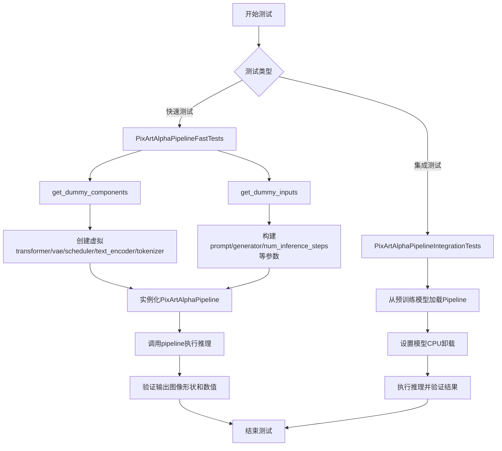
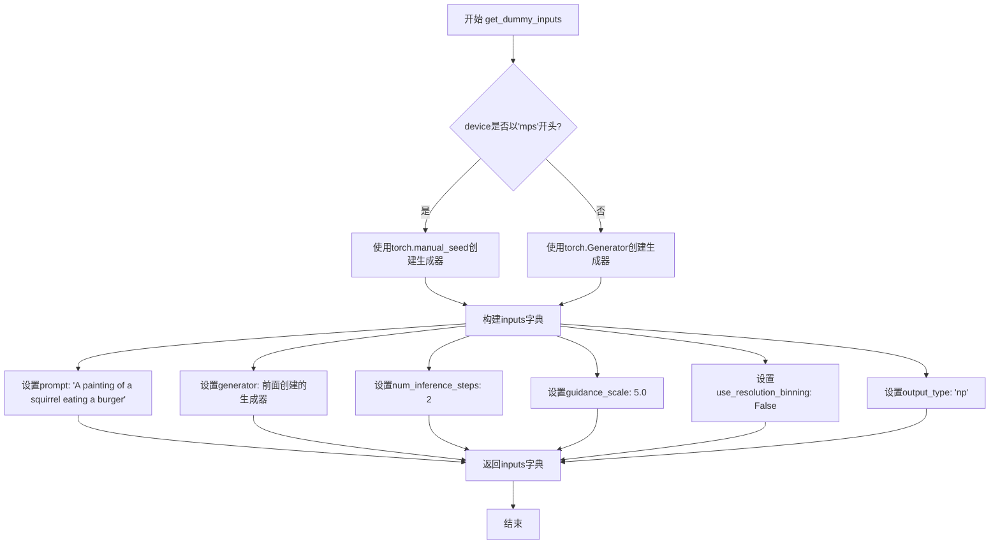
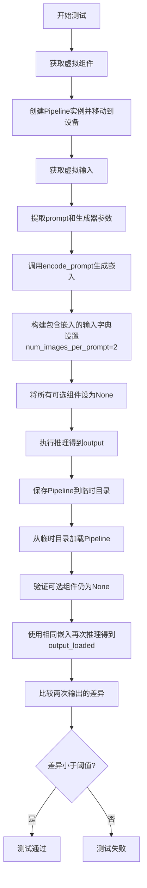
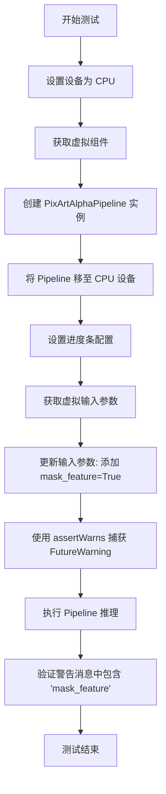
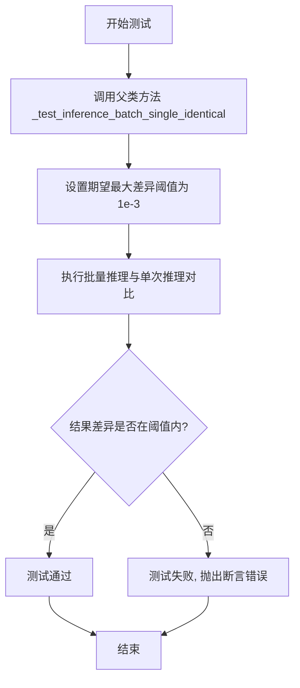
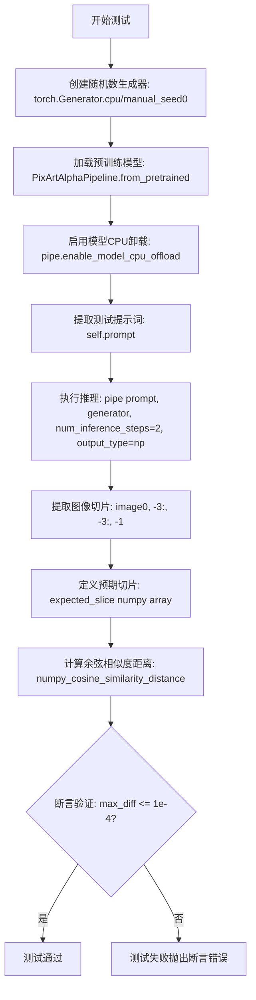
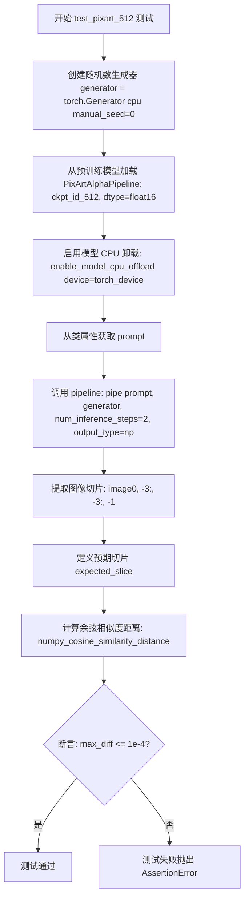
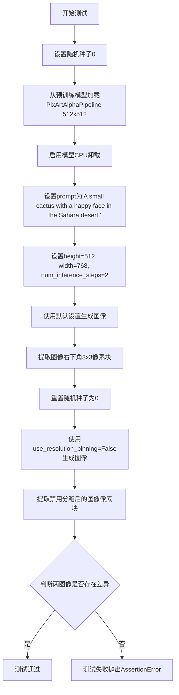
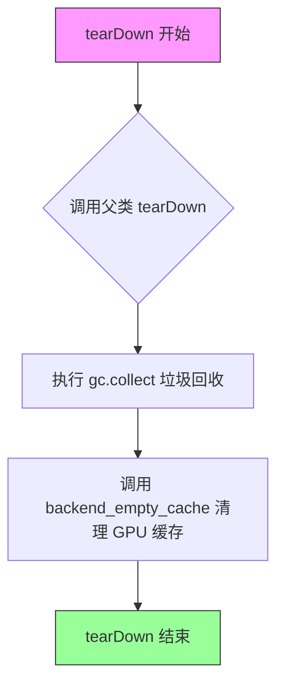
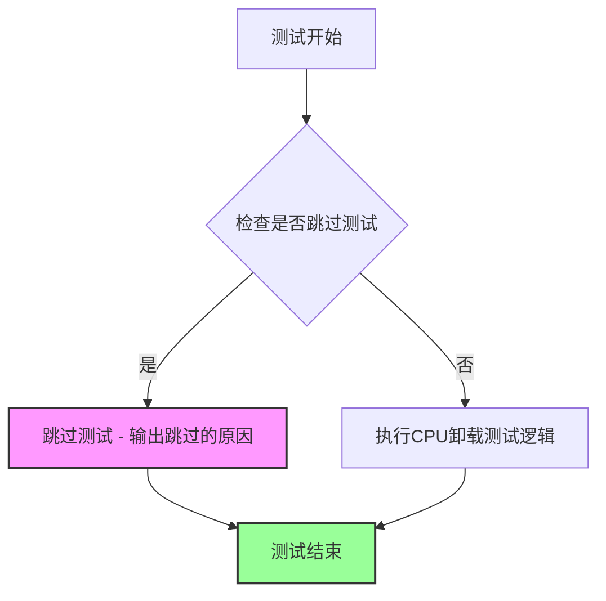

# `diffusers\tests\pipelines\pixart_alpha\test_pixart.py` 详细设计文档

这是一个PixArt Alpha图像生成Pipeline的单元测试和集成测试文件，包含了快速测试用例和集成测试用例，用于验证pipeline的推理功能、参数处理、多图像生成、模型保存加载等核心功能。

## 整体流程



## 类结构

```
unittest.TestCase (基类)
├── PipelineTesterMixin (混入类)
│   └── PixArtAlphaPipelineFastTests
│       ├── get_dummy_components()
│       ├── get_dummy_inputs()
│       ├── test_inference()
│       ├── test_inference_non_square_images()
│       ├── test_inference_with_embeddings_and_multiple_images()
│       ├── test_inference_with_multiple_images_per_prompt()
│       ├── test_raises_warning_for_mask_feature()
│       └── test_inference_batch_single_identical()
└── unittest.TestCase
    └── PixArtAlphaPipelineIntegrationTests
        ├── setUp()
        ├── tearDown()
        ├── test_pixart_1024()
        ├── test_pixart_512()
        ├── test_pixart_1024_without_resolution_binning()
        └── test_pixart_512_without_resolution_binning()
```

## 全局变量及字段


### `enable_full_determinism`
    
全局函数调用，用于启用完全确定性执行以确保测试可复现

类型：`function`
    


### `PixArtAlphaPipelineFastTests.pipeline_class`
    
pipeline类引用，指向被测试的PixArtAlphaPipeline类

类型：`type[PixArtAlphaPipeline]`
    


### `PixArtAlphaPipelineFastTests.params`
    
推理参数集合，包含文本到图像生成所需的可调参数（移除了cross_attention_kwargs）

类型：`set`
    


### `PixArtAlphaPipelineFastTests.batch_params`
    
批量参数集合，包含批处理生成时所需的参数

类型：`set`
    


### `PixArtAlphaPipelineFastTests.image_params`
    
图像参数集合，包含图像生成相关的配置参数

类型：`set`
    


### `PixArtAlphaPipelineFastTests.image_latents_params`
    
图像潜在向量参数，用于处理潜在空间表示的参数集合

类型：`set`
    


### `PixArtAlphaPipelineFastTests.required_optional_params`
    
必需的可选参数集合，定义哪些参数是可选但推荐使用的

类型：`tuple`
    


### `PixArtAlphaPipelineFastTests.test_layerwise_casting`
    
标志位，控制是否测试分层类型转换功能

类型：`bool`
    


### `PixArtAlphaPipelineFastTests.test_group_offloading`
    
标志位，控制是否测试模型分组卸载功能

类型：`bool`
    


### `PixArtAlphaPipelineIntegrationTests.ckpt_id_1024`
    
1024分辨率预训练模型检查点标识符，用于加载高清模型权重

类型：`str`
    


### `PixArtAlphaPipelineIntegrationTests.ckpt_id_512`
    
512分辨率预训练模型检查点标识符，用于加载标准分辨率模型权重

类型：`str`
    


### `PixArtAlphaPipelineIntegrationTests.prompt`
    
集成测试用的提示词文本，用于生成测试图像

类型：`str`
    
    

## 全局函数及方法


### `PixArtAlphaPipelineFastTests.get_dummy_components`

该方法用于创建虚拟的 PixArtAlphaPipeline 组件（包括 transformer、VAE、scheduler、text_encoder 和 tokenizer），以便在单元测试中快速初始化 pipeline 进行推理测试，无需加载真实的预训练模型权重。

参数：该方法无显式参数（隐式参数为 `self`，代表 `PixArtAlphaPipelineFastTests` 实例）

返回值：`Dict[str, Any]`，返回一个字典，包含以下键值对：
- `"transformer"`：`PixArtTransformer2DModel` 实例，虚拟的 Transformer 模型
- `"vae"`：`AutoencoderKL` 实例，虚拟的 VAE 模型
- `"scheduler"`：`DDIMScheduler` 实例，虚拟的调度器
- `"text_encoder"`：`T5EncoderModel` 实例，虚拟的文本编码器
- `"tokenizer"`：`AutoTokenizer` 实例，虚拟的分词器

#### 流程图

```mermaid
flowchart TD
    A[开始 get_dummy_components] --> B[设置随机种子 torch.manual_seed(0)]
    B --> C[创建 PixArtTransformer2DModel]
    C --> D[创建 AutoencoderKL]
    D --> E[创建 DDIMScheduler]
    E --> F[加载 T5EncoderModel 预训练模型]
    F --> G[加载 AutoTokenizer 预训练模型]
    G --> H[构建组件字典]
    H --> I[返回 components 字典]
    
    style A fill:#f9f,color:#000
    style I fill:#9f9,color:#000
```

#### 带注释源码

```python
def get_dummy_components(self):
    """
    创建虚拟的 PixArtAlphaPipeline 组件，用于单元测试。
    无需加载真实的预训练权重，加速测试执行。
    """
    # 设置随机种子，确保测试结果可复现
    torch.manual_seed(0)
    
    # 创建虚拟 Transformer 模型
    # 参数sample_size: 输入图像的空间尺寸
    # 参数num_layers: Transformer 层数
    # 参数patch_size: 图像分块大小
    # 参数attention_head_dim: 注意力头维度
    # 参数num_attention_heads: 注意力头数量
    # 参数caption_channels:  caption 特征通道数
    # 参数in_channels: 输入通道数
    # 参数cross_attention_dim: 交叉注意力维度
    # 参数out_channels: 输出通道数
    # 参数attention_bias: 是否使用注意力偏置
    # 参数activation_fn: 激活函数类型
    # 参数num_embeds_ada_norm: AdaNorm 嵌入数
    # 参数norm_type: 归一化类型
    # 参数norm_elementwise_affine: 是否使用元素级仿射
    # 参数norm_eps: 归一化 epsilon 值
    transformer = PixArtTransformer2DModel(
        sample_size=8,
        num_layers=2,
        patch_size=2,
        attention_head_dim=8,
        num_attention_heads=3,
        caption_channels=32,
        in_channels=4,
        cross_attention_dim=24,
        out_channels=8,
        attention_bias=True,
        activation_fn="gelu-approximate",
        num_embeds_ada_norm=1000,
        norm_type="ada_norm_single",
        norm_elementwise_affine=False,
        norm_eps=1e-6,
    )
    
    # 再次设置随机种子，确保 VAE 与 Transformer 使用相同的种子
    torch.manual_seed(0)
    
    # 创建虚拟 VAE 模型（使用默认配置）
    vae = AutoencoderKL()
    
    # 创建虚拟调度器（DDIM 调度器）
    scheduler = DDIMScheduler()
    
    # 加载虚拟 T5 文本编码器（使用 tiny-random-t5 预训练模型）
    # hf-internal-testing/tiny-random-t5 是一个轻量级测试模型
    text_encoder = T5EncoderModel.from_pretrained("hf-internal-testing/tiny-random-t5")
    
    # 加载虚拟分词器（与 text_encoder 配套）
    tokenizer = AutoTokenizer.from_pretrained("hf-internal-testing/tiny-random-t5")
    
    # 将所有组件组装为字典
    # eval() 模式将模型设置为推理模式，禁用 dropout 等训练层
    components = {
        "transformer": transformer.eval(),
        "vae": vae.eval(),
        "scheduler": scheduler,
        "text_encoder": text_encoder,
        "tokenizer": tokenizer,
    }
    
    # 返回组件字典，用于实例化 PixArtAlphaPipeline
    return components
```


### `PixArtAlphaPipelineFastTests.get_dummy_inputs`

该方法用于创建虚拟输入字典，为PixArtAlphaPipeline的单元测试提供标准化的测试参数，包括提示词、生成器、推理步数、引导比例等关键配置，确保测试的可重复性和一致性。

参数：

- `self`：隐式参数，PixArtAlphaPipelineFastTests的实例方法调用所需的类实例引用
- `device`：`str` 或 `torch.device`，目标计算设备，用于创建PyTorch随机数生成器，若设备为"mps"则使用特殊处理
- `seed`：`int`，随机种子值，默认值为0，用于确保测试结果的可重复性

返回值：`Dict[str, Any]`，包含虚拟输入参数的字典，键包括prompt（提示词）、generator（生成器）、num_inference_steps（推理步数）、guidance_scale（引导比例）、use_resolution_binning（分辨率绑定开关）、output_type（输出类型）

#### 流程图



#### 带注释源码

```python
def get_dummy_inputs(self, device, seed=0):
    # 判断设备类型，如果是Apple Silicon MPS设备则使用特殊的随机种子方式
    # 这是因为MPS后端在某些版本中对Generator的支持有限
    if str(device).startswith("mps"):
        # 对于MPS设备，直接使用torch.manual_seed设置全局随机种子
        generator = torch.manual_seed(seed)
    else:
        # 对于其他设备（CPU/CUDA），创建指定设备的PyTorch生成器
        # Generator对象可以确保随机过程可精确重现
        generator = torch.Generator(device=device).manual_seed(seed)
    
    # 构建虚拟输入字典，包含PixArtAlphaPipeline所需的全部测试参数
    inputs = {
        "prompt": "A painting of a squirrel eating a burger",  # 测试用提示词
        "generator": generator,  # 随机生成器，确保扩散过程可重现
        "num_inference_steps": 2,  # 扩散模型推理步数，较低值加快测试速度
        "guidance_scale": 5.0,  # Classifier-free guidance强度，影响生成质量
        "use_resolution_binning": False,  # 是否启用分辨率绑定（测试时关闭）
        "output_type": "np",  # 输出类型为numpy数组，便于断言验证
    }
    return inputs  # 返回包含所有测试参数的字典
```

### 关键组件信息

| 组件名称 | 一句话描述 |
|---------|-----------|
| `PixArtAlphaPipelineFastTests` | PixArtAlphaPipeline的单元测试类，封装了管道各项功能的测试方法 |
| `get_dummy_components` | 配合get_dummy_inputs的辅助方法，创建测试所需的虚拟模型组件 |
| `torch.Generator` | PyTorch随机数生成器，用于控制扩散采样过程的随机性 |
| `torch.manual_seed` | 全局随机种子设置函数，用于MPS设备的兼容性处理 |

### 潜在的技术债务或优化空间

1. **MPS设备兼容性处理**：当前代码对MPS设备使用`torch.manual_seed`而非`Generator`对象，这可能导致MPS设备上的测试行为与其他设备不一致，建议统一使用Generator接口或添加注释说明原因
2. **硬编码的测试参数**：提示词、推理步数、引导比例等参数直接硬编码在方法内，若需要测试不同场景可能需要修改源码，可考虑参数化或配置化
3. **缺少完整的输入验证**：方法未对输入参数进行有效性检查，如device为None或seed为负数等情况

### 其它项目

**设计目标与约束**：
- 该方法的设计目标是为单元测试提供一致、可重现的输入参数
- 约束条件包括：必须支持CPU、CUDA和MPS三种设备类型，测试必须在合理时间内完成（num_inference_steps=2）

**错误处理与异常设计**：
- 当前方法未包含显式的错误处理逻辑
- 对于无效的device参数，可能在创建Generator时抛出异常
- 建议在实际调用前确保device参数合法

**数据流与状态机**：
- 该方法是测试数据准备阶段的核心组件
- 数据流：device/seed → 生成器创建 → 输入字典构建 → 返回供pipeline调用
- 不涉及状态机或复杂的状态管理

**外部依赖与接口契约**：
- 依赖PyTorch的`torch.manual_seed`和`torch.Generator`
- 返回字典的键值直接对应`PixArtAlphaPipeline.__call__`方法的参数名称
- 与diffusers库的Pipeline接口契约保持一致


### `PixArtAlphaPipelineFastTests.test_inference`

验证 PixArtAlphaPipeline 的基本推理功能，确保输出图像的形状和数值符合预期。

参数：

-  `self`：`PixArtAlphaPipelineFastTests` 实例，unittest 测试类的隐式参数

返回值：无（`None`），该方法为单元测试方法，通过断言验证而非返回值

#### 流程图

```mermaid
flowchart TD
    A[开始测试] --> B[设置设备为 CPU]
    B --> C[获取虚拟组件: get_dummy_components]
    C --> D[使用组件初始化管道: PixArtAlphaPipeline]
    D --> E[将管道移至 CPU 设备]
    E --> F[配置进度条: set_progress_bar_config]
    F --> G[获取测试输入: get_dummy_inputs]
    G --> H[执行推理: pipe(**inputs)]
    H --> I[提取输出图像]
    I --> J[提取图像切片: image[0, -3:, -3:, -1]]
    J --> K{断言: image.shape == (1, 8, 8, 3)}
    K -->|通过| L[定义期望数值: expected_slice]
    L --> M[计算最大差异: max_diff]
    M --> N{断言: max_diff <= 1e-3}
    N -->|通过| O[测试通过]
    N -->|失败| P[抛出 AssertionError]
    K -->|失败| P
```

#### 带注释源码

```python
def test_inference(self):
    """验证 PixArtAlphaPipeline 基本推理功能，输出图像形状和数值正确性"""
    
    # 1. 设置测试设备为 CPU
    device = "cpu"

    # 2. 获取虚拟组件（transformer, vae, scheduler, text_encoder, tokenizer）
    components = self.get_dummy_components()
    
    # 3. 使用虚拟组件实例化 PixArtAlphaPipeline
    pipe = self.pipeline_class(**components)
    
    # 4. 将管道移至指定设备（CPU）
    pipe.to(device)
    
    # 5. 配置进度条（disable=None 表示不禁用）
    pipe.set_progress_bar_config(disable=None)

    # 6. 获取测试输入参数（包含 prompt, generator, num_inference_steps 等）
    inputs = self.get_dummy_inputs(device)
    
    # 7. 执行推理，获取生成的图像
    # pipe(**inputs) 返回包含 'images' 键的输出对象
    image = pipe(**inputs).images
    
    # 8. 提取图像切片用于数值验证
    # 取第一张图像的最后 3x3 像素区域，RGB 通道
    image_slice = image[0, -3:, -3:, -1]

    # 9. 断言验证图像形状为 (1, 8, 8, 3)
    # 形状含义: (batch_size=1, height=8, width=8, channels=3)
    self.assertEqual(image.shape, (1, 8, 8, 3))
    
    # 10. 定义期望的像素数值（预先计算的标准值）
    expected_slice = np.array([
        0.6319, 0.3526, 0.3806, 
        0.6327, 0.4639, 0.483, 
        0.2583, 0.5331, 0.4852
    ])
    
    # 11. 计算实际输出与期望值的最大差异
    max_diff = np.abs(image_slice.flatten() - expected_slice).max()
    
    # 12. 断言验证数值差异在容许范围内（1e-3）
    self.assertLessEqual(max_diff, 1e-3)
```


### `PixArtAlphaPipelineFastTests.test_inference_non_square_images`

该测试方法验证 PixArtAlphaPipeline 在处理非方形图像（32x48）时的推理功能，检查管道能否正确处理不同分辨率的图像生成，并通过断言确保输出图像的形状和像素值符合预期。

参数：

- `self`：隐式参数，测试类实例本身

返回值：`None`，该方法为测试方法，无返回值，通过断言验证推理结果的正确性

#### 流程图

```mermaid
flowchart TD
    A[开始测试] --> B[设置设备为CPU]
    B --> C[获取虚拟组件: get_dummy_components]
    C --> D[创建PixArtAlphaPipeline管道实例]
    D --> E[将管道移至CPU设备]
    E --> F[禁用进度条显示]
    F --> G[获取虚拟输入: get_dummy_inputs]
    G --> H[调用管道进行推理<br/>传入height=32, width=48参数]
    H --> I[提取生成的图像]
    I --> J[获取图像右下角3x3像素块]
    J --> K{断言图像形状是否为<br/>(1, 32, 48, 3)}
    K -->|是| L[定义期望的像素值数组]
    L --> M{断言像素差异是否<br/>小于等于1e-3}
    M -->|是| N[测试通过]
    M -->|否| O[测试失败-抛出异常]
    K -->|否| O
```

#### 带注释源码

```python
def test_inference_non_square_images(self):
    """测试非方形图像(32x48)的推理和分辨率处理"""
    
    # 1. 设置测试设备为CPU
    device = "cpu"

    # 2. 获取虚拟模型组件（transformer, vae, scheduler, text_encoder, tokenizer）
    components = self.get_dummy_components()
    
    # 3. 使用虚拟组件初始化PixArtAlphaPipeline管道
    pipe = self.pipeline_class(**components)
    
    # 4. 将管道移至指定设备(CPU)
    pipe.to(device)
    
    # 5. 配置进度条（disable=None表示不禁用）
    pipe.set_progress_bar_config(disable=None)

    # 6. 获取虚拟输入参数（包含prompt, generator, num_inference_steps等）
    inputs = self.get_dummy_inputs(device)
    
    # 7. 执行推理，传入非方形图像尺寸参数height=32, width=48
    #    并获取生成的图像结果
    image = pipe(**inputs, height=32, width=48).images
    
    # 8. 提取生成图像的第一个样本的右下角3x3像素块用于验证
    image_slice = image[0, -3:, -3:, -1]
    
    # 9. 断言验证：输出图像形状必须为(1, 32, 48, 3)
    #    批次大小=1, 高度=32, 宽度=48, RGB通道=3
    self.assertEqual(image.shape, (1, 32, 48, 3))

    # 10. 定义期望的像素值（来自已知正确输出的参考值）
    expected_slice = np.array([0.6493, 0.537, 0.4081, 0.4762, 0.3695, 0.4711, 0.3026, 0.5218, 0.5263])
    
    # 11. 计算实际输出与期望输出的最大差异
    max_diff = np.abs(image_slice.flatten() - expected_slice).max()
    
    # 12. 断言验证：最大差异必须小于等于1e-3（允许微小浮点误差）
    self.assertLessEqual(max_diff, 1e-3)
```


### `test_inference_with_embeddings_and_multiple_images`

该测试方法验证了PixArtAlphaPipeline使用预计算的prompt嵌入（embeddings）进行推理并生成多个图像的能力，同时测试了pipeline的保存/加载功能以及可选组件的正确处理。

参数：

- `self`：`PixArtAlphaPipelineFastTests`，测试类实例本身

返回值：`None`，该方法为单元测试方法，通过断言验证功能正确性，不返回具体数值

#### 流程图



#### 带注释源码

```python
def test_inference_with_embeddings_and_multiple_images(self):
    """
    测试使用预计算嵌入和多图像生成的推理功能
    
    验证点：
    1. 可以使用预计算的prompt embeddings进行推理
    2. 可以生成多个图像(num_images_per_prompt=2)
    3. Pipeline可以正确保存和加载
    4. 加载后的pipeline使用相同嵌入能产生一致结果
    5. 可选组件在保存/加载后保持为None
    """
    # 步骤1: 获取虚拟组件用于测试
    components = self.get_dummy_components()
    
    # 步骤2: 创建pipeline实例并配置设备
    pipe = self.pipeline_class(**components)
    pipe.to(torch_device)
    pipe.set_progress_bar_config(disable=None)  # 禁用进度条以便测试输出

    # 步骤3: 获取测试输入
    inputs = self.get_dummy_inputs(torch_device)

    # 步骤4: 解包所需参数
    prompt = inputs["prompt"]
    generator = inputs["generator"]
    num_inference_steps = inputs["num_inference_steps"]
    output_type = inputs["output_type"]

    # 步骤5: 预先编码prompt为embeddings
    # 返回: prompt_embeds, prompt_attn_mask, negative_prompt_embeds, neg_prompt_attn_mask
    prompt_embeds, prompt_attn_mask, negative_prompt_embeds, neg_prompt_attn_mask = pipe.encode_prompt(prompt)

    # 步骤6: 构建使用embeddings的输入字典
    # 注意：这里直接传入embeddings而非原始prompt
    inputs = {
        "prompt_embeds": prompt_embeds,              # 预计算的prompt嵌入
        "prompt_attention_mask": prompt_attn_mask,   # Prompt注意力掩码
        "negative_prompt": None,                     # 无负向prompt
        "negative_prompt_embeds": negative_prompt_embeds,  # 负向prompt嵌入
        "negative_prompt_attention_mask": neg_prompt_attn_mask,  # 负向注意力掩码
        "generator": generator,                      # 随机生成器用于 reproducibility
        "num_inference_steps": num_inference_steps,  # 推理步数
        "output_type": output_type,                 # 输出类型(np/pt)
        "num_images_per_prompt": 2,                  # 每个prompt生成2张图像
        "use_resolution_binning": False,            # 禁用分辨率分箱
    }

    # 步骤7: 设置所有可选组件为None（测试它们的处理）
    for optional_component in pipe._optional_components:
        setattr(pipe, optional_component, None)

    # 步骤8: 执行第一次推理
    output = pipe(**inputs)[0]  # [0]获取图像数组

    # 步骤9: 测试pipeline的保存和加载功能
    with tempfile.TemporaryDirectory() as tmpdir:
        pipe.save_pretrained(tmpdir)  # 保存到临时目录
        pipe_loaded = self.pipeline_class.from_pretrained(tmpdir)  # 从磁盘加载
        pipe_loaded.to(torch_device)
        pipe_loaded.set_progress_bar_config(disable=None)

    # 步骤10: 验证可选组件在加载后仍为None
    for optional_component in pipe._optional_components:
        self.assertTrue(
            getattr(pipe_loaded, optional_component) is None,
            f"`{optional_component}` did not stay set to None after loading.",
        )

    # 步骤11: 使用相同的embeddings对加载后的pipeline进行推理
    inputs = self.get_dummy_inputs(torch_device)

    generator = inputs["generator"]
    num_inference_steps = inputs["num_inference_steps"]
    output_type = inputs["output_type"]

    # 重新构建输入（使用之前生成的embeddings）
    inputs = {
        "prompt_embeds": prompt_embeds,
        "prompt_attention_mask": prompt_attn_mask,
        "negative_prompt": None,
        "negative_prompt_embeds": negative_prompt_embeds,
        "negative_prompt_attention_mask": neg_prompt_attn_mask,
        "generator": generator,
        "num_inference_steps": num_inference_steps,
        "output_type": output_type,
        "num_images_per_prompt": 2,
        "use_resolution_binning": False,
    }

    output_loaded = pipe_loaded(**inputs)[0]

    # 步骤12: 验证两次推理结果的一致性
    # 使用numpy数组计算最大差异
    max_diff = np.abs(to_np(output) - to_np(output_loaded)).max()
    self.assertLess(max_diff, 1e-4)  # 差异必须小于0.0001
```


### `PixArtAlphaPipelineFastTests.test_inference_with_multiple_images_per_prompt`

该测试方法用于验证 PixArtAlphaPipeline 在设置 `num_images_per_prompt=2` 时能够正确为每个提示生成多张图像，并通过对比生成图像的像素值与预期值来确保图像生成功能的正确性。

参数：

- `self`：无类型，表示类的实例本身，测试类 PixArtAlphaPipelineFastTests 的实例

返回值：`None`，该方法为测试方法，通过 unittest 断言验证功能，不返回任何值

#### 流程图

```mermaid
flowchart TD
    A[开始测试] --> B[设置设备为 CPU]
    B --> C[获取虚拟组件: get_dummy_components]
    C --> D[创建 PixArtAlphaPipeline 实例]
    D --> E[将 Pipeline 移动到 CPU 设备]
    E --> F[配置进度条: disable=None]
    F --> G[获取虚拟输入: get_dummy_inputs]
    G --> H[设置 num_images_per_prompt=2]
    H --> I[执行 Pipeline 推理]
    I --> J[提取图像切片: image[0, -3:, -3:, -1]]
    J --> K[断言图像形状为 (2, 8, 8, 3)]
    K --> L[定义预期像素值数组]
    L --> M[计算最大差异]
    M --> N{最大差异 <= 1e-3?}
    N -->|是| O[测试通过]
    N -->|否| P[测试失败]
```

#### 带注释源码

```python
def test_inference_with_multiple_images_per_prompt(self):
    """
    测试当 num_images_per_prompt > 1 时，Pipeline 是否能正确生成多张图像
    """
    # 设置测试设备为 CPU
    device = "cpu"

    # 获取用于测试的虚拟组件（transformer, vae, scheduler, text_encoder, tokenizer）
    components = self.get_dummy_components()
    
    # 使用虚拟组件初始化 PixArtAlphaPipeline
    pipe = self.pipeline_class(**components)
    
    # 将 Pipeline 移动到指定设备（CPU）
    pipe.to(device)
    
    # 配置进度条，disable=None 表示不禁用进度条
    pipe.set_progress_bar_config(disable=None)

    # 获取虚拟输入参数（包含 prompt, generator, num_inference_steps 等）
    inputs = self.get_dummy_inputs(device)
    
    # 关键参数：设置每个提示生成 2 张图像
    inputs["num_images_per_prompt"] = 2
    
    # 执行推理并获取生成的图像
    # pipe(**inputs) 返回包含 'images' 键的输出字典
    image = pipe(**inputs).images
    
    # 提取第一张图像的右下角 3x3 像素区域用于验证
    # image 形状为 (batch, height, width, channels)
    image_slice = image[0, -3:, -3:, -1]

    # 断言验证：生成的图像数量应为 2，尺寸应为 8x8，通道数为 3（RGB）
    self.assertEqual(image.shape, (2, 8, 8, 3))
    
    # 定义预期的像素值切片（用于确定性验证）
    expected_slice = np.array([0.6319, 0.3526, 0.3806, 0.6327, 0.4639, 0.483, 0.2583, 0.5331, 0.4852])
    
    # 计算实际像素值与预期值的最大差异
    max_diff = np.abs(image_slice.flatten() - expected_slice).max()
    
    # 断言验证：最大差异应小于等于 1e-3，确保图像生成质量
    self.assertLessEqual(max_diff, 1e-3)
```


### `PixArtAlphaPipelineFastTests.test_raises_warning_for_mask_feature`

该测试方法用于验证 PixArtAlphaPipeline 在使用已废弃的 `mask_feature` 参数时是否正确触发 FutureWarning 警告，确保用户收到关于该参数即将被移除的提醒。

参数：

- `self`：`unittest.TestCase`，测试类的实例本身，无需显式传递

返回值：`None`，测试方法无返回值，通过断言验证警告行为

#### 流程图



#### 带注释源码

```python
def test_raises_warning_for_mask_feature(self):
    """
    测试当使用 mask_feature 参数时是否产生 FutureWarning 警告。
    该测试确保废弃的参数能够正确触发警告机制。
    """
    # 设置测试设备为 CPU
    device = "cpu"

    # 获取用于测试的虚拟组件（transformer, vae, scheduler, text_encoder, tokenizer）
    components = self.get_dummy_components()
    
    # 使用虚拟组件实例化 PixArtAlphaPipeline
    pipe = self.pipeline_class(**components)
    
    # 将 Pipeline 移至 CPU 设备
    pipe.to(device)
    
    # 配置进度条（disable=None 表示不禁用）
    pipe.set_progress_bar_config(disable=None)

    # 获取虚拟输入参数（包含 prompt, generator, num_inference_steps 等）
    inputs = self.get_dummy_inputs(device)
    
    # 更新输入参数，添加已废弃的 mask_feature=True 参数
    inputs.update({"mask_feature": True})

    # 使用 assertWarns 上下文管理器捕获 FutureWarning 类型的警告
    with self.assertWarns(FutureWarning) as warning_ctx:
        # 执行 Pipeline 推理，传入包含废弃参数的输入
        _ = pipe(**inputs).images

    # 断言验证捕获的警告消息中包含 'mask_feature' 字符串
    # 确保警告确实是由 mask_feature 参数触发的
    assert "mask_feature" in str(warning_ctx.warning)
```


### `PixArtAlphaPipelineFastTests.test_inference_batch_single_identical`

该方法用于验证批量推理（batch inference）与单次推理（single inference）的结果一致性，确保在生成多张图像时，每张图像的结果与单独生成该图像的结果相同。

参数：

- `self`：`PixArtAlphaPipelineFastTests` 实例，表示当前测试类实例

返回值：`None`，无返回值（通过测试框架的断言来验证一致性）

#### 流程图



#### 带注释源码

```python
def test_inference_batch_single_identical(self):
    """
    测试批量推理与单次推理的结果一致性。
    
    该方法调用父类 PipelineTesterMixin 提供的 _test_inference_batch_single_identical 方法，
    验证当使用 num_images_per_prompt > 1 时，批量生成的图像与逐个生成的图像结果是否一致。
    这是一个重要的回归测试，确保批量处理不会引入数值误差。
    
    参数:
        self: PixArtAlphaPipelineFastTests 实例
    
    返回值:
        None (通过 unittest 断言验证)
    
    异常:
        AssertionError: 当批量推理与单次推理结果差异超过 expected_max_diff 时抛出
    """
    # 调用父类测试方法，设置最大允许差异为 1e-3
    # 父类方法会:
    # 1. 使用相同的随机种子分别进行批量推理和多次单次推理
    # 2. 对比两组结果的差异
    # 3. 如果差异超过阈值则抛出断言错误
    self._test_inference_batch_single_identical(expected_max_diff=1e-3)
```

> **注意**: 由于该方法的具体实现逻辑在父类 `PipelineTesterMixin` 中（未在当前代码文件中提供），上述流程图和源码注释基于测试框架的标准实现模式进行推断。该测试的核心目标是确保扩散 pipeline 在批量生成图像时保持数值一致性。


### `PixArtAlphaPipelineIntegrationTests.test_pixart_1024`

该测试方法用于验证 PixArt-XL-2-1024-MS 预训练模型在1024分辨率下的文本到图像生成推理功能。通过加载模型、执行推理并与预期图像切片进行余弦相似度比较，确保模型输出的正确性。

参数：

- `self`：`PixArtAlphaPipelineIntegrationTests`，测试类实例，隐含参数

返回值：`None`，该方法为单元测试方法，通过 `self.assertLessEqual` 断言验证推理结果是否符合预期

#### 流程图



#### 带注释源码

```python
def test_pixart_1024(self):
    # 创建CPU上的随机数生成器，设置种子为0以确保可复现性
    generator = torch.Generator("cpu").manual_seed(0)

    # 从预训练模型加载 PixArtAlphaPipeline，使用 float16 精度
    # ckpt_id_1024 = "PixArt-alpha/PixArt-XL-2-1024-MS"
    pipe = PixArtAlphaPipeline.from_pretrained(self.ckpt_id_1024, torch_dtype=torch.float16)
    
    # 启用模型CPU卸载，将模型合理分配到CPU上以节省显存
    pipe.enable_model_cpu_offload(device=torch_device)
    
    # 获取测试提示词
    # prompt = "A small cactus with a happy face in the Sahara desert."
    prompt = self.prompt

    # 执行推理：传入提示词、随机生成器、推理步数为2、输出类型为numpy数组
    # 返回的 images 形状为 (batch_size, height, width, channels)
    image = pipe(prompt, generator=generator, num_inference_steps=2, output_type="np").images

    # 提取生成的图像右下角3x3像素块，形状为 (3, 3, 3)
    # 取第一个样本的第一通道（最后一维）的像素值
    image_slice = image[0, -3:, -3:, -1]
    
    # 预期的图像切片值（预先计算好的基准值）
    expected_slice = np.array([0.0742, 0.0835, 0.2114, 0.0295, 0.0784, 0.2361, 0.1738, 0.2251, 0.3589])

    # 计算生成图像与预期图像之间的余弦相似度距离
    # 距离越小表示图像越相似
    max_diff = numpy_cosine_similarity_distance(image_slice.flatten(), expected_slice)
    
    # 断言：最大余弦相似度距离应小于等于 1e-4
    # 如果不满足则测试失败
    self.assertLessEqual(max_diff, 1e-4)
```


### `PixArtAlphaPipelineIntegrationTests.test_pixart_512`

该方法用于验证 PixArt-alpha/PixArt-XL-2-512x512 预训练模型在512分辨率下的推理能力，通过加载预训练模型、执行文本到图像的生成推理，并将生成的图像切片与预期结果进行余弦相似度比较，以确保模型输出的正确性。

参数：（该方法为类方法，无显式参数，依赖于类属性和 unittest.TestCase 的隐式参数）

- 继承自 `unittest.TestCase` 的隐式参数 `self`：测试用例实例，包含以下关键属性：
  - `self.ckpt_id_512`：str，模型检查点标识符，值为 `"PixArt-alpha/PixArt-XL-2-512x512"`
  - `self.prompt`：str，文本提示词，值为 `"A small cactus with a happy face in the Sahara desert."`

返回值：无显式返回值（通过 `self.assertLessEqual` 进行断言验证，测试通过则无异常）

#### 流程图



#### 带注释源码

```python
def test_pixart_512(self):
    """
    验证 512 分辨率预训练模型的推理能力
    使用 PixArt-alpha/PixArt-XL-2-512x512 模型进行文本到图像生成，
    并与预期输出进行余弦相似度对比
    """
    # 步骤 1: 创建随机数生成器，确保测试可复现
    # 使用 CPU 设备，手动设置种子为 0
    generator = torch.Generator("cpu").manual_seed(0)

    # 步骤 2: 从预训练模型加载 PixArtAlphaPipeline
    # ckpt_id_512 = "PixArt-alpha/PixArt-XL-2-512x512"
    # 使用 float16 精度以加速推理并减少内存占用
    pipe = PixArtAlphaPipeline.from_pretrained(self.ckpt_id_512, torch_dtype=torch.float16)

    # 步骤 3: 启用模型 CPU 卸载
    # 将模型卸载到 CPU 以节省 GPU 显存，适用于显存有限的场景
    # torch_device 是测试工具提供的设备标识
    pipe.enable_model_cpu_offload(device=torch_device)

    # 步骤 4: 获取文本提示词
    # 从类属性获取提示词："A small cactus with a happy face in the Sahara desert."
    prompt = self.prompt

    # 步骤 5: 执行推理生成图像
    # 参数说明：
    #   - prompt: 文本提示
    #   - generator: 随机数生成器，确保输出可复现
    #   - num_inference_steps: 推理步数，设为 2（快速测试）
    #   - output_type: 输出类型为 numpy 数组
    # 返回值包含多个字段，.images 获取图像数组
    image = pipe(prompt, generator=generator, num_inference_steps=2, output_type="np").images

    # 步骤 6: 提取图像切片用于验证
    # 取第一张图像的右下角 3x3 像素区域
    # image 形状为 (1, 512, 512, 3)，取 [0, -3:, -3:, -1] 得到 (3, 3, 3)
    image_slice = image[0, -3:, -3:, -1]

    # 步骤 7: 定义预期输出切片
    # 这是预先计算的正确输出，用于对比验证
    expected_slice = np.array([0.3477, 0.3882, 0.4541, 0.3413, 0.3821, 0.4463, 0.4001, 0.4409, 0.4958])

    # 步骤 8: 计算生成图像与预期图像的余弦相似度距离
    # 将 3x3x3 的切片展平为 27 维向量进行计算
    max_diff = numpy_cosine_similarity_distance(image_slice.flatten(), expected_slice)

    # 步骤 9: 断言验证
    # 余弦相似度距离应小于等于 1e-4，确保输出精度符合预期
    self.assertLessEqual(max_diff, 1e-4)
```


### `PixArtAlphaPipelineIntegrationTests.test_pixart_1024_without_resolution_binning`

该测试方法用于验证PixArtAlphaPipeline在禁用分辨率分箱（resolution binning）时的行为差异，通过对比启用和禁用该选项生成的图像切片是否不同，确认分辨率分箱功能对输出产生了实际影响。

参数：

- `self`：`unittest.TestCase`，测试类实例本身，无需显式传递

返回值：`None`，该方法为测试用例，执行断言验证，不返回具体数据

#### 流程图

```mermaid
flowchart TD
    A[开始测试] --> B[设置随机种子 torch.manual_seed(0)]
    B --> C[从预训练模型加载 PixArtAlphaPipeline]
    C --> D[启用模型 CPU offload]
    D --> E[定义提示词和图像尺寸: height=1024, width=768]
    E --> F[首次调用 pipeline 生成图像<br/>使用默认的 resolution_binning]
    F --> G[提取图像右下角 3x3 切片]
    G --> H[重新设置随机种子 torch.manual_seed(0)]
    H --> I[第二次调用 pipeline 生成图像<br/>显式设置 use_resolution_binning=False]
    I --> J[提取禁用分箱后的图像切片]
    J --> K[断言: 两张图像切片不完全相等<br/>np.allclose 返回 False]
    K --> L{断言结果}
    L -->|通过| M[测试通过]
    L -->|失败| N[测试失败: 分箱未产生差异]
```

#### 带注释源码

```python
def test_pixart_1024_without_resolution_binning(self):
    """
    测试函数：验证禁用分辨率分箱时的行为差异
    
    该测试通过对比启用和禁用 resolution_binning 生成的图像，
    确认该配置选项对输出产生了实际影响。
    """
    
    # 步骤1: 设置随机种子，确保可复现性
    generator = torch.manual_seed(0)

    # 步骤2: 加载预训练的 PixArt-XL-2-1024-MS 模型
    # 使用 float16 精度以减少显存占用
    pipe = PixArtAlphaPipeline.from_pretrained(self.ckpt_id_1024, torch_dtype=torch.float16)
    
    # 步骤3: 启用模型 CPU offload，将模型从 GPU 卸载到 CPU
    # 这是一种内存优化技术，适用于显存受限的场景
    pipe.enable_model_cpu_offload(device=torch_device)

    # 步骤4: 定义测试参数
    prompt = self.prompt  # "A small cactus with a happy face in the Sahara desert."
    height, width = 1024, 768  # 非标准分辨率，用于测试分箱机制
    num_inference_steps = 2  # 快速推理，用于测试目的

    # 步骤5: 第一次推理 - 使用默认的 resolution_binning=True
    # 管道会根据某个预设的分辨率网格调整输入尺寸
    image = pipe(
        prompt,
        height=height,
        width=width,
        generator=generator,
        num_inference_steps=num_inference_steps,
        output_type="np",
    ).images
    
    # 步骤6: 提取图像切片用于后续对比
    # 取最后3x3像素区域，取最后一个通道（RGB中的B或透明度）
    image_slice = image[0, -3:, -3:, -1]

    # 步骤7: 重新设置随机种子，确保两次推理的随机因素相同
    generator = torch.manual_seed(0)
    
    # 步骤8: 第二次推理 - 显式禁用 resolution_binning
    # 此时管道会直接使用传入的 1024x768 尺寸，不做分辨率调整
    no_res_bin_image = pipe(
        prompt,
        height=height,
        width=width,
        generator=generator,
        num_inference_steps=num_inference_steps,
        output_type="np",
        use_resolution_binning=False,  # 关键参数：禁用分辨率分箱
    ).images
    
    # 步骤9: 提取禁用分箱后的图像切片
    no_res_bin_image_slice = no_res_bin_image[0, -3:, -3:, -1]

    # 步骤10: 断言验证 - 两次生成的图像应该不同
    # resolution_binning 会将输入分辨率映射到模型支持的分辨率，
    # 禁用后原始分辨率直接使用，因此输出会产生差异
    assert not np.allclose(image_slice, no_res_bin_image_slice, atol=1e-4, rtol=1e-4)
```


### `test_pixart_512_without_resolution_binning`

验证禁用分辨率分箱（resolution binning）时的行为差异。该测试通过比较默认启用分辨率分箱与禁用分辨率分箱生成的图像，确保两者存在差异，从而验证分辨率分箱功能确实对输出产生了影响。

参数：无（该方法为类方法，使用 `self` 访问类属性）

返回值：`None`，该方法为测试用例，无返回值，通过 `assert` 语句验证行为

#### 流程图



#### 带注释源码

```python
def test_pixart_512_without_resolution_binning(self):
    """
    验证禁用分辨率分箱（resolution binning）时的行为差异。
    
    该测试比较启用和禁用分辨率分箱两种情况下生成的图像，
    确保use_resolution_binning参数确实对输出产生了影响。
    """
    # 设置随机种子以确保可重复性
    generator = torch.manual_seed(0)

    # 从预训练模型加载PixArtAlphaPipeline (512x512版本)
    pipe = PixArtAlphaPipeline.from_pretrained(self.ckpt_id_512, torch_dtype=torch.float16)
    # 启用模型CPU卸载以优化内存使用
    pipe.enable_model_cpu_offload(device=torch_device)

    # 测试参数设置
    prompt = self.prompt  # "A small cactus with a happy face in the Sahara desert."
    height, width = 512, 768  # 非正方形图像尺寸
    num_inference_steps = 2  # 推理步数

    # 第一次推理：使用默认的resolution_binning（通常为True）
    image = pipe(
        prompt,
        height=height,
        width=width,
        generator=generator,
        num_inference_steps=num_inference_steps,
        output_type="np",
    ).images
    # 提取生成的图像右下角3x3区域用于比较
    image_slice = image[0, -3:, -3:, -1]

    # 重置随机种子以确保两次推理的随机因素相同
    generator = torch.manual_seed(0)
    # 第二次推理：明确禁用resolution_binning
    no_res_bin_image = pipe(
        prompt,
        height=height,
        width=width,
        generator=generator,
        num_inference_steps=num_inference_steps,
        output_type="np",
        use_resolution_binning=False,  # 禁用分辨率分箱
    ).images
    # 提取对应的图像区域
    no_res_bin_image_slice = no_res_bin_image[0, -3:, -3:, -1]

    # 断言：两种情况下生成的图像应该存在差异
    # 如果图像完全相同（差异小于阈值），则说明resolution_binning参数未生效
    assert not np.allclose(image_slice, no_res_bin_image_slice, atol=1e-4, rtol=1e-4)
```


### `PixArtAlphaPipelineIntegrationTests.setUp`

该方法是 `PixArtAlphaIntegrationTests` 集成测试类的初始化方法，在每个测试方法运行前被调用，用于清理 Python 垃圾回收（GC）和 GPU 缓存，确保测试环境干净，避免因资源残留导致的测试结果不一致。

参数：

- `self`：隐式参数，`PixArtAlphaPipelineIntegrationTests` 实例，代表当前测试类本身。

返回值：`None`，无返回值，仅执行环境清理操作。

#### 流程图

```mermaid
flowchart TD
    A[setUp 方法开始] --> B[调用父类 setUp: super().setUp]
    B --> C[执行 gc.collect 清理 Python 垃圾对象]
    C --> D[调用 backend_empty_cache 清理 GPU/CUDA 缓存]
    D --> E[setUp 方法结束]
    
    style A fill:#f9f,stroke:#333
    style E fill:#9f9,stroke:#333
```

#### 带注释源码

```python
def setUp(self):
    """
    集成测试环境初始化方法，在每个测试方法执行前自动调用。
    负责清理可能残留的 Python 对象和 GPU 内存，确保测试的独立性和可重复性。
    """
    # 1. 调用父类的 setUp 方法，执行 unittest.TestCase 基类的初始化逻辑
    super().setUp()
    
    # 2. 手动触发 Python 垃圾回收，清理已释放但尚未回收的 Python 对象
    #    这有助于释放测试过程中产生的临时对象占用的内存
    gc.collect()
    
    # 3. 调用后端工具函数清理 GPU 缓存（通过 backend_empty_cache 实现）
    #    torch_device 是全局变量，表示当前测试使用的设备（如 'cuda' 或 'cpu'）
    #    此操作确保 GPU 内存得到释放，避免显存泄漏影响后续测试
    backend_empty_cache(torch_device)
```


### `PixArtAlphaPipelineIntegrationTests.tearDown`

该方法是 `PixArtAlphaPipelineIntegrationTests` 集成测试类的清理方法，在每个集成测试执行完成后被自动调用，用于回收Python垃圾内存并清理GPU缓存，以确保测试环境不会因为残留的模型数据和计算图导致内存泄漏。

参数： 无

返回值：`None`，无返回值

#### 流程图



#### 带注释源码

```python
def tearDown(self):
    """
    集成测试后的环境清理方法
    
    该方法在每个测试用例执行完成后自动调用，
    负责清理测试过程中产生的内存占用和GPU缓存。
    """
    # 调用父类的 tearDown 方法，确保父类的清理逻辑也被执行
    super().tearDown()
    
    # 执行 Python 垃圾回收，释放测试过程中创建的无用对象
    gc.collect()
    
    # 清理 GPU/CUDA 缓存，释放显存空间
    # 这对于加载大型模型（如 PixArt）的测试尤为重要
    backend_empty_cache(torch_device)
```


### `PixArtAlphaPipelineFastTests.get_dummy_components`

该方法用于创建 PixArtAlphaPipeline 测试所需的虚拟组件（transformer、vae、scheduler、text_encoder、tokenizer），通过初始化小规模的模型和配置来支持单元测试，避免使用真实的大型预训练模型。

参数：

- （无参数，仅包含隐含的 `self`）

返回值：`dict`，返回包含 PixArtAlphaPipeline 所有必要组件的字典，包括 transformer、vae、scheduler、text_encoder 和 tokenizer

#### 流程图

```mermaid
flowchart TD
    A[开始 get_dummy_components] --> B[设置随机种子 torch.manual_seed(0)]
    B --> C[创建 PixArtTransformer2DModel]
    C --> D[设置随机种子 torch.manual_seed(0)]
    D --> E[创建 AutoencoderKL]
    E --> F[创建 DDIMScheduler]
    F --> G[加载 T5EncoderModel 预训练模型]
    G --> H[加载 AutoTokenizer 分词器]
    H --> I[组装 components 字典]
    I --> J[返回 components]
    
    C -.-> C1[sample_size=8<br/>num_layers=2<br/>patch_size=2<br/>attention_head_dim=8<br/>num_attention_heads=3<br/>...]
    E -.-> E1[使用默认配置]
    G -.-> G1[hf-internal-testing/tiny-random-t5]
    H -.-> H1[hf-internal-testing/tiny-random-t5]
```

#### 带注释源码

```python
def get_dummy_components(self):
    """
    创建用于测试的虚拟组件。
    
    该方法初始化一个完整的 PixArtAlphaPipeline 所需的所有组件，
    使用小型随机模型以便于快速测试，避免加载大型预训练模型。
    """
    # 设置随机种子确保测试可重复性
    torch.manual_seed(0)
    
    # 创建 PixArt Transformer 模型（用于图像生成的核心 Transformer）
    transformer = PixArtTransformer2DModel(
        sample_size=8,              # 样本尺寸
        num_layers=2,               # Transformer 层数
        patch_size=2,                # 图像分块大小
        attention_head_dim=8,       # 注意力头维度
        num_attention_heads=3,      # 注意力头数量
        caption_channels=32,        #  caption 通道数
        in_channels=4,              # 输入通道数
        cross_attention_dim=24,     # 交叉注意力维度
        out_channels=8,             # 输出通道数
        attention_bias=True,        # 是否使用注意力偏置
        activation_fn="gelu-approximate",  # 激活函数
        num_embeds_ada_norm=1000,   # AdaNorm 嵌入数
        norm_type="ada_norm_single",      # 归一化类型
        norm_elementwise_affine=False,    # 元素级仿射
        norm_eps=1e-6,              # 归一化 epsilon
    )
    
    # 再次设置随机种子确保 VAE 与 transformer 的随机状态一致
    torch.manual_seed(0)
    
    # 创建 VAE（变分自编码器）用于图像编码/解码
    vae = AutoencoderKL()
    
    # 创建 DDIM 调度器（去噪扩散隐式模型调度器）
    scheduler = DDIMScheduler()
    
    # 加载 T5 文本编码器（用于将文本转换为嵌入）
    text_encoder = T5EncoderModel.from_pretrained("hf-internal-testing/tiny-random-t5")
    
    # 加载 T5 分词器
    tokenizer = AutoTokenizer.from_pretrained("hf-internal-testing/tiny-random-t5")
    
    # 组装组件字典，统一管理所有管道组件
    components = {
        "transformer": transformer.eval(),   # 设置为评估模式
        "vae": vae.eval(),                   # 设置为评估模式
        "scheduler": scheduler,              # 调度器
        "text_encoder": text_encoder,        # 文本编码器
        "tokenizer": tokenizer,              # 分词器
    }
    
    # 返回包含所有组件的字典，供管道初始化使用
    return components
```


### `PixArtAlphaPipelineFastTests.get_dummy_inputs`

该方法用于创建用于测试 PixArtAlphaPipeline 的虚拟输入参数字典，包含提示词、随机数生成器、推理步数、引导强度等关键配置，以支持单元测试的确定性执行。

参数：

- `device`：`str`，目标设备字符串，用于创建随机数生成器（支持 CPU、CUDA、MPS 等设备）
- `seed`：`int`，随机数种子，默认值为 0，用于确保测试结果的可复现性

返回值：`Dict`，包含以下键值对的字典：
  - `prompt`（str）：测试用提示词
  - `generator`（torch.Generator）：PyTorch 随机数生成器
  - `num_inference_steps`（int）：推理步数
  - `guidance_scale`（float）：引导强度
  - `use_resolution_binning`（bool）：是否启用分辨率分箱
  - `output_type`（str）：输出类型

#### 流程图

```mermaid
flowchart TD
    A[开始] --> B{device 是否以 'mps' 开头?}
    B -->|是| C[使用 torch.manual_seed(seed) 创建生成器]
    B -->|否| D[使用 torch.Generator(device=device) 创建生成器]
    C --> E[构建 inputs 字典]
    D --> E
    E --> F[设置 prompt: 'A painting of a squirrel eating a burger']
    E --> G[设置 generator: 随机数生成器]
    E --> H[设置 num_inference_steps: 2]
    E --> I[设置 guidance_scale: 5.0]
    E --> J[设置 use_resolution_binning: False]
    E --> K[设置 output_type: 'np']
    F --> L[返回 inputs 字典]
    G --> L
    H --> L
    I --> L
    J --> L
    K --> L
```

#### 带注释源码

```python
def get_dummy_inputs(self, device, seed=0):
    # 针对 Apple MPS 设备使用特殊的随机数生成方式
    # MPS 不支持 torch.Generator，需要使用 torch.manual_seed
    if str(device).startswith("mps"):
        generator = torch.manual_seed(seed)
    else:
        # 为其他设备（CPU/CUDA）创建标准随机数生成器
        # 确保测试的确定性，便于结果复现
        generator = torch.Generator(device=device).manual_seed(seed)
    
    # 构建测试所需的完整输入参数字典
    inputs = {
        "prompt": "A painting of a squirrel eating a burger",  # 测试用文本提示
        "generator": generator,  # 随机数生成器，确保扩散过程可复现
        "num_inference_steps": 2,  # 推理步数，较少步数用于快速测试
        "guidance_scale": 5.0,  # Classifier-free guidance 强度
        "use_resolution_binning": False,  # 禁用分辨率分箱，简化测试
        "output_type": "np",  # 输出为 NumPy 数组格式
    }
    return inputs
```


### `PixArtAlphaPipelineFastTests.test_sequential_cpu_offload_forward_pass`

该测试方法用于验证PixArtAlphaPipeline的CPU卸载功能的正向传播，但由于当前实现不支持该功能，已被跳过。

参数：
- 该方法无参数（除隐含的`self`参数外）

返回值：`None`，无返回值（测试方法被跳过）

#### 流程图



#### 带注释源码

```python
@unittest.skip("Not supported.")
def test_sequential_cpu_offload_forward_pass(self):
    # TODO(PVP, Sayak) need to fix later
    return
```

#### 说明

该方法具有以下特点：

1. **跳过标记**：使用`@unittest.skip("Not supported.")`装饰器明确标记该测试当前不支持执行
2. **测试目的**：原计划用于测试`PixArtAlphaPipeline`的顺序CPU卸载（sequential CPU offload）功能，这是Diffusers库中用于在CPU和GPU之间移动模型以节省显存的功能
3. **TODO注释**：代码中包含TODO注释，表明该功能需要在未来由PVP和Sayak修复
4. **空实现**：方法体仅包含`return`语句，不执行任何实际操作

#### 技术债务/优化空间

1. **未实现的测试**：该测试方法被跳过，表明CPU卸载功能可能未完整实现或存在已知问题需要修复
2. **测试覆盖缺失**：缺少对`enable_model_cpu_offload`或`enable_sequential_cpu_offload`等方法的完整测试覆盖
3. **文档缺失**：未提供关于为何跳过该测试的详细技术说明


### `PixArtAlphaPipelineFastTests.test_inference`

这是一个单元测试方法，用于测试 PixArtAlphaPipeline 的基础推理功能。测试通过创建虚拟组件（transformer、vae、scheduler、text_encoder、tokenizer），实例化管道，执行推理，验证生成的图像形状是否符合预期 (1, 8, 8, 3)，并通过数值比较确保输出结果的准确性（最大差异 ≤ 1e-3）。

参数：

- `self`：`PixArtAlphaPipelineFastTests`，unittest.TestCase 实例，代表测试类本身

返回值：无返回值（`None`），此为测试方法，通过断言验证结果

#### 流程图

```mermaid
flowchart TD
    A[开始 test_inference 测试] --> B[设置设备为 CPU]
    B --> C[调用 get_dummy_components 获取虚拟组件]
    C --> D[使用虚拟组件实例化 PixArtAlphaPipeline]
    D --> E[将管道移至 CPU 设备]
    E --> F[设置进度条配置为启用]
    F --> G[调用 get_dummy_inputs 获取测试输入]
    G --> H[执行管道推理: pipe.__call__]
    H --> I[提取生成的图像]
    I --> J[提取图像右下角 3x3 像素切片]
    J --> K{断言: 图像形状 == (1, 8, 8, 3)}
    K -->|通过| L[定义期望像素值数组]
    L --> M[计算实际与期望像素差异的最大绝对值]
    M --> N{断言: 最大差异 <= 1e-3}
    N -->|通过| O[测试通过]
    N -->|失败| P[测试失败 - 抛出 AssertionError]
    K -->|失败| Q[测试失败 - 抛出 AssertionError]
```

#### 带注释源码

```python
def test_inference(self):
    """测试 PixArtAlphaPipeline 的基础推理功能"""
    
    # 步骤1: 设置测试设备为 CPU
    device = "cpu"

    # 步骤2: 获取虚拟组件（transformer, vae, scheduler, text_encoder, tokenizer）
    # 这些组件使用随机参数，用于快速测试而不需要加载真实模型
    components = self.get_dummy_components()
    
    # 步骤3: 使用虚拟组件实例化 PixArtAlphaPipeline 管道
    pipe = self.pipeline_class(**components)
    
    # 步骤4: 将管道移至指定设备（CPU）
    pipe.to(device)
    
    # 步骤5: 配置进度条（disable=None 表示启用进度条）
    pipe.set_progress_bar_config(disable=None)

    # 步骤6: 获取测试输入参数
    # 包含: prompt, generator, num_inference_steps, guidance_scale 等
    inputs = self.get_dummy_inputs(device)
    
    # 步骤7: 执行管道推理，生成图像
    # 调用管道的 __call__ 方法，返回包含图像的输出对象
    image = pipe(**inputs).images
    
    # 步骤8: 提取图像切片用于验证
    # 取第一张图像的右下角 3x3 像素区域，保留所有颜色通道
    image_slice = image[0, -3:, -3:, -1]

    # 步骤9: 断言验证图像形状
    # 期望形状为 (1, 8, 8, 3) -> batch=1, height=8, width=8, channels=3(RGB)
    self.assertEqual(image.shape, (1, 8, 8, 3))
    
    # 步骤10: 定义期望的像素值数组（用于确定性测试）
    # 这些值是在特定随机种子下生成的预期输出
    expected_slice = np.array([0.6319, 0.3526, 0.3806, 0.6327, 0.4639, 0.483, 0.2583, 0.5331, 0.4852])
    
    # 步骤11: 计算实际输出与期望输出的最大差异
    # 将图像切片展平后与期望数组比较
    max_diff = np.abs(image_slice.flatten() - expected_slice).max()
    
    # 步骤12: 断言验证像素差异在允许范围内
    # 确保模型输出具有确定性且数值稳定
    self.assertLessEqual(max_diff, 1e-3)
```


### `PixArtAlphaPipelineFastTests.test_inference_non_square_images`

该测试方法用于验证 PixArtAlphaPipeline 在处理非方形图像（不同高度和宽度）时的推理能力，通过生成 32x48 像素的图像并验证输出形状和像素值的正确性。

参数：由于这是测试类的方法，隐含参数为 `self`（TestCase 实例）。

返回值：无返回值（测试方法，使用 assert 进行验证）

#### 流程图

```mermaid
flowchart TD
    A[开始测试] --> B[设置设备为 CPU]
    B --> C[获取虚拟组件: get_dummy_components]
    C --> D[创建 PixArtAlphaPipeline 实例]
    D --> E[将管道移至 CPU 设备]
    E --> F[配置进度条: 禁用]
    F --> G[获取虚拟输入: get_dummy_inputs]
    G --> H[调用管道推理<br/>传入 height=32, width=48]
    H --> I[提取图像切片: image[0, -3:, -3:, -1]]
    I --> J[断言图像形状为 (1, 32, 48, 3)]
    J --> K[定义期望像素值数组]
    K --> L[计算最大差异: max_diff]
    L --> M[断言 max_diff <= 1e-3]
    M --> N[测试通过]
```

#### 带注释源码

```python
def test_inference_non_square_images(self):
    """测试非方形图像推理功能"""
    # 1. 设置测试设备为 CPU
    device = "cpu"

    # 2. 获取虚拟组件（transformer, vae, scheduler, text_encoder, tokenizer）
    components = self.get_dummy_components()
    
    # 3. 使用虚拟组件实例化 PixArtAlphaPipeline
    pipe = self.pipeline_class(**components)
    
    # 4. 将管道移至指定设备（CPU）
    pipe.to(device)
    
    # 5. 配置进度条（disable=None 表示不禁用）
    pipe.set_progress_bar_config(disable=None)

    # 6. 获取虚拟输入参数（包含 prompt, generator, num_inference_steps 等）
    inputs = self.get_dummy_inputs(device)
    
    # 7. 执行推理，指定非方形图像尺寸：height=32, width=48
    #    并获取生成的图像
    image = pipe(**inputs, height=32, width=48).images
    
    # 8. 提取图像右下角 3x3 像素区域用于验证
    #    image shape: [batch, height, width, channels]
    image_slice = image[0, -3:, -3:, -1]
    
    # 9. 断言输出图像形状为 (1, 32, 48, 3)
    #    批次=1, 高度=32, 宽度=48, 通道=3(RGB)
    self.assertEqual(image.shape, (1, 32, 48, 3))

    # 10. 定义期望的像素值数组（用于对比验证）
    expected_slice = np.array([0.6493, 0.537, 0.4081, 0.4762, 0.3695, 0.4711, 0.3026, 0.5218, 0.5263])
    
    # 11. 计算实际输出与期望值的最大绝对差异
    max_diff = np.abs(image_slice.flatten() - expected_slice).max()
    
    # 12. 断言最大差异小于等于 1e-3，确保推理精度符合预期
    self.assertLessEqual(max_diff, 1e-3)
```


### `PixArtAlphaPipelineFastTests.test_save_load_optional_components`

该测试方法用于验证 PixArtAlphaPipeline 的可选组件（如 tokenizer、text_encoder 等）在保存和加载后是否能正确保留或设置为 None。由于当前实现不支持该功能，测试被跳过。

参数：

- `self`：`PixArtAlphaPipelineFastTests`，测试类实例，表示当前测试对象

返回值：`None`，该方法不返回任何值（pass 语句）

#### 流程图

```mermaid
flowchart TD
    A[开始测试] --> B{检查装饰器}
    B -->|存在@unittest.skip| C[跳过测试]
    B -->|未跳过 D[执行测试逻辑]
    C --> E[测试结束 - 跳过]
    D --> E
    
    style C fill:#ff9900
    style E fill:#90ee90
```

#### 带注释源码

```python
@unittest.skip("Not supported.")
def test_save_load_optional_components(self):
    """
    测试可选组件的保存和加载功能
    
    该测试方法原本用于验证：
    1. Pipeline 的可选组件（如 tokenizer、text_encoder 等）能够正确保存到磁盘
    2. 从磁盘加载后，这些可选组件能够正确恢复或保持为 None
    3. 使用保存/加载的 pipeline 进行推理时，结果应与原始 pipeline 一致
    
    当前状态：由于功能不支持，该测试被跳过
    """
    pass
```

---

### 补充信息

#### 关键组件信息

- **PixArtAlphaPipeline**：PixArt-Alpha 文本到图像生成管道类
- **可选组件（_optional_components）**：pipeline 中可设为 None 的组件，如 tokenizer、text_encoder 等

#### 潜在技术债务或优化空间

1. **未实现的测试功能**：该测试方法被跳过，说明保存加载可选组件的功能尚未完全实现或存在已知问题
2. **测试覆盖不完整**：虽然 `test_inference_with_embeddings_and_multiple_images` 中包含部分保存加载逻辑，但专门的组件保存加载测试缺失

#### 错误处理与异常设计

- 使用 `@unittest.skip("Not supported.")` 装饰器明确标记不支持的功能
- 跳过时不会抛出异常，而是跳过该测试用例

#### 外部依赖与接口契约

- 依赖 `unittest` 框架的跳过机制
- 测试类继承自 `PipelineTesterMixin` 和 `unittest.TestCase`
- 使用 `self.pipeline_class`（即 `PixArtAlphaPipeline`）进行管道操作


### `PixArtAlphaPipelineFastTests.test_inference_with_embeddings_and_multiple_images`

该测试方法验证 PixArtAlphaPipeline 能够使用预计算的文本嵌入（prompt embeddings）进行推理，支持生成多张图像，并确保流水线在保存和加载后仍能产生一致的结果。同时测试将所有可选组件设置为 None 时的行为。

参数：

- `self`：测试类实例本身，无需显式传递

返回值：`numpy.ndarray`，生成的图像数组，形状为 (num_images_per_prompt, height, width, 3)，此处为 (2, 8, 8, 3)

#### 流程图

```mermaid
flowchart TD
    A[开始测试] --> B[获取虚拟组件: get_dummy_components]
    B --> C[创建 PixArtAlphaPipeline 实例]
    C --> D[将流水线移到 torch_device]
    D --> E[获取虚拟输入: get_dummy_inputs]
    E --> F[提取 prompt, generator, num_inference_steps, output_type]
    F --> G[调用 pipe.encode_prompt 编码提示词]
    G --> H[生成包含嵌入的输入字典<br/>prompt_embeds, prompt_attention_mask<br/>negative_prompt_embeds, negative_prompt_attention_mask<br/>num_images_per_prompt=2]
    H --> I[将所有可选组件设为 None]
    I --> J[调用 pipe 生成图像 output]
    J --> K[保存流水线到临时目录]
    K --> L[从临时目录加载流水线 pipe_loaded]
    L --> M[验证可选组件仍为 None]
    M --> N[使用相同嵌入调用 pipe_loaded 生成图像 output_loaded]
    N --> O[比较 output 与 output_loaded 的差异]
    O --> P{差异 < 1e-4?}
    P -->|是| Q[测试通过]
    P -->|否| R[测试失败]
```

#### 带注释源码

```python
def test_inference_with_embeddings_and_multiple_images(self):
    """
    测试使用预计算嵌入和多图像提示进行推理
    验证流水线保存/加载后的功能一致性
    """
    # 步骤1: 获取虚拟组件（transformer, vae, scheduler, text_encoder, tokenizer）
    components = self.get_dummy_components()
    
    # 步骤2: 使用虚拟组件创建 PixArtAlphaPipeline 实例
    pipe = self.pipeline_class(**components)
    
    # 步骤3: 将流水线移至计算设备（CPU/CUDA）
    pipe.to(torch_device)
    
    # 步骤4: 配置进度条（此处禁用）
    pipe.set_progress_bar_config(disable=None)

    # 步骤5: 获取虚拟输入参数
    inputs = self.get_dummy_inputs(torch_device)

    # 步骤6: 从输入中提取关键参数
    prompt = inputs["prompt"]                         # 提示词文本
    generator = inputs["generator"]                   # 随机数生成器（用于 reproducibility）
    num_inference_steps = inputs["num_inference_steps"]  # 推理步数
    output_type = inputs["output_type"]               # 输出类型（numpy array）

    # 步骤7: 使用流水线的 encode_prompt 方法将文本提示编码为嵌入向量
    # 返回: prompt_embeds, prompt_attn_mask, negative_prompt_embeds, neg_prompt_attn_mask
    prompt_embeds, prompt_attn_mask, negative_prompt_embeds, neg_prompt_attn_mask = pipe.encode_prompt(prompt)

    # 步骤8: 构建使用预计算嵌入的输入字典（而非原始文本 prompt）
    # 关键参数: num_images_per_prompt=2 表示每条提示生成2张图像
    inputs = {
        "prompt_embeds": prompt_embeds,               # 预计算的提示词嵌入
        "prompt_attention_mask": prompt_attn_mask,     # 提示词注意力掩码
        "negative_prompt": None,                       # 无负面提示词
        "negative_prompt_embeds": negative_prompt_embeds,  # 负面提示词嵌入
        "negative_prompt_attention_mask": neg_prompt_attn_mask,  # 负面提示词注意力掩码
        "generator": generator,                        # 随机生成器
        "num_inference_steps": num_inference_steps,    # 去噪步数
        "output_type": output_type,                    # 输出类型
        "num_images_per_prompt": 2,                    # 每提示生成图像数
        "use_resolution_binning": False,               # 禁用分辨率分箱
    }

    # 步骤9: 将所有可选组件设置为 None，测试流水线的鲁棒性
    for optional_component in pipe._optional_components:
        setattr(pipe, optional_component, None)

    # 步骤10: 使用预计算嵌入调用流水线进行推理
    # 返回值是一个元组，第一项是生成的图像
    output = pipe(**inputs)[0]

    # 步骤11: 创建临时目录用于保存流水线
    with tempfile.TemporaryDirectory() as tmpdir:
        # 保存流水线到临时目录
        pipe.save_pretrained(tmpdir)
        
        # 从保存的目录重新加载流水线
        pipe_loaded = self.pipeline_class.from_pretrained(tmpdir)
        
        # 将加载的流水线移到计算设备
        pipe_loaded.to(torch_device)
        
        # 配置进度条
        pipe_loaded.set_progress_bar_config(disable=None)

    # 步骤12: 验证加载后的流水线，所有可选组件应该仍然为 None
    for optional_component in pipe._optional_components:
        self.assertTrue(
            getattr(pipe_loaded, optional_component) is None,
            f"`{optional_component}` did not stay set to None after loading.",
        )

    # 步骤13: 重新获取虚拟输入（使用新的随机种子）
    inputs = self.get_dummy_inputs(torch_device)

    # 步骤14: 重新提取参数
    generator = inputs["generator"]
    num_inference_steps = inputs["num_inference_steps"]
    output_type = inputs["output_type"]

    # 步骤15: 使用相同的预计算嵌入构建新输入（模拟实际使用场景）
    inputs = {
        "prompt_embeds": prompt_embeds,
        "prompt_attention_mask": prompt_attn_mask,
        "negative_prompt": None,
        "negative_prompt_embeds": negative_prompt_embeds,
        "negative_prompt_attention_mask": neg_prompt_attn_mask,
        "generator": generator,
        "num_inference_steps": num_inference_steps,
        "output_type": output_type,
        "num_images_per_prompt": 2,
        "use_resolution_binning": False,
    }

    # 步骤16: 使用加载的流水线进行推理
    output_loaded = pipe_loaded(**inputs)[0]

    # 步骤17: 验证原始输出与加载后输出的数值一致性
    # 使用 numpy 计算最大绝对差异
    max_diff = np.abs(to_np(output) - to_np(output_loaded)).max()
    
    # 断言：差异必须小于 1e-4，确保流水线序列化/反序列化后功能一致
    self.assertLess(max_diff, 1e-4)
```


### `PixArtAlphaPipelineFastTests.test_inference_with_multiple_images_per_prompt`

该测试方法用于验证 PixArtAlphaPipeline 在每个提示词生成多张图像时的推理功能，通过设置 `num_images_per_prompt=2` 来测试模型能否正确生成多张图像，并验证输出图像的形状和像素值是否符合预期。

参数：

- `self`：`unittest.TestCase`，测试类的实例方法参数，无需显式传递

返回值：`None`，测试方法无返回值，通过 `assert` 语句进行验证

#### 流程图

```mermaid
flowchart TD
    A[开始测试] --> B[设置设备为CPU]
    B --> C[获取虚拟组件: get_dummy_components]
    C --> D[使用虚拟组件初始化管道: pipeline_class]
    D --> E[将管道移至CPU设备]
    E --> F[配置进度条: set_progress_bar_config]
    F --> G[获取虚拟输入: get_dummy_inputs]
    G --> H[设置num_images_per_prompt=2]
    H --> I[调用管道推理: pipe\*\*inputs]
    I --> J[提取图像切片: image[0, -3:, -3:, -1]]
    J --> K{验证图像形状为[2, 8, 8, 3]?}
    K -->|是| L[计算实际与预期像素差异]
    K -->|否| M[测试失败]
    L --> N{差异 <= 1e-3?}
    N -->|是| O[测试通过]
    N -->|否| M
```

#### 带注释源码

```python
def test_inference_with_multiple_images_per_prompt(self):
    """
    测试使用多个图像每个提示的推理功能
    验证管道能够为单个提示生成多个图像
    """
    # 1. 设置测试设备为 CPU
    device = "cpu"

    # 2. 获取虚拟组件（transformer, vae, scheduler, text_encoder, tokenizer）
    components = self.get_dummy_components()
    
    # 3. 使用虚拟组件初始化 PixArtAlphaPipeline
    pipe = self.pipeline_class(**components)
    
    # 4. 将管道移至指定设备（CPU）
    pipe.to(device)
    
    # 5. 配置进度条（disable=None 表示不禁用进度条）
    pipe.set_progress_bar_config(disable=None)

    # 6. 获取虚拟输入参数（包含 prompt, generator, num_inference_steps 等）
    inputs = self.get_dummy_inputs(device)
    
    # 7. 设置每个提示生成的图像数量为 2
    inputs["num_images_per_prompt"] = 2
    
    # 8. 调用管道执行推理，返回结果包含 images
    image = pipe(**inputs).images
    
    # 9. 提取第一张图像的右下角 3x3 像素切片用于验证
    image_slice = image[0, -3:, -3:, -1]

    # 10. 断言验证输出图像形状为 (2, 8, 8, 3) - 2张图像，每张 8x8 像素，RGB 3通道
    self.assertEqual(image.shape, (2, 8, 8, 3))
    
    # 11. 定义预期像素值（来自已知正确的输出）
    expected_slice = np.array([0.6319, 0.3526, 0.3806, 0.6327, 0.4639, 0.483, 0.2583, 0.5331, 0.4852])
    
    # 12. 计算实际输出与预期值的最大差异
    max_diff = np.abs(image_slice.flatten() - expected_slice).max()
    
    # 13. 断言验证差异在可接受范围内（<= 1e-3）
    self.assertLessEqual(max_diff, 1e-3)
```


### `PixArtAlphaPipelineFastTests.test_raises_warning_for_mask_feature`

该测试方法用于验证当传入 `mask_feature=True` 参数时，PixArtAlpha 管道是否会正确抛出 FutureWarning 警告，确保废弃的功能能够被正确提示给用户。

参数：

- `self`：`unittest.TestCase`，Python unittest 测试框架的测试类实例，用于访问断言方法

返回值：`None`，该方法为单元测试方法，通过断言验证行为，不返回实际数据

#### 流程图

```mermaid
flowchart TD
    A[开始测试] --> B[设置device为cpu]
    B --> C[获取虚拟组件 get_dummy_components]
    C --> D[使用虚拟组件实例化管道]
    D --> E[将管道移至device]
    E --> F[设置进度条配置]
    F --> G[获取虚拟输入 get_dummy_inputs]
    G --> H[更新输入添加mask_feature=True]
    H --> I[使用assertWarns捕获FutureWarning]
    I --> J[执行管道推理生成图像]
    J --> K{是否捕获到警告?}
    K -->|是| L[验证警告消息包含mask_feature]
    L --> M[测试通过]
    K -->|否| N[测试失败]
```

#### 带注释源码

```python
def test_raises_warning_for_mask_feature(self):
    """
    测试当传入 mask_feature 参数时，管道是否抛出 FutureWarning 警告。
    这是一个回归测试，确保废弃的 mask_feature 功能能够正确提示用户。
    """
    # 1. 设置测试设备为 CPU
    device = "cpu"

    # 2. 获取虚拟组件（transformer, vae, scheduler, text_encoder, tokenizer）
    # 这些是用于测试的轻量级虚拟模型
    components = self.get_dummy_components()
    
    # 3. 使用虚拟组件实例化 PixArtAlphaPipeline
    pipe = self.pipeline_class(**components)
    
    # 4. 将管道移至指定设备（CPU）
    pipe.to(device)
    
    # 5. 配置进度条（disable=None 表示不禁用进度条）
    pipe.set_progress_bar_config(disable=None)

    # 6. 获取虚拟输入参数（prompt, generator, num_inference_steps 等）
    inputs = self.get_dummy_inputs(device)
    
    # 7. 额外添加 mask_feature=True 参数
    # 这是一个已废弃的功能参数，用于测试警告机制
    inputs.update({"mask_feature": True})

    # 8. 使用 assertWarns 上下文管理器捕获 FutureWarning
    # 验证管道调用时会产生 FutureWarning 类型的警告
    with self.assertWarns(FutureWarning) as warning_ctx:
        # 执行管道推理并生成图像（结果被丢弃，仅测试警告）
        _ = pipe(**inputs).images

    # 9. 断言验证捕获的警告消息中包含 "mask_feature" 字符串
    # 确保警告确实是因为 mask_feature 参数而产生的
    assert "mask_feature" in str(warning_ctx.warning)
```


### `PixArtAlphaPipelineFastTests.test_inference_batch_single_identical`

该方法用于测试 PixArtAlpha 管道在批量推理模式下，单个样本的输出与单独推理时的一致性，确保批量处理不会引入数值误差。

参数：

- `self`：`PixArtAlphaPipelineFastTests` 实例，隐式参数，表示测试类本身

返回值：`None`，该方法为测试方法，通过断言验证批量推理一致性，不返回具体值

#### 流程图

```mermaid
flowchart TD
    A[开始测试] --> B[调用父类方法 _test_inference_batch_single_identical]
    B --> C[设置期望最大差异阈值为 1e-3]
    C --> D[执行批量推理一致性验证]
    D --> E{验证结果}
    E -->|通过| F[测试通过]
    E -->|失败| G[断言失败]
    F --> H[结束]
    G --> H
```

#### 带注释源码

```python
def test_inference_batch_single_identical(self):
    """
    测试批量推理一致性。
    
    该测试方法验证在使用批量推理时，管道输出与单独推理时的输出一致性。
    通过调用父类 PipelineTesterMixin 提供的 _test_inference_batch_single_identical 方法实现。
    该测试确保批量处理不会因数值精度或实现差异导致结果偏差。
    
    参数:
        self: PixArtAlphaPipelineFastTests 实例，隐式参数
    
    返回:
        None: 测试方法，通过 self.assertLess 等断言验证结果，不返回具体值
    
    异常:
        AssertionError: 当批量推理结果与单独推理结果的差异超过 expected_max_diff 时抛出
    """
    # 调用父类测试方法，expected_max_diff=1e-3 表示期望的最大差异值为 0.001
    # 该方法内部会：
    # 1. 使用相同的输入参数分别执行单独推理和批量推理
    # 2. 比较两种方式的输出差异
    # 3. 通过断言验证差异小于等于 1e-3
    self._test_inference_batch_single_identical(expected_max_diff=1e-3)
```


### `PixArtAlphaPipelineIntegrationTests.setUp`

该方法是测试类的初始化方法，在每个测试方法执行前被调用，用于清理Python垃圾回收和GPU显存缓存，确保测试环境处于干净状态，避免因缓存残留导致测试结果不稳定。

参数：

- `self`：`PixArtAlphaPipelineIntegrationTests`，隐式参数，代表测试类实例本身

返回值：`None`，无返回值

#### 流程图

```mermaid
flowchart TD
    A[setUp 方法开始] --> B[调用 super().setUp]
    B --> C[执行 gc.collect]
    C --> D[调用 backend_empty_cache]
    D --> E[setUp 方法结束]
    
    style A fill:#f9f,stroke:#333
    style E fill:#9f9,stroke:#333
```

#### 带注释源码

```python
def setUp(self):
    # 调用父类 unittest.TestCase 的 setUp 方法
    # 确保测试框架的基础初始化逻辑被正确执行
    super().setUp()
    
    # 触发 Python 垃圾回收器，释放不再使用的对象内存
    # 这有助于清理测试过程中产生的临时对象，防止内存泄漏
    gc.collect()
    
    # 调用后端工具函数清空 GPU 显存缓存
    # torch_device 是全局变量，指向测试使用的设备（如 'cuda' 或 'cpu'）
    # 清空缓存可确保当前测试不受之前测试的 GPU 内存残留影响
    backend_empty_cache(torch_device)
```


### `PixArtAlphaPipelineIntegrationTests.tearDown`

测试后环境清理和缓存清理，确保释放测试过程中占用的内存和GPU资源。

参数：

- `self`：`unittest.TestCase`，隐式参数，表示测试类的实例本身

返回值：`None`，无返回值，执行清理操作后直接返回

#### 流程图

```mermaid
flowchart TD
    A[tearDown 开始] --> B[调用父类 tearDown 方法]
    B --> C[执行 gc.collect 强制垃圾回收]
    C --> D[调用 backend_empty_cache 清理 GPU 缓存]
    D --> E[tearDown 结束]
```

#### 带注释源码

```python
def tearDown(self):
    # 调用父类的 tearDown 方法，完成 unittest.TestCase 的标准清理工作
    super().tearDown()
    
    # 执行 Python 垃圾回收，释放测试过程中产生的 Python 对象
    gc.collect()
    
    # 清理 GPU 显存/内存缓存，释放 CUDA 或其他后端的缓存资源
    # torch_device 指定了当前使用的设备（如 'cuda' 或 'cpu'）
    backend_empty_cache(torch_device)
```


### `PixArtAlphaPipelineIntegrationTests.test_pixart_1024`

该函数是一个集成测试方法，用于验证 PixArtAlphaPipeline 在 1024 分辨率下的文本到图像生成功能。它通过加载预训练的 1024 模型权重，执行推理流程，并比对生成的图像 slice 与预期值之间的余弦相似度距离，确保模型在指定分辨率下能正确运行。

参数：

- `self`：`PixArtAlphaPipelineIntegrationTests`，测试类实例，隐含参数，表示当前测试对象本身

返回值：`None`，该方法为测试方法，无显式返回值，通过 `assert` 语句进行验证

#### 流程图

```mermaid
flowchart TD
    A[开始测试 test_pixart_1024] --> B[创建CPU随机数生成器并设置种子0]
    B --> C[从预训练模型加载PixArtAlphaPipeline<br/>模型ID: PixArt-alpha/PixArt-XL-2-1024-MS<br/>数据类型: float16]
    C --> D[启用模型CPU卸载<br/>device: torch_device]
    D --> E[获取测试提示词<br/>prompt: 'A small cactus with a happy face in the Sahara desert.']
    E --> F[执行Pipeline推理<br/>num_inference_steps: 2<br/>output_type: np]
    F --> G[提取图像最后3x3像素块<br/>image[0, -3:, -3:, -1]]
    G --> H[定义期望的像素值数组<br/>expected_slice]
    H --> I[计算余弦相似度距离<br/>numpy_cosine_similarity_distance]
    I --> J{距离 <= 1e-4?}
    J -->|是| K[测试通过]
    J -->|否| L[测试失败抛出异常]
```

#### 带注释源码

```python
def test_pixart_1024(self):
    """
    集成测试：验证 PixArtAlphaPipeline 在 1024 分辨率下的推理功能
    
    测试步骤：
    1. 创建确定性随机数生成器（种子为0）
    2. 加载预训练的 1024 分辨率模型
    3. 启用 CPU 卸载以优化显存使用
    4. 执行文本到图像生成
    5. 验证生成图像与预期值的一致性
    """
    # Step 1: 创建 CPU 上的随机数生成器，设置种子为0以确保可复现性
    generator = torch.Generator("cpu").manual_seed(0)

    # Step 2: 从 HuggingFace Hub 加载预训练的 PixArtAlphaPipeline
    # 使用 float16 精度以加速推理并减少显存占用
    pipe = PixArtAlphaPipeline.from_pretrained(self.ckpt_id_1024, torch_dtype=torch.float16)
    
    # 动态获取设备标识符（从测试工具函数获取）
    # 启用模型 CPU 卸载：将模型各组件按需在 CPU 和 GPU 之间迁移
    pipe.enable_model_cpu_offload(device=torch_device)
    
    # 获取类级别的测试提示词
    prompt = self.prompt

    # Step 3: 执行图像生成推理
    # 参数说明：
    #   - prompt: 文本提示词
    #   - generator: 随机数生成器，确保可复现性
    #   - num_inference_steps: 推理步数（低步数用于快速测试）
    #   - output_type: 输出类型为 numpy 数组
    # 返回值包含多个属性，.images 获取生成的图像数组
    image = pipe(prompt, generator=generator, num_inference_steps=2, output_type="np").images

    # Step 4: 提取生成的图像切片进行验证
    # 取第一张图像（batch size=1）的右下角 3x3 像素块
    # 最后一个维度 (-1) 表示 RGB 通道
    image_slice = image[0, -3:, -3:, -1]
    
    # Step 5: 定义预期像素值（通过离线计算得出作为基准）
    expected_slice = np.array([0.0742, 0.0835, 0.2114, 0.0295, 0.0784, 0.2361, 0.1738, 0.2251, 0.3589])

    # Step 6: 计算生成图像与预期图像的余弦相似度距离
    # 距离越小表示相似度越高
    max_diff = numpy_cosine_similarity_distance(image_slice.flatten(), expected_slice)
    
    # 断言：余弦相似度距离应小于等于 1e-4
    # 若不满足则测试失败
    self.assertLessEqual(max_diff, 1e-4)
```


### `PixArtAlphaPipelineIntegrationTests.test_pixart_512`

该方法是 PixArt Alpha 512x512 分辨率模型的集成测试，使用 `@slow` 和 `@require_torch_accelerator` 装饰器标记，通过加载预训练模型、执行文本到图像生成，并使用余弦相似度验证输出图像与预期结果的一致性。

参数：

- `self`：隐式参数，测试类实例，无需额外描述

返回值：`None`，该方法为测试方法，通过断言验证图像相似度，无显式返回值

#### 流程图

```mermaid
flowchart TD
    A[开始测试 test_pixart_512] --> B[创建CPU随机数生成器<br/>torch.Generator.cpu.manual_seed0]
    B --> C[从预训练模型加载PixArtAlphaPipeline<br/>ckpt_id_512: PixArt-alpha/PixArt-XL-2-512x512<br/>dtype: float16]
    C --> D[启用模型CPU卸载<br/>enable_model_cpu_offload]
    D --> E[获取测试提示词<br/>prompt: A small cactus with a happy face in the Sahara desert.]
    E --> F[执行图像生成管道<br/>num_inference_steps: 2<br/>output_type: np]
    F --> G[提取图像右下角3x3像素块<br/>image_slice = image[0, -3:, -3:, -1]]
    G --> H[定义预期像素值数组<br/>expected_slice]
    H --> I[计算余弦相似度距离<br/>numpy_cosine_similarity_distance]
    I --> J{断言 max_diff <= 1e-4?}
    J -->|是| K[测试通过]
    J -->|否| L[测试失败抛出AssertionError]
```

#### 带注释源码

```python
@slow  # 标记为慢速测试，需要显式启用运行
@require_torch_accelerator  # 需要GPU加速器环境才能运行
def test_pixart_512(self):
    # 步骤1: 创建确定性随机数生成器，确保测试可重复
    # 使用CPU生成器并设置随机种子为0，确保结果可复现
    generator = torch.Generator("cpu").manual_seed(0)

    # 步骤2: 从HuggingFace Hub加载预训练的PixArt Alpha 512x512模型
    # 使用float16数据类型以减少内存占用和提高推理速度
    pipe = PixArtAlphaPipeline.from_pretrained(self.ckpt_id_512, torch_dtype=torch.float16)
    
    # 步骤3: 启用模型CPU卸载功能
    # 当模型不在GPU上时自动将模型移到CPU，节省GPU内存
    pipe.enable_model_cpu_offload(device=torch_device)

    # 步骤4: 获取测试用的提示词
    # 从类属性self.prompt获取预设的测试提示
    prompt = self.prompt

    # 步骤5: 执行文本到图像的生成推理
    # 参数:
    #   - prompt: 文本提示
    #   - generator: 随机数生成器确保可重复性
    #   - num_inference_steps: 推理步数(设为2以加快测试速度)
    #   - output_type: 输出类型为numpy数组
    # 返回包含images属性的对象，取.images获取生成的图像数组
    image = pipe(prompt, generator=generator, num_inference_steps=2, output_type="np").images

    # 步骤6: 提取生成的图像右下角3x3像素块用于验证
    # 取第一张图像(height=-3表示最后3行, width=-3表示最后3列, -1表示最后一个通道即alpha/RGB)
    image_slice = image[0, -3:, -3:, -1]

    # 步骤7: 定义预期的像素值数组(来自已知正确输出的参考值)
    expected_slice = np.array([0.3477, 0.3882, 0.4541, 0.3413, 0.3821, 0.4463, 0.4001, 0.4409, 0.4958])

    # 步骤8: 计算生成图像与预期图像之间的余弦相似度距离
    # 使用numpy_cosine_similarity_distance函数计算相似度
    max_diff = numpy_cosine_similarity_distance(image_slice.flatten(), expected_slice)

    # 步骤9: 断言验证生成质量
    # 要求余弦相似度距离小于等于1e-4，确保输出与预期高度一致
    self.assertLessEqual(max_diff, 1e-4)
```


### `PixArtAlphaPipelineIntegrationTests.test_pixart_1024_without_resolution_binning`

该测试函数验证 PixArt Alpha Pipeline 在 1024 分辨率下，禁用分辨率分箱（resolution binning）功能时的行为。测试通过比较默认行为与显式禁用 resolution binning 的输出，确保 `use_resolution_binning=False` 参数能够正确生效。

参数：无（该函数为 unittest.TestCase 的测试方法，使用类属性作为输入）

返回值：`None`，测试通过断言验证图像差异，不返回任何值

#### 流程图

```mermaid
flowchart TD
    A[开始测试] --> B[创建随机数生成器 torch.manual_seed(0)]
    B --> C[从预训练模型加载 PixArtAlphaPipeline]
    C --> D[启用模型 CPU 卸载 enable_model_cpu_offload]
    D --> E[设置参数: prompt=提示词, height=1024, width=768, num_inference_steps=2]
    E --> F[第一次调用 pipe - 使用默认 resolution_binning]
    F --> G[提取图像切片 image_slice]
    G --> H[重置随机数生成器 torch.manual_seed(0)]
    H --> I[第二次调用 pipe - use_resolution_binning=False]
    I --> J[提取无 resolution binning 的图像切片]
    J --> K{断言: image_slice != no_res_bin_image_slice?}
    K -->|是| L[测试通过]
    K -->|否| M[测试失败]
```

#### 带注释源码

```python
def test_pixart_1024_without_resolution_binning(self):
    """
    测试 PixArt Alpha Pipeline 在 1024 分辨率下不使用 resolution binning 的行为。
    验证 use_resolution_binning=False 参数能够正确影响输出。
    """
    # 创建随机数生成器，设置种子为 0 以确保可重复性
    generator = torch.manual_seed(0)

    # 从预训练模型加载 PixArtAlphaPipeline，使用 float16 精度
    pipe = PixArtAlphaPipeline.from_pretrained(self.ckpt_id_1024, torch_dtype=torch.float16)
    # 启用模型 CPU 卸载以优化内存使用
    pipe.enable_model_cpu_offload(device=torch_device)

    # 设置测试参数
    prompt = self.prompt  # "A small cactus with a happy face in the Sahara desert."
    height, width = 1024, 768  # 指定输出分辨率
    num_inference_steps = 2  # 推理步数

    # 第一次调用 pipeline - 使用默认的 resolution_binning 行为（通常为 True）
    image = pipe(
        prompt,
        height=height,
        width=width,
        generator=generator,
        num_inference_steps=num_inference_steps,
        output_type="np",
    ).images
    # 提取图像右下角 3x3 像素块
    image_slice = image[0, -3:, -3:, -1]

    # 重置随机数生成器，确保两次推理的随机噪声相同
    generator = torch.manual_seed(0)
    # 第二次调用 pipeline - 显式禁用 resolution_binning
    no_res_bin_image = pipe(
        prompt,
        height=height,
        width=width,
        generator=generator,
        num_inference_steps=num_inference_steps,
        output_type="np",
        use_resolution_binning=False,  # 关键参数：禁用分辨率分箱
    ).images
    no_res_bin_image_slice = no_res_bin_image[0, -3:, -3:, -1]

    # 断言：两次生成的图像应该不同（因为 resolution_binning 参数影响了处理流程）
    assert not np.allclose(image_slice, no_res_bin_image_slice, atol=1e-4, rtol=1e-4)
```


### `PixArtAlphaPipelineIntegrationTests.test_pixart_512_without_resolution_binning`

512无分辨率分箱测试，用于验证PixArtAlphaPipeline在禁用分辨率分箱功能时能够正确生成图像，并与默认启用分辨率分箱的生成结果进行对比，确保两者产生不同的输出。

参数：

- `self`：隐式参数，`PixArtAlphaPipelineIntegrationTests`类的实例

返回值：`None`，测试方法无返回值，通过`assert`语句进行断言验证

#### 流程图

```mermaid
flowchart TD
    A[开始测试] --> B[设置随机种子: torch.manual_seed(0)]
    B --> C[从预训练模型加载PixArtAlphaPipeline: ckpt_id_512, float16]
    C --> D[启用模型CPU卸载: enable_model_cpu_offload]
    D --> E[设置测试参数: prompt, height=512, width=768, num_inference_steps=2]
    E --> F[调用pipeline生成图像: 默认use_resolution_binning]
    F --> G[提取图像切片: image_slice]
    G --> H[重置随机种子: torch.manual_seed(0)]
    H --> I[调用pipeline生成图像: use_resolution_binning=False]
    I --> J[提取图像切片: no_res_bin_image_slice]
    J --> K{断言: 两者不完全相等}
    K -->|通过| L[测试通过]
    K -->|失败| M[测试失败]
```

#### 带注释源码

```python
@unittest.skipIf(
    torch_device == "cpu", "Test requires GPU"
)  # 仅在GPU上运行，跳过CPU环境
class PixArtAlphaPipelineIntegrationTests(unittest.TestCase):
    """PixArtAlphaPipeline集成测试类"""
    
    ckpt_id_1024 = "PixArt-alpha/PixArt-XL-2-1024-MS"  # 1024模型ID
    ckpt_id_512 = "PixArt-alpha/PixArt-XL-2-512x512"  # 512模型ID
    prompt = "A small cactus with a happy face in the Sahara desert."  # 测试用提示词
    
    def setUp(self):
        """测试前置清理：回收内存和清空缓存"""
        super().setUp()
        gc.collect()
        backend_empty_cache(torch_device)
    
    def tearDown(self):
        """测试后置清理：回收内存和清空缓存"""
        super().tearDown()
        gc.collect()
        backend_empty_cache(torch_device)
    
    def test_pixart_512_without_resolution_binning(self):
        """
        512无分辨率分箱测试
        
        测试目的：
        - 验证禁用分辨率分箱(use_resolution_binning=False)时pipeline能正常工作
        - 确保禁用分箱后的输出与默认启用分箱的输出不同
        """
        
        # 步骤1: 设置随机种子以确保可重复性
        generator = torch.manual_seed(0)
        
        # 步骤2: 从预训练模型加载pipeline，使用float16精度
        pipe = PixArtAlphaPipeline.from_pretrained(
            self.ckpt_id_512,  # 512x512模型
            torch_dtype=torch.float16  # 使用半精度减少显存占用
        )
        
        # 步骤3: 启用模型CPU卸载以优化显存使用
        pipe.enable_model_cpu_offload(device=torch_device)
        
        # 步骤4: 设置测试参数
        prompt = self.prompt  # "A small cactus with a happy face in the Sahara desert."
        height, width = 512, 768  # 非正方形分辨率
        num_inference_steps = 2  # 推理步数
        
        # 步骤5: 使用默认配置（启用分辨率分箱）生成图像
        image = pipe(
            prompt,
            height=height,
            width=width,
            generator=generator,
            num_inference_steps=num_inference_steps,
            output_type="np",  # 输出为numpy数组
        ).images
        
        # 步骤6: 提取图像右下角3x3区域用于对比
        image_slice = image[0, -3:, -3:, -1]
        
        # 步骤7: 重新设置相同随机种子，确保对比的公平性
        generator = torch.manual_seed(0)
        
        # 步骤8: 使用禁用分辨率分箱配置生成图像
        no_res_bin_image = pipe(
            prompt,
            height=height,
            width=width,
            generator=generator,
            num_inference_steps=num_inference_steps,
            output_type="np",
            use_resolution_binning=False,  # 关键参数：禁用分辨率分箱
        ).images
        
        # 步骤9: 提取禁用分箱后的图像切片
        no_res_bin_image_slice = no_res_bin_image[0, -3:, -3:, -1]
        
        # 步骤10: 断言两种配置生成的图像存在差异
        # 如果两者完全相同（误差范围内），则说明分箱功能未生效
        assert not np.allclose(
            image_slice, 
            no_res_bin_image_slice, 
            atol=1e-4, 
            rtol=1e-4
        ), "Resolution binning should produce different outputs"
```

## 关键组件


### PixArtAlphaPipeline

PixArtAlpha 文本到图像生成管道，整合了 Transformer、VAE、文本编码器和调度器，用于根据文本提示生成图像。

### PixArtTransformer2DModel

PixArt Transformer 主干网络，负责图像的潜在空间扩散生成过程，支持条件嵌入和注意力机制。

### AutoencoderKL

变分自编码器（VAE），负责将图像编码到潜在空间以及从潜在空间解码回图像。

### DDIMScheduler

DDIM 调度器，控制扩散模型的去噪步骤和噪声调度策略。

### T5EncoderModel

T5 文本编码器，将用户输入的文本提示编码为嵌入向量，供 Transformer 使用。

### AutoTokenizer

分词器，将文本提示转换为 token ID 序列，供 T5 编码器处理。

### get_dummy_components

测试辅助方法，创建虚拟的模型组件（Transformer、VAE、调度器、文本编码器、分词器）用于单元测试。

### get_dummy_inputs

测试辅助方法，创建虚拟的推理输入参数（提示词、生成器、推理步数、引导系数等）。

### encode_prompt

提示编码方法，将文本提示转换为嵌入向量和注意力掩码，同时生成负样本嵌入。

### test_inference

基本推理测试方法，验证管道能够根据文本提示生成图像并输出预期的形状和数值范围。

### test_inference_batch_single_identical

批量推理一致性测试，验证批量生成时单个图像与单独生成时的结果一致性。

### test_inference_with_embeddings_and_multiple_images

预计算嵌入推理测试，验证使用预计算的提示嵌入进行多图生成的正确性。


## 问题及建议


### 已知问题

-   **未实现的占位符测试**：`test_sequential_cpu_offload_forward_pass` 方法被跳过（`@unittest.skip`），仅返回空值，缺少实际实现，表明该功能可能不完整或存在未解决的 bug。
-   **空实现的测试方法**：`test_save_load_optional_components` 被标记为跳过且仅有 `pass` 语句，虽然注释说明已通过 `encode_prompt` 隔离覆盖，但该测试的完整验证逻辑缺失。
-   **硬编码的魔法数值**：多处测试使用硬编码的 `expected_slice` 数值（如 `np.array([0.6319, 0.3526, 0.3806, ...])`），这些数值对环境变化敏感，可能导致测试在非确定性环境中失败。
-   **测试代码冗余**：`test_inference_with_multiple_images_per_prompt` 与 `test_inference` 存在大量重复的初始化逻辑（获取组件、创建管道、设置设备等），未提取为共享方法或 fixture。
-   **设备兼容性处理不一致**：在 `get_dummy_inputs` 中对 MPS 设备单独处理 `generator`，但其他测试方法中未统一处理设备差异，可能导致跨平台测试问题。
-   **资源管理重复**：集成测试类在 `setUp` 和 `tearDown` 中手动调用 `gc.collect()` 和 `backend_empty_cache`，可考虑使用上下文管理器或 pytest fixture 优化。
-   **测试独立性风险**：`enable_full_determinism()` 在模块级别全局调用，可能影响其他测试的独立性，建议在测试方法内部局部控制。

### 优化建议

-   **实现或移除占位符测试**：完成 `test_sequential_cpu_offload_forward_pass` 的实现，或移除该方法并添加 TODO 注释说明原因。
-   **引入 pytest fixture**：将组件初始化、设备设置等重复逻辑提取为 pytest fixture（如 `@pytest.fixture`），减少代码冗余并提高可维护性。
-   **参数化测试**：对于相似逻辑的测试（如不同分辨率、非方形图像等），使用 `@pytest.mark.parametrize` 合并为参数化测试。
-   **改进数值比较策略**：将硬编码的 `expected_slice` 迁移至测试数据配置文件，或使用相对误差（如 `numpy_cosine_similarity_distance`）替代绝对误差阈值，提高测试鲁棒性。
-   **统一设备处理抽象**：在 `get_dummy_components` 或 `get_dummy_inputs` 中统一处理设备兼容性逻辑，避免在调用处分散判断代码。
-   **优化资源清理**：使用 `@pytest.fixture(scope="module")` 共享昂贵资源（如模型），或采用上下文管理器管理 GPU 内存，减少重复加载开销。
-   **隔离随机性控制**：将 `enable_full_determinism()` 调用移至测试方法内部或使用 fixture，确保测试间相互独立。

## 其它


### 设计目标与约束

本测试文件旨在验证 PixArtAlphaPipeline 图像生成管道的功能正确性、性能和稳定性。核心设计目标包括：(1) 确保管道在各种输入条件下能正确生成图像；(2) 验证模型加载、保存和加载流程的正确性；(3) 测试不同分辨率和批处理场景下的兼容性；(4) 提供快速单元测试和慢速集成测试的分层测试策略。约束条件包括：需要 CUDA 支持（通过 @require_torch_accelerator 装饰器标记）、测试环境内存限制（使用小模型和少量推理步数）、以及与 HuggingFace transformers 库的版本兼容性要求。

### 错误处理与异常设计

测试文件中主要使用了以下错误处理机制：(1) 使用 unittest.assertLessEqual 和 assertLess 验证数值精度，通过比较实际输出与预期值的差异来判断测试是否通过；(2) 使用 assertTrue 验证对象属性状态（如可选组件是否正确设置为 None）；(3) 使用 assertWarns (assertRaises 的变体) 捕获 FutureWarning 警告以验证废弃功能的警告机制；(4) 使用 np.allclose 进行浮点数近似比较（atol=1e-4, rtol=1e-4）来处理数值计算中的浮点精度问题。测试中通过 try-finally 结构（setUp/tearDown）确保资源清理，即使测试失败也能正确释放 GPU 内存。

### 数据流与状态机

测试数据流主要分为两个阶段：第一阶段为组件初始化阶段，通过 get_dummy_components() 方法创建 PixArtTransformer2DModel、AutoencoderKL、DDIMScheduler、T5EncoderModel 和 AutoTokenizer 等核心组件；第二阶段为推理执行阶段，通过 get_dummy_inputs() 生成标准输入参数（prompt、generator、num_inference_steps、guidance_scale 等），然后传递给管道执行。状态转换包括：模型从评估模式（.eval()）到推理状态、_scheduler 的噪声调度循环、以及 VAE 的解码过程。测试覆盖的状态转换包括：正常推理状态、带嵌入输入的推理状态、批处理状态、以及模型卸载（enable_model_cpu_offload）状态。

### 外部依赖与接口契约

本测试文件依赖于以下外部组件和接口：(1) diffusers 库：PixArtAlphaPipeline、PixArtTransformer2DModel、AutoencoderKL、DDIMScheduler；(2) transformers 库：AutoTokenizer、T5EncoderModel；(3) 测试框架：unittest、pytest（通过装饰器 @slow、@require_torch_accelerator）；(4) 工具库：numpy（数值计算）、torch（深度学习框架）、tempfile（文件操作）、gc（内存管理）。核心接口契约包括：pipeline_class 必须继承 PipelineTesterMixin 并实现标准测试接口；get_dummy_components() 必须返回包含 'transformer'、'vae'、'scheduler'、'text_encoder'、'tokenizer' 键的字典；get_dummy_inputs() 必须返回包含标准推理参数的字典；所有测试方法必须接受 device 参数并返回可验证的输出。

### 性能考虑与基准

测试代码在性能方面考虑了以下因素：(1) 使用小规模模型配置（num_layers=2、patch_size=2、num_attention_heads=3）来加速单元测试；(2) 仅使用 2 个推理步数（num_inference_steps=2）减少计算量；(3) 使用小分辨率（8x8 到 32x48）进行快速验证；(4) 集成测试使用 @slow 装饰器与快速测试分离；(5) 使用 gc.collect() 和 backend_empty_cache() 手动管理内存。性能基准包括：test_inference 要求最大差异小于 1e-3；test_inference_batch_single_identical 要求批处理与单样本结果的最大差异小于 1e-3；集成测试使用 cosine_similarity_distance 进行相似度比较，阈值小于 1e-4。

### 配置与参数说明

关键配置参数包括：(1) test_layerwise_casting = True：启用逐层类型转换测试；(2) test_group_offloading = True：启用组卸载测试；(3) params = TEXT_TO_IMAGE_PARAMS - {"cross_attention_kwargs"}：排除不支持的参数；(4) required_optional_params：定义可选参数的验证方式；(5) use_resolution_binning：控制是否启用分辨率分箱功能（用于将输入分辨率调整为模型支持的尺寸）；(6) num_images_per_prompt：控制每个提示生成的图像数量；(7) output_type：指定输出格式（"np" 表示 numpy 数组）。这些参数通过字典结构传递给管道，支撑不同的测试场景。

### 测试策略与覆盖率

测试策略采用分层架构：(1) 快速单元测试类 (PixArtAlphaPipelineFastTests)：在 CPU 上使用虚拟组件进行功能验证，覆盖基本推理、非正方形图像、多图像生成、嵌入输入、警告提示等场景；(2) 集成测试类 (PixArtAlphaPipelineIntegrationTests)：在真实预训练模型（PixArt-XL-2-1024-MS 和 PixArt-XL-2-512x512）上进行端到端验证，使用 CUDA 加速。测试覆盖的关键路径包括：encode_prompt → 管道推理 → VAE 解码 → 输出格式化；save_pretrained → from_pretrained → 状态恢复验证；分辨率分箱功能的启用与禁用对比测试。

### 资源管理与生命周期

资源管理通过以下机制实现：(1) setUp() 和 tearDown() 方法确保每个测试前后进行 gc.collect() 和 backend_empty_cache()；(2) 使用 tempfile.TemporaryDirectory() 自动管理临时文件资源（用于 save/load 测试）；(3) 管道通过 .to(device) 明确指定设备放置；(4) 使用 torch.Generator() 管理随机数生成器确保测试可复现性；(5) 集成测试中使用 enable_model_cpu_offload() 实现模型在 CPU 和 GPU 之间的智能卸载以节省显存。测试对象的生命周期遵循：创建 → 配置 → 执行 → 验证 → 清理的标准流程。

### 版本兼容性与迁移考虑

测试代码考虑了以下兼容性因素：(1) 明确使用 @unittest.skip 跳过不支持的功能测试（如 test_sequential_cpu_offload_forward_pass）；(2) 针对 MPS 设备 (Apple Silicon) 的特殊处理（使用 torch.manual_seed 替代 torch.Generator）；(3) 通过排除 cross_attention_kwargs 参数适应不同版本的参数支持；(4) mask_feature 参数测试验证了废弃功能的警告机制。测试还涵盖了未来可能的迁移场景，包括：可选组件的动态加载/卸载、分辨率分箱功能的默认行为变化、以及不同输出格式（np/torch/pil）的兼容性。

    