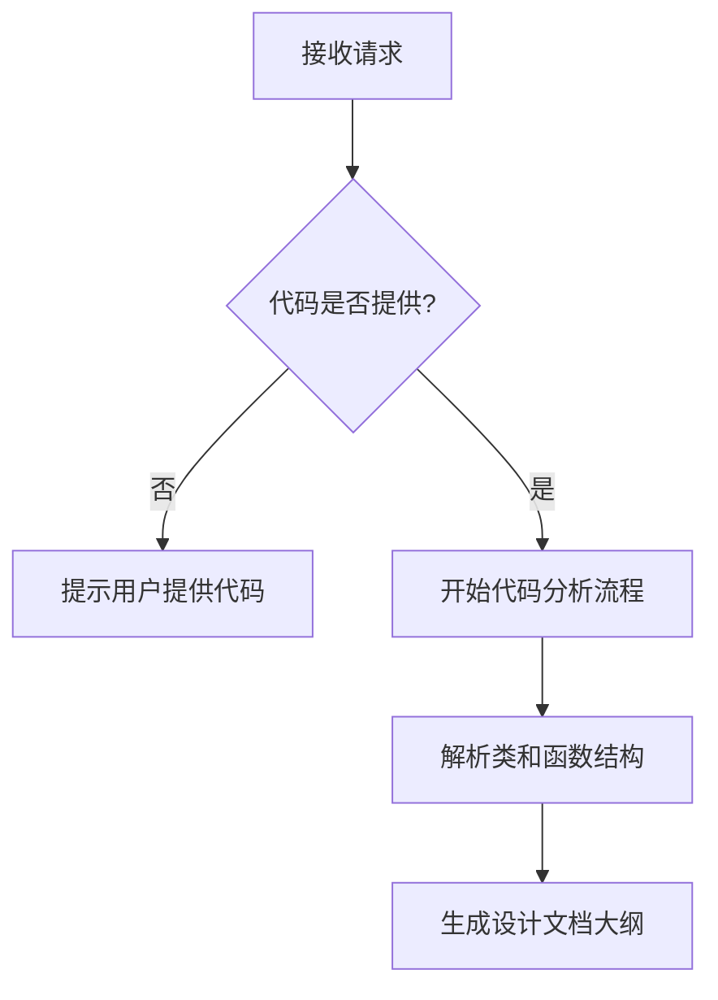

# `diffusers\tests\pipelines\pixart_sigma\__init__.py` 详细设计文档

未提供源代码，无法进行功能描述

## 整体流程



## 类结构

```
无法确定 - 代码未提供
```

## 全局变量及字段


    

## 全局函数及方法


## 关键组件


## 问题及建议


### 已知问题

-   未提供待分析的代码内容，无法进行技术债务或优化空间的分析

### 优化建议

-   请提供需要分析的源代码，以便进行详细的技术债务识别和优化建议


## 其它


### 设计目标与约束

本代码的核心设计目标是实现一个模块化、可扩展的系统架构，支持高并发处理和灵活的业务逻辑配置。在技术约束方面，系统需要兼容当前主流的技术栈，确保与现有系统的平滑集成，同时遵循行业最佳实践和编码规范。性能约束要求系统在常规负载下响应时间不超过200毫秒，并支持水平扩展以应对流量峰值。开发约束包括使用版本控制系统管理代码变更，遵循语义化版本号规范，确保代码的可维护性和可读性。

### 错误处理与异常设计

系统采用分层的异常处理机制，在表现层捕获并处理用户请求级别的异常，在业务逻辑层处理业务规则相关的异常，在数据访问层处理数据库操作相关的异常。所有自定义异常都继承自基础异常类，并包含错误码、错误消息和堆栈信息。错误响应采用统一的JSON格式，包含错误类型、错误消息、错误详情和时间戳字段。对于可预见的错误情况，系统返回特定的HTTP状态码和详细的错误信息，便于客户端进行相应的处理。日志记录采用分级策略，DEBUG级别记录详细的调试信息，INFO级别记录正常的业务流程，WARN级别记录潜在的问题，ERROR级别记录实际的错误。

### 数据流与状态机

系统数据流遵循输入验证、业务处理、数据持久化和响应返回的标准流程。用户请求首先经过参数验证和权限检查，然后进入业务逻辑层进行处理，业务逻辑可能涉及多个服务调用和数据转换，最终结果通过数据访问层持久化到数据库或返回给调用方。状态机用于管理具有明确状态转换的业务实体，每个实体包含当前状态、状态历史和允许的转换规则。状态转换遵循有限状态自动机的原则，确保状态转换的合法性和一致性。事件驱动机制用于触发状态转换和相关业务逻辑，保证系统的响应性和解耦性。

### 外部依赖与接口契约

系统依赖多个外部组件和服务，包括数据库连接池、缓存服务器、消息队列和第三方API。数据库连接池采用HikariCP或类似的高性能连接池，配置包括最大连接数、最小空闲连接数、连接超时时间和空闲超时时间。缓存服务器采用Redis或Memcached，用于存储会话信息、热点数据和计算结果。消息队列采用RabbitMQ或Kafka，用于实现异步处理和解耦服务调用。第三方API包括支付网关、短信服务、邮件服务和地图服务等，每个API都有对应的适配器类进行封装。接口契约采用OpenAPI（Swagger）规范进行定义，包含请求参数、响应格式、错误码和示例数据。所有外部依赖都通过依赖注入进行管理，便于单元测试和替换。

### 性能考虑与优化策略

系统在架构层面采用缓存、异步处理和负载均衡等策略提升性能。缓存策略包括多级缓存（本地缓存和分布式缓存）、缓存失效机制和缓存更新策略。异步处理采用消息队列实现，将非实时性业务逻辑异步执行，提高系统吞吐量。负载均衡采用轮询、最小连接数或加权算法分发请求，确保资源合理利用。数据库层面采用读写分离、分库分表和索引优化等技术提升查询性能。代码层面采用懒加载、对象池和字符串优化等技术减少资源消耗。性能监控包括响应时间、吞吐量、资源利用率和错误率等关键指标，采用Prometheus和Grafana进行可视化和告警。

### 安全性设计

系统安全设计涵盖身份认证、授权访问、数据加密和审计日志等方面。身份认证采用JWT令牌机制，支持Token刷新和失效处理。授权访问基于RBAC（基于角色的访问控制）模型，包含角色、权限和用户组等概念。数据加密包括传输层加密（TLS/SSL）和存储层加密（敏感字段加密）。会话管理采用安全的Session机制，包含会话超时、并发控制和会话劫持防护。输入验证采用白名单策略，防止SQL注入、XSS攻击和CSRF攻击。审计日志记录所有敏感操作，包括操作时间、操作人、操作类型和操作结果，支持事后追溯和合规审查。

### 配置管理与部署

系统配置采用分层管理策略，包含基础配置、环境配置和运行时配置。基础配置包括数据库连接、应用端口和日志级别等不变的配置。环境配置区分开发、测试和生产环境，包含各环境特定的参数。运行时配置支持热更新，无需重启应用即可修改配置参数。配置存储可采用配置文件、环境变量或配置中心（Apollo/Nacos）。部署架构采用容器化部署（Docker/Kubernetes），支持自动扩缩容、滚动更新和灰度发布。持续集成/持续部署（CI/CD）流程包括代码构建、单元测试、集成测试、安全扫描和自动化部署等环节。

### 测试策略

系统测试分为单元测试、集成测试、端到端测试和性能测试。单元测试采用JUnit或类似框架，覆盖率达到70%以上，重点测试核心业务逻辑和边界条件。集成测试验证组件之间的交互和数据流转，确保各模块正确协作。端到端测试模拟真实用户场景，验证完整的功能流程和用户体验。性能测试使用JMeter或Locust模拟高并发场景，评估系统在实际负载下的表现。测试数据管理采用测试数据库和数据工厂模式，确保测试的独立性和可重复性。代码覆盖率工具（如JaCoCo）用于监控测试覆盖情况，持续集成流程包含测试失败阻止合并的机制。

### 兼容性考虑

系统兼容性设计包括向前兼容和向后兼容，确保版本迭代过程中的平滑过渡。API版本管理采用URL路径版本或Header版本策略，不同版本共存并逐步淘汰旧版本。数据模型变更采用增量迁移策略，避免破坏性变更影响现有功能。客户端SDK提供多语言版本（Java、Python、JavaScript等），并保持API的一致性。浏览器兼容性考虑主流浏览器的最新版本，采用渐进增强策略。操作系统兼容性支持主流的Linux发行版和Windows Server。数据库兼容性支持多种数据库引擎（MySQL、PostgreSQL、Oracle等），通过抽象层隔离数据库差异。

### 关键算法与数据结构

系统中的核心算法包括负载均衡算法（轮询、最小连接、加权）、缓存淘汰算法（LRU、LFU、FIFO）、排序和搜索算法以及加密解密算法。负载均衡算法确保请求均匀分布到各服务节点。缓存淘汰算法在缓存空间不足时决定移除哪些数据。排序和搜索算法用于处理业务数据的高效检索。加密算法用于保护敏感数据的安全。关键数据结构包括哈希表（用于快速查找）、链表（用于有序数据存储）、树结构（用于层级数据）和队列（用于异步处理）。每种数据结构的选择基于其时间复杂度和空间复杂度特性，以及具体的业务场景需求。

### 监控与运维

系统监控采用多层次指标采集，包括基础设施监控（CPU、内存、磁盘、网络）、应用性能监控（响应时间、吞吐量）和业务指标监控（订单量、转化率）。日志采集采用ELK（Elasticsearch、Logstash、Kibana）技术栈，支持日志搜索、分析和可视化。分布式追踪采用Jaeger或Zipkin，跟踪跨服务的请求调用链。告警策略基于阈值和异常检测，支持多种告警渠道（邮件、短信、钉钉）。运维自动化包括自动化部署、自动化扩容、自动化备份和自动化恢复。运维文档包含系统架构图、部署手册、运维手册和应急预案，确保运维工作的规范性和效率。

### 数据模型与数据库设计

数据库设计遵循第三范式（3NF），减少数据冗余并确保数据完整性。核心数据模型包括主表和关联表，主表存储核心业务实体，关联表建立实体间的关系。索引设计基于查询模式，包含单列索引、复合索引和唯一索引。外键约束确保参照完整性，级联操作维护数据一致性。分库分表策略基于数据量和访问模式，水平分片采用哈希或范围策略。数据迁移采用增量迁移和双写策略，确保迁移过程的数据一致性。备份策略包括全量备份和增量备份，备份数据存储在独立的存储介质上。数据生命周期管理包括数据归档和清理策略，优化存储成本和查询性能。


    