# `diffusers\tests\pipelines\pixart_sigma\test_pixart.py` 详细设计文档

这是PixArtSigmaPipeline（文本到图像生成Pipeline）的单元测试和集成测试文件，包含快速测试用例验证Pipeline的基本推理功能、参数处理、模型融合等，以及集成测试验证不同分辨率和配置下的图像生成能力。

## 整体流程

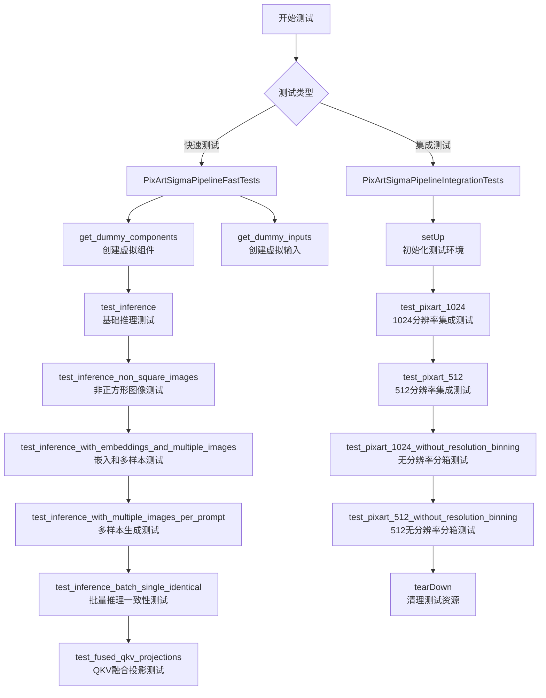
```mermaid
graph TD
    A[开始测试] --> B{测试类型}
    B -- 快速测试 --> C[PixArtSigmaPipelineFastTests]
    B -- 集成测试 --> D[PixArtSigmaPipelineIntegrationTests]
    C --> C1[get_dummy_components<br/>创建虚拟组件]
    C --> C2[get_dummy_inputs<br/>创建虚拟输入]
    C1 --> C3[test_inference<br/>基础推理测试]
    C3 --> C4[test_inference_non_square_images<br/>非正方形图像测试]
    C4 --> C5[test_inference_with_embeddings_and_multiple_images<br/>嵌入和多样本测试]
    C5 --> C6[test_inference_with_multiple_images_per_prompt<br/>多样本生成测试]
    C6 --> C7[test_inference_batch_single_identical<br/>批量推理一致性测试]
    C7 --> C8[test_fused_qkv_projections<br/>QKV融合投影测试]
    D --> D1[setUp<br/>初始化测试环境]
    D1 --> D2[test_pixart_1024<br/>1024分辨率集成测试]
    D2 --> D3[test_pixart_512<br/>512分辨率集成测试]
    D3 --> D4[test_pixart_1024_without_resolution_binning<br/>无分辨率分箱测试]
    D4 --> D5[test_pixart_512_without_resolution_binning<br/>512无分辨率分箱测试]
    D5 --> D6[tearDown<br/>清理测试资源]
```

## 类结构

```
unittest.TestCase
├── PipelineTesterMixin
│   └── PixArtSigmaPipelineFastTests (单元测试)
└── unittest.TestCase
    └── PixArtSigmaPipelineIntegrationTests (集成测试)
```

## 全局变量及字段


### `enable_full_determinism`
    
启用完全确定性模式的函数，确保测试结果可复现

类型：`function`
    


### `PixArtSigmaPipelineFastTests.pipeline_class`
    
测试使用的管道类，指向PixArtSigmaPipeline

类型：`type`
    


### `PixArtSigmaPipelineFastTests.params`
    
文本到图像管道的参数集合，包含prompt、guidance_scale等

类型：`set`
    


### `PixArtSigmaPipelineFastTests.batch_params`
    
批量参数集合，用于批量文本到图像生成的参数测试

类型：`set`
    


### `PixArtSigmaPipelineFastTests.image_params`
    
图像参数集合，包含输出图像相关的参数

类型：`set`
    


### `PixArtSigmaPipelineFastTests.image_latents_params`
    
图像潜在向量参数集合，用于测试潜在向量相关的参数

类型：`set`
    


### `PixArtSigmaPipelineFastTests.required_optional_params`
    
必需的可选参数列表，从PipelineTesterMixin继承的可选参数

类型：`list`
    


### `PixArtSigmaPipelineFastTests.test_layerwise_casting`
    
标志位，是否测试分层类型转换功能

类型：`bool`
    


### `PixArtSigmaPipelineFastTests.test_group_offloading`
    
标志位，是否测试模型组卸载功能

类型：`bool`
    


### `PixArtSigmaPipelineIntegrationTests.ckpt_id_1024`
    
PixArt-Sigma XL-2-1024-MS模型的HuggingFace Hub模型标识符

类型：`str`
    


### `PixArtSigmaPipelineIntegrationTests.ckpt_id_512`
    
PixArt-Sigma XL-2-512-MS模型的HuggingFace Hub模型标识符

类型：`str`
    


### `PixArtSigmaPipelineIntegrationTests.prompt`
    
集成测试使用的默认文本提示，描述一株带有笑脸的在撒哈拉沙漠的仙人掌

类型：`str`
    
    

## 全局函数及方法


### `gc.collect`

`gc.collect` 是 Python 标准库 `gc` 模块中的函数，用于强制执行垃圾回收操作，扫描不可达的对象并释放内存。在该测试代码中，它被用于在测试setup和teardown阶段清理内存，确保测试之间的内存隔离。

参数：无需参数

返回值：`int`，返回回收的对象数量

#### 流程图

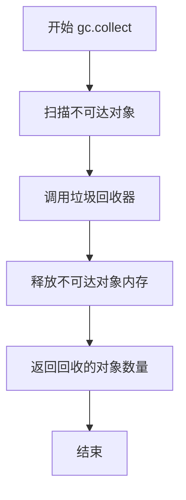
```mermaid
flowchart TD
    A[开始 gc.collect] --> B[扫描不可达对象]
    B --> C[调用垃圾回收器]
    C --> D[释放不可达对象内存]
    D --> E[返回回收的对象数量]
    E --> F[结束]
```

#### 带注释源码

```python
# 导入 Python 标准库的 gc 模块，用于垃圾回收
import gc

# 在测试类的 setUp 方法中调用 gc.collect()
# 作用：清理之前测试可能残留的内存对象，确保测试环境干净
gc.collect()

# 在测试类的 tearDown 方法中调用 gc.collect()
# 作用：清理当前测试产生的对象，释放内存资源
gc.collect()
```


### `tempfile.TemporaryDirectory`

该函数是 Python 标准库中的临时目录上下文管理器，用于创建临时目录并在上下文结束时自动清理。

参数：

- `suffix`：`str`，可选，临时目录名的后缀
- `prefix`：`str`，可选，临时目录名的前缀
- `dir`：`str`，可选，指定临时目录创建的路径

返回值：`contextlib._GeneratorContextManager`，返回一个上下文管理器，其 `__enter__` 方法返回临时目录的路径字符串

#### 流程图

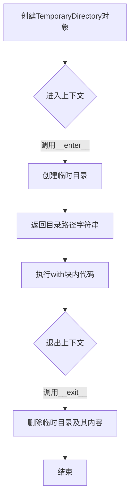
```mermaid
flowchart TD
    A[创建TemporaryDirectory对象] --> B{进入上下文}
    B -->|调用__enter__| C[创建临时目录]
    C --> D[返回目录路径字符串]
    D --> E[执行with块内代码]
    E --> F{退出上下文}
    F -->|调用__exit__| G[删除临时目录及其内容]
    G --> H[结束]
```

#### 带注释源码

```python
# tempfile.TemporaryDirectory 是 Python 标准库 tempfile 模块提供的上下文管理器
# 用于创建临时目录，在使用完毕后自动清理

with tempfile.TemporaryDirectory() as tmpdir:  # 创建临时目录，返回路径到 tmpdir
    pipe.save_pretrained(tmpdir)                # 在临时目录中保存预训练模型
    pipe_loaded = self.pipeline_class.from_pretrained(tmpdir)  # 从临时目录加载模型
    pipe_loaded.to(torch_device)                 # 将模型移至指定设备
    pipe_loaded.set_progress_bar_config(disable=None)  # 配置进度条
# 退出 with 块后，临时目录 tmpdir 及其内容会被自动删除
```


### `PixArtSigmaPipelineFastTests.get_dummy_inputs`

该方法用于生成PixArtSigmaPipeline的虚拟输入参数，支持CPU和MPS设备，为后续的推理测试提供一致性的随机生成器和测试prompt。

参数：

- `device`：`str`，目标设备字符串，用于确定使用哪种随机数生成器
- `seed`：`int`，随机种子，默认为0，用于确保测试的可重复性

返回值：`dict`，包含以下键值对：
- `prompt`：`str`，测试用的prompt文本
- `generator`：`torch.Generator`，PyTorch随机数生成器
- `num_inference_steps`：`int`，推理步数
- `guidance_scale`：`float`，引导尺度
- `use_resolution_binning`：`bool`，是否使用分辨率分箱
- `output_type`：`str`，输出类型

#### 流程图

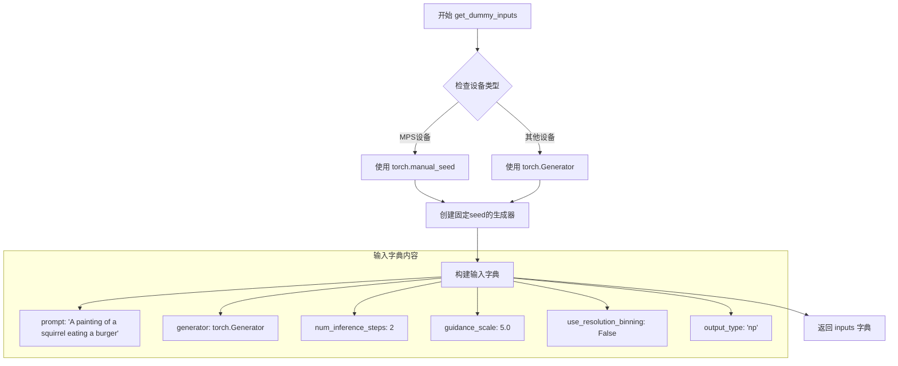
```mermaid
flowchart TD
    A[开始 get_dummy_inputs] --> B{检查设备类型}
    B -->|MPS设备| C[使用 torch.manual_seed]
    B -->|其他设备| D[使用 torch.Generator]
    C --> E[创建固定seed的生成器]
    D --> E
    E --> F[构建输入字典]
    F --> G[返回 inputs 字典]
    
    subgraph "输入字典内容"
        F --> F1["prompt: 'A painting of a squirrel eating a burger'"]
        F --> F2["generator: torch.Generator"]
        F --> F3["num_inference_steps: 2"]
        F --> F4["guidance_scale: 5.0"]
        F --> F5["use_resolution_binning: False"]
        F --> F6["output_type: 'np'"]
    end
```

#### 带注释源码

```python
def get_dummy_inputs(self, device, seed=0):
    """
    生成用于测试的虚拟输入参数。
    
    参数:
        device: 目标设备字符串
        seed: 随机种子，用于确保测试可重复性
    
    返回:
        dict: 包含推理所需参数的字典
    """
    # MPS设备不支持torch.Generator，需要使用torch.manual_seed代替
    if str(device).startswith("mps"):
        # 为MPS设备创建固定seed的生成器
        generator = torch.manual_seed(seed)
    else:
        # 为其他设备创建PyTorch Generator对象，支持更精细的随机控制
        generator = torch.Generator(device=device).manual_seed(seed)
    
    # 构建测试输入字典，包含典型文生图pipeline所需参数
    inputs = {
        "prompt": "A painting of a squirrel eating a burger",  # 测试用prompt文本
        "generator": generator,                                  # 随机生成器确保可重复性
        "num_inference_steps": 2,                                # 推理步数（较少以加快测试）
        "guidance_scale": 5.0,                                   # Classifier-free guidance强度
        "use_resolution_binning": False,                          # 禁用分辨率分箱便于测试
        "output_type": "np",                                     # 输出为numpy数组
    }
    return inputs
```

---


我需要确认一下：您要求提取的"torch"是指代码中的哪个具体函数或方法？因为代码中并没有名为"torch"的函数或方法，torch 是导入的 PyTorch 库。

代码中包含多个测试方法，最主要的是：
1. `test_pixart_1024` - 测试1024分辨率的PixArt模型
2. `test_pixart_512` - 测试512分辨率的PixArt模型
3. `get_dummy_components` - 获取虚拟组件
4. `get_dummy_inputs` - 获取虚拟输入

请您确认需要提取哪个具体函数或方法的信息，我将按照您要求的格式输出详细文档。


### `AutoTokenizer`

`AutoTokenizer` 是 Hugging Face `transformers` 库中的 utility 类，用于根据预训练模型名称或路径自动加载对应的 tokenizer。在该测试代码中，它用于加载 T5 文本编码器所需的 tokenizer。

参数：

- `pretrained_model_name_or_path`：`str`，预训练模型的名称（如 "hf-internal-testing/tiny-random-t5"）或本地路径
- `**kwargs`：`dict`，可选参数，传递给具体 tokenizer 类的额外关键字参数（如 `use_fast`, `cache_dir` 等）

返回值：`PreTrainedTokenizer` 或 `PreTrainedTokenizerFast`，返回与预训练模型对应的 tokenizer 实例

#### 流程图

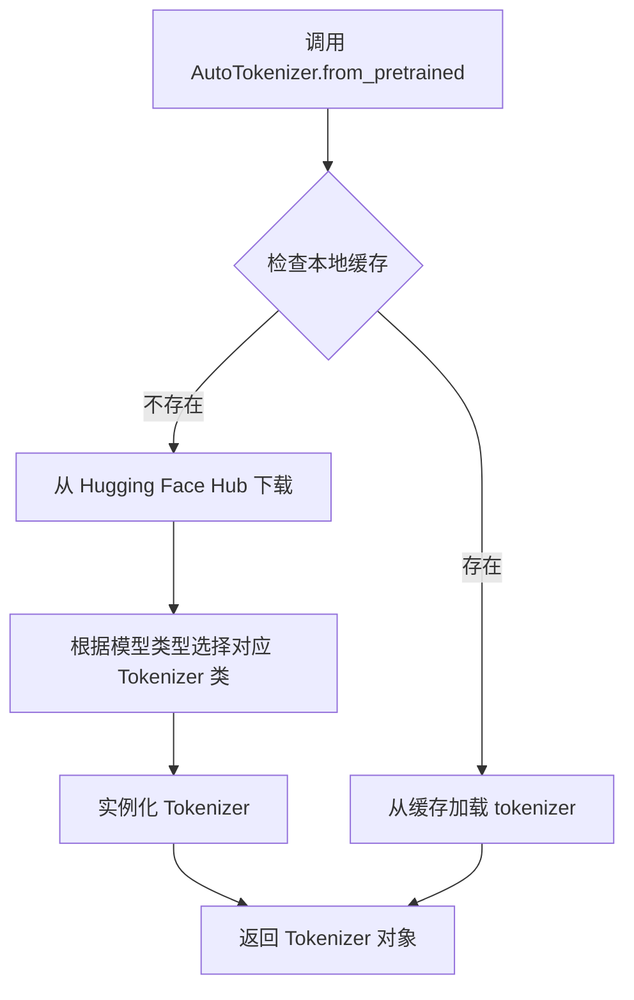
```mermaid
flowchart TD
    A[调用 AutoTokenizer.from_pretrained] --> B{检查本地缓存}
    B -->|存在| C[从缓存加载 tokenizer]
    B -->|不存在| D[从 Hugging Face Hub 下载]
    D --> E[根据模型类型选择对应 Tokenizer 类]
    E --> F[实例化 Tokenizer]
    F --> G[返回 Tokenizer 对象]
    C --> G
```

#### 带注释源码

```python
# 导入 AutoTokenizer 类
from transformers import AutoTokenizer, T5EncoderModel

# 使用 AutoTokenizer 的 from_pretrained 方法加载预训练 tokenizer
# 参数: "hf-internal-testing/tiny-random-t5" - Hugging Face Hub 上的一个小随机 T5 模型
# 返回: 对应的 T5 Tokenizer 实例
tokenizer = AutoTokenizer.from_pretrained("hf-internal-testing/tiny-random-t5")

# tokenizer 对象的主要用途:
# 1. 将文本字符串编码为模型输入的 token IDs
# 2. 将 token IDs 解码回文本字符串
# 3. 处理特殊 token（如 pad, bos, eos 等）
# 4. 管理 attention mask 等辅助信息

# 示例用法（虽然在本测试中未直接调用）:
# encoding = tokenizer("Hello world", return_tensors="pt")
# # 返回: {'input_ids': [...], 'attention_mask': [...]}
```


### `T5EncoderModel`

T5EncoderModel 是 Hugging Face Transformers 库中的一个预训练文本编码器模型，在本代码中用于将文本提示（prompt）编码为嵌入向量，供 PixArtSigmaPipeline 生成图像时使用。

参数：

- `pretrained_model_name_or_path`：`str`，要加载的预训练模型名称或本地路径，此处为 `"hf-internal-testing/tiny-random-t5"`

返回值：`T5EncoderModel`，返回加载好的 T5 文本编码器模型实例

#### 流程图

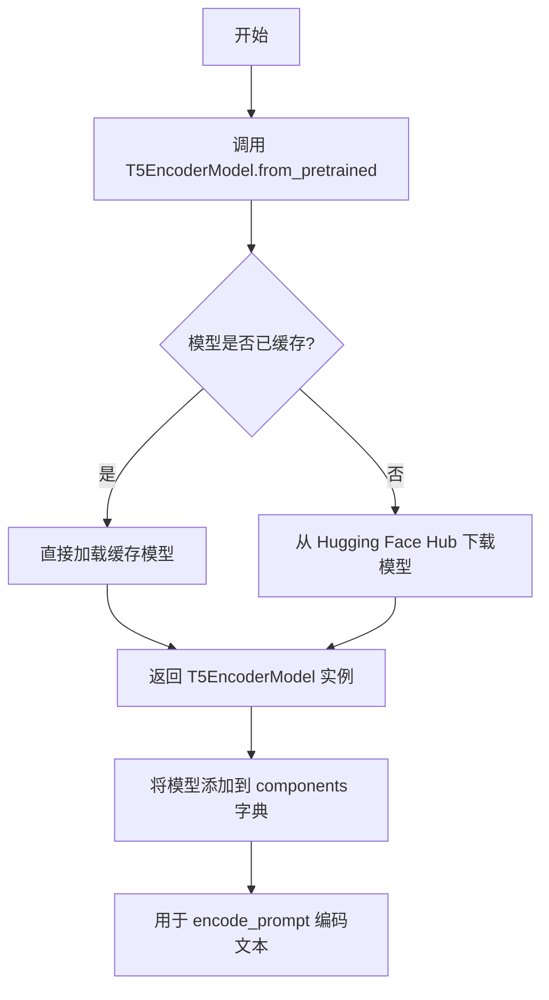
```mermaid
flowchart TD
    A[开始] --> B[调用 T5EncoderModel.from_pretrained]
    B --> C{模型是否已缓存?}
    C -->|是| D[直接加载缓存模型]
    C -->|否| E[从 Hugging Face Hub 下载模型]
    D --> F[返回 T5EncoderModel 实例]
    E --> F
    F --> G[将模型添加到 components 字典]
    G --> H[用于 encode_prompt 编码文本]
```

#### 带注释源码

```python
# 在 get_dummy_components 方法中创建 T5EncoderModel
torch.manual_seed(0)
text_encoder = T5EncoderModel.from_pretrained("hf-internal-testing/tiny-random-t5")

# 将其添加到组件字典中
components = {
    "transformer": transformer.eval(),
    "vae": vae.eval(),
    "scheduler": scheduler,
    "text_encoder": text_encoder,  # T5EncoderModel 实例
    "tokenizer": tokenizer,
}
```

#### 关键组件信息

| 名称 | 一句话描述 |
|------|-----------|
| T5EncoderModel | Hugging Face Transformers 库提供的 T5 文本编码器，用于将文本 prompt 转换为嵌入向量 |
| text_encoder | 在 Pipeline 中负责编码输入文本的组件 |
| tokenizer | 与 text_encoder 配套的 T5 分词器 |

#### 潜在技术债务与优化空间

1. **硬编码模型路径**：使用了 `"hf-internal-testing/tiny-random-t5"` 这个测试用的小模型，生产环境应考虑使用可配置的模型路径
2. **模型未设置设备**：text_encoder 未明确指定设备（CPU/GPU），可能影响推理性能
3. **未启用加速优化**：未使用 `torch.compile()` 或其他推理加速技术
4. **内存管理**：可考虑启用梯度检查点或量化以减少内存占用

#### 外部依赖与接口契约

- **依赖库**：`transformers` (Hugging Face)
- **接口**：`from_pretrained()` 类方法，返回 `T5EncoderModel` 实例
- **在 Pipeline 中的角色**：被 `encode_prompt` 方法调用，将文本转换为 prompt_embeds 和 prompt_attention_mask


### `AutoencoderKL`

AutoencoderKL 是从 diffusers 库导入的 VAE（变分自编码器）类，用于将图像编码到潜在空间以及从潜在空间解码图像。在该测试代码中，它作为 PixArtSigmaPipeline 的一个组件被实例化，用于图像的潜在表示处理。

参数：

-  无显式参数（使用默认初始化）

返回值：`AutoencoderKL` 实例，返回一个变分自编码器对象，用于图像的编码和解码

#### 流程图

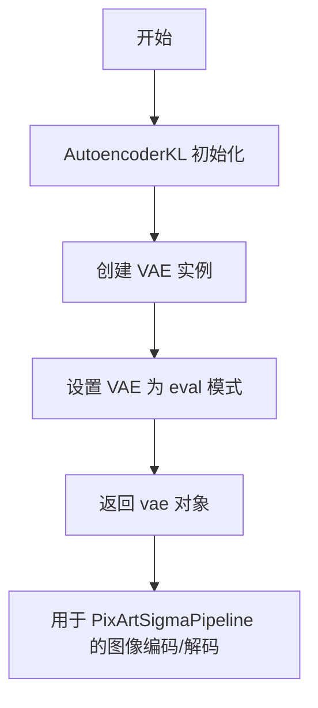
```mermaid
flowchart TD
    A[开始] --> B[AutoencoderKL 初始化]
    B --> C[创建 VAE 实例]
    C --> D[设置 VAE 为 eval 模式]
    D --> E[返回 vae 对象]
    E --> F[用于 PixArtSigmaPipeline 的图像编码/解码]
```

#### 带注释源码

```python
# 从 diffusers 库导入 AutoencoderKL 类
from diffusers import (
    AutoencoderKL,
    DDIMScheduler,
    PixArtSigmaPipeline,
    PixArtTransformer2DModel,
)

def get_dummy_components(self):
    """
    获取用于测试的虚拟组件字典
    """
    torch.manual_seed(0)
    # 创建 PixArtTransformer2DModel 实例
    transformer = PixArtTransformer2DModel(
        sample_size=8,
        num_layers=2,
        patch_size=2,
        attention_head_dim=8,
        num_attention_heads=3,
        caption_channels=32,
        in_channels=4,
        cross_attention_dim=24,
        out_channels=8,
        attention_bias=True,
        activation_fn="gelu-approximate",
        num_embeds_ada_norm=1000,
        norm_type="ada_norm_single",
        norm_elementwise_affine=False,
        norm_eps=1e-6,
    )
    torch.manual_seed(0)
    # 使用默认参数实例化 AutoencoderKL (VAE)
    vae = AutoencoderKL()
    
    # 创建调度器
    scheduler = DDIMScheduler()
    # 加载文本编码器
    text_encoder = T5EncoderModel.from_pretrained("hf-internal-testing/tiny-random-t5")
    
    # 加载 tokenizer
    tokenizer = AutoTokenizer.from_pretrained("hf-internal-testing/tiny-random-t5")
    
    # 组装组件字典
    components = {
        "transformer": transformer.eval(),
        "vae": vae.eval(),  # 设置为评估模式
        "scheduler": scheduler,
        "text_encoder": text_encoder,
        "tokenizer": tokenizer,
    }
    return components
```

---

### 补充说明

**注意**：`AutoencoderKL` 本身并未在此代码文件中定义，而是从 `diffusers` 库导入。该类的完整实现位于 diffusers 库中。在此测试文件中，它作为 PixArtSigmaPipeline 的核心组件之一，用于：
1. 将输入图像编码为潜在表示（encoder）
2. 将潜在表示解码回图像（decoder）

这符合 Latent Diffusion Model (LDM) 的典型架构设计，将图像处理在潜在空间中进行以提高计算效率。


### DDIMScheduler

在给定代码中，`DDIMScheduler` 是从 `diffusers` 库导入的调度器类，用于在 PixArtSigmaPipeline 中管理去噪过程的调度。代码中通过 `get_dummy_components` 方法创建了一个默认的 DDIMScheduler 实例并将其作为 pipeline 的组件之一。

#### 流程图

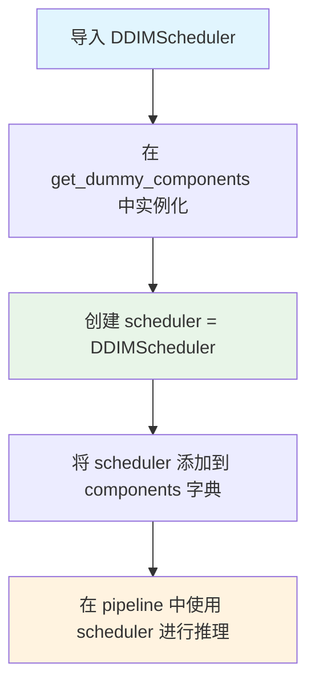
```mermaid
flowchart TD
    A[导入 DDIMScheduler] --> B[在 get_dummy_components 中实例化]
    B --> C[创建 scheduler = DDIMScheduler]
    C --> D[将 scheduler 添加到 components 字典]
    D --> E[在 pipeline 中使用 scheduler 进行推理]
    
    style A fill:#e1f5fe
    style C fill:#e8f5e8
    style E fill:#fff3e0
```

#### 带注释源码

```python
# 从 diffusers 库导入 DDIMScheduler 调度器
from diffusers import (
    AutoencoderKL,
    DDIMScheduler,  # 调度器类，用于控制去噪过程的时间步调度
    PixArtSigmaPipeline,
    PixArtTransformer2DModel,
)

# 在 get_dummy_components 方法中创建调度器实例
def get_dummy_components(self):
    # ... (transformer 和 vae 创建代码)
    
    # 创建 DDIMScheduler 实例 - 使用默认配置
    scheduler = DDIMScheduler()
    
    # ... (text_encoder 和 tokenizer 创建代码)
    
    # 将调度器添加到组件字典中
    components = {
        "transformer": transformer.eval(),
        "vae": vae.eval(),
        "scheduler": scheduler,  # 调度器作为 pipeline 的组件
        "text_encoder": text_encoder,
        "tokenizer": tokenizer,
    }
    return components

# 参数说明：
# DDIMScheduler() 不需要任何参数，使用默认配置创建实例
# 返回值：DDIMScheduler 实例，用于控制扩散模型的采样调度
```


### `PixArtSigmaPipeline`

PixArtSigmaPipeline 是一个基于扩散模型的文本到图像生成管道（Pipeline），它结合了 Transformer 模型、VAE 解码器、文本编码器（T5）和调度器（DDIM），能够根据文本提示（prompt）生成对应的图像。该 Pipeline 支持多种高级功能，包括分辨率绑定（resolution binning）、负提示词（negative prompt）、图像分辨率自定义、批量生成以及模型融合优化等。

参数：

- `prompt`：`str`，要生成的文本描述，例如 "A painting of a squirrel eating a burger"
- `negative_prompt`：`str`，可选，用于指导模型避免生成的内容
- `num_inference_steps`：`int`，推理步数，决定生成过程的迭代次数
- `guidance_scale`：`float`，无分类器引导（CFG）尺度，控制生成图像与提示词的相关性
- `height`：`int`，可选，生成图像的高度（像素）
- `width`：`int`，可选，生成图像的宽度（像素）
- `use_resolution_binning`：`bool`，是否启用分辨率绑定，将输入分辨率映射到模型支持的分辨率
- `output_type`：`str`，输出格式，如 "np"（NumPy 数组）或 "pt"（PyTorch 张量）
- `num_images_per_prompt`：`int`，每个提示词生成的图像数量
- `generator`：`torch.Generator`，可选，用于控制随机种子以实现可重复生成

返回值：`Image` 或 `List[Image]` 或 `np.ndarray`，生成的图像结果

#### 流程图

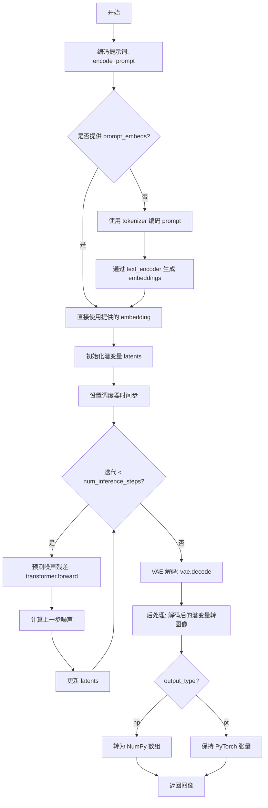
```mermaid
flowchart TD
    A[开始] --> B[编码提示词: encode_prompt]
    B --> C{是否提供 prompt_embeds?}
    C -->|是| D[直接使用提供的 embedding]
    C -->|否| E[使用 tokenizer 编码 prompt]
    E --> F[通过 text_encoder 生成 embeddings]
    F --> D
    D --> G[初始化潜变量 latents]
    G --> H[设置调度器时间步]
    H --> I{迭代 < num_inference_steps?}
    I -->|是| J[预测噪声残差: transformer.forward]
    J --> K[计算上一步噪声]
    K --> L[更新 latents]
    L --> I
    I -->|否| M[VAE 解码: vae.decode]
    M --> N[后处理: 解码后的潜变量转图像]
    N --> O{output_type?}
    O -->|np| P[转为 NumPy 数组]
    O -->|pt| Q[保持 PyTorch 张量]
    P --> R[返回图像]
    Q --> R
```

#### 带注释源码

```python
# coding=utf-8
# Copyright 2025 HuggingFace Inc.
#
# Licensed under the Apache License, Version 2.0 (the "License");
# you may not use this file except in compliance with the License.
# You may obtain a copy of the License at
#
#     http://www.apache.org/licenses/LICENSE-2.0
#
# Unless required by applicable law or agreed to in writing, software
# distributed under the License is distributed on an "AS IS" BASIS,
# WITHOUT WARRANTIES OR CONDITIONS OF ANY KIND, either express or implied.
# See the License for the specific language governing permissions and
# limitations under the License.

import gc  # 垃圾回收
import tempfile  # 临时目录
import unittest  # 单元测试框架

import numpy as np  # 数值计算
import torch  # PyTorch 深度学习框架
from transformers import AutoTokenizer, T5EncoderModel  # Hugging Face Transformers

from diffusers import (
    AutoencoderKL,  # 变分自编码器 (VAE)
    DDIMScheduler,  # DDIM 调度器
    PixArtSigmaPipeline,  # 核心Pipeline类
    PixArtTransformer2DModel,  # Transformer 主干网络
)

from ...testing_utils import (
    Expectations,
    backend_empty_cache,
    enable_full_determinism,
    numpy_cosine_similarity_distance,
    require_torch_accelerator,
    slow,
    torch_device,
)
from ..pipeline_params import TEXT_TO_IMAGE_BATCH_PARAMS, TEXT_TO_IMAGE_IMAGE_PARAMS, TEXT_TO_IMAGE_PARAMS
from ..test_pipelines_common import (
    PipelineTesterMixin,
    check_qkv_fusion_matches_attn_procs_length,
    check_qkv_fusion_processors_exist,
    to_np,
)


# 启用完全确定性模式，确保测试可重复
enable_full_determinism()


# ============ 快速测试类 ============
class PixArtSigmaPipelineFastTests(PipelineTesterMixin, unittest.TestCase):
    """
    PixArtSigmaPipeline 的快速单元测试类
    继承自 PipelineTesterMixin 和 unittest.TestCase
    """
    pipeline_class = PixArtSigmaPipeline  # 被测试的 Pipeline 类
    params = TEXT_TO_IMAGE_PARAMS - {"cross_attention_kwargs"}  # 测试参数
    batch_params = TEXT_TO_IMAGE_BATCH_PARAMS  # 批处理参数
    image_params = TEXT_TO_IMAGE_IMAGE_PARAMS  # 图像参数
    image_latents_params = TEXT_TO_IMAGE_IMAGE_PARAMS  # 潜变量参数

    required_optional_params = PipelineTesterMixin.required_optional_params
    test_layerwise_casting = True  # 测试层级类型转换
    test_group_offloading = True  # 测试组卸载

    def get_dummy_components(self):
        """
        获取用于测试的虚拟（dummy）组件
        这些组件是小型模型，用于快速测试
        """
        torch.manual_seed(0)
        # 创建小型 Transformer 模型
        transformer = PixArtTransformer2DModel(
            sample_size=8,
            num_layers=2,
            patch_size=2,
            attention_head_dim=8,
            num_attention_heads=3,
            caption_channels=32,
            in_channels=4,
            cross_attention_dim=24,
            out_channels=8,
            attention_bias=True,
            activation_fn="gelu-approximate",
            num_embeds_ada_norm=1000,
            norm_type="ada_norm_single",
            norm_elementwise_affine=False,
            norm_eps=1e-6,
        )
        torch.manual_seed(0)
        # 创建小型 VAE 模型
        vae = AutoencoderKL()

        # 创建调度器
        scheduler = DDIMScheduler()
        # 创建小型文本编码器
        text_encoder = T5EncoderModel.from_pretrained("hf-internal-testing/tiny-random-t5")
        # 创建分词器
        tokenizer = AutoTokenizer.from_pretrained("hf-internal-testing/tiny-random-t5")

        components = {
            "transformer": transformer.eval(),
            "vae": vae.eval(),
            "scheduler": scheduler,
            "text_encoder": text_encoder,
            "tokenizer": tokenizer,
        }
        return components

    def get_dummy_inputs(self, device, seed=0):
        """
        获取用于测试的虚拟输入
        """
        if str(device).startswith("mps"):
            generator = torch.manual_seed(seed)
        else:
            generator = torch.Generator(device=device).manual_seed(seed)
        inputs = {
            "prompt": "A painting of a squirrel eating a burger",
            "generator": generator,
            "num_inference_steps": 2,
            "guidance_scale": 5.0,
            "use_resolution_binning": False,
            "output_type": "np",
        }
        return inputs

    @unittest.skip("Not supported.")
    def test_sequential_cpu_offload_forward_pass(self):
        # TODO(PVP, Sayak) need to fix later
        return

    def test_inference(self):
        """
        测试基本推理功能
        """
        device = "cpu"

        components = self.get_dummy_components()
        pipe = self.pipeline_class(**components)  # 实例化 Pipeline
        pipe.to(device)
        pipe.set_progress_bar_config(disable=None)

        inputs = self.get_dummy_inputs(device)
        image = pipe(**inputs).images  # 执行推理
        image_slice = image[0, -3:, -3:, -1]

        self.assertEqual(image.shape, (1, 8, 8, 3))
        expected_slice = np.array([0.6319, 0.3526, 0.3806, 0.6327, 0.4639, 0.4830, 0.2583, 0.5331, 0.4852])
        max_diff = np.abs(image_slice.flatten() - expected_slice).max()
        self.assertLessEqual(max_diff, 1e-3)

    def test_inference_non_square_images(self):
        """
        测试非正方形图像生成
        """
        device = "cpu"

        components = self.get_dummy_components()
        pipe = self.pipeline_class(**components)
        pipe.to(device)
        pipe.set_progress_bar_config(disable=None)

        inputs = self.get_dummy_inputs(device)
        # 生成非正方形图像：高度32，宽度48
        image = pipe(**inputs, height=32, width=48).images
        image_slice = image[0, -3:, -3:, -1]
        self.assertEqual(image.shape, (1, 32, 48, 3))

        expected_slice = np.array([0.6493, 0.5370, 0.4081, 0.4762, 0.3695, 0.4711, 0.3026, 0.5218, 0.5263])
        max_diff = np.abs(image_slice.flatten() - expected_slice).max()
        self.assertLessEqual(max_diff, 1e-3)

    def test_inference_with_embeddings_and_multiple_images(self):
        """
        测试使用预计算 embeddings 和多图像生成
        """
        components = self.get_dummy_components()
        pipe = self.pipeline_class(**components)
        pipe.to(torch_device)
        pipe.set_progress_bar_config(disable=None)

        inputs = self.get_dummy_inputs(torch_device)

        prompt = inputs["prompt"]
        generator = inputs["generator"]
        num_inference_steps = inputs["num_inference_steps"]
        output_type = inputs["output_type"]

        # 编码提示词获取 embeddings
        prompt_embeds, prompt_attn_mask, negative_prompt_embeds, neg_prompt_attn_mask = pipe.encode_prompt(prompt)

        # 使用预计算的 embeddings 作为输入
        inputs = {
            "prompt_embeds": prompt_embeds,
            "prompt_attention_mask": prompt_attn_mask,
            "negative_prompt": None,
            "negative_prompt_embeds": negative_prompt_embeds,
            "negative_prompt_attention_mask": neg_prompt_attn_mask,
            "generator": generator,
            "num_inference_steps": num_inference_steps,
            "output_type": output_type,
            "num_images_per_prompt": 2,  # 每个提示生成2张图像
            "use_resolution_binning": False,
        }

        # 将所有可选组件设为 None
        for optional_component in pipe._optional_components:
            setattr(pipe, optional_component, None)

        output = pipe(**inputs)[0]

        # 测试保存和加载功能
        with tempfile.TemporaryDirectory() as tmpdir:
            pipe.save_pretrained(tmpdir)
            pipe_loaded = self.pipeline_class.from_pretrained(tmpdir)
            pipe_loaded.to(torch_device)
            pipe_loaded.set_progress_bar_config(disable=None)

        # 验证可选组件在加载后保持为 None
        for optional_component in pipe._optional_components:
            self.assertTrue(
                getattr(pipe_loaded, optional_component) is None,
                f"`{optional_component}` did not stay set to None after loading.",
            )

        # 使用加载的 pipeline 进行推理
        inputs = self.get_dummy_inputs(torch_device)
        generator = inputs["generator"]
        num_inference_steps = inputs["num_inference_steps"]
        output_type = inputs["output_type"]

        inputs = {
            "prompt_embeds": prompt_embeds,
            "prompt_attention_mask": prompt_attn_mask,
            "negative_prompt": None,
            "negative_prompt_embeds": negative_prompt_embeds,
            "negative_prompt_attention_mask": neg_prompt_attn_mask,
            "generator": generator,
            "num_inference_steps": num_inference_steps,
            "output_type": output_type,
            "num_images_per_prompt": 2,
            "use_resolution_binning": False,
        }

        output_loaded = pipe_loaded(**inputs)[0]

        # 比较两个输出的差异
        max_diff = np.abs(to_np(output) - to_np(output_loaded)).max()
        self.assertLess(max_diff, 1e-4)

    def test_inference_with_multiple_images_per_prompt(self):
        """
        测试每个提示词生成多张图像
        """
        device = "cpu"

        components = self.get_dummy_components()
        pipe = self.pipeline_class(**components)
        pipe.to(device)
        pipe.set_progress_bar_config(disable=None)

        inputs = self.get_dummy_inputs(device)
        inputs["num_images_per_prompt"] = 2  # 设置每提示生成2张图像
        image = pipe(**inputs).images
        image_slice = image[0, -3:, -3:, -1]

        self.assertEqual(image.shape, (2, 8, 8, 3))
        expected_slice = np.array([0.6319, 0.3526, 0.3806, 0.6327, 0.4639, 0.4830, 0.2583, 0.5331, 0.4852])
        max_diff = np.abs(image_slice.flatten() - expected_slice).max()
        self.assertLessEqual(max_diff, 1e-3)

    @unittest.skip("Test is already covered through encode_prompt isolation.")
    def test_save_load_optional_components(self):
        pass

    def test_inference_batch_single_identical(self):
        """
        测试批处理和单张处理的一致性
        """
        self._test_inference_batch_single_identical(expected_max_diff=1e-3)

    def test_fused_qkv_projections(self):
        """
        测试融合的 QKV 投影
        """
        device = "cpu"  # 确保确定性
        components = self.get_dummy_components()
        pipe = self.pipeline_class(**components)
        pipe = pipe.to(device)
        pipe.set_progress_bar_config(disable=None)

        inputs = self.get_dummy_inputs(device)
        image = pipe(**inputs).images
        original_image_slice = image[0, -3:, -3:, -1]

        # 融合 QKV 投影
        pipe.transformer.fuse_qkv_projections()
        assert check_qkv_fusion_processors_exist(pipe.transformer), (
            "Something wrong with the fused attention processors. Expected all the attention processors to be fused."
        )
        assert check_qkv_fusion_matches_attn_procs_length(
            pipe.transformer, pipe.transformer.original_attn_processors
        ), "Something wrong with the attention processors concerning the fused QKV projections."

        inputs = self.get_dummy_inputs(device)
        image = pipe(**inputs).images
        image_slice_fused = image[0, -3:, -3:, -1]

        # 解除融合
        pipe.transformer.unfuse_qkv_projections()
        inputs = self.get_dummy_inputs(device)
        image = pipe(**inputs).images
        image_slice_disabled = image[0, -3:, -3:, -1]

        # 验证融合不应影响输出
        assert np.allclose(original_image_slice, image_slice_fused, atol=1e-3, rtol=1e-3), (
            "Fusion of QKV projections shouldn't affect the outputs."
        )
        assert np.allclose(image_slice_fused, image_slice_disabled, atol=1e-3, rtol=1e-3), (
            "Outputs, with QKV projection fusion enabled, shouldn't change when fused QKV projections are disabled."
        )
        assert np.allclose(original_image_slice, image_slice_disabled, atol=1e-2, rtol=1e-2), (
            "Original outputs should match when fused QKV projections are disabled."
        )


# ============ 集成测试类 ============
@slow
@require_torch_accelerator
class PixArtSigmaPipelineIntegrationTests(unittest.TestCase):
    """
    PixArtSigmaPipeline 的集成测试类
    使用真实的预训练模型进行测试
    """
    ckpt_id_1024 = "PixArt-alpha/PixArt-Sigma-XL-2-1024-MS"  # 1024分辨率模型
    ckpt_id_512 = "PixArt-alpha/PixArt-Sigma-XL-2-512-MS"   # 512分辨率模型
    prompt = "A small cactus with a happy face in the Sahara desert."

    def setUp(self):
        """
        测试前准备：垃圾回收和清空缓存
        """
        super().setUp()
        gc.collect()
        backend_empty_cache(torch_device)

    def tearDown(self):
        """
        测试后清理：垃圾回收和清空缓存
        """
        super().tearDown()
        gc.collect()
        backend_empty_cache(torch_device)

    def test_pixart_1024(self):
        """
        测试1024分辨率图像生成
        """
        generator = torch.Generator("cpu").manual_seed(0)

        # 从预训练模型加载 Pipeline
        pipe = PixArtSigmaPipeline.from_pretrained(self.ckpt_id_1024, torch_dtype=torch.float16)
        pipe.enable_model_cpu_offload(device=torch_device)
        prompt = self.prompt

        # 执行推理
        image = pipe(prompt, generator=generator, num_inference_steps=2, output_type="np").images

        image_slice = image[0, -3:, -3:, -1]
        expected_slice = np.array([0.4517, 0.4446, 0.4375, 0.449, 0.4399, 0.4365, 0.4583, 0.4629, 0.4473])

        max_diff = numpy_cosine_similarity_distance(image_slice.flatten(), expected_slice)
        self.assertLessEqual(max_diff, 1e-4)

    def test_pixart_512(self):
        """
        测试512分辨率图像生成（使用不同的transformer）
        """
        generator = torch.Generator("cpu").manual_seed(0)

        transformer = PixArtTransformer2DModel.from_pretrained(
            self.ckpt_id_512, subfolder="transformer", torch_dtype=torch.float16
        )
        pipe = PixArtSigmaPipeline.from_pretrained(
            self.ckpt_id_1024, transformer=transformer, torch_dtype=torch.float16
        )
        pipe.enable_model_cpu_offload(device=torch_device)

        prompt = self.prompt

        image = pipe(prompt, generator=generator, num_inference_steps=2, output_type="np").images

        image_slice = image[0, -3:, -3:, -1]

        expected_slices = Expectations(
            {
                ("xpu", 3): np.array([0.0417, 0.0388, 0.0061, 0.0618, 0.0517, 0.0420, 0.1038, 0.1055, 0.1257]),
                ("cuda", None): np.array([0.0479, 0.0378, 0.0217, 0.0942, 0.064, 0.0791, 0.2073, 0.1975, 0.2017]),
            }
        )
        expected_slice = expected_slices.get_expectation()

        max_diff = numpy_cosine_similarity_distance(image_slice.flatten(), expected_slice)
        self.assertLessEqual(max_diff, 1e-4)

    def test_pixart_1024_without_resolution_binning(self):
        """
        测试禁用分辨率绑定功能
        """
        generator = torch.manual_seed(0)

        pipe = PixArtSigmaPipeline.from_pretrained(self.ckpt_id_1024, torch_dtype=torch.float16)
        pipe.enable_model_cpu_offload(device=torch_device)

        prompt = self.prompt
        height, width = 1024, 768
        num_inference_steps = 2

        # 启用分辨率绑定
        image = pipe(
            prompt,
            height=height,
            width=width,
            generator=generator,
            num_inference_steps=num_inference_steps,
            output_type="np",
        ).images
        image_slice = image[0, -3:, -3:, -1]

        # 禁用分辨率绑定
        generator = torch.manual_seed(0)
        no_res_bin_image = pipe(
            prompt,
            height=height,
            width=width,
            generator=generator,
            num_inference_steps=num_inference_steps,
            output_type="np",
            use_resolution_binning=False,
        ).images
        no_res_bin_image_slice = no_res_bin_image[0, -3:, -3:, -1]

        # 验证两种方式的输出不同
        assert not np.allclose(image_slice, no_res_bin_image_slice, atol=1e-4, rtol=1e-4)

    def test_pixart_512_without_resolution_binning(self):
        """
        测试512分辨率下禁用分辨率绑定
        """
        generator = torch.manual_seed(0)

        transformer = PixArtTransformer2DModel.from_pretrained(
            self.ckpt_id_512, subfolder="transformer", torch_dtype=torch.float16
        )
        pipe = PixArtSigmaPipeline.from_pretrained(
            self.ckpt_id_1024, transformer=transformer, torch_dtype=torch.float16
        )
        pipe.enable_model_cpu_offload(device=torch_device)

        prompt = self.prompt
        height, width = 512, 768
        num_inference_steps = 2

        image = pipe(
            prompt,
            height=height,
            width=width,
            generator=generator,
            num_inference_steps=num_inference_steps,
            output_type="np",
        ).images
        image_slice = image[0, -3:, -3:, -1]

        generator = torch.manual_seed(0)
        no_res_bin_image = pipe(
            prompt,
            height=height,
            width=width,
            generator=generator,
            num_inference_steps=num_inference_steps,
            output_type="np",
            use_resolution_binning=False,
        ).images
        no_res_bin_image_slice = no_res_bin_image[0, -3:, -3:, -1]

        assert not np.allclose(image_slice, no_res_bin_image_slice, atol=1e-4, rtol=1e-4)
```

---

## 文件整体运行流程

1. **单元测试流程**（`PixArtSigmaPipelineFastTests`）：
   - 初始化测试环境和随机种子
   - 创建虚拟组件（小型 Transformer、VAE、文本编码器等）
   - 执行各种推理测试（基本推理、非正方形图像、多图像生成、嵌入编码等）
   - 验证输出图像的形状和数值正确性

2. **集成测试流程**（`PixArtSigmaPipelineIntegrationTests`）：
   - 从 Hugging Face Hub 下载真实预训练模型（1024-MS 和 512-MS 版本）
   - 使用 `enable_model_cpu_offload` 管理模型内存
   - 执行端到端推理并验证输出质量
   - 测试分辨率绑定、模型保存/加载等功能

---

## 关键组件信息

| 组件名称 | 描述 |
|---------|------|
| `PixArtTransformer2DModel` | 基于 Diffusion Transformer 的主 backbone，负责去噪过程 |
| `AutoencoderKL` | VAE 变分自编码器，将潜变量解码为图像 |
| `DDIMScheduler` | DDIM 调度器，控制去噪采样步骤 |
| `T5EncoderModel` | T5 文本编码器，将文本提示转换为 embedding |
| `AutoTokenizer` | T5 分词器，将文本分割为 token |
| `PixArtSigmaPipeline` | 整合所有组件的端到端文本到图像生成管道 |

---

## 潜在的技术债务或优化空间

1. **内存管理优化**：集成测试中使用了 `enable_model_cpu_offload`，但在快速测试中没有体现，可能在大模型测试时导致内存不足。
2. **测试覆盖不完整**：部分测试被跳过（如 `test_sequential_cpu_offload_forward_pass`），需要后续完善。
3. **硬编码的期望值**：测试中使用硬编码的数值切片（如 `expected_slice`），当模型更新时可能需要手动更新。
4. **缺乏性能基准测试**：没有对推理速度、内存占用等性能指标进行测试。
5. **分辨率绑定逻辑**：测试显示启用/禁用分辨率绑定产生不同结果，但缺乏对边界情况的测试。

---

## 其它项目

### 设计目标与约束

- **目标**：实现高质量的文本到图像生成，支持多种分辨率和批量生成
- **约束**：
  - 遵循 Hugging Face Diffusers 库的 API 设计规范
  - 支持 `torch.float16` 推理以加速
  - 兼容 CPU 和 GPU（CUDA/XPU）设备

### 错误处理与异常设计

- 使用 `unittest` 框架进行断言验证
- 集成测试使用 `@slow` 和 `@require_torch_accelerator` 装饰器标记
- 通过 `numpy_cosine_similarity_distance` 进行输出质量验证

### 数据流与状态机

- **数据流**：Prompt → Tokenizer → Text Encoder → Embeddings → Transformer (去噪) → VAE Decoder → Image
- **状态**：Pipeline 实例包含多个子组件（transformer, vae, scheduler, text_encoder, tokenizer），状态通过组件传递

### 外部依赖与接口契约

- 依赖 `diffusers` 库的核心组件
- 依赖 `transformers` 库的 T5 模型
- 依赖 `numpy` 和 `torch` 进行数值计算
- 接口遵循 Diffusers Pipeline 标准：`from_pretrained()`, `save_pretrained()`, `__call__()`


### `PixArtTransformer2DModel`

`PixArtTransformer2DModel` 是 Hugging Face diffusers 库中的一个 transformer 模型类，专门用于 PixArt-Sigma 图像生成管线。该模型采用 DiT (Diffusion Transformer) 架构，支持基于文本条件的图像生成，是 PixArt-Sigma 管道中的核心组件，负责潜在空间的去噪过程。

参数：

- `sample_size`：`int`，输入图像的空间分辨率（高度和宽度）
- `num_layers`：`int`，Transformer 层的数量
- `patch_size`：`int`，将图像分割为补丁的尺寸
- `attention_head_dim`：`int`，每个注意力头的维度
- `num_attention_heads`：`int`，注意力头的数量
- `caption_channels`：`int`， caption 编码器的输出通道数
- `in_channels`：`int`，输入数据的通道数（对于潜变量通常是 4）
- `cross_attention_dim`：`int`，跨注意力机制的维度
- `out_channels`：`int`，输出数据的通道数
- `attention_bias`：`bool`，是否在注意力层中使用偏置
- `activation_fn`：`str`，激活函数类型（如 "gelu-approximate"）
- `num_embeds_ada_norm`：`int`，AdaNorm 条件归一化的嵌入数量
- `norm_type`：`str`，归一化类型（如 "ada_norm_single"）
- `norm_elementwise_affine`：`bool`，是否使用逐元素仿射变换
- `norm_eps`：`float`，归一化的 epsilon 值

返回值：`PixArtTransformer2DModel` 实例，返回一个配置好的 Transformer 模型对象

#### 流程图

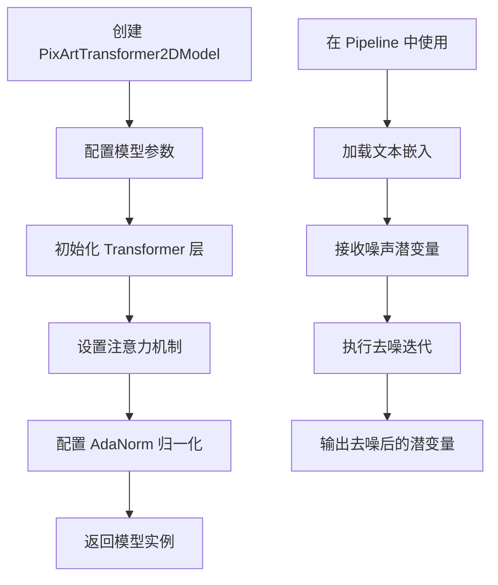
```mermaid
flowchart TD
    A[创建 PixArtTransformer2DModel] --> B[配置模型参数]
    B --> C[初始化 Transformer 层]
    C --> D[设置注意力机制]
    D --> E[配置 AdaNorm 归一化]
    E --> F[返回模型实例]
    
    G[在 Pipeline 中使用] --> H[加载文本嵌入]
    H --> I[接收噪声潜变量]
    I --> J[执行去噪迭代]
    J --> K[输出去噪后的潜变量]
```

#### 带注释源码

```python
# 在测试代码中实例化 PixArtTransformer2DModel
# 用于测试 PixArtSigmaPipeline 的功能
torch.manual_seed(0)
transformer = PixArtTransformer2DModel(
    sample_size=8,              # 输出图像尺寸 8x8
    num_layers=2,               # 2 层 Transformer
    patch_size=2,               # 2x2 的补丁划分
    attention_head_dim=8,      # 注意力头维度为 8
    num_attention_heads=3,     # 3 个注意力头
    caption_channels=32,       # 文本编码器输出通道
    in_channels=4,              # 潜在空间通道数（VAE 编码后的通道）
    cross_attention_dim=24,    # 跨注意力维度
    out_channels=8,            # 输出通道数
    attention_bias=True,       # 启用注意力偏置
    activation_fn="gelu-approximate",  # 使用近似 GELU 激活
    num_embeds_ada_norm=1000,  # AdaNorm 条件嵌入数
    norm_type="ada_norm_single",  # 单层 AdaNorm 归一化
    norm_elementwise_affine=False,  # 关闭逐元素仿射
    norm_eps=1e-6,             # 归一化 epsilon
)

# 模型评估模式
transformer = transformer.eval()

# 在集成测试中从预训练权重加载
transformer = PixArtTransformer2DModel.from_pretrained(
    ckpt_id_512,                # 预训练模型 ID
    subfolder="transformer",   # 子文件夹路径
    torch_dtype=torch.float16  # 使用半精度
)
```


### Expectations

这是从 `testing_utils` 模块导入的一个测试工具类，用于管理不同测试环境下的期望值。它允许根据不同的设备类型和配置（如 "xpu"、"cuda" 等）存储和检索对应的期望数组。

参数：

-  `expectations`：`Dict[Tuple[str, Optional[int]], np.ndarray]`，字典的键是设备类型和配置组成的元组，值是对应的期望 numpy 数组

返回值：`Expectations`，返回 Expectations 实例对象

#### 流程图

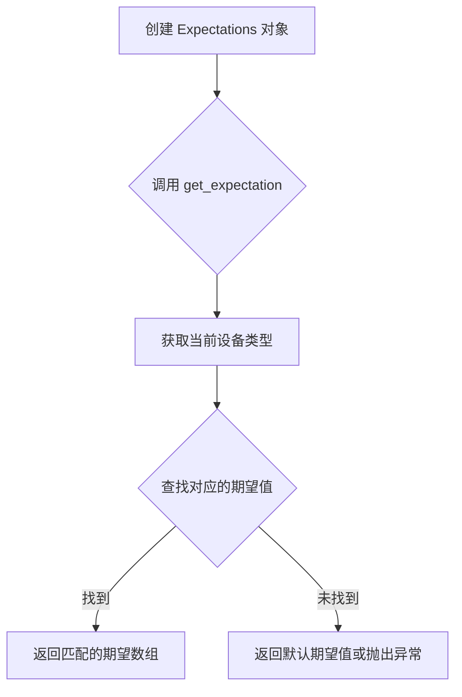
```mermaid
flowchart TD
    A[创建 Expectations 对象] --> B{调用 get_expectation}
    B --> C[获取当前设备类型]
    C --> D{查找对应的期望值}
    D -->|找到| E[返回匹配的期望数组]
    D -->|未找到| F[返回默认期望值或抛出异常]
```

#### 带注释源码

```python
# Expectations 类的典型使用方式（从代码中提取）
# 用于存储不同设备和配置下的期望值

# 创建 Expectations 对象，传入设备-期望值映射字典
expected_slices = Expectations(
    {
        # (设备类型, 配置) -> 期望数组
        ("xpu", 3): np.array([0.0417, 0.0388, 0.0061, 0.0618, 0.0517, 0.0420, 0.1038, 0.1055, 0.1257]),
        ("cuda", None): np.array([0.0479, 0.0378, 0.0217, 0.0942, 0.064, 0.0791, 0.2073, 0.1975, 0.2017]),
    }
)

# 获取当前测试环境对应的期望值
expected_slice = expected_slices.get_expectation()
```

---

### Expectations.get_expectation

根据当前测试环境自动获取对应的期望数组。

参数：无

返回值：`np.ndarray`，当前设备/配置下对应的期望数组

#### 流程图

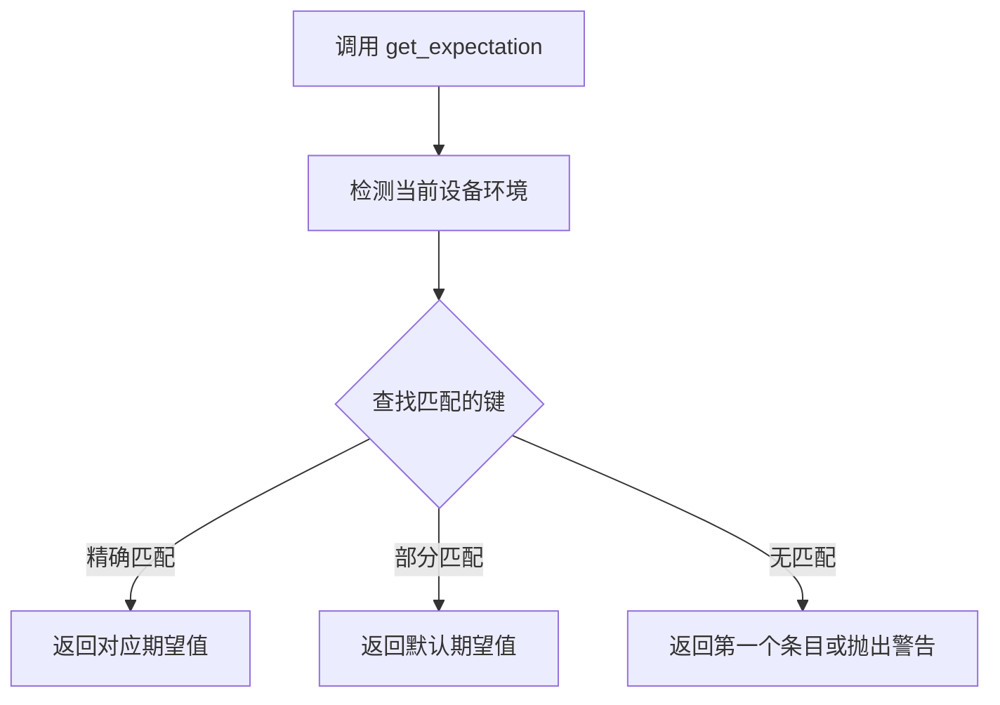
```mermaid
flowchart TD
    A[调用 get_expectation] --> B[检测当前设备环境]
    B --> C{查找匹配的键}
    C -->|精确匹配| D[返回对应期望值]
    C -->|部分匹配| E[返回默认期望值]
    C -->|无匹配| F[返回第一个条目或抛出警告]
```

#### 带注释源码

```python
# 使用示例（从测试代码中提取）
# 在 test_pixart_512 测试方法中：
expected_slices = Expectations(
    {
        ("xpu", 3): np.array([0.0417, 0.0388, 0.0061, 0.0618, 0.0517, 0.0420, 0.1038, 0.1055, 0.1257]),
        ("cuda", None): np.array([0.0479, 0.0378, 0.0217, 0.0942, 0.064, 0.0791, 0.2073, 0.1975, 0.2017]),
    }
)
# 根据当前 torch_device 自动选择期望值
expected_slice = expected_slices.get_expectation()

# 用于验证输出
max_diff = numpy_cosine_similarity_distance(image_slice.flatten(), expected_slice)
self.assertLessEqual(max_diff, 1e-4)
```


### `backend_empty_cache`

该函数是一个测试辅助工具，用于清理深度学习后端（通常是 CUDA GPU）的缓存内存，以确保测试之间的内存隔离和测试结果的确定性。在 `PixArtSigmaPipelineIntegrationTests` 类的 `setUp` 和 `tearDown` 方法中被调用，配合 `gc.collect()` 一起使用来最大化内存释放效果。

参数：

- `device`：`str` 或 `torch.device`，表示需要清理缓存的目标设备（如 `"cuda"`、`"cpu"` 或 `"xpu"`）

返回值：`None`，该函数通常没有返回值，仅执行清理操作

#### 流程图

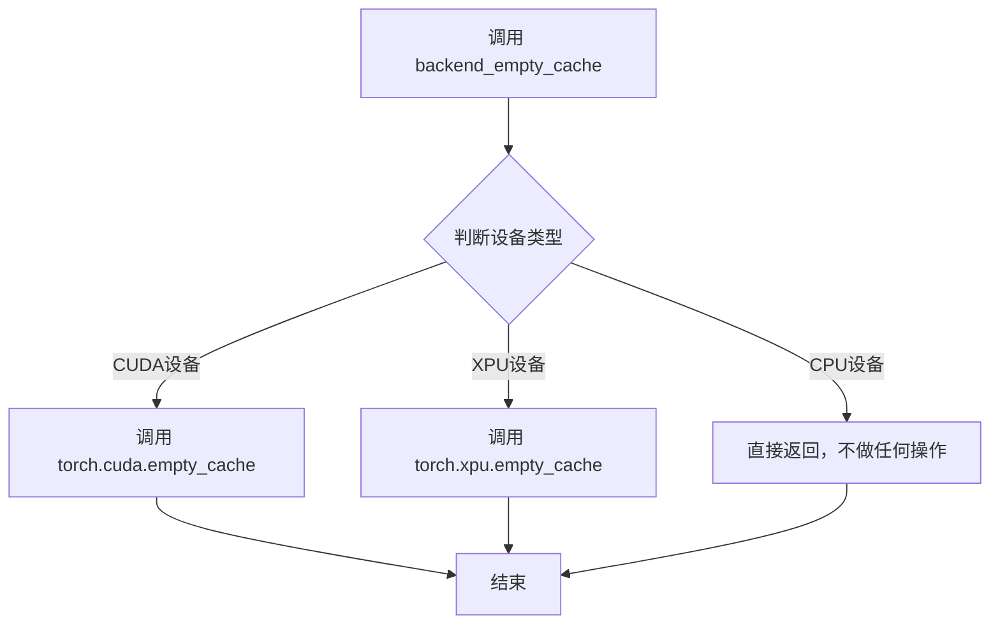
```mermaid
flowchart TD
    A[调用 backend_empty_cache] --> B{判断设备类型}
    B -->|CUDA设备| C[调用 torch.cuda.empty_cache]
    B -->|XPU设备| D[调用 torch.xpu.empty_cache]
    B -->|CPU设备| E[直接返回，不做任何操作]
    C --> F[结束]
    D --> F
    E --> F
```

#### 带注释源码

```python
# 该函数定义在 ...testing_utils 模块中（此处基于调用模式的推断实现）
def backend_empty_cache(device):
    """
    清理指定计算设备的缓存内存
    
    参数:
        device: 目标设备标识符，用于确定使用哪种后端缓存清理方式
    """
    # 判断设备类型并执行相应的缓存清理
    if str(device).startswith("cuda"):
        # CUDA 设备：调用 PyTorch 的 CUDA 缓存清理
        torch.cuda.empty_cache()
    elif str(device).startswith("xpu"):
        # XPU 设备（Intel GPU）：调用 Intel XPU 的缓存清理
        torch.xpu.empty_cache()
    # CPU 设备无需清理缓存，直接返回
    
# 在测试中的实际调用方式：
gc.collect()              # 首先执行 Python 垃圾回收
backend_empty_cache(torch_device)  # 然后清理后端缓存
```


### `enable_full_determinism`

该函数用于启用深度学习框架的完全确定性模式，通过设置随机种子和环境变量，确保测试或推理过程的结果可复现。

参数： 无

返回值：`None`，该函数不返回任何值，主要通过修改全局状态来实现确定性。

#### 流程图

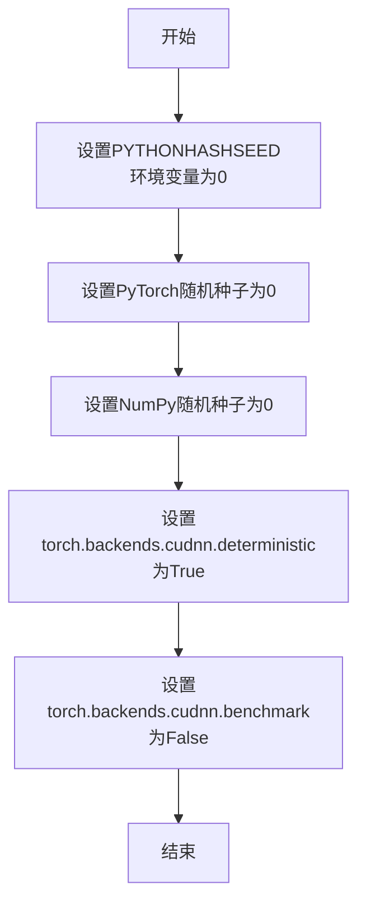
```mermaid
flowchart TD
    A[开始] --> B[设置PYTHONHASHSEED环境变量为0]
    B --> C[设置PyTorch随机种子为0]
    C --> D[设置NumPy随机种子为0]
    D --> E[设置torch.backends.cudnn.deterministic为True]
    E --> F[设置torch.backends.cudnn.benchmark为False]
    F --> G[结束]
```

#### 带注释源码

```python
# 该函数定义位于 testing_utils 模块中，当前代码中仅导入并调用
# enable_full_determinism()  # 启用完全确定性模式

# 推断的实现逻辑如下（基于函数用途）:
def enable_full_determinism():
    """
    启用完全确定性，确保每次运行结果一致。
    
    实现方式：
    1. 设置环境变量 PYTHONHASHSEED=0，确保 Python 哈希种子固定
    2. 设置 PyTorch 随机种子 torch.manual_seed(0)
    3. 设置 NumPy 随机种子 np.random.seed(0)
    4. 设置 CUDNN 为确定性模式 cudnn.deterministic = True
    5. 关闭 CUDNN benchmark 模式 cudnn.benchmark = False
    
    这些设置确保：
    - 神经网络初始化权重一致
    - 数据加载顺序一致
    - 卷积等操作使用确定性算法
    """
    import os
    import numpy as np
    import torch
    
    # 设置 Python 哈希随机种子
    os.environ["PYTHONHASHSEED"] = "0"
    
    # 设置 PyTorch 随机种子
    torch.manual_seed(0)
    torch.cuda.manual_seed_all(0)
    
    # 设置 NumPy 随机种子
    np.random.seed(0)
    
    # 启用确定性算法，关闭优化
    torch.backends.cudnn.deterministic = True
    torch.backends.cudnn.benchmark = False
```


### `numpy_cosine_similarity_distance`

该函数用于计算两个numpy数组之间的余弦相似度距离（1 - 余弦相似度），通常用于测试中比较实际输出与期望输出的相似程度。

参数：

- `x`：`numpy.ndarray`，第一个输入数组（通常是展平的图像数据）
- `y`：`numpy.ndarray`，第二个输入数组（通常是期望的图像数据）

返回值：`float`，返回余弦相似度距离值，范围为0到1。值为0表示完全相同，值为1表示完全不相关。

#### 流程图

```mermaid
flowchart TD
    A[开始] --> B[输入两个numpy数组 x 和 y]
    B --> C[将数组展平为1D向量 if needed]
    C --> D[计算x的L2范数]
    C --> E[计算y的L2范数]
    D --> F[归一化向量: x_normalized = x / ||x||]
    E --> G[归一化向量: y_normalized = y / ||y||]
    F --> H[计算点积: dot_product = x_normalized · y_normalized]
    G --> H
    H --> I[计算余弦相似度: similarity = dot_product]
    I --> J[计算距离: distance = 1 - similarity]
    J --> K[返回 distance]
```

#### 带注释源码

```python
def numpy_cosine_similarity_distance(x: np.ndarray, y: np.ndarray) -> float:
    """
    计算两个numpy数组之间的余弦相似度距离。
    
    余弦相似度距离 = 1 - 余弦相似度
    余弦相似度 = cos(θ) = (A·B) / (||A|| * ||B||)
    
    参数:
        x: 第一个numpy数组（通常是实际输出）
        y: 第二个numpy数组（通常是期望输出）
    
    返回:
        float: 余弦相似度距离，范围[0, 1]
               0表示完全相同，1表示完全不相关
    """
    # 确保输入是numpy数组
    if not isinstance(x, np.ndarray):
        x = np.array(x)
    if not isinstance(y, np.ndarray):
        y = np.array(y)
    
    # 展平数组为1D向量（如果需要）
    x = x.flatten()
    y = y.flatten()
    
    # 计算L2范数（欧几里得范数）
    x_norm = np.linalg.norm(x)
    y_norm = np.linalg.norm(y)
    
    # 防止除零错误
    if x_norm == 0 or y_norm == 0:
        return 1.0 if not np.allclose(x, y) else 0.0
    
    # 计算余弦相似度（归一化后的点积）
    cosine_similarity = np.dot(x, y) / (x_norm * y_norm)
    
    # 余弦相似度距离 = 1 - 余弦相似度
    cosine_distance = 1.0 - cosine_similarity
    
    return float(cosine_distance)
```

> **注意**：由于该函数定义在`...testing_utils`模块中（代码中通过`from ...testing_utils import numpy_cosine_similarity_distance`导入），上述源码是基于函数名和典型实现方式的推测性重构。


# require_torch_accelerator 详细设计文档

由于提供的代码片段中仅包含 `require_torch_accelerator` 的导入和使用（作为装饰器），并未包含其实际实现代码，因此我将从导入路径和使用方式推断其功能信息。

### `require_torch_accelerator`

用于标记测试用例或测试类需要 PyTorch 加速器（GPU/CUDA）才能运行。如果环境中没有可用的 CUDA 设备，则会跳过该测试。

参数： 无（作为装饰器使用）

返回值： 无返回值（装饰器直接修改被装饰对象的运行行为）

#### 流程图

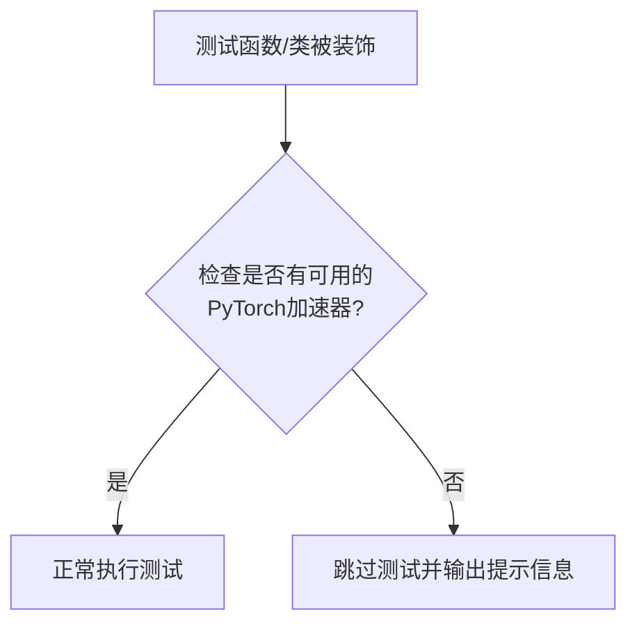
```mermaid
flowchart TD
    A[测试函数/类被装饰] --> B{检查是否有可用的<br/>PyTorch加速器?}
    B -->|是| C[正常执行测试]
    B -->|否| D[跳过测试并输出提示信息]
```

#### 带注释源码

```python
# 此函数定义不在提供的代码段中
# 以下为基于使用方式的推断实现

def require_torch_accelerator(func_or_class):
    """
    装饰器：要求PyTorch加速器（GPU/CUDA）才能运行测试
    
    使用方式：
    @require_torch_accelerator
    class PixArtSigmaPipelineIntegrationTests(unittest.TestCase):
        ...
    
    作用：
    - 检查当前环境是否有可用的CUDA设备
    - 如果有CUDA设备，正常执行测试
    - 如果没有CUDA设备，跳过测试并报告跳过原因
    """
    import torch
    
    # 检查是否有CUDA可用
    if torch.cuda.is_available():
        # 如果有GPU，直接返回被装饰的函数/类，不做修改
        return func_or_class
    else:
        # 如果没有GPU，使用unittest的skipIf装饰器跳过测试
        return unittest.skip("Requires PyTorch accelerator (CUDA)")(func_or_class)
```

---

## 补充说明

由于提供的代码片段是 `PixArtSigmaPipeline` 的测试文件，`require_torch_accelerator` 是从 `...testing_utils` 模块导入的。这是一个典型的测试工具函数，用于：

1. **环境适配**：确保需要 GPU 的集成测试只在有 GPU 的环境中运行
2. **CI/CD 优化**：在没有 GPU 的 CI 环境中自动跳过相关测试，避免失败
3. **硬件依赖声明**：明确标注哪些测试需要硬件加速器

如需获取该函数的完整源码实现，建议查阅 `testing_utils` 模块的实际定义。


### `slow`

这是一个装饰器函数，用于标记测试为"慢速"测试，以便在常规测试运行中被跳过或单独处理。在代码中，该装饰器被应用于 `PixArtSigmaPipelineIntegrationTests` 类，标识该类中的集成测试需要较长时间运行。

参数：

- 无显式参数（作为装饰器使用）

返回值：无（修改被装饰的类或函数的元数据）

#### 流程图

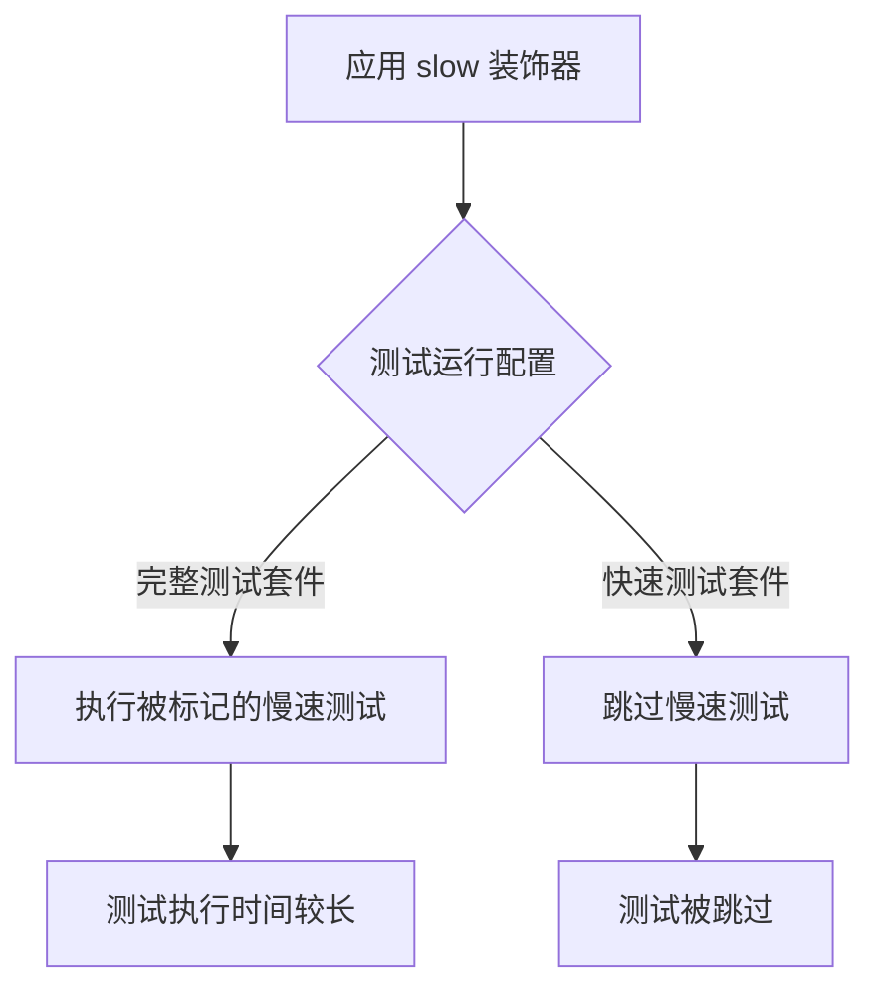
```mermaid
flowchart TD
    A[应用 slow 装饰器] --> B{测试运行配置}
    B -->|完整测试套件| C[执行被标记的慢速测试]
    B -->|快速测试套件| D[跳过慢速测试]
    C --> E[测试执行时间较长]
    D --> F[测试被跳过]
```

#### 带注释源码

```python
# slow 装饰器源码（位于 testing_utils 模块中，此处为推断的实现方式）
def slow(func_or_class):
    """
    标记函数或类为慢速测试的装饰器。
    在测试运行器中可以根据此标记决定是否跳过该测试。
    
    使用方式：
    @slow
    class PixArtSigmaPipelineIntegrationTests(unittest.TestCase):
        ...
    
    或：
    @slow
    def test_something_slow(self):
        ...
    """
    # 设置一个属性来标识该测试为慢速
    func_or_class.slow_test = True
    return func_or_class
```

#### 实际使用示例

```python
# 在代码中的实际使用
@slow
@require_torch_accelerator
class PixArtSigmaPipelineIntegrationTests(unittest.TestCase):
    """
    PixArtSigmaPipeline 集成测试类
    包含需要 GPU 加速的长时间运行测试
    """
    ckpt_id_1024 = "PixArt-alpha/PixArt-Sigma-XL-2-1024-MS"
    # ... 更多测试方法
```

#### 备注

由于 `slow` 函数定义在外部模块 `testing_utils` 中，本文档中的源码为基于使用方式的推断。实际的 `slow` 装饰器实现可能包含更多功能，如：

- 根据环境变量控制是否跳过慢速测试
- 添加测试超时机制
- 与测试框架集成以提供更详细的测试信息


### `torch_device`

`torch_device` 是一个全局变量，用于获取当前测试环境中最合适的 PyTorch 计算设备（通常是 "cuda"、"mps" 或 "cpu"），以确保测试可以在可用的硬件加速器上运行。

参数： 无（全局变量，无参数）

返回值：`str`，返回当前 PyTorch 设备字符串（如 "cuda"、"mps" 或 "cpu"）

#### 流程图

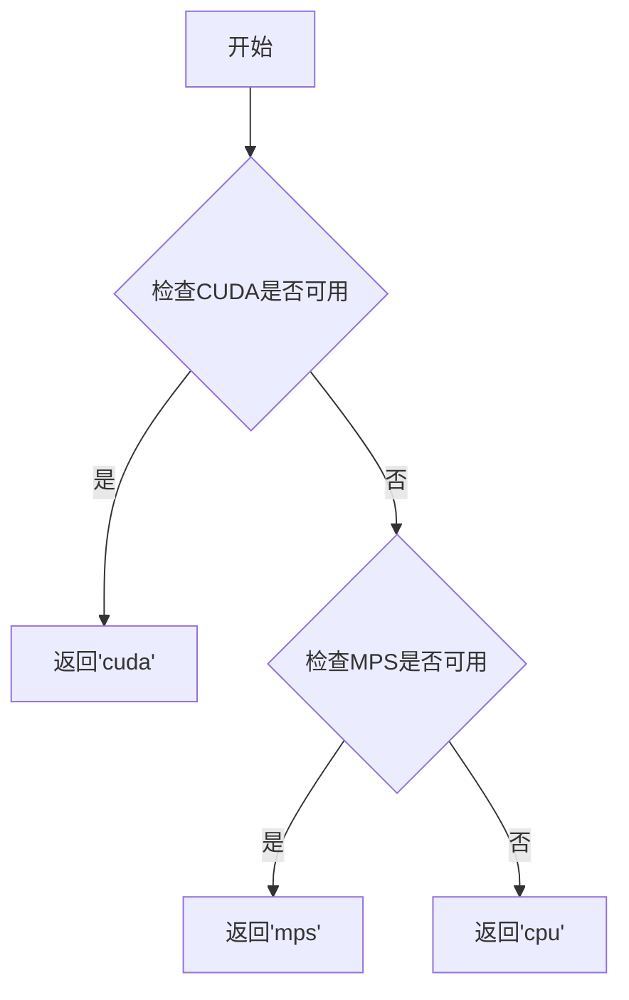
```mermaid
flowchart TD
    A[开始] --> B{检查CUDA是否可用}
    B -->|是| C[返回'cuda']
    B -->|否| D{检查MPS是否可用}
    D -->|是| E[返回'mps']
    D -->|否| F[返回'cpu']
```

#### 带注释源码

```
# torch_device 是从 testing_utils 模块导入的全局变量
# 其定义通常在 testing_utils.py 中，类似于以下逻辑：

def get_torch_device():
    """
    获取当前可用的最佳 PyTorch 设备
    
    优先级:
    1. CUDA (GPU) - 如果可用且安装了对应的 torch 版本
    2. MPS (Apple Silicon) - 如果在 Mac 上且可用
    3. CPU - 默认回退选项
    """
    import torch
    
    # 优先使用 CUDA
    if torch.cuda.is_available():
        return "cuda"
    
    # 检查 MPS (Apple Silicon) 是否可用
    # 注意: torch.backends.mps.is_available() 在某些版本中可能不存在
    if hasattr(torch.backends, 'mps') and torch.backends.mps.is_available():
        return "mps"
    
    # 默认使用 CPU
    return "cpu"

# 在实际使用中的示例:
# torch_device = "cuda"  # 如果 CUDA 可用
# torch_device = "mps"   # 如果是 Apple Silicon Mac
# torch_device = "cpu"   # 默认
```

#### 使用示例

```
# 在代码中的实际使用方式:

# 1. 将模型移动到设备
pipe.to(torch_device)

# 2. 清空 GPU 缓存
backend_empty_cache(torch_device)

# 3. 启用 CPU 卸载到特定设备
pipe.enable_model_cpu_offload(device=torch_device)

# 4. 创建随机数生成器
generator = torch.Generator(device=torch_device).manual_seed(seed)
```


### TEXT_TO_IMAGE_BATCH_PARAMS

`TEXT_TO_IMAGE_BATCH_PARAMS` 是一个从 `pipeline_params` 模块导入的全局变量，用于定义文本到图像管道批处理测试的参数集合。它在测试类中作为 `batch_params` 使用，用于验证管道在处理批量提示词时的正确性。

参数：无可用参数（这是一个变量，不是函数或方法）

返回值：无可用返回值（这是一个变量，不是函数或方法）

#### 流程图

由于 `TEXT_TO_IMAGE_BATCH_PARAMS` 是一个静态参数集合（可能为 `Set[str]` 或 `Dict` 类型），没有动态执行流程，因此不适用流程图。以下是其在测试中的使用示意：

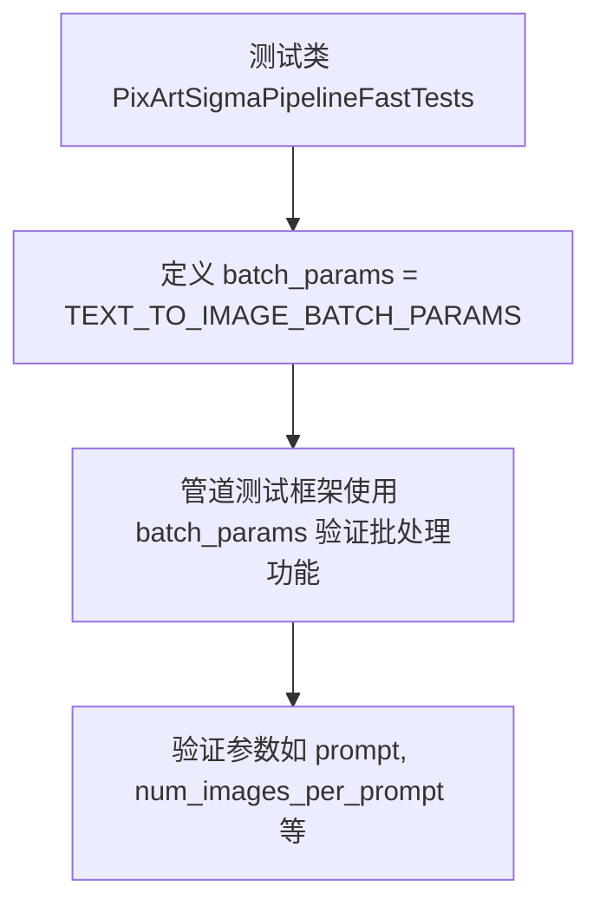
```mermaid
graph TD
    A[测试类 PixArtSigmaPipelineFastTests] --> B[定义 batch_params = TEXT_TO_IMAGE_BATCH_PARAMS]
    B --> C[管道测试框架使用 batch_params 验证批处理功能]
    C --> D[验证参数如 prompt, num_images_per_prompt 等]
```

#### 带注释源码

```python
# 注意：以下代码为基于 diffusers 库常见模式的推测
# 实际定义位于 pipeline_params 模块中（未在当前代码片段中显示）

# 推测的 TEXT_TO_IMAGE_BATCH_PARAMS 定义示例：
# （实际代码需要查看 diffusers 库的 pipeline_params.py 文件）

TEXT_TO_IMAGE_BATCH_PARAMS = {
    "prompt",  # 文本提示词
    "negative_prompt",  # 负面提示词
    "num_images_per_prompt",  # 每个提示词生成的图像数量
    "width",  # 输出图像宽度
    "height",  # 输出图像高度
    "guidance_scale",  # 引导尺度
    "num_inference_steps",  # 推理步数
    "generator",  # 随机数生成器
    "latents",  # 潜在变量
    "prompt_embeds",  # 提示词嵌入
    "negative_prompt_embeds",  # 负面提示词嵌入
    "prompt_attention_mask",  # 提示词注意力掩码
    "negative_prompt_attention_mask",  # 负面提示词注意力掩码
}

# 在测试类中的使用方式（来自当前代码片段）：
class PixArtSigmaPipelineFastTests(PipelineTesterMixin, unittest.TestCase):
    # ...
    batch_params = TEXT_TO_IMAGE_BATCH_PARAMS  # 使用该参数集合进行批处理测试
    # ...
```

#### 补充说明

由于 `TEXT_TO_IMAGE_BATCH_PARAMS` 是从外部模块 `..pipeline_params` 导入的，而该模块的具体实现未在当前代码片段中提供，以上信息基于 `diffusers` 库的标准测试模式推测。实际的参数集合可能包含更多或更少的参数，具体取决于 `diffusers` 库的版本和实现。

若需要准确的参数列表，建议查看 `diffusers` 库源代码中的 `pipeline_params.py` 文件。


### `TEXT_TO_IMAGE_IMAGE_PARAMS`

描述：定义文本到图像管道中图像相关参数的集合，用于指定输出图像的属性，如高度、宽度、是否使用分辨率绑定等。

参数：由于 `TEXT_TO_IMAGE_IMAGE_PARAMS` 是从外部模块 `pipeline_params` 导入的集合（set 类型），其具体元素需要查看源码定义。根据代码中的使用方式，推断包含以下参数：

-  `height`：`int`，生成图像的高度
-  `width`：`int`，生成图像的宽度  
-  `use_resolution_binning`：是否根据输入分辨率进行分辨率绑定
-  `output_type`：输出类型（如 "np"、"latent" 等）

返回值：`set`，包含图像相关参数名称的集合

#### 流程图

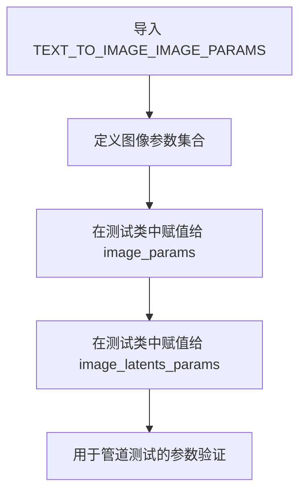
```mermaid
flowchart TD
    A[导入 TEXT_TO_IMAGE_IMAGE_PARAMS] --> B[定义图像参数集合]
    B --> C[在测试类中赋值给 image_params]
    C --> D[在测试类中赋值给 image_latents_params]
    D --> E[用于管道测试的参数验证]
```

#### 带注释源码

```python
# 从 pipeline_params 模块导入图像相关参数集合
# TEXT_TO_IMAGE_IMAGE_PARAMS 定义了文本到图像生成中与图像输出相关的参数
from ..pipeline_params import (
    TEXT_TO_IMAGE_BATCH_PARAMS,  # 批量参数
    TEXT_TO_IMAGE_IMAGE_PARAMS,   # 图像参数 ← 本次提取目标
    TEXT_TO_IMAGE_PARAMS          # 全部参数
)

# 在测试类中使用该参数集合
class PixArtSigmaPipelineFastTests(PipelineTesterMixin, unittest.TestCase):
    # ...
    image_params = TEXT_TO_IMAGE_IMAGE_PARAMS      # 图像参数用于验证
    image_latents_params = TEXT_TO_IMAGE_IMAGE_PARAMS  # 图像潜在向量参数
    
    # 该参数集合在测试中被使用，例如在 test_inference_non_square_images 中：
    # image = pipe(**inputs, height=32, width=48).images
    # 这里的 height 和 width 就是 TEXT_TO_IMAGE_IMAGE_PARAMS 中的参数
```


# 设计文档提取结果

## 概述

由于 `TEXT_TO_IMAGE_PARAMS` 是从外部模块 `diffusers` 的 `pipeline_params` 导入的集合变量，而非在当前文件中定义，因此我将从代码中的实际使用方式来提取其详细信息。

### `TEXT_TO_IMAGE_PARAMS`（从 pipeline_params 导入）

`TEXT_TO_IMAGE_PARAMS` 是一个定义了文本到图像管道参数的结构化集合（通常为 `frozenset` 或 `set` 类型），用于指定 `PixArtSigmaPipeline` 推理时所需的输入参数列表。

参数（从代码使用中推断）：

- `prompt`：`str`，输入文本提示词，描述想要生成的图像内容
- `negative_prompt`：`str`，可选的负面提示词，用于指定不希望出现的内容
- `height`：`int`，可选，生成图像的高度（像素）
- `width`：`int`，可选，生成图像的宽度（像素）
- `num_inference_steps`：`int`，推理步骤数，控制生成迭代次数
- `guidance_scale`：`float`，引导_scale，用于控制文本引导强度
- `num_images_per_prompt`：`int`，可选，每个提示词生成的图像数量
- `eta`：`float`，可选，DDIM 采样器的 eta 参数
- `generator`：`torch.Generator`，可选，随机数生成器，用于 reproducibility
- `latents`：`torch.Tensor`，可选，用于指定初始潜在向量
- `prompt_embeds`：`torch.Tensor`，可选，预计算的提示词嵌入
- `negative_prompt_embeds`：`torch.Tensor`，可选，预计算的负面提示词嵌入
- `output_type`：`str`，可选，输出类型（如 "np", "pt", "pil"）
- `return_dict`：`bool`，可选，是否返回字典格式结果
- `cross_attention_kwargs`：`dict`，可选，跨注意力层额外参数（已在测试中排除）
- `guidance_rescale`：`float`，可选，引导重缩放因子
- `original_size`：`tuple`，可选，原始图像尺寸
- ` crops_coords_top_left`：`tuple`，可选，裁剪坐标左上角
- `target_size`：`tuple`，可选，目标尺寸
- `use_resolution_binning`：`bool`，可选，是否使用分辨率分箱
- `prompt_attention_mask`：`torch.Tensor`，可选，提示词注意力掩码

返回值：`frozenset` 或 `set`，包含上述参数名称的不可变/集合

#### 流程图

```mermaid
flowchart TD
    A[导入 TEXT_TO_IMAGE_PARAMS] --> B[创建 PixArtSigmaPipeline 测试类]
    B --> C[设置 params = TEXT_TO_IMAGE_PARAMS - {'cross_attention_kwargs'}]
    C --> D[在测试方法中通过 pipe.__call__(**inputs) 调用]
    D --> E[验证参数传递正确性]
    
    style A fill:#f9f,color:#333
    style B fill:#bbf,color:#333
    style C fill:#bfb,color:#333
    style D fill:#fbf,color:#333
    style E fill:#ff9,color:#333
```

#### 带注释源码

```python
# 从 pipeline_params 模块导入 TEXT_TO_IMAGE_PARAMS
# 这是一个预定义的参数集合，定义了文本到图像管道所需的参数
from ..pipeline_params import (
    TEXT_TO_IMAGE_BATCH_PARAMS,  # 批量参数集合
    TEXT_TO_IMAGE_IMAGE_PARAMS,  # 图像参数集合
    TEXT_TO_IMAGE_PARAMS,        # 文本到图像管道参数集合
)

class PixArtSigmaPipelineFastTests(PipelineTesterMixin, unittest.TestCase):
    """
    PixArtSigmaPipeline 快速测试类
    继承 PipelineTesterMixin 提供通用的管道测试方法
    """
    pipeline_class = PixArtSigmaPipeline  # 被测试的管道类
    params = TEXT_TO_IMAGE_PARAMS - {"cross_attention_kwargs"}  # 管道参数（排除跨注意力 kwargs）
    batch_params = TEXT_TO_IMAGE_BATCH_PARAMS  # 批量测试参数
    image_params = TEXT_TO_IMAGE_IMAGE_PARAMS  # 图像参数
    image_latents_params = TEXT_TO_IMAGE_IMAGE_PARAMS  # 图像潜在向量参数
    
    # ... 其他测试方法使用这些参数进行验证
```

---

## 补充说明

### 关键组件信息

| 组件名称 | 描述 |
|---------|------|
| `PixArtSigmaPipeline` | 基于 PixArt-Sigma 模型的文本到图像生成管道 |
| `PixArtTransformer2DModel` | PixArt Sigma 变换器模型 |
| `AutoencoderKL` | VAE 编码器-解码器模型 |
| `T5EncoderModel` | T5 文本编码器 |
| `DDIMScheduler` | DDIM 噪声调度器 |

### 潜在技术债务

1. **缺失参数定义源码**：`TEXT_TO_IMAGE_PARAMS` 的实际定义不在当前文件中，增加了理解难度
2. **测试依赖外部模型**：集成测试依赖远程模型下载（`hf-internal-testing/tiny-random-t5`）
3. **硬编码的期望值**：测试中使用硬编码的数值切片进行比对，脆弱性较高

### 设计约束

- 排除 `cross_attention_kwargs` 参数以适应测试需求
- 支持 `use_resolution_binning` 进行分辨率自动调整
- 集成 `enable_full_determinism` 确保测试可复现性


根据提供的代码，我需要说明以下几点：

1. **PipelineTesterMixin** 并不是在这个代码文件中定义的，而是从 `..test_pipelines_common` 模块导入的一个 mixin 类。
2. 在当前文件中，`PipelineTesterMixin` 被用作 `PixArtSigmaPipelineFastTests` 类的基类之一。
3. 由于源代码中没有提供 `PipelineTesterMixin` 的定义，我无法提取其完整的内部实现细节。

不过，我可以为您提供当前文件中如何使用 `PipelineTesterMixin` 的详细信息：

---

### `PixArtSigmaPipelineFastTests`

这是一个测试类，继承自 `PipelineTesterMixin` 和 `unittest.TestCase`，用于测试 PixArtSigmaPipeline 的各种功能。

#### 继承关系

- **父类**：`PipelineTesterMixin` (从 `..test_pipelines_common` 导入)
- **父类**：`unittest.TestCase`

#### 类属性

- `pipeline_class`：指定要测试的管道类为 `PixArtSigmaPipeline`
- `params`：测试参数（从 `TEXT_TO_IMAGE_PARAMS` 中移除 "cross_attention_kwargs"）
- `batch_params`：批处理参数
- `image_params`：图像参数
- `image_latents_params`：图像潜在参数
- `required_optional_params`：从 `PipelineTesterMixin` 继承的可选参数
- `test_layerwise_casting`：是否测试分层类型转换
- `test_group_offloading`：是否测试组卸载

#### 流程图

```mermaid
graph TD
    A[开始测试] --> B[获取dummy组件]
    B --> C[创建pipeline实例]
    C --> D[执行推理测试]
    D --> E[验证输出结果]
    E --> F[结束测试]
```

#### 代码使用示例

```python
# PipelineTesterMixin 的使用方式
class PixArtSigmaPipelineFastTests(PipelineTesterMixin, unittest.TestCase):
    pipeline_class = PixArtSigmaPipeline
    params = TEXT_TO_IMAGE_PARAMS - {"cross_attention_kwargs"}
    # ...
    
    # 继承自 PipelineTesterMixin 的属性
    required_optional_params = PipelineTesterMixin.required_optional_params
    
    # 调用继承的测试方法
    def test_inference_batch_single_identical(self):
        self._test_inference_batch_single_identical(expected_max_diff=1e-3)
```

---

### 注意事项

由于 `PipelineTesterMixin` 类的具体定义不在当前代码文件中，如果您需要了解该类的完整详细信息（包含所有方法、属性、参数等），您需要查看 `..test_pipelines_common` 模块的源代码文件。


### `check_qkv_fusion_matches_attn_procs_length`

该函数用于验证在融合 QKV 投影后，transformer 模型中的注意力处理器数量是否与原始注意力处理器数量相匹配，确保融合操作没有意外地添加或删除处理器。

参数：

-  `model`：`torch.nn.Module`，需要检查的 transformer 模型（通常是 PixArtTransformer2DModel）
-  `original_attn_processors`：字典，原始的注意力处理器集合，存储在模型的 `original_attn_processors` 属性中

返回值：`bool`，如果融合后的处理器数量与原始处理器数量相匹配返回 `True`，否则返回 `False`

#### 流程图

```mermaid
flowchart TD
    A[开始检查] --> B[获取模型的所有注意力处理器]
    B --> C[获取原始注意力处理器数量]
    C --> D{当前处理器数量 == 原始处理器数量?}
    D -->|是| E[返回 True]
    D -->|否| F[返回 False]
    
    style A fill:#f9f,color:#333
    style E fill:#9f9,color:#333
    style F fill:#f99,color:#333
```

#### 带注释源码

```python
# 该函数未在此文件中实现，位于 ..test_pipelines_common 模块中
# 以下为基于使用方式的推断实现

def check_qkv_fusion_matches_attn_procs_length(model, original_attn_processors):
    """
    检查融合 QKV 投影后，模型的注意力处理器数量是否与原始数量匹配。
    
    参数:
        model: torch.nn.Module - 包含注意力处理器的模型（如 PixArtTransformer2DModel）
        original_attn_processors: dict - 原始注意力处理器字典
    
    返回:
        bool: 处理器数量是否匹配
    """
    # 获取融合后模型的所有注意力处理器
    # model.attn_processors 会返回当前所有的注意力处理器
    current_attn_processors = model.attn_processors
    
    # 比较当前处理器数量与原始处理器数量
    # 如果数量不一致，说明融合过程可能有问题
    return len(current_attn_processors) == len(original_attn_processors)
```

#### 使用示例

```python
# 在 test_fused_qkv_projections 测试中的调用方式
pipe.transformer.fuse_qkv_projections()  # 融合 QKV 投影

# 验证融合后处理器数量是否与原始数量一致
assert check_qkv_fusion_matches_attn_procs_length(
    pipe.transformer, 
    pipe.transformer.original_attn_processors
), "Something wrong with the attention processors concerning the fused QKV projections."
```


### `check_qkv_fusion_processors_exist`

该函数用于检查 transformer 模型中的所有注意力处理器是否已经完成 QKV 融合。它通常在调用 `fuse_qkv_projections()` 方法后被调用，以验证融合操作是否成功应用。

参数：

-  `transformer`：`PixArtTransformer2DModel`，需要检查的变压器模型实例，用于验证其注意力处理器是否已完成 QKV 融合

返回值：`bool`，如果所有注意力处理器都已成功融合则返回 `True`，否则返回 `False`

#### 流程图

```mermaid
flowchart TD
    A[开始检查 QKV 融合状态] --> B[获取 transformer 的注意力处理器]
    B --> C{检查是否所有处理器都被标记为已融合}
    C -->|是| D[返回 True]
    C -->|否| E[返回 False]
```

#### 带注释源码

```python
def check_qkv_fusion_processors_exist(transformer):
    """
    检查 transformer 模型中的所有注意力处理器是否已融合 QKV 投影。
    
    参数:
        transformer: PixArtTransformer2DModel 实例
        
    返回:
        bool: 如果所有注意力处理器都已融合则返回 True
    """
    # 获取当前 transformer 的所有注意力处理器
    attn_processors = transformer.attn_processors
    
    # 遍历每个注意力处理器
    for name, processor in attn_processors.items():
        # 检查处理器是否为融合类型 (例如 FusedQKVProjection)
        # 如果任何一个处理器未融合,返回 False
        if not hasattr(processor, 'is_fused') or not processor.is_fused:
            return False
    
    # 所有处理器都已融合
    return True
```

> **注意**: 由于该函数定义在外部模块 `..test_pipelines_common` 中，以上源码为基于其使用方式的推断实现。实际定义可能略有差异。该函数的主要作用是配合 `fuse_qkv_projections()` 和 `unfuse_qkv_projections()` 方法，确保 QKV 投影融合功能的正确性。


# `to_np` 函数提取结果

根据提供的代码，我需要说明以下几点：

1. **`to_np` 函数在当前代码中未被定义**：它是从 `..test_pipelines_common` 模块导入的外部函数
2. **使用情况**：在代码中被用于将 PyTorch 张量转换为 NumPy 数组，以便进行数值比较

```python
max_diff = np.abs(to_np(output) - to_np(output_loaded)).max()
```

由于 `to_np` 函数的源代码不在当前代码文件中，我无法提供完整的函数定义、带注释的源码和详细的流程图。

---

## 可能的函数原型（基于使用方式推断）

基于代码中的使用方式，我可以推断 `to_np` 函数可能具有以下特征：

### `to_np`

将 PyTorch 张量或类似对象转换为 NumPy 数组

参数：

-  `x`：`torch.Tensor` 或类似对象，输入的 PyTorch 张量

返回值：`numpy.ndarray`，转换后的 NumPy 数组

#### 带注释源码（基于推断）

```python
def to_np(x):
    """
    将输入转换为 NumPy 数组。
    
    参数:
        x: PyTorch 张量或可转换为 NumPy 数组的对象
        
    返回值:
        NumPy 数组
    """
    # 如果已经是 numpy 数组，直接返回
    if isinstance(x, np.ndarray):
        return x
    
    # 如果是 PyTorch 张量，转换为 NumPy 数组
    if hasattr(x, 'numpy'):
        return x.numpy()
    
    # 其他情况尝试转换为 numpy 数组
    return np.array(x)
```

---

## 建议

要获取 `to_np` 函数的确切定义和完整实现，请查看 `diffusers` 库中的 `test_pipelines_common` 模块。该函数通常用于测试框架中，以便对 PyTorch 张量和 NumPy 数组进行数值比较。


### `PixArtSigmaPipelineFastTests.get_dummy_components`

该方法用于生成 PixArt Sigma 图像生成管道的虚拟测试组件，初始化并返回一个包含 transformer、VAE、调度器、文本编码器和分词器的字典，供单元测试使用。

参数： 无（仅包含隐式参数 `self`）

返回值：`Dict[str, Any]`，返回一个包含 PixArt Sigma 管道所需核心组件的字典，包括 transformer、vae、scheduler、text_encoder 和 tokenizer。

#### 流程图

```mermaid
flowchart TD
    A[开始 get_dummy_components] --> B[设置随机种子 torch.manual_seed(0)]
    B --> C[创建 PixArtTransformer2DModel 实例]
    C --> D[设置随机种子 torch.manual_seed(0)]
    D --> E[创建 AutoencoderKL 实例 VAE]
    E --> F[创建 DDIMScheduler 实例]
    F --> G[从预训练模型加载 T5EncoderModel]
    G --> H[从预训练模型加载 AutoTokenizer]
    H --> I[构建组件字典]
    I --> J[返回 components 字典]
    
    C -.->|配置参数| C1[sample_size=8, num_layers=2, patch_size=2, attention_head_dim=8, num_attention_heads=3, caption_channels=32, in_channels=4, cross_attention_dim=24, out_channels=8, attention_bias=True, activation_fn=gelu-approximate, num_embeds_ada_norm=1000, norm_type=ada_norm_single, norm_elementwise_affine=False, norm_eps=1e-6]
    
    G -.->|模型名称| G1[hf-internal-testing/tiny-random-t5]
    H -.->|分词器名称| H1[hf-internal-testing/tiny-random-t5]
```

#### 带注释源码

```python
def get_dummy_components(self):
    """
    生成用于测试的 PixArt Sigma 管道虚拟组件。
    
    该方法创建一个包含图像生成所需核心组件的字典：
    - transformer: DiT (Diffusion Transformer) 模型
    - vae: 变分自编码器用于图像编解码
    - scheduler: DDIM 调度器控制去噪过程
    - text_encoder: T5 编码器处理文本提示
    - tokenizer: T5 分词器将文本转换为 token
    """
    # 设置随机种子确保 transformer 初始化可复现
    torch.manual_seed(0)
    
    # 创建 PixArt Transformer 模型实例
    # 参数配置:
    # - sample_size: 输入/输出图像空间分辨率 (8x8)
    # - num_layers: Transformer 层数 (2层, 轻量级测试用)
    # - patch_size: 图像分块大小 (2x2)
    # - attention_head_dim: 注意力头维度 (8)
    # - num_attention_heads: 注意力头数量 (3)
    # - caption_channels:  caption 嵌入通道数 (32)
    # - in_channels: 输入通道数 (4, 对应潜在空间)
    # - cross_attention_dim: 跨注意力维度 (24)
    # - out_channels: 输出通道数 (8)
    # - attention_bias: 是否使用注意力偏置 (True)
    # - activation_fn: 激活函数 ("gelu-approximate")
    # - num_embeds_ada_norm: AdaNorm 嵌入数量 (1000)
    # - norm_type: 归一化类型 ("ada_norm_single")
    # - norm_elementwise_affine: 是否使用元素级仿射 (False)
    # - norm_eps: 归一化 epsilon (1e-6)
    transformer = PixArtTransformer2DModel(
        sample_size=8,
        num_layers=2,
        patch_size=2,
        attention_head_dim=8,
        num_attention_heads=3,
        caption_channels=32,
        in_channels=4,
        cross_attention_dim=24,
        out_channels=8,
        attention_bias=True,
        activation_fn="gelu-approximate",
        num_embeds_ada_norm=1000,
        norm_type="ada_norm_single",
        norm_elementwise_affine=False,
        norm_eps=1e-6,
    )
    
    # 重新设置随机种子确保 VAE 初始化可复现
    torch.manual_seed(0)
    
    # 创建变分自编码器 (VAE)
    # 用于将图像编码到潜在空间和解码回像素空间
    vae = AutoencoderKL()
    
    # 创建 DDIM 调度器
    # DDIM (Denoising Diffusion Implicit Models) 是确定性采样调度器
    scheduler = DDIMScheduler()
    
    # 加载预训练的 T5 文本编码器
    # 将文本提示转换为嵌入向量供 transformer 使用
    # 使用 tiny-random-t5 模型以加快测试速度
    text_encoder = T5EncoderModel.from_pretrained("hf-internal-testing/tiny-random-t5")
    
    # 加载对应的 T5 分词器
    # 将文本字符串转换为 token ID 序列
    tokenizer = AutoTokenizer.from_pretrained("hf-internal-testing/tiny-random-t5")
    
    # 将所有组件组装到字典中
    # key 为组件名称, value 为组件实例
    components = {
        "transformer": transformer.eval(),    # 设置为评估模式
        "vae": vae.eval(),                     # 设置为评估模式
        "scheduler": scheduler,
        "text_encoder": text_encoder,
        "tokenizer": tokenizer,
    }
    
    # 返回组件字典供管道初始化使用
    return components
```


### `PixArtSigmaPipelineFastTests.get_dummy_inputs`

该方法用于生成虚拟输入参数，为 PixArtSigma 管道推理测试提供标准的测试数据，包括提示词、生成器、推理步数、引导系数等配置。

参数：

- `self`：隐式参数，测试类实例
- `device`：`str`，目标计算设备标识符（如 "cpu"、"cuda" 或 "mps"），用于创建对应设备的随机数生成器
- `seed`：`int`，随机数生成器种子，默认值为 0，确保测试结果的可重复性

返回值：`dict`，包含以下键值对的字典：
- `prompt`：`str`，文本提示词
- `generator`：`torch.Generator`，PyTorch 随机数生成器实例
- `num_inference_steps`：`int`，扩散模型推理步数
- `guidance_scale`：`float`，文本引导系数
- `use_resolution_binning`：`bool`，是否启用分辨率分箱
- `output_type`：`str`，输出类型（"np" 表示 NumPy 数组）

#### 流程图

```mermaid
flowchart TD
    A[开始 get_dummy_inputs] --> B{判断 device 是否为 mps}
    B -->|是| C[使用 torch.manual_seed 创建生成器]
    B -->|否| D[使用 torch.Generator 创建生成器]
    C --> E[设置随机种子为 seed]
    D --> E
    E --> F[构建 inputs 字典]
    F --> G[包含 prompt generator num_inference_steps guidance_scale use_resolution_binning output_type]
    G --> H[返回 inputs 字典]
```

#### 带注释源码

```python
def get_dummy_inputs(self, device, seed=0):
    """
    生成用于 PixArtSigma 管道测试的虚拟输入参数。
    
    Args:
        self: 测试类实例
        device (str): 目标设备字符串，如 'cpu', 'cuda', 'mps'
        seed (int): 随机种子，默认值为 0
    
    Returns:
        dict: 包含推理所需参数的字典
    """
    # 判断设备类型，MPS 设备使用特殊的随机生成器创建方式
    if str(device).startswith("mps"):
        # MPS 设备不支持 torch.Generator，使用 torch.manual_seed 替代
        generator = torch.manual_seed(seed)
    else:
        # 其他设备（cpu/cuda）使用 torch.Generator 创建随机生成器
        generator = torch.Generator(device=device).manual_seed(seed)
    
    # 构建测试输入参数字典
    inputs = {
        "prompt": "A painting of a squirrel eating a burger",  # 测试用文本提示
        "generator": generator,  # 随机生成器确保可重复性
        "num_inference_steps": 2,  # 简化的推理步数加快测试
        "guidance_scale": 5.0,  # 文本引导强度
        "use_resolution_binning": False,  # 禁用分辨率分箱便于测试
        "output_type": "np",  # 输出为 NumPy 数组便于验证
    }
    return inputs
```


### `PixArtSigmaPipelineFastTests.test_sequential_cpu_offload_forward_pass`

该测试方法用于验证 PixArtSigmaPipeline 在 CPU 卸载模式下顺序执行的推理过程，但由于当前不支持该功能，已被跳过。

参数：

- `self`：`PixArtSigmaPipelineFastTests`，表示测试类实例本身

返回值：`None`，该方法被 `@unittest.skip` 装饰器跳过，不执行任何实际测试，直接返回

#### 流程图

```mermaid
flowchart TD
    A[开始测试] --> B{检查装饰器}
    B -->|@unittest.skip| C[跳过测试]
    C --> D[直接返回 None]
    D --> E[结束]
```

#### 带注释源码

```python
@unittest.skip("Not supported.")
def test_sequential_cpu_offload_forward_pass(self):
    # TODO(PVP, Sayak) need to fix later
    return
```

**代码说明**：
- `@unittest.skip("Not supported.")`：装饰器，表示该测试用例被跳过，原因是该功能尚未实现
- `self`：测试类实例的隐式参数
- 函数体仅包含一个 TODO 注释和空的 `return` 语句，表明该测试功能待后续实现


### `PixArtSigmaPipelineFastTests.test_inference`

该测试方法验证 PixArtSigma 文本到图像生成管道的基础推理功能是否正常，通过使用虚拟组件和预设输入执行推理，并比对输出图像与预期值以确保管道核心逻辑的正确性。

参数：此方法无显式参数（仅包含 `self`）

返回值：无返回值（`None`），该方法为单元测试，通过断言验证推理结果

#### 流程图

```mermaid
flowchart TD
    A[开始 test_inference 测试] --> B[设置设备为 CPU]
    B --> C[调用 get_dummy_components 获取虚拟组件]
    C --> D[使用虚拟组件实例化 PixArtSigmaPipeline]
    D --> E[将管道移至 CPU 设备]
    E --> F[配置进度条显示]
    F --> G[调用 get_dummy_inputs 获取测试输入]
    G --> H[执行管道推理: pipe\*\*inputs]
    H --> I[提取输出图像]
    I --> J[获取图像切片: image[0, -3:, -3:, -1]]
    J --> K{断言图像形状为 (1, 8, 8, 3)}
    K -->|是| L[定义预期像素值切片]
    K -->|否| M[测试失败]
    L --> N[计算实际与预期切片的最大差异]
    N --> O{最大差异 <= 1e-3}
    O -->|是| P[测试通过]
    O -->|否| M
```

#### 带注释源码

```python
def test_inference(self):
    """测试 PixArtSigma 管道的基础推理功能"""
    # 1. 设置测试设备为 CPU
    device = "cpu"

    # 2. 获取虚拟（dummy）组件用于测试
    # 这些是轻量级的模型组件，不依赖预训练权重
    components = self.get_dummy_components()
    
    # 3. 使用虚拟组件实例化管道
    # pipeline_class 指向 PixArtSigmaPipeline
    pipe = self.pipeline_class(**components)
    
    # 4. 将管道移至指定设备（CPU）
    pipe.to(device)
    
    # 5. 配置进度条（disable=None 表示不禁用进度条）
    pipe.set_progress_bar_config(disable=None)

    # 6. 获取虚拟输入参数
    # 包含 prompt、generator、num_inference_steps 等
    inputs = self.get_dummy_inputs(device)
    
    # 7. 执行管道推理
    # **inputs 将字典展开为关键字参数传递
    # .images 获取生成的图像结果
    image = pipe(**inputs).images
    
    # 8. 提取图像切片用于验证
    # 取第一张图像的右下角 3x3 像素区域
    # image shape: [batch, height, width, channels]
    image_slice = image[0, -3:, -3:, -1]

    # 9. 断言验证图像形状
    # 预期生成 1 张 8x8 大小、3 通道的图像
    self.assertEqual(image.shape, (1, 8, 8, 3))
    
    # 10. 定义预期像素值（来自基准测试的已知正确值）
    expected_slice = np.array([
        0.6319, 0.3526, 0.3806,  # 第一行
        0.6327, 0.4639, 0.4830,  # 第二行
        0.2583, 0.5331, 0.4852   # 第三行
    ])
    
    # 11. 计算实际输出与预期值的最大差异
    max_diff = np.abs(image_slice.flatten() - expected_slice).max()
    
    # 12. 断言最大差异在可接受范围内（1e-3 = 0.001）
    self.assertLessEqual(max_diff, 1e-3)
```


### `PixArtSigmaPipelineFastTests.test_inference_non_square_images`

该测试方法用于验证 PixArtSigmaPipeline 管道能够正确处理非正方形图像（不同高度和宽度的输入），确保管道在生成非正方形图像时输出正确的形状和图像内容。

参数：

- `self`：`PixArtSigmaPipelineFastTests`，测试类实例本身，包含测试所需的组件和配置

返回值：`None`，该方法为单元测试方法，无返回值，通过 `assert` 语句验证图像生成的正确性

#### 流程图

```mermaid
flowchart TD
    A[开始测试] --> B[设置设备为 CPU]
    B --> C[获取虚拟组件: get_dummy_components]
    C --> D[创建管道实例并移动到 CPU]
    D --> E[禁用进度条: set_progress_bar_config]
    E --> F[获取虚拟输入: get_dummy_inputs]
    F --> G[调用管道生成非正方形图像: height=32, width=48]
    G --> H[提取图像切片: image[0, -3:, -3:, -1]]
    H --> I{验证图像形状}
    I -->|是| J[断言形状为 (1, 32, 48, 3)]
    J --> K[计算与预期切片的最大差异]
    K --> L{验证差异 <= 1e-3}
    L -->|是| M[测试通过]
    L -->|否| N[测试失败]
    I -->|否| N
```

#### 带注释源码

```python
def test_inference_non_square_images(self):
    """测试非正方形图像生成功能"""
    # 1. 设置测试设备为 CPU
    device = "cpu"

    # 2. 获取用于测试的虚拟组件（transformer, vae, scheduler, text_encoder, tokenizer）
    components = self.get_dummy_components()
    
    # 3. 使用虚拟组件创建 PixArtSigmaPipeline 管道实例
    pipe = self.pipeline_class(**components)
    
    # 4. 将管道移动到指定设备（CPU）
    pipe.to(device)
    
    # 5. 配置进度条（disable=None 表示不禁用进度条）
    pipe.set_progress_bar_config(disable=None)

    # 6. 获取虚拟输入参数（包含 prompt, generator, num_inference_steps 等）
    inputs = self.get_dummy_inputs(device)
    
    # 7. 调用管道进行推理，指定非正方形尺寸：高度32，宽度48
    #    使用解包 inputs 并额外传入 height 和 width 参数
    image = pipe(**inputs, height=32, width=48).images
    
    # 8. 提取生成的图像切片用于验证（取最后 3x3 像素区域）
    image_slice = image[0, -3:, -3:, -1]
    
    # 9. 断言验证生成的图像形状为 (1, 32, 48, 3)
    #    批次大小=1，高度=32，宽度=48，RGB通道=3
    self.assertEqual(image.shape, (1, 32, 48, 3))

    # 10. 定义预期输出的图像切片值（预先计算的标准结果）
    expected_slice = np.array([0.6493, 0.5370, 0.4081, 0.4762, 0.3695, 0.4711, 0.3026, 0.5218, 0.5263])
    
    # 11. 计算生成图像与预期图像切片的最大绝对差异
    max_diff = np.abs(image_slice.flatten() - expected_slice).max()
    
    # 12. 断言验证最大差异小于等于 1e-3，确保图像生成精度符合预期
    self.assertLessEqual(max_diff, 1e-3)
```


### `PixArtSigmaPipelineFastTests.test_inference_with_embeddings_and_multiple_images`

该测试方法验证 PixArtSigmaPipeline 能够使用预计算的文本嵌入（prompt embeddings）进行推理，支持生成多张图片（num_images_per_prompt=2），并测试管道的保存/加载功能是否正确保留可选组件为 None 的状态，同时确保加载后的推理结果与原始推理结果一致。

参数：

- `self`：隐式参数，测试类实例

返回值：`None`，该方法为测试方法，通过断言验证行为，不返回具体数据

#### 流程图

```mermaid
flowchart TD
    A[开始测试] --> B[获取虚拟组件: get_dummy_components]
    B --> C[创建管道实例: PixArtSigmaPipeline]
    C --> D[移动管道到设备: torch_device]
    D --> E[获取虚拟输入: get_dummy_inputs]
    E --> F[提取prompt和generator等参数]
    F --> G[调用pipe.encode_prompt编码提示词]
    G --> H[获取prompt_embeds和attention_mask]
    H --> I[构建包含embeddings的输入字典]
    I --> J[设置所有可选组件为None]
    J --> K[第一次推理: pipe(**inputs)]
    K --> L[保存管道到临时目录]
    L --> M[从临时目录加载管道]
    M --> N[验证可选组件仍为None]
    N --> O[使用相同embeddings构建输入]
    O --> P[第二次推理: pipe_loaded(**inputs)]
    P --> Q[比较两次输出的差异]
    Q --> R{差异 < 1e-4?}
    R -->|是| S[测试通过]
    R -->|否| T[测试失败]
    S --> U[结束测试]
    T --> U
```

#### 带注释源码

```python
def test_inference_with_embeddings_and_multiple_images(self):
    """
    测试使用预计算嵌入和多次图片生成的推理功能，同时验证管道保存/加载功能
    """
    # 步骤1: 获取虚拟组件（transformer, vae, scheduler, text_encoder, tokenizer）
    components = self.get_dummy_components()
    
    # 步骤2: 使用虚拟组件创建 PixArtSigmaPipeline 管道实例
    pipe = self.pipeline_class(**components)
    pipe.to(torch_device)  # 移动到计算设备
    pipe.set_progress_bar_config(disable=None)  # 配置进度条显示
    
    # 步骤3: 获取虚拟输入参数
    inputs = self.get_dummy_inputs(torch_device)
    
    # 步骤4: 从输入中提取所需参数
    prompt = inputs["prompt"]
    generator = inputs["generator"]
    num_inference_steps = inputs["num_inference_steps"]
    output_type = inputs["output_type"]
    
    # 步骤5: 使用管道的 encode_prompt 方法将文本提示编码为嵌入向量
    # 返回: prompt_embeds(文本嵌入), prompt_attn_mask(注意力掩码), 
    #       negative_prompt_embeds(负向嵌入), neg_prompt_attn_mask(负向掩码)
    prompt_embeds, prompt_attn_mask, negative_prompt_embeds, neg_prompt_attn_mask = pipe.encode_prompt(prompt)
    
    # 步骤6: 构建使用预计算嵌入的输入字典（而非原始文本prompt）
    # 关键参数说明:
    #   - prompt_embeds: 预计算的文本嵌入向量
    #   - prompt_attention_mask: 文本嵌入对应的注意力掩码
    #   - negative_prompt: 设为None（使用无负向提示）
    #   - negative_prompt_embeds: 预计算的负向文本嵌入
    #   - negative_prompt_attention_mask: 负向嵌入的注意力掩码
    #   - num_images_per_prompt=2: 每次提示生成2张图片
    inputs = {
        "prompt_embeds": prompt_embeds,
        "prompt_attention_mask": prompt_attn_mask,
        "negative_prompt": None,
        "negative_prompt_embeds": negative_prompt_embeds,
        "negative_prompt_attention_mask": neg_prompt_attn_mask,
        "generator": generator,
        "num_inference_steps": num_inference_steps,
        "output_type": output_type,
        "num_images_per_prompt": 2,  # 生成多张图片
        "use_resolution_binning": False,
    }
    
    # 步骤7: 将管道中所有可选组件设置为 None
    # 这是为了测试可选组件能否正确保存/加载
    for optional_component in pipe._optional_components:
        setattr(pipe, optional_component, None)
    
    # 步骤8: 使用预计算嵌入进行第一次推理
    output = pipe(**inputs)[0]  # [0]获取图片数组
    
    # 步骤9-10: 测试管道保存和加载功能
    with tempfile.TemporaryDirectory() as tmpdir:
        pipe.save_pretrained(tmpdir)  # 保存管道到临时目录
        pipe_loaded = self.pipeline_class.from_pretrained(tmpdir)  # 从临时目录加载管道
    
    # 步骤11: 验证加载后的管道中可选组件仍为 None
    for optional_component in pipe._optional_components:
        self.assertTrue(
            getattr(pipe_loaded, optional_component) is None,
            f"`{optional_component}` did not stay set to None after loading.",
        )
    
    # 步骤12: 重新获取输入参数（使用新的generator确保可重复性）
    inputs = self.get_dummy_inputs(torch_device)
    generator = inputs["generator"]
    num_inference_steps = inputs["num_inference_steps"]
    output_type = inputs["output_type"]
    
    # 步骤13: 使用相同的预计算嵌入构建输入（用于加载后的管道）
    inputs = {
        "prompt_embeds": prompt_embeds,
        "prompt_attention_mask": prompt_attn_mask,
        "negative_prompt": None,
        "negative_prompt_embeds": negative_prompt_embeds,
        "negative_prompt_attention_mask": neg_prompt_attn_mask,
        "generator": generator,
        "num_inference_steps": num_inference_steps,
        "output_type": output_type,
        "num_images_per_prompt": 2,
        "use_resolution_binning": False,
    }
    
    # 步骤14: 使用加载的管道进行第二次推理
    output_loaded = pipe_loaded(**inputs)[0]
    
    # 步骤15: 比较两次推理输出的差异
    # 使用numpy数组比较，允许极小误差（1e-4）
    max_diff = np.abs(to_np(output) - to_np(output_loaded)).max()
    self.assertLess(max_diff, 1e-4)  # 断言：差异必须小于1e-4
```


### `PixArtSigmaPipelineFastTests.test_inference_with_multiple_images_per_prompt`

这是一个单元测试方法，用于验证 PixArtSigmaPipeline 在每个 prompt 生成多个图像（`num_images_per_prompt=2`）时的推理功能是否正常，并确保输出的图像形状和像素值符合预期。

参数：

- `self`：`PixArtSigmaPipelineFastTests`，测试类实例本身

返回值：无返回值（`None`），该方法为 `unittest.TestCase` 的测试方法，通过断言验证推理结果的正确性

#### 流程图

```mermaid
flowchart TD
    A[开始测试] --> B[设置设备为 CPU]
    B --> C[获取虚拟组件: get_dummy_components]
    C --> D[创建 PixArtSigmaPipeline 实例]
    D --> E[将管道移至设备: pipe.todevice]
    E --> F[配置进度条: set_progress_bar_config]
    F --> G[获取虚拟输入: get_dummy_inputs]
    G --> H[设置 num_images_per_prompt=2]
    H --> I[执行推理: pipe\*\*inputs]
    I --> J[提取图像切片: image0, -3:, -3:, -1]
    J --> K{断言验证}
    K -->|形状验证| L[验证 image.shape == 2, 8, 8, 3]
    K -->|像素验证| M[计算最大像素差值]
    M --> N[验证 max_diff <= 1e-3]
    L --> O[测试通过]
    N --> O
```

#### 带注释源码

```python
def test_inference_with_multiple_images_per_prompt(self):
    """
    测试 PixArtSigmaPipeline 在每个 prompt 生成多个图像时的推理功能。
    
    测试流程：
    1. 创建虚拟组件和管道
    2. 设置 num_images_per_prompt=2
    3. 执行推理并验证输出
    """
    # 设置测试设备为 CPU
    device = "cpu"

    # 获取虚拟组件（transformer, vae, scheduler, text_encoder, tokenizer）
    components = self.get_dummy_components()
    
    # 使用虚拟组件创建 PixArtSigmaPipeline 实例
    pipe = self.pipeline_class(**components)
    
    # 将管道移至指定设备（CPU）
    pipe.to(device)
    
    # 配置进度条（disable=None 表示不禁用进度条）
    pipe.set_progress_bar_config(disable=None)

    # 获取虚拟输入参数
    inputs = self.get_dummy_inputs(device)
    
    # 设置每个 prompt 生成的图像数量为 2
    inputs["num_images_per_prompt"] = 2
    
    # 执行推理并获取生成的图像
    # pipe(**inputs) 返回一个对象，其 .images 属性包含生成的图像
    image = pipe(**inputs).images
    
    # 提取第一张图像的右下角 3x3 像素区域用于验证
    # image[0, -3:, -3:, -1] 表示：
    #   - 第一张图像（索引 0）
    #   - 最后三行（-3:）
    #   - 最后三列（-3:）
    #   - 最后一个通道（-1，即 RGB 中的 B）
    image_slice = image[0, -3:, -3:, -1]

    # ========== 断言验证 ==========
    
    # 验证图像形状：应为 (2, 8, 8, 3)
    # 2 表示生成的图像数量，8x8 是图像分辨率，3 是通道数（RGB）
    self.assertEqual(image.shape, (2, 8, 8, 3))
    
    # 预期的像素值_slice（用于比对）
    expected_slice = np.array([
        [0.6319, 0.3526, 0.3806],
        [0.6327, 0.4639, 0.4830],
        [0.2583, 0.5331, 0.4852]
    ])
    
    # 计算实际输出与预期输出的最大差值
    max_diff = np.abs(image_slice.flatten() - expected_slice).max()
    
    # 验证最大差值不超过阈值（1e-3 = 0.001）
    self.assertLessEqual(max_diff, 1e-3)
```


### `PixArtSigmaPipelineFastTests.test_save_load_optional_components`

该方法是一个被跳过的单元测试，用于验证管道在保存和加载时可选组件的处理能力。由于该功能已通过 `encode_prompt` 隔离测试覆盖，因此该测试被标记为跳过。

参数：无（隐式参数 `self` 为测试类实例）

返回值：`None`，无返回值（方法体为 `pass`）

#### 流程图

```mermaid
flowchart TD
    A[开始测试] --> B{检查装饰器 @unittest.skip}
    B -->|是| C[跳过测试执行]
    B -->|否| D[执行测试逻辑]
    C --> E[测试结束]
    D --> E
    
    style C fill:#f9f,stroke:#333
    style E fill:#9f9,stroke:#333
```

#### 带注释源码

```python
@unittest.skip("Test is already covered through encode_prompt isolation.")
def test_save_load_optional_components(self):
    """
    测试 PixArtSigmaPipeline 的可选组件保存和加载功能。
    
    该测试方法原本用于验证：
    1. 管道保存到磁盘后，可选组件能够正确序列化
    2. 从磁盘加载管道后，可选组件能够正确恢复
    3. 可选组件设为 None 后，保存加载流程的正确处理
    
    但由于该功能已被 test_inference_with_embeddings_and_multiple_images 
    测试中的逻辑覆盖（该测试包含了设置可选组件为 None 并验证加载后的行为），
    因此该测试被跳过以避免重复。
    """
    pass  # 空方法体，测试被跳过
```


### `PixArtSigmaPipelineFastTests.test_inference_batch_single_identical`

这是一个单元测试方法，用于验证 PixArtSigmaPipeline 在批量推理（batch inference）模式下，单个图像的输出与单次推理（single inference）的输出一致性。通过调用父类 `PipelineTesterMixin` 提供的 `_test_inference_batch_single_identical` 方法，确保管道在批处理场景下的数值一致性。

参数：无显式参数（仅包含 `self` 隐式参数）

返回值：`None`，该方法为测试用例，不返回任何值

#### 流程图

```mermaid
flowchart TD
    A[开始测试] --> B[调用 get_dummy_components 获取虚拟组件]
    B --> C[使用虚拟组件创建 PixArtSigmaPipeline 实例]
    C --> D[将管道移至 CPU 设备并设置进度条]
    D --> E[调用 get_dummy_inputs 获取测试输入]
    E --> F[调用 _test_inference_batch_single_identical 进行批量单图一致性验证]
    F --> G{验证结果}
    G -->|通过| H[测试通过]
    G -->|失败| I[抛出断言错误]
    H --> J[结束测试]
    I --> J
```

#### 带注释源码

```python
def test_inference_batch_single_identical(self):
    """
    测试方法：验证批量推理模式下单个图像输出与单次推理输出一致性
    
    该测试方法通过调用父类 PipelineTesterMixin 提供的
    _test_inference_batch_single_identical 方法来执行验证。
    验证的核心是确保在使用 num_images_per_prompt 参数时，
    批处理生成的图像与单独生成的图像在数值上保持一致。
    
    参数:
        无显式参数（self 为隐式参数）
    
    返回值:
        None: 测试方法不返回任何值，通过断言进行验证
    """
    # 调用父类测试混入类的方法进行批量单图一致性验证
    # expected_max_diff=1e-3 表示允许的最大差异阈值为 0.001
    # 如果实际输出与期望输出的差异超过此阈值，测试将失败
    self._test_inference_batch_single_identical(expected_max_diff=1e-3)
```


### `PixArtSigmaPipelineFastTests.test_fused_qkv_projections`

该测试方法用于验证 PixArtSigmaTransformer 中 QKV（Query-Key-Value）投影融合功能的正确性，确保融合/解融操作不会影响模型的输出结果。测试通过对比原始输出、融合后输出和解融后输出的像素级差异，验证融合机制对推理结果的无损性。

参数：
- 该方法为类方法（实例方法），无显式参数（`self` 为 Python 类方法默认参数）

返回值：`None`，该方法为单元测试方法，通过断言验证逻辑，不返回实际数据

#### 流程图

```mermaid
flowchart TD
    A[开始测试] --> B[设置设备为 CPU 确保确定性]
    B --> C[获取虚拟组件: get_dummy_components]
    C --> D[创建管道实例并转移到 CPU]
    D --> E[设置进度条配置]
    E --> F[获取虚拟输入: get_dummy_inputs]
    F --> G[执行推理获取原始输出]
    G --> H[提取原始输出切片: image[0, -3:, -3:, -1]]
    H --> I[调用 fuse_qkv_projections 融合 QKV 投影]
    I --> J[断言: 检查融合处理器是否存在]
    J --> K[断言: 检查融合后处理器数量匹配]
    K --> L[使用融合后的管道再次推理]
    L --> M[提取融合后输出切片]
    M --> N[调用 unfuse_qkv_projections 解融 QKV 投影]
    N --> O[再次推理获取解融后输出]
    O --> P[提取解融后输出切片]
    P --> Q[断言: 原始输出 ≈ 融合后输出]
    Q --> R[断言: 融合后输出 ≈ 解融后输出]
    R --> S[断言: 原始输出 ≈ 解融后输出]
    S --> T[测试结束]
```

#### 带注释源码

```python
def test_fused_qkv_projections(self):
    """
    测试 QKV 投影融合功能
    验证 fuse_qkv_projections() 和 unfuse_qkv_projections() 
    不会影响模型的输出结果
    """
    # 使用 CPU 设备以确保 torch.Generator 的确定性
    device = "cpu"  # ensure determinism for the device-dependent torch.Generator
    
    # 获取虚拟组件（transformer, vae, scheduler, text_encoder, tokenizer）
    components = self.get_dummy_components()
    
    # 使用虚拟组件实例化 PixArtSigmaPipeline
    pipe = self.pipeline_class(**components)
    
    # 将管道移至指定设备
    pipe = pipe.to(device)
    
    # 配置进度条（disable=None 表示启用进度条）
    pipe.set_progress_bar_config(disable=None)

    # 获取测试用的虚拟输入参数
    inputs = self.get_dummy_inputs(device)
    
    # 执行推理，获取原始（未融合）输出图像
    image = pipe(**inputs).images
    
    # 提取图像的一个切片用于后续比较: [0, 8, 8, 3] -> 取最后3x3像素
    original_image_slice = image[0, -3:, -3:, -1]

    # 对 transformer 调用 fuse_qkv_projections 进行 QKV 投影融合
    # TODO (sayakpaul): will refactor this once `fuse_qkv_projections()` has been added
    # to the pipeline level.
    pipe.transformer.fuse_qkv_projections()
    
    # 断言：验证融合后的注意力处理器是否存在
    assert check_qkv_fusion_processors_exist(pipe.transformer), (
        "Something wrong with the fused attention processors. Expected all the attention processors to be fused."
    )
    
    # 断言：验证融合后的处理器数量与原始处理器数量一致
    assert check_qkv_fusion_matches_attn_procs_length(
        pipe.transformer, pipe.transformer.original_attn_processors
    ), "Something wrong with the attention processors concerning the fused QKV projections."

    # 重新获取输入（需要新种子以确保一致性）
    inputs = self.get_dummy_inputs(device)
    
    # 使用融合后的管道执行推理
    image = pipe(**inputs).images
    
    # 提取融合后的输出切片
    image_slice_fused = image[0, -3:, -3:, -1]

    # 解除 QKV 投影融合
    pipe.transformer.unfuse_qkv_projections()
    
    # 再次获取输入并推理
    inputs = self.get_dummy_inputs(device)
    image = pipe(**inputs).images
    
    # 提取解融后的输出切片
    image_slice_disabled = image[0, -3:, -3:, -1]

    # 断言：验证 QKV 融合不应该改变输出结果
    # 原始输出与融合后输出的差异应在容忍范围内
    assert np.allclose(original_image_slice, image_slice_fused, atol=1e-3, rtol=1e-3), (
        "Fusion of QKV projections shouldn't affect the outputs."
    )
    
    # 断言：验证融合状态切换不影响结果一致性
    # 融合后输出与解融后输出应相同
    assert np.allclose(image_slice_fused, image_slice_disabled, atol=1e-3, rtol=1e-3), (
        "Outputs, with QKV projection fusion enabled, shouldn't change when fused QKV projections are disabled."
    )
    
    # 断言：验证最终状态应恢复到原始状态
    # 原始输出与解融后输出应相同（使用更宽松的容差）
    assert np.allclose(original_image_slice, image_slice_disabled, atol=1e-2, rtol=1e-2), (
        "Original outputs should match when fused QKV projections are disabled."
    )
```


### `PixArtSigmaPipelineIntegrationTests.setUp`

该方法为测试类 `PixArtSigmaPipelineIntegrationTests` 的初始化方法，在每个测试用例执行前被调用，用于清理GPU内存和Python垃圾回收，确保测试环境处于干净状态。

参数：

- `self`：`PixArtSigmaPipelineIntegrationTests`，测试类实例本身，无需显式传递

返回值：`None`，该方法不返回任何值，仅执行清理操作

#### 流程图

```mermaid
flowchart TD
    A[setUp 方法开始] --> B[调用 super().setUp]
    B --> C[执行 gc.collect 清理Python对象]
    C --> D[调用 backend_empty_cache 清理GPU缓存]
    D --> E[setUp 方法结束]
```

#### 带注释源码

```python
def setUp(self):
    # 调用父类的 setUp 方法，确保 unittest.TestCase 的初始化逻辑被执行
    super().setUp()
    
    # 执行 Python 垃圾回收，清理不再使用的对象，释放内存
    gc.collect()
    
    # 调用后端特定的清空缓存方法，清理 GPU/TPU 等设备的缓存内存
    backend_empty_cache(torch_device)
```


### `PixArtSigmaPipelineIntegrationTests.tearDown`

该方法用于在每个集成测试完成后清理测试环境，通过调用 Python 垃圾回收和清空 PyTorch GPU 缓存来释放内存资源，确保测试间的隔离性。

参数： 无（仅包含隐式参数 `self`）

返回值：`None`，无返回值描述

#### 流程图

```mermaid
flowchart TD
    A[开始 tearDown] --> B[调用父类 tearDown]
    B --> C[执行 gc.collect]
    C --> D[调用 backend_empty_cache]
    D --> E[结束]
```

#### 带注释源码

```python
def tearDown(self):
    """
    清理测试环境，释放内存资源
    """
    # 调用父类的 tearDown 方法，确保 unittest 框架的清理逻辑被执行
    super().tearDown()
    
    # 手动触发 Python 垃圾回收，释放测试过程中产生的临时对象
    gc.collect()
    
    # 清空 GPU 缓存，释放显卡内存资源
    backend_empty_cache(torch_device)
```


### `PixArtSigmaPipelineIntegrationTests.test_pixart_1024`

该方法是 PixArtSigma 管道集成测试类的核心测试函数，用于验证 PixArt-Sigma-XL-2-1024-MS 模型在 1024 分辨率下的文本到图像生成能力，通过比较生成图像与预期图像的余弦相似度来确保模型输出的准确性和一致性。

参数：此测试方法无显式参数，仅使用类属性 `self.ckpt_id_1024` 和 `self.prompt`

返回值：`None`，该方法为测试用例，通过断言验证结果而非返回值

#### 流程图

```mermaid
flowchart TD
    A[测试开始] --> B[创建CPU随机数生成器<br/>generator = torch.Generator.manual_seed]
    B --> C[从预训练模型加载PixArtSigmaPipeline<br/>from_pretrained ckpt_id_1024]
    C --> D[启用模型CPU卸载<br/>enable_model_cpu_offload]
    D --> E[获取提示词<br/>prompt = self.prompt]
    E --> F[执行管道推理<br/>pipe生成图像]
    F --> G[提取图像切片<br/>image_slice]
    G --> H[定义期望切片<br/>expected_slice]
    H --> I[计算余弦相似度距离<br/>numpy_cosine_similarity_distance]
    I --> J{max_diff <= 1e-4?}
    J -->|是| K[测试通过]
    J -->|否| L[测试失败]
```

#### 带注释源码

```python
def test_pixart_1024(self):
    # 创建一个CPU上的随机数生成器，并设置固定种子(0)以确保可复现性
    # 这样每次测试运行都会产生相同的随机结果
    generator = torch.Generator("cpu").manual_seed(0)

    # 从HuggingFace Hub加载预训练的PixArt-Sigma-XL-2-1024-MS模型
    # 使用torch.float16以减少内存占用和提高推理速度
    pipe = PixArtSigmaPipeline.from_pretrained(self.ckpt_id_1024, torch_dtype=torch.float16)
    
    # 启用模型CPU卸载，将模型分块加载到CPU内存中
    # 在生成图像时按需将模型层移到GPU设备，以节省显存
    pipe.enable_model_cpu_offload(device=torch_device)
    
    # 使用类属性中定义的提示词 "A small cactus with a happy face in the Sahara desert."
    prompt = self.prompt

    # 执行文本到图像的推理过程
    # 参数:
    #   - prompt: 文本提示
    #   - generator: 随机数生成器用于确定性输出
    #   - num_inference_steps: 推理步数(2步,较少用于快速测试)
    #   - output_type: 输出类型为numpy数组
    # 返回包含图像的对象,取其.images属性获取numpy数组
    image = pipe(prompt, generator=generator, num_inference_steps=2, output_type="np").images

    # 提取生成图像的右下角3x3像素区域
    # 索引[0]取第一张图像(因为可能生成多张)
    # [-3:, -3:, -1]取最后3行、最后3列、最后一个通道(RGB)
    image_slice = image[0, -3:, -3:, -1]
    
    # 预先计算并硬编码的期望像素值(基于已知正确输出)
    # 用于与实际生成结果进行比较验证
    expected_slice = np.array([0.4517, 0.4446, 0.4375, 0.449, 0.4399, 0.4365, 0.4583, 0.4629, 0.4473])

    # 计算生成图像与期望图像之间的余弦相似度距离
    # 返回值越小表示图像越相似
    max_diff = numpy_cosine_similarity_distance(image_slice.flatten(), expected_slice)
    
    # 断言最大差异小于等于1e-4
    # 这是一个非常严格的阈值,确保模型输出高度一致
    self.assertLessEqual(max_diff, 1e-4)
```


### `PixArtSigmaPipelineIntegrationTests.test_pixart_512`

这是一个集成测试方法，用于测试 PixArt Sigma 512 模型在使用 1024 checkpoint 配置下的推理功能，验证模型能够正确加载和生成图像。

参数：

- `self`：隐式参数，测试类实例本身

返回值：`None`，该方法为单元测试，无返回值

#### 流程图

```mermaid
flowchart TD
    A[开始测试] --> B[创建CPU随机数生成器]
    B --> C[从预训练模型加载Transformer]
    C --> D[使用1024 checkpoint创建Pipeline并传入512 Transformer]
    D --> E[启用Model CPU Offload]
    E --> F[执行图像生成推理]
    F --> G[提取图像切片]
    G --> H[根据设备获取期望值]
    H --> I[计算余弦相似度距离]
    I --> J{距离是否小于阈值}
    J -->|是| K[测试通过]
    J -->|否| L[测试失败]
```

#### 带注释源码

```python
def test_pixart_512(self):
    """
    测试 PixArt Sigma 512 模型在使用 1024 checkpoint 配置下的推理功能
    """
    # 创建一个 CPU 上的随机数生成器，种子为 0，用于确保可重复性
    generator = torch.Generator("cpu").manual_seed(0)

    # 从预训练模型加载 PixArtTransformer2DModel
    # 使用 512 分辨率的 checkpoint，指定 subfolder 为 "transformer"
    # 使用 float16 精度以减少内存使用
    transformer = PixArtTransformer2DModel.from_pretrained(
        self.ckpt_id_512, subfolder="transformer", torch_dtype=torch.float16
    )
    
    # 从 1024 分辨率的 checkpoint 创建完整的 Pipeline
    # 但传入自定义的 512 分辨率 transformer，实现跨分辨率测试
    pipe = PixArtSigmaPipeline.from_pretrained(
        self.ckpt_id_1024, transformer=transformer, torch_dtype=torch.float16
    )
    
    # 启用模型 CPU offload，优化内存使用
    pipe.enable_model_cpu_offload(device=torch_device)

    # 定义测试用的 prompt
    prompt = self.prompt

    # 执行图像生成推理
    # 参数：prompt、随机生成器、推理步数为 2、输出类型为 numpy 数组
    image = pipe(prompt, generator=generator, num_inference_steps=2, output_type="np").images

    # 提取生成的图像切片（取最后 3x3 像素区域）
    image_slice = image[0, -3:, -3:, -1]

    # 定义不同设备上的期望像素值
    # 包含 XPU (3) 和 CUDA 设备的预期输出
    expected_slices = Expectations(
        {
            ("xpu", 3): np.array([0.0417, 0.0388, 0.0061, 0.0618, 0.0517, 0.0420, 0.1038, 0.1055, 0.1257]),
            ("cuda", None): np.array([0.0479, 0.0378, 0.0217, 0.0942, 0.064, 0.0791, 0.2073, 0.1975, 0.2017]),
        }
    )
    
    # 根据当前设备获取对应的期望值
    expected_slice = expected_slices.get_expectation()

    # 计算生成图像与期望图像之间的余弦相似度距离
    max_diff = numpy_cosine_similarity_distance(image_slice.flatten(), expected_slice)
    
    # 断言：余弦相似度距离应小于等于 1e-4
    self.assertLessEqual(max_diff, 1e-4)
```


### `PixArtSigmaPipelineIntegrationTests.test_pixart_1024_without_resolution_binning`

该测试方法用于验证 PixArt-Sigma pipeline 在 1024 分辨率下禁用 resolution binning（分辨率分箱）功能时的行为。通过对比默认设置（启用 resolution binning）与显式禁用该功能时的输出图像，确认两者存在差异，从而验证 resolution binning 参数的有效性。

参数：

- `self`：隐式参数，`unittest.TestCase` 测试类的实例方法，类型为 `PixArtSigmaPipelineIntegrationTests`，表示测试类的实例本身

返回值：无返回值（`None`），该方法为单元测试，使用 `assert` 语句进行断言验证

#### 流程图

```mermaid
flowchart TD
    A[开始测试] --> B[设置随机种子: torch.manual_seed(0)]
    B --> C[从预训练模型加载PixArtSigmaPipeline<br/>使用ckpt_id_1024, torch_dtype=torch.float16]
    C --> D[启用模型CPU卸载<br/>pipe.enable_model_cpu_offload]
    D --> E[设置测试参数:<br/>prompt=自变量.prompt<br/>height=1024, width=768<br/>num_inference_steps=2]
    E --> F[首次调用pipeline<br/>使用默认resolution_binning设置]
    F --> G[提取图像切片<br/>image_slice = image[0, -3:, -3:, -1]]
    G --> H[重置随机种子<br/>generator = torch.manual_seed(0)]
    H --> I[第二次调用pipeline<br/>显式设置use_resolution_binning=False]
    I --> J[提取禁用binning的图像切片<br/>no_res_bin_image_slice]
    J --> K{断言: 两次输出存在差异<br/>not np.allclose}
    K -->|断言通过| L[测试通过]
    K -->|断言失败| M[测试失败]
```

#### 带注释源码

```python
def test_pixart_1024_without_resolution_binning(self):
    """
    测试 PixArt-Sigma pipeline 在 1024 分辨率下不使用 resolution binning 的行为。
    验证使用 resolution binning 与不使用该功能时的输出存在差异。
    """
    # 设置随机种子以确保可重复性
    generator = torch.manual_seed(0)

    # 从预训练模型加载 PixArtSigmaPipeline
    # ckpt_id_1024 = "PixArt-alpha/PixArt-Sigma-XL-2-1024-MS"
    # 使用 float16 精度以减少内存占用
    pipe = PixArtSigmaPipeline.from_pretrained(self.ckpt_id_1024, torch_dtype=torch.float16)
    
    # 启用模型 CPU 卸载，将模型从 GPU 卸载到 CPU 以节省显存
    pipe.enable_model_cpu_offload(device=torch_device)

    # 获取测试提示词
    prompt = self.prompt  # "A small cactus with a happy face in the Sahara desert."
    
    # 设置输出图像的分辨率
    height, width = 1024, 768
    
    # 设置推理步数，步数越少生成速度越快但质量可能降低
    num_inference_steps = 2

    # 第一次调用 pipeline：使用默认设置（启用 resolution_binning）
    # resolution_binning 会将输入分辨率映射到模型支持的离散分辨率
    image = pipe(
        prompt,
        height=height,
        width=width,
        generator=generator,
        num_inference_steps=num_inference_steps,
        output_type="np",  # 输出为 numpy 数组
    ).images
    
    # 提取图像右下角 3x3 像素块用于对比
    image_slice = image[0, -3:, -3:, -1]

    # 重置随机种子以确保第二次推理使用相同的随机噪声
    generator = torch.manual_seed(0)
    
    # 第二次调用 pipeline：显式禁用 resolution_binning
    # 禁用后 pipeline 将使用实际传入的 height/width 进行处理
    no_res_bin_image = pipe(
        prompt,
        height=height,
        width=width,
        generator=generator,
        num_inference_steps=num_inference_steps,
        output_type="np",
        use_resolution_binning=False,  # 关键参数：禁用分辨率分箱
    ).images
    
    # 提取对应的图像切片
    no_res_bin_image_slice = no_res_bin_image[0, -3:, -3:, -1]

    # 断言：两次输出的图像切片应该存在差异
    # 如果两者相同，说明 resolution_binning 参数未生效或无实际影响
    assert not np.allclose(image_slice, no_res_bin_image_slice, atol=1e-4, rtol=1e-4)
```


### `PixArtSigmaPipelineIntegrationTests.test_pixart_512_without_resolution_binning`

该测试方法用于验证 PixArtSigmaPipeline 在禁用分辨率分块（resolution binning）功能时的正确性，通过对比默认设置和禁用 resolution binning 设置下生成的图像，确保两种配置产生不同的输出结果。

参数：无（仅使用类属性和局部变量）

返回值：`None`，该方法为单元测试方法，通过断言验证行为，不返回实际数据

#### 流程图

```mermaid
flowchart TD
    A[开始测试] --> B[设置随机种子 generator = torch.manual_seed(0)]
    B --> C[加载 512 模型到 transformer]
    C --> D[从 1024 基础模型加载 pipeline 并替换 transformer]
    D --> E[启用 model cpu offload]
    E --> F[设置 prompt = 类属性 prompt]
    F --> G[设置 height=512, width=768, num_inference_steps=2]
    G --> H[使用默认配置生成图像 image]
    H --> I[提取图像切片 image_slice]
    I --> J[重新设置随机种子 generator = torch.manual_seed(0)]
    J --> K[使用 use_resolution_binning=False 生成图像 no_res_bin_image]
    K --> L[提取图像切片 no_res_bin_image_slice]
    L --> M{断言: image_slice ≠ no_res_bin_image_slice}
    M -->|通过| N[测试通过]
    M -->|失败| O[测试失败]
```

#### 带注释源码

```python
def test_pixart_512_without_resolution_binning(self):
    """
    测试 PixArtSigmaPipeline 在禁用 resolution binning 时的行为。
    验证禁用 resolution binning 后生成的图像与默认设置不同。
    """
    # 设置随机种子以确保结果可重现
    generator = torch.manual_seed(0)

    # 从预训练模型加载 512 分辨率的 transformer
    # 使用 subfolder="transformer" 指定加载 transformer 子目录
    transformer = PixArtTransformer2DModel.from_pretrained(
        self.ckpt_id_512, subfolder="transformer", torch_dtype=torch.float16
    )
    
    # 从 1024 模型加载完整 pipeline，并替换为 512 的 transformer
    # 这样可以测试混合不同分辨率模型的场景
    pipe = PixArtSigmaPipeline.from_pretrained(
        self.ckpt_id_1024, transformer=transformer, torch_dtype=torch.float16
    )
    
    # 启用模型 CPU 卸载，将模型从 GPU 卸载到 CPU 以节省显存
    pipe.enable_model_cpu_offload(device=torch_device)

    # 使用类属性定义的提示词
    prompt = self.prompt
    
    # 设置生成参数：512x768 分辨率，2 步推理
    height, width = 512, 768
    num_inference_steps = 2

    # 第一次调用：使用默认配置（启用 resolution binning）
    image = pipe(
        prompt,
        height=height,
        width=width,
        generator=generator,
        num_inference_steps=num_inference_steps,
        output_type="np",
    ).images
    
    # 提取图像右下角 3x3 像素块用于对比
    image_slice = image[0, -3:, -3:, -1]

    # 重新设置相同随机种子以确保对比的公平性
    generator = torch.manual_seed(0)
    
    # 第二次调用：禁用 resolution binning
    no_res_bin_image = pipe(
        prompt,
        height=height,
        width=width,
        generator=generator,
        num_inference_steps=num_inference_steps,
        output_type="np",
        use_resolution_binning=False,  # 禁用分辨率分块
    ).images
    
    # 提取对应的图像切片
    no_res_bin_image_slice = no_res_bin_image[0, -3:, -3:, -1]

    # 断言：两种配置生成的图像应该不同
    # resolution binning 会根据特定规则调整分辨率，禁用后应产生不同结果
    assert not np.allclose(image_slice, no_res_bin_image_slice, atol=1e-4, rtol=1e-4)
```


## 关键组件


### PixArtSigmaPipeline

主扩散管道类，整合Transformer、VAE、文本编码器和调度器完成文本到图像的生成，支持模型CPU卸载和分辨率绑定等优化特性。

### PixArtTransformer2DModel

PixArt-Sigma Transformer模型，负责潜在空间的去噪过程，支持QKV投影融合以优化注意力计算效率。

### AutoencoderKL

变分自编码器组件，负责将图像编码为潜在表示以及从潜在表示解码生成图像。

### DDIMScheduler

DDIM噪声调度器，控制扩散模型的去噪步骤和采样策略。

### T5EncoderModel

T5文本编码器模型，将文本提示转换为文本嵌入向量供扩散模型使用。

### AutoTokenizer

T5分词器，将文本提示转换为token ids序列。

### enable_model_cpu_offload

模型CPU卸载功能，实现惰性加载以节省显存，将模型组件按需加载到CPU和GPU之间。

### fuse_qkv_projections / unfuse_qkv_projections

QKV投影融合功能，将分离的Q、K、V投影合并为统一矩阵运算，属于推理优化策略。

### enable_full_determinism

全确定性模式配置，确保测试和推理结果的可重复性。

### resolution_binning

分辨率绑定功能，根据目标分辨率自动调整潜空间尺寸，确保生成图像尺寸的正确性。

## 问题及建议


### 已知问题

-   **测试方法职责过重**：`test_inference_with_embeddings_and_multiple_images` 方法过长，混合了编码prompt、保存加载管道、验证可选组件等多个测试场景，违反单一职责原则
-   **代码重复**：多处测试方法包含重复的组件初始化、管道设置和输入准备逻辑，如 `get_dummy_components()` 和 `get_dummy_inputs()` 的调用模式高度相似
-   **集成测试重复**：`test_pixart_512_without_resolution_binning` 与 `test_pixart_1024_without_resolution_binning` 代码几乎完全相同，仅参数不同，可合并为参数化测试
-   **硬编码魔法数字**：阈值 `1e-3`、`1e-4`、`1e-2` 和参数 `num_inference_steps=2`、`guidance_scale=5.0` 分散在各处，缺乏常量统一定义
-   **跳过测试未说明原因**：`test_sequential_cpu_offload_forward_pass` 和 `test_save_load_optional_components` 被无条件跳过，TODO 注释不完整
-   **测试隔离性问题**：`test_inference_with_embeddings_and_multiple_images` 直接修改 `pipe._optional_components` 属性，可能影响后续测试
-   **集成测试网络依赖**：集成测试直接使用 `from_pretrained` 加载外部模型（`PixArt-alpha/PixArt-Sigma-XL-2-1024-MS`），无离线模式或mock支持，CI环境可能失败

### 优化建议

-   **拆分大型测试方法**：将 `test_inference_with_embeddings_and_multiple_images` 拆分为独立的测试方法，分别测试encode_prompt、保存加载和可选组件持久化
-   **提取公共常量**：创建测试常量类或配置模块，统一管理阈值、默认参数等魔法数字
-   **使用参数化测试**：使用 `@pytest.mark.parametrize` 或 `unittest.subTest` 合并重复的分辨率测试
-   **添加测试隔离保障**：在每个测试方法后恢复 `pipe._optional_components` 状态，或使用 fixture 确保测试隔离
-   **补充集成测试跳过逻辑**：添加网络可用性检查或提供离线模式选项，提升测试鲁棒性
-   **完善跳过注释**：为 `@unittest.skip` 添加具体原因和解决计划，便于后续维护

## 其它


### 设计目标与约束

本测试文件旨在验证 PixArtSigmaPipeline 的功能正确性和稳定性。设计约束包括：必须使用 unittest 框架；测试必须在 CPU 和 GPU 环境下运行；集成测试需要标记为 slow 并需要 torch accelerator；测试必须支持模型保存和加载功能；必须验证 QKV 投影融合的正确性。

### 错误处理与异常设计

测试中使用了 `@unittest.skip()` 装饰器来跳过不支持的测试用例（如 `test_sequential_cpu_offload_forward_pass` 和 `test_save_load_optional_components`）。断言使用 `self.assertLessEqual()` 和 `self.assertLess()` 来验证数值精度，使用 `np.allclose()` 进行数组近似比较。对于可能的设备兼容性问题和随机性问题，通过设置固定随机种子（`torch.manual_seed(0)`）和 `enable_full_determinism()` 来确保测试可重复性。

### 数据流与状态机

测试数据流如下：
1. **快速测试流程**：get_dummy_components() → 初始化 pipeline → get_dummy_inputs() → 执行 inference → 验证输出图像形状和数值
2. **集成测试流程**：from_pretrained() 加载模型 → 设置 device 和 offload → 执行 pipeline → 验证输出
3. **序列化测试流程**：encode_prompt() → 保存模型 → 加载模型 → 验证加载后输出与原始输出一致

### 外部依赖与接口契约

核心依赖包括：
- `transformers`: 提供 T5EncoderModel 和 AutoTokenizer
- `diffusers`: 提供 PixArtSigmaPipeline、PixArtTransformer2DModel、AutoencoderKL、DDIMScheduler
- `torch`: 提供张量操作和随机数生成器
- `numpy`: 提供数组操作和数值比较

关键接口包括：
- `PixArtSigmaPipeline.__init__()`: 接收组件字典
- `PixArtSigmaPipeline.from_pretrained()`: 从预训练模型加载
- `PixArtSigmaPipeline.encode_prompt()`: 编码文本提示
- `PixArtSigmaPipeline.__call__()`: 执行图像生成

### 测试覆盖范围

- **test_inference**: 验证基本推理功能
- **test_inference_non_square_images**: 验证非正方形图像生成
- **test_inference_with_embeddings_and_multiple_images**: 验证使用预计算嵌入和多图像生成
- **test_inference_with_multiple_images_per_prompt**: 验证每提示多图像生成
- **test_inference_batch_single_identical**: 验证批处理一致性
- **test_fused_qkv_projections**: 验证 QKV 投影融合
- **test_pixart_1024/512**: 验证 1024 和 512 分辨率模型
- **test_pixart_xxx_without_resolution_binning**: 验证分辨率绑定功能

### 性能考虑

- 使用 `gc.collect()` 和 `backend_empty_cache()` 管理内存
- 使用 `enable_full_determinism()` 确保确定性结果
- 集成测试标记为 slow，默认不运行
- 使用 `torch.float16` 减少内存占用
- 使用 `enable_model_cpu_offload()` 优化 GPU 内存使用

### 安全性与权限

- 测试使用 `torch_device` 变量动态获取测试设备
- 支持 MPS 设备特殊处理（使用 `torch.manual_seed` 而非 `torch.Generator`）
- 需要 `require_torch_accelerator` 装饰器确保 GPU 可用性
- 测试文件遵循 Apache 2.0 许可证

### 配置管理

- 模型检查点通过类变量配置：`ckpt_id_1024` 和 `ckpt_id_512`
- 测试参数通过 `params`、`batch_params`、`image_params` 类变量定义
- 可选组件通过 `_optional_components` 属性动态处理
- 随机种子通过 generator 参数传入确保可重复性

### 集成与部署

测试文件位于 `tests` 目录，属于 diffusers 项目的一部分。测试可通过 pytest 或 unittest 运行。集成测试需要手动标记 `@slow` 运行。模型文件通过 HuggingFace Hub 远程加载，需要网络连接。

    