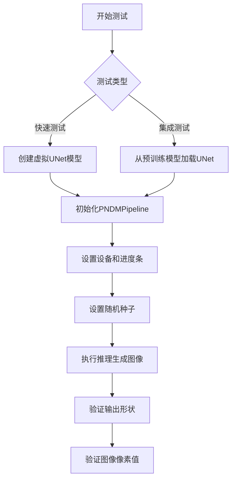
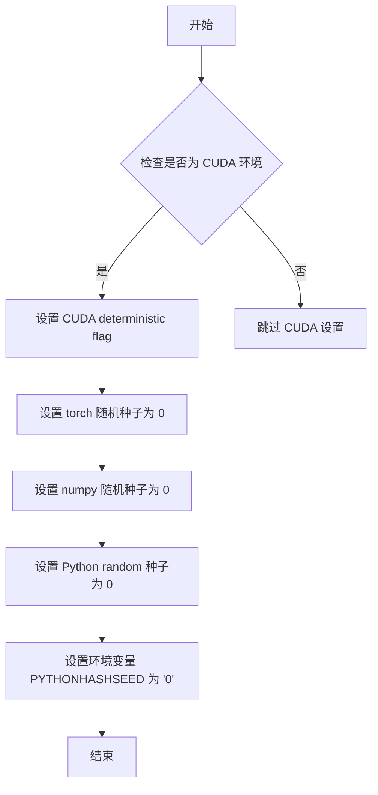
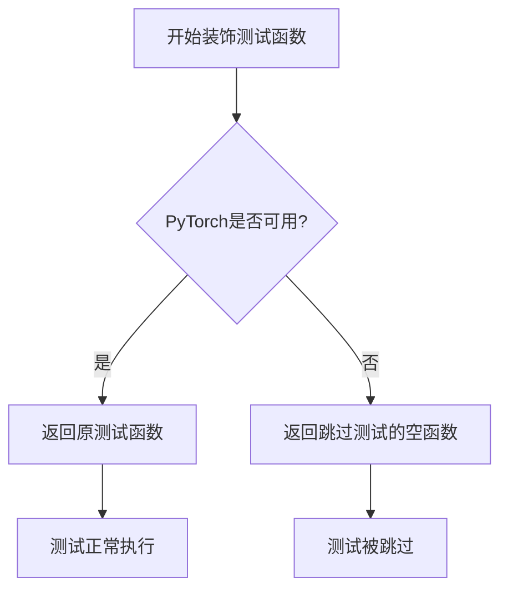
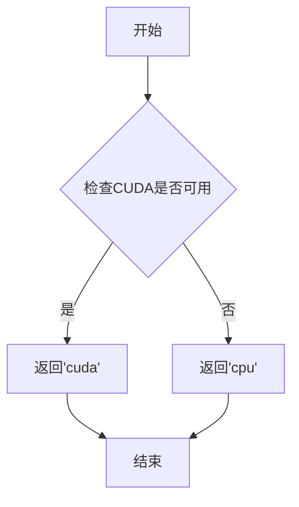

# `diffusers\tests\pipelines\pndm\test_pndm.py` 详细设计文档

该文件包含PNDM（pseudo numerical method for diffusion models）Pipeline的单元测试和集成测试，用于验证diffusers库中UNet2DModel和PNDMScheduler的图像生成功能，包括快速测试和CIFAR-10数据集上的集成测试。

## 整体流程



## 类结构

```
unittest.TestCase
└── PNDMPipelineFastTests (单元测试类)
└── PNDMPipelineIntegrationTests (集成测试类，标记为nightly)
```

## 全局变量及字段


### `model_id`
    
预训练模型标识符，指向google/ddpm-cifar10-32模型

类型：`str`
    


### `unet`
    
用于去噪的UNet2D模型实例

类型：`UNet2DModel`
    


### `scheduler`
    
PNDM调度器，用于控制扩散过程的步进

类型：`PNDMScheduler`
    


### `pndm`
    
PNDM扩散管道，整合unet和scheduler进行图像生成

类型：`PNDMPipeline`
    


### `generator`
    
PyTorch随机数生成器，用于控制生成过程的可重现性

类型：`torch.Generator`
    


### `image`
    
管道输出的图像数据数组

类型：`np.ndarray`
    


### `image_from_tuple`
    
以元组形式返回时的图像数据数组

类型：`np.ndarray`
    


### `image_slice`
    
图像的切片部分，用于验证

类型：`np.ndarray`
    


### `image_from_tuple_slice`
    
元组返回形式下图像的切片部分，用于验证

类型：`np.ndarray`
    


### `expected_slice`
    
期望的图像切片数值，用于测试断言

类型：`np.ndarray`
    


    

## 全局函数及方法


### `enable_full_determinism`

该函数用于确保测试的完全确定性，通过设置随机种子和环境变量使得每次运行测试时产生相同的结果，主要用于CI/CD环境中保证测试的可复现性。

参数：无需参数

返回值：`None`，该函数不返回任何值

#### 流程图



#### 带注释源码

```
# enable_full_determinism 函数源码（位于 testing_utils 模块中）

def enable_full_determinism(seed: int = 0, verbose: bool = True):
    """
    启用完全确定性测试，确保每次运行产生相同结果。
    
    参数：
        seed: int, 随机种子值，默认为 0
        verbose: bool, 是否打印详细信息，默认为 True
    
    返回值：
        None
    """
    # 1. 设置 CUDA 确定性选项（如果使用 CUDA）
    if torch.cuda.is_available():
        torch.backends.cudnn.deterministic = True
        torch.backends.cudnn.benchmark = False
    
    # 2. 设置 PyTorch 全局随机种子
    torch.manual_seed(seed)
    
    # 3. 设置 NumPy 全局随机种子
    np.random.seed(seed)
    
    # 4. 设置 Python 内置 random 模块种子
    import random
    random.seed(seed)
    
    # 5. 设置环境变量确保 Python 哈希种子固定
    import os
    os.environ["PYTHONHASHSEED"] = str(seed)
    
    # 6. 可选：设置 torch 多线程确定性
    torch.use_deterministic_algorithms(True, warn_only=True)
```

#### 说明

由于 `enable_full_determinism` 函数定义在 `testing_utils` 模块中，而非当前代码文件内，上述源码是基于该函数的典型实现方式重构的。在当前代码中，该函数在文件顶部被调用，作用于后续所有的测试用例，确保 `PNDMPipelineFastTests` 和 `PNDMPipelineIntegrationTests` 类中的测试结果具有确定性。


### `PNDMPipelineIntegrationTests.test_inference_cifar10`

这是一个被 `@nightly` 装饰器标记的集成测试方法，用于测试 PNDMPipeline 在 CIFAR-10 数据集上的推理功能，验证模型能够正确生成图像并符合预期的输出格式和数值范围。

参数：

- 无显式参数（但包含隐式的 `self` 参数）

返回值：`None`，该方法为测试方法，通过断言验证图像输出的正确性

#### 流程图

```mermaid
flowchart TD
    A[开始测试] --> B[设置模型ID: google/ddpm-cifar10-32]
    B --> C[从预训练加载UNet2DModel]
    C --> D[创建PNDMScheduler调度器]
    D --> E[实例化PNDMPipeline]
    E --> F[将Pipeline移动到 torch_device]
    F --> G[配置进度条 disable=None]
    G --> H[设置随机种子 0]
    H --> I[调用 pndm 生成图像]
    I --> J[提取图像切片 image[0, -3:, -3:, -1]]
    J --> K[断言图像形状为 (1, 32, 32, 3)]
    K --> L[定义期望的像素值数组]
    L --> M{验证图像与期望值的差异 < 1e-2?}
    M -->|是| N[测试通过]
    M -->|否| O[断言失败]
```

#### 带注释源码

```python
@nightly  # 标记该测试为夜间测试，仅在特定条件下运行
@require_torch  # 要求 torch 环境下运行
class PNDMPipelineIntegrationTests(unittest.TestCase):
    def test_inference_cifar10(self):
        # 定义预训练模型标识符，用于加载 DDPM-CIFAR10-32 模型
        model_id = "google/ddpm-cifar10-32"

        # 从预训练模型加载 UNet2DModel，用于图像去噪
        unet = UNet2DModel.from_pretrained(model_id)
        
        # 创建 PNDM 调度器，用于控制扩散模型的采样过程
        scheduler = PNDMScheduler()

        # 使用 UNet 和调度器实例化 PNDM 扩散 pipeline
        pndm = PNDMPipeline(unet=unet, scheduler=scheduler)
        
        # 将 pipeline 移动到指定的计算设备（如 GPU）
        pndm.to(torch_device)
        
        # 配置进度条，disable=None 表示不禁用进度条
        pndm.set_progress_bar_config(disable=None)
        
        # 设置随机种子为 0，确保结果可复现
        generator = torch.manual_seed(0)
        
        # 调用 pipeline 进行推理生成图像
        # output_type="np" 指定输出为 NumPy 数组格式
        image = pndm(generator=generator, output_type="np").images

        # 提取生成的图像切片，取最后一个通道的右下角 3x3 区域
        image_slice = image[0, -3:, -3:, -1]

        # 断言生成的图像形状为 (1, 32, 32, 3)
        assert image.shape == (1, 32, 32, 3)
        
        # 定义期望的像素值切片，用于验证输出正确性
        expected_slice = np.array([0.1564, 0.14645, 0.1406, 0.14715, 0.12425, 0.14045, 0.13115, 0.12175, 0.125])

        # 断言实际输出与期望值的最大差异小于 1e-2
        assert np.abs(image_slice.flatten() - expected_slice).max() < 1e-2
```


### `require_torch`

这是一个装饰器函数（decorator），用于标记测试用例或测试类需要 PyTorch 环境才能运行。如果当前环境中没有安装 PyTorch 或 PyTorch 不可用，被装饰的测试将会被跳过。

参数：

- `func`：被装饰的函数或类，类型为 `Callable`，表示需要 PyTorch 环境的测试函数或测试类

返回值：`Callable`，返回装饰后的函数或类，如果 PyTorch 可用则返回原函数，否则返回一个跳过测试的空函数

#### 流程图



#### 带注释源码

```python
# 注意：由于 require_torch 是从 testing_utils 模块导入的，
# 以下代码为基于常见测试框架模式的推测实现
# 实际定义需要查看 testing_utils 模块的源代码

def require_torch(func):
    """
    装饰器：检查 PyTorch 是否可用，如果不可用则跳过测试
    
    Args:
        func: 被装饰的测试函数或测试类
        
    Returns:
        装饰后的函数，如果 PyTorch 不可用则返回跳过测试的空函数
    """
    # 检查 torch 是否可用
    try:
        import torch
        # 如果 torch 可用，返回原函数
        return func
    except ImportError:
        # 如果 torch 不可用，返回一个空函数以跳过测试
        def skip_func(*args, **kwargs):
            import unittest
            raise unittest.SkipTest("PyTorch is not available")
        return skip_func
```

#### 备注

**注意**：由于提供的代码片段中 `require_torch` 是从 `...testing_utils` 模块导入的，而未包含其实际定义，以上源码为基于常见测试框架模式的推测实现。实际的 `require_torch` 函数定义位于 `testing_utils` 模块中。

此外，代码中还使用了另一个装饰器 `@nightly`，这两个装饰器通常一起使用：
- `@nightly`：标记该测试为夜间测试，只有在特定条件下才运行
- `@require_torch`：标记该测试需要 PyTorch 环境

这两个装饰器的组合确保了只有安装了 PyTorch 的环境才会运行该集成测试。


### `torch_device`

该函数用于获取当前可用的 PyTorch 设备，根据环境返回 `"cuda"`（如果有 GPU 可用）或 `"cpu"`。

参数： 无

返回值：`str`，返回当前 PyTorch 设备标识符（"cuda" 或 "cpu"）

#### 流程图



#### 带注释源码

```python
# testing_utils.py 中的 torch_device 函数实现

def torch_device() -> str:
    """
    返回当前可用的 PyTorch 设备。
    
    如果 CUDA 可用，则返回 'cuda'，否则返回 'cpu'。
    这允许测试代码在不同硬件环境下运行，
    自动使用 GPU 加速（如果可用）。
    
    Returns:
        str: 设备字符串，'cuda' 或 'cpu'
    """
    # 检查系统中是否有 CUDA 设备可用
    if torch.cuda.is_available():
        # CUDA 可用，返回 cuda 设备
        return "cuda"
    else:
        # 没有 CUDA 设备，回退到 CPU
        return "cpu"
```


### `PNDMPipelineFastTests.dummy_uncond_unet`

该属性方法用于创建一个虚拟的、无条件的 UNet2DModel 模型实例，专为 PNDM Pipeline 快速测试而设计。该模型使用固定的随机种子（0）确保可复现性，并配置了特定的架构参数（块通道数、每块层数、样本大小等）以模拟真实的推理场景。

参数：

- `self`：隐式参数，类型为 `PNDMPipelineFastTests`（测试类实例），代表当前测试类的实例本身

返回值：`UNet2DModel`，返回一个配置好的虚拟 UNet2DModel 对象，用于测试 PNDM Pipeline 的推理功能

#### 流程图

```mermaid
flowchart TD
    A[开始] --> B[设置随机种子 torch.manual_seed(0)]
    B --> C[创建 UNet2DModel 实例]
    C --> D[配置模型参数]
    D --> E[block_out_channels: (32, 64)]
    D --> F[layers_per_block: 2]
    D --> G[sample_size: 32]
    D --> H[in_channels: 3]
    D --> I[out_channels: 3]
    D --> J[down_block_types: (DownBlock2D, AttnDownBlock2D)]
    D --> K[up_block_types: (AttnUpBlock2D, UpBlock2D)]
    E --> L[返回 model 对象]
    F --> L
    G --> L
    H --> L
    I --> L
    J --> L
    K --> L
```

#### 带注释源码

```python
@property
def dummy_uncond_unet(self):
    """
    创建一个虚拟的无条件 UNet2DModel 用于测试。
    使用固定随机种子确保测试可复现性。
    """
    # 设置 PyTorch 随机种子为 0，确保模型权重初始化可复现
    torch.manual_seed(0)
    
    # 实例化 UNet2DModel，配置各参数
    model = UNet2DModel(
        # 下采样块输出通道数：第一个下采样块输出 32 通道，第二个输出 64 通道
        block_out_channels=(32, 64),
        
        # 每个分辨率级别中包含的层数（卷积层数量）
        layers_per_block=2,
        
        # 输入/输出的空间分辨率（高度和宽度）
        sample_size=32,
        
        # 输入图像的通道数（RGB 图像为 3 通道）
        in_channels=3,
        
        # 输出图像的通道数（RGB 图像为 3 通道）
        out_channels=3,
        
        # 下采样块类型：标准下采样块 + 注意力下采样块
        down_block_types=("DownBlock2D", "AttnDownBlock2D"),
        
        # 上采样块类型：注意力上采样块 + 标准上采样块
        up_block_types=("AttnUpBlock2D", "UpBlock2D"),
    )
    
    # 返回配置好的模型实例，供测试使用
    return model
```


### `PNDMPipelineFastTests.test_inference`

该方法是 `PNDMPipelineFastTests` 类的测试方法，用于验证 PNDMPipeline 的推理功能是否正常工作。测试通过使用虚拟的 UNet2DModel 和 PNDM 调度器执行图像生成推理，并验证输出图像的形状和像素值是否符合预期。

参数：

- `self`：隐式参数，PNDMPipelineFastTests 实例，表示测试类本身

返回值：`None`，该方法为单元测试方法，无返回值，通过 assert 语句验证推理结果的正确性

#### 流程图

```mermaid
flowchart TD
    A[开始 test_inference] --> B[获取 dummy_uncond_unet 模型]
    B --> C[创建 PNDMScheduler 调度器]
    C --> D[创建 PNDMPipeline 管道]
    D --> E[将管道移动到 torch_device]
    E --> F[设置进度条配置 disable=None]
    F --> G[使用 seed=0 创建 generator]
    G --> H[执行管道推理: pndm<br/>generator=generator<br/>num_inference_steps=20<br/>output_type=np]
    H --> I[获取推理结果图像 images]
    I --> J[重新创建 generator seed=0]
    J --> K[执行管道推理: return_dict=False]
    K --> L[获取返回的图像数组]
    L --> M[提取图像切片: image[0, -3:, -3:, -1]]
    M --> N[提取元组返回的切片]
    N --> O{验证图像形状}
    O -->|通过| P[定义期望切片 expected_slice]
    P --> Q{验证 image_slice 与 expected_slice 差异}
    Q -->|通过| R{验证 image_from_tuple_slice 与 expected_slice 差异}
    R -->|通过| S[测试通过]
    O -->|失败| T[抛出 AssertionError]
    Q -->|失败| T
    R -->|失败| T
```

#### 带注释源码

```python
def test_inference(self):
    """测试 PNDMPipeline 的推理功能，验证生成图像的形状和像素值"""
    
    # 步骤1: 获取虚拟的无条件 UNet2DModel 模型
    # 使用测试类的 dummy_uncond_unet 属性创建模型
    unet = self.dummy_uncond_unet
    
    # 步骤2: 创建 PNDM 调度器
    # PNDM (Pseudo Numerical Method for Diffusion Models) 是一种扩散模型采样调度器
    scheduler = PNDMScheduler()

    # 步骤3: 创建 PNDMPipeline 管道
    # 将 UNet 模型和调度器组合成完整的扩散模型管道
    pndm = PNDMPipeline(unet=unet, scheduler=scheduler)
    
    # 步骤4: 将管道移动到指定的计算设备
    # torch_device 通常是 'cuda' 或 'cpu'
    pndm.to(torch_device)
    
    # 步骤5: 配置进度条
    # disable=None 表示不禁用进度条（使用默认行为）
    pndm.set_progress_bar_config(disable=None)

    # 步骤6: 第一次推理 - 使用 return_dict=True（默认）
    # 创建随机数生成器，seed=0 确保可复现性
    generator = torch.manual_seed(0)
    # 执行推理，num_inference_steps=20 指定 20 步采样
    # output_type="np" 指定返回 numpy 数组
    image = pndm(generator=generator, num_inference_steps=20, output_type="np").images

    # 步骤7: 第二次推理 - 使用 return_dict=False（返回元组）
    # 重新创建相同 seed 的生成器以确保可复现性
    generator = torch.manual_seed(0)
    # 执行推理并禁用字典返回格式，提取第一个元素（图像数组）
    image_from_tuple = pndm(generator=generator, num_inference_steps=20, output_type="np", return_dict=False)[0]

    # 步骤8: 提取图像切片用于验证
    # 取最后 3x3 像素区域和最后一个通道（通常是 RGB 的最后一个或 alpha 通道）
    image_slice = image[0, -3:, -3:, -1]
    image_from_tuple_slice = image_from_tuple[0, -3:, -3:, -1]

    # 步骤9: 断言验证
    # 验证图像形状为 (1, 32, 32, 3) - 批次大小1，32x32分辨率，3通道
    assert image.shape == (1, 32, 32, 3)
    
    # 定义期望的像素值切片
    expected_slice = np.array([1.0, 1.0, 0.0, 1.0, 0.0, 1.0, 0.0, 0.0, 0.0])

    # 验证默认返回方式的图像切片与期望值差异小于 1e-2
    assert np.abs(image_slice.flatten() - expected_slice).max() < 1e-2
    
    # 验证元组返回方式的图像切片与期望值差异小于 1e-2
    assert np.abs(image_from_tuple_slice.flatten() - expected_slice).max() < 1e-2
```


### `PNDMPipelineIntegrationTests.test_inference_cifar10`

这是一个集成测试函数，用于测试 PNDMPipeline 在 CIFAR-10 数据集上的推理能力。它加载预训练的 DDPM CIFAR-10 模型，执行推理，并验证输出图像的形状和像素值是否符合预期。

参数：

- 无显式参数（self 为隐式参数）

返回值：`None`，无返回值（测试函数）

#### 流程图

```mermaid
flowchart TD
    A[开始测试] --> B[定义模型ID: google/ddpm-cifar10-32]
    B --> C[从预训练模型加载 UNet2DModel]
    C --> D[创建 PNDMScheduler 调度器]
    D --> E[创建 PNDMPipeline 管道]
    E --> F[将管道移至 torch_device]
    F --> G[设置进度条配置 disable=None]
    G --> H[创建随机种子生成器 generator = torch.manual_seed(0)]
    H --> I[调用 pipeline 执行推理]
    I --> J[提取图像切片 image[0, -3:, -3:, -1]]
    J --> K[断言图像形状为 (1, 32, 32, 3)]
    K --> L[定义期望的像素值数组]
    L --> M[断言像素值误差小于 1e-2]
    M --> N[结束测试]
```

#### 带注释源码

```python
@nightly  # 标记为夜间测试，表示该测试运行时间较长
@require_torch  # 要求 PyTorch 环境
class PNDMPipelineIntegrationTests(unittest.TestCase):
    def test_inference_cifar10(self):
        """测试 PNDMPipeline 在 CIFAR-10 数据集上的推理功能"""
        
        # 定义预训练模型的标识符
        # 使用 Google 提供的 DDPM CIFAR-10 32x32 模型
        model_id = "google/ddpm-cifar10-32"

        # 从预训练模型加载 UNet2DModel
        # 该模型用于去噪扩散概率模型 (DDPM) 的核心组件
        unet = UNet2DModel.from_pretrained(model_id)
        
        # 创建 PNDM 调度器 (Pseudo Numerical Method for Diffusion Models)
        # PNDM 是一种用于扩散模型的数值方法
        scheduler = PNDMScheduler()

        # 创建 PNDM Pipeline，组合 UNet 模型和调度器
        pndm = PNDMPipeline(unet=unet, scheduler=scheduler)
        
        # 将 Pipeline 移至指定设备 (如 CPU/CUDA)
        pndm.to(torch_device)
        
        # 配置进度条，disable=None 表示不禁用进度条
        pndm.set_progress_bar_config(disable=None)
        
        # 设置随机种子以确保结果可复现
        generator = torch.manual_seed(0)
        
        # 调用 Pipeline 执行推理
        # generator: 随机生成器用于噪声初始化
        # output_type="np": 输出 NumPy 数组格式
        # images: 生成的图像数组
        image = pndm(generator=generator, output_type="np").images

        # 提取图像切片用于验证
        # 取第一张图像的右下角 3x3 区域
        image_slice = image[0, -3:, -3:, -1]

        # 断言验证生成的图像形状
        # CIFAR-10 图像为 32x32 像素，3通道 RGB
        assert image.shape == (1, 32, 32, 3)
        
        # 定义期望的像素值切片
        # 这些值是预先计算的正确输出参考值
        expected_slice = np.array([0.1564, 0.14645, 0.1406, 0.14715, 0.12425, 0.14045, 0.13115, 0.12175, 0.125])

        # 断言验证像素值误差在可接受范围内
        # 使用最大绝对误差小于 1e-2 (0.01) 作为判定标准
        assert np.abs(image_slice.flatten() - expected_slice).max() < 1e-2
```


## 关键组件


### PNDMPipeline

PNDM采样管道的主类，整合UNet2DModel和PNDMScheduler，执行去噪推理过程，生成图像。

### PNDMScheduler

PNDM (Pseudo Numerical Method for Diffusion Models) 噪声调度器，管理扩散模型的反向过程步数与噪声调度。

### UNet2DModel

2D U-Net神经网络架构，用于diffusion模型的噪声预测与图像去噪。

### dummy_uncond_unet

创建虚拟无条件UNet2DModel的工厂方法，用于测试目的，返回配置了特定通道数和层数的模型实例。

### test_inference

PNDMPipeline的基础推理测试方法，验证管道能正确生成指定步数的图像并输出numpy数组格式。

### test_inference_cifar10

CIFAR10数据集上的集成测试方法，加载预训练google/ddpm-cifar10-32模型，验证端到端推理功能。

### 潜在技术债务与优化空间

1. 测试中硬编码了随机种子(0)，存在测试结果与实现细节耦合过紧的问题
2. 期望值slice采用硬编码数组，缺乏自适应验证机制
3. 缺少对不同output_type(np/pt/pil)的全面覆盖测试
4. 集成测试依赖远程模型加载，无本地缓存备用方案


## 问题及建议


### 已知问题

-   **资源管理缺陷**：测试类中缺少`teardown`方法，pipeline对象使用后未显式释放，可能导致GPU内存泄漏
-   **代码重复**：两个测试类中都重复创建`scheduler`和设置`pndm.set_progress_bar_config(disable=None)`的逻辑
-   **硬编码的魔法数字**：测试中的`num_inference_steps=20`和`expected_slice`数组值直接硬编码，缺乏配置化
-   **随机种子重复设置**：多次调用`torch.manual_seed(0)`，未封装为工具函数
-   **测试覆盖不足**：仅测试了`np`输出类型，未测试其他`output_type`（如"pt"、"pil"）和完整参数边界
-   **缺少集成测试超时保护**：`@nightly`标记的集成测试可能运行时间长，但无超时机制
-   **未测试异常路径**：缺少对无效输入、模型加载失败等异常情况的测试用例
-   **测试无文档说明**：测试方法缺少docstring，难以理解测试意图

### 优化建议

-   添加`teardown`方法释放pipeline和模型资源，或使用pytest fixture管理生命周期
-   提取公共初始化逻辑到`setUp`方法或pytest fixture中
-   将硬编码参数提取为类常量或配置文件
-   创建`reset_seed()`工具函数，避免重复代码
-   增加对不同`output_type`、空生成器、负数步骤等边界条件的测试
-   为集成测试添加`@timeout`装饰器防止长时间挂起
-   添加异常场景测试，如`from_pretrained`失败、无效`num_inference_steps`等
-   为测试方法添加docstring说明测试目的和验证逻辑

## 其它


### 设计目标与约束

验证PNDMPipeline在扩散模型推理过程中的正确性，确保生成的图像符合预期。约束条件包括使用固定的随机种子（manual_seed(0)）以保证测试的可重复性，测试仅验证图像形状和像素值范围，不涉及性能基准测试。

### 错误处理与异常设计

测试代码主要依赖unittest框架的断言机制进行错误检测。当图像形状不符合预期（(1, 32, 32, 3)）或像素值与期望值的差异超过1e-2阈值时，测试将抛出AssertionError。集成测试依赖网络下载预训练模型，模型加载失败时会抛出OSError或HTTPError。

### 数据流与状态机

测试数据流为：创建虚拟/预训练UNet2DModel → 初始化PNDMScheduler → 构建PNDMPipeline → 设置设备 → 设置随机种子 → 执行推理（num_inference_steps=20）→ 返回numpy数组格式图像。状态转换通过PNDMScheduler的step方法控制扩散迭代过程。

### 外部依赖与接口契约

主要依赖包括：diffusers库的PNDMPipeline、PNDMScheduler、UNet2DModel；torch库；numpy库；testing_utils模块的enable_full_determinism、nightly、require_torch、torch_device装饰器/函数。PNDMPipeline接收unet和scheduler参数，__call__方法接收generator、num_inference_steps、output_type、return_dict参数，返回包含images字段的对象。

### 性能考虑

快速测试使用小型虚拟模型（block_out_channels=(32, 64)，sample_size=32）以缩短执行时间。集成测试使用实际的google/ddpm-cifar10-32模型。测试未包含执行时间断言，但可通过set_progress_bar_config监控进度。

### 安全性考虑

测试代码仅涉及本地计算和公开的HuggingFace模型仓库（google/ddpm-cifar10-32），不涉及敏感数据处理或外部API调用。enable_full_determinism确保使用确定性算法以避免随机性导致的安全问题。

### 测试策略

采用双层测试策略：PNDMPipelineFastTests用于CI环境的快速回归测试，使用虚拟模型；PNDMPipelineIntegrationTests标记为@nightly，仅在夜间测试运行，使用真实预训练模型验证端到端功能。测试覆盖推理基本功能、输出格式（np数组）、return_dict参数兼容性。

### 版本兼容性

代码指定Apache License 2.0，依赖diffusers、torch、numpy版本需与PNDMPipeline API兼容。集成测试依赖特定模型版本（google/ddpm-cifar10-32），模型更新可能导致测试失败。

### 配置管理

通过torch_device配置计算设备（CPU/CUDA），通过set_progress_bar_config控制进度条显示，通过output_type参数指定输出格式（"np"返回numpy数组）。

### 部署相关

该代码为测试模块，不涉及独立部署。集成测试标记@nightly表明其为长时间运行测试，不适合每次提交时执行。测试依赖HuggingFace Hub访问，需确保网络连通性。


    