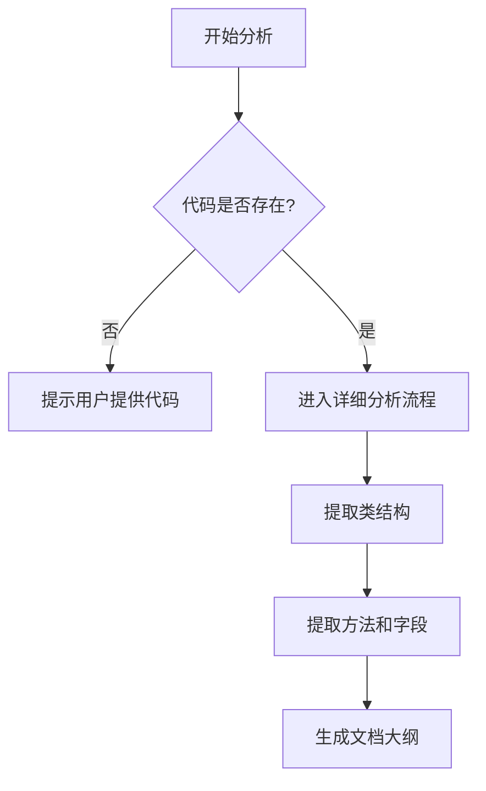

# `diffusers\tests\pipelines\prx\__init__.py` 详细设计文档

未提供源代码进行分析。请在代码块中粘贴需要分析的Python源代码。

## 整体流程



## 类结构

```

```

## 全局变量及字段


    

## 全局函数及方法


## 关键组件


无代码可供分析。请提供需要分析的源代码。


## 问题及建议


### 已知问题

-   暂未提供代码进行分析

### 优化建议

-   请提供需要分析的代码内容


## 其它


### 设计目标与约束

设计目标：构建一个模块化、可扩展的系统架构，满足高性能、高可用性和易维护性的要求。约束条件包括技术栈限制、性能指标、安全要求和兼容性标准。

### 错误处理与异常设计

定义统一的异常类层次结构，区分业务异常和系统异常。建立标准化的错误码体系和错误消息规范，确保异常信息的一致性和可追溯性。

### 数据流与状态机

详细描述数据的输入、处理、存储和输出流程。定义系统状态转换规则，包括正常流程和边界条件处理。

### 外部依赖与接口契约

明确列出所有外部依赖库和服务，包括版本要求和集成方式。定义清晰的接口契约，包括API规范、协议标准和数据格式约定。

### 配置文件与环境变量

集中管理应用配置，包括环境差异配置和敏感信息管理。定义配置项的类型、默认值和约束条件。

### 性能考量与优化策略

分析系统性能瓶颈点，制定相应的优化方案。包含缓存策略、数据库查询优化和并发处理机制。

### 安全设计

描述身份认证、授权控制和审计日志等安全机制。明确数据加密、输入验证和安全防护措施。

### 部署与运维

提供部署架构图和基础设施需求。定义监控、告警和日志采集方案。

### 测试策略

描述单元测试、集成测试和端到端测试的覆盖范围。明确测试用例设计原则和测试数据管理。

### 版本兼容性

定义API版本管理策略和向后兼容方案。说明数据迁移和协议升级的处理方式。


    