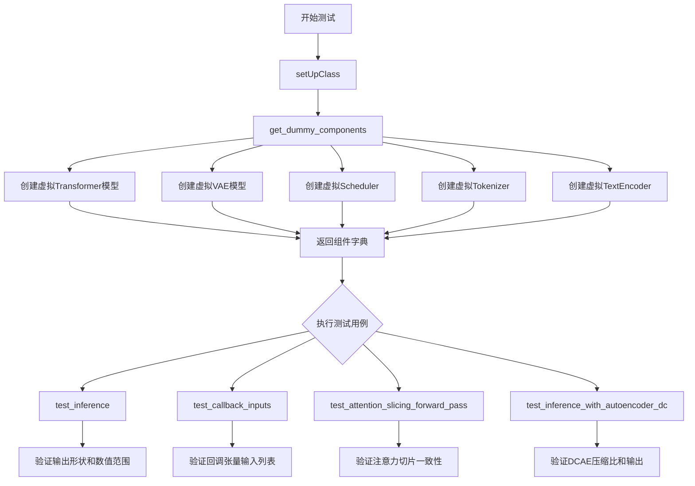
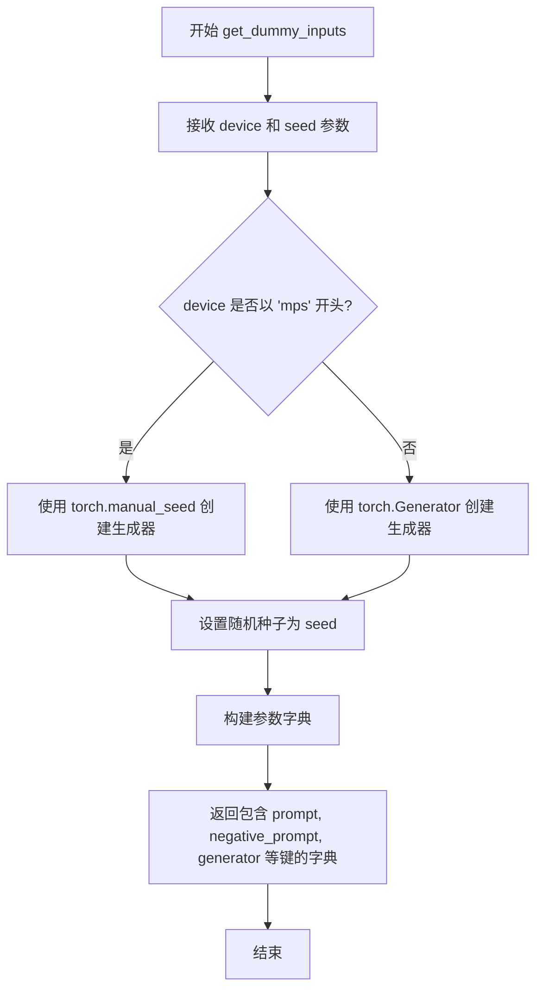
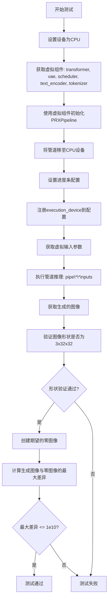
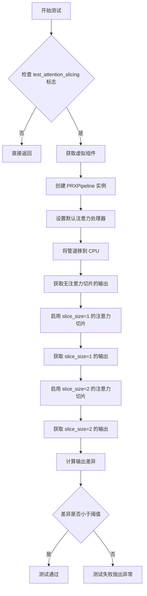
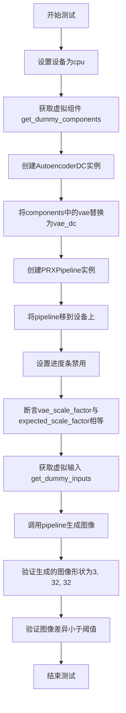
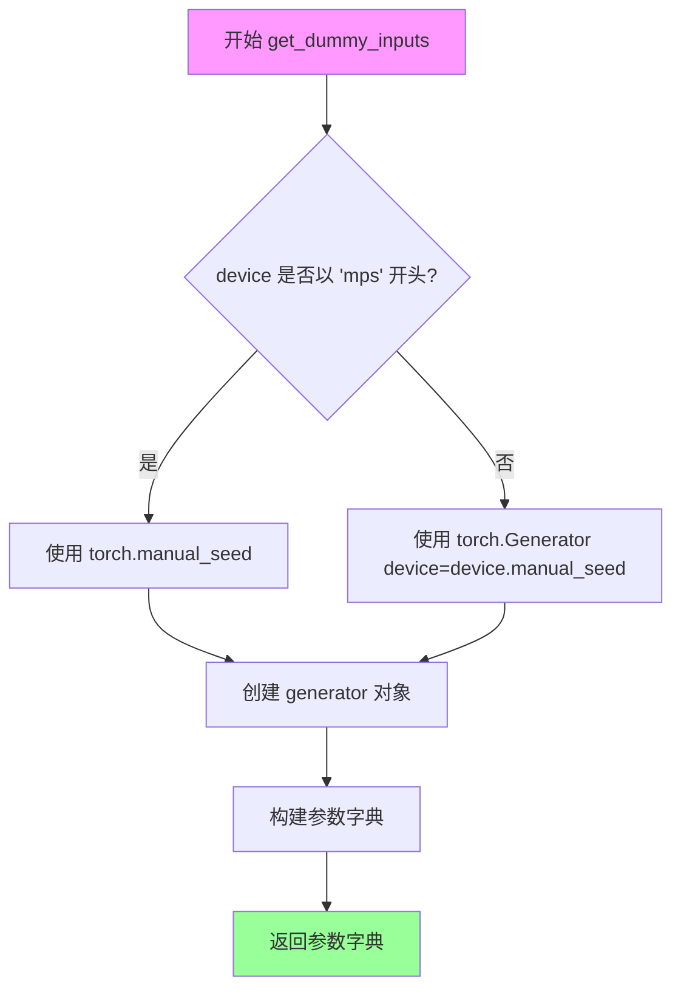
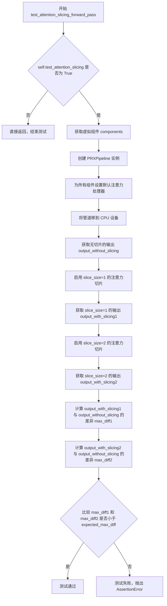
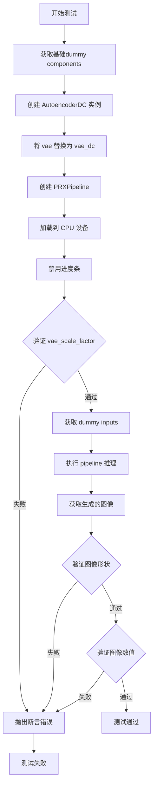

# `diffusers\tests\pipelines\prx\test_pipeline_prx.py` 详细设计文档

该文件是一个针对PRXPipeline（概率回归扩散模型推理管道）的单元测试套件，包含多个测试用例用于验证管道的推理功能、回调机制、注意力切片优化以及不同变分自编码器（AutoencoderKL和AutoencoderDC）的兼容性。

## 整体流程



## 类结构

```
unittest.TestCase
└── PRXPipelineFastTests (PipelineTesterMixin)
    ├── get_dummy_components()
    ├── get_dummy_inputs()
    ├── test_inference()
    ├── test_callback_inputs()
    ├── test_attention_slicing_forward_pass()
    └── test_inference_with_autoencoder_dc()
```

## 全局变量及字段


### `device`
    
用于运行管道的设备，在此测试中设置为 'cpu'。

类型：`str`
    


### `generator`
    
用于推理的随机生成器，根据设备创建以确保可重复性。

类型：`torch.Generator`
    


### `components`
    
包含变压器、VAE、调度器、文本编码器和分词器的字典。

类型：`dict`
    


### `pipe`
    
使用虚拟组件初始化的 PRXPipeline 实例，用于测试。

类型：`PRXPipeline`
    


### `inputs`
    
包含提示词、生成器、推理步数等的输入参数字典。

类型：`dict`
    


### `image`
    
管道输出的图像列表。

类型：`list[torch.Tensor]`
    


### `generated_image`
    
管道输出的第一张图像张量。

类型：`torch.Tensor`
    


### `expected_image`
    
用于比较的零初始化图像张量。

类型：`torch.Tensor`
    


### `max_diff`
    
生成图像与预期图像之间的最大绝对差异。

类型：`float`
    


### `vae_dc`
    
在测试中替代默认 VAE 的离散自编码器 (AutoencoderDC)。

类型：`AutoencoderDC`
    


### `expected_scale_factor`
    
VAE 的空间压缩比，用于缩放潜在变量。

类型：`int`
    


### `PRXPipelineFastTests.pipeline_class`
    
被测试的 PRXPipeline 类的引用。

类型：`type`
    


### `PRXPipelineFastTests.params`
    
从 TEXT_TO_IMAGE_PARAMS 中移除 cross_attention_kwargs 后得到的参数集合，用于管道的调用。

类型：`set`
    


### `PRXPipelineFastTests.batch_params`
    
可批量传递的参数集合，如 prompt、negative_prompt、num_images_per_prompt。

类型：`frozenset`
    


### `PRXPipelineFastTests.test_xformers_attention`
    
标志位，指示是否测试 xFormers 记忆高效注意力。

类型：`bool`
    


### `PRXPipelineFastTests.test_layerwise_casting`
    
标志位，指示是否测试模型参数的层逐层类型转换。

类型：`bool`
    


### `PRXPipelineFastTests.test_group_offloading`
    
标志位，指示是否测试模型层的组卸载功能。

类型：`bool`
    
    

## 全局函数及方法


### `PRXPipelineFastTests.get_dummy_components`

该方法用于生成 PRX 管道所需的虚拟（dummy）组件，包括 transformer、vae、scheduler、text_encoder 和 tokenizer，用于测试目的。通过固定的随机种子确保结果可复现。

参数：
- 无（仅包含 `self` 参数）

返回值：`Dict[str, Any]`，返回包含以下键的字典：
- `transformer`：PRXTransformer2DModel 实例
- `vae`：AutoencoderKL 实例
- `scheduler`：FlowMatchEulerDiscreteScheduler 实例
- `text_encoder`：T5GemmaEncoder 实例
- `tokenizer`：AutoTokenizer 实例

#### 流程图

```mermaid
flowchart TD
    A[开始 get_dummy_components] --> B[设置随机种子 torch.manual_seed(0)]
    B --> C[创建 PRXTransformer2DModel]
    C --> D[创建 AutoencoderKL]
    D --> E[创建 FlowMatchEulerDiscreteScheduler]
    E --> F[从预训练模型加载 AutoTokenizer]
    F --> G[配置 tokenizer.model_max_length = 64]
    G --> H[创建 T5GemmaModuleConfig]
    H --> I[创建 T5GemmaConfig]
    I --> J[创建 T5GemmaEncoder]
    J --> K[返回包含所有组件的字典]
```

#### 带注释源码

```python
def get_dummy_components(self):
    """
    生成用于测试的虚拟组件。
    
    该方法创建完整的 PRXPipeline 所需的所有组件，包括：
    - Transformer 模型
    - VAE 编码器/解码器
    - 调度器
    - 文本编码器
    - 分词器
    
    Returns:
        Dict[str, Any]: 包含所有组件的字典
    """
    # 设置随机种子以确保结果可复现
    torch.manual_seed(0)
    
    # 创建 PRX Transformer 模型
    # 参数: patch_size=1, in_channels=4, context_in_dim=8, hidden_size=8,
    #       mlp_ratio=2.0, num_heads=2, depth=1, axes_dim=[2, 2]
    transformer = PRXTransformer2DModel(
        patch_size=1,
        in_channels=4,
        context_in_dim=8,
        hidden_size=8,
        mlp_ratio=2.0,
        num_heads=2,
        depth=1,
        axes_dim=[2, 2],
    )

    # 重新设置随机种子以确保 VAE 的确定性
    torch.manual_seed(0)
    
    # 创建 VAE 模型 (AutoencoderKL)
    # 参数: sample_size=32, in_channels=3, out_channels=3,
    #       block_out_channels=(4,), layers_per_block=1, latent_channels=4
    vae = AutoencoderKL(
        sample_size=32,
        in_channels=3,
        out_channels=3,
        block_out_channels=(4,),
        layers_per_block=1,
        latent_channels=4,
        norm_num_groups=1,
        use_quant_conv=False,
        use_post_quant_conv=False,
        shift_factor=0.0,
        scaling_factor=1.0,
    ).eval()  # 设置为评估模式

    # 重新设置随机种子
    torch.manual_seed(0)
    
    # 创建 Flow Match 调度器
    scheduler = FlowMatchEulerDiscreteScheduler()

    # 重新设置随机种子
    torch.manual_seed(0)
    
    # 从预训练模型加载分词器
    # 使用 hf-internal-testing/dummy-gemma 模型
    tokenizer = AutoTokenizer.from_pretrained("hf-internal-testing/dummy-gemma")
    tokenizer.model_max_length = 64  # 设置最大序列长度

    # 重新设置随机种子
    torch.manual_seed(0)

    # 定义文本编码器参数
    encoder_params = {
        "vocab_size": tokenizer.vocab_size,       # 词汇表大小
        "hidden_size": 8,                         # 隐藏层维度
        "intermediate_size": 16,                  # 中间层维度
        "num_hidden_layers": 1,                   # 隐藏层数量
        "num_attention_heads": 2,                 # 注意力头数
        "num_key_value_heads": 1,                 # KV 头数
        "head_dim": 4,                            # 头维度
        "max_position_embeddings": 64,            # 最大位置嵌入
        "layer_types": ["full_attention"],       # 层类型
        "attention_bias": False,                 # 注意力偏置
        "attention_dropout": 0.0,                # 注意力 dropout
        "dropout_rate": 0.0,                      # Dropout 率
        "hidden_activation": "gelu_pytorch_tanh", # 隐藏层激活函数
        "rms_norm_eps": 1e-06,                    # RMS Norm epsilon
        "attn_logit_softcapping": 50.0,           # 注意力 logit 软截断
        "final_logit_softcapping": 30.0,          # 最终 logit 软截断
        "query_pre_attn_scalar": 4,               # 查询前置注意力标量
        "rope_theta": 10000.0,                    # RoPE theta
        "sliding_window": 4096,                  # 滑动窗口大小
    }
    
    # 创建 T5Gemma 模块配置
    encoder_config = T5GemmaModuleConfig(**encoder_params)
    
    # 创建 T5Gemma 配置（包含模块配置）
    text_encoder_config = T5GemmaConfig(
        encoder=encoder_config, 
        is_encoder_decoder=False, 
        **encoder_params
    )
    
    # 创建 T5Gemma 编码器
    text_encoder = T5GemmaEncoder(text_encoder_config)

    # 返回包含所有组件的字典
    return {
        "transformer": transformer,    # PRX Transformer 模型
        "vae": vae,                    # VAE 模型
        "scheduler": scheduler,       # 调度器
        "text_encoder": text_encoder, # 文本编码器
        "tokenizer": tokenizer,       # 分词器
    }
```


### `PRXPipelineFastTests.get_dummy_inputs`

该方法用于生成 PRXPipeline 的虚拟输入参数，创建一个包含提示词、负提示词、生成器、推理步数、引导比例、图像尺寸等信息的字典，供单元测试使用。

参数：

- `device`：`torch.device` 或 `str`，指定运行设备（如 "cpu" 或 "mps"）
- `seed`：`int`，随机种子，默认为 0，用于生成可复现的随机数

返回值：`Dict[str, Any]`，返回包含以下键的字典：
  - `prompt`：空字符串，输入提示词
  - `negative_prompt`：空字符串，负提示词
  - `generator`：`torch.Generator`，随机数生成器
  - `num_inference_steps`：int，推理步数（2步）
  - `guidance_scale`：float，引导比例（1.0）
  - `height`：int，生成图像高度（32像素）
  - `width`：int，生成图像宽度（32像素）
  - `output_type`：str，输出类型（"pt" 表示 PyTorch 张量）
  - `use_resolution_binning`：bool，是否使用分辨率分箱（False）

#### 流程图



#### 带注释源码

```python
def get_dummy_inputs(self, device, seed=0):
    """
    生成用于测试 PRXPipeline 的虚拟输入参数。
    
    参数:
        device: 运行设备，可以是 "cpu" 或 "mps" 等
        seed: 随机种子，用于生成可复现的随机数
    
    返回:
        包含 pipeline 输入参数的字典
    """
    # 判断设备类型，MPS 设备需要特殊处理
    if str(device).startswith("mps"):
        # MPS 设备不支持 torch.Generator，使用 torch.manual_seed 代替
        generator = torch.manual_seed(seed)
    else:
        # 其他设备（如 CPU/CUDA）使用 torch.Generator
        generator = torch.Generator(device=device).manual_seed(seed)
    
    # 返回虚拟输入参数字典
    return {
        "prompt": "",                      # 空提示词
        "negative_prompt": "",             # 空负提示词
        "generator": generator,            # 随机数生成器
        "num_inference_steps": 2,         # 推理步数设置为最小值以加快测试
        "guidance_scale": 1.0,            # 无分类器引导比例
        "height": 32,                     # 生成图像高度
        "width": 32,                       # 生成图像宽度
        "output_type": "pt",              # 输出为 PyTorch 张量
        "use_resolution_binning": False,  # 禁用分辨率分箱
    }
```


### `PRXPipelineFastTests.test_inference`

该测试方法用于验证 PRXPipeline（概率回归扩散管道）在 CPU 设备上的推理功能是否正常工作，通过创建虚拟组件、设置推理参数、执行图像生成流程，并验证生成图像的形状和数值范围是否符合预期。

参数：

- `self`：隐式参数，测试类实例本身

返回值：`None`，无返回值（测试方法）

#### 流程图



#### 带注释源码

```python
def test_inference(self):
    """
    测试 PRXPipeline 在 CPU 上的推理功能
    
    该测试方法执行以下步骤:
    1. 创建虚拟组件(transformer, vae, scheduler, text_encoder, tokenizer)
    2. 使用虚拟组件初始化 PRXPipeline
    3. 执行管道推理生成图像
    4. 验证生成图像的形状和数值范围
    """
    # 1. 设置设备为 CPU
    device = "cpu"
    
    # 2. 获取预配置的虚拟组件字典
    # 包含: transformer(PRXTransformer2DModel), vae(AutoencoderKL),
    # scheduler(FlowMatchEulerDiscreteScheduler), text_encoder(T5GemmaEncoder), tokenizer
    components = self.get_dummy_components()
    
    # 3. 使用虚拟组件实例化 PRXPipeline 管道
    pipe = PRXPipeline(**components)
    
    # 4. 将管道移至指定设备(CPU)
    pipe.to(device)
    
    # 5. 配置进度条(参数为 None 表示不禁用)
    pipe.set_progress_bar_config(disable=None)
    
    # 6. 尝试将执行设备注册到管道配置(容错处理)
    try:
        pipe.register_to_config(_execution_device="cpu")
    except Exception:
        pass
    
    # 7. 获取虚拟输入参数
    # 包含: prompt, negative_prompt, generator, num_inference_steps,
    # guidance_scale, height, width, output_type, use_resolution_binning
    inputs = self.get_dummy_inputs(device)
    
    # 8. 执行管道推理,返回图像列表
    # pipe**inputs 会调用 PRXPipeline 的 __call__ 方法
    image = pipe(**inputs)[0]
    
    # 9. 获取第一张生成的图像
    generated_image = image[0]
    
    # 10. 断言验证:生成图像的形状应为 (3, 32, 32)
    # 3通道, 32x32分辨率
    self.assertEqual(generated_image.shape, (3, 32, 32))
    
    # 11. 创建期望的零图像用于比较
    expected_image = torch.zeros(3, 32, 32)
    
    # 12. 计算生成图像与期望图像的最大绝对差异
    max_diff = np.abs(generated_image - expected_image).max()
    
    # 13. 断言验证:最大差异应小于等于 1e10
    # 注意:这个阈值非常大,几乎任何输出都能通过
    self.assertLessEqual(max_diff, 1e10)
```


### `PRXPipelineFastTests.test_callback_inputs`

该方法用于测试PRXPipeline的回调功能，特别是验证回调函数能够正确接收指定的tensor输入，并确保`_callback_tensor_inputs`属性正确定义了回调可用的tensor变量列表。

参数：
- `self`：隐式参数，类型为`PRXPipelineFastTests`（测试类实例），表示测试类本身

返回值：`None`，该方法为单元测试方法，通过assert断言验证回调功能，不返回任何值

#### 流程图

```mermaid
flowchart TD
    A[开始测试] --> B[获取虚拟组件]
    B --> C[创建PRXPipeline并移至CPU]
    C --> D[配置进度条和执行设备]
    D --> E{断言_pipe有_callback_tensor_inputs属性}
    E -->|失败| F[抛出AssertionError]
    E -->|成功| G[定义callback_inputs_subset回调函数]
    G --> H[定义callback_inputs_all回调函数]
    H --> I[获取虚拟输入]
    I --> J[设置subset回调和tensor_inputs=['latents']]
    J --> K[执行pipeline推理]
    K --> L[设置all回调和全部tensor_inputs]
    L --> M[执行pipeline推理]
    M --> N[测试结束]
```

#### 带注释源码

```python
def test_callback_inputs(self):
    """
    测试PRXPipeline的回调输入功能
    
    验证内容：
    1. PRXPipeline具有_callback_tensor_inputs属性
    2. 回调函数可以接收指定的tensor输入子集
    3. 回调函数可以接收全部定义的tensor输入
    """
    # 步骤1：获取预定义的虚拟组件（transformer, vae, scheduler, text_encoder, tokenizer）
    components = self.get_dummy_components()
    
    # 步骤2：使用虚拟组件创建PRXPipeline实例
    pipe = PRXPipeline(**components)
    
    # 步骤3：将pipeline移至CPU设备
    pipe = pipe.to("cpu")
    
    # 步骤4：配置进度条（disable=None表示不禁用）
    pipe.set_progress_bar_config(disable=None)
    
    # 步骤5：注册执行设备到配置（容错处理）
    try:
        pipe.register_to_config(_execution_device="cpu")
    except Exception:
        pass
    
    # 步骤6：断言验证pipeline具有_callback_tensor_inputs属性
    # 该属性定义了回调函数可以使用的tensor变量列表
    self.assertTrue(
        hasattr(pipe, "_callback_tensor_inputs"),
        f" {PRXPipeline} should have `_callback_tensor_inputs` that defines a list of tensor variables its callback function can use as inputs",
    )

    # 步骤7：定义回调函数 - 验证输入是callback_tensor_inputs的子集
    def callback_inputs_subset(pipe, i, t, callback_kwargs):
        """
        回调函数：验证传入的tensor名称都在_callback_tensor_inputs中
        
        参数：
        - pipe: pipeline实例
        - i: 当前推理步骤索引
        - t: 当前时间步（用于扩散模型）
        - callback_kwargs: 回调函数接收的参数字典
        
        返回：
        - callback_kwargs: 未修改的参数字典
        """
        # 遍历回调参数中的所有tensor名称
        for tensor_name in callback_kwargs.keys():
            # 断言每个tensor都在_callback_tensor_inputs定义中
            assert tensor_name in pipe._callback_tensor_inputs
        return callback_kwargs

    # 步骤8：定义回调函数 - 验证输入完全匹配callback_tensor_inputs
    def callback_inputs_all(pipe, i, t, callback_kwargs):
        """
        回调函数：验证传入的tensor与_callback_tensor_inputs完全一致
        
        参数：
        - pipe: pipeline实例
        - i: 当前推理步骤索引
        - t: 当前时间步
        - callback_kwargs: 回调函数接收的参数字典
        
        返回：
        - callback_kwargs: 未修改的参数字典
        """
        # 验证定义的tensor都在回调参数中
        for tensor_name in pipe._callback_tensor_inputs:
            assert tensor_name in callback_kwargs
        # 验证回调参数的tensor都在定义中
        for tensor_name in callback_kwargs.keys():
            assert tensor_name in pipe._callback_tensor_inputs
        return callback_kwargs

    # 步骤9：获取虚拟输入参数
    inputs = self.get_dummy_inputs("cpu")

    # 步骤10：测试子集回调 - 只请求'latents'作为回调输入
    inputs["callback_on_step_end"] = callback_inputs_subset  # 设置回调函数
    inputs["callback_on_step_end_tensor_inputs"] = ["latents"]  # 指定只接收latents
    _ = pipe(**inputs)[0]  # 执行推理并丢弃返回的图像

    # 步骤11：测试完整回调 - 请求所有定义的tensor输入
    inputs["callback_on_step_end"] = callback_inputs_all  # 切换到验证完整性的回调
    inputs["callback_on_step_end_tensor_inputs"] = pipe._callback_tensor_inputs  # 使用全部定义的tensor
    _ = pipe(**inputs)[0]  # 执行推理并丢弃返回的图像
```


### `test_attention_slicing_forward_pass`

该测试方法用于验证 PRXPipeline 的注意力切片（Attention Slicing）功能是否正常工作。通过比较启用不同 slice_size 的注意力切片与未启用时的输出差异，确保注意力切片实现的前向传播结果一致性。

参数：

- `self`：`PRXPipelineFastTests`，测试类的实例，隐含参数
- `expected_max_diff`：`float`，默认为 `1e-3`，允许的最大差异阈值，用于判断注意力切片输出与标准输出之间的差异是否在可接受范围内

返回值：`None`，无返回值，这是一个测试方法，通过 `assert` 断言验证结果

#### 流程图



#### 带注释源码

```python
def test_attention_slicing_forward_pass(self, expected_max_diff=1e-3):
    """
    测试注意力切片功能的前向传播是否正确。
    
    该测试通过比较启用注意力切片与未启用时的输出差异，
    验证注意力切片实现的正确性。
    
    参数:
        expected_max_diff: float, 默认为 1e-3
            允许的最大差异阈值，用于判断输出是否一致
    """
    # 如果测试标志为 False，则跳过此测试
    if not self.test_attention_slicing:
        return

    # 获取虚拟组件（transformer, vae, scheduler, text_encoder, tokenizer）
    components = self.get_dummy_components()
    
    # 使用虚拟组件创建 PRXPipeline 实例
    pipe = self.pipeline_class(**components)
    
    # 遍历所有组件，为支持 set_default_attn_processor 的组件设置默认注意力处理器
    for component in pipe.components.values():
        if hasattr(component, "set_default_attn_processor"):
            component.set_default_attn_processor()
    
    # 将管道移至 CPU 设备
    pipe.to("cpu")
    
    # 配置进度条（disable=None 表示不禁用）
    pipe.set_progress_bar_config(disable=None)

    # 定义辅助函数：将 tensor 转换为 numpy 数组
    def to_np_local(tensor):
        if isinstance(tensor, torch.Tensor):
            return tensor.detach().cpu().numpy()
        return tensor

    # 设置生成器设备为 CPU
    generator_device = "cpu"
    
    # 获取虚拟输入参数
    inputs = self.get_dummy_inputs(generator_device)
    
    # 执行无注意力切片的前向传播，获取输出
    output_without_slicing = pipe(**inputs)[0]

    # 启用注意力切片，slice_size=1
    pipe.enable_attention_slicing(slice_size=1)
    
    # 重新获取输入并执行前向传播
    inputs = self.get_dummy_inputs(generator_device)
    output_with_slicing1 = pipe(**inputs)[0]

    # 启用注意力切片，slice_size=2
    pipe.enable_attention_slicing(slice_size=2)
    
    # 重新获取输入并执行前向传播
    inputs = self.get_dummy_inputs(generator_device)
    output_with_slicing2 = pipe(**inputs)[0]

    # 计算 slice_size=1 的输出与无切片输出的差异
    max_diff1 = np.abs(to_np_local(output_with_slicing1) - to_np_local(output_without_slicing)).max()
    
    # 计算 slice_size=2 的输出与无切片输出的差异
    max_diff2 = np.abs(to_np_local(output_with_slicing2) - to_np_local(output_without_slicing)).max()
    
    # 断言：最大差异必须小于预设阈值，否则测试失败
    self.assertLess(max(max_diff1, max_diff2), expected_max_diff)
```


### `PRXPipelineFastTests.test_inference_with_autoencoder_dc`

这是一个单元测试方法，用于验证PRXPipeline能够正确使用AutoencoderDC（DCAE）变体而非默认的AutoencoderKL进行推理，并确保vae_scale_factor属性正确传递。

参数：

- `self`：无（测试方法上下文），PRXPipelineFastTests类的实例

返回值：`None`，无返回值（测试方法，使用断言进行验证）

#### 流程图



#### 带注释源码

```python
def test_inference_with_autoencoder_dc(self):
    """Test PRXPipeline with AutoencoderDC (DCAE) instead of AutoencoderKL."""
    # 设置测试设备为CPU
    device = "cpu"

    # 获取虚拟组件（transformer, scheduler, text_encoder, tokenizer等）
    components = self.get_dummy_components()

    # 设置随机种子以确保可重复性
    torch.manual_seed(0)
    # 创建AutoencoderDC变体用于替代默认的AutoencoderKL
    vae_dc = AutoencoderDC(
        in_channels=3,                          # 输入通道数（RGB图像）
        latent_channels=4,                      # 潜在空间通道数
        attention_head_dim=2,                   # 注意力头维度
        encoder_block_types=(                    # 编码器块类型
            "ResBlock",
            "EfficientViTBlock",
        ),
        decoder_block_types=(                    # 解码器块类型
            "ResBlock",
            "EfficientViTBlock",
        ),
        encoder_block_out_channels=(8, 8),      # 编码器块输出通道
        decoder_block_out_channels=(8, 8),      # 解码器块输出通道
        encoder_qkv_multiscales=((), (5,)),      # 编码器QKV多尺度
        decoder_qkv_multiscales=((), (5,)),      # 解码器QKV多尺度
        encoder_layers_per_block=(1, 1),        # 每块编码器层数
        decoder_layers_per_block=(1, 1),        # 每块解码器层数
        upsample_block_type="interpolate",      # 上采样块类型
        downsample_block_type="stride_conv",    # 下采样块类型
        decoder_norm_types="rms_norm",          # 解码器归一化类型
        decoder_act_fns="silu",                  # 解码器激活函数
    ).eval()  # 设置为评估模式

    # 用AutoencoderDC替换虚拟组件中的VAE
    components["vae"] = vae_dc

    # 使用替换后的组件创建PRXPipeline实例
    pipe = PRXPipeline(**components)
    pipe.to(device)  # 将pipeline移到指定设备
    pipe.set_progress_bar_config(disable=None)  # 配置进度条

    # 验证pipeline正确获取了VAE的spatial_compression_ratio作为scale_factor
    expected_scale_factor = vae_dc.spatial_compression_ratio
    self.assertEqual(pipe.vae_scale_factor, expected_scale_factor)

    # 获取虚拟输入参数
    inputs = self.get_dummy_inputs(device)
    # 执行推理，获取生成的图像
    image = pipe(**inputs)[0]
    generated_image = image[0]

    # 断言生成的图像形状为(3, 32, 32)
    self.assertEqual(generated_image.shape, (3, 32, 32))
    # 创建期望的零图像用于比较
    expected_image = torch.zeros(3, 32, 32)
    # 计算生成图像与期望图像的最大差异
    max_diff = np.abs(generated_image - expected_image).max()
    # 断言最大差异在允许范围内
    self.assertLessEqual(max_diff, 1e10)
```


### `to_np_local`（定义于 `PRXPipelineFastTests.test_attention_slicing_forward_pass` 方法内）

该函数是一个本地辅助函数，用于在测试过程中将 PyTorch 张量（Tensor）安全地转换为 NumPy 数组，以便进行数值比较。如果输入不是张量，则直接返回原值。

参数：

- `tensor`：`Any`，需要转换的张量或其他数据对象

返回值：`Any`，如果输入是 PyTorch 张量则返回 NumPy 数组，否则返回原始输入

#### 流程图

```mermaid
flowchart TD
    A[开始: 输入 tensor] --> B{isinstance tensor, torch.Tensor?}
    B -->|是| C[detach.cpu().numpy]
    B -->|否| D[直接返回 tensor]
    C --> E[返回 numpy 数组]
    D --> E
```

#### 带注释源码

```python
def to_np_local(tensor):
    """
    将 PyTorch 张量转换为 NumPy 数组的辅助函数。
    用于测试中比较输出差异。
    
    参数:
        tensor: 输入的张量，可以是 torch.Tensor 或其他类型
        
    返回:
        如果输入是 torch.Tensor，返回.detach().cpu().numpy()；
        否则直接返回原始输入
    """
    if isinstance(tensor, torch.Tensor):
        # 对于张量，先分离计算图，再移到 CPU，最后转为 numpy
        return tensor.detach().cpu().numpy()
    # 非张量类型直接返回（如 None、数字等）
    return tensor
```


### `callback_inputs_subset`

这是一个测试回调函数，用于验证 PRXPipeline 的回调张量输入功能。该函数检查传入的回调参数字典中的张量名称是否都在管道的 `_callback_tensor_inputs` 允许列表中，确保回调函数只能访问允许的张量。

参数：

- `pipe`：`PRXPipeline`，管道实例，包含 `_callback_tensor_inputs` 属性定义了回调函数可以使用的张量列表
- `i`：`int`，当前推理步骤的索引
- `t`：`float`，当前的时间步（timestep）
- `callback_kwargs`：`Dict[str, torch.Tensor]`，包含回调函数可以访问的张量的字典，键为张量名称，值为张量对象

返回值：`Dict[str, torch.Tensor]`，返回未经修改的 callback_kwargs 字典，供下游回调使用

#### 流程图

```mermaid
flowchart TD
    A[开始: callback_inputs_subset] --> B[遍历 callback_kwargs.keys()]
    B --> C{还有更多 tensor_name?}
    C -->|是| D[tensor_name = 当前张量名称]
    D --> E{tensor_name in<br/>pipe._callback_tensor_inputs?}
    E -->|是| C
    E -->|否| F[断言失败: 抛出 AssertionError]
    C -->|否| G[返回 callback_kwargs]
    F --> G
```

#### 带注释源码

```python
def callback_inputs_subset(pipe, i, t, callback_kwargs):
    """
    测试回调函数：验证回调张量是允许的子集。
    
    此函数作为 PRXPipeline 的 callback_on_step_end 回调，
    用于测试管道是否正确限制回调只能访问预先声明的张量。
    
    参数:
        pipe: PRXPipeline 管道实例
        i: 当前推理步骤索引
        t: 当前时间步
        callback_kwargs: 回调可访问的张量字典
    
    返回:
        未经修改的 callback_kwargs 字典
    """
    # 遍历回调参数字典中的所有张量名称
    for tensor_name in callback_kwargs.keys():
        # 断言每个张量名称都在管道的允许列表中
        assert tensor_name in pipe._callback_tensor_inputs
    # 返回原始回调参数字典
    return callback_kwargs
```


### `callback_inputs_all`

这是一个测试回调函数，用于验证 `PRXPipeline` 的 `_callback_tensor_inputs` 属性与实际在推理过程中传递给回调函数的张量参数是否完全一致。该函数执行双向验证：确保管道的 `_callback_tensor_inputs` 中的所有张量都出现在 `callback_kwargs` 中，同时确保 `callback_kwargs` 中的所有张量都来自管道的 `_callback_tensor_inputs`。

参数：

- `pipe`：`PRXPipeline` 类型，PRX 管道实例，用于访问 `_callback_tensor_inputs` 属性获取管道声明支持的张量输入列表
- `i`：`int` 类型，当前推理步骤的索引（从 0 开始）
- `t`：`任意类型`（未在函数体中使用），可能是时间步或调度器相关的时间参数
- `callback_kwargs`：`dict` 类型，键为张量名称（str），值为对应的张量对象，包含回调函数接收的实际张量参数

返回值：`dict`，返回原始的 `callback_kwargs` 字典，确保回调链下游可以继续使用这些参数

#### 流程图

```mermaid
flowchart TD
    A[开始: callback_inputs_all] --> B[遍历 pipe._callback_tensor_inputs]
    B --> C{检查每个 tensor_name 是否在 callback_kwargs 中}
    C -->|是| D[继续下一个]
    C -->|否| E[抛出 AssertionError]
    D --> F{所有 tensor_name 都检查完毕?}
    F -->|否| C
    F -->|是| G[遍历 callback_kwargs.keys()]
    G --> H{检查每个 tensor_name 是否在 pipe._callback_tensor_inputs 中}
    H -->|是| I[继续下一个]
    H -->|否| E
    I --> J{所有 tensor_name 都检查完毕?}
    J -->|否| H
    J -->|是| K[返回 callback_kwargs]
    K --> L[结束]
    
    style E fill:#ffcccc
    style K fill:#ccffcc
```

#### 带注释源码

```python
def callback_inputs_all(pipe, i, t, callback_kwargs):
    """
    测试回调函数，验证管道声明的张量输入与实际回调接收的张量输入是否完全匹配。
    
    参数:
        pipe: PRXPipeline 实例，包含 _callback_tensor_inputs 属性
        i: 当前推理步骤索引
        t: 时间步参数（未使用）
        callback_kwargs: 回调函数接收的 kwargs 字典
    
    返回:
        未经修改的 callback_kwargs 字典
    """
    # 第一轮验证：确保管道声明的所有张量都出现在回调参数中
    for tensor_name in pipe._callback_tensor_inputs:
        assert tensor_name in callback_kwargs
    
    # 第二轮验证：确保回调接收的所有张量都来自管道声明的列表
    for tensor_name in callback_kwargs.keys():
        assert tensor_name in pipe._callback_tensor_inputs
    
    # 返回原始 kwargs，保持回调链的完整性
    return callback_kwargs
```


### `PRXPipelineFastTests.setUpClass`

该方法是一个类方法（@classmethod），用于在测试类初始化时确保 `PRXPipeline` 类具有 `_execution_device` 属性，以满足 `__call__` 方法对设备属性的期望。

参数：

- `cls`：`type`，代表 `PRXPipelineFastTests` 类本身，用于访问类级别的属性和方法

返回值：`None`，该方法不返回任何值，仅执行副作用操作

#### 流程图

```mermaid
flowchart TD
    A[开始 setUpClass] --> B{检查 PRXPipeline._execution_device 是否为 property}
    B -->|是| Z[结束]
    B -->|否| C{尝试设置 _execution_device 属性}
    C --> D[创建 lambda 函数: lambda self: torch.device('cpu')]
    D --> E[使用 property 包装 lambda 并设置到 PRXPipeline 类]
    E --> F{设置是否成功}
    F -->|成功| Z
    F -->|失败| G[捕获异常]
    G --> Z
```

#### 带注释源码

```python
@classmethod
def setUpClass(cls):
    """
    类方法，在测试类加载时执行一次。
    目的：确保 PRXPipeline 具有 _execution_device 属性，
    该属性是 pipeline __call__ 方法正常运行所必需的。
    """
    # 检查 PRXPipeline 类的 _execution_device 是否已经是 property 类型
    if not isinstance(getattr(PRXPipeline, "_execution_device", None), property):
        # 如果不是 property，尝试为其添加一个
        try:
            # 创建一个 property，其 getter 返回 CPU 设备
            # lambda 函数接收 self 参数，返回 torch.device("cpu")
            setattr(PRXPipeline, "_execution_device", property(lambda self: torch.device("cpu")))
        except Exception:
            # 如果设置失败（如某些特殊情况），静默忽略异常
            # 这是一个防御性编程，避免测试因环境问题而完全失败
            pass
```


### `PRXPipelineFastTests.get_dummy_components`

该方法为 PRXPipeline 集成测试创建虚拟（dummy）组件，包括 transformer、vae、scheduler、text_encoder 和 tokenizer，用于确保测试的可重复性和独立性。

参数：

- 该方法无显式参数（隐含参数 `self` 为 unittest.TestCase 实例）

返回值：`Dict[str, Any]`，返回包含以下键的字典：
- `"transformer"`：PRXTransformer2DModel 实例
- `"vae"`：AutoencoderKL 实例
- `"scheduler"`：FlowMatchEulerDiscreteScheduler 实例
- `"text_encoder"`：T5GemmaEncoder 实例
- `"tokenizer"`：AutoTokenizer 实例

#### 流程图

```mermaid
flowchart TD
    A[开始 get_dummy_components] --> B[设置 torch.manual_seed(0)]
    B --> C[创建 PRXTransformer2DModel]
    C --> D[设置 torch.manual_seed(0)]
    D --> E[创建 AutoencoderKL 作为 VAE]
    E --> F[设置 torch.manual_seed(0)]
    F --> G[创建 FlowMatchEulerDiscreteScheduler]
    G --> H[设置 torch.manual_seed(0)]
    H --> I[加载 AutoTokenizer]
    I --> J[设置 tokenizer.model_max_length = 64]
    J --> K[设置 torch.manual_seed(0)]
    K --> L[构建 T5GemmaModuleConfig 和 T5GemmaConfig]
    L --> M[创建 T5GemmaEncoder]
    M --> N[返回包含所有组件的字典]
```

#### 带注释源码

```python
def get_dummy_components(self):
    """
    创建用于 PRXPipeline 测试的虚拟组件。
    所有组件使用相同的随机种子(0)以确保可重复性。
    """
    # 为 transformer 设置随机种子
    torch.manual_seed(0)
    transformer = PRXTransformer2DModel(
        patch_size=1,
        in_channels=4,
        context_in_dim=8,
        hidden_size=8,
        mlp_ratio=2.0,
        num_heads=2,
        depth=1,
        axes_dim=[2, 2],
    )

    # 为 VAE 设置随机种子
    torch.manual_seed(0)
    vae = AutoencoderKL(
        sample_size=32,
        in_channels=3,
        out_channels=3,
        block_out_channels=(4,),
        layers_per_block=1,
        latent_channels=4,
        norm_num_groups=1,
        use_quant_conv=False,
        use_post_quant_conv=False,
        shift_factor=0.0,
        scaling_factor=1.0,
    ).eval()  # 设置为评估模式

    # 为 scheduler 设置随机种子
    torch.manual_seed(0)
    scheduler = FlowMatchEulerDiscreteScheduler()

    # 为 tokenizer 设置随机种子
    torch.manual_seed(0)
    tokenizer = AutoTokenizer.from_pretrained("hf-internal-testing/dummy-gemma")
    tokenizer.model_max_length = 64

    # 为 text_encoder 设置随机种子
    torch.manual_seed(0)

    # 构建 text_encoder 的配置参数
    encoder_params = {
        "vocab_size": tokenizer.vocab_size,
        "hidden_size": 8,
        "intermediate_size": 16,
        "num_hidden_layers": 1,
        "num_attention_heads": 2,
        "num_key_value_heads": 1,
        "head_dim": 4,
        "max_position_embeddings": 64,
        "layer_types": ["full_attention"],
        "attention_bias": False,
        "attention_dropout": 0.0,
        "dropout_rate": 0.0,
        "hidden_activation": "gelu_pytorch_tanh",
        "rms_norm_eps": 1e-06,
        "attn_logit_softcapping": 50.0,
        "final_logit_softcapping": 30.0,
        "query_pre_attn_scalar": 4,
        "rope_theta": 10000.0,
        "sliding_window": 4096,
    }
    # 创建 T5Gemma 模块配置
    encoder_config = T5GemmaModuleConfig(**encoder_params)
    # 创建完整的 T5Gemma 配置
    text_encoder_config = T5GemmaConfig(encoder=encoder_config, is_encoder_decoder=False, **encoder_params)
    # 实例化 text_encoder
    text_encoder = T5GemmaEncoder(text_encoder_config)

    # 返回包含所有组件的字典
    return {
        "transformer": transformer,
        "vae": vae,
        "scheduler": scheduler,
        "text_encoder": text_encoder,
        "tokenizer": tokenizer,
    }
```


### `PRXPipelineFastTests.get_dummy_inputs`

该方法是一个测试辅助函数，用于生成 PRXPipeline 推理所需的虚拟输入参数字典，支持不同设备（MPS 或其他）下的随机数生成器初始化，确保测试用例的可重复性。

参数：

- `device`：`torch.device`，指定生成器和张量所在的设备（如 "cpu"、"cuda" 或 "mps"）
- `seed`：`int`，随机种子，默认为 0，用于确保测试结果的可重复性

返回值：`Dict[str, Any]`，包含以下键值的字典：
- `prompt`：str，输入提示词（空字符串）
- `negative_prompt`：str，负面提示词（空字符串）
- `generator`：`torch.Generator`，随机数生成器
- `num_inference_steps`：int，推理步数（2 步）
- `guidance_scale`：float，分类器自由引导比例（1.0）
- `height`：int，生成图像高度（32 像素）
- `width`：int，生成图像宽度（32 像素）
- `output_type`：str，输出类型（"pt" 表示 PyTorch 张量）
- `use_resolution_binning`：bool，是否使用分辨率分箱（False）

#### 流程图



#### 带注释源码

```python
def get_dummy_inputs(self, device, seed=0):
    """
    生成用于 PRXPipeline 推理的虚拟输入参数。
    
    参数:
        device: 目标设备，用于创建随机数生成器
        seed: 随机种子，确保测试结果可重复
    
    返回:
        包含推理所需参数的字典
    """
    # 判断设备类型，MPS (Apple Silicon) 需要特殊处理
    if str(device).startswith("mps"):
        # MPS 设备不支持 torch.Generator，使用 CPU 方式生成种子
        generator = torch.manual_seed(seed)
    else:
        # 其他设备（CPU/CUDA）使用标准生成器
        generator = torch.Generator(device=device).manual_seed(seed)
    
    # 返回标准化的测试输入参数
    return {
        "prompt": "",                      # 空提示词
        "negative_prompt": "",             # 空负面提示词
        "generator": generator,            # 随机数生成器
        "num_inference_steps": 2,          # 推理步数（低值用于快速测试）
        "guidance_scale": 1.0,             # 无分类器引导强度
        "height": 32,                      # 输出高度
        "width": 32,                       # 输出宽度
        "output_type": "pt",               # 返回 PyTorch 张量
        "use_resolution_binning": False,   # 禁用分辨率分箱
    }
```


### `PRXPipelineFastTests.test_inference`

这是一个单元测试方法，用于验证 PRXPipeline（PRX 扩散管道）的推理功能是否正常工作。测试会创建一个虚拟的管道配置，执行文本到图像的生成推理，并验证生成图像的形状和数值范围是否符合预期。

参数：该方法没有显式参数（仅包含 `self`，表示实例方法）

返回值：`None`（测试方法无返回值，通过断言进行验证）

#### 流程图

```mermaid
flowchart TD
    A[开始测试] --> B[设置设备为 CPU]
    B --> C[调用 get_dummy_components 获取虚拟组件]
    C --> D[使用虚拟组件创建 PRXPipeline 实例]
    D --> E[将管道移动到 CPU 设备]
    E --> F[配置进度条: set_progress_bar_config]
    F --> G[尝试注册执行设备到配置]
    G --> H[调用 get_dummy_inputs 获取虚拟输入]
    H --> I[执行管道推理: pipe\*\*inputs]
    I --> J[从结果中提取生成的图像]
    J --> K{断言: 图像形状是否为 (3, 32, 32)}
    K -->|是| L[创建期望的零图像]
    K -->|否| M[测试失败]
    L --> N[计算生成图像与零图像的最大差异]
    N --> O{断言: 最大差异是否 <= 1e10}
    O -->|是| P[测试通过]
    O -->|否| Q[测试失败]
```

#### 带注释源码

```python
def test_inference(self):
    """
    测试 PRXPipeline 的推理功能。
    
    该测试方法执行以下步骤：
    1. 获取虚拟组件（transformer, vae, scheduler, text_encoder, tokenizer）
    2. 创建 PRXPipeline 实例并配置
    3. 执行推理生成图像
    4. 验证生成图像的形状和数值范围
    """
    # 1. 设置测试设备为 CPU
    device = "cpu"
    
    # 2. 获取虚拟组件（用于测试的模型配置）
    components = self.get_dummy_components()
    
    # 3. 使用虚拟组件创建 PRXPipeline 管道实例
    pipe = PRXPipeline(**components)
    
    # 4. 将管道移动到指定设备（CPU）
    pipe.to(device)
    
    # 5. 配置进度条（disable=None 表示不禁用进度条）
    pipe.set_progress_bar_config(disable=None)
    
    # 6. 尝试将执行设备注册到管道配置
    # 这是一个防御性检查，确保管道有 _execution_device 属性
    try:
        pipe.register_to_config(_execution_device="cpu")
    except Exception:
        pass  # 如果失败则忽略（管道可能已正确配置）
    
    # 7. 获取虚拟输入参数（提示词、随机种子、推理步数等）
    inputs = self.get_dummy_inputs(device)
    
    # 8. 执行管道推理，生成图像
    # pipe(**inputs) 返回一个元组，第一个元素是生成的图像列表
    image = pipe(**inputs)[0]
    
    # 9. 提取第一张生成的图像
    generated_image = image[0]
    
    # 10. 断言验证：生成图像的形状应为 (3, 32, 32)
    # 3 表示 RGB 通道，32x32 是图像分辨率
    self.assertEqual(generated_image.shape, (3, 32, 32))
    
    # 11. 创建期望的零图像（用于比较）
    expected_image = torch.zeros(3, 32, 32)
    
    # 12. 计算生成图像与期望图像的最大差异
    max_diff = np.abs(generated_image - expected_image).max()
    
    # 13. 断言验证：最大差异应在合理范围内（<= 1e10）
    # 由于使用固定随机种子，这个测试确保管道能够稳定运行
    self.assertLessEqual(max_diff, 1e10)
```


### `PRXPipelineFastTests.test_callback_inputs`

该测试方法用于验证PRXPipeline的回调功能，特别是检查`_callback_tensor_inputs`属性的存在性，并确保回调函数能够正确接收指定的tensor输入。

参数：

- `self`：隐式参数，测试类实例本身

返回值：`None`，该方法为测试方法，通过断言验证功能，不返回实际数据

#### 流程图

```mermaid
flowchart TD
    A[开始测试] --> B[获取dummy components]
    B --> C[创建PRXPipeline实例]
    C --> D[将pipeline移动到cpu设备]
    D --> E[设置进度条配置]
    E --> F[注册execution_device到config]
    F --> G{检查_callback_tensor_inputs属性是否存在}
    G -->|是| H[定义callback_inputs_subset回调函数]
    G -->|否| I[断言失败, 测试终止]
    H --> J[定义callback_inputs_all回调函数]
    J --> K[获取dummy inputs]
    K --> L[设置subset回调: callback_on_step_end=callback_inputs_subset
    callback_on_step_end_tensor_inputs=['latents']]
    L --> M[执行pipeline推理]
    M --> N[设置all回调: callback_on_step_end=callback_inputs_all
    callback_on_step_end_tensor_inputs=pipe._callback_tensor_inputs]
    N --> O[再次执行pipeline推理]
    O --> P[测试结束]
```

#### 带注释源码

```python
def test_callback_inputs(self):
    """
    测试PRXPipeline的回调输入功能。
    验证pipeline具有_callback_tensor_inputs属性，
    并确保回调函数能够正确接收指定的tensor输入。
    """
    # 步骤1: 获取用于测试的虚拟组件
    components = self.get_dummy_components()
    
    # 步骤2: 使用虚拟组件创建PRXPipeline实例
    pipe = PRXPipeline(**components)
    
    # 步骤3: 将pipeline移动到CPU设备
    pipe = pipe.to("cpu")
    
    # 步骤4: 禁用进度条以便测试输出清晰
    pipe.set_progress_bar_config(disable=None)
    
    # 步骤5: 尝试注册execution_device属性（兼容性处理）
    try:
        pipe.register_to_config(_execution_device="cpu")
    except Exception:
        pass
    
    # 步骤6: 断言验证pipeline具有_callback_tensor_inputs属性
    # 该属性定义了回调函数可以使用的tensor变量列表
    self.assertTrue(
        hasattr(pipe, "_callback_tensor_inputs"),
        f" {PRXPipeline} should have `_callback_tensor_inputs` that defines a list of tensor variables its callback function can use as inputs",
    )

    # 步骤7: 定义第一个回调函数 - 仅验证subset
    # 该回调函数验证传入的tensor名称都在允许的列表中
    def callback_inputs_subset(pipe, i, t, callback_kwargs):
        for tensor_name in callback_kwargs.keys():
            assert tensor_name in pipe._callback_tensor_inputs
        return callback_kwargs

    # 步骤8: 定义第二个回调函数 - 验证all
    # 该回调函数验证:
    # - 允许的tensor列表中的所有tensor都在回调参数中
    # - 回调参数中的所有tensor都在允许的列表中
    def callback_inputs_all(pipe, i, t, callback_kwargs):
        for tensor_name in pipe._callback_tensor_inputs:
            assert tensor_name in callback_kwargs
        for tensor_name in callback_kwargs.keys():
            assert tensor_name in pipe._callback_tensor_inputs
        return callback_kwargs

    # 步骤9: 获取虚拟输入参数
    inputs = self.get_dummy_inputs("cpu")

    # 步骤10: 测试场景1 - 仅使用latents作为回调tensor输入
    inputs["callback_on_step_end"] = callback_inputs_subset
    inputs["callback_on_step_end_tensor_inputs"] = ["latents"]
    _ = pipe(**inputs)[0]  # 执行推理，忽略返回的图像

    # 步骤11: 测试场景2 - 使用所有允许的回调tensor输入
    inputs["callback_on_step_end"] = callback_inputs_all
    inputs["callback_on_step_end_tensor_inputs"] = pipe._callback_tensor_inputs
    _ = pipe(**inputs)[0]  # 再次执行推理
```


### `PRXPipelineFastTests.test_attention_slicing_forward_pass`

该方法用于测试 PRXPipeline 的注意力切片（attention slicing）功能是否正常工作。它通过分别运行无切片、slice_size=1 和 slice_size=2 三种配置，比较输出结果之间的差异，验证注意力切片实现的正确性。

参数：

- `self`：对象实例本身，PRXPipelineFastTests 类的方法标准参数
- `expected_max_diff`：`float`，可选参数，默认值为 `1e-3`，表示预期的最大差异阈值，用于判断启用注意力切片后的输出与原始输出的差异是否在可接受范围内

返回值：`None`，该方法通过 `assertLess` 断言进行验证，如果测试失败会抛出异常

#### 流程图



#### 带注释源码

```python
def test_attention_slicing_forward_pass(self, expected_max_diff=1e-3):
    """
    测试 PRXPipeline 的注意力切片前向传播功能。
    
    注意力切片是一种内存优化技术，将注意力计算分片处理以减少显存占用。
    该测试验证启用注意力切片后，模型的输出结果应与原始实现一致。
    
    参数:
        expected_max_diff: float, 默认为 1e-3
            允许的最大差异阈值，用于验证数值正确性
    """
    # 检查测试类是否启用了注意力切片测试
    # 如果未启用则直接返回，避免运行不必要的测试
    if not self.test_attention_slicing:
        return

    # 获取用于测试的虚拟组件（transformer, vae, scheduler, text_encoder, tokenizer）
    components = self.get_dummy_components()
    
    # 使用虚拟组件创建 PRXPipeline 实例
    pipe = self.pipeline_class(**components)
    
    # 遍历管道中的所有组件，为支持该功能的组件设置默认注意力处理器
    # 这确保测试在统一的注意力实现下进行
    for component in pipe.components.values():
        if hasattr(component, "set_default_attn_processor"):
            component.set_default_attn_processor()
    
    # 将管道移到 CPU 设备上进行测试
    pipe.to("cpu")
    
    # 配置进度条（disable=None 表示启用进度条）
    pipe.set_progress_bar_config(disable=None)

    def to_np_local(tensor):
        """
        本地辅助函数：将张量转换为 NumPy 数组
        用于后续的数值比较
        """
        if isinstance(tensor, torch.Tensor):
            # 分离张量并移到 CPU，转换为 NumPy 数组
            return tensor.detach().cpu().numpy()
        return tensor

    # 设置生成器设备为 CPU
    generator_device = "cpu"
    
    # 获取第一次运行的虚拟输入（无注意力切片）
    inputs = self.get_dummy_inputs(generator_device)
    
    # 执行第一次推理，获取无切片时的输出
    # pipe(**inputs) 返回元组，第一个元素是生成的图像
    output_without_slicing = pipe(**inputs)[0]

    # 启用注意力切片，slice_size=1 表示每个切片处理一个注意力头
    pipe.enable_attention_slicing(slice_size=1)
    
    # 重新获取虚拟输入（使用相同的种子确保可重复性）
    inputs = self.get_dummy_inputs(generator_device)
    
    # 执行第二次推理，获取 slice_size=1 时的输出
    output_with_slicing1 = pipe(**inputs)[0]

    # 启用注意力切片，slice_size=2 表示每个切片处理两个注意力头
    pipe.enable_attention_slicing(slice_size=2)
    
    # 重新获取虚拟输入
    inputs = self.get_dummy_inputs(generator_device)
    
    # 执行第三次推理，获取 slice_size=2 时的输出
    output_with_slicing2 = pipe(**inputs)[0]

    # 计算 slice_size=1 输出与无切片输出的最大差异
    max_diff1 = np.abs(to_np_local(output_with_slicing1) - to_np_local(output_without_slicing)).max()
    
    # 计算 slice_size=2 输出与无切片输出的最大差异
    max_diff2 = np.abs(to_np_local(output_with_slicing2) - to_np_local(output_without_slicing)).max()
    
    # 断言：两种切片配置的输出差异都应小于预期阈值
    # 如果差异过大，说明注意力切片实现存在正确性问题
    self.assertLess(max(max_diff1, max_diff2), expected_max_diff)
```


### `PRXPipelineFastTests.test_inference_with_autoencoder_dc`

该测试方法用于验证 PRXPipeline 与 AutoencoderDC（DCAE，离散自编码器）的集成功能。它创建一个离散自编码器实例，替换默认的 AutoencoderKL，运行推理流程，并验证空间压缩比设置是否正确以及生成图像的形状是否符合预期。

参数：

- `self`：`PRXPipelineFastTests`，测试类实例本身

返回值：`None`，该方法为测试用例，通过断言验证功能，不返回实际数据

#### 流程图



#### 带注释源码

```python
def test_inference_with_autoencoder_dc(self):
    """Test PRXPipeline with AutoencoderDC (DCAE) instead of AutoencoderKL."""
    device = "cpu"

    # 获取基础组件（包含 transformer, scheduler, text_encoder, tokenizer 等）
    components = self.get_dummy_components()

    # 创建 AutoencoderDC（离散自编码器）实例
    torch.manual_seed(0)
    vae_dc = AutoencoderDC(
        in_channels=3,                    # 输入通道数
        latent_channels=4,                # 潜在空间通道数
        attention_head_dim=2,             # 注意力头维度
        # 编码器块类型：ResBlock + EfficientViTBlock
        encoder_block_types=(
            "ResBlock",
            "EfficientViTBlock",
        ),
        # 解码器块类型
        decoder_block_types=(
            "ResBlock",
            "EfficientViTBlock",
        ),
        # 编码器输出通道
        encoder_block_out_channels=(8, 8),
        # 解码器输出通道
        decoder_block_out_channels=(8, 8),
        # 编码器 QKV 多尺度
        encoder_qkv_multiscales=((), (5,)),
        # 解码器 QKV 多尺度
        decoder_qkv_multiscales=((), (5,)),
        # 每块编码器层数
        encoder_layers_per_block=(1, 1),
        # 每块解码器层数
        decoder_layers_per_block=(1, 1),
        # 上采样块类型
        upsample_block_type="interpolate",
        # 下采样块类型
        downsample_block_type="stride_conv",
        # 解码器归一化类型
        decoder_norm_types="rms_norm",
        # 解码器激活函数
        decoder_act_fns="silu",
    ).eval()  # 设置为评估模式

    # 用 AutoencoderDC 替换原有的 AutoencoderKL
    components["vae"] = vae_dc

    # 创建 PRXPipeline 实例
    pipe = PRXPipeline(**components)
    pipe.to(device)  # 加载到 CPU
    pipe.set_progress_bar_config(disable=None)  # 禁用进度条配置

    # 获取预期的空间压缩比
    expected_scale_factor = vae_dc.spatial_compression_ratio
    # 验证 pipeline 的 vae_scale_factor 是否与 AutoencoderDC 的压缩比一致
    self.assertEqual(pipe.vae_scale_factor, expected_scale_factor)

    # 获取测试输入（包含 prompt, generator, inference steps 等）
    inputs = self.get_dummy_inputs(device)
    # 执行推理，返回图像
    image = pipe(**inputs)[0]
    # 获取第一张生成的图像
    generated_image = image[0]

    # 验证生成的图像形状为 (3, 32, 32)
    self.assertEqual(generated_image.shape, (3, 32, 32))
    # 创建零图像作为参考
    expected_image = torch.zeros(3, 32, 32)
    # 计算生成图像与零图像的最大差异
    max_diff = np.abs(generated_image - expected_image).max()
    # 验证最大差异在合理范围内（允许较大误差因为是 dummy 数据）
    self.assertLessEqual(max_diff, 1e10)
```

## 关键组件


### PRXPipeline

主图像生成管道类，整合Transformer、VAE、文本编码器和调度器完成文本到图像的生成任务，支持多种VAE架构和推理优化选项。

### PRXTransformer2DModel

基于PRX的2D Transformer模型，负责将潜在表示进行变换处理，支持patch嵌入、多头注意力机制和MLP结构。

### AutoencoderKL

变分自编码器（VAE）模型，使用Kullback-Leibler散度进行潜在空间建模，支持将图像编码为潜在表示并从潜在表示解码重建图像。

### AutoencoderDC

离散变分自编码器（DCAE）模型，支持多种编码器/解码器块类型（ResBlock、EfficientViTBlock），提供空间压缩比用于pipeline集成。

### FlowMatchEulerDiscreteScheduler

基于Flow Matching的欧拉离散调度器，用于控制扩散推理过程中的噪声调度和去噪步骤。

### T5GemmaEncoder

基于T5和Gemma架构的文本编码器，支持full_attention机制，用于将文本提示编码为文本嵌入表示。

### 注意力切片（Attention Slicing）

通过`enable_attention_slicing`方法实现的推理优化技术，将注意力计算分片处理以降低显存占用，支持可配置的slice_size参数。

### 回调机制（Callback）

支持`callback_on_step_end`和`callback_on_step_end_tensor_inputs`参数，允许用户在推理过程中自定义回调函数并访问中间张量状态。

### 设备兼容处理

针对MPS设备和普通CUDA/CPU设备的随机数生成器兼容处理，确保在不同硬件平台上的测试一致性。

### 测试参数配置

通过`TEXT_TO_IMAGE_PARAMS`集合定义的标准文本到图像生成参数，包含提示词、负提示词、推理步数、引导系数、分辨率等配置。


## 问题及建议


### 已知问题

- **断言阈值过于宽松**：`test_inference` 和 `test_inference_with_autoencoder_dc` 中使用 `self.assertLessEqual(max_diff, 1e10)`，该阈值高达 1e10，几乎任何输出都会通过测试，使测试失去意义
- **异常处理过于宽泛**：`setUpClass` 和多个测试方法中使用 `try-except: pass` 吞掉所有异常，可能隐藏真实的错误导致测试失败但未被察觉
- **硬编码设备**：多处硬编码 `"cpu"` 设备，缺乏灵活性和跨设备测试能力
- **重复代码模式**：设置 pipeline 的代码（`pipe.to(device)`、`set_progress_bar_config`、`register_to_config`）在多个测试方法中重复，未提取为公共方法
- **Magic Numbers 缺乏解释**：阈值如 `1e-3`、`1e10` 以及模型配置参数（如 `patch_size=1`、`hidden_size=8`）使用硬编码值，无注释说明
- **测试覆盖不完整**：`test_attention_slicing_forward_pass` 在 `self.test_attention_slicing` 为 False 时直接返回，导致测试被跳过
- **配置参数冗余**：`text_encoder_config` 创建时 `encoder_params` 被重复传递两次给 `T5GemmaConfig`
- **资源未显式释放**：测试中创建的模型和 pipeline 未显式清理，可能导致内存占用
- **MPS 设备处理不一致**：`get_dummy_inputs` 对 MPS 设备使用不同的 generator 创建逻辑，与其他设备处理方式不一致

### 优化建议

- 将断言阈值调整为合理范围（如 `1e-2` 或更小），或与已知的基准输出进行精确比较
- 改进异常处理，使用具体异常类型并在 except 中添加日志或重新抛出
- 将设备参数化为类属性或从环境变量读取，支持跨设备测试
- 提取公共的 pipeline 设置逻辑到 `setUp` 方法或私有辅助方法中
- 将硬编码的配置值提取为类常量或配置字典，并添加注释说明其用途
- 确保 `test_attention_slicing` 标志为 True 以执行完整测试，或移除被跳过的测试
- 移除 `encoder_params` 的重复传递，清理冗余配置
- 在测试方法结束时添加 `del pipe` 和 `torch.cuda.empty_cache()`（如适用）释放资源
- 统一 generator 的创建逻辑，使用 `torch.Generator(device=device)` 方式统一处理所有设备


## 其它


### 设计目标与约束

本测试类旨在验证PRXPipeline在文本到图像生成任务中的核心功能正确性，包括推理流程、回调机制、注意力切片优化以及不同VAE变体的兼容性。测试设计遵循单元测试最佳实践，使用固定随机种子确保可重复性，目标环境为CPU设备，测试图像尺寸为32x32。

### 错误处理与异常设计

代码中多处使用try-except捕获异常：在setUpClass中处理_execution_device属性设置失败的情况，在test_inference和test_callback_inputs中捕获register_to_config可能抛出的异常。测试框架本身通过断言机制验证预期行为，如max_diff阈值检查、shape验证等，当实际输出与预期不符时测试失败。

### 数据流与状态机

测试数据流如下：get_dummy_components创建并初始化所有模型组件(Transformer、VAE、Scheduler、TextEncoder、Tokenizer) → get_dummy_inputs生成包含prompt、negative_prompt、generator、num_inference_steps等参数的输入字典 → 调用pipe(**inputs)执行推理流程 → 从返回结果中提取图像张量 → 验证输出维度(3,32,32)与数值合理性。状态管理主要通过PRXPipeline的to(device)方法切换设备，通过set_progress_bar_config配置进度条。

### 外部依赖与接口契约

本测试依赖以下核心外部组件：transformers库提供T5GemmaConfig、T5GemmaModuleConfig和T5GemmaEncoder；diffusers库提供PRXTransformer2DModel、AutoencoderKL/AutoencoderDC、PRXPipeline和FlowMatchEulerDiscreteScheduler；numpy和torch用于数值计算与张量操作。接口契约要求PRXPipeline必须实现_execution_device属性、_callback_tensor_inputs属性、register_to_config方法，并支持callback_on_step_end和callback_on_step_end_tensor_inputs参数。

### 性能考虑

测试包含test_attention_slicing_forward_pass用于验证注意力切片优化效果，通过对比不同slice_size(1和2)下的输出与基准输出的差异(max_diff < 1e-3)，确保优化不引入明显精度损失。测试在CPU设备上执行，默认使用torch.manual_seed(0)固定随机种子以保证结果可复现。

### 安全性考虑

测试代码本身为单元测试，不涉及敏感数据处理。get_dummy_inputs方法使用空字符串作为prompt和negative_prompt，避免生成实际内容。测试环境限定为CPU设备，防止GPU资源竞争。所有模型组件在推理前设置为eval()模式，确保确定性行为。

### 测试覆盖范围

本测试类覆盖以下场景：基础推理功能(test_inference)、回调输入验证(test_callback_inputs)、注意力切片前向传播(test_attention_slicing_forward_pass)、AutoencoderDC替代测试(test_inference_with_autoencoder_dc)。通过覆盖不同VAE类型(VAE KL与DC)、不同注意力策略(标准与切片)、回调机制等关键路径，提高管道可靠性。

### 配置管理

测试通过get_dummy_components方法集中管理组件配置，使用torch.manual_seed(0)确保所有随机初始化可复现。T5GemmaEncoder配置通过encoder_params字典统一指定，包含vocab_size、hidden_size、intermediate_size等30+参数。Pipeline参数通过TEXT_TO_IMAGE_PARAMS集合定义，并移除cross_attention_kwargs以适应PRXPipeline特性。

### 并发和线程安全

本测试类为单元测试，未涉及多线程并发场景。测试顺序执行，各测试方法通过独立的components和pipe实例避免状态污染。Generator设备根据设备类型选择mps或cuda/generator，确保跨平台兼容性。

### 资源管理

测试资源管理遵循以下原则：每个测试方法创建独立的PRXPipeline实例，避免状态共享；VAE模型通过.eval()切换到推理模式；使用torch.no_grad()上下文管理器减少显存占用(虽未显式使用但PRXPipeline内部实现应包含)；测试完成后实例自动释放。

    