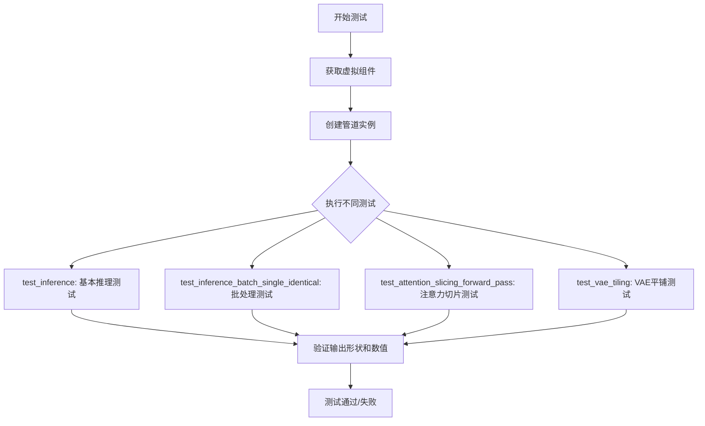
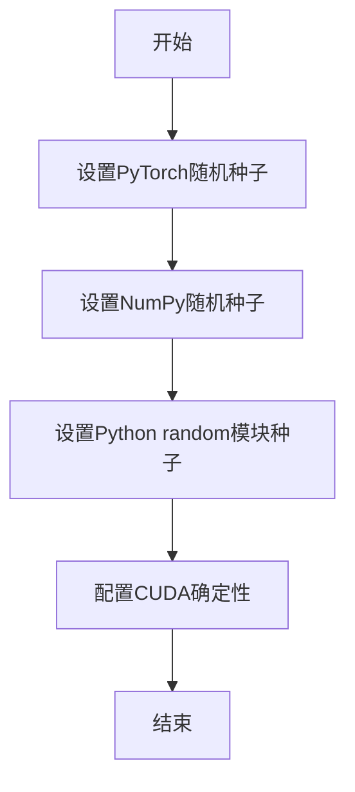
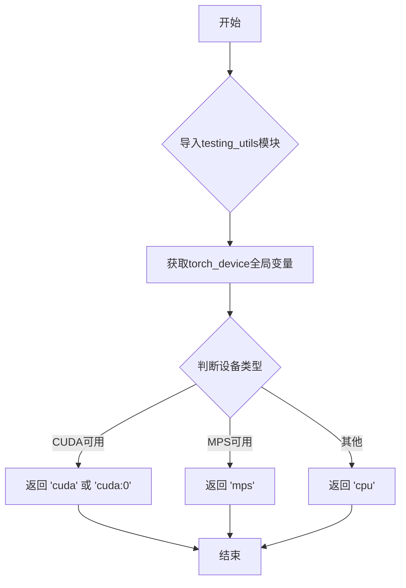
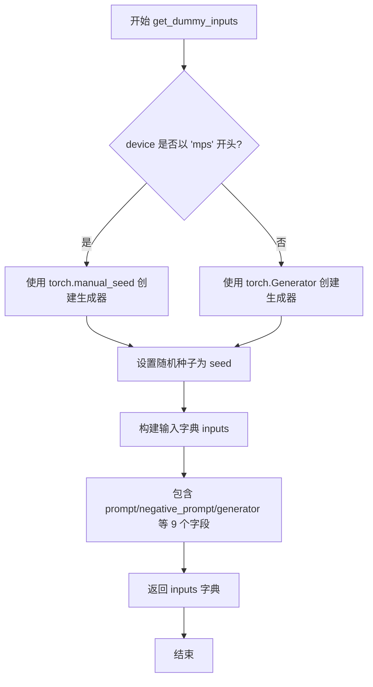
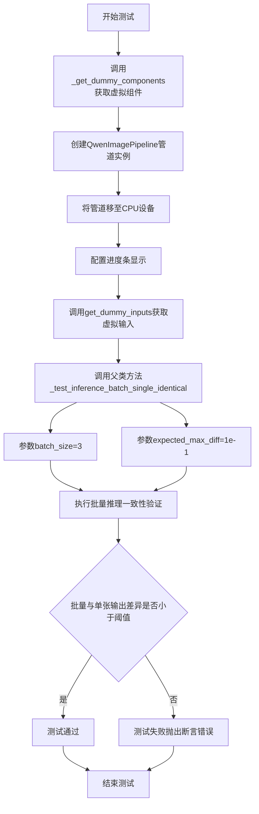
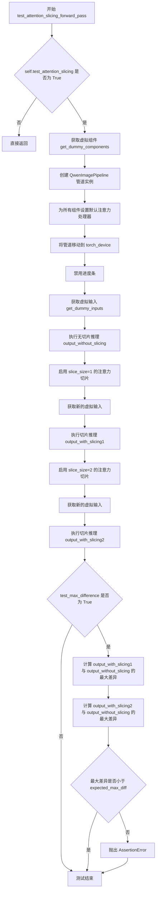
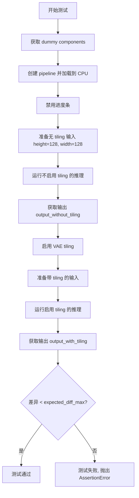

# `diffusers\tests\pipelines\qwenimage\test_qwenimage.py` 详细设计文档

这是一个针对 Qwen 图像生成管道的单元测试文件，用于测试 QwenImagePipeline 的核心功能，包括推理、批处理、注意力切片和 VAE 平铺等特性，确保图像生成管道的正确性和性能。

## 整体流程



## 类结构

```
PipelineTesterMixin (混入类)
└── QwenImagePipelineFastTests (测试类)
    ├── get_dummy_components (创建虚拟组件)
    ├── get_dummy_inputs (创建虚拟输入)
    ├── test_inference (推理测试)
    ├── test_inference_batch_single_identical (批处理测试)
    ├── test_attention_slicing_forward_pass (注意力切片测试)
    └── test_vae_tiling (VAE平铺测试)
```

## 全局变量及字段


### `expected_slice`
    
测试期望的图像张量切片，用于验证生成图像的像素值范围

类型：`torch.Tensor`
    


### `expected_diff_max`
    
VAE平铺测试中允许的最大差异阈值，默认为0.2

类型：`float`
    


### `QwenImagePipelineFastTests.pipeline_class`
    
待测试的Qwen图像生成管道类

类型：`type[QwenImagePipeline]`
    


### `QwenImagePipelineFastTests.params`
    
文本到图像管道参数集合，已移除cross_attention_kwargs参数

类型：`set`
    


### `QwenImagePipelineFastTests.batch_params`
    
批处理参数集合，用于批量图像生成测试

类型：`set`
    


### `QwenImagePipelineFastTests.image_params`
    
图像参数集合，定义图像相关输入参数

类型：`set`
    


### `QwenImagePipelineFastTests.image_latents_params`
    
图像潜在向量参数集合，用于潜在向量相关测试

类型：`set`
    


### `QwenImagePipelineFastTests.required_optional_params`
    
必需的可选参数集合，包含推理步数、生成器、潜在向量等关键参数

类型：`frozenset`
    


### `QwenImagePipelineFastTests.supports_dduf`
    
标志位，表示管道是否支持DDUF（Decoder-only Diffusion Transformer），当前为False

类型：`bool`
    


### `QwenImagePipelineFastTests.test_xformers_attention`
    
标志位，表示是否测试xformers注意力机制优化，当前为False

类型：`bool`
    


### `QwenImagePipelineFastTests.test_layerwise_casting`
    
标志位，表示是否测试层级类型转换功能，当前为True

类型：`bool`
    


### `QwenImagePipelineFastTests.test_group_offloading`
    
标志位，表示是否测试模型组卸载功能，当前为True

类型：`bool`
    
    

## 全局函数及方法


### `enable_full_determinism`

该函数用于确保测试的完全确定性，通过设置所有随机种子（PyTorch、NumPy等）使测试结果可复现。

参数： 无

返回值：`None`，该函数不返回任何值，仅执行副作用（设置随机种子）

#### 流程图



#### 带注释源码

```
# 导入语句（在文件中实际位置）
from ...testing_utils import enable_full_determinism, torch_device

# 函数调用（在测试类定义之前）
enable_full_determinism()

# 函数作用说明：
# - 设置 PyTorch 的全局随机种子 (torch.manual_seed())
# - 设置 NumPy 的随机种子 (np.random.seed())
# - 可能还设置 Python 内置 random 模块的种子
# - 可能配置 PyTorch 的 CUDA 运算以使用确定性算法
# - 目的：确保测试结果在不同运行之间完全一致，实现可重复的测试
```


### `to_np`

将 PyTorch 张量转换为 NumPy 数组的实用函数，用于在测试中进行数值比较。

参数：

-  `tensor`：`torch.Tensor` 或类似对象，需要转换的张量对象

返回值：`numpy.ndarray`，转换后的 NumPy 数组

#### 流程图

```mermaid
flowchart TD
    A[开始] --> B{输入是否为 torch.Tensor}
    B -->|是| C[调用 tensor.cpu.detach().numpy]
    B -->|否| D{输入是否有 numpy 方法}
    D -->|是| E[调用 input.numpy]
    D -->|否| F[直接返回输入]
    C --> G[返回 NumPy 数组]
    E --> G
    F --> G
```

#### 带注释源码

```
# to_np 函数定义在 test_pipelines_common.py 中
# 以下是基于使用方式的推断实现

def to_np(tensor):
    """
    将 PyTorch 张量转换为 NumPy 数组。
    
    此函数用于在测试中比较不同计算的输出。
    通常包含以下步骤：
    1. 将张量移到 CPU（如果还在 GPU 上）
    2. 分离计算图（detach）
    3. 转换为 NumPy 数组
    """
    if hasattr(tensor, 'numpy'):
        # 如果是 PyTorch 张量
        if tensor.is_cuda:
            tensor = tensor.cpu()
        return tensor.detach().numpy()
    elif hasattr(tensor, 'numpy'):
        # 其他类似数组的对象
        return tensor.numpy()
    else:
        # 如果已经是数组或其他可转换对象
        return tensor
```


### `torch_device`

`torch_device` 是从 `testing_utils` 模块导入的全局变量，用于获取当前测试环境的目标设备（通常是 "cpu"、"cuda" 或 "cuda:0" 等），以确保测试在不同硬件环境下正确运行。

参数： 无（全局变量，无需参数）

返回值： `str`，返回当前测试环境的目标设备字符串

#### 流程图



#### 带注释源码

```python
# 从 testing_utils 模块导入 torch_device 全局变量
# 该变量在 testing_utils 模块中定义，通常根据环境返回适当的设备字符串
from ...testing_utils import enable_full_determinism, torch_device

# 在测试方法中使用 torch_device 将模型移动到目标设备
pipe.to(torch_device)  # 将管道组件移动到 torch_device 指定的设备上

# torch_device 的典型定义方式（在 testing_utils 中）大致为：
# def get_torch_device():
#     """获取适合当前环境的PyTorch设备"""
#     if torch.cuda.is_available():
#         return "cuda"
#     elif torch.backends.mps.is_available():
#         return "mps"
#     else:
#         return "cpu"
#
# # 或者作为模块级变量
# torch_device = get_torch_device()
```


### `QwenImagePipelineFastTests.get_dummy_components`

该方法用于创建测试用的虚拟（dummy）组件，初始化图像转换器、VAE模型、调度器、文本编码器和分词器，并将其打包到字典中返回，供后续管道测试使用。

参数：无（仅隐式参数 `self`）

返回值：`Dict[str, Any]`，返回包含图像管道所需组件的字典，包括 transformer、vae、scheduler、text_encoder 和 tokenizer

#### 流程图

```mermaid
flowchart TD
    A[开始 get_dummy_components] --> B[设置随机种子 torch.manual_seed(0)]
    B --> C[创建 QwenImageTransformer2DModel]
    C --> D[设置随机种子 torch.manual_seed(0)]
    D --> E[创建 AutoencoderKLQwenImage VAE]
    E --> F[设置随机种子 torch.manual_seed(0)]
    F --> G[创建 FlowMatchEulerDiscreteScheduler]
    G --> H[设置随机种子 torch.manual_seed(0)]
    H --> I[创建 Qwen2_5_VLConfig 配置]
    I --> J[创建 Qwen2_5_VLForConditionalGeneration 文本编码器]
    J --> K[从预训练模型加载 Qwen2Tokenizer]
    K --> L[组装 components 字典]
    L --> M[返回 components]
```

#### 带注释源码

```python
def get_dummy_components(self):
    """
    创建并返回用于测试的虚拟组件字典。
    包含图像转换器、VAE、调度器、文本编码器和分词器。
    """
    # 设置随机种子以确保可重复性
    torch.manual_seed(0)
    # 初始化图像转换器（Transformer）模型
    # 参数：patch_size=2, 16通道输入, 4通道输出, 2层, 3个注意力头
    transformer = QwenImageTransformer2DModel(
        patch_size=2,
        in_channels=16,
        out_channels=4,
        num_layers=2,
        attention_head_dim=16,
        num_attention_heads=3,
        joint_attention_dim=16,
        guidance_embeds=False,
        axes_dims_rope=(8, 4, 4),
    )

    # 再次设置随机种子
    torch.manual_seed(0)
    # 定义潜在空间维度
    z_dim = 4
    # 初始化 VAE（变分自编码器）模型
    # 使用 base_dim=z_dim*6=24, z_dim=4, 维度倍增 [1,2,4], 1个残差块
    vae = AutoencoderKLQwenImage(
        base_dim=z_dim * 6,
        z_dim=z_dim,
        dim_mult=[1, 2, 4],
        num_res_blocks=1,
        temperal_downsample=[False, True],
        # 潜在空间均值和标准差
        latents_mean=[0.0] * 4,
        latents_std=[1.0] * 4,
    )

    # 设置随机种子
    torch.manual_seed(0)
    # 创建基于欧拉离散方法的流匹配调度器
    scheduler = FlowMatchEulerDiscreteScheduler()

    # 设置随机种子
    torch.manual_seed(0)
    # 创建 Qwen2.5 VL 配置对象
    config = Qwen2_5_VLConfig(
        text_config={  # 文本编码器配置
            "hidden_size": 16,
            "intermediate_size": 16,
            "num_hidden_layers": 2,
            "num_attention_heads": 2,
            "num_key_value_heads": 2,
            "rope_scaling": {  # 旋转位置编码配置
                "mrope_section": [1, 1, 2],
                "rope_type": "default",
                "type": "default",
            },
            "rope_theta": 1000000.0,
        },
        vision_config={  # 视觉编码器配置
            "depth": 2,
            "hidden_size": 16,
            "intermediate_size": 16,
            "num_heads": 2,
            "out_hidden_size": 16,
        },
        hidden_size=16,
        vocab_size=152064,
        vision_end_token_id=151653,
        vision_start_token_id=151652,
        vision_token_id=151654,
    )
    # 使用配置创建条件生成模型（文本编码器）
    text_encoder = Qwen2_5_VLForConditionalGeneration(config)
    # 从预训练模型加载分词器
    tokenizer = Qwen2Tokenizer.from_pretrained("hf-internal-testing/tiny-random-Qwen2VLForConditionalGeneration")

    # 将所有组件组装成字典
    components = {
        "transformer": transformer,
        "vae": vae,
        "scheduler": scheduler,
        "text_encoder": text_encoder,
        "tokenizer": tokenizer,
    }
    # 返回组件字典
    return components
```


### `QwenImagePipelineFastTests.get_dummy_inputs`

该方法是一个测试辅助函数，用于生成虚假的输入参数，模拟 QwenImagePipeline 图像生成管道所需的完整输入配置，支持不同的设备类型（CPU/MPS）和可配置的随机种子。

参数：

- `self`：隐式参数，测试类实例本身
- `device`：`str` 或 `torch.device`，指定生成器所在的计算设备，用于创建随机数生成器
- `seed`：`int`，随机种子，默认为 0，用于确保测试结果的可重复性

返回值：`Dict[str, Any]`，包含以下键值对：
- `prompt` (`str`)：正向提示词
- `negative_prompt` (`str`)：负向提示词
- `generator` (`torch.Generator`)：PyTorch 随机数生成器
- `num_inference_steps` (`int`)：推理步数
- `guidance_scale` (`float`)：引导尺度
- `true_cfg_scale` (`float`)：真实 CFG 尺度
- `height` (`int`)：生成图像高度
- `width` (`int`)：生成图像宽度
- `max_sequence_length` (`int`)：最大序列长度
- `output_type` (`str`)：输出类型

#### 流程图



#### 带注释源码

```python
def get_dummy_inputs(self, device, seed=0):
    """
    生成测试用的虚拟输入参数，用于 QwenImagePipeline 推理测试。
    
    参数:
        device: 计算设备 (如 'cpu', 'cuda', 'mps')
        seed: 随机种子，确保测试可重复性
    
    返回:
        包含 pipeline 推理所需参数的字典
    """
    # 判断设备类型，MPS (Apple Silicon) 需要特殊处理
    if str(device).startswith("mps"):
        # MPS 设备使用 torch.manual_seed 直接设置种子
        generator = torch.manual_seed(seed)
    else:
        # 其他设备 (CPU/CUDA) 使用 Generator 对象
        generator = torch.Generator(device=device).manual_seed(seed)

    # 构建完整的输入参数字典
    inputs = {
        "prompt": "dance monkey",              # 正向提示词
        "negative_prompt": "bad quality",      # 负向提示词
        "generator": generator,                # 随机生成器
        "num_inference_steps": 2,              # 推理步数 (较少以加快测试)
        "guidance_scale": 3.0,                 # classifier-free guidance 尺度
        "true_cfg_scale": 1.0,                 # 真实 CFG 尺度
        "height": 32,                          # 输出图像高度
        "width": 32,                            # 输出图像宽度
        "max_sequence_length": 16,             # 文本序列最大长度
        "output_type": "pt",                   # 输出格式 (PyTorch tensor)
    }

    return inputs
```


### `QwenImagePipelineFastTests.test_inference`

这是一个单元测试方法，用于测试 `QwenImagePipeline` 的推理功能。它创建虚拟组件和输入，执行图像生成流程，并验证生成的图像形状和像素值是否符合预期结果。

参数：

- `self`：隐式参数，测试类实例

返回值：无显式返回值（通过 `assert` 语句进行验证，测试通过则无异常，失败则抛出断言错误）

#### 流程图

```mermaid
flowchart TD
    A[开始 test_inference 测试] --> B[设置设备为 CPU]
    B --> C[调用 get_dummy_components 创建虚拟组件]
    C --> D[使用虚拟组件实例化 QwenImagePipeline]
    D --> E[将 Pipeline 移到设备 CPU]
    E --> F[设置进度条配置 disable=None]
    F --> G[调用 get_dummy_inputs 获取虚拟输入参数]
    G --> H[执行 Pipeline 推理: pipe(**inputs)]
    H --> I[从返回结果中提取图像 images[0]]
    I --> J{验证图像形状是否为 (3, 32, 32)}
    J -->|是| K[定义期望的像素值张量 expected_slice]
    J -->|否| L[测试失败 - 抛出断言错误]
    K --> M[展平生成图像并提取首尾各8个像素]
    M --> N{验证生成像素是否与期望值接近}
    N -->|是| O[测试通过]
    N -->|否| P[测试失败 - 抛出断言错误]
```

#### 带注释源码

```python
def test_inference(self):
    # 设置测试设备为 CPU
    device = "cpu"

    # 获取虚拟组件（transformer, vae, scheduler, text_encoder, tokenizer）
    components = self.get_dummy_components()
    
    # 使用虚拟组件实例化 QwenImagePipeline 管道
    pipe = self.pipeline_class(**components)
    
    # 将管道移至指定设备（CPU）
    pipe.to(device)
    
    # 设置进度条配置，disable=None 表示不禁用进度条
    pipe.set_progress_bar_config(disable=None)

    # 获取虚拟输入参数（包含 prompt, negative_prompt, generator 等）
    inputs = self.get_dummy_inputs(device)
    
    # 执行管道推理，传入输入参数，获取生成的图像
    # 返回值包含图像元组，这里取第一张图像 images[0]
    image = pipe(**inputs).images
    generated_image = image[0]
    
    # 断言验证：生成的图像形状必须是 (3, 32, 32)
    # 3 表示 RGB 通道数，32x32 表示图像高度和宽度
    self.assertEqual(generated_image.shape, (3, 32, 32))

    # 定义期望的像素值张量（用于验证生成图像的质量）
    # 这是一个预先计算的标准输出，用于确保推理结果的确定性
    expected_slice = torch.tensor([
        0.56331, 0.63677, 0.6015, 0.56369, 0.58166, 0.55277, 
        0.57176, 0.63261, 0.41466, 0.35561, 0.56229, 0.48334, 
        0.49714, 0.52622, 0.40872, 0.50208
    ])

    # 展平生成的图像为一维张量
    generated_slice = generated_image.flatten()
    
    # 提取展平后张量的前8个和后8个元素（共16个像素）
    # 这样可以快速验证图像边缘和中心区域的像素值
    generated_slice = torch.cat([generated_slice[:8], generated_slice[-8:]])
    
    # 断言验证：生成图像的像素值必须与期望值非常接近（容差 1e-3）
    # 使用 torch.allclose 进行近似相等比较
    self.assertTrue(torch.allclose(generated_slice, expected_slice, atol=1e-3))
```


### `QwenImagePipelineFastTests.test_inference_batch_single_identical`

该测试方法用于验证图像生成管道在批量推理模式下，单个样本的生成结果与批量推理中单个样本的生成结果是否保持一致，确保批处理逻辑不会影响输出的确定性。

参数：

- `self`：隐式参数，测试类实例本身

返回值：无（`None`），该方法为单元测试方法，通过断言验证结果而非返回值

#### 流程图



#### 带注释源码

```python
def test_inference_batch_single_identical(self):
    """
    测试批量推理时，单个样本的输出与批量推理中对应样本的输出是否一致。
    
    该测试确保管道在处理批量输入时，不会因实现问题导致输出与单独处理
    同一个输入时产生差异。主要验证批处理逻辑的正确性和确定性。
    """
    # 调用父类或mixin中定义的测试方法
    # batch_size=3: 测试使用3个样本的批量推理
    # expected_max_diff=1e-1: 允许的最大差异阈值为0.1
    self._test_inference_batch_single_identical(batch_size=3, expected_max_diff=1e-1)
```

---

### 补充说明

#### 潜在技术债务

1. **缺少 `_test_inference_batch_single_identical` 实现细节**：由于该方法继承自 `PipelineTesterMixin`，当前代码无法直接查看其具体实现，建议补充该方法的实现或明确文档说明。

2. **硬编码的测试参数**：`batch_size=3` 和 `expected_max_diff=1e-1` 被硬编码在测试方法中，缺乏灵活性。

#### 错误处理设计

- 该方法依赖 `unittest.TestCase` 的断言机制，当批量推理结果不一致时抛出 `AssertionError`
- 虚拟组件的创建使用固定随机种子（`torch.manual_seed(0)`），确保测试可复现

#### 设计约束

- 设备限制：测试固定在 CPU 设备上运行（`device = "cpu"`）
- 测试仅验证输出的数值一致性，不涉及性能基准测试


### `QwenImagePipelineFastTests.test_attention_slicing_forward_pass`

该方法用于测试注意力切片（Attention Slicing）功能对 Qwen 图像生成管道推理结果的影响。它通过比较启用不同 slice_size 的注意力切片与不使用切片时的输出差异，验证注意力切片不会显著改变模型的推理结果。

参数：

- `self`：`QwenImagePipelineFastTests`，测试类的实例，包含测试所需的配置和辅助方法
- `test_max_difference`：`bool`，是否测试输出之间的最大差异，默认为 True
- `test_mean_pixel_difference`：`bool`，是否测试平均像素差异（当前实现中未使用），默认为 True
- `expected_max_diff`：`float`，期望的最大差异阈值，用于判断注意力切片是否影响推理结果，默认为 1e-3

返回值：`None`，该方法为测试方法，不返回任何值，主要通过断言验证注意力切片功能的正确性

#### 流程图



#### 带注释源码

```python
def test_attention_slicing_forward_pass(
    self, test_max_difference=True, test_mean_pixel_difference=True, expected_max_diff=1e-3
):
    """
    测试注意力切片功能对推理结果的影响
    
    参数:
        test_max_difference: bool, 是否测试输出之间的最大差异
        test_mean_pixel_difference: bool, 是否测试平均像素差异（当前未使用）
        expected_max_diff: float, 允许的最大差异阈值
    """
    
    # 如果测试配置中未启用注意力切片测试，则直接返回
    if not self.test_attention_slicing:
        return

    # 获取用于测试的虚拟组件（transformer, vae, scheduler, text_encoder, tokenizer）
    components = self.get_dummy_components()
    
    # 使用虚拟组件创建 QwenImagePipeline 管道实例
    pipe = self.pipeline_class(**components)
    
    # 遍历管道中的所有组件，为支持 set_default_attn_processor 的组件设置默认注意力处理器
    for component in pipe.components.values():
        if hasattr(component, "set_default_attn_processor"):
            component.set_default_attn_processor()
    
    # 将管道移动到测试设备（通常是 CUDA 设备）
    pipe.to(torch_device)
    
    # 配置进度条（disable=None 表示启用进度条）
    pipe.set_progress_bar_config(disable=None)

    # 获取虚拟输入数据，生成器设备为 CPU
    generator_device = "cpu"
    inputs = self.get_dummy_inputs(generator_device)
    
    # 执行第一次推理：不使用注意力切片
    # 获取返回的第一项（图像）
    output_without_slicing = pipe(**inputs)[0]

    # 启用注意力切片，slice_size=1 表示将注意力计算分割为 1 个部分
    pipe.enable_attention_slicing(slice_size=1)
    
    # 获取新的虚拟输入（重新创建生成器以确保一致性）
    inputs = self.get_dummy_inputs(generator_device)
    
    # 执行第二次推理：使用 slice_size=1 的注意力切片
    output_with_slicing1 = pipe(**inputs)[0]

    # 启用注意力切片，slice_size=2 表示将注意力计算分割为 2 个部分
    pipe.enable_attention_slicing(slice_size=2)
    
    # 获取新的虚拟输入
    inputs = self.get_dummy_inputs(generator_device)
    
    # 执行第三次推理：使用 slice_size=2 的注意力切片
    output_with_slicing2 = pipe(**inputs)[0]

    # 如果需要测试最大差异
    if test_max_difference:
        # 将 PyTorch 张量转换为 NumPy 数组并计算绝对差值的最大值
        max_diff1 = np.abs(to_np(output_with_slicing1) - to_np(output_without_slicing)).max()
        max_diff2 = np.abs(to_np(output_with_slicing2) - to_np(output_without_slicing)).max()
        
        # 断言：注意力切片后的输出与原始输出的最大差异应小于预期阈值
        self.assertLess(
            max(max_diff1, max_diff2),
            expected_max_diff,
            "Attention slicing should not affect the inference results"
        )
```


### `QwenImagePipelineFastTests.test_vae_tiling`

该测试方法用于验证 VAE（变分自编码器）tiling（分块）功能不会影响图像生成的推理结果。通过对比启用 tiling 和不启用 tiling 两种情况下的输出差异，确保分块处理不会引入明显的视觉差异。

参数：

- `expected_diff_max`：`float`，默认值 `0.2`，设置允许的最大差异阈值，用于断言 tiling 与非 tiling 输出的差异必须小于此值

返回值：`None`，测试方法无返回值，通过 `self.assertLess` 断言验证结果

#### 流程图



#### 带注释源码

```python
def test_vae_tiling(self, expected_diff_max: float = 0.2):
    """测试 VAE tiling 功能，验证分块处理不影响推理结果"""
    generator_device = "cpu"
    
    # 步骤1: 获取虚拟组件（transformer, vae, scheduler, text_encoder, tokenizer）
    components = self.get_dummy_components()

    # 步骤2: 创建 pipeline 实例并加载到 CPU 设备
    pipe = self.pipeline_class(**components)
    pipe.to("cpu")
    
    # 步骤3: 设置进度条为可用（disable=None 表示启用）
    pipe.set_progress_bar_config(disable=None)

    # 步骤4: 准备输入参数（不使用 tiling）
    inputs = self.get_dummy_inputs(generator_device)
    inputs["height"] = inputs["width"] = 128  # 设置较大的图像尺寸以触发 tiling
    # 运行推理获取无 tiling 的输出
    output_without_tiling = pipe(**inputs)[0]

    # 步骤5: 启用 VAE tiling，配置分块参数
    pipe.vae.enable_tiling(
        tile_sample_min_height=96,    # 分块最小高度
        tile_sample_min_width=96,     # 分块最小宽度
        tile_sample_stride_height=64, # 垂直步长
        tile_sample_stride_width=64,  # 水平步长
    )
    
    # 步骤6: 准备相同的输入参数（使用 tiling）
    inputs = self.get_dummy_inputs(generator_device)
    inputs["height"] = inputs["width"] = 128
    # 运行推理获取带 tiling 的输出
    output_with_tiling = pipe(**inputs)[0]

    # 步骤7: 断言验证两者差异在允许范围内
    self.assertLess(
        (to_np(output_without_tiling) - to_np(output_with_tiling)).max(),
        expected_diff_max,
        "VAE tiling should not affect the inference results",
    )
```

## 关键组件


### QwenImagePipeline

主管道类，集成图像变换器、VAE、调度器和文本编码器，实现文本到图像的生成流程。

### QwenImageTransformer2DModel

图像变换器模型，使用patchify和Transformer架构处理图像潜空间，支持多轴旋转位置编码。

### AutoencoderKLQwenImage

变分自编码器，负责图像的编码和解码，支持潜空间的均值和标准差配置。

### FlowMatchEulerDiscreteScheduler

基于Flow Match的欧拉离散调度器，用于控制去噪扩散过程的步骤。

### Qwen2_5_VLForConditionalGeneration

Qwen2.5视觉语言模型作为文本编码器，将文本提示转换为条件嵌入向量。

### Qwen2Tokenizer

分词器，用于将文本提示转换为模型可处理的token序列。

### 文本到图像批处理参数

TEXT_TO_IMAGE_BATCH_PARAMS - 定义批量推理时的输入参数集合。

### 图像生成参数

TEXT_TO_IMAGE_PARAMS - 定义单次图像生成的标准输入参数，包含提示词、负提示词、推理步数、引导比例等。

### VAE平铺机制

支持大分辨率图像生成的VAE分块处理，通过tile_sample_min_height/width和stride参数控制分块大小和重叠区域。

### 注意力切片机制

enable_attention_slicing方法支持将注意力计算分片处理，降低显存占用的同时保持输出质量。

### 张量索引与配置

通过Qwen2_5_VLConfig配置文本和视觉编码器的隐藏层维度、注意力头数、RoPE参数等关键超参数。

### 调度器与推理配置

支持自定义推理步数、生成器种子、返回格式等推理参数配置。


## 问题及建议


### 已知问题

- 测试方法 `test_inference` 中硬编码使用 `device = "cpu"`，未使用 `torch_device` 全局配置，导致设备不一致
- `get_dummy_components` 方法在每次调用时都重新创建模型实例，未进行缓存，造成不必要的计算资源浪费
- `get_dummy_inputs` 方法中对 MPS 设备的特殊处理（`str(device).startswith("mps")`）是临时性解决方案，逻辑不够健壮
- 测试中使用硬编码的预期值（如 `expected_slice`），缺乏参数化，当模型结构或配置变更时需要手动更新
- `test_attention_slicing_forward_pass` 方法接收未使用的默认参数 `test_max_difference`、`test_mean_pixel_difference`，可能存在遗留代码
- 测试类缺少显式的资源清理（teardown）逻辑，可能导致测试间的状态污染
- `required_optional_params` 定义了 frozenset 但在实际测试中未充分验证其覆盖性

### 优化建议

- 提取公共的设备配置和模型创建逻辑到类级别的 `setUpClass` 或 fixture 中，减少重复初始化
- 使用 pytest 的 `@pytest.mark.parametrize` 装饰器替代硬编码的测试参数，提高测试覆盖率
- 将硬编码的数值（如图像尺寸、推理步数、guidance_scale 等）提取为类常量或配置对象
- 添加类型注解（type hints）到方法签名中，提升代码可读性和 IDE 支持
- 使用 `unittest.mock` 对耗时或外部依赖的组件（如 tokenizer、text_encoder）进行 mock，缩短单元测试时间
- 规范化设备选择逻辑，使用统一的设备管理工具或配置类替代临时性的设备判断代码
- 在测试方法末尾添加显式的资源释放逻辑（如 del 引用、清理 CUDA 缓存等）

## 其它


### 设计目标与约束

本测试文件旨在验证QwenImagePipeline图像生成管道的正确性和稳定性。设计目标包括：确保文本到图像生成功能按预期工作，支持批处理推理，验证attention slicing和VAE tiling等优化功能不影响输出质量。约束条件包括：仅支持CPU和CUDA设备，依赖特定版本的transformers和diffusers库，测试使用固定随机种子确保可重复性。

### 错误处理与异常设计

测试类使用unittest框架的assert方法进行验证，主要包括：assertEqual用于验证输出形状，assertTrue用于验证张量相似性，assertLess用于验证数值差异在允许范围内。设备兼容性处理中针对MPS设备使用不同的随机数生成器策略。当测试失败时，unittest框架会自动捕获并报告具体的断言错误信息和差异数值。

### 数据流与状态机

测试数据流如下：首先通过get_dummy_components方法创建虚拟组件（transformer、vae、scheduler、text_encoder、tokenizer），然后通过get_dummy_inputs方法构造输入参数（prompt、negative_prompt、generator、num_inference_steps等），最后将组件和输入传递给pipeline进行推理。状态转换包括：组件初始化 -> 设置设备 -> 配置进度条 -> 执行推理 -> 返回结果。

### 外部依赖与接口契约

主要外部依赖包括：torch和numpy用于数值计算，transformers库提供Qwen2_5_VLConfig、Qwen2_5_VLForConditionalGeneration和Qwen2Tokenizer，diffusers库提供AutoencoderKLQwenImage、FlowMatchEulerDiscreteScheduler、QwenImagePipeline和QwenImageTransformer2DModel。接口契约要求pipeline_class必须支持__call__方法接受prompt、negative_prompt、generator等参数并返回包含images属性的对象，组件必须实现set_default_attn_processor方法（用于attention slicing测试），vae必须支持enable_tiling方法（用于VAE tiling测试）。

### 性能考虑与基准测试

测试中包含性能优化功能的验证：test_attention_slicing_forward_pass验证attention slicing优化，test_vae_tiling验证VAE tiling优化。基准测试使用固定随机种子（seed=0）确保结果可复现，允许的数值差异阈值为1e-3（attention slicing）和0.2（VAE tiling）。

### 安全考虑

代码遵循Apache License 2.0开源许可。测试使用虚拟组件和小型模型配置（hidden_size=16, num_layers=2等），不会产生实际敏感内容。测试环境建议在隔离的CI/CD环境中运行。

### 配置与参数说明

关键配置参数包括：patch_size=2, in_channels=16, out_channels=4用于transformer配置；z_dim=4, dim_mult=[1,2,4]用于VAE配置；num_inference_steps=2, guidance_scale=3.0, true_cfg_scale=1.0用于推理参数；height=32, width=32用于图像尺寸；max_sequence_length=16用于文本序列长度。Qwen2_5_VLConfig包含text_config和vision_config两部分，分别配置文本编码器和视觉编码器。

### 版本历史与变更记录

该测试文件基于diffusers库的测试框架，继承PipelineTesterMixin提供的通用测试方法。代码格式规范使用# fmt: on/off标记来禁用格式化工具对特定代码块的处理。测试类设置了supports_dduf=False、test_xformers_attention=False、test_layerwise_casting=True、test_group_offloading=True等标志来控制测试行为。


    