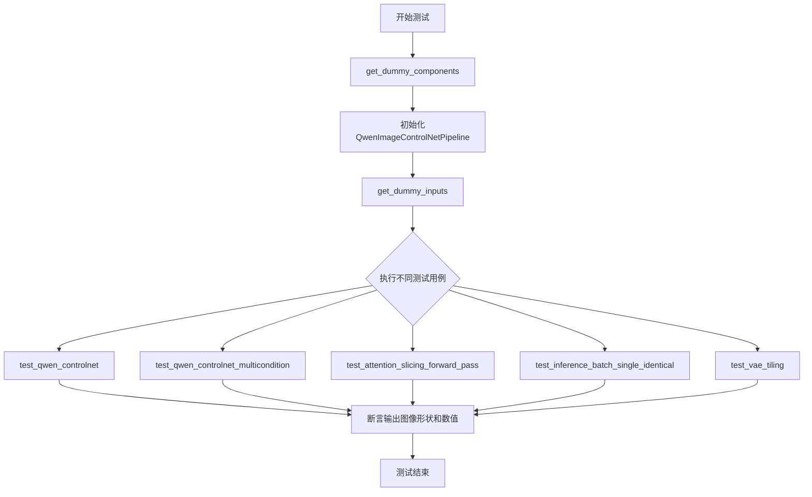
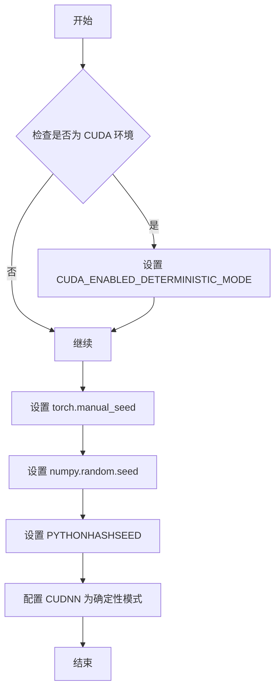
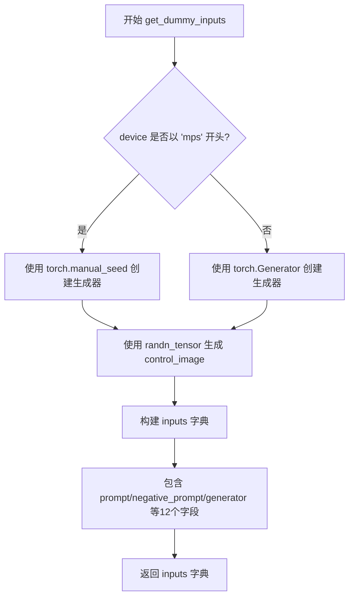
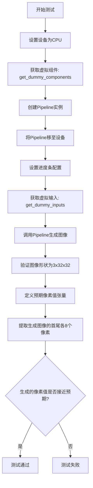
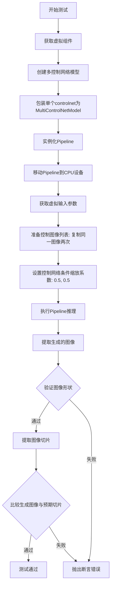
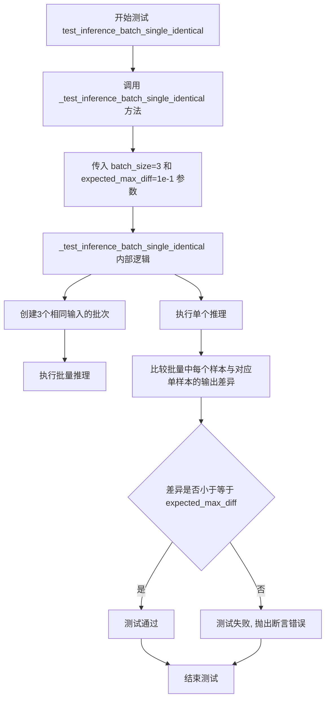
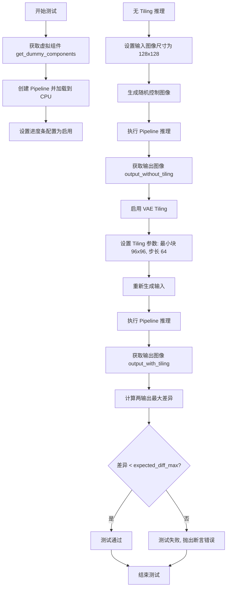

# `diffusers\tests\pipelines\qwenimage\test_qwenimage_controlnet.py` 详细设计文档

这是一个针对Qwen2.5-VL控制网络（ControlNet）图像生成管道的单元测试文件，用于验证QwenImageControlNetPipeline在单条件、多条件、注意力切片、批处理和VAE平铺等场景下的功能正确性。

## 整体流程



## 类结构

```
unittest.TestCase
└── QwenControlNetPipelineFastTests (PipelineTesterMixin)
    ├── get_dummy_components() - 创建虚拟组件
    ├── get_dummy_inputs() - 创建虚拟输入
    ├── test_qwen_controlnet() - 基本功能测试
    ├── test_qwen_controlnet_multicondition() - 多条件测试
    ├── test_attention_slicing_forward_pass() - 注意力切片测试
    ├── test_inference_batch_single_identical() - 批处理测试
    └── test_vae_tiling() - VAE平铺测试
```

## 全局变量及字段


### `enable_full_determinism`
    
启用完全确定性以确保测试可复现

类型：`function`
    


### `QwenControlNetPipelineFastTests.pipeline_class`
    
被测试的 Pipeline 类，指向 QwenImageControlNetPipeline

类型：`Type[QwenImageControlNetPipeline]`
    


### `QwenControlNetPipelineFastTests.params`
    
Text-to-image 参数字段集合，包含 control_image 和 controlnet_conditioning_scale

类型：`frozenset`
    


### `QwenControlNetPipelineFastTests.batch_params`
    
支持批次处理的参数集合，包括 prompt、negative_prompt 和 control_image

类型：`frozenset`
    


### `QwenControlNetPipelineFastTests.image_params`
    
图像相关参数集合，仅包含 control_image

类型：`frozenset`
    


### `QwenControlNetPipelineFastTests.image_latents_params`
    
图像潜在向量参数集合，包含 latents

类型：`frozenset`
    


### `QwenControlNetPipelineFastTests.required_optional_params`
    
必需的可选参数集合，用于验证推理参数完整性

类型：`frozenset`
    


### `QwenControlNetPipelineFastTests.supports_dduf`
    
标志位，表示该 Pipeline 是否支持 DDUF（Decoder-only Diffusion Upscaler Feature）

类型：`bool`
    


### `QwenControlNetPipelineFastTests.test_xformers_attention`
    
标志位，指示是否测试 xformers 内存高效注意力机制

类型：`bool`
    


### `QwenControlNetPipelineFastTests.test_layerwise_casting`
    
标志位，指示是否测试分层类型转换功能

类型：`bool`
    


### `QwenControlNetPipelineFastTests.test_group_offloading`
    
标志位，指示是否测试模型组卸载功能

类型：`bool`
    
    

## 全局函数及方法


### `enable_full_determinism`

该函数用于启用 PyTorch 和相关库的完全确定性运行模式，通过设置随机种子和环境变量确保测试结果可复现。

参数：

- 无参数

返回值：`None`，该函数无返回值，主要通过副作用（设置全局状态）实现功能。

#### 流程图



#### 带注释源码

```
# 从 diffusers.utils.testing_utils 导入
# 这个函数在测试文件开头被调用，确保后续所有随机操作都是确定性的
enable_full_determinism()

# 函数的典型实现逻辑（基于 diffusers 库常见模式）：
# 1. 设置 PyTorch 全局随机种子为 0
# 2. 设置 NumPy 全局随机种子为 0  
# 3. 设置 Python hash seed 为 0
# 4. 如果使用 CUDA，设置 torch.backends.cudnn.deterministic = True
# 5. 设置相关的确定性环境变量
```

#### 实际调用位置

在提供的测试文件中，该函数在第 37 行被调用：

```python
# 第 37 行
enable_full_determinism()

# 作用：确保后续所有测试运行时的随机数生成是确定性的
# 使得测试结果可复现，便于调试和回归测试
```


我需要从代码中提取 `randn_tensor` 函数的信息。让我搜索这个函数的定义。

由于代码中显示 `randn_tensor` 是从 `diffusers.utils.torch_utils` 导入的，我需要查找这个模块。

[TOOL_CALL]
{tool => "grep_definitions", args => {
  --query "def randn_tensor"
  --file_names ["diffusers/utils/torch_utils.py"]
}}
[/TOOL_CALL]


### `to_np`

将 PyTorch 张量转换为 NumPy 数组的辅助函数，用于在测试中比较模型输出。

参数：

-  `tensor`：`torch.Tensor` 或类似对象，需要转换的 PyTorch 张量

返回值：`numpy.ndarray`，转换后的 NumPy 数组

#### 流程图

```mermaid
flowchart TD
    A[开始: 输入 tensor] --> B{检查 tensor 类型}
    B -->|torch.Tensor| C[调用 tensor.cpu.detach().numpy]
    B -->|已经是 numpy| D[直接返回]
    C --> E[返回 numpy 数组]
    D --> E
```

#### 带注释源码

```
# to_np 函数定义在 test_pipelines_common 模块中
# 此处基于使用方式推断其实现逻辑

def to_np(tensor):
    """
    将 PyTorch 张量转换为 NumPy 数组
    
    参数:
        tensor: PyTorch 张量对象
        
    返回:
        numpy.ndarray: 转换后的 NumPy 数组
    """
    # 如果输入已经是 NumPy 数组，直接返回
    if isinstance(tensor, np.ndarray):
        return tensor
    
    # 如果是 PyTorch 张量，转移到 CPU、分离梯度、转为 NumPy
    if isinstance(tensor, torch.Tensor):
        return tensor.cpu().detach().numpy()
    
    # 对于其他类型，尝试直接转换
    return np.array(tensor)
```


### `QwenControlNetPipelineFastTests.get_dummy_components`

该方法是一个测试工具方法，用于为 Qwen ControlNet 管道生成虚拟（dummy）组件。它通过固定的随机种子初始化各种模型组件（包括 transformer、VAE、scheduler、text_encoder、tokenizer 和 controlnet），确保测试的可重复性和确定性。

参数： 无

返回值：`Dict[str, Any]`，返回一个包含所有模型组件的字典，用于初始化 QwenImageControlNetPipeline 进行测试

#### 流程图

```mermaid
flowchart TD
    A[开始 get_dummy_components] --> B[设置随机种子 torch.manual_seed(0)]
    B --> C[创建 QwenImageTransformer2DModel]
    C --> D[设置随机种子 torch.manual_seed(0)]
    D --> E[创建 QwenImageControlNetModel]
    E --> F[设置随机种子 torch.manual_seed(0)]
    F --> G[创建 AutoencoderKLQwenImage VAE]
    G --> H[设置随机种子 torch.manual_seed(0)]
    H --> I[创建 FlowMatchEulerDiscreteScheduler]
    I --> J[设置随机种子 torch.manual_seed(0)]
    J --> K[创建 Qwen2_5_VLConfig 配置对象]
    K --> L[使用配置创建 Qwen2_5_VLForConditionalGeneration]
    L --> M[加载 Qwen2Tokenizer]
    M --> N[组装 components 字典]
    N --> O[返回 components 字典]
```

#### 带注释源码

```python
def get_dummy_components(self):
    """
    生成用于测试的虚拟组件字典。
    使用固定的随机种子确保测试的可重复性。
    """
    
    # 步骤1: 设置随机种子并创建 transformer 模型
    torch.manual_seed(0)
    transformer = QwenImageTransformer2DModel(
        patch_size=2,              # 图像分块大小
        in_channels=16,            # 输入通道数
        out_channels=4,            # 输出通道数
        num_layers=2,              # transformer 层数
        attention_head_dim=16,    # 注意力头维度
        num_attention_heads=3,     # 注意力头数量
        joint_attention_dim=16,    # 联合注意力维度
        guidance_embeds=False,     # 是否使用引导嵌入
        axes_dims_rope=(8, 4, 4),  # RoPE 轴维度
    )

    # 步骤2: 设置随机种子并创建 ControlNet 模型
    torch.manual_seed(0)
    controlnet = QwenImageControlNetModel(
        patch_size=2,              # 图像分块大小
        in_channels=16,            # 输入通道数
        out_channels=4,            # 输出通道数
        num_layers=2,              # 层数
        attention_head_dim=16,    # 注意力头维度
        num_attention_heads=3,     # 注意力头数量
        joint_attention_dim=16,    # 联合注意力维度
        axes_dims_rope=(8, 4, 4),  # RoPE 轴维度
    )

    # 步骤3: 设置随机种子并创建 VAE 模型
    torch.manual_seed(0)
    z_dim = 4                      # 潜在空间维度
    vae = AutoencoderKLQwenImage(
        base_dim=z_dim * 6,       # 基础维度
        z_dim=z_dim,              # 潜在空间维度
        dim_mult=[1, 2, 4],        # 维度倍数
        num_res_blocks=1,         # 残差块数量
        temperal_downsample=[False, True],  # 时间下采样
        latents_mean=[0.0] * z_dim,         # 潜在均值
        latents_std=[1.0] * z_dim,          # 潜在标准差
    )

    # 步骤4: 设置随机种子并创建调度器
    torch.manual_seed(0)
    scheduler = FlowMatchEulerDiscreteScheduler()

    # 步骤5: 设置随机种子并创建文本编码器配置
    torch.manual_seed(0)
    config = Qwen2_5_VLConfig(
        text_config={
            "hidden_size": 16,           # 隐藏层大小
            "intermediate_size": 16,     # 中间层大小
            "num_hidden_layers": 2,      # 隐藏层数量
            "num_attention_heads": 2,    # 注意力头数量
            "num_key_value_heads": 2,    # 键值头数量
            "rope_scaling": {             # RoPE 缩放配置
                "mrope_section": [1, 1, 2],
                "rope_type": "default",
                "type": "default",
            },
            "rope_theta": 1_000_000.0,   # RoPE 基础频率
        },
        vision_config={
            "depth": 2,                  # 视觉编码器深度
            "hidden_size": 16,           # 隐藏层大小
            "intermediate_size": 16,     # 中间层大小
            "num_heads": 2,              # 头数量
            "out_hidden_size": 16,       # 输出隐藏层大小
        },
        hidden_size=16,                  # 整体隐藏层大小
        vocab_size=152064,               # 词汇表大小
        vision_end_token_id=151653,      # 视觉结束 token ID
        vision_start_token_id=151652,    # 视觉开始 token ID
        vision_token_id=151654,          # 视觉 token ID
    )

    # 步骤6: 使用配置创建文本编码器模型
    text_encoder = Qwen2_5_VLForConditionalGeneration(config)
    
    # 步骤7: 加载分词器
    tokenizer = Qwen2Tokenizer.from_pretrained("hf-internal-testing/tiny-random-Qwen2VLForConditionalGeneration")

    # 步骤8: 组装组件字典并返回
    components = {
        "transformer": transformer,      # 图像 transformer 模型
        "vae": vae,                      # 变分自编码器
        "scheduler": scheduler,          # 扩散调度器
        "text_encoder": text_encoder,    # 文本编码器
        "tokenizer": tokenizer,          # 分词器
        "controlnet": controlnet,        # ControlNet 模型
    }
    return components
```


### `QwenControlNetPipelineFastTests.get_dummy_inputs`

该方法用于生成 Qwen ControlNet Pipeline 测试所需的虚拟输入参数，创建一个包含提示词、负提示词、随机数生成器、推理步数、引导系数、图像尺寸、控制图像及控制网络条件比例等完整输入字典，以支持 Pipeline 的单元测试和集成测试。

参数：

- `device`：`torch.device` 或 `str`，指定生成随机张量所使用的设备（如 "cpu"、"cuda" 等）
- `seed`：`int`，随机数生成器的种子，默认为 0，用于保证测试结果的可重复性

返回值：`dict`，返回包含以下键值的字典：
  - `prompt`（`str`）：正向提示词
  - `negative_prompt`（`str`）：负向提示词
  - `generator`（`torch.Generator`）：随机数生成器
  - `num_inference_steps`（`int`）：推理步数
  - `guidance_scale`（`float`）：引导系数
  - `true_cfg_scale`（`float`）：真实 CFG 比例
  - `height`（`int`）：生成图像高度
  - `width`（`int`）：生成图像宽度
  - `max_sequence_length`（`int`）：最大序列长度
  - `control_image`（`torch.Tensor`）：控制图像张量
  - `controlnet_conditioning_scale`（`float`）：控制网络条件比例
  - `output_type`（`str`）：输出类型

#### 流程图



#### 带注释源码

```python
def get_dummy_inputs(self, device, seed=0):
    """
    生成用于测试 QwenControlNetPipeline 的虚拟输入参数
    
    参数:
        device: 计算设备，可以是字符串（如 'cpu', 'cuda'）或 torch.device 对象
        seed: 随机种子，用于确保测试结果可复现，默认值为 0
    
    返回:
        dict: 包含 pipeline 推理所需的所有输入参数
    """
    
    # 根据设备类型选择不同的随机数生成器创建方式
    # MPS (Apple Silicon) 设备使用 torch.manual_seed
    if str(device).startswith("mps"):
        generator = torch.manual_seed(seed)
    else:
        # 其他设备使用 torch.Generator 并指定 device
        generator = torch.Generator(device=device).manual_seed(seed)

    # 生成随机控制图像（control image）
    # 形状为 (1, 3, 32, 32)，用于 ControlNet 的条件输入
    control_image = randn_tensor(
        (1, 3, 32, 32),          # 张量形状：batch=1, 通道=3, 高=32, 宽=32
        generator=generator,    # 复用上述创建的随机数生成器
        device=torch.device(device),  # 转换为 torch.device 对象
        dtype=torch.float32,     # 数据类型为 32 位浮点数
    )

    # 构建完整的输入参数字典
    inputs = {
        "prompt": "dance monkey",              # 正向提示词
        "negative_prompt": "bad quality",      # 负向提示词
        "generator": generator,                # 随机数生成器，确保可复现性
        "num_inference_steps": 2,              # 扩散模型推理步数
        "guidance_scale": 3.0,                 # Classifier-free guidance 引导系数
        "true_cfg_scale": 1.0,                 # 真实 CFG 比例
        "height": 32,                          # 输出图像高度
        "width": 32,                           # 输出图像宽度
        "max_sequence_length": 16,             # 文本序列最大长度
        "control_image": control_image,        # ControlNet 控制图像
        "controlnet_conditioning_scale": 0.5, # 控制网络条件强度 (0-1)
        "output_type": "pt",                   # 输出类型：PyTorch 张量
    }

    # 返回包含所有必要输入的字典，供 pipeline 调用
    return inputs
```


### `QwenControlNetPipelineFastTests.test_qwen_controlnet`

这是一个单元测试方法，用于测试Qwen ControlNet图像生成Pipeline的基本推理功能。该测试通过创建虚拟组件和输入，验证Pipeline能否正确生成指定尺寸的图像，并检查生成的图像像素值是否与预期值接近。

参数：

- `self`：隐式参数，测试类实例，包含`pipeline_class`等属性

返回值：无（`None`），测试方法通过断言验证，不返回具体值

#### 流程图



#### 带注释源码

```python
def test_qwen_controlnet(self):
    """
    测试Qwen ControlNet Pipeline的基本推理功能
    
    该测试执行以下步骤：
    1. 创建虚拟组件（transformer、vae、controlnet等）
    2. 初始化Pipeline并移至CPU设备
    3. 使用虚拟输入调用Pipeline生成图像
    4. 验证生成图像的形状和像素值
    """
    # 1. 设置测试设备为CPU
    device = "cpu"
    
    # 2. 获取预定义的虚拟组件（transformer、vae、controlnet等）
    components = self.get_dummy_components()
    
    # 3. 使用虚拟组件实例化Pipeline
    pipe = self.pipeline_class(**components)
    
    # 4. 将Pipeline移至指定设备（CPU）
    pipe.to(device)
    
    # 5. 配置进度条（disable=None表示不禁用）
    pipe.set_progress_bar_config(disable=None)
    
    # 6. 获取虚拟输入参数（包含prompt、control_image等）
    inputs = self.get_dummy_inputs(device)
    
    # 7. 调用Pipeline执行推理，获取生成的图像
    #    返回值包含images属性
    image = pipe(**inputs).images
    
    # 8. 获取第一张生成的图像
    generated_image = image[0]
    
    # 9. 断言验证：生成的图像形状应为 (3, 32, 32)
    #    3通道，32x32像素
    self.assertEqual(generated_image.shape, (3, 32, 32))

    # 10. 定义预期切片值（来自参考生成的图像像素值）
    expected_slice = torch.tensor(
        [
            0.4726,
            0.5549,
            0.6324,
            0.6548,
            0.4968,
            0.4639,
            0.4749,
            0.4898,
            0.4725,
            0.4645,
            0.4435,
            0.3339,
            0.3400,
            0.4630,
            0.3879,
            0.4406,
        ]
    )

    # 11. 提取生成图像的像素值进行验证
    #     先将图像展平为一维，然后取首尾各8个元素，共16个像素
    generated_slice = generated_image.flatten()
    generated_slice = torch.cat([generated_slice[:8], generated_slice[-8:]])
    
    # 12. 断言验证：生成的像素值应与预期值接近（容差1e-3）
    self.assertTrue(torch.allclose(generated_slice, expected_slice, atol=1e-3))
```


### `QwenControlNetPipelineFastTests.test_qwen_controlnet_multicondition`

测试 Qwen ControlNet Pipeline 的多条件控制功能，验证使用 `QwenImageMultiControlNetModel` 包装多个控制网络时，图像生成流程的正确性，包括输出图像尺寸和生成质量的验证。

参数：

- 无显式参数（隐含参数 `self`：测试类实例）

返回值：`None`，无返回值（测试方法，通过断言验证正确性）

#### 流程图



#### 带注释源码

```python
def test_qwen_controlnet_multicondition(self):
    """
    测试 Qwen ControlNet Pipeline 的多条件控制功能。
    验证使用 QwenImageMultiControlNetModel 处理多个控制图像时的正确性。
    """
    # 1. 设置测试设备为 CPU
    device = "cpu"
    
    # 2. 获取预配置的虚拟组件（包含 transformer, vae, scheduler, text_encoder, tokenizer, controlnet）
    components = self.get_dummy_components()

    # 3. 将原始单个 ControlNet 模型替换为多 ControlNet 模型
    # QwenImageMultiControlNetModel 支持多个控制网络的条件输入
    components["controlnet"] = QwenImageMultiControlNetModel([components["controlnet"]])

    # 4. 使用替换后的组件实例化 Pipeline
    pipe = self.pipeline_class(**components)
    
    # 5. 将 Pipeline 移动到指定设备（CPU）
    pipe.to(device)
    
    # 6. 配置进度条（disable=None 表示启用进度条）
    pipe.set_progress_bar_config(disable=None)

    # 7. 获取虚拟输入参数（包含 prompt, negative_prompt, generator 等）
    inputs = self.get_dummy_inputs(device)
    
    # 8. 提取原始控制图像
    control_image = inputs["control_image"]
    
    # 9. 将控制图像设置为列表形式，支持多个条件控制
    # 这里使用相同的图像两次，模拟多条件控制场景
    inputs["control_image"] = [control_image, control_image]
    
    # 10. 为每个控制网络设置条件缩放系数
    inputs["controlnet_conditioning_scale"] = [0.5, 0.5]

    # 11. 执行 Pipeline 推理，生成图像
    image = pipe(**inputs).images
    
    # 12. 提取第一张生成的图像
    generated_image = image[0]
    
    # 13. 验证生成的图像形状是否为 (3, 32, 32) - RGB 图像，32x32 分辨率
    self.assertEqual(generated_image.shape, (3, 32, 32))

    # 14. 定义预期输出的像素值切片（用于验证生成质量）
    expected_slice = torch.tensor(
        [
            0.6239,
            0.6642,
            0.5768,
            0.6039,
            0.5270,
            0.5070,
            0.5006,
            0.5271,
            0.4506,
            0.3085,
            0.3435,
            0.5152,
            0.5096,
            0.5422,
            0.4286,
            0.5752,
        ]
    )

    # 15. 提取生成图像的切片：前8个像素 + 后8个像素
    generated_slice = generated_image.flatten()
    generated_slice = torch.cat([generated_slice[:8], generated_slice[-8:]])
    
    # 16. 验证生成结果与预期值的差异在容差范围内（atol=1e-3）
    self.assertTrue(torch.allclose(generated_slice, expected_slice, atol=1e-3))
```


### `QwenControlNetPipelineFastTests.test_attention_slicing_forward_pass`

该方法用于测试 Qwen 控制网络管道在启用注意力切片（attention slicing）功能时的前向传播是否与未启用时产生一致的推理结果，确保注意力切片优化不会影响输出质量。

参数：

- `self`：隐式参数，`QwenControlNetPipelineFastTests` 类的实例，表示测试用例本身
- `test_max_difference`：`bool`，默认为 `True`，指示是否测试最大差异
- `test_mean_pixel_difference`：`bool`，默认为 `True`，指示是否测试平均像素差异（当前未使用）
- `expected_max_diff`：`float`，默认为 `1e-3`，允许的最大差异阈值

返回值：`None`，该方法为测试方法，无返回值，通过断言验证注意力切片对推理结果无显著影响

#### 流程图

```mermaid
flowchart TD
    A[开始测试] --> B{test_attention_slicing 启用?}
    B -->|否| C[直接返回]
    B -->|是| D[获取虚拟组件]
    D --> E[创建 Pipeline 实例]
    E --> F[设置默认注意力处理器]
    F --> G[将 Pipeline 移到计算设备]
    G --> H[获取无注意力切片的输出]
    H --> I[启用 slice_size=1 的注意力切片]
    I --> J[获取启用切片后的输出]
    J --> K[启用 slice_size=2 的注意力切片]
    K --> L[获取启用切片后的输出]
    L --> M{test_max_difference 为真?]
    M -->|否| N[测试通过]
    M -->|是| O[计算最大差异]
    O --> P{差异小于阈值?}
    P -->|是| N
    P -->|否| Q[断言失败]
```

#### 带注释源码

```python
def test_attention_slicing_forward_pass(
    self, test_max_difference=True, test_mean_pixel_difference=True, expected_max_diff=1e-3
):
    """
    测试注意力切片功能对 QwenControlNet 管道输出的影响。
    
    参数:
        test_max_difference: 是否测试最大差异
        test_mean_pixel_difference: 是否测试平均像素差异（当前未使用）
        expected_max_diff: 允许的最大差异阈值
    """
    # 如果测试未启用注意力切片功能，则直接返回
    if not self.test_attention_slicing:
        return

    # 获取虚拟组件用于测试
    components = self.get_dummy_components()
    
    # 使用虚拟组件创建管道实例
    pipe = self.pipeline_class(**components)
    
    # 遍历所有组件，为支持默认注意力处理器的组件设置默认处理器
    for component in pipe.components.values():
        if hasattr(component, "set_default_attn_processor"):
            component.set_default_attn_processor()
    
    # 将管道移到测试设备
    pipe.to(torch_device)
    
    # 设置进度条配置（禁用进度条）
    pipe.set_progress_bar_config(disable=None)

    # 设置生成器设备为 CPU
    generator_device = "cpu"
    
    # 获取测试输入
    inputs = self.get_dummy_inputs(generator_device)
    
    # 执行无注意力切片的前向传播，获取输出
    output_without_slicing = pipe(**inputs)[0]

    # 启用注意力切片，slice_size=1
    pipe.enable_attention_slicing(slice_size=1)
    
    # 重新获取输入并执行前向传播
    inputs = self.get_dummy_inputs(generator_device)
    output_with_slicing1 = pipe(**inputs)[0]

    # 启用注意力切片，slice_size=2
    pipe.enable_attention_slicing(slice_size=2)
    
    # 重新获取输入并执行前向传播
    inputs = self.get_dummy_inputs(generator_device)
    output_with_slicing2 = pipe(**inputs)[0]

    # 如果需要测试最大差异
    if test_max_difference:
        # 将输出转换为 numpy 数组并计算差异
        max_diff1 = np.abs(to_np(output_with_slicing1) - to_np(output_without_slicing)).max()
        max_diff2 = np.abs(to_np(output_with_slicing2) - to_np(output_without_slicing)).max()
        
        # 断言两种切片尺寸下的最大差异都小于预期阈值
        self.assertLess(
            max(max_diff1, max_diff2),
            expected_max_diff,
            "Attention slicing should not affect the inference results",
        )
```


### `QwenControlNetPipelineFastTests.test_inference_batch_single_identical`

该测试方法用于验证在批量推理场景下，单个样本的生成结果与批量推理中对应位置的样本结果是否一致，确保批处理逻辑不会引入不一致性。

参数：

- `self`：`QwenControlNetPipelineFastTests`，测试类实例本身，包含测试所需的组件和配置

返回值：`None`，该方法为测试方法，不返回任何值，通过断言验证结果

#### 流程图



#### 带注释源码

```python
def test_inference_batch_single_identical(self):
    """
    测试批量推理时，单个样本的输出应该与批量推理中对应位置的样本输出相同。
    
    该测试验证批处理逻辑的正确性，确保在批量生成时不会因为批处理机制
    而导致输出结果与单独推理时的结果产生显著差异。
    
    参数:
        self: 测试类实例，继承自 unittest.TestCase 和 PipelineTesterMixin
    
    返回值:
        None: 测试方法不返回任何值，通过 self.assertLess 等断言进行验证
    
    异常:
        AssertionError: 如果批量推理结果与单样本推理结果差异超过 expected_max_diff
    """
    # 调用父类 PipelineTesterMixin 提供的测试方法
    # batch_size=3: 使用3个样本的批量进行测试
    # expected_max_diff=1e-1: 允许的最大像素差异为0.1（即10%的动态范围）
    self._test_inference_batch_single_identical(batch_size=3, expected_max_diff=1e-1)
```


### `QwenControlNetPipelineFastTests.test_vae_tiling`

该方法是一个单元测试，用于验证 VAE（变分自编码器）的 Tiling（分块）功能是否正确工作。测试通过比较启用 Tiling 与不启用 Tiling 两种情况下的图像输出差异，确保 Tiling 机制不会对推理结果产生显著影响，从而验证 VAE 分块处理的正确性和一致性。

参数：

- `expected_diff_max`：`float`，测试允许的最大像素差异阈值，默认为 0.2

返回值：`None`，该方法为 unittest 测试方法，通过断言验证结果，无返回值

#### 流程图



#### 带注释源码

```python
def test_vae_tiling(self, expected_diff_max: float = 0.2):
    """
    测试 VAE Tiling 功能是否正确工作
    
    VAE Tiling 是一种内存优化技术，将大图像分割成小块分别编码，
    以支持生成高分辨率图像而不会导致内存溢出。此测试验证启用
    Tiling 后的输出与标准输出的一致性。
    
    参数:
        expected_diff_max: float, 允许的最大差异阈值，默认 0.2
    """
    # 设置测试设备为 CPU
    generator_device = "cpu"
    
    # 获取用于测试的虚拟组件（transformer, VAE, scheduler, controlnet 等）
    components = self.get_dummy_components()

    # 使用虚拟组件实例化 Qwen Image ControlNet Pipeline
    pipe = self.pipeline_class(**components)
    
    # 将 Pipeline 移动到 CPU 设备
    pipe.to("cpu")
    
    # 配置进度条（disable=None 表示启用进度条）
    pipe.set_progress_bar_config(disable=None)

    # ========== 步骤 1: 不启用 Tiling 的推理 ==========
    # 获取虚拟输入参数
    inputs = self.get_dummy_inputs(generator_device)
    
    # 设置输出图像尺寸为 128x128（较大尺寸以测试 Tiling）
    inputs["height"] = inputs["width"] = 128
    
    # 重新生成 128x128 的控制图像（用于 ControlNet）
    inputs["control_image"] = randn_tensor(
        (1, 3, 128, 128),           # 批次1, 3通道, 128x128分辨率
        generator=inputs["generator"],
        device=torch.device(generator_device),
        dtype=torch.float32,
    )
    
    # 执行不启用 Tiling 的推理，获取输出图像
    output_without_tiling = pipe(**inputs)[0]

    # ========== 步骤 2: 启用 Tiling 的推理 ==========
    # 为 VAE 启用 Tiling 功能，并设置分块参数
    pipe.vae.enable_tiling(
        tile_sample_min_height=96,    # 最小采样高度
        tile_sample_min_width=96,     # 最小采样宽度
        tile_sample_stride_height=64, # 垂直步长
        tile_sample_stride_width=64,  # 水平步长
    )
    
    # 重新获取输入（需要新的 generator 以确保一致性）
    inputs = self.get_dummy_inputs(generator_device)
    inputs["height"] = inputs["width"] = 128
    
    # 重新生成相同尺寸的控制图像
    inputs["control_image"] = randn_tensor(
        (1, 3, 128, 128),
        generator=inputs["generator"],
        device=torch.device(generator_device),
        dtype=torch.float32,
    )
    
    # 执行启用 Tiling 的推理，获取输出图像
    output_with_tiling = pipe(**inputs)[0]

    # ========== 步骤 3: 验证结果一致性 ==========
    # 比较两种方式的输出差异，确保差异在允许范围内
    self.assertLess(
        (to_np(output_without_tiling) - to_np(output_with_tiling)).max(),
        expected_diff_max,
        "VAE tiling should not affect the inference results",
    )
```

## 关键组件


### QwenImageControlNetPipeline

主pipeline类，负责整合transformer、VAE、ControlNet、文本编码器等组件，基于文本提示和控制图像生成目标图像。

### QwenImageTransformer2DModel

图像变换模型，采用patch嵌入、注意力机制和RoPE位置编码，执行去噪扩散过程中的图像变换核心计算。

### QwenImageControlNetModel

ControlNet模型，从控制图像中提取条件特征，为扩散过程提供额外的条件引导信息。

### QwenImageMultiControlNetModel

多ControlNet模型封装器，支持多个ControlNet并行处理不同的控制条件，实现多条件图像生成。

### AutoencoderKLQwenImage

变分自编码器模型，负责图像的潜在空间编码与解码，支持VAE tiling以处理高分辨率图像。

### FlowMatchEulerDiscreteScheduler

基于欧拉离散方法的Flow Match调度器，控制扩散去噪过程中的噪声调度和采样步数。

### Qwen2_5_VLForConditionalGeneration

Qwen2.5视觉语言模型中的文本编码器组件，将文本提示转换为模型可处理的embedding表示。

### Qwen2Tokenizer

Qwen2视觉语言模型的分词器，负责将文本提示转换为token序列。

### test_qwen_controlnet

核心功能测试方法，验证pipeline在单ControlNet条件下生成图像的正确性，检验输出形状和像素值与预期值的接近程度。

### test_qwen_controlnet_multicondition

多条件ControlNet测试方法，验证多个ControlNet同时工作时图像生成的正确性。

### test_attention_slicing_forward_pass

注意力切片功能测试，验证启用注意力切片后推理结果的一致性，用于优化内存占用。

### test_vae_tiling

VAE平铺功能测试，验证启用VAE tiling后生成图像与标准模式的差异，确保平铺不会影响生成质量。


## 问题及建议


### 已知问题

-   **硬编码的随机种子和期望值**：多处使用 `torch.manual_seed(0)` 和硬编码的 `expected_slice` 值，导致测试脆弱且难以维护，任何模型内部细微变化都会导致测试失败
-   **重复代码**：生成 `control_image` 的逻辑在多个测试方法中重复（`test_qwen_controlnet`、`test_qwen_controlnet_multicondition`、`test_vae_tiling`），未抽取为公共方法
-   **参数传递不一致**：`test_attention_slicing_forward_pass` 方法定义了可选参数 `test_max_difference`、`test_mean_pixel_difference`、`expected_max_diff`，但调用时未传递这些参数，依赖默认值
-   **设备处理不一致**：部分地方使用字符串设备标识（如 `"cpu"`），部分地方使用 `torch.device(device)` 对象，增加代码复杂性
-   **Magic Number 过多**：如 `atol=1e-3`、`expected_max_diff=1e-1`、`expected_diff_max=0.2` 等阈值分散在各处，缺乏统一配置
-   **模型路径硬编码**：`"hf-internal-testing/tiny-random-Qwen2VLForConditionalGeneration"` 路径直接写在代码中，未通过配置或参数传入

### 优化建议

-   将 `control_image` 生成逻辑抽取为 `get_dummy_control_image` 公共方法，统一管理随机种子和设备创建
-   将阈值常量（如 `expected_slice` 值、容差值）提取为类级别常量或配置文件，提高可维护性
-   统一设备处理方式，建议始终使用 `torch.device()` 对象而非字符串
-   在 `test_attention_slicing_forward_pass` 调用时显式传递参数，或移除未使用的参数定义
-   考虑使用 `@pytest.mark.parametrize` 或类似机制参数化测试，避免重复的测试方法
-   添加对无效输入（如负数尺寸、None 控制图像）的异常测试用例，提高代码健壮性

## 其它


### 设计目标与约束

本测试文件旨在验证 Qwen2.5-VL ControlNet Pipeline 的核心功能正确性，包括单条件控制、多条件控制、注意力切片、批处理和VAE平铺等关键特性。测试采用确定性输入以确保结果可复现，通过对比预期切片值验证生成图像的正确性。约束条件包括：仅支持CPU设备测试（除 MPS 设备特殊处理外），最大推理步数为2，图像尺寸限制为32x32和128x128。

### 错误处理与异常设计

测试中的错误处理主要依赖于 unittest 框架的断言机制。使用 `self.assertEqual` 验证图像形状，使用 `self.assertTrue(torch.allclose(...))` 验证数值精度（atol=1e-3），使用 `self.assertLess` 验证性能指标差异。测试方法如 `test_attention_slicing_forward_pass` 在 `test_attention_slicing` 为 False 时直接返回，避免不必要测试。设备处理中对 MPS 设备有特殊逻辑，使用 `torch.manual_seed` 代替 `torch.Generator`。

### 数据流与状态机

测试数据流从 `get_dummy_components()` 创建虚拟组件开始，经过 `get_dummy_inputs()` 生成虚拟输入，然后通过 Pipeline 执行推理。`get_dummy_components()` 按固定顺序初始化 transformer、vae、scheduler、text_encoder、tokenizer、controlnet 六个核心组件。`get_dummy_inputs()` 生成包含 prompt、negative_prompt、generator、num_inference_steps、guidance_scale、true_cfg_scale、height、width、max_sequence_length、control_image、controlnet_conditioning_scale、output_type 的完整输入字典。状态转换主要体现在 Pipeline 的不同配置状态：默认状态、注意力切片状态、VAE平铺状态。

### 外部依赖与接口契约

本测试文件依赖以下外部包和模块：unittest（测试框架）、numpy（数值计算）、torch（深度学习框架）、transformers（Qwen2_5_VLConfig、Qwen2_5_VLForConditionalGeneration、Qwen2Tokenizer）、diffusers（AutoencoderKLQwenImage、FlowMatchEulerDiscreteScheduler、QwenImageControlNetModel、QwenImageControlNetPipeline、QwenImageMultiControlNetModel、QwenImageTransformer2DModel）、diffusers.utils.testing_utils（enable_full_determinism、torch_device）、diffusers.utils.torch_utils（randn_tensor）、..pipeline_params（TEXT_TO_IMAGE_PARAMS）、..test_pipelines_common（PipelineTesterMixin、to_np）。核心接口契约：pipeline_class 必须是 QwenImageControlNetPipeline，params 必须包含 TEXT_TO_IMAGE_PARAMS 并添加 control_image 和 controlnet_conditioning_scale，batch_params 包含 prompt、negative_prompt、control_image，required_optional_params 定义了可选参数的默认值集合。

### 测试覆盖范围与边界条件

测试覆盖了以下场景：基本单条件 ControlNet 生成（test_qwen_controlnet）、多条件 ControlNet 生成（test_qwen_controlnet_multicondition）、注意力切片性能对比（test_attention_slicing_forward_pass）、批处理一致性验证（test_inference_batch_single_identical）、VAE平铺功能验证（test_vae_tiling）。边界条件包括：图像尺寸从 32x32 到 128x128 的变化、多控制网络条件 [0.5, 0.5] 的缩放、注意力切片 slice_size=1 和 slice_size=2 的对比、VAE平铺的 tile_sample_min_height/width=96 和 tile_sample_stride_height/width=64 参数配置。

### 性能基准与资源消耗

测试使用固定随机种子（torch.manual_seed(0)）确保可复现性。性能基准通过 expected_max_diff 参数控制：注意力切片测试允许 1e-3 的最大差异，VAE平铺测试允许 0.2 的最大差异，批处理测试允许 1e-1 的最大差异。资源消耗方面，测试配置了较小的模型参数（num_layers=2、num_attention_heads=3、hidden_size=16）以降低计算开销，推理步数固定为 2 步以加快测试速度。

### 配置参数与常量定义

关键配置参数包括：pipeline_class（QwenImageControlNetPipeline）、batch_params（frozenset(["prompt", "negative_prompt", "control_image"])）、image_params（frozenset(["control_image"])）、image_latents_params（frozenset(["latents"]))、supports_dduf（False）、test_xformers_attention（False）、test_layerwise_casting（True）、test_group_offloading（True）。测试参数默认值：num_inference_steps=2、guidance_scale=3.0、true_cfg_scale=1.0、controlnet_conditioning_scale=0.5、output_type="pt"、max_sequence_length=16。

    