# `diffusers\tests\pipelines\qwenimage\test_qwenimage_edit.py` 详细设计文档

这是一个针对Qwen2.5-VL图像编辑管道的单元测试文件，用于验证管道在推理、批量处理、注意力切片、VAE平铺等功能上的正确性和一致性。

## 整体流程

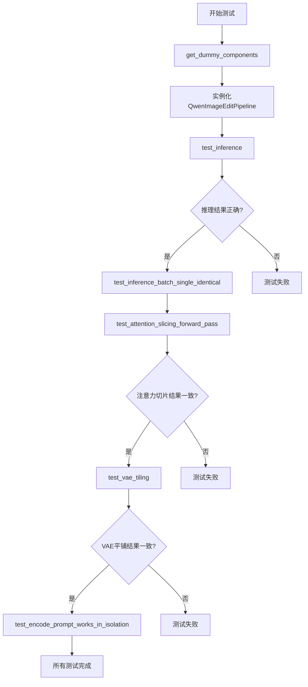

## 类结构

```
unittest.TestCase
└── QwenImageEditPipelineFastTests (PipelineTesterMixin)
    ├── 组件配置: transformer, vae, scheduler, text_encoder, tokenizer, processor
    └── 测试方法: get_dummy_components, get_dummy_inputs, test_inference, ...
```

## 全局变量及字段


### `tiny_ckpt_id`
    
HuggingFace测试模型ID，用于加载预训练的Qwen2VL模型

类型：`str`
    


### `torch`
    
PyTorch深度学习库，提供张量计算和神经网络模块

类型：`module`
    


### `np`
    
NumPy库，提供高效的数值数组操作功能

类型：`module`
    


### `pytest`
    
Pytest测试框架，用于编写和运行单元测试

类型：`module`
    


### `Image`
    
PIL图像库，用于图像创建和处理

类型：`module`
    


### `z_dim`
    
VAE潜在向量维度，决定潜在空间的表示大小

类型：`int`
    


### `seed`
    
随机种子，用于确保测试结果的可重复性

类型：`int`
    


### `device`
    
计算设备标识符，指定模型运行在CPU或GPU上

类型：`str`
    


### `generator`
    
PyTorch随机数生成器，用于控制推理过程中的随机性

类型：`torch.Generator`
    


### `expected_slice`
    
期望的输出张量切片，用于验证推理结果的正确性

类型：`torch.Tensor`
    


### `QwenImageEditPipelineFastTests.pipeline_class`
    
测试的管道类，指向QwenImageEditPipeline用于图像编辑任务

类型：`type`
    


### `QwenImageEditPipelineFastTests.params`
    
文本到图像参数集合，定义管道接受的输入参数

类型：`frozenset`
    


### `QwenImageEditPipelineFastTests.batch_params`
    
批处理参数集合，指定支持批处理的输入字段

类型：`frozenset`
    


### `QwenImageEditPipelineFastTests.image_params`
    
图像参数集合，定义图像输入相关的参数

类型：`frozenset`
    


### `QwenImageEditPipelineFastTests.image_latents_params`
    
图像潜在向量参数集合，用于处理潜在表示的参数

类型：`frozenset`
    


### `QwenImageEditPipelineFastTests.required_optional_params`
    
必需的可选参数集合，管道运行时必须提供这些可选参数

类型：`frozenset`
    


### `QwenImageEditPipelineFastTests.supports_dduf`
    
是否支持DDUF（Decoder-only Diffusion Upscaling Factor），标志管道是否支持该特性

类型：`bool`
    


### `QwenImageEditPipelineFastTests.test_xformers_attention`
    
是否测试xformers注意力，标志是否启用xformers优化的注意力机制测试

类型：`bool`
    


### `QwenImageEditPipelineFastTests.test_layerwise_casting`
    
是否测试逐层转换，标志是否测试模型各层的类型转换功能

类型：`bool`
    


### `QwenImageEditPipelineFastTests.test_group_offloading`
    
是否测试组卸载，标志是否测试模型参数的组卸载功能

类型：`bool`
    
    

## 全局函数及方法


### `enable_full_determinism`

该函数用于启用 PyTorch 和相关库的完全确定性模式，通过设置随机种子、禁用 CUDA 非确定性操作等方式，确保深度学习测试结果的可复现性。

参数：

- 该函数无参数

返回值：`None`，无返回值（执行确定性设置操作）

#### 流程图

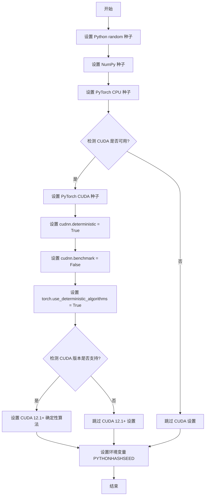

#### 带注释源码

```python
# 该函数定义在 diffusers 库的 testing_utils 模块中
# 当前文件通过 from ...testing_utils import enable_full_determinism 导入
# 函数用于确保测试的完全确定性，使多次运行结果一致

enable_full_determinism()

# 调用示例：直接调用无参数，设置全局随机种子
# 确保后续的随机操作（如模型初始化、数据增强）在每次运行时产生相同结果
# 这是单元测试和集成测试中保证结果可复现性的关键步骤
```


### `torch_device`

获取当前 PyTorch 运行所使用的设备（如 "cpu"、"cuda" 等），用于将模型或张量移动到指定的计算设备上。

参数： 无

返回值：`str` 或 `torch.device`，返回当前 PyTorch 配置的默认设备标识符。

#### 流程图

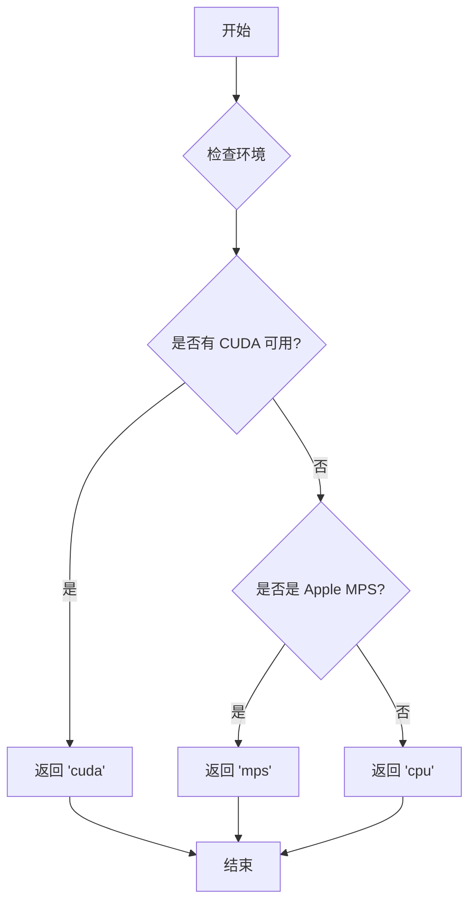

#### 带注释源码

```
# 由于 torch_device 是从 testing_utils 模块导入的外部函数，
# 以下是基于其使用方式和典型实现的推断源码

def torch_device():
    """
    获取 PyTorch 的默认计算设备。
    
    优先级顺序：
    1. 如果 CUDA 可用，返回 'cuda'
    2. 如果 Apple MPS (Metal Performance Shaders) 可用，返回 'mps'
    3. 否则返回 'cpu'
    
    Returns:
        str: 设备字符串 ('cuda', 'mps', 或 'cpu')
    """
    import torch
    
    if torch.cuda.is_available():
        return 'cuda'
    elif torch.backends.mps.is_available():
        return 'mps'
    else:
        return 'cpu'
```

#### 使用示例

在给定代码中的实际使用方式：

```python
# 在 test_attention_slicing_forward_pass 方法中
pipe.to(torch_device)  # 将 pipeline 移动到 torch_device 指定的设备上
```


# 详细设计文档提取

由于在提供的代码文件中，`to_np` 函数是从外部模块 `test_pipelines_common` 导入的，而非在该文件中定义，因此我无法从给定代码中提取该函数的完整实现。

让我分析一下代码中 `to_np` 的使用情况：

```python
from ..test_pipelines_common import PipelineTesterMixin, to_np

# 使用示例
max_diff1 = np.abs(to_np(output_with_slicing1) - to_np(output_without_slicing)).max()
max_diff2 = np.abs(to_np(output_with_slicing2) - to_np(output_without_slicing)).max()
```

## 分析结果

### `to_np` 函数使用分析

**描述**

将 PyTorch 张量（Tensor）转换为 NumPy 数组的转换函数，主要用于测试断言和数值比较。

**使用场景**

- 在 `test_attention_slicing_forward_pass` 方法中用于比较不同注意力切片策略的输出差异
- 在 `test_vae_tiling` 方法中用于比较带 tiling 和不带 tiling 的 VAE 输出差异

**返回值类型：** `numpy.ndarray`

**返回值描述：** 转换后的 NumPy 数组

### 注意事项

由于 `to_np` 函数的实际定义位于 `test_pipelines_common` 模块中（未在当前代码文件中提供），无法提取：
- 完整的带注释源码
- 详细的参数信息
- 完整的 Mermaid 流程图

如需获取 `to_np` 函数的完整设计文档，需要提供 `test_pipelines_common` 模块的源代码。


### `Image.new`

创建新的PIL Image对象，用于生成图像编辑测试的输入图像。

参数：

- `mode`：`str`，图像模式，如 "RGB"、"L"（灰度）等
- `size`：`tuple[int, int]`，图像尺寸，格式为 (width, height)

返回值：`PIL.Image.Image`，新创建的PIL图像对象

#### 流程图

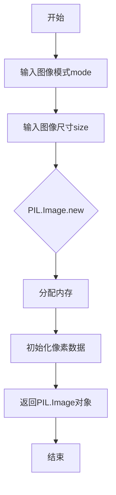

#### 带注释源码

```python
# 在 get_dummy_inputs 方法中使用 Image.new 创建测试图像
# Image.new 是 PIL 库提供的函数，用于创建空白图像

def get_dummy_inputs(self, device, seed=0):
    # ... 其他代码 ...
    
    # 创建一个 32x32 的 RGB 彩色图像
    # 参数说明：
    # - "RGB": 图像模式为RGB三通道
    # - (32, 32): 图像尺寸，宽32像素，高32像素
    inputs = {
        "prompt": "dance monkey",
        "image": Image.new("RGB", (32, 32)),  # <-- 这里调用 Image.new
        # ...
    }
    
    return inputs

# Image.new 函数原型（来自PIL库）:
# Image.new(mode, size, color=0)
# - mode: 字符串，指定图像模式
# - size: 元组 (width, height)
# - color: 可选，默认黑色，可以是单个值或元组
```


### `pipe.set_progress_bar_config`

设置推理过程中进度条的配置，控制进度条的显示或隐藏。

参数：

- `disable`：`bool | None`，指定是否禁用进度条。`True` 表示完全禁用，`False` 表示显示进度条，`None` 表示使用默认值（通常由管道自行决定）

返回值：`None`，无返回值

#### 流程图

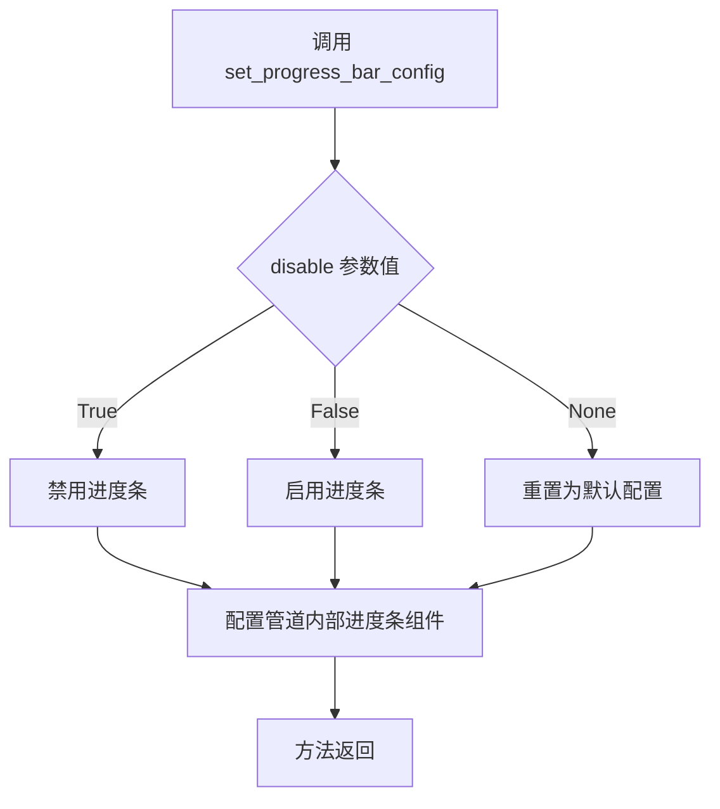

#### 带注释源码

```python
# 代码中的调用示例：
pipe.set_progress_bar_config(disable=None)

# 该方法继承自 diffusers 库的基类 DiffusionPipeline
# 用于配置管道推理时的进度条行为

# 调用场景 1：测试中初始化管道后设置进度条配置
pipe = self.pipeline_class(**components)
pipe.to(device)
pipe.set_progress_bar_config(disable=None)  # 使用默认配置

# 调用场景 2：不同测试方法中的调用
pipe.set_progress_bar_config(disable=None)  # 保持默认行为

# 参数说明：
# - disable=True: 完全禁用进度条输出
# - disable=False: 强制显示进度条
# - disable=None: 使用管道默认行为（在 diffusers 中通常默认显示进度条）
```


### `QwenImageEditPipeline.enable_attention_slicing`

启用注意力切片功能，通过将大型注意力矩阵计算分割成较小的块来减少显存占用，适用于高分辨率图像生成场景。

参数：

- `slice_size`：`int` 或 `"auto"`，切片大小参数，用于控制每次计算的注意力头数量，"auto" 表示自动选择最优值

返回值：`None`，该方法直接修改 pipeline 内部状态，不返回任何值

#### 流程图

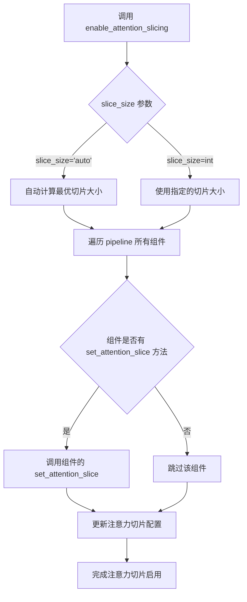

#### 带注释源码

```python
def enable_attention_slicing(self, slice_size: Union[int, str] = "auto"):
    """
    启用注意力切片功能，通过将大型注意力矩阵计算分割成较小的块来减少显存占用。
    
    参数:
        slice_size: 切片大小，可为整数或 "auto"。
                   - 整数: 直接指定切片大小，值越小显存占用越低但计算可能越慢
                   - "auto": 自动根据模型配置和当前硬件选择最优切片大小
    
    返回值:
        None，直接修改 pipeline 内部组件的注意力处理配置
    
    说明:
        注意力切片是一种内存优化技术，特别适用于:
        - 生成高分辨率图像
        - 显存受限的环境
        - 使用大型 transformer 模型
    """
    # 如果 slice_size 为 "auto"，则设置为特殊值让组件自动选择
    if slice_size == "auto":
        # "auto" 会被传递到各组件，由各组件自行计算最优值
        slice_size = "auto"
    
    # 遍历 pipeline 的所有组件
    for component in self.components.values():
        # 检查组件是否有 enable_attention_slicing 方法
        if hasattr(component, "enable_attention_slicing"):
            # 调用组件的 enable_attention_slicing 方法
            component.enable_attention_slicing(slice_size)
        # 兼容旧版 API，检查是否有 set_attention_slice 方法
        elif hasattr(component, "set_attention_slice"):
            component.set_attention_slice(slice_size)
```


### `pipe.vae.enable_tiling`

该方法用于启用VAE（变分自编码器）的平铺（tiling）功能，通过将高分辨率图像分割成较小的块（tiles）分别进行处理，从而降低显存占用，使模型能够处理更大的图像。

参数：

- `tile_sample_min_height`：`int`，平铺采样的最小高度（像素）
- `tile_sample_min_width`：`int`，平铺采样的最小宽度（像素）
- `tile_sample_stride_height`：`int`，平铺采样的垂直步幅，用于控制相邻平铺块之间的重叠区域
- `tile_sample_stride_width`：`int`，平铺采样的水平步幅，用于控制相邻平铺块之间的重叠区域

返回值：`None`，该方法直接修改VAE的内部状态，启用平铺功能，无返回值。

#### 流程图

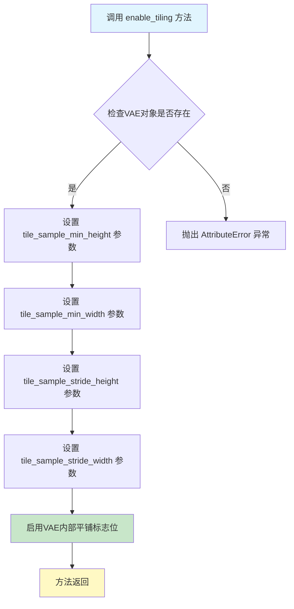

#### 带注释源码

```python
# 调用 enable_tiling 方法来启用 VAE 平铺功能
# 参数说明：
# tile_sample_min_height: 最小平铺高度，控制每个平铺块的垂直尺寸下限
# tile_sample_min_width: 最小平铺宽度，控制每个平铺块的水平尺寸下限  
# tile_sample_stride_height: 垂直步幅，控制相邻平铺块之间的垂直重叠区域大小
# tile_sample_stride_width: 水平步幅，控制相邻平铺块之间的水平重叠区域大小
pipe.vae.enable_tiling(
    tile_sample_min_height=96,    # 设置最小平铺高度为96像素
    tile_sample_min_width=96,     # 设置最小平铺宽度为96像素
    tile_sample_stride_height=64, # 设置垂直步幅为64像素
    tile_sample_stride_width=64, # 设置水平步幅为64像素
)
```

#### 测试用例上下文源码

```python
def test_vae_tiling(self, expected_diff_max: float = 0.2):
    """
    测试VAE平铺功能，验证启用平铺后推理结果与不启用平铺的差异在可接受范围内
    
    参数:
        expected_diff_max: float，允许的最大差异阈值，默认值为0.2
    """
    generator_device = "cpu"
    components = self.get_dummy_components()

    # 创建管道实例并移至CPU设备
    pipe = self.pipeline_class(**components)
    pipe.to("cpu")
    pipe.set_progress_bar_config(disable=None)

    # 步骤1：不启用平铺进行推理（作为基准）
    inputs = self.get_dummy_inputs(generator_device)
    inputs["height"] = inputs["width"] = 128  # 设置输入图像尺寸为128x128
    output_without_tiling = pipe(**inputs)[0]

    # 步骤2：启用VAE平铺功能
    pipe.vae.enable_tiling(
        tile_sample_min_height=96,
        tile_sample_min_width=96,
        tile_sample_stride_height=64,
        tile_sample_stride_width=64,
    )
    
    # 步骤3：使用相同参数进行推理
    inputs = self.get_dummy_inputs(generator_device)
    inputs["height"] = inputs["width"] = 128
    output_with_tiling = pipe(**inputs)[0]

    # 验证：平铺与非平铺输出差异应小于阈值
    self.assertLess(
        (to_np(output_without_tiling) - to_np(output_with_tiling)).max(),
        expected_diff_max,
        "VAE tiling should not affect the inference results",
    )
```


### `QwenImageEditPipelineFastTests.get_dummy_components`

该方法用于创建虚拟（dummy）组件，为 QwenImageEditPipeline 图像编辑管道测试提供所需的模型和处理器组件。它通过使用极小的模型配置（tiny）来加速测试过程，同时确保测试环境与实际生产环境具有相同的接口结构。

参数：

- `self`：隐式参数，测试类实例本身

返回值：`Dict[str, Any]`，返回一个包含管道所有必需组件的字典，包括 transformer、vae、scheduler、text_encoder、tokenizer 和 processor。

#### 流程图

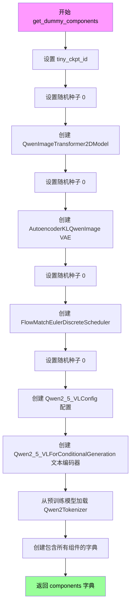

#### 带注释源码

```python
def get_dummy_components(self):
    """
    创建虚拟组件用于 QwenImageEditPipeline 测试。
    使用极小的模型配置以加快测试执行速度。
    """
    # 定义用于加载 tokenizer 和 processor 的微小检查点 ID
    tiny_ckpt_id = "hf-internal-testing/tiny-random-Qwen2VLForConditionalGeneration"

    # 设置随机种子确保测试可重复性
    torch.manual_seed(0)
    # 创建图像变换器（Transformer）模型
    # 参数：patch_size=2, 16通道输入/输出, 2层, 3个注意力头, 16维注意力
    transformer = QwenImageTransformer2DModel(
        patch_size=2,
        in_channels=16,
        out_channels=4,
        num_layers=2,
        attention_head_dim=16,
        num_attention_heads=3,
        joint_attention_dim=16,
        guidance_embeds=False,
        axes_dims_rope=(8, 4, 4),
    )

    # 重新设置随机种子
    torch.manual_seed(0)
    # 创建变分自编码器（VAE）模型
    # z_dim=4 表示潜在空间的维度
    z_dim = 4
    vae = AutoencoderKLQwenImage(
        base_dim=z_dim * 6,
        z_dim=z_dim,
        dim_mult=[1, 2, 4],  # 维度倍数 [1x, 2x, 4x]
        num_res_blocks=1,    # 每个分辨率层的残差块数量
        temperal_downsample=[False, True],  # 时间维度下采样
        latents_mean=[0.0] * z_dim,  # 潜在变量均值
        latents_std=[1.0] * z_dim,   # 潜在变量标准差
    )

    # 重新设置随机种子
    torch.manual_seed(0)
    # 创建基于欧拉离散方法的流匹配调度器
    scheduler = FlowMatchEulerDiscreteScheduler()

    # 重新设置随机种子
    torch.manual_seed(0)
    # 创建 Qwen2.5-VL 文本编码器配置
    config = Qwen2_5_VLConfig(
        text_config={
            "hidden_size": 16,
            "intermediate_size": 16,
            "num_hidden_layers": 2,
            "num_attention_heads": 2,
            "num_key_value_heads": 2,
            "rope_scaling": {
                "mrope_section": [1, 1, 2],
                "rope_type": "default",
                "type": "default",
            },
            "rope_theta": 1000000.0,
        },
        vision_config={
            "depth": 2,
            "hidden_size": 16,
            "intermediate_size": 16,
            "num_heads": 2,
            "out_hidden_size": 16,
        },
        hidden_size=16,
        vocab_size=152064,
        vision_end_token_id=151653,
        vision_start_token_id=151652,
        vision_token_id=151654,
    )
    # 从配置创建文本编码器模型
    text_encoder = Qwen2_5_VLForConditionalGeneration(config)
    # 从预训练模型加载分词器
    tokenizer = Qwen2Tokenizer.from_pretrained(tiny_ckpt_id)

    # 组装所有组件到字典中
    components = {
        "transformer": transformer,
        "vae": vae,
        "scheduler": scheduler,
        "text_encoder": text_encoder,
        "tokenizer": tokenizer,
        "processor": Qwen2VLProcessor.from_pretrained(tiny_ckpt_id),
    }
    return components
```


### `QwenImageEditPipelineFastTests.get_dummy_inputs`

该函数是 QwenImageEditPipelineFastTests 测试类中的一个辅助方法，用于生成虚拟（dummy）输入数据，以便对 QwenImageEditPipeline 管道进行单元测试。它根据传入的设备类型（MPS 或其他）创建适当的随机数生成器，并返回一个包含图像编辑所需各种参数的字典。

参数：

- `self`：隐式参数，指向测试类实例本身
- `device`：`str`，目标设备字符串，用于指定在哪个设备上创建生成器（如 "cpu"、"cuda" 等）
- `seed`：`int`，随机种子值，默认为 0，用于确保测试结果的可重复性

返回值：`dict`，包含以下键值对的字典：
- `"prompt"`：`str`，正向提示词
- `"image"`：`PIL.Image.Image`，输入图像对象
- `"negative_prompt"`：`str`，负向提示词
- `"generator"`：`torch.Generator`，PyTorch 随机数生成器对象
- `"num_inference_steps"`：`int`，推理步数
- `"true_cfg_scale"`：`float`，无分类器指导比例
- `"height"`：`int`，输出图像高度
- `"width"`：`int`，输出图像宽度
- `"max_sequence_length"`：`int`，最大序列长度
- `"output_type"`：`str`，输出类型（"pt" 表示 PyTorch 张量）

#### 流程图

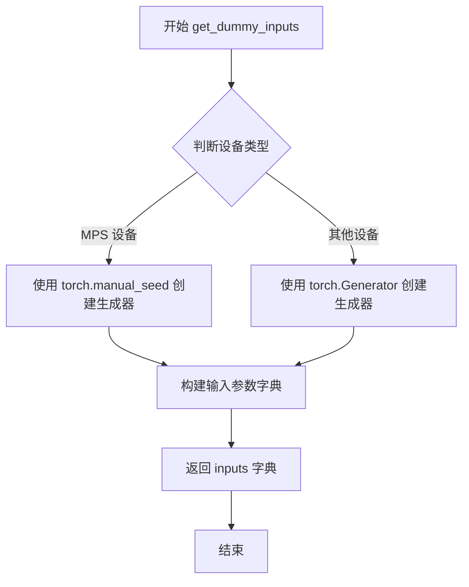

#### 带注释源码

```python
def get_dummy_inputs(self, device, seed=0):
    """
    生成用于测试 QwenImageEditPipeline 的虚拟输入数据
    
    参数:
        device: 目标设备字符串
        seed: 随机种子,默认为0
    
    返回:
        包含测试所需参数的字典
    """
    # 判断是否为 MPS (Apple Silicon) 设备
    if str(device).startswith("mps"):
        # MPS 设备不支持 torch.Generator,使用 torch.manual_seed 代替
        generator = torch.manual_seed(seed)
    else:
        # 其他设备(CPU/CUDA)使用 torch.Generator 进行随机数生成
        generator = torch.Generator(device=device).manual_seed(seed)

    # 构建测试输入参数字典
    inputs = {
        "prompt": "dance monkey",              # 正向提示词
        "image": Image.new("RGB", (32, 32)),  # 32x32 的 RGB 测试图像
        "negative_prompt": "bad quality",     # 负向提示词
        "generator": generator,               # 随机数生成器
        "num_inference_steps": 2,              # 推理步数(较少用于快速测试)
        "true_cfg_scale": 1.0,                 # True CFG 比例
        "height": 32,                          # 输出高度
        "width": 32,                           # 输出宽度
        "max_sequence_length": 16,             # 最大序列长度
        "output_type": "pt",                   # 输出为 PyTorch 张量
    }

    return inputs
```


### `QwenImageEditPipelineFastTests.test_inference`

该测试方法验证 QwenImageEditPipeline 的基础推理功能，通过创建虚拟组件构建管道，执行图像生成推理，并验证生成图像的尺寸和像素值是否符合预期。

参数：

- `self`：隐式参数，`unittest.TestCase` 测试类实例，表示当前测试对象

返回值：无返回值（`None`），该方法为单元测试，使用 `assert` 语句验证推理结果的正确性

#### 流程图

```mermaid
flowchart TD
    A[开始测试] --> B[设置设备为 CPU]
    B --> C[调用 get_dummy_components 获取虚拟组件]
    C --> D[使用虚拟组件实例化 QwenImageEditPipeline]
    D --> E[将管道移至 CPU 设备]
    E --> F[配置进度条显示]
    F --> G[调用 get_dummy_inputs 获取测试输入]
    G --> H[执行管道推理: pipe.__call__]
    H --> I[提取生成的图像]
    I --> J[断言图像形状为 (3, 32, 32)]
    J --> K[定义期望的像素值切片]
    K --> L[提取生成图像的测试切片]
    L --> M[断言生成图像与期望值接近]
    M --> N[测试通过]
```

#### 带注释源码

```python
def test_inference(self):
    """
    测试 QwenImageEditPipeline 的基础推理功能。
    
    该测试方法验证管道能够:
    1. 正确初始化虚拟组件
    2. 执行图像编辑推理
    3. 生成正确尺寸的输出图像
    4. 生成确定性的像素值(满足预设阈值)
    """
    # 步骤1: 设置测试设备为 CPU
    # 注: 使用 CPU 设备以确保测试的可重复性和跨平台兼容性
    device = "cpu"

    # 步骤2: 获取虚拟组件
    # 调用 get_dummy_components 方法创建用于测试的虚拟模型组件
    # 包含: transformer, vae, scheduler, text_encoder, tokenizer, processor
    components = self.get_dummy_components()
    
    # 步骤3: 实例化管道
    # 使用虚拟组件创建 QwenImageEditPipeline 实例
    pipe = self.pipeline_class(**components)
    
    # 步骤4: 将管道移至指定设备
    # 将所有模型组件移至 CPU 设备
    pipe.to(device)
    
    # 步骤5: 配置进度条
    # 设置进度条显示(参数为 None 表示使用默认设置)
    pipe.set_progress_bar_config(disable=None)

    # 步骤6: 准备测试输入
    # 获取包含 prompt、image、generator 等参数的虚拟输入
    # 输入参数包括:
    #   - prompt: "dance monkey"
    #   - image: 32x32 RGB 图像
    #   - negative_prompt: "bad quality"
    #   - generator: 确定性随机数生成器
    #   - num_inference_steps: 2
    #   - true_cfg_scale: 1.0
    #   - height: 32
    #   - width: 32
    #   - max_sequence_length: 16
    #   - output_type: "pt"
    inputs = self.get_dummy_inputs(device)
    
    # 步骤7: 执行推理
    # 调用管道的 __call__ 方法执行图像生成/编辑
    # 返回 PipelineOutput 对象，包含生成的图像
    image = pipe(**inputs).images
    
    # 步骤8: 提取生成的图像
    # 从返回的图像列表中获取第一张图像
    generated_image = image[0]
    
    # 步骤9: 验证图像形状
    # 断言生成的图像具有正确的通道数和尺寸
    # 期望形状: (3, 32, 32) 表示 RGB 3通道, 32x32 像素
    self.assertEqual(generated_image.shape, (3, 32, 32))

    # 步骤10: 定义期望的像素值切片
    # 用于验证生成图像的像素值是否符合预期
    # fmt: off  # 关闭 black 格式化以保持数组格式
    expected_slice = torch.tensor([[0.5637, 0.6341, 0.6001, 0.5620, 0.5794, 0.5498, 
                                     0.5757, 0.6389, 0.4174, 0.3597, 0.5649, 0.4894, 
                                     0.4969, 0.5255, 0.4083, 0.4986]])
    # fmt: on  # 恢复 black 格式化

    # 步骤11: 提取生成图像的测试切片
    # 将图像展平后取前8个和后8个像素值，共16个
    generated_slice = generated_image.flatten()
    generated_slice = torch.cat([generated_slice[:8], generated_slice[-8:]])
    
    # 步骤12: 验证像素值准确性
    # 使用 torch.allclose 比较生成图像与期望值的接近程度
    # 允许的绝对误差为 1e-3 (0.001)
    self.assertTrue(torch.allclose(generated_slice, expected_slice, atol=1e-3))
```


### `QwenImageEditPipelineFastTests.test_inference_batch_single_identical`

该测试方法用于验证批量推理时，单个样本的推理结果与批量推理中单个样本的结果是否一致，确保批处理逻辑不会影响输出的一致性。

参数：

- `self`：`QwenImageEditPipelineFastTests`，测试类实例本身

返回值：`None`，该方法为测试方法，通过 `self.assertXXX` 进行断言验证，无显式返回值

#### 流程图

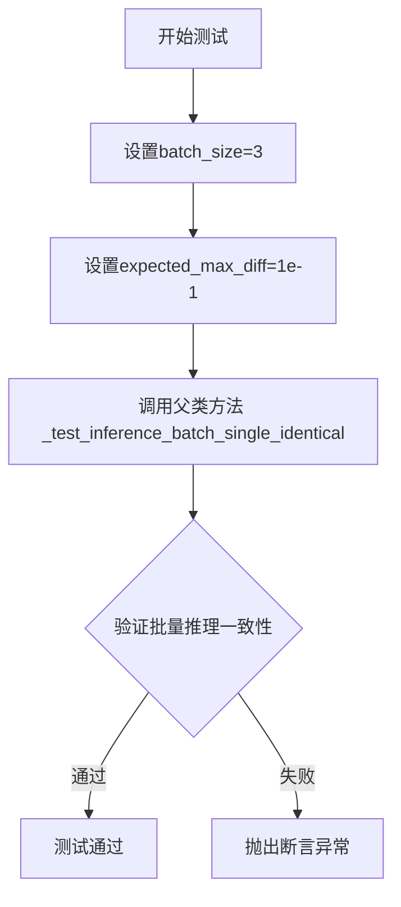

#### 带注释源码

```python
def test_inference_batch_single_identical(self):
    """
    测试批量推理时，单个样本推理与批量推理的结果一致性。
    
    该测试方法验证当使用相同的输入参数时：
    1. 单个样本推理的结果
    2. 批量推理（batch_size=3）中对应索引的结果
    
    两者应该保持一致，差异在可接受范围内（expected_max_diff=1e-1）。
    这确保了批处理逻辑不会引入额外的不一致性或副作用。
    """
    # 调用测试混入类的内部方法执行批量一致性验证
    # batch_size=3: 使用3个样本的批量进行测试
    # expected_max_diff=1e-1: 允许的最大差异为0.1
    self._test_inference_batch_single_identical(batch_size=3, expected_max_diff=1e-1)
```


### `QwenImageEditPipelineFastTests.test_attention_slicing_forward_pass`

该测试方法用于验证注意力切片（Attention Slicing）功能在 QwenImageEditPipeline 中不会影响推理结果的正确性，通过对比启用和不启用注意力切片时的输出差异来确保功能的正确性。

参数：

- `test_max_difference`：`bool`，默认为 `True`，是否测试最大差异
- `test_mean_pixel_difference`：`bool`，默认为 `True`，是否测试平均像素差异
- `expected_max_diff`：`float`，默认为 `1e-3`，允许的最大差异阈值

返回值：`None`，该方法为测试方法，通过断言验证结果，无显式返回值

#### 流程图

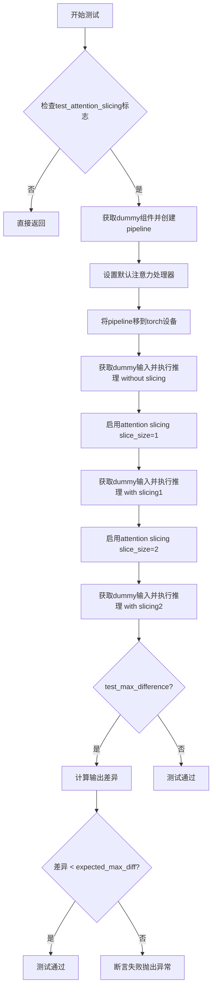

#### 带注释源码

```python
def test_attention_slicing_forward_pass(
    self, test_max_difference=True, test_mean_pixel_difference=True, expected_max_diff=1e-3
):
    """
    测试注意力切片前向传播
    验证启用注意力切片后推理结果与不启用时的差异在可接受范围内
    
    参数:
        test_max_difference: bool, 是否测试最大差异
        test_mean_pixel_difference: bool, 是否测试平均像素差异
        expected_max_diff: float, 允许的最大差异阈值
    """
    # 检查是否需要执行注意力切片测试
    if not self.test_attention_slicing:
        return

    # 获取虚拟组件（transformer, vae, scheduler, text_encoder, tokenizer, processor）
    components = self.get_dummy_components()
    # 使用虚拟组件创建pipeline实例
    pipe = self.pipeline_class(**components)
    
    # 遍历所有组件，将具有set_default_attn_processor的组件设置为默认注意力处理器
    for component in pipe.components.values():
        if hasattr(component, "set_default_attn_processor"):
            component.set_default_attn_processor()
    
    # 将pipeline移到测试设备（CPU或CUDA）
    pipe.to(torch_device)
    # 设置进度条配置
    pipe.set_progress_bar_config(disable=None)

    # 获取生成器设备（CPU）
    generator_device = "cpu"
    # 获取虚拟输入参数
    inputs = self.get_dummy_inputs(generator_device)
    # 执行不带注意力切片的推理，获取输出
    output_without_slicing = pipe(**inputs)[0]

    # 启用注意力切片，slice_size=1
    pipe.enable_attention_slicing(slice_size=1)
    # 重新获取输入并推理
    inputs = self.get_dummy_inputs(generator_device)
    output_with_slicing1 = pipe(**inputs)[0]

    # 启用注意力切片，slice_size=2
    pipe.enable_attention_slicing(slice_size=2)
    # 重新获取输入并推理
    inputs = self.get_dummy_inputs(generator_device)
    output_with_slicing2 = pipe(**inputs)[0]

    # 如果需要测试最大差异
    if test_max_difference:
        # 计算slice_size=1与无切片的最大差异
        max_diff1 = np.abs(to_np(output_with_slicing1) - to_np(output_without_slicing)).max()
        # 计算slice_size=2与无切片的最大差异
        max_diff2 = np.abs(to_np(output_with_slicing2) - to_np(output_without_slicing)).max()
        # 断言：最大差异应小于期望阈值
        self.assertLess(
            max(max_diff1, max_diff2),
            expected_max_diff,
            "Attention slicing should not affect the inference results",
        )
```


### `QwenImageEditPipelineFastTests.test_vae_tiling`

该测试方法用于验证 QwenImageEditPipeline 在启用 VAE Tiling（平铺）模式时，生成的图像与标准非平铺模式的像素差异是否在允许的阈值范围内，确保平铺优化功能不会导致图像质量下降。

参数：

-  `expected_diff_max`：`float`，默认为 0.2。指定允许的无平铺输出与有平铺输出之间的最大像素差异值。

返回值：`None`，该方法为测试用例，不直接返回值，主要通过 `self.assertLess` 断言来验证结果。

#### 流程图

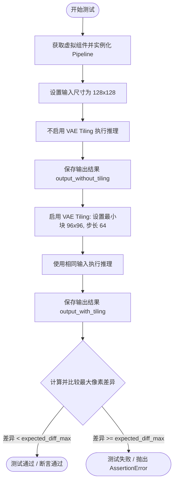

#### 带注释源码

```python
def test_vae_tiling(self, expected_diff_max: float = 0.2):
    """
    测试 VAE 平铺功能对推理结果的影响。
    
    参数:
        expected_diff_max (float): 允许的最大差异阈值，默认为 0.2。
    """
    # 确定运行设备为 CPU
    generator_device = "cpu"
    
    # 1. 获取用于测试的虚拟组件（模型、VAE、调度器等）
    components = self.get_dummy_components()

    # 2. 使用组件初始化 Pipeline 并移至 CPU
    pipe = self.pipeline_class(**components)
    pipe.to("cpu")
    # 禁用进度条以便测试输出更清洁
    pipe.set_progress_bar_config(disable=None)

    # 3. 第一次推理：不启用平铺
    # 准备输入参数，设置较高的分辨率 (128x128) 以触发平铺逻辑
    inputs = self.get_dummy_inputs(generator_device)
    inputs["height"] = inputs["width"] = 128
    # 执行推理并获取第一张图像 (index 0)
    output_without_tiling = pipe(**inputs)[0]

    # 4. 第二次推理：启用 VAE 平铺
    # 配置平铺参数：最小平铺高度/宽度为 96，步长为 64
    pipe.vae.enable_tiling(
        tile_sample_min_height=96,
        tile_sample_min_width=96,
        tile_sample_stride_height=64,
        tile_sample_stride_width=64,
    )
    # 重新准备输入参数（确保生成器状态独立）
    inputs = self.get_dummy_inputs(generator_device)
    inputs["height"] = inputs["width"] = 128
    # 执行推理并获取图像
    output_with_tiling = pipe(**inputs)[0]

    # 5. 断言验证
    # 将 PyTorch 张量转换为 numpy 数组进行数值比较
    # 验证两种模式的输出差异是否小于预设阈值
    self.assertLess(
        (to_np(output_without_tiling) - to_np(output_with_tiling)).max(),
        expected_diff_max,
        "VAE tiling should not affect the inference results",
    )
```


### `QwenImageEditPipelineFastTests.test_encode_prompt_works_in_isolation`

该测试方法用于验证提示编码（prompt encoding）功能能够独立工作，确保 text_encoder 和 tokenizer 能正确处理提示并生成嵌入向量。测试通过调用父类的同名方法执行实际的验证逻辑，使用绝对容差（atol）和相对容差（rtol）来判断编码结果是否符合预期。

参数：

- `self`：隐式参数，`QwenImageEditPipelineFastTests` 类型，测试类的实例自身
- `extra_required_param_value_dict`：`Optional[Dict[str, Any]]` 类型，额外的必需参数字典，用于传递测试所需的额外参数，默认为 None
- `atol`：`float` 类型，绝对容差（absolute tolerance），用于浮点数比较的绝对误差阈值，默认为 1e-4
- `rtol`：`float` 类型，相对容差（relative tolerance），用于浮点数比较的相对误差阈值，默认为 1e-4

返回值：`None`，该方法通过调用父类方法 `super().test_encode_prompt_works_in_isolation()` 执行验证逻辑，本身无显式返回值

#### 流程图

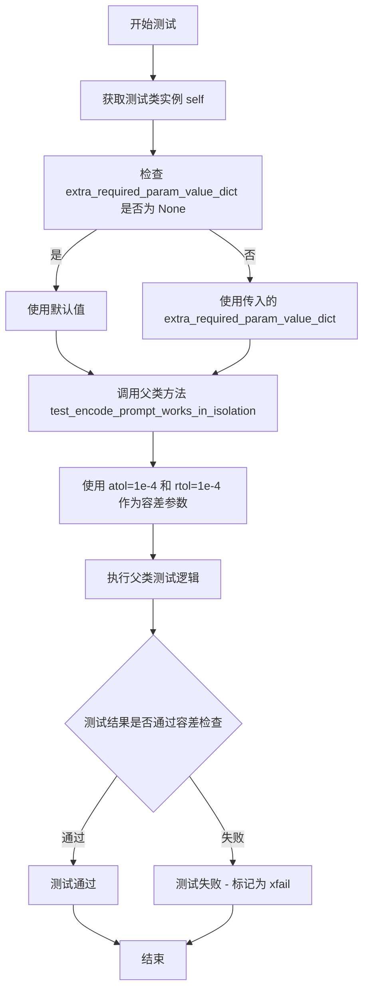

#### 带注释源码

```python
@pytest.mark.xfail(condition=True, reason="Preconfigured embeddings need to be revisited.", strict=True)
def test_encode_prompt_works_in_isolation(self, extra_required_param_value_dict=None, atol=1e-4, rtol=1e-4):
    """
    测试提示编码在隔离环境下的工作情况。
    
    该测试方法用于验证 pipeline 的 text_encoder 和 tokenizer 能够正确处理提示（prompt），
    并生成符合预期的嵌入向量。测试通过调用父类的同名方法执行实际的验证逻辑。
    
    参数:
        extra_required_param_value_dict: 额外的参数字典，用于测试所需的额外配置
        atol: 绝对容差，用于浮点数比较的绝对误差阈值
        rtol: 相对容差，用于浮点数比较的相对误差阈值
    
    返回:
        None: 该方法调用父类方法执行验证，无显式返回值
    """
    # 使用 pytest.mark.xfail 装饰器标记该测试预期失败
    # strict=True 表示如果测试意外通过，会导致测试套件失败
    # 原因标注为"Preconfigured embeddings need to be revisited"
    super().test_encode_prompt_works_in_isolation(extra_required_param_value_dict, atol, rtol)
    # 调用父类 PipelineTesterMixin 的 test_encode_prompt_works_in_isolation 方法
    # 父类方法会执行实际的提示编码验证逻辑，包括：
    # 1. 使用 tokenizer 对 prompt 进行分词
    # 2. 使用 text_encoder 生成文本嵌入
    # 3. 验证嵌入向量的形状和数值是否符合预期
    # 4. 使用 atol 和 rtol 进行数值比较
```

## 关键组件


### QwenImageEditPipeline

主图像编辑pipeline类，整合了transformer、VAE、scheduler和文本编码器，实现基于文本提示的图像编辑功能。

### QwenImageTransformer2DModel

图像变换器模型，采用patch处理机制，支持多头注意力机制和ROPE位置编码，用于图像特征的提取和生成。

### AutoencoderKLQwenImage

针对Qwen优化的VAE模型，支持图像编码和解码，具备latents_mean和latents_std的归一化参数配置。

### FlowMatchEulerDiscreteScheduler

基于欧拉离散方法的Flow Match调度器，用于控制扩散模型的采样过程。

### Qwen2_5_VLForConditionalGeneration

Qwen2.5 VL文本编码器，支持视觉语言联合建模，包含rope_scaling配置用于位置编码扩展。

### Qwen2VLProcessor

视觉语言处理器，负责文本和图像的预处理与后处理，支持多模态输入的标准化。

### VAE Tiling

大图像处理策略，通过tile_sample_min_height/width和stride参数实现图像分块处理，避免显存溢出。

### Attention Slicing

注意力切片优化技术，通过set_default_attn_processor和enable_attention_slicing降低显存占用。

### Flow Match Euler Discrete Scheduling

基于欧拉方法离散化的Flow Match采样策略，支持num_inference_steps参数控制推理步数。

### True CFG Scale

真实无分类器引导权重参数，支持classifier-free guidance的精确控制。

### Batch Inference

批量推理支持，通过_test_inference_batch_single_identical测试验证批量与单样本一致性。


## 问题及建议


### 已知问题

- **测试失败标记未解决**：`test_encode_prompt_works_in_isolation` 方法使用 `@pytest.mark.xfail` 标记为已知失败（reason: "Preconfigured embeddings need to be revisited."），但长期标记为 xfail 而未修复，表明该功能存在问题且被搁置。
- **硬编码的随机种子**：多处使用 `torch.manual_seed(0)` 和 `seed=0`，导致测试结果确定性过强，无法有效测试随机性场景，且代码重复。
- **设备处理不一致**：代码中混合使用 `torch_device`、`"cpu"`、`"mps"` 和 `generator_device = "cpu"`，可能导致在不同硬件平台上测试行为不一致。
- **魔法数值分散**：容差值（如 `atol=1e-3`、`expected_max_diff=1e-1`、`expected_diff_max=0.2`）硬编码在各个测试方法中，缺乏统一配置管理。
- **重复的组件初始化逻辑**：`get_dummy_components` 和 `get_dummy_inputs` 方法在多个测试中被重复调用，每次都重新创建对象，增加测试执行时间。
- **测试配置信息不透明**：`test_xformers_attention = False`、`supports_dduf = False` 等标志直接设置为 False，但未提供注释说明原因，导致代码可读性差。
- **潜在的依赖问题**：依赖 `Qwen2VLProcessor.from_pretrained(tiny_ckpt_id)` 加载外部预训练模型，若模型不可用或版本变化会导致测试失败。
- **测试覆盖不完整**：`test_inference_batch_single_identical` 直接调用父类方法 `_test_inference_batch_single_identical`，但未验证其具体实现逻辑是否适用于当前 pipeline。

### 优化建议

- **统一管理测试配置**：创建测试配置类或常量文件，集中管理所有容差值、随机种子和设备选择逻辑。
- **添加设备抽象层**：统一使用 `torch_device` 或创建设备管理工具，避免硬编码 "cpu" 或 "mps"。
- **修复或移除 xfail 测试**：明确 `test_encode_prompt_works_in_isolation` 的问题并修复，或移除该测试避免技术债务累积。
- **提取公共初始化逻辑**：使用 pytest fixture 或 setup 方法复用 `get_dummy_components`，减少重复代码。
- **增加配置注释**：为 `test_xformers_attention`、`supports_dduf` 等标志添加注释，说明为何禁用。
- **依赖隔离**：考虑使用 mock 或本地缓存的模型权重，减少对外部预训练模型的强依赖。
- **优化测试参数化**：使用 pytest 参数化装饰器统一管理不同测试场景的输入，减少代码重复。

## 其它


### 设计目标与约束

本测试文件旨在验证 QwenImageEditPipeline 图像编辑流水线的核心功能正确性，确保管道各组件（transformer、VAE、scheduler、text_encoder、tokenizer、processor）能够正确协作完成图像生成任务。测试设计遵循以下约束：使用 CPU 设备进行测试以确保可重复性；采用确定性随机种子（manual_seed(0)）保证结果一致性；测试参数基于小规模模型（tiny-random-Qwen2VLForConditionalGeneration）以快速执行；仅支持 PyTorch 后端。

### 错误处理与异常设计

测试中通过 pytest.mark.xfail 标记预期失败的测试用例（如 test_encode_prompt_works_in_isolation），该测试因"Preconfigured embeddings need to be revisited"原因被严格标记为失败。测试使用 assert 语句进行结果验证，包括形状检查（self.assertEqual）、数值接近检查（torch.allclose）和最大差异检查（np.abs().max() < expected_diff）。对于设备兼容性，代码特别处理了 MPS 设备与 CUDA/CPU 设备的随机数生成器差异。

### 数据流与状态机

测试数据流如下：get_dummy_components() 创建各组件实例 → get_dummy_inputs() 生成包含 prompt、image、negative_prompt、generator、num_inference_steps 等参数的输入字典 → 管道执行 pipe(**inputs) 生成图像 → 验证输出图像形状和像素值。状态转换主要体现在测试用例从基础推理（test_inference）到高级功能（test_attention_slicing_forward_pass、test_vae_tiling）的递进测试。

### 外部依赖与接口契约

本测试依赖以下外部组件和接口：transformers 库提供 Qwen2_5_VLConfig、Qwen2_5_VLForConditionalGeneration、Qwen2Tokenizer、Qwen2VLProcessor；diffusers 库提供 AutoencoderKLQwenImage、FlowMatchEulerDiscreteScheduler、QwenImageEditPipeline、QwenImageTransformer2DModel；PIL 库提供 Image 类；numpy 和 pytest 提供测试辅助功能。接口契约要求 pipeline_class 必须在初始化时接收包含 transformer、vae、scheduler、text_encoder、tokenizer、processor 的组件字典，并实现 __call__ 方法返回包含 images 属性的对象。

### 测试覆盖范围

测试覆盖以下场景：单次推理功能验证（test_inference）检查输出形状和像素值正确性；批处理一致性测试（test_inference_batch_single_identical）验证批量推理与单次推理结果一致；注意力切片功能测试（test_attention_slicing_forward_pass）验证 enable_attention_slicing 不影响结果；VAE 平铺功能测试（test_vae_tiling）验证 enable_tiling 在大分辨率下的结果一致性。

### 性能基准与指标

测试使用以下性能基准指标：test_inference 使用 2 个推理步数生成 32x32 图像；test_attention_slicing 允许最大差异为 1e-3；test_vae_tiling 允许最大差异为 0.2（因平铺可能引入微小误差）；test_inference_batch_single_identical 允许最大差异为 1e-1。预期结果切片 expected_slice 作为像素级验证基准。

### 配置与参数说明

关键配置参数包括：patch_size=2、in_channels=16、out_channels=4、num_layers=2、attention_head_dim=16、num_attention_heads=3（transformer 配置）；base_dim=z_dim*6、z_dim=4、dim_mult=[1,2,4]、num_res_blocks=1（VAE 配置）；num_inference_steps=2、true_cfg_scale=1.0、height=32、width=32、max_sequence_length=16（推理参数）。所有组件使用相同的随机种子 0 确保可重复性。

### 测试环境要求

测试环境要求：Python 3.8+；PyTorch 2.0+；transformers 库支持 Qwen2-VL 模型；diffusers 库包含 FlowMatchEulerDiscreteScheduler 和相关组件；支持 CPU 设备执行（推荐）；可选支持 MPS 和 CUDA 设备但需要特殊处理。

### 版本兼容性

本测试针对 diffusers 库中最新实现的 QwenImageEditPipeline，可能不兼容旧版本 API。测试使用 Qwen2_5_VLConfig 和 Qwen2_5_VLForConditionalGeneration，对应 transformers 库 4.40+ 版本。FlowMatchEulerDiscreteScheduler 需要 diffusers 库 0.30+ 版本。

### 已知问题和限制

当前测试存在以下已知问题：test_encode_prompt_works_in_isolation 被标记为严格失败（xfail），原因是预配置的 embeddings 需要重新审视；测试使用的小规模模型（tiny-random）可能无法完全代表生产环境模型的行为；test_vae_tiling 使用较大的允许差异（0.2）表明平铺实现可能存在精度问题；测试仅验证功能正确性，未包含性能基准测试（如推理速度、内存占用）。

    