# `diffusers\tests\pipelines\qwenimage\test_qwenimage_edit_plus.py` 详细设计文档

这是一个针对 Qwen2.5-VL 图像编辑 pipeline 的单元测试文件，用于验证图像生成模型的推理功能、注意力切片、VAE 分块等核心特性，包含多个测试用例确保 pipeline 的正确性和一致性。

## 整体流程

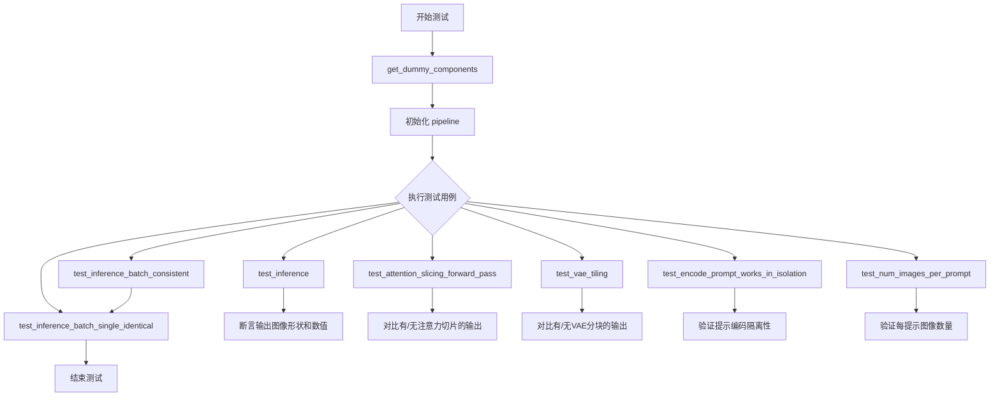

## 类结构

```
unittest.TestCase
└── QwenImageEditPlusPipelineFastTests (PipelineTesterMixin)
```

## 全局变量及字段


### `tiny_ckpt_id`
    
测试用的tiny random Qwen2VL模型的检查点ID，用于加载预训练模型

类型：`str`
    


### `QwenImageEditPlusPipelineFastTests.pipeline_class`
    
待测试的管道类，即QwenImageEditPlusPipeline

类型：`type`
    


### `QwenImageEditPlusPipelineFastTests.params`
    
文本到图像管道的参数集合，排除cross_attention_kwargs

类型：`frozenset`
    


### `QwenImageEditPlusPipelineFastTests.batch_params`
    
批处理参数集合，包含prompt和image

类型：`frozenset`
    


### `QwenImageEditPlusPipelineFastTests.image_params`
    
图像参数集合，包含image

类型：`frozenset`
    


### `QwenImageEditPlusPipelineFastTests.image_latents_params`
    
图像潜在变量参数集合，包含latents

类型：`frozenset`
    


### `QwenImageEditPlusPipelineFastTests.required_optional_params`
    
必需的可选参数集合，包含推理步数、生成器、潜在变量等

类型：`frozenset`
    


### `QwenImageEditPlusPipelineFastTests.supports_dduf`
    
标识该管道是否支持DDUF（Decoupled Diffusion Upsampling Flow）

类型：`bool`
    


### `QwenImageEditPlusPipelineFastTests.test_xformers_attention`
    
标识是否测试xformers注意力机制

类型：`bool`
    


### `QwenImageEditPlusPipelineFastTests.test_layerwise_casting`
    
标识是否测试层级类型转换（layerwise casting）

类型：`bool`
    


### `QwenImageEditPlusPipelineFastTests.test_group_offloading`
    
标识是否测试组卸载（group offloading）功能

类型：`bool`
    
    

## 全局函数及方法


### `enable_full_determinism`

该函数用于启用测试的完全确定性，通过设置随机种子和配置相关环境变量，确保多次运行测试时结果一致且可复现。

参数：无

返回值：无

#### 流程图

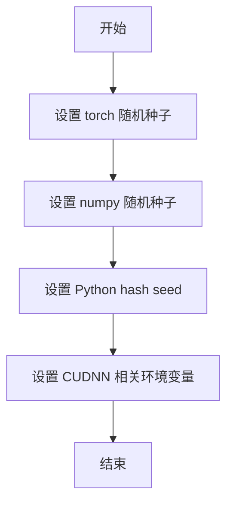

#### 带注释源码

```python
# 该函数从 testing_utils 模块导入
# 在本文件中通过以下方式导入:
from ...testing_utils import enable_full_determinism, torch_device

# 然后在模块级别直接调用,没有传递任何参数
enable_full_determinism()

# 根据函数名称 'enable_full_determinism' 和使用方式推断:
# - 用于确保测试的完全确定性
# - 通常会设置以下内容:
#   1. torch.manual_seed(固定值) - 设置 PyTorch 随机种子
#   2. np.random.seed(固定值) - 设置 NumPy 随机种子
#   3. random.seed(固定值) - 设置 Python random 随机种子
#   4. 设置环境变量如 PYTHONHASHSEED 以确保 hash 随机性的一致性
#   5. 可能设置 torch.backends.cudnn.deterministic = True
#   6. 可能设置 torch.backends.cudnn.benchmark = False
# 这对于自动化测试和 CI/CD 流程中的结果可复现性至关重要
```


### `to_np`

该函数将 PyTorch 张量（Tensor）转换为 NumPy 数组（ndarray），以便进行数值比较和测试验证。在测试中用于比较不同推理结果之间的差异。

参数：

-  `tensor`：`torch.Tensor` 或其他可转换为 NumPy 数组的张量类型，需要转换的 PyTorch 张量

返回值：`numpy.ndarray`，转换后的 NumPy 数组，可直接用于 NumPy 相关的数值计算和比较操作

#### 流程图

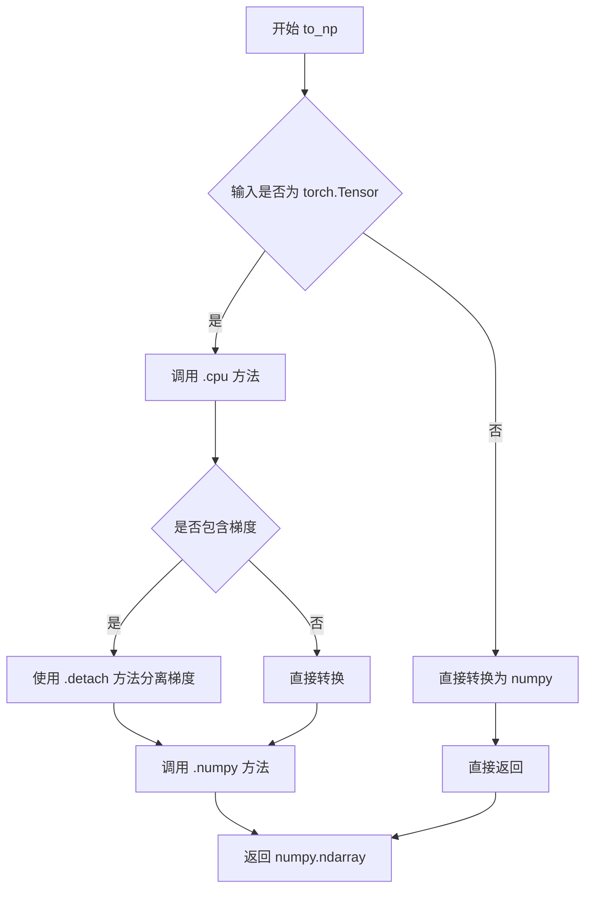

#### 带注释源码

```python
def to_np(tensor):
    """
    将 PyTorch 张量转换为 NumPy 数组
    
    该函数用于在测试中将 PyTorch 张量转换为 NumPy 数组，
    以便进行数值比较和断言。
    
    参数:
        tensor: torch.Tensor - 输入的 PyTorch 张量
        
    返回值:
        numpy.ndarray - 转换后的 NumPy 数组
    """
    # 如果是 torch.Tensor 类型
    if isinstance(tensor, torch.Tensor):
        # 如果张量需要梯度（requires_grad=True），先分离计算图
        if tensor.requires_grad:
            tensor = tensor.detach()
        # 将张量移到 CPU 设备并转换为 NumPy 数组
        return tensor.cpu().numpy()
    else:
        # 对于非张量类型，直接尝试转换为 NumPy
        return np.array(tensor)
```


### `QwenImageEditPlusPipelineFastTests.get_dummy_components`

该方法用于构建图像编辑管道所需的虚拟组件，包括Transformer模型、VAE、调度器、文本编码器和分词器等。

参数：

- `self`：隐式参数，测试类实例本身

返回值：`dict`，返回包含所有虚拟组件的字典，包括transformer、vae、scheduler、text_encoder、tokenizer和processor

#### 流程图

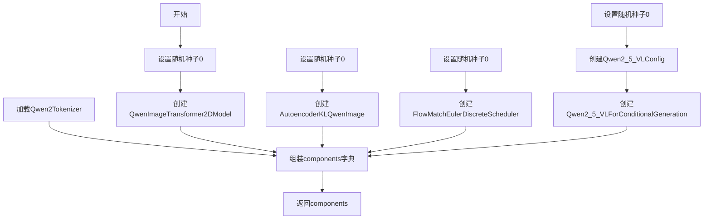

#### 带注释源码

```python
def get_dummy_components(self):
    """
    创建用于测试的虚拟组件字典
    
    Returns:
        dict: 包含所有管道组件的字典
    """
    # 使用HuggingFace上最小的Qwen2VL模型作为测试基础
    tiny_ckpt_id = "hf-internal-testing/tiny-random-Qwen2VLForConditionalGeneration"

    # 设置随机种子以确保可重复性
    torch.manual_seed(0)
    # 创建Transformer模型：图像变换器
    # 参数：patch大小2，输入通道16，输出通道4，2层，3个头
    transformer = QwenImageTransformer2DModel(
        patch_size=2,
        in_channels=16,
        out_channels=4,
        num_layers=2,
        attention_head_dim=16,
        num_attention_heads=3,
        joint_attention_dim=16,
        guidance_embeds=False,
        axes_dims_rope=(8, 4, 4),
    )

    # 重新设置随机种子
    torch.manual_seed(0)
    z_dim = 4
    # 创建VAE（变分自编码器）：用于图像编码和解码
    # 参数：基础维度24，潜在空间维度4，维度倍数[1,2,4]
    vae = AutoencoderKLQwenImage(
        base_dim=z_dim * 6,
        z_dim=z_dim,
        dim_mult=[1, 2, 4],
        num_res_blocks=1,
        temperal_downsample=[False, True],
        latents_mean=[0.0] * z_dim,
        latents_std=[1.0] * z_dim,
    )

    # 重新设置随机种子
    torch.manual_seed(0)
    # 创建调度器：用于扩散模型的噪声调度
    scheduler = FlowMatchEulerDiscreteScheduler()

    # 重新设置随机种子
    torch.manual_seed(0)
    # 创建Qwen2.5 VL配置
    config = Qwen2_5_VLConfig(
        text_config={
            "hidden_size": 16,
            "intermediate_size": 16,
            "num_hidden_layers": 2,
            "num_attention_heads": 2,
            "num_key_value_heads": 2,
            "rope_scaling": {
                "mrope_section": [1, 1, 2],
                "rope_type": "default",
                "type": "default",
            },
            "rope_theta": 1000000.0,
        },
        vision_config={
            "depth": 2,
            "hidden_size": 16,
            "intermediate_size": 16,
            "num_heads": 2,
            "out_hidden_size": 16,
        },
        hidden_size=16,
        vocab_size=152064,
        vision_end_token_id=151653,
        vision_start_token_id=151652,
        vision_token_id=151654,
    )
    # 创建文本编码器
    text_encoder = Qwen2_5_VLForConditionalGeneration(config)
    # 加载分词器
    tokenizer = Qwen2Tokenizer.from_pretrained(tiny_ckpt_id)

    # 组装所有组件到字典中
    components = {
        "transformer": transformer,
        "vae": vae,
        "scheduler": scheduler,
        "text_encoder": text_encoder,
        "tokenizer": tokenizer,
        "processor": Qwen2VLProcessor.from_pretrained(tiny_ckpt_id),
    }
    return components
```

---

### `QwenImageEditPlusPipelineFastTests.get_dummy_inputs`

该方法用于生成虚拟的输入参数，用于测试图像编辑管道的推理过程。

参数：

- `self`：隐式参数，测试类实例本身
- `device`：str，推理设备（如"cpu"、"cuda"等）
- `seed`：int，随机种子，默认值为0

返回值：`dict`，返回包含所有输入参数的字典，包括prompt、image、negative_prompt、generator等

#### 流程图

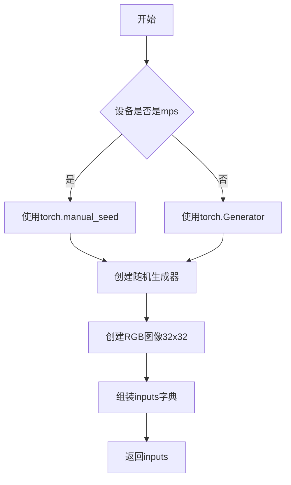

#### 带注释源码

```python
def get_dummy_inputs(self, device, seed=0):
    """
    生成虚拟输入参数用于测试
    
    Args:
        device: 运行设备
        seed: 随机种子
    
    Returns:
        dict: 包含所有输入参数的字典
    """
    # 根据设备类型创建随机生成器
    # MPS设备需要特殊处理
    if str(device).startswith("mps"):
        generator = torch.manual_seed(seed)
    else:
        # 为指定设备创建随机生成器
        generator = torch.Generator(device=device).manual_seed(seed)

    # 创建一个虚拟RGB图像（32x32大小）
    image = Image.new("RGB", (32, 32))
    
    # 组装输入参数字典
    inputs = {
        "prompt": "dance monkey",  # 文本提示
        "image": [image, image],   # 输入图像列表（支持批量）
        "negative_prompt": "bad quality",  # 负面提示
        "generator": generator,     # 随机生成器
        "num_inference_steps": 2,  # 推理步数
        "true_cfg_scale": 1.0,     # CFG缩放比例
        "height": 32,              # 输出高度
        "width": 32,               # 输出宽度
        "max_sequence_length": 16, # 最大序列长度
        "output_type": "pt",       # 输出类型（PyTorch张量）
    }

    return inputs
```

---

### `QwenImageEditPlusPipelineFastTests.test_inference`

该方法用于测试管道的基本推理功能，验证生成的图像形状和像素值是否符合预期。

参数：

- `self`：隐式参数，测试类实例本身

返回值：无返回值（unittest测试方法）

#### 流程图

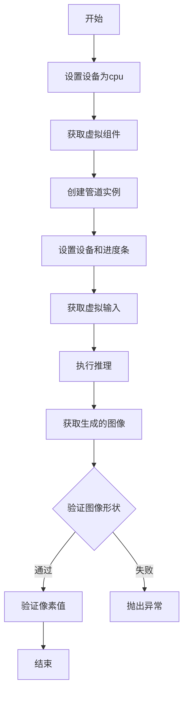

#### 带注释源码

```python
def test_inference(self):
    """
    测试管道基本推理功能
    验证：1. 输出图像形状正确 2. 像素值与预期接近
    """
    # 设置测试设备
    device = "cpu"

    # 获取虚拟组件
    components = self.get_dummy_components()
    # 使用组件创建管道实例
    pipe = self.pipeline_class(**components)
    # 将管道移到指定设备
    pipe.to(device)
    # 设置进度条配置
    pipe.set_progress_bar_config(disable=None)

    # 获取虚拟输入
    inputs = self.get_dummy_inputs(device)
    # 执行推理，获取生成的图像
    image = pipe(**inputs).images
    # 获取第一张生成的图像
    generated_image = image[0]
    
    # 断言：验证图像形状为(3, 32, 32)
    # 3通道RGB，32x32像素
    self.assertEqual(generated_image.shape, (3, 32, 32))

    # 预期的像素值切片（用于验证输出正确性）
    # fmt: off
    expected_slice = torch.tensor([[0.5637, 0.6341, 0.6001, 0.5620, 0.5794, 0.5498, 0.5757, 0.6389, 0.4174, 0.3597, 0.5649, 0.4894, 0.4969, 0.5255, 0.4083, 0.4986]])
    # fmt: on

    # 提取生成的图像切片用于比较
    generated_slice = generated_image.flatten()
    # 取前8个和后8个像素值
    generated_slice = torch.cat([generated_slice[:8], generated_slice[-8:]])
    
    # 断言：验证像素值在允许误差范围内匹配
    self.assertTrue(torch.allclose(generated_slice, expected_slice, atol=1e-3))
```

---

### `QwenImageEditPlusPipelineFastTests.test_attention_slicing_forward_pass`

该方法用于测试注意力切片（Attention Slicing）功能，确保启用注意力切片后推理结果的一致性。

参数：

- `self`：隐式参数，测试类实例本身
- `test_max_difference`：bool，是否测试最大差异，默认True
- `test_mean_pixel_difference`：bool，是否测试平均像素差异，默认True
- `expected_max_diff`：float，期望的最大差异阈值，默认1e-3

返回值：无返回值（unittest测试方法）

#### 流程图

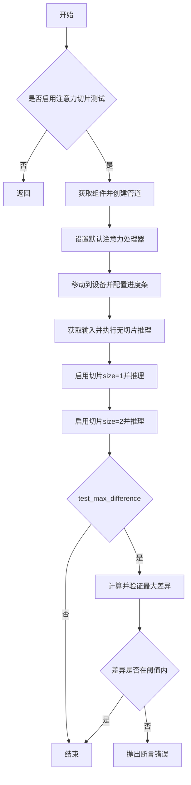

#### 带注释源码

```python
def test_attention_slicing_forward_pass(
    self, test_max_difference=True, test_mean_pixel_difference=True, expected_max_diff=1e-3
):
    """
    测试注意力切片功能的正确性
    
    注意力切片是一种减少显存占用的技术，将注意力计算分片进行
    此测试验证启用切片后结果应与不启用时基本一致
    """
    # 如果测试被禁用则直接返回
    if not self.test_attention_slicing:
        return

    # 获取虚拟组件并创建管道
    components = self.get_dummy_components()
    pipe = self.pipeline_class(**components)
    
    # 为所有组件设置默认注意力处理器
    for component in pipe.components.values():
        if hasattr(component, "set_default_attn_processor"):
            component.set_default_attn_processor()
    
    # 移动到测试设备并配置进度条
    pipe.to(torch_device)
    pipe.set_progress_bar_config(disable=None)

    # 测试设备
    generator_device = "cpu"
    # 获取虚拟输入
    inputs = self.get_dummy_inputs(generator_device)
    # 执行不启用注意力切片的推理
    output_without_slicing = pipe(**inputs)[0]

    # 启用注意力切片，slice_size=1
    pipe.enable_attention_slicing(slice_size=1)
    inputs = self.get_dummy_inputs(generator_device)
    # 执行推理
    output_with_slicing1 = pipe(**inputs)[0]

    # 启用注意力切片，slice_size=2
    pipe.enable_attention_slicing(slice_size=2)
    inputs = self.get_dummy_inputs(generator_device)
    # 执行推理
    output_with_slicing2 = pipe(**inputs)[0]

    # 如果需要测试最大差异
    if test_max_difference:
        # 计算无切片与slice_size=1的差异
        max_diff1 = np.abs(to_np(output_with_slicing1) - to_np(output_without_slicing)).max()
        # 计算无切片与slice_size=2的差异
        max_diff2 = np.abs(to_np(output_with_slicing2) - to_np(output_without_slicing)).max()
        
        # 断言：注意力切片不应影响推理结果
        self.assertLess(
            max(max_diff1, max_diff2),
            expected_max_diff,
            "Attention slicing should not affect the inference results",
        )
```

---

### `QwenImageEditPlusPipelineFastTests.test_vae_tiling`

该方法用于测试VAE平铺（Tiling）功能，确保启用VAE平铺后推理结果的一致性。

参数：

- `self`：隐式参数，测试类实例本身
- `expected_diff_max`：float，期望的最大差异阈值，默认0.2

返回值：无返回值（unittest测试方法）

#### 流程图

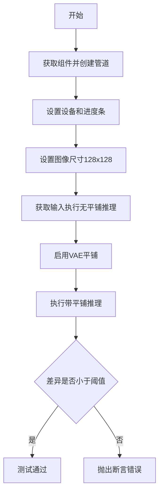

#### 带注释源码

```python
def test_vae_tiling(self, expected_diff_max: float = 0.2):
    """
    测试VAE平铺功能的正确性
    
    VAE平铺是一种处理大图像的技术，将图像分块处理后再拼接
    此测试验证启用平铺后结果应与不启用时接近
    """
    # 测试设备
    generator_device = "cpu"
    # 获取虚拟组件
    components = self.get_dummy_components()

    # 创建管道实例
    pipe = self.pipeline_class(**components)
    pipe.to("cpu")
    pipe.set_progress_bar_config(disable=None)

    # 测试1：不启用平铺
    inputs = self.get_dummy_inputs(generator_device)
    # 设置较大的图像尺寸（128x128）以测试平铺
    inputs["height"] = inputs["width"] = 128
    # 执行推理
    output_without_tiling = pipe(**inputs)[0]

    # 测试2：启用VAE平铺
    # 配置平铺参数：最小瓦片尺寸96x96，步长64x64
    pipe.vae.enable_tiling(
        tile_sample_min_height=96,
        tile_sample_min_width=96,
        tile_sample_stride_height=64,
        tile_sample_stride_width=64,
    )
    inputs = self.get_dummy_inputs(generator_device)
    inputs["height"] = inputs["width"] = 128
    # 执行推理
    output_with_tiling = pipe(**inputs)[0]

    # 断言：VAE平铺不应显著影响推理结果
    self.assertLess(
        (to_np(output_without_tiling) - to_np(output_with_tiling)).max(),
        expected_diff_max,
        "VAE tiling should not affect the inference results",
    )
```

---

### `QwenImageEditPlusPipelineFastTests.test_encode_prompt_works_in_isolation`

该方法用于测试提示编码的隔离功能，但由于已知问题被标记为预期失败。

参数：

- `self`：隐式参数，测试类实例本身
- `extra_required_param_value_dict`：dict，可选的额外参数字典，默认None
- `atol`：float，绝对误差容忍度，默认1e-4
- `rtol`：float，相对误差容忍度，默认1e-4

返回值：无返回值（unittest测试方法）

#### 带注释源码

```python
@pytest.mark.xfail(condition=True, reason="Preconfigured embeddings need to be revisited.", strict=True)
def test_encode_prompt_works_in_isolation(self, extra_required_param_value_dict=None, atol=1e-4, rtol=1e-4):
    """
    测试提示编码的隔离功能
    
    此测试验证编码提示时不会受到其他批次提示的干扰
    由于预配置的embeddings需要重新审视，此测试被标记为预期失败
    """
    # 调用父类的测试方法
    super().test_encode_prompt_works_in_isolation(extra_required_param_value_dict, atol, rtol)
```

---

### `QwenImageEditPlusPipelineFastTests.test_num_images_per_prompt`

该方法用于测试每提示生成的图像数量，但因已知问题被标记为预期失败。

参数：

- `self`：隐式参数，测试类实例本身

返回值：无返回值（unittest测试方法）

#### 带注释源码

```python
@pytest.mark.xfail(condition=True, reason="Batch of multiple images needs to be revisited", strict=True)
def test_num_images_per_prompt():
    """
    测试每个提示生成的图像数量
    
    验证一个提示可以生成多张图像
    由于批量多图像功能需要重新审视，此测试被标记为预期失败
    """
    super().test_num_images_per_prompt()
```

---

### `QwenImageEditPlusPipelineFastTests.test_inference_batch_consistent`

该方法用于测试批量推理的一致性，但因已知问题被标记为预期失败。

参数：

- `self`：隐式参数，测试类实例本身

返回值：无返回值（unittest测试方法）

#### 带注释源码

```python
@pytest.mark.xfail(condition=True, reason="Batch of multiple images needs to be revisited", strict=True)
def test_inference_batch_consistent():
    """
    测试批量推理的一致性
    
    验证使用不同批量大小推理时结果应一致
    由于批量多图像功能需要重新审视，此测试被标记为预期失败
    """
    super().test_inference_batch_consistent()
```

---

### `QwenImageEditPlusPipelineFastTests.test_inference_batch_single_identical`

该方法用于测试批量推理与单张推理结果的一致性，但因已知问题被标记为预期失败。

参数：

- `self`：隐式参数，测试类实例本身

返回值：无返回值（unittest测试方法）

#### 带注释源码

```python
@pytest.mark.xfail(condition=True, reason="Batch of multiple images needs to be revisited", strict=True)
def test_inference_batch_single_identical():
    """
    测试批量推理与单张推理结果是否相同
    
    验证批量推理时，单张图像的输出应与单独推理时一致
    由于批量多图像功能需要重新审视，此测试被标记为预期失败
    """
    super().test_inference_batch_single_identical()
```

---

## 类详细信息

### `QwenImageEditPlusPipelineFastTests`

#### 类字段

- `pipeline_class`：QwenImageEditPlusPipeline，管道类
- `params`：TEXT_TO_IMAGE_PARAMS减去cross_attention_kwargs，推理参数集
- `batch_params`：frozenset({"prompt", "image"})，批量参数
- `image_params`：frozenset({"image"})，图像参数
- `image_latents_params`：frozenset({"latents"})，图像潜在向量参数
- `required_optional_params`：frozenset，可选必需参数集
- `supports_dduf`：bool，是否支持DDUF，默认False
- `test_xformers_attention`：bool，是否测试xformers注意力，默认False
- `test_layerwise_casting`：bool，是否测试分层类型转换，默认True
- `test_group_offloading`：bool，是否测试组卸载，默认True

#### 类方法

| 方法名 | 描述 |
|--------|------|
| `get_dummy_components` | 创建虚拟组件字典 |
| `get_dummy_inputs` | 创建虚拟输入参数 |
| `test_inference` | 测试基本推理功能 |
| `test_attention_slicing_forward_pass` | 测试注意力切片功能 |
| `test_vae_tiling` | 测试VAE平铺功能 |
| `test_encode_prompt_works_in_isolation` | 测试提示编码隔离（预期失败） |
| `test_num_images_per_prompt` | 测试每提示图像数量（预期失败） |
| `test_inference_batch_consistent` | 测试批量推理一致性（预期失败） |
| `test_inference_batch_single_identical` | 测试批量与单张推理一致性（预期失败） |

---

## 关键组件信息

| 组件名称 | 描述 |
|----------|------|
| `QwenImageTransformer2DModel` | Qwen图像变换器模型，用于图像到图像的转换 |
| `AutoencoderKLQwenImage` | Qwen变分自编码器，用于图像编码和解码 |
| `FlowMatchEulerDiscreteScheduler` | 流匹配欧拉离散调度器，用于扩散模型噪声调度 |
| `Qwen2_5_VLForConditionalGeneration` | Qwen2.5视觉语言模型的条件生成版本 |
| `Qwen2Tokenizer` | Qwen2分词器 |
| `Qwen2VLProcessor` | Qwen2视觉语言处理器 |
| `QwenImageEditPlusPipeline` | Qwen图像编辑增强管道主类 |

---

## 潜在技术债务与优化空间

1. **预期失败的测试**：4个测试方法（`test_encode_prompt_works_in_isolation`、`test_num_images_per_prompt`、`test_inference_batch_consistent`、`test_inference_batch_single_identical`）因批量多图像和预配置embeddings问题被标记为xfail，需要后续修复

2. **硬编码的随机种子**：多处使用`torch.manual_seed(0)`，建议改为可配置的种子以支持更灵活的测试

3. **测试设备硬编码**：多处使用`"cpu"`作为默认设备，可考虑支持更多设备如CUDA、MPS等

4. **重复代码**：`get_dummy_inputs`方法在多个测试中被调用，可以考虑提取公共逻辑

5. **图像尺寸测试**：仅测试了32x32和128x128两种尺寸，可增加更多尺寸的测试用例

---

## 其他项目

### 设计目标与约束
- 目标：验证QwenImageEditPlusPipeline的正确性和稳定性
- 约束：需要使用虚拟组件进行测试，不能依赖真实预训练模型

### 错误处理与异常设计
- 使用unittest框架进行断言验证
- 使用pytest.mark.xfail标记预期失败的测试
- 注意力切片和VAE平移测试包含具体的误差阈值判断

### 数据流与状态机
- 测试流程：组件初始化 → 管道创建 → 输入准备 → 推理执行 → 结果验证
- 状态转换：普通推理 → 启用注意力切片 → 启用VAE平铺

### 外部依赖与接口契约
- 依赖库：torch、numpy、pytest、PIL、transformers、diffusers
- 管道接口：接受prompt、image、negative_prompt、generator、num_inference_steps等参数
- 输出接口：返回包含images属性的对象，images为图像列表


# QwenImageEditPlusPipelineFastTests 详细设计文档

## 一、代码概述

该代码是 `QwenImageEditPlusPipeline` 流水线的快速测试套件，继承自 `PipelineTesterMixin` 和 `unittest.TestCase`，用于验证 Qwen2.5-VL 图像编辑 pipeline 的核心功能，包括推理、注意力切片和 VAE 平铺等特性。

## 二、文件运行流程

```
1. 导入依赖模块和被测 Pipeline 类
2. 定义 QwenImageEditPlusPipelineFastTests 测试类
3. 配置测试参数（params, batch_params, image_params 等）
4. 实现 get_dummy_components() 创建虚拟组件
5. 实现 get_dummy_inputs() 创建虚拟输入
6. 执行各项测试方法：
   - test_inference: 验证基本推理功能
   - test_attention_slicing_forward_pass: 验证注意力切片
   - test_vae_tiling: 验证 VAE 平铺
   - test_encode_prompt_works_in_isolation: 验证提示编码器隔离
   - test_num_images_per_prompt: 验证每提示图像数
   - test_inference_batch_consistent: 验证批次推理一致性
   - test_inference_batch_single_identical: 验证批次单个推理
```

## 三、类详细信息

### 3.1 类字段

| 字段名称 | 类型 | 描述 |
|---------|------|------|
| `pipeline_class` | type | 被测试的 Pipeline 类 (QwenImageEditPlusPipeline) |
| `params` | frozenset | 文本到图像参数集合（排除 cross_attention_kwargs） |
| `batch_params` | frozenset | 批处理参数集合 |
| `image_params` | frozenset | 图像参数集合 |
| `image_latents_params` | frozenset | 图像潜在向量参数集合 |
| `required_optional_params` | frozenset | 必需的可选参数集合 |
| `supports_dduf` | bool | 是否支持 DDUF (False) |
| `test_xformers_attention` | bool | 是否测试 xformers 注意力 (False) |
| `test_layerwise_casting` | bool | 是否测试分层类型转换 (True) |
| `test_group_offloading` | bool | 是否测试组卸载 (True) |

### 3.2 类方法

---

### `QwenImageEditPlusPipelineFastTests.get_dummy_components`

#### 描述

创建并返回用于测试的虚拟组件字典，包含 transformer、VAE、scheduler、text_encoder、tokenizer 和 processor 等所有必要的模型组件。

#### 参数

无

#### 返回值

- `dict`：包含所有虚拟组件的字典

#### 流程图

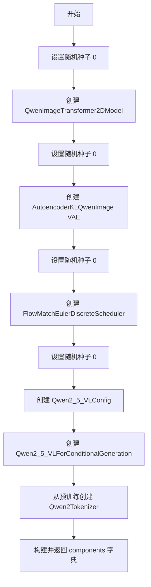

#### 带注释源码

```python
def get_dummy_components(self):
    """
    创建用于测试的虚拟组件。
    
    该方法初始化一个完整的推理 pipeline 所需的所有模型组件，
    使用小型随机权重以便快速测试。
    """
    tiny_ckpt_id = "hf-internal-testing/tiny-random-Qwen2VLForConditionalGeneration"

    # 1. 创建 Transformer 模型（图像变换器）
    torch.manual_seed(0)
    transformer = QwenImageTransformer2DModel(
        patch_size=2,           # 图像分块大小
        in_channels=16,         # 输入通道数
        out_channels=4,         # 输出通道数
        num_layers=2,           # Transformer 层数
        attention_head_dim=16,  # 注意力头维度
        num_attention_heads=3,  # 注意力头数量
        joint_attention_dim=16, # 联合注意力维度
        guidance_embeds=False,  # 是否使用引导嵌入
        axes_dims_rope=(8, 4, 4), # RoPE 轴维度
    )

    # 2. 创建 VAE（变分自编码器）
    torch.manual_seed(0)
    z_dim = 4
    vae = AutoencoderKLQwenImage(
        base_dim=z_dim * 6,     # 基础维度
        z_dim=z_dim,           # 潜在空间维度
        dim_mult=[1, 2, 4],    # 维度倍数
        num_res_blocks=1,      # 残差块数量
        temperal_downsample=[False, True], # 时间下采样
        latents_mean=[0.0] * z_dim, # 潜在向量均值
        latents_std=[1.0] * z_dim,   # 潜在向量标准差
    )

    # 3. 创建调度器
    torch.manual_seed(0)
    scheduler = FlowMatchEulerDiscreteScheduler()

    # 4. 创建文本编码器和分词器
    torch.manual_seed(0)
    config = Qwen2_5_VLConfig(
        text_config={
            "hidden_size": 16,
            "intermediate_size": 16,
            "num_hidden_layers": 2,
            "num_attention_heads": 2,
            "num_key_value_heads": 2,
            "rope_scaling": {
                "mrope_section": [1, 1, 2],
                "rope_type": "default",
                "type": "default",
            },
            "rope_theta": 1000000.0,
        },
        vision_config={
            "depth": 2,
            "hidden_size": 16,
            "intermediate_size": 16,
            "num_heads": 2,
            "out_hidden_size": 16,
        },
        hidden_size=16,
        vocab_size=152064,
        vision_end_token_id=151653,
        vision_start_token_id=151652,
        vision_token_id=151654,
    )
    text_encoder = Qwen2_5_VLForConditionalGeneration(config)
    tokenizer = Qwen2Tokenizer.from_pretrained(tiny_ckpt_id)

    # 5. 构建组件字典
    components = {
        "transformer": transformer,
        "vae": vae,
        "scheduler": scheduler,
        "text_encoder": text_encoder,
        "tokenizer": tokenizer,
        "processor": Qwen2VLProcessor.from_pretrained(tiny_ckpt_id),
    }
    return components
```

---

### `QwenImageEditPlusPipelineFastTests.get_dummy_inputs`

#### 描述

创建并返回用于测试的虚拟输入字典，包含提示词、图像、负提示词、生成器、推理步数等推理所需参数。

#### 参数

| 参数名称 | 参数类型 | 参数描述 |
|---------|---------|---------|
| `device` | str | 目标设备（如 "cpu", "cuda"） |
| `seed` | int | 随机种子（默认 0） |

#### 返回值

- `dict`：包含所有推理输入的字典

#### 流程图

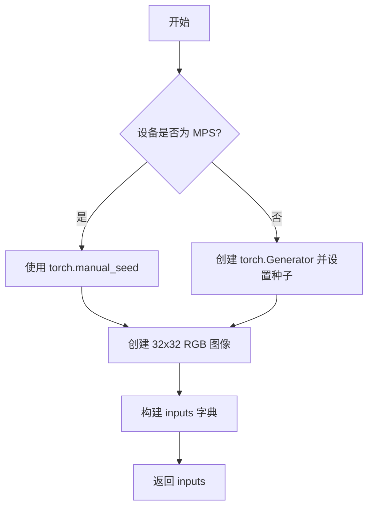

#### 带注释源码

```python
def get_dummy_inputs(self, device, seed=0):
    """
    创建用于推理测试的虚拟输入。
    
    参数:
        device: 目标设备
        seed: 随机种子，用于生成器
    
    返回:
        包含所有推理参数的字典
    """
    # 1. 根据设备类型选择随机数生成方式
    # MPS (Apple Silicon) 需要特殊处理
    if str(device).startswith("mps"):
        generator = torch.manual_seed(seed)
    else:
        generator = torch.Generator(device=device).manual_seed(seed)

    # 2. 创建虚拟输入图像（RGB 32x32）
    image = Image.new("RGB", (32, 32))
    
    # 3. 构建完整的输入参数字典
    inputs = {
        "prompt": "dance monkey",           # 文本提示
        "image": [image, image],            # 输入图像列表
        "negative_prompt": "bad quality",  # 负向提示
        "generator": generator,             # 随机生成器
        "num_inference_steps": 2,           # 推理步数
        "true_cfg_scale": 1.0,              # CFG 比例
        "height": 32,                       # 输出高度
        "width": 32,                        # 输出宽度
        "max_sequence_length": 16,         # 最大序列长度
        "output_type": "pt",                # 输出类型 (PyTorch)
    }

    return inputs
```

---

### `QwenImageEditPlusPipelineFastTests.test_inference`

#### 描述

测试 Pipeline 的基本推理功能，验证模型能够生成正确尺寸的图像输出。

#### 参数

无

#### 返回值

无（通过 unittest 断言验证）

#### 流程图

```mermaid
flowchart TD
    A[开始] --> B[设置设备为 CPU]
    B --> C[获取虚拟组件]
    C --> D[创建 Pipeline 实例]
    D --> E[加载到设备]
    E --> F[配置进度条]
    F --> G[获取虚拟输入]
    G --> H[执行推理]
    H --> I[验证输出形状 (3, 32, 32)]
    I --> J[验证输出数值]
```

#### 带注释源码

```python
def test_inference(self):
    """
    测试基本推理功能。
    
    验证:
    1. Pipeline 能够成功运行
    2. 输出图像尺寸正确 (3, 32, 32)
    3. 输出数值在预期范围内
    """
    device = "cpu"

    # 1. 获取测试组件并创建 Pipeline
    components = self.get_dummy_components()
    pipe = self.pipeline_class(**components)
    pipe.to(device)
    pipe.set_progress_bar_config(disable=None)

    # 2. 执行推理
    inputs = self.get_dummy_inputs(device)
    image = pipe(**inputs).images
    generated_image = image[0]
    
    # 3. 验证输出形状 (C, H, W) = (3, 32, 32)
    self.assertEqual(generated_image.shape, (3, 32, 32))

    # 4. 验证输出数值与预期值接近
    # fmt: off
    expected_slice = torch.tensor([[0.5637, 0.6341, 0.6001, 0.5620, 0.5794, 0.5498, 
                                     0.5757, 0.6389, 0.4174, 0.3597, 0.5649, 0.4894, 
                                     0.4969, 0.5255, 0.4083, 0.4986]])
    # fmt: on

    # 5. 比较部分像素值（取前8和后8个像素）
    generated_slice = generated_image.flatten()
    generated_slice = torch.cat([generated_slice[:8], generated_slice[-8:]])
    self.assertTrue(torch.allclose(generated_slice, expected_slice, atol=1e-3))
```

---

### `QwenImageEditPlusPipelineFastTests.test_attention_slicing_forward_pass`

#### 描述

测试注意力切片功能，验证启用注意力切片后推理结果的一致性。

#### 参数

| 参数名称 | 参数类型 | 参数描述 |
|---------|---------|---------|
| `test_max_difference` | bool | 是否测试最大差异 |
| `test_mean_pixel_difference` | bool | 是否测试平均像素差异 |
| `expected_max_diff` | float | 预期最大差异阈值 |

#### 返回值

无（通过 unittest 断言验证）

#### 带注释源码

```python
def test_attention_slicing_forward_pass(
    self, test_max_difference=True, test_mean_pixel_difference=True, expected_max_diff=1e-3
):
    """
    测试注意力切片前向传播。
    
    注意力切片是一种内存优化技术，将注意力计算分块进行。
    该测试验证启用切片后结果应与不使用时一致。
    """
    # 1. 检查是否启用注意力切片测试
    if not self.test_attention_slicing:
        return

    # 2. 准备组件和 Pipeline
    components = self.get_dummy_components()
    pipe = self.pipeline_class(**components)
    
    # 3. 设置默认注意力处理器
    for component in pipe.components.values():
        if hasattr(component, "set_default_attn_processor"):
            component.set_default_attn_processor()
    
    pipe.to(torch_device)
    pipe.set_progress_bar_config(disable=None)

    # 4. 无切片情况的输出
    generator_device = "cpu"
    inputs = self.get_dummy_inputs(generator_device)
    output_without_slicing = pipe(**inputs)[0]

    # 5. 启用切片（slice_size=1）
    pipe.enable_attention_slicing(slice_size=1)
    inputs = self.get_dummy_inputs(generator_device)
    output_with_slicing1 = pipe(**inputs)[0]

    # 6. 启用切片（slice_size=2）
    pipe.enable_attention_slicing(slice_size=2)
    inputs = self.get_dummy_inputs(generator_device)
    output_with_slicing2 = pipe(**inputs)[0]

    # 7. 验证结果一致性
    if test_max_difference:
        max_diff1 = np.abs(to_np(output_with_slicing1) - to_np(output_without_slicing)).max()
        max_diff2 = np.abs(to_np(output_with_slicing2) - to_np(output_without_slicing)).max()
        self.assertLess(
            max(max_diff1, max_diff2),
            expected_max_diff,
            "Attention slicing should not affect the inference results",
        )
```

---

### `QwenImageEditPlusPipelineFastTests.test_vae_tiling`

#### 描述

测试 VAE 平铺功能，验证启用平铺后推理结果的一致性，用于处理大尺寸图像的内存优化。

#### 参数

| 参数名称 | 参数类型 | 参数描述 |
|---------|---------|---------|
| `expected_diff_max` | float | 预期最大差异阈值（默认 0.2） |

#### 返回值

无（通过 unittest 断言验证）

#### 带注释源码

```python
def test_vae_tiling(self, expected_diff_max: float = 0.2):
    """
    测试 VAE 平铺功能。
    
    VAE 平铺是一种处理大图像的内存优化技术，将图像分块处理。
    该测试验证启用平铺后结果应与不使用时接近。
    """
    generator_device = "cpu"
    components = self.get_dummy_components()

    # 1. 创建 Pipeline
    pipe = self.pipeline_class(**components)
    pipe.to("cpu")
    pipe.set_progress_bar_config(disable=None)

    # 2. 不使用平铺的输出（128x128 大图）
    inputs = self.get_dummy_inputs(generator_device)
    inputs["height"] = inputs["width"] = 128
    output_without_tiling = pipe(**inputs)[0]

    # 3. 启用平铺并执行推理
    pipe.vae.enable_tiling(
        tile_sample_min_height=96,      # 最小平铺高度
        tile_sample_min_width=96,       # 最小平铺宽度
        tile_sample_stride_height=64,  # 高度步长
        tile_sample_stride_width=64,   # 宽度步长
    )
    inputs = self.get_dummy_inputs(generator_device)
    inputs["height"] = inputs["width"] = 128
    output_with_tiling = pipe(**inputs)[0]

    # 4. 验证结果一致性（允许较大误差 0.2）
    self.assertLess(
        (to_np(output_without_tiling) - to_np(output_with_tiling)).max(),
        expected_diff_max,
        "VAE tiling should not affect the inference results",
    )
```

---

## 四、关键组件信息

| 组件名称 | 描述 |
|---------|------|
| `QwenImageEditPlusPipeline` | Qwen2.5-VL 图像编辑流水线，整合 Transformer、VAE、文本编码器和调度器 |
| `QwenImageTransformer2DModel` | 图像变换器模型，基于 Qwen2.5-VL 架构 |
| `AutoencoderKLQwenImage` | Qwen 图像 VAE 模型 |
| `FlowMatchEulerDiscreteScheduler` | Flow Match 欧拉离散调度器 |
| `Qwen2_5_VLForConditionalGeneration` | Qwen2.5-VL 文本编码器 |
| `Qwen2VLProcessor` | Qwen2.5-VL 处理器，处理文本和图像输入 |

## 五、技术债务与优化空间

1. **多个测试用例标记为 xfail**：有 4 个测试用例（`test_encode_prompt_works_in_isolation`、`test_num_images_per_prompt`、`test_inference_batch_consistent`、`test_inference_batch_single_identical`）被标记为预期失败，表明批处理功能需要重新审视

2. **硬编码的模型路径**：`get_dummy_components` 中使用了硬编码的模型检查点路径 `"hf-internal-testing/tiny-random-Qwen2VLForConditionalGeneration"`

3. **测试用例依赖继承**：`test_num_images_per_prompt`、`test_inference_batch_consistent`、`test_inference_batch_single_identical` 等方法通过 `super()` 调用父类方法，但使用 `@pytest.mark.xfail` 标记，说明该 Pipeline 的某些功能尚未完全实现

4. **缺乏设备适配测试**：主要测试在 CPU 上运行，未覆盖 CUDA/GPU 场景的完整性测试

## 六、其它项目

### 设计目标与约束
- **目标**：验证 Qwen2.5-VL 图像编辑 pipeline 的核心推理功能
- **约束**：使用小型随机权重模型以加快测试速度

### 错误处理
- 使用 `@pytest.mark.xfail` 标记已知问题，允许多个批处理相关测试失败
- 使用 `strict=True` 确保预期失败的测试确实失败

### 外部依赖
- `transformers`: Qwen2.5-VL 模型和分词器
- `diffusers`: Pipeline 和调度器实现
- `PIL`: 图像处理
- `torch`: 深度学习框架
- `pytest`: 测试框架


# QwenImageEditPlusPipeline 测试文档

## 一段话描述

本文件是针对 `QwenImageEditPlusPipeline` 的单元测试套件，验证图像编辑管道在各种配置下的功能正确性，包括基础推理、注意力切片、VAE平铺等核心特性，并包含多个标记为xfail的待修复测试用例。

## 文件整体运行流程

```
1. 导入依赖模块（unittest, pytest, torch, PIL, transformers, diffusers等）
2. 配置测试环境（enable_full_determinism）
3. 定义测试类 QwenImageEditPlusPipelineFastTests
4. 在每个测试方法中：
   - 获取虚拟组件（get_dummy_components）
   - 创建管道实例并配置设备
   - 准备测试输入（get_dummy_inputs）
   - 执行测试并验证结果
5. 运行各个测试方法验证管道功能
```

## 类详细信息

### QwenImageEditPlusPipelineFastTests

**类字段：**

- `pipeline_class`：`type`，管道类引用
- `params`：`frozenset`，文本到图像参数集（排除cross_attention_kwargs）
- `batch_params`：`frozenset`，批处理参数（prompt, image）
- `image_params`：`frozenset`，图像参数（image）
- `image_latents_params`：`frozenset`，图像潜在参数（latents）
- `required_optional_params`：`frozenset`，必需的可选参数集
- `supports_dduf`：`bool`，是否支持DDUF（默认False）
- `test_xformers_attention`：`bool`，是否测试xformers注意力（默认False）
- `test_layerwise_casting`：`bool`，是否测试分层类型转换（默认True）
- `test_group_offloading`：`bool`，是否测试组卸载（默认True）

**类方法：**

- `get_dummy_components()` → `dict`：创建并返回虚拟管道组件
- `get_dummy_inputs(device, seed=0)` → `dict`：创建虚拟测试输入
- `test_inference()`：验证管道基础推理功能
- `test_attention_slicing_forward_pass(...)`：验证注意力切片功能
- `test_vae_tiling(expected_diff_max=0.2)`：验证VAE平铺功能
- `test_encode_prompt_works_in_isolation(...)`：验证提示编码隔离（xfail）
- `test_num_images_per_prompt()`：验证每提示图像数量（xfail）
- `test_inference_batch_consistent()`：验证批推理一致性（xfail）
- `test_inference_batch_single_identical()`：验证批处理单张图像相同（xfail）

## 关键组件信息

- **PipelineTesterMixin**：提供管道测试通用方法的混合类
- **QwenImageTransformer2DModel**：Qwen图像变换器模型
- **AutoencoderKLQwenImage**：Qwen图像VAE编码器
- **FlowMatchEulerDiscreteScheduler**：流匹配欧拉离散调度器
- **Qwen2_5_VLForConditionalGeneration**：Qwen2.5 VL条件生成模型
- **Qwen2VLProcessor**：Qwen2.5 VL处理器
- **enable_full_determinism**：启用完全确定性测试的辅助函数

## 潜在的技术债务或优化空间

1. **xfail测试用例**：4个测试标记为xfail（预期失败），涉及批量图像处理和提示编码隔离功能，表明这些功能尚未完全实现或存在bug
2. **MPS设备兼容性问题**：需要特殊处理MPS设备的随机数生成器
3. **硬编码的测试阈值**：部分阈值（如atol=1e-3, expected_diff_max=0.2）硬编码，可能需要根据不同硬件调整
4. **重复代码**：多个测试方法中重复创建管道实例和输入，可以提取为fixture

## 其它项目

### 设计目标与约束
- 测试针对CPU设备优化（device="cpu"）
- 使用极小模型配置（tiny-random）进行快速测试
- 确保推理结果确定性（enable_full_determinism）

### 错误处理与异常设计
- 使用pytest.mark.xfail标记已知问题
- 通过assert验证推理结果与期望值的接近程度（torch.allclose）

### 数据流与状态机
- 管道组件通过字典传入：transformer, vae, scheduler, text_encoder, tokenizer, processor
- 输入数据：prompt + image → 编码 → 潜在向量 → 变换器处理 → 解码 → 输出图像

### 外部依赖与接口契约
- 依赖transformers库提供Qwen2.5 VL模型
- 依赖diffusers库提供管道和调度器
- 遵循PipelineTesterMixin定义的测试接口规范
</content>

---

### `QwenImageEditPlusPipelineFastTests.test_inference`

此测试方法验证QwenImageEditPlusPipeline管道的基础推理功能，确保管道能够正确处理文本提示和图像输入，生成符合预期尺寸的输出图像。

参数：此方法无显式参数。

返回值：`None`，通过self.assertEqual和self.assertTrue进行断言验证

#### 流程图

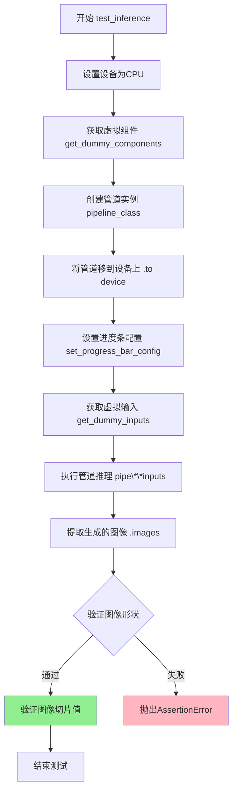

#### 带注释源码

```python
def test_inference(self):
    """测试管道基础推理功能"""
    # 1. 设置测试设备为CPU
    device = "cpu"

    # 2. 获取虚拟组件（transformer, vae, scheduler, text_encoder, tokenizer, processor）
    components = self.get_dummy_components()
    
    # 3. 使用虚拟组件创建管道实例
    pipe = self.pipeline_class(**components)
    
    # 4. 将管道移到指定设备上
    pipe.to(device)
    
    # 5. 配置进度条（disable=None表示不禁用）
    pipe.set_progress_bar_config(disable=None)

    # 6. 准备测试输入：包含prompt、image、negative_prompt、generator等
    inputs = self.get_dummy_inputs(device)
    
    # 7. 执行推理并获取结果
    # pipe返回PipeOutput对象，包含images属性
    image = pipe(**inputs).images
    
    # 8. 提取第一张生成的图像
    generated_image = image[0]
    
    # 9. 验证输出图像形状为(3, 32, 32) - RGB通道、高度、宽度
    self.assertEqual(generated_image.shape, (3, 32, 32))

    # 10. 定义期望的图像像素值切片（用于精确验证）
    # fmt: off
    expected_slice = torch.tensor([[0.5637, 0.6341, 0.6001, 0.5620, 0.5794, 0.5498, 0.5757, 0.6389, 0.4174, 0.3597, 0.5649, 0.4894, 0.4969, 0.5255, 0.4083, 0.4986]])
    # fmt: on

    # 11. 从生成的图像中提取切片：
    #    - 先flatten展平
    #    - 取前8个和最后8个像素（共16个）
    generated_slice = generated_image.flatten()
    generated_slice = torch.cat([generated_slice[:8], generated_slice[-8:]])
    
    # 12. 验证生成图像与期望值的差异在允许范围内（atol=1e-3）
    self.assertTrue(torch.allclose(generated_slice, expected_slice, atol=1e-3))
```


### `Image`

这是Python Imaging Library (PIL) 中的 `Image` 类，用于创建和处理图像。在本代码中，它被用于生成测试用的虚拟图像。

参数：

- 无直接参数（通过类方法调用传递参数）

返回值：`PIL.Image.Image`，返回一个PIL图像对象

#### 流程图

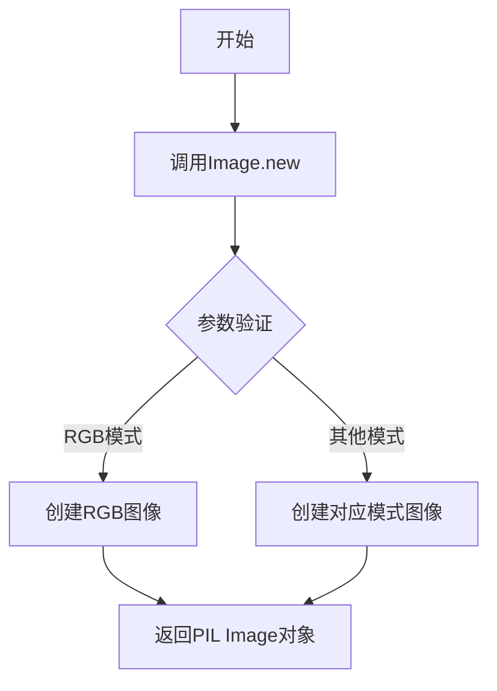

#### 带注释源码

```python
# 导入PIL的Image类
from PIL import Image

# 在get_dummy_inputs方法中创建测试图像
image = Image.new("RGB", (32, 32))
# 参数说明：
# - "RGB": 图像模式，RGB颜色空间
# - (32, 32): 图像尺寸，宽度32像素，高度32像素

# 后续在测试中被使用
# inputs = {
#     "prompt": "dance monkey",
#     "image": [image, image],  # 作为图像编辑pipeline的输入
#     ...
# }
```

---

### `get_dummy_inputs`

创建虚拟输入参数，用于测试QwenImageEditPlusPipeline。

参数：

- `device`：`str`，目标设备（如"cpu"、"cuda"）
- `seed`：`int`，随机种子，默认为0

返回值：`dict`，包含以下键值的字典：
- `prompt`：文本提示
- `image`：输入图像列表
- `negative_prompt`：负面提示
- `generator`：随机数生成器
- `num_inference_steps`：推理步数
- `true_cfg_scale`：无分类器指导规模
- `height`：图像高度
- `width`：图像宽度
- `max_sequence_length`：最大序列长度
- `output_type`：输出类型

#### 流程图

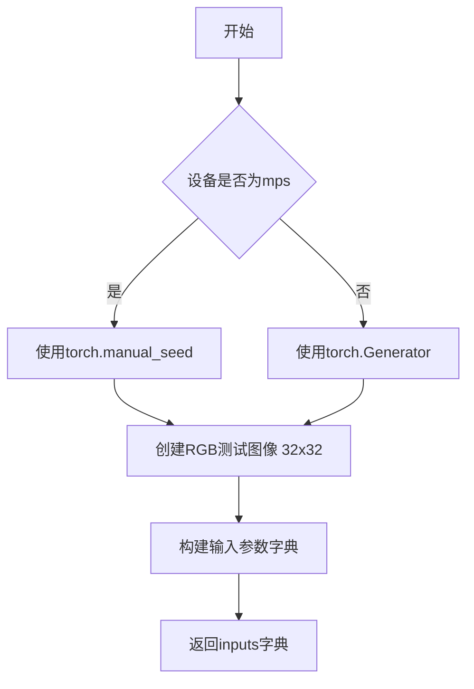

#### 带注释源码

```python
def get_dummy_inputs(self, device, seed=0):
    # 根据设备类型选择随机数生成方式
    # MPS设备需要特殊处理
    if str(device).startswith("mps"):
        generator = torch.manual_seed(seed)
    else:
        # 为指定设备创建随机数生成器
        generator = torch.Generator(device=device).manual_seed(seed)

    # 创建测试用虚拟图像
    # RGB模式，32x32像素
    image = Image.new("RGB", (32, 32))
    
    # 构建完整的测试输入参数
    inputs = {
        "prompt": "dance monkey",  # 文本提示词
        "image": [image, image],   # 输入图像列表（支持批量）
        "negative_prompt": "bad quality",  # 负面提示词
        "generator": generator,   # 随机数生成器（确保可复现性）
        "num_inference_steps": 2,  # 推理步数
        "true_cfg_scale": 1.0,     # True CFG规模
        "height": 32,              # 输出图像高度
        "width": 32,               # 输出图像宽度
        "max_sequence_length": 16, # 最大序列长度
        "output_type": "pt",       # 输出类型（PyTorch张量）
    }

    return inputs
```


### `QwenImageEditPlusPipelineFastTests.get_dummy_components`

该方法用于创建并返回一个包含 Qwen 图像编辑 Pipeline 测试所需的所有虚拟组件的字典，包括 Transformer 模型、VAE 调度器、文本编码器和分词器等，以便进行单元测试。

参数：
- 无（仅包含隐含的 `self` 参数）

返回值：`Dict[str, Any]`，返回一个包含 pipeline 所需组件的字典，包括 transformer、vae、scheduler、text_encoder、tokenizer 和 processor。

#### 流程图

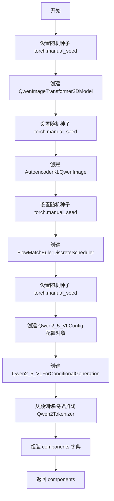

#### 带注释源码

```python
def get_dummy_components(self):
    # 定义用于加载分词器的预训练模型ID
    tiny_ckpt_id = "hf-internal-testing/tiny-random-Qwen2VLForConditionalGeneration"

    # 设置随机种子以确保可重复性
    torch.manual_seed(0)
    # 创建虚拟的 Transformer 模型，用于图像转换
    transformer = QwenImageTransformer2DModel(
        patch_size=2,              # 补丁大小
        in_channels=16,            # 输入通道数
        out_channels=4,            # 输出通道数
        num_layers=2,              # 层数
        attention_head_dim=16,     # 注意力头维度
        num_attention_heads=3,     # 注意力头数量
        joint_attention_dim=16,    # 联合注意力维度
        guidance_embeds=False,     # 是否使用引导嵌入
        axes_dims_rope=(8, 4, 4),  # RoPE 轴维度
    )

    # 重新设置随机种子
    torch.manual_seed(0)
    # 定义潜在变量维度
    z_dim = 4
    # 创建虚拟的 VAE 模型，用于图像编码/解码
    vae = AutoencoderKLQwenImage(
        base_dim=z_dim * 6,        # 基础维度
        z_dim=z_dim,               # 潜在变量维度
        dim_mult=[1, 2, 4],        # 维度倍数
        num_res_blocks=1,         # 残差块数量
        temperal_downsample=[False, True],  # 时间下采样
        latents_mean=[0.0] * z_dim,         # 潜在变量均值
        latents_std=[1.0] * z_dim,           # 潜在变量标准差
    )

    # 重新设置随机种子
    torch.manual_seed(0)
    # 创建虚拟的调度器，用于扩散过程
    scheduler = FlowMatchEulerDiscreteScheduler()

    # 重新设置随机种子
    torch.manual_seed(0)
    # 创建 Qwen2.5 VL 配置对象
    config = Qwen2_5_VLConfig(
        text_config={               # 文本配置
            "hidden_size": 16,
            "intermediate_size": 16,
            "num_hidden_layers": 2,
            "num_attention_heads": 2,
            "num_key_value_heads": 2,
            "rope_scaling": {
                "mrope_section": [1, 1, 2],
                "rope_type": "default",
                "type": "default",
            },
            "rope_theta": 1000000.0,
        },
        vision_config={             # 视觉配置
            "depth": 2,
            "hidden_size": 16,
            "intermediate_size": 16,
            "num_heads": 2,
            "out_hidden_size": 16,
        },
        hidden_size=16,
        vocab_size=152064,
        vision_end_token_id=151653,
        vision_start_token_id=151652,
        vision_token_id=151654,
    )
    # 创建虚拟的文本编码器模型
    text_encoder = Qwen2_5_VLForConditionalGeneration(config)
    # 从预训练模型加载分词器
    tokenizer = Qwen2Tokenizer.from_pretrained(tiny_ckpt_id)

    # 组装所有组件到字典中
    components = {
        "transformer": transformer,                    # 图像 Transformer 模型
        "vae": vae,                                     # VAE 变分自编码器
        "scheduler": scheduler,                         # 扩散调度器
        "text_encoder": text_encoder,                  # 文本编码器
        "tokenizer": tokenizer,                         # 分词器
        "processor": Qwen2VLProcessor.from_pretrained(tiny_ckpt_id),  # 视觉语言处理器
    }
    return components
```


### `QwenImageEditPlusPipelineFastTests.get_dummy_inputs`

该方法用于生成测试专用的虚拟输入参数，模拟图像编辑pipeline所需的prompt、图像、生成器等配置数据，以便在单元测试中执行推理流程。

参数：

- `self`：隐式参数，`QwenImageEditPlusPipelineFastTests` 类实例，表示当前测试类对象
- `device`：`str`，目标计算设备标识符，用于指定在 CPU、CUDA 或 MPS 上创建随机生成器
- `seed`：`int`，默认值 0，用于设置随机数生成器的种子，确保测试结果可复现

返回值：`dict`，包含以下键值对的字典对象：
- `prompt`：`str`，输入文本提示 "dance monkey"
- `image`：`list[PIL.Image.Image]`，包含两个 32x32 RGB 虚拟图像的列表
- `negative_prompt`：`str`，负面提示 "bad quality"
- `generator`：`torch.Generator`，PyTorch 随机生成器对象
- `num_inference_steps`：`int`，推理步数 2
- `true_cfg_scale`：`float`，无分类器引导比例 1.0
- `height`：`int`，输出图像高度 32
- `width`：`int`，输出图像宽度 32
- `max_sequence_length`：`int`，最大序列长度 16
- `output_type`：`str`，输出类型 "pt"（PyTorch 张量）

#### 流程图

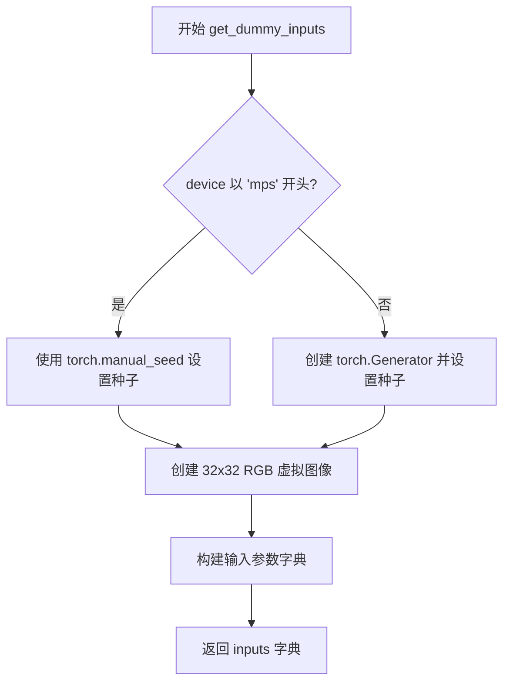

#### 带注释源码

```python
def get_dummy_inputs(self, device, seed=0):
    """
    生成用于测试的虚拟输入参数。
    
    参数:
        device (str): 目标设备标识符（如 "cpu", "cuda", "mps"）
        seed (int): 随机种子，默认值为 0
    
    返回:
        dict: 包含 pipeline 推理所需参数的字典
    """
    # 针对 Apple Silicon 设备（MPS）使用不同的随机种子设置方式
    if str(device).startswith("mps"):
        # MPS 设备不支持 torch.Generator，使用 torch.manual_seed 直接设置
        generator = torch.manual_seed(seed)
    else:
        # 为其他设备（CPU/CUDA）创建带种子的生成器对象
        generator = torch.Generator(device=device).manual_seed(seed)

    # 创建一个 32x32 像素的 RGB 虚拟图像
    image = Image.new("RGB", (32, 32))
    
    # 构建完整的输入参数字典，包含文本、图像、生成器及各种配置
    inputs = {
        "prompt": "dance monkey",           # 文本提示词
        "image": [image, image],            # 输入图像列表（两个相同图像）
        "negative_prompt": "bad quality",   # 负面提示词
        "generator": generator,             # 随机生成器确保可复现性
        "num_inference_steps": 2,           # 扩散模型推理步数
        "true_cfg_scale": 1.0,              # TrueCFG 引导比例
        "height": 32,                       # 输出图像高度
        "width": 32,                        # 输出图像宽度
        "max_sequence_length": 16,          # 文本序列最大长度
        "output_type": "pt",                # 输出格式为 PyTorch 张量
    }

    return inputs
```


### `QwenImageEditPlusPipelineFastTests.test_inference`

该测试方法用于验证 QwenImageEditPlusPipeline 推理流程的正确性，通过创建虚拟组件和输入，执行图像生成推理，并验证输出图像的形状和像素值是否符合预期。

参数：

- `self`：隐含参数，unittest.TestCase 实例本身

返回值：无返回值（void），该方法为单元测试，通过断言验证推理结果

#### 流程图

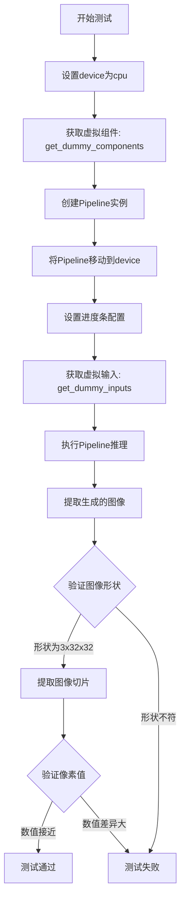

#### 带注释源码

```python
def test_inference(self):
    """测试QwenImageEditPlusPipeline的推理功能"""
    # 设置测试设备为CPU
    device = "cpu"

    # 获取虚拟组件（transformer, vae, scheduler, text_encoder, tokenizer, processor）
    components = self.get_dummy_components()
    # 使用虚拟组件实例化Pipeline
    pipe = self.pipeline_class(**components)
    # 将Pipeline移动到指定设备
    pipe.to(device)
    # 配置进度条（disable=None表示启用进度条）
    pipe.set_progress_bar_config(disable=None)

    # 获取虚拟输入（包含prompt, image, negative_prompt, generator等）
    inputs = self.get_dummy_inputs(device)
    # 执行推理并获取结果
    image = pipe(**inputs).images
    # 提取第一张生成的图像
    generated_image = image[0]
    # 断言：验证生成的图像形状为(3, 32, 32) - 3通道，32x32分辨率
    self.assertEqual(generated_image.shape, (3, 32, 32))

    # 定义预期的像素值切片（用于验证推理准确性）
    # fmt: off
    expected_slice = torch.tensor([[0.5637, 0.6341, 0.6001, 0.5620, 0.5794, 0.5498, 0.5757, 0.6389, 0.4174, 0.3597, 0.5649, 0.4894, 0.4969, 0.5255, 0.4083, 0.4986]])
    # fmt: on

    # 将生成的图像展平，并提取前8个和后8个元素组成16元素的切片
    generated_slice = generated_image.flatten()
    generated_slice = torch.cat([generated_slice[:8], generated_slice[-8:]])
    # 断言：验证生成的像素值与预期值相近（允许1e-3的误差）
    self.assertTrue(torch.allclose(generated_slice, expected_slice, atol=1e-3))
```


### `QwenImageEditPlusPipelineFastTests.test_attention_slicing_forward_pass`

该测试方法用于验证 QwenImageEditPlusPipeline 在启用注意力切片（attention slicing）功能前后的推理结果一致性，确保注意力切片优化不会影响输出质量。

参数：

- `test_max_difference`：`bool`，默认为 `True`，控制是否测试最大差异
- `test_mean_pixel_difference`：`bool`，默认为 `True`，控制是否测试平均像素差异
- `expected_max_diff`：`float`，默认为 `1e-3`，预期的最大差异阈值

返回值：`None`，该方法为测试方法，通过 `self.assertLess` 断言验证注意力切片不会影响推理结果

#### 流程图

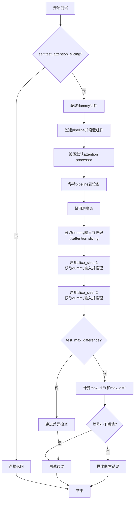

#### 带注释源码

```python
def test_attention_slicing_forward_pass(
    self, test_max_difference=True, test_mean_pixel_difference=True, expected_max_diff=1e-3
):
    """
    测试注意力切片功能的前向传播是否正确。
    
    参数:
        test_max_difference: 是否测试最大差异
        test_mean_pixel_difference: 是否测试平均像素差异（当前未使用）
        expected_max_diff: 允许的最大差异阈值
    """
    # 检查测试是否被禁用（类属性控制）
    if not self.test_attention_slicing:
        return

    # 获取用于测试的虚拟组件（transformer, vae, scheduler, text_encoder, tokenizer等）
    components = self.get_dummy_components()
    
    # 使用组件初始化pipeline
    pipe = self.pipeline_class(**components)
    
    # 为所有支持该方法的组件设置默认的attention processor
    for component in pipe.components.values():
        if hasattr(component, "set_default_attn_processor"):
            component.set_default_attn_processor()
    
    # 将pipeline移动到测试设备（CPU或GPU）
    pipe.to(torch_device)
    
    # 配置进度条（disable=None表示启用进度条）
    pipe.set_progress_bar_config(disable=None)

    # 获取设备并准备dummy输入
    generator_device = "cpu"
    inputs = self.get_dummy_inputs(generator_device)
    
    # 执行第一次推理：不启用attention slicing
    # output_without_slicing 保存基准输出
    output_without_slicing = pipe(**inputs)[0]

    # 启用attention slicing，slice_size=1（最小切片）
    pipe.enable_attention_slicing(slice_size=1)
    inputs = self.get_dummy_inputs(generator_device)
    # 执行第二次推理：使用slice_size=1
    output_with_slicing1 = pipe(**inputs)[0]

    # 启用attention slicing，slice_size=2（较大切片）
    pipe.enable_attention_slicing(slice_size=2)
    inputs = self.get_dummy_inputs(generator_device)
    # 执行第三次推理：使用slice_size=2
    output_with_slicing2 = pipe(**inputs)[0]

    # 如果需要测试最大差异
    if test_max_difference:
        # 将输出转换为numpy数组并计算差异
        max_diff1 = np.abs(to_np(output_with_slicing1) - to_np(output_without_slicing)).max()
        max_diff2 = np.abs(to_np(output_with_slicing2) - to_np(output_without_slicing)).max()
        
        # 断言：注意力切片不应该影响推理结果
        self.assertLess(
            max(max_diff1, max_diff2),
            expected_max_diff,
            "Attention slicing should not affect the inference results"
        )
```


### `QwenImageEditPlusPipelineFastTests.test_vae_tiling`

该方法是一个测试函数，用于验证VAE（变分自编码器）的tiling（分块）功能是否正常工作。测试通过比较启用tiling前后的输出差异，确保差异在可接受范围内（默认最大差异为0.2），以确认VAE tiling不会影响推理结果的正确性。

参数：

- `expected_diff_max`：`float`，可选参数，期望的最大差异值，默认为0.2，用于验证启用tiling前后的输出差异是否在可接受范围内

返回值：`None`，该测试方法无返回值，通过`assertLess`断言验证结果

#### 流程图

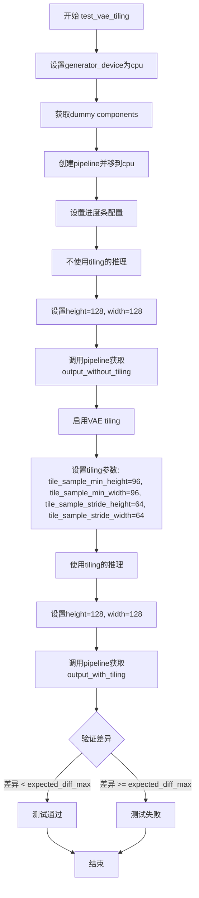

#### 带注释源码

```python
def test_vae_tiling(self, expected_diff_max: float = 0.2):
    """
    测试VAE tiling功能。
    
    该测试方法验证启用VAE tiling后，推理结果的差异在可接受范围内。
    VAE tiling是一种将大图像分割成小块进行处理的技术，可以减少内存占用。
    
    参数:
        expected_diff_max: float, 期望的最大差异值，默认为0.2
        
    返回:
        None: 测试方法无返回值，通过断言验证结果
    """
    # 设置生成器设备为CPU
    generator_device = "cpu"
    # 获取用于测试的虚拟组件
    components = self.get_dummy_components()

    # 使用组件创建pipeline实例
    pipe = self.pipeline_class(**components)
    # 将pipeline移到CPU设备
    pipe.to("cpu")
    # 设置进度条配置，disable=None表示不禁用进度条
    pipe.set_progress_bar_config(disable=None)

    # 第一部分：不使用tiling的推理
    # 获取dummy输入
    inputs = self.get_dummy_inputs(generator_device)
    # 设置图像高度和宽度为128
    inputs["height"] = inputs["width"] = 128
    # 执行推理并获取无tiling的输出
    output_without_tiling = pipe(**inputs)[0]

    # 第二部分：启用VAE tiling
    # 启用tiling并设置分块参数
    pipe.vae.enable_tiling(
        tile_sample_min_height=96,     # 分块最小高度
        tile_sample_min_width=96,     # 分块最小宽度
        tile_sample_stride_height=64, # 垂直方向步长
        tile_sample_stride_width=64,  # 水平方向步长
    )
    # 重新获取dummy输入
    inputs = self.get_dummy_inputs(generator_device)
    # 设置相同的图像尺寸
    inputs["height"] = inputs["width"] = 128
    # 执行推理并获取有tiling的输出
    output_with_tiling = pipe(**inputs)[0]

    # 验证：确保tiling前后的差异在可接受范围内
    # 将输出转换为numpy数组进行比较
    self.assertLess(
        (to_np(output_without_tiling) - to_np(output_with_tiling)).max(),
        expected_diff_max,
        "VAE tiling should not affect the inference results",
    )
```


### `QwenImageEditPlusPipelineFastTests.test_encode_prompt_works_in_isolation`

该测试方法用于验证提示词编码功能是否能够独立正常工作。它是继承自 `PipelineTesterMixin` 的测试用例，通过调用父类的同名方法来实现。当前该测试被标记为预期失败（xfail），原因是预配置的嵌入（preconfigured embeddings）需要重新审视。

参数：

- `self`：`QwenImageEditPlusPipelineFastTests`，测试类实例本身
- `extra_required_param_value_dict`：`Optional[dict]`，可选字典参数，用于传递额外的必需参数值，默认值为 `None`
- `atol`：`float`，绝对容差（absolute tolerance），用于浮点数比较的绝对误差阈值，默认值为 `1e-4`
- `rtol`：`float`，相对容差（relative tolerance），用于浮点数比较的相对误差阈值，默认值为 `1e-4`

返回值：`None`，该方法没有返回值（void），仅执行父类的测试逻辑

#### 流程图

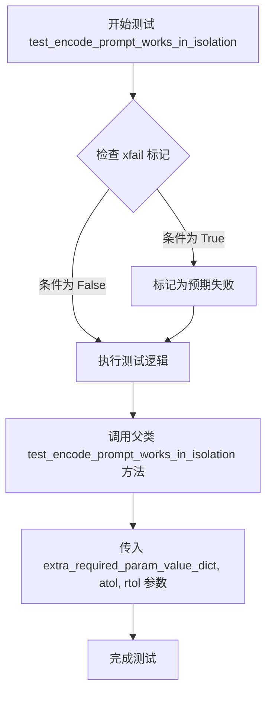

#### 带注释源码

```python
@pytest.mark.xfail(condition=True, reason="Preconfigured embeddings need to be revisited.", strict=True)
def test_encode_prompt_works_in_isolation(self, extra_required_param_value_dict=None, atol=1e-4, rtol=1e-4):
    """
    测试提示词编码是否能够独立正常工作。
    
    该测试方法继承自 PipelineTesterMixin，用于验证管道中的提示词编码功能
    在隔离环境下是否正确。当前标记为 xfail，因为预配置的嵌入需要重新审视。
    
    参数:
        extra_required_param_value_dict: 可选的字典参数，用于传递额外的必需参数值
        atol: 绝对容差，用于浮点数比较的绝对误差阈值，默认 1e-4
        rtol: 相对容差，用于浮点数比较的相对误差阈值，默认 1e-4
    
    返回:
        None: 该方法不返回任何值，仅执行测试逻辑
    """
    # 调用父类 (PipelineTesterMixin) 的同名测试方法
    # 传递所有接收到的参数
    super().test_encode_prompt_works_in_isolation(extra_required_param_value_dict, atol, rtol)
```


### `QwenImageEditPlusPipelineFastTests.test_num_images_per_prompt`

该测试方法用于验证管道在给定单个提示词时生成多个图像的能力。由于当前实现中批量处理多张图像的功能需要重新审视，该测试被标记为预期失败。

参数：无（该方法继承自 `PipelineTesterMixin` 父类，参数由父类定义）

返回值：`None`，测试方法不返回值

#### 流程图

```mermaid
flowchart TD
    A[开始测试 test_num_images_per_prompt] --> B{检查测试条件}
    B -->|条件满足| C[调用 super().test_num_images_per_prompt]
    C --> D[执行父类测试逻辑]
    D --> E{测试结果}
    E -->|通过| F[测试通过]
    E -->|失败| G[由于 strict=True, 测试标记为 xfail 并失败]
    
    style C fill:#f9f,stroke:#333
    style G fill:#ff9,stroke:#333
```

#### 带注释源码

```python
@pytest.mark.xfail(condition=True, reason="Batch of multiple images needs to be revisited", strict=True)
def test_num_images_per_prompt():
    """
    测试方法：test_num_images_per_prompt
    
    功能：验证管道能够根据单个提示词生成多个图像（num_images_per_prompt > 1）
    
    装饰器说明：
    - @pytest.mark.xfail: 标记该测试为预期失败
    - condition=True: 条件为真，即该测试预期会失败
    - reason: 说明失败原因（批量多图像功能需要重新审视）
    - strict=True: 如果测试意外通过，会导致测试失败；如果测试按预期失败，测试套件报告为xfail
    """
    super().test_num_images_per_prompt()
    """
    调用父类 PipelineTesterMixin 的 test_num_images_per_prompt 方法
    父类方法的具体实现需要查看 PipelineTesterMixin 类的定义
    通常会测试以下场景：
    1. 设置 num_images_per_prompt > 1
    2. 执行管道推理
    3. 验证返回的图像数量等于 num_images_per_prompt
    4. 验证每个图像的质量和一致性
    """
```


### `QwenImageEditPlusPipelineFastTests.test_inference_batch_consistent`

这是一个测试方法，用于验证管道在批处理推理时的一致性（即使用单个提示词生成多张图片时，结果应该一致）。该方法目前被标记为预期失败（xfail），因为批处理多张图片的功能需要重新审视和修复。

参数：

- `self`：`QwenImageEditPlusPipelineFastTests`，测试类实例本身，包含测试所需的组件和配置

返回值：`Any`，返回父类 `test_inference_batch_consistent()` 方法的执行结果，通常为 `None`（unittest 的 `TestCase` 方法通常不返回值）

#### 流程图

```mermaid
flowchart TD
    A[开始执行 test_inference_batch_consistent] --> B{检查 xfail 标记}
    B -->|是| C[标记为预期失败]
    C --> D[调用父类方法: super().test_inference_batch_consistent]
    D --> E[接收测试结果]
    E --> F[测试结束 - 可能通过或失败]
    
    style C fill:#ffcccc
    style F fill:#ffffcc
```

#### 带注释源码

```python
@pytest.mark.xfail(condition=True, reason="Batch of multiple images needs to be revisited", strict=True)
def test_inference_batch_consistent(self):
    """
    测试方法：验证批处理推理的一致性
    
    用途：
    - 验证当使用相同的提示词和种子生成多张图片时，
      多次调用管道的输出应该保持一致
    - 这是确保扩散模型推理可重复性和稳定性的重要测试
    
    当前状态：
    - 被标记为 xfail（预期失败），因为批处理多张图片的功能
      需要重新审视和修复
    - strict=True 表示如果测试意外通过，会被视为测试失败
    
    参数：
    - self: QwenImageEditPlusPipelineFastTests 的实例
    
    返回值：
    - 继承自父类 PipelineTesterMixin 的 test_inference_batch_consistent 方法
    - 通常返回 None，由 unittest 框架处理测试结果
    """
    # 调用父类的同名方法执行实际的批处理一致性测试逻辑
    # 父类 PipelineTesterMixin 来自 ..test_pipelines_common
    super().test_inference_batch_consistent()
```


### `QwenImageEditPlusPipelineFastTests.test_inference_batch_single_identical`

这是一个测试方法，用于验证在使用批处理推理时，单个图像的输出结果与单独推理时的一致性。该测试当前被标记为预期失败（xfail），因为批处理多图像的功能需要重新审视和修复。

参数：无

返回值：`None`，测试方法的默认返回值，无显式返回值

#### 流程图

```mermaid
flowchart TD
    A[开始测试] --> B[检查xfail标记]
    B --> C[condition=true<br/>reason=Batch of multiple images<br/>needs to be revisited<br/>strict=true]
    C --> D[调用父类方法<br/>super().test_inference_batch_single_identical]
    D --> E[执行批处理一致性验证逻辑]
    E --> F[结束测试]
    
    style C fill:#ffcccc
    style E fill:#ffffcc
```

#### 带注释源码

```python
@pytest.mark.xfail(condition=True, reason="Batch of multiple images needs to be revisited", strict=True)
def test_inference_batch_single_identical():
    """
    测试批处理推理时单个图像的一致性。
    
    该测试验证当使用批处理方式进行推理时，
    批处理中单个图像的输出结果应该与单独推理该图像时的结果完全一致。
    
    当前状态：
    - 被标记为 xfail（预期失败）
    - 原因：批处理多图像功能需要重新审视
    - strict=True 表示该测试必须保持失败状态，直到问题被修复
    """
    # 调用父类 PipelineTesterMixin 的同名测试方法
    # 父类方法包含实际的批处理一致性验证逻辑
    super().test_inference_batch_single_identical()
```

---

### 补充信息

#### 关键技术债务

1. **批处理功能未完成**：该测试方法被标记为 xfail，表明批处理多图像的功能尚未完全实现或存在问题
2. **测试覆盖不完整**：由于该测试失败，批处理相关的功能验证不完整

#### 潜在优化空间

1. 调查并修复批处理多图像的问题，使该测试能够通过
2. 检查父类 `PipelineTesterMixin` 中的 `test_inference_batch_single_identical` 方法实现，了解预期的验证逻辑
3. 考虑添加更多的边界情况测试，如不同批处理大小、不同的图像尺寸等

## 关键组件


### QwenImageEditPlusPipeline

核心图像编辑管道类，整合Transformer、VAE、调度器和文本编码器，实现基于文本提示的图像编辑功能。

### QwenImageTransformer2DModel

图像变换器模型，采用patch处理方式，支持多注意力头和联合注意力机制，用于图像特征提取和生成。

### AutoencoderKLQwenImage

Qwen专用变分自编码器，支持图像的latent编码与解码，具备VAE tiling分块功能以处理高分辨率图像。

### FlowMatchEulerDiscreteScheduler

基于欧拉离散方法的Flow Match调度器，控制图像生成的去噪过程和推理步骤。

### Qwen2_5_VLForConditionalGeneration

Qwen2.5视觉语言模型的文本编码器部分，负责将文本提示编码为模型可处理的embedding。

### Qwen2Tokenizer & Qwen2VLProcessor

文本分词器和多模态处理器，负责文本的tokenization以及图像与文本的预处理。

### VAE Tiling

VAE分块技术，通过tile_sample_min_height/width和stride参数实现高分辨率图像的分块处理，支持内存优化。

### 张量索引与惰性加载

通过get_dummy_components和get_dummy_inputs方法按需初始化测试组件，采用torch.manual_seed确保可复现性。

### 测试参数配置

包含batch_params、image_params、image_latents_params等参数集，定义管道支持的输入格式和推理选项。

### 调度器与推理配置

支持num_inference_steps、generator、true_cfg_scale等推理参数，配置式控制图像生成过程。


## 问题及建议


### 已知问题

-   **大量测试用例标记为 xfail**：4个关键测试（`test_encode_prompt_works_in_isolation`、`test_num_images_per_prompt`、`test_inference_batch_consistent`、`test_inference_batch_single_identical`）被标记为预期失败，表明批量图像处理和提示编码功能存在已知缺陷
-   **硬编码随机种子**：多处使用 `torch.manual_seed(0)`，导致测试结果确定性过强，缺乏对随机性的正确测试
-   **设备处理不一致**：`get_dummy_inputs` 方法对 MPS 设备有特殊处理（直接返回 `torch.manual_seed(seed)` 而不是 `Generator` 对象），但 `test_attention_slicing_forward_pass` 中使用全局 `torch_device` 而不是方法参数传入的 `device`
-   **重复代码**：创建 `inputs` 字典的逻辑在多个测试方法中重复出现，未进行封装复用
-   **缺失参数验证**：测试输入参数（如图像尺寸、batch size）没有进行边界值验证和合法性检查
-   **魔法数字**：图像尺寸（32、128）、阈值（1e-3、0.2）等数值直接硬编码，缺乏常量定义
-   **测试方法覆盖不均**：某些测试方法参数（如 `test_attention_slicing_forward_pass` 的参数）未被使用或未完整实现

### 优化建议

-   **修复 xfail 测试**：优先解决批量图像处理和提示编码隔离的已知问题，移除 xfail 标记
-   **统一随机种子管理**：使用测试框架的 fixture 或配置类管理随机种子，支持可配置的确定性/非确定性测试
-   **重构设备处理逻辑**：创建统一的设备辅助函数，处理 MPS、CPU、CUDA 等不同设备的兼容性
-   **提取公共方法**：将 `inputs` 字典创建逻辑提取为可配置的工具方法，支持参数化定制
-   **添加参数验证**：在测试方法入口处添加输入参数校验，提升测试失败时的错误可读性
-   **定义常量类**：创建测试常量类（如 `TestConstants`）集中管理魔法数字，提高代码可维护性
-   **完善测试方法签名**：清理未使用的参数，或实现其应有的测试逻辑

## 其它


### 设计目标与约束

本测试套件旨在验证QwenImageEditPlusPipeline的核心功能正确性，包括图像生成推理、注意力切片、VAE平铺等特性。测试设计遵循最小化依赖原则，使用dummy components避免外部模型依赖。测试必须在CPU设备上通过，支持MPS设备（通过torch.manual_seed保证可复现性）。关键约束包括：不支持xformers注意力、不支持DDUF（Data-Disturbance-Free Upsampling）、严格模式下的xfail测试用例表明存在已知功能缺陷。

### 错误处理与异常设计

测试类使用pytest的xfail装饰器标记预期失败场景：test_encode_prompt_works_in_isolation因预配置嵌入需要重新审视而标记为严格失败；test_num_images_per_prompt、test_inference_batch_consistent、test_inference_batch_single_identical因多图像批次处理需要重新审视而标记为严格失败。断言使用torch.allclose进行数值近似比较（atol=1e-3或1e-4），允许浮点误差。VAE平 tiling测试设置expected_diff_max=0.2的容差阈值。

### 数据流与状态机

测试流程遵循标准pipeline测试模式：get_dummy_components()创建所有必要组件（transformer、vae、scheduler、text_encoder、tokenizer、processor）→实例化pipeline并移动到设备→get_dummy_inputs()准备输入字典（含prompt、image、negative_prompt、generator等）→调用pipeline执行推理→验证输出图像shape和数值slice。Attention slicing测试展示两种状态切换：默认状态→启用slice_size=1→启用slice_size=2。VAE tiling测试展示两种状态切换：无tiling→启用tiling。

### 外部依赖与接口契约

核心依赖包括：transformers库（Qwen2_5_VLConfig、Qwen2_5_VLForConditionalGeneration、Qwen2Tokenizer、Qwen2VLProcessor）、diffusers库（AutoencoderKLQwenImage、FlowMatchEulerDiscreteScheduler、QwenImageEditPlusPipeline、QwenImageTransformer2DModel）、PIL（Image）、numpy、pytest、torch。pipeline_class必须实现__call__方法返回包含images属性的对象。components字典必须包含transformer、vae、scheduler、text_encoder、tokenizer、processor六个键。输入参数遵循TEXT_TO_IMAGE_PARAMS减去cross_attention_kwargs的定义。

### 性能考虑

测试设计考虑了内存和计算效率：使用tiny-random-Qwen2VLForConditionalGeneration模型进行快速测试；图像尺寸限制为32x32（推理测试）和128x128（VAE tiling测试）；推理步数仅需2步；enable_full_determinism()确保测试可复现。attention slicing和VAE tiling测试验证优化功能对结果精度的影响在可接受范围内。

### 安全考虑

测试代码无直接安全风险，因其仅使用dummy组件和本地资源。pipeline调用时generator参数允许用户控制随机性，确保可复现性。negative_prompt参数支持用户过滤不想要的内容。

### 测试策略

采用多层测试覆盖：基础推理测试（test_inference）验证核心生成功能；优化功能测试（test_attention_slicing_forward_pass、test_vae_tiling）验证性能优化不影响精度；已知问题标记（xfail测试）追踪功能缺陷。batch_params和image_params定义支持多提示词和多图像输入测试场景。test_layerwise_casting和test_group_offloading测试验证混合精度和模型卸载兼容性。

    