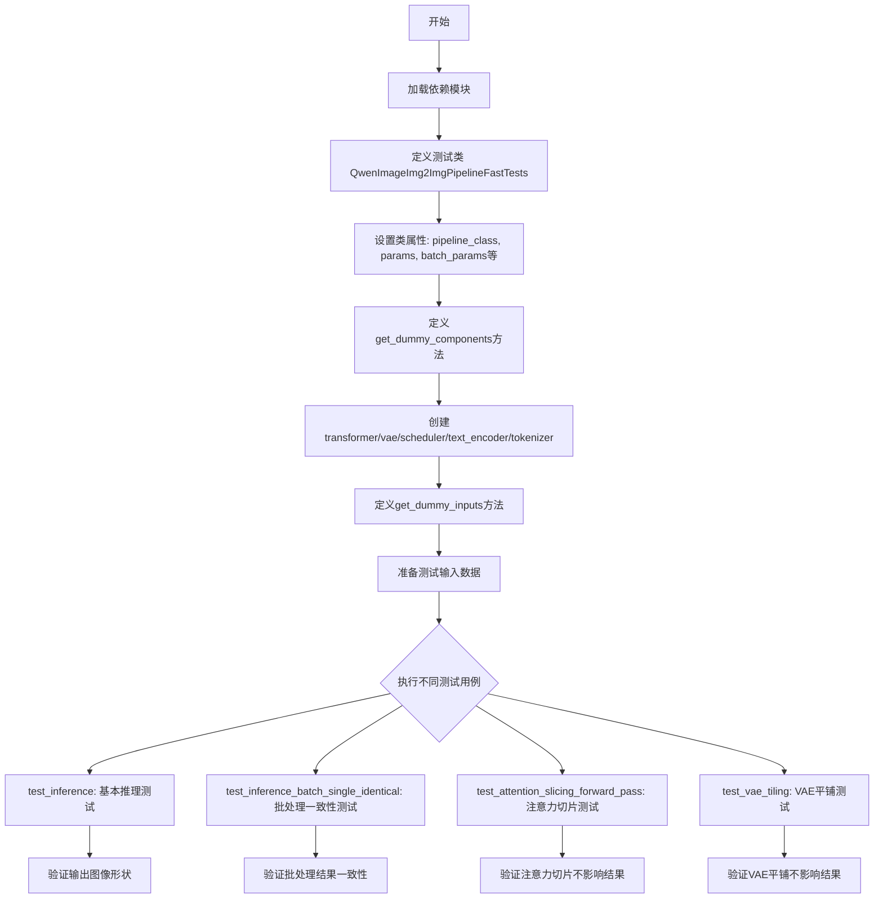
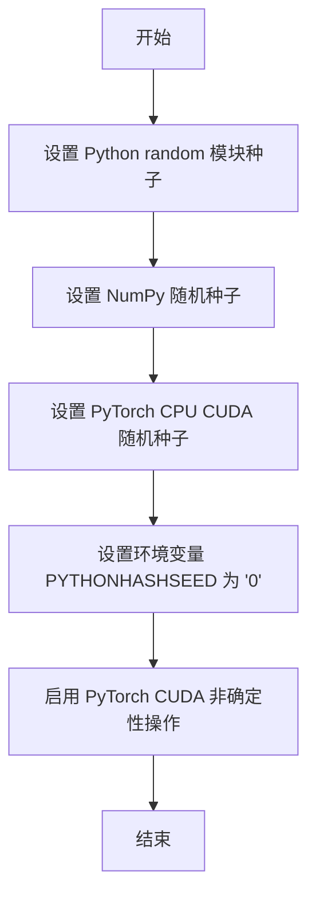
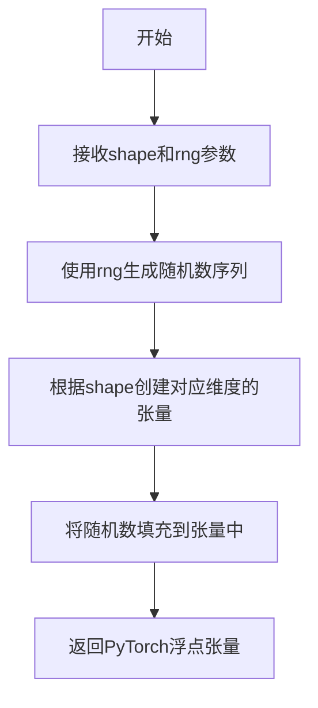
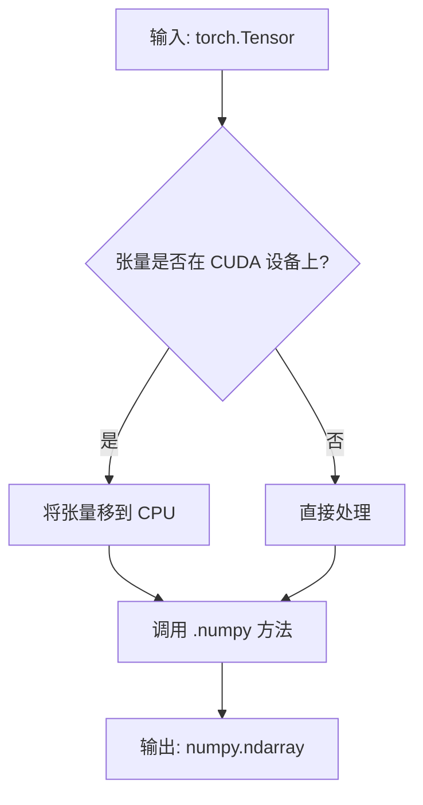
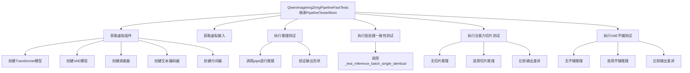
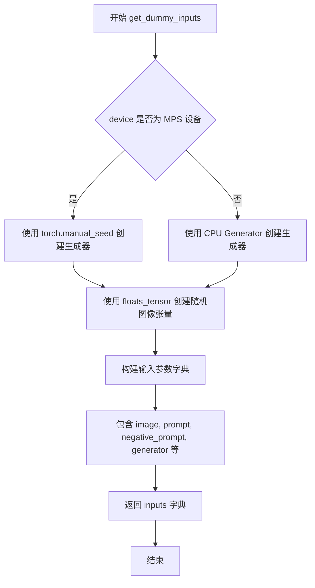
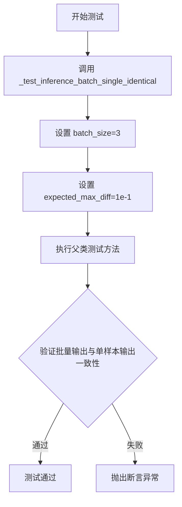
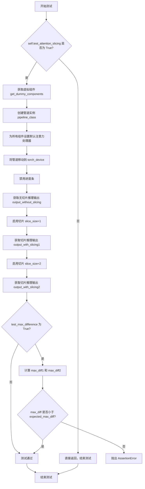
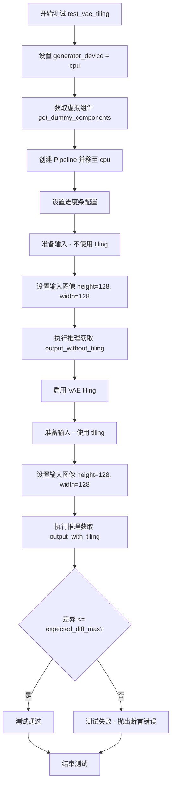

# `diffusers\tests\pipelines\qwenimage\test_qwenimage_img2img.py` 详细设计文档

这是一个针对Qwen2.5-VL图像到图像生成管道的单元测试文件，包含了多个测试用例用于验证管道功能，包括推理测试、批处理一致性、注意力切片和VAE平铺等功能。

## 整体流程



## 类结构

```
unittest.TestCase
└── PipelineTesterMixin (混合类)
    └── QwenImageImg2ImgPipelineFastTests
```

## 全局变量及字段


### `QwenImageImg2ImgPipelineFastTests.pipeline_class`
    
被测试的管道类，指向QwenImageImg2ImgPipeline

类型：`type`
    


### `QwenImageImg2ImgPipelineFastTests.params`
    
管道推理所需参数的集合，包括prompt、image、height、width等

类型：`frozenset`
    


### `QwenImageImg2ImgPipelineFastTests.batch_params`
    
支持批处理的参数集合，包括prompt和image

类型：`frozenset`
    


### `QwenImageImg2ImgPipelineFastTests.image_params`
    
图像相关的参数集合，仅包含image

类型：`frozenset`
    


### `QwenImageImg2ImgPipelineFastTests.image_latents_params`
    
图像潜在变量参数集合，仅包含latents

类型：`frozenset`
    


### `QwenImageImg2ImgPipelineFastTests.required_optional_params`
    
必需的可选参数集合，包括推理步数、生成器、latents等

类型：`frozenset`
    


### `QwenImageImg2ImgPipelineFastTests.supports_dduf`
    
标志位，表示该管道是否支持DDUF（Decoupled Diffusion Upsampling Feature）

类型：`bool`
    


### `QwenImageImg2ImgPipelineFastTests.test_xformers_attention`
    
标志位，表示是否测试xformers优化的注意力机制

类型：`bool`
    


### `QwenImageImg2ImgPipelineFastTests.test_attention_slicing`
    
标志位，表示是否测试注意力切片功能以降低显存占用

类型：`bool`
    


### `QwenImageImg2ImgPipelineFastTests.test_layerwise_casting`
    
标志位，表示是否测试分层类型转换功能

类型：`bool`
    


### `QwenImageImg2ImgPipelineFastTests.test_group_offloading`
    
标志位，表示是否测试模型组卸载功能

类型：`bool`
    
    

## 全局函数及方法


### `enable_full_determinism`

该函数用于设置随机种子和环境变量，确保深度学习模型在不同运行环境下产生完全一致的确定性结果，常用于测试用例中以保证测试的可复现性。

参数：无

返回值：无

#### 流程图



#### 带注释源码

```
# 注意：此函数源码基于代码导入路径 ...testing_utils 推断
# 实际定义不在当前代码文件中

def enable_full_determinism(seed: int = 0, deterministic_algorithms: bool = True):
    """
    启用完全确定性运行模式，确保测试结果可复现。
    
    参数：
        seed: int, 随机种子值，默认为 0
        deterministic_algorithms: bool, 是否启用确定性算法，默认为 True
    
    返回值：
        无返回值
    """
    # 设置 Python 内置 random 模块的随机种子
    random.seed(seed)
    
    # 设置 NumPy 的随机种子
    np.random.seed(seed)
    
    # 设置 PyTorch 的随机种子（CPU 和 CUDA）
    torch.manual_seed(seed)
    torch.cuda.manual_seed_all(seed)
    
    # 设置环境变量使 Python 哈希随机化失效
    import os
    os.environ["PYTHONHASHSEED"] = str(seed)
    
    # 禁用 PyTorch 的非确定性操作以确保结果可复现
    if deterministic_algorithms:
        torch.backends.cudnn.deterministic = True
        torch.backends.cudnn.benchmark = False
        torch.use_deterministic_algorithms(True)
    
    # 设置 PyTorch CUDA 卷积运算的确定性
    torch.backends.cuda.matmul.allow_tf32 = False
```

> **注**：由于 `enable_full_determinism` 函数定义在 `...testing_utils` 模块中，而非当前代码文件内，上述源码为基于函数调用方式和常见实现模式的合理推断。实际实现可能略有差异。


### `floats_tensor`

该函数用于生成指定形状的随机浮点数张量，主要用于测试场景中生成模拟输入数据。

参数：

-  `shape`：`tuple`，张量的形状，例如 (1, 3, 32, 32) 表示批量大小为1、3通道、32x32分辨率的图像张量
-  `rng`：`random.Random`，可选参数，用于生成随机数的随机数生成器实例

返回值：`torch.Tensor`，返回指定形状的 PyTorch 浮点数张量

#### 流程图



#### 带注释源码

```
# 该函数定义位于 from ...testing_utils 导入的 testing_utils 模块中
# 本代码文件中仅展示其使用方式，实际实现需参考 testing_utils 模块

# 在 QwenImageImg2ImgPipelineFastTests.get_dummy_inputs 方法中的使用示例：
image = floats_tensor((1, 3, 32, 32), rng=random.Random(seed)).to(device)

# 参数说明：
# - (1, 3, 32, 32): 张量形状，代表 [batch_size, channels, height, width]
# - rng=random.Random(seed): 使用固定种子确保测试可复现
# - .to(device): 将生成的张量移动到指定设备（CPU/GPU）
```

#### 补充说明

**设计目标与约束：**

- 目的：为单元测试生成确定性的随机浮点张量，确保测试结果可复现
- 约束：依赖于传入的 RNG 实例来控制随机性，便于测试用例的确定性执行

**使用场景：**

在 `QwenImageImg2ImgPipelineFastTests.get_dummy_inputs` 方法中，该函数用于生成测试用的虚拟图像输入：
- 形状 (1, 3, 32, 32) 代表单张 32x32 分辨率的 RGB 图像
- 结合固定种子 (seed=0) 确保多次运行产生相同的测试数据

**注意：** 该函数的实际实现代码不在当前文件内，需查看 `...testing_utils` 模块中的定义。


### `to_np`

将 PyTorch 张量（Tensor）转换为 NumPy 数组的辅助函数，用于在测试中比较模型输出的数值差异。

参数：

-  `tensor`：`torch.Tensor`，待转换的 PyTorch 张量对象，通常是模型推理返回的图像张量

返回值：`numpy.ndarray`，转换后的 NumPy 数组，可直接用于 NumPy 的数学运算（如 `np.abs()`、`.max()` 等）

#### 流程图



#### 带注释源码

```python
# 该函数定义在 src/diffusers/testing_utils/to_np.py 或类似位置
# 本文件中通过以下方式导入:
# from ..test_pipelines_common import PipelineTesterMixin, to_np

def to_np(tensor):
    """
    将 PyTorch 张量转换为 NumPy 数组。
    
    参数:
        tensor (torch.Tensor): 输入的 PyTorch 张量
        
    返回值:
        numpy.ndarray: 转换后的 NumPy 数组
    """
    # 如果张量在 GPU 上，先移动到 CPU
    if tensor.is_cuda:
        tensor = tensor.cpu()
    
    # 转换为 NumPy 数组并返回
    return tensor.numpy()

# 使用示例 (来自代码中的实际调用):
# max_diff1 = np.abs(to_np(output_with_slicing1) - to_np(output_without_slicing)).max()
```


由于 `PipelineTesterMixin` 是从外部模块 `..test_pipelines_common` 导入的 mixin 类，在当前代码文件中仅被引用而未定义，我需要基于代码中使用该类的方式和测试框架的标准模式来推断其接口。

### PipelineTesterMixin

`PipelineTesterMixin` 是一个测试辅助类（Mixin），通过多重继承为图像生成管道测试提供通用的测试方法和断言工具。它定义了针对扩散模型管道的标准测试接口，包括批处理一致性推理、注意力切片、VAE 平铺等功能的测试验证。

参数：

-  无直接参数（通过 self 访问）

返回值：

-  无直接返回值（通过 unittest 断言进行验证）

#### 流程图



#### 带注释源码

```python
# PipelineTesterMixin 的推断结构（基于代码使用方式）
class PipelineTesterMixin:
    """
    管道测试混入类，提供扩散模型管道的标准测试方法。
    该类本身不继承 unittest.TestCase，而是提供可复用的测试逻辑，
    供具体的测试类通过多重继承使用。
    """
    
    # 类属性：定义需要测试的管道类
    pipeline_class = None  # 子类需覆盖
    
    # 测试参数集合
    params = frozenset([])           # 单样本参数
    batch_params = frozenset([])     # 批处理参数
    image_params = frozenset([])     # 图像参数
    image_latents_params = frozenset([])  # 图像潜在向量参数
    required_optional_params = frozenset([])  # 必需的可选参数
    
    # 测试特性标志
    supports_dduf = False             # 是否支持 DDUF
    test_xformers_attention = False  # 是否测试 xformers 注意力
    test_attention_slicing = True     # 是否测试注意力切片
    test_layerwise_casting = True     # 是否测试分层类型转换
    test_group_offloading = True      # 是否测试组卸载
    
    def get_dummy_components(self):
        """
        创建用于测试的虚拟组件。
        
        Returns:
            dict: 包含模型组件的字典（transformer, vae, scheduler, text_encoder, tokenizer）
        """
        raise NotImplementedError("子类必须实现 get_dummy_components 方法")
    
    def get_dummy_inputs(self, device, seed=0):
        """
        创建用于测试的虚拟输入。
        
        Args:
            device: 计算设备
            seed: 随机种子
            
        Returns:
            dict: 包含输入参数的字典
        """
        raise NotImplementedError("子类必须实现 get_dummy_inputs 方法")
    
    def _test_inference_batch_single_identical(self, batch_size=2, expected_max_diff=1e-2):
        """
        测试批处理与单样本推理结果的一致性。
        
        Args:
            batch_size: 批处理大小
            expected_max_diff: 允许的最大差异
        """
        # 1. 获取组件并创建管道
        components = self.get_dummy_components()
        pipe = self.pipeline_class(**components)
        pipe.to(torch_device)
        
        # 2. 获取单样本输入并进行推理
        inputs = self.get_dummy_inputs(torch_device)
        output_single = pipe(**inputs)
        
        # 3. 构造批处理输入
        batch_inputs = inputs.copy()
        # 扩展 prompt 和 image 到批处理大小
        batch_inputs["prompt"] = [inputs["prompt"]] * batch_size
        batch_inputs["image"] = torch.cat([inputs["image"]] * batch_size, dim=0)
        
        # 4. 进行批处理推理
        output_batch = pipe(**batch_inputs)
        
        # 5. 验证批处理输出与单样本输出一致
        # 比较第一帧的输出差异应在允许范围内
        ...
    
    def test_attention_slicing_forward_pass(
        self, 
        test_max_difference=True, 
        test_mean_pixel_difference=True, 
        expected_max_diff=1e-3
    ):
        """
        测试注意力切片功能不影响推理结果。
        
        Args:
            test_max_difference: 是否测试最大差异
            test_mean_pixel_difference: 是否测试平均像素差异
            expected_max_diff: 允许的最大差异
        """
        # 1. 获取组件并创建管道
        components = self.get_dummy_components()
        pipe = self.pipeline_class(**components)
        
        # 2. 启用默认注意力处理器
        for component in pipe.components.values():
            if hasattr(component, "set_default_attn_processor"):
                component.set_default_attn_processor()
        
        # 3. 无切片推理
        inputs = self.get_dummy_inputs(generator_device)
        output_without_slicing = pipe(**inputs).images[0]
        
        # 4. 启用切片（slice_size=1）推理
        pipe.enable_attention_slicing(slice_size=1)
        inputs = self.get_dummy_inputs(generator_device)
        output_with_slicing1 = pipe(**inputs).images[0]
        
        # 5. 启用切片（slice_size=2）推理
        pipe.enable_attention_slicing(slice_size=2)
        inputs = self.get_dummy_inputs(generator_device)
        output_with_slicing2 = pipe(**inputs).images[0]
        
        # 6. 验证切片不影响结果
        max_diff1 = np.abs(to_np(output_with_slicing1) - to_np(output_without_slicing)).max()
        max_diff2 = np.abs(to_np(output_with_slicing2) - to_np(output_without_slicing)).max()
        assert max(max_diff1, max_diff2) < expected_max_diff
    
    def test_vae_tiling(self, expected_diff_max: float = 0.2):
        """
        测试 VAE 平铺功能不影响推理结果。
        
        Args:
            expected_diff_max: 允许的最大差异
        """
        # 1. 创建管道
        components = self.get_dummy_components()
        pipe = self.pipeline_class(**components)
        
        # 2. 无平铺推理（大分辨率）
        inputs = self.get_dummy_inputs(generator_device)
        inputs["height"] = inputs["width"] = 128
        output_without_tiling = pipe(**inputs)[0]
        
        # 3. 启用平铺推理
        pipe.vae.enable_tiling(
            tile_sample_min_height=96,
            tile_sample_min_width=96,
            tile_sample_stride_height=64,
            tile_sample_stride_width=64,
        )
        output_with_tiling = pipe(**inputs)[0]
        
        # 4. 验证平铺不影响结果
        diff = (to_np(output_without_tiling) - to_np(output_with_tiling)).max()
        assert diff < expected_diff_max
```

#### 关键信息说明

1. **继承来源**：`PipelineTesterMixin` 定义在 `diffusers.testing` 模块的 `test_pipelines_common` 子模块中，是 diffusers 库提供的标准测试基础设施。

2. **设计模式**：采用 Mixin 模式，通过多重继承将测试逻辑注入到具体的测试类中，实现测试代码的复用。

3. **测试覆盖**：该 mixin 类提供了针对扩散管道的基本测试框架，包括：
   - 推理一致性测试
   - 批处理与单样本一致性测试
   - 注意力切片兼容性测试
   - VAE 平铺兼容性测试
   - 其他可选的高级特性测试


### `QwenImageImg2ImgPipelineFastTests.get_dummy_components`

该方法用于创建并返回图像到图像（Img2Img）扩散管道所需的所有虚拟（dummy）组件，包括Transformer模型、VAE编码器、调度器、文本编码器和分词器，以便在单元测试中进行快速推理测试。

参数：该方法无参数（仅包含隐式参数 `self`）

返回值：`Dict[str, object]`，返回包含虚拟组件的字典，键名为 `"transformer"`、`"vae"`、`"scheduler"`、`"text_encoder"`、`"tokenizer"`，分别对应不同组件实例。

#### 流程图

```mermaid
flowchart TD
    A[开始 get_dummy_components] --> B[设置随机种子 torch.manual_seed(0)]
    B --> C[创建 QwenImageTransformer2DModel 虚拟实例]
    C --> D[设置随机种子 torch.manual_seed(0)]
    D --> E[创建 AutoencoderKLQwenImage 虚拟实例 VAE]
    E --> F[设置随机种子 torch.manual_seed(0)]
    F --> G[创建 FlowMatchEulerDiscreteScheduler 调度器]
    G --> H[设置随机种子 torch.manual_seed(0)]
    H --> I[创建 Qwen2_5_VLConfig 配置对象]
    I --> J[基于配置创建 Qwen2_5_VLForConditionalGeneration 文本编码器]
    J --> K[从预训练模型加载 Qwen2Tokenizer 分词器]
    K --> L[构建并返回包含所有组件的字典]
```

#### 带注释源码

```python
def get_dummy_components(self):
    """
    创建并返回用于测试的虚拟组件字典。
    这些组件包括图像转换器、VAE、调度器、文本编码器和分词器。
    """
    # 设置随机种子确保可重复性
    torch.manual_seed(0)
    
    # 创建虚拟Transformer模型：图像到图像转换的核心组件
    transformer = QwenImageTransformer2DModel(
        patch_size=2,              # 图像分块大小
        in_channels=16,            # 输入通道数
        out_channels=4,            # 输出通道数
        num_layers=2,              # Transformer层数
        attention_head_dim=16,    # 注意力头维度
        num_attention_heads=3,    # 注意力头数量
        joint_attention_dim=16,   # 联合注意力维度
        guidance_embeds=False,    # 不使用引导嵌入
        axes_dims_rope=(8, 4, 4), # RoPE轴维度
    )

    # 重新设置随机种子以确保VAE的可重复性
    torch.manual_seed(0)
    z_dim = 4  # 潜在空间维度
    
    # 创建虚拟VAE（变分自编码器）：负责图像编码和解码
    vae = AutoencoderKLQwenImage(
        base_dim=z_dim * 6,        # 基础维度
        z_dim=z_dim,               # 潜在空间维度
        dim_mult=[1, 2, 4],       # 各层维度倍数
        num_res_blocks=1,         # 残差块数量
        temperal_downsample=[False, True],  # 时序下采样配置
        latents_mean=[0.0] * 4,   # 潜在向量均值
        latents_std=[1.0] * 4,    # 潜在向量标准差
    )

    # 创建虚拟调度器：控制扩散过程的噪声调度
    torch.manual_seed(0)
    scheduler = FlowMatchEulerDiscreteScheduler()

    # 创建虚拟文本编码器配置
    torch.manual_seed(0)
    config = Qwen2_5_VLConfig(
        text_config={              # 文本编码器配置
            "hidden_size": 16,     # 隐藏层大小
            "intermediate_size": 16,  # 中间层大小
            "num_hidden_layers": 2,   # 隐藏层数量
            "num_attention_heads": 2, # 注意力头数
            "num_key_value_heads": 2, # KV头数
            "rope_scaling": {      # RoPE缩放配置
                "mrope_section": [1, 1, 2],
                "rope_type": "default",
                "type": "default",
            },
            "rope_theta": 1000000.0,  # RoPE基础频率
        },
        vision_config={            # 视觉编码器配置
            "depth": 2,            # 深度
            "hidden_size": 16,     # 隐藏层大小
            "intermediate_size": 16,  # 中间层大小
            "num_heads": 2,        # 头数量
            "out_hidden_size": 16,    # 输出隐藏层大小
        },
        hidden_size=16,            # 主隐藏层大小
        vocab_size=152064,         # 词汇表大小
        vision_end_token_id=151653,  # 视觉结束token ID
        vision_start_token_id=151652, # 视觉开始token ID
        vision_token_id=151654,    # 视觉token ID
    )
    
    # 基于配置创建虚拟文本编码器模型
    text_encoder = Qwen2_5_VLForConditionalGeneration(config)
    
    # 从预训练模型加载虚拟分词器
    tokenizer = Qwen2Tokenizer.from_pretrained("hf-internal-testing/tiny-random-Qwen2VLForConditionalGeneration")

    # 返回包含所有虚拟组件的字典，供测试管道使用
    return {
        "transformer": transformer,   # 图像Transformer模型
        "vae": vae,                   # VAE编码器/解码器
        "scheduler": scheduler,      # 扩散调度器
        "text_encoder": text_encoder, # 文本编码器
        "tokenizer": tokenizer,       # 分词器
    }
```


### `QwenImageImg2ImgPipelineFastTests.get_dummy_inputs`

该方法为 QwenImageImg2ImgPipeline 图像生成管道测试生成虚拟（dummy）输入参数，用于单元测试中的推理验证。它创建一个包含图像、提示词、生成器、推理步数、引导比例等完整配置的字典，以支持管道的前向传递测试。

参数：

- `self`：隐式参数，`QwenImageImg2ImgPipelineFastTests` 类的实例方法
- `device`：`str`，目标设备字符串，用于指定张量存放的设备（如 "cpu", "cuda", "mps" 等）
- `seed`：`int`，随机数种子，默认为 0，用于确保测试的可重复性

返回值：`dict`，包含图像生成管道所需的所有输入参数字典

#### 流程图



#### 带注释源码

```python
def get_dummy_inputs(self, device, seed=0):
    # 创建一个形状为 (1, 3, 32, 32) 的随机浮点张量作为输入图像
    # 1 表示批量大小, 3 表示通道数(RGB), 32x32 表示图像分辨率
    image = floats_tensor((1, 3, 32, 32), rng=random.Random(seed)).to(device)
    
    # 根据设备类型选择不同的随机数生成器创建方式
    # MPS (Apple Silicon) 设备使用 torch.manual_seed
    # 其他设备使用 CPU 上的 Generator 对象
    if str(device).startswith("mps"):
        generator = torch.manual_seed(seed)
    else:
        generator = torch.Generator(device="cpu").manual_seed(seed)

    # 构建完整的测试输入参数字典
    inputs = {
        "image": image,                    # 输入图像张量 (1, 3, 32, 32)
        "prompt": "dance monkey",          # 正向提示词
        "negative_prompt": "bad quality",  # 负向提示词
        "generator": generator,            # 随机数生成器，确保可重复性
        "num_inference_steps": 2,          # 推理步数
        "guidance_scale": 3.0,             # Classifier-free guidance 引导比例
        "true_cfg_scale": 1.0,             # 真实_cfg 比例
        "height": 32,                      # 输出图像高度
        "width": 32,                       # 输出图像宽度
        "max_sequence_length": 16,         # 最大序列长度
        "output_type": "pt",               # 输出类型为 PyTorch 张量
    }

    return inputs
```


### `QwenImageImg2ImgPipelineFastTests.test_inference`

该测试方法用于验证 QwenImageImg2ImgPipeline 图像生成管道的基本推理功能，通过创建虚拟组件和输入，执行推理流程，并验证输出图像的形状是否符合预期 (3, 32, 32)。

参数：

- `self`：隐式参数，`QwenImageImg2ImgPipelineFastTests` 实例本身

返回值：`None`，该方法为测试方法，通过 `self.assertEqual` 断言验证结果，不返回任何值

#### 流程图

```mermaid
flowchart TD
    A[开始 test_inference] --> B[设置 device = 'cpu']
    B --> C[调用 get_dummy_components 获取虚拟组件]
    C --> D[使用虚拟组件实例化 pipeline_class]
    D --> E[将 pipeline 移动到 device]
    E --> F[设置进度条配置 disable=None]
    F --> G[调用 get_dummy_inputs 获取虚拟输入]
    G --> H[执行管道推理: pipe\*\*inputs]
    H --> I[获取生成的图像: image[0]]
    I --> J[断言图像形状为 (3, 32, 32)]
    J --> K[测试通过/失败]
```

#### 带注释源码

```
def test_inference(self):
    """测试 QwenImageImg2ImgPipeline 的基本推理功能"""
    
    # 步骤1: 设置测试设备为 CPU
    device = "cpu"

    # 步骤2: 获取虚拟组件 (transformer, vae, scheduler, text_encoder, tokenizer)
    # 这些组件使用随机种子 0 创建，用于确保测试可复现
    components = self.get_dummy_components()
    
    # 步骤3: 使用虚拟组件实例化管道类
    # pipeline_class 指向 QwenImageImg2ImgPipeline
    pipe = self.pipeline_class(**components)
    
    # 步骤4: 将管道移动到指定设备 (CPU)
    pipe.to(device)
    
    # 步骤5: 配置进度条 (disable=None 表示不禁用进度条)
    pipe.set_progress_bar_config(disable=None)

    # 步骤6: 准备虚拟输入数据
    # 包含: image, prompt, negative_prompt, generator, num_inference_steps 等
    inputs = self.get_dummy_inputs(device)
    
    # 步骤7: 执行管道推理
    # **inputs 将字典解包为关键字参数传递给管道
    # 返回 PipelineOutput 对象，包含生成的图像
    image = pipe(**inputs).images
    
    # 步骤8: 获取第一张生成的图像
    generated_image = image[0]
    
    # 步骤9: 断言验证
    # 验证生成的图像形状为 (3, 32, 32) - 3通道, 32x32分辨率
    self.assertEqual(generated_image.shape, (3, 32, 32))
```


### `QwenImageImg2ImgPipelineFastTests.test_inference_batch_single_identical`

该方法是一个单元测试用例，用于验证 QwenImageImg2ImgPipeline 在批量推理时，单个样本的输出与批量推理中对应位置的单个样本输出一致性（确保批处理逻辑不会引入误差）。

参数：

- `self`：实例方法，无需显式传递，隐式接收当前测试类实例

返回值：无返回值（`None`），该方法通过 `unittest.TestCase` 的断言机制验证结果

#### 流程图



#### 带注释源码

```python
def test_inference_batch_single_identical(self):
    """
    测试批量推理时单个样本的一致性。
    
    该测试方法继承自 PipelineTesterMixin，调用父类的
    _test_inference_batch_single_identical 方法来验证：
    1. 批量推理时，管道能够正确处理多个样本
    2. 批量推理中每个样本的输出与单独推理时该样本的输出一致
    
    参数:
        self: 测试类实例（隐式传入）
    
    返回值:
        None（通过断言验证，无显式返回值）
    
    内部逻辑:
        - batch_size=3: 测试3个样本的批量推理
        - expected_max_diff=1e-1: 允许的最大像素差异为0.1
    """
    # 调用父类 PipelineTesterMixin 的测试方法
    # 参数 batch_size=3 表示测试3个样本的批量推理
    # 参数 expected_max_diff=1e-1 表示期望的最大差异阈值为0.1
    self._test_inference_batch_single_identical(batch_size=3, expected_max_diff=1e-1)
```


### `QwenImageImg2ImgPipelineFastTests.test_attention_slicing_forward_pass`

该方法用于测试注意力切片（Attention Slicing）功能是否正常工作。通过对比启用和禁用注意力切片时的推理结果，验证启用切片后不会影响最终的图像生成质量，从而确保注意力切片优化在减少内存占用的同时保持输出的一致性。

参数：

- `test_max_difference`：`bool`，默认为 `True`，是否测试输出之间的最大像素差异
- `test_mean_pixel_difference`：`bool`，默认为 `True`，是否测试输出之间的平均像素差异
- `expected_max_diff`：`float`，默认为 `1e-3`，允许的最大差异阈值，超过该阈值则测试失败

返回值：`None`，该方法为测试方法，无返回值，通过 `assertLess` 断言验证结果

#### 流程图



#### 带注释源码

```python
def test_attention_slicing_forward_pass(
    self, test_max_difference=True, test_mean_pixel_difference=True, expected_max_diff=1e-3
):
    """
    测试注意力切片功能是否影响推理结果
    
    参数:
        test_max_difference: 是否测试最大差异
        test_mean_pixel_difference: 是否测试平均像素差异  
        expected_max_diff: 允许的最大差异阈值
    """
    
    # 如果测试未启用注意力切片测试，则直接返回
    if not self.test_attention_slicing:
        return

    # 第一步：获取虚拟组件（模型、VAE、调度器、文本编码器、分词器）
    components = self.get_dummy_components()
    
    # 第二步：使用虚拟组件创建管道实例
    pipe = self.pipeline_class(**components)
    
    # 第三步：为所有可设置注意力处理器的组件设置默认注意力处理器
    # 这是为了确保测试的一致性，使用标准的注意力实现
    for component in pipe.components.values():
        if hasattr(component, "set_default_attn_processor"):
            component.set_default_attn_processor()
    
    # 第四步：将管道移动到测试设备（CPU或CUDA）
    pipe.to(torch_device)
    
    # 第五步：禁用进度条输出，减少测试日志噪音
    pipe.set_progress_bar_config(disable=None)

    # 第六步：获取测试输入数据（生成器使用CPU以保证可复现性）
    generator_device = "cpu"
    inputs = self.get_dummy_inputs(generator_device)
    
    # 第七步：不启用注意力切片进行推理，获取基准输出
    # 这里使用默认配置（无切片）进行推理
    output_without_slicing = pipe(**inputs).images[0]

    # 第八步：启用注意力切片，slice_size=1 表示对每个注意力头进行切片
    pipe.enable_attention_slicing(slice_size=1)
    inputs = self.get_dummy_inputs(generator_device)
    
    # 第九步：使用 slice_size=1 进行推理
    output_with_slicing1 = pipe(**inputs).images[0]

    # 第十步：启用注意力切片，slice_size=2 表示每次处理2个切片
    pipe.enable_attention_slicing(slice_size=2)
    inputs = self.get_dummy_inputs(generator_device)
    
    # 第十一步：使用 slice_size=2 进行推理
    output_with_slicing2 = pipe(**inputs).images[0]

    # 第十二步：如果需要测试最大差异
    if test_max_difference:
        # 计算切片输出与无切片输出之间的最大绝对差异
        # to_np() 将 PyTorch tensor 转换为 NumPy 数组
        max_diff1 = np.abs(to_np(output_with_slicing1) - to_np(output_without_slicing)).max()
        max_diff2 = np.abs(to_np(output_with_slicing2) - to_np(output_without_slicing)).max()
        
        # 验证两种切片大小下的最大差异都小于预期阈值
        # 如果差异过大，说明注意力切片实现存在问题，影响了输出质量
        self.assertLess(
            max(max_diff1, max_diff2),
            expected_max_diff,
            "Attention slicing should not affect the inference results",
        )
```


### `QwenImageImg2ImgPipelineFastTests.test_vae_tiling`

该方法用于测试 QwenImageImg2ImgPipeline 的 VAE Tiling（瓦片化）功能是否正常工作。通过比较开启 VAE tiling 前后的推理输出差异，验证 VAE tiling 不会影响最终的图像生成质量。

参数：

- `self`：隐含参数，`unittest.TestCase` 类型，表示测试类实例本身
- `expected_diff_max`：`float` 类型，默认值为 `0.2`，表示开启 VAE tiling 前后输出图像的最大允许差异阈值

返回值：`None`，该方法为单元测试方法，通过 `assertLess` 断言验证结果，不返回任何值

#### 流程图



#### 带注释源码

```python
def test_vae_tiling(self, expected_diff_max: float = 0.2):
    """
    测试 VAE tiling 功能是否正常工作
    
    参数:
        expected_diff_max: float, 开启 tiling 前后输出差异的最大允许值，默认为 0.2
    """
    # 设置生成器设备为 CPU
    generator_device = "cpu"
    
    # 获取虚拟组件（用于测试的假组件）
    components = self.get_dummy_components()

    # 使用虚拟组件创建 Pipeline 实例
    pipe = self.pipeline_class(**components)
    
    # 将 Pipeline 移至 CPU 设备
    pipe.to("cpu")
    
    # 设置进度条配置，disable=None 表示不禁用进度条
    pipe.set_progress_bar_config(disable=None)

    # ===== 第一部分：不使用 VAE tiling 的推理 =====
    # 获取虚拟输入
    inputs = self.get_dummy_inputs(generator_device)
    
    # 设置较大的图像尺寸（128x128）以测试 tiling 功能
    inputs["height"] = inputs["width"] = 128
    
    # 执行推理（不使用 tiling）
    output_without_tiling = pipe(**inputs)[0]

    # ===== 第二部分：使用 VAE tiling 的推理 =====
    # 启用 VAE tiling，设置瓦片参数
    pipe.vae.enable_tiling(
        tile_sample_min_height=96,    # 瓦片最小高度
        tile_sample_min_width=96,      # 瓦片最小宽度
        tile_sample_stride_height=64,  # 瓦片垂直步长
        tile_sample_stride_width=64,   # 瓦片水平步长
    )
    
    # 获取新的虚拟输入
    inputs = self.get_dummy_inputs(generator_device)
    
    # 设置相同的图像尺寸
    inputs["height"] = inputs["width"] = 128
    
    # 执行推理（使用 tiling）
    output_with_tiling = pipe(**inputs)[0]

    # ===== 验证部分：比较两种方式的输出差异 =====
    # 将 PyTorch 张量转换为 numpy 数组进行比较
    # 断言：tiling 前后的差异应该小于预期最大差异
    self.assertLess(
        (to_np(output_without_tiling) - to_np(output_with_tiling)).max(),
        expected_diff_max,
        "VAE tiling should not affect the inference results"  # 错误信息
    )
```

## 关键组件


### QwenImageImg2ImgPipeline

核心图像到图像转换管道，集成Qwen2.5-VL视觉语言模型能力，实现基于文本提示的图像生成与转换功能。

### QwenImageTransformer2DModel

Qwen图像变换器模型，采用patch嵌入和注意力机制处理图像潜在表示，支持joint_attention_dim进行跨模态融合。

### AutoencoderKLQwenImage

Qwen图像变分自编码器，支持latents_mean和latents_std进行潜在空间标准化，具备VAE tiling功能以处理高分辨率图像。

### FlowMatchEulerDiscreteScheduler

基于欧拉离散方法的Flow Match调度器，控制去噪过程中的噪声调度。

### Qwen2_5_VLForConditionalGeneration

Qwen2.5视觉语言模型的条件生成器，负责将文本提示编码为文本嵌入向量。

### Qwen2Tokenizer

Qwen2文本分词器，负责将文本提示转换为token序列。

### 张量索引与惰性加载

通过floats_tensor生成随机张量，采用惰性加载方式按需生成测试数据，优化内存占用。

### Attention Slicing

支持attention_slicing功能，通过set_default_attn_processor和enable_attention_slicing降低注意力计算的显存需求。

### VAE Tiling

支持VAE分块处理，通过enable_tiling配置tile_sample_min_height/width和stride参数，实现高分辨率图像的分块编码与解码。

### 量化策略支持

预留test_layerwise_casting和test_group_offloading测试支持，便于后续集成量化策略。


## 问题及建议


### 已知问题

-   **设备不一致**: `test_inference()` 方法中硬编码使用 `"cpu"` 设备，而其他测试方法使用 `torch_device`，导致测试环境不一致
-   **重复设置随机种子**: `get_dummy_components()` 方法中连续多次调用 `torch.manual_seed(0)`，这些连续调用可能导致伪随机数生成不够独立，影响测试的随机性覆盖
-   **参数签名不匹配**: `test_attention_slicing_forward_pass` 方法接收参数但未使用，可能与父类 `PipelineTesterMixin` 的接口定义不一致
-   **MPS设备处理不完整**: 仅在 `get_dummy_inputs()` 中对 MPS 设备做了特殊处理，其他测试方法未考虑 MPS 设备兼容性
-   **资源清理缺失**: 测试类中没有 `tearDown` 方法来清理 GPU/测试资源，可能导致测试残留
-   **缺失精度测试**: 没有针对 fp16/bf16 等混合精度测试，当前仅使用默认精度

### 优化建议

-   **统一设备管理**: 将 `test_inference()` 中的设备改为使用 `torch_device`，或添加 pytest 参数化支持多设备测试
-   **优化随机种子设置**: 在 `get_dummy_components()` 开始前设置一次随机种子，或使用 `torch.manual_seed()` 后立即保存状态 `torch.get_rng_state()` 并在各组件间恢复
-   **规范化测试接口**: 确认 `test_attention_slicing_forward_pass` 的参数签名与父类一致，或移除未使用的参数
-   **完善MPS支持**: 在所有测试方法中添加 `str(device).startswith("mps")` 的判断逻辑
-   **添加资源清理**: 实现 `tearDown` 方法释放 CUDA 内存或关闭模型
-   **扩展精度测试**: 添加 `test_inference_fp16()` 和 `test_inference_bf16()` 方法测试混合精度推理

## 其它


### 设计目标与约束

本测试代码的核心设计目标是验证`QwenImageImg2ImgPipeline`图像到图像扩散模型的功能正确性、性能稳定性和参数兼容性。设计约束包括：必须继承`PipelineTesterMixin`以使用统一的测试框架；必须支持`unittest.TestCase`的所有断言方法；测试必须在CPU设备上可执行（部分测试可支持CUDA）；必须确保测试的确定性和可重复性（通过`enable_full_determinism`和固定随机种子实现）。

### 错误处理与异常设计

代码中的错误处理主要依赖`unittest`框架的断言机制。当测试失败时，`unittest`会自动捕获异常并提供详细的错误信息。具体错误处理包括：参数类型检查（通过`frozenset`定义允许的参数列表）、设备兼容性检查（`test_inference`中强制使用CPU）、数值精度检查（使用`np.abs`比较差异并设置阈值）、以及设备类型适配（`str(device).startswith("mps")`处理Apple Silicon）。当前代码未实现自定义异常类，所有错误均通过`AssertionError`抛出。

### 数据流与状态机

测试数据流遵循以下路径：测试用例（`test_xxx`方法）→ 获取组件（`get_dummy_components`）→ 创建Pipeline实例（`pipeline_class(**components)`）→ 设置设备和进度条 → 获取输入参数（`get_dummy_inputs`）→ 执行Pipeline调用（`pipe(**inputs)`）→ 验证输出结果。状态转换包括：组件初始化状态 → Pipeline构建状态 → 设备迁移状态 → 推理执行状态 → 结果验证状态。关键状态变量包括`device`、`components`、`pipe`和`inputs`字典。

### 外部依赖与接口契约

本代码依赖以下外部包：`random`（随机数生成）、`unittest`（测试框架）、`numpy`（数值计算）、`torch`（深度学习框架）、`transformers`（Hugging Facetransformers库，用于Qwen2.5-VL模型）、`diffusers`（扩散模型库，包含Pipeline和相关组件）、以及项目内部模块`testing_utils`和`test_pipelines_common`。接口契约方面：`get_dummy_components`返回包含transformer、vae、scheduler、text_encoder、tokenizer的字典；`get_dummy_inputs`返回包含image、prompt、negative_prompt、generator等键的字典；Pipeline必须支持`__call__`方法并返回包含`images`属性的对象。

### 性能考量

代码包含三个性能相关测试：`test_attention_slicing_forward_pass`验证注意力切片优化不影响输出质量；`test_vae_tiling`验证VAE瓦片式处理在高清图像下的正确性；`test_inference_batch_single_identical`验证批处理与单样本处理的一致性。性能阈值设置：注意力切片差异容忍度为1e-3，VAE瓦片差异容忍度为0.2，批处理一致性差异容忍度为1e-1。当前测试未包含推理速度基准测试和内存占用监控。

### 安全性考虑

代码主要涉及模型推理测试，安全性考虑相对较少。主要安全相关点包括：随机数种子的确定性设置确保测试可复现；设备选择时对Apple MPS的兼容性处理；测试使用虚拟/随机数据而非真实敏感数据。代码未实现输入验证、模型权限检查、推理结果水印等安全机制。

### 配置与参数说明

关键配置参数包括：`params`定义了Pipeline的必需推理参数（prompt、image、height、width等）；`batch_params`定义了支持批处理的参数；`image_params`和`image_latents_params`分别定义了图像和潜在向量参数；`required_optional_params`定义了可选但常用的参数。`get_dummy_components`中使用固定随机种子（0）确保组件创建的确定性；`get_dummy_inputs`中默认种子为0，可通过参数调整。

### 测试策略

测试策略采用分层验证方法：单元测试层验证各组件功能正确性；集成测试层验证Pipeline整体工作流程；一致性测试验证优化选项（注意力切片、VAE瓦片）与标准模式的输出等价性；批处理测试验证不同批量大小下的一致性。测试覆盖了常用场景但未涵盖：错误输入验证、边界条件（如图像尺寸为0）、并发推理、模型量化等高级场景。

### 版本兼容性

代码依赖的库版本需满足：`torch`（深度学习后端）、`transformers`（需支持Qwen2_5_VLConfig和Qwen2_5_VLForConditionalGeneration）、`diffusers`（需包含FlowMatchEulerDiscreteScheduler和QwenImage相关组件）、`numpy`（数值计算）。代码中使用了Qwen2Tokenizer需注意Hugging Face tokenizers版本兼容性。测试配置中`supports_dduf = False`和`test_xformers_attention = False`表明不支持某些高级特性。

### 部署注意事项

本测试代码无需部署为生产服务，仅用于开发验证。部署相关注意事项包括：测试代码通常放在项目的`tests`目录下；需要配置`__init__.py`使测试模块可导入；测试数据（dummy components）占用内存较小，适合CI/CD环境运行；建议在CPU环境运行以确保兼容性，GPU测试需单独配置。


    