# `diffusers\tests\pipelines\qwenimage\test_qwenimage_inpaint.py` 详细设计文档

这是一个针对Qwen2.5-VL图像修复管道（QwenImageInpaintPipeline）的单元测试文件，通过多种测试场景验证管道在图像修复任务中的正确性，包括基础推理、批处理一致性、注意力切片和VAE平铺等功能。

## 整体流程

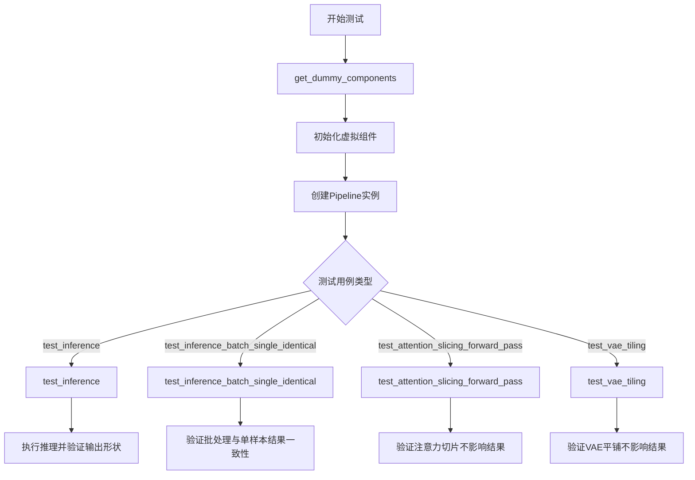

## 类结构

```
unittest.TestCase
└── QwenImageInpaintPipelineFastTests (继承PipelineTesterMixin)
    ├── 类属性
    └── 测试方法
```

## 全局变量及字段


### `enable_full_determinism`
    
启用测试的完全确定性，确保结果可复现

类型：`function`
    


### `to_np`
    
将张量转换为numpy数组用于比较

类型：`function`
    


### `PipelineTesterMixin`
    
管道测试的通用混合类，提供测试基础设施方法

类型：`class`
    


### `floats_tensor`
    
生成指定形状的随机浮点张量

类型：`function`
    


### `torch_device`
    
测试使用的PyTorch设备标识符

类型：`str`
    


### `QwenImageInpaintPipelineFastTests.pipeline_class`
    
要测试的Qwen图像修复管道类

类型：`Pipeline类`
    


### `QwenImageInpaintPipelineFastTests.params`
    
管道参数配置，包含文本到图像的参数集合

类型：`set`
    


### `QwenImageInpaintPipelineFastTests.batch_params`
    
批处理参数，用于批量推理测试

类型：`set`
    


### `QwenImageInpaintPipelineFastTests.image_params`
    
图像参数，定义图像输入相关配置

类型：`set`
    


### `QwenImageInpaintPipelineFastTests.image_latents_params`
    
图像潜在向量参数，用于潜在空间操作

类型：`set`
    


### `QwenImageInpaintPipelineFastTests.required_optional_params`
    
必需的可选参数集合，管道必须支持这些可选参数

类型：`frozenset`
    


### `QwenImageInpaintPipelineFastTests.supports_dduf`
    
标识管道是否支持DDUF（双扩散单元过滤）

类型：`bool`
    


### `QwenImageInpaintPipelineFastTests.test_xformers_attention`
    
标识是否测试xformers优化的注意力机制

类型：`bool`
    


### `QwenImageInpaintPipelineFastTests.test_layerwise_casting`
    
标识是否测试分层类型转换功能

类型：`bool`
    


### `QwenImageInpaintPipelineFastTests.test_group_offloading`
    
标识是否测试模型组卸载功能

类型：`bool`
    
    

## 全局函数及方法


### `enable_full_determinism`

该函数用于启用完全确定性（full determinism），确保深度学习模型在推理和训练过程中产生可重复的结果。通过设置各种随机数生成器的种子和环境变量，消除非确定性因素（如 cuDNN 自动调优），使多次运行产生完全相同的输出。

参数：
- 无

返回值：`None`，该函数无返回值，主要通过副作用（设置随机种子和环境变量）生效

#### 流程图

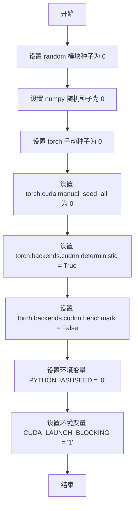

#### 带注释源码

```
def enable_full_determinism(seed: int = 0, extra_flag: bool = True):
    """
    启用完全确定性，确保多次运行产生相同结果
    
    参数:
        seed: 随机种子，默认为 0
        extra_flag: 是否启用额外的确定性标志
    """
    # 1. 设置 Python random 模块的全局种子
    random.seed(seed)
    
    # 2. 设置 NumPy 的随机种子
    np.random.seed(seed)
    
    # 3. 设置 PyTorch CPU 的手动种子
    torch.manual_seed(seed)
    
    # 4. 设置 PyTorch CUDA 所有GPU的随机种子
    torch.cuda.manual_seed_all(seed)
    
    # 5. 强制 cuDNN 使用确定性算法
    # 启用此选项会影响性能，但确保结果可重复
    torch.backends.cudnn.deterministic = True
    
    # 6. 禁用 cuDNN 自动调优
    # 关闭后每次卷积操作使用相同的算法
    torch.backends.cudnn.benchmark = False
    
    # 7. 设置 Python 哈希种子为固定值
    # 确保字典等哈希相关操作的结果一致
    os.environ["PYTHONHASHSEED"] = str(seed)
    
    # 8. 强制 CUDA 同步执行
    # 避免异步执行导致的不确定性问题
    os.environ["CUDA_LAUNCH_BLOCKING"] = "1"
    
    # 9. (可选) 额外的确定性标志
    if extra_flag:
        torch.use_deterministic_algorithms(True, warn_only=True)
```


### `floats_tensor`

生成指定形状的浮点张量（PyTorch Tensor），用于测试场景中创建随机浮点数数据。

参数：

-  `shape`：`Tuple[int, ...]`，张量的形状，如 `(1, 3, 32, 32)`
-  `rng`：`random.Random`，随机数生成器实例，用于生成随机数据

返回值：`torch.Tensor`，包含随机浮点数的 PyTorch 张量

#### 流程图

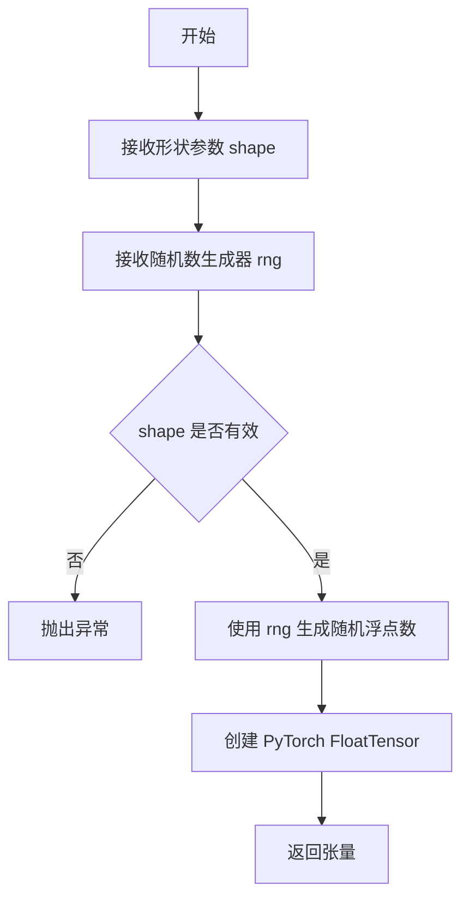

#### 带注释源码

```
# 注意：由于该函数定义在 ...testing_utils 模块中，未在当前代码文件中给出实现
# 以下为基于使用方式的推断代码

def floats_tensor(shape: Tuple[int, ...], rng: random.Random) -> torch.Tensor:
    """
    生成指定形状的浮点张量，用于测试场景。
    
    参数:
        shape: 张量的形状元组，如 (1, 3, 32, 32)
        rng: random.Random 实例，用于生成随机数
    
    返回:
        包含随机浮点数的 PyTorch 张量
    """
    # 使用随机数生成器生成符合正态分布的随机数
    # 或者使用均匀分布，取决于具体实现
    total_elements = np.prod(shape)
    values = np.array([rng.random() for _ in range(total_elements)])
    
    # 转换为 PyTorch 张量并 reshape 到目标形状
    tensor = torch.from_numpy(values.astype(np.float32)).reshape(shape)
    
    return tensor

# 在测试代码中的调用方式：
# image = floats_tensor((1, 3, 32, 32), rng=random.Random(seed)).to(device)
```

#### 使用示例

```python
# 从代码中提取的使用方式
image = floats_tensor((1, 3, 32, 32), rng=random.Random(seed)).to(device)
mask_image = torch.ones((1, 1, 32, 32)).to(device)
```

---

**注意**：由于 `floats_tensor` 函数定义在 `testing_utils` 模块中，未在当前提供的代码文件中给出完整实现。以上信息是基于代码中的导入语句和调用方式推断得出。如需获取完整源代码实现，建议查看 `testing_utils.py` 模块文件。


### `to_np`

将输入数据转换为 NumPy 数组的通用转换函数，主要用于在测试中将 PyTorch 张量或已存在的 NumPy 数组统一转换为 NumPy 格式，以便进行数值比较和计算。

参数：

- `tensors`：接受 `torch.Tensor`、`np.ndarray` 或其他类似数组的对象，需要转换的输入数据

返回值：`np.ndarray`，返回转换后的 NumPy 数组

#### 流程图

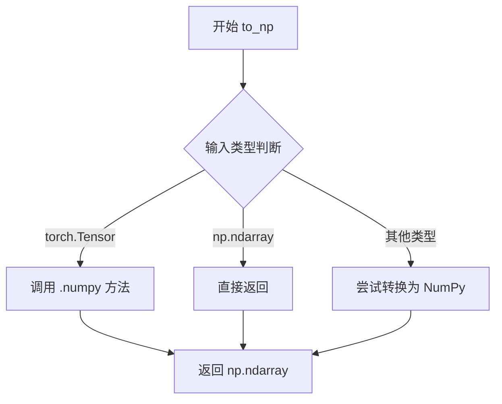

#### 带注释源码

```
# 源码未在当前文件中直接定义
# 该函数从 ..test_pipelines_common 模块导入
# 根据使用场景推断的典型实现如下:

def to_np(tensors):
    """
    将输入转换为 NumPy 数组。
    
    参数:
        tensors: torch.Tensor, np.ndarray, 或其他类似数组对象
        
    返回:
        np.ndarray: 转换后的 NumPy 数组
    """
    if isinstance(tensors, torch.Tensor):
        # 如果是 PyTorch 张量，转换为 CPU 上的 NumPy 数组
        return tensors.detach().cpu().numpy()
    elif isinstance(tensors, np.ndarray):
        # 如果已经是 NumPy 数组，直接返回
        return tensors
    else:
        # 其他类型尝试转换为 NumPy 数组
        return np.array(tensors)

# 在代码中的典型调用示例:
# max_diff1 = np.abs(to_np(output_with_slicing1) - to_np(output_without_slicing)).max()
# 用于比较两个模型输出的差异
```


### `PipelineTesterMixin`

`PipelineTesterMixin` 是一个测试混入类（Mixin），为扩散管道（Diffusion Pipeline）提供通用的测试方法和工具函数，用于验证图像生成管道的功能和性能一致性。

参数：

- `pipeline_class`：`type`，指定要测试的管道类
- `params`：`frozenset`，管道推理参数集合
- `batch_params`：`frozenset`，批处理参数集合
- `image_params`：`frozenset`，图像参数集合
- `image_latents_params`：`frozenset`，图像潜在向量参数集合
- `required_optional_params`：`frozenset`，必需的可选参数集合
- `supports_dduf`：`bool`，是否支持 DDUF（Decoder-only Diffusion Upscaler）
- `test_xformers_attention`：`bool`，是否测试 xFormers 注意力机制
- `test_layerwise_casting`：`bool`，是否测试分层类型转换
- `test_group_offloading`：`bool`，是否测试组卸载功能
- `test_attention_slicing`：`bool`，是否测试注意力切片功能

返回值：该类为混入类，不直接返回值，通过继承提供测试方法

#### 流程图

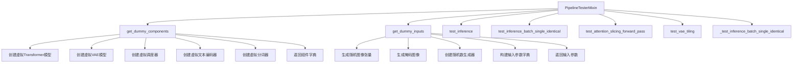

#### 带注释源码

```python
# PipelineTesterMixin 类的推断源码结构
# 注意：此类定义在 test_pipelines_common 模块中，此处基于使用模式推断

class PipelineTesterMixin:
    """
    测试混入类，为图像生成管道提供通用测试方法。
    用于验证扩散模型的推理、批处理、注意力切片和VAE平铺等功能。
    """
    
    # 类属性定义（子类需覆盖）
    pipeline_class = None  # 要测试的管道类
    params = frozenset()   # 管道参数集合
    batch_params = frozenset()  # 批处理参数
    image_params = frozenset()  # 图像参数
    image_latents_params = frozenset()  # 图像潜在向量参数
    required_optional_params = frozenset()  # 必需的可选参数
    supports_dduf = False  # 是否支持DDUF
    test_xformers_attention = False  # 是否测试xFormers
    test_layerwise_casting = True  # 是否测试分层转换
    test_group_offloading = True  # 是否测试组卸载
    test_attention_slicing = True  # 是否测试注意力切片
    
    def get_dummy_components(self):
        """
        创建虚拟组件用于测试。
        
        返回:
            dict: 包含虚拟Transformer、VAE、调度器、文本编码器和分词器的字典
        """
        raise NotImplementedError("子类必须实现 get_dummy_components 方法")
    
    def get_dummy_inputs(self, device, seed=0):
        """
        创建虚拟输入用于测试。
        
        参数:
            device: 测试设备
            seed: 随机种子
            
        返回:
            dict: 包含提示词、图像、掩码等参数的字典
        """
        raise NotImplementedError("子类必须实现 get_dummy_inputs 方法")
    
    def test_inference(self):
        """测试基本推理功能"""
        pass
    
    def test_inference_batch_single_identical(self):
        """测试批处理与单样本处理结果一致性"""
        pass
    
    def test_attention_slicing_forward_pass(
        self, 
        test_max_difference=True, 
        test_mean_pixel_difference=True, 
        expected_max_diff=1e-3
    ):
        """
        测试注意力切片功能。
        
        参数:
            test_max_difference: 是否测试最大差异
            test_mean_pixel_difference: 是否测试像素平均差异
            expected_max_diff: 预期最大差异阈值
        """
        pass
    
    def test_vae_tiling(self, expected_diff_max: float = 0.2):
        """
        测试VAE平铺功能。
        
        参数:
            expected_diff_max: 允许的最大差异
        """
        pass
    
    def _test_inference_batch_single_identical(self, batch_size, expected_max_diff):
        """内部方法：验证批处理与单样本推理结果一致性"""
        pass
```

#### 关键组件信息

| 组件名称 | 描述 |
|---------|------|
| `get_dummy_components` | 创建虚拟模型组件（Transformer、VAE、Scheduler、TextEncoder、Tokenizer） |
| `get_dummy_inputs` | 创建虚拟输入数据（图像、掩码、提示词、生成器） |
| `test_inference` | 验证管道基本推理功能 |
| `test_attention_slicing_forward_pass` | 验证注意力切片优化不影响结果 |
| `test_vae_tiling` | 验证VAE平铺机制的正确性 |
| `test_inference_batch_single_identical` | 验证批处理与单样本处理结果一致 |

#### 技术债务与优化空间

1. **测试参数硬编码**：部分测试阈值（如 `expected_max_diff=1e-3`）硬编码在方法中，缺乏灵活性
2. **重复代码模式**：`get_dummy_components` 和 `get_d dummy_inputs` 在多个测试类中重复定义，可考虑抽象到基类
3. **设备兼容性处理**：代码中包含 `mps` 设备特殊处理，可能需要更统一的设备抽象层
4. **缺少异步测试**：当前仅同步测试，未覆盖异步推理场景

#### 设计目标与约束

- **设计目标**：提供标准化的扩散管道测试框架，确保不同管道实现的接口一致性和功能正确性
- **约束条件**：
  - 依赖 `unittest` 框架
  - 需要 `torch` 和 `numpy` 进行数值比较
  - 假设管道遵循标准的 `__call__` 接口
- **错误处理**：使用 `NotImplementedError` 强制子类实现抽象方法
- **外部依赖**：依赖 `diffusers` 库的核心组件和测试工具函数


### `QwenImageInpaintPipeline`

QwenImageInpaintPipeline 是一个基于 Qwen2.5-VL 模型的图像修复（Inpainting）扩散管道，能够根据文本提示词、原始图像和掩码图像，生成符合提示词描述的修复后图像。该管道结合了 VAE 编码器、Transformer 模型、调度器和文本编码器，实现高质量的图像修复功能。

参数：

- `transformer`：`QwenImageTransformer2DModel`，用于去噪的 Transformer 主模型
- `vae`：`AutoencoderKLQwenImage`，变分自编码器，负责图像的编码和解码
- `scheduler`：`FlowMatchEulerDiscreteScheduler`，扩散调度器，控制去噪步骤
- `text_encoder`：`Qwen2_5_VLForConditionalGeneration`，文本编码器，将文本提示转换为嵌入向量
- `tokenizer`：`Qwen2Tokenizer`，分词器，用于对文本进行分词处理

#### 流程图

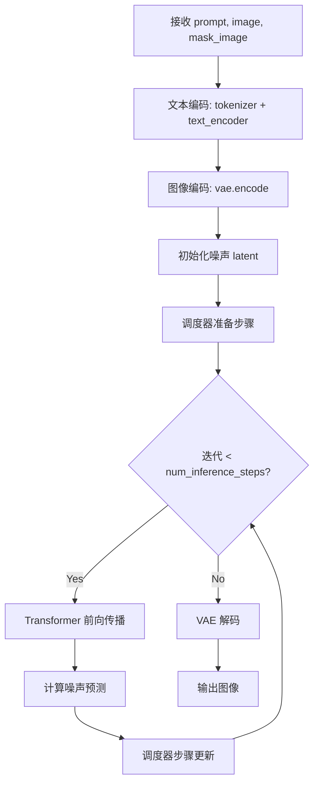

#### 带注释源码

```python
# 以下为 QwenImageInpaintPipeline 的典型调用方式（基于测试代码推断）
# 实际类定义在 diffusers 库中，此处展示测试中的使用模式

# 1. 初始化管道组件
components = {
    "transformer": transformer,          # QwenImageTransformer2DModel 实例
    "vae": vae,                           # AutoencoderKLQwenImage 实例
    "scheduler": scheduler,              # FlowMatchEulerDiscreteScheduler 实例
    "text_encoder": text_encoder,        # Qwen2_5_VLForConditionalGeneration 实例
    "tokenizer": tokenizer,               # Qwen2Tokenizer 实例
}

# 2. 创建管道实例
pipe = QwenImageInpaintPipeline(**components)
pipe.to(device)

# 3. 准备输入参数
inputs = {
    "prompt": "dance monkey",             # 文本提示词
    "negative_prompt": "bad quality",    # 负面提示词
    "image": image,                       # 原始图像 [1, 3, 32, 32]
    "mask_image": mask_image,             # 掩码图像 [1, 1, 32, 32]
    "generator": generator,               # 随机生成器
    "num_inference_steps": 2,             # 推理步数
    "guidance_scale": 3.0,                # Classifier-free guidance 比例
    "true_cfg_scale": 1.0,                # 真实 CFG 比例
    "height": 32,                         # 输出高度
    "width": 32,                          # 输出宽度
    "max_sequence_length": 16,           # 最大序列长度
    "output_type": "pt",                  # 输出类型 (PyTorch tensor)
}

# 4. 执行推理
output = pipe(**inputs)
image = output.images                     # 获取生成的图像

# 输出验证
assert image.shape == (3, 32, 32)         # 确认输出形状正确
```

### 关键组件信息

| 组件名称 | 一句话描述 |
|---------|-----------|
| `QwenImageTransformer2DModel` | 基于 Qwen2.5-VL 架构的图像 Transformer 模型，用于去噪过程 |
| `AutoencoderKLQwenImage` | 变分自编码器，负责将图像编码为潜在表示并解码回图像 |
| `FlowMatchEulerDiscreteScheduler` | 基于 Flow Match 的欧拉离散调度器，用于扩散模型的噪声调度 |
| `Qwen2_5_VLForConditionalGeneration` | Qwen2.5 视觉语言模型的文本编码部分 |
| `Qwen2Tokenizer` | Qwen2 文本分词器 |

### 潜在技术债务与优化空间

1. **测试覆盖不足**：缺少对 `callback_on_step_end`、`cross_attention_kwargs` 等可选参数的综合测试
2. **设备兼容性**：测试中对 MPS 设备有特殊处理（`str(device).startswith("mps")`），可能导致跨平台行为不一致
3. **硬编码阈值**：`expected_diff_max=0.2` 和 `expected_max_diff=1e-3` 等数值缺乏文档说明
4. **重复代码**：`get_dummy_inputs` 在多个测试方法中被重复调用，可提取为 fixture
5. **缺失错误处理**：未测试无效输入（如尺寸不匹配的 image 和 mask_image）的异常情况


### `QwenImageTransformer2DModel`

QwenImageTransformer2DModel 是一个用于图像修复（inpainting）的 2D 变换器模型，属于 Qwen 图像处理管道的一部分。该模型接受带掩码的图像和文本提示，预测修复后的图像潜在表示。

参数：

- `patch_size`：`int`，补丁大小，将图像分割成不重叠的补丁
- `in_channels`：`int`，输入通道数
- `out_channels`：`int`，输出通道数
- `num_layers`：`int`，变换器层的数量
- `attention_head_dim`：`int`，每个注意力头的维度
- `num_attention_heads`：`int`，注意力头的数量
- `joint_attention_dim`：`int`，联合注意力的维度（文本和图像）
- `guidance_embeds`：`bool`，是否使用引导嵌入
- `axes_dims_rope`：`tuple`，Rotary Position Embedding (RoPE) 的轴维度

返回值：`torch.nn.Module`，返回一个 PyTorch 模块，可用于图像修复的潜在预测

#### 流程图

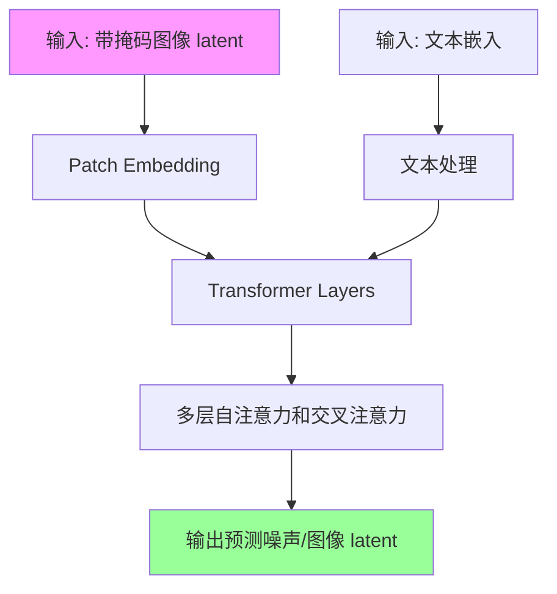

#### 带注释源码

```python
# 在测试文件中创建 QwenImageTransformer2DModel 实例
torch.manual_seed(0)
transformer = QwenImageTransformer2DModel(
    patch_size=2,              # 将图像分割成 2x2 的补丁
    in_channels=16,             # 输入 latent 的通道数
    out_channels=4,             # 输出的通道数
    num_layers=2,               # 2 个 Transformer 层
    attention_head_dim=16,     # 每个注意力头的维度
    num_attention_heads=3,     # 3 个注意力头
    joint_attention_dim=16,    # 文本和图像的联合注意力维度
    guidance_embeds=False,     # 不使用引导嵌入
    axes_dims_rope=(8, 4, 4),  # RoPE 的空间轴维度配置
)

# 该 transformer 被用作 QwenImageInpaintPipeline 的核心组件
# 组件字典中包含:
components = {
    "transformer": transformer,    # 图像修复变换器
    "vae": vae,                     # 变分自编码器
    "scheduler": scheduler,         # 调度器
    "text_encoder": text_encoder,  # 文本编码器
    "tokenizer": tokenizer,        # 分词器
}
```

#### 关键组件信息

| 组件名称 | 描述 |
|---------|------|
| `patch_size` | 图像分块大小，控制输入的空间分辨率 |
| `num_layers` | 变换器深度，决定模型的表达能力 |
| `joint_attention_dim` | 跨模态（图像-文本）注意力维度 |
| `axes_dims_rope` | 旋转位置编码的维度配置，支持多轴位置建模 |

#### 潜在技术债务与优化空间

1. **参数可读性**：大量硬编码的数值参数（如 `axes_dims_rope=(8, 4, 4)`）缺乏文档说明
2. **配置封装**：建议使用配置类（dataclass）封装相关参数，提高可维护性
3. **缺少模型加载说明**：未提供预训练模型加载方式，需依赖外部文档

#### 其他项目

- **设计目标**：为 Qwen 图像修复管道提供核心的潜在预测能力
- **错误处理**：未在此测试代码中展示，依赖于 diffusers 库的异常机制
- **外部依赖**：依赖 `diffusers` 库中的基础实现，需要与 `QwenImageInpaintPipeline` 配合使用
- **数据流**：图像 latent → Patch Embedding → Transformer 编码 → 输出预测 latent


### `AutoencoderKLQwenImage`

这是 Qwen 图像 VAE（变分自编码器）模型，用于将图像编码到潜在空间以及从潜在空间解码重建图像，支持tiling（瓦片化）处理大尺寸图像。

参数：

- `base_dim`：`int`，基础维度，通常为 `z_dim * 6`
- `z_dim`：`int`，潜在空间维度
- `dim_mult`：`list[int]`，维度 multipliers，用于构建 encoder/decoder 的通道数
- `num_res_blocks`：`int`，残差块数量
- `temporal_downsample`：`list[bool]`，时间轴下采样配置
- `latents_mean`：`list[float]`，潜在变量的均值，用于归一化
- `latents_std`：`list[float]`，潜在变量的标准差，用于归一化

返回值：`torch.nn.Module`，返回 VAE 模型实例

#### 流程图

```mermaid
flowchart TD
    A[输入图像 x] --> B[Encoder: 图像 → 潜在分布参数]
    B --> C[采样潜在向量 z ~ N(mean, std)]
    C --> D[Latent Space 潜在空间]
    D --> E[Decoder: 潜在向量 → 重建图像]
    E --> F[输出重建图像 x_recon]
    
    G[enable_tiling] --> H[将大图像切分为小瓦片]
    H --> B
    
    style D fill:#f9f,stroke:#333
```

#### 带注释源码

```python
# 从 diffusers 库导入 AutoencoderKLQwenImage VAE 模型
# 用于 Qwen 图像修复 pipeline 中的图像编码和解码

vae = AutoencoderKLQwenImage(
    base_dim=z_dim * 6,       # 基础维度 = 4 * 6 = 24
    z_dim=z_dim,              # 潜在空间维度 = 4
    dim_mult=[1, 2, 4],       # encoder/decoder 各层通道数的乘数因子
    num_res_blocks=1,         # 每个分辨率层级使用的残差块数量
    temperal_downsample=[False, True],  # 时间轴下采样配置 [底层, 高层]
    # 潜在变量的均值，用于标准化潜在向量
    latents_mean=[0.0] * 4,   
    # 潜在变量的标准差，用于标准化潜在向量
    latents_std=[1.0] * 4,    
)

# 在 pipeline 中使用 VAE tiling 处理大尺寸图像
pipe.vae.enable_tiling(
    tile_sample_min_height=96,    # 瓦片最小高度
    tile_sample_min_width=96,     # 瓦片最小宽度
    tile_sample_stride_height=64, # 瓦片垂直步长
    tile_sample_stride_width=64,  # 瓦片水平步长
)
```

---

**备注**：代码中仅展示了 `AutoencoderKLQwenImage` 的**实例化使用方式**，未包含类的完整定义源码。该类的实际实现位于 `diffusers` 库中。从用法来看，其核心功能包括：

1. **编码器 (Encoder)**：将输入图像压缩到潜在空间，输出均值和标准差参数
2. **解码器 (Decoder)**：从潜在向量重建图像
3. **潜在空间归一化**：使用 `latents_mean` 和 `latents_std` 对潜在向量进行标准化
4. **Tiling 支持**：通过 `enable_tiling()` 方法支持大图像的分块处理，避免内存溢出


### `FlowMatchEulerDiscreteScheduler`

这是 Diffusers 库中的一个调度器类，用于图像生成任务中的采样过程。它实现了基于欧拉离散方法的 Flow Matching 调度算法，管理扩散模型的噪声调度和去噪步骤。

参数：

- 无直接参数（使用默认配置初始化）

返回值：`FlowMatchEulerDiscreteScheduler` 实例，返回一个调度器对象，用于管理扩散模型的推理过程

#### 流程图

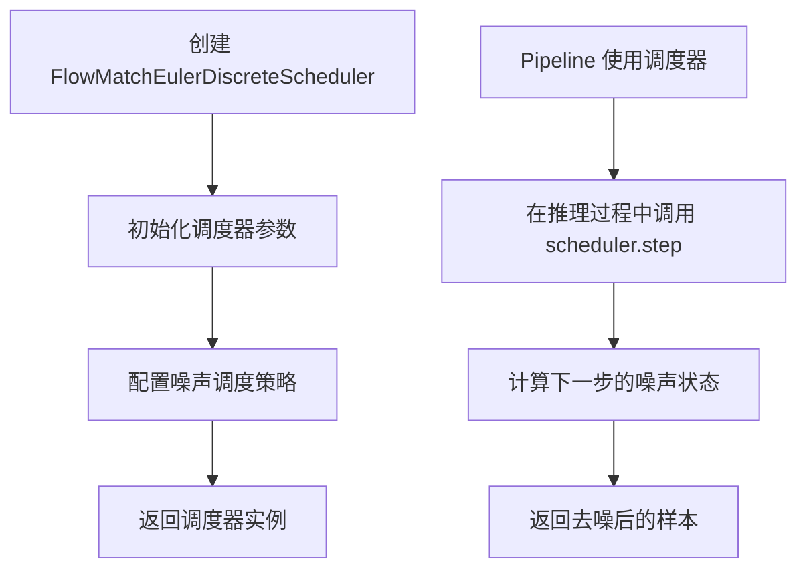

#### 带注释源码

```python
# 在 get_dummy_components 方法中创建调度器实例
torch.manual_seed(0)
scheduler = FlowMatchEulerDiscreteScheduler()

# 调度器被添加到组件字典中，供 Pipeline 使用
components = {
    "transformer": transformer,
    "vae": vae,
    "scheduler": scheduler,  # FlowMatchEulerDiscreteScheduler 实例
    "text_encoder": text_encoder,
    "tokenizer": tokenizer,
}
```

#### 相关说明

FlowMatchEulerDiscreteScheduler 是基于 Flow Matching 理论的调度器，采用欧拉离散方法进行采样。它是 QwenImageInpaintPipeline 的核心组件之一，负责：

1. **噪声调度**：管理从纯噪声到清晰图像的转换过程
2. **时间步处理**：控制扩散模型的总推理步骤数
3. **采样计算**：实现 Euler 方法进行离散化采样

该调度器在测试中配置为默认参数，用于验证 Pipeline 的基本推理功能。


### `Qwen2_5_VLForConditionalGeneration`

这是 Hugging Face Transformers 库中的多模态模型类，在此测试代码中作为文本编码器使用，用于将文本提示编码为模型可处理的嵌入表示。

参数：

- `config`：`Qwen2_5_VLConfig`，模型配置对象，包含文本编码器的隐藏层大小、注意力头数、层数等参数

返回值：`Qwen2_5_VLForConditionalGeneration`，返回初始化后的文本编码器模型实例

#### 流程图

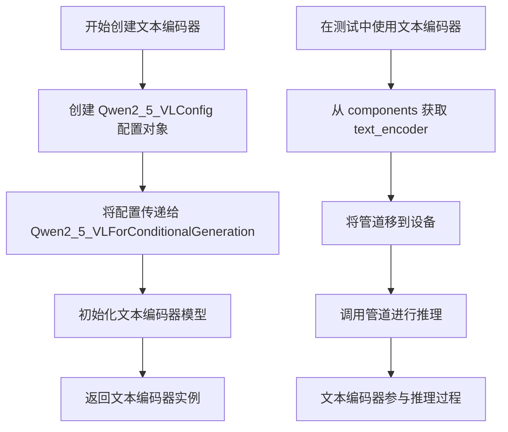

#### 带注释源码

```python
# 在 get_dummy_components 方法中创建文本编码器
config = Qwen2_5_VLConfig(  # 创建 Qwen2.5 VL 模型配置
    text_config={           # 文本编码器配置
        "hidden_size": 16,           # 隐藏层维度
        "intermediate_size": 16,    # 前馈网络中间层维度
        "num_hidden_layers": 2,      # 文本编码器层数
        "num_attention_heads": 2,    # 注意力头数
        "num_key_value_heads": 2,    # KV 头数
        "rope_scaling": {            # RoPE 缩放配置
            "mrope_section": [1, 1, 2],
            "rope_type": "default",
            "type": "default",
        },
        "rope_theta": 1000000.0,     # RoPE 基础频率
    },
    vision_config={         # 视觉编码器配置
        "depth": 2,
        "hidden_size": 16,
        "intermediate_size": 16,
        "num_heads": 2,
        "out_hidden_size": 16,
    },
    hidden_size=16,         # 联合隐藏层大小
    vocab_size=152064,      # 词表大小
    vision_end_token_id=151653,  # 视觉结束 token ID
    vision_start_token_id=151652, # 视觉开始 token ID
    vision_token_id=151654,       # 视觉 token ID
)

# 创建文本编码器模型实例
text_encoder = Qwen2_5_VLForConditionalGeneration(config)

# 将文本编码器添加到组件字典
components = {
    "transformer": transformer,
    "vae": vae,
    "scheduler": scheduler,
    "text_encoder": text_encoder,  # 文本编码器
    "tokenizer": tokenizer,
}

# 在测试中使用文本编码器
def test_inference(self):
    device = "cpu"
    components = self.get_dummy_components()
    pipe = self.pipeline_class(**components)  # 传入包含 text_encoder 的组件
    pipe.to(device)
    
    inputs = self.get_dummy_inputs(device)
    image = pipe(**inputs).images  # 推理时文本编码器被使用
```

#### 额外说明

1. **设计目标**：Qwen2_5_VLForConditionalGeneration 是一个多模态模型，能同时处理文本和图像输入
2. **在此测试中的角色**：仅作为文本编码器使用，将文本 prompt 编码为嵌入向量
3. **配置参数**：文本编码器配置通过 `text_config` 传递，视觉配置通过 `vision_config` 传递
4. **外部依赖**：需要安装 `transformers` 库，模型权重来自 HuggingFace Hub
5. **实际实现**：Qwen2_5_VLForConditionalGeneration 的具体实现不在此测试代码中，而是在 transformers 库中


### `Qwen2Tokenizer`

Qwen2Tokenizer 是 Hugging Face transformers 库提供的 Qwen2-VL 模型文本分词器，负责将文本字符串转换为模型可处理的 token ID 序列，并支持将 token ID 解码回文本。在本项目中，它被用于对图像修复 pipeline 的文本提示（prompt）进行编码处理。

参数：

- `pretrained_model_name_or_path`：`str`，预训练分词器的模型名称或本地路径

返回值：`Qwen2Tokenizer` 对象

#### 流程图

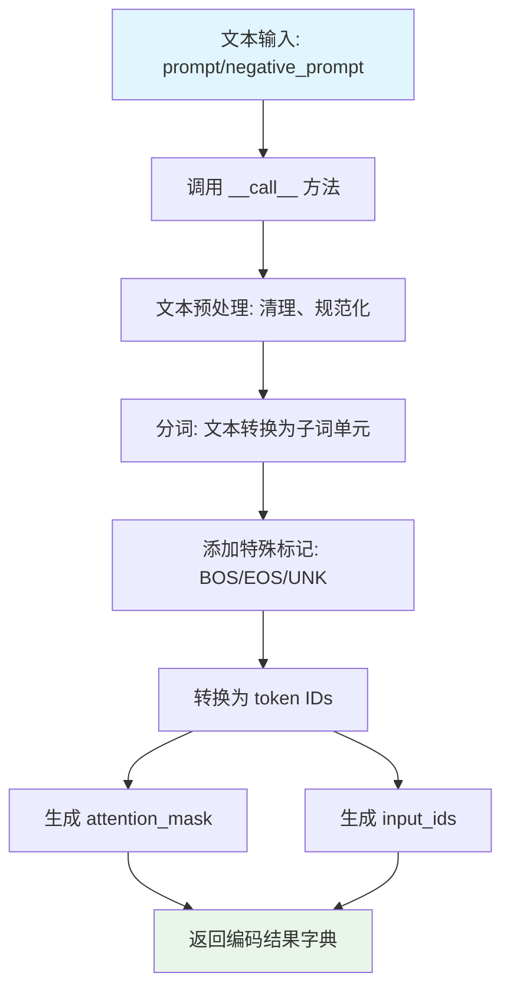

#### 带注释源码

```python
# 从 transformers 库导入 Qwen2Tokenizer
# 这是一个预训练的分词器，专门用于 Qwen2-VL 模型的文本处理
from transformers import Qwen2Tokenizer

# 在 get_dummy_components 方法中创建 tokenizer 实例
# 使用 from_pretrained 方法加载预训练的分词器权重
# "hf-internal-testing/tiny-random-Qwen2VLForConditionalGeneration" 是测试用的小型随机模型
tokenizer = Qwen2Tokenizer.from_pretrained("hf-internal-testing/tiny-random-Qwen2VLForConditionalGeneration")

# 在 pipeline 中，tokenizer 的典型使用方式：
# 输入: prompt = "dance monkey"
# 输出: {
#     'input_ids': tensor([[151643, 10425, 13125, ...]]),  # token ID 序列
#     'attention_mask': tensor([[1, 1, 1, ...]])          # 注意力掩码
# }

# tokenizer 的核心方法：
# 1. __call__(text, ...) -> Dict: 将文本编码为 token IDs
# 2. decode(token_ids, ...) -> str: 将 token IDs 解码为文本
# 3. batch_decode(token_ids, ...) -> List[str]: 批量解码
# 4. convert_tokens_to_string(tokens) -> str: 将 tokens 转换为字符串
```


### `QwenImageInpaintPipelineFastTests.get_dummy_components`

该方法用于创建虚拟（dummy）组件字典，为图像修复管道测试提供必要的模型和调度器实例，确保测试环境的一致性和可重复性。

参数：

- 无显式参数（隐含参数 `self`：当前测试类实例）

返回值：`Dict[str, Any]`，返回包含虚拟组件的字典，包括 transformer、vae、scheduler、text_encoder 和 tokenizer

#### 流程图

```mermaid
flowchart TD
    A[开始 get_dummy_components] --> B[设置随机种子 torch.manual_seed(0)]
    B --> C[创建 QwenImageTransformer2DModel 虚拟实例]
    C --> D[设置随机种子 torch.manual_seed(0)]
    D --> E[创建 AutoencoderKLQwenImage 虚拟 VAE 实例]
    E --> F[设置随机种子 torch.manual_seed(0)]
    F --> G[创建 FlowMatchEulerDiscreteScheduler 调度器实例]
    G --> H[设置随机种子 torch.manual_seed(0)]
    H --> I[创建 Qwen2_5_VLConfig 配置对象]
    I --> J[基于配置创建 Qwen2_5_VLForConditionalGeneration 文本编码器]
    J --> K[从预训练模型加载 Qwen2Tokenizer 分词器]
    K --> L[将所有组件放入字典]
    L --> M[返回 components 字典]
```

#### 带注释源码

```python
def get_dummy_components(self):
    """
    创建虚拟组件用于测试
    
    该方法初始化所有必要的模型组件（transformer、VAE、scheduler、text_encoder、tokenizer），
    并将其放入字典中返回，用于测试 QwenImageInpaintPipeline 的各种功能。
    """
    # 设置随机种子确保测试可重复性
    torch.manual_seed(0)
    
    # 创建虚拟 Transformer 模型
    # 参数说明：
    # - patch_size: 2, 图像分块大小
    # - in_channels: 16, 输入通道数
    # - out_channels: 4, 输出通道数
    # - num_layers: 2, Transformer 层数
    # - attention_head_dim: 16, 注意力头维度
    # - num_attention_heads: 3, 注意力头数量
    # - joint_attention_dim: 16, 联合注意力维度
    # - guidance_embeds: False, 不使用引导嵌入
    # - axes_dims_rope: (8, 4, 4), RoPE 轴维度
    transformer = QwenImageTransformer2DModel(
        patch_size=2,
        in_channels=16,
        out_channels=4,
        num_layers=2,
        attention_head_dim=16,
        num_attention_heads=3,
        joint_attention_dim=16,
        guidance_embeds=False,
        axes_dims_rope=(8, 4, 4),
    )

    # 重新设置随机种子
    torch.manual_seed(0)
    z_dim = 4
    
    # 创建虚拟 VAE 模型（AutoencoderKL）
    # 参数说明：
    # - base_dim: z_dim * 6 = 24, 基础维度
    # - z_dim: 4, 潜在空间维度
    # - dim_mult: [1, 2, 4], 维度倍数
    # - num_res_blocks: 1, 残差块数量
    # - temperal_downsample: [False, True], 时间下采样配置
    # - latents_mean: [0.0] * 4, 潜在变量均值
    # - latents_std: [1.0] * 4, 潜在变量标准差
    vae = AutoencoderKLQwenImage(
        base_dim=z_dim * 6,
        z_dim=z_dim,
        dim_mult=[1, 2, 4],
        num_res_blocks=1,
        temperal_downsample=[False, True],
        # fmt: off
        latents_mean=[0.0] * 4,
        latents_std=[1.0] * 4,
        # fmt: on
    )

    # 重新设置随机种子
    torch.manual_seed(0)
    
    # 创建 Flow Match Euler 离散调度器
    scheduler = FlowMatchEulerDiscreteScheduler()

    # 重新设置随机种子
    torch.manual_seed(0)
    
    # 创建 Qwen2.5 VL 配置对象
    # 包含文本配置和视觉配置
    config = Qwen2_5_VLConfig(
        text_config={
            "hidden_size": 16,
            "intermediate_size": 16,
            "num_hidden_layers": 2,
            "num_attention_heads": 2,
            "num_key_value_heads": 2,
            "rope_scaling": {
                "mrope_section": [1, 1, 2],
                "rope_type": "default",
                "type": "default",
            },
            "rope_theta": 1000000.0,
        },
        vision_config={
            "depth": 2,
            "hidden_size": 16,
            "intermediate_size": 16,
            "num_heads": 2,
            "out_hidden_size": 16,
        },
        hidden_size=16,
        vocab_size=152064,
        vision_end_token_id=151653,
        vision_start_token_id=151652,
        vision_token_id=151654,
    )
    
    # 基于配置创建虚拟文本编码器
    text_encoder = Qwen2_5_VLForConditionalGeneration(config)
    
    # 从预训练模型加载虚拟分词器
    # 使用 Hugging Face 测试用的小型随机模型
    tokenizer = Qwen2Tokenizer.from_pretrained("hf-internal-testing/tiny-random-Qwen2VLForConditionalGeneration")

    # 组装组件字典
    components = {
        "transformer": transformer,
        "vae": vae,
        "scheduler": scheduler,
        "text_encoder": text_encoder,
        "tokenizer": tokenizer,
    }
    
    # 返回包含所有虚拟组件的字典
    return components
```


### `QwenImageInpaintPipelineFastTests.get_dummy_inputs`

生成虚拟输入数据，用于 Qwen 图像修复管道的单元测试。该方法创建模拟的图像、掩码、文本提示等输入参数，以确保测试在不同设备和随机种子下的一致性。

参数：

- `device`：`str`，目标设备（如 "cpu"、"cuda" 等），用于将张量放置到指定设备上
- `seed`：`int`，随机数生成器的种子，默认值为 0，确保测试结果可复现

返回值：`Dict`，包含管道推理所需的所有虚拟输入参数的字典

#### 流程图

```mermaid
flowchart TD
    A[开始 get_dummy_inputs] --> B[使用 seed 创建随机数生成器]
    B --> C[生成 1x3x32x32 的随机图像张量]
    C --> D[生成 1x1x32x32 的掩码图像张量]
    D --> E{设备是否为 MPS?}
    E -->|是| F[使用 torch.manual_seed]
    E -->|否| G[使用 torch.Generator(device).manual_seed]
    F --> H[构建输入参数字典]
    G --> H
    H --> I[返回包含所有参数的字典]
    
    style A fill:#e1f5fe
    style I fill:#e8f5e8
```

#### 带注释源码

```python
def get_dummy_inputs(self, device, seed=0):
    """
    生成虚拟输入数据，用于 Qwen 图像修复管道的测试。
    
    参数:
        device: 目标设备字符串 (如 "cpu", "cuda")
        seed: 随机种子，用于确保测试结果的可复现性
    
    返回:
        包含所有管道输入参数的字典
    """
    # 使用 floats_tensor 工具函数生成指定形状的随机浮点数张量
    # 形状: (batch=1, channels=3, height=32, width=32)
    image = floats_tensor((1, 3, 32, 32), rng=random.Random(seed)).to(device)
    
    # 创建全1的掩码图像，形状为 (1, 1, 32, 32)
    # 掩码用于指示图像中需要修复的区域
    mask_image = torch.ones((1, 1, 32, 32)).to(device)
    
    # 根据设备类型选择不同的随机数生成器创建方式
    # MPS (Apple Silicon) 需要特殊处理，使用 torch.manual_seed
    if str(device).startswith("mps"):
        generator = torch.manual_seed(seed)
    else:
        # 其他设备使用 torch.Generator 并设置种子
        generator = torch.Generator(device=device).manual_seed(seed)
    
    # 构建完整的输入参数字典
    inputs = {
        "prompt": "dance monkey",                    # 文本提示
        "negative_prompt": "bad quality",            # 负面提示
        "image": image,                              # 输入图像
        "mask_image": mask_image,                    # 修复掩码
        "generator": generator,                      # 随机生成器
        "num_inference_steps": 2,                    # 推理步数
        "guidance_scale": 3.0,                       # CFG 引导强度
        "true_cfg_scale": 1.0,                       # 真实 CFG 比例
        "height": 32,                                # 输出高度
        "width": 32,                                 # 输出宽度
        "max_sequence_length": 16,                  # 最大序列长度
        "output_type": "pt",                         # 输出类型 (PyTorch)
    }
    
    return inputs
```


### `QwenImageInpaintPipelineFastTests.test_inference`

该测试方法用于验证 Qwen 图像修复管道（QwenImageInpaintPipeline）的基础推理功能，通过创建虚拟组件和输入，执行管道推理，并验证生成的图像形状是否符合预期 (3, 32, 32)。

参数：无（仅包含 `self` 参数）

返回值：`None`，无返回值（测试方法）

#### 流程图

```mermaid
flowchart TD
    A[开始测试] --> B[设置设备为 CPU]
    B --> C[获取虚拟组件: get_dummy_components]
    C --> D[创建管道实例: QwenImageInpaintPipeline]
    D --> E[将管道移至 CPU 设备]
    E --> F[设置进度条配置: set_progress_bar_config]
    F --> G[获取虚拟输入: get_dummy_inputs]
    G --> H[执行管道推理: pipe(**inputs)]
    H --> I[获取生成的图像: image[0]]
    I --> J[断言验证图像形状为 (3, 32, 32)]
    J --> K[测试结束]
```

#### 带注释源码

```python
def test_inference(self):
    """
    测试 QwenImageInpaintPipeline 的基础推理功能。
    验证管道能够正确处理输入并生成预期形状的图像。
    """
    # 设置测试设备为 CPU
    device = "cpu"

    # 获取虚拟组件（transformer, vae, scheduler, text_encoder, tokenizer）
    # 这些组件使用随机种子初始化，用于测试
    components = self.get_dummy_components()
    
    # 使用虚拟组件创建 QwenImageInpaintPipeline 管道实例
    pipe = self.pipeline_class(**components)
    
    # 将管道移至指定设备（CPU）
    pipe.to(device)
    
    # 配置进度条（disable=None 表示不禁用进度条）
    pipe.set_progress_bar_config(disable=None)

    # 获取虚拟输入参数，包括：
    # - prompt: 文本提示 "dance monkey"
    # - negative_prompt: 负面提示 "bad quality"
    # - image: 浮点张量 (1, 3, 32, 32)
    # - mask_image: 掩码图像 (1, 1, 32, 32)
    # - generator: 随机数生成器
    # - num_inference_steps: 推理步数 2
    # - guidance_scale: 引导尺度 3.0
    # - true_cfg_scale: 真 CFG 尺度 1.0
    # - height/width: 图像尺寸 32x32
    # - max_sequence_length: 最大序列长度 16
    # - output_type: 输出类型 "pt" (PyTorch)
    inputs = self.get_dummy_inputs(device)
    
    # 执行管道推理，传入所有输入参数
    # 返回 PipelineOutput 对象，包含生成的图像
    image = pipe(**inputs).images
    
    # 获取第一张生成的图像（因为 batch_size=1）
    generated_image = image[0]
    
    # 断言验证生成的图像形状是否为 (3, 32, 32)
    # 3 表示 RGB 通道，32x32 表示图像高度和宽度
    self.assertEqual(generated_image.shape, (3, 32, 32))
```


### `QwenImageInpaintPipelineFastTests.test_inference_batch_single_identical`

该测试方法用于验证批处理推理与单样本推理的结果一致性，确保在使用相同随机种子时，批处理生成的图像与单独推理生成的图像在像素级别上保持一致（允许的最大差异为1e-1）。

参数：

- `self`：测试类实例本身，无额外参数

返回值：`None`，该方法为单元测试方法，通过 `self.assertLess` 断言验证结果一致性，无显式返回值

#### 流程图

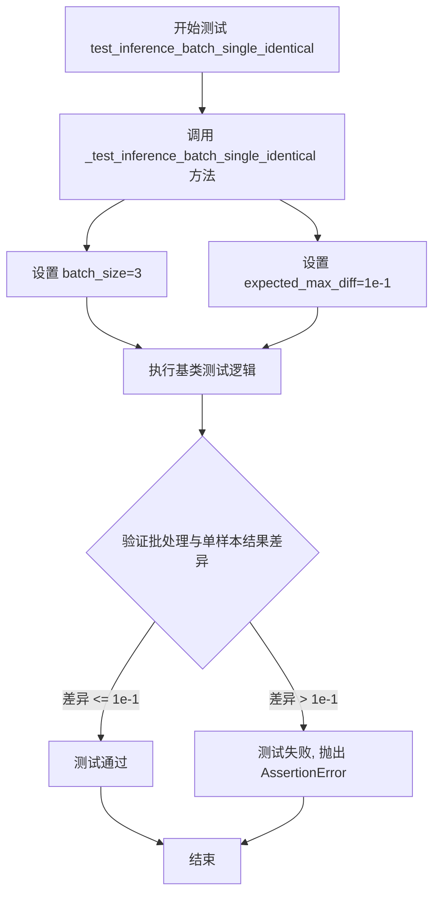

#### 带注释源码

```python
def test_inference_batch_single_identical(self):
    """
    测试批处理推理与单样本推理的一致性。
    
    该测试方法调用基类 PipelineTesterMixin 提供的 _test_inference_batch_single_identical 方法，
    验证当使用相同的生成器种子时，批处理推理（batch_size=3）生成的图像应与
    单样本推理生成的图像保持像素级别的一致性。
    
    测试目标：
    - 验证管道在批处理模式下能正确复现单样本推理结果
    - 确保不同批大小不会引入额外的随机性或数值误差
    """
    # 调用基类方法执行实际的批处理一致性测试
    # batch_size=3: 使用3个样本的批处理进行测试
    # expected_max_diff=1e-1: 允许的最大像素差异为0.1（考虑浮点数精度误差）
    self._test_inference_batch_single_identical(batch_size=3, expected_max_diff=1e-1)
```


### `QwenImageInpaintPipelineFastTests.test_attention_slicing_forward_pass`

该测试方法用于验证 Qwen 图像修复管道中注意力切片（Attention Slicing）功能的正确性。通过对比启用不同切片大小（slice_size=1 和 slice_size=2）与不启用切片时的推理输出差异，确保注意力切片优化不会影响最终的图像生成质量。

参数：

- `test_max_difference`：`bool`，是否测试输出之间的最大差异，默认为 `True`
- `test_mean_pixel_difference`：`bool`，是否测试平均像素差异，默认为 `True`
- `expected_max_diff`：`float`，允许的最大差异阈值，默认为 `1e-3`

返回值：`None`，该方法为单元测试，通过 `unittest` 断言验证结果，不返回任何值

#### 流程图

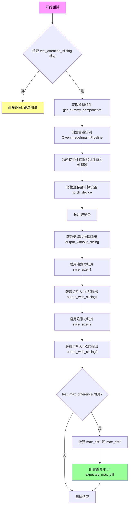

#### 带注释源码

```python
def test_attention_slicing_forward_pass(
    self, test_max_difference=True, test_mean_pixel_difference=True, expected_max_diff=1e-3
):
    """
    测试注意力切片功能是否正确实现
    
    参数:
        test_max_difference: 是否测试最大差异
        test_mean_pixel_difference: 是否测试平均像素差异（当前未使用）
        expected_max_diff: 允许的最大差异阈值
    """
    # 检查测试是否启用（类属性 test_attention_slicing）
    if not self.test_attention_slicing:
        return

    # 获取虚拟组件（用于测试的假模型组件）
    components = self.get_dummy_components()
    
    # 创建管道实例
    pipe = self.pipeline_class(**components)
    
    # 为所有可训练组件设置默认注意力处理器
    for component in pipe.components.values():
        if hasattr(component, "set_default_attn_processor"):
            component.set_default_attn_processor()
    
    # 将管道移至计算设备
    pipe.to(torch_device)
    
    # 禁用进度条显示
    pipe.set_progress_bar_config(disable=None)

    # 获取生成器设备
    generator_device = "cpu"
    
    # 获取测试输入数据
    inputs = self.get_dummy_inputs(generator_device)
    
    # 执行无注意力切片的推理
    output_without_slicing = pipe(**inputs)[0]

    # 启用注意力切片，slice_size=1（每个切片处理1个token）
    pipe.enable_attention_slicing(slice_size=1)
    
    # 重新获取输入（确保随机状态一致）
    inputs = self.get_dummy_inputs(generator_device)
    
    # 执行切片大小为1的推理
    output_with_slicing1 = pipe(**inputs)[0]

    # 启用注意力切片，slice_size=2（每个切片处理2个token）
    pipe.enable_attention_slicing(slice_size=2)
    
    # 重新获取输入
    inputs = self.get_dummy_inputs(generator_device)
    
    # 执行切片大小为2的推理
    output_with_slicing2 = pipe(**inputs)[0]

    # 如果需要测试最大差异
    if test_max_difference:
        # 计算无切片与slice_size=1输出的最大差异
        max_diff1 = np.abs(to_np(output_with_slicing1) - to_np(output_without_slicing)).max()
        
        # 计算无切片与slice_size=2输出的最大差异
        max_diff2 = np.abs(to_np(output_with_slicing2) - to_np(output_without_slicing)).max()
        
        # 断言：注意力切片不应影响推理结果
        self.assertLess(
            max(max_diff1, max_diff2),
            expected_max_diff,
            "Attention slicing should not affect the inference results",
        )
```


### `QwenImageInpaintPipelineFastTests.test_vae_tiling`

该测试方法用于验证VAE（变分自编码器）平铺功能是否正常工作，通过对比启用平铺与未启用平铺两种情况下的输出差异，确保平铺操作不会影响推理结果的正确性。

参数：

- `expected_diff_max`：`float`，允许的最大输出差异阈值，默认为0.2，用于判断平铺和非平铺输出是否足够接近

返回值：`None`（无返回值），该方法为测试用例，通过`self.assertLess`进行断言验证

#### 流程图

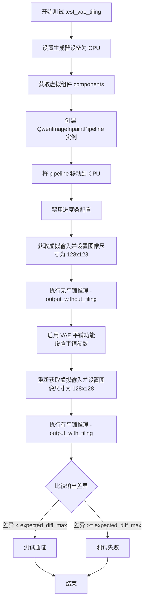

#### 带注释源码

```python
def test_vae_tiling(self, expected_diff_max: float = 0.2):
    """
    测试 VAE 平铺功能是否正常工作
    
    该测试通过比较启用平铺与未启用平铺两种情况下的输出差异，
    验证平铺操作不会对推理结果产生显著影响。
    
    参数:
        expected_diff_max: float, 允许的最大差异阈值，默认值为 0.2
    
    返回:
        None (测试用例通过 self.assertLess 进行断言验证)
    """
    # 设置生成器设备为 CPU
    generator_device = "cpu"
    
    # 获取预先配置好的虚拟组件（包含 transformer、vae、scheduler、text_encoder、tokenizer 等）
    components = self.get_dummy_components()

    # 使用虚拟组件创建 QwenImageInpaintPipeline 推理管道
    pipe = self.pipeline_class(**components)
    
    # 将 pipeline 移动到 CPU 设备上运行
    pipe.to("cpu")
    
    # 设置进度条配置，disable=None 表示不禁用进度条
    pipe.set_progress_bar_config(disable=None)

    # ===== 步骤1: 测试无平铺情况 =====
    # 获取虚拟输入数据
    inputs = self.get_dummy_inputs(generator_device)
    # 设置图像高度和宽度为 128，用于测试较大图像的平铺效果
    inputs["height"] = inputs["width"] = 128
    
    # 执行推理，获取无平铺情况下的输出图像
    output_without_tiling = pipe(**inputs)[0]

    # ===== 步骤2: 测试有平铺情况 =====
    # 启用 VAE 平铺功能，设置平铺采样参数
    # tile_sample_min_height/tile_sample_min_width: 平铺块的最小高度/宽度
    # tile_sample_stride_height/tile_sample_stride_width: 平铺块之间的步长
    pipe.vae.enable_tiling(
        tile_sample_min_height=96,
        tile_sample_min_width=96,
        tile_sample_stride_height=64,
        tile_sample_stride_width=64,
    )
    
    # 重新获取虚拟输入数据（确保输入一致性）
    inputs = self.get_dummy_inputs(generator_device)
    inputs["height"] = inputs["width"] = 128
    
    # 执行推理，获取启用平铺情况下的输出图像
    output_with_tiling = pipe(**inputs)[0]

    # ===== 步骤3: 验证结果 =====
    # 将 PyTorch 张量转换为 NumPy 数组并计算最大差异
    # 断言：平铺和非平铺输出的差异应小于预期阈值
    self.assertLess(
        (to_np(output_without_tiling) - to_np(output_with_tiling)).max(),
        expected_diff_max,
        "VAE tiling should not affect the inference results",
    )
```

## 关键组件


### QwenImageInpaintPipeline

图像修复管道的主类，封装了完整的图像修复流程，包括文本编码、图像变换、VAE解码和调度器控制。

### QwenImageTransformer2DModel

基于Qwen2.5-VL的图像变换器模型，用于在潜在空间中进行图像修复的denoising过程。

### AutoencoderKLQwenImage

Qwen图像VAE模型，负责将图像编码到潜在空间并从潜在空间解码恢复图像，支持tiling分块处理。

### FlowMatchEulerDiscreteScheduler

基于欧拉离散方法的Flow Match调度器，控制去噪过程中的噪声调度。

### Qwen2_5_VLForConditionalGeneration

Qwen2.5视觉语言模型的文本编码器部分，负责将文本提示编码为嵌入向量。

### Qwen2Tokenizer

Qwen2分词器，用于将文本提示转换为模型可处理的token序列。

### VAE Tiling

VAE分块处理机制，通过将大图像分割为小块分别编码/解码来解决内存限制问题。

### Attention Slicing

注意力切片机制，通过将注意力计算分块处理来降低内存占用。

### PipelineTesterMixin

测试管道的基础混入类，提供了管道测试的通用方法和断言工具。

### get_dummy_components

创建虚拟组件的工厂方法，初始化所有管道组件的测试配置。

### get_dummy_inputs

生成虚拟输入数据的工厂方法，返回测试用的图像、mask、prompt等输入参数。

### test_inference

基础的推理测试，验证管道能够正确执行完整的图像修复流程。

### test_vae_tiling

VAE分块功能测试，验证启用tiling后输出结果的一致性。

### test_attention_slicing_forward_pass

注意力切片功能测试，验证不同slice_size下输出结果的一致性。

### test_inference_batch_single_identical

批处理与单样本推理一致性测试。

## 问题及建议


### 已知问题

- **硬编码的配置值**：测试中的多个参数（如 `patch_size=2`、`num_layers=2`、`z_dim=4` 等）被硬编码在 `get_dummy_components` 方法中，缺乏灵活性，难以适配不同场景
- **设备处理不一致**：代码中混用了 `"cpu"`、`torch_device` 和 `generator_device`，可能导致在不同测试环境中行为不一致
- **未使用的参数**：`required_optional_params` 被定义但未在测试中使用，造成代码冗余
- **随机种子管理混乱**：多次调用 `torch.manual_seed(0)` 可能导致测试间的状态污染，虽然使用 `enable_full_determinism` 但仍存在潜在风险
- **缺少输入验证**：测试方法未对输入参数进行有效性检查，可能导致隐藏的错误
- **资源未显式释放**：测试完成后未显式清理 GPU 内存或模型资源

### 优化建议

- 将硬编码的配置值提取为类常量或配置类，提高可维护性和复用性
- 统一设备管理，使用 `torch_device` 替代硬编码的 `"cpu"`，确保跨环境一致性
- 删除未使用的 `required_optional_params` 或将其用于参数验证逻辑
- 使用 fixture 或 setUp/tearDown 方法集中管理随机种子，确保测试隔离
- 添加参数校验逻辑，验证模型组件、输入维度和数据类型
- 在测试类中实现 `tearDown` 方法，显式释放内存和清理资源
- 为关键测试方法添加文档字符串，说明测试目的和预期行为

## 其它


### 设计目标与约束

验证 QwenImageInpaintPipeline 图像修复管道的基本功能、批处理一致性、注意力切片和 VAE 平铺等特性的正确性，确保在 CPU 设备上能够正确执行推理并产生符合预期尺寸的输出图像。

### 错误处理与异常设计

测试用例未显式验证错误路径，主要通过 assert 语句验证输出结果的正确性。当设备为 MPS 时，使用 torch.manual_seed 而非 Generator 对象，以兼容 Apple Silicon 设备。测试框架依赖 unittest 的标准异常传播机制。

### 数据流与状态机

测试流程为：初始化 Dummy 组件 → 构建 Dummy 输入 → 执行管道推理 → 验证输出。管道状态通过 set_progress_bar_config 管理，注意力切片通过 enable_attention_slicing 动态启用，VAE 平铺通过 enable_tiling 配置。测试涵盖无切片/有切片和无平铺/有平铺两种状态切换场景。

### 外部依赖与接口契约

依赖的核心组件包括：QwenImageTransformer2DModel（变换器）、AutoencoderKLQwenImage（VAE 编码器）、FlowMatchEulerDiscreteScheduler（调度器）、Qwen2_5_VLForConditionalGeneration（文本编码器）、Qwen2Tokenizer（分词器）。管道输入参数遵循 TEXT_TO_IMAGE_PARAMS 规范，排除 cross_attention_kwargs，返回 ImagePipelineOutput 对象。

### 配置与参数说明

测试使用固定随机种子（torch.manual_seed(0)）确保可复现性。关键参数：patch_size=2、in_channels=16、out_channels=4、num_layers=2、attention_head_dim=16、num_attention_heads=3、joint_attention_dim=16。图像尺寸为 32x32，推理步数为 2，guidance_scale=3.0，true_cfg_scale=1.0。

### 测试覆盖范围

涵盖 4 个测试用例：test_inference（基础推理）、test_inference_batch_single_identical（批处理一致性）、test_attention_slicing_forward_pass（注意力切片）、test_vae_tiling（VAE 平铺）。支持测试参数包括：test_xformers_attention=False、test_layerwise_casting=True、test_group_offloading=True。

### 性能基准与指标

注意力切片测试使用 expected_max_diff=1e-3 验证数值一致性，VAE 平铺测试使用 expected_diff_max=0.2 验证输出差异。批处理测试使用 expected_max_diff=1e-1 验证单样本与批处理输出的等效性。

### 安全与权限考虑

代码继承 Apache License 2.0，使用 Hugging Face transformers 和 diffusers 库。测试不涉及敏感数据，使用 dummy 组件和随机生成的测试图像（floats_tensor 生成）。

### 版本兼容性

代码针对 diffusers 库设计，依赖 transformers 库的 Qwen2_5_VLConfig 和 Qwen2_5_VLForConditionalGeneration。需确保 Python、PyTorch、NumPy 版本与 transformers>=4.40.0 和 diffusers>=0.30.0 兼容。

### 已知限制

不支持 xformers 注意力优化（test_xformers_attention=False），不支持 DDUF 调度器（supports_dduf=False），MPS 设备使用手动种子而非 Generator 对象以避免兼容性问题。


    