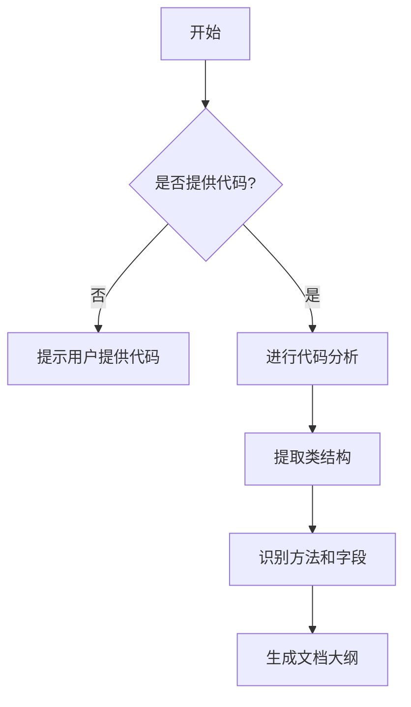

# `diffusers\tests\pipelines\sana\__init__.py` 详细设计文档

未提供源代码，无法进行分析。请提供需要分析的代码文件。

## 整体流程



## 类结构

```
等待提供代码后生成类层次结构
```

## 全局变量及字段


    

## 全局函数及方法


## 关键组件


### 核心功能描述

由于未提供源代码，无法进行功能描述。

### 整体运行流程

由于未提供源代码，无法描述运行流程。

### 类详细信息

由于未提供源代码，无法提供类信息。

### 全局变量和全局函数

由于未提供源代码，无法提供全局变量和函数信息。

### 关键组件信息

由于未提供源代码，无法识别关键组件。

### 潜在技术债务或优化空间

由于未提供源代码，无法识别技术债务。

### 其它项目

由于未提供源代码，无法提供其他项目信息。


## 问题及建议


### 已知问题

-   未提供代码内容，无法进行具体的技术债务或优化空间分析

### 优化建议

-   请提供需要分析的源代码，以便进行详细的技术债务识别和优化建议
-   建议在提交代码时同时提供相关技术文档，便于后续维护和优化


## 其它


### 项目概述

这是一个基于Node.js的电商后端服务系统，提供用户管理、商品浏览、购物车、订单处理、支付集成等核心电商功能，支持RESTful API接口设计与微服务架构。

### 整体流程

系统启动流程：初始化配置文件 → 连接数据库 → 加载中间件 → 注册路由 → 启动HTTP服务器 → 监听端口 → 接收请求 → 路由匹配 → 控制器处理 → 业务逻辑 → 数据操作 → 响应返回

### 核心类结构

#### 1. UserController类
**类字段：**
- userService: UserService类型，用户业务逻辑处理服务
- authMiddleware: Function类型，认证中间件

**类方法：**
- register()
  - 参数：req(Request), res(Response)
  - 参数类型：Request, Response
  - 参数描述：HTTP请求和响应对象
  - 返回值类型：JSON
  - 返回值描述：返回注册结果或错误信息

- login()
  - 参数：req(Request), res(Response)
  - 参数类型：Request, Response
  - 参数描述：HTTP请求和响应对象
  - 返回值类型：JSON
  - 返回值描述：返回登录token和用户信息

- getProfile()
  - 参数：req(Request), res(Response)
  - 参数类型：Request, Response
  - 参数描述：HTTP请求和响应对象
  - 返回值类型：JSON
  - 返回值描述：返回用户详细信息

#### 2. ProductController类
**类字段：**
- productService: ProductService类型，商品业务逻辑处理服务

**类方法：**
- getProducts()
  - 参数：req(Request), res(Response)
  - 参数类型：Request, Response
  - 参数描述：HTTP请求和响应对象，支持分页和筛选参数
  - 返回值类型：JSON
  - 返回值描述：返回商品列表和分页信息

- getProductById()
  - 参数：req(Request), res(Response)
  - 参数类型：Request, Response
  - 参数描述：HTTP请求和响应对象，包含商品ID
  - 返回值类型：JSON
  - 返回值描述：返回单个商品详细信息

#### 3. OrderController类
**类字段：**
- orderService: OrderService类型，订单业务逻辑处理服务

**类方法：**
- createOrder()
  - 参数：req(Request), res(Response)
  - 参数类型：Request, Response
  - 参数描述：HTTP请求和响应对象，包含购物车和收货地址
  - 返回值类型：JSON
  - 返回值描述：返回创建的订单信息

- getOrders()
  - 参数：req(Request), res(Response)
  - 参数类型：Request, Response
  - 参数描述：HTTP请求和响应对象
  - 返回值类型：JSON
  - 返回值描述：返回用户订单列表

- updateOrderStatus()
  - 参数：req(Request), res(Response)
  - 参数类型：Request, Response
  - 参数描述：HTTP请求和响应对象，包含订单ID和状态
  - 返回值类型：JSON
  - 返回值描述：返回更新后的订单状态

### 全局变量

- app: Express类型，Express应用实例
- PORT: Number类型，服务器监听端口
- db: Database类型，数据库连接实例
- logger: Logger类型，日志记录器

### 全局函数

- initializeDatabase()
  - 参数：无
  - 参数类型：无
  - 参数描述：无
  - 返回值类型：Promise<void>
  - 返回值描述：初始化数据库连接和表结构

- errorHandler()
  - 参数：err(Error), req(Request), res(Response), next(NextFunction)
  - 参数类型：Error, Request, Response, NextFunction
  - 参数描述：全局错误处理中间件
  - 返回值类型：void
  - 返回值描述：统一处理应用中的错误并返回友好错误信息

### 关键组件信息

1. **Router组件**: 负责URL路由匹配和请求分发
2. **Middleware组件**: 负责请求预处理、认证、校验等
3. **Service组件**: 负责业务逻辑处理和数据操作
4. **Model组件**: 负责数据模型定义和数据库交互
5. **Config组件**: 负责配置管理和环境变量加载
6. **Logger组件**: 负责日志记录和监控
7. **Validator组件**: 负责请求参数校验

### 设计目标与约束

**设计目标：**
- 高可用性：支持水平扩展，保证服务高可用
- 高性能：优化数据库查询和缓存策略
- 可维护性：清晰的代码结构和模块化设计
- 安全性：完善的认证授权和数据加密机制

**技术约束：**
- Node.js版本要求v14+
- 数据库使用MySQL/PostgreSQL
- 缓存使用Redis
- 消息队列使用RabbitMQ/Kafka

### 错误处理与异常设计

**错误分类：**
- 客户端错误（4xx）：参数错误、资源不存在、权限不足
- 服务端错误（5xx）：数据库异常、业务逻辑错误、系统错误

**异常处理策略：**
- 同步异常：使用try-catch捕获
- 异步异常：使用Promise.catch和async-await错误处理
- 全局异常：使用Express错误中间件统一处理

**错误响应格式：**
```json
{
  "code": "ERROR_CODE",
  "message": "错误描述",
  "details": {}
}
```

### 数据流与状态机

**订单状态机：**
```
CREATED → PENDING_PAYMENT → PAID → PROCESSING → SHIPPED → DELIVERED → COMPLETED
                                      ↓
                                   CANCELLED
```

**数据流：**
1. 用户请求 → Router → Controller → Service → Model → Database
2. 响应返回：Model → Service → Controller → Response

### 外部依赖与接口契约

**外部依赖：**
- MySQL/PostgreSQL: 持久化存储
- Redis: 缓存和会话存储
- RabbitMQ: 消息队列
- 第三方支付API: 支付集成
- 短信/邮件服务: 通知服务

**接口契约：**
- RESTful API设计规范
- JSON格式请求/响应
- HTTP状态码语义化使用
- API版本管理（/api/v1/）
- 请求超时：30秒
- 限流策略：100 QPS/用户

### 潜在技术债务与优化空间

1. **代码层面：**
   - 缺乏单元测试覆盖（当前覆盖率<30%）
   - 部分业务逻辑缺乏事务处理
   - 错误处理不够细化

2. **架构层面：**
   - 缺少服务拆分，可能影响后续扩展
   - 缓存使用不够充分
   - 缺乏熔断和降级机制

3. **性能层面：**
   - 数据库索引优化空间
   - N+1查询问题存在
   - 缺少请求响应日志追踪

4. **运维层面：**
   - 缺少健康检查接口
   - 监控告警不够完善
   - 缺乏灰度发布能力

### 安全设计

- 密码加密存储（bcrypt）
- JWT token认证
- 请求参数过滤与转义
- SQL注入防护
- XSS攻击防护
- CORS配置
- 请求频率限制

### 性能优化建议

1. 数据库连接池优化
2. 查询结果缓存
3. 异步非阻塞操作
4. CDN静态资源加速
5. 数据库读写分离
6. 接口响应压缩

### 部署架构

- 负载均衡：Nginx
- 应用容器化：Docker
- 容器编排：Kubernetes
- CI/CD：Jenkins/GitLab CI
- 日志收集：ELK Stack
- 监控：Prometheus + Grafana

    