# `diffusers\tests\pipelines\sana\test_sana.py` 详细设计文档

这是一个用于测试Sana文本到图像生成Pipeline的单元测试和集成测试文件，包含了快速测试类(SanaPipelineFastTests)用于验证管道的基本推理功能、回调机制、注意力切片、VAE平铺等特性，以及集成测试类(SanaPipelineIntegrationTests)用于测试在实际预训练模型上的图像生成效果。

## 整体流程

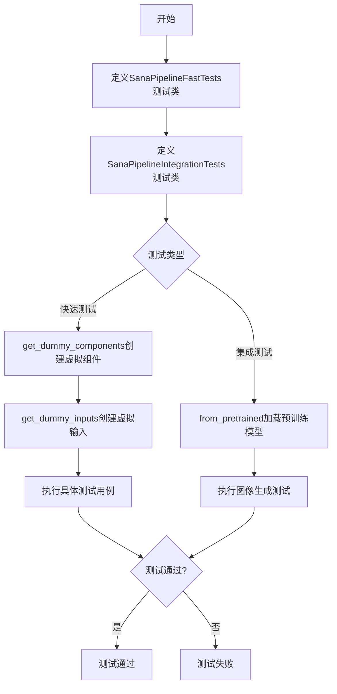

## 类结构

```
unittest.TestCase (基类)
├── SanaPipelineFastTests (管道快速测试类)
│   ├── get_dummy_components (创建虚拟组件)
│   ├── get_dummy_inputs (创建虚拟输入)
│   ├── test_inference (推理测试)
│   ├── test_callback_inputs (回调输入测试)
│   ├── test_attention_slicing_forward_pass (注意力切片测试)
│   ├── test_vae_tiling (VAE平铺测试)
│   ├── test_float16_inference (float16推理测试)
│   └── test_layerwise_casting_inference (分层类型转换测试)
└── SanaPipelineIntegrationTests (管道集成测试类)
    ├── setUp (测试前设置)
    ├── tearDown (测试后清理)
    ├── test_sana_1024 (1024分辨率测试)
    └── test_sana_512 (512分辨率测试)
```

## 全局变量及字段


### `IS_GITHUB_ACTIONS`
    
Flag indicating whether the code is running in GitHub Actions environment

类型：`bool`
    


### `slow`
    
Decorator to mark tests as slow, requiring extended execution time

类型：`decorator`
    


### `require_torch_accelerator`
    
Decorator to ensure tests require a PyTorch accelerator (GPU) to run

类型：`decorator`
    


### `enable_full_determinism`
    
Function to enable full deterministic operations for reproducibility

类型：`function`
    


### `SanaPipelineFastTests.pipeline_class`
    
The pipeline class being tested, set to SanaPipeline

类型：`Type[SanaPipeline]`
    


### `SanaPipelineFastTests.params`
    
Set of text-to-image parameters used for testing, excluding cross_attention_kwargs

类型：`frozenset`
    


### `SanaPipelineFastTests.batch_params`
    
Set of batch parameters for text-to-image generation testing

类型：`frozenset`
    


### `SanaPipelineFastTests.image_params`
    
Set of image parameters for text-to-image generation testing

类型：`frozenset`
    


### `SanaPipelineFastTests.image_latents_params`
    
Set of image latents parameters for text-to-image generation testing

类型：`frozenset`
    


### `SanaPipelineFastTests.required_optional_params`
    
Frozenset of optional parameters that are required for the pipeline inference

类型：`frozenset`
    


### `SanaPipelineFastTests.test_xformers_attention`
    
Flag to control xformers attention testing, set to False for this pipeline

类型：`bool`
    


### `SanaPipelineFastTests.test_layerwise_casting`
    
Flag to enable layerwise casting tests, set to True

类型：`bool`
    


### `SanaPipelineFastTests.test_group_offloading`
    
Flag to enable group offloading tests, set to True

类型：`bool`
    


### `SanaPipelineIntegrationTests.prompt`
    
Default prompt used for integration testing: 'A painting of a squirrel eating a burger.'

类型：`str`
    
    

## 全局函数及方法


### `enable_full_determinism`

该函数用于启用深度学习框架的完全确定性（determinism）模式，以确保测试或实验结果的可复现性。通过设置各种随机种子和环境变量，尽可能减少随机性对结果的影响。

参数：暂无（该函数在代码中以无参数形式调用，可能在定义时包含可选参数或默认参数）

返回值：暂无信息（根据函数名推断应为 `None`）

#### 流程图

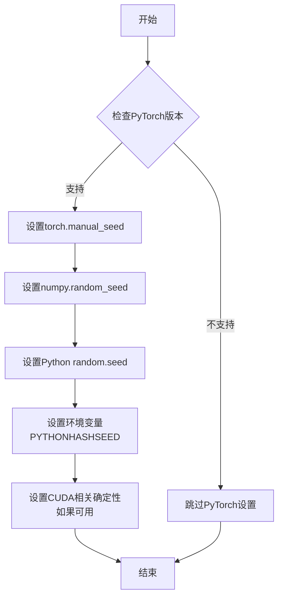

> **注意**：由于给定代码中仅包含该函数的导入和调用语句，未提供函数的具体定义，以上流程图基于同类库的常见实现方式推断。

#### 带注释源码

```python
# 以下为代码中对该函数的使用方式（非定义）
from ...testing_utils import (
    IS_GITHUB_ACTIONS,
    backend_empty_cache,
    enable_full_determinism,  # 从testing_utils模块导入
    require_torch_accelerator,
    slow,
    torch_device,
)

# 调用该函数以确保测试的可复现性
enable_full_determinism()
```

> **补充说明**：根据函数名称和调用上下文推断，`enable_full_determinism` 函数应负责设置各种随机种子（Python、NumPy、PyTorch）以及可能的CUDA确定性计算选项，以确保测试结果的一致性和可复现性。由于原始代码中未包含该函数的完整定义，以上信息基于行业常见实现模式推测得出。


### `backend_empty_cache`

该函数是一个测试工具函数，用于清空 GPU/CUDA 缓存，释放 GPU 内存资源，确保测试环境内存充足。

参数：

- `device`：`str`，PyTorch 设备标识符（如 "cuda", "cpu", "cuda:0" 等），指定需要清空缓存的设备。

返回值：`None`，无返回值，仅执行缓存清理操作。

#### 流程图

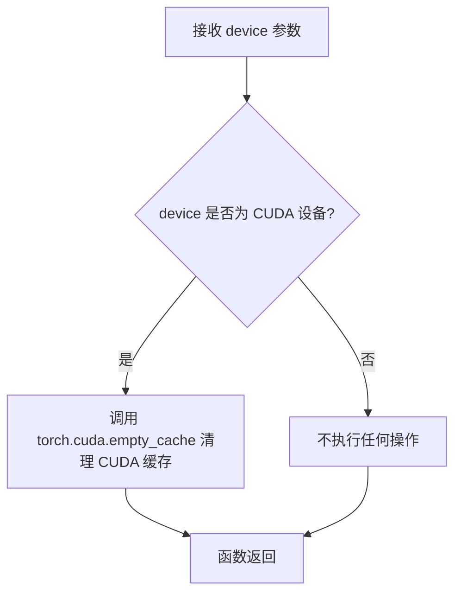

#### 带注释源码

```python
# backend_empty_cache 函数定义（位于 testing_utils 模块中）
# 此函数用于清理GPU缓存，释放显存

def backend_empty_cache(device):
    """
    清空指定设备的GPU缓存
    
    参数:
        device: str, PyTorch设备标识符（如"cuda", "cuda:0", "cpu"等）
        
    返回值:
        None: 无返回值，仅执行缓存清理操作
        
    注意:
        - 如果device不是CUDA设备，此函数不会执行任何操作
        - 在测试的setUp和tearDown中被调用，确保测试间内存清洁
    """
    # 判断是否为CUDA设备（包含'cuda'字符串）
    if "cuda" in str(device):
        # 调用PyTorch的CUDA缓存清理函数
        torch.cuda.empty_cache()
    
    # 如果device是CPU或其他非CUDA设备，函数直接返回，不执行任何操作
```

#### 在测试类中的使用示例

```python
class SanaPipelineIntegrationTests(unittest.TestCase):
    """SanaPipeline集成测试类"""
    
    def setUp(self):
        """测试前置设置：垃圾回收并清空GPU缓存"""
        super().setUp()
        gc.collect()  # 触发Python垃圾回收
        backend_empty_cache(torch_device)  # 清空GPU缓存
    
    def tearDown(self):
        """测试后置清理：垃圾回收并清空GPU缓存"""
        super().tearDown()
        gc.collect()  # 触发Python垃圾回收
        backend_empty_cache(torch_device)  # 清空GPU缓存，确保释放显存
```


### `to_np`

`to_np` 是一个全局工具函数，用于将 PyTorch 张量（torch.Tensor）安全地转换为 NumPy 数组（np.ndarray），以便进行数值计算和比较。该函数是测试框架中的关键工具，确保在不同设备（CPU/GPU）上的张量都能被正确转换为 NumPy 格式进行后续处理。

参数：

-  `possible_tensor_or_array`：可以是 `torch.Tensor`、`np.ndarray` 或 `None`，输入的 PyTorch 张量或 NumPy 数组

返回值：`np.ndarray` 或 `None`，返回转换后的 NumPy 数组，如果输入为 None 则返回 None

#### 流程图

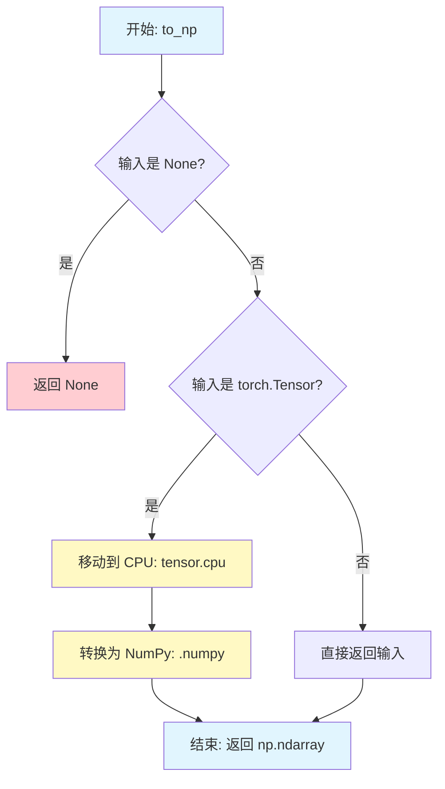

#### 带注释源码

```python
def to_np(possible_tensor_or_array):
    """
    将 PyTorch 张量转换为 NumPy 数组的辅助函数。
    
    此函数用于测试中，将可能来自 GPU 的 PyTorch 张量转换为 CPU 上的 NumPy 数组，
    以便进行数值比较和断言。
    
    参数:
        possible_tensor_or_array: 可以是 torch.Tensor, np.ndarray 或 None
        
    返回:
        转换后的 np.ndarray 或原始输入（如果已是 numpy 数组或 None）
    """
    # 检查输入是否为 None，如果是则直接返回
    if possible_tensor_or_array is None:
        return None
    
    # 检查输入是否为 PyTorch 张量
    if isinstance(possible_tensor_or_array, torch.Tensor):
        # 将张量从当前设备（可能是 GPU）移动到 CPU
        # 然后转换为 NumPy 数组并返回
        return possible_tensor_or_array.cpu().numpy()
    
    # 如果已经是 NumPy 数组或其他类型，直接返回
    return possible_tensor_or_array
```

#### 补充说明

`to_np` 函数在测试文件中的使用场景：

1. **跨设备测试**：在 `test_attention_slicing_forward_pass` 中比较不同注意力切片策略的输出差异
2. **VAE 分块测试**：在 `test_vae_tiling` 中比较有无平铺分块技术的输出一致性
3. **数值比较**：由于 PyTorch 张量和 NumPy 数组的数学运算API不同，需要统一转换为 NumPy 进行 max、abs 等数值计算

该函数的设计体现了以下最佳实践：
- 优雅处理 None 输入，避免后续代码的空指针异常
- 自动处理设备迁移（CPU/GPU），测试代码无需关心张量所在设备
- 非侵入式设计，对已转换的数组直接透传


### `PipelineTesterMixin`

**注意**：在提供的代码文件中，`PipelineTesterMixin` 并不是直接定义的，而是通过继承关系被使用。该类是从 `..test_pipelines_common` 模块导入的混合类（Mixin），为测试管道提供通用的测试方法和工具。

在当前代码中，`SanaPipelineFastTests` 类继承自 `PipelineTesterMixin`，这意味着它可以使用 `PipelineTesterMixin` 中定义的所有测试方法。

#### 使用情况

`PipelineTesterMixin` 在代码中被以下类继承：

- `SanaPipelineFastTests` (第 45 行)

#### 继承关系

```python
class SanaPipelineFastTests(PipelineTesterMixin, unittest.TestCase):
    pipeline_class = SanaPipeline
    # ... 其他属性和方法
```

#### 推断的 PipelineTesterMixin 功能

由于 `PipelineTesterMixin` 是从外部模块导入的，以下是根据 `SanaPipelineFastTests` 类中调用父类方法推断出的 `PipelineTesterMixin` 可能包含的功能：

#### 流程图

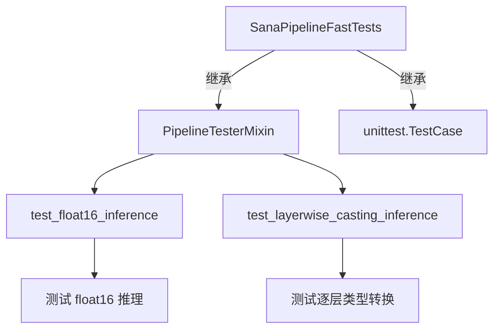

#### 源码引用

```python
# 第 45 行：PipelineTesterMixin 的使用
class SanaPipelineFastTests(PipelineTesterMixin, unittest.TestCase):
    pipeline_class = SanaPipeline
    # ...

# 第 254 行：调用父类 test_float16_inference 方法
def test_float16_inference(self):
    # Requires higher tolerance as model seems very sensitive to dtype
    super().test_float16_inference(expected_max_diff=0.08)

# 第 259 行：调用父类 test_layerwise_casting_inference 方法
@unittest.skipIf(IS_GITHUB_ACTIONS, reason="Skipping test inside GitHub Actions environment")
def test_layerwise_casting_inference(self):
    super().test_layerwise_casting_inference()
```

#### 说明

由于 `PipelineTesterMixin` 的定义不在当前代码文件中，无法提供其完整的类字段和方法详细信息。建议查看 `diffusers` 库中的 `test_pipelines_common` 模块以获取 `PipelineTesterMixin` 的完整定义。


### `SanaPipelineFastTests.get_dummy_components`

该方法用于在测试场景中创建虚拟（dummy）组件，返回一个包含 SanaPipeline 所需的所有核心组件（Transformer、VAE、Scheduler、Text Encoder、Tokenizer）的字典，以供后续的推理测试使用。

参数：

- 无（仅包含 `self` 参数）

返回值：`Dict[str, Any]`，返回一个包含以下键的字典：
- `"transformer"`：SanaTransformer2DModel 实例
- `"vae"`：AutoencoderDC 实例
- `"scheduler"`：FlowMatchEulerDiscreteScheduler 实例
- `"text_encoder"`：Gemma2Model 实例
- `"tokenizer"`：GemmaTokenizer 实例

#### 流程图

```mermaid
flowchart TD
    A[开始 get_dummy_components] --> B[设置随机种子 torch.manual_seed(0)]
    B --> C[创建 SanaTransformer2DModel<br/>patch_size=1, in_channels=4<br/>num_layers=1, num_attention_heads=2]
    C --> D[设置随机种子 torch.manual_seed(0)]
    D --> E[创建 AutoencoderDC<br/>in_channels=3, latent_channels=4<br/>encoder/decoder_block_types等]
    E --> F[设置随机种子 torch.manual_seed(0)]
    F --> G[创建 FlowMatchEulerDiscreteScheduler<br/>shift=7.0]
    G --> H[设置随机种子 torch.manual_seed(0)]
    H --> I[创建 Gemma2Config<br/>hidden_size=8, vocab_size=8<br/>num_hidden_layers=1]
    I --> J[使用配置创建 Gemma2Model]
    J --> K[从预训练加载 GemmaTokenizer<br/>hf-internal-testing/dummy-gemma]
    K --> L[组装 components 字典]
    L --> M[返回 components]
```

#### 带注释源码

```python
def get_dummy_components(self):
    """
    创建用于测试的虚拟组件。
    通过固定随机种子确保每次调用生成相同的组件，
    以保证测试的可重复性。
    """
    # 为 Transformer 设置随机种子，确保可重复性
    torch.manual_seed(0)
    # 创建虚拟的 SanaTransformer2DModel
    # 参数使用最小的测试配置：1层，2个注意力头
    transformer = SanaTransformer2DModel(
        patch_size=1,               # patch 大小
        in_channels=4,              # 输入通道数
        out_channels=4,             # 输出通道数
        num_layers=1,               # 层数（最小测试配置）
        num_attention_heads=2,      # 注意力头数
        attention_head_dim=4,       # 注意力头维度
        num_cross_attention_heads=2,# 交叉注意力头数
        cross_attention_head_dim=4, # 交叉注意力头维度
        cross_attention_dim=8,      # 交叉注意力维度
        caption_channels=8,         #  caption 通道数
        sample_size=32,            # 样本大小
    )

    # 为 VAE 设置随机种子
    torch.manual_seed(0)
    # 创建虚拟的 AutoencoderDC (Decoder-Encoder)
    # 使用 EfficientViTBlock 和 ResBlock 组合
    vae = AutoencoderDC(
        in_channels=3,                          # 输入通道 (RGB)
        latent_channels=4,                      # 潜在空间通道数
        attention_head_dim=2,                   # 注意力头维度
        # 编码器块类型：ResNet 块 + EfficientViT 块
        encoder_block_types=(
            "ResBlock",
            "EfficientViTBlock",
        ),
        # 解码器块类型
        decoder_block_types=(
            "ResBlock",
            "EfficientViTBlock",
        ),
        # 编码器输出通道
        encoder_block_out_channels=(8, 8),
        # 解码器输出通道
        decoder_block_out_channels=(8, 8),
        # 编码器 QKV 多尺度
        encoder_qkv_multiscales=((), (5,)),
        # 解码器 QKV 多尺度
        decoder_qkv_multiscales=((), (5,)),
        # 每块编码器层数
        encoder_layers_per_block=(1, 1),
        # 每块解码器层数
        decoder_layers_per_block=[1, 1],
        # 下采样块类型
        downsample_block_type="conv",
        # 上采样块类型
        upsample_block_type="interpolate",
        # 解码器归一化类型
        decoder_norm_types="rms_norm",
        # 解码器激活函数
        decoder_act_fns="silu",
        # 缩放因子
        scaling_factor=0.41407,
    )

    # 为调度器设置随机种子
    torch.manual_seed(0)
    # 创建 FlowMatchEulerDiscreteScheduler
    # shift 参数影响噪声调度的时间步分布
    scheduler = FlowMatchEulerDiscreteScheduler(shift=7.0)

    # 为文本编码器设置随机种子
    torch.manual_seed(0)
    # 创建虚拟的 Gemma2 文本编码器配置
    # 使用极小的配置以加快测试速度
    text_encoder_config = Gemma2Config(
        head_dim=16,                # 头维度
        hidden_size=8,             # 隐藏层大小
        initializer_range=0.02,    # 初始化范围
        intermediate_size=64,      # 中间层大小
        max_position_embeddings=8192, # 最大位置嵌入
        model_type="gemma2",       # 模型类型
        num_attention_heads=2,     # 注意力头数
        num_hidden_layers=1,       # 隐藏层数（最小配置）
        num_key_value_heads=2,     # KV 头数
        vocab_size=8,              # 词汇表大小（极小）
        attn_implementation="eager", # 注意力实现方式
    )
    # 使用配置创建 Gemma2Model
    text_encoder = Gemma2Model(text_encoder_config)
    # 从预训练加载虚拟 tokenizer
    # 使用 huggingface 测试用的虚拟模型
    tokenizer = GemmaTokenizer.from_pretrained("hf-internal-testing/dummy-gemma")

    # 组装所有组件到字典中
    components = {
        "transformer": transformer,   # Transformer 模型
        "vae": vae,                   # VAE 模型
        "scheduler": scheduler,      # 调度器
        "text_encoder": text_encoder,# 文本编码器
        "tokenizer": tokenizer,       # 分词器
    }
    return components  # 返回组件字典
```


### `SanaPipelineFastTests.get_dummy_inputs`

该方法用于生成 SanaPipeline 测试所需的虚拟输入参数，根据设备类型（MPS或其他）创建随机数生成器，并返回一个包含提示词、负提示词、生成器、推理步数、引导_scale、图像尺寸等完整测试参数的字典对象。

参数：

- `self`：实例方法隐含的自身参数，表示 `SanaPipelineFastTests` 类的实例
- `device`：`str` 或 `torch.device`，目标设备，用于创建随机数生成器，如果设备是 MPS 则使用特殊的种子设置方式
- `seed`：`int`，随机种子，默认值为 0，用于确保测试的可重复性

返回值：`Dict[str, Any]`，返回一个包含以下键的字典：
- `prompt`：空字符串，默认提示词
- `negative_prompt`：空字符串，负向提示词
- `generator`：`torch.Generator`，PyTorch 随机数生成器
- `num_inference_steps`：整数 2，推理步数
- `guidance_scale`：浮点数 6.0，引导 scale
- `height`：整数 32，生成图像高度
- `width`：整数 32，生成图像宽度
- `max_sequence_length`：整数 16，最大序列长度
- `output_type`：字符串 "pt"，输出类型为 PyTorch 张量
- `complex_human_instruction`：None，复杂人类指令（可选）

#### 流程图

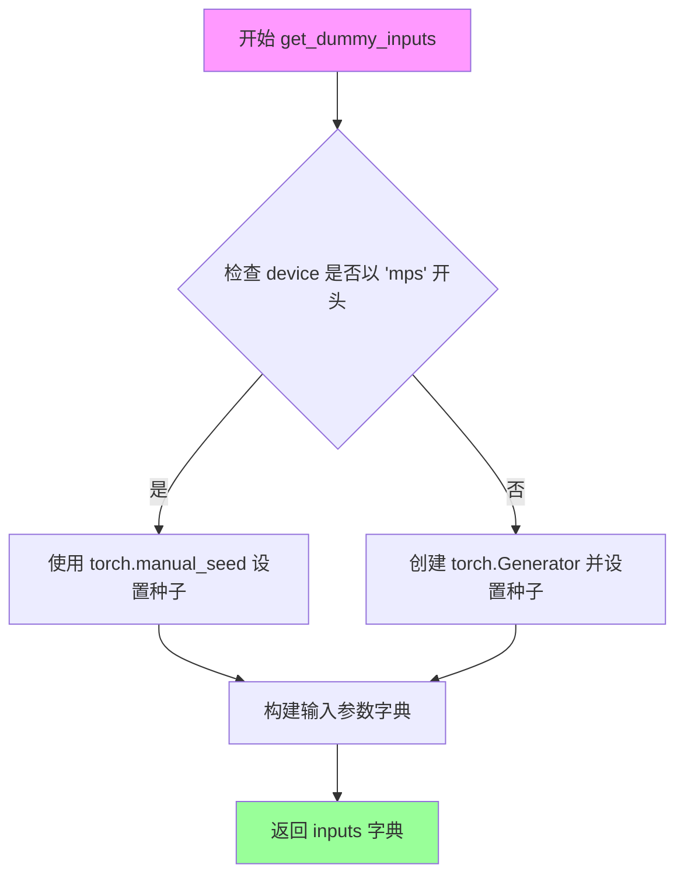

#### 带注释源码

```python
def get_dummy_inputs(self, device, seed=0):
    """
    生成用于测试 SanaPipeline 的虚拟输入参数。
    
    参数:
        device: 目标设备，用于创建随机数生成器
        seed: 随机种子，默认值为 0
    
    返回:
        包含所有测试参数的字典
    """
    # 判断设备是否为 MPS (Apple Silicon)
    if str(device).startswith("mps"):
        # MPS 设备使用 torch.manual_seed 直接设置种子
        generator = torch.manual_seed(seed)
    else:
        # 其他设备（如 CPU、CUDA）创建带有指定设备的生成器
        generator = torch.Generator(device=device).manual_seed(seed)
    
    # 构建完整的测试输入参数字典
    inputs = {
        "prompt": "",                      # 输入文本提示词（测试用空字符串）
        "negative_prompt": "",             # 负向提示词，用于排除不需要的内容
        "generator": generator,           # 随机数生成器，确保可重复性
        "num_inference_steps": 2,         # 扩散模型推理步数
        "guidance_scale": 6.0,            # Classifier-free guidance 的权重
        "height": 32,                     # 生成图像的高度（像素）
        "width": 32,                      # 生成图像的宽度（像素）
        "max_sequence_length": 16,        # 文本编码器的最大序列长度
        "output_type": "pt",              # 输出格式为 PyTorch 张量
        "complex_human_instruction": None, # 复杂人类指令（可选字段）
    }
    return inputs
```


### `SanaPipelineFastTests.test_inference`

该测试方法用于验证 SanaPipeline 的基本推理功能，通过创建虚拟组件和输入，执行管道推理，并验证输出图像的形状和数值合理性。

参数：

- `self`：隐式参数，测试类实例本身，无需额外描述

返回值：`None`，该方法为测试用例，通过断言验证结果，不返回实际数据

#### 流程图

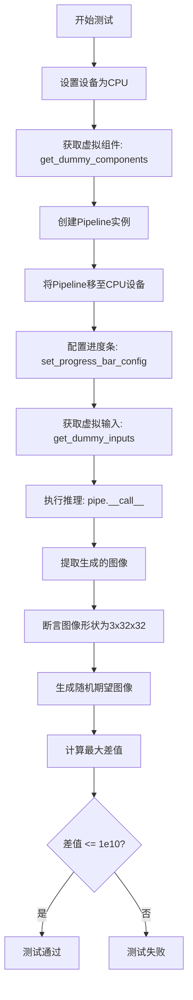

#### 带注释源码

```python
def test_inference(self):
    """
    测试 SanaPipeline 的基本推理功能。
    
    该测试执行以下步骤：
    1. 创建虚拟组件（transformer, vae, scheduler, text_encoder, tokenizer）
    2. 使用虚拟组件初始化 pipeline
    3. 将 pipeline 移至指定设备（CPU）
    4. 创建虚拟输入参数
    5. 执行推理生成图像
    6. 验证输出图像的形状和数值范围
    """
    # 设置测试设备为 CPU
    device = "cpu"

    # 获取预定义的虚拟组件，用于测试
    # 包含: transformer, vae, scheduler, text_encoder, tokenizer
    components = self.get_dummy_components()
    
    # 使用虚拟组件实例化 SanaPipeline
    pipe = self.pipeline_class(**components)
    
    # 将 pipeline 移至 CPU 设备
    pipe.to(device)
    
    # 配置进度条，disable=None 表示不禁用进度条
    pipe.set_progress_bar_config(disable=None)

    # 获取虚拟输入参数
    # 包含: prompt, negative_prompt, generator, num_inference_steps,
    #       guidance_scale, height, width, max_sequence_length, 
    #       output_type, complex_human_instruction
    inputs = self.get_dummy_inputs(device)
    
    # 执行管道推理，pipe(**inputs) 返回包含图像的元组
    # [0] 取第一个元素（图像），再取 [0] 获取第一张图像
    image = pipe(**inputs)[0]
    generated_image = image[0]

    # 断言验证：生成的图像形状应为 (3, 32, 32)
    # 3 表示 RGB 通道数，32x32 表示图像高度和宽度
    self.assertEqual(generated_image.shape, (3, 32, 32))
    
    # 生成随机期望图像用于比较
    expected_image = torch.randn(3, 32, 32)
    
    # 计算生成图像与随机图像的最大绝对差值
    # 这是一个宽松的验证，主要确保没有 NaN 或极大的数值异常
    max_diff = np.abs(generated_image - expected_image).max()
    
    # 断言差值在合理范围内（<= 1e10）
    # 注意：这是一个非常宽松的上限，主要用于检测数值溢出等严重问题
    self.assertLessEqual(max_diff, 1e10)
```


### `SanaPipelineFastTests.test_callback_inputs`

该测试方法用于验证 SanaPipeline 的回调功能是否正常工作，特别是检查 `callback_on_step_end` 和 `callback_on_step_end_tensor_inputs` 参数的正确性，确保回调函数只能访问允许的 tensor 变量列表。

参数：

- `self`：`SanaPipelineFastTests`，测试类实例本身

返回值：`None`，该方法为测试方法，无返回值

#### 流程图

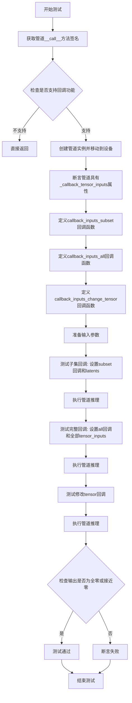

#### 带注释源码

```python
def test_callback_inputs(self):
    """
    测试 SanaPipeline 的回调输入功能
    
    该测试验证:
    1. 管道支持 callback_on_step_end 和 callback_on_step_end_tensor_inputs 参数
    2. 回调函数只能访问 _callback_tensor_inputs 中定义的 tensor 变量
    3. 回调函数可以修改 latents 等 tensor 值
    """
    # 获取管道 __call__ 方法的签名
    sig = inspect.signature(self.pipeline_class.__call__)
    
    # 检查管道是否支持回调相关的参数
    has_callback_tensor_inputs = "callback_on_step_end_tensor_inputs" in sig.parameters
    has_callback_step_end = "callback_on_step_end" in sig.parameters

    # 如果不支持回调功能，直接返回（跳过测试）
    if not (has_callback_tensor_inputs and has_callback_step_end):
        return

    # 创建管道组件和管道实例
    components = self.get_dummy_components()
    pipe = self.pipeline_class(**components)
    pipe = pipe.to(torch_device)  # 移动到测试设备
    pipe.set_progress_bar_config(disable=None)
    
    # 断言管道必须有 _callback_tensor_inputs 属性
    # 该属性定义了回调函数可以使用的 tensor 变量列表
    self.assertTrue(
        hasattr(pipe, "_callback_tensor_inputs"),
        f" {self.pipeline_class} should have `_callback_tensor_inputs` that defines a list of tensor variables its callback function can use as inputs",
    )

    # 定义回调函数：仅使用 tensor 输入的子集
    def callback_inputs_subset(pipe, i, t, callback_kwargs):
        """
        回调函数：验证只传递了允许的 tensor 输入
        
        参数:
            pipe: 管道实例
            i: 当前步骤索引
            t: 当前时间步
            callback_kwargs: 回调关键字参数字典
        
        返回:
            callback_kwargs: 返回未修改的回调参数
        """
        # 遍历回调参数中的所有 tensor
        for tensor_name, tensor_value in callback_kwargs.items():
            # 检查每个 tensor 都在允许列表中
            assert tensor_name in pipe._callback_tensor_inputs

        return callback_kwargs

    # 定义回调函数：使用所有允许的 tensor 输入
    def callback_inputs_all(pipe, i, t, callback_kwargs):
        """
        回调函数：验证所有允许的 tensor 输入都被传递
        
        参数:
            pipe: 管道实例
            i: 当前步骤索引
            t: 当前时间步
            callback_kwargs: 回调关键字参数字典
        
        返回:
            callback_kwargs: 返回未修改的回调参数
        """
        # 检查所有允许的 tensor 都在回调参数中
        for tensor_name in pipe._callback_tensor_inputs:
            assert tensor_name in callback_kwargs

        # 遍历回调参数中的所有 tensor
        for tensor_name, tensor_value in callback_kwargs.items():
            # 再次验证每个 tensor 都在允许列表中
            assert tensor_name in pipe._callback_tensor_inputs

        return callback_kwargs

    # 获取测试输入
    inputs = self.get_dummy_inputs(torch_device)

    # === 测试1: 传递 tensor 输入的子集 ===
    # 设置回调函数为 subset 版本
    inputs["callback_on_step_end"] = callback_inputs_subset
    # 只允许回调访问 latents
    inputs["callback_on_step_end_tensor_inputs"] = ["latents"]
    # 执行管道推理
    output = pipe(**inputs)[0]

    # === 测试2: 传递所有允许的 tensor 输入 ===
    # 设置回调函数为 all 版本
    inputs["callback_on_step_end"] = callback_inputs_all
    # 使用管道定义的所有允许 tensor 输入
    inputs["callback_on_step_end_tensor_inputs"] = pipe._callback_tensor_inputs
    # 执行管道推理
    output = pipe(**inputs)[0]

    # 定义回调函数：在最后一步修改 latents 为零
    def callback_inputs_change_tensor(pipe, i, t, callback_kwargs):
        """
        回调函数：在最后一步将 latents 修改为零 tensor
        
        参数:
            pipe: 管道实例
            i: 当前步骤索引
            t: 当前时间步
            callback_kwargs: 回调关键字参数字典
        
        返回:
            callback_kwargs: 返回修改后的回调参数
        """
        # 检查是否是最后一步
        is_last = i == (pipe.num_timesteps - 1)
        if is_last:
            # 将 latents 修改为全零 tensor
            callback_kwargs["latents"] = torch.zeros_like(callback_kwargs["latents"])
        return callback_kwargs

    # === 测试3: 通过回调修改 tensor ===
    inputs["callback_on_step_end"] = callback_inputs_change_tensor
    inputs["callback_on_step_end_tensor_inputs"] = pipe._callback_tensor_inputs
    # 执行管道推理
    output = pipe(**inputs)[0]
    
    # 验证输出接近全零（因为我们在最后一步将 latents 置零）
    assert output.abs().sum() < 1e10
```


### `SanaPipelineFastTests.test_attention_slicing_forward_pass`

该方法是一个单元测试函数，用于验证 SanaPipeline 在启用注意力切片（attention slicing）功能时，前向传播的结果应与未启用时保持一致（即注意力切片不应影响推理结果）。测试通过比较不同 slice_size 配置下的输出与基准输出的差异来验证功能正确性。

参数：

- `test_max_difference`：`bool`，默认值为 `True`，是否测试输出之间的最大差异
- `test_mean_pixel_difference`：`bool`，默认值为 `True`，是否测试输出之间的平均像素差异
- `expected_max_diff`：`float`，默认值为 `1e-3`，允许的最大差异阈值

返回值：`None`，该方法为 `unittest.TestCase` 的测试方法，无返回值（通过 `assert` 语句验证）

#### 流程图

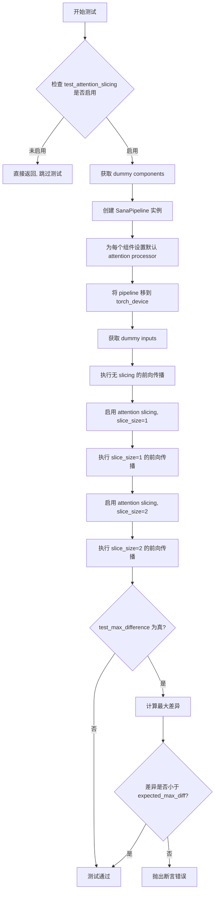

#### 带注释源码

```python
def test_attention_slicing_forward_pass(
    self, test_max_difference=True, test_mean_pixel_difference=True, expected_max_diff=1e-3
):
    """
    测试注意力切片功能的前向传播是否与基准一致。
    
    参数:
        test_max_difference: bool, 是否测试最大差异
        test_mean_pixel_difference: bool, 是否测试平均像素差异
        expected_max_diff: float, 允许的最大差异阈值
    """
    # 检查是否启用了注意力切片测试（类属性）
    if not self.test_attention_slicing:
        return

    # 1. 获取预定义的测试组件（transformer, vae, scheduler, text_encoder, tokenizer）
    components = self.get_dummy_components()
    
    # 2. 使用这些组件初始化 SanaPipeline
    pipe = self.pipeline_class(**components)
    
    # 3. 遍历所有组件，为每个有 set_default_attn_processor 方法的组件设置默认的注意力处理器
    for component in pipe.components.values():
        if hasattr(component, "set_default_attn_processor"):
            component.set_default_attn_processor()
    
    # 4. 将 pipeline 移到指定的计算设备（如 CUDA 设备）
    pipe.to(torch_device)
    
    # 5. 配置进度条（disable=None 表示不禁用进度条）
    pipe.set_progress_bar_config(disable=None)

    # 6. 生成器设备为 CPU
    generator_device = "cpu"
    
    # 7. 获取默认的测试输入参数（包含 prompt, generator, num_inference_steps 等）
    inputs = self.get_dummy_inputs(generator_device)
    
    # 8. 执行不带注意力切片的前向传播，作为基准输出
    output_without_slicing = pipe(**inputs)[0]

    # 9. 启用注意力切片，slice_size=1（将注意力计算分块为大小为1的片段）
    pipe.enable_attention_slicing(slice_size=1)
    
    # 10. 重新获取测试输入（使用相同的随机种子生成器）
    inputs = self.get_dummy_inputs(generator_device)
    
    # 11. 执行带 slice_size=1 的前向传播
    output_with_slicing1 = pipe(**inputs)[0]

    # 12. 启用注意力切片，slice_size=2（分块大小为2）
    pipe.enable_attention_slicing(slice_size=2)
    
    # 13. 重新获取测试输入
    inputs = self.get_dummy_inputs(generator_device)
    
    # 14. 执行带 slice_size=2 的前向传播
    output_with_slicing2 = pipe(**inputs)[0]

    # 15. 如果需要测试最大差异
    if test_max_difference:
        # 将输出转换为 numpy 数组并计算最大差异
        # 比较 slice_size=1 与基准的差异
        max_diff1 = np.abs(to_np(output_with_slicing1) - to_np(output_without_slicing)).max()
        # 比较 slice_size=2 与基准的差异
        max_diff2 = np.abs(to_np(output_with_slicing2) - to_np(output_without_slicing)).max()
        
        # 断言：两个差异中的最大值应小于预期阈值
        self.assertLess(
            max(max_diff1, max_diff2),
            expected_max_diff,
            "Attention slicing should not affect the inference results",
        )
```


### `SanaPipelineFastTests.test_vae_tiling`

该测试方法用于验证 SanaPipeline 中 VAE（变分自编码器）的平铺（Tiling）功能是否正常工作。通过比较启用平铺前后的推理结果差异，确保 VAE 平铺不会影响图像生成的质量。

参数：

- `self`：隐含的实例参数，类型为 `SanaPipelineFastTests`，表示测试类的实例本身
- `expected_diff_max`：`float`，期望的最大差异阈值，默认为 0.2，用于判断启用平铺前后的输出差异是否在可接受范围内

返回值：`None`，该方法为单元测试方法，通过断言来验证结果，不返回具体数值

#### 流程图

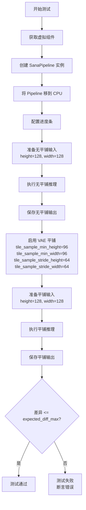

#### 带注释源码

```python
def test_vae_tiling(self, expected_diff_max: float = 0.2):
    """
    测试 VAE 平铺功能是否正常工作。
    
    该测试通过比较启用平铺前后的推理结果，验证 VAE 平铺
    不会对图像生成质量产生显著影响。
    
    参数:
        expected_diff_max: float, 期望的最大差异阈值，默认为 0.2
    """
    # 设置生成器设备为 CPU
    generator_device = "cpu"
    
    # 获取虚拟组件（包含虚拟的 transformer、vae、scheduler 等）
    components = self.get_dummy_components()

    # 使用虚拟组件创建 SanaPipeline 实例
    pipe = self.pipeline_class(**components)
    
    # 将 Pipeline 移到 CPU 设备
    pipe.to("cpu")
    
    # 配置进度条（disable=None 表示不禁用进度条）
    pipe.set_progress_bar_config(disable=None)

    # ---------------------- 无平铺推理 ----------------------
    # 获取虚拟输入参数
    inputs = self.get_dummy_inputs(generator_device)
    
    # 设置图像尺寸为 128x128
    inputs["height"] = inputs["width"] = 128
    
    # 执行推理（不使用 VAE 平铺）
    output_without_tiling = pipe(**inputs)[0]

    # ---------------------- 启用平铺 ----------------------
    # 为 VAE 启用平铺功能，设置平铺参数
    # tile_sample_min_height/width: 最小平铺块高度/宽度
    # tile_sample_stride_height/width: 平铺块移动步长
    pipe.vae.enable_tiling(
        tile_sample_min_height=96,
        tile_sample_min_width=96,
        tile_sample_stride_height=64,
        tile_sample_stride_width=64,
    )
    
    # 重新获取虚拟输入参数（重置状态）
    inputs = self.get_dummy_inputs(generator_device)
    
    # 再次设置图像尺寸为 128x128
    inputs["height"] = inputs["width"] = 128
    
    # 执行推理（使用 VAE 平铺）
    output_with_tiling = pipe(**inputs)[0]

    # ---------------------- 验证结果 ----------------------
    # 断言：平铺前后的输出差异应小于预期最大差异
    # to_np() 函数将 PyTorch 张量转换为 NumPy 数组
    self.assertLess(
        (to_np(output_without_tiling) - to_np(output_with_tiling)).max(),
        expected_diff_max,
        "VAE tiling should not affect the inference results",
    )
```


### `SanaPipelineFastTests.test_inference_batch_consistent`

该方法是 `SanaPipelineFastTests` 测试类中的一个测试用例，用于验证批量推理的一致性。由于使用了非常小的词汇表进行快速测试，任何非空的默认提示都会导致嵌入查找错误，因此该测试被跳过。

参数：

- `self`：无，显式参数，表示测试类实例本身

返回值：`None`，该方法不返回任何值（方法体为 `pass`）

#### 流程图

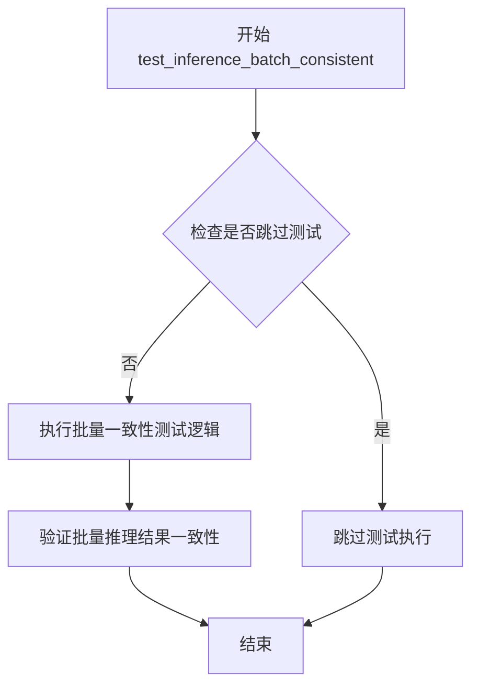

#### 带注释源码

```python
@unittest.skip(
    "A very small vocab size is used for fast tests. So, Any kind of prompt other than the empty default used in other tests will lead to a embedding lookup error. This test uses a long prompt that causes the error."
)
def test_inference_batch_consistent(self):
    """
    测试批量推理的一致性。
    
    该测试被跳过是因为在快速测试中使用了非常小的词汇表（vocab size），
    任何非空的提示符（除了使用的空默认提示符）都会导致嵌入查找错误。
    该测试使用了长提示符，会触发该错误。
    
    参数:
        self: 测试类实例
        
    返回值:
        None
    """
    pass  # 空方法体，测试被跳过
```


### `SanaPipelineFastTests.test_inference_batch_single_identical`

这是一个被跳过的单元测试方法，用于测试 Sana 管道在批量推理时，单个样本的生成结果应与单独推理时完全一致。由于测试使用了极小的词汇表，任何非空提示都会导致嵌入查找错误，因此该测试被跳过。

参数：

- `self`：`SanaPipelineFastTests` 实例，隐含的测试类方法参数，表示当前测试实例

返回值：`None`，该方法没有返回值（仅包含 `pass` 语句）

#### 流程图

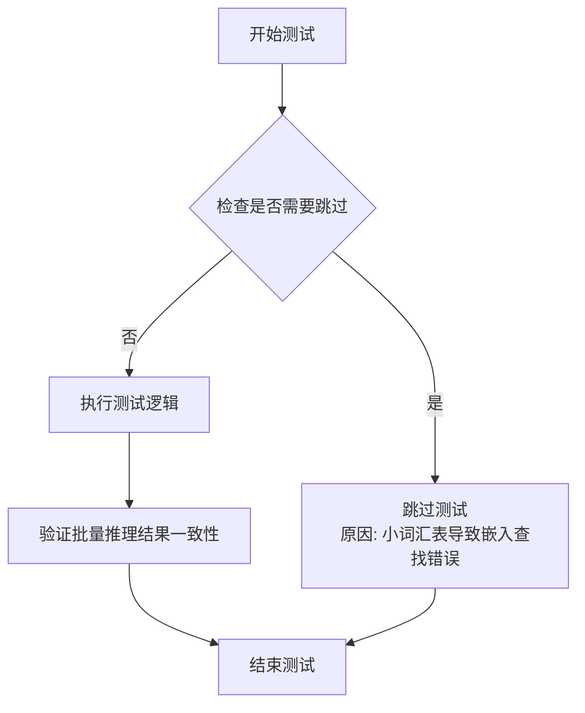

#### 带注释源码

```python
@unittest.skip(
    "A very small vocab size is used for fast tests. So, Any kind of prompt other than the empty default used in other tests will lead to a embedding lookup error. This test uses a long prompt that causes the error."
)
def test_inference_batch_single_identical(self):
    """
    测试批量推理时单个样本与单独推理的结果一致性。
    
    该测试用于验证：
    1. 批量推理模式下，每个单独的样本生成的图像应与单独调用管道时生成的图像完全一致
    2. 确保管道的批量处理逻辑没有引入随机性或状态污染
    
    当前状态：被跳过
    跳过原因：测试使用了极小的词汇表（vocab_size=8），任何非空提示都会导致
    torch.nn.Embedding 层的索引越界错误，因为提示中的token id超出了词汇表范围。
    """
    pass
```


### `SanaPipelineFastTests.test_float16_inference`

这是 `SanaPipelineFastTests` 类中的一个测试方法，用于验证 Sana 模型在 float16（半精度）推理模式下的正确性。该方法通过调用父类的 `test_float16_inference` 方法执行测试，并设置较高的容差阈值（0.08），因为模型对数据类型非常敏感。

参数：

- `self`：隐式参数，类型为 `SanaPipelineFastTests`，表示测试类实例本身，无额外描述

返回值：`None`，该方法为单元测试方法，不返回任何值，通过断言验证推理结果

#### 流程图

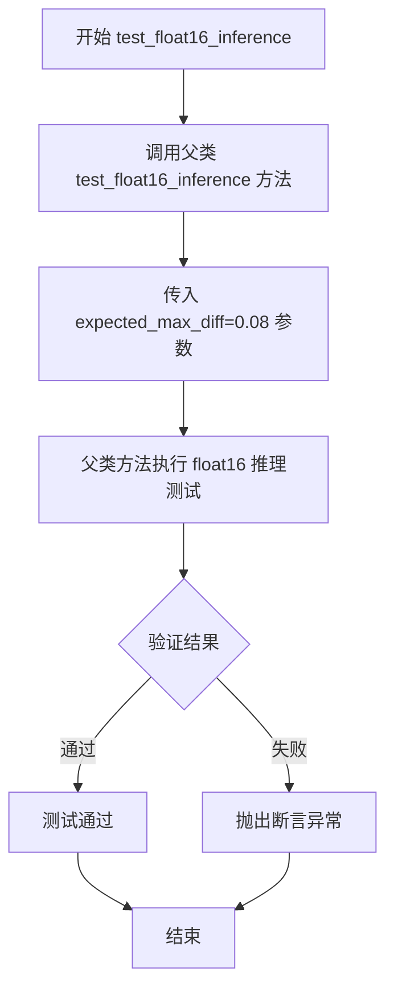

#### 带注释源码

```python
def test_float16_inference(self):
    """
    测试方法：验证模型在 float16（半精度）推理模式下的正确性
    
    该方法重写了父类的 test_float16_inference 测试，
    由于 Sana 模型对数据类型非常敏感，因此设置了较高的容差值（0.08），
    以避免因数值精度导致的测试失败。
    """
    # Requires higher tolerance as model seems very sensitive to dtype
    # 调用父类的 test_float16_inference 方法，传递预期最大误差容差为 0.08
    super().test_float16_inference(expected_max_diff=0.08)
```


### `SanaPipelineFastTests.test_layerwise_casting_inference`

该测试方法用于验证 SanaPipeline 在逐层类型转换（layerwise casting）模式下的推理功能是否正常，通过调用父类的同名测试方法实现，并在 GitHub Actions 环境中自动跳过。

参数：

- `self`：`SanaPipelineFastTests`，表示测试类实例本身，无额外参数

返回值：`None`，无返回值（测试方法执行完成后通过断言验证结果）

#### 流程图

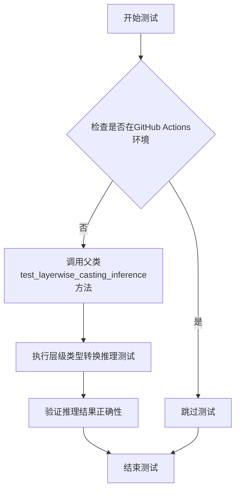

#### 带注释源码

```python
@unittest.skipIf(IS_GITHUB_ACTIONS, reason="Skipping test inside GitHub Actions environment")
def test_layerwise_casting_inference(self):
    """测试逐层类型转换推理功能
    
    该测试方法验证 SanaPipeline 在启用 layerwise_casting 配置时的推理过程是否正确。
    layerwise_casting 是一种内存优化技术,允许模型在不同层级使用不同的数据类型(如fp16/fp32)
    以在保持推理质量的同时减少显存占用。
    
    测试逻辑:
    1. 检查是否在 GitHub Actions 环境中运行,若是则跳过该测试(避免CI环境不稳定)
    2. 调用父类 PipelineTesterMixin 的 test_layerwise_casting_inference 方法执行实际测试
    3. 父类测试会创建 pipeline,分别以默认设置和 layerwise_casting 设置运行推理
    4. 验证两种设置下的输出结果一致性,确保类型转换不影响推理质量
    
    Note:
        - 该测试依赖父类 PipelineTesterMixin 提供的 test_layerwise_casting_inference 实现
        - 需要 transformer, vae, scheduler, text_encoder, tokenizer 等组件已正确配置
    """
    super().test_layerwise_casting_inference()
```


### `SanaPipelineIntegrationTests.setUp`

该方法为集成测试类提供初始化设置，通过调用父类方法、强制垃圾回收以及清空后端缓存来确保测试环境的清洁状态，防止测试间的状态污染。

参数：

- `self`：`SanaPipelineIntegrationTests`，当前测试类的实例对象，用于访问类属性和方法

返回值：`None`，无返回值，仅执行环境初始化操作

#### 流程图

```mermaid
flowchart TD
    A[开始 setUp] --> B[调用 super().setUp]
    B --> C[执行 gc.collect]
    C --> D[调用 backend_empty_cache]
    D --> E[结束 setUp]
    
    B -.-> F[父类 TestCase 初始化]
    C -.-> G[垃圾回收释放内存]
    D -.-> H[清空GPU/后端缓存]
```

#### 带注释源码

```python
def setUp(self):
    """
    集成测试的初始化方法，在每个测试方法运行前被调用。
    负责清理环境资源，确保测试隔离性。
    """
    # 调用父类的 setUp 方法，执行 unittest.TestCase 的标准初始化
    super().setUp()
    
    # 强制进行垃圾回收，释放不再使用的对象内存
    # 这对于释放测试过程中创建的大型模型权重等 GPU 内存尤为重要
    gc.collect()
    
    # 清空后端（通常是 CUDA/GPU）缓存
    # 确保之前测试残留的缓存数据不影响当前测试
    # torch_device 是从 testing_utils 导入的全局变量，表示测试使用的设备
    backend_empty_cache(torch_device)
```


### `SanaPipelineIntegrationTests.tearDown`

该方法为集成测试的清理方法，在每个测试用例执行完毕后自动调用，用于释放 GPU 内存资源，防止测试之间的内存泄漏问题。

参数：

- `self`：`SanaPipelineIntegrationTests`，测试类实例本身，用于访问类属性和方法

返回值：`None`，无返回值，仅执行清理操作

#### 流程图

```mermaid
flowchart TD
    A[开始 tearDown] --> B[调用 super().tearDown]
    B --> C[执行 gc.collect]
    C --> D[调用 backend_empty_cache]
    D --> E[结束]
```

#### 带注释源码

```python
def tearDown(self):
    """
    测试用例清理方法，在每个测试方法执行完毕后自动调用。
    负责清理 GPU 内存和调用垃圾回收机制。
    """
    # 调用父类的 tearDown 方法，确保父类的清理逻辑也被执行
    super().tearDown()
    
    # 手动触发 Python 垃圾回收，释放不再使用的对象
    gc.collect()
    
    # 清空 GPU/CUDA 缓存，释放显存资源
    backend_empty_cache(torch_device)
```


### `SanaPipelineIntegrationTests.test_sana_1024`

这是一个集成测试方法，用于测试 SanaPipeline 在 1024x1024 分辨率下的图像生成功能，验证模型输出的准确性和可重复性。

参数：

- `self`：隐式参数，`SanaPipelineIntegrationTests` 类的实例，包含类属性 `prompt = "A painting of a squirrel eating a burger."`

返回值：无（`None`），该方法为 `unittest.TestCase` 的测试方法，通过断言验证生成图像的正确性

#### 流程图

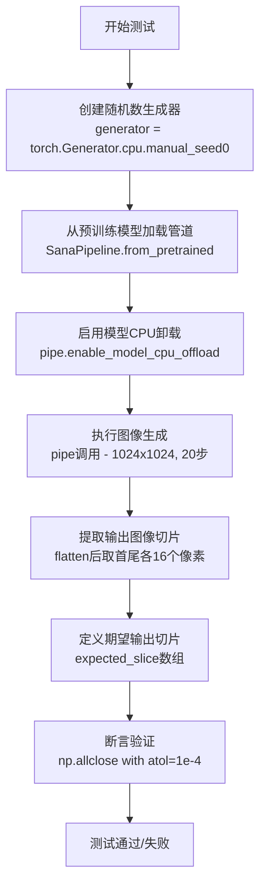

#### 带注释源码

```python
def test_sana_1024(self):
    # 创建一个CPU上的随机数生成器，使用固定种子0确保可重复性
    generator = torch.Generator("cpu").manual_seed(0)

    # 从预训练模型加载 SanaPipeline，指定使用 float16 精度
    # 模型路径: Efficient-Large-Model/Sana_1600M_1024px_diffusers
    pipe = SanaPipeline.from_pretrained(
        "Efficient-Large-Model/Sana_1600M_1024px_diffusers", torch_dtype=torch.float16
    )
    
    # 启用模型CPU卸载功能，将模型从GPU卸载到CPU以节省显存
    # device 参数使用全局变量 torch_device
    pipe.enable_model_cpu_offload(device=torch_device)

    # 调用管道生成图像
    # 参数:
    #   - prompt: 文本提示词 "A painting of a squirrel eating a burger."
    #   - height/width: 输出图像尺寸 1024x1024
    #   - generator: 随机数生成器确保确定性输出
    #   - num_inference_steps: 推理步数 20 步
    #   - output_type: 输出类型为 numpy 数组
    # 返回结果包含 images 属性，取第一张图像
    image = pipe(
        prompt=self.prompt,
        height=1024,
        width=1024,
        generator=generator,
        num_inference_steps=20,
        output_type="np",
    ).images[0]

    # 将图像展平为一维数组
    image = image.flatten()
    
    # 提取图像的前16个像素和后16个像素，拼接成32个像素的切片
    # 用于与期望值进行对比验证
    output_slice = np.concatenate((image[:16], image[-16:]))

    # 定义期望的输出切片数值（来自已知正确的结果）
    # fmt: off  # 格式化关闭
    expected_slice = np.array([
        0.0427, 0.0789, 0.0662, 0.0464, 0.082, 0.0574, 0.0535, 0.0886, 
        0.0647, 0.0549, 0.0872, 0.0605, 0.0593, 0.0942, 0.0674, 0.0581, 
        0.0076, 0.0168, 0.0027, 0.0063, 0.0159, 0.0, 0.0071, 0.0198, 
        0.0034, 0.0105, 0.0212, 0.0, 0.0, 0.0166, 0.0042, 0.0125
    ])
    # fmt: on  # 格式化开启

    # 断言验证输出切片与期望切片是否接近
    # 允许的绝对误差为 1e-4
    self.assertTrue(np.allclose(output_slice, expected_slice, atol=1e-4))
```


### `SanaPipelineIntegrationTests.test_sana_512`

该方法是一个集成测试，用于验证 SanaPipeline 在 512x512 分辨率下能否正确生成图像，并通过与预期像素值的对比来确保模型输出的确定性。

参数：

- `self`：隐式参数，`SanaPipelineIntegrationTests` 类的实例方法

返回值：`None`，该方法为测试方法，通过 `self.assertTrue` 断言进行验证，不返回任何值

#### 流程图

```mermaid
flowchart TD
    A[开始测试] --> B[创建随机数生成器<br/>generator = torch.Generator('cpu').manual_seed(0)]
    B --> C[从预训练模型加载 SanaPipeline<br/>Efficient-Large-Model/Sana_1600M_512px_diffusers<br/>torch_dtype=torch.float16]
    C --> D[启用模型 CPU 卸载<br/>pipe.enable_model_cpu_offload]
    D --> E[执行推理<br/>pipe: prompt='A painting of a squirrel...'<br/>height=512, width=512<br/>num_inference_steps=20<br/>output_type='np']
    E --> F[获取生成的图像并展平<br/>image = image.flatten()]
    F --> G[提取输出切片<br/>output_slice = concat(image[:16], image[-16:])]
    G --> H{断言验证<br/>np.allclose(output_slice, expected_slice, atol=1e-4)}
    H -->|通过| I[测试通过]
    H -->|失败| J[测试失败]
```

#### 带注释源码

```python
def test_sana_512(self):
    # 创建一个 CPU 上的随机数生成器，使用固定种子 0 确保可重复性
    generator = torch.Generator("cpu").manual_seed(0)

    # 从预训练模型加载 SanaPipeline，指定使用 float16 精度以加速推理
    # 模型标识符：Efficient-Large-Model/Sana_1600M_512px_diffusers
    pipe = SanaPipeline.from_pretrained(
        "Efficient-Large-Model/Sana_1600M_512px_diffusers", torch_dtype=torch.float16
    )
    # 启用模型 CPU 卸载功能，将模型从 GPU 卸载到 CPU 以节省显存
    pipe.enable_model_cpu_offload(device=torch_device)

    # 执行图像生成推理
    # 参数说明：
    #   - prompt: 文本提示词 "A painting of a squirrel eating a burger."
    #   - height/width: 输出图像分辨率 512x512
    #   - generator: 随机数生成器，确保输出可复现
    #   - num_inference_steps: 推理步数 20
    #   - output_type: 输出类型为 numpy 数组
    image = pipe(
        prompt=self.prompt,
        height=512,
        width=512,
        generator=generator,
        num_inference_steps=20,
        output_type="np",
    ).images[0]

    # 将生成的图像展平为一维数组，便于提取部分像素进行对比
    image = image.flatten()
    # 提取前16个和后16个像素值，拼接成32维的输出切片
    # 用于与预期值进行对比验证
    output_slice = np.concatenate((image[:16], image[-16:]))

    # 预期的输出像素切片（32个浮点数）
    # fmt: off
    expected_slice = np.array([0.0803, 0.0774, 0.1108, 0.0872, 0.093, 0.1118, 0.0952, 0.0898, 0.1038, 0.0818, 0.0754, 0.0894, 0.074, 0.0691, 0.0906, 0.0671, 0.0154, 0.0254, 0.0203, 0.0178, 0.0283, 0.0193, 0.0215, 0.0273, 0.0188, 0.0212, 0.0273, 0.0151, 0.0061, 0.0244, 0.0212, 0.0259])
    # fmt: on

    # 断言验证：生成的图像输出与预期值的差异在容差 1e-4 范围内
    self.assertTrue(np.allclose(output_slice, expected_slice, atol=1e-4))
```

## 关键组件


### SanaPipeline

Sana模型的推理Pipeline，封装了文本编码器、Transformer主模型、VAE解码器和调度器，负责协调各组件完成文本到图像的生成流程。

### SanaTransformer2DModel

SanaTransformer2DModel是核心的Transformer模型，负责根据文本embedding和噪声latent进行去噪推理，生成图像latent表示。

### AutoencoderDC

AutoencoderDC是变分自编码器的解码器部分(AutoencoderDC中的DC可能指Decoder)，负责将Transformer输出的latent解码为最终图像像素。

### FlowMatchEulerDiscreteScheduler

FlowMatchEulerDiscreteScheduler是用于扩散模型的离散欧拉调度器，采用shift=7.0的参数配置，控制去噪过程中的时间步进。

### Gemma2Model

Gemma2Model是文本编码器(基于Gemma2架构)，将输入文本prompt转换为文本embedding向量，供Transformer使用。

### GemmaTokenizer

GemmaTokenizer是文本分词器，负责将输入的文本prompt转换为token ids，再由Gemma2Model处理。

### 注意力切片(Attention Slicing)

内存优化技术，通过set_default_attn_processor和enable_attention_slicing方法实现，将注意力计算分片处理以降低显存占用。

### VAE瓦片化(VAE Tiling)

VAE的瓦片化处理技术，通过enable_tiling方法启用，允许分块处理大分辨率图像以避免内存溢出，支持tile_sample_min_height/width和tile_sample_stride_height/width参数配置。

### 模型CPU卸载(Model CPU Offload)

通过enable_model_cpu_offload实现，将不活跃的模型组件卸载到CPU以节省GPU显存，支持device参数指定目标设备。

### float16推理

通过torch_dtype=torch.float16指定半精度浮点数进行推理，在保持模型精度的同时减少显存占用和提升推理速度。

### 分层类型转换(Layerwise Casting)

通过test_layerwise_casting_inference测试验证的分层类型转换机制，能够在推理过程中动态转换不同层的dtype以优化性能和内存。

### 回调机制(Callback Mechanism)

支持callback_on_step_end和callback_on_step_end_tensor_inputs参数，允许用户在每个推理步骤结束时自定义处理逻辑，并通过_callback_tensor_inputs属性定义允许传递的tensor变量列表。


## 问题及建议


### 已知问题

- **测试断言过于宽松**：`test_inference` 方法中使用 `self.assertLessEqual(max_diff, 1e10)` 进行断言，这个阈值过大（1e10），几乎任何随机生成的图像都会通过此检查，无法有效验证生成结果的正确性
- **未使用的变量和参数**：`test_attention_slicing_forward_pass` 方法接收 `test_mean_pixel_difference` 参数但从未使用；`test_vae_tiling` 方法中计算了 `expected_diff_max` 参数但也未实际使用
- **未充分利用的测试输出**：`test_callback_inputs` 方法中多次执行 `output = pipe(**inputs)[0]` 但未对这些输出进行任何验证；`test_vae_tiling` 中同样存在类似问题
- **硬编码的种子重复调用**：`get_dummy_components` 方法中多次调用 `torch.manual_seed(0)`，这种模式虽然当前能工作，但不符合最佳实践，且可能导致测试间的隐式依赖
- **被跳过的批处理测试**：`test_inference_batch_consistent` 和 `test_inference_batch_single_identical` 测试因词汇表过小而跳过，代码中存在 `TODO(aryan)` 注释表明这是已知问题但未解决
- **继承方法缺少适配**：`test_float16_inference` 调用 `super().test_float16_inference(expected_max_diff=0.08)` 覆盖了父类行为，但没有自定义实现特定逻辑，导致测试行为完全依赖父类

### 优化建议

- **收紧断言阈值**：将 `test_inference` 中的阈值从 `1e10` 调整为更合理的值（如 `1.0` 或根据实际输出分布计算），确保测试能真正验证生成图像的正确性
- **删除未使用的参数**：移除 `test_attention_slicing_forward_pass` 中的 `test_mean_pixel_difference` 参数和 `test_vae_tiling` 中的 `expected_diff_max` 参数，或实现相应的验证逻辑
- **添加输出验证**：在 `test_callback_inputs` 和 `test_vae_tiling` 中对 pipeline 输出进行断言，避免产生"空测试"（只运行但无验证）
- **消除重复种子设置**：将 `get_dummy_components` 中的多个 `torch.manual_seed(0)` 调用合并为一次，或使用更明确的随机状态管理方式
- **实现或移除跳过测试**：对于 `test_inference_batch_consistent` 和 `test_inference_batch_single_identical`，应创建合适的 dummy 模型（修复 TODO 注释中提到的问题）而非永久跳过
- **统一资源管理**：在集成测试中考虑使用 pytest fixtures 或 context manager 进行更可靠的 gc 和缓存清理

## 其它


### 设计目标与约束

本测试代码旨在验证SanaPipeline扩散模型管道的功能正确性、性能稳定性和兼容性。设计约束包括：必须支持CPU和GPU设备环境；需兼容float16和float32两种精度模式；测试必须在CI/CD环境中可重复执行；集成测试需标记为slow以区分快速单元测试和耗时测试。

### 错误处理与异常设计

测试代码采用Python标准断言机制进行错误验证，通过`self.assertLess`、`self.assertTrue`、`self.assertEqual`等方法验证预期结果。对于设备相关操作，使用`@unittest.skipIf`跳过不适用的测试场景。潜在异常包括：模型加载失败、内存不足、设备不兼容等，均通过try-except或unittest内置机制处理。

### 数据流与状态机

测试数据流如下：初始化组件(get_dummy_components) → 创建管道实例 → 设置设备与进度条 → 构建输入参数(get_dummy_inputs) → 执行推理调用 → 验证输出结果。状态转换包括：组件加载态、管道就绪态、推理执行态、结果验证态。测试覆盖单步推理、批处理一致性、注意力切片、VAE平铺等多种执行模式。

### 外部依赖与接口契约

核心依赖包括：transformers库(Gemma2Config、Gemma2Model、GemmaTokenizer)、diffusers库(AutoencoderDC、FlowMatchEulerDiscreteScheduler、SanaPipeline、SanaTransformer2DModel)、numpy、torch。接口契约要求：pipeline_class必须实现`__call__`方法并返回包含images的元组；组件需实现set_default_attn_processor方法；管道需支持callback_on_step_end和callback_on_step_end_tensor_inputs回调接口。

### 性能基准与优化策略

测试设置性能阈值：attention slicing差异应小于1e-3；VAE tiling差异应小于0.2；float16推理差异应小于0.08。优化策略包括：使用enable_attention_slicing降低显存占用；使用enable_tiling支持大分辨率图像；使用enable_model_cpu_offload实现CPU-GPU内存优化；使用set_progress_bar_config控制日志输出。

### 测试覆盖与质量保证

测试覆盖场景包括：基础推理功能测试、回调机制验证、注意力切片兼容性、VAE平铺一致性、float16数值精度、layerwise类型转换、模型卸载功能。质量保证措施：使用固定随机种子(0)确保可复现性；集成测试标记为slow分离执行；GitHub Actions环境自动跳过敏感测试；expected_slice使用精确数值验证输出正确性。

### 配置管理与参数说明

关键配置参数：num_inference_steps=2(快速测试)/20(集成测试)；guidance_scale=6.0；height/width=32(快速测试)/512/1024(集成测试)；max_sequence_length=16；output_type支持"pt"和"np"。模型配置通过Gemma2Config和SanaTransformer2DModel参数指定，包括patch_size、num_layers、attention_head_dim等架构参数。

### 版本兼容性与迁移策略

代码要求torch和transformers库版本兼容当前API。迁移策略：随着diffusers库更新，需同步更新pipeline_class引用；Gemma2Model可能随transformers版本变化而需调整配置参数；新功能测试(如新调度器)可通过继承PipelineTesterMixin添加。

### 安全性与权限控制

测试代码无直接安全风险，但需注意：集成测试从远程加载预训练模型(Efficient-Large-Model/Sana_1600M_1024px_diffusers)，需网络访问权限；模型文件较大(1600M)，需充足磁盘空间；float16推理在某些GPU上可能存在兼容性问题需提前验证。

### 资源管理与缓存策略

资源管理措施：测试前后执行gc.collect()和backend_empty_cache释放内存；使用torch.manual_seed固定随机数确保结果可复现；设备选择支持CPU和MPS；模型卸载(enable_model_cpu_offload)避免显存溢出。缓存策略：组件通过get_dummy_components重复创建确保测试独立性；管道实例按需创建避免状态污染。

    