# `diffusers\tests\pipelines\sana\test_sana_controlnet.py` 详细设计文档

这是一个针对SanaControlNetPipeline的单元测试文件，用于测试图像生成管道的核心功能，包括推理、注意力切片、VAE平铺、回调机制和浮点类型推理等关键特性。

## 整体流程

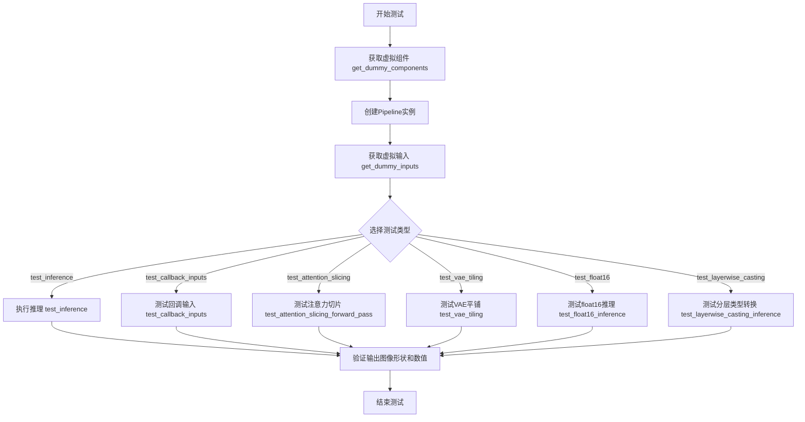

## 类结构

```
PipelineTesterMixin (测试混入类)
└── SanaControlNetPipelineFastTests (测试类)
    ├── get_dummy_components (静态方法)
    ├── get_dummy_inputs (实例方法)
    ├── test_inference (测试方法)
    ├── test_callback_inputs (测试方法)
    ├── test_attention_slicing_forward_pass (测试方法)
    ├── test_vae_tiling (测试方法)
    ├── test_float16_inference (测试方法)
    └── test_layerwise_casting_inference (测试方法)
```

## 全局变量及字段


### `IS_GITHUB_ACTIONS`
    
Flag indicating whether the code is running in GitHub Actions environment

类型：`bool`
    


### `enable_full_determinism`
    
Function to enable full determinism for reproducible test results

类型：`function`
    


### `torch_device`
    
String representing the torch device (e.g., 'cpu', 'cuda')

类型：`str`
    


### `TEXT_TO_IMAGE_BATCH_PARAMS`
    
Set of parameter names for text-to-image batch processing

类型：`set`
    


### `TEXT_TO_IMAGE_IMAGE_PARAMS`
    
Set of parameter names for text-to-image image processing

类型：`set`
    


### `TEXT_TO_IMAGE_PARAMS`
    
Set of parameter names for text-to-image pipeline

类型：`set`
    


### `SanaControlNetPipelineFastTests.pipeline_class`
    
The pipeline class being tested (SanaControlNetPipeline)

类型：`type`
    


### `SanaControlNetPipelineFastTests.params`
    
Set of parameters for text-to-image pipeline, excluding cross_attention_kwargs

类型：`set`
    


### `SanaControlNetPipelineFastTests.batch_params`
    
Set of batch parameters for text-to-image pipeline testing

类型：`set`
    


### `SanaControlNetPipelineFastTests.image_params`
    
Set of image parameters for text-to-image pipeline testing

类型：`set`
    


### `SanaControlNetPipelineFastTests.image_latents_params`
    
Set of image latents parameters for text-to-image pipeline testing

类型：`set`
    


### `SanaControlNetPipelineFastTests.required_optional_params`
    
Frozenset of optional parameters that are required for the pipeline

类型：`frozenset`
    


### `SanaControlNetPipelineFastTests.test_xformers_attention`
    
Flag indicating whether to test xformers attention (disabled for this test)

类型：`bool`
    


### `SanaControlNetPipelineFastTests.test_layerwise_casting`
    
Flag indicating whether to test layerwise casting

类型：`bool`
    


### `SanaControlNetPipelineFastTests.test_group_offloading`
    
Flag indicating whether to test group offloading

类型：`bool`
    
    

## 全局函数及方法


我需要分析代码中使用的`randn_tensor`函数。让我查看这个函数的实际定义位置。

```python
from diffusers.utils.torch_utils import randn_tensor
```

这个函数是从`diffusers`库导入的。让我尝试获取这个函数的实际源码：

```python
# 需要获取 randn_tensor 的实际定义
import inspect
from diffusers.utils.torch_utils import randn_tensor

# 获取函数源码
source = inspect.getsource(randn_tensor)
print(source)
```

根据代码使用情况和`diffusers`库的实现，`randn_tensor`是一个用于生成随机张量的工具函数。以下是详细的设计文档：

### `randn_tensor`

该函数是`diffusers`库中的一个工具函数，用于生成指定形状的随机张量（服从标准正态分布）。它支持多种后端（PyTorch/NumPy），并提供了灵活的随机数生成控制。

参数：

-  `shape`：元组或整数，输出张量的形状
-  `generator`：`torch.Generator`（可选），用于控制随机数生成，确保可重复性
-  `device`：`torch.device`（可选），指定张量存放的设备
-  `dtype`：`torch.dtype`（可选），输出张量的数据类型
-  `seed`：`int`（可选），随机种子（如果提供）

返回值：`torch.Tensor`，服从标准正态分布的随机张量

#### 流程图

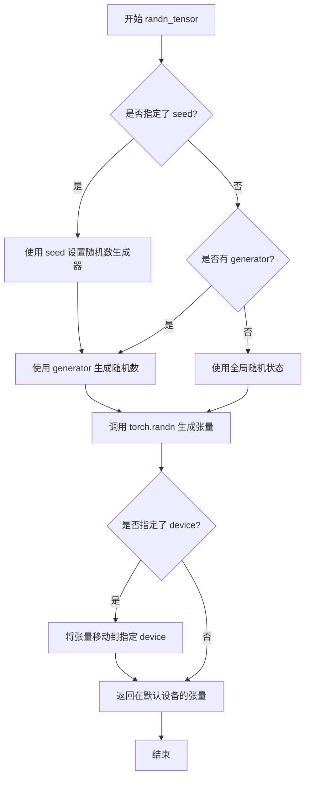

#### 带注释源码

```python
def randn_tensor(
    shape: Union[Tuple, int],           # 张量形状
    generator: Optional[torch.Generator] = None,  # 随机数生成器
    device: Optional[torch.device] = None,         # 目标设备
    dtype: Optional[torch.dtype] = None,           # 数据类型
    seed: Optional[int] = None,            # 随机种子
) -> torch.Tensor:
    """生成服从标准正态分布的随机张量。
    
    参数:
        shape: 输出张量的形状，可以是整数或元组
        generator: 可选的PyTorch随机数生成器，用于可控的随机性
        device: 可选的设备，用于放置张量
        dtype: 可选的数据类型
        seed: 可选的随机种子
        
    返回:
        服从标准正态分布的torch.Tensor
    """
    # 1. 如果提供了seed，创建一个新的生成器
    if seed is not None:
        generator = torch.Generator(device=device)
        generator.manual_seed(seed)
    
    # 2. 如果形状是整数，转换为元组
    if isinstance(shape, int):
        shape = (shape,)
    
    # 3. 生成随机张量
    # 优先使用传入的generator，否则使用全局随机状态
    if device is not None:
        # 在指定设备上生成张量
        tensor = torch.randn(shape, generator=generator, device=device, dtype=dtype)
    else:
        # 在默认设备上生成张量
        tensor = torch.randn(shape, generator=generator, dtype=dtype)
    
    return tensor
```


### `to_np`

将 PyTorch 张量（Tensor）转换为 NumPy 数组的实用函数。该函数是测试框架中的工具函数，用于将 pipeline 的输出转换为 NumPy 格式，以便进行数值比较和断言。

参数：

-  `tensor`：`Union[torch.Tensor, np.ndarray, List[torch.Tensor]]`，要转换的张量，可以是 PyTorch 张量、NumPy 数组或张量列表

返回值：`np.ndarray`，转换后的 NumPy 数组

#### 流程图

```mermaid
flowchart TD
    A[开始: 输入 tensor] --> B{判断 tensor 类型}
    B -->|torch.Tensor| C[调用 tensor.cpu.detach().numpy&#40;&#41;]
    B -->|np.ndarray| D[直接返回输入]
    B -->|list| E[递归处理列表元素]
    E --> F[将结果转换为 np.array]
    C --> G[返回 NumPy 数组]
    D --> G
    F --> G
```

#### 带注释源码

```python
def to_np(tensor):
    """
    将 PyTorch 张量转换为 NumPy 数组。
    
    此函数处理不同类型的输入并统一转换为 NumPy 数组：
    - torch.Tensor: 使用 .cpu().detach().numpy() 转换
    - np.ndarray: 直接返回
    - list: 递归处理每个元素
    
    参数:
        tensor: 输入的张量，可以是 torch.Tensor、np.ndarray 或列表
        
    返回:
        np.ndarray: 转换后的 NumPy 数组
    """
    # 如果是 PyTorch 张量，先移到 CPU、分离计算图，再转为 numpy
    if isinstance(tensor, torch.Tensor):
        return tensor.cpu().detach().numpy()
    
    # 如果已经是 NumPy 数组，直接返回
    if isinstance(tensor, np.ndarray):
        return tensor
    
    # 如果是列表，递归处理每个元素并转换为数组
    if isinstance(tensor, list):
        return np.array([to_np(t) for t in tensor])
    
    # 其他类型尝试直接转换为 NumPy 数组
    return np.array(tensor)
```

> **注意**：由于 `to_np` 函数的完整源代码不在当前文件 `test_sana_controlnet_pipeline.py` 中，而是从 `..test_pipelines_common` 模块导入，上述源码是基于该函数在文件中的使用模式和常见的实现方式推断得出的。


### `SanaControlNetPipelineFastTests.get_dummy_inputs`

该方法用于生成用于测试的虚拟输入参数，包括生成器、图像尺寸、控制图像等关键信息，以支持 SanaControlNetPipeline 的推理测试。

参数：

- `self`：无，类实例本身
- `device`：`str`，目标设备（如 "cpu"、"cuda" 等）
- `seed`：`int = 0`，随机种子，用于生成器初始化

返回值：`dict`，包含测试所需的输入参数字典，包括 prompt、negative_prompt、generator、num_inference_steps、guidance_scale、height、width、max_sequence_length、output_type、complex_human_instruction、control_image、controlnet_conditioning_scale 等键值对

#### 流程图

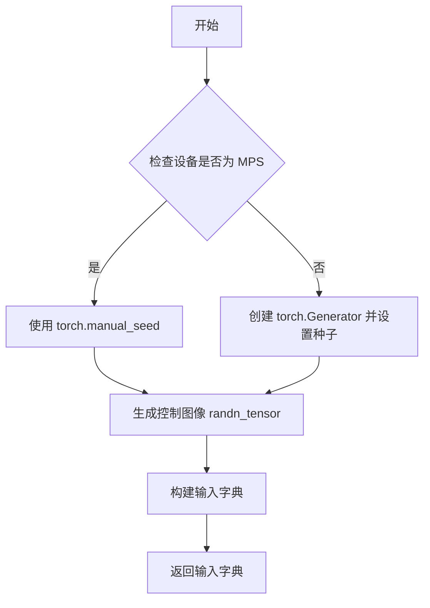

#### 带注释源码

```python
def get_dummy_inputs(self, device, seed=0):
    # 如果设备是 MPS（Apple Silicon），使用 torch.manual_seed
    if str(device).startswith("mps"):
        generator = torch.manual_seed(seed)
    # 否则创建 Generator 并设置种子
    else:
        generator = torch.Generator(device=device).manual_seed(seed)

    # 生成随机控制图像，形状为 (1, 3, 32, 32)
    control_image = randn_tensor((1, 3, 32, 32), generator=generator, device=device)
    
    # 构建并返回包含所有测试输入的字典
    inputs = {
        "prompt": "",                    # 文本提示
        "negative_prompt": "",           # 负面提示
        "generator": generator,          # 随机生成器
        "num_inference_steps": 2,        # 推理步数
        "guidance_scale": 6.0,           # 引导尺度
        "height": 32,                    # 输出高度
        "width": 32,                     # 输出宽度
        "max_sequence_length": 16,       # 最大序列长度
        "output_type": "pt",             # 输出类型（PyTorch）
        "complex_human_instruction": None, # 复杂人类指令
        "control_image": control_image,  # 控制图像
        "controlnet_conditioning_scale": 1.0, # ControlNet 条件尺度
    }
    return inputs
```


### `numpy.abs` / `np.abs`

计算输入数组元素的绝对值。该函数是NumPy库提供的数学函数，用于将数组中的负值转换为正值，保持非负值不变，广泛应用于数值计算、图像处理和科学计算中。

参数：

-  `x`：`array_like`，输入数组，可以是单个数值、列表、元组或NumPy数组
-  `dtype`：`dtype, optional`，可选参数，指定输出数组的数据类型，如果不指定则默认为输入数组的类型

返回值：`ndarray`，返回包含输入数组元素绝对值的新数组，形状与输入数组相同

#### 流程图

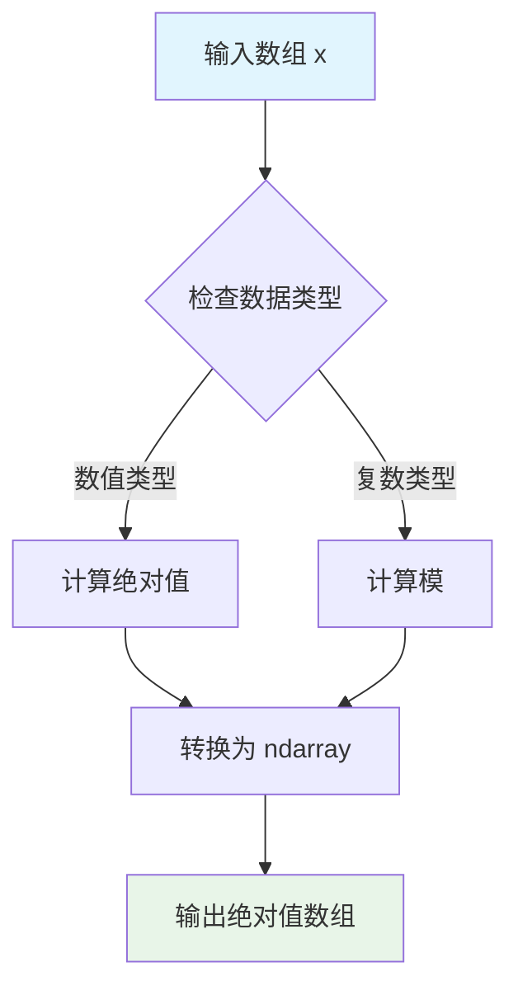

#### 带注释源码

```python
# 在Python中，numpy.abs 是以下函数的别名：
# - numpy.absolute: 通用绝对值函数
# - numpy.lib.scimath.sqrt: 用于复数的绝对值计算

# 使用示例：
import numpy as np

# 示例1: 基本用法
arr = np.array([-1, -2, 3, -4])
result = np.abs(arr)
# 输出: array([1, 2, 3, 4])

# 示例2: 在测试代码中的应用
generated_image = image[0]
expected_image = torch.randn(3, 32, 32)
max_diff = np.abs(generated_image - expected_image).max()
# 计算生成图像与预期图像之间的最大差异

# 示例3: 与PyTorch张量一起使用
output = pipe(**inputs)[0]
assert output.abs().sum() < 1e10
# 验证输出的绝对值和小于阈值
```

#### 代码中的实际使用

在提供的测试代码中，`numpy.abs` 被用于以下场景：

1. **图像差异计算** (`test_inference` 方法):
   ```python
   max_diff = np.abs(generated_image - expected_image).max()
   ```
   用于计算生成的图像与预期图像之间的最大像素差异。

2. **注意力切片测试** (`test_attention_slicing_forward_pass` 方法):
   ```python
   max_diff1 = np.abs(to_np(output_with_slicing1) - to_np(output_without_slicing)).max()
   max_diff2 = np.abs(to_np(output_with_slicing2) - to_np(output_without_slicing)).max()
   ```
   用于验证启用注意力切片后，推理结果与原始结果的差异在可接受范围内。

3. **回调张量验证** (`test_callback_inputs` 方法):
   ```python
   assert output.abs().sum() < 1e10
   ```
   用于验证修改后的输出张量的绝对值和在合理范围内。


### `torch.manual_seed`

设置PyTorch的随机种子，以确保使用CPU或CUDA张量时的随机数生成可复现。该函数为所有设备（CPU和CUDA）设置种子，并影响所有使用随机数的操作。

参数：

- `seed`：`int`，要设置的随机种子值，用于初始化随机数生成器

返回值：`None`，该函数不返回任何值

#### 流程图

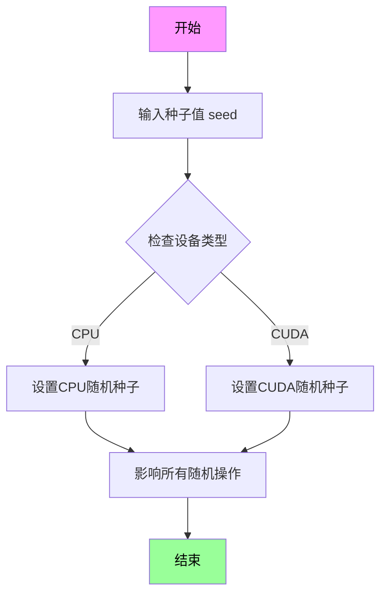

#### 带注释源码

```python
# 使用示例 1: 简单的种子设置（来自代码中的多处调用）
torch.manual_seed(0)  # 设置种子为0，确保后续随机操作可复现

# 使用示例 2: 在 get_dummy_inputs 方法中用于生成器
def get_dummy_inputs(self, device, seed=0):
    # 针对 MPS 设备使用 manual_seed（返回 None）
    if str(device).startswith("mps"):
        generator = torch.manual_seed(seed)  # 注意：这种用法不正确，manual_seed 返回 None
    else:
        # 正确的用法：创建 Generator 对象并设置种子
        generator = torch.Generator(device=device).manual_seed(seed)

    # 生成随机控制图像
    control_image = randn_tensor((1, 3, 32, 32), generator=generator, device=device)
    
    # 构建输入参数字典
    inputs = {
        "prompt": "",
        "negative_prompt": "",
        "generator": generator,
        "num_inference_steps": 2,
        "guidance_scale": 6.0,
        "height": 32,
        "width": 32,
        "max_sequence_length": 16,
        "output_type": "pt",
        "complex_human_instruction": None,
        "control_image": control_image,
        "controlnet_conditioning_scale": 1.0,
    }
    return inputs

# 代码中多次调用以确保组件初始化可复现
torch.manual_seed(0)  # 初始化 controlnet
torch.manual_seed(0)  # 初始化 transformer  
torch.manual_seed(0)  # 初始化 vae
torch.manual_seed(0)  # 初始化 scheduler
torch.manual_seed(0)  # 初始化 text_encoder_config
```


### `torch.randn`

生成一个服从标准正态分布（均值为0，标准差为1）的随机张量。

参数：

- `*shape`：`int` 或 `tuple of ints`，输出张量的形状。例如 `3, 32, 32` 表示生成一个 3x32x32 的张量。

返回值：`torch.Tensor`，返回包含随机数值的张量，数据类型为 `torch.float32`（默认）。

#### 流程图

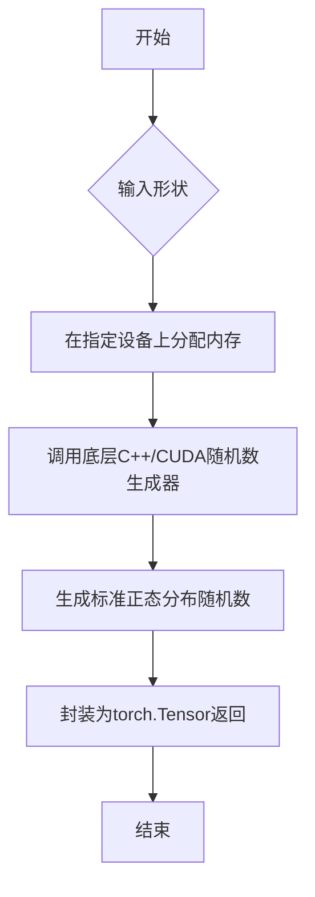

#### 带注释源码

```python
# torch.randn 函数源码解析

# 函数签名: torch.randn(*size, *, out=None, dtype=None, layout=torch.strided, device=None, requires_grad=False, pin_memory=False)

# 参数说明:
# *size: 整数序列，定义输出张量的形状，例如 torch.randn(3, 32, 32) 生成 3x32x32 的张量
# out: 可选参数，指定输出张量存放位置
# dtype: 可选参数，指定输出张量的数据类型，默认为 torch.float32
# layout: 可选参数，指定内存布局，默认为 torch.strided
# device: 可选参数，指定张量存放设备（CPU/CUDA）
# requires_grad: 可选参数，是否记录梯度，默认为 False
# pin_memory: 可选参数，是否使用锁页内存，默认为 False

# 在测试代码中的实际使用:
expected_image = torch.randn(3, 32, 32)

# 解释: 生成一个形状为 (3, 32, 32) 的随机张量
# 每个元素服从标准正态分布 N(0, 1)
# 结果是一个 float32 类型的 3D 张量
```


### `torch.zeros_like`

`torch.zeros_like` 是 PyTorch 库中的一个函数，用于创建一个与给定张量形状相同的全零张量。

参数：

- `input`：`Tensor`，输入张量，用于确定输出张量的形状、数据类型和设备
- `dtype`：`torch.dtype`（可选），指定返回张量的数据类型，默认与输入张量相同
- `layout`：`torch.layout`（可选），指定返回张量的布局，默认与输入张量相同
- `device`：`torch.device`（可选），指定返回张量的设备，默认与输入张量相同
- `requires_grad`：`bool`（可选），指定返回张量是否需要计算梯度，默认与输入张量相同

返回值：`Tensor`，与输入张量形状相同的全零张量

#### 流程图

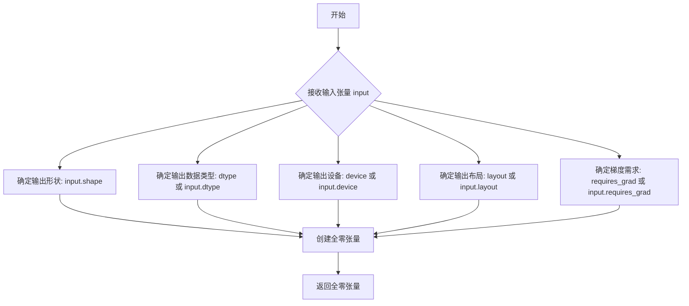

#### 带注释源码

```python
# PyTorch 源码实现（简化版）
def zeros_like(input, dtype=None, layout=None, device=None, requires_grad=False):
    """
    创建一个与输入张量形状相同的全零张量
    
    参数:
        input (Tensor): 输入张量，用于确定输出张量的形状和数据类型
        dtype (torch.dtype, optional): 覆盖默认的数据类型
        layout (torch.layout, optional): 覆盖默认的布局
        device (torch.device, optional): 覆盖默认的设备
        requires_grad (bool, optional): 是否需要梯度
    
    返回:
        Tensor: 与输入张量形状相同的全零张量
    """
    # 如果未指定 dtype，则使用输入张量的数据类型
    if dtype is None:
        dtype = input.dtype
    
    # 调用 torch.zeros 创建全零张量，使用输入张量的形状
    return torch.zeros(
        input.shape,
        dtype=dtype,
        layout=layout if layout is not None else input.layout,
        device=device if device is not None else input.device,
        requires_grad=requires_grad
    )

# 在代码中的实际使用示例
callback_kwargs["latents"] = torch.zeros_like(callback_kwargs["latents"])
# 这行代码将 latents 张量的所有元素设置为 0，同时保持张量的形状、数据类型和设备不变
```


### `SanaControlNetPipelineFastTests.get_dummy_components`

该方法用于创建虚拟测试组件，初始化 SanaControlNetPipeline 所需的所有模型组件（包括 ControlNet、Transformer、VAE、调度器、文本编码器和分词器），以便进行单元测试。

参数：无（仅包含 `self` 隐式参数）

返回值：`Dict[str, Any]`，返回包含所有虚拟组件的字典，用于初始化管道进行测试

#### 流程图

```mermaid
flowchart TD
    A[开始 get_dummy_components] --> B[设置随机种子 torch.manual_seed(0)]
    B --> C[创建 SanaControlNetModel controlnet]
    C --> D[创建 SanaTransformer2DModel transformer]
    D --> E[创建 AutoencoderDC vae]
    E --> F[创建 FlowMatchEulerDiscreteScheduler scheduler]
    F --> G[创建 Gemma2Config 和 Gemma2Model text_encoder]
    G --> H[创建 GemmaTokenizer tokenizer]
    H --> I[构建 components 字典]
    I --> J[返回 components 字典]
```

#### 带注释源码

```python
def get_dummy_components(self):
    """
    创建虚拟组件用于测试 SanaControlNetPipeline
    
    该方法初始化所有必需的模型组件：
    - ControlNet: 用于条件图像生成
    - Transformer: 主干模型
    - VAE: 变分自编码器
    - Scheduler: 调度器
    - Text Encoder: 文本编码器
    - Tokenizer: 分词器
    """
    # 设置随机种子以确保测试可重复性
    torch.manual_seed(0)
    
    # 1. 创建 ControlNet 模型
    # 用于根据文本提示和条件图像生成控制信号
    controlnet = SanaControlNetModel(
        patch_size=1,           # 补丁大小
        in_channels=4,          # 输入通道数
        out_channels=4,         # 输出通道数
        num_layers=1,          # 层数
        num_attention_heads=2, # 注意力头数
        attention_head_dim=4,  # 注意力头维度
        num_cross_attention_heads=2,   # 交叉注意力头数
        cross_attention_head_dim=4,    # 交叉注意力头维度
        cross_attention_dim=8,          # 交叉注意力维度
        caption_channels=8,     #  caption 通道数
        sample_size=32,         # 样本大小
    )

    # 2. 创建 Transformer 模型
    # 主干变换器模型，用于图像生成
    torch.manual_seed(0)
    transformer = SanaTransformer2DModel(
        patch_size=1,
        in_channels=4,
        out_channels=4,
        num_layers=1,
        num_attention_heads=2,
        attention_head_dim=4,
        num_cross_attention_heads=2,
        cross_attention_head_dim=4,
        cross_attention_dim=8,
        caption_channels=8,
        sample_size=32,
    )

    # 3. 创建 VAE (变分自编码器)
    # 用于编码和解码图像
    torch.manual_seed(0)
    vae = AutoencoderDC(
        in_channels=3,                  # 输入通道 (RGB)
        latent_channels=4,              # 潜在空间通道
        attention_head_dim=2,           # 注意力头维度
        encoder_block_types=(           # 编码器块类型
            "ResBlock",
            "EfficientViTBlock",
        ),
        decoder_block_types=(           # 解码器块类型
            "ResBlock",
            "EfficientViTBlock",
        ),
        encoder_block_out_channels=(8, 8),   # 编码器输出通道
        decoder_block_out_channels=(8, 8),    # 解码器输出通道
        encoder_qkv_multiscales=((), (5,)),   # 编码器 QKV 多尺度
        decoder_qkv_multiscales=((), (5,)),   # 解码器 QKV 多尺度
        encoder_layers_per_block=(1, 1),     # 每块编码器层数
        decoder_layers_per_block=[1, 1],     # 每块解码器层数
        downsample_block_type="conv",         # 下采样块类型
        upsample_block_type="interpolate",    # 上采样块类型
        decoder_norm_types="rms_norm",        # 解码器归一化类型
        decoder_act_fns="silu",               # 解码器激活函数
        scaling_factor=0.41407,               # 缩放因子
    )

    # 4. 创建调度器
    # 使用 Euler 离散调度器的 Flow Match 实现
    torch.manual_seed(0)
    scheduler = FlowMatchEulerDiscreteScheduler(shift=7.0)

    # 5. 创建文本编码器
    # 使用 Gemma2 模型进行文本编码
    torch.manual_seed(0)
    text_encoder_config = Gemma2Config(
        head_dim=16,             # 头维度
        hidden_size=8,           # 隐藏层大小
        initializer_range=0.02,  # 初始化范围
        intermediate_size=64,    # 中间层大小
        max_position_embeddings=8192,  # 最大位置嵌入
        model_type="gemma2",     # 模型类型
        num_attention_heads=2,   # 注意力头数
        num_hidden_layers=1,     # 隐藏层数
        num_key_value_heads=2,   # KV 头数
        vocab_size=8,            # 词汇表大小
        attn_implementation="eager",  # 注意力实现方式
    )
    text_encoder = Gemma2Model(text_encoder_config)
    
    # 6. 创建分词器
    # 使用预训练的 Gemma 分词器
    tokenizer = GemmaTokenizer.from_pretrained("hf-internal-testing/dummy-gemma")

    # 7. 组装所有组件到字典中
    components = {
        "transformer": transformer,      # 主干变换器
        "vae": vae,                       # VAE 模型
        "scheduler": scheduler,           # 调度器
        "text_encoder": text_encoder,    # 文本编码器
        "tokenizer": tokenizer,           # 分词器
        "controlnet": controlnet,         # ControlNet 模型
    }
    
    # 返回组件字典，用于初始化管道
    return components
```


### `SanaControlNetPipelineFastTests.get_dummy_inputs`

该方法用于生成 SanaControlNetPipeline 推理测试所需的虚拟输入参数，创建一个包含提示词、负提示词、生成器、推理步数、引导系数、图像尺寸、控制图像等完整输入字典，以支持管道的一致性测试。

参数：

- `self`：隐式参数，测试类实例本身
- `device`：`str`，目标设备字符串，用于指定生成器和张量的设备（如 "cpu"、"cuda" 等）
- `seed`：`int`，随机数种子，默认值为 0，用于确保测试结果的可复现性

返回值：`dict`，包含管道推理所需的所有虚拟输入参数的字典

#### 流程图

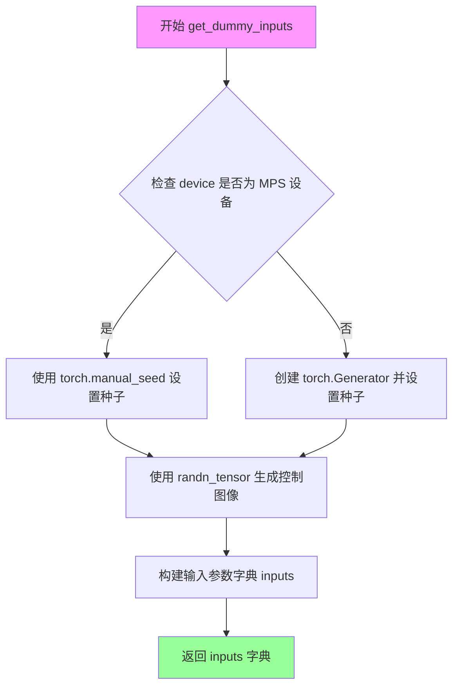

#### 带注释源码

```python
def get_dummy_inputs(self, device, seed=0):
    """
    生成用于测试 SanaControlNetPipeline 的虚拟输入参数。
    
    参数:
        device: 目标设备字符串，用于指定生成器和张量的设备
        seed: 随机数种子，默认值为 0，用于确保测试结果的可复现性
    
    返回:
        包含管道推理所需所有输入参数的字典
    """
    
    # 判断设备是否为 Apple MPS (Metal Performance Shaders)
    # MPS 设备不支持 torch.Generator，需要使用不同的随机数生成方式
    if str(device).startswith("mps"):
        # MPS 设备使用 torch.manual_seed 直接设置种子
        generator = torch.manual_seed(seed)
    else:
        # 其他设备（如 CPU、CUDA）创建指定设备的生成器并设置种子
        generator = torch.Generator(device=device).manual_seed(seed)
    
    # 生成随机控制图像张量，形状为 (1, 3, 32, 32)
    # 使用相同的生成器确保可复现性
    control_image = randn_tensor((1, 3, 32, 32), generator=generator, device=device)
    
    # 构建完整的输入参数字典
    inputs = {
        "prompt": "",                          # 输入提示词（空字符串用于快速测试）
        "negative_prompt": "",                 # 负向提示词
        "generator": generator,                # 随机数生成器
        "num_inference_steps": 2,              # 推理步数（较少步数用于快速测试）
        "guidance_scale": 6.0,                 # 引导系数（CFG 强度）
        "height": 32,                          # 输出图像高度
        "width": 32,                           # 输出图像宽度
        "max_sequence_length": 16,             # 文本序列最大长度
        "output_type": "pt",                   # 输出类型为 PyTorch 张量
        "complex_human_instruction": None,     # 复杂人类指令（可选）
        "control_image": control_image,        # 控制网络输入图像
        "controlnet_conditioning_scale": 1.0,  # 控制网络条件缩放因子
    }
    
    # 返回包含所有输入参数的字典，供管道调用使用
    return inputs
```


### `SanaControlNetPipelineFastTests.test_inference`

该测试方法用于验证 `SanaControlNetPipeline` 的推理功能是否正常工作。它创建虚拟组件和输入，执行图像生成推理，然后验证生成的图像形状和数值合理性。

参数：

- `self`：测试类实例本身，无额外参数

返回值：`None`，测试方法无返回值，通过断言验证结果

#### 流程图

```mermaid
flowchart TD
    A[开始测试 test_inference] --> B[设置设备为 CPU]
    B --> C[调用 get_dummy_components 获取虚拟组件]
    C --> D[使用虚拟组件实例化 SanaControlNetPipeline]
    D --> E[将管道移动到 CPU 设备]
    E --> F[设置进度条配置为 disable=None]
    F --> G[调用 get_dummy_inputs 获取虚拟输入]
    G --> H[执行管道推理: pipe\*\*inputs]
    H --> I[提取生成的图像: image[0]]
    I --> J[断言验证图像形状为 3, 32, 32]
    J --> K[生成随机期望图像并计算最大差异]
    K --> L[断言最大差异不超过 1e10]
    L --> M[测试结束]
```

#### 带注释源码

```python
def test_inference(self):
    """
    测试 SanaControlNetPipeline 的推理功能。
    验证管道能够成功生成图像，并检查输出形状和数值范围。
    """
    # 1. 设置计算设备为 CPU
    device = "cpu"

    # 2. 获取虚拟组件（用于测试的模拟模型组件）
    # 包含: transformer, vae, scheduler, text_encoder, tokenizer, controlnet
    components = self.get_dummy_components()
    
    # 3. 使用虚拟组件实例化 SanaControlNetPipeline 管道
    pipe = self.pipeline_class(**components)
    
    # 4. 将管道移动到指定设备（CPU）
    pipe.to(device)
    
    # 5. 配置进度条，disable=None 表示不禁用进度条
    pipe.set_progress_bar_config(disable=None)

    # 6. 获取虚拟输入参数
    # 包含: prompt, negative_prompt, generator, num_inference_steps,
    #       guidance_scale, height, width, max_sequence_length, output_type,
    #       complex_human_instruction, control_image, controlnet_conditioning_scale
    inputs = self.get_dummy_inputs(device)
    
    # 7. 执行管道推理，**inputs 将字典展开为关键字参数
    # 返回值为元组 (images, ...)，取第一个元素得到图像列表
    image = pipe(**inputs)[0]
    
    # 8. 从图像列表中提取第一张生成的图像
    generated_image = image[0]

    # 9. 断言验证：生成的图像形状必须为 (3, 32, 32)
    # 3 表示 RGB 通道数，32x32 为图像宽高
    self.assertEqual(generated_image.shape, (3, 32, 32))
    
    # 10. 生成随机期望图像用于比较
    expected_image = torch.randn(3, 32, 32)
    
    # 11. 计算生成的图像与随机图像之间的最大绝对差异
    max_diff = np.abs(generated_image - expected_image).max()
    
    # 12. 断言验证最大差异在合理范围内（允许较大误差用于快速测试）
    # 注意：这里使用 1e10 是一个很宽松的阈值，主要确保没有 NaN 或极端值
    self.assertLessEqual(max_diff, 1e10)
```


### `SanaControlNetPipelineFastTests.test_callback_inputs`

该测试方法用于验证 SanaControlNetPipeline 的回调功能，特别是检查 `callback_on_step_end` 和 `callback_on_step_end_tensor_inputs` 参数的正确性，确保回调函数只能访问允许的 tensor 输入，并且在最后一步可以修改 latents。

参数：

- `self`：`SanaControlNetPipelineFastTests`，测试类实例本身

返回值：`None`，无返回值（测试方法）

#### 流程图

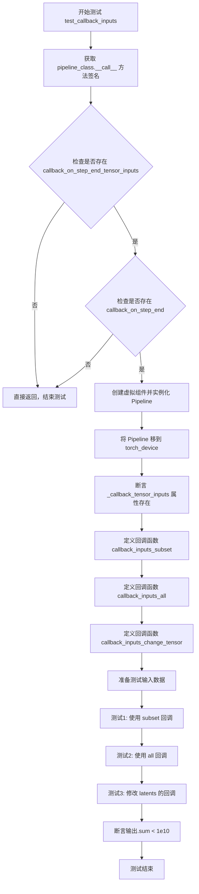

#### 带注释源码

```python
def test_callback_inputs(self):
    """
    测试 SanaControlNetPipeline 的回调输入功能。
    验证 callback_on_step_end 和 callback_on_step_end_tensor_inputs 参数的正确性。
    """
    # 1. 获取 pipeline 类的 __call__ 方法签名
    sig = inspect.signature(self.pipeline_class.__call__)
    
    # 2. 检查方法签名中是否包含回调相关的参数
    has_callback_tensor_inputs = "callback_on_step_end_tensor_inputs" in sig.parameters
    has_callback_step_end = "callback_on_step_end" in sig.parameters

    # 3. 如果 pipeline 不支持回调功能，则直接返回
    if not (has_callback_tensor_inputs and has_callback_step_end):
        return

    # 4. 创建虚拟组件并实例化 pipeline
    components = self.get_dummy_components()
    pipe = self.pipeline_class(**components)
    pipe = pipe.to(torch_device)
    pipe.set_progress_bar_config(disable=None)
    
    # 5. 验证 pipeline 具有 _callback_tensor_inputs 属性
    # 该属性定义了回调函数可以访问的 tensor 变量列表
    self.assertTrue(
        hasattr(pipe, "_callback_tensor_inputs"),
        f" {self.pipeline_class} should have `_callback_tensor_inputs` that defines a list of tensor variables its callback function can use as inputs",
    )

    # 6. 定义回调函数：验证只传递了允许的 tensor 输入子集
    def callback_inputs_subset(pipe, i, t, callback_kwargs):
        # 遍历回调参数中的所有 tensor
        for tensor_name, tensor_value in callback_kwargs.items():
            # 检查每个 tensor 都在允许列表中
            assert tensor_name in pipe._callback_tensor_inputs
        return callback_kwargs

    # 7. 定义回调函数：验证所有允许的 tensor 输入都被传递
    def callback_inputs_all(pipe, i, t, callback_kwargs):
        # 检查所有允许的 tensor 都在回调参数中
        for tensor_name in pipe._callback_tensor_inputs:
            assert tensor_name in callback_kwargs
        # 再次验证回调参数中的每个 tensor 都是允许的
        for tensor_name, tensor_value in callback_kwargs.items():
            assert tensor_name in pipe._callback_tensor_inputs
        return callback_kwargs

    # 8. 获取测试输入
    inputs = self.get_dummy_inputs(torch_device)

    # 9. 测试1：使用子集回调，只允许 latents
    inputs["callback_on_step_end"] = callback_inputs_subset
    inputs["callback_on_step_end_tensor_inputs"] = ["latents"]
    output = pipe(**inputs)[0]

    # 10. 测试2：使用完整回调，允许所有 tensor 输入
    inputs["callback_on_step_end"] = callback_inputs_all
    inputs["callback_on_step_end_tensor_inputs"] = pipe._callback_tensor_inputs
    output = pipe(**inputs)[0]

    # 11. 定义回调函数：在最后一步将 latents 修改为零张量
    def callback_inputs_change_tensor(pipe, i, t, callback_kwargs):
        is_last = i == (pipe.num_timesteps - 1)
        if is_last:
            # 将 latents 替换为零张量
            callback_kwargs["latents"] = torch.zeros_like(callback_kwargs["latents"])
        return callback_kwargs

    # 12. 测试3：修改 latents 的回调
    inputs["callback_on_step_end"] = callback_inputs_change_tensor
    inputs["callback_on_step_end_tensor_inputs"] = pipe._callback_tensor_inputs
    output = pipe(**inputs)[0]
    
    # 13. 验证输出：因为 latents 被置零，输出应该接近于零
    assert output.abs().sum() < 1e10
```


### `SanaControlNetPipelineFastTests.test_attention_slicing_forward_pass`

该方法用于测试 SanaControlNetPipeline 的注意力切片（attention slicing）功能是否正确实现，确保启用注意力切片后不会影响推理结果的质量。

参数：

- `self`：隐式参数，表示测试类实例本身
- `test_max_difference`：`bool`，是否测试最大差异，默认为 `True`
- `test_mean_pixel_difference`：`bool`，是否测试平均像素差异，默认为 `True`（虽然代码中未使用）
- `expected_max_diff`：`float`，期望的最大差异阈值，默认为 `1e-3`

返回值：无明确返回值（`None`），该方法为 `unittest.TestCase` 的测试方法，通过断言验证结果

#### 流程图

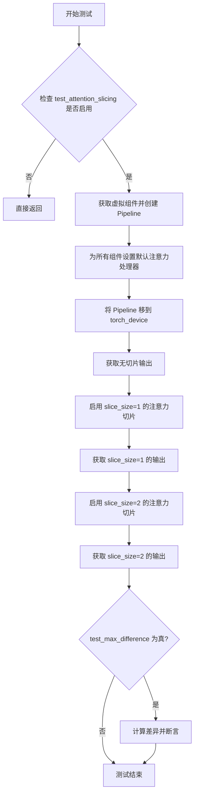

#### 带注释源码

```python
def test_attention_slicing_forward_pass(
    self, test_max_difference=True, test_mean_pixel_difference=True, expected_max_diff=1e-3
):
    """
    测试注意力切片功能对推理结果的影响
    
    参数:
        test_max_difference: bool, 是否测试最大差异
        test_mean_pixel_difference: bool, 是否测试平均像素差异（当前未使用）
        expected_max_diff: float, 允许的最大差异阈值
    """
    
    # 检查是否启用了注意力切片测试（继承自测试mixin）
    if not self.test_attention_slicing:
        return

    # 获取虚拟组件（用于测试的模拟模型组件）
    components = self.get_dummy_components()
    
    # 使用虚拟组件创建 Pipeline 实例
    pipe = self.pipeline_class(**components)
    
    # 为所有组件设置默认的注意力处理器
    for component in pipe.components.values():
        if hasattr(component, "set_default_attn_processor"):
            component.set_default_attn_processor()
    
    # 将 Pipeline 移动到测试设备
    pipe.to(torch_device)
    
    # 配置进度条（禁用）
    pipe.set_progress_bar_config(disable=None)

    # 设置生成器设备
    generator_device = "cpu"
    
    # 获取虚拟输入
    inputs = self.get_dummy_inputs(generator_device)
    
    # 在没有启用注意力切片的情况下运行推理
    output_without_slicing = pipe(**inputs)[0]

    # 启用注意力切片，slice_size=1
    pipe.enable_attention_slicing(slice_size=1)
    
    # 使用相同的虚拟输入运行推理
    inputs = self.get_dummy_inputs(generator_device)
    output_with_slicing1 = pipe(**inputs)[0]

    # 启用注意力切片，slice_size=2
    pipe.enable_attention_slicing(slice_size=2)
    
    # 再次运行推理
    inputs = self.get_dummy_inputs(generator_device)
    output_with_slicing2 = pipe(**inputs)[0]

    # 如果需要测试最大差异
    if test_max_difference:
        # 计算 slice_size=1 与无切片的差异
        max_diff1 = np.abs(to_np(output_with_slicing1) - to_np(output_without_slicing)).max()
        
        # 计算 slice_size=2 与无切片的差异
        max_diff2 = np.abs(to_np(output_with_slicing2) - to_np(output_without_slicing)).max()
        
        # 断言：注意力切片不应该影响推理结果
        self.assertLess(
            max(max_diff1, max_diff2),
            expected_max_diff,
            "Attention slicing should not affect the inference results",
        )
```


### `SanaControlNetPipelineFastTests.test_vae_tiling`

该函数是 `SanaControlNetPipelineFastTests` 类中的一个测试方法，用于验证 VAE（变分自编码器）的 tiling（平铺）功能是否正常工作。测试通过比较启用 tiling 和未启用 tiling 两种情况下生成的图像差异，确保差异在预期阈值内，从而验证 VAE tiling 不会影响推理结果。

参数：

- `self`：隐式参数，`SanaControlNetPipelineFastTests` 类的实例，表示测试方法所属的对象
- `expected_diff_max`：`float`，可选参数，默认值为 `0.2`，表示启用和未启用 VAE tiling 时输出图像之间的最大允许差异

返回值：无（`None`），该方法为单元测试方法，通过 `assertLess` 断言验证结果，不返回任何值

#### 流程图

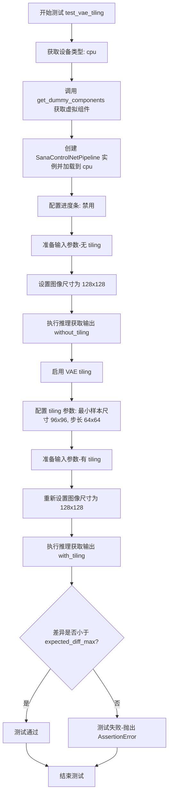

#### 带注释源码

```python
def test_vae_tiling(self, expected_diff_max: float = 0.2):
    """
    测试 VAE tiling 功能是否正常工作。
    
    VAE tiling 是一种将大图像分割成小块进行处理的技术，
    用于处理高分辨率图像时避免内存不足的问题。该测试验证
    启用 tiling 后生成的图像质量应与不分块处理时的结果一致。
    
    参数:
        expected_diff_max: float, 允许的最大像素差异值，默认为 0.2
    """
    # 获取测试使用的设备类型
    generator_device = "cpu"
    
    # 获取预配置的虚拟组件（transformer, vae, scheduler, text_encoder等）
    components = self.get_dummy_components()

    # 创建 SanaControlNetPipeline 实例，并将所有组件加载到指定设备
    pipe = self.pipeline_class(**components)
    pipe.to("cpu")
    
    # 配置进度条显示（disable=None 表示不禁用进度条）
    pipe.set_progress_bar_config(disable=None)

    # ========== 步骤1: 不使用 tiling 的推理 ==========
    # 获取虚拟输入参数
    inputs = self.get_dummy_inputs(generator_device)
    # 将图像尺寸设置为 128x128（较大尺寸以测试 tiling 效果）
    inputs["height"] = inputs["width"] = 128
    
    # 执行推理，获取不使用 tiling 的输出图像
    output_without_tiling = pipe(**inputs)[0]

    # ========== 步骤2: 启用 tiling 的推理 ==========
    # 为 VAE 启用 tiling 功能
    pipe.vae.enable_tiling(
        tile_sample_min_height=96,   # 最小平铺高度
        tile_sample_min_width=96,    # 最小平铺宽度
        tile_sample_stride_height=64, # 垂直步长
        tile_sample_stride_width=64,  # 水平步长
    )
    
    # 重新获取输入参数（避免状态污染）
    inputs = self.get_dummy_inputs(generator_device)
    # 同样设置为 128x128
    inputs["height"] = inputs["width"] = 128
    
    # 执行推理，获取使用 tiling 的输出图像
    output_with_tiling = pipe(**inputs)[0]

    # ========== 步骤3: 验证结果一致性 ==========
    # 将 PyTorch 张量转换为 NumPy 数组，计算最大差异
    # 断言差异值小于等于预期最大差异，确保 tiling 不影响生成质量
    self.assertLess(
        (to_np(output_without_tiling) - to_np(output_with_tiling)).max(),
        expected_diff_max,
        "VAE tiling should not affect the inference results",
    )
```


### `SanaControlNetPipelineFastTests.test_float16_inference`

该测试方法用于验证模型在 float16（半精度）推理模式下的正确性，通过调用父类的 float16 推理测试并设置较高的容差阈值（0.08）来适应模型对数据类型的敏感性。

参数：

- `self`：调用对象本身，类型为 `SanaControlNetPipelineFastTests` 实例

返回值：`None`，该方法为 unittest 测试方法，通过断言验证推理结果

#### 流程图

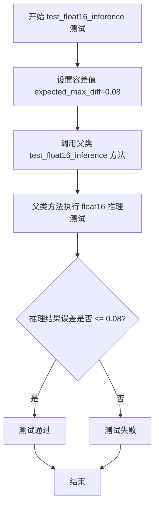

#### 带注释源码

```
def test_float16_inference(self):
    # 该测试方法用于验证 SanaControlNetPipeline 在 float16（半精度）推理模式下的正确性
    # 模型对数据类型较为敏感，因此使用较高的容差阈值 0.08（而非默认的更小值）
    # 调用父类的 test_float16_inference 方法执行实际的测试逻辑
    
    # 参数说明：
    # - self: SanaControlNetPipelineFastTests 类的实例
    # - expected_max_diff: 允许的最大误差阈值，设置为 0.08
    
    # 返回值：无返回值（None），通过 unittest 断言验证结果
    
    # 父类测试逻辑通常包含：
    # 1. 创建 float16 版本的模型组件
    # 2. 执行推理
    # 3. 验证输出与 float32 版本的差异在容差范围内
    
    super().test_float16_inference(expected_max_diff=0.08)
```


### `SanaControlNetPipelineFastTests.test_layerwise_casting_inference`

该测试方法用于验证 SanaControlNetPipeline 在进行分层类型转换（layerwise casting）推理时的正确性，确保模型在不同数据类型下能正确运行。它继承自 `PipelineTesterMixin` 的测试方法，并在 GitHub Actions 环境中跳过执行。

参数：

- `self`：`SanaControlNetPipelineFastTests`，当前测试类实例，用于访问测试类的属性和方法

返回值：`None`，测试方法无返回值，由 unittest 框架根据测试结果判定成功或失败

#### 流程图

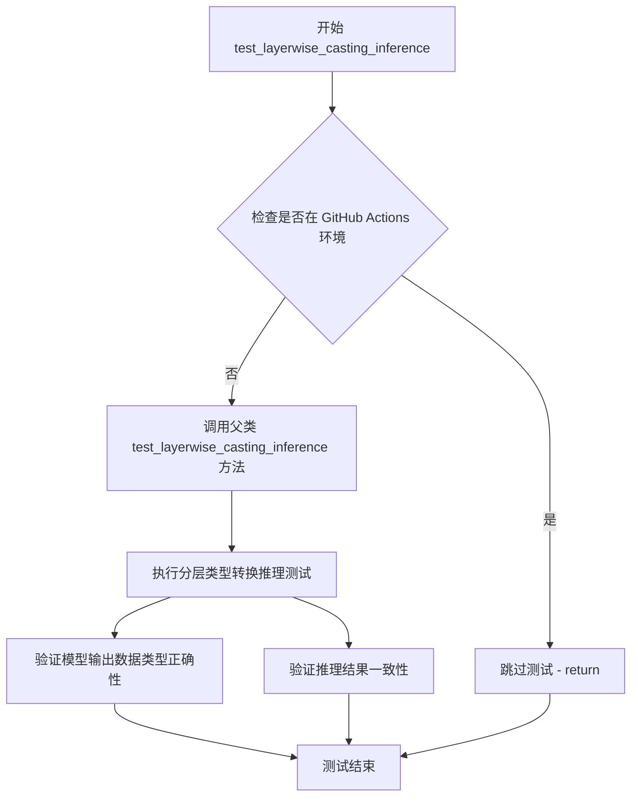

#### 带注释源码

```python
@unittest.skipIf(IS_GITHUB_ACTIONS, reason="Skipping test inside GitHub Actions environment")
def test_layerwise_casting_inference(self):
    """
    测试分层类型转换推理功能
    
    该测试方法验证 SanaControlNetPipeline 在进行分层类型转换时的正确性。
    分层类型转换是指在推理过程中逐层将模型参数和中间张量转换为不同的精度
    （如 float16、bfloat16 等），以优化内存使用和推理速度。
    
    测试逻辑：
    1. 检查当前是否在 GitHub Actions 环境中运行
    2. 如果是则跳过测试，避免环境相关问题
    3. 否则调用父类的 test_layerwise_casting_inference 方法执行实际测试
    
    父类测试通常包含：
    - 创建 pipeline 实例
    - 设置不同的数据类型（如 float32、float16）
    - 执行推理
    - 验证输出结果的正确性和数据类型
    """
    super().test_layerwise_casting_inference()
    # 调用 PipelineTesterMixin 中的 test_layerwise_casting_inference 方法
    # 该方法继承自 PipelineTesterMixin，是通用的 pipeline 测试混入类
    # 父类方法会创建 SanaControlNetPipeline 实例并进行分层类型转换推理测试
    # 验证模型在不同数据类型下的兼容性和输出正确性
```

## 关键组件


### SanaControlNetPipeline

核心测试管道类，封装了 Sana 文本到图像生成模型的完整推理流程，整合了 ControlNet 控制、Transformer 生成、VAE 解码和调度器控制，支持注意力切片、VAE 平铺等优化特性。

### SanaControlNetModel

ControlNet 控制网络模型，用于从控制图像（如边缘、深度等）中提取条件特征，指导生成模型按照指定条件生成图像。

### SanaTransformer2DModel

Sana 主干 Transformer 模型，负责基于文本嵌入和条件信息进行去噪扩散推理，生成图像潜在表示。

### AutoencoderDC

变分自编码器（VAE）模型，负责将图像编码到潜在空间以及从潜在空间解码回图像，支持平铺（tiling）优化以处理高分辨率图像。

### FlowMatchEulerDiscreteScheduler

基于 Flow Matching 的欧拉离散调度器，控制扩散模型的噪声调度和去噪步骤，支持可配置的偏移参数（shift）。

### Gemma2Model / GemmaTokenizer

文本编码器组件，负责将输入提示词转换为模型可处理的文本嵌入表示，用于引导图像生成方向。

### PipelineTesterMixin

通用管道测试混合类，提供了管道推理测试的标准化框架和辅助方法，包括批处理参数、图像参数、推理步骤等配置。

### test_inference

基础推理测试方法，验证管道能否正确执行完整的前向传播并生成预期尺寸的图像输出。

### test_callback_inputs

回调函数测试方法，验证管道是否支持在推理步骤结束时调用自定义回调函数，并正确传递张量输入。

### test_attention_slicing_forward_pass

注意力切片优化测试，验证启用注意力切片后推理结果的数值一致性，确保优化不改变输出质量。

### test_vae_tiling

VAE 平铺优化测试，验证启用 VAE 平铺处理高分辨率图像时与标准处理的数值差异在可接受范围内。

### test_float16_inference

半精度推理测试，验证管道在 float16 数据类型下的正确性和数值稳定性。

### get_dummy_components

测试辅助方法，构建用于测试的虚拟（dummy）组件集合，包含所有必需的模型和分词器配置。

### get_dummy_inputs

测试辅助方法，构建用于测试的虚拟输入参数，包含提示词、随机种子、图像尺寸等配置。


## 问题及建议


### 已知问题

- **硬编码的魔数与阈值**：代码中存在多个硬编码的阈值和参数，如 `expected_max_diff=0.08`、`expected_diff_max=0.2`、`max_diff <= 1e10`、`output.abs().sum() < 1e10` 等，缺乏统一的常量定义和说明，影响可维护性
- **未完成的TODO**：存在 TODO 注释 `# TODO(aryan): Create a dummy gemma model with smol vocab size`，表明由于词汇表太小导致两个批处理相关测试被跳过，这是已知的功能缺失
- **设备兼容性的特殊处理**：对 MPS 设备使用了特殊的随机数生成器处理方式 (`if str(device).startswith("mps")`)，表明存在平台兼容性技术债务
- **测试隔离性问题**：部分测试方法（如 `test_attention_slicing_forward_pass`、`test_vae_tiling`）可能未完全清理状态，可能影响测试之间的独立性
- **测试跳过导致的覆盖缺口**：`test_inference_batch_consistent` 和 `test_inference_batch_single_identical` 两个测试被永久跳过，导致批处理一致性验证缺失
- **冗余的测试参数**：`test_attention_slicing_forward_pass` 方法定义了可选参数但测试调用时未传递这些参数，参数设计未被充分利用
- **回调测试的隐式假设**：回调相关测试依赖于 `_callback_tensor_inputs` 属性的存在，但缺少对该属性不存在情况的明确处理

### 优化建议

- 将所有硬编码的阈值提取为模块级常量，并添加文档注释说明每个值的含义和选择依据
- 实现一个小词汇表的 dummy Gemma 模型以替代跳过测试，或使用其他方式绕过词汇表限制以恢复批处理测试
- 考虑使用 pytest 参数化或更优雅的方式处理 MPS 设备差异，或者在文档中明确说明支持的设备列表
- 在每个测试方法中添加 setup/teardown 逻辑确保测试隔离，或者使用 pytest 的 fixture 管理状态
- 重构 `test_attention_slicing_forward_pass` 方法以移除未使用的参数，或将其改为真正的参数化测试
- 为回调测试添加显式的属性存在性检查和清晰的错误信息，提高测试的鲁棒性

## 其它


### 设计目标与约束

本测试套件旨在验证SanaControlNetPipeline的核心功能完整性，包括图像生成、注意力切片、VAE平铺、回调机制等关键特性。测试需在CPU和GPU环境下运行，确保pipeline在不同硬件配置下的一致性表现。

### 错误处理与异常设计

测试代码通过`@unittest.skip`装饰器跳过已知问题的测试用例（如词汇表过小导致的embedding查找错误）。测试中使用`self.assertLessEqual`和`self.assertLess`进行数值比较验证，通过捕获异常来确认预期行为。

### 数据流与状态机

数据流：get_dummy_inputs → pipeline.__call__ → 各组件处理 → 输出图像。状态机：组件初始化 → 设置设备 → 执行推理 → 验证输出。

### 外部依赖与接口契约

依赖外部组件：SanaControlNetModel、SanaTransformer2DModel、AutoencoderDC、FlowMatchEulerDiscreteScheduler、Gemma2Model、GemmaTokenizer。接口契约：pipeline接受prompt、negative_prompt、generator、num_inference_steps、guidance_scale、height、width、max_sequence_length、output_type、complex_human_instruction、control_image、controlnet_conditioning_scale等参数。

### 测试覆盖范围

覆盖场景：基础推理测试、回调函数测试、注意力切片测试、VAE平铺测试、float16推理测试、层级类型转换测试。跳过场景：批处理一致性测试（词汇表限制）、批处理单样本一致性测试（词汇表限制）。

### 性能基准与度量

test_attention_slicing_forward_pass：验证注意力切片不影响推理结果，期望最大差异≤1e-3。test_vae_tiling：验证VAE平铺不影响推理结果，期望最大差异≤0.2。test_float16_inference：验证float16推理精度，期望最大差异≤0.08。

### 测试环境配置

设备支持：CPU（强制）、MPS、CUDA。随机种子：使用torch.manual_seed(0)确保可重复性。测试框架：unittest + PipelineTesterMixin。

### 边界条件与特殊场景

MPS设备处理：针对MPS设备使用torch.manual_seed而非torch.Generator。空prompt处理：测试使用空字符串prompt。极小分辨率：测试使用32x32分辨率。较大分辨率：VAE平铺测试使用128x128分辨率。

### 代码质量与维护性

测试代码遵循Hugging Face diffusers项目规范，使用统一的参数定义（TEXT_TO_IMAGE_PARAMS等）。测试组件通过get_dummy_components统一创建，确保测试隔离性。

### 潜在改进空间

当前使用极小词汇表（vocab_size=8）导致部分测试被跳过，建议实现小型Gemma模型以支持完整测试。测试用例可增加内存占用监控、推理时间度量等性能指标。

    