# `diffusers\tests\pipelines\sana\test_sana_sprint.py` 详细设计文档

这是一个针对SanaSprintPipeline的单元测试类，测试文本到图像生成pipeline的各种功能，包括推理、注意力切片、VAE平铺、float16推理、分层转换等核心功能。

## 整体流程

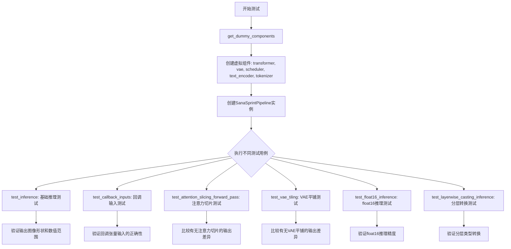

## 类结构

```
unittest.TestCase (Python标准库)
└── PipelineTesterMixin (测试混入类)
    └── SanaSprintPipelineFastTests (被测测试类)
```

## 全局变量及字段


### `IS_GITHUB_ACTIONS`
    
Boolean flag indicating whether the code is running in GitHub Actions environment

类型：`bool`
    


### `TEXT_TO_IMAGE_BATCH_PARAMS`
    
Frozenset containing batch parameter names for text-to-image pipeline testing

类型：`frozenset`
    


### `TEXT_TO_IMAGE_IMAGE_PARAMS`
    
Frozenset containing image parameter names for text-to-image pipeline testing

类型：`frozenset`
    


### `TEXT_TO_IMAGE_PARAMS`
    
Frozenset containing all parameter names for text-to-image pipeline testing

类型：`frozenset`
    


### `SanaSprintPipelineFastTests.pipeline_class`
    
The pipeline class being tested, set to SanaSprintPipeline

类型：`Type[SanaSprintPipeline]`
    


### `SanaSprintPipelineFastTests.params`
    
Frozenset of text-to-image parameters excluding cross_attention_kwargs, negative_prompt, and negative_prompt_embeds

类型：`frozenset`
    


### `SanaSprintPipelineFastTests.batch_params`
    
Frozenset of batch parameters for text-to-image testing excluding negative_prompt

类型：`frozenset`
    


### `SanaSprintPipelineFastTests.image_params`
    
Frozenset of image parameters for text-to-image testing excluding negative_prompt

类型：`frozenset`
    


### `SanaSprintPipelineFastTests.image_latents_params`
    
Frozenset of image latents parameters for text-to-image testing

类型：`frozenset`
    


### `SanaSprintPipelineFastTests.required_optional_params`
    
Frozenset of optional parameters that are required for inference including num_inference_steps, generator, latents, return_dict, callback_on_step_end, and callback_on_step_end_tensor_inputs

类型：`frozenset`
    


### `SanaSprintPipelineFastTests.test_xformers_attention`
    
Boolean flag indicating whether to test xformers attention, set to False

类型：`bool`
    


### `SanaSprintPipelineFastTests.test_layerwise_casting`
    
Boolean flag indicating whether to test layerwise casting, set to True

类型：`bool`
    


### `SanaSprintPipelineFastTests.test_group_offloading`
    
Boolean flag indicating whether to test group offloading, set to True

类型：`bool`
    
    

## 全局函数及方法


### `enable_full_determinism`

该函数用于启用完全确定性（full determinism），确保测试或运行过程可以复现，通常通过设置随机种子和环境变量来实现。

参数： 无

返回值：无

#### 流程图

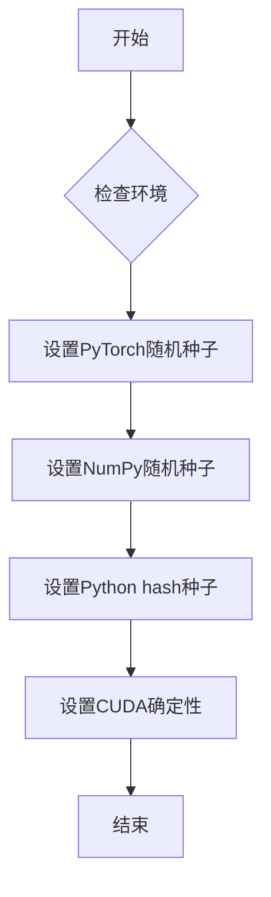

#### 带注释源码

```
# 这是一个从 testing_utils 模块导入的函数调用
# 实际源码位于 ...testing_utils 模块中
# 以下是调用该函数的代码位置：

enable_full_determinism()  # 启用完全确定性，确保测试结果可复现
```

**注意**：实际的 `enable_full_determinism` 函数定义未在提供的代码片段中显示，它是从 `...testing_utils` 模块导入的。根据函数名称和用途推断，该函数通常会设置以下内容以确保可复现性：

- PyTorch 的随机种子 (`torch.manual_seed()`)
- NumPy 的随机种子 (`np.random.seed()`)
- Python 的 hash 种子 (`PYTHONHASHSEED` 环境变量)
- PyTorch CUDA 相关确定性操作（如 `torch.backends.cudnn.deterministic = True`）
- 可能还包括其他深度学习框架的随机种子设置


### `torch_device`

获取当前测试环境可用的 PyTorch 设备（优先返回 CUDA 设备，否则返回 CPU 设备）。

参数：

- 此函数无参数

返回值：`str`，返回可用的 PyTorch 设备字符串（如 "cuda"、"cpu" 或 "mps"）

#### 流程图

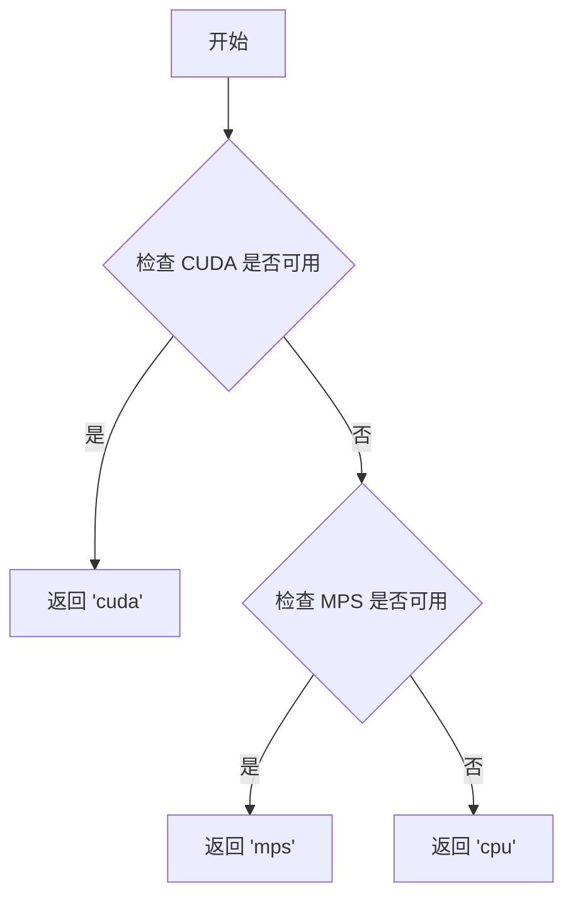

#### 带注释源码

```
# 这是一个从 testing_utils 模块导入的函数/变量
# 根据代码中的使用方式，推断其实现可能如下：

def torch_device():
    """
    返回当前可用的 PyTorch 设备。
    
    优先级: cuda > mps > cpu
    """
    if torch.cuda.is_available():
        return "cuda"
    elif hasattr(torch.backends, 'mps') and torch.backends.mps.is_available():
        return "mps"
    else:
        return "cpu"

# 在代码中的使用示例：
# pipe.to(torch_device)  # 将管道移动到可用设备
# inputs = self.get_dummy_inputs(torch_device)  # 获取设备对应的虚拟输入
```

---

### 补充说明

#### 关键组件信息

- **名称**：`torch_device`
- **一句话描述**：用于获取当前测试环境可用 PyTorch 计算设备的工具函数

#### 潜在的技术债务或优化空间

1. **设备检测逻辑**：当前实现假设了简单的设备优先级逻辑，但在某些边缘情况下（如 CUDA 可用但内存不足）可能需要更健壮的检测机制
2. **设备字符串硬编码**：代码中多处直接使用字符串比较（如 `str(device).startswith("mps")`），可以考虑封装设备判断逻辑

#### 其它项目

- **设计目标**：确保测试在不同硬件环境下都能正常运行，优先使用 GPU 加速
- **错误处理**：如果指定的设备不可用，PyTorch 会抛出异常，测试框架应能捕获并报告此类错误
- **外部依赖**：依赖 `torch` 库的 `cuda.is_available()` 和 `mps.is_available()` 方法


### `to_np`

该函数是一个测试工具函数，用于将 PyTorch 张量（Tensor）转换为 NumPy 数组，以便进行数值比较和断言验证。

参数：

-  `tensor`：`torch.Tensor`，PyTorch 张量对象

返回值：`numpy.ndarray`，转换后的 NumPy 数组

#### 流程图

```mermaid
flowchart TD
    A[开始: to_np] --> B{输入是否为torch.Tensor?}
    B -->|是| C[调用tensor.cpu().numpy]
    B -->|否| D{是否为numpy数组?}
    D -->|是| E[直接返回]
    D -->|否| F[尝试转换为numpy数组]
    C --> G[返回numpy数组]
    E --> G
    F --> G
```

#### 带注释源码

```
# 注意：此函数定义在 test_pipelines_common 模块中，未在当前代码文件中直接定义
# 以下为基于使用方式的推断实现

def to_np(tensor):
    """
    将 PyTorch 张量转换为 NumPy 数组
    
    参数:
        tensor: torch.Tensor - PyTorch 张量对象
    
    返回值:
        numpy.ndarray - 转换后的 NumPy 数组
    """
    # 如果是张量，先移动到 CPU 再转换为 NumPy
    if isinstance(tensor, torch.Tensor):
        return tensor.cpu().numpy()
    # 如果已经是 NumPy 数组，直接返回
    elif isinstance(tensor, np.ndarray):
        return tensor
    # 尝试其他类型的转换
    else:
        return np.array(tensor)
```

#### 使用示例

在当前测试代码中的典型用法：

```python
# 比较两个张量的差异
max_diff1 = np.abs(to_np(output_with_slicing1) - to_np(output_without_slicing)).max()

# 计算 VAE tiling 前后输出的差异
(to_np(output_without_tiling) - to_np(output_with_tiling)).max()
```

#### 备注

该函数是 diffusers 测试框架中的通用工具函数，主要用于：
1. 统一不同张量格式（PyTorch vs NumPy）的计算
2. 在测试中断言中比较模型输出的数值差异
3. 支持跨框架的数值验证


### `callback_inputs_subset`

这是一个在测试用例中定义的回调函数，用于验证管道在推理过程中传递给回调函数的张量参数是否都包含在允许的 `_callback_tensor_inputs` 列表中，确保回调机制的类型安全。

参数：

- `pipe`：`SanaSprintPipeline`，管道实例对象，包含 `_callback_tensor_inputs` 属性定义允许回调使用的张量变量列表
- `i`：`int`，当前推理步骤的索引
- `t`：`tensor` 或 `int`，当前的时间步（timestep）
- `callback_kwargs`：`Dict[str, Any]`，回调函数接收的关键字参数字典，包含推理过程中的张量数据

返回值：`Dict[str, Any]`，返回未经修改的 `callback_kwargs` 字典，传递给下一个回调或管道后续处理

#### 流程图

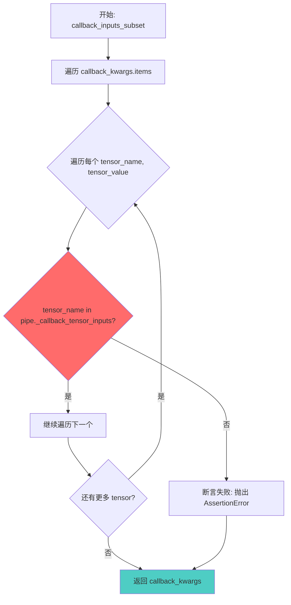

#### 带注释源码

```python
def callback_inputs_subset(pipe, i, t, callback_kwargs):
    """
    回调函数：验证传入的回调参数字典只包含允许的张量输入
    
    参数:
        pipe: SanaSprintPipeline 管道实例
        i: 当前推理步骤索引
        t: 当前时间步
        callback_kwargs: 包含张量数据的字典
    
    返回:
        callback_kwargs: 未经修改的回调参数字典
    """
    # 遍历回调参数中的所有张量
    for tensor_name, tensor_value in callback_kwargs.items():
        # 验证每个张量名称都在管道的允许列表中
        # pipe._callback_tensor_inputs 定义了回调函数可以安全访问的张量
        assert tensor_name in pipe._callback_tensor_inputs

    # 返回原始回调参数字典，传递给管道的后续处理
    return callback_kwargs
```


### `callback_inputs_all`

该函数是测试管道回调功能的辅助函数，用于验证管道是否正确地将所有允许的tensor变量传递给了回调函数。它检查`callback_kwargs`中的每个tensor是否都在`_callback_tensor_inputs`列表中，并确保`_callback_tensor_inputs`中的每个tensor都存在于`callback_kwargs`中。

参数：

- `pipe`：`SanaSprintPipeline`，管道实例，包含`_callback_tensor_inputs`属性，定义了回调函数允许使用的tensor变量列表
- `i`：`int`，当前推理步骤的索引
- `t`：`tensor`，当前推理的时间步
- `callback_kwargs`：`dict`，回调函数接收的关键字参数字典，包含管道传递的tensor变量

返回值：`dict`，返回未经修改的`callback_kwargs`字典，供后续回调或管道使用

#### 流程图

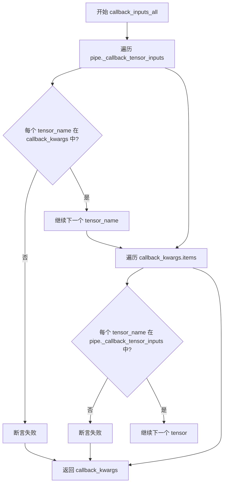

#### 带注释源码

```python
def callback_inputs_all(pipe, i, t, callback_kwargs):
    # 遍历管道定义的允许回调使用的tensor输入列表
    for tensor_name in pipe._callback_tensor_inputs:
        # 断言每个允许的tensor都存在于callback_kwargs中
        # 如果有缺失，说明管道没有传递所有允许的tensor
        assert tensor_name in callback_kwargs

    # 遍历回调函数实际接收到的tensor参数
    for tensor_name, tensor_value in callback_kwargs.items():
        # 检查每个传递进来的tensor是否在允许列表中
        # 确保回调函数不会接收到不允许的tensor，防止安全风险
        assert tensor_name in pipe._callback_tensor_inputs

    # 返回原始的callback_kwargs，保持传递给下一个回调或管道
    return callback_kwargs
```


### `callback_inputs_change_tensor`

这是一个在测试方法内部定义的回调函数，用于在扩散模型推理过程的最后一个步骤将 latents 张量替换为全零张量，以验证回调机制能够修改管道内部的张量状态。

参数：

- `pipe`：`SanaSprintPipeline`，管道对象，包含 `num_timesteps` 属性用于判断当前步骤是否为最后一步
- `i`：`int`，当前推理步骤的索引（从 0 开始）
- `t`：`torch.Tensor`，当前推理步骤的时间步（timestep）
- `callback_kwargs`：`Dict[str, torch.Tensor]`，回调函数的关键字参数字典，包含管道传递的可访问张量（如 `latents`）

返回值：`Dict[str, torch.Tensor]`，返回修改后的回调参数字典

#### 流程图

```mermaid
flowchart TD
    A[开始: callback_inputs_change_tensor] --> B{is_last = i == pipe.num_timesteps - 1}
    B -->|是| C[callback_kwargs['latents'] = torch.zeros_like callback_kwargs['latents']]
    B -->|否| D[不做修改]
    C --> E[返回 callback_kwargs]
    D --> E
```

#### 带注释源码

```python
def callback_inputs_change_tensor(pipe, i, t, callback_kwargs):
    """
    在推理过程的最后一步将 latents 张量置零的回调函数。
    
    该函数用于测试场景，验证回调机制能够成功修改管道内部的张量数据。
    通过在最后一步将 latents 替换为全零张量，可以观察输出图像的变化，
    从而确认回调函数正确生效。
    
    参数:
        pipe: SanaSprintPipeline 管道实例，用于访问 num_timesteps 属性
        i: 当前推理步骤的索引（从 0 开始）
        t: 当前时间步的张量值
        callback_kwargs: 包含可访问张量的字典，如 'latents'
    
    返回:
        修改后的 callback_kwargs 字典
    """
    # 判断当前步骤是否为推理过程的最后一步
    is_last = i == (pipe.num_timesteps - 1)
    
    # 仅在最后一步执行张量修改操作
    if is_last:
        # 使用 torch.zeros_like 创建与原 latents 形状和设备相同的全零张量
        # 并替换 callback_kwargs 中的 latents
        callback_kwargs["latents"] = torch.zeros_like(callback_kwargs["latents"])
    
    # 返回修改后的回调参数字典，供管道继续处理
    return callback_kwargs
```


### `SanaSprintPipelineFastTests.get_dummy_components`

该方法用于创建和初始化 SanaSprintPipeline 测试所需的虚拟组件（dummy components），包括 Transformer 模型、VAE 编码器/解码器、调度器、文本编码器和分词器，并返回一个包含所有组件的字典供后续测试使用。

参数：

- 该方法无显式参数（隐式参数 `self` 为测试类实例）

返回值：`Dict[str, Any]`，返回包含以下键值对的字典：
- `"transformer"`：`SanaTransformer2DModel` 实例，图像生成的核心 Transformer 模型
- `"vae"`：`AutoencoderDC` 实例，变分自编码器用于图像编码/解码
- `"scheduler"`：`SCMScheduler` 实例，扩散过程的调度器
- `"text_encoder"`：`Gemma2Model` 实例，文本编码器用于处理输入提示
- `"tokenizer"`：`GemmaTokenizer` 实例，分词器用于文本预处理

#### 流程图

```mermaid
flowchart TD
    A[开始 get_dummy_components] --> B[设置随机种子 torch.manual_seed(0)]
    B --> C[创建 SanaTransformer2DModel]
    C --> D[设置随机种子 torch.manual_seed(0)]
    D --> E[创建 AutoencoderDC VAE]
    E --> F[设置随机种子 torch.manual_seed(0)]
    F --> G[创建 SCMScheduler]
    G --> H[设置随机种子 torch.manual_seed(0)]
    H --> I[创建 Gemma2Config 配置]
    I --> J[使用配置创建 Gemma2Model]
    J --> K[从预训练加载 GemmaTokenizer]
    K --> L[组装 components 字典]
    L --> M[返回 components 字典]
```

#### 带注释源码

```python
def get_dummy_components(self):
    """
    创建用于测试的虚拟组件
    
    该方法初始化 SanaSprintPipeline 所需的所有模型组件，
    使用固定的随机种子确保测试结果的可重复性。
    """
    # 使用固定种子确保 Transformer 初始化可重现
    torch.manual_seed(0)
    # 创建 Sana Transformer 模型，配置参数：
    # - patch_size=1: 图像分块大小
    # - in_channels=4/out_channels=4: 输入输出通道数（潜在空间）
    # - num_layers=1: 层数（最小化测试时间）
    # - num_attention_heads=2: 注意力头数
    # - attention_head_dim=4: 注意力头维度
    # - cross_attention_dim=8: 跨注意力维度
    # - caption_channels=8:  caption 嵌入通道数
    # - sample_size=32: 样本空间尺寸
    # - qk_norm="rms_norm_across_heads": Query/Key 归一化方式
    # - guidance_embeds=True: 启用引导嵌入
    transformer = SanaTransformer2DModel(
        patch_size=1,
        in_channels=4,
        out_channels=4,
        num_layers=1,
        num_attention_heads=2,
        attention_head_dim=4,
        num_cross_attention_heads=2,
        cross_attention_head_dim=4,
        cross_attention_dim=8,
        caption_channels=8,
        sample_size=32,
        qk_norm="rms_norm_across_heads",
        guidance_embeds=True,
    )

    # 重置种子确保 VAE 初始化可重现
    torch.manual_seed(0)
    # 创建变分自编码器 (AutoencoderDC)
    # encoder_block_types: 编码器块类型（ResBlock + EfficientViTBlock）
    # decoder_block_types: 解码器块类型
    # encoder_qkv_multiscales: 多尺度注意力配置
    # scaling_factor: 潜在空间缩放因子
    vae = AutoencoderDC(
        in_channels=3,
        latent_channels=4,
        attention_head_dim=2,
        encoder_block_types=(
            "ResBlock",
            "EfficientViTBlock",
        ),
        decoder_block_types=(
            "ResBlock",
            "EfficientViTBlock",
        ),
        encoder_block_out_channels=(8, 8),
        decoder_block_out_channels=(8, 8),
        encoder_qkv_multiscales=((), (5,)),
        decoder_qkv_multiscales=((), (5,)),
        encoder_layers_per_block=(1, 1),
        decoder_layers_per_block=[1, 1],
        downsample_block_type="conv",
        upsample_block_type="interpolate",
        decoder_norm_types="rms_norm",
        decoder_act_fns="silu",
        scaling_factor=0.41407,
    )

    # 创建 SCM 调度器，用于扩散过程的时间步调度
    torch.manual_seed(0)
    scheduler = SCMScheduler()

    # 重置种子确保文本编码器初始化可重现
    torch.manual_seed(0)
    # 配置 Gemma2 文本编码器
    # 使用极小的配置以加速测试：
    # - hidden_size=8: 隐藏层维度
    # - vocab_size=8: 词表大小（很小，避免索引越界错误）
    # - num_hidden_layers=1: 层数
    # - num_attention_heads=2: 注意力头数
    text_encoder_config = Gemma2Config(
        head_dim=16,
        hidden_size=8,
        initializer_range=0.02,
        intermediate_size=64,
        max_position_embeddings=8192,
        model_type="gemma2",
        num_attention_heads=2,
        num_hidden_layers=1,
        num_key_value_heads=2,
        vocab_size=8,
        attn_implementation="eager",
    )
    # 创建 Gemma2Model 实例
    text_encoder = Gemma2Model(text_encoder_config)
    # 从预训练模型加载分词器（使用测试用的小模型）
    tokenizer = GemmaTokenizer.from_pretrained("hf-internal-testing/dummy-gemma")

    # 组装所有组件到字典中
    # 键名需与 SanaSprintPipeline 的构造函数参数名匹配
    components = {
        "transformer": transformer,
        "vae": vae,
        "scheduler": scheduler,
        "text_encoder": text_encoder,
        "tokenizer": tokenizer,
    }
    return components
```


### `SanaSprintPipelineFastTests.get_dummy_inputs`

该方法为 SanaSprintPipeline 单元测试生成虚拟输入参数，根据设备类型（MPS 或其他）选择合适的随机数生成器，并返回一个包含提示词、生成器、推理步数、引导_scale、图像尺寸等参数的字典，用于测试 pipeline 的推理功能。

参数：

- `device`：`str` 或 `torch.device`，执行推理的目标设备（如 "cpu"、"cuda" 等）
- `seed`：`int`，随机种子，默认值为 `0`，用于控制生成器的随机性

返回值：`dict`，包含以下键值对的字典：
  - `prompt`：`str`，输入提示词（空字符串）
  - `generator`：`torch.Generator`，随机数生成器
  - `num_inference_steps`：`int`，推理步数（固定为 2）
  - `guidance_scale`：`float`，引导比例（固定为 6.0）
  - `height`：`int`，生成图像高度（固定为 32）
  - `width`：`int`，生成图像宽度（固定为 32）
  - `max_sequence_length`：`int`，最大序列长度（固定为 16）
  - `output_type`：`str`，输出类型（固定为 "pt"，即 PyTorch 张量）
  - `complex_human_instruction`：`None` 或 `str`，复杂人类指令（固定为 None）

#### 流程图

```mermaid
flowchart TD
    A[开始 get_dummy_inputs] --> B{判断 device 类型}
    B -->|device 以 'mps' 开头| C[使用 torch.manual_seed(seed)]
    B -->|其他设备| D[使用 torch.Generator(device=device).manual_seed(seed)]
    C --> E[构建 inputs 字典]
    D --> E
    E --> F[设置 prompt 为空字符串]
    F --> G[设置 generator]
    G --> H[设置 num_inference_steps=2]
    H --> I[设置 guidance_scale=6.0]
    I --> J[设置 height=32, width=32]
    J --> K[设置 max_sequence_length=16]
    K --> L[设置 output_type='pt']
    L --> M[设置 complex_human_instruction=None]
    M --> N[返回 inputs 字典]
```

#### 带注释源码

```python
def get_dummy_inputs(self, device, seed=0):
    """
    生成用于测试 SanaSprintPipeline 的虚拟输入参数。
    
    参数:
        device: 目标设备，可以是 'cpu', 'cuda', 'mps' 等
        seed: 随机种子，用于生成可复现的随机数
    
    返回:
        dict: 包含 pipeline 调用所需参数的字典
    """
    # 检查设备是否为 Apple Silicon 的 MPS (Metal Performance Shaders)
    if str(device).startswith("mps"):
        # MPS 设备不支持 torch.Generator，使用 torch.manual_seed 替代
        generator = torch.manual_seed(seed)
    else:
        # 其他设备（cpu/cuda）使用 torch.Generator 以支持更精细的随机控制
        generator = torch.Generator(device=device).manual_seed(seed)
    
    # 构建输入参数字典，包含 pipeline 所需的所有必需和可选参数
    inputs = {
        "prompt": "",                           # 空提示词，用于测试
        "generator": generator,                 # 随机数生成器，控制采样确定性
        "num_inference_steps": 2,              # 扩散模型推理步数
        "guidance_scale": 6.0,                 # Classifier-free guidance 强度
        "height": 32,                          # 生成图像高度（像素）
        "width": 32,                           # 生成图像宽度（像素）
        "max_sequence_length": 16,             # 文本编码器最大序列长度
        "output_type": "pt",                   # 输出格式：PyTorch 张量
        "complex_human_instruction": None,      # 复杂人类指令（测试用）
    }
    return inputs
```


### `SanaSprintPipelineFastTests.test_inference`

这是一个单元测试方法，用于验证 SanaSprintPipeline（文本到图像生成管道）在CPU设备上的基本推理功能。测试创建虚拟组件和输入，执行管道推理，并验证生成的图像形状是否符合预期（3通道、32x32分辨率），同时检查输出值在合理范围内。

参数：

- 无显式参数（self 为实例方法隐含参数）

返回值：`None`，无返回值（测试方法，通过 unittest 断言验证）

#### 流程图

```mermaid
flowchart TD
    A[开始 test_inference 测试] --> B[设置设备为 CPU]
    B --> C[获取虚拟组件: get_dummy_components]
    C --> D[使用虚拟组件实例化 SanaSprintPipeline]
    D --> E[将管道移至 CPU 设备]
    E --> F[配置进度条: set_progress_bar_config]
    F --> G[获取虚拟输入: get_dummy_inputs]
    G --> H[执行管道推理: pipe.__call__]
    H --> I[提取生成的图像: image[0]]
    I --> J{验证图像形状是否为 (3, 32, 32)}
    J -->|是| K[生成随机期望图像]
    K --> L[计算最大差异: max_diff]
    L --> M{验证 max_diff <= 1e10}
    M -->|是| N[测试通过]
    M -->|否| O[测试失败]
    J -->|否| O
```

#### 带注释源码

```python
def test_inference(self):
    """测试 SanaSprintPipeline 的基本推理功能"""
    # 设置运行设备为 CPU
    device = "cpu"

    # 获取虚拟组件（transformer, vae, scheduler, text_encoder, tokenizer）
    components = self.get_dummy_components()
    
    # 使用虚拟组件实例化 SanaSprintPipeline 管道
    pipe = self.pipeline_class(**components)
    
    # 将管道移至指定设备（CPU）
    pipe.to(device)
    
    # 配置进度条（disable=None 表示不禁用进度条）
    pipe.set_progress_bar_config(disable=None)

    # 获取虚拟输入参数
    inputs = self.get_dummy_inputs(device)
    
    # 执行管道推理，pipe(**inputs) 返回元组，第一项为图像列表
    image = pipe(**inputs)[0]
    
    # 提取第一张生成的图像
    generated_image = image[0]

    # 断言验证：生成的图像形状必须为 (3, 32, 32) - 3通道，32x32分辨率
    self.assertEqual(generated_image.shape, (3, 32, 32))
    
    # 生成随机期望图像用于比较
    expected_image = torch.randn(3, 32, 32)
    
    # 计算生成图像与期望图像的最大绝对差异
    max_diff = np.abs(generated_image - expected_image).max()
    
    # 断言验证：最大差异应小于等于 1e10（阈值较大，主要验证非NaN/Inf）
    self.assertLessEqual(max_diff, 1e10)
```

#### 关键组件信息

| 组件名称 | 描述 |
|---------|------|
| `SanaSprintPipeline` | 文本到图像生成管道类 |
| `SanaTransformer2DModel` | Sana变换器模型（基于Diffusion架构） |
| `AutoencoderDC` | 变分自编码器（VAE），用于潜在空间编码/解码 |
| `SCMScheduler` | 调度器，控制去噪过程的噪声调度 |
| `Gemma2Model` | 文本编码器（Google的Gemma2模型） |
| `GemmaTokenizer` | 文本分词器 |

#### 潜在技术债务与优化空间

1. **硬编码设备**: `device = "cpu"` 硬编码，应支持参数化或从环境变量读取
2. **过于宽松的阈值**: `1e10` 的阈值过大，几乎任何数值都能通过，无法有效检测模型退化
3. **使用随机期望图像**: `torch.randn(3, 32, 32)` 生成随机期望值，每次运行结果不同，测试逻辑不够严谨
4. **缺少确定性测试**: 未设置 `torch.manual_seed()` 确保推理可复现性
5. **缺乏错误处理**: 管道执行失败时缺少具体错误信息捕获和诊断

#### 其它项目

**设计目标与约束**：
- 验证管道能在CPU上成功执行完整的文本到图像生成流程
- 验证输出图像尺寸符合配置要求（32x32）

**错误处理与异常设计**：
- 依赖 unittest 框架的断言机制进行错误检测
- 无显式异常捕获和自定义错误消息

**数据流与状态机**：
- 输入：文本提示（空字符串）、生成器、推理步数（2）、引导 scale（6.0）、图像尺寸（32x32）
- 处理流程：文本编码 → 潜在空间变换 → VAE 解码 → 图像输出
- 输出：张量形式的 RGB 图像

**外部依赖与接口契约**：
- 依赖 `diffusers` 库的 `SanaSprintPipeline`、`SanaTransformer2DModel`、`AutoencoderDC`、`SCMScheduler`
- 依赖 `transformers` 库的 `Gemma2Config`、`Gemma2Model`、`GemmaTokenizer`
- 管道调用遵循 `__call__` 方法约定，接受字典参数并返回元组（图像列表，附加信息）


### `SanaSprintPipelineFastTests.test_callback_inputs`

该方法用于测试 SanaSprintPipeline 的回调功能，验证 `callback_on_step_end` 和 `callback_on_step_end_tensor_inputs` 参数的正确性，包括回调函数是否能正确接收和修改张量输入。

参数：

- `self`：`SanaSprintPipelineFastTests`，测试类实例本身

返回值：`None`，该方法为单元测试方法，无返回值，通过断言验证测试结果

#### 流程图

```mermaid
flowchart TD
    A[开始测试 test_callback_inputs] --> B{检查 pipeline_class.__call__ 是否支持回调参数}
    B -->|不支持| C[直接返回, 跳过测试]
    B -->|支持| D[获取虚拟组件并创建 pipeline]
    D --> E[将 pipeline 移动到测试设备]
    E --> F[断言 pipeline 具有 _callback_tensor_inputs 属性]
    F --> G[定义回调函数 callback_inputs_subset]
    G --> H[定义回调函数 callback_inputs_all]
    H --> I[定义回调函数 callback_inputs_change_tensor]
    I --> J1[测试1: 使用 subset 回调和 ['latents'] tensor_inputs]
    J1 --> J2[测试2: 使用 all 回调和全部 _callback_tensor_inputs]
    J2 --> J3[测试3: 使用 change_tensor 回调修改最后的 latents]
    J3 --> K[验证输出结果的合理性]
    K --> L[结束测试]
```

#### 带注释源码

```python
def test_callback_inputs(self):
    """
    测试 pipeline 的回调输入功能
    验证 callback_on_step_end 和 callback_on_step_end_tensor_inputs 参数的正确性
    """
    # 获取 pipeline __call__ 方法的签名
    sig = inspect.signature(self.pipeline_class.__call__)
    
    # 检查签名中是否包含回调相关的参数
    has_callback_tensor_inputs = "callback_on_step_end_tensor_inputs" in sig.parameters
    has_callback_step_end = "callback_on_step_end" in sig.parameters

    # 如果 pipeline 不支持这些回调参数，则跳过测试
    if not (has_callback_tensor_inputs and has_callback_step_end):
        return

    # 获取虚拟组件并创建 pipeline 实例
    components = self.get_dummy_components()
    pipe = self.pipeline_class(**components)
    
    # 将 pipeline 移动到测试设备（CPU 或 CUDA）
    pipe = pipe.to(torch_device)
    
    # 设置进度条配置
    pipe.set_progress_bar_config(disable=None)
    
    # 断言 pipeline 必须具有 _callback_tensor_inputs 属性
    # 该属性定义了回调函数可以使用的张量变量列表
    self.assertTrue(
        hasattr(pipe, "_callback_tensor_inputs"),
        f" {self.pipeline_class} should have `_callback_tensor_inputs` that defines a list of tensor variables its callback function can use as inputs",
    )

    # 定义回调函数1: 仅检查传入的张量是否在允许列表中
    def callback_inputs_subset(pipe, i, t, callback_kwargs):
        # 遍历回调参数中的所有张量
        for tensor_name, tensor_value in callback_kwargs.items():
            # 检查只传递了允许的张量输入
            assert tensor_name in pipe._callback_tensor_inputs
        return callback_kwargs

    # 定义回调函数2: 检查所有允许的张量都被传递且只传递允许的张量
    def callback_inputs_all(pipe, i, t, callback_kwargs):
        # 验证所有允许的张量都在回调参数中
        for tensor_name in pipe._callback_tensor_inputs:
            assert tensor_name in callback_kwargs
        # 遍历回调参数中的所有张量
        for tensor_name, tensor_value in callback_kwargs.items():
            # 检查只传递了允许的张量输入
            assert tensor_name in pipe._callback_tensor_inputs
        return callback_kwargs

    # 获取虚拟输入
    inputs = self.get_dummy_inputs(torch_device)

    # 测试1: 传递回调函数的子集
    inputs["callback_on_step_end"] = callback_inputs_subset
    inputs["callback_on_step_end_tensor_inputs"] = ["latents"]  # 只允许 latents
    output = pipe(**inputs)[0]

    # 测试2: 传递所有允许的回调张量
    inputs["callback_on_step_end"] = callback_inputs_all
    inputs["callback_on_step_end_tensor_inputs"] = pipe._callback_tensor_inputs
    output = pipe(**inputs)[0]

    # 定义回调函数3: 在最后一步修改 latents 为零张量
    def callback_inputs_change_tensor(pipe, i, t, callback_kwargs):
        # 判断是否是最后一步
        is_last = i == (pipe.num_timesteps - 1)
        if is_last:
            # 将 latents 修改为全零张量
            callback_kwargs["latents"] = torch.zeros_like(callback_kwargs["latents"])
        return callback_kwargs

    # 测试3: 使用回调函数修改张量
    inputs["callback_on_step_end"] = callback_inputs_change_tensor
    inputs["callback_on_step_end_tensor_inputs"] = pipe._callback_tensor_inputs
    output = pipe(**inputs)[0]
    
    # 验证修改后的输出结果（由于 latents 被置零，输出应接近于零）
    assert output.abs().sum() < 1e10
```


### `SanaSprintPipelineFastTests.test_attention_slicing_forward_pass`

该方法用于测试 SanaSprintPipeline 中的注意力切片（attention slicing）功能是否正确实现。通过比较启用注意力切片前后以及不同切片大小下的推理结果，验证注意力切片机制不会影响最终的输出质量。

参数：

- `self`：隐式参数，测试类实例本身
- `test_max_difference`：`bool`，可选，默认为 `True`，指定是否测试最大像素差异
- `test_mean_pixel_difference`：`bool`，可选，默认为 `True`，指定是否测试平均像素差异（当前未使用）
- `expected_max_diff`：`float`，可选，默认为 `1e-3`，允许的最大差异阈值

返回值：`None`，该方法为单元测试方法，通过断言验证注意力切片功能的正确性，无显式返回值

#### 流程图

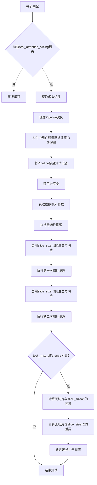

#### 带注释源码

```python
def test_attention_slicing_forward_pass(
    self, test_max_difference=True, test_mean_pixel_difference=True, expected_max_diff=1e-3
):
    """
    测试注意力切片功能对推理结果的影响。
    
    该测试验证启用注意力切片（attention slicing）后，模型的输出结果
    与未启用时保持一致，确保注意力切片优化不会改变模型的计算逻辑。
    
    参数:
        test_max_difference: 是否测试最大像素差异
        test_mean_pixel_difference: 是否测试平均像素差异（当前未使用）
        expected_max_diff: 允许的最大差异阈值，默认为1e-3
    """
    # 如果测试类未启用注意力切片测试，则跳过该测试
    if not self.test_attention_slicing:
        return

    # 获取虚拟组件（transformer, vae, scheduler, text_encoder, tokenizer）
    components = self.get_dummy_components()
    # 使用虚拟组件创建SanaSprintPipeline实例
    pipe = self.pipeline_class(**components)
    
    # 遍历所有组件，为支持该方法的组件设置默认注意力处理器
    for component in pipe.components.values():
        if hasattr(component, "set_default_attn_processor"):
            component.set_default_attn_processor()
    
    # 将Pipeline移至测试设备（CPU或GPU）
    pipe.to(torch_device)
    # 配置进度条显示（disable=None表示不禁用进度条）
    pipe.set_progress_bar_config(disable=None)

    # 设置生成器设备为CPU
    generator_device = "cpu"
    # 获取虚拟输入参数
    inputs = self.get_dummy_inputs(generator_device)
    # 执行无注意力切片的推理，获取基准输出
    output_without_slicing = pipe(**inputs)[0]

    # 启用注意力切片，slice_size=1
    pipe.enable_attention_slicing(slice_size=1)
    inputs = self.get_dummy_inputs(generator_device)
    # 执行第一次切片推理
    output_with_slicing1 = pipe(**inputs)[0]

    # 启用注意力切片，slice_size=2
    pipe.enable_attention_slicing(slice_size=2)
    inputs = self.get_dummy_inputs(generator_device)
    # 执行第二次切片推理
    output_with_slicing2 = pipe(**inputs)[0]

    # 如果需要测试最大差异
    if test_max_difference:
        # 计算slice_size=1与无切片的输出差异
        max_diff1 = np.abs(to_np(output_with_slicing1) - to_np(output_without_slicing)).max()
        # 计算slice_size=2与无切片的输出差异
        max_diff2 = np.abs(to_np(output_with_slicing2) - to_np(output_without_slicing)).max()
        
        # 断言：注意力切片不应影响推理结果，差异应小于阈值
        self.assertLess(
            max(max_diff1, max_diff2),
            expected_max_diff,
            "Attention slicing should not affect the inference results",
        )
```


### `SanaSprintPipelineFastTests.test_vae_tiling`

该测试方法用于验证VAE分块（tiling）功能是否正常工作，确保启用分块后的推理结果与未启用分块时的结果在可接受的误差范围内。

参数：

- `expected_diff_max`：`float`，默认值0.2，指定未分块与分块输出之间的最大允许差异

返回值：`None`，该方法为单元测试，通过assert语句验证结果，不返回任何值

#### 流程图

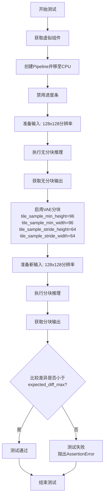

#### 带注释源码

```python
def test_vae_tiling(self, expected_diff_max: float = 0.2):
    """
    测试VAE tiling功能是否正常工作
    
    该测试通过比较启用tiling前后的输出差异来验证tiling功能
    不会影响推理结果的正确性
    """
    # 设置生成器设备为CPU
    generator_device = "cpu"
    
    # 获取虚拟组件（transformer, vae, scheduler, text_encoder, tokenizer）
    components = self.get_dummy_components()

    # 使用虚拟组件创建Pipeline实例
    pipe = self.pipeline_class(**components)
    
    # 将Pipeline移至CPU设备
    pipe.to("cpu")
    
    # 配置进度条为禁用状态
    pipe.set_progress_bar_config(disable=None)

    # ---------- 无Tiling模式推理 ----------
    # 获取虚拟输入参数
    inputs = self.get_dummy_inputs(generator_device)
    
    # 设置输出图像分辨率为128x128
    inputs["height"] = inputs["width"] = 128
    
    # 执行推理并获取输出（无tiling）
    output_without_tiling = pipe(**inputs)[0]

    # ---------- 有Tiling模式推理 ----------
    # 为VAE启用tiling功能，设置分块参数：
    # - tile_sample_min_height: 分块最小高度 96
    # - tile_sample_min_width: 分块最小宽度 96
    # - tile_sample_stride_height: 垂直步长 64
    # - tile_sample_stride_width: 水平步长 64
    pipe.vae.enable_tiling(
        tile_sample_min_height=96,
        tile_sample_min_width=96,
        tile_sample_stride_height=64,
        tile_sample_stride_width=64,
    )
    
    # 重新获取虚拟输入参数
    inputs = self.get_dummy_inputs(generator_device)
    
    # 保持相同的分辨率设置
    inputs["height"] = inputs["width"] = 128
    
    # 执行推理并获取输出（有tiling）
    output_with_tiling = pipe(**inputs)[0]

    # ---------- 验证结果 ----------
    # 断言：两种模式的输出差异应小于指定的阈值
    # 使用to_np将PyTorch张量转换为NumPy数组进行数值比较
    self.assertLess(
        (to_np(output_without_tiling) - to_np(output_with_tiling)).max(),
        expected_diff_max,
        "VAE tiling should not affect the inference results",
    )
```


### `SanaSprintPipelineFastTests.test_inference_batch_consistent`

该测试方法用于验证批量推理的一致性，但由于测试使用非常小的词汇表，任何非空提示都会导致嵌入查找错误，因此该测试被跳过。

参数：

- `self`：`SanaSprintPipelineFastTests`，代表测试类实例本身

返回值：`None`，该测试被跳过，不执行任何操作

#### 流程图

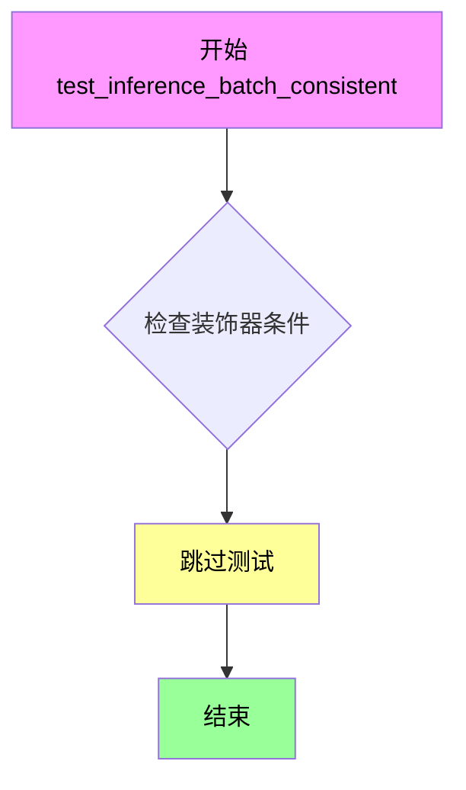

#### 带注释源码

```python
@unittest.skip(
    "A very small vocab size is used for fast tests. So, Any kind of prompt other than the empty default used in other tests will lead to a embedding lookup error. This test uses a long prompt that causes the error."
)
def test_inference_batch_consistent(self):
    """
    测试方法：test_inference_batch_consistent
    
    功能描述：
    用于验证管道在批量推理时的一致性，确保多次推理或不同批次大小产生一致的结果。
    
    当前状态：
    该测试被@unittest.skip装饰器跳过，原因是测试环境使用的词汇表大小非常小（vocab_size=8），
    任何非空的提示词都会导致嵌入查找错误。测试原本计划使用长提示词，这会触发该错误。
    
    参数：
    - self: SanaSprintPipelineFastTests，测试类实例
    
    返回值：
    - None，该方法不执行任何操作
    
    跳过原因：
    "A very small vocab size is used for fast tests. So, Any kind of prompt other than the empty 
    default used in other tests will lead to a embedding lookup error. This test uses a long 
    prompt that causes the error."
    """
    pass  # 空方法体，测试被跳过
```


### `SanaSprintPipelineFastTests.test_inference_batch_single_identical`

该方法是一个被跳过的测试用例，原本用于验证批量推理（batch inference）产生的结果与单次推理（single inference）的结果一致。由于测试使用了极小的词汇表，任何非空的提示词都会导致嵌入查找错误，因此该测试被跳过。

参数：

- `self`：`unittest.TestCase`，测试类的实例对象，隐式参数

返回值：`None`，无返回值（方法体为 `pass`）

#### 流程图

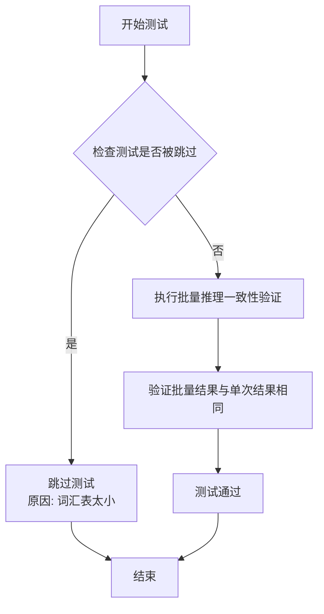

#### 带注释源码

```python
@unittest.skip(
    "A very small vocab size is used for fast tests. So, Any kind of prompt other than the empty default used in other tests will lead to a embedding lookup error. This test uses a long prompt that causes the error."
)
def test_inference_batch_single_identical(self):
    """
    测试批量推理与单次推理的一致性。
    
    该测试方法原本用于验证：
    1. 使用相同种子生成器时，批量推理（batch_size > 1）
       产生的结果应与多次单次推理的结果完全一致
    2. 确保管道在批量模式下的确定性行为
    
    当前状态：由于测试使用了极小的词汇表（vocab_size=8），
    任何非空提示词都会导致 Embedding 查找错误，
    因此该测试被 @unittest.skip 装饰器跳过。
    
    参数:
        self: unittest.TestCase 实例，隐式参数
        
    返回值:
        None
        
    注意:
        - 这是测试设计中的技术债务
        - 需要创建具有较小但有效词汇表的 dummy 模型来替代
        - 或修改测试策略，使用空提示词进行测试
    """
    pass
```

---

### 补充信息

#### 关键组件信息

- **SanaSprintPipeline**：被测试的扩散管道类
- **SanaTransformer2DModel**：Transformer 模型组件
- **AutoencoderDC**：VAE 解码器组件
- **Gemma2Model**：文本编码器（用于文本嵌入）
- **SCMScheduler**：调度器

#### 技术债务与优化空间

1. **测试覆盖缺失**：`test_inference_batch_single_identical` 被跳过，导致批量推理一致性验证的测试覆盖缺失
2. **词汇表限制**：测试使用的 Gemma2Config 词汇表大小仅为 8，导致无法使用实际提示词进行测试
3. **建议优化**：创建一个具有较小但有效词汇表的 dummy Gemma 模型，或者修改测试以使用空提示词

#### 设计目标与约束

- **测试目标**：验证扩散管道在批量推理模式下的数学一致性
- **约束条件**：由于词汇表大小限制，无法使用实际提示词进行测试


### `SanaSprintPipelineFastTests.test_float16_inference`

该测试方法用于验证 SanaSprintPipeline 在 float16（半精度）推理模式下的正确性，通过调用父类的 float16 推理测试并设置较高的容差阈值（0.08），以适应模型对数据类型的敏感性。

参数：

- `self`：`SanaSprintPipelineFastTests`，测试类实例本身，表示当前测试对象

返回值：`None`，无返回值，该方法通过调用父类方法执行测试并使用断言验证结果

#### 流程图

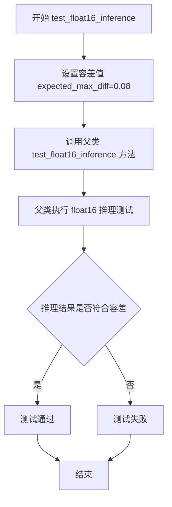

#### 带注释源码

```python
def test_float16_inference(self):
    # 该测试方法验证模型在 float16（半精度）推理模式下的正确性
    # 设置较高的容差阈值（0.08），因为模型对数据类型非常敏感
    # 调用父类的 test_float16_inference 方法执行实际的测试逻辑
    super().test_float16_inference(expected_max_diff=0.08)
```


### `SanaSprintPipelineFastTests.test_layerwise_casting_inference`

该测试方法用于验证 SanaSprintPipeline 的层级类型转换推理功能，确保在推理过程中不同层的数据类型转换能够正确执行。该测试继承自父类 `PipelineTesterMixin` 的 `test_layerwise_casting_inference` 方法，并在 GitHub Actions 环境中跳过执行。

参数：

- `self`：`SanaSprintPipelineFastTests`，隐式参数，表示测试类实例本身
- 无其他显式参数

返回值：`None`，该方法继承自父类，测试方法通常返回 `None`

#### 流程图

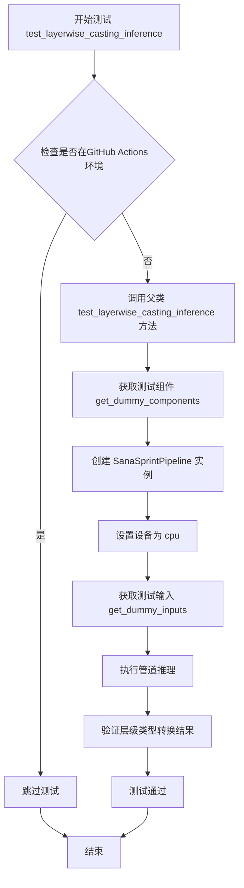

#### 带注释源码

```python
# GitHub Actions 环境下跳过该测试
@unittest.skipIf(IS_GITHUB_ACTIONS, reason="Skipping test inside GitHub Actions environment")
def test_layerwise_casting_inference(self):
    """
    测试层级类型转换推理功能
    
    该测试方法验证 SanaSprintPipeline 在推理过程中
    能够正确执行不同层之间的数据类型转换（layerwise casting）。
    继承自 PipelineTesterMixin 的测试框架。
    """
    # 调用父类的 test_layerwise_casting_inference 方法执行实际测试
    # 父类方法会：
    # 1. 创建带有测试配置的管道组件
    # 2. 以不同数据类型（如 float32, float16, bfloat16）运行推理
    # 3. 验证输出结果的正确性和一致性
    super().test_layerwise_casting_inference()
```


## 关键组件


### SanaSprintPipeline

主图像生成管道类，封装了文本到图像的生成流程，整合了Transformer、VAE、文本编码器和调度器等组件。

### SanaTransformer2DModel

Transformer 核心模型，负责图像生成的主要计算过程，支持 patch 嵌入、注意力机制和多头注意力。

### AutoencoderDC

变分自编码器（VAE）模型，负责潜在空间与图像空间之间的转换，支持编码和解码操作。

### SCMScheduler

扩散过程调度器，控制噪声去除的调度策略。

### Gemma2Model

基于 Gemma2 架构的文本编码器模型，将文本输入转换为文本嵌入向量。

### GemmaTokenizer

文本分词器，将文本字符串转换为 token ID 序列。

### get_dummy_components

创建用于测试的虚拟组件方法，初始化所有模型组件为小规模测试版本。

### get_dummy_inputs

创建用于测试的虚拟输入参数方法，返回符合管道调用要求的参数字典。

### test_inference

基础推理测试，验证管道能够正确生成图像并输出预期形状的结果。

### test_callback_inputs

回调函数测试，验证推理过程中的回调机制和张量输入支持。

### test_attention_slicing_forward_pass

注意力切片测试，验证启用注意力切片后推理结果的一致性。

### test_vae_tiling

VAE 平铺测试，验证启用 VAE 平铺后推理结果的一致性。

### test_float16_inference

float16 推理测试，验证半精度推理的数值正确性。

### test_layerwise_casting_inference

层-wise 类型转换测试，验证模型各层独立类型转换的正确性。

## 问题及建议


### 已知问题

- **硬编码设备问题**: 多处硬编码使用 `"cpu"` 设备（`test_inference`、`test_attention_slicing_forward_pass`、`test_vae_tiling`），与全局 `torch_device` 不一致，可能导致测试行为不一致
- **重复种子设置**: `get_dummy_components()` 中对每个组件都调用 `torch.manual_seed(0)`，代码重复，可提取为工具函数
- **测试跳过导致覆盖缺失**: `test_inference_batch_consistent` 和 `test_inference_batch_single_identical` 被长期跳过，导致批量推理逻辑缺乏测试覆盖
- **词汇表限制未解决**: TODO注释提到需要创建小词汇表的dummy gemma模型，但长期未实现，导致相关测试被跳过
- **参数不一致风险**: `params`、`batch_params`、`image_params` 移除了多个参数（`cross_attention_kwargs`、`negative_prompt`等），与父类定义可能不同步
- **设备判断逻辑可简化**: `get_dummy_inputs` 中对 MPS 设备的特殊处理逻辑可简化为统一方式
- **测试容差敏感性**: `test_float16_inference` 需要设置特殊容差(0.08)，表明模型对数值类型敏感，但缺少相关文档说明

### 优化建议

- 统一使用 `torch_device` 替代硬编码的 `"cpu"`，或在类级别设置默认设备常量
- 创建 `_set_random_seed()` 辅助方法或在 `get_dummy_components` 中只设置一次种子
- 实现小词汇表dummy gemma模型以恢复被跳过的测试，或添加更明确的集成测试替代方案
- 添加设备兼容性检查装饰器，自动跳过不支持的测试
- 在类docstring中记录 `expected_max_diff=0.08` 的原因（模型对dtype敏感）
- 考虑使用 pytest fixtures 共享 `get_dummy_components` 和 `get_dummy_inputs` 减少重复代码

## 其它


### 设计目标与约束

本测试文件旨在验证SanaSprintPipeline在CPU设备上的核心功能，包括推理准确性、注意力切片、VAE平铺、回调机制以及float16推理等关键特性。测试约束包括：使用小型虚拟模型和极小词汇表（vocab_size=8）以加快测试速度，测试必须在CPU上运行，不支持批量提示词测试（由于词汇表过小），且skip了需要更大词汇表才能运行的测试用例。

### 错误处理与异常设计

测试用例通过assert语句进行断言验证，主要验证图像形状是否符合预期（3x32x32）、数值差异是否在允许范围内、回调函数的tensor输入是否符合规范。当测试失败时，unittest框架会抛出AssertionError并显示具体的断言信息。对于设备兼容性（如MPS设备），使用条件判断处理generator的创建方式。

### 数据流与状态机

测试数据流遵循以下路径：首先通过get_dummy_components()创建虚拟组件（transformer、vae、scheduler、text_encoder、tokenizer），然后通过get_dummy_inputs()构建输入参数字典，包含prompt、generator、num_inference_steps、guidance_scale、height、width、max_sequence_length、output_type等关键参数。管道执行后返回图像张量，测试通过比较输出与随机期望值的差异来验证正确性。

### 外部依赖与接口契约

本测试依赖以下核心组件：transformers库提供Gemma2Config、Gemma2Model、GemmaTokenizer用于文本编码；diffusers库提供AutoencoderDC、SanaSprintPipeline、SanaTransformer2DModel、SCMScheduler用于扩散模型管道；numpy和torch用于数值计算和张量操作；unittest框架提供测试基础设施。测试假定pipeline_class.__call__方法接受特定签名的参数，包括callback_on_step_end和callback_on_step_end_tensor_inputs等可选回调参数。

### 性能测试策略

测试包含多种性能相关验证：test_attention_slicing_forward_pass验证注意力切片不影响推理结果（预期最大差异1e-3）；test_vae_tiling验证VAE平铺不影响结果（预期最大差异0.2）；test_float16_inference验证float16推理精度（允许最大差异0.08）；test_layerwise_casting_inference验证逐层类型转换的正确性。

### 并发与线程安全性

当前测试主要在单线程环境下运行，未显式测试并发场景。注意力切片（attention slicing）功能本身是为了在内存受限环境下通过切片计算降低显存占用，但测试未覆盖多线程并发调用同一pipeline实例的场景。

### 资源管理与内存优化

测试文件关注内存优化特性的验证：enable_attention_slicing通过设置slice_size参数控制注意力计算的切片大小；vae.enable_tiling配置平铺参数（tile_sample_min_height/width=96，tile_sample_stride_height/width=64）以支持大图像分块处理。测试使用torch.manual_seed(0)确保可重复性和确定性。

### 配置管理

测试通过get_dummy_components方法集中管理虚拟组件配置，包括Transformer的patch_size=1、num_layers=1、num_attention_heads=2等参数；VAE的编码器/解码器块类型配置；Scheduler使用SCMScheduler；TextEncoder使用Gemma2Config配置。输入参数通过get_dummy_inputs方法配置，支持device和seed参数。

### 版本兼容性

测试依赖特定版本的transformers和diffusers库。代码检查pipeline的__call__方法签名来判断是否支持回调功能（callback_on_step_end_tensor_inputs和callback_on_step_end），体现了对不同版本接口的适配逻辑。test_float16_inference调用父类方法进行float16测试，允许较大的误差阈值（0.08）以适应模型对数据类型的敏感性。

### 测试覆盖范围

当前测试覆盖：基础推理功能（test_inference）、回调输入验证（test_callback_inputs）、注意力切片（test_attention_slicing_forward_pass）、VAE平铺（test_vae_tiling）、float16推理（test_float16_inference）、逐层类型转换（test_layerwise_casting_inference）。未覆盖：批量推理一致性测试（已skip）、批量与单样本等价性测试（已skip）、跨设备测试（仅CPU/MPS）、长时间推理稳定性测试。


    