# `diffusers\tests\pipelines\sana\test_sana_sprint_img2img.py` 详细设计文档

这是一个针对SanaSprintImg2ImgPipeline的单元测试文件，测试了图像到图像生成管道的推理功能，包括基础推理、回调函数、注意力切片、VAE平铺、float16推理和分层类型转换等关键功能。

## 整体流程

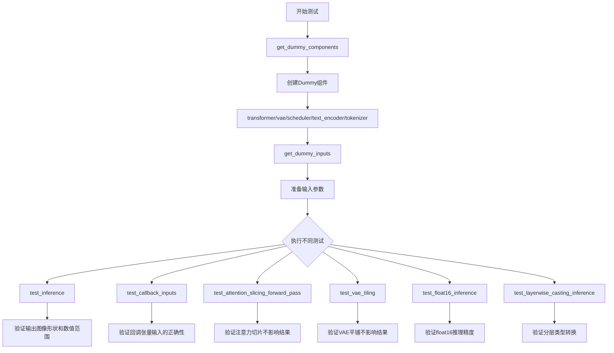

## 类结构

```
SanaSprintImg2ImgPipelineFastTests (PipelineTesterMixin + unittest.TestCase)
├── get_dummy_components (创建测试用虚拟组件)
├── get_dummy_inputs (创建测试用虚拟输入)
├── test_inference (基础推理测试)
├── test_callback_inputs (回调函数测试)
├── test_attention_slicing_forward_pass (注意力切片测试)
├── test_vae_tiling (VAE平铺测试)
├── test_inference_batch_consistent (跳过-批次一致性测试)
├── test_inference_batch_single_identical (跳过-批次单样本一致性测试)
├── test_float16_inference (float16推理测试)
└── test_layerwise_casting_inference (分层类型转换测试)
```

## 全局变量及字段


### `IS_GITHUB_ACTIONS`
    
是否在GitHub Actions环境中运行

类型：`bool`
    


### `enable_full_determinism`
    
启用完全确定性输出的函数

类型：`function`
    


### `torch_device`
    
PyTorch设备字符串

类型：`str`
    


### `SanaSprintImg2ImgPipelineFastTests.pipeline_class`
    
被测试的管道类

类型：`SanaSprintImg2ImgPipeline`
    


### `SanaSprintImg2ImgPipelineFastTests.params`
    
管道调用参数集合

类型：`frozenset`
    


### `SanaSprintImg2ImgPipelineFastTests.batch_params`
    
批处理参数集合

类型：`frozenset`
    


### `SanaSprintImg2ImgPipelineFastTests.image_params`
    
图像参数集合

类型：`tuple`
    


### `SanaSprintImg2ImgPipelineFastTests.image_latents_params`
    
图像潜在向量参数集合

类型：`tuple`
    


### `SanaSprintImg2ImgPipelineFastTests.required_optional_params`
    
必需的可选参数集合

类型：`frozenset`
    


### `SanaSprintImg2ImgPipelineFastTests.test_xformers_attention`
    
是否测试xformers注意力

类型：`bool`
    


### `SanaSprintImg2ImgPipelineFastTests.test_layerwise_casting`
    
是否测试分层类型转换

类型：`bool`
    


### `SanaSprintImg2ImgPipelineFastTests.test_group_offloading`
    
是否测试组卸载

类型：`bool`
    
    

## 全局函数及方法


### `SanaSprintImg2ImgPipelineFastTests.get_dummy_components`

该方法用于创建包含虚拟（dummy）组件的字典，这些组件包括 transformer、vae、scheduler、text_encoder 和 tokenizer，用于测试 SanaSprintImg2ImgPipeline 推理流程。

参数：
- 无参数

返回值：`Dict[str, Any]`，返回一个包含虚拟组件的字典，键为 "transformer"、"vae"、"scheduler"、"text_encoder"、"tokenizer"，值为对应的模型实例或调度器实例。

#### 流程图

```mermaid
flowchart TD
    A[开始] --> B[设置随机种子 torch.manual_seed(0)]
    B --> C[创建 SanaTransformer2DModel]
    C --> D[设置随机种子 torch.manual_seed(0)]
    D --> E[创建 AutoencoderDC]
    E --> F[设置随机种子 torch.manual_seed(0)]
    F --> G[创建 SCMScheduler]
    G --> H[设置随机种子 torch.manual_seed(0)]
    H --> I[创建 Gemma2Config 配置对象]
    I --> J[创建 Gemma2Model 文本编码器]
    J --> K[加载 GemmaTokenizer 分词器]
    K --> L[构建 components 字典]
    L --> M[返回 components 字典]
```

#### 带注释源码

```python
def get_dummy_components(self):
    """
    创建虚拟组件字典，用于测试 SanaSprintImg2ImgPipeline
    """
    # 设置随机种子，确保结果可复现
    torch.manual_seed(0)
    
    # 创建虚拟 Transformer 模型 (SanaTransformer2DModel)
    # 参数说明：
    # - patch_size=1: 图像分块大小
    # - in_channels=4: 输入通道数
    # - out_channels=4: 输出通道数
    # - num_layers=1: Transformer 层数
    # - num_attention_heads=2: 注意力头数
    # - attention_head_dim=4: 注意力头维度
    # - num_cross_attention_heads=2: 交叉注意力头数
    # - cross_attention_head_dim=4: 交叉注意力头维度
    # - cross_attention_dim=8: 交叉注意力维度
    # - caption_channels=8: Caption 通道数
    # - sample_size=32: 样本大小
    # - qk_norm="rms_norm_across_heads": QK 归一化方式
    # - guidance_embeds=True: 是否使用引导嵌入
    transformer = SanaTransformer2DModel(
        patch_size=1,
        in_channels=4,
        out_channels=4,
        num_layers=1,
        num_attention_heads=2,
        attention_head_dim=4,
        num_cross_attention_heads=2,
        cross_attention_head_dim=4,
        cross_attention_dim=8,
        caption_channels=8,
        sample_size=32,
        qk_norm="rms_norm_across_heads",
        guidance_embeds=True,
    )

    # 重新设置随机种子
    torch.manual_seed(0)
    
    # 创建虚拟 VAE 模型 (AutoencoderDC)
    # 参数说明：
    # - in_channels=3: 输入通道数 (RGB)
    # - latent_channels=4: 潜在空间通道数
    # - attention_head_dim=2: 注意力头维度
    # - encoder_block_types: 编码器块类型
    # - decoder_block_types: 解码器块类型
    # - encoder_block_out_channels: 编码器块输出通道
    # - decoder_block_out_channels: 解码器块输出通道
    # - encoder_qkv_multiscales: 编码器 QKV 多尺度
    # - decoder_qkv_multiscales: 解码器 QKV 多尺度
    # - encoder_layers_per_block: 每块编码器层数
    # - decoder_layers_per_block: 每块解码器层数
    # - downsample_block_type: 下采样块类型
    # - upsample_block_type: 上采样块类型
    # - decoder_norm_types: 解码器归一化类型
    # - decoder_act_fns: 解码器激活函数
    # - scaling_factor=0.41407: 缩放因子
    vae = AutoencoderDC(
        in_channels=3,
        latent_channels=4,
        attention_head_dim=2,
        encoder_block_types=(
            "ResBlock",
            "EfficientViTBlock",
        ),
        decoder_block_types=(
            "ResBlock",
            "EfficientViTBlock",
        ),
        encoder_block_out_channels=(8, 8),
        decoder_block_out_channels=(8, 8),
        encoder_qkv_multiscales=((), (5,)),
        decoder_qkv_multiscales=((), (5,)),
        encoder_layers_per_block=(1, 1),
        decoder_layers_per_block=[1, 1],
        downsample_block_type="conv",
        upsample_block_type="interpolate",
        decoder_norm_types="rms_norm",
        decoder_act_fns="silu",
        scaling_factor=0.41407,
    )

    # 重新设置随机种子
    torch.manual_seed(0)
    
    # 创建虚拟调度器 (SCMScheduler)
    scheduler = SCMScheduler()

    # 重新设置随机种子
    torch.manual_seed(0)
    
    # 创建虚拟文本编码器配置 (Gemma2Config)
    # 参数说明：
    # - head_dim=16: 注意力头维度
    # - hidden_size=8: 隐藏层大小
    # - initializer_range=0.02: 初始化范围
    # - intermediate_size=64: 中间层大小
    # - max_position_embeddings=8192: 最大位置嵌入数
    # - model_type="gemma2": 模型类型
    # - num_attention_heads=2: 注意力头数
    # - num_hidden_layers=1: 隐藏层数
    # - num_key_value_heads=2: KV 头数
    # - vocab_size=8: 词汇表大小
    # - attn_implementation="eager": 注意力实现方式
    text_encoder_config = Gemma2Config(
        head_dim=16,
        hidden_size=8,
        initializer_range=0.02,
        intermediate_size=64,
        max_position_embeddings=8192,
        model_type="gemma2",
        num_attention_heads=2,
        num_hidden_layers=1,
        num_key_value_heads=2,
        vocab_size=8,
        attn_implementation="eager",
    )
    
    # 使用配置创建虚拟文本编码器模型
    text_encoder = Gemma2Model(text_encoder_config)
    
    # 加载虚拟分词器 (使用 HuggingFace 测试用虚拟模型)
    tokenizer = GemmaTokenizer.from_pretrained("hf-internal-testing/dummy-gemma")

    # 组装组件字典
    components = {
        "transformer": transformer,      # Sana Transformer 模型
        "vae": vae,                       # VAE 变分自编码器
        "scheduler": scheduler,           # 调度器
        "text_encoder": text_encoder,    # 文本编码器
        "tokenizer": tokenizer,           # 分词器
    }
    
    # 返回组件字典
    return components
```


### `SanaSprintImg2ImgPipelineFastTests.get_dummy_inputs`

该方法是测试辅助函数，用于生成图像到图像（image-to-image）推理测试所需的虚拟输入参数字典。它根据传入的设备和随机种子创建随机图像张量和生成器，并配置完整的推理参数（包括prompt、strength、guidance_scale、height、width等），以支持Pipeline的单元测试。

参数：

- `device`：`torch.device` 或 `str`，目标设备（如 "cpu"、"cuda" 等），用于创建随机张量和生成器
- `seed`：`int`，随机种子，默认值为 0，用于确保测试结果的可重复性

返回值：`dict`，包含以下键值对的字典：
- `prompt`：`str`，输入提示词（此处为空字符串）
- `image`：`torch.Tensor`，随机生成的图像张量，形状为 (1, 3, 32, 32)
- `strength`：`float`，图像变换强度，取值范围 [0, 1]，此处为 0.5
- `generator`：`torch.Generator`，随机数生成器，用于确保可重复性
- `num_inference_steps`：`int`，推理步数，此处为 2
- `guidance_scale`：`float`，引导比例，此处为 6.0
- `height`：`int`，输出图像高度，此处为 32
- `width`：`int`，输出图像宽度，此处为 32
- `max_sequence_length`：`int`，最大序列长度，此处为 16
- `output_type`：`str`，输出类型，此处为 "pt"（PyTorch 张量）
- `complex_human_instruction`：`None` 或 `str`，复杂人类指令，此处为 None

#### 流程图

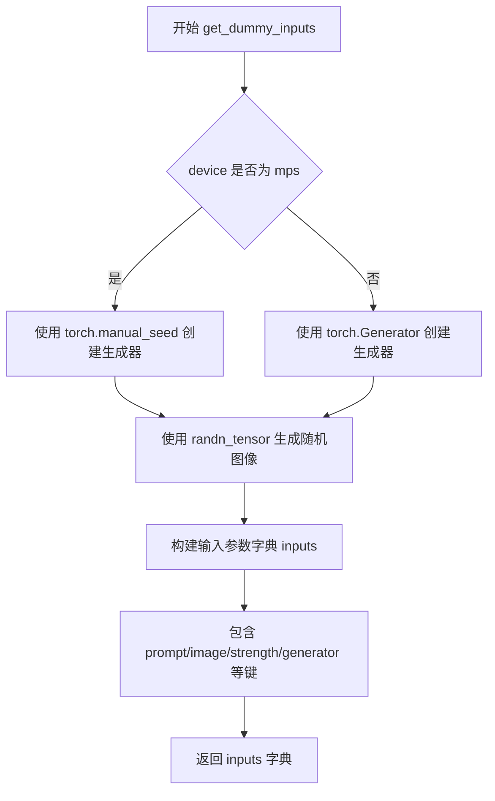

#### 带注释源码

```python
def get_dummy_inputs(self, device, seed=0):
    """
    生成用于图像到图像推理测试的虚拟输入参数。
    
    参数:
        device: 目标设备，用于创建随机张量和生成器
        seed: 随机种子，确保测试结果可重复
    
    返回:
        包含推理所需参数的字典
    """
    # 针对 Apple Silicon (MPS) 设备使用特殊的随机种子设置方式
    if str(device).startswith("mps"):
        # MPS 设备不支持 torch.Generator，使用 torch.manual_seed 代替
        generator = torch.manual_seed(seed)
    else:
        # 为其他设备（CPU/CUDA）创建标准的随机生成器
        generator = torch.Generator(device=device).manual_seed(seed)
    
    # 使用指定设备和生成器创建随机图像张量
    # 形状: (batch=1, channels=3, height=32, width=32)
    image = randn_tensor((1, 3, 32, 32), generator=generator, device=device)
    
    # 构建完整的输入参数字典
    inputs = {
        "prompt": "",                          # 空提示词（测试用）
        "image": image,                        # 输入图像张量
        "strength": 0.5,                       # 图像变换强度 (0-1)
        "generator": generator,               # 随机数生成器
        "num_inference_steps": 2,             # 推理步数
        "guidance_scale": 6.0,                 # CFG 引导强度
        "height": 32,                          # 输出高度
        "width": 32,                           # 输出宽度
        "max_sequence_length": 16,            # 文本序列最大长度
        "output_type": "pt",                  # 输出为 PyTorch 张量
        "complex_human_instruction": None,    # 复杂指令（未使用）
    }
    
    return inputs
```


### `SanaSprintImg2ImgPipelineFastTests.test_inference`

执行单次推理并验证输出图像形状和数值范围是否符合预期。

参数：此方法无显式参数（除 `self` 外）

返回值：`None`（测试方法，通过断言验证，无返回值）

#### 流程图

```mermaid
flowchart TD
    A[开始 test_inference] --> B[设置 device = 'cpu']
    B --> C[调用 get_dummy_components 获取虚拟组件]
    C --> D[使用虚拟组件初始化 SanaSprintImg2ImgPipeline]
    D --> E[将 pipeline 移动到 device]
    E --> F[设置进度条配置 disable=None]
    F --> G[调用 get_dummy_inputs 获取虚拟输入]
    G --> H[执行 pipeline 推理: pipe\*\*inputs]
    H --> I[获取输出图像: image[0]]
    I --> J[断言验证图像形状为 (3, 32, 32)]
    J --> K[生成随机期望图像]
    K --> L[计算最大差值: max_diff]
    L --> M[断言验证最大差值 <= 1e10]
    M --> N[结束]
```

#### 带注释源码

```python
def test_inference(self):
    """执行单次推理并验证输出图像形状和数值范围"""
    
    # 步骤1: 设置设备为 CPU
    device = "cpu"

    # 步骤2: 获取虚拟组件（transformer, vae, scheduler, text_encoder, tokenizer）
    components = self.get_dummy_components()
    
    # 步骤3: 使用虚拟组件初始化 SanaSprintImg2ImgPipeline
    pipe = self.pipeline_class(**components)
    
    # 步骤4: 将 pipeline 移动到指定设备
    pipe.to(device)
    
    # 步骤5: 配置进度条（disable=None 表示不禁用进度条）
    pipe.set_progress_bar_config(disable=None)

    # 步骤6: 获取虚拟输入参数（包含 prompt, image, strength, generator 等）
    inputs = self.get_dummy_inputs(device)
    
    # 步骤7: 执行推理并获取输出图像
    # pipe(**inputs) 返回元组，取第一个元素为图像结果
    image = pipe(**inputs)[0]
    
    # 步骤8: 获取生成的图像（取批次中第一张）
    generated_image = image[0]

    # 步骤9: 断言验证输出图像形状为 (3, 32, 32)
    # 3 表示 RGB 通道数，32x32 表示图像宽高
    self.assertEqual(generated_image.shape, (3, 32, 32))
    
    # 步骤10: 生成随机期望图像用于比较
    expected_image = torch.randn(3, 32, 32)
    
    # 步骤11: 计算生成图像与期望图像的最大绝对差值
    max_diff = np.abs(generated_image - expected_image).max()
    
    # 步骤12: 断言验证最大差值在合理范围内（<= 1e10）
    # 注意：1e10 是一个非常宽松的阈值，主要用于确保没有极端异常值
    self.assertLessEqual(max_diff, 1e10)
```


### `SanaSprintImg2ImgPipelineFastTests.test_callback_inputs`

该测试方法用于验证 `SanaSprintImg2ImgPipeline` 推理管道中 `callback_on_step_end`（推理步骤结束回调）和 `callback_on_step_end_tensor_inputs`（回调允许访问的张量列表）两个参数的功能正确性。它通过定义多个回调函数，检查管道是否能正确限制回调函数只能访问白名单内的张量，以及用户是否能在回调中修改张量（如 latents）并影响最终输出。

参数：
- `self`：`SanaSprintImg2ImgFastTests` 实例，测试类本身。

返回值：`None`，该方法为 `unittest.TestCase` 的测试用例，通过断言验证逻辑，不返回具体数据。

#### 流程图

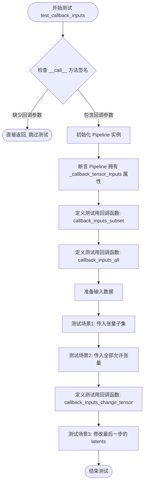

#### 带注释源码

```python
def test_callback_inputs(self):
    """
    验证 callback_on_step_end 和 callback_on_step_end_tensor_inputs 功能。
    """
    # 1. 通过反射检查 Pipeline 类的 __call__ 方法是否支持这两个参数
    sig = inspect.signature(self.pipeline_class.__call__)
    has_callback_tensor_inputs = "callback_on_step_end_tensor_inputs" in sig.parameters
    has_callback_step_end = "callback_on_step_end" in sig.parameters

    # 如果 Pipeline 不支持这些参数，则跳过测试
    if not (has_callback_tensor_inputs and has_callback_step_end):
        return

    # 2. 初始化 Pipeline 组件并移至测试设备
    components = self.get_dummy_components()
    pipe = self.pipeline_class(**components)
    pipe = pipe.to(torch_device)
    pipe.set_progress_bar_config(disable=None)
    
    # 3. 断言：Pipeline 必须定义 _callback_tensor_inputs，列出允许回调访问的张量
    self.assertTrue(
        hasattr(pipe, "_callback_tensor_inputs"),
        f" {self.pipeline_class} should have `_callback_tensor_inputs` that defines a list of tensor variables its callback function can use as inputs",
    )

    # 4. 定义回调函数 A：验证只传入了允许的子集
    def callback_inputs_subset(pipe, i, t, callback_kwargs):
        # 遍历传入回调的所有参数
        for tensor_name, tensor_value in callback_kwargs.items():
            # 断言该参数必须在管道的白名单中
            assert tensor_name in pipe._callback_tensor_inputs

        return callback_kwargs

    # 5. 定义回调函数 B：验证传入的参数覆盖了所有允许的 tensor
    def callback_inputs_all(pipe, i, t, callback_kwargs):
        # 检查白名单中的每一项是否都被传入了
        for tensor_name in pipe._callback_tensor_inputs:
            assert tensor_name in callback_kwargs

        # 再次遍历传入的参数，确保没有混入非法张量
        for tensor_name, tensor_value in callback_kwargs.items():
            assert tensor_name in pipe._callback_tensor_inputs

        return callback_kwargs

    # 6. 准备基础输入
    inputs = self.get_dummy_inputs(torch_device)

    # --- 测试场景 1：传入张量子集 (仅 latents) ---
    inputs["callback_on_step_end"] = callback_inputs_subset
    inputs["callback_on_step_end_tensor_inputs"] = ["latents"]
    output = pipe(**inputs)[0]

    # --- 测试场景 2：传入所有允许的 tensor ---
    inputs["callback_on_step_end"] = callback_inputs_all
    inputs["callback_on_step_end_tensor_inputs"] = pipe._callback_tensor_inputs
    output = pipe(**inputs)[0]

    # 7. 定义回调函数 C：在最后一步修改 latents
    def callback_inputs_change_tensor(pipe, i, t, callback_kwargs):
        is_last = i == (pipe.num_timesteps - 1)
        if is_last:
            # 将最后一步的 latents 强制修改为全零，验证回调能改变推理结果
            callback_kwargs["latents"] = torch.zeros_like(callback_kwargs["latents"])
        return callback_kwargs

    # --- 测试场景 3：修改最后一步的 latents ---
    inputs["callback_on_step_end"] = callback_inputs_change_tensor
    inputs["callback_on_step_end_tensor_inputs"] = pipe._callback_tensor_inputs
    output = pipe(**inputs)[0]
    # 断言：既然输入是全零，输出图像的绝对值之和应该非常小 (远小于正常随机生成的图片)
    assert output.abs().sum() < 1e10
```

#### 关键组件信息

- **`SanaSprintImg2ImgPipeline`**：被测试的扩散模型推理管道类。
- **`_callback_tensor_inputs`**：管道实例的属性，定义了回调函数被允许访问的 Tensor 变量列表（如 `latents`, `timestep` 等）。
- **`callback_inputs_subset`**：测试用回调函数，用于验证部分参数传递的正确性。
- **`callback_inputs_all`**：测试用回调函数，用于验证完整参数传递的正确性。
- **`callback_inputs_change_tensor`**：测试用回调函数，用于验证在回调中修改内部状态（latents）的可行性。

#### 潜在的技术债务或优化空间

- **测试依赖性**：该测试依赖于 `get_dummy_components` 和 `get_dummy_inputs` 提供的虚拟模型，如果虚拟模型配置改变，测试逻辑可能需要调整。
- **覆盖度**：当前测试主要集中在参数传递和最后一步修改的验证，对于中间步骤修改的边界情况覆盖较少。

#### 其它项目

- **设计目标**：确保 `diffusers` 库的 Pipeline 能够安全、可控地暴露推理中间状态给用户，用于实现自定义的后处理、可视化或动态控制逻辑。
- **错误处理**：使用 `assert` 进行前置条件检查（如参数是否在白名单），不符合预期时会抛出 `AssertionError`。
- **数据流**：测试模拟了完整的推理流程（`pipe(**inputs)`），并通过回调函数介入数据流，修改 `callback_kwargs` 字典中的 `latents`，观察其对最终输出的影响。


### `SanaSprintImg2ImgPipelineFastTests.test_attention_slicing_forward_pass`

该测试方法用于验证在启用注意力切片（Attention Slicing）功能后，图像生成 pipeline 的输出结果与未启用时保持一致，确保注意力切片优化不会影响模型的推理精度。

参数：

- `self`：`SanaSprintImg2ImgPipelineFastTests`，测试类实例自身
- `test_max_difference`：`bool`，是否执行最大差异检测，默认为 `True`
- `test_mean_pixel_difference`：`bool`，是否执行平均像素差异检测（当前未使用），默认为 `True`
- `expected_max_diff`：`float`，允许的最大差异阈值，默认为 `1e-3`

返回值：`None`，该方法为单元测试方法，通过断言验证注意力切片对推理结果无影响

#### 流程图

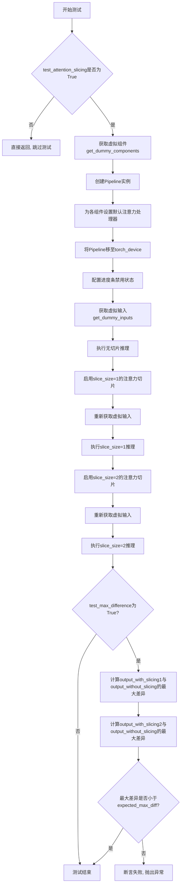

#### 带注释源码

```python
def test_attention_slicing_forward_pass(
    self, test_max_difference=True, test_mean_pixel_difference=True, expected_max_diff=1e-3
):
    """
    测试注意力切片功能对推理结果的影响
    
    参数:
        test_max_difference: 是否测试最大差异
        test_mean_pixel_difference: 是否测试平均像素差异(当前未使用)
        expected_max_diff: 允许的最大差异阈值
    """
    # 如果测试类未启用注意力切片测试,则直接返回
    if not self.test_attention_slicing:
        return

    # 获取虚拟组件用于测试
    components = self.get_dummy_components()
    # 使用虚拟组件初始化Pipeline
    pipe = self.pipeline_class(**components)
    # 遍历所有组件,为支持set_default_attn_processor的组件设置默认注意力处理器
    for component in pipe.components.values():
        if hasattr(component, "set_default_attn_processor"):
            component.set_default_attn_processor()
    # 将Pipeline移至测试设备
    pipe.to(torch_device)
    # 设置进度条配置
    pipe.set_progress_bar_config(disable=None)

    # 设置生成器设备为CPU
    generator_device = "cpu"
    # 获取虚拟输入
    inputs = self.get_dummy_inputs(generator_device)
    # 执行不启用注意力切片的推理,获取基准输出
    output_without_slicing = pipe(**inputs)[0]

    # 启用注意力切片,slice_size=1
    pipe.enable_attention_slicing(slice_size=1)
    # 重新获取虚拟输入(确保随机种子等因素一致)
    inputs = self.get_dummy_inputs(generator_device)
    # 执行slice_size=1的推理
    output_with_slicing1 = pipe(**inputs)[0]

    # 启用注意力切片,slice_size=2
    pipe.enable_attention_slicing(slice_size=2)
    # 重新获取虚拟输入
    inputs = self.get_dummy_inputs(generator_device)
    # 执行slice_size=2的推理
    output_with_slicing2 = pipe(**inputs)[0]

    # 如果需要测试最大差异
    if test_max_difference:
        # 将输出转换为numpy数组并计算最大差异
        max_diff1 = np.abs(to_np(output_with_slicing1) - to_np(output_without_slicing)).max()
        max_diff2 = np.abs(to_np(output_with_slicing2) - to_np(output_without_slicing)).max()
        # 断言:注意力切片不应影响推理结果
        self.assertLess(
            max(max_diff1, max_diff2),
            expected_max_diff,
            "Attention slicing should not affect the inference results",
        )
```


### `SanaSprintImg2ImgPipelineFastTests.test_vae_tiling`

验证VAE平铺功能对输出结果的影响，通过对比启用平铺与未启用平铺两种情况下的图像输出差异，确认平铺操作不会显著影响推理结果（当前因差异超出预期阈值而被跳过）。

参数：

- `self`：`SanaSprintImg2ImgPipelineFastTests`，测试类实例自身
- `expected_diff_max`：`float`，允许的最大差异阈值，默认为 0.2

返回值：`None`，该方法为单元测试方法，通过 `assertLess` 断言验证结果，不返回具体值

#### 流程图

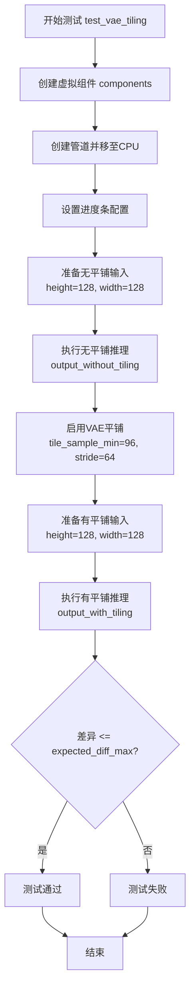

#### 带注释源码

```python
@unittest.skip("vae tiling resulted in a small margin over the expected max diff, so skipping this test for now")
def test_vae_tiling(self, expected_diff_max: float = 0.2):
    """
    验证VAE平铺功能对输出结果的影响
    
    该测试通过对比启用平铺与未启用平铺两种情况下
    的图像输出差异，验证平铺操作不会显著影响推理结果
    
    参数:
        expected_diff_max: 允许的最大差异阈值，默认为0.2
    
    当前状态: 由于差异超出预期阈值，该测试被跳过
    """
    # 设置测试设备为CPU
    generator_device = "cpu"
    
    # 获取虚拟组件（transformer, vae, scheduler, text_encoder, tokenizer）
    components = self.get_dummy_components()

    # 创建管道实例并传入所有组件
    pipe = self.pipeline_class(**components)
    # 将管道移至CPU设备
    pipe.to("cpu")
    # 设置进度条配置（disable=None表示启用进度条）
    pipe.set_progress_bar_config(disable=None)

    # ===== 第一部分：测试无平铺情况的输出 =====
    # 获取虚拟输入数据
    inputs = self.get_dummy_inputs(generator_device)
    # 设置较大的图像尺寸以测试平铺功能
    inputs["height"] = inputs["width"] = 128
    # 执行推理并获取输出（无平铺）
    output_without_tiling = pipe(**inputs)[0]

    # ===== 第二部分：测试有平铺情况的输出 =====
    # 启用VAE平铺功能，设置平铺参数
    pipe.vae.enable_tiling(
        tile_sample_min_height=96,    # 平铺最小高度
        tile_sample_min_width=96,     # 平铺最小宽度
        tile_sample_stride_height=64, # 垂直方向平铺步长
        tile_sample_stride_width=64,  # 水平方向平铺步长
    )
    # 重新获取虚拟输入数据（重置随机种子等）
    inputs = self.get_dummy_inputs(generator_device)
    # 保持相同的图像尺寸
    inputs["height"] = inputs["width"] = 128
    # 执行推理并获取输出（有平铺）
    output_with_tiling = pipe(**inputs)[0]

    # ===== 验证部分：比较两种输出的差异 =====
    # 将PyTorch张量转换为numpy数组进行数值比较
    # 断言：无平铺与有平铺的输出差异应小于指定阈值
    self.assertLess(
        (to_np(output_without_tiling) - to_np(output_with_tiling)).max(),
        expected_diff_max,
        "VAE tiling should not affect the inference results",
    )
```


### `SanaSprintImg2ImgPipelineFastTests.test_float16_inference`

该方法用于验证float16推理精度是否在预期范围内，通过调用父类的test_float16_inference方法并设置特定的容忍度参数来测试模型在float16数据类型下的推理准确性。

参数：

- `self`：隐式参数，测试用例类实例，表示当前测试对象
- `expected_max_diff`：`float`，允许的最大差异值，设置为0.08，因为该模型对数据类型非常敏感，需要更高的容忍度

返回值：`None`，该方法为测试方法，不返回任何值，主要通过断言来验证推理结果

#### 流程图

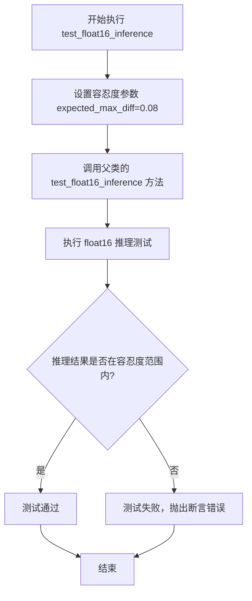

#### 带注释源码

```python
def test_float16_inference(self):
    """
    测试 float16 推理精度是否在预期范围内。
    
    该测试方法验证模型在 float16（半精度）数据类型下进行推理时，
    结果与全精度（float32）相比的差异是否在可接受的范围内。
    由于 Sana 模型对数据类型非常敏感，因此使用了较高的容忍度（0.08）。
    """
    # 设置较高的容忍度，因为模型对数据类型非常敏感
    # expected_max_diff 参数表示 float16 和 float32 推理结果之间的
    # 最大允许差异值
    super().test_float16_inference(expected_max_diff=0.08)
```


### `SanaSprintImg2ImgPipelineFastTests.test_layerwise_casting_inference`

验证分层类型转换推理。该测试方法用于测试模型在推理过程中是否正确进行层级的数据类型转换（如float32到float16的转换），以确保在不同精度下模型能正确运行。当前该测试在GitHub Actions环境中被跳过。

参数：

- `self`：无，显式传入的类实例本身，无需额外描述

返回值：无，该方法为测试方法，通过`super().test_layerwise_casting_inference()`调用父类测试逻辑，测试结果通过unittest框架的断言机制体现

#### 流程图

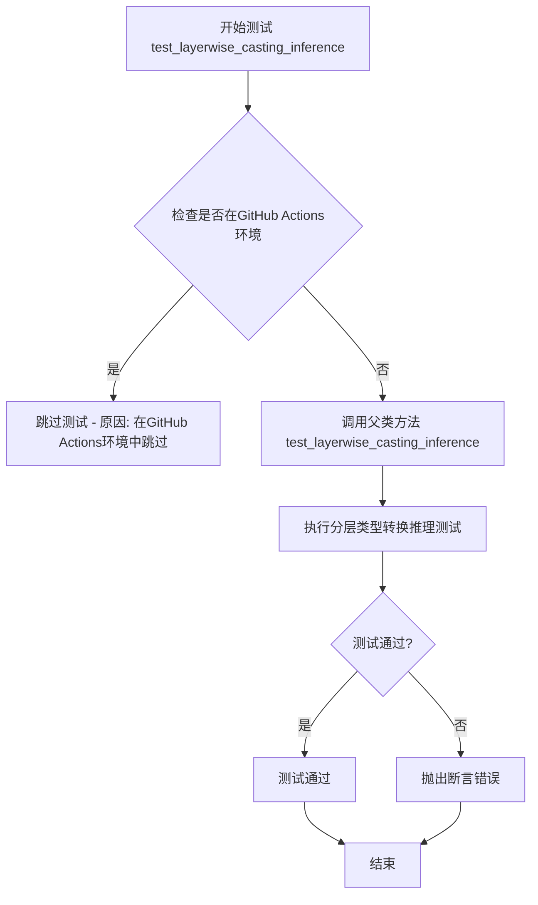

#### 带注释源码

```python
@unittest.skipIf(IS_GITHUB_ACTIONS, reason="Skipping test inside GitHub Actions environment")
def test_layerwise_casting_inference(self):
    """
    验证分层类型转换推理。
    
    该测试方法用于测试SanaSprintImg2ImgPipeline在推理过程中
    是否正确进行层级的数据类型转换（如从float32到float16）。
    主要验证模型在不同精度下能正确运行，确保混合精度训练的
    正确性。
    
    当前测试在GitHub Actions环境中被跳过，可能原因包括：
    - 环境配置差异导致测试结果不稳定
    - CI资源限制
    - 需要特定的GPU配置
    """
    # 调用父类(PipelineTesterMixin)的test_layerwise_casting_inference方法
    # 执行实际的分层类型转换推理测试逻辑
    super().test_layerwise_casting_inference()
```


### `SanaSprintImg2ImgPipelineFastTests.get_dummy_components`

该方法用于创建虚拟模型组件（dummy components），为 `SanaSprintImg2ImgPipeline` 流水线测试提供必要的模型实例，包括 Transformer、VAE 编码器、调度器、文本编码器和分词器。这些组件使用最小化配置和固定随机种子，以确保测试的可重复性。

参数：

- 该方法无参数（仅包含 `self` 隐式参数）

返回值：`Dict[str, Any]`，返回包含虚拟组件的字典，包含键：`transformer`、`vae`、`scheduler`、`text_encoder`、`tokenizer`

#### 流程图

```mermaid
flowchart TD
    A[开始 get_dummy_components] --> B[设置随机种子 torch.manual_seed(0)]
    B --> C[创建虚拟 SanaTransformer2DModel]
    C --> D[设置随机种子 torch.manual_seed(0)]
    D --> E[创建虚拟 AutoencoderDC VAE]
    E --> F[设置随机种子 torch.manual_seed(0)]
    F --> G[创建虚拟 SCMScheduler 调度器]
    G --> H[设置随机种子 torch.manual_seed(0)]
    H --> I[创建 Gemma2Config 文本编码器配置]
    I --> J[使用配置创建 Gemma2Model 文本编码器]
    J --> K[加载虚拟 GemmaTokenizer 分词器]
    K --> L[构建 components 字典]
    L --> M[返回 components 字典]
```

#### 带注释源码

```python
def get_dummy_components(self):
    """
    创建虚拟模型组件用于测试 SanaSprintImg2ImgPipeline 流水线
    
    该方法初始化以下组件：
    - transformer: SanaTransformer2DModel - Transformer 模型
    - vae: AutoencoderDC - 变分自编码器
    - scheduler: SCMScheduler - 调度器
    - text_encoder: Gemma2Model - 文本编码器
    - tokenizer: GemmaTokenizer - 分词器
    
    Returns:
        dict: 包含所有虚拟组件的字典
    """
    # 设置随机种子确保 Transformer 模型初始化可重复
    torch.manual_seed(0)
    # 创建虚拟 Transformer 模型，配置最小参数用于快速测试
    transformer = SanaTransformer2DModel(
        patch_size=1,
        in_channels=4,
        out_channels=4,
        num_layers=1,                       # 使用单层减少计算量
        num_attention_heads=2,
        attention_head_dim=4,
        num_cross_attention_heads=2,
        cross_attention_head_dim=4,
        cross_attention_dim=8,
        caption_channels=8,
        sample_size=32,
        qk_norm="rms_norm_across_heads",
        guidance_embeds=True,
    )

    # 设置随机种子确保 VAE 模型初始化可重复
    torch.manual_seed(0)
    # 创建虚拟 VAE 编码器-解码器模型
    vae = AutoencoderDC(
        in_channels=3,
        latent_channels=4,
        attention_head_dim=2,
        encoder_block_types=(
            "ResBlock",
            "EfficientViTBlock",
        ),
        decoder_block_types=(
            "ResBlock",
            "EfficientViTBlock",
        ),
        encoder_block_out_channels=(8, 8),
        decoder_block_out_channels=(8, 8),
        encoder_qkv_multiscales=((), (5,)),
        decoder_qkv_multiscales=((), (5,)),
        encoder_layers_per_block=(1, 1),
        decoder_layers_per_block=[1, 1],
        downsample_block_type="conv",
        upsample_block_type="interpolate",
        decoder_norm_types="rms_norm",
        decoder_act_fns="silu",
        scaling_factor=0.41407,
    )

    # 设置随机种子确保调度器初始化可重复
    torch.manual_seed(0)
    # 创建虚拟 SCM 调度器
    scheduler = SCMScheduler()

    # 设置随机种子确保文本编码器初始化可重复
    torch.manual_seed(0)
    # 创建小型 Gemma2 配置用于快速测试
    text_encoder_config = Gemma2Config(
        head_dim=16,
        hidden_size=8,
        initializer_range=0.02,
        intermediate_size=64,
        max_position_embeddings=8192,
        model_type="gemma2",
        num_attention_heads=2,
        num_hidden_layers=1,                # 使用单层减少计算量
        num_key_value_heads=2,
        vocab_size=8,                       # 极小的词表大小避免索引越界
        attn_implementation="eager",
    )
    # 使用配置创建虚拟文本编码器模型
    text_encoder = Gemma2Model(text_encoder_config)
    # 加载虚拟分词器
    tokenizer = GemmaTokenizer.from_pretrained("hf-internal-testing/dummy-gemma")

    # 组装所有组件到字典中
    components = {
        "transformer": transformer,
        "vae": vae,
        "scheduler": scheduler,
        "text_encoder": text_encoder,
        "tokenizer": tokenizer,
    }
    return components
```


### `SanaSprintImg2ImgPipelineFastTests.get_dummy_inputs`

该函数用于生成图像到图像（Image-to-Image）推理测试所需的虚拟输入数据，包括随机生成的图像tensor、推理参数配置以及文本提示信息，确保测试在不同设备和随机种子下具有可重复性。

参数：

- `self`：隐式参数，测试类实例本身
- `device`：`torch.device` 或 `str`，指定生成张量所在的设备（如 "cpu"、"cuda" 或 "mps"）
- `seed`：`int`，随机种子，默认值为 0，用于确保测试结果的可重复性

返回值：`Dict[str, Any]`，包含以下键值的字典：
  - `prompt`：`str`，空字符串作为测试用提示词
  - `image`：`torch.Tensor`，形状为 (1, 3, 32, 32) 的随机图像张量
  - `strength`：`float`，图像变换强度参数，值为 0.5
  - `generator`：`torch.Generator`，随机数生成器对象
  - `num_inference_steps`：`int`，推理步数，值为 2
  - `guidance_scale`：`float`，引导比例，值为 6.0
  - `height`：`int`，输出图像高度，值为 32
  - `width`：`int`，输出图像宽度，值为 32
  - `max_sequence_length`：`int`，最大序列长度，值为 16
  - `output_type`：`str`，输出类型，值为 "pt"（PyTorch 张量）
  - `complex_human_instruction`：`None`，复杂人类指令占位符

#### 流程图

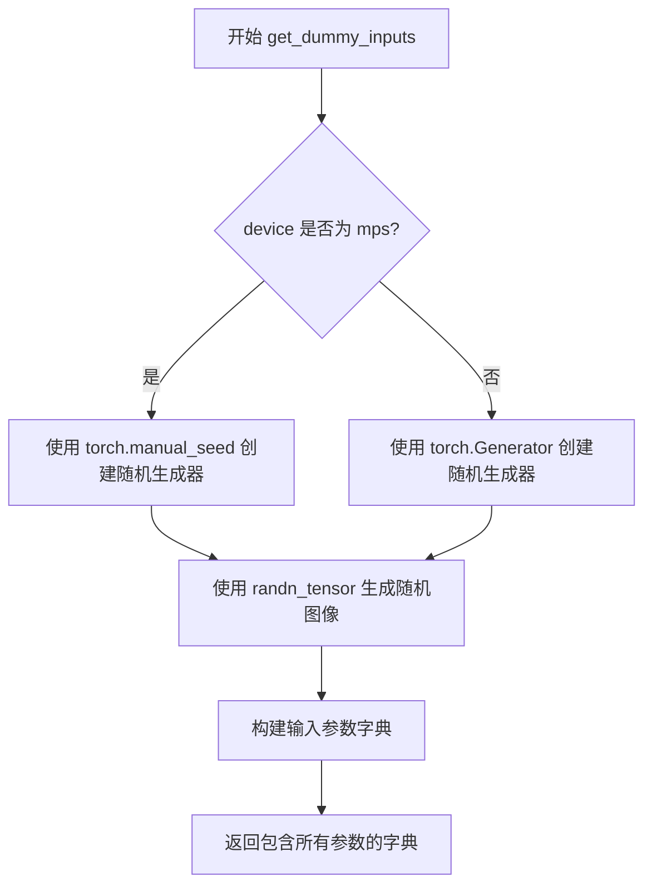

#### 带注释源码

```python
def get_dummy_inputs(self, device, seed=0):
    """
    生成用于图像到图像推理测试的虚拟输入数据
    
    参数:
        device: 计算设备 (torch.device 或 str)
        seed: 随机种子，默认 0
    
    返回:
        包含测试所需所有参数的字典
    """
    # 判断是否为 Apple MPS 设备
    if str(device).startswith("mps"):
        # MPS 设备使用 CPU 随机种子
        generator = torch.manual_seed(seed)
    else:
        # 其他设备创建指定设备的随机生成器
        generator = torch.Generator(device=device).manual_seed(seed)
    
    # 生成形状为 (1, 3, 32, 32) 的随机图像张量
    # 使用指定的随机生成器确保可重复性
    image = randn_tensor((1, 3, 32, 32), generator=generator, device=device)
    
    # 构建完整的输入参数字典
    inputs = {
        "prompt": "",                        # 空提示词用于测试
        "image": image,                      # 生成的随机图像
        "strength": 0.5,                     # 图像变换强度
        "generator": generator,              # 随机生成器用于可重复性
        "num_inference_steps": 2,           # 推理步数
        "guidance_scale": 6.0,              # CFG 引导比例
        "height": 32,                       # 输出高度
        "width": 32,                        # 输出宽度
        "max_sequence_length": 16,         # 文本最大序列长度
        "output_type": "pt",                # 输出为 PyTorch 张量
        "complex_human_instruction": None,  # 复杂指令占位符
    }
    
    return inputs
```


### `SanaSprintImg2ImgPipelineFastTests.test_inference`

该测试方法验证 SanaSprintImg2ImgPipeline 的基础推理功能，通过创建虚拟组件和输入，执行图像到图像的推理流程，并验证输出图像的形状和数值范围是否符合预期。

参数：

- `self`：`SanaSprintImg2ImgPipelineFastTests`，测试类实例本身

返回值：`None`，该方法无返回值，通过断言验证推理结果的正确性

#### 流程图

```mermaid
flowchart TD
    A[开始 test_inference 测试] --> B[设置设备为 CPU]
    B --> C[调用 get_dummy_components 获取虚拟组件]
    C --> D[使用虚拟组件创建 SanaSprintImg2ImgPipeline 管道实例]
    D --> E[将管道移动到 CPU 设备]
    E --> F[设置进度条配置 disable=None]
    F --> G[调用 get_dummy_inputs 获取虚拟输入]
    G --> H[执行管道推理: pipe(**inputs)]
    H --> I[获取生成的图像 image[0]]
    I --> J{验证图像形状是否为 (3, 32, 32)}
    J -->|是| K[生成期望的随机图像 torch.randn]
    J -->|否| L[测试失败]
    K --> M[计算生成图像与期望图像的最大绝对差异]
    M --> N{差异是否 <= 1e10}
    N -->|是| O[测试通过]
    N -->|否| P[测试失败]
```

#### 带注释源码

```python
def test_inference(self):
    """
    测试 SanaSprintImg2ImgPipeline 的基础推理功能。
    该测试方法执行以下步骤：
    1. 创建虚拟组件（transformer, vae, scheduler, text_encoder, tokenizer）
    2. 初始化管道并将模型加载到指定设备
    3. 使用虚拟输入执行图像到图像的推理
    4. 验证输出图像的形状和数值范围
    """
    # 设置测试设备为 CPU
    device = "cpu"

    # 获取虚拟组件（用于测试的虚拟模型配置）
    # 包含: transformer, vae, scheduler, text_encoder, tokenizer
    components = self.get_dummy_components()
    
    # 使用虚拟组件创建 SanaSprintImg2ImgPipeline 管道实例
    pipe = self.pipeline_class(**components)
    
    # 将管道移动到指定设备（CPU）
    pipe.to(device)
    
    # 设置进度条配置，disable=None 表示启用进度条
    pipe.set_progress_bar_config(disable=None)

    # 获取虚拟输入参数
    # 包含: prompt, image, strength, generator, num_inference_steps,
    #       guidance_scale, height, width, max_sequence_length, 
    #       output_type, complex_human_instruction
    inputs = self.get_dummy_inputs(device)
    
    # 执行管道推理，获取输出结果
    # 返回值为元组 (image,)，image[0] 为生成的图像张量
    image = pipe(**inputs)[0]
    
    # 从结果中提取生成的图像
    generated_image = image[0]

    # ========== 断言验证 ==========
    
    # 验证生成的图像形状是否为 (3, 32, 32)
    # 3 表示通道数（RGB），32x32 表示图像分辨率
    self.assertEqual(generated_image.shape, (3, 32, 32))
    
    # 生成期望的随机图像用于比较
    # 形状为 (3, 32, 32)，与生成的图像形状相同
    expected_image = torch.randn(3, 32, 32)
    
    # 计算生成图像与期望图像之间的最大绝对差异
    max_diff = np.abs(generated_image - expected_image).max()
    
    # 验证最大差异是否在允许范围内（<= 1e10）
    # 注意：这个断言实际上允许很大的差异，因为使用的是随机图像
    # 这更像是一个占位符测试，确保推理不会产生极端值
    self.assertLessEqual(max_diff, 1e10)
```


### `SanaSprintImg2ImgPipelineFastTests.test_callback_inputs`

该测试方法验证 SanaSprintImg2ImgPipeline 在推理过程中回调函数（callback）的正确性，包括回调张量输入（callback_on_step_end_tensor_inputs）的校验、子集传递、全部传递以及回调函数修改张量的能力。

参数：

- `self`：`unittest.TestCase`，测试类实例本身

返回值：`None`，该方法为单元测试方法，无返回值

#### 流程图

```mermaid
flowchart TD
    A[开始测试 test_callback_inputs] --> B{检查 pipeline_class.__call__ 签名}
    B --> C{是否存在 callback_on_step_end_tensor_inputs 和 callback_on_step_end}
    C -->|否| D[直接返回，测试跳过]
    C -->|是| E[创建 pipeline 实例并移动到设备]
    E --> F[断言 _callback_tensor_inputs 属性存在]
    F --> G[定义回调函数 callback_inputs_subset]
    G --> H[定义回调函数 callback_inputs_all]
    H --> I[获取 dummy inputs]
    I --> J[测试子集传递: 设置 callback_on_step_end=callback_inputs_subset, tensor_inputs=['latents']]
    J --> K[执行 pipeline 获取 output]
    K --> L[测试全部传递: 设置 callback_on_step_end=callback_inputs_all, tensor_inputs=pipe._callback_tensor_inputs]
    L --> M[执行 pipeline 获取 output]
    M --> N[定义回调函数 callback_inputs_change_tensor]
    N --> O[测试修改张量: callback 将最后一步的 latents 置零]
    O --> P[执行 pipeline 获取 output]
    P --> Q[断言 output 的绝对值和小于阈值]
    Q --> R[结束测试]
```

#### 带注释源码

```python
def test_callback_inputs(self):
    """
    测试推理过程中回调函数的功能:
    1. 检查 pipeline 是否支持回调相关参数
    2. 验证只传递允许的张量输入
    3. 验证可以传递全部张量输入
    4. 验证回调函数可以修改张量值
    """
    # 使用 inspect 获取 pipeline __call__ 方法的签名
    sig = inspect.signature(self.pipeline_class.__call__)
    # 检查是否存在回调相关的参数
    has_callback_tensor_inputs = "callback_on_step_end_tensor_inputs" in sig.parameters
    has_callback_step_end = "callback_on_step_end" in sig.parameters

    # 如果 pipeline 不支持这些参数，则跳过测试
    if not (has_callback_tensor_inputs and has_callback_step_end):
        return

    # 获取虚拟组件并创建 pipeline
    components = self.get_dummy_components()
    pipe = self.pipeline_class(**components)
    # 移动到测试设备 (torch_device)
    pipe = pipe.to(torch_device)
    # 禁用进度条
    pipe.set_progress_bar_config(disable=None)
    
    # 断言 pipeline 应该有 _callback_tensor_inputs 属性
    # 该属性定义了回调函数可以使用的张量变量列表
    self.assertTrue(
        hasattr(pipe, "_callback_tensor_inputs"),
        f" {self.pipeline_class} should have `_callback_tensor_inputs` that defines a list of tensor variables its callback function can use as inputs",
    )

    def callback_inputs_subset(pipe, i, t, callback_kwargs):
        """
        回调函数: 只检查传递的张量是否是允许的子集
        参数:
            pipe: pipeline 实例
            i: 当前推理步数
            t: 当前时间步
            callback_kwargs: 回调函数接收的关键字参数字典
        返回:
            callback_kwargs: 返回原始的 callback_kwargs
        """
        # 遍历回调参数中的所有张量
        for tensor_name, tensor_value in callback_kwargs.items():
            # 检查只传递了允许的张量输入
            assert tensor_name in pipe._callback_tensor_inputs

        return callback_kwargs

    def callback_inputs_all(pipe, i, t, callback_kwargs):
        """
        回调函数: 检查所有允许的张量都被传递
        参数:
            pipe: pipeline 实例
            i: 当前推理步数
            t: 当前时间步
            callback_kwargs: 回调函数接收的关键字参数字典
        返回:
            callback_kwargs: 返回原始的 callback_kwargs
        """
        # 验证所有允许的张量都在 callback_kwargs 中
        for tensor_name in pipe._callback_tensor_inputs:
            assert tensor_name in callback_kwargs

        # 遍历回调参数中的所有张量
        for tensor_name, tensor_value in callback_kwargs.items():
            # 检查只传递了允许的张量输入
            assert tensor_name in pipe._callback_tensor_inputs

        return callback_kwargs

    # 获取虚拟输入数据
    inputs = self.get_dummy_inputs(torch_device)

    # 测试1: 只传递一个张量子集 (latents)
    inputs["callback_on_step_end"] = callback_inputs_subset
    inputs["callback_on_step_end_tensor_inputs"] = ["latents"]
    output = pipe(**inputs)[0]

    # 测试2: 传递所有允许的张量输入
    inputs["callback_on_step_end"] = callback_inputs_all
    inputs["callback_on_step_end_tensor_inputs"] = pipe._callback_tensor_inputs
    output = pipe(**inputs)[0]

    def callback_inputs_change_tensor(pipe, i, t, callback_kwargs):
        """
        回调函数: 在最后一步将 latents 修改为零张量
        参数:
            pipe: pipeline 实例
            i: 当前推理步数
            t: 当前时间步
            callback_kwargs: 回调函数接收的关键字参数字典
        返回:
            callback_kwargs: 返回修改后的 callback_kwargs
        """
        # 判断是否是最后一步
        is_last = i == (pipe.num_timesteps - 1)
        if is_last:
            # 将 latents 修改为全零张量
            callback_kwargs["latents"] = torch.zeros_like(callback_kwargs["latents"])
        return callback_kwargs

    # 测试3: 回调函数修改张量
    inputs["callback_on_step_end"] = callback_inputs_change_tensor
    inputs["callback_on_step_end_tensor_inputs"] = pipe._callback_tensor_inputs
    output = pipe(**inputs)[0]
    # 由于 latents 被置零，输出应该接近零
    assert output.abs().sum() < 1e10
```


### `SanaSprintImg2ImgPipelineFastTests.test_attention_slicing_forward_pass`

该测试方法用于验证注意力切片机制（Attention Slicing）在图像到图像扩散管道中的正确性，通过对比启用不同切片大小时生成的图像与未启用切片时的图像差异，确保切片优化不会影响推理结果。

参数：

- `test_max_difference`：`bool`，是否执行最大差异比较测试
- `test_mean_pixel_difference`：`bool`，是否执行平均像素差异比较测试
- `expected_max_diff`：`float`，允许的最大差异阈值，默认为 1e-3

返回值：`None`，该方法为测试用例，通过断言验证结果而非返回值

#### 流程图

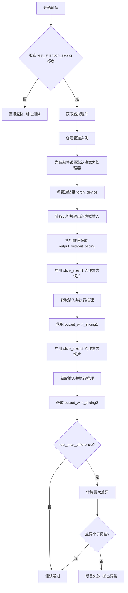

#### 带注释源码

```python
def test_attention_slicing_forward_pass(
    self, test_max_difference=True, test_mean_pixel_difference=True, expected_max_diff=1e-3
):
    """
    测试注意力切片机制的前向传播是否正确
    Attention Slicing 是一种内存优化技术，将注意力计算分片处理以降低显存占用
    
    参数:
        test_max_difference: 是否测试最大差异
        test_mean_pixel_difference: 是否测试平均像素差异  
        expected_max_diff: 允许的最大差异阈值
    """
    # 检查是否启用了注意力切片测试（类属性）
    if not self.test_attention_slicing:
        return

    # Step 1: 获取虚拟组件（transformer, vae, scheduler, text_encoder, tokenizer）
    components = self.get_dummy_components()
    
    # Step 2: 创建管道实例
    pipe = self.pipeline_class(**components)
    
    # Step 3: 为每个组件设置默认的注意力处理器
    for component in pipe.components.values():
        if hasattr(component, "set_default_attn_processor"):
            component.set_default_attn_processor()
    
    # Step 4: 将管道移至测试设备（cpu 或 cuda）
    pipe.to(torch_device)
    
    # Step 5: 配置进度条（disable=None 表示显示进度条）
    pipe.set_progress_bar_config(disable=None)

    # Step 6: 获取测试输入（用于无切片的基准测试）
    generator_device = "cpu"
    inputs = self.get_dummy_inputs(generator_device)
    
    # Step 7: 执行无切片的标准推理，获取基准输出
    output_without_slicing = pipe(**inputs)[0]

    # Step 8: 启用注意力切片，slice_size=1（最小切片）
    pipe.enable_attention_slicing(slice_size=1)
    inputs = self.get_dummy_inputs(generator_device)
    output_with_slicing1 = pipe(**inputs)[0]

    # Step 9: 启用注意力切片，slice_size=2（更大的切片）
    pipe.enable_attention_slicing(slice_size=2)
    inputs = self.get_dummy_inputs(generator_device)
    output_with_slicing2 = pipe(**inputs)[0]

    # Step 10: 如果需要测试最大差异
    if test_max_difference:
        # 计算切片输出与无切片输出的最大绝对差异
        max_diff1 = np.abs(to_np(output_with_slicing1) - to_np(output_without_slicing)).max()
        max_diff2 = np.abs(to_np(output_with_slicing2) - to_np(output_without_slicing)).max()
        
        # 断言：注意力切片不应该影响推理结果
        # 差异应该小于指定的阈值 expected_max_diff
        self.assertLess(
            max(max_diff1, max_diff2),
            expected_max_diff,
            "Attention slicing should not affect the inference results"
        )
```


### `SanaSprintImg2ImgPipelineFastTests.test_vae_tiling`

该测试方法用于验证VAE（变分自编码器）平铺功能是否正常工作。通过对比启用平铺前后的推理结果，确保VAE平铺不会影响最终的图像生成质量。

参数：

- `self`：隐式参数，测试类实例本身
- `expected_diff_max`：`float`，可选，默认值为`0.2`，表示启用平铺与未启用平铺时输出图像之间的最大允许差异阈值

返回值：无（`None`），该方法为单元测试，通过`assertLess`断言验证结果，不返回任何值

#### 流程图

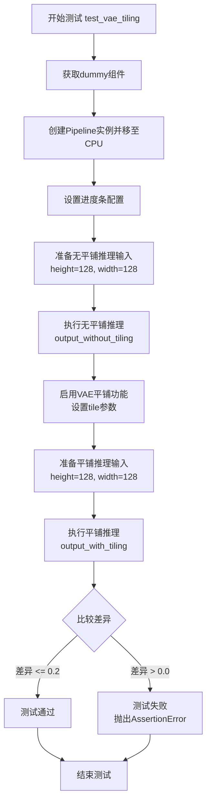

#### 带注释源码

```python
@unittest.skip("vae tiling resulted in a small margin over the expected max diff, so skipping this test for now")
def test_vae_tiling(self, expected_diff_max: float = 0.2):
    """
    测试VAE平铺功能是否正常工作
    
    该测试通过对比启用平铺前后的推理结果，验证VAE平铺功能
    不会对图像生成质量产生显著影响（差异应小于expected_diff_max）
    
    参数:
        expected_diff_max: float, 允许的最大差异阈值，默认为0.2
    """
    # 设置生成器设备为CPU
    generator_device = "cpu"
    
    # 获取虚拟组件（transformer、vae、scheduler、text_encoder、tokenizer）
    components = self.get_dummy_components()

    # 使用虚拟组件创建Pipeline实例
    pipe = self.pipeline_class(**components)
    
    # 将Pipeline移至CPU设备
    pipe.to("cpu")
    
    # 配置进度条（disable=None表示启用进度条）
    pipe.set_progress_bar_config(disable=None)

    # ----- 测试无平铺情况的推理 -----
    # 获取虚拟输入参数
    inputs = self.get_dummy_inputs(generator_device)
    
    # 设置图像尺寸为128x128（较大的尺寸会触发平铺逻辑）
    inputs["height"] = inputs["width"] = 128
    
    # 执行无平铺推理，获取输出图像
    output_without_tiling = pipe(**inputs)[0]

    # ----- 测试有平铺情况的推理 -----
    # 启用VAE平铺功能，并设置平铺参数
    pipe.vae.enable_tiling(
        tile_sample_min_height=96,    # 最小平铺高度
        tile_sample_min_width=96,     # 最小平铺宽度
        tile_sample_stride_height=64, # 垂直方向平铺步长
        tile_sample_stride_width=64,  # 水平方向平铺步长
    )
    
    # 重新获取虚拟输入（因为上次调用可能修改了状态）
    inputs = self.get_dummy_inputs(generator_device)
    
    # 再次设置图像尺寸为128x128
    inputs["height"] = inputs["width"] = 128
    
    # 执行平铺推理，获取输出图像
    output_with_tiling = pipe(**inputs)[0]

    # ----- 验证结果 -----
    # 断言：平铺与不平铺的输出差异应小于指定阈值
    # 如果差异过大，说明VAE平铺功能存在问题
    self.assertLess(
        (to_np(output_without_tiling) - to_np(output_with_tiling)).max(),
        expected_diff_max,
        "VAE tiling should not affect the inference results",
    )
```


### `SanaSprintImg2ImgPipelineFastTests.test_inference_batch_consistent`

这是一个被跳过的批次推理一致性测试方法，用于验证图像到图像管道在批次推理时的一致性。由于测试使用的词汇表非常小（为了快速测试），除了空默认提示外，任何其他提示都会导致嵌入查找错误，因此该测试被跳过。

参数：
- `self`：SanaSprintImg2ImgPipelineFastTests，测试类实例本身

返回值：无（`None`），该方法不返回任何值

#### 流程图

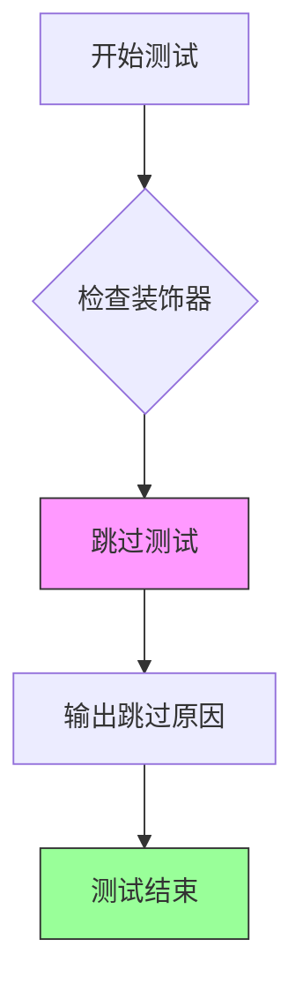

#### 带注释源码

```python
@unittest.skip(
    "A very small vocab size is used for fast tests. So, Any kind of prompt other than the empty default used in other tests will lead to a embedding lookup error. This test uses a long prompt that causes the error."
)
def test_inference_batch_consistent(self):
    """
    批次推理一致性测试
    
    该测试方法原本用于验证管道在进行批次推理时的一致性，
    即相同的输入在批次中和单独处理时应该产生一致的结果。
    
    当前实现：
    - 使用 @unittest.skip 装饰器跳过测试
    - 函数体只有 pass 语句，无实际测试逻辑
    - 跳过原因：测试使用的虚拟Gemma模型词汇表非常小，
      除了空字符串""以外的任何提示都会导致embedding lookup错误
    """
    pass
```


### `SanaSprintImg2ImgPipelineFastTests.test_inference_batch_single_identical`

该方法用于测试批次推理与单样本推理的结果一致性，确保两种推理方式产生相同的输出。由于测试使用极小的词汇表，任何非空的提示词都会导致嵌入查找错误，因此该测试被跳过。

参数：

- `self`：`SanaSprintImg2ImgPipelineFastTests`，测试类实例本身，无需显式传递

返回值：`None`，无返回值（方法体为空，仅包含 `pass` 语句）

#### 流程图

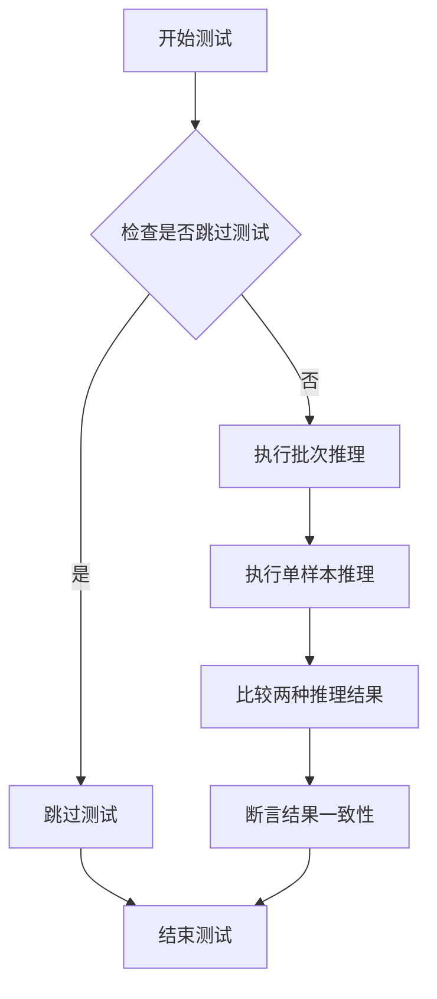

#### 带注释源码

```python
@unittest.skip(
    "A very small vocab size is used for fast tests. So, Any kind of prompt other than the empty default used in other tests will lead to a embedding lookup error. This test uses a long prompt that causes the error."
)
def test_inference_batch_single_identical(self):
    """
    测试批次推理与单样本推理的一致性。
    
    该测试用于验证 SanaSprintImg2ImgPipeline 在处理批次输入和
    单独样本输入时是否产生一致的结果。由于测试环境使用的虚拟
    模型词汇表极小，非空提示词会导致嵌入查找错误，因此该测试
    被跳过。
    
    参数:
        self: 测试类实例
        
    返回值:
        None: 方法体为空，测试被跳过
    """
    pass  # 测试被跳过，不执行任何逻辑
```


### `SanaSprintImg2ImgPipelineFastTests.test_float16_inference`

该测试方法用于验证 SanaSprintImg2ImgPipeline 在 float16（半精度）推理模式下的正确性，通过比较 float16 与 float32 推理结果的差异，确保差异在可接受范围内（expected_max_diff=0.08），以适应模型对数据类型的高敏感性。

参数：

- `self`：隐式参数，测试类实例本身

返回值：`None`，该方法为测试方法，不返回任何值，测试结果通过 unittest 断言验证

#### 流程图

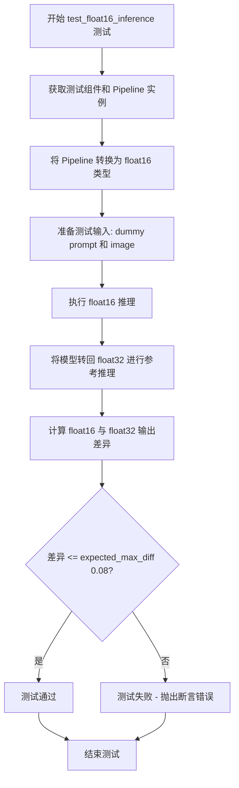

#### 带注释源码

```python
def test_float16_inference(self):
    """
    测试 float16（半精度）推理模式下的模型输出正确性。
    
    该测试方法继承自 PipelineTesterMixin，用于验证模型在 float16
    数据类型下进行推理时，结果与 float32（单精度）的差异在可接受范围内。
    由于 Sana 模型对数据类型非常敏感，因此设置了较高的容差值 0.08。
    """
    # Requires higher tolerance as model seems very sensitive to dtype
    # 设置 expected_max_diff=0.08，因为该模型对数据类型非常敏感，
    # 需要比默认更高的容差来允许数值误差
    super().test_float16_inference(expected_max_diff=0.08)
```


### `SanaSprintImg2ImgPipelineFastTests.test_layerwise_casting_inference`

分层类型转换推理测试，用于验证 SanaSprintImg2ImgPipeline 在不同数据类型（float32、float16、bfloat16等）层次转换时的推理正确性，确保模型在各层数据类型切换时仍能产生正确的输出。

参数：

- `self`：`SanaSprintImg2ImgPipelineFastTests`，测试类实例本身，包含测试所需的组件和配置

返回值：`None`，该方法通过调用父类方法执行测试，不返回任何值

#### 流程图

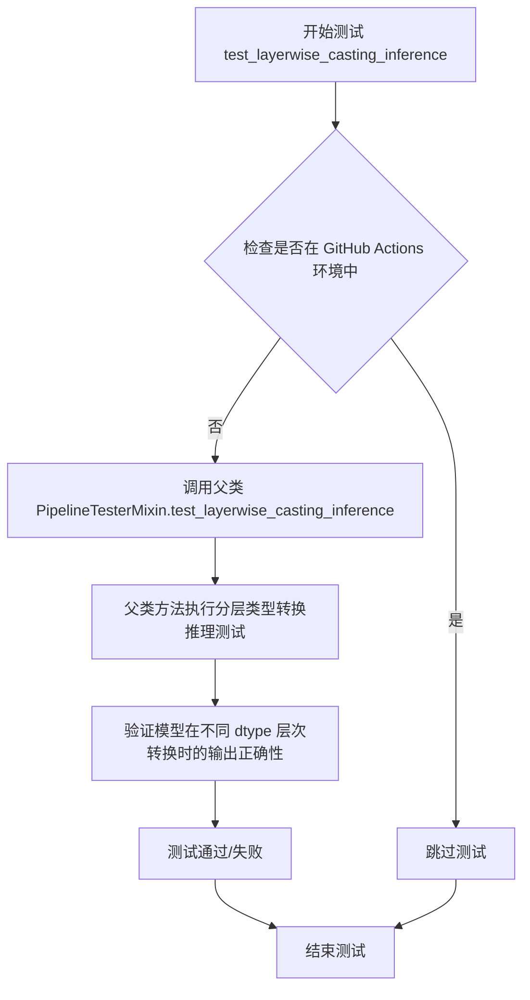

#### 带注释源码

```python
@unittest.skipIf(IS_GITHUB_ACTIONS, reason="Skipping test inside GitHub Actions environment")
def test_layerwise_casting_inference(self):
    """
    分层类型转换推理测试
    
    该测试方法用于验证 SanaSprintImg2ImgPipeline 在进行分层类型转换（layerwise casting）
    时的推理正确性。分层类型转换是一种优化技术，允许模型的不同层使用不同的数据类型
    （如 float16、bfloat16）以提升推理性能。
    
    测试逻辑：
    1. 首先检查是否在 GitHub Actions 环境中运行，如果是则跳过该测试
    2. 调用父类 PipelineTesterMixin 的 test_layerwise_casting_inference 方法执行实际测试
    3. 父类方法会创建 pipeline 实例，并在不同层应用不同的数据类型转换
    4. 验证转换后的推理结果与基准结果的差异是否在可接受范围内
    
    注意：
    - 该测试依赖于父类 test_layerwise_casting_inference 的实现
    - 测试需要模型支持分层类型转换功能（由 test_layerwise_casting = True 标志启用）
    """
    super().test_layerwise_casting_inference()
```

## 关键组件


### SanaSprintImg2ImgPipeline

SanaSprintImg2ImgPipeline是图像到图像生成管道核心类，负责接收文本提示和输入图像，通过 SanaTransformer2DModel、VAE 和文本编码器生成目标图像。

### SanaTransformer2DModel

Sana变换器2D模型，负责图像的潜在空间变换和去噪过程，采用Patch处理机制，支持多头注意力和交叉注意力。

### AutoencoderDC

变分自编码器（VAE）组件，负责将图像编码到潜在空间以及从潜在空间解码回图像，支持Encoder-Decoder架构和 EfficientViTBlock。

### SCMScheduler

调度器组件，负责管理扩散模型的噪声调度，控制去噪过程中的时间步采样和噪声预测。

### Gemma2Model

基于Gemma2架构的文本编码器模型，负责将文本提示编码为文本嵌入向量，供变换器模型使用。

### GemmaTokenizer

文本分词器，负责将文本提示转换为token序列，供文本编码器处理。

### PipelineTesterMixin

管道测试混合类，提供通用的测试方法框架，包括推理测试、回调测试、注意力切片测试等。

### 张量生成与随机种子管理

使用randn_tensor和torch.manual_seed生成确定性随机张量，确保测试可重复性，支持 MPS 和 CUDA 设备。

### Float16推理测试

test_float16_inference方法验证半精度（FP16）推理的数值稳定性，设置容忍度为0.08。

### 逐层类型转换推理

test_layerwise_casting_inference方法测试模型各层的类型转换逻辑，确保不同层使用适当的数据类型。

### 注意力切片机制

test_attention_slicing_forward_pass方法验证注意力切片功能，通过不同slice_size参数测试推理结果的一致性。

### VAE平铺功能

test_vae_tiling方法（当前跳过）测试VAE平铺技术，支持处理高分辨率图像，通过分块处理减少内存占用。

### 回调机制

test_callback_inputs方法验证推理过程中的回调功能，支持在每个推理步骤结束后修改中间状态如latents。

### 图像参数配置

定义了image_params和image_latents_params，用于配置图像到图像任务中的输入输出参数规范。

### 批量推理配置

定义了batch_params和params，配置文本引导图像变体的参数集，支持单样本和批量推理测试。


## 问题及建议


### 已知问题

- **测试结果不稳定**：`test_inference` 方法中使用 `torch.randn(3, 32, 32)` 生成期望图像且未设置固定种子，导致每次运行期望值不同，当前阈值 `1e10` 过大可能掩盖真实问题。
- **测试参数未使用**：`test_attention_slicing_forward_pass` 方法接收 `test_max_difference` 和 `test_mean_pixel_difference` 参数，但方法体内未使用这些参数进行条件判断。
- **输出变量未断言**：`test_callback_inputs` 方法中多次赋值 `output` 变量但从未对其使用，测试逻辑不完整。
- **大量测试被跳过**：`test_inference_batch_consistent`、`test_inference_batch_single_identical` 和 `test_vae_tiling` 被跳过，导致批处理一致性和 VAE tiling 功能未验证。
- **魔法数字缺乏解释**：如 `expected_max_diff=0.08`、`scaling_factor=0.41407` 等关键数值缺少注释说明来源或设计意图。
- **重复种子设置**：`get_dummy_components` 方法中多次调用 `torch.manual_seed(0)`，表明组件创建顺序可能影响结果，测试间可能存在隐式依赖。

### 优化建议

- 为 `test_inference` 中的期望图像设置固定随机种子，使用确定的参考值进行比对，并适当降低阈值（如 `1e-3`）。
- 移除 `test_attention_slicing_forward_pass` 中未使用的参数，或实现相应的条件逻辑。
- 在 `test_callback_inputs` 中对 `output` 添加断言或移除未使用的变量声明。
- 解决小词汇表问题或使用更合适的 dummy tokenizer，以便启用批处理相关测试；分析 VAE tiling 差异原因并修复或文档说明。
- 为关键配置参数和阈值添加注释，说明其设计依据和影响。
- 考虑使用 fixture 或 setup 方法统一管理随机种子，减少重复代码。

## 其它


### 设计目标与约束

本测试文件旨在验证SanaSprintImg2ImgPipeline的正确性，通过单元测试确保图像生成管道的核心功能正常工作。设计约束包括：(1) 使用小型虚拟模型和极小词汇表(8)以加快测试速度；(2) 测试配置针对快速CI环境优化；(3) 需要与transformers和diffusers库兼容；(4) 部分测试因模型配置限制而被跳过。

### 错误处理与异常设计

测试采用unittest框架进行错误检测与验证。主要错误处理机制包括：(1) 使用assert断言验证图像维度、数值范围和回调函数行为；(2) 对特定测试用例使用@unittest.skip装饰器跳过以避免预期错误（如词汇表过小导致的embedding lookup错误）；(3) 条件跳过GitHub Actions环境中的测试；(4) test_callback_inputs中通过try-except模式验证回调张量的合法性。

### 数据流与状态机

Pipeline的输入数据流如下：接收prompt字符串、image张量、strength参数 → text_encoder处理prompt获取文本嵌入 → transformer处理图像特征和文本嵌入 → scheduler调度推理步骤 → vae解码潜在表示 → 输出生成图像。状态转换通过SCMScheduler管理推理步数，从初始噪声状态逐步去噪至最终图像状态。

### 外部依赖与接口契约

核心依赖包括：(1) torch和numpy用于张量计算；(2) transformers库提供Gemma2Config、Gemma2Model和GemmaTokenizer；(3) diffusers库提供AutoencoderDC、SanaSprintImg2ImgPipeline、SanaTransformer2DModel和SCMScheduler；(4) 本地测试工具from ...testing_utils和from ..pipeline_params。接口契约要求pipeline必须实现__call__方法，支持callback_on_step_end和callback_on_step_end_tensor_inputs参数，并暴露_callback_tensor_inputs属性。

### 性能考虑与基准测试

测试覆盖多项性能特性验证：(1) attention_slicing测试验证注意力切片不影响推理结果（期望最大差异<1e-3）；(2) VAE tiling测试（当前跳过）验证瓦片化处理不影响输出质量；(3) float16_inference测试验证半精度推理，容差设置为0.08（因模型对dtype敏感）；(4) layerwise_casting_inference测试验证逐层类型转换的正确性。

### 测试覆盖范围

测试方法包括：test_inference验证基础推理功能；test_callback_inputs验证回调函数机制和张量输入限制；test_attention_slicing_forward_pass验证注意力切片开关功能；test_vae_tiling验证VAE瓦片化（已跳过）；test_inference_batch_consistent和test_inference_batch_single_identical批量推理测试（已跳过）；test_float16_inference验证float16推理；test_layerwise_casting_inference验证逐层类型转换。

### 配置与参数说明

get_dummy_components方法创建虚拟组件配置：SanaTransformer2DModel使用patch_size=1, num_layers=1, num_attention_heads=2；AutoencoderDC使用EfficientViTBlock和ResBlock组合；SCMScheduler作为调度器；Gemma2Config使用hidden_size=8, vocab_size=8的极小配置。get_dummy_inputs方法生成测试输入：支持CPU和MPS设备，固定随机种子，图像尺寸32x32，num_inference_steps=2，guidance_scale=6.0。

### 资源管理

测试中的资源管理包括：(1) 使用torch.manual_seed确保随机数可重现；(2) device参数支持cpu、cuda和mps；(3) pipeline组件通过.to(device)进行设备迁移；(4) 使用set_progress_bar_config控制进度条显示；(5) generator对象管理随机状态以支持确定性测试。

### 安全考虑

安全相关设计包括：(1) 测试代码遵循Apache 2.0许可证；(2) 不包含实际模型权重或敏感数据；(3) 使用虚拟/测试模型而非真实预训练模型；(4) 跳过需要外部资源下载的测试用例。

### 版本兼容性

版本兼容性考虑：(1) 测试依赖transformers和diffusers库的特定功能（如SCMScheduler）；(2) 通过inspect.signature动态检查pipeline的__call__方法签名以适配不同版本；(3) 条件检查callback相关参数是否存在；(4) test_attention_slicing通过检查set_default_attn_processor方法的存在性来适配不同模型实现。

    