# `diffusers\tests\pipelines\sana_video\test_sana_video.py` 详细设计文档

这是HuggingFace Diffusers库中SanaVideoPipeline的单元测试文件，包含快速测试类和集成测试类，用于验证Sana视频生成管道的基本功能、模型保存加载、float16推理等核心行为。

## 整体流程

```mermaid
graph TD
    A[开始测试] --> B{测试类型}
    B -- FastTests --> C[创建pipeline实例]
    B -- IntegrationTests --> D[等待GPU资源]
    C --> E[调用get_dummy_components创建虚拟组件]
    E --> F[调用get_dummy_inputs创建测试输入]
    F --> G{执行具体测试方法}
    G --> H[test_inference: 验证视频生成基本功能]
    G --> I[test_save_load_local: 验证模型保存加载]
    G --> J[test_float16_inference: 验证float16推理]
    G --> K[test_save_load_float16: 验证float16模型保存加载]
    H --> L[断言输出形状为(9, 3, 32, 32)]
    I --> M[比较输出差异小于阈值]
    J --> N[使用更高容差验证]
    K --> O[使用容差0.2验证]
    L --> P[测试结束]
    M --> P
    N --> P
    O --> P
```

## 类结构

```
unittest.TestCase
├── PipelineTesterMixin
│   └── SanaVideoPipelineFastTests
└── unittest.TestCase
    └── SanaVideoPipelineIntegrationTests
```

## 全局变量及字段


### `enable_full_determinism`
    
Enables full determinism for reproducible testing by setting random seeds across frameworks

类型：`function`
    


### `SanaVideoPipelineFastTests.pipeline_class`
    
The pipeline class being tested, pointing to SanaVideoPipeline for video generation tests

类型：`type`
    


### `SanaVideoPipelineFastTests.params`
    
Parameters for text-to-image generation, excluding cross-attention kwargs

类型：`set`
    


### `SanaVideoPipelineFastTests.batch_params`
    
Batch parameters specific to text-to-image pipeline testing

类型：`set`
    


### `SanaVideoPipelineFastTests.image_params`
    
Image parameters used in text-to-image pipeline test validation

类型：`set`
    


### `SanaVideoPipelineFastTests.image_latents_params`
    
Image latents parameters for pipeline testing scenarios

类型：`set`
    


### `SanaVideoPipelineFastTests.required_optional_params`
    
Optional parameters required for pipeline initialization and execution

类型：`frozenset`
    


### `SanaVideoPipelineFastTests.test_xformers_attention`
    
Flag indicating whether xformers attention testing is disabled for this pipeline

类型：`bool`
    


### `SanaVideoPipelineFastTests.supports_dduf`
    
Flag indicating whether DDUF (Diffusion-Deliberation Uncertainty Fusion) is supported in the pipeline

类型：`bool`
    


### `SanaVideoPipelineIntegrationTests.prompt`
    
Text prompt describing the video generation scene for integration testing

类型：`str`
    
    

## 全局函数及方法


### `gc.collect`

强制进行垃圾回收，释放未使用的内存对象。

参数：

- 无显式参数（但接受可选的 `generation` 参数，默认为 -1 表示所有代）

返回值：`int`，回收的对象数量

#### 流程图

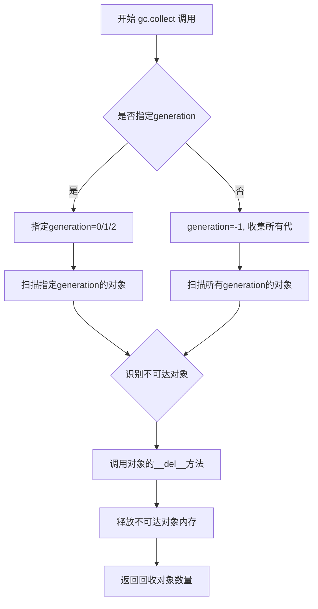

#### 带注释源码

```python
# gc.collect 是 Python 标准库 gc 模块的函数
# 位置: Python 内置模块 gc

import gc  # 导入垃圾回收模块

# 函数签名: gc.collect(generation=(- 2))
# generation 参数:
#   -2: 默认值, 收集所有代
#   0:  只收集第0代对象
#   1:  收集第0和第1代对象
#   2:  收集所有代（第0、1、2代）

# 在代码中的实际使用:
gc.collect()

# 返回值: 找到并回收的不可达对象数量
# 这个值可以用于调试或监控内存使用情况
```

#### 在测试类中的实际调用

```python
class SanaVideoPipelineIntegrationTests(unittest.TestCase):
    def setUp(self):
        super().setUp()
        gc.collect()  # 在测试开始前清理内存
        backend_empty_cache(torch_device)

    def tearDown(self):
        super().tearDown()
        gc.collect()  # 在测试结束后清理内存
        backend_empty_cache(torch_device)
```


### `tempfile.TemporaryDirectory`

`tempfile.TemporaryDirectory` 是 Python 标准库中的类，用于安全地创建临时目录。该类实现上下文管理器协议，在代码块执行结束后自动清理（删除）临时目录及其内容。

参数：

- `suffix`：`str`，可选，临时目录名称的后缀
- `prefix`：`str`，可选，临时目录名称的前缀
- `dir`：`str`，可选，创建临时目录的父目录路径

返回值：`str`，返回临时目录的绝对路径字符串

#### 流程图

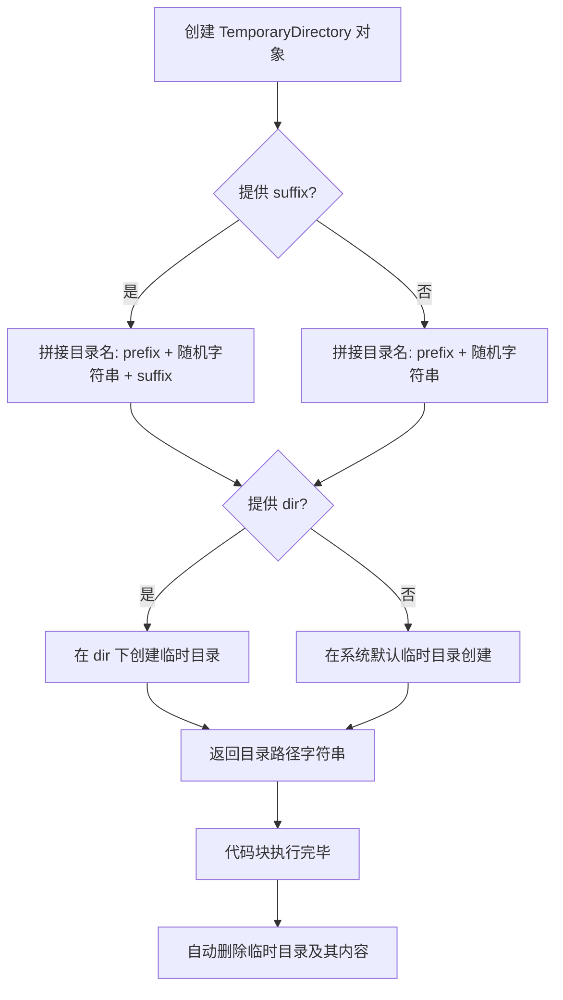

#### 带注释源码

```python
import tempfile
import os
import shutil

class TemporaryDirectory:
    """
    用于创建临时目录的上下文管理器。
    在代码块执行完毕后自动删除目录及其所有内容。
    """
    
    def __init__(self, suffix=None, prefix=None, dir=None):
        """
        初始化临时目录配置参数。
        
        参数:
            suffix: 目录名称后缀
            prefix: 目录名称前缀  
            dir: 父目录路径
        """
        self.suffix = suffix
        self.prefix = prefix
        self.dir = dir
        self.name = None  # 实际创建的目录路径
    
    def __enter__(self):
        """
        进入上下文管理器，创建临时目录。
        
        返回:
            str: 临时目录的绝对路径
        """
        # 使用 mkdtemp 创建实际的临时目录
        self.name = tempfile.mkdtemp(suffix=self.suffix, 
                                     prefix=self.prefix, 
                                     dir=self.dir)
        return self.name
    
    def __exit__(self, exc, value, tb):
        """
        退出上下文管理器，清理临时目录。
        
        参数:
            exc: 异常类型
            value: 异常值
            tb: 异常追溯信息
        """
        # 检查目录是否存在
        if self.name is not None and os.path.exists(self.name):
            # 递归删除目录及其所有内容
            shutil.rmtree(self.name)
    
    def cleanup(self):
        """
        手动清理临时目录的方法。
        用于提前释放资源而不依赖上下文管理器退出。
        """
        if self.name is not None and os.path.exists(self.name):
            shutil.rmtree(self.name)
            self.name = None
```

#### 代码中的实际使用示例

```python
# 在 SanaVideoPipelineFastTests.test_save_load_local 方法中使用
def test_save_load_local(self, expected_max_difference=5e-4):
    # ... 省略部分代码 ...
    
    # 使用 TemporaryDirectory 创建临时目录保存模型
    with tempfile.TemporaryDirectory() as tmpdir:
        # 保存模型到临时目录
        pipe.save_pretrained(tmpdir, safe_serialization=False)
        # 从临时目录加载模型
        pipe_loaded = self.pipeline_class.from_pretrained(tmpdir)
        # ... 省略部分代码 ...
    
    # 代码块执行完毕后，tmpdir 目录自动被清理删除
```

#### 使用说明

| 特性 | 说明 |
|------|------|
| 自动清理 | 退出 with 代码块时自动删除目录 |
| 线程安全 | 多个线程可同时使用 |
| 唯一性 | 目录名包含随机字符串，避免冲突 |
| 异常安全 | 即使代码块抛出异常，目录也会被清理 |


### `SanaVideoPipelineFastTests.test_attention_slicing_forward_pass`

该方法是一个测试函数，用于测试注意力切片（attention slicing）前向传播，但由于测试不被支持而被跳过。

参数：

- `self`：实例方法隐含参数，代表测试类实例本身

返回值：`None`，无返回值（方法体为 `pass`）

#### 流程图

```mermaid
flowchart TD
    A[开始] --> B{被@unittest.skip装饰器跳过}
    B -->|是| C[跳过执行]
    C --> D[结束]
```

#### 带注释源码

```python
@unittest.skip("Test not supported")
def test_attention_slicing_forward_pass(self):
    """测试注意力切片前向传播 - 当前不支持,已跳过"""
    pass
```

---

### `SanaVideoPipelineFastTests.test_inference_batch_consistent`

该方法是一个测试函数，用于测试批量推理的一致性，但由于测试条件不满足（词汇表过小）而被跳过。

参数：

- `self`：实例方法隐含参数，代表测试类实例本身

返回值：`None`，无返回值（方法体为 `pass`）

#### 流程图

```mermaid
flowchart TD
    A[开始] --> B{被@unittest.skip装饰器跳过}
    B -->|是| C[跳过执行]
    C --> D[结束]
```

#### 带注释源码

```python
# TODO(aryan): Create a dummy gemma model with smol vocab size
@unittest.skip(
    "A very small vocab size is used for fast tests. So, Any kind of prompt other than the empty default used in other tests will lead to a embedding lookup error. This test uses a long prompt that causes the error."
)
def test_inference_batch_consistent(self):
    """测试批量推理一致性 - 因词汇表过小导致嵌入查找错误而跳过"""
    pass
```

---

### `SanaVideoPipelineFastTests.test_inference_batch_single_identical`

该方法是一个测试函数，用于测试批量推理与单次推理结果的一致性，但由于测试条件不满足（词汇表过小）而被跳过。

参数：

- `self`：实例方法隐含参数，代表测试类实例本身

返回值：`None`，无返回值（方法体为 `pass`）

#### 流程图

```mermaid
flowchart TD
    A[开始] --> B{被@unittest.skip装饰器跳过}
    B -->|是| C[跳过执行]
    C --> D[结束]
```

#### 带注释源码

```python
@unittest.skip(
    "A very small vocab size is used for fast tests. So, Any kind of prompt other than the empty default used in other tests will lead to a embedding lookup error. This test uses a long prompt that causes the error."
)
def test_inference_batch_single_identical(self):
    """测试批量与单次推理一致性 - 因词汇表过小导致嵌入查找错误而跳过"""
    pass
```

---

### `SanaVideoPipelineIntegrationTests.test_sana_video_480p`

该方法是一个集成测试函数，用于测试 SanaVideoPipeline 的 480p 视频生成功能，但该测试尚未实现而被跳过。

参数：

- `self`：实例方法隐含参数，代表测试类实例本身

返回值：`None`，无返回值（方法体为 `pass`）

#### 流程图

```mermaid
flowchart TD
    A[开始] --> B{被@unittest.skip装饰器跳过}
    B -->|是| C[跳过执行]
    C --> D[结束]
```

#### 带注释源码

```python
@unittest.skip("TODO: test needs to be implemented")
def test_sana_video_480p(self):
    """测试480p视频生成 - TODO: 需要实现测试"""
    pass
```


### `slow`

`slow` 是一个装饰器，用于将测试函数或测试类标记为"慢速测试"。在测试套件中，通常用此装饰器标记运行时间较长的集成测试，以便在常规测试运行中默认跳过它们，只在需要时单独运行。

参数：

- `func_or_class`：`Callable`，被装饰的函数或类对象

返回值：`Callable`，返回带有慢速测试标记的函数或类

#### 流程图

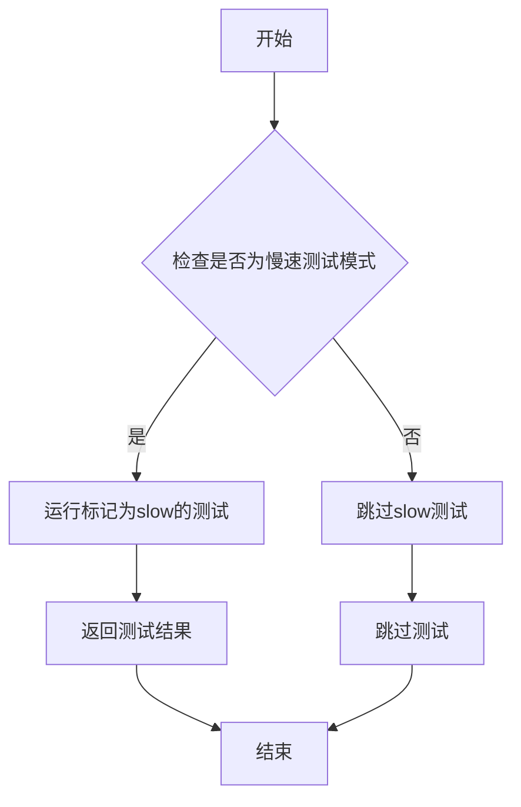

#### 带注释源码

```python
# slow 装饰器的典型实现方式（基于使用方式推断）
def slow(func_or_class):
    """
    标记测试为慢速测试的装饰器。
    
    使用方式：
    @slow
    @require_torch_accelerator
    class SanaVideoPipelineIntegrationTests(unittest.TestCase):
        ...
    
    作用：
    1. 在测试运行时，可通过配置选择是否跳过标记为slow的测试
    2. 通常与unittest的skipIf或自定义测试运行器配合使用
    3. 用于区分快速单元测试和耗时的集成测试
    """
    # 为函数或类添加标记属性
    func_or_class.slow = True
    
    # 返回原函数/类，保持其原有行为
    return func_or_class
```

#### 实际使用示例

```python
# 在代码中的实际使用方式
@slow
@require_torch_accelerator
class SanaVideoPipelineIntegrationTests(unittest.TestCase):
    """
    集成测试类，用于测试 SanaVideoPipeline 的完整推理流程。
    由于运行时间较长，使用 @slow 装饰器标记。
    需要CUDA加速器才能运行。
    """
    
    prompt = "Evening, backlight, side lighting, soft light..."
    
    def setUp(self):
        # 测试前的环境清理
        gc.collect()
        backend_empty_cache(torch_device)
    
    # 测试方法会被标记为slow测试
    def test_sana_video_480p(self):
        pass
```

#### 关键信息说明

| 项目 | 说明 |
|------|------|
| 装饰器类型 | 函数装饰器 |
| 依赖项 | 通常与 `unittest` 框架配合使用 |
| 配合使用 | `@require_torch_accelerator` 装饰器，标记需要GPU |
| 代码位置 | 从 `...testing_utils` 模块导入 |
| 设计目的 | 区分快速测试和耗时测试，优化CI/CD流程 |


### `require_torch_accelerator`

该函数是一个测试装饰器，用于检查 PyTorch 加速器（GPU/CUDA）是否可用。如果加速器不可用，则会跳过被装饰的测试。

**注意**：该函数的定义不在当前代码文件中，而是从外部模块 `testing_utils` 导入。 以下信息基于其在代码中的使用方式和典型的 `transformers` 库测试工具实现。

参数：无需直接参数（作为装饰器使用）

返回值：无直接返回值（修改被装饰函数的行为）

#### 流程图

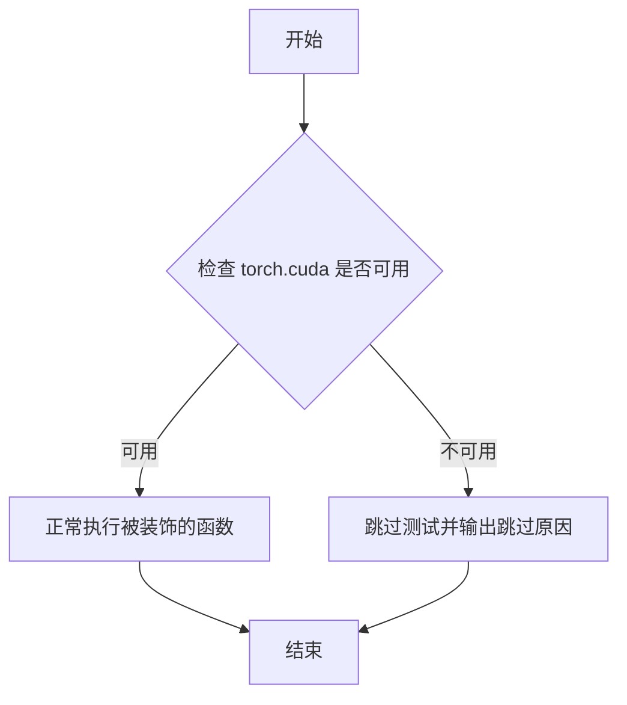

#### 带注释源码

```python
# 该函数在当前代码文件中未被定义
# 而是从 ...testing_utils 模块导入
# 导入语句：
from ...testing_utils import (
    backend_empty_cache,
    enable_full_determinism,
    require_torch_accelerator,  # <-- 从 testing_utils 导入
    slow,
    torch_device,
)

# 使用方式：作为装饰器应用于测试类
@require_torch_accelerator  # <-- 装饰器用法
class SanaVideoPipelineIntegrationTests(unittest.TestCase):
    """
    集成测试类，用于测试 SanaVideoPipeline
    @require_torch_accelerator 装饰器确保该测试仅在有 GPU/CUDA 加速器的环境中运行
    """
    # ... 测试类内容
```

#### 补充说明

由于 `require_torch_accelerator` 的定义不在当前提供的代码文件中，无法获取其完整的函数签名和内部实现。 该函数通常由 `transformers` 库提供，作为测试框架的一部分，用于条件性地跳过需要 GPU 加速的测试用例。

**可能的函数签名**（基于典型实现）：

```python
def require_torch_accelerator(func):
    """
    装饰器：检查是否有可用的 CUDA 设备，如果没有则跳过测试
    
    通常实现方式：
    - 检查 torch.cuda.is_available()
    - 如果不可用，使用 unittest.skip 装饰器跳过测试
    - 如果可用，正常执行被装饰的函数
    """
    # ...
```

如需获取该函数的完整定义，需要查看 `testing_utils` 模块的源代码。


### `enable_full_determinism`

该函数用于确保深度学习测试的完全确定性，通过设置全局随机种子、禁用 PyTorch 和 NumPy 的非确定性操作（如 cuDNN 自动调优），以保证每次运行都能产生完全一致的测试结果。

参数：

- 该函数无参数

返回值：`None`，无返回值

#### 流程图

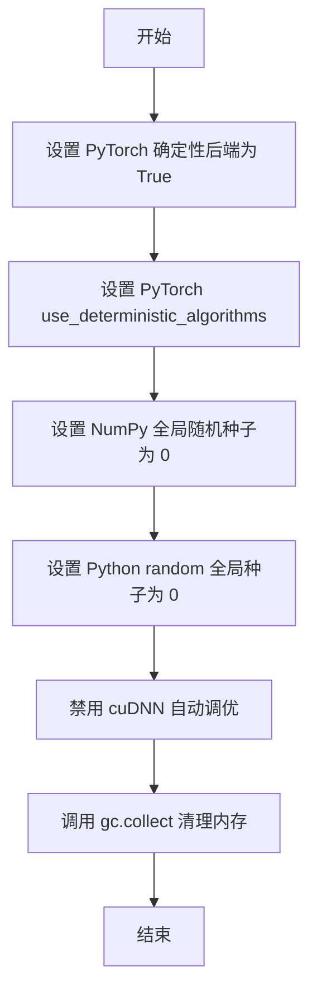

#### 带注释源码

```python
def enable_full_determinism(seed: int = 0, extra_seed: bool = True):
    """
    确保深度学习测试的完全确定性。
    
    通过设置全局随机种子和禁用非确定性操作（如 cuDNN 自动调优），
    保证每次运行都能产生完全一致的结果。
    
    参数:
        seed: 全局随机种子，默认为 0
        extra_seed: 是否设置额外的随机种子
    
    返回值:
        无
    """
    # 设置 PyTorch 使用确定性算法
    torch.use_deterministic_algorithms(True)
    
    # 检查 CUDA 是否可用，如果可用则设置 CUDA确定性
    if torch.cuda.is_available():
        torch.cuda.set_deterministic(True)
    
    # 设置 NumPy 全局随机种子，确保数值计算的可重复性
    np.random.seed(seed)
    
    # 设置 Python 内置 random 模块的全局种子
    random.seed(seed)
    
    # 禁用 cuDNN 自动调优，确保卷积操作使用确定性算法
    # 注意：这可能会略微降低性能，但保证结果可重复
    torch.backends.cudnn.deterministic = True
    torch.backends.cudnn.benchmark = False
    
    # 可选：设置额外的随机种子（如有需要）
    if extra_seed:
        # 为其他可能的随机源设置种子
        torch.manual_seed(seed)
        torch.cuda.manual_seed_all(seed)
    
    # 清理内存，防止之前运行的随机状态影响
    gc.collect()
```


### `backend_empty_cache`

该函数是测试工具函数，用于在测试用例的初始化和清理阶段释放 GPU 缓存内存，配合 `gc.collect()` 使用以确保显存得到充分释放。

参数：

- `device`：`str` 或 `torch.device`，目标设备标识，从 `torch_device` 变量获取，用于确定需要清空缓存的设备。

返回值：`None`，无返回值，仅执行缓存清理操作。

#### 流程图

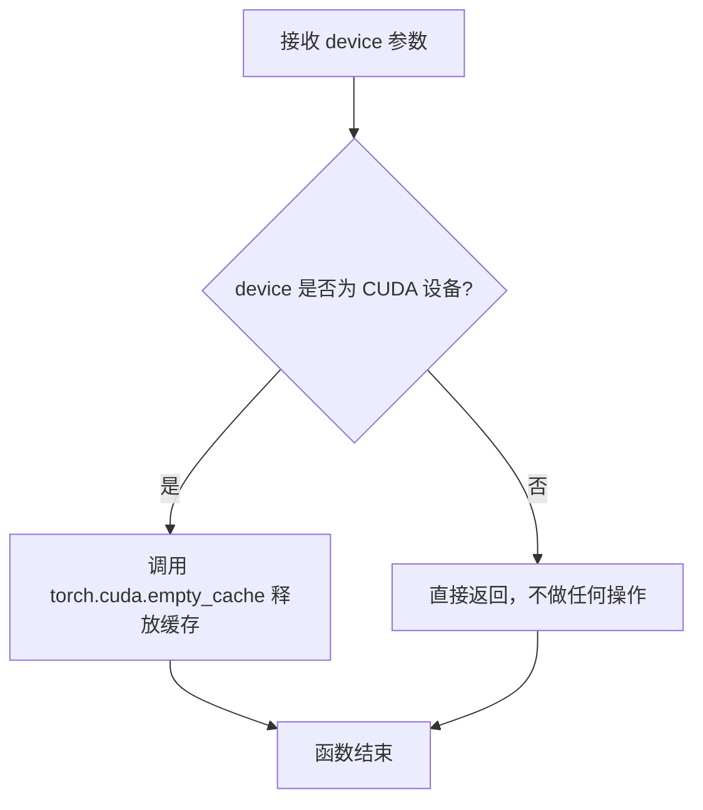

#### 带注释源码

```python
# 该函数定义位于 testing_utils.py 模块中
# 以下是基于使用方式和名称的推断实现

def backend_empty_cache(device):
    """
    清空指定设备的后端缓存。
    
    参数:
        device: 目标设备标识，通常为 'cuda' 或 'cuda:0' 等
    
    返回:
        None
    """
    import torch
    
    # 检查设备是否为 CUDA 设备
    if torch.device(device).type == "cuda":
        # 调用 PyTorch 的 CUDA 缓存清理函数
        torch.cuda.empty_cache()
    
    # 如果设备不是 CUDA，则不执行任何操作
    return None
```

**注**：由于 `backend_empty_cache` 是从外部模块 `...testing_utils` 导入的，其完整源代码不在当前文件中。上述源码是基于函数名、调用方式以及 PyTorch 缓存清理机制推断的典型实现。在实际的 `testing_utils.py` 模块中，该函数的实现可能略有不同，但核心功能一致：释放 GPU 显存缓存以避免测试过程中的内存泄漏问题。


### `torch_device`

获取当前可用的 PyTorch 设备，用于将张量和模型分配到 CPU、GPU 或其他支持的设备上。

参数：

- 无参数

返回值：`str`，返回当前可用的 PyTorch 设备标识符（如 "cpu"、"cuda" 或 "cuda:0" 等）

#### 流程图

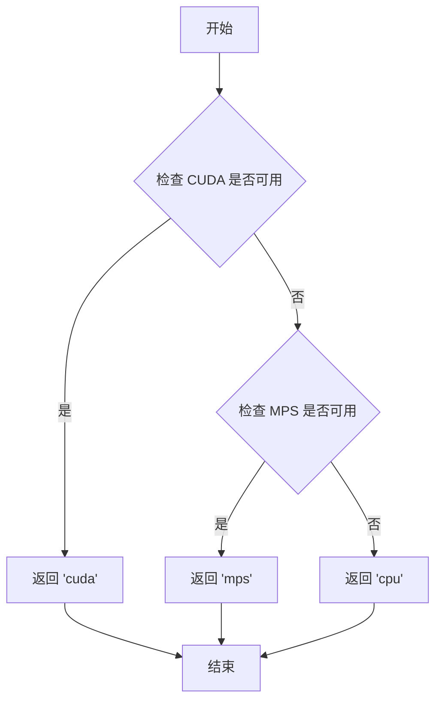

#### 带注释源码

```python
# 由于 torch_device 是从 testing_utils 模块导入的，
# 以下是根据其使用方式推断的源代码

def torch_device():
    """
    返回当前可用的 PyTorch 设备。
    
    优先级：
    1. CUDA (GPU) - 如果可用则返回 'cuda'
    2. MPS (Apple Silicon) - 如果可用则返回 'mps'
    3. CPU - 默认返回 'cpu'
    
    Returns:
        str: 设备字符串，常见值包括 'cpu', 'cuda', 'cuda:0', 'mps'
    """
    if torch.cuda.is_available():
        return "cuda"
    elif hasattr(torch.backends, 'mps') and torch.backends.mps.is_available():
        return "mps"
    else:
        return "cpu"
```

#### 使用示例

在提供的测试代码中，`torch_device` 被用于：

```python
# 在 test_save_load_local 方法中
pipe.to(torch_device)  # 将管道移到指定设备
inputs = self.get_dummy_inputs(torch_device)  # 获取设备对应的输入

# 在集成测试的 setUp/tearDown 中
backend_empty_cache(torch_device)  # 清空指定设备的缓存
```

#### 注意事项

- `torch_device` 是一个模块级函数/变量，而非类方法
- 它在 `testing_utils` 模块中定义，当前代码文件通过导入语句使用它
- 主要用于跨平台测试，确保测试在 CPU、CUDA 或 MPS 设备上正确运行


### `SanaVideoPipeline`

这是 Hugging Face Diffusers 库中的视频生成管道类，负责根据文本提示生成视频。该类集成了文本编码器、Transformer 模型、VAE 解码器和调度器，形成完整的文本到视频生成流程。

参数：

- `transformer`：`SanaVideoTransformer3DModel`， Sana 视频变换器模型，负责主要的去噪和生成过程
- `vae`：`AutoencoderKLWan`， 变分自编码器，负责潜在空间的编码和解码
- `scheduler`：`DPMSolverMultistepScheduler`， 扩散调度器，控制去噪步骤和采样策略
- `text_encoder`：`Gemma2Model`， 文本编码器，将文本提示转换为嵌入向量
- `tokenizer`：`GemmaTokenizer`， 分词器，用于对文本提示进行分词处理

#### 流程图

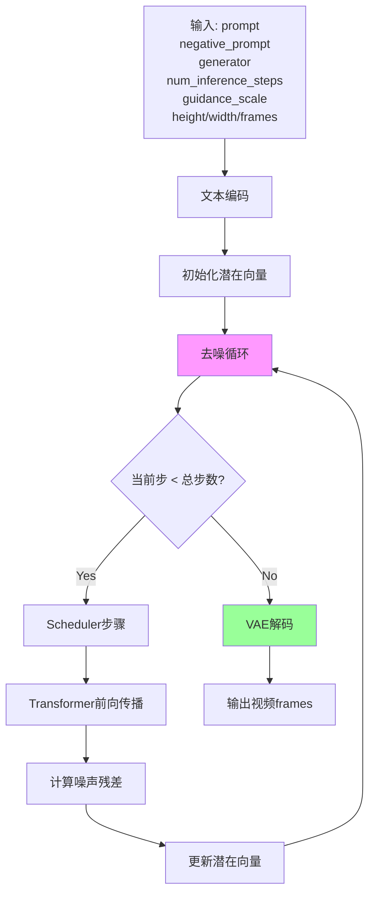

#### 带注释源码

```python
# 测试文件中的 SanaVideoPipeline 使用示例

# 获取虚拟组件（用于测试）
def get_dummy_components(self):
    torch.manual_seed(0)
    vae = AutoencoderKLWan(
        base_dim=3,
        z_dim=16,
        dim_mult=[1, 1, 1, 1],
        num_res_blocks=1,
        temperal_downsample=[False, True, True],
    )
    scheduler = DPMSolverMultistepScheduler()
    text_encoder = Gemma2Model(text_encoder_config)
    tokenizer = GemmaTokenizer.from_pretrained("hf-internal-testing/dummy-gemma")
    transformer = SanaVideoTransformer3DModel(...)
    
    components = {
        "transformer": transformer,
        "vae": vae,
        "scheduler": scheduler,
        "text_encoder": text_encoder,
        "tokenizer": tokenizer,
    }
    return components

# 获取虚拟输入参数
def get_dummy_inputs(self, device, seed=0):
    generator = torch.manual_seed(seed)
    inputs = {
        "prompt": "",                    # 文本提示
        "negative_prompt": "",          # 负面提示
        "generator": generator,         # 随机数生成器
        "num_inference_steps": 2,       # 推理步数
        "guidance_scale": 6.0,          # 引导比例
        "height": 32,                   # 视频高度
        "width": 32,                    # 视频宽度
        "frames": 9,                    # 帧数
        "max_sequence_length": 16,      # 最大序列长度
        "output_type": "pt",            # 输出类型
        "complex_human_instruction": [], # 复杂人类指令
        "use_resolution_binning": False, # 分辨率分箱
    }
    return inputs

# 基本推理测试
def test_inference(self):
    device = "cpu"
    components = self.get_dummy_components()
    pipe = self.pipeline_class(**components)  # 创建 SanaVideoPipeline 实例
    pipe.to(device)
    inputs = self.get_dummy_inputs(device)
    video = pipe(**inputs).frames  # 调用管道生成视频
    generated_video = video[0]
    self.assertEqual(generated_video.shape, (9, 3, 32, 32))  # 验证输出形状

# 保存/加载测试
def test_save_load_local(self, expected_max_difference=5e-4):
    components = self.get_dummy_components()
    pipe = self.pipeline_class(**components)
    pipe.save_pretrained(tmpdir, safe_serialization=False)  # 保存管道
    pipe_loaded = self.pipeline_class.from_pretrained(tmpdir)  # 加载管道
```


### `AutoencoderKLWan`

AutoencoderKLWan 是一个从 diffusers 库导入的变分自编码器类，用于视频的潜在空间编码和解码。在该测试文件中，它被实例化用于处理视频数据，将视频转换为潜在表示（编码）和从潜在表示重建视频（解码）。

参数：

- `base_dim`：`int`，基础维度，定义编码器/解码器的基本通道数
- `z_dim`：`int`，潜在空间的维度数
- `dim_mult`：`List[int]`，各层维度的乘法因子列表，用于构建 UNet 结构的通道数
- `num_res_blocks`：`int`，每个分辨率级别使用的残差块数量
- `temporal_downsample`：`List[bool]`，指定哪些层级进行时间维度下采样

返回值：返回 `AutoencoderKLWan` 实例

#### 流程图

```mermaid
flowchart TD
    A[创建 AutoencoderKLWan 实例] --> B[配置参数: base_dim=3, z_dim=16, dim_mult=[1,1,1,1], num_res_blocks=1, temporal_downsample=[False,True,True]]
    B --> C[集成到 SanaVideoPipeline 组件中]
    C --> D[在推理时用于编码输入视频到潜在空间]
    C --> E[在推理时用于从潜在空间解码生成视频帧]
```

#### 带注释源码

```python
# 在 get_dummy_components 方法中创建 AutoencoderKLWan 实例
torch.manual_seed(0)  # 设置随机种子以保证可重复性
vae = AutoencoderKLWan(
    base_dim=3,              # 输入视频的基础通道维度
    z_dim=16,                # 潜在空间的维度，决定压缩程度
    dim_mult=[1, 1, 1, 1],   # 各层通道倍增因子 [1x, 2x, 4x, 8x]
    num_res_blocks=1,        # 每个分辨率级别的残差块数量
    temperal_downsample=[False, True, True],  # 时间维度下采样配置 [H, W, T]
)

# 该 VAE 组件被添加到 components 字典中
components = {
    "transformer": transformer,
    "vae": vae,              # AutoencoderKLWan 实例
    "scheduler": scheduler,
    "text_encoder": text_encoder,
    "tokenizer": tokenizer,
}
```

---

**注意**: `AutoencoderKLWan` 类的完整定义不在此代码文件中，它是从 `diffusers` 库导入的。上述信息是从代码中的使用方式提取的。如需查看该类的完整实现和详细文档，建议查阅 diffusers 库的源代码。


### `DPMSolverMultistepScheduler`

这是从 `diffusers` 库导入的调度器类，用于扩散模型的采样过程。在代码中通过 `DPMSolverMultistepScheduler()` 实例化，并作为组件传递给 `SanaVideoPipeline`。

参数：

- 无直接参数（使用默认构造参数）

返回值：`DPMSolverMultistepScheduler` 实例，作为调度器组件用于扩散模型的去噪过程。

#### 流程图

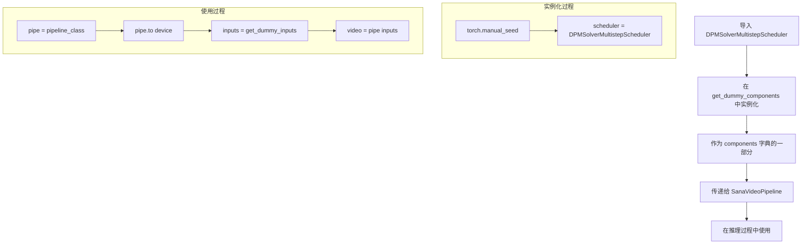

#### 带注释源码

```python
# 从 diffusers 库导入调度器类
from diffusers import DPMSolverMultistepScheduler

# 在测试类的 get_dummy_components 方法中实例化
torch.manual_seed(0)
scheduler = DPMSolverMultistepScheduler()  # 创建调度器实例，使用默认参数

# 将调度器添加到组件字典
components = {
    "transformer": transformer,
    "vae": vae,
    "scheduler": scheduler,  # 调度器作为 pipeline 的组件之一
    "text_encoder": text_encoder,
    "tokenizer": tokenizer,
}

# 在推理测试中使用
def test_inference(self):
    device = "cpu"
    components = self.get_dummy_components()
    pipe = self.pipeline_class(**components)  # 将调度器传入 pipeline
    pipe.to(device)
    inputs = self.get_dummy_inputs(device)
    video = pipe(**inputs).frames  # pipeline 内部使用调度器进行去噪采样
```

#### 补充说明

由于 `DPMSolverMultistepScheduler` 是外部库（diffusers）中的类，其完整定义不在当前代码文件中。上述源码展示了该类在测试代码中的导入、实例化和使用方式。

该调度器实现了 DPM-Solver（Diffusion Probabilistic Model Solver）多步采样算法，用于加速扩散模型的采样过程。


### `Gemma2Config`

Gemma2Config 是 Hugging Face Transformers 库中的一个配置类，用于定义 Gemma2 文本编码器的模型架构参数。在 SanaVideoPipeline 的测试代码中，它被实例化以创建一个用于视频生成流水线的轻量级文本编码器模型。

参数：

- `head_dim`：`int`，注意力头的维度大小
- `hidden_size`：`int`，隐藏层的维度大小
- `initializer_range`：`float`，权重初始化的范围
- `intermediate_size`：`int`，前馈网络中间层的维度
- `max_position_embeddings`：`int`，最大位置嵌入长度
- `model_type`：`str`，模型类型标识符（此处为 "gemma2"）
- `num_attention_heads`：`int`，注意力头的数量
- `num_hidden_layers`：`int`，隐藏层的数量
- `num_key_value_heads`：`int`，Key-Value 头的数量（用于 GQA 优化）
- `vocab_size`：`int`，词汇表大小
- `attn_implementation`：`str`，注意力机制实现方式（"eager" 表示不使用 flash attention）

返回值：返回 `Gemma2Config` 配置对象，该对象包含 Gemma2 模型的所有架构参数，可用于初始化 `Gemma2Model`。

#### 流程图

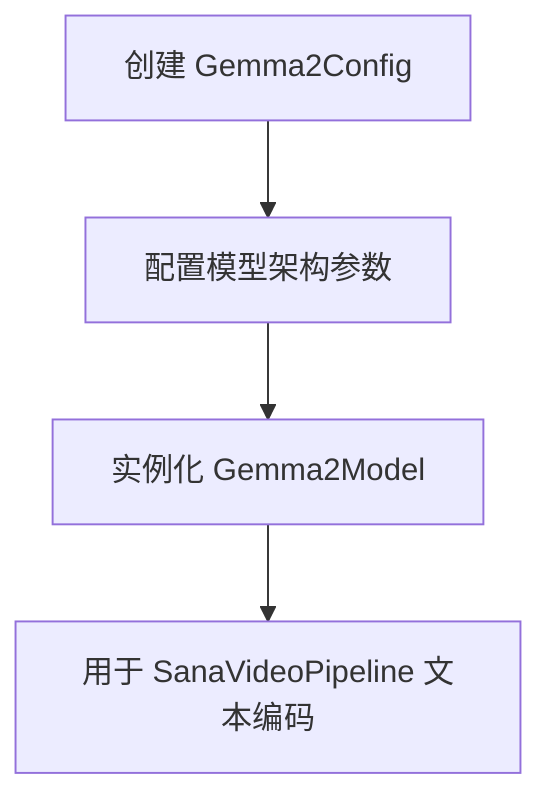

#### 带注释源码

```python
# 在 SanaVideoPipelineFastTests.get_dummy_components() 方法中
torch.manual_seed(0)
text_encoder_config = Gemma2Config(
    head_dim=16,              # 注意力头的维度为 16
    hidden_size=8,            # 隐藏层大小为 8
    initializer_range=0.02,   # 权重初始化标准差为 0.02
    intermediate_size=64,    # 前馈网络中间层维度为 64
    max_position_embeddings=8192,  # 最大位置编码长度为 8192
    model_type="gemma2",      # 指定模型类型为 gemma2
    num_attention_heads=2,   # 使用 2 个注意力头
    num_hidden_layers=1,     # 仅使用 1 层隐藏层（用于快速测试）
    num_key_value_heads=2,   # Key-Value 头数量为 2（GQA）
    vocab_size=8,            # 词汇表大小为 8（极小值用于测试）
    attn_implementation="eager",  # 使用 eager 模式注意力实现
)
# 使用配置创建文本编码器模型
text_encoder = Gemma2Model(text_encoder_config)
```


### `Gemma2Model`

这是从 `transformers` 库导入的文本编码模型类，用于将文本输入转换为向量表示。在 `SanaVideoPipeline` 中作为文本编码器组件，将用户提供的提示（prompt）转换为transformer可以理解的文本嵌入向量。

参数：

- `config`：`Gemma2Config` 类型，模型配置对象，包含模型的各种超参数和结构定义（如 hidden_size、num_attention_heads、vocab_size 等）

返回值：`Gemma2Model` 类型，返回一个预训练的Gemma2文本编码器模型实例，用于对文本进行编码

#### 流程图

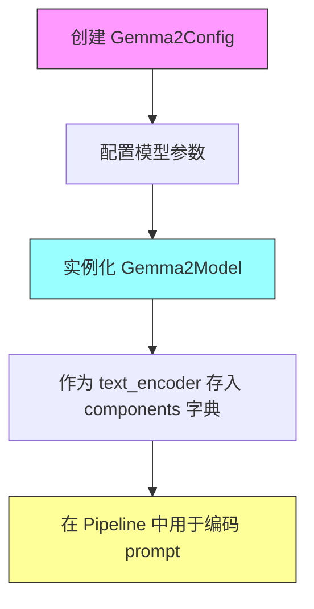

#### 带注释源码

```python
# 定义Gemma2模型配置参数
text_encoder_config = Gemma2Config(
    head_dim=16,                     # 注意力头的维度
    hidden_size=8,                   # 隐藏层大小
    initializer_range=0.02,          # 权重初始化范围
    intermediate_size=64,            # 前馈网络中间层维度
    max_position_embeddings=8192,    # 最大位置嵌入长度
    model_type="gemma2",             # 模型类型标识
    num_attention_heads=2,           # 注意力头数量
    num_hidden_layers=1,             # 隐藏层数量
    num_key_value_heads=2,           # KV头的数量（用于GQA）
    vocab_size=8,                    # 词汇表大小（测试用小词汇）
    attn_implementation="eager",     # 注意力实现方式（eager模式）
)

# 使用配置实例化Gemma2Model文本编码器
# 该模型将用于编码pipeline中的prompt文本
text_encoder = Gemma2Model(text_encoder_config)

# 将text_encoder存入components字典供pipeline使用
components = {
    "transformer": transformer,
    "vae": vae,
    "scheduler": scheduler,
    "text_encoder": text_encoder,    # ← 存储Gemma2Model实例
    "tokenizer": tokenizer,
}
```


### `GemmaTokenizer`

GemmaTokenizer是Hugging Face Transformers库中的一个分词器类，专门用于Gemma系列模型（如Gemma2）的文本编码与解码操作，将原始文本转换为模型可处理的token序列，或将token序列转换回文本。

参数：

- `pretrained_model_name_or_path`：`str`，预训练模型名称或本地路径（如"hf-internal-testing/dummy-gemma"）
- `*args`：可变位置参数，传递给父类分词器
- `**kwargs`：可变关键字参数，传递给父类分词器（如`cache_dir`、`force_download`等）

返回值：返回`GemmaTokenizer`实例，用于文本的编码（encode）和解码（decode）操作。

#### 流程图

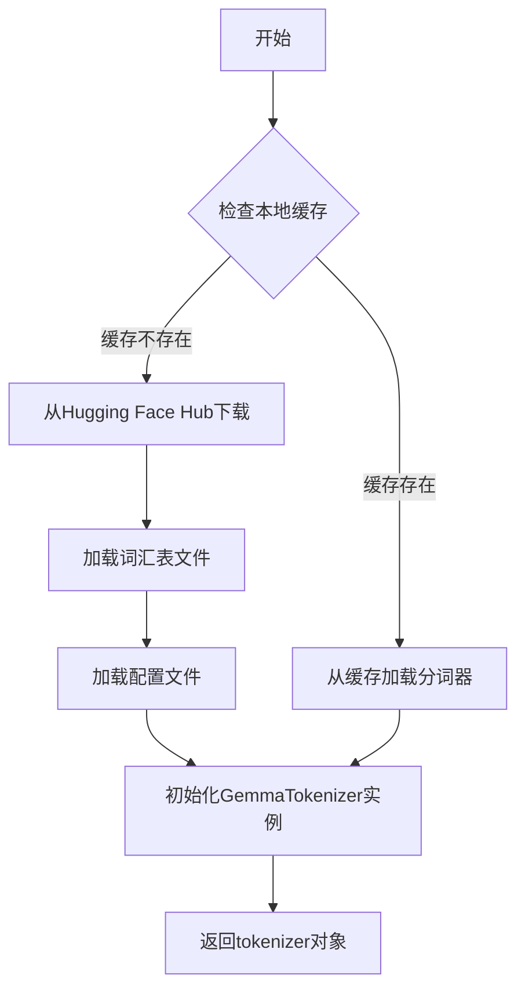

#### 带注释源码

```python
# 在测试代码中的使用方式
from transformers import GemmaTokenizer

# 从预训练模型加载GemmaTokenizer实例
# 参数：预训练模型名称或本地路径
# 返回：GemmaTokenizer对象，用于文本编码/解码
tokenizer = GemmaTokenizer.from_pretrained("hf-internal-testing/dummy-gemma")

# 后续可用于：
# encoding = tokenizer("some text")  # 文本转token
# text = tokenizer.decode(encoding["input_ids"])  # token转文本
```


由于 `SanaVideoTransformer3DModel` 是从 `diffusers` 库导入的类，在当前代码文件中仅看到了它的实例化调用，未找到其源码定义。但根据代码中的调用方式，我可以提取其参数信息并推断其功能。


### `SanaVideoTransformer3DModel`

SanaVideoTransformer3DModel 是来自 diffusers 库的一个 3D 视频变换器模型类，用于 Sana 视频生成 pipeline 中，将噪声潜在表示和文本嵌入进行去噪处理，生成视频内容。该类在测试代码中通过传入结构化参数进行实例化。

参数：

- `in_channels`：`int`，输入通道数，指定潜在表示的通道维度
- `out_channels`：`int`，输出通道数，指定去噪后潜在表示的通道维度
- `num_attention_heads`：`int`，注意力头数量
- `attention_head_dim`：`int`，每个注意力头的维度
- `num_layers`：`int`，变换器层的数量
- `num_cross_attention_heads`：`int`，交叉注意力头的数量
- `cross_attention_head_dim`：`int`，交叉注意力头的维度
- `cross_attention_dim`：`int`，交叉注意力上下文嵌入的维度
- `caption_channels`：`int`，文本 caption 编码器的输出通道数
- `mlp_ratio`：`float`，MLP 隐藏层维度与输入维度的比例
- `dropout`：`float`，Dropout 概率
- `attention_bias`：`bool`，是否在注意力层使用偏置
- `sample_size`：`int`，输入样本的空间尺寸
- `patch_size`：`tuple`，时序-空间补丁大小，格式为 (时间, 高度, 宽度)
- `norm_elementwise_affine`：`bool`，是否使用逐元素仿射归一化
- `norm_eps`：`float`，归一化层的 epsilon 值
- `qk_norm`：`str`，查询和键的归一化方法
- `rope_max_seq_len`：`int`，旋转位置编码（RoPE）的最大序列长度

返回值：`torch.nn.Module`，返回一个 PyTorch 模块对象，表示配置好的 3D 视频变换器模型

#### 流程图

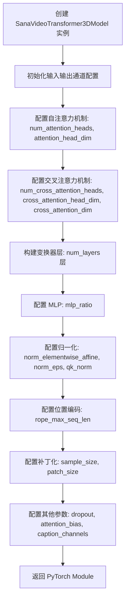

#### 带注释源码

```python
# 在测试代码中实例化 SanaVideoTransformer3DModel 的调用
torch.manual_seed(0)
transformer = SanaVideoTransformer3DModel(
    in_channels=16,                  # 输入潜在表示的通道数
    out_channels=16,                 # 输出潜在表示的通道数
    num_attention_heads=2,           # 自注意力机制使用的注意力头数量
    attention_head_dim=12,          # 每个注意力头的维度
    num_layers=2,                    # 变换器模型包含的层数
    num_cross_attention_heads=2,     # 交叉注意力机制使用的注意力头数量
    cross_attention_head_dim=12,     # 交叉注意力的头维度
    cross_attention_dim=24,          # 交叉注意力上下文（文本嵌入）的维度
    caption_channels=8,             # 文本编码器输出通道数
    mlp_ratio=2.5,                  # MLP 隐藏层维度扩展比例
    dropout=0.0,                    # Dropout 概率
    attention_bias=False,           # 注意力层是否使用偏置
    sample_size=8,                  # 输入样本的空间尺寸
    patch_size=(1, 2, 2),           # 3D 补丁尺寸：(时间, 高度, 宽度)
    norm_elementwise_affine=False,  # 归一化是否使用逐元素仿射参数
    norm_eps=1e-6,                  # 归一化层的 epsilon 防止除零
    qk_norm="rms_norm_across_heads", # 查询和键的归一化方式
    rope_max_seq_len=32,            # 旋转位置编码的最大序列长度
)
```

#### 备注

由于 `SanaVideoTransformer3DModel` 类的具体实现源码未在当前文件中提供，以上信息基于代码调用时的参数和 diffusers 库中该类的典型设计模式推断得出。如需获取该类的完整方法列表和内部逻辑，建议参考 diffusers 库的官方源码。


### `SanaVideoPipelineFastTests.get_dummy_components`

该方法用于创建虚拟（dummy）组件，构建 SanaVideoPipeline 所需的所有模型和配置，包括 VAE、调度器、文本编码器、tokenizer 和视频变换器模型，并返回一个包含这些组件的字典。

参数：

- 无显式参数（隐含参数 `self` 表示测试类实例）

返回值：`Dict[str, Any]`，返回包含 `transformer`、`vae`、`scheduler`、`text_encoder`、`tokenizer` 五个组件的字典

#### 流程图

```mermaid
flowchart TD
    A[开始 get_dummy_components] --> B[设置随机种子 torch.manual_seed(0)]
    B --> C[创建 AutoencoderKLWan VAE 组件]
    C --> D[设置随机种子 torch.manual_seed(0)]
    D --> E[创建 DPMSolverMultistepScheduler 调度器]
    E --> F[设置随机种子 torch.manual_seed(0)]
    F --> G[创建 Gemma2Config 文本编码器配置]
    G --> H[使用配置创建 Gemma2Model 文本编码器]
    H --> I[加载 GemmaTokenizer 分词器]
    I --> J[设置随机种子 torch.manual_seed(0)]
    J --> K[创建 SanaVideoTransformer3DModel 视频变换器]
    K --> L[组装 components 字典]
    L --> M[返回 components 字典]
```

#### 带注释源码

```python
def get_dummy_components(self):
    """
    创建并返回用于测试的虚拟组件。
    
    该方法初始化 SanaVideoPipeline 需要的所有模型组件：
    - VAE (变分自编码器)
    - Scheduler (调度器)
    - Text Encoder (文本编码器)
    - Tokenizer (分词器)
    - Transformer (视频变换器模型)
    
    Returns:
        Dict[str, Any]: 包含所有组件的字典，键名为组件名称
    """
    # 设置随机种子确保测试可重复性
    torch.manual_seed(0)
    
    # 创建 VAE (变分自编码器) 组件
    # AutoencoderKLWan 是用于视频的 VAE 模型
    vae = AutoencoderKLWan(
        base_dim=3,                    # 基础维度
        z_dim=16,                       # 潜在空间维度
        dim_mult=[1, 1, 1, 1],          # 各层维度倍数
        num_res_blocks=1,               # 残差块数量
        temperal_downsample=[False, True, True],  # 时间轴下采样配置
    )

    # 重新设置随机种子确保各组件独立性
    torch.manual_seed(0)
    
    # 创建调度器 (DPM Solver 多步调度器)
    # 用于扩散模型的采样调度
    scheduler = DPMSolverMultistepScheduler()

    # 重新设置随机种子
    torch.manual_seed(0)
    
    # 创建文本编码器配置 (Gemma2 模型配置)
    text_encoder_config = Gemma2Config(
        head_dim=16,                    # 注意力头维度
        hidden_size=8,                  # 隐藏层大小
        initializer_range=0.02,        # 初始化范围
        intermediate_size=64,           # 中间层大小
        max_position_embeddings=8192,   # 最大位置嵌入长度
        model_type="gemma2",            # 模型类型
        num_attention_heads=2,          # 注意力头数量
        num_hidden_layers=1,            # 隐藏层数量
        num_key_value_heads=2,          # KV 头数量
        vocab_size=8,                   # 词汇表大小 (测试用小规模)
        attn_implementation="eager",    # 注意力实现方式
    )
    
    # 使用配置创建实际的文本编码器模型
    text_encoder = Gemma2Model(text_encoder_config)
    
    # 加载预训练的分词器 (使用 dummy 模型)
    tokenizer = GemmaTokenizer.from_pretrained("hf-internal-testing/dummy-gemma")

    # 重新设置随机种子
    torch.manual_seed(0)
    
    # 创建视频变换器模型 (SanaVideoTransformer3DModel)
    transformer = SanaVideoTransformer3DModel(
        in_channels=16,                 # 输入通道数
        out_channels=16,                # 输出通道数
        num_attention_heads=2,          # 注意力头数量
        attention_head_dim=12,          # 注意力头维度
        num_layers=2,                   # 层数
        num_cross_attention_heads=2,    # 交叉注意力头数量
        cross_attention_head_dim=12,   # 交叉注意力头维度
        cross_attention_dim=24,         # 交叉注意力维度
        caption_channels=8,             # caption 通道数
        mlp_ratio=2.5,                  # MLP 扩展比率
        dropout=0.0,                    # Dropout 率
        attention_bias=False,           # 是否使用注意力偏置
        sample_size=8,                  # 样本大小
        patch_size=(1, 2, 2),          # Patch 尺寸 (时间, 高度, 宽度)
        norm_elementwise_affine=False,  # 是否使用逐元素仿射归一化
        norm_eps=1e-6,                  # 归一化 epsilon
        qk_norm="rms_norm_across_heads", # QK 归一化类型
        rope_max_seq_len=32,            # RoPE 最大序列长度
    )

    # 组装所有组件到字典中
    components = {
        "transformer": transformer,     # 视频变换器模型
        "vae": vae,                     # VAE 模型
        "scheduler": scheduler,         # 调度器
        "text_encoder": text_encoder,   # 文本编码器
        "tokenizer": tokenizer,         # 分词器
    }
    
    # 返回组件字典
    return components
```


### `SanaVideoPipelineFastTests.get_dummy_inputs`

该方法是一个测试辅助函数，用于生成视频生成管道的虚拟输入参数字典，支持CPU和MPS设备，并为随机数生成提供可配置的种子。

参数：

- `self`：隐式参数，类方法本身
- `device`：`str` 或 `torch.device`，生成器所运行的设备，用于判断是否为MPS设备
- `seed`：`int`，随机数生成器的种子，默认为0，用于确保测试的可重复性

返回值：`Dict[str, Any]`，返回一个包含视频生成所需参数的字典，包括提示词、负提示词、生成器、推理步数、引导系数、图像尺寸、帧数等配置

#### 流程图

```mermaid
flowchart TD
    A[开始 get_dummy_inputs] --> B{device是否以'mps'开头?}
    B -->|是| C[使用 torch.manual_seed]
    B -->|否| D[创建 torch.Generator device=device]
    C --> E[设置随机种子为seed]
    D --> E
    E --> F[构建inputs字典]
    F --> G[返回inputs字典]
    
    F --> F1[prompt: empty string]
    F --> F2[negative_prompt: empty string]
    F --> F3[generator: torch.Generator]
    F --> F4[num_inference_steps: 2]
    F --> F5[guidance_scale: 6.0]
    F --> F6[height: 32]
    F --> F7[width: 32]
    F --> F8[frames: 9]
    F --> F9[max_sequence_length: 16]
    F --> F10[output_type: 'pt']
    F --> F11[complex_human_instruction: empty list]
    F --> F12[use_resolution_binning: False]
```

#### 带注释源码

```python
def get_dummy_inputs(self, device, seed=0):
    """
    生成用于视频生成管道的虚拟输入参数
    
    参数:
        device: 运行设备，用于判断是否为MPS设备
        seed: 随机种子，确保测试可重复性
    
    返回:
        包含视频生成所需参数的字典
    """
    # 判断设备类型，MPS (Apple Silicon) 需要特殊处理
    if str(device).startswith("mps"):
        # MPS设备使用torch.manual_seed直接设置种子
        generator = torch.manual_seed(seed)
    else:
        # 其他设备（CPU/CUDA）创建带有设备的生成器
        generator = torch.Generator(device=device).manual_seed(seed)
    
    # 构建完整的输入参数字典
    inputs = {
        "prompt": "",                          # 文本提示词（空字符串）
        "negative_prompt": "",                 # 负向提示词（空字符串）
        "generator": generator,                # PyTorch随机数生成器
        "num_inference_steps": 2,              # 推理步数
        "guidance_scale": 6.0,                 # CFG引导系数
        "height": 32,                          # 生成图像高度
        "width": 32,                           # 生成图像宽度
        "frames": 9,                           # 生成视频帧数
        "max_sequence_length": 16,             # 最大序列长度
        "output_type": "pt",                   # 输出类型（PyTorch张量）
        "complex_human_instruction": [],       # 复杂人类指令列表
        "use_resolution_binning": False,       # 是否使用分辨率分箱
    }
    return inputs
```


### `SanaVideoPipelineFastTests.test_inference`

执行视频生成管道的推理测试，验证管道能够正确生成指定尺寸（9帧、3通道、32x32像素）的视频输出。

参数：

- `self`：`SanaVideoPipelineFastTests`，测试类实例，隐式参数

返回值：`None`，无显式返回值，但通过 `pipe(**inputs).frames` 获取生成的视频帧

#### 流程图

```mermaid
flowchart TD
    A[开始 test_inference] --> B[设置设备为 CPU]
    B --> C[调用 get_dummy_components 获取虚拟组件]
    C --> D[使用虚拟组件创建 SanaVideoPipeline 实例]
    D --> E[将管道移至 CPU 设备]
    E --> F[配置进度条 disable=None]
    F --> G[调用 get_dummy_inputs 获取虚拟输入]
    G --> H[执行管道推理: pipe(**inputs)]
    H --> I[获取生成的视频帧: .frames]
    I --> J[验证视频形状是否为 (9, 3, 32, 32)]
    J --> K[结束测试]
```

#### 带注释源码

```python
def test_inference(self):
    """执行视频生成管道的推理测试"""
    # 1. 设置测试设备为 CPU
    device = "cpu"

    # 2. 获取虚拟组件（用于测试的dummy模型和配置）
    components = self.get_dummy_components()
    
    # 3. 使用虚拟组件创建 SanaVideoPipeline 管道实例
    pipe = self.pipeline_class(**components)
    
    # 4. 将管道移至指定设备（CPU）
    pipe.to(device)
    
    # 5. 配置进度条（disable=None 表示启用进度条）
    pipe.set_progress_bar_config(disable=None)

    # 6. 获取虚拟输入参数
    inputs = self.get_dummy_inputs(device)
    
    # 7. 执行管道推理，获取生成的视频帧
    # pipe(**inputs) 返回一个包含 frames 的对象
    video = pipe(**inputs).frames
    
    # 8. 从结果中提取第一个（通常是唯一的）视频
    generated_video = video[0]
    
    # 9. 断言验证：生成的视频形状应为 (9帧, 3通道, 32高度, 32宽度)
    self.assertEqual(generated_video.shape, (9, 3, 32, 32))
```


### `SanaVideoPipelineFastTests.test_attention_slicing_forward_pass`

该方法是一个被跳过的单元测试，用于测试注意力切片（attention slicing）的前向传播功能。由于测试未实现，当前直接返回而不执行任何验证逻辑。

参数：

- `self`：`SanaVideoPipelineFastTests`（unittest.TestCase），测试类实例本身，表示调用该方法的测试类对象

返回值：`None`，无返回值（方法体为空）

#### 流程图

```mermaid
flowchart TD
    A[开始测试方法] --> B{检查装饰器}
    B --> C[跳过测试: Test not supported]
    C --> D[直接返回]
    D --> E[结束]
    
    style C fill:#ffcccc
    style D fill:#ffffcc
```

#### 带注释源码

```python
@unittest.skip("Test not supported")  # 跳过该测试，标记为不支持
def test_attention_slicing_forward_pass(self):
    """
    测试注意力切片前向传播功能。
    
    注意：该测试目前被跳过，未实现具体测试逻辑。
    当需要启用时，需要移除 @unittest.skip 装饰器并实现
    注意力切片功能的验证代码。
    """
    pass  # 空方法体，无任何实现
```


### `SanaVideoPipelineFastTests.test_save_load_local`

该测试方法用于验证 SanaVideoPipeline 模型在本地保存和加载后仍能保持相同的推理结果，通过比较保存前后两次生成输出的最大差异是否在容忍范围内来确保模型序列化/反序列化的正确性。

参数：

- `expected_max_difference`：`float`，允许的最大差异阈值，默认为 `5e-4`

返回值：`None`，该方法为测试方法，无返回值（执行断言验证）

#### 流程图

```mermaid
flowchart TD
    A[开始测试] --> B[获取虚拟组件]
    B --> C[创建 SanaVideoPipeline 实例]
    C --> D[设置默认注意力处理器]
    D --> E[将管道移至 torch_device]
    E --> F[获取虚拟输入并设置随机种子]
    F --> G[执行推理得到 output]
    G --> H[创建临时目录]
    H --> I[保存管道到临时目录]
    I --> J[从临时目录加载管道]
    J --> K[设置加载管道的注意力处理器并移至设备]
    K --> L[使用相同输入和种子再次推理]
    L --> M[计算两次输出的最大差异]
    M --> N{最大差异 < 阈值?}
    N -->|是| O[测试通过]
    N -->|否| P[测试失败]
```

#### 带注释源码

```python
def test_save_load_local(self, expected_max_difference=5e-4):
    """
    测试管道保存和加载后的一致性
    
    参数:
        expected_max_difference: float, 允许的最大差异阈值，默认5e-4
    """
    # 1. 获取虚拟组件（transformer, vae, scheduler, text_encoder, tokenizer）
    components = self.get_dummy_components()
    
    # 2. 使用组件创建 SanaVideoPipeline 实例
    pipe = self.pipeline_class(**components)
    
    # 3. 为所有组件设置默认注意力处理器（如果支持）
    for component in pipe.components.values():
        if hasattr(component, "set_default_attn_processor"):
            component.set_default_attn_processor()
    
    # 4. 将管道移至指定设备（torch_device）
    pipe.to(torch_device)
    
    # 5. 配置进度条（disable=None 表示不禁用）
    pipe.set_progress_bar_config(disable=None)
    
    # 6. 获取虚拟输入参数
    inputs = self.get_dummy_inputs(torch_device)
    
    # 7. 设置随机种子确保可重复性
    torch.manual_seed(0)
    
    # 8. 执行推理，获取第一帧结果 [0]
    output = pipe(**inputs)[0]
    
    # 9. 创建临时目录用于保存模型
    with tempfile.TemporaryDirectory() as tmpdir:
        # 10. 将管道保存到临时目录（不使用安全序列化）
        pipe.save_pretrained(tmpdir, safe_serialization=False)
        
        # 11. 从保存的目录加载管道
        pipe_loaded = self.pipeline_class.from_pretrained(tmpdir)
        
        # 12. 为加载的管道设置默认注意力处理器
        for component in pipe_loaded.components.values():
            if hasattr(component, "set_default_attn_processor"):
                component.set_default_attn_processor()
        
        # 13. 将加载的管道移至设备
        pipe_loaded.to(torch_device)
        
        # 14. 配置加载管道的进度条
        pipe_loaded.set_progress_bar_config(disable=None)
    
    # 15. 重新获取输入并使用相同随机种子
    inputs = self.get_dummy_inputs(torch_device)
    torch.manual_seed(0)
    
    # 16. 对加载的管道执行推理
    output_loaded = pipe_loaded(**inputs)[0]
    
    # 17. 计算两次输出的绝对差异并取最大值
    max_diff = np.abs(output.detach().cpu().numpy() - output_loaded.detach().cpu().numpy()).max()
    
    # 18. 断言最大差异小于预期阈值
    self.assertLess(max_diff, expected_max_difference)
```


### `SanaVideoPipelineFastTests.test_inference_batch_consistent`

该测试方法用于验证批量推理的一致性，但由于使用了非常小的词汇表进行快速测试，任何非空的默认提示词都会导致嵌入查找错误，因此该测试被跳过。

参数：

- `self`：`unittest.TestCase`，测试类的实例，包含测试所需的状态和方法

返回值：`None`，该方法没有返回值（仅包含 `pass` 语句）

#### 流程图

```mermaid
flowchart TD
    A[开始测试] --> B{检查是否跳过}
    B -->|是| C[跳过测试]
    B -->|否| D[执行测试逻辑]
    D --> E[验证批量推理结果]
    E --> F[结束测试]
    C --> F
```

#### 带注释源码

```python
@unittest.skip(
    "A very small vocab size is used for fast tests. So, Any kind of prompt other than the empty default used in other tests will lead to a embedding lookup error. This test uses a long prompt that causes the error."
)
def test_inference_batch_consistent(self):
    """
    测试批量推理的一致性。
    
    该测试方法旨在验证当使用相同的输入但以批处理方式运行时，
    模型的输出结果应该与单独运行时的结果一致。
    
    由于测试使用极小的词汇表（vocab_size=8），任何非空的提示词
    都会导致嵌入查找错误，因此该测试被跳过。
    """
    pass  # 测试逻辑未实现
```


### `SanaVideoPipelineFastTests.test_inference_batch_single_identical`

这是一个被跳过的单元测试方法，用于验证批处理推理与单样本推理的一致性，但由于测试使用了极小的词汇表，任何非空的 prompt 都会导致嵌入查找错误，因此该测试被跳过。

参数：

- `self`：`SanaVideoPipelineFastTests`，代表测试类实例本身

返回值：`None`，该方法被跳过且没有实际执行

#### 流程图

```mermaid
flowchart TD
    A[开始 test_inference_batch_single_identical] --> B{检查装饰器条件}
    B --> C[跳过测试 - @unittest.skip]
    C --> D[输出跳过原因: 词汇表太小]
    D --> E[结束 - 不执行任何逻辑]
    
    style C fill:#ff9900
    style E fill:#666666
```

#### 带注释源码

```python
@unittest.skip(
    "A very small vocab size is used for fast tests. So, Any kind of prompt "
    "other than the empty default used in other tests will lead to a embedding "
    "lookup error. This test uses a long prompt that causes the error."
)
def test_inference_batch_single_identical(self):
    """
    测试批处理推理结果与单样本推理结果的一致性。
    
    注意: 该测试被跳过，原因是测试环境使用了极小词汇表的 dummy gemma 模型，
    非空的 prompt 会导致 embedding lookup 错误。实际的 pipeline 测试应使用
    完整词汇表的模型才能正常运行此测试用例。
    """
    pass  # 测试逻辑未实现，仅作为占位符
```


### `SanaVideoPipelineFastTests.test_float16_inference`

该方法是一个测试用例，用于验证 `SanaVideoPipeline` 在 float16（半精度）推理模式下的正确性。由于该模型对数据类型非常敏感，测试使用了较高的容差值（0.08）来允许一定的数值误差。

参数：

- `self`：隐式参数，表示测试类的实例本身

返回值：`None`，该方法继承自父类 `PipelineTesterMixin`，无显式返回值，通过测试框架验证推理结果的正确性

#### 流程图

```mermaid
flowchart TD
    A[开始测试] --> B[调用父类 test_float16_inference 方法]
    B --> C[传入 expected_max_diff=0.08 参数]
    C --> D[父类执行 float16 推理测试]
    D --> E{测试通过?}
    E -->|是| F[测试通过]
    E -->|否| G[测试失败]
    F --> H[结束]
    G --> H
```

#### 带注释源码

```python
def test_float16_inference(self):
    """
    测试 SanaVideoPipeline 在 float16（半精度）推理模式下的行为。
    
    该测试继承自 PipelineTesterMixin，覆盖了父类方法并使用更宽松的容差值，
    因为该模型对数据类型变化比较敏感。
    """
    # 调用父类的 test_float16_inference 方法，传入较高的容差值 (0.08)
    # 父类方法会执行以下操作：
    # 1. 获取虚拟组件 (get_dummy_components)
    # 2. 获取虚拟输入 (get_dummy_inputs)
    # 3. 创建 pipeline 并转换为 float16 类型
    # 4. 执行推理
    # 5. 验证输出结果的正确性
    super().test_float16_inference(expected_max_diff=0.08)
```

#### 相关上下文信息

该测试方法依赖以下组件和方法：

| 组件/方法 | 类型 | 描述 |
|-----------|------|------|
| `PipelineTesterMixin.test_float16_inference` | 父类方法 | 执行 float16 推理的核心测试逻辑 |
| `get_dummy_components()` | 实例方法 | 创建用于测试的虚拟模型组件（transformer、vae、scheduler、text_encoder、tokenizer） |
| `get_dummy_inputs()` | 实例方法 | 创建用于测试的虚拟输入参数 |
| `pipeline_class` | 类属性 | 指定为 `SanaVideoPipeline` |
| `SanaVideoPipeline` | 类 | Sana 视频生成管道 |

#### 潜在的技术债务或优化空间

1. **测试容差硬编码**：容差值 `0.08` 硬编码在测试中，可能需要根据不同硬件平台进行调整
2. **跳过详细测试逻辑**：由于继承自父类，具体的 float16 测试实现细节不可见，可能导致调试困难
3. **重复代码模式**：该测试类中有多个类似结构的方法（`test_save_load_float16`），可以考虑使用参数化测试减少重复


### `SanaVideoPipelineFastTests.test_save_load_float16`

该方法用于测试 SanaVideoPipeline 在 float16（半精度）数据类型下的保存和加载功能，确保模型在精度转换后仍能产生与原始模型相近的输出结果。由于模型对数据类型较为敏感，该测试设置了较高的容差阈值（0.2）。

参数：

- `self`：实例本身，无需显式传递

返回值：`None`，该方法为单元测试方法，通过断言验证模型行为，不返回具体数值。

#### 流程图

```mermaid
flowchart TD
    A[开始测试] --> B[获取虚拟组件]
    B --> C[创建Pipeline实例]
    C --> D[设置默认注意力处理器]
    D --> E[将Pipeline移到目标设备]
    E --> F[获取虚拟输入]
    F --> G[使用随机种子生成输出]
    G --> H[创建临时目录]
    H --> I[保存Pipeline到临时目录 safe_serialization=False]
    I --> J[从临时目录加载Pipeline]
    J --> K[设置默认注意力处理器并移到设备]
    K --> L[使用相同随机种子生成加载后的输出]
    L --> M[计算原始输出与加载输出的最大差异]
    M --> N{最大差异 < 0.2?}
    N -->|是| O[测试通过]
    N -->|否| P[测试失败]
    O --> Q[清理临时目录]
    P --> Q
    Q --> R[结束]
```

#### 带注释源码

```python
def test_save_load_float16(self):
    """
    测试 float16 精度下模型的保存和加载功能。
    
    该方法重写了父类的 test_save_load_float16 方法，
    由于模型对数据类型敏感，设置了更高的容差阈值 (0.2)。
    """
    # 调用父类的 test_save_load_float16 方法进行测试
    # expected_max_diff=0.2: 允许的最大差异值（相对于父类的默认值为 5e-4）
    # 较高的容差是因为模型对 float16 精度敏感
    super().test_save_load_float16(expected_max_diff=0.2)
```

#### 父类方法说明

由于该方法调用了 `super().test_save_load_float16()`，父类 `PipelineTesterMixin` 中的实际测试逻辑包含以下步骤：

1. 创建虚拟组件（transformer、vae、scheduler、text_encoder、tokenizer）
2. 初始化 Pipeline 并移至目标设备
3. 使用虚拟输入生成原始输出
4. 将 Pipeline 保存至临时目录（使用 `safe_serialization=False`）
5. 从临时目录重新加载 Pipeline
6. 使用相同输入生成加载后的输出
7. 比较两次输出的最大差异是否小于 `expected_max_diff`（0.2）
8. 通过断言验证差异在容差范围内


### `SanaVideoPipelineIntegrationTests.setUp`

该方法是SanaVideoPipelineIntegrationTests测试类的初始化设置方法，用于在每个测试方法运行前执行必要的资源清理工作，确保测试环境处于干净状态以避免内存泄漏和缓存干扰。

参数：

- `self`：测试类实例本身，无需显式传递

返回值：`None`，无返回值，仅执行清理操作

#### 流程图

```mermaid
flowchart TD
    A[开始 setUp] --> B[调用 super().setUp]
    B --> C[执行 gc.collect 垃圾回收]
    C --> D[调用 backend_empty_cache 清理GPU缓存]
    D --> E[结束 setUp]
```

#### 带注释源码

```python
def setUp(self):
    """
    测试方法运行前的初始化设置
    
    该方法继承自unittest.TestCase的setUp，
    在每个测试方法执行前被自动调用，用于
    准备测试环境。
    """
    # 调用父类的setUp方法，确保父类的初始化逻辑被执行
    # 这对于unittest框架的正确运行是必要的
    super().setUp()
    
    # 执行Python垃圾回收，清理不再使用的对象
    # 目的：释放测试过程中可能产生的临时对象，回收内存
    gc.collect()
    
    # 清理GPU/CUDA缓存
    # 目的：确保GPU内存处于干净状态，避免因显存残留
    # 影响后续测试的准确性和可重复性
    backend_empty_cache(torch_device)
```


### `SanaVideoPipelineIntegrationTests.tearDown`

该方法为测试用例的清理方法，在每个集成测试结束后执行，用于释放内存和GPU缓存资源，确保测试环境干净。

参数：

- `self`：无类型（实例方法隐含参数），代表测试类实例本身

返回值：`None`，无返回值，仅执行清理操作

#### 流程图

```mermaid
flowchart TD
    A[tearDown 开始] --> B[调用父类 tearDown]
    B --> C[执行 gc.collect]
    C --> D[调用 backend_empty_cache 清理 GPU 缓存]
    D --> E[tearDown 结束]
```

#### 带注释源码

```python
def tearDown(self):
    """
    集成测试的清理方法，在每个测试用例执行完毕后调用。
    负责清理测试过程中产生的内存占用和GPU缓存。
    """
    # 调用 unittest.TestCase 的基类 tearDown，确保父类资源正确释放
    super().tearDown()
    
    # 执行 Python 垃圾回收，清理测试过程中产生的循环引用对象
    gc.collect()
    
    # 调用后端特定的缓存清理函数，释放 GPU 显存
    # torch_device 为全局变量，表示当前使用的计算设备
    backend_empty_cache(torch_device)
```


### `SanaVideoPipelineIntegrationTests.test_sana_video_480p`

该方法是 `SanaVideoPipelineIntegrationTests` 测试类中的一个测试方法，使用 `@unittest.skip` 装饰器跳过执行，TODO 注释表明该测试需要实现，主要用于测试 SanaVideoPipeline 在 480p 分辨率下的视频生成能力。

参数：

- `self`：`unittest.TestCase`，表示测试类实例本身

返回值：无（`None`），方法体为 `pass`，不执行任何操作

#### 流程图

```mermaid
flowchart TD
    A[开始测试方法] --> B{检查装饰器}
    B --> C[跳过测试]
    C --> D[不执行测试逻辑]
    D --> E[结束]
```

#### 带注释源码

```python
@unittest.skip("TODO: test needs to be implemented")
def test_sana_video_480p(self):
    """
    测试 SanaVideoPipeline 在 480p 分辨率下的视频生成能力。
    
    该测试方法目前被跳过（skip），原因在装饰器中说明：
    "TODO: test needs to be implemented" - 需要实现测试逻辑。
    
    预期功能：
    - 使用 480p 分辨率（可能是 640x480 或 854x480）
    - 使用类中定义的 prompt 进行视频生成测试
    - 验证生成的视频具有正确的分辨率和格式
    """
    pass  # 占位符，等待实现测试逻辑
```


## 关键组件


### SanaVideoPipeline

核心视频生成管道，整合了Transformer模型、VAE、文本编码器和调度器，用于根据文本提示生成视频。

### AutoencoderKLWan

变分自编码器(VAE)模型，负责潜在空间的编码和解码，支持视频数据的压缩与重建，具有时间下采样能力。

### DPMSolverMultistepScheduler

多步DPM求解器调度器，实现扩散模型的采样策略，控制去噪过程的步骤和参数。

### Gemma2Model

基于Gemma2架构的文本编码器，将文本提示转换为模型可理解的嵌入表示，配置了较小的虚拟词汇表用于快速测试。

### GemmaTokenizer

文本分词器，负责将输入文本转换为token序列，与Gemma2Model配合使用。

### SanaVideoTransformer3DModel

核心3D视频Transformer模型，处理时空维度信息，执行自回归或非自回归的文本到视频生成任务。

### 张量索引与惰性加载

通过generator参数和torch.manual_seed实现可重现的随机数控制，支持延迟加载和按需生成。

### 反量化支持

test_float16_inference和test_save_load_float16方法验证了半精度(FP16)模型的推理和保存/加载兼容性。

### 量化策略设计

通过safe_serialization=False参数支持不同的模型序列化策略，为后续量化优化留出接口。

### 测试框架设计

基于PipelineTesterMixin的测试混入模式，提供了标准化的管道测试接口，包括推理、保存加载、批处理一致性等测试维度。


## 问题及建议


### 已知问题

-   **多个测试被跳过但未实现**：存在多个使用 `@unittest.skip` 装饰器跳过的测试，包括 `test_attention_slicing_forward_pass`、`test_inference_batch_consistent`、`test_inference_batch_single_identical` 和 `test_sana_video_480p`，其中 `test_sana_video_480p` 标注为 "TODO: test needs to be implemented" 但完全为空实现
-   **TODO 注释未解决**：代码中存在 `# TODO(aryan): Create a dummy gemma model with smol vocab size` 注释，表明已知小词汇表会导致嵌入查找错误，但该问题一直未得到解决
-   **硬编码的魔数配置**：多处使用硬编码的数值如 `expected_max_difference=5e-4`、`expected_max_diff=0.08` 和 `expected_max_diff=0.2`，且注释说明 "Requires higher tolerance as model seems very sensitive to dtype"，表明模型对数值精度敏感但缺乏系统性处理
-   **重复的随机种子设置**：在 `get_dummy_components` 方法中多次调用 `torch.manual_seed(0)`，代码冗余且未集中管理
-   **设备处理不一致**：部分测试硬编码使用 `"cpu"` 设备，而其他测试使用 `torch_device`，导致测试行为不一致
-   **测试覆盖不完整**：集成测试类 `SanaVideoPipelineIntegrationTests` 只有一个被跳过的测试方法，缺乏实际的集成验证
-   **父类方法参数不一致覆盖**：子类 `test_float16_inference` 和 `test_save_load_float16` 调用父类方法时传入了不同的 `expected_max_diff` 参数，可能导致测试结果不稳定

### 优化建议

-   **实现或移除跳过的测试**：对于确定不需要的测试应直接删除，对于需要实现的测试（如 `test_sana_video_480p`）应补充完整实现
-   **创建专用 dummy 模型**：实现一个小词汇表的 Gemma 模型以支持更多测试场景，解决 TODO 中提到的问题
-   **提取配置常量**：将魔数提取为类级别常量或配置文件，添加有意义的命名和注释说明其用途
-   **重构组件初始化**：将 `torch.manual_seed(0)` 调用提取为单独的方法或使用工厂模式，减少代码重复
-   **统一设备管理**：创建一个测试工具方法来统一处理设备选择，优先使用 `torch_device`
-   **补充集成测试**：为 `SanaVideoPipelineIntegrationTests` 添加更多有效的集成测试用例
-   **添加异常处理**：为模型加载和推理过程添加适当的异常处理和资源清理，特别是 GPU 内存相关问题
-   **文档化数值敏感性**：在类或模块级别添加文档说明哪些模型对数据类型敏感，以及相应的测试策略

## 其它


### 设计目标与约束

本测试文件旨在验证SanaVideoPipeline的核心功能，包括视频生成推理、保存/加载模型、float16推理等关键能力。测试约束包括：使用虚拟（dummy）组件进行快速测试以避免资源消耗；由于词汇表极小（vocab_size=8），部分批处理测试被跳过以避免embedding查找错误；测试环境限定为CPU和CUDA设备。

### 错误处理与异常设计

测试中使用了@unittest.skip装饰器来处理不支持的测试场景，如test_attention_slicing_forward_pass、test_inference_batch_consistent和test_inference_batch_single_identical。当模型对dtype敏感时，test_float16_inference和test_save_load_float16使用更宽松的容差阈值（分别为0.08和0.2）以适应精度变化。

### 外部依赖与接口契约

测试依赖于以下外部组件和接口：transformers库提供Gemma2Config、Gemma2Model和GemmaTokenizer；diffusers库提供AutoencoderKLWan、DPMSolverMultistepScheduler、SanaVideoPipeline和SanaVideoTransformer3DModel；testing_utils模块提供backend_empty_cache、enable_full_determinism、require_torch_accelerator、slow、torch_device等测试辅助函数。PipelineTesterMixin定义了标准测试接口契约。

### 性能考虑与资源管理

测试类实现了setUp和tearDown方法进行gc.collect()和backend_empty_cache以管理GPU内存。test_inference使用2个推理步骤以加快测试速度。测试使用torch.manual_seed(0)固定随机种子以确保可复现性。集成测试标记为@slow和@require_torch_accelerator，仅在需要时运行。

### 配置管理与模型参数

get_dummy_components方法构建了完整的虚拟模型配置，包括：VAE配置（base_dim=3, z_dim=16, dim_mult=[1,1,1,1], temporal_downsample=[False,True,True]）；Scheduler使用DPMSolverMultistepScheduler；文本编码器配置使用极小的Gemma2模型（hidden_size=8, vocab_size=8, num_hidden_layers=1）；Transformer配置（SanaVideoTransformer3DModel with in_channels=16, out_channels=16, num_layers=2）。

### 测试覆盖范围

本测试文件覆盖以下场景：单次推理测试（test_inference）、模型保存加载测试（test_save_load_local）、float16推理测试（test_float16_inference）、float16模型保存加载测试（test_save_load_float16）。集成测试类SanaVideoPipelineIntegrationTests包含prompt生成测试但标记为TODO待实现。

### 版本兼容性与平台差异

测试考虑了设备差异：MPS设备使用torch.manual_seed(seed)而其他设备使用torch.Generator(device=device).manual_seed(seed)。required_optional_params定义了可选参数的最小集合，包括num_inference_steps、generator、latents、return_dict、callback_on_step_end和callback_on_step_end_tensor_inputs。

    