# `diffusers\tests\pipelines\sana_video\test_sana_video_i2v.py` 详细设计文档

这是Sana图像到视频生成管道的单元测试和集成测试文件，包含快速测试类和集成测试类，用于验证SanaImageToVideoPipeline的各项功能，包括推理、保存加载、批处理等，并使用虚拟组件进行测试。

## 整体流程

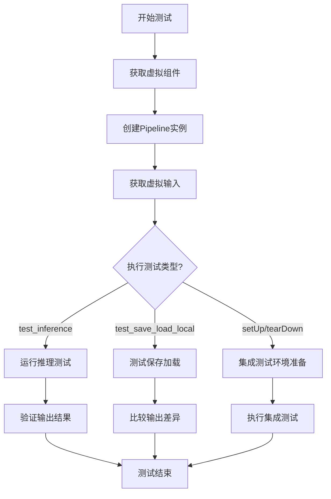

## 类结构

```
unittest.TestCase
├── PipelineTesterMixin
│   └── SanaImageToVideoPipelineFastTests (单元测试)
└── SanaVideoPipelineIntegrationTests (集成测试)
```

## 全局变量及字段


### `SanaImageToVideoPipelineFastTests.pipeline_class`
    
指定用于测试的图像到视频管道类

类型：`type`
    


### `SanaImageToVideoPipelineFastTests.params`
    
管道推理参数集合，包含文本到图像任务的核心参数

类型：`set`
    


### `SanaImageToVideoPipelineFastTests.batch_params`
    
批处理参数集合，用于定义批量推理的输入参数

类型：`set`
    


### `SanaImageToVideoPipelineFastTests.image_params`
    
图像参数集合，定义图像相关的输入参数

类型：`set`
    


### `SanaImageToVideoPipelineFastTests.image_latents_params`
    
图像潜在向量参数集合，用于定义潜在空间参数

类型：`set`
    


### `SanaImageToVideoPipelineFastTests.required_optional_params`
    
必需的可选参数集合，包含管道推理时可选但常用的参数

类型：`frozenset`
    


### `SanaImageToVideoPipelineFastTests.test_xformers_attention`
    
标志位，指示是否测试xFormers注意力机制

类型：`bool`
    


### `SanaImageToVideoPipelineFastTests.supports_dduf`
    
标志位，指示管道是否支持DDUF（解码器去噪更新频率）

类型：`bool`
    


### `SanaVideoPipelineIntegrationTests.prompt`
    
集成测试中使用的文本提示，用于生成视频内容

类型：`str`
    
    

## 全局函数及方法


### `SanaImageToVideoPipelineFastTests.get_dummy_components`

该方法用于创建Sana图像转视频管道的虚拟（dummy）组件，主要功能是初始化并返回一个包含transformer、vae、scheduler、text_encoder和tokenizer等所有必要组件的字典，以便进行单元测试。

参数：

- 该方法无显式参数（`self`为隐含参数）

返回值：`Dict[str, Any]`，返回一个包含虚拟组件的字典，键名包括"transformer"、"vae"、"scheduler"、"text_encoder"和"tokenizer"

#### 流程图

```mermaid
flowchart TD
    A[开始 get_dummy_components] --> B[设置随机种子 torch.manual_seed(0)]
    B --> C[创建 VAE 组件: AutoencoderKLWan]
    C --> D[设置随机种子 torch.manual_seed(0)]
    D --> E[创建 Scheduler 组件: FlowMatchEulerDiscreteScheduler]
    E --> F[设置随机种子 torch.manual_seed(0)]
    F --> G[创建 Text Encoder 配置: Gemma2Config]
    G --> H[创建 Text Encoder: Gemma2Model]
    H --> I[创建 Tokenizer: GemmaTokenizer]
    I --> J[设置随机种子 torch.manual_seed(0)]
    J --> K[创建 Transformer 组件: SanaVideoTransformer3DModel]
    K --> L[组装 components 字典]
    L --> M[返回 components]
```

#### 带注释源码

```python
def get_dummy_components(self):
    """
    创建并返回Sana图像转视频管道所需的所有虚拟组件。
    这些组件用于单元测试，避免加载真实的预训练模型。
    """
    # 设置随机种子以确保结果可复现
    torch.manual_seed(0)
    
    # 创建虚拟VAE（变分自编码器）组件
    # AutoencoderKLWan用于将图像编码到潜在空间和解码回来
    vae = AutoencoderKLWan(
        base_dim=3,
        z_dim=16,
        dim_mult=[1, 1, 1, 1],
        num_res_blocks=1,
        temperal_downsample=[False, True, True],
    )

    # 重新设置随机种子，确保每个组件初始化的一致性
    torch.manual_seed(0)
    
    # 创建调度器（Scheduler）
    # FlowMatchEulerDiscreteScheduler用于扩散模型的采样过程
    scheduler = FlowMatchEulerDiscreteScheduler()

    # 重新设置随机种子
    torch.manual_seed(0)
    
    # 创建文本编码器的配置对象
    # 使用极小的配置参数以加快测试速度
    text_encoder_config = Gemma2Config(
        head_dim=16,
        hidden_size=8,
        initializer_range=0.02,
        intermediate_size=64,
        max_position_embeddings=8192,
        model_type="gemma2",
        num_attention_heads=2,
        num_hidden_layers=1,
        num_key_value_heads=2,
        vocab_size=8,
        attn_implementation="eager",
    )
    
    # 根据配置创建文本编码器模型
    # 用于将文本提示转换为嵌入向量
    text_encoder = Gemma2Model(text_encoder_config)
    
    # 加载虚拟分词器
    # 用于将文本转换为模型可以处理的token ID
    tokenizer = GemmaTokenizer.from_pretrained("hf-internal-testing/dummy-gemma")

    # 重新设置随机种子
    torch.manual_seed(0)
    
    # 创建视频Transformer模型
    # SanaVideoTransformer3DModel是Sana图像转视频的核心模型
    transformer = SanaVideoTransformer3DModel(
        in_channels=16,
        out_channels=16,
        num_attention_heads=2,
        attention_head_dim=12,
        num_layers=2,
        num_cross_attention_heads=2,
        cross_attention_head_dim=12,
        cross_attention_dim=24,
        caption_channels=8,
        mlp_ratio=2.5,
        dropout=0.0,
        attention_bias=False,
        sample_size=8,
        patch_size=(1, 2, 2),
        norm_elementwise_affine=False,
        norm_eps=1e-6,
        qk_norm="rms_norm_across_heads",
        rope_max_seq_len=32,
    )

    # 将所有组件组装成字典
    # 键名必须与管道类的构造函数参数名一致
    components = {
        "transformer": transformer,
        "vae": vae,
        "scheduler": scheduler,
        "text_encoder": text_encoder,
        "tokenizer": tokenizer,
    }
    
    # 返回组件字典，供管道初始化使用
    return components
```


### `SanaImageToVideoPipelineFastTests.get_dummy_inputs`

该方法用于生成测试用的虚拟输入参数，模拟图像到视频生成管道的输入数据，包括虚拟图像、提示词、生成器、推理步数等关键参数，以便在没有真实模型的情况下进行管道测试。

参数：

- `self`：`SanaImageToVideoPipelineFastTests` 类实例，隐含参数
- `device`：`str` 或设备对象，执行推理的目标设备（如 "cpu"、"cuda" 等）
- `seed`：`int`，随机种子，用于生成器的随机初始化，默认值为 `0`

返回值：`Dict`，返回一个包含以下键的字典：
- `image`：PIL Image 对象，32x32 的虚拟 RGB 图像
- `prompt`：`str`，正向提示词（空字符串）
- `negative_prompt`：`str`，负向提示词（空字符串）
- `generator`：`torch.Generator` 或 `None`，随机数生成器
- `num_inference_steps`：`int`，推理步数（值为 2）
- `guidance_scale`：`float`，引导系数（值为 6.0）
- `height`：`int`，生成图像高度（值为 32）
- `width`：`int`，生成图像宽度（值为 32）
- `frames`：`int`，生成的视频帧数（值为 9）
- `max_sequence_length`：`int`，最大序列长度（值为 16）
- `output_type`：`str`，输出类型（值为 "pt"，即 PyTorch 张量）
- `complex_human_instruction`：`list`，复杂人类指令列表（空列表）
- `use_resolution_binning`：`bool`，是否使用分辨率分箱（值为 False）

#### 流程图

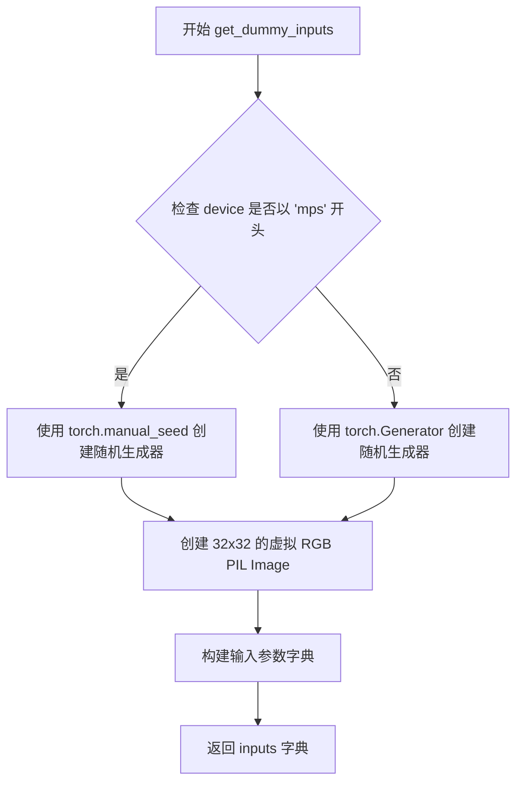

#### 带注释源码

```python
def get_dummy_inputs(self, device, seed=0):
    """
    生成用于测试的虚拟输入参数。
    
    参数:
        device: 目标设备（如 "cpu", "cuda" 等）
        seed: 随机种子，用于生成器初始化
    
    返回:
        包含测试所需各种参数的字典
    """
    # 判断是否为 Apple MPS 设备
    if str(device).startswith("mps"):
        # MPS 设备不支持 torch.Generator，使用 torch.manual_seed 替代
        generator = torch.manual_seed(seed)
    else:
        # 其他设备使用 torch.Generator 创建随机数生成器
        generator = torch.Generator(device=device).manual_seed(seed)

    # 创建一个 32x32 的虚拟 RGB 图像作为输入
    image = Image.new("RGB", (32, 32))

    # 构建完整的输入参数字典
    inputs = {
        "image": image,                        # 输入图像
        "prompt": "",                          # 正向提示词
        "negative_prompt": "",                 # 负向提示词
        "generator": generator,                # 随机数生成器
        "num_inference_steps": 2,              # 推理步数
        "guidance_scale": 6.0,                 # CFG 引导系数
        "height": 32,                          # 输出高度
        "width": 32,                           # 输出宽度
        "frames": 9,                           # 视频帧数
        "max_sequence_length": 16,             # 最大序列长度
        "output_type": "pt",                   # 输出类型为 PyTorch 张量
        "complex_human_instruction": [],       # 复杂指令列表
        "use_resolution_binning": False,       # 禁用分辨率分箱
    }
    return inputs
```


### `SanaImageToVideoPipelineFastTests.test_inference`

该方法是 `SanaImageToVideoPipelineFastTests` 测试类中的核心功能测试用例。它在 CPU 设备上实例化并运行 `SanaImageToVideoPipeline`（图像转视频管道），使用 `get_dummy_components` 和 `get_dummy_inputs` 提供的虚拟模型和数据。通过执行推理并检查输出视频张量的形状 `(9, 3, 32, 32)`，验证管道的基础生成能力是否符合预期。

参数：

- `self`：`SanaImageToVideoPipelineFastTests`，调用该方法的测试类实例本身。

返回值：`None`，该方法为 `unittest.TestCase` 的测试方法，执行后无返回值，测试结果通过断言（Assertion）判定。

#### 流程图

```mermaid
graph LR
    A([开始 test_inference]) --> B[设置设备 device = 'cpu']
    B --> C[调用 get_dummy_components 获取虚拟组件]
    C --> D[使用组件实例化 SanaImageToVideoPipeline]
    D --> E[执行 pipe.to(device) 移至 CPU]
    E --> F[调用 set_progress_bar_config 配置进度条]
    F --> G[调用 get_dummy_inputs 获取虚拟输入]
    G --> H[执行 pipe\*\*inputs 进行推理]
    H --> I[从结果中提取 .frames 属性]
    I --> J[获取视频结果 video[0]]
    J --> K{断言形状是否为<br/>(9, 3, 32, 32)}
    K -->|是| L([测试通过])
    K -->|否| M([断言失败 / 抛出异常])
```

#### 带注释源码

```python
def test_inference(self):
    # 定义运行设备为 CPU
    device = "cpu"

    # 1. 获取虚拟组件
    # 调用类方法生成包含 VAE, Transformer, Scheduler, TextEncoder, Tokenizer 的字典
    components = self.get_dummy_components()
    
    # 2. 实例化管道
    # 使用 pipeline_class (即 SanaImageToVideoPipeline) 和组件字典创建管道对象
    pipe = self.pipeline_class(**components)
    
    # 3. 将模型移至设备
    # 将管道内的所有模型参数移至指定的计算设备 (CPU)
    pipe.to(device)
    
    # 4. 配置进度条
    # 设置进度条行为，disable=None 表示不禁用进度条
    pipe.set_progress_bar_config(disable=None)

    # 5. 准备输入数据
    # 获取虚拟输入，包含图像、prompt、生成器、推理步数等配置
    inputs = self.get_dummy_inputs(device)
    
    # 6. 执行推理
    # 调用管道，传入输入参数。**inputs 会将字典解包为关键字参数
    # 管道返回包含生成结果的输出对象
    video = pipe(**inputs).frames
    
    # 7. 提取结果
    # frames 通常是一个列表或批次，取第一个元素得到生成的视频数据
    generated_video = video[0]
    
    # 8. 断言验证
    # 验证生成的视频形状是否为 (帧数, 通道数, 高度, 宽度)
    # 预期: 9 frames, 3 channels (RGB), 32x32 pixels
    self.assertEqual(generated_video.shape, (9, 3, 32, 32))
```


### `SanaImageToVideoPipelineFastTests.test_attention_slicing_forward_pass`

该测试方法用于验证 Sana 图像转视频管道的注意力切片（attention slicing）前向传播功能，但由于测试尚未支持，当前被跳过。

参数：

- `self`：`SanaImageToVideoPipelineFastTests`，unittest.TestCase 实例，代表测试类本身

返回值：`None`，该方法不返回任何值

#### 流程图

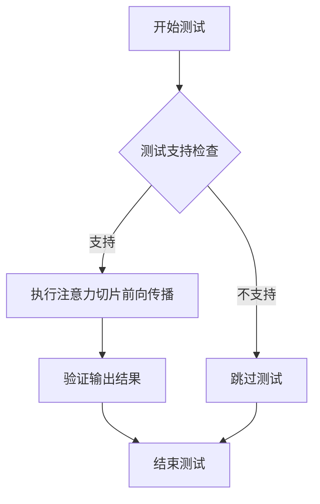

#### 带注释源码

```python
@unittest.skip("Test not supported")
def test_attention_slicing_forward_pass(self):
    """
    测试注意力切片前向传播功能。
    
    该测试方法用于验证管道在启用注意力切片优化时的前向传播是否正确。
    注意力切片是一种内存优化技术，通过分片处理注意力矩阵来减少显存占用。
    
    注意：当前该测试被跳过，标记为不支持。
    """
    pass
```


### `SanaImageToVideoPipelineFastTests.test_save_load_local`

该测试方法验证 Sana 图像到视频管道能够正确保存到本地文件系统并从本地加载，同时确保加载后的管道在使用相同输入时产生的输出与原始输出在指定阈值内一致，以确保模型序列化和反序列化后功能的一致性。

参数：

- `expected_max_difference`：`float`，期望的最大差异阈值，用于验证加载后的输出与原始输出的差异，默认值为 `5e-4`

返回值：`None`，该方法为单元测试，不返回任何值

#### 流程图

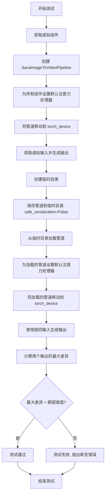

#### 带注释源码

```python
def test_save_load_local(self, expected_max_difference=5e-4):
    """
    测试管道的保存和加载功能，确保序列化/反序列化后输出一致
    
    参数:
        expected_max_difference: float, 允许的最大输出差异阈值
    """
    # 第一步：获取虚拟组件（用于测试的模拟模型组件）
    components = self.get_dummy_components()
    
    # 第二步：使用虚拟组件创建 SanaImageToVideoPipeline 管道实例
    pipe = self.pipeline_class(**components)
    
    # 第三步：为所有支持该方法的组件设置默认注意力处理器
    # 这确保了注意力机制的一致性，便于比较保存/加载前后的输出
    for component in pipe.components.values():
        if hasattr(component, "set_default_attn_processor"):
            component.set_default_attn_processor()
    
    # 第四步：将管道移动到指定的计算设备（通常是 GPU 或 CPU）
    pipe.to(torch_device)
    
    # 第五步：配置进度条显示（disable=None 表示启用进度条）
    pipe.set_progress_bar_config(disable=None)
    
    # 第六步：准备测试输入数据
    inputs = self.get_dummy_inputs(torch_device)
    
    # 第七步：设置随机种子以确保可重复性，并生成原始输出
    torch.manual_seed(0)
    output = pipe(**inputs)[0]
    
    # 第八步：创建临时目录用于保存管道
    with tempfile.TemporaryDirectory() as tmpdir:
        # 使用 save_pretrained 保存管道到临时目录
        # safe_serialization=False 表示不使用安全序列化（允许更快的保存）
        pipe.save_pretrained(tmpdir, safe_serialization=False)
        
        # 从保存的目录加载管道
        pipe_loaded = self.pipeline_class.from_pretrained(tmpdir)
        
        # 为加载的管道同样设置默认注意力处理器
        for component in pipe_loaded.components.values():
            if hasattr(component, "set_default_attn_processor"):
                component.set_default_attn_processor()
        
        # 将加载的管道移动到计算设备
        pipe_loaded.to(torch_device)
        
        # 配置加载管道的进度条
        pipe_loaded.set_progress_bar_config(disable=None)
    
    # 第九步：使用相同的输入和随机种子生成加载后的输出
    inputs = self.get_dummy_inputs(torch_device)
    torch.manual_seed(0)
    output_loaded = pipe_loaded(**inputs)[0]
    
    # 第十步：计算两个输出之间的最大绝对差异
    max_diff = np.abs(output.detach().cpu().numpy() - output_loaded.detach().cpu().numpy()).max()
    
    # 第十一步：断言最大差异小于期望的阈值
    self.assertLess(max_diff, expected_max_difference)
```


### `SanaImageToVideoPipelineFastTests.test_inference_batch_consistent`

这是一个被跳过的测试方法，用于验证图像到视频管道在批量推理时的一致性。由于测试使用非常小的词汇表，任何非空的提示都会导致嵌入查找错误，因此该测试被禁用。

参数：

- `self`：`unittest.TestCase`，表示测试类实例本身

返回值：`None`，该方法为空实现，不返回任何值

#### 流程图

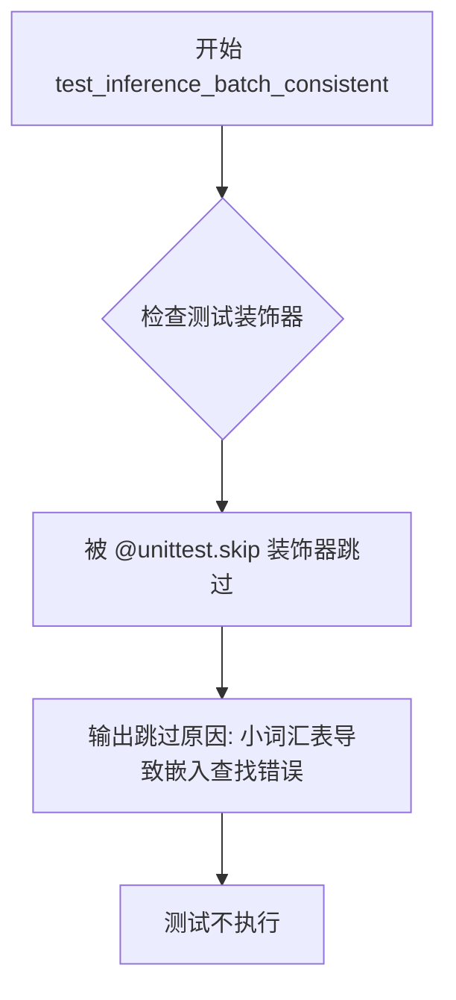

#### 带注释源码

```python
@unittest.skip(
    "A very small vocab size is used for fast tests. So, Any kind of prompt other than the empty default used in other tests will lead to a embedding lookup error. This test uses a long prompt that causes the error."
)
def test_inference_batch_consistent(self):
    """
    测试批量推理一致性。
    
    该测试方法原本用于验证管道在批量推理时能否产生一致的结果，
    即相同的输入提示应该产生相同的输出。但由于测试环境使用的虚拟
    Gemma 模型词汇表非常小，非空提示会导致嵌入查找错误，因此该
    测试被跳过。
    
    测试设计意图:
    - 验证批量推理时相同提示产生一致结果
    - 检查模型在不同batch size下的稳定性
    - 确保去噪过程的确定性
    
    当前限制:
    - 虚拟Gemma模型的vocab_size仅为8
    - 长提示会导致embedding lookup index out of range
    - 需要更大的dummy模型或真实模型才能运行此测试
    """
    pass
```


### `SanaImageToVideoPipelineFastTests.test_inference_batch_single_identical`

该方法是 `SanaImageToVideoPipelineFastTests` 类中的一个测试方法，用于验证批处理推理结果与单样本推理结果的一致性。由于测试使用非常小的词汇表，任何非空的提示符都会导致嵌入查找错误，因此该测试被跳过。

参数：

- `self`：`SanaImageToVideoPipelineFastTests`，表示类的实例对象

返回值：无返回值（方法体为 `pass`）

#### 流程图

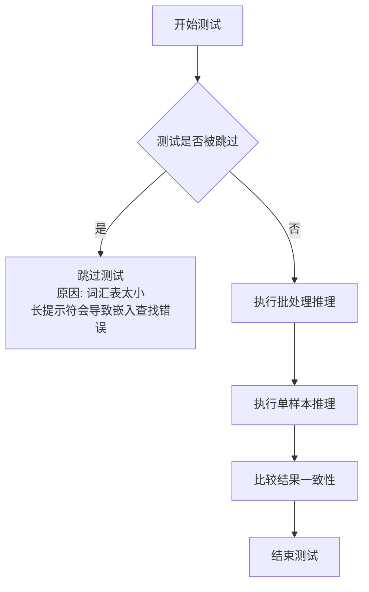

#### 带注释源码

```python
@unittest.skip(
    "A very small vocab size is used for fast tests. So, Any kind of prompt "
    "other than the empty default used in other tests will lead to a embedding "
    "lookup error. This test uses a long prompt that causes the error."
)
def test_inference_batch_single_identical(self):
    """
    测试方法：验证批处理推理与单样本推理的一致性
    
    该测试旨在确保当使用批处理方式调用pipeline时，
    批处理中单个样本的输出应与单独调用该样本的输出完全一致。
    
    当前由于测试环境限制（使用小词汇表的dummy模型）被跳过。
    """
    pass
```


### `SanaImageToVideoPipelineFastTests.test_float16_inference`

该测试方法用于验证模型在 float16（半精度）推理模式下的正确性，由于模型使用 bf16 训练，因此该测试被跳过，但保留了调用父类测试的逻辑以支持未来的精度对比验证。

参数：

- `self`：`SanaImageToVideoPipelineFastTests`（隐式），测试类实例本身

返回值：`None`，该方法为测试方法，通过 `unittest` 框架执行，不直接返回值，而是通过断言验证模型输出的正确性

#### 流程图

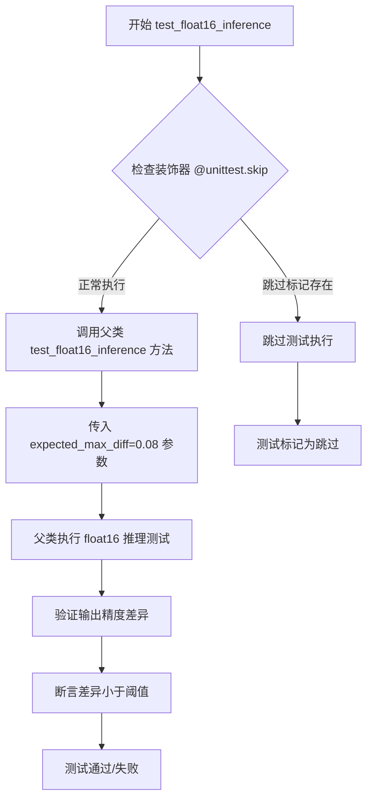

#### 带注释源码

```python
@unittest.skip("Skipping fp16 test as model is trained with bf16")
def test_float16_inference(self):
    # 测试方法：验证模型在 float16（半精度）推理模式下的行为
    # 当前实现：由于模型使用 bf16（Brain Float 16）训练，
    #         float16 推理可能产生较大精度误差，因此该测试被跳过
    
    # 调用父类 PipelineTesterMixin 的 test_float16_inference 方法
    # expected_max_diff=0.08：允许的最大差异阈值为 0.08
    # 说明模型对 dtype 变化非常敏感，需要较高的容差阈值
    super().test_float16_inference(expected_max_diff=0.08)
```


### `SanaImageToVideoPipelineFastTests.test_save_load_float16`

该测试方法用于验证 Sana 图像转视频管道在 float16（半精度）模型权重下的保存和加载功能是否正确，确保加载后的模型输出与原始模型的差异在可接受范围内。由于模型使用 bf16 训练，此测试当前被跳过。

参数：

- `expected_max_diff`：`float`，允许的输出差异最大值，默认为 0.2

返回值：`None`，无返回值（测试方法）

#### 流程图

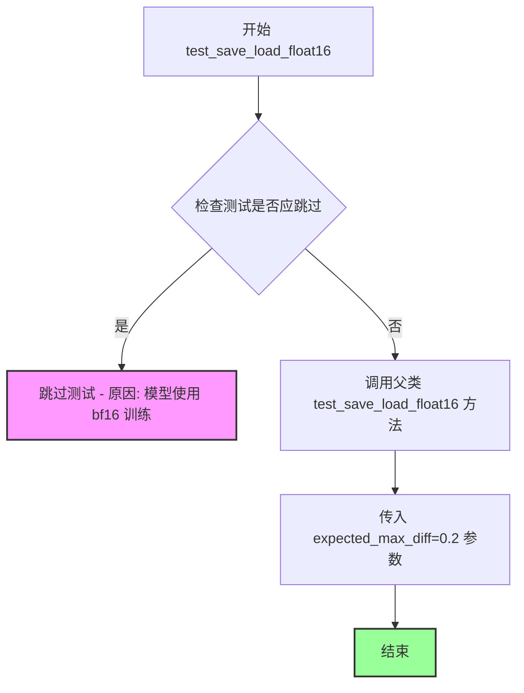

#### 带注释源码

```python
@unittest.skip("Skipping fp16 test as model is trained with bf16")
def test_save_load_float16(self, expected_max_diff=0.2):
    """
    测试 float16 模型的保存和加载功能。
    
    由于原始模型使用 bf16 训练，float16 精度可能存在差异，
    因此设置较高的容差阈值 (0.2) 来验证基本功能。
    
    参数:
        expected_max_diff: float, 允许的最大差异阈值，默认为 0.2
        
    返回:
        None
        
    注意:
        此测试当前被跳过，因为模型使用 bf16 训练，
        不适合使用 float16 进行测试。
    """
    # 调用父类的同名测试方法，传入较高的容差阈值
    # 父类 test_save_load_float16 会执行以下操作：
    # 1. 将管道转换为 float16
    # 2. 运行推理获取输出
    # 3. 保存管道到临时目录
    # 4. 重新加载管道
    # 5. 再次运行推理
    # 6. 比较两次输出的差异是否在 expected_max_diff 范围内
    super().test_save_load_float16(expected_max_diff=0.2)
```


### `SanaVideoPipelineIntegrationTests.setUp`

该方法在每个测试方法执行前进行初始化清理工作，释放 GPU 内存并收集垃圾，确保测试环境的干净和一致性。

参数：

- `self`：隐式参数，`SanaVideoPipelineIntegrationTests` 类实例，当前测试对象本身

返回值：`None`，无返回值，执行清理操作后直接返回

#### 流程图

```mermaid
flowchart TD
    A[setUp 方法开始] --> B[调用 super().setUp]
    B --> C[执行 gc.collect 垃圾回收]
    C --> D[调用 backend_empty_cache 清理 GPU 缓存]
    D --> E[setUp 方法结束]
```

#### 带注释源码

```python
def setUp(self):
    """
    测试前置设置方法，在每个测试方法执行前自动调用。
    负责清理 GPU 内存和垃圾回收，确保测试环境的一致性。
    """
    # 调用父类的 setUp 方法，执行 unittest.TestCase 的标准初始化
    super().setUp()
    
    # 执行 Python 垃圾回收，释放不再使用的对象内存
    gc.collect()
    
    # 清理 GPU 显存缓存，释放 CUDA 内存（如果可用）
    # torch_device 是从 testing_utils 导入的全局变量，表示当前测试设备
    backend_empty_cache(torch_device)
```


### `SanaVideoPipelineIntegrationTests.tearDown`

该方法为测试类的清理方法，在每个测试方法执行完毕后调用，用于执行垃圾回收并清空 GPU 显存缓存，以确保测试环境不会因残留数据而影响后续测试。

参数：

- `self`：自动传入的实例参数，`SanaVideoPipelineIntegrationTests` 类的实例对象，无需显式传递

返回值：`None`，无返回值

#### 流程图

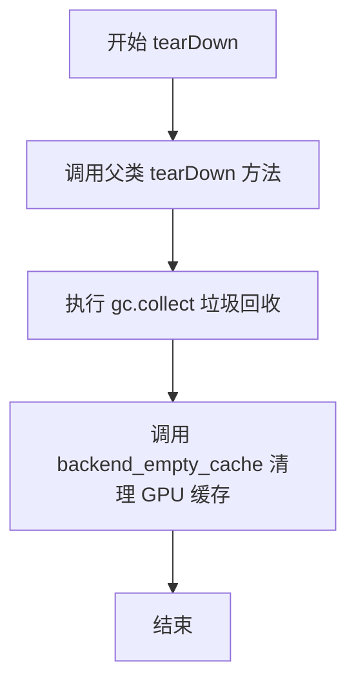

#### 带注释源码

```python
def tearDown(self):
    # 调用父类的 tearDown 方法，执行基类的清理逻辑
    super().tearDown()
    # 执行 Python 垃圾回收，释放不再使用的对象内存
    gc.collect()
    # 调用后端工具函数清空 GPU 显存缓存，释放 GPU 资源
    backend_empty_cache(torch_device)
```


### `SanaVideoPipelineIntegrationTests.test_sana_video_480p`

该测试函数用于验证 Sana 视频管道在 480p 分辨率下的推理能力，目前被标记为跳过，待实现。

参数：无

返回值：`None`，由于函数体仅包含 `pass` 语句，不返回任何值。

#### 流程图

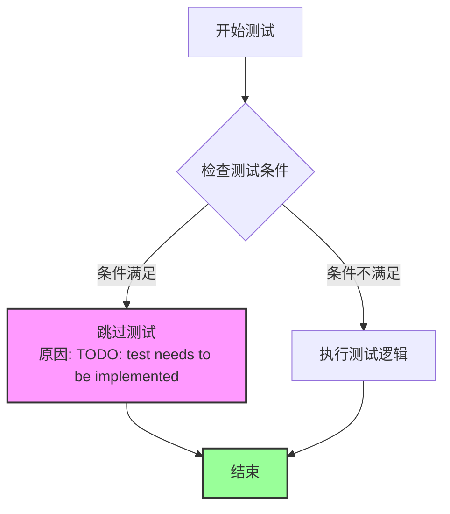

#### 带注释源码

```python
@unittest.skip("TODO: test needs to be implemented")
def test_sana_video_480p(self):
    """
    480p 分辨率视频生成测试函数
    
    该测试用于验证 SanaImageToVideoPipeline 在 480p 分辨率下的
    视频生成能力。由于尚未实现，当前被跳过。
    
    参数:
        无（继承自 unittest.TestCase 的测试方法，self 为隐含参数）
    
    返回值:
        None
    
    注意:
        - 该测试被 @unittest.skip 装饰器跳过
        - 属于 SanaVideoPipelineIntegrationTests 集成测试类
        - 需要实现 480p 分辨率视频生成的完整测试逻辑
    """
    pass  # 测试逻辑待实现
```


### `SanaImageToVideoPipelineFastTests.get_dummy_components`

该方法用于创建测试所需的虚拟组件，初始化并返回一个包含 Sana 图像转视频管道所需各个组件（VAE、调度器、文本编码器、分词器和 Transformer）的字典，用于单元测试。

参数： 无

返回值：`Dict[str, Any]`，返回一个包含虚拟组件的字典，包括 transformer、vae、scheduler、text_encoder 和 tokenizer，用于管道初始化和测试。

#### 流程图

```mermaid
flowchart TD
    A[开始 get_dummy_components] --> B[设置随机种子 torch.manual_seed(0)]
    B --> C[创建 AutoencoderKLWan 虚拟 VAE 组件]
    C --> D[设置随机种子 torch.manual_seed(0)]
    D --> E[创建 FlowMatchEulerDiscreteScheduler 虚拟调度器]
    E --> F[设置随机种子 torch.manual_seed(0)]
    F --> G[创建 Gemma2Config 文本编码器配置]
    G --> H[根据配置创建 Gemma2Model 文本编码器]
    H --> I[从预训练模型加载 GemmaTokenizer 分词器]
    I --> J[设置随机种子 torch.manual_seed(0)]
    J --> K[创建 SanaVideoTransformer3DModel 虚拟 Transformer]
    K --> L[组装 components 字典]
    L --> M[返回 components 字典]
```

#### 带注释源码

```python
def get_dummy_components(self):
    """
    创建用于单元测试的虚拟组件
    
    该方法初始化 SanaImageToVideoPipeline 所需的所有模型组件，
    包括 VAE、调度器、文本编码器、分词器和 Transformer。
    使用固定的随机种子确保测试的可重复性。
    """
    # 设置随机种子，确保 VAE 初始化可重复
    torch.manual_seed(0)
    vae = AutoencoderKLWan(
        base_dim=3,                    # VAE 基础维度
        z_dim=16,                       # 潜在空间维度
        dim_mult=[1, 1, 1, 1],         # 各层维度倍数
        num_res_blocks=1,              # 残差块数量
        temperal_downsample=[False, True, True],  # 时间下采样配置
    )

    # 设置随机种子，确保调度器初始化可重复
    torch.manual_seed(0)
    scheduler = FlowMatchEulerDiscreteScheduler()

    # 设置随机种子，确保文本编码器初始化可重复
    torch.manual_seed(0)
    text_encoder_config = Gemma2Config(
        head_dim=16,                   # 注意力头维度
        hidden_size=8,                 # 隐藏层大小
        initializer_range=0.02,       # 初始化范围
        intermediate_size=64,          # 前馈网络中间层大小
        max_position_embeddings=8192, # 最大位置嵌入长度
        model_type="gemma2",          # 模型类型
        num_attention_heads=2,        # 注意力头数量
        num_hidden_layers=1,          # 隐藏层数量
        num_key_value_heads=2,        # KV 头数量
        vocab_size=8,                 # 词汇表大小（测试用小规模）
        attn_implementation="eager",  # 注意力实现方式
    )
    text_encoder = Gemma2Model(text_encoder_config)
    # 从预训练模型加载分词器
    tokenizer = GemmaTokenizer.from_pretrained("hf-internal-testing/dummy-gemma")

    # 设置随机种子，确保 Transformer 初始化可重复
    torch.manual_seed(0)
    transformer = SanaVideoTransformer3DModel(
        in_channels=16,                # 输入通道数
        out_channels=16,              # 输出通道数
        num_attention_heads=2,        # 注意力头数量
        attention_head_dim=12,        # 注意力头维度
        num_layers=2,                 # Transformer 层数
        num_cross_attention_heads=2,  # 交叉注意力头数量
        cross_attention_head_dim=12,  # 交叉注意力头维度
        cross_attention_dim=24,       # 交叉注意力维度
        caption_channels=8,           # Caption 通道数
        mlp_ratio=2.5,                # MLP 扩展比例
        dropout=0.0,                  # Dropout 概率
        attention_bias=False,         # 是否使用注意力偏置
        sample_size=8,                # 样本大小
        patch_size=(1, 2, 2),         # 3D patch 大小
        norm_elementwise_affine=False,  # 是否使用逐元素仿射归一化
        norm_eps=1e-6,                # 归一化 epsilon
        qk_norm="rms_norm_across_heads",  # QK 归一化类型
        rope_max_seq_len=32,          # RoPE 最大序列长度
    )

    # 组装所有组件到字典中
    components = {
        "transformer": transformer,    # 视频 Transformer 模型
        "vae": vae,                    # VAE 变分自编码器
        "scheduler": scheduler,        # 调度器
        "text_encoder": text_encoder,  # 文本编码器
        "tokenizer": tokenizer,        # 分词器
    }
    return components
```


### `SanaImageToVideoPipelineFastTests.get_dummy_inputs`

该方法为 `SanaImageToVideoPipeline` 单元测试生成虚拟输入参数，创建一个虚拟的 PIL Image 对象，并根据设备类型（是否为 MPS）初始化随机数生成器，用于后续的推理测试。

参数：

- `self`：隐式参数，`SanaImageToVideoPipelineFastTests` 类的实例方法
- `device`：`str`，目标计算设备（如 "cpu"、"cuda" 等），用于创建 PyTorch 随机数生成器
- `seed`：`int`，随机种子，默认为 0，用于确保测试的可重复性

返回值：`Dict[str, Any]`，包含调用图像转视频 pipeline 所需的虚拟输入参数字典

#### 流程图

```mermaid
flowchart TD
    A[开始 get_dummy_inputs] --> B{device 是否以 'mps' 开头?}
    B -->|是| C[使用 torch.manual_seed(seed)]
    B -->|否| D[创建 torch.Generator(device=device)]
    C --> E[调用 manual_seed(seed)]
    D --> E
    E --> F[创建 32x32 RGB PIL Image]
    F --> G[构建 inputs 字典]
    G --> H[返回 inputs 字典]
    
    style A fill:#f9f,color:#333
    style H fill:#9f9,color:#333
```

#### 带注释源码

```python
def get_dummy_inputs(self, device, seed=0):
    """
    生成用于测试的虚拟输入参数
    
    Args:
        self: SanaImageToVideoPipelineFastTests 实例
        device: 目标计算设备字符串
        seed: 随机种子，用于生成可重复的测试结果
    
    Returns:
        dict: 包含图像转视频pipeline所需参数的字典
    """
    # 根据设备类型选择合适的随机数生成器
    # MPS (Metal Performance Shaders) 需要特殊处理
    if str(device).startswith("mps"):
        generator = torch.manual_seed(seed)
    else:
        generator = torch.Generator(device=device).manual_seed(seed)

    # 创建一个虚拟的32x32 RGB图像作为输入
    # 用于测试pipeline的图像处理逻辑
    image = Image.new("RGB", (32, 32))

    # 构建完整的输入参数字典
    # 包含pipeline执行所需的所有必要参数
    inputs = {
        "image": image,                           # 输入图像 (PIL Image)
        "prompt": "",                             # 文本提示词 (空字符串)
        "negative_prompt": "",                    # 负面提示词 (空字符串)
        "generator": generator,                   # 随机数生成器
        "num_inference_steps": 2,                 # 推理步数
        "guidance_scale": 6.0,                    # guidance scale ( classifier-free guidance 强度)
        "height": 32,                             # 输出高度
        "width": 32,                              # 输出宽度
        "frames": 9,                              # 生成帧数
        "max_sequence_length": 16,                # 最大序列长度
        "output_type": "pt",                      # 输出类型 (PyTorch tensor)
        "complex_human_instruction": [],          # 复杂人类指令列表
        "use_resolution_binning": False,          # 是否使用分辨率分箱
    }
    return inputs
```


### `SanaImageToVideoPipelineFastTests.test_inference`

该测试方法用于验证 Sana 图像到视频生成管道的推理功能。它创建虚拟组件和输入，执行管道推理，并验证生成的视频帧形状是否符合预期（9 帧、3 通道、32x32 分辨率）。

参数：

- 无显式参数（使用实例属性 `self`）

返回值：`None`，该方法通过断言验证生成的视频形状，无显式返回值

#### 流程图

```mermaid
flowchart TD
    A[开始 test_inference 测试] --> B[设置设备为 CPU]
    B --> C[调用 get_dummy_components 创建虚拟组件]
    C --> D[使用虚拟组件实例化 SanaImageToVideoPipeline]
    D --> E[将管道移至 CPU 设备]
    E --> F[设置进度条配置 disable=None]
    F --> G[调用 get_dummy_inputs 获取测试输入]
    G --> H[执行管道推理: pipe(**inputs)]
    H --> I[获取生成的视频帧: .frames]
    I --> J[提取第一帧: video[0]]
    J --> K{断言验证}
    K -->|通过| L[测试通过]
    K -->|失败| M[抛出 AssertionError]
```

#### 带注释源码

```python
def test_inference(self):
    """
    测试 Sana 图像到视频管道的推理功能
    
    该测试执行以下步骤：
    1. 创建虚拟（dummy）组件用于测试
    2. 使用这些组件实例化管道
    3. 执行推理生成视频
    4. 验证生成的视频形状是否符合预期
    """
    # 设置测试设备为 CPU
    device = "cpu"

    # 获取虚拟组件（包含 VAE、调度器、文本编码器、tokenizer、transformer 等）
    # 这些组件使用最小的配置以加快测试速度
    components = self.get_dummy_components()
    
    # 使用虚拟组件实例化 SanaImageToVideoPipeline
    pipe = self.pipeline_class(**components)
    
    # 将管道移至指定设备（CPU）
    pipe.to(device)
    
    # 配置进度条，disable=None 表示不禁用进度条
    pipe.set_progress_bar_config(disable=None)

    # 获取虚拟输入参数
    # 包含：图像、prompt、negative_prompt、生成器、推理步数、引导 scale、尺寸、帧数等
    inputs = self.get_dummy_inputs(device)
    
    # 执行管道推理，传入所有输入参数
    # 返回结果包含 .frames 属性用于获取生成的视频
    video = pipe(**inputs).frames
    
    # 获取第一批次（索引 0）的视频帧
    # 预期形状: (9, 3, 32, 32) -> 9帧, 3通道, 32x32分辨率
    generated_video = video[0]
    
    # 断言验证生成的视频形状是否符合预期
    # 形状应为 (frames, channels, height, width) = (9, 3, 32, 32)
    self.assertEqual(generated_video.shape, (9, 3, 32, 32))
```


### `SanaImageToVideoPipelineFastTests.test_attention_slicing_forward_pass`

该测试方法用于验证 Sana 图像到视频管道的注意力切片（attention slicing）前向传播功能，但由于当前测试环境不支持该功能而被跳过执行。

参数：

- `self`：`SanaImageToVideoPipelineFastTests`（隐式），测试类实例本身，无需显式传递

返回值：`None`，该方法不返回任何值（方法体仅为 `pass` 语句）

#### 流程图

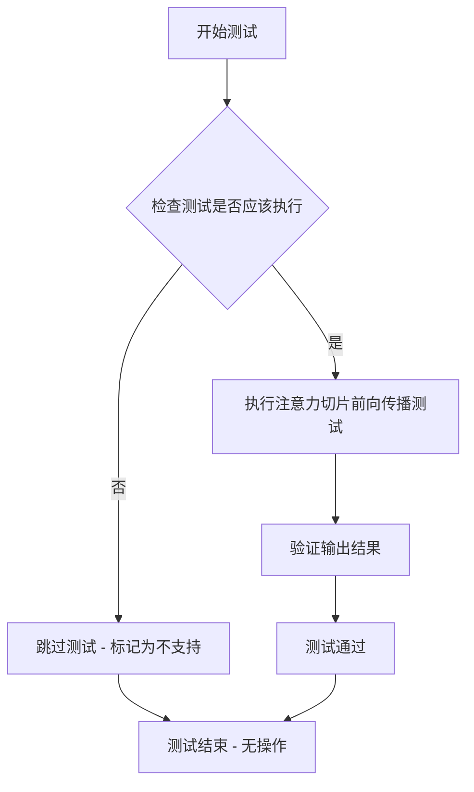

#### 带注释源码

```python
@unittest.skip("Test not supported")
def test_attention_slicing_forward_pass(self):
    """
    测试注意力切片（attention slicing）前向传播功能。
    
    该测试方法用于验证在 SanaImageToVideoPipeline 中使用注意力切片
    优化技术时，模型能否正确执行前向传播。注意力切片是一种内存优化技术，
    通过将注意力计算分块来减少显存占用。
    
    当前该测试被标记为不支持，因此不会执行任何验证逻辑。
    """
    pass  # 方法体为空，测试被跳过
```


### `SanaImageToVideoPipelineFastTests.test_save_load_local`

该方法用于测试 Sana 图像转视频管道在本地保存和加载后的一致性，验证模型权重在序列化与反序列化过程中保持正确性。

参数：

- `self`：隐式参数，测试类实例本身
- `expected_max_difference`：`float`，可选参数，默认为 `5e-4`，表示保存前后输出的最大允许差异阈值

返回值：`None`，该方法为单元测试，通过 `assertLess` 断言验证结果

#### 流程图

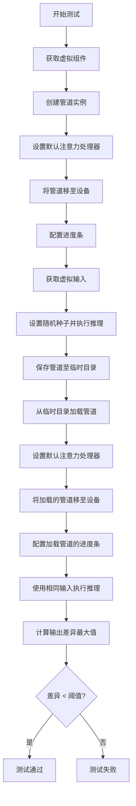

#### 带注释源码

```python
def test_save_load_local(self, expected_max_difference=5e-4):
    """
    测试管道保存和加载功能，验证序列化/反序列化后模型输出一致性
    
    参数:
        expected_max_difference: float, 允许的最大差异阈值，默认5e-4
    """
    # 步骤1: 获取虚拟组件（模型、VAE、调度器、文本编码器等）
    components = self.get_dummy_components()
    
    # 步骤2: 使用组件初始化管道
    pipe = self.pipeline_class(**components)
    
    # 步骤3: 为所有支持该方法的组件设置默认注意力处理器
    for component in pipe.components.values():
        if hasattr(component, "set_default_attn_processor"):
            component.set_default_attn_processor()
    
    # 步骤4: 将管道移至指定设备（CPU/CUDA）
    pipe.to(torch_device)
    
    # 步骤5: 配置进度条（disable=None 表示启用进度条）
    pipe.set_progress_bar_config(disable=None)
    
    # 步骤6: 获取测试用虚拟输入
    inputs = self.get_dummy_inputs(torch_device)
    
    # 步骤7: 设置随机种子确保可复现性，执行推理获取原始输出
    torch.manual_seed(0)
    output = pipe(**inputs)[0]  # [0] 获取第一帧/视频
    
    # 步骤8: 创建临时目录用于保存模型
    with tempfile.TemporaryDirectory() as tmpdir:
        # 步骤9: 保存管道到临时目录（使用不安全序列化以加快测试）
        pipe.save_pretrained(tmpdir, safe_serialization=False)
        
        # 步骤10: 从保存的目录重新加载管道
        pipe_loaded = self.pipeline_class.from_pretrained(tmpdir)
        
        # 步骤11: 为加载的管道设置默认注意力处理器
        for component in pipe_loaded.components.values():
            if hasattr(component, "set_default_attn_processor"):
                component.set_default_attn_processor()
        
        # 步骤12: 将加载的管道移至设备
        pipe_loaded.to(torch_device)
        
        # 步骤13: 配置加载管道的进度条
        pipe_loaded.set_progress_bar_config(disable=None)
    
    # 步骤14: 使用相同输入获取加载管道后的输出
    inputs = self.get_dummy_inputs(torch_device)
    torch.manual_seed(0)
    output_loaded = pipe_loaded(**inputs)[0]
    
    # 步骤15: 计算两个输出之间的最大差异
    max_diff = np.abs(output.detach().cpu().numpy() - output_loaded.detach().cpu().numpy()).max()
    
    # 步骤16: 断言差异在允许范围内
    self.assertLess(max_diff, expected_max_difference)
```


### `SanaImageToVideoPipelineFastTests.test_inference_batch_consistent`

该方法是一个被跳过的单元测试，用于验证批处理推理的一致性，但由于测试使用的小词汇表导致任何非空prompt都会引发embedding查找错误，因此该测试被禁用。

参数：

- `self`：`unittest.TestCase`，测试类实例本身

返回值：`None`，该方法被跳过，不执行任何操作

#### 流程图

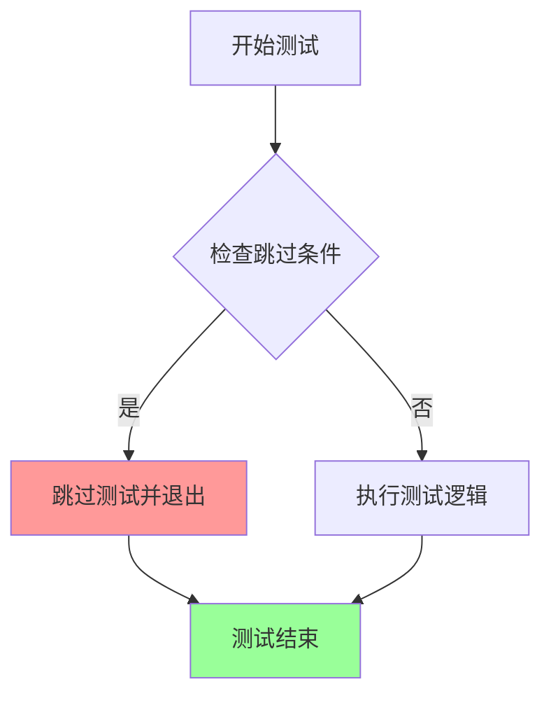

#### 带注释源码

```python
@unittest.skip(
    "A very small vocab size is used for fast tests. So, Any kind of prompt other than the empty default used in other tests will lead to a embedding lookup error. This test uses a long prompt that causes the error."
)
def test_inference_batch_consistent(self):
    pass
```

**代码说明：**

- **装饰器**：`@unittest.skip()` - 该装饰器将测试标记为跳过，原因在装饰器参数中说明
- **跳过原因**：测试使用非常小的词汇表（vocab_size=8），除了空prompt外，任何其他prompt都会导致embedding查找错误
- **方法体**：仅包含 `pass` 语句，表示该测试方法没有实际实现
- **预期功能**：该测试原本应验证批处理推理时的一致性（即相同的输入应该产生相同的输出）


### `SanaImageToVideoPipelineFastTests.test_inference_batch_single_identical`

该测试方法用于验证批量推理与单样本推理结果的一致性，但由于快速测试使用的小词汇量模型会导致非空提示词嵌入查找错误，目前被跳过。

参数：

- `self`：`SanaImageToVideoPipelineFastTests` 实例，测试类实例本身

返回值：`None`，测试方法无返回值（被 `@unittest.skip` 装饰器跳过）

#### 流程图

```mermaid
flowchart TD
    A[开始测试] --> B{检查装饰器}
    B -->|@unittest.skip| C[跳过测试]
    B -->|未跳过| D[执行测试逻辑]
    C --> E[测试结束]
    D --> D1[获取dummy组件]
    D1 --> D2[构建pipeline]
    D2 --> D3[准备批量和单样本输入]
    D3 --> D4[执行推理]
    D4 --> D5[比较结果一致性]
    D5 --> E
```

#### 带注释源码

```python
@unittest.skip(
    "A very small vocab size is used for fast tests. So, Any kind of prompt other than the empty default used in other tests will lead to a embedding lookup error. This test uses a long prompt that causes the error."
)
def test_inference_batch_single_identical(self):
    """
    测试批量推理与单样本推理结果的一致性。
    
    验证当使用批量输入（batch）和单个输入（single）时，
    模型生成的视频帧是否一致。
    
    注意：由于测试使用小词汇量的dummy模型，非空提示词会导致
    嵌入查找错误，因此该测试被跳过。
    """
    pass  # 测试逻辑未实现，仅保留方法签名和跳过说明
```


### `SanaImageToVideoPipelineFastTests.test_float16_inference`

该方法是 `SanaImageToVideoPipelineFastTests` 测试类中的一个测试用例，用于验证管道在 float16 精度下的推理能力。由于模型使用 bf16 训练，当前测试被跳过以避免精度不匹配问题。

参数：

- `self`：测试类实例方法的标准参数，无显式类型声明

返回值：`None`，无返回值（测试方法）

#### 流程图

```mermaid
flowchart TD
    A[开始测试] --> B{检查测试是否被跳过}
    B -->|是| C[跳过测试并标记原因: Skipping fp16 test as model is trained with bf16]
    B -->|否| D[调用父类test_float16_inference方法]
    D --> E[设置expected_max_diff=0.08]
    E --> F[执行float16推理测试]
    F --> G[验证输出精度差异]
    G --> H[结束测试]
    C --> H
```

#### 带注释源码

```python
@unittest.skip("Skipping fp16 test as model is trained with bf16")
def test_float16_inference(self):
    """
    测试方法：test_float16_inference
    
    功能描述：
        验证 SanaImageToVideoPipeline 在 float16（半精度）数据类型下的推理能力。
        该测试继承自 PipelineTesterMixin 的父类测试方法，用于检测模型在降低精度时
        是否仍能产生合理的结果。
    
    当前状态：
        由于底层模型使用 bf16（Brain Float 16）进行训练，与 float16 存在精度差异，
        该测试被 @unittest.skip 装饰器跳过，避免不必要的失败。
    
    特殊处理：
        - expected_max_diff=0.08：设置了较高的容差阈值，因为模型对数据类型非常敏感
        - 相比默认的测试容差，0.08 允许更大的输出差异范围
    """
    # Requires higher tolerance as model seems very sensitive to dtype
    # 调用父类的 test_float16_inference 方法，传入自定义的容差阈值
    super().test_float16_inference(expected_max_diff=0.08)
```


### `SanaImageToVideoPipelineFastTests.test_save_load_float16`

测试 pipeline 在 float16 精度下的保存和加载功能是否正常。由于模型使用 bf16 训练，对 float16 精度敏感，需要更高的容差阈值(0.2)。

参数：

-  `self`：实例方法本身，无需显式传递

返回值：`None`，该方法为测试用例，通过 `super().test_save_load_float16()` 调用父类方法执行实际测试逻辑

#### 流程图

```mermaid
flowchart TD
    A[开始 test_save_load_float16] --> B{检查装饰器}
    B --> C[被 @unittest.skip 装饰器标记为跳过]
    C --> D[方法不执行直接返回]
    
    style C fill:#ffcccc
    style D fill:#ffcccc
```

#### 带注释源码

```python
@unittest.skip("Skipping fp16 test as model is trained with bf16")
def test_save_load_float16(self):
    # 这是一个被跳过的测试用例
    # 原因：模型使用 bf16 训练，对 float16 精度非常敏感
    # 通过 super() 调用父类的 test_save_load_float16 方法
    # expected_max_diff=0.2：设置更高的容差阈值以适应精度差异
    super().test_save_load_float16(expected_max_diff=0.2)
```


### `SanaVideoPipelineIntegrationTests.setUp`

该方法是测试类的初始化方法，在每个测试方法运行前被调用，用于清理内存和GPU缓存，确保测试环境处于干净状态。

参数：

- `self`：隐式参数，`unittest.TestCase` 实例本身，无需显式传递

返回值：`None`，该方法不返回任何值，仅执行清理操作

#### 流程图

```mermaid
flowchart TD
    A[setUp 方法开始] --> B[调用父类 setUp: super().setUp]
    B --> C[执行垃圾回收: gc.collect]
    C --> D[清理 GPU 缓存: backend_empty_cache(torch_device)]
    D --> E[setUp 方法结束]
```

#### 带注释源码

```python
def setUp(self):
    """
    测试前初始化方法，在每个测试方法运行前被调用。
    清理内存和GPU缓存，确保测试环境干净。
    """
    # 调用父类的 setUp 方法，执行 unittest.TestCase 的初始化逻辑
    super().setUp()
    
    # 执行 Python 垃圾回收，释放不再使用的内存对象
    gc.collect()
    
    # 清理 GPU 缓存，释放 GPU 显存
    # torch_device 是从 testing_utils 导入的全局变量，表示测试使用的设备
    backend_empty_cache(torch_device)
```


### `SanaVideoPipelineIntegrationTests.tearDown`

该方法是 `SanaVideoPipelineIntegrationTests` 测试类的 teardown 方法，用于在每个集成测试执行完成后进行资源清理工作，包括调用父类的 teardown、强制垃圾回收以及清空 GPU 缓存，以确保测试环境不会因为残留数据而影响后续测试。

参数：

- 该方法无参数（`self` 为实例引用，不计入参数）

返回值：`None`，无返回值

#### 流程图

```mermaid
flowchart TD
    A[开始 tearDown] --> B[调用 super().tearDown]
    B --> C[执行 gc.collect 强制垃圾回收]
    C --> D[调用 backend_empty_cache 清理GPU缓存]
    D --> E[结束]
```

#### 带注释源码

```python
def tearDown(self):
    """
    测试结束后的清理方法。
    
    该方法在每个测试方法执行完毕后自动调用，用于释放测试过程中
    占用的资源，包括：
    1. 调用父类的 tearDown 方法
    2. 强制进行垃圾回收以清理Python对象
    3. 清空GPU缓存以释放显存
    """
    # 调用父类的 tearDown 方法，执行 unittest.TestCase 的标准清理逻辑
    super().tearDown()
    
    # 强制启动垃圾回收器，回收测试过程中创建的无法自动释放的对象
    gc.collect()
    
    # 调用后端工具函数清空GPU缓存，释放测试占用的显存空间
    backend_empty_cache(torch_device)
```


### `SanaVideoPipelineIntegrationTests.test_sana_video_480p`

该方法是 `SanaVideoPipelineIntegrationTests` 集成测试类中的一个测试用例，用于测试 Sana 视频管道生成 480p 分辨率视频的能力，但目前已被跳过并标记为待实现。

参数：

- `self`：隐式参数，`unittest.TestCase`，代表测试类实例本身

返回值：无（`None`），方法体仅包含 `pass` 语句，不返回任何值

#### 流程图

```mermaid
flowchart TD
    A[开始测试 test_sana_video_480p] --> B{检查装饰器状态}
    B --> C[测试被跳过: @unittest.skip]
    C --> D[标记为 TODO: test needs to be implemented]
    D --> E[结束测试 - 不执行任何逻辑]
    
    style C fill:#ffcccc
    style D fill:#ffffcc
    style E fill:#ccffcc
```

#### 带注释源码

```python
@unittest.skip("TODO: test needs to be implemented")
def test_sana_video_480p(self):
    """
    测试 Sana 视频管道生成 480p 分辨率视频的能力。
    
    该测试方法当前被跳过，原因是测试功能尚未实现。
    TODO: 需要实现 480p 视频生成的测试逻辑，包括：
    - 设置 480p 分辨率 (854x480) 的输入参数
    - 调用管道生成视频
    - 验证输出视频的分辨率和内容质量
    """
    pass  # 占位符，待实现具体测试逻辑
```

---

### 补充信息

#### 1. 类的整体上下文

| 项目 | 描述 |
|------|------|
| **类名** | `SanaVideoPipelineIntegrationTests` |
| **父类** | `unittest.TestCase` |
| **装饰器** | `@slow`, `@require_torch_accelerator` |
| **模块** | 集成测试模块，用于验证 Sana 图像转视频管道的端到端功能 |

#### 2. 相关的类方法和属性

- **`prompt`**：类属性，定义了测试用的默认提示词（描述一个在森林中的年轻白人男子）
- **`setUp()`**：测试前置方法，进行垃圾回收和缓存清理
- **`tearDown()`**：测试后置方法，进行资源清理

#### 3. 技术债务与优化空间

1. **未实现的测试用例**：`test_sana_video_480p` 方法被跳过但未实现，需要补充完整的 480p 视频生成测试逻辑
2. **测试覆盖不完整**：缺少对不同分辨率（480p、720p、1080p 等）的视频生成测试
3. **缺少性能基准测试**：集成测试中未包含推理速度、内存占用等性能指标的验证

#### 4. 潜在的实现方向

当该测试被实现时，可能需要：

- 使用 `SanaImageToVideoPipeline` 管道类
- 设置 `height=480` 和特定的 `width` 参数（需根据 480p 宽高比计算）
- 配置 `frames` 参数指定生成的视频帧数
- 验证输出视频的形状符合 480p 分辨率要求

## 关键组件


### SanaImageToVideoPipeline

Sana图像到视频生成管道，整合了VAE、文本编码器和3D变换器模型，用于根据文本提示和输入图像生成视频。

### AutoencoderKLWan

变分自编码器(VAE)模型，使用KL散度进行潜在空间压缩，支持视频帧的编码和解码。

### FlowMatchEulerDiscreteScheduler

基于欧拉离散方法的Flow Match调度器，用于控制去噪扩散过程中的噪声调度。

### Gemma2Model

Google的Gemma2文本编码器模型，将文本提示转换为文本嵌入向量。

### GemmaTokenizer

Gemma2模型对应的分词器，用于将文本转换为token序列。

### SanaVideoTransformer3DModel

3D视频变换器模型，处理时空维度信息，执行自注意力和交叉注意力操作进行视频生成。

### PipelineTesterMixin

测试混入类，提供管道通用测试方法，包括推理、保存加载、批处理一致性等测试。

### get_dummy_components

创建虚拟组件的工厂方法，初始化所有必要的模型组件（VAE、调度器、文本编码器、分词器、变换器）用于测试。

### get_dummy_inputs

生成虚拟输入的工厂方法，创建测试用的图像、提示词和生成参数。

### test_inference

推理测试方法，验证管道能够正确生成指定形状(9, 3, 32, 32)的视频帧。

### test_save_load_local

保存加载测试方法，验证管道模型能够正确序列化和反序列化。


## 问题及建议


### 已知问题

- **Magic Numbers 大量存在**：代码中包含大量硬编码的数值（如 `base_dim=3`、`z_dim=16`、`num_layers=2`、`num_attention_heads=2` 等），缺乏配置常量或配置类的封装，导致可维护性差。
- **重复的随机种子设置**：`get_dummy_components()` 方法中多次调用 `torch.manual_seed(0)`，代码重复且冗余，可提取为私有方法或使用上下文管理器。
- **重复的组件处理器设置**：在 `test_save_load_local` 方法中两处重复调用 `component.set_default_attn_processor()`，违反 DRY 原则。
- **设备处理不一致**：`test_inference` 硬编码使用 `"cpu"`，而其他测试使用 `torch_device`，导致测试环境行为不一致。
- **大量测试被跳过**：至少 6 个测试方法被 `@unittest.skip` 装饰器跳过，包括 `test_attention_slicing_forward_pass`、`test_inference_batch_consistent`、`test_inference_batch_single_identical`、`test_float16_inference`、`test_save_load_float16`、`test_sana_video_480p`，表明测试覆盖不完整。
- **TODO 任务未完成**：注释中标记 `TODO(aryan): Create a dummy gemma model with smol vocab size` 但未实现，且 `test_sana_video_480p` 标记为 "TODO: test needs to be implemented"。
- **MPS 设备特殊处理逻辑复杂**：`get_dummy_inputs` 方法中对 MPS 设备使用了不同的 `generator` 创建方式，增加了代码分支复杂度。
- **缺乏错误处理测试**：所有测试均为正向流程测试，缺少对异常输入、边界条件、错误参数传递的验证。
- **测试参数命名不一致**：`complex_human_instruction` 参数使用空列表，但参数名称暗示应为更复杂的数据结构，语义不清晰。

### 优化建议

- **引入配置类或常量**：将 `get_dummy_components()` 中的硬编码参数提取为测试配置类或模块级常量，提高可读性和可维护性。
- **封装随机种子管理**：创建私有方法 `_set_dummy_seeds()` 统一设置随机种子，或使用 `torch.seed()` 配合上下文管理器。
- **提取公共设置逻辑**：将 `set_default_attn_processor` 的调用封装为工具方法，避免在多处重复代码。
- **统一设备管理**：定义测试类级别的设备属性，确保所有测试使用一致的设备配置（建议使用 `torch_device`）。
- **完善测试覆盖**：逐步实现被跳过的测试，或创建对应的 GitHub Issue 跟踪任务，避免技术债务累积。
- **简化设备分支逻辑**：MPS 设备的特殊处理可考虑通过统一的 `get_generator` 工具函数封装。
- **添加负面测试**：增加异常场景测试，如无效参数类型、超出范围的值、缺失必要组件等情况。
- **重构测试参数**：明确 `complex_human_instruction` 的语义，或重命名为更准确的名称。
- **添加测试文档**：为每个测试方法添加 docstring，说明测试目的、预期行为和限制条件。

## 其它


### 设计目标与约束

本代码作为SanaImageToVideoPipeline的单元测试套件，核心目标是验证图像到视频生成管道的功能正确性、性能稳定性和模型加载保存能力。设计约束包括：必须支持CPU和GPU环境测试，使用固定随机种子确保测试可复现性，测试数据使用最小化配置（低维度、小词汇表）以加快测试速度，集成测试标记为slow仅在需要时运行。

### 错误处理与异常设计

测试类通过unittest框架进行异常捕获和断言验证。对于不支持的测试用例使用@unittest.skip装饰器跳过，避免误报。测试中设置expected_max_difference阈值来容忍浮点数计算的微小差异。内存管理通过gc.collect()和backend_empty_cache()在setUp和tearDown中显式控制，防止测试间内存泄漏。

### 数据流与状态机

测试数据流为：get_dummy_components()创建虚拟模型组件 → get_dummy_inputs()生成测试输入（含图像、提示词、随机生成器）→ pipe(**inputs)执行推理 → 验证输出frames的形状和数值正确性。状态转换：初始化状态（创建组件）→ 配置状态（设置设备和进度条）→ 执行状态（运行推理）→ 验证状态（断言输出）→ 清理状态（释放资源）。

### 外部依赖与接口契约

主要依赖包括：transformers库提供Gemma2Config、Gemma2Model、GemmaTokenizer；diffusers库提供AutoencoderKLWan、FlowMatchEulerDiscreteScheduler、SanaImageToVideoPipeline、SanaVideoTransformer3DModel；PIL提供图像处理；numpy和torch用于数值计算。接口契约要求pipeline_class必须实现__call__方法返回包含frames的输出对象，组件字典必须包含transformer、vae、scheduler、text_encoder、tokenizer五个键。

### 性能考虑

快速测试使用最小模型配置（1层transformer、8维hidden_size、2个attention heads）以缩短执行时间。集成测试标记为slow且需GPU加速。测试中使用torch.manual_seed和Generator确保确定性输出，便于性能基准对比。内存管理通过显式缓存清理优化GPU显存使用。

### 安全性考虑

代码遵循Apache 2.0许可证。测试使用虚拟/最小化模型参数，不涉及真实敏感数据。save_load测试使用safe_serialization=False以兼容不同序列化格式。测试环境通过require_torch_accelerator装饰器确保必要的硬件支持。

### 可扩展性

PipelineTesterMixin提供通用测试接口，可复用于其他pipeline测试。get_dummy_components()方法封装组件创建逻辑，便于添加或修改测试组件。params、batch_params、image_params等类属性定义测试参数集，支持扩展新的测试场景。skip装饰器的灵活使用允许动态禁用不适用测试。

### 测试策略

采用分层测试策略：单元级别测试get_dummy_components和get_dummy_inputs的数据生成逻辑；集成级别测试test_inference的完整推理流程；持久化级别测试test_save_load_local的模型序列化能力。快速测试套件(SanaImageToVideoPipelineFastTests)用于CI快速反馈，集成测试(SanaVideoPipelineIntegrationTests)用于完整功能验证。

### 配置管理

测试配置通过类属性集中管理：pipeline_class指定被测管道类；params定义__call__方法参数集合；batch_params定义批处理参数；required_optional_params定义可选参数集合；test_xformers_attention和supports_dduf标记功能支持情况。这种声明式配置便于维护和扩展。

### 版本兼容性

依赖版本通过import语句隐式指定。代码使用transformers和diffusers的特定类（如Gemma2Config、SanaVideoTransformer3DModel），需保证版本兼容性。test_float16_inference和test_save_load_float16的跳过说明模型使用bf16训练，与fp16存在兼容性问题。attn_implementation="eager"指定使用标准注意力实现以避免版本差异。

### 部署注意事项

本测试代码无需部署，仅作为开发/CI流程组成部分。集成测试需要torch_accelerator环境标记。测试输出通过unittest框架的标准输出或CI系统集成显示。测试结果应与代码同步版本控制，确保版本一致性。

### 监控和日志

使用pipe.set_progress_bar_config(disable=None)控制进度条显示，便于观察长时间推理测试的执行状态。测试失败时unittest框架自动输出断言错误信息和回溯。集成测试的setUp和tearDown记录内存清理操作。

### 故障排查

常见问题包括：词汇表过小导致embedding lookup错误（已通过跳过相关测试处理）；fp16推理精度问题（已标记跳过）；GPU内存不足（通过显式缓存清理缓解）。test_attention_slicing_forward_pass标记为不支持，避免xformers相关错误。测试使用固定随机种子便于复现和定位随机性问题。

### 许可证和法律

代码头部声明Apache License 2.0许可证。第三方模型（hf-internal-testing/dummy-gemma）为HuggingFace测试用模型，符合使用条款。测试代码本身不涉及专利或商业限制内容。

### 发布说明

本测试套件跟随SanaImageToVideoPipeline主代码库发布。测试状态通过unittest skip装饰器标记：已实现功能、待实现功能（TODO标记）、已知限制功能。版本更新时应同步更新测试覆盖度和skip标记状态。


    