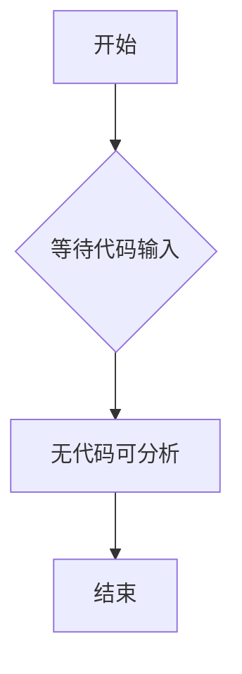

# `diffusers\tests\pipelines\shap_e\__init__.py` 详细设计文档

未提供源代码，无法生成描述。请提供需要分析的代码文件。

## 整体流程



## 类结构

```

```

## 全局变量及字段


    

## 全局函数及方法


## 关键组件


## 问题及建议


### 已知问题

-   未提供待分析的代码，无法进行技术债务和优化空间的分析

### 优化建议

-   请提供需要分析的源代码，以便进行详细的技术债务识别和优化建议


## 其它


### 一段话描述

未提供代码，无法生成描述。请提供需要分析的代码以便生成详细设计文档。

### 文件的整体运行流程

未提供代码，无法分析文件运行流程。

### 类的详细信息

未提供代码，无法分析类结构。

#### 类字段

未提供代码，无法分析类字段。

#### 类方法

未提供代码，无法分析类方法。

### 全局变量

未提供代码，无法分析全局变量。

### 全局函数

未提供代码，无法分析全局函数。

### 关键组件信息

未提供代码，无法识别关键组件。

### 潜在的技术债务或优化空间

未提供代码，无法识别技术债务。

### 设计目标与约束

未提供代码，无法分析设计目标与约束。

### 错误处理与异常设计

未提供代码，无法分析错误处理机制。

### 数据流与状态机

未提供代码，无法分析数据流与状态机。

### 外部依赖与接口契约

未提供代码，无法分析外部依赖。

### 性能要求与基准

未提供代码，无法分析性能要求。

### 安全性考虑

未提供代码，无法分析安全性设计。

### 可扩展性与模块化设计

未提供代码，无法分析可扩展性。

### 测试策略

未提供代码，无法分析测试策略。

### 部署与配置

未提供代码，无法分析部署配置。


    