# `diffusers\tests\pipelines\shap_e\test_shap_e.py` 详细设计文档

该文件是HuggingFace Diffusers库中ShapE管道的测试套件，包含了用于测试ShapE 3D内容生成管道的单元测试和集成测试，验证管道在文本提示下生成3D模型的能力。

## 整体流程

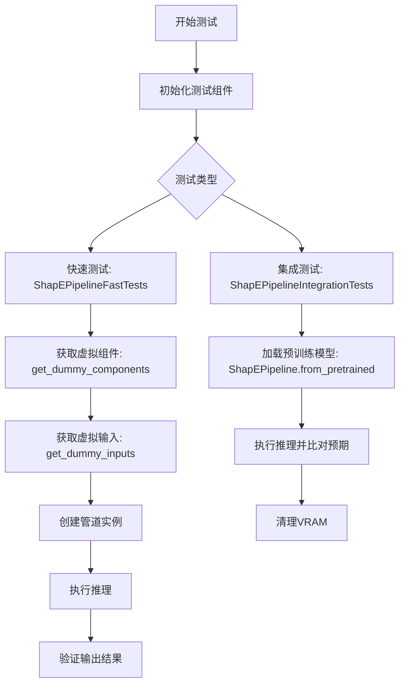

## 类结构

```
unittest.TestCase (Python标准库)
├── PipelineTesterMixin (测试混入类)
│   └── ShapEPipelineFastTests (ShapE快速测试)
│       ├── 属性: pipeline_class, params, batch_params
│       ├── 属性: required_optional_params, test_xformers_attention
│       ├── 属性: text_embedder_hidden_size, time_input_dim
│       ├── 属性: time_embed_dim, renderer_dim
│       ├── 属性: dummy_tokenizer, dummy_text_encoder
│       ├── 属性: dummy_prior, dummy_renderer
│       └── 方法: get_dummy_components, get_dummy_inputs
│       └── 测试方法: test_shap_e, test_inference_batch_consistent
│       └── 测试方法: test_inference_batch_single_identical
│       └── 测试方法: test_num_images_per_prompt
│       └── 测试方法: test_float16_inference, test_save_load_local
└── ShapEPipelineIntegrationTests (ShapE集成测试)
├── 方法: setUp (清理VRAM)
└── 方法: tearDown (清理VRAM)
└── 测试方法: test_shap_e
```

## 全局变量及字段


### `pipeline_class`
    
ShapEPipeline测试类所对应的pipeline类

类型：`Type[ShapEPipeline]`
    


### `params`
    
pipeline的必需参数列表

类型：`List[str]`
    


### `batch_params`
    
支持批处理的参数列表

类型：`List[str]`
    


### `required_optional_params`
    
可选参数的列表，用于测试

类型：`List[str]`
    


### `test_xformers_attention`
    
是否测试xformers注意力机制的标志

类型：`bool`
    


### `device`
    
运行测试的设备标识符

类型：`str`
    


### `components`
    
包含pipeline所有组件的字典

类型：`Dict[str, Any]`
    


### `pipe`
    
实例化的pipeline对象

类型：`ShapEPipeline`
    


### `output`
    
pipeline的输出对象

类型：`PipelineOutput`
    


### `image`
    
生成的图像数据

类型：`Any`
    


### `image_slice`
    
图像的切片用于验证

类型：`np.ndarray`
    


### `expected_slice`
    
期望的图像切片值用于断言

类型：`np.ndarray`
    


### `expected_image`
    
期望的完整图像用于像素差异比较

类型：`np.ndarray`
    


### `generator`
    
随机数生成器用于确保结果可复现

类型：`torch.Generator`
    


### `images`
    
批量生成的图像列表

类型：`List[Any]`
    


### `batch_size`
    
批处理大小

类型：`int`
    


### `num_images_per_prompt`
    
每个prompt生成的图像数量

类型：`int`
    


### `inputs`
    
传递给pipeline的参数字典

类型：`Dict[str, Any]`
    


### `ShapEPipelineFastTests.pipeline_class`
    
测试类所对应的pipeline类

类型：`Type[ShapEPipeline]`
    


### `ShapEPipelineFastTests.params`
    
pipeline的必需参数列表

类型：`List[str]`
    


### `ShapEPipelineFastTests.batch_params`
    
支持批处理的参数列表

类型：`List[str]`
    


### `ShapEPipelineFastTests.required_optional_params`
    
可选参数的列表，用于测试

类型：`List[str]`
    


### `ShapEPipelineFastTests.test_xformers_attention`
    
是否测试xformers注意力机制的标志

类型：`bool`
    


### `ShapEPipelineFastTests.text_embedder_hidden_size`
    
文本嵌入器的隐藏层维度

类型：`int`
    


### `ShapEPipelineFastTests.time_input_dim`
    
时间输入维度

类型：`int`
    


### `ShapEPipelineFastTests.time_embed_dim`
    
时间嵌入维度，等于time_input_dim * 4

类型：`int`
    


### `ShapEPipelineFastTests.renderer_dim`
    
渲染器的维度

类型：`int`
    


### `ShapEPipelineFastTests.dummy_tokenizer`
    
用于测试的虚拟CLIP分词器

类型：`CLIPTokenizer`
    


### `ShapEPipelineFastTests.dummy_text_encoder`
    
用于测试的虚拟文本编码器

类型：`CLIPTextModelWithProjection`
    


### `ShapEPipelineFastTests.dummy_prior`
    
用于测试的虚拟先验模型

类型：`PriorTransformer`
    


### `ShapEPipelineFastTests.dummy_renderer`
    
用于测试的虚拟渲染器

类型：`ShapERenderer`
    
    

## 全局函数及方法


### `ShapEPipeline.from_pretrained`

该方法是一个类方法，用于从预训练模型加载 `ShapEPipeline` 实例，支持从 HuggingFace Hub 或本地路径加载模型权重和配置。

参数：

-  `pretrained_model_name_or_path`：`str`，模型名称（如 "openai/shap-e"）或本地模型路径
-  `torch_device`：`torch.device`（可选），指定设备，代码中使用 `torch_device` 常量
-  `**kwargs`：其他可选参数，如 `output_type`、`guidance_scale`、`num_inference_steps` 等

返回值：`ShapEPipeline`，返回加载并配置好的管道实例，可直接用于推理

#### 流程图

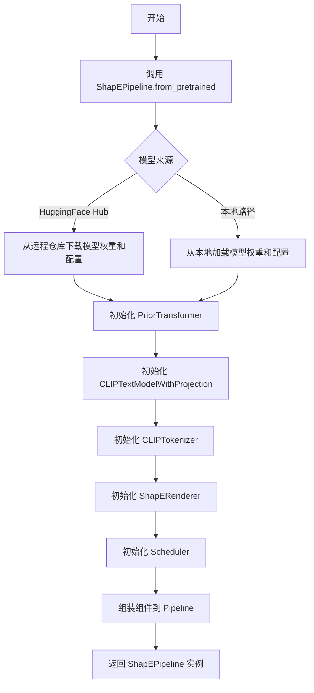

#### 带注释源码

```python
# 从 HuggingFace Hub 或本地路径加载预训练模型
pipe = ShapEPipeline.from_pretrained("openai/shap-e")

# 将 Pipeline 移动到指定设备（如 CUDA）
pipe = pipe.to(torch_device)

# 可选：禁用进度条
pipe.set_progress_bar_config(disable=None)

# 准备随机数生成器，确保可复现性
generator = torch.Generator(device=torch_device).manual_seed(0)

# 调用 Pipeline 进行推理
# 参数说明：
# - "a shark": 输入提示词
# - generator: 随机数生成器
# - guidance_scale: 引导强度 (15.0)
# - num_inference_steps: 推理步数 (64)
# - frame_size: 输出帧大小 (64)
# - output_type: 输出类型 ("np" 返回 numpy 数组)
images = pipe(
    "a shark",
    generator=generator,
    guidance_scale=15.0,
    num_inference_steps=64,
    frame_size=64,
    output_type="np",
).images[0]

# 最终输出形状: (20, 64, 64, 3) - 20帧 64x64 RGB 图像
```


### `torch.manual_seed`

这是 PyTorch 库中的一个全局函数，用于设置 CPU 和 CUDA（如果可用）的随机种子，以确保结果的可复现性。

参数：

-  `seed`：`int`，随机种子值，用于初始化随机数生成器

返回值：`None`，无返回值

#### 流程图

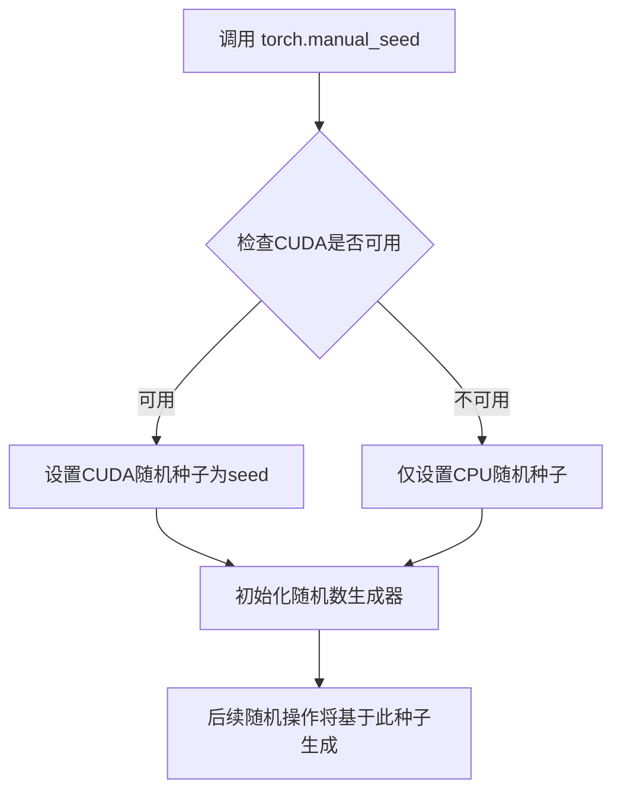

#### 带注释源码

```python
# 使用示例 1：在 dummy_text_encoder 属性方法中
torch.manual_seed(0)  # 设置固定种子0，确保每次创建相同的文本编码器权重初始化

# 使用示例 2：在 dummy_prior 属性方法中  
torch.manual_seed(0)  # 设置固定种子0，确保先验Transformer模型权重初始化可复现

# 使用示例 3：在 dummy_renderer 属性方法中
torch.manual_seed(0)  # 设置固定种子0，确保Shap-E渲染器权重初始化可复现

# 使用示例 4：在 get_dummy_inputs 方法中
if str(device).startswith("mps"):
    generator = torch.manual_seed(seed)  # 对于MPS设备，使用manual_seed创建生成器
else:
    generator = torch.Generator(device=device).manual_seed(seed)  # 对于其他设备，使用Generator的manual_seed方法
```

#### 详细说明

| 调用位置 | 种子值 | 目的 |
|---------|-------|------|
| `dummy_text_encoder` | `0` | 确保文本编码器模型在测试中具有确定性初始化 |
| `dummy_prior` | `0` | 确保先验Transformer模型在测试中具有确定性初始化 |
| `dummy_renderer` | `0` | 确保渲染器模型在测试中具有确定性初始化 |
| `get_dummy_inputs` | `seed`参数（默认0） | 确保生成的随机数（如噪声）在测试中可复现 |

**设计目的**：在单元测试中通过固定随机种子，确保测试结果的一致性和可复现性，避免由于随机性导致的测试 flaky 问题。


### `ShapEPipeline.set_progress_bar_config`

该方法用于配置管道计算过程中的进度条（progress bar）显示行为，允许用户控制是否显示或禁用进度条。

参数：

- `disable`：`bool | None`，控制进度条的禁用状态。传入 `True` 时完全禁用进度条，传入 `False` 时强制显示进度条，传入 `None` 时保持默认行为（通常为显示进度条）

返回值：`None`，该方法直接修改管道内部状态，不返回任何值

#### 流程图

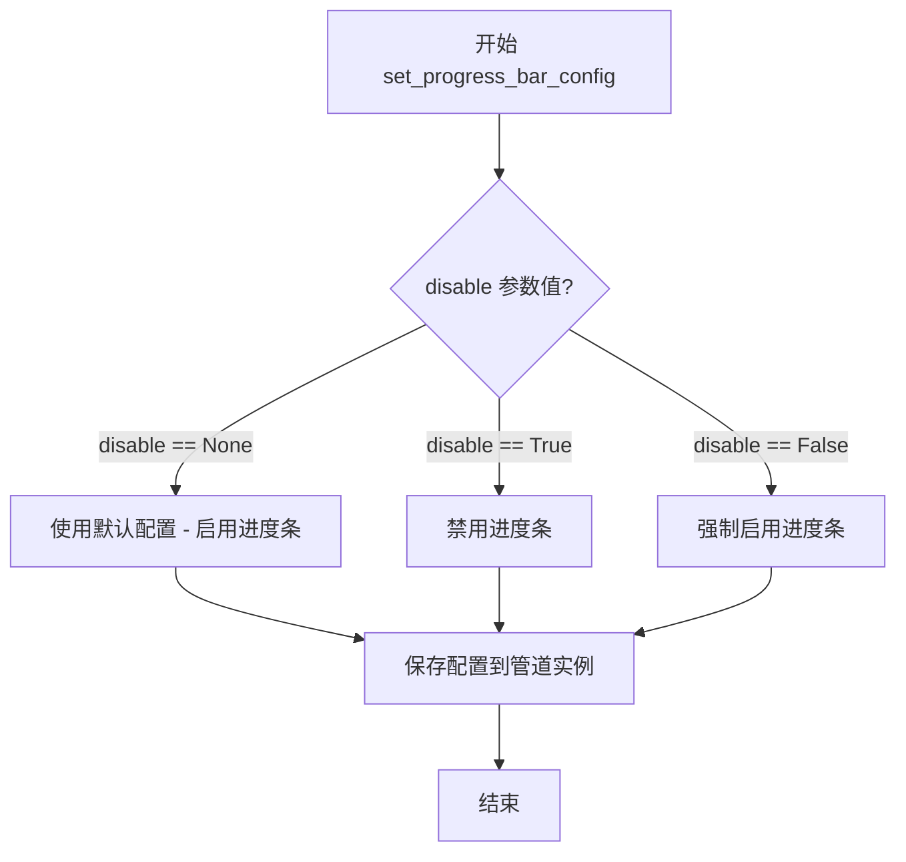

#### 带注释源码

```python
def set_progress_bar_config(self, disable: Optional[bool] = None):
    """
    配置管道运行时的进度条显示行为
    
    参数:
        disable: 控制进度条是否禁用
            - True: 完全禁用进度条
            - False: 强制显示进度条
            - None: 使用库的默认行为（通常为显示）
    """
    # 此方法通常会将配置存储在管道对象的内部属性中
    # 例如: self._progress_bar_disabled = disable
    
    # 底层可能还会配置相关的调度器(scheduler)的进度条
    # 例如: self.scheduler.set_progress_bar_config(disable=disable)
    
    # 如果存在UNet或其他组件，也可能递归配置它们
    # 例如: self.unet.set_progress_bar_config(disable=disable)
    
    pass  # 具体实现位于 diffusers 库的 Pipeline 基类中
```

> **注意**：该方法的完整实现位于 `diffusers` 库的 `Pipeline` 基类中（`diffusers.pipelines.pipeline_utils.Pipeline` 或类似位置），当前测试文件通过继承关系调用此方法。源码注释基于常见的实现模式推断。


### `load_numpy`

该函数用于从指定的 URL 或文件路径加载 NumPy 数组。在代码中，它用于加载预存的测试图像数据，以便与管道输出的图像进行像素级对比测试。

参数：

- `url_or_path`：`str`，要加载的 NumPy 文件的 URL 或本地文件路径

返回值：`np.ndarray`，从文件或 URL 加载的 NumPy 数组

#### 流程图

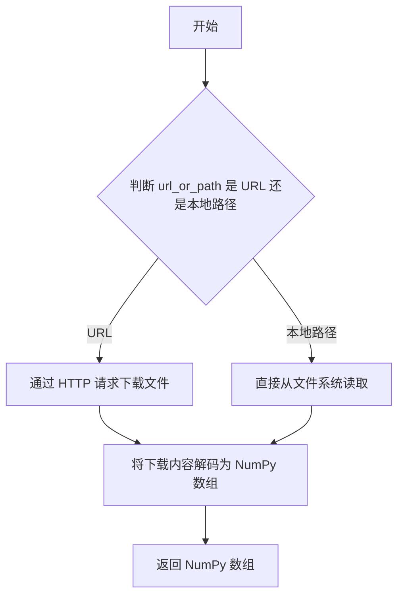

#### 带注释源码

```
# 注意: 该函数实现在 testing_utils 模块中, 此处展示调用方代码
# 以下是函数调用示例:

expected_image = load_numpy(
    "https://huggingface.co/datasets/hf-internal-testing/diffusers-images/resolve/main"
    "/shap_e/test_shap_e_np_out.npy"
)

# 函数返回的 expected_image 是一个形状为 (20, 64, 64, 3) 的 numpy 数组
# 表示 20 帧 64x64 RGB 图像, 用于与管道生成的图像进行像素差异对比
```

> **注**：由于 `load_numpy` 函数是从 `...testing_utils` 模块导入的，其完整源代码未在此文件中提供。以上信息是基于其使用方式和导入声明推断得出的。


### `backend_empty_cache`

清理 GPU/后端显存缓存，释放 VRAM 以避免显存溢出。

参数：

- `device`：`str` 或 `torch.device`，指定要清理缓存的设备（通常为 GPU 设备，如 `"cuda"` 或 `"cuda:0"`）

返回值：`None`，无返回值

#### 流程图

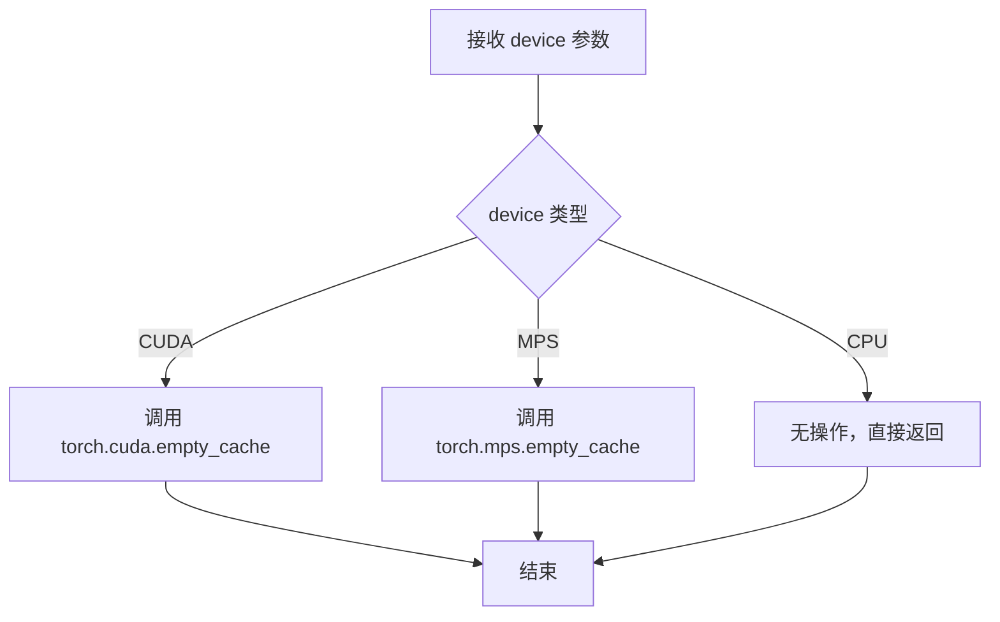

#### 带注释源码

```python
# 该函数定义于 testing_utils 模块中（源码未在当前文件中给出）
# 根据调用场景和标准库惯例，推断实现如下：

def backend_empty_cache(device):
    """
    清理指定设备的后端显存缓存。
    
    参数:
        device: 目标设备标识符，通常为 torch_device（如 'cuda', 'cuda:0', 'mps'）
    
    返回:
        None
    """
    import torch
    
    # 如果是 CUDA 设备，清理 CUDA 缓存
    if device and 'cuda' in str(device):
        torch.cuda.empty_cache()
    
    # 如果是 Apple MPS 设备，清理 MPS 缓存
    elif device and str(device).startswith('mps'):
        torch.mps.empty_cache()
    
    # CPU 设备无需清理缓存
    else:
        pass
```

---

**备注**：由于 `backend_empty_cache` 是从 `...testing_utils` 模块导入的，其完整源码未包含在当前文件中。上述源码为基于调用方式的合理推断。实际实现可能包含更多设备类型的支持或平台适配逻辑。


### `assert_mean_pixel_difference`

该函数是一个测试辅助函数，用于验证模型生成的图像与预期图像之间的像素差异是否在可接受的范围内。它通过计算两张图像的平均像素差异并进行断言，确保生成图像的质量符合预期。

参数：

-  `images`：`numpy.ndarray`，模型生成的图像数据，通常是管道输出的图像
-  `expected_image`：`numpy.ndarray`，预期的参考图像数据，用于对比验证

返回值：`None`，该函数是一个断言函数，通过抛出异常来表示测试失败，不返回任何值

#### 流程图

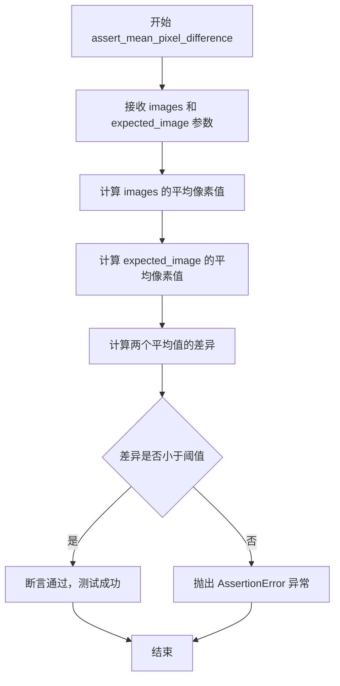

#### 带注释源码

```
# 该函数定义位于 test_pipelines_common 模块中
# 当前文件中通过以下方式导入：
# from ..test_pipelines_common import PipelineTesterMixin, assert_mean_pixel_difference

# 函数调用示例（来自代码第213行）：
# assert_mean_pixel_difference(images, expected_image)

# 参数说明：
# - images: 模型生成的图像，类型为 numpy.ndarray，形状为 (H, W, C) 或 (N, H, W, C)
# - expected_image: 预期的参考图像，用于对比验证，类型为 numpy.ndarray

# 返回值：
# - 该函数为断言函数，不返回值
# - 如果像素差异超过阈值，抛出 AssertionError
# - 如果像素差异在允许范围内，测试通过

# 函数功能：
# 1. 计算两张图像的平均像素差异
# 2. 将差异与预设阈值进行比较
# 3. 如果差异过大，则断言失败并抛出异常
# 4. 确保模型输出的图像质量符合预期标准

# 典型阈值设置（基于代码上下文推断）：
# - 使用 np.abs 计算绝对差异
# - 使用 .max() 获取最大差异值
# - 阈值通常设置为 1e-2 到 5e-1 之间的值，具体取决于测试精度要求
```


### `ShapEPipelineFastTests.get_dummy_components`

该函数用于创建 ShapEPipeline 测试所需的虚拟（dummy）组件，包括 prior 模型、text_encoder、tokenizer、shap_e_renderer 渲染器和调度器，以便在无需加载真实预训练模型的情况下进行单元测试。

参数：

- `self`：类的实例，隐式参数，用于访问类的其他属性方法

返回值：`dict`，返回包含 prior、text_encoder、tokenizer、shap_e_renderer、scheduler 等关键组件的字典，用于初始化 ShapEPipeline

#### 流程图

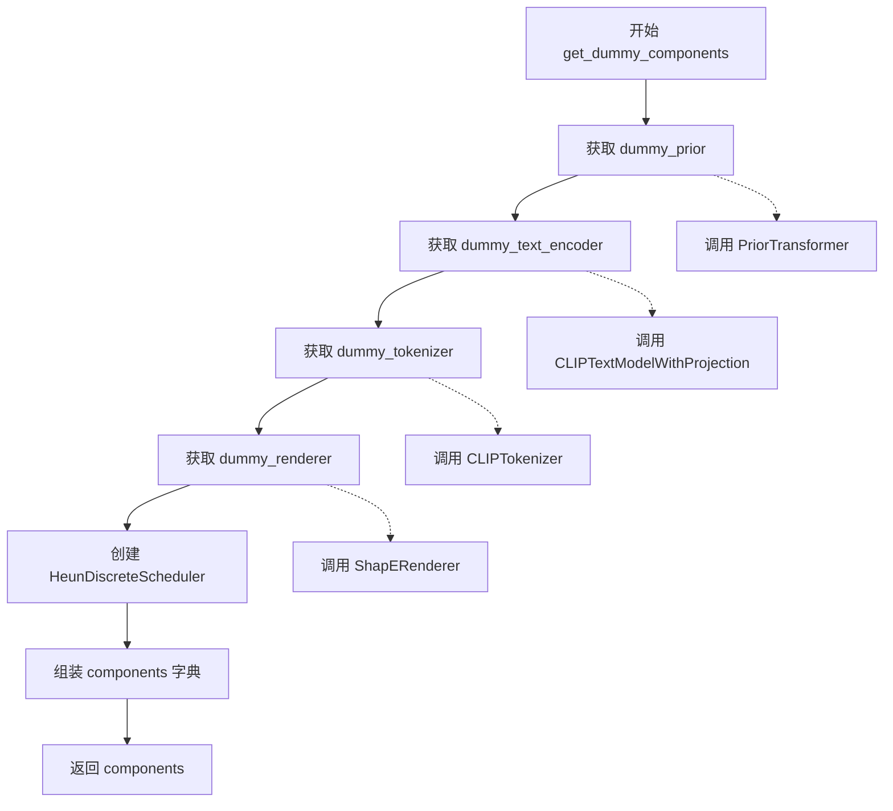

#### 带注释源码

```python
def get_dummy_components(self):
    """创建用于测试的虚拟组件"""
    
    # 获取虚拟的 PriorTransformer 模型
    # 用于处理文本嵌入并生成潜在表示
    prior = self.dummy_prior
    
    # 获取虚拟的 CLIP 文本编码器
    # 用于将文本提示转换为嵌入向量
    text_encoder = self.dummy_text_encoder
    
    # 获取虚拟的 CLIP tokenizer
    # 用于将文本分词为 token ID
    tokenizer = self.dummy_tokenizer
    
    # 获取虚拟的 ShapE 渲染器
    # 用于将潜在表示渲染为 3D 图像/视频帧
    shap_e_renderer = self.dummy_renderer

    # 创建 Heun 离散调度器
    # 用于控制扩散过程中的噪声调度
    scheduler = HeunDiscreteScheduler(
        beta_schedule="exp",          # 使用指数 beta 调度
        num_train_timesteps=1024,     # 训练时间步数
        prediction_type="sample",     # 预测类型为样本
        use_karras_sigmas=True,       # 使用 Karras sigma
        clip_sample=True,             # 启用样本裁剪
        clip_sample_range=1.0,        # 裁剪范围
    )
    
    # 组装所有组件到字典中
    components = {
        "prior": prior,               # Prior 变换器模型
        "text_encoder": text_encoder, # 文本编码器
        "tokenizer": tokenizer,       # 分词器
        "shap_e_renderer": shap_e_renderer, # 3D 渲染器
        "scheduler": scheduler,       # 噪声调度器
    }

    # 返回组件字典，供 pipeline 初始化使用
    return components
```


### `ShapEPipelineFastTests.get_dummy_inputs`

该方法生成用于测试ShapEPipeline的虚拟输入参数字典，包含提示词、生成器、推理步骤数、帧大小和输出类型等关键配置，用于单元测试中的pipeline推理调用。

参数：

- `device`：`str`，目标设备字符串，用于创建torch生成器（如"cpu"、"cuda"等）
- `seed`：`int`，随机种子，默认为0，用于确保测试结果的可重复性

返回值：`dict`，包含虚拟输入参数的字典，键值包括prompt、generator、num_inference_steps、frame_size和output_type

#### 流程图

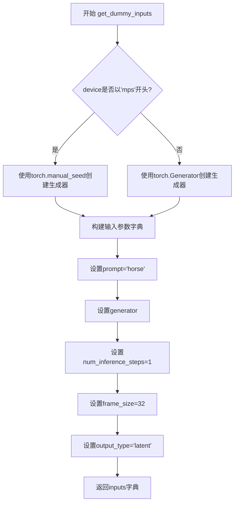

#### 带注释源码

```python
def get_dummy_inputs(self, device, seed=0):
    """
    生成虚拟输入参数，用于测试ShapEPipeline的推理功能。
    
    参数:
        device: 目标设备字符串，用于确定生成器的创建方式
        seed: 随机种子，默认值为0，确保测试结果可复现
    
    返回:
        包含虚拟输入参数的字典
    """
    # 针对Apple MPS设备特殊处理，使用torch.manual_seed
    if str(device).startswith("mps"):
        generator = torch.manual_seed(seed)
    # 其他设备使用torch.Generator创建随机生成器
    else:
        generator = torch.Generator(device=device).manual_seed(seed)
    
    # 构建输入参数字典
    inputs = {
        "prompt": "horse",                          # 测试用提示词
        "generator": generator,                     # 随机生成器对象
        "num_inference_steps": 1,                   # 推理步数（最小值加快测试）
        "frame_size": 32,                           # 输出帧尺寸
        "output_type": "latent",                    # 输出类型为latent
    }
    return inputs
```


### `ShapEPipelineFastTests.test_shap_e`

这是一个单元测试方法，用于验证 ShapEPipeline 在 CPU 设备上的基本推理功能是否正常，通过使用虚拟组件（dummy components）进行端到端测试，并验证输出图像的形状和像素值是否与预期一致。

参数：
- `self`：隐式参数，测试类实例本身

返回值：`None`，该方法没有显式返回值，通过断言进行验证

#### 流程图

```mermaid
flowchart TD
    A[开始测试 test_shap_e] --> B[设置设备为 CPU]
    B --> C[获取虚拟组件: get_dummy_components]
    C --> D[使用虚拟组件实例化 ShapEPipeline]
    D --> E[将管道移至 CPU 设备]
    E --> F[设置进度条配置: disable=None]
    F --> G[获取虚拟输入: get_dummy_inputs]
    G --> H[执行管道推理: pipe(**inputs)]
    H --> I[从输出中提取图像: output.images[0]]
    I --> J[将图像转换为 NumPy 数组]
    J --> K[提取图像右下角 3x3 区域]
    K --> L{断言图像形状是否为 (32, 16)}
    L -->|是| M[定义预期像素值切片]
    L -->|否| N[测试失败]
    M --> O{断言像素差异是否 < 1e-2}
    O -->|是| P[测试通过]
    O -->|否| N
```

#### 带注释源码

```python
def test_shap_e(self):
    """
    测试 ShapEPipeline 在 CPU 设备上的基本推理功能。
    使用虚拟组件进行端到端测试，验证输出图像的形状和像素值。
    """
    # 1. 设置测试设备为 CPU
    device = "cpu"

    # 2. 获取虚拟组件（包含虚拟 prior、text_encoder、tokenizer、renderer、scheduler）
    components = self.get_dummy_components()

    # 3. 使用虚拟组件实例化 ShapEPipeline 管道
    pipe = self.pipeline_class(**components)
    
    # 4. 将管道移至 CPU 设备
    pipe = pipe.to(device)

    # 5. 设置进度条配置（disable=None 表示不禁用进度条）
    pipe.set_progress_bar_config(disable=None)

    # 6. 获取虚拟输入参数（包含 prompt、generator、num_inference_steps 等）
    output = pipe(**self.get_dummy_inputs(device))
    
    # 7. 从管道输出中获取生成的图像（第一张）
    image = output.images[0]
    
    # 8. 将图像从张量转换为 NumPy 数组
    image = image.cpu().numpy()
    
    # 9. 提取图像右下角 3x3 区域用于验证
    image_slice = image[-3:, -3:]

    # 10. 断言：验证输出图像的形状是否为 (32, 16)
    assert image.shape == (32, 16)

    # 11. 定义预期的像素值切片
    expected_slice = np.array(
        [-1.0000, -0.6559, 1.0000, -0.9096, -0.7252, 0.8211, -0.7647, -0.3308, 0.6462]
    )
    
    # 12. 断言：验证实际像素值与预期值的最大差异是否小于阈值 1e-2
    assert np.abs(image_slice.flatten() - expected_slice).max() < 1e-2
```


### `ShapEPipelineFastTests.test_inference_batch_consistent`

该测试方法用于验证ShapEPipeline在不同批次大小（batch size）下的推理结果一致性，确保批量推理与逐个推理产生相同的结果。

参数：

- `self`：`ShapEPipelineFastTests`，测试类实例本身，无需显式传递

返回值：`None`，测试方法无返回值，通过断言验证推理一致性

#### 流程图

```mermaid
flowchart TD
    A[开始 test_inference_batch_consistent] --> B[调用 _test_inference_batch_consistent 方法]
    B --> C[传入 batch_sizes=[1, 2]]
    C --> D[验证 batch_size=1 和 batch_size=2 的推理结果一致性]
    D --> E[结束测试]
    
    subgraph _test_inference_batch_consistent
        F[对每个 batch_size 执行推理] --> G[比较批量推理与单个推理的结果]
        G --> H{结果是否一致}
        H -->|是| I[断言通过]
        H -->|否| J[断言失败]
    end
```

#### 带注释源码

```python
def test_inference_batch_consistent(self):
    # 说明：较大的批次大小会导致此测试超时，因此只测试较小的批次
    # 调用父类/混入类的 _test_inference_batch_consistent 方法
    # 测试 batch_size=1 和 batch_size=2 两种情况下的推理一致性
    self._test_inference_batch_consistent(batch_sizes=[1, 2])
```


### `ShapEPipelineFastTests.test_inference_batch_single_identical`

该方法是 `ShapEPipelineFastTests` 类的测试方法，用于验证在使用不同批次大小时，单个推理结果与批次推理结果的一致性。它通过调用父类 `PipelineTesterMixin` 的 `_test_inference_batch_single_identical` 方法来实现，测试批大小为2的场景，并设置预期最大差异阈值为 6e-3。

参数：

- `self`：隐式参数，表示 `ShapEPipelineFastTests` 类的实例对象

返回值：无直接返回值（`None`），该方法为 `unittest.TestCase` 的测试方法，通过内部断言验证推理一致性

#### 流程图

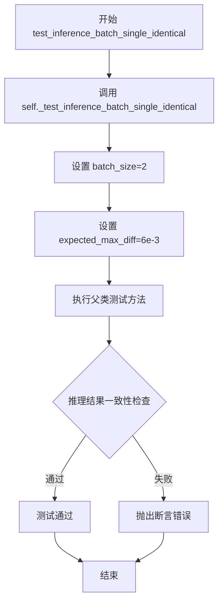

#### 带注释源码

```python
def test_inference_batch_single_identical(self):
    """
    测试推理批次单次一致性。
    
    该方法验证当使用单个提示词和批次提示词时，管道输出的结果应该一致。
    通过调用父类 PipelineTesterMixin 的 _test_inference_batch_single_identical 方法实现。
    
    参数:
        self: ShapEPipelineFastTests 实例本身
    
    返回:
        None: 测试方法，通过内部断言验证，不返回结果
    
    异常:
        AssertionError: 如果批次推理结果与单次推理结果的差异超过 expected_max_diff 阈值
    """
    # 调用父类 PipelineTesterMixin 的方法进行批次一致性测试
    # batch_size=2: 使用2个样本的批次进行测试
    # expected_max_diff=6e-3: 允许的最大差异值为0.006
    self._test_inference_batch_single_identical(batch_size=2, expected_max_diff=6e-3)
```

#### 父类方法参考信息

由于 `_test_inference_batch_single_identical` 方法定义在 `PipelineTesterMixin` 类中（未在此文件中显示），根据方法名和参数推断：

- **参数**：
  - `batch_size`：整数，测试使用的批次大小（此处为2）
  - `expected_max_diff`：浮点数，允许的最大差异阈值（此处为0.006）

- **返回值**：无直接返回值，通过内部断言验证推理一致性

- **功能**：该测试确保在使用 `num_images_per_prompt=1` 时，单个提示词和批次提示词（2个相同提示词）产生的推理结果在数值上接近，差异不超过 `expected_max_diff`。


### `ShapEPipelineFastTests.test_num_images_per_prompt`

这是一个单元测试方法，用于验证当指定 `num_images_per_prompt` 参数时，ShapEPipeline 返回的图像数量是否正确（应为 batch_size * num_images_per_prompt）。

参数：

- 无显式参数（使用 `self` 访问类属性和方法）

返回值：`无返回值`（测试方法，使用 assert 断言验证图像数量）

#### 流程图

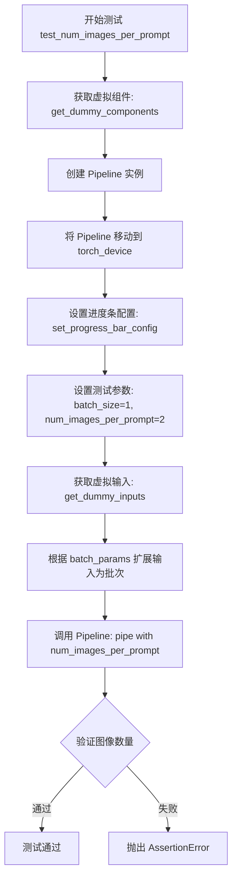

#### 带注释源码

```python
def test_num_images_per_prompt(self):
    """测试 num_images_per_prompt 参数是否正确控制输出图像数量"""
    
    # 步骤1: 获取虚拟组件（包含 mock 的 prior, text_encoder, tokenizer, renderer, scheduler）
    components = self.get_dummy_components()
    
    # 步骤2: 使用虚拟组件实例化 ShapEPipeline
    pipe = self.pipeline_class(**components)
    
    # 步骤3: 将 pipeline 移动到测试设备（如 CPU 或 CUDA）
    pipe = pipe.to(torch_device)
    
    # 步骤4: 配置进度条（disable=None 表示不禁用）
    pipe.set_progress_bar_config(disable=None)

    # 步骤5: 定义测试参数
    batch_size = 1  # 提示词的批次大小
    num_images_per_prompt = 2  # 每个提示词生成的图像数量

    # 步骤6: 获取虚拟输入（包含 prompt, generator, num_inference_steps, frame_size, output_type）
    inputs = self.get_dummy_inputs(torch_device)

    # 步骤7: 根据 batch_params 将输入扩展为批次
    # 遍历 inputs 中的每个键，如果该键在 batch_params 中，则扩展为 batch_size 份
    for key in inputs.keys():
        if key in self.batch_params:
            inputs[key] = batch_size * [inputs[key]]

    # 步骤8: 调用 pipeline 进行推理，传入 num_images_per_prompt 参数
    # 返回值是一个元组，第一项是图像列表
    images = pipe(**inputs, num_images_per_prompt=num_images_per_prompt)[0]

    # 步骤9: 断言验证输出的图像数量是否正确
    # 期望数量 = batch_size * num_images_per_prompt = 1 * 2 = 2
    assert images.shape[0] == batch_size * num_images_per_prompt
```


### `ShapEPipelineFastTests.test_float16_inference`

这是一个测试方法，用于验证 ShapEPipeline 在 float16（半精度）推理模式下的正确性，通过调用父类的 float16 推理测试并指定允许的最大误差阈值。

参数：

- `self`：实例本身，无需显式传递

返回值：`None`，无返回值（测试方法）

#### 流程图

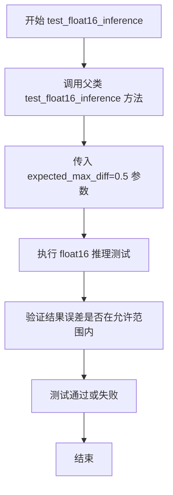

#### 带注释源码

```python
def test_float16_inference(self):
    """
    测试 ShapEPipeline 在 float16（半精度）推理模式下的正确性。
    
    该方法继承自 PipelineTesterMixin，通过调用父类的测试方法来验证：
    1. 管道可以在 float16 模式下正常运行
    2. 推理结果与 float32 模式的差异在可接受范围内（expected_max_diff=0.5）
    
    参数:
        self: ShapEPipelineFastTests 实例
    
    返回:
        None: 测试方法，不返回任何值
    
    注意:
        - 继承自 PipelineTesterMixin 的测试框架
        - expected_max_diff=5e-1 (0.5) 是允许的最大差异阈值
        - 该测试确保半精度推理不会导致结果严重偏离全精度推理
    """
    super().test_float16_inference(expected_max_diff=5e-1)
```


### `ShapEPipelineFastTests.test_save_load_local`

该测试方法用于验证ShapEPipeline在本地保存和加载后的一致性，通过调用父类的test_save_load_local方法并设置期望的最大差异阈值为5e-3，确保保存的模型参数与加载后的参数之间的差异在可接受范围内。

参数：

- `self`：`ShapEPipelineFastTests`，表示测试类实例本身，用于访问类的属性和方法

返回值：`None`，该方法为unittest测试方法，通过断言验证结果，不返回具体数值

#### 流程图

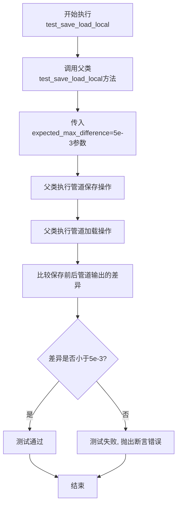

#### 带注释源码

```python
def test_save_load_local(self):
    """
    测试ShapEPipeline在本地保存和加载后的一致性。
    
    该测试方法继承自PipelineTesterMixin，通过调用父类的test_save_load_local
    方法来验证：
    1. 管道可以成功保存到本地
    2. 管道可以从本地成功加载
    3. 加载后的管道输出与原始管道输出的差异在指定阈值内
    
    Returns:
        None: 该方法为unittest测试方法，通过断言验证结果
        
    Raises:
        AssertionError: 当保存加载后的管道输出与原始输出差异超过阈值时抛出
    """
    # 调用父类(PipelineTesterMixin)的test_save_load_local方法
    # expected_max_difference=5e-3 表示允许的最大差异阈值
    super().test_save_load_local(expected_max_difference=5e-3)
```


### `ShapEPipelineFastTests.test_sequential_cpu_offload_forward_pass`

这是一个被 `@unittest.skip` 装饰器禁用的测试方法，用于测试管道在 CPU 卸载模式下的顺序前向传播能力。目前该测试因与 `accelerate` 库相关的 KeyError 已知问题而被跳过，方法体未包含实际验证逻辑。

参数：

- `self`：`ShapEPipelineFastTests`，调用该方法的类实例本身。

返回值：`None`，该方法没有显式返回值，通常用于 `unittest` 框架执行测试逻辑。

#### 流程图

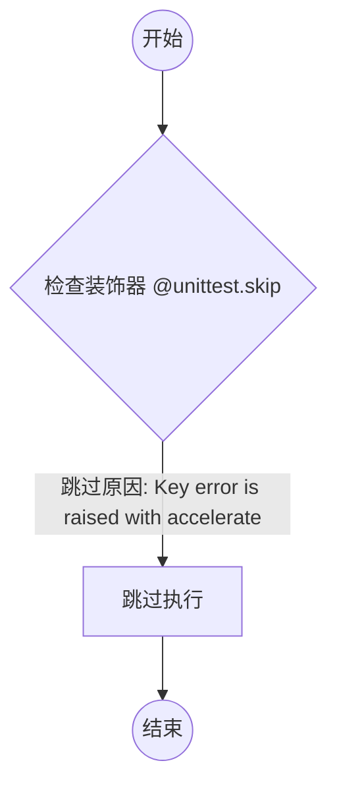

#### 带注释源码

```python
@unittest.skip("Key error is raised with accelerate")
def test_sequential_cpu_offload_forward_pass(self):
    """
    测试在启用 CPU 卸载（CPU offload）的情况下，管道的顺序前向传递是否正常工作。
    此测试目前被跳过，因为运行时会抛出 KeyError。
    """
    pass
```


### `ShapEPipelineIntegrationTests.setUp`

该方法为集成测试的初始化方法，在每个测试用例运行前执行，用于清理VRAM缓存以确保测试环境的内存状态干净。

参数：

- `self`：`ShapEPipelineIntegrationTests`，测试类实例本身，代表当前测试用例对象

返回值：`None`，该方法仅执行清理操作，不返回任何值

#### 流程图

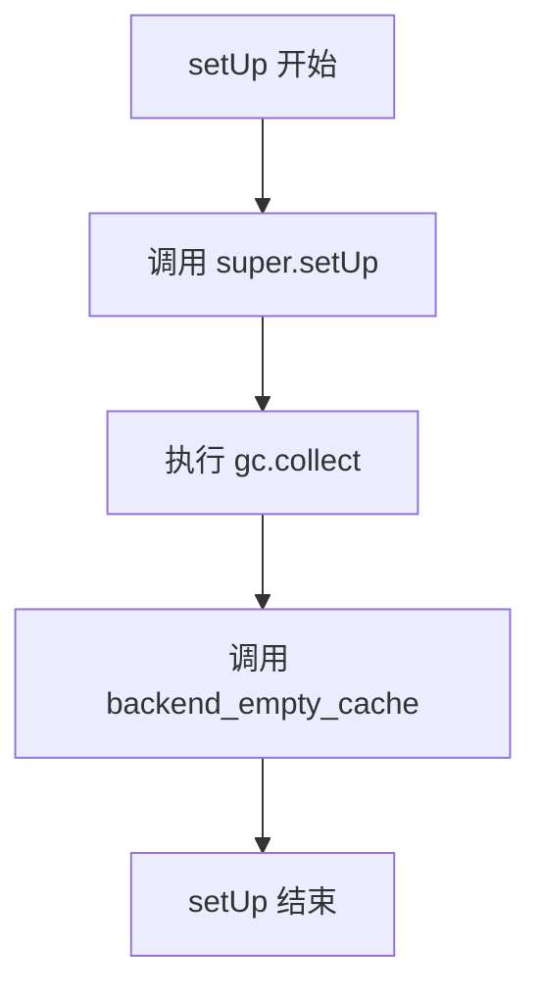

#### 带注释源码

```python
def setUp(self):
    # clean up the VRAM before each test
    # 在每个测试开始前清理VRAM，释放GPU内存
    super().setUp()
    # 调用父类的 setUp 方法，确保 unittest.TestCase 的标准初始化流程完成
    
    gc.collect()
    # 执行 Python 的垃圾回收，清理不再使用的对象
    
    backend_empty_cache(torch_device)
    # 调用后端特定的缓存清理函数，清理 GPU/TPU 等后端的显存缓存
    # torch_device 是测试工具函数提供的设备标识符
```


### `ShapEPipelineIntegrationTests.tearDown`

该方法是 `ShapEPipelineIntegrationTests` 集成测试类的清理方法，在每个测试用例执行完成后被调用，用于释放 GPU 显存资源，确保测试环境干净，防止显存泄漏影响后续测试。

参数：
- 该方法无显式参数（`self` 为隐式参数，表示测试类实例本身）

返回值：`None`，无返回值

#### 流程图

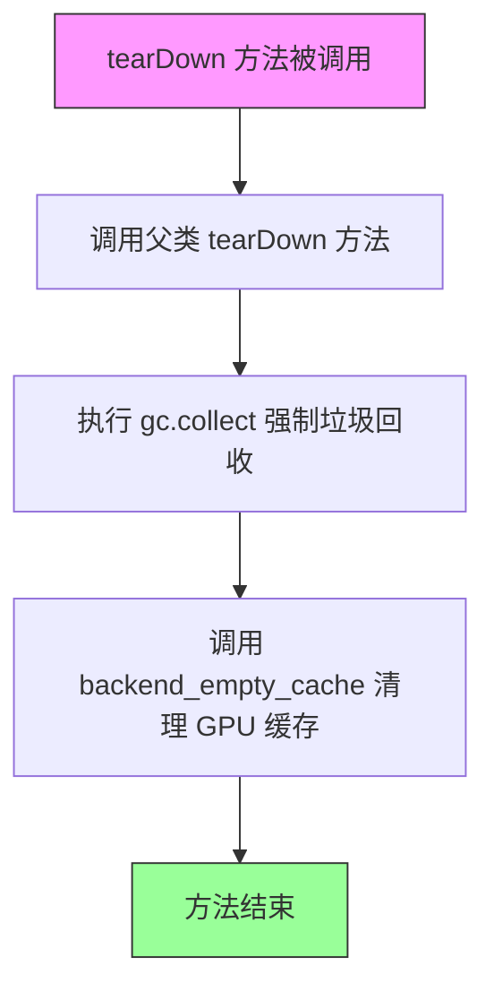

#### 带注释源码

```python
def tearDown(self):
    # clean up the VRAM after each test
    # 清理每个测试执行后的 VRAM（显存）
    
    super().tearDown()
    # 调用 unittest.TestCase 的父类 tearDown 方法
    # 执行标准的测试清理逻辑
    
    gc.collect()
    # 强制 Python 垃圾回收器运行
    # 回收不再使用的对象，释放内存
    
    backend_empty_cache(torch_device)
    # 调用后端特定的缓存清理函数
    # 清理 GPU/CUDA 显存缓存，释放显存资源
    # torch_device 定义在 testing_utils 中，通常为 'cuda' 或 'cpu'
```


### `ShapEPipelineIntegrationTests.test_shap_e`

这是一个集成测试方法，用于验证 ShapEPipeline 在使用真实预训练模型 "openai/shap-e" 进行推理时的正确性。测试通过比较生成的图像与预期图像的像素差异来确保管道的功能正常。

参数：

- `self`：隐式参数，测试类实例本身

返回值：无（`None`），该方法为测试用例，使用断言进行验证，不返回任何值

#### 流程图

```mermaid
flowchart TD
    A[开始测试] --> B[加载期望图像数据 load_numpy]
    B --> C[从预训练模型 'openai/shap-e' 创建 ShapEPipeline]
    C --> D[将管道移动到 torch_device]
    D --> E[设置进度条配置 disable=None]
    E --> F[创建随机数生成器 generator]
    F --> G[调用管道生成图像: pipe prompt='a shark']
    G --> H[获取生成的图像 images[0]]
    H --> I{断言图像形状 == (20, 64, 64, 3)}
    I --> J[断言像素差异在允许范围内]
    J --> K[测试通过]
    
    style A fill:#f9f,color:#333
    style K fill:#9f9,color:#333
```

#### 带注释源码

```python
@nightly
@require_torch_accelerator
class ShapEPipelineIntegrationTests(unittest.TestCase):
    def setUp(self):
        # 清理VRAM，在每个测试之前执行
        super().setUp()
        gc.collect()
        backend_empty_cache(torch_device)

    def tearDown(self):
        # 清理VRAM，在每个测试之后执行
        super().tearDown()
        gc.collect()
        backend_empty_cache(torch_device)

    def test_shap_e(self):
        # 加载期望的图像数据（从远程URL获取的numpy数组）
        expected_image = load_numpy(
            "https://huggingface.co/datasets/hf-internal-testing/diffusers-images/resolve/main"
            "/shap_e/test_shap_e_np_out.npy"
        )
        
        # 从预训练模型 'openai/shap-e' 创建 ShapEPipeline 实例
        pipe = ShapEPipeline.from_pretrained("openai/shap-e")
        
        # 将管道移动到指定的计算设备（GPU/CPU）
        pipe = pipe.to(torch_device)
        
        # 配置进度条（disable=None 表示启用进度条）
        pipe.set_progress_bar_config(disable=None)

        # 创建随机数生成器，设置种子为0以确保可重复性
        generator = torch.Generator(device=torch_device).manual_seed(0)

        # 调用管道生成图像
        # 参数:
        #   - prompt: 输入文本提示 "a shark"
        #   - generator: 随机数生成器
        #   - guidance_scale: 引导尺度 15.0（控制生成图像与提示的相关性）
        #   - num_inference_steps: 推理步数 64
        #   - frame_size: 输出帧大小 64
        #   - output_type: 输出类型 "np"（numpy数组）
        images = pipe(
            "a shark",
            generator=generator,
            guidance_scale=15.0,
            num_inference_steps=64,
            frame_size=64,
            output_type="np",
        ).images[0]

        # 断言生成的图像形状为 (20, 64, 64, 3)
        # 20 表示帧数/图像数量，64x64 是空间分辨率，3 是RGB通道
        assert images.shape == (20, 64, 64, 3)

        # 断言生成的图像与期望图像的像素差异在允许范围内
        # 使用 assert_mean_pixel_difference 进行像素级比较
        assert_mean_pixel_difference(images, expected_image)
```

## 关键组件


### ShapEPipeline

ShapEPipeline 是用于从文本提示生成 3D 资产的深度学习管道，结合了先验 transformer、文本编码器和渲染器，在离散调度器控制下完成多步采样过程。

### CLIPTextModelWithProjection

文本编码器组件，将文本输入转换为高维嵌入向量，为后续的 3D 资产生成提供语义条件信息。

### PriorTransformer

先验 transformer 模型，负责将文本嵌入和随机噪声转换为潜在的 3D 表示，是管道的核心生成组件。

### ShapERenderer

渲染器组件，将潜在表示转换为可视化的 3D 资产输出，负责将学到的潜在特征解码为最终图像帧。

### HeunDiscreteScheduler

离散调度器，使用 Heun 方法进行噪声调度，支持 Karras sigmas 和样本裁剪，控制去噪过程的收敛速度和稳定性。

### test_shap_e

功能测试方法，验证管道能够正确生成指定尺寸（32x16）的潜在输出，并确保数值精度在预期范围内。

### test_inference_batch_consistent

批处理一致性测试，验证不同批大小下管道行为的稳定性，确保批处理不会引入不确定性结果。

### test_num_images_per_prompt

多图生成测试，验证管道能够根据 num_images_per_prompt 参数生成正确数量的输出图像。

### test_float16_inference

半精度推理测试，验证管道在 float16 模式下能够正常运行且结果差异在可接受范围内。

### get_dummy_components

组件工厂方法，创建用于测试的虚拟组件（prior、text_encoder、tokenizer、shap_e_renderer、scheduler），避免依赖预训练模型。

### get_dummy_inputs

输入工厂方法，生成符合管道接口要求的测试输入，包含提示词、随机生成器和推理参数。


## 问题及建议


### 已知问题

-   **test_sequential_cpu_offload_forward_pass 被永久跳过**：该测试因 accelerate 集成存在 KeyError 问题而被跳过，而非修复，表明 CPU offload 功能可能存在未测试的代码路径
-   **float16 推理精度问题**：test_float16_inference 设置 expected_max_diff=5e-1，容忍较大的数值差异（0.5），表明 float16 与 float32 之间存在显著精度损失
-   **批量推理超时限制**：test_inference_batch_consistent 注释指出 "Larger batch sizes cause this test to timeout"，仅测试小批量大小 [1, 2]，掩盖了大规模批处理场景的性能问题
- **MPS 设备特殊分支处理**：get_dummy_inputs 中对 MPS 设备使用不同的随机数生成方式（torch.manual_seed 而非 Generator），导致测试行为不一致，可能遗漏 MPS 平台特定问题
- **外部网络依赖**：test_shap_e 集成测试依赖加载远程 URL 的 numpy 文件（load_numpy），无网络或文件变更时测试会失败或产生误报
- **资源清理脆弱性**：tearDown 方法在测试异常终止时可能无法执行，导致 VRAM 泄漏
- **硬编码测试参数**：num_inference_steps=1、frame_size=32 等参数在多个测试中硬编码，可能无法覆盖真实使用场景

### 优化建议

-   **修复并启用 test_sequential_cpu_offload_forward_pass**：调查并修复 KeyError 问题，启用 CPU offload 测试以提高代码覆盖率
-   **优化 float16 精度**：分析 float16 推理误差来源，考虑添加数值稳定性优化或调整模型权重精度
-   **增加批量大小测试覆盖**：在 CI 环境中配置更长超时时间，测试更大批量场景（如 8、16）
-   **统一随机数生成逻辑**：对所有设备使用一致的 Generator 初始化方式，消除 MPS 平台特殊处理
-   **缓存或内联测试数据**：将外部 numpy 文件下载到测试资源目录，避免网络依赖
-   **增强资源清理**：使用 try-finally 或 pytest fixture 确保资源在测试异常时也能正确释放
-   **参数化测试用例**：使用 pytest.mark.parametrize 增加不同 num_inference_steps 和 frame_size 组合的测试覆盖

## 其它


### 设计目标与约束

本测试文件旨在验证ShapEPipeline的功能正确性，包括文本到3D模型生成的核心逻辑、批处理一致性、内存管理、模型保存加载等。测试使用unittest框架，包含快速单元测试和夜间集成测试两类。快速测试使用虚拟组件（dummy components）模拟管道依赖，无需加载真实模型权重；集成测试需要torch加速器和GPU环境，从HuggingFace Hub加载真实预训练模型"openai/shap-e"进行端到端验证。测试约束包括：禁止使用xformers注意力（test_xformers_attention=False）、批处理测试限制在较小批次以避免超时、集成测试需要GPU显存支持。

### 错误处理与异常设计

测试文件对异常处理有特定设计：test_sequential_cpu_offload_forward_pass方法被@unittest.skip装饰器跳过，原因是使用accelerate库时抛出KeyError，这表明CPU卸载功能与该管道存在兼容性问题。集成测试类ShapEPipelineIntegrationTests重写了setUp和tearDown方法，在每个测试前后执行gc.collect()和backend_empty_cache(torch_device)来清理VRAM，防止显存泄漏导致后续测试失败。测试中使用np.abs().max() < 1e-2进行浮点数近似比较，而非精确相等，以处理数值计算的不确定性。

### 数据流与状态机

测试数据流遵循固定模式：单元测试流程为get_dummy_components()获取虚拟组件字典 → 实例化pipeline_class(**components) → pipe.to(device)转移设备 → 调用pipe(**get_dummy_inputs(device))执行推理 → 验证output.images的shape和像素值。集成测试流程多一步pipe.from_pretrained("openai/shap-e")加载预训练权重。状态转换经历：组件初始化 → 设备绑定 → 推理执行 → 结果验证。批处理测试通过batch_params=["prompt"]标识批处理参数，test_num_images_per_prompt验证num_images_per_prompt参数对输出数量的缩放效应。

### 外部依赖与接口契约

本测试依赖以下外部组件：transformers库的CLIPTextConfig、CLIPTextModelWithProjection、CLIPTokenizer用于文本编码；diffusers库的HeunDiscreteScheduler调度器、PriorTransformer先验模型、ShapEPipeline主管道、ShapERenderer渲染器；numpy用于数值比较；torch用于张量操作和设备管理；testing_utils模块的load_numpy加载预期输出、backend_empty_cache清理显存、torch_device获取设备名称、require_torch_accelerator装饰器声明GPU要求、nightly装饰器标记夜间测试。接口契约方面，pipeline_class必须实现__call__方法接受prompt、generator、num_inference_steps、frame_size、output_type等参数并返回包含images属性的对象；get_dummy_components返回包含prior、text_encoder、tokenizer、shap_e_renderer、scheduler键的字典；get_dummy_inputs返回包含prompt和generator等键的字典。

### 关键组件交互关系

ShapEPipeline由四个核心组件构成协同工作流：tokenizer将文本prompt转换为token IDs → text_encoder将tokens编码为文本嵌入向量 → prior基于文本嵌入生成先验潜在表示 → shap_e_renderer将潜在表示渲染为3D图像帧。scheduler负责管理去噪过程的噪声调度，与prior迭代交互。测试通过get_dummy_components注入虚拟组件绕过真实模型，通过assert_mean_pixel_difference函数比对集成测试输出与预期numpy数组，验证整个管道的像素级准确性。

### 测试覆盖范围分析

当前测试覆盖以下场景：test_shap_e验证核心推理功能和输出shape；test_inference_batch_consistent验证不同批次大小推理一致性；test_inference_batch_single_identical验证批处理与单样本结果等价性；test_num_images_per_prompt验证批量生成数量控制；test_float16_inference验证半精度推理；test_save_load_local验证模型序列化和反序列化；集成测试test_shap_e验证真实模型端到端质量。未覆盖场景包括：不同调度器切换、文本negative_prompt引导、图像到图像管道、ControlNet条件控制、动态分辨率适配等高级功能。

    