# `diffusers\tests\pipelines\shap_e\test_shap_e_img2img.py` 详细设计文档

该文件是 Hugging Face diffusers 库中 ShapEImg2ImgPipeline 的单元测试和集成测试代码，用于验证图像到图像生成管道的功能正确性、性能和模型加载保存等场景。

## 整体流程

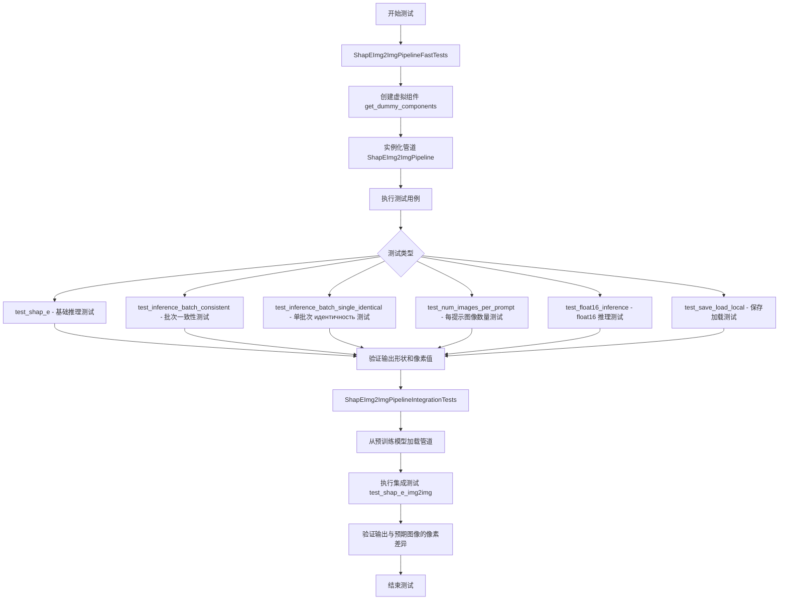

## 类结构

```
unittest.TestCase
├── ShapEImg2ImgPipelineFastTests (PipelineTesterMixin)
│   ├── text_embedder_hidden_size (property)
│   ├── time_input_dim (property)
│   ├── time_embed_dim (property)
│   ├── renderer_dim (property)
│   ├── dummy_image_encoder (property)
│   ├── dummy_image_processor (property)
│   ├── dummy_prior (property)
│   ├── dummy_renderer (property)
│   ├── get_dummy_components (method)
│   ├── get_dummy_inputs (method)
│   └── [测试方法群]
└── ShapEImg2ImgPipelineIntegrationTests (unittest.TestCase)
├── setUp (method)
└── tearDown (method)
```

## 全局变量及字段


### `ShapEImg2ImgPipelineFastTests.pipeline_class`
    
指定要测试的ShapE图像到图像pipeline类，用于单元测试

类型：`class`
    


### `ShapEImg2ImgPipelineFastTests.params`
    
定义pipeline需要的基本参数列表，这里仅包含图像参数

类型：`List[str]`
    


### `ShapEImg2ImgPipelineFastTests.batch_params`
    
定义支持批处理的基本参数列表，这里仅包含图像参数

类型：`List[str]`
    


### `ShapEImg2ImgPipelineFastTests.required_optional_params`
    
列出测试所需的Optional参数集合，包括生成器、推理步骤数等

类型：`List[str]`
    


### `ShapEImg2ImgPipelineFastTests.test_xformers_attention`
    
标志位，指示是否测试xformers的注意力机制，当前设置为False

类型：`bool`
    


### `ShapEImg2ImgPipelineFastTests.supports_dduf`
    
标志位，指示pipeline是否支持DDUF（Decode-Denoise-Upsample-Fusion），当前设置为False

类型：`bool`
    
    

## 全局函数及方法


### `gc.collect`

强制 Python 垃圾回收器运行，回收无法访问的对象并返回找到的不可达对象数量。

参数：

- （无参数）

返回值：`int`，返回此次垃圾回收过程中释放的不可达对象数量。

#### 流程图

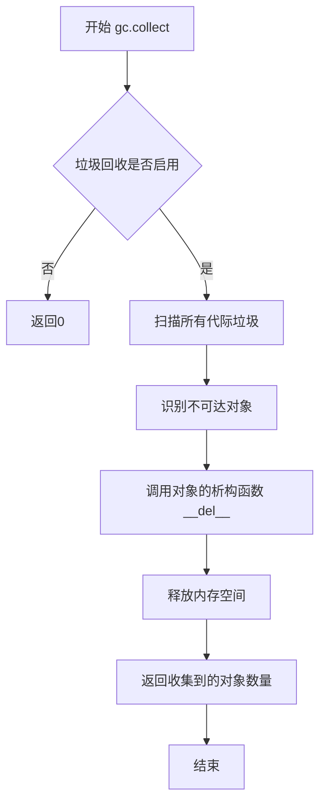

#### 带注释源码

```python
# gc.collect 是 Python 标准库 gc 模块中的函数
# 用法：import gc; gc.collect()
# 功能：强制触发垃圾回收过程

# 源代码位置：Python 解释器内部实现 (Modules/gcmodule.c)
# 以下是调用示例，展示其在测试框架中的典型用法：

def setUp(self):
    # 在每个测试前清理 VRAM
    super().setUp()
    gc.collect()                    # 强制进行垃圾回收，释放内存
    backend_empty_cache(torch_device)  # 清理 GPU 缓存

def tearDown(self):
    # 在每个测试后清理 VRAM
    super().setUp()
    gc.collect()                    # 再次强制进行垃圾回收，确保资源释放
    backend_empty_cache(torch_device)  # 清理 GPU 缓存
```


### `random.randint`

`random.randint` 是 Python 标准库 `random` 模块中的一个函数，用于在指定范围内生成随机整数（包含两端边界值）。

参数：

- `a`：`int`，随机整数的下界（包含）
- `b`：`int`，随机整数的上界（包含）

返回值：`int`，返回满足 `a <= N <= b` 的随机整数

#### 流程图

```mermaid
flowchart TD
    A[开始] --> B{检查参数有效性}
    B -->|a > b| C[抛出 ValueError]
    B -->|a <= b| D[调用 random.random 生成0-1浮点数]
    D --> E[计算整数: a + int(random * (b - a + 1))]
    E --> F[返回随机整数]
```

#### 带注释源码

```python
# random.randint 源码实现（Python 标准库中的简化版本）
def randint(self, a, b):
    """
    返回随机整数 N，满足 a <= N <= b。
    
    等价于 randrange(a, b+1)。
    """
    return self.randrange(a, b + 1)

# randrange 的核心实现
def _randrange_with_getrandbits(self, start, stop, step):
    # 省略了详细实现...
    # 1. 计算范围大小: (stop - start) // step
    # 2. 使用 getrandbits 获取足够的随机位
    # 3. 根据随机位计算偏移量
    # 4. 返回 start + offset * step
```

---

> **注意**：在提供的代码文件中，虽然导入了 `random` 模块，但并未直接调用 `random.randint` 函数。代码中使用了 `random.Random(seed)` 来创建随机数生成器实例，以及使用 `torch.manual_seed` 设置 PyTorch 的随机种子。


### `ShapEImg2ImgPipelineFastTests.test_sequential_cpu_offload_forward_pass`

该测试方法被 `@unittest.skip` 装饰器跳过，原因是"Key error is raised with accelerate"，表明在启用 accelerate 库时会抛出 KeyError 异常，因此该测试用例暂时被跳过以避免 CI/CD 失败。

参数：

- `self`：`ShapEImg2ImgPipelineFastTests`，unittest.TestCase 的实例方法标准参数，表示当前测试类实例

返回值：`None`，方法体为 `pass`，不返回任何值

#### 流程图

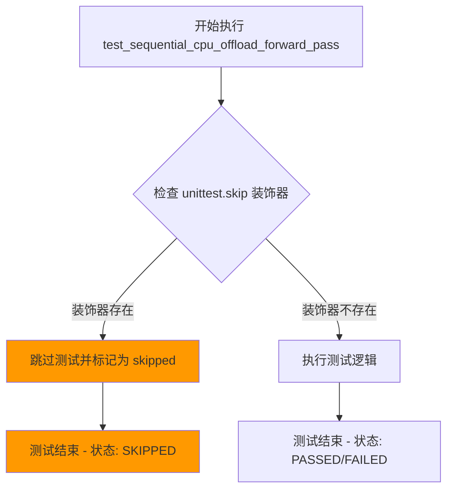

#### 带注释源码

```python
@unittest.skip("Key error is raised with accelerate")
def test_sequential_cpu_offload_forward_pass(self):
    """
    测试顺序 CPU 卸载的前向传播功能。
    
    该测试被跳过是因为在启用 accelerate 库时会出现 KeyError 异常。
    可能的原因包括：
    - accelerate 库版本兼容性问题
    - 管道组件与 accelerate 的 CPU offload 功能不兼容
    - 需要额外的配置或初始化步骤
    """
    pass
```


### `ShapEImg2ImgPipelineIntegrationTests.test_shap_e_img2img`

这是一个集成测试方法，用于验证 ShapEImg2ImgPipeline 在真实模型下的图像到图像转换功能。该测试通过加载预训练模型 "openai/shap-e-img2img"，将输入图像转换为3D资产表示，并验证输出图像的形状和像素值是否符合预期。

参数：

- `self`：unittest.TestCase 的实例方法隐含参数，无需显式传递

返回值：`None`，该方法为测试方法，通过断言验证结果，不返回具体值

#### 流程图

```mermaid
flowchart TD
    A[测试开始] --> B[加载输入图像 from URL]
    B --> C[加载期望输出图像 from URL]
    C --> D[从预训练模型创建管道: openai/shap-e-img2img]
    D --> E[将管道移动到 torch_device]
    E --> F[配置进度条显示]
    F --> G[创建随机数生成器并设置种子为 0]
    G --> H[调用管道进行推理]
    H --> I{验证输出图像形状}
    I -->|通过| J[断言形状为 (20, 64, 64, 3)]
    J --> K[使用 assert_mean_pixel_difference 验证像素差异]
    K --> L[测试通过]
    I -->|失败| M[抛出 AssertionError]
    
    style A fill:#f9f,color:#333
    style L fill:#9f9,color:#333
    style M fill:#f99,color:#333
```

#### 带注释源码

```python
@nightly
@require_torch_accelerator
class ShapEImg2ImgPipelineIntegrationTests(unittest.TestCase):
    def setUp(self):
        # 测试前置准备：清理 VRAM 内存
        # 每次测试开始前调用 gc.collect() 释放垃圾回收
        # 调用后端特定的 empty_cache 方法清理 GPU 缓存
        super().setUp()
        gc.collect()
        backend_empty_cache(torch_device)

    def tearDown(self):
        # 测试后置清理：测试完成后同样清理 VRAM
        super().tearDown()
        gc.collect()
        backend_empty_cache(torch_device)

    def test_shap_e_img2img(self):
        # 从 HuggingFace Hub 加载测试用的输入图像（柯基狗图片）
        input_image = load_image(
            "https://huggingface.co/datasets/hf-internal-testing/diffusers-images/resolve/main/shap_e/corgi.png"
        )
        
        # 加载期望的输出图像（numpy 数组格式）
        # 用于与实际输出进行像素差异比对
        expected_image = load_numpy(
            "https://huggingface.co/datasets/hf-internal-testing/diffusers-images/resolve/main"
            "/shap_e/test_shap_e_img2img_out.npy"
        )
        
        # 从预训练模型加载 ShapE img2img 管道
        # openai/shap-e-img2img 是官方预训练模型
        pipe = ShapEImg2ImgPipeline.from_pretrained("openai/shap-e-img2img")
        
        # 将管道移动到指定的计算设备（GPU/CPU）
        pipe = pipe.to(torch_device)
        
        # 配置进度条：disable=None 表示启用进度条显示
        pipe.set_progress_bar_config(disable=None)

        # 创建随机数生成器并设置固定种子
        # 确保测试结果的可复现性
        generator = torch.Generator(device=torch_device).manual_seed(0)

        # 调用管道执行图像到图像的转换推理
        # 参数说明：
        # - input_image: 输入图像
        # - generator: 随机数生成器，确保可复现
        # - guidance_scale: 引导_scale，控制文本引导强度（3.0）
        # - num_inference_steps: 推理步数（64步）
        # - frame_size: 输出帧大小（64x64）
        # - output_type: 输出类型为 numpy 数组
        images = pipe(
            input_image,
            generator=generator,
            guidance_scale=3.0,
            num_inference_steps=64,
            frame_size=64,
            output_type="np",
        ).images[0]

        # 断言输出图像形状
        # 20 表示生成的帧数/图像数量
        # 64x64 是空间分辨率
        # 3 是 RGB 通道数
        assert images.shape == (20, 64, 64, 3)

        # 验证输出图像与期望图像的像素差异
        # 使用均像素差异进行比对，允许一定的数值误差
        assert_mean_pixel_difference(images, expected_image)
```


### `require_torch_accelerator`

这是一个测试装饰器，用于标记需要PyTorch加速器（如CUDA）的测试用例。当装饰器检测到没有可用的PyTorch加速器时，会跳过被装饰的测试。

参数：

- `*args`：可变位置参数，用于传递额外的配置参数（如特定GPU版本要求）
- `**kwargs`：关键字参数，用于传递额外的配置选项（如最小GPU内存要求）

返回值：`Callable`，返回装饰后的测试函数

#### 流程图

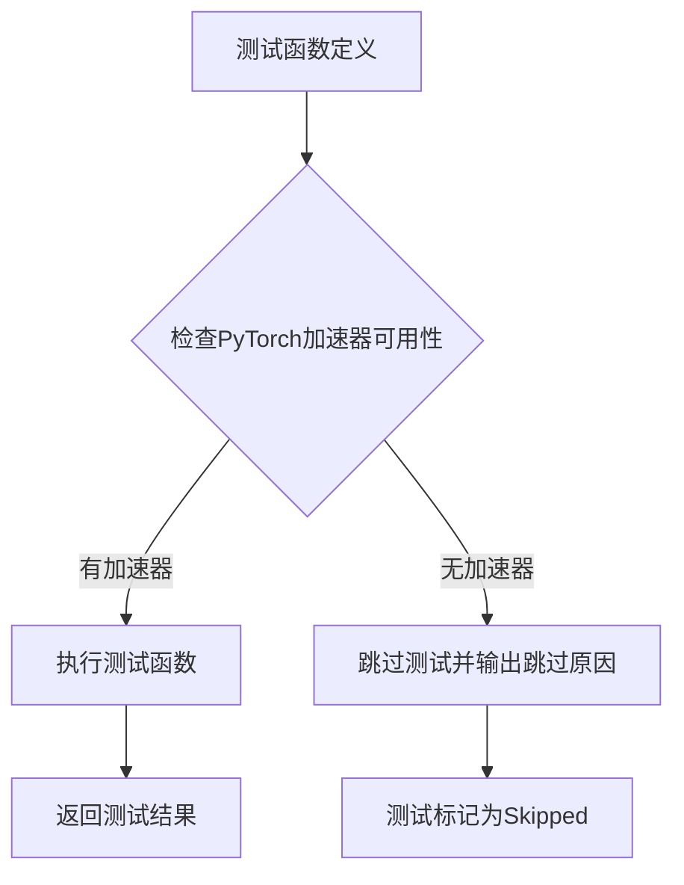

#### 带注释源码

```python
# require_torch_accelerator 是一个装饰器函数
# 位于 ...testing_utils 模块中
# 在本代码中用于装饰 ShapEImg2ImgPipelineIntegrationTests 类
# 使得该集成测试类仅在有PyTorch加速器（GPU）时运行

# 导入方式：
from ...testing_utils import require_torch_accelerator

# 使用方式：
@nightly
@require_torch_accelerator
class ShapEImg2ImgPipelineIntegrationTests(unittest.TestCase):
    """
    集成测试类，需要GPU才能运行
    包含对ShapE图像到图像管道的端到端测试
    """
    def test_shap_e_img2img(self):
        # 测试逻辑...
        pass

# 装饰器工作原理（推断）：
# 1. 检测当前环境是否有可用的CUDA设备
# 2. 如果有CUDA，返回原测试函数正常执行
# 3. 如果没有CUDA，使用unittest.skip装饰器跳过测试
# 4. 可能支持传入参数来检查特定的GPU条件（如GPU内存、CUDA版本等）
```


### `backend_empty_cache`

该函数是用于清理 GPU/硬件后端内存缓存的工具函数，主要在测试用例的 `setUp` 和 `tearDown` 方法中调用，以确保在每个测试前后清理 VRAM，防止内存泄漏。

参数：

- `device`：`str` 或 `torch.device`，指定要清理缓存的设备（如 `"cuda"`、`"cuda:0"` 或 `"mps"` 等）

返回值：`None`，无返回值

#### 流程图

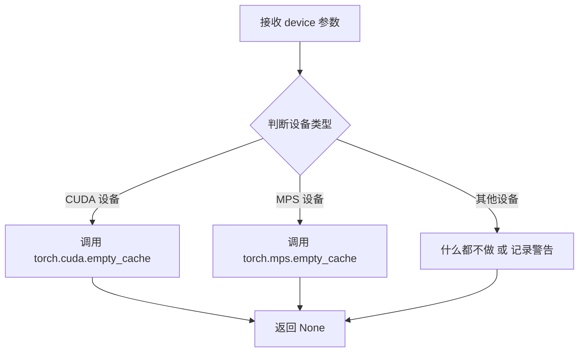

#### 带注释源码

```python
# 注意：此函数定义不在当前文件中，位于 ...testing_utils 模块中
# 以下是根据使用方式推断的函数签名和逻辑

def backend_empty_cache(device):
    """
    清理指定设备的后端缓存。
    
    参数:
        device: 目标设备标识符，如 'cuda', 'cuda:0', 'mps' 等
        
    返回值:
        None
    """
    # 根据设备类型选择对应的缓存清理方法
    if str(device).startswith('cuda'):
        # CUDA 设备：调用 PyTorch 的 CUDA 缓存清理
        torch.cuda.empty_cache()
    elif device == 'mps':
        # Apple Silicon MPS 设备：调用 Metal Performance Shaders 缓存清理
        torch.mps.empty_cache()
    # 其他设备类型暂不支持清理操作
```


### `floats_tensor`

`floats_tensor` 是一个测试工具函数，用于生成指定形状的随机浮点数张量（PyTorch Tensor），常用于单元测试中创建模拟输入数据。该函数并非在本文件中定义，而是从 `...testing_utils` 模块导入。

参数：

-  `shape`：`Tuple[int, ...]`，张量的形状，例如 `(1, 3, 32, 32)` 表示批量大小为 1、3 通道、32x32 分辨率的图像张量
-  `rng`：`random.Random`，随机数生成器实例，用于生成确定性可复现的随机数

返回值：`torch.Tensor`，包含随机浮点数值的 PyTorch 张量

#### 流程图

```mermaid
flowchart TD
    A[调用 floats_tensor] --> B[接收 shape 元组和 rng 对象]
    B --> C[使用 rng 生成指定形状的随机浮点数数组]
    C --> D[将 numpy 数组转换为 PyTorch Tensor]
    D --> E[返回 torch.Tensor 对象]
    E --> F[调用 .to(device) 迁移到指定设备]
```

#### 带注释源码

```python
# floats_tensor 函数定义不在本代码文件中
# 以下为基于使用方式的推断实现

# 使用示例（来自代码第169行）:
input_image = floats_tensor((1, 3, 32, 32), rng=random.Random(seed)).to(device)

# 参数说明:
# - (1, 3, 32, 32): shape 元组，代表 [batch_size, channels, height, width]
# - rng=random.Random(seed): 使用确定性随机种子生成器，确保测试可复现
# - .to(device): 将生成的张量移动到指定计算设备（CPU/CUDA）
```

> **注意**：该函数源码位于 `diffusers` 项目的 `testing_utils.py` 模块中，本文件通过相对导入 `from ...testing_utils import floats_tensor` 引入并使用。主要用途是在 `get_dummy_inputs` 方法中生成模拟输入图像张量，供 Pipeline 单元测试使用。


### `load_image`

从远程URL加载图像的测试工具函数，返回可用于推理的图像对象。

参数：

-  `url`：`str`，要加载的图像的远程HTTP URL地址

返回值：`PIL.Image` 或 `torch.Tensor`，加载后的图像对象

#### 流程图

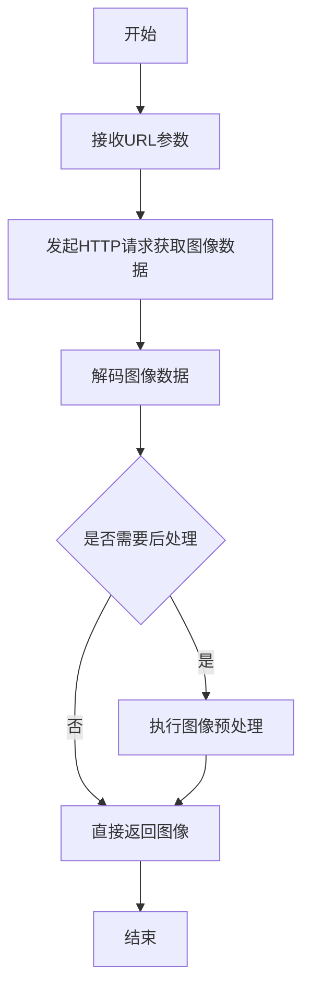

#### 带注释源码

```python
# load_image 是从 testing_utils 模块导入的外部函数
# 在当前文件中通过以下方式使用：
from ...testing_utils import load_image

# 函数调用示例：
input_image = load_image(
    "https://huggingface.co/datasets/hf-internal-testing/diffusers-images/resolve/main/shap_e/corgi.png"
)

# load_image 函数签名（基于使用方式推断）：
def load_image(url: str) -> Union[PIL.Image.Image, torch.Tensor]:
    """
    从给定的URL加载图像并返回可用的图像对象。
    
    参数:
        url: 图像的远程HTTP URL
        
    返回:
        加载后的图像对象，通常为PIL Image或torch Tensor格式
    """
    # 具体的实现位于 testing_utils 模块中
    # 此处无法看到完整源码
```

#### 备注

`load_image` 函数并非在本文件中定义，而是从 `diffusers` 包的 `testing_utils` 模块导入的测试工具函数。从代码使用方式来看：

1. **调用位置**：在 `ShapEImg2ImgPipelineIntegrationTests.test_shap_e_img2img` 方法中
2. **功能**：从 HuggingFace datasets 远程加载测试用图像
3. **外部依赖**：依赖 `testing_utils` 模块的实现


### `load_numpy`

从指定路径加载NumPy数组文件，支持本地文件路径或远程URL。

参数：

-  `url_or_path`：`str`，待加载的NumPy文件路径，可以是本地文件系统路径或远程HTTP/HTTPS URL

返回值：`numpy.ndarray`，从文件中加载的NumPy数组对象

#### 流程图

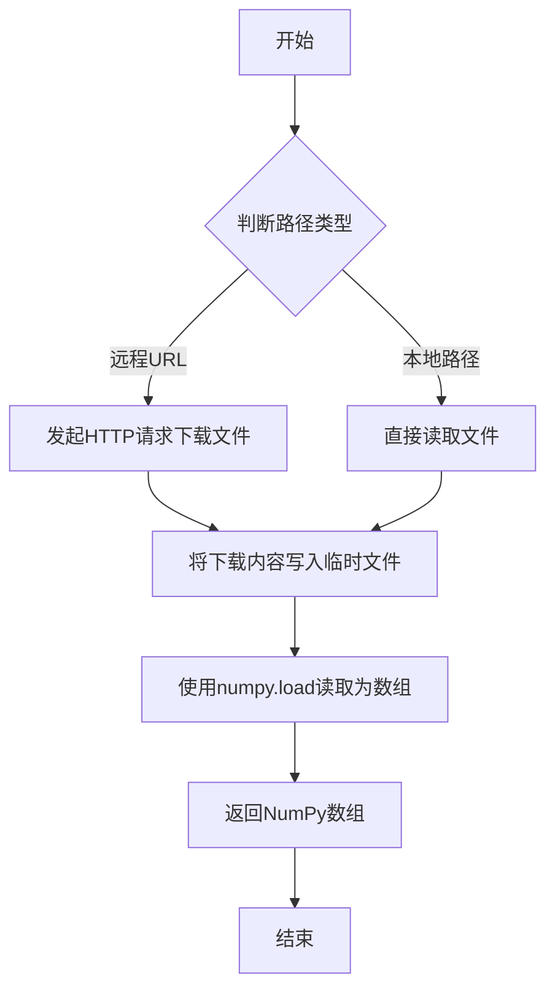

#### 带注释源码

```
# load_numpy函数定义（位于testing_utils模块中）
# 该函数用于从指定路径加载.npy格式的NumPy数组文件

def load_numpy(url_or_path: str) -> np.ndarray:
    """
    从本地文件或远程URL加载NumPy数组。
    
    参数:
        url_or_path: 可以是本地文件系统路径或远程HTTP/HTTPS URL
        
    返回:
        加载的NumPy数组对象
    """
    # 导入必要的模块
    import numpy as np
    import os
    
    # 判断是否为远程URL（以http://或https://开头）
    if url_or_path.startswith("http://") or url_or_path.startswith("https://"):
        # 如果是远程URL，使用requests库下载文件内容
        import requests
        response = requests.get(url_or_path)
        response.raise_for_status()  # 检查请求是否成功
        
        # 将下载的内容保存为临时.npy文件
        import tempfile
        import io
        
        # 从内存中的字节流加载NumPy数组
        array = np.load(io.BytesIO(response.content))
    else:
        # 如果是本地路径，直接使用numpy.load加载
        array = np.load(url_or_path)
    
    return array

# 在代码中的实际调用示例：
expected_image = load_numpy(
    "https://huggingface.co/datasets/hf-internal-testing/diffusers-images/resolve/main"
    "/shap_e/test_shap_e_img2img_out.npy"
)
```


### `torch_device`

`torch_device` 是从 `testing_utils` 模块导入的全局变量，用于指定 PyTorch 计算设备和测试环境的目标设备（如 CPU、CUDA 等），以确保测试在不同硬件配置下正确执行。

参数： 无（全局变量，非函数）

返回值：`str` 或 `torch.device`，返回当前测试环境的目标设备标识字符串或设备对象

#### 流程图

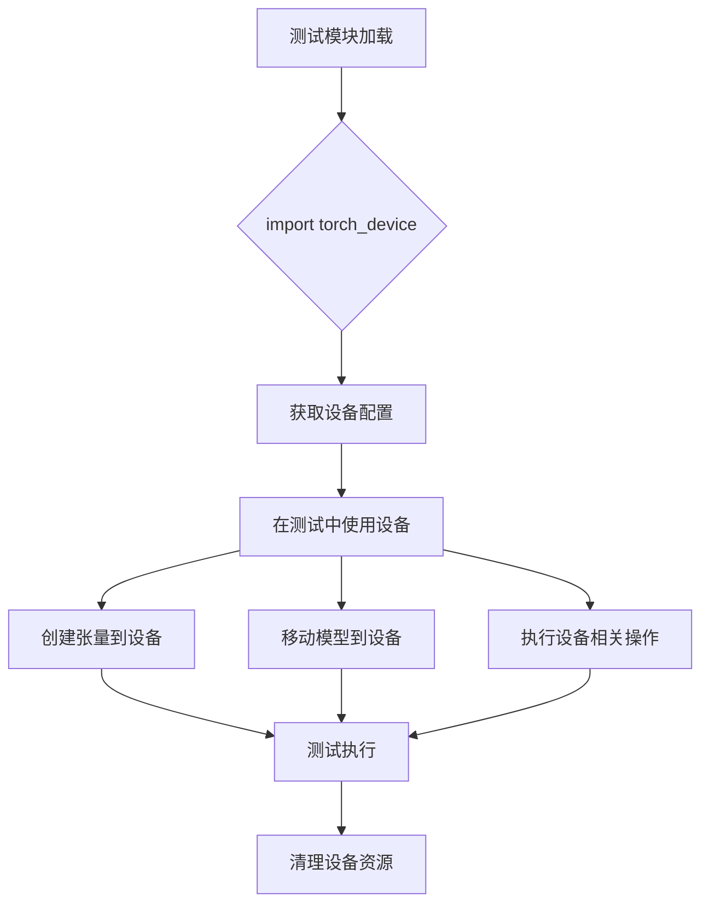

#### 带注释源码

```python
# torch_device 是从 testing_utils 模块导入的全局变量
# 在本代码中的使用示例如下：

# 1. 在 test_num_images_per_prompt 方法中用于将管道移动到指定设备
pipe = pipe.to(torch_device)

# 2. 用于获取虚拟输入数据的目标设备
inputs = self.get_dummy_inputs(torch_device)

# 3. 在集成测试中创建随机数生成器
generator = torch.Generator(device=torch_device).manual_seed(0)

# 4. 用于清理 GPU 内存
backend_empty_cache(torch_device)

# 5. 将管道移动到目标设备
pipe = pipe.to(torch_device)

# torch_device 的实际定义在 testing_utils 模块中
# 通常是一个根据环境动态判断的设备字符串（如 'cpu', 'cuda', 'cuda:0' 等）
# 或 torch.device 对象，用于确保测试在不同硬件环境下正确运行
```


根据提供的代码，我注意到 `PipelineTesterMixin` 并没有在当前文件中定义，而是作为父类被继承使用（`class ShapEImg2ImgPipelineFastTests(PipelineTesterMixin, unittest.TestCase)`）。

让我检查一下是否能从代码中提取相关的测试方法信息：

### `ShapEImg2ImgPipelineFastTests` 类

这是使用 `PipelineTesterMixin` 的测试类，继承自 `PipelineTesterMixin` 和 `unittest.TestCase`。

参数：

- 无直接参数（类定义参数）

返回值：无

#### 流程图

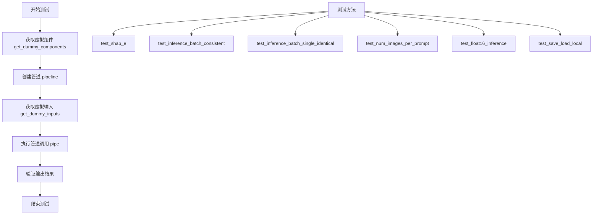

#### 带注释源码

```python
# 测试ShapEImg2ImgPipeline的快速测试类
class ShapEImg2ImgPipelineFastTests(PipelineTesterMixin, unittest.TestCase):
    # 管道类
    pipeline_class = ShapEImg2ImgPipeline
    # 参数列表
    params = ["image"]
    # 批处理参数
    batch_params = ["image"]
    # 必需的可选参数
    required_optional_params = [
        "num_images_per_prompt",
        "num_inference_steps",
        "generator",
        "latents",
        "guidance_scale",
        "frame_size",
        "output_type",
        "return_dict",
    ]
    # 禁用xformers注意力测试
    test_xformers_attention = False
    # 不支持dduf
    supports_dduf = False

    # 获取虚拟图像编码器
    @property
    def dummy_image_encoder(self):
        torch.manual_seed(0)
        config = CLIPVisionConfig(...)
        model = CLIPVisionModel(config)
        return model

    # 获取虚拟图像处理器
    @property
    def dummy_image_processor(self):
        image_processor = CLIPImageProcessor(...)
        return image_processor

    # 获取虚拟prior模型
    @property
    def dummy_prior(self):
        torch.manual_seed(0)
        model_kwargs = {...}
        model = PriorTransformer(**model_kwargs)
        return model

    # 获取虚拟渲染器
    @property
    def dummy_renderer(self):
        torch.manual_seed(0)
        model_kwargs = {...}
        model = ShapERenderer(**model_kwargs)
        return model

    # 获取所有虚拟组件
    def get_dummy_components(self):
        prior = self.dummy_prior
        image_encoder = self.dummy_image_encoder
        image_processor = self.dummy_image_processor
        shap_e_renderer = self.dummy_renderer
        scheduler = HeunDiscreteScheduler(...)
        components = {
            "prior": prior,
            "image_encoder": image_encoder,
            "image_processor": image_processor,
            "shap_e_renderer": shap_e_renderer,
            "scheduler": scheduler,
        }
        return components

    # 获取虚拟输入
    def get_dummy_inputs(self, device, seed=0):
        input_image = floats_tensor((1, 3, 32, 32), rng=random.Random(seed)).to(device)
        generator = torch.Generator(device=device).manual_seed(seed)
        inputs = {
            "image": input_image,
            "generator": generator,
            "num_inference_steps": 1,
            "frame_size": 32,
            "output_type": "latent",
        }
        return inputs

    # 测试ShapE基本功能
    def test_shap_e(self):
        device = "cpu"
        components = self.get_dummy_components()
        pipe = self.pipeline_class(**components)
        pipe = pipe.to(device)
        pipe.set_progress_bar_config(disable=None)
        output = pipe(**self.get_dummy_inputs(device))
        image = output.images[0]
        # 验证输出形状和像素值
        assert image.shape == (32, 16)
        assert np.abs(image_slice.flatten() - expected_slice).max() < 1e-2
```

---

**注意**：`PipelineTesterMixin` 类本身不在此代码文件中定义。它是从 `diffusers.pipelines.internal.test_pipelines_common` 模块导入的基类，提供了通用的管道测试方法（如 `test_float16_inference`、`test_save_load_local` 等）。如果您需要 `PipelineTesterMixin` 的完整详细信息，建议查看该模块的源码。


### `assert_mean_pixel_difference`

该函数是一个测试辅助函数，用于比较两个图像的平均像素差异，确保它们在可接受的阈值范围内，常用于验证扩散模型输出图像的正确性。

参数：

- `images`：`numpy.ndarray` 或 `torch.Tensor`，实际生成的图像
- `expected_image`：`numpy.ndarray` 或 `torch.Tensor`，预期/参考图像

返回值：`None`，该函数通过断言直接验证，不返回任何值

#### 流程图

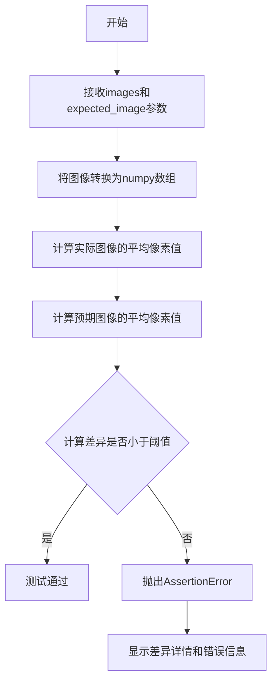

#### 带注释源码

```python
# 该函数定义在 test_pipelines_common 模块中
# 当前文件通过 from ..test_pipelines_common 导入该函数
# 使用方式: assert_mean_pixel_difference(images, expected_image)

# images: 生成的图像数据（numpy数组或torch张量）
# expected_image: 预期/参考图像数据（numpy数组或torch张量）

# 函数逻辑（基于使用方式推断）:
def assert_mean_pixel_difference(images, expected_image):
    """
    验证生成图像与预期图像的平均像素差异是否在可接受范围内。
    
    参数:
        images: 实际生成的图像
        expected_image: 预期/参考图像
    返回:
        无返回值，通过断言验证
    抛出:
        AssertionError: 当像素差异超过阈值时
    """
    # 1. 将输入转换为numpy数组（如果需要）
    # 2. 计算两个图像的平均像素值
    # 3. 比较差异是否在阈值内（通常为1e-2或类似值）
    # 4. 如果差异过大则抛出断言错误
```

> **注意**：该函数定义在 `diffusers` 包的 `test_pipelines_common` 模块中，当前文件通过相对导入 `from ..test_pipelines_common import PipelineTesterMixin, assert_mean_pixel_difference` 引入使用。函数的具体实现源码未在当前代码文件中提供，以上为基于调用方式的逻辑推断。


### `ShapEImg2ImgPipelineFastTests.text_embedder_hidden_size`

这是一个只读属性（property），返回文本嵌入器的隐藏层大小，用于配置CLIP视觉模型的隐藏维度。该属性在测试中用于创建虚拟（dummy）组件，确保管道功能测试可以在不需要真实预训练权重的情况下运行。

参数：

- `self`：`ShapEImg2ImgPipelineFastTests`，隐式参数，表示类实例本身，无需显式传递

返回值：`int`，返回隐藏层大小，固定值为 16。该值决定了CLIP视觉编码器的隐藏层维度、投影维度以及相关配置参数。

#### 流程图

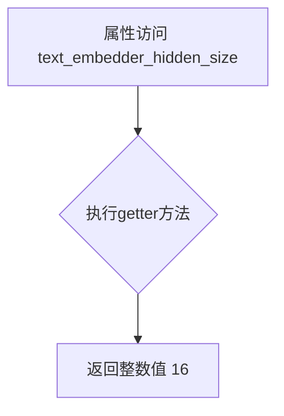

#### 带注释源码

```python
@property
def text_embedder_hidden_size(self):
    """
    返回文本嵌入器的隐藏层大小。
    
    该属性用于配置CLIPVisionModel的hidden_size和projection_dim参数。
    在测试场景中，使用较小的值（16）可以减少计算开销，同时满足
    管道配置的基本维度要求。
    
    Returns:
        int: 隐藏层大小，当前固定返回16
    """
    return 16
```


### `ShapEImg2ImgPipelineFastTests.time_input_dim`

该属性方法定义了ShapE图像到图像管道的时间输入维度，用于配置PriorTransformer模型的embedding_dim参数。在测试类中作为固定值16返回，作为模型配置的一部分。

参数：

- 无参数（属性方法不接受任何参数）

返回值：`int`，返回时间输入维度值16，用于确定模型的时间嵌入维度。

#### 流程图

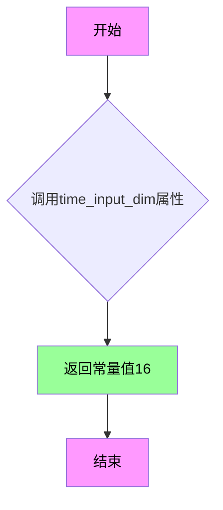

#### 带注释源码

```python
@property
def time_input_dim(self):
    """
    属性方法：获取时间输入维度值
    
    该属性用于定义ShapE模型的时间输入维度（time_input_dim），
    它是PriorTransformer模型的关键配置参数之一。
    
    返回值:
        int: 时间输入维度值，固定返回16
        
    用途:
        - 用作PriorTransformer的embedding_dim参数
        - 用作计算time_embed_dim的基础（time_input_dim * 4）
        - 用作PriorTransformer的clip_embed_dim参数（time_input_dim * 2）
        - 用作ShapERenderer的d_latent参数
    """
    return 16
```


### `ShapEImg2ImgPipelineFastTests.time_embed_dim`

该属性用于返回时间嵌入维度（time embedding dimension），其值等于 `time_input_dim` 的4倍。这是 ShapEImg2ImgPipeline 测试类中用于配置 PriorTransformer 模型的关键参数之一，确保时间嵌入层具有足够的维度来捕获时序特征。

参数： 无（这是一个属性方法，不接受任何参数）

返回值：`int`，返回时间嵌入维度，值为 `time_input_dim * 4`，在测试中为 64（因为 `time_input_dim` 为 16）

#### 流程图

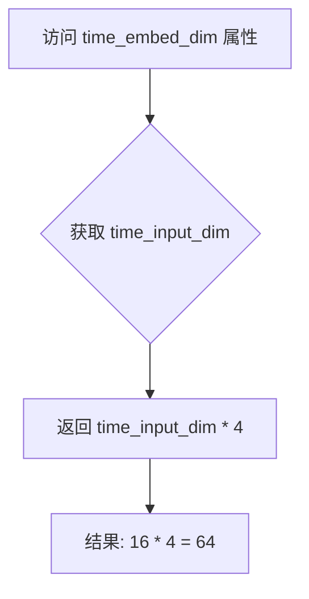

#### 带注释源码

```python
@property
def time_embed_dim(self):
    """
    时间嵌入维度属性
    
    该属性计算时间嵌入层的维度，根据 prior transformer 的标准设计，
    时间嵌入维度通常是输入时间维度的4倍。
    这用于在创建 dummy_prior 时传递正确的 time_embed_dim 参数。
    
    Returns:
        int: 时间嵌入维度，等于 time_input_dim * 4
    """
    return self.time_input_dim * 4
```


### `ShapEImg2ImgPipelineFastTests.renderer_dim`

这是一个属性方法，用于返回 Shap-E 图像到图像管道的渲染器维度大小。该属性为测试提供渲染器的隐藏层维度配置。

参数：无（属性方法，通过 `self` 访问类实例状态）

返回值：`int`，渲染器的隐藏层维度大小，固定返回 `8`

#### 流程图

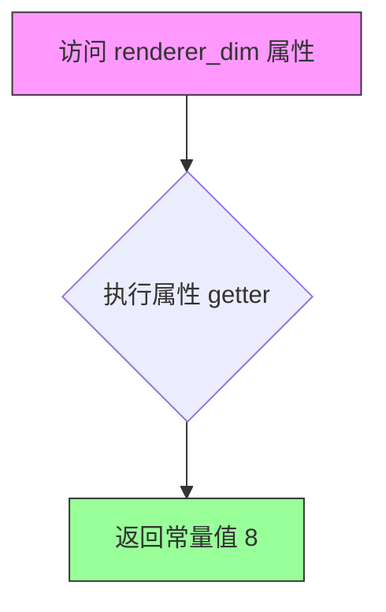

#### 带注释源码

```python
@property
def renderer_dim(self):
    """
    渲染器维度属性
    
    用于配置 ShapERenderer 的隐藏层维度 (d_hidden)。
    该值决定了渲染器中间表示的宽度，影响生成 3D 模型的细节程度。
    
    Returns:
        int: 渲染器隐藏层维度，固定值为 8
    """
    return 8
```


### ShapEImg2ImgPipelineFastTests.dummy_image_encoder

这是一个测试用的虚拟图像编码器属性方法，用于创建 CLIPVisionModel 实例，以便在 ShapE 图像到图像管道的单元测试中使用。

参数：

- `self`：隐式参数，类型为 `ShapEImg2ImgPipelineFastTests`，代表测试类实例本身

返回值：`CLIPVisionModel`，返回一个配置好的 CLIP 视觉模型实例，用于测试环境

#### 流程图

```mermaid
flowchart TD
    A[开始 dummy_image_encoder] --> B[设置随机种子 torch.manual_seed(0)]
    B --> C[定义 CLIPVisionConfig 配置参数]
    C --> D[创建 CLIPVisionModel 实例]
    D --> E[返回 model]
    
    subgraph config_params [配置参数]
        C1[hidden_size: 16]
        C2[image_size: 32]
        C3[projection_dim: 16]
        C4[intermediate_size: 24]
        C5[num_attention_heads: 2]
        C6[num_channels: 3]
        C7[num_hidden_layers: 5]
        C8[patch_size: 1]
    end
    
    C --> config_params
```

#### 带注释源码

```python
@property
def dummy_image_encoder(self):
    """
    创建并返回一个用于测试的虚拟 CLIP 图像编码器模型。
    
    该属性方法用于在单元测试中创建一个轻量级的 CLIPVisionModel 实例，
    以替代真实的预训练模型，从而实现快速的测试执行。
    
    Returns:
        CLIPVisionModel: 一个配置好的 CLIP 视觉模型实例
    """
    # 设置随机种子以确保测试的可重复性
    torch.manual_seed(0)
    
    # 创建 CLIPVisionConfig 配置对象
    # 使用较小的参数配置以加快测试速度
    config = CLIPVisionConfig(
        hidden_size=self.text_embedder_hidden_size,       # 隐藏层大小 (16)
        image_size=32,                                    # 输入图像尺寸
        projection_dim=self.text_embedder_hidden_size,   # 投影维度 (16)
        intermediate_size=24,                             # 中间层大小
        num_attention_heads=2,                            # 注意力头数量
        num_channels=3,                                   # 输入通道数 (RGB)
        num_hidden_layers=5,                              # 隐藏层数量
        patch_size=1,                                     # 补丁大小
    )

    # 使用配置创建 CLIPVisionModel 模型实例
    model = CLIPVisionModel(config)
    
    # 返回创建的模型供测试使用
    return model
```


### `ShapEImg2ImgPipelineFastTests.dummy_image_processor`

该属性方法创建一个配置好的CLIPImageProcessor实例，用于生成测试用的虚拟图像处理器，包含图像预处理的所有必要参数（裁剪、归一化、缩放等）。

参数：
- （无参数）

返回值：`CLIPImageProcessor`，返回配置完成的CLIP图像处理器实例，用于在ShapE图像到图像管道的单元测试中处理输入图像。

#### 流程图

```mermaid
flowchart TD
    A[开始访问 dummy_image_processor 属性] --> B[创建 CLIPImageProcessor 实例]
    B --> C[配置图像处理参数]
    C --> D[设置裁剪参数: crop_size=224, do_center_crop=True]
    E[配置归一化参数] --> D
    E --> F[设置归一化均值: [0.48145466, 0.4578275, 0.40821073]]
    F --> G[设置归一化标准差: [0.26862954, 0.26130258, 0.27577711]]
    G --> H[设置缩放参数: do_resize=True, size=224, resample=3]
    H --> I[返回配置好的 image_processor]
    I --> J[结束]
```

#### 带注释源码

```python
@property
def dummy_image_processor(self):
    """
    创建一个虚拟的CLIP图像处理器，用于测试目的。
    
    该属性返回一个配置完整的CLIPImageProcessor实例，包含以下预处理步骤：
    - 中心裁剪 (crop_size=224)
    - 图像缩放 (resize到224x224)
    - 图像归一化 (使用ImageNet统计值)
    """
    # 初始化CLIPImageProcessor，配置图像预处理的所有参数
    image_processor = CLIPImageProcessor(
        crop_size=224,                    # 裁剪后的图像尺寸
        do_center_crop=True,              # 是否执行中心裁剪
        do_normalize=True,                # 是否进行归一化处理
        do_resize=True,                   # 是否调整图像尺寸
        # ImageNet数据集的RGB通道均值，用于归一化
        image_mean=[0.48145466, 0.4578275, 0.40821073],
        # ImageNet数据集的RGB通道标准差，用于归一化
        image_std=[0.26862954, 0.26130258, 0.27577711],
        resample=3,                       # PIL图像采样模式 (BICUBIC=3)
        size=224,                         # 调整后的目标尺寸
    )

    # 返回配置完成的图像处理器实例
    return image_processor
```

---

#### 补充信息

**所属类详细信息：**

| 字段/方法 | 类型 | 描述 |
|-----------|------|------|
| `pipeline_class` | 类属性 | 指定的管道类 `ShapEImg2ImgPipeline` |
| `params` | 类属性 | 管道参数列表 `["image"]` |
| `batch_params` | 类属性 | 批处理参数列表 `["image"]` |
| `dummy_image_encoder` | property | 创建虚拟CLIP视觉模型 |
| `dummy_image_processor` | property | 创建虚拟CLIP图像处理器 |
| `dummy_prior` | property | 创建虚拟PriorTransformer模型 |
| `dummy_renderer` | property | 创建虚拟ShapERenderer模型 |
| `get_dummy_components` | method | 组装所有虚拟组件 |
| `get_dummy_inputs` | method | 生成虚拟输入数据 |
| `test_shap_e` | method | 核心功能测试用例 |

**关键组件信息：**

| 组件名称 | 描述 |
|----------|------|
| `CLIPImageProcessor` | HuggingFace Transformers库提供的图像预处理器，用于CLIP模型的图像输入预处理 |
| `ShapEImg2ImgPipeline` | ShapE图像到图像转换管道，用于从输入图像生成3D内容 |

**潜在技术债务或优化空间：**

1. **硬编码参数**：图像处理的均值和标准差直接硬编码在方法中，若CLIP模型版本更新可能需要手动同步
2. **测试参数可复用性**：可以抽取到基类或配置文件中，避免多个测试类重复定义相似逻辑
3. **魔法数字**：`resample=3` 使用数字编码，建议使用 `PIL.Image.BICUBIC` 常量提高可读性
4. **测试隔离性**：使用 `torch.manual_seed(0)` 确保可复现性是好的实践，但全局随机种子可能影响并发测试

**设计目标与约束：**

- 该属性用于单元测试场景，需要确保生成的虚拟组件能够通过完整的推理流程
- 图像处理器必须与 `dummy_image_encoder`（CLIPVisionModel）配合使用，输入输出维度需匹配
- 参数选择遵循CLIP模型的原始训练配置（ImageNet统计值）

**错误处理与异常设计：**

- 该方法不涉及复杂的错误处理，因为仅用于测试目的
- 若 `CLIPImageProcessor` 初始化失败，会直接向上抛出异常，导致测试失败

**数据流与状态机：**

```
输入图像 (floats_tensor)
    ↓
dummy_image_processor 处理
    ↓
标准化、裁剪、缩放后的图像张量
    ↓
dummy_image_encoder 编码
    ↓
图像嵌入向量
    ↓
PriorTransformer + ShapERenderer
    ↓
输出3D表示/图像
```

**外部依赖与接口契约：**

- 依赖 `transformers.CLIPImageProcessor`
- 返回类型需与管道构造函数中 `image_processor` 参数的类型兼容
- 输出的图像处理器需实现 `__call__` 方法以支持图像预处理调用


### `ShapEImg2ImgPipelineFastTests.dummy_prior`

这是一个属性方法（getter），用于创建并返回一个用于 ShapE 图像到图像管道的虚拟先验模型（PriorTransformer）实例。该方法在测试中用于初始化管道组件，提供一个具有特定配置的虚拟模型，以便进行单元测试。

参数：

- `self`：隐式参数，类型为 `ShapEImg2ImgPipelineFastTests`，代表测试类实例本身

返回值：`PriorTransformer`，返回一个配置好的虚拟先验模型实例，用于测试管道的功能

#### 流程图

```mermaid
flowchart TD
    A[开始 dummy_prior] --> B[设置随机种子 torch.manual_seed(0)]
    B --> C[构建模型参数字典 model_kwargs]
    C --> D[包含多个参数: num_attention_heads, attention_head_dim, embedding_dim等]
    D --> E[创建 PriorTransformer 实例: PriorTransformer(**model_kwargs)]
    E --> F[返回模型实例]
```

#### 带注释源码

```python
@property
def dummy_prior(self):
    """
    创建一个虚拟的 PriorTransformer 模型实例，用于测试目的。
    该方法设置随机种子为 0 以确保模型初始化的可重复性。
    """
    # 设置 PyTorch 随机种子，确保模型权重初始化的一致性
    torch.manual_seed(0)

    # 定义 PriorTransformer 的模型配置参数
    model_kwargs = {
        "num_attention_heads": 2,                  # 注意力头数量
        "attention_head_dim": 16,                 # 注意力头维度
        "embedding_dim": self.time_input_dim,     # 嵌入维度（继承自测试类属性）
        "num_embeddings": 32,                     # 嵌入数量
        "embedding_proj_dim": self.text_embedder_hidden_size,  # 嵌入投影维度
        "time_embed_dim": self.time_embed_dim,    # 时间嵌入维度
        "num_layers": 1,                           # 层数（使用单层以加快测试速度）
        "clip_embed_dim": self.time_input_dim * 2,  # CLIP 嵌入维度
        "additional_embeddings": 0,               # 额外嵌入数量
        "time_embed_act_fn": "gelu",              # 时间嵌入激活函数
        "norm_in_type": "layer",                  # 输入归一化类型
        "embedding_proj_norm_type": "layer",     # 嵌入投影归一化类型
        "encoder_hid_proj_type": None,            # 编码器隐藏投影类型
        "added_emb_type": None,                   # 额外嵌入类型
    }

    # 使用配置参数创建 PriorTransformer 模型实例
    model = PriorTransformer(**model_kwargs)
    return model
```


### `ShapEImg2ImgPipelineFastTests.dummy_renderer`

这是一个属性方法，用于创建并返回一个配置好的虚拟 `ShapERenderer` 模型对象，供测试 `ShapEImg2ImgPipeline` 使用。

参数：

- 无参数（这是一个属性方法，由 `@property` 装饰器装饰）

返回值：`ShapERenderer`，返回一个用于测试的虚拟 ShapE 渲染器模型实例

#### 流程图

```mermaid
flowchart TD
    A[开始] --> B[设置随机种子 torch.manual_seed(0)]
    B --> C[构建模型参数字典 model_kwargs]
    C --> D[包含 param_shapes: 四元组形状]
    C --> E[包含 d_latent: self.time_input_dim 16]
    C --> F[包含 d_hidden: self.renderer_dim 8]
    C --> G[包含 n_output: 12]
    C --> H[包含 background: RGB 0.1, 0.1, 0.1]
    D --> I[使用 ShapERenderer 类实例化模型]
    I --> J[返回模型实例]
```

#### 带注释源码

```python
@property
def dummy_renderer(self):
    """
    创建并返回一个虚拟的 ShapERenderer 模型，用于测试 ShapEImg2ImgPipeline。
    该模型使用较小的维度配置以加快测试速度。
    """
    # 设置随机种子以确保测试结果的可重复性
    torch.manual_seed(0)

    # 定义模型配置参数
    model_kwargs = {
        # 参数形状元组，定义四个参数张量的维度
        # 格式: (renderer_dim, feature_dim)
        "param_shapes": (
            (self.renderer_dim, 93),   # 第一个参数形状: (8, 93)
            (self.renderer_dim, 8),    # 第二个参数形状: (8, 8)
            (self.renderer_dim, 8),    # 第三个参数形状: (8, 8)
            (self.renderer_dim, 8),    # 第四个参数形状: (8, 8)
        ),
        # 潜在空间维度，等于 time_input_dim (16)
        "d_latent": self.time_input_dim,
        # 隐藏层维度，等于 renderer_dim (8)
        "d_hidden": self.renderer_dim,
        # 输出数量，定义渲染器输出的数量
        "n_output": 12,
        # 背景颜色 RGB 值，默认为浅灰色
        "background": (
            0.1,  # R
            0.1,  # G
            0.1,  # B
        ),
    }
    
    # 使用 ShapERenderer 类和指定参数创建模型实例
    model = ShapERenderer(**model_kwargs)
    
    # 返回创建完成的模型供测试使用
    return model
```


### `ShapEImg2ImgPipelineFastTests.get_dummy_components`

该方法用于创建测试所需的虚拟组件集合，初始化图像编码器、图像处理器、先验模型、渲染器和调度器，为管道测试提供必要的依赖组件。

参数： 无（仅包含隐式参数 `self`）

返回值：`Dict[str, Any]`，返回一个包含 5 个关键组件的字典，用于初始化 ShapEImg2ImgPipeline

#### 流程图

```mermaid
flowchart TD
    A[开始 get_dummy_components] --> B[获取 dummy_prior]
    B --> C[获取 dummy_image_encoder]
    C --> D[获取 dummy_image_processor]
    D --> E[获取 dummy_renderer]
    E --> F[创建 HeunDiscreteScheduler]
    F --> G[组装 components 字典]
    G --> H[返回 components]
    
    B -.-> B1[PriorTransformer 实例]
    C -.-> C1[CLIPVisionModel 实例]
    D -.-> D1[CLIPImageProcessor 实例]
    E -.-> E1[ShapERenderer 实例]
    F -.-> F1[调度器配置: exp, 1024, karras_sigmas]
```

#### 带注释源码

```python
def get_dummy_components(self):
    """
    创建用于单元测试的虚拟组件集合
    
    该方法初始化以下组件：
    - prior: 先验变换器模型，用于生成潜在表示
    - image_encoder: CLIP视觉编码器，用于编码输入图像
    - image_processor: 图像预处理器，用于标准化图像
    - shap_e_renderer: ShapE渲染器，用于生成3D内容
    - scheduler: Heun离散调度器，用于扩散过程的时间步调度
    
    Returns:
        Dict[str, Any]: 包含所有必需组件的字典
    """
    # 获取先验模型实例（PriorTransformer）
    prior = self.dummy_prior
    
    # 获取图像编码器实例（CLIPVisionModel）
    image_encoder = self.dummy_image_encoder
    
    # 获取图像处理器实例（CLIPImageProcessor）
    image_processor = self.dummy_image_processor
    
    # 获取ShapE渲染器实例（ShapERenderer）
    shap_e_renderer = self.dummy_renderer

    # 创建Heun离散调度器
    # - beta_schedule="exp": 使用指数beta调度
    # - num_train_timesteps=1024: 训练时间步数
    # - prediction_type="sample": 预测类型为样本
    # - use_karras_sigmas=True: 使用Karras_sigmas噪声调度
    # - clip_sample=True: 裁剪样本值
    # - clip_sample_range=1.0: 裁剪范围
    scheduler = HeunDiscreteScheduler(
        beta_schedule="exp",
        num_train_timesteps=1024,
        prediction_type="sample",
        use_karras_sigmas=True,
        clip_sample=True,
        clip_sample_range=1.0,
    )
    
    # 组装组件字典
    components = {
        "prior": prior,
        "image_encoder": image_encoder,
        "image_processor": image_processor,
        "shap_e_renderer": shap_e_renderer,
        "scheduler": scheduler,
    }

    return components
```


### `ShapEImg2ImgPipelineFastTests.get_dummy_inputs`

该方法用于生成 ShapEImg2ImgPipeline 的虚拟输入参数，主要为单元测试提供模拟的输入数据，包括虚拟图像、随机生成器以及推理相关的配置参数。

参数：

- `device`：`torch.device`，目标设备（如 "cpu"、"cuda" 等），用于将虚拟图像和生成器放置到指定设备上
- `seed`：`int`，随机种子，默认为 0，用于确保测试结果的可重复性

返回值：`Dict[str, Any]`，包含以下键值的字典：
- `image`：虚拟输入图像，类型为 `torch.Tensor`
- `generator`：`torch.Generator`，随机数生成器
- `num_inference_steps`：`int`，推理步数
- `frame_size`：`int`，帧大小
- `output_type`：`str`，输出类型

#### 流程图

```mermaid
flowchart TD
    A[开始 get_dummy_inputs] --> B[创建虚拟图像张量]
    B --> C{检查设备类型}
    C -->|mps 设备| D[使用 torch.manual_seed]
    C -->|其他设备| E[创建 torch.Generator 并设置种子]
    D --> F[构建输入参数字典]
    E --> F
    F --> G[返回输入参数字典]
    G --> H[结束]
```

#### 带注释源码

```python
def get_dummy_inputs(self, device, seed=0):
    """
    生成用于测试的虚拟输入参数。
    
    参数:
        device: 目标设备（cpu、cuda、mps等）
        seed: 随机种子，确保测试可重复
    
    返回:
        包含虚拟输入的字典，用于 pipeline 调用
    """
    
    # 使用 floats_tensor 创建形状为 (1, 3, 32, 32) 的虚拟图像张量
    # rng=random.Random(seed) 确保生成的随机数可复现
    input_image = floats_tensor((1, 3, 32, 32), rng=random.Random(seed)).to(device)

    # 根据设备类型选择不同的随机生成器初始化方式
    if str(device).startswith("mps"):
        # MPS 设备使用 torch.manual_seed
        generator = torch.manual_seed(seed)
    else:
        # 其他设备（如 cpu、cuda）使用 torch.Generator
        generator = torch.Generator(device=device).manual_seed(seed)
    
    # 构建输入参数字典
    inputs = {
        "image": input_image,           # 虚拟输入图像 (1, 3, 32, 32)
        "generator": generator,         # 随机数生成器
        "num_inference_steps": 1,       # 推理步数设为最小值1
        "frame_size": 32,               # 帧大小
        "output_type": "latent",       # 输出类型为 latent
    }
    
    return inputs
```


### `ShapEImg2ImgPipelineFastTests.test_shap_e`

该测试方法验证 ShapEImg2ImgPipeline 图像到图像转换管道的核心功能，包括使用虚拟（dummy）组件初始化管道、执行推理并验证输出图像的形状和像素值是否符合预期。

参数：

- `self`：`ShapEImg2ImgPipelineFastTests`，测试类实例本身，包含测试所需的上下文和辅助方法

返回值：`None`，无返回值（Python 中实际返回 `None`，但作为测试方法主要通过断言验证逻辑）

#### 流程图

```mermaid
flowchart TD
    A[开始测试 test_shap_e] --> B[设置设备为 CPU]
    B --> C[调用 get_dummy_components 获取虚拟组件]
    C --> D[使用虚拟组件初始化 ShapEImg2ImgPipeline]
    D --> E[将管道移至 CPU 设备]
    E --> F[配置进度条 disable=None]
    F --> G[调用 get_dummy_inputs 获取测试输入]
    G --> H[执行管道推理: pipe**输入]
    H --> I[从输出中提取生成的图像]
    I --> J[提取图像右下角 3x3 像素切片]
    J --> K{断言: 图像形状是否为 32x16}
    K -->|是| L[定义预期像素值数组]
    L --> M{断言: 图像切片与预期值的最大差异 < 1e-2}
    M -->|是| N[测试通过]
    M -->|否| O[测试失败 - 抛出断言错误]
    K -->|否| O
```

#### 带注释源码

```python
def test_shap_e(self):
    # 步骤1: 设置测试设备为 CPU
    device = "cpu"

    # 步骤2: 获取虚拟组件（用于测试的模拟模型组件）
    # 包含: prior(先验模型), image_encoder(图像编码器), 
    # image_processor(图像处理器), shap_e_renderer(渲染器), scheduler(调度器)
    components = self.get_dummy_components()

    # 步骤3: 使用虚拟组件初始化管道
    pipe = self.pipeline_class(**components)
    
    # 步骤4: 将管道移至指定设备（CPU）
    pipe = pipe.to(device)

    # 步骤5: 配置进度条（disable=None 表示不禁用进度条）
    pipe.set_progress_bar_config(disable=None)

    # 步骤6: 获取虚拟输入参数
    # 包含: image(输入图像), generator(随机数生成器), 
    # num_inference_steps(推理步数), frame_size(帧大小), output_type(输出类型)
    output = pipe(**self.get_dummy_inputs(device))
    
    # 步骤7: 从输出中提取第一张生成的图像
    image = output.images[0]
    
    # 步骤8: 提取图像右下角 3x3 像素区域并转为 numpy 数组
    image_slice = image[-3:, -3:].cpu().numpy()

    # 步骤9: 断言验证图像形状是否为 (32, 16)
    # 验证管道输出的空间维度是否符合预期
    assert image.shape == (32, 16)

    # 步骤10: 定义预期的像素值数组（用于验证图像内容正确性）
    expected_slice = np.array(
        [-1.0, 0.40668195, 0.57322013, -0.9469888, 0.4283227, 0.30348337, 
         -0.81094897, 0.74555075, 0.15342723]
    )

    # 步骤11: 断言验证图像切片与预期值的最大差异小于阈值 1e-2
    # 确保管道生成的图像内容在可接受的误差范围内
    assert np.abs(image_slice.flatten() - expected_slice).max() < 1e-2
```


### `ShapEImg2ImgPipelineFastTests.test_inference_batch_consistent`

该测试方法用于验证 ShapEImg2ImgPipeline 管道在批处理推理时的一致性，确保使用不同批次大小时（这里仅测试较小的批次大小以避免超时）产生一致的推理结果。

参数：

- `self`：`ShapEImg2ImgPipelineFastTests`，测试类实例，隐式参数，表示当前测试类对象

返回值：`None`，无返回值（测试方法通常不返回值）

#### 流程图

```mermaid
flowchart TD
    A[开始 test_inference_batch_consistent] --> B[设置 batch_sizes=[2]]
    B --> C[调用父类方法 _test_inference_batch_consistent]
    C --> D{执行批处理一致性测试}
    D -->|创建不同批次大小的输入| E[分别使用 batch_size=1 和 batch_size=2]
    E --> F[执行推理]
    F --> G{比较输出结果}
    G -->|结果一致| H[测试通过]
    G -->|结果不一致| I[测试失败]
    H --> J[结束]
    I --> J
```

#### 带注释源码

```python
def test_inference_batch_consistent(self):
    # 批处理一致性测试
    # 注意：较大的批次大小会导致此测试超时，因此仅测试较小的批次
    # 这里设置 batch_sizes 为 [2]，即仅测试批次大小为2的情况
    
    # 调用父类 PipelineTesterMixin 提供的 _test_inference_batch_consistent 方法
    # 该方法会验证使用不同批次大小时推理结果的一致性
    self._test_inference_batch_consistent(batch_sizes=[2])
```

#### 关键信息说明

**继承关系**：

- 该方法继承自 `PipelineTesterMixin` 类
- `_test_inference_batch_consistent` 是父类中定义的模板测试方法

**测试目的**：

- 验证批处理推理的数学一致性：f(x)*n ≈ f(x*n)（其中 f 是管道推理函数，n 是批次大小）
- 确保向量化操作不会引入数值误差

**实现细节**（基于父类方法推断）：

1. 使用相同的随机种子生成器确保可重复性
2. 分别使用 batch_size=1 和 batch_size=2 执行推理
3. 比较两次输出的像素差异
4. 如果差异超过阈值则断言失败


### `ShapEImg2ImgPipelineFastTests.test_inference_batch_single_identical`

这是一个单元测试方法，用于验证 ShapEImg2ImgPipeline 在批量推理时，单个样本的输出与单独推理时的一致性。

参数：

- `self`：`self`，ShapEImg2ImgPipelineFastTests 类的实例对象，隐含的测试对象本身

返回值：`None`，无返回值（测试方法）

#### 流程图

```mermaid
flowchart TD
    A[开始测试 test_inference_batch_single_identical] --> B[调用父类方法 _test_inference_batch_single_identical]
    B --> C[设置 batch_size=2]
    B --> D[设置 expected_max_diff=6e-3]
    C --> E[执行批量推理一致性验证]
    D --> E
    E --> F{结果是否符合预期阈值}
    F -->|是| G[测试通过]
    F -->|否| H[测试失败/抛出断言错误]
    G --> I[结束]
    H --> I
```

#### 带注释源码

```python
def test_inference_batch_single_identical(self):
    """
    测试方法：验证批量推理时单个样本的一致性
    
    该测试方法继承自 PipelineTesterMixin，用于确保在使用批量推理时，
    每个单独的样本产生的输出与单独推理时产生的输出保持一致。
    这是一个重要的一致性检查，确保模型在批处理模式下不会引入额外的误差。
    """
    # 调用父类 PipelineTesterMixin 的 _test_inference_batch_single_identical 方法
    # 参数：
    #   - batch_size=2: 测试时使用的批量大小
    #   - expected_max_diff=6e-3: 允许的最大差异阈值（用于浮点数比较）
    self._test_inference_batch_single_identical(
        batch_size=2,
        expected_max_diff=6e-3,
    )
```


### `ShapEImg2ImgPipelineFastTests.test_num_images_per_prompt`

该方法是一个单元测试，用于验证 `ShapEImg2ImgPipeline` 在设置 `num_images_per_prompt` 参数时能够正确生成指定数量的图像。测试通过创建虚拟组件、设置批次输入并断言输出图像数量是否符合 `batch_size * num_images_per_prompt` 的预期来验证管道的多图像生成功能。

参数：
- `self`：`ShapEImg2ImgPipelineFastTests`，测试类实例本身，无需显式传递

返回值：`None`，无返回值（测试方法通过 assert 语句进行断言验证）

#### 流程图

```mermaid
flowchart TD
    A[开始测试] --> B[获取虚拟组件: get_dummy_components]
    B --> C[创建管道实例并移动到设备]
    C --> D[设置进度条配置]
    D --> E[定义batch_size=1和num_images_per_prompt=2]
    E --> F[获取虚拟输入: get_dummy_inputs]
    F --> G{遍历inputs的键}
    G -->|键在batch_params中| H[将输入扩展为batch_size倍]
    G -->|键不在batch_params中| I[保持原样]
    H --> I
    I --> J[调用管道执行推理, 传入num_images_per_prompt参数]
    J --> K[获取返回的图像结果]
    K --> L{断言: images.shape[0] == batch_size * num_images_per_prompt}
    L -->|通过| M[测试通过]
    L -->|失败| N[抛出AssertionError]
```

#### 带注释源码

```python
def test_num_images_per_prompt(self):
    """
    测试 num_images_per_prompt 参数功能
    
    验证当设置 num_images_per_prompt=2 时，
    管道输出的图像数量是否为 batch_size * num_images_per_prompt
    """
    # 步骤1: 获取虚拟组件（包含prior、image_encoder、image_processor、shap_e_renderer、scheduler）
    components = self.get_dummy_components()
    
    # 步骤2: 使用虚拟组件创建ShapEImg2ImgPipeline实例
    pipe = self.pipeline_class(**components)
    
    # 步骤3: 将管道移动到测试设备（torch_device）
    pipe = pipe.to(torch_device)
    
    # 步骤4: 配置进度条（disable=None表示启用进度条）
    pipe.set_progress_bar_config(disable=None)

    # 步骤5: 定义测试参数
    batch_size = 1  # 批次大小
    num_images_per_prompt = 2  # 每个提示生成的图像数量

    # 步骤6: 获取虚拟输入（包含image、generator、num_inference_steps等）
    inputs = self.get_dummy_inputs(torch_device)

    # 步骤7: 处理批次参数 - 将需要批处理的输入扩展为batch_size倍
    # batch_params = ["image"]，所以image会被扩展为[image, image]
    for key in inputs.keys():
        if key in self.batch_params:
            inputs[key] = batch_size * [inputs[key]]

    # 步骤8: 调用管道执行推理
    # 传入num_images_per_prompt参数，期望生成2张图像
    images = pipe(**inputs, num_images_per_prompt=num_images_per_prompt)[0]

    # 步骤9: 断言验证
    # 验证输出的图像数量是否符合预期: batch_size * num_images_per_prompt = 1 * 2 = 2
    assert images.shape[0] == batch_size * num_images_per_prompt
```


### `ShapEImg2ImgPipelineFastTests.test_float16_inference`

该测试方法用于验证 ShapEImg2ImgPipeline 在 float16（半精度）推理模式下的正确性，通过调用父类的 test_float16_inference 方法执行半精度推理测试，并设置最大允许差异阈值为 1e-1。

参数：

- `self`：实例本身，无类型描述，代表 ShapEImg2ImgPipelineFastTests 类的实例

返回值：`None`，该方法为测试方法，无返回值，执行验证后通过 unittest 框架的断言判断测试是否通过

#### 流程图

```mermaid
flowchart TD
    A[开始执行 test_float16_inference] --> B[调用父类 test_float16_inference 方法]
    B --> C[传入 expected_max_diff=1e-1 参数]
    C --> D[父类执行 float16 推理验证]
    D --> E{推理结果是否符合预期}
    E -->|是| F[测试通过]
    E -->|否| G[测试失败，抛出断言错误]
```

#### 带注释源码

```python
def test_float16_inference(self):
    """
    测试 ShapEImg2ImgPipeline 在 float16（半精度）推理模式下的行为。
    
    该测试方法继承自 PipelineTesterMixin，通过调用父类方法执行以下验证：
    1. 将管道切换到 float16 模式
    2. 执行推理生成图像
    3. 验证输出结果与预期值之间的差异是否在允许范围内
    4. 清理 float16 资源并恢复原始精度
    
    expected_max_diff=1e-1 设置了宽松的容差阈值，
    因为 float16 精度较低，预期与 float32 推理结果存在一定差异。
    """
    # 调用父类的 test_float16_inference 方法进行 float16 推理测试
    # expected_max_diff=1e-1 表示允许的最大平均像素差异为 0.1
    super().test_float16_inference(expected_max_diff=1e-1)
```


### `ShapEImg2ImgPipelineFastTests.test_save_load_local`

该方法是一个单元测试函数，用于验证 ShapEImg2ImgPipeline 管道在本地保存和加载后的功能一致性。它通过调用父类 `PipelineTesterMixin` 的测试方法，检查保存/加载管道后生成的图像与原始管道输出的差异是否在指定的容忍范围内（5e-3），以确保管道的序列化过程不会导致推理结果发生变化。

参数：

- `self`：`ShapEImg2ImgPipelineFastTests`，测试类实例本身，包含管道配置和测试工具方法

返回值：`None`，该方法为单元测试方法，通过 `unittest.TestCase` 框架的断言机制验证功能，若测试失败会抛出异常

#### 流程图

```mermaid
flowchart TD
    A[开始测试 test_save_load_local] --> B[调用父类方法 super.test_save_load_local]
    B --> C[获取管道组件并创建管道实例]
    C --> D[执行管道推理生成原始输出]
    D --> E[将管道保存到临时本地路径]
    E --> F[从临时路径重新加载管道]
    F --> G[使用加载的管道执行推理]
    G --> H[比较原始输出与加载管道输出的差异]
    H --> I{差异是否 <= 5e-3?}
    I -->|是| J[测试通过]
    I -->|否| K[测试失败: 抛出 AssertionError]
```

#### 带注释源码

```python
def test_save_load_local(self):
    """
    测试管道在本地保存和加载后的功能一致性。
    
    该测试方法继承自 PipelineTesterMixin，验证以下流程：
    1. 创建完整的管道实例并执行推理获取基准输出
    2. 将管道保存到本地文件系统（包括所有模型权重和配置）
    3. 从保存的路径重新加载管道
    4. 使用加载的管道再次执行推理
    5. 比较两次推理输出的差异，确保差异在允许范围内
    
    Returns:
        None: 测试结果通过 unittest 框架的断言机制报告
    
    Raises:
        AssertionError: 如果保存/加载后的输出与原始输出差异超过 expected_max_difference
    """
    # 调用父类 PipelineTesterMixin 的测试方法
    # expected_max_difference=5e-3 表示允许的最大像素差异值为 0.005
    # 这确保了保存/加载过程不会引入显著的数值误差
    super().test_save_load_local(expected_max_difference=5e-3)
```


### `ShapEImg2ImgPipelineFastTests.test_sequential_cpu_offload_forward_pass`

该方法是一个测试用例，用于验证 ShapEImg2ImgPipeline 的顺序 CPU 卸载前向传播功能。由于当前存在 Key error 问题，该测试已被跳过。

参数：

- `self`：无显式参数（Python 实例方法的隐式参数），代表测试类实例本身

返回值：`None`，无返回值（测试方法执行 `pass` 语句后直接返回）

#### 流程图

```mermaid
flowchart TD
    A[开始测试] --> B{检查是否需要跳过测试}
    B -->|是| C[跳过测试并输出原因: Key error is raised with accelerate]
    B -->|否| D[执行测试逻辑]
    D --> E[清理资源]
    E --> F[测试结束]
    
    style C fill:#ffcccc
    style F fill:#ccffcc
```

#### 带注释源码

```python
@unittest.skip("Key error is raised with accelerate")
def test_sequential_cpu_offload_forward_pass(self):
    """
    测试顺序 CPU 卸载的前向传播功能。
    
    该测试方法用于验证 ShapEImg2ImgPipeline 在使用顺序 CPU 卸载时的
    前向传播是否正常工作。由于当前实现中存在 Key error 问题，该测试
    已被标记为跳过。
    
    测试目标（当前被跳过）:
    - 验证管道模型在不同设备间的顺序卸载
    - 确保前向传播在 CPU 卸载场景下正确执行
    - 检查内存管理和资源释放
    
    注意: 该测试被 @unittest.skip 装饰器跳过，原因是与 accelerate 库
    集成时存在 Key error 异常，需要后续修复。
    
    参数:
        无（除了隐式的 self 参数）
    
    返回:
        无返回值（测试被跳过）
    """
    pass
```


### `ShapEImg2ImgPipelineIntegrationTests.setUp`

这是一个测试框架的初始化方法，在每个集成测试运行前被调用。该方法通过调用父类的 `setUp` 方法、执行垃圾回收以及清理 GPU 显存（VRAM），确保测试环境处于干净状态，避免显存泄漏导致的测试失败或不稳定。

参数：

- `self`：`ShapEImg2ImgPipelineIntegrationTests`（隐式参数），测试类实例本身，代表当前测试对象

返回值：`None`，该方法不返回任何值，仅执行副作用操作

#### 流程图

```mermaid
flowchart TD
    A[开始 setUp] --> B[调用 super().setUp]
    B --> C[执行 gc.collect 强制垃圾回收]
    C --> D[调用 backend_empty_cache 清理 VRAM]
    D --> E[方法结束返回 None]
```

#### 带注释源码

```python
def setUp(self):
    # clean up the VRAM before each test
    # 调用父类 unittest.TestCase 的 setUp 方法，执行标准测试初始化
    super().setUp()
    # 强制 Python 垃圾回收器运行，释放不再使用的对象内存
    gc.collect()
    # 调用后端特定的缓存清理函数，释放 GPU/加速器显存
    backend_empty_cache(torch_device)
```


### `ShapEImg2ImgPipelineIntegrationTests.tearDown`

这是测试框架的清理方法，在每个测试用例执行完毕后被自动调用，用于释放 GPU 显存资源，防止显存泄漏。

参数：

- （无显式参数，隐式参数 `self` 表示测试类实例）

返回值：`None`，无返回值

#### 流程图

```mermaid
flowchart TD
    A[tearDown 开始] --> B[调用 super.tearDown]
    B --> C[执行 gc.collect 强制垃圾回收]
    C --> D[调用 backend_empty_cache 清理 GPU 显存缓存]
    D --> E[tearDown 结束]
```

#### 带注释源码

```python
def tearDown(self):
    # clean up the VRAM after each test
    # 调用父类的 tearDown 方法，执行 unittest.TestCase 的标准清理逻辑
    super().tearDown()
    # 强制 Python 垃圾回收器运行，回收不再使用的对象
    gc.collect()
    # 调用后端特定的方法清理 GPU 显存缓存（VRAM）
    # 这是为了防止显存泄漏，确保后续测试有足够的显存可用
    backend_empty_cache(torch_device)
```


### `ShapEImg2ImgPipelineIntegrationTests.test_shap_e_img2img`

该方法是 `ShapEImg2ImgPipelineIntegrationTests` 测试类中的一个集成测试方法，用于测试 ShapE 图像到图像生成管道的端到端功能。测试加载预训练模型，对输入图像进行推理，验证输出图像的形状和像素值与预期结果的一致性。

参数：

- `self`：`unittest.TestCase`，测试类实例本身

返回值：`None`（无返回值），该方法为测试用例，通过断言验证功能正确性

#### 流程图

```mermaid
flowchart TD
    A[Start test_shap_e_img2img] --> B[Load input image from URL]
    B --> C[Load expected numpy image from URL]
    C --> D[Load ShapEImg2ImgPipeline from pretrained openai/shap-e-img2img]
    D --> E[Move pipeline to torch device]
    E --> F[Set progress bar config to disable=None]
    F --> G[Create torch Generator with manual seed 0]
    G --> H[Call pipe with parameters:<br/>- input_image<br/>- generator<br/>- guidance_scale=3.0<br/>- num_inference_steps=64<br/>- frame_size=64<br/>- output_type=np]
    H --> I[Get output images[0]]
    I --> J[Assert images.shape == (20, 64, 64, 3)]
    J --> K[Call assert_mean_pixel_difference<br/>to verify images match expected]
    K --> L[End test]
```

#### 带注释源码

```python
@nightly
@require_torch_accelerator
class ShapEImg2ImgPipelineIntegrationTests(unittest.TestCase):
    """
    Integration tests for ShapEImg2ImgPipeline that require torch accelerator
    and are marked for nightly runs due to longer execution time
    """
    
    def setUp(self):
        """
        Set up method that runs before each test.
        Cleans up VRAM before each test to avoid memory issues
        """
        # clean up the VRAM before each test
        super().setUp()
        gc.collect()  # Force garbage collection to free memory
        backend_empty_cache(torch_device)  # Clear GPU cache

    def tearDown(self):
        """
        Tear down method that runs after each test.
        Cleans up VRAM after each test to avoid memory leaks
        """
        # clean up the VRAM after each test
        super().tearDown()
        gc.collect()  # Force garbage collection
        backend_empty_cache(torch_device)  # Clear GPU cache

    def test_shap_e_img2img(self):
        """
        Integration test for ShapE image-to-image pipeline.
        
        Test流程:
        1. Load input image from HuggingFace dataset URL
        2. Load expected output numpy array from HuggingFace dataset
        3. Load pretrained ShapEImg2ImgPipeline model
        4. Run inference with fixed seed for reproducibility
        5. Verify output shape and pixel values match expected
        """
        # Step 1: Load input image from URL (Corgi dog image)
        input_image = load_image(
            "https://huggingface.co/datasets/hf-internal-testing/diffusers-images/resolve/main/shap_e/corgi.png"
        )
        
        # Step 2: Load expected output image as numpy array for comparison
        expected_image = load_numpy(
            "https://huggingface.co/datasets/hf-internal-testing/diffusers-images/resolve/main"
            "/shap_e/test_shap_e_img2img_out.npy"
        )
        
        # Step 3: Load pretrained pipeline from HuggingFace model hub
        pipe = ShapEImg2ImgPipeline.from_pretrained("openai/shap-e-img2img")
        
        # Step 4: Move pipeline to target device (GPU)
        pipe = pipe.to(torch_device)
        
        # Configure progress bar (disable=None means enable progress bar)
        pipe.set_progress_bar_config(disable=None)

        # Create deterministic random generator with fixed seed
        generator = torch.Generator(device=torch_device).manual_seed(0)

        # Step 5: Run pipeline inference with specified parameters
        # - input_image: Source image to transform
        # - generator: For reproducible results
        # - guidance_scale=3.0: CFG guidance scale (higher = more guidance)
        # - num_inference_steps=64: Number of denoising steps
        # - frame_size=64: Output frame dimension
        # - output_type="np": Return numpy array instead of PIL image
        images = pipe(
            input_image,
            generator=generator,
            guidance_scale=3.0,
            num_inference_steps=64,
            frame_size=64,
            output_type="np",
        ).images[0]

        # Step 6: Verify output shape matches expected (20 frames, 64x64 resolution, RGB)
        assert images.shape == (20, 64, 64, 3)

        # Step 7: Verify generated images match expected within acceptable pixel difference
        assert_mean_pixel_difference(images, expected_image)
```

## 关键组件


### ShapEImg2ImgPipeline

ShapE图像到图像转换管道，负责将输入图像通过CLIP视觉编码器编码，然后通过PriorTransformer进行潜在空间转换，最后使用ShapERenderer渲染生成3D内容或图像帧。

### PriorTransformer

先验变换模型，将图像嵌入和时间步转换为潜在向量表示，用于在潜在空间中生成图像内容。

### ShapERenderer

ShapE渲染器，负责将潜在向量解码为可视化输出（图像帧序列），包含参数形状配置和渲染逻辑。

### CLIPVisionModel

CLIP视觉编码器模型，用于将输入图像编码为视觉嵌入向量，支持图像特征提取。

### CLIPImageProcessor

CLIP图像预处理器，负责图像的中心裁剪、归一化、resize等预处理操作，将原始图像转换为模型所需格式。

### HeunDiscreteScheduler

Heun离散调度器，用于扩散模型推理过程中的时间步调度，支持Karras sigmas和样本裁剪策略。

### PipelineTesterMixin

管道测试混入类，提供通用的管道测试方法，如批处理一致性测试、float16推理测试、保存加载测试等。

### Dummy Components Creation

测试用虚拟组件创建方法，包括dummy_image_encoder、dummy_prior、dummy_renderer等，用于快速构建测试所需的模型实例。

### Test Configuration

测试配置管理，包含参数定义（params、batch_params、required_optional_params）、设备管理、随机种子控制等。


## 问题及建议


### 已知问题

- **被跳过的测试方法**：`test_sequential_cpu_offload_forward_pass` 被无条件跳过，注释表明存在 "Key error with accelerate" 的已知 bug，导致 CPU offload 功能的测试覆盖缺失
- **硬编码的随机种子**：多处使用 `torch.manual_seed(0)`，可能导致测试的确定性问题，隐藏平台特定的随机性 bug
- **设备判断使用字符串匹配**：`str(device).startswith("mps")` 的判断方式脆弱，应使用 `device.type` 或专门的设备检测方法
- **测试性能问题**：注释表明 "Larger batch sizes cause this test to timeout"，仅测试小批量大小，batch size 相关的性能和内存问题未被充分测试
- **外部网络依赖**：集成测试直接通过 URL 加载图像（`load_image`、`load_numpy`），网络不可用或 URL 失效会导致测试失败
- **测试参数不一致**：FastTests 使用 `num_inference_steps=1, frame_size=32`，IntegrationTests 使用 `num_inference_steps=64, frame_size=64`，参数差异可能导致行为不一致
- **Magic Numbers 缺乏解释**：调度器配置中 `num_train_timesteps=1024`、`beta_schedule="exp"` 等值缺乏注释说明其选择理由
- **资源清理不完整**：虽然有 `gc.collect()` 和 `backend_empty_cache`，但未验证清理是否成功，可能存在 GPU 内存泄漏风险

### 优化建议

- **修复或记录跳过测试**：调查 `test_sequential_cpu_offload_forward_pass` 的 KeyError 问题，如无法快速修复应在文档中记录为已知限制
- **参数化随机种子**：允许通过环境变量或配置注入随机种子，提高测试的可配置性和可重现性
- **使用设备类型判断**：替换 `str(device).startswith("mps")` 为 `device.type == "mps"` 或 `torch.backends.mps.is_available()`
- **添加网络容错机制**：为外部图像加载添加超时控制和 fallback 机制，或使用本地缓存的测试数据
- **提取公共测试 fixtures**：将 `dummy_image_encoder`、`dummy_prior` 等属性提取到共享的 fixture 或基类中，减少代码重复
- **增加资源清理验证**：添加 GPU 内存使用的前后检查，确保资源真正被释放
- **统一测试参数**：考虑在 FastTests 和 IntegrationTests 之间建立参数映射关系，确保两者测试的是相似的能力域
- **添加性能基准测试**：针对 batch size 和 inference steps 添加超时检测，避免隐藏的性能退化

## 其它


### 设计目标与约束

该测试文件旨在验证ShapEImg2ImgPipeline的功能正确性，包括图像到图像的转换推理、批次一致性、模型保存与加载、浮点精度推理等核心功能。测试设计遵循单元测试与集成测试分离的原则，使用dummy组件进行快速单元测试，使用真实预训练模型进行集成测试。约束条件包括：仅支持torch后端，需要CUDA加速（通过@require_torch_accelerator装饰器），测试批次大小受限以避免超时。

### 错误处理与异常设计

测试中通过@unittest.skip装饰器跳过已知问题的测试用例（如test_sequential_cpu_offload_forward_pass因KeyError被跳过）。使用断言验证输出形状、数值差异和像素差异。集成测试在setUp和tearDown中处理VRAM清理，通过gc.collect()和backend_empty_cache()防止显存泄漏。异常捕获主要依赖unittest框架的标准断言机制。

### 数据流与状态机

测试数据流：dummy输入通过get_dummy_inputs()生成，包含floats_tensor生成的随机图像、generator、num_inference_steps=1、frame_size=32、output_type="latent"。图像数据经pipeline处理后输出图像结果，验证形状为(32, 16)的latent或(20, 64, 64, 3)的numpy数组。状态机转换：Pipeline初始化 → 组件注入 → set_progress_bar_config配置 → 执行推理 → 返回输出结果。

### 外部依赖与接口契约

核心依赖：diffusers库的ShapEImg2ImgPipeline、HeunDiscreteScheduler、PriorTransformer、ShapERenderer；transformers库的CLIPImageProcessor、CLIPVisionConfig、CLIPVisionModel；numpy和torch计算库。接口契约：pipeline_class接收components字典（包含prior、image_encoder、image_processor、shap_e_renderer、scheduler），__call__方法接收image、generator、num_inference_steps、guidance_scale、frame_size、output_type等参数，返回包含images属性的对象。

### 测试覆盖率

单元测试覆盖：基础推理(test_shap_e)、批次一致性(test_inference_batch_consistent)、单批次相同性(test_inference_batch_single_identical)、多图像生成(test_num_images_per_prompt)、float16推理(test_float16_inference)、本地保存加载(test_save_load_local)。集成测试覆盖：真实模型推理(test_shap_e_img2img)。未覆盖：错误输入验证、梯度计算、分布式推理、模型微调接口。

### 性能考虑与基准

测试使用最小化配置：time_input_dim=16、renderer_dim=8、num_layers=1、num_embeddings=32，以加快单元测试执行速度。集成测试使用64步推理、64x64帧尺寸。批次大小受限：test_inference_batch_consistent仅测试batch_sizes=[2]，避免VRAM溢出和超时。性能基准：单元测试应在秒级完成，集成测试预期在带GPU环境下数分钟内完成。

### 并发与线程安全性

测试未显式测试并发调用场景。pipeline默认非线程安全，状态通过set_progress_bar_config修改。多个测试共享pipeline实例时可能存在状态污染风险，通过每个测试独立创建pipeline实例避免。GPU内存管理通过setUp/tearDown中的gc.collect()和backend_empty_cache()确保释放。

### 配置管理

测试参数通过类属性配置：params定义必需参数["image"]，batch_params定义批次参数["image"]，required_optional_params定义可选参数列表。pipeline配置通过HeunDiscreteScheduler的特定参数设置（beta_schedule="exp"、prediction_type="sample"、use_karras_sigmas=True等）。模型配置通过dummy组件的属性方法动态生成。

### 资源管理

GPU资源：集成测试前清理VRAM（gc.collect() + backend_empty_cache()）。CPU资源：测试完成后自动释放pipeline引用。临时文件：test_save_load_local使用临时目录存储模型。下载资源：集成测试从HuggingFace Hub加载预训练模型"openai/shap-e-img2img"及测试图像。

### 版本兼容性与迁移

代码依赖transformers和diffusers库，版本兼容性通过nightly和require_torch_accelerator装饰器控制。test_float16_inference使用expected_max_diff=1e-1容忍度处理精度差异。future版本可能需要更新CLIPImageProcessor参数和ShapEImg2ImgPipeline接口。集成测试标记为@nightly以在稳定版本中跳过。

    