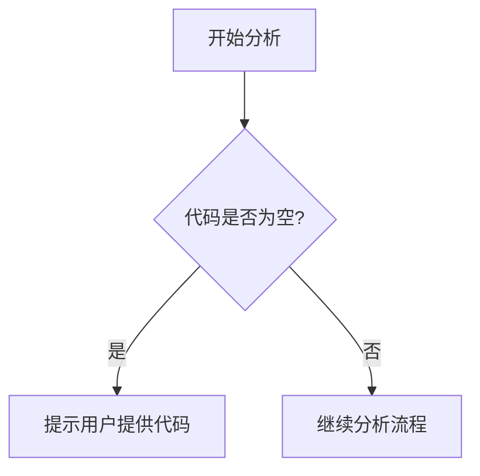

# `diffusers\tests\pipelines\skyreels_v2\__init__.py` 详细设计文档

未提供源代码，无法进行分析

## 整体流程



## 类结构

```

```

## 全局变量及字段


    

## 全局函数及方法


## 关键组件


### 关键组件信息

由于提供的代码为空，没有可分析的关键组件。


## 问题及建议


### 已知问题

-   未提供代码内容，无法进行技术债务和优化空间的分析

### 优化建议

-   请提供需要分析的源代码，以便进行详细的技术债务识别和优化建议


## 其它


### 一段话描述

本代码库是一个空实现，当前未提供具体代码内容，无法进行详细分析。

### 文件的整体运行流程

当前无可用代码信息。

### 类的详细信息

当前无可用代码信息。

### 类字段和全局变量

当前无可用代码信息。

### 类方法和全局函数

当前无可用代码信息。

### 关键组件信息

当前无可用代码信息。

### 潜在的技术债务或优化空间

当前无可用代码信息。

### 设计目标与约束

当前无可用代码信息。

### 错误处理与异常设计

当前无可用代码信息。

### 数据流与状态机

当前无可用代码信息。

### 外部依赖与接口契约

当前无可用代码信息。

### 性能要求与指标

当前无可用代码信息。

### 安全考虑

当前无可用代码信息。

### 兼容性设计

当前无可用代码信息。

### 测试策略

当前无可用代码信息。

### 部署与运维

当前无可用代码信息。

### 扩展性设计

当前无可用代码信息。

### 配置管理

当前无可用代码信息。

### 日志与监控

当前无可用代码信息。

### 版本兼容性

当前无可用代码信息。

    