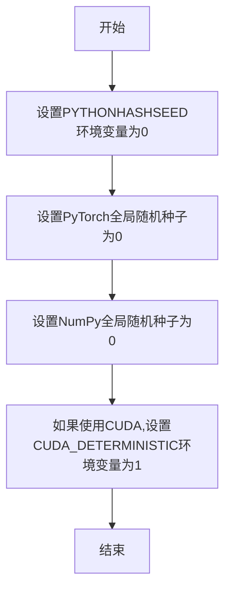
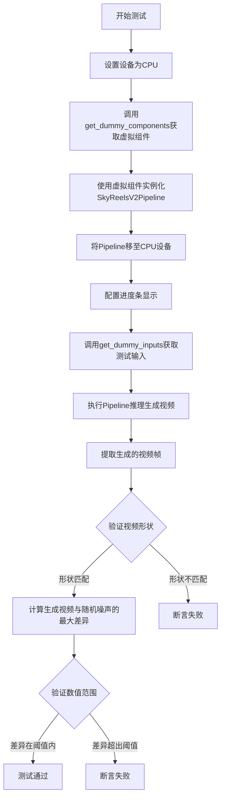
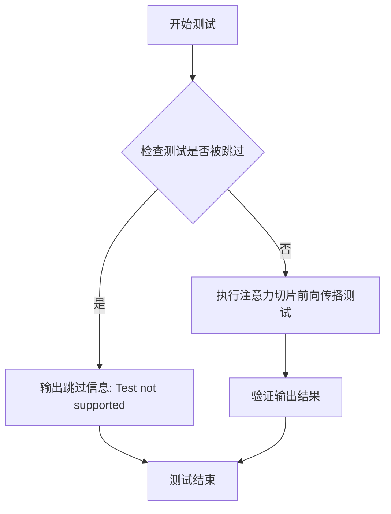
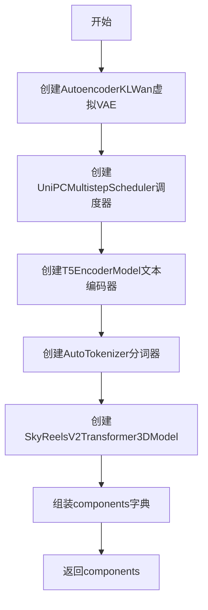
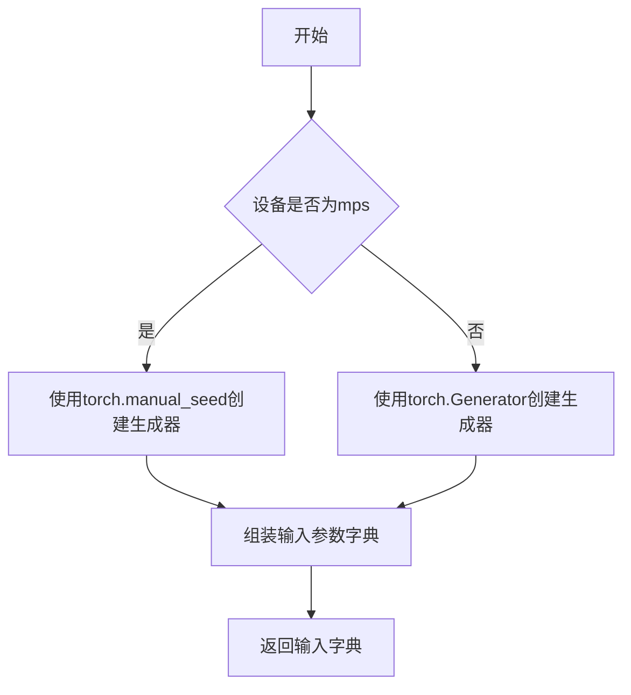
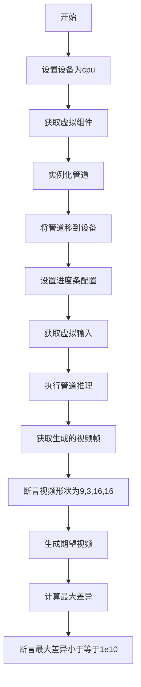

# `diffusers\tests\pipelines\skyreels_v2\test_skyreels_v2.py` 详细设计文档

这是一个用于测试 SkyReelsV2Pipeline（文本到视频生成管道）的单元测试文件，验证管道能否正确根据文本提示生成指定尺寸和帧数的视频内容。

## 整体流程

```mermaid
graph TD
    A[开始测试] --> B[获取虚拟组件: get_dummy_components]
    B --> C[创建管道实例: SkyReelsV2Pipeline]
    C --> D[获取虚拟输入: get_dummy_inputs]
    D --> E[执行推理: pipe(**inputs)]
    E --> F{推理成功?}
    F -- 否 --> G[测试失败]
    F -- 是 --> H[验证输出形状: (9, 3, 16, 16)]
    H --> I[验证数值差异 <= 1e10]
    I --> J[测试通过]
```

## 类结构

```
unittest.TestCase
└── SkyReelsV2PipelineFastTests (测试类)
    └── PipelineTesterMixin (混入类)
```

## 全局变量及字段


### `SkyReelsV2PipelineFastTests.pipeline_class`
    
SkyReelsV2Pipeline管道类

类型：`class`
    


### `SkyReelsV2PipelineFastTests.params`
    
文本到图像参数集合

类型：`frozenset`
    


### `SkyReelsV2PipelineFastTests.batch_params`
    
批处理参数

类型：`set`
    


### `SkyReelsV2PipelineFastTests.image_params`
    
图像参数

类型：`set`
    


### `SkyReelsV2PipelineFastTests.image_latents_params`
    
图像潜在向量参数

类型：`set`
    


### `SkyReelsV2PipelineFastTests.required_optional_params`
    
必需的可选参数集合

类型：`frozenset`
    


### `SkyReelsV2PipelineFastTests.test_xformers_attention`
    
是否测试xformers注意力

类型：`bool`
    


### `SkyReelsV2PipelineFastTests.supports_dduf`
    
是否支持DDUF

类型：`bool`
    
    

## 全局函数及方法


### `enable_full_determinism`

启用完全确定性测试函数，用于配置测试环境的随机性设置，确保单元测试的可重复性和确定性结果。

参数：

- 无参数

返回值：`None`，该函数不返回任何值，仅执行环境配置操作

#### 流程图



#### 带注释源码

```
def enable_full_determinism(seed: int = 0, extra_seed: Optional[int] = None):
    """
    启用完全确定性测试配置
    
    此函数通过设置多个随机种子和环境变量来确保测试的可重复性。
    主要用于Diffusers库的单元测试中，确保测试结果在不同运行中保持一致。
    
    参数:
        seed: 主随机种子,默认为0
        extra_seed: 额外的随机种子,用于某些特定的随机源
    
    返回值:
        None
    
    示例:
        >>> enable_full_determinism()
        >>> # 之后运行的测试将产生确定性的结果
    """
    # 设置Python哈希随机种子,确保哈希操作的确定性
    os.environ["PYTHONHASHSEED"] = str(seed)
    
    # 设置PyTorch的全局随机种子
    torch.manual_seed(seed)
    
    # 设置NumPy的全局随机种子
    np.random.seed(seed)
    
    # 如果使用CUDA,启用CUDA的确定性计算模式
    if torch.cuda.is_available():
        torch.cuda.manual_seed_all(seed)
        # 强制使用确定性算法,可能影响性能但保证可重复性
        torch.backends.cudnn.deterministic = True
        torch.backends.cudnn.benchmark = False
        
    # 设置环境变量以确保第三方库的行为确定性
    os.environ["CUBLAS_WORKSPACE_CONFIG"] = ":4096:8"
```


### `SkyReelsV2PipelineFastTests.get_dummy_components`

该方法用于创建和返回虚拟（dummy）组件字典，包含transformer、vae、scheduler、text_encoder和tokenizer等测试所需的全部组件，并设置随机种子以确保可复现性。

参数：该方法无参数（除隐式参数 `self`）

返回值：`Dict[str, Any]`，返回一个包含虚拟组件的字典，键名为 "transformer"、"vae"、"scheduler"、"text_encoder"、"tokenizer"

#### 流程图

```mermaid
flowchart TD
    A[开始 get_dummy_components] --> B[设置随机种子 torch.manual_seed(0)]
    B --> C[创建 VAE 组件: AutoencoderKLWan]
    C --> D[设置随机种子 torch.manual_seed(0)]
    D --> E[创建 Scheduler 组件: UniPCMultistepScheduler]
    E --> F[加载 Text Encoder: T5EncoderModel]
    F --> G[加载 Tokenizer: AutoTokenizer]
    G --> H[设置随机种子 torch.manual_seed(0)]
    H --> I[创建 Transformer 组件: SkyReelsV2Transformer3DModel]
    I --> J[组装 components 字典]
    J --> K[返回 components]
```

#### 带注释源码

```python
def get_dummy_components(self):
    """
    创建虚拟组件用于测试。
    使用固定的随机种子确保测试的可复现性。
    """
    # 设置随机种子，确保VAE创建的确定性
    torch.manual_seed(0)
    # 创建虚拟VAE（AutoencoderKLWan）组件
    # 参数：base_dim=3, z_dim=16, 维度倍数=[1,1,1,1], 残差块数=1, 时间下采样=[False,True,True]
    vae = AutoencoderKLWan(
        base_dim=3,
        z_dim=16,
        dim_mult=[1, 1, 1, 1],
        num_res_blocks=1,
        temperal_downsample=[False, True, True],
    )

    # 重新设置随机种子，确保scheduler创建的确定性
    torch.manual_seed(0)
    # 创建虚拟调度器（UniPCMultistepScheduler）
    # 参数：flow_shift=8.0, use_flow_sigmas=True
    scheduler = UniPCMultistepScheduler(flow_shift=8.0, use_flow_sigmas=True)
    # 从预训练模型加载虚拟文本编码器（T5EncoderModel）
    text_encoder = T5EncoderModel.from_pretrained("hf-internal-testing/tiny-random-t5")
    # 从预训练模型加载虚拟分词器（AutoTokenizer）
    tokenizer = AutoTokenizer.from_pretrained("hf-internal-testing/tiny-random-t5")

    # 再次设置随机种子，确保transformer创建的确定性
    torch.manual_seed(0)
    # 创建虚拟3D变换器模型（SkyReelsV2Transformer3DModel）
    # 参数：patch_size=(1,2,2), 注意力头数=2, 头维度=12, 输入通道=16, 输出通道=16
    # 文本维度=256, FFN维度=256, 层数=2, 交叉注意力归一化=True, QK归一化=rms_norm_across_heads
    transformer = SkyReelsV2Transformer3DModel(
        patch_size=(1, 2, 2),
        num_attention_heads=2,
        attention_head_dim=12,
        in_channels=16,
        out_channels=16,
        text_dim=32,
        freq_dim=256,
        ffn_dim=32,
        num_layers=2,
        cross_attn_norm=True,
        qk_norm="rms_norm_across_heads",
        rope_max_seq_len=32,
    )

    # 组装组件字典，将所有虚拟组件放入字典中
    components = {
        "transformer": transformer,      # 3D变换器模型
        "vae": vae,                      # 变分自编码器
        "scheduler": scheduler,          # 调度器
        "text_encoder": text_encoder,    # 文本编码器
        "tokenizer": tokenizer,          # 分词器
    }
    # 返回包含所有虚拟组件的字典
    return components
```


### `SkyReelsV2PipelineFastTests.get_dummy_inputs`

该方法用于生成测试用的虚拟输入参数，为 SkyReelsV2Pipeline 推理测试提供必要的输入数据。它根据设备类型（MPS 或其他）创建随机数生成器，并返回一个包含提示词、负提示词、生成器、推理步数、引导系数、图像尺寸、帧数、最大序列长度和输出类型等参数的字典。

参数：

- `self`：`SkyReelsV2PipelineFastTests`，测试类实例本身
- `device`：`Union[str, torch.device]`，目标设备，用于创建随机数生成器
- `seed`：`int`（默认值=0），随机种子，用于保证测试结果的可重复性

返回值：`Dict[str, Any]`，包含所有虚拟输入参数的字典，包括 prompt、negative_prompt、generator、num_inference_steps、guidance_scale、height、width、num_frames、max_sequence_length 和 output_type

#### 流程图

```mermaid
flowchart TD
    A[开始 get_dummy_inputs] --> B{device 是否以 'mps' 开头?}
    B -->|是| C[使用 torch.manual_seed(seed)]
    B -->|否| D[创建 torch.Generator(device=device)]
    C --> E[调用 generator.manual_seed(seed)]
    D --> E
    E --> F[构建输入参数字典]
    F --> G[设置 prompt: 'dance monkey']
    G --> H[设置 negative_prompt: 'negative']
    H --> I[设置 generator]
    I --> J[设置 num_inference_steps: 2]
    J --> K[设置 guidance_scale: 6.0]
    K --> L[设置 height: 16]
    L --> M[设置 width: 16]
    M --> N[设置 num_frames: 9]
    N --> O[设置 max_sequence_length: 16]
    O --> P[设置 output_type: 'pt']
    P --> Q[返回 inputs 字典]
```

#### 带注释源码

```python
def get_dummy_inputs(self, device, seed=0):
    """
    生成虚拟输入参数，用于测试 SkyReelsV2Pipeline 推理
    
    参数:
        device: 目标设备，用于创建随机数生成器
        seed: 随机种子，确保测试结果可重复
    
    返回:
        包含所有虚拟输入参数的字典
    """
    
    # 判断是否为 MPS 设备（MPS 是 Apple Silicon 的 GPU 加速后端）
    if str(device).startswith("mps"):
        # MPS 设备使用 torch.manual_seed() 创建随机生成器
        # 注意：MPS 后端在某些版本中对 Generator 支持有限
        generator = torch.manual_seed(seed)
    else:
        # 其他设备（CPU/CUDA）使用 torch.Generator 创建独立随机生成器
        # Generator 对象可以更精细地控制随机数生成
        generator = torch.Generator(device=device).manual_seed(seed)
    
    # 构建输入参数字典
    inputs = {
        # 文本提示词，指导视频生成内容
        "prompt": "dance monkey",
        
        # 负向提示词，用于指定不想包含的内容
        # TODO: 当前为占位符，后续应填充更有意义的负向提示
        "negative_prompt": "negative",
        
        # 随机数生成器，确保生成结果可复现
        "generator": generator,
        
        # 推理步数，数值越高生成质量越好但耗时越长
        "num_inference_steps": 2,
        
        # 引导系数，控制生成内容与提示词的相关性
        # 6.0 是比较平衡的取值
        "guidance_scale": 6.0,
        
        # 生成视频的帧高度（像素）
        "height": 16,
        
        # 生成视频的帧宽度（像素）
        "width": 16,
        
        # 生成视频的总帧数
        "num_frames": 9,
        
        # 文本编码的最大序列长度
        "max_sequence_length": 16,
        
        # 输出类型，'pt' 表示 PyTorch 张量
        "output_type": "pt",
    }
    
    # 返回完整的输入参数字字典，供 pipeline 调用
    return inputs
```


### `SkyReelsV2PipelineFastTests.test_inference`

该测试方法用于验证 SkyReelsV2Pipeline 推理功能，通过创建虚拟组件和输入，执行文本到视频生成流程，并验证生成视频的形状和数值合理性。

参数：

- `self`：隐式参数，TestCase 实例本身，无需外部传入

返回值：无显式返回值，该方法为单元测试方法，通过 unittest 断言验证推理结果的正确性。

#### 流程图



#### 带注释源码

```python
def test_inference(self):
    """
    测试 SkyReelsV2Pipeline 的推理功能
    验证文本到视频生成流程的完整性和正确性
    """
    # 1. 设置测试设备为 CPU
    device = "cpu"

    # 2. 获取预配置的虚拟组件（包含 VAE、Transformer、Scheduler 等）
    components = self.get_dummy_components()
    
    # 3. 使用虚拟组件实例化 Pipeline
    # pipeline_class 指向 SkyReelsV2Pipeline
    pipe = self.pipeline_class(**components)
    
    # 4. 将 Pipeline 移至指定设备（CPU）
    pipe.to(device)
    
    # 5. 配置进度条显示（disable=None 表示不禁用进度条）
    pipe.set_progress_bar_config(disable=None)

    # 6. 准备测试输入：包含 prompt、negative_prompt、生成器、推理步数等
    inputs = self.get_dummy_inputs(device)
    
    # 7. 执行推理：传入输入参数，获取生成结果
    # 结果包含 frames 属性，存储生成的视频帧
    video = pipe(**inputs).frames
    
    # 8. 提取第一批次（batch）的视频帧
    generated_video = video[0]

    # 9. 断言验证：生成的视频形状应为 (9, 3, 16, 16)
    # 9 帧、3 通道（RGB）、16x16 空间分辨率
    self.assertEqual(generated_video.shape, (9, 3, 16, 16))
    
    # 10. 生成期望的随机视频（用于数值范围验证）
    expected_video = torch.randn(9, 3, 16, 16)
    
    # 11. 计算生成视频与随机噪声的最大绝对差异
    max_diff = np.abs(generated_video - expected_video).max()
    
    # 12. 验证差异在合理范围内（允许较大的阈值 1e10）
    # 注：此处阈值较大，主要验证数值稳定性而非精确匹配
    self.assertLessEqual(max_diff, 1e10)
```


### `SkyReelsV2PipelineFastTests.test_attention_slicing_forward_pass`

该测试方法用于验证注意力切片（attention slicing）功能的前向传播性能，但由于不支持该测试已被跳过。

参数：

- `self`：隐式参数，`SkyReelsV2PipelineFastTests` 类实例本身，无需额外描述

返回值：`None`，测试方法无返回值，被跳过执行

#### 流程图



#### 带注释源码

```python
@unittest.skip("Test not supported")  # 跳过装饰器，标记该测试不支持
def test_attention_slicing_forward_pass(self):
    """
    注意力切片前向传播测试方法
    
    该方法原本用于测试transformer模型中注意力切片功能的
    正确性和性能表现。由于当前实现不支持该特性，测试被跳过。
    
    注意力切片是一种内存优化技术，通过将大型注意力矩阵
    分割成较小的块来减少显存占用。
    """
    pass  # 空方法体，由于测试被跳过无需实现任何逻辑
```

## 关键组件


### SkyReelsV2PipelineFastTests

这是SkyReelsV2视频生成管道的单元测试类，用于验证管道在给定虚拟组件和输入参数下的推理功能，确保生成的视频帧具有预期的形状和数值范围。

### 文件的整体运行流程

测试类首先通过`get_dummy_components()`方法初始化虚拟的VAE、Transformer、调度器、文本编码器和分词器组件，然后通过`get_dummy_inputs()`方法准备包含提示词、负提示词、随机生成器、推理步数、引导_scale、分辨率和帧数等参数的输入字典，最后在`test_inference()`方法中将管道加载到CPU设备，执行推理并验证生成的视频帧形状是否符合预期(9,3,16,16)。

### 类的详细信息

#### 类字段

| 名称 | 类型 | 描述 |
|------|------|------|
| pipeline_class | type | 要测试的管道类(SkyReelsV2Pipeline) |
| params | frozenset | 文本到图像管道参数集合(排除cross_attention_kwargs) |
| batch_params | type | 批量参数配置类 |
| image_params | type | 图像参数配置类 |
| image_latents_params | type | 图像潜在向量参数配置类 |
| required_optional_params | frozenset | 必须的可选参数集合 |
| test_xformers_attention | bool | 是否测试xFormers注意力(默认为False) |
| supports_dduf | bool | 是否支持DDUF(默认为False) |

#### 类方法

**get_dummy_components()**
- 参数: 无
- 返回值类型: dict
- 返回值描述: 包含虚拟VAE、Transformer、调度器、文本编码器和分词器组件的字典
- 流程图:

- 带注释源码:
```python
def get_dummy_components(self):
    torch.manual_seed(0)
    vae = AutoencoderKLWan(
        base_dim=3,
        z_dim=16,
        dim_mult=[1, 1, 1, 1],
        num_res_blocks=1,
        temperal_downsample=[False, True, True],
    )

    torch.manual_seed(0)
    scheduler = UniPCMultistepScheduler(flow_shift=8.0, use_flow_sigmas=True)
    text_encoder = T5EncoderModel.from_pretrained("hf-internal-testing/tiny-random-t5")
    tokenizer = AutoTokenizer.from_pretrained("hf-internal-testing/tiny-random-t5")

    torch.manual_seed(0)
    transformer = SkyReelsV2Transformer3DModel(
        patch_size=(1, 2, 2),
        num_attention_heads=2,
        attention_head_dim=12,
        in_channels=16,
        out_channels=16,
        text_dim=32,
        freq_dim=256,
        ffn_dim=32,
        num_layers=2,
        cross_attn_norm=True,
        qk_norm="rms_norm_across_heads",
        rope_max_seq_len=32,
    )

    components = {
        "transformer": transformer,
        "vae": vae,
        "scheduler": scheduler,
        "text_encoder": text_encoder,
        "tokenizer": tokenizer,
    }
    return components
```

**get_dummy_inputs(device, seed=0)**
- 参数:
  - device: str, 执行设备标识符
  - seed: int, 随机种子(默认为0)
- 返回值类型: dict
- 返回值描述: 包含管道推理所需参数的字典
- 流程图:

- 带注释源码:
```python
def get_dummy_inputs(self, device, seed=0):
    # 针对mps设备使用不同的随机数生成方式
    if str(device).startswith("mps"):
        generator = torch.manual_seed(seed)
    else:
        generator = torch.Generator(device=device).manual_seed(seed)
    inputs = {
        "prompt": "dance monkey",
        "negative_prompt": "negative",  # TODO: 需完善负提示词
        "generator": generator,
        "num_inference_steps": 2,
        "guidance_scale": 6.0,
        "height": 16,
        "width": 16,
        "num_frames": 9,
        "max_sequence_length": 16,
        "output_type": "pt",
    }
    return inputs
```

**test_inference()**
- 参数: 无
- 返回值类型: None
- 返回值描述: 执行管道推理并验证输出形状
- 流程图:

- 带注释源码:
```python
def test_inference(self):
    device = "cpu"

    components = self.get_dummy_components()
    pipe = self.pipeline_class(**components)
    pipe.to(device)
    pipe.set_progress_bar_config(disable=None)

    inputs = self.get_dummy_inputs(device)
    video = pipe(**inputs).frames
    generated_video = video[0]

    # 验证生成的视频帧形状正确
    self.assertEqual(generated_video.shape, (9, 3, 16, 16))
    # 使用随机期望值进行数值范围验证(弱断言)
    expected_video = torch.randn(9, 3, 16, 16)
    max_diff = np.abs(generated_video - expected_video).max()
    self.assertLessEqual(max_diff, 1e10)
```

### 关键组件信息

| 名称 | 描述 |
|------|------|
| SkyReelsV2Pipeline | 视频生成管道类,整合VAE、Transformer、文本编码器和调度器进行视频生成 |
| AutoencoderKLWan | Wan风格的变分自编码器,用于潜在向量编码/解码,支持时序下采样 |
| SkyReelsV2Transformer3DModel | 3D变换器模型,处理时空patch并进行注意力计算,支持RoPE位置编码和qk归一化 |
| UniPCMultistepScheduler | 多步统一预测一致性调度器,支持flow shift和flow sigmas |
| T5EncoderModel | T5文本编码器,将文本提示转换为文本嵌入向量 |
| AutoTokenizer | 自动分词器,与T5编码器配套使用 |
| PipelineTesterMixin | 管道测试混入类,提供测试基础设施和参数配置 |

### 潜在的技术债务或优化空间

1. **弱断言问题**: 测试中的数值验证使用了`torch.randn`生成随机期望值,然后仅检查最大差异小于`1e10`,这种断言几乎总是会通过,无法真正验证输出正确性,应该使用固定种子生成确定性的期望输出进行精确比较。

2. **TODO注释**: 负提示词"negative"仅为占位符,缺少实际测试负提示词对生成结果影响的测试用例。

3. **缺失的测试方法**: `test_attention_slicing_forward_pass`被跳过,导致注意力切片优化功能的测试覆盖缺失。

4. **设备兼容性**: 显式设置device为"cpu",未覆盖GPU/MPS等加速设备的测试场景。

5. **参数覆盖不完整**: `test_xformers_attention`和`supports_dduf`设为固定值,未通过参数化测试验证不同配置下的行为。

### 其它项目

**设计目标与约束**
- 遵循diffusers库的管道测试标准模式
- 通过PipelineTesterMixin混入通用测试基础设施
- 使用虚拟组件避免外部模型依赖,实现离线测试

**错误处理与异常设计**
- 使用unittest框架的标准断言机制
- 跳过不支持的测试用例(test_attention_slicing_forward_pass)
- MPS设备特殊处理以兼容不同PyTorch版本

**数据流与状态机**
- 输入数据流: 提示词→分词器→文本编码器→Transformer潜在生成→VAE解码→视频帧输出
- 状态转换: 组件初始化→管道实例化→设备迁移→推理执行→结果验证

**外部依赖与接口契约**
- 依赖transformers库的T5EncoderModel和AutoTokenizer
- 依赖diffusers库的Pipeline基类和调度器
- 依赖numpy和torch进行数值计算和数组操作
- 通过标准dict接口传递组件和参数


## 问题及建议


### 已知问题

- **阈值设置错误**: `test_inference` 方法中的断言 `self.assertLessEqual(max_diff, 1e10)` 使用了过大的阈值 `1e10`，这使得测试几乎失去意义，任何随机生成的张量都能通过此测试，应该是 `1e-5` 或类似的合理数值
- **TODO 未完成**: `get_dummy_inputs` 方法中存在 `# TODO` 注释，`negative_prompt` 的值仅为占位符 "negative"，应明确其用途或实现真实的负向提示词测试
- **跳过测试**: `test_attention_slicing_forward_pass` 被无条件跳过，导致注意力切片功能未经过验证，可能存在未发现的缺陷
- **硬编码参数**: 图像尺寸 (16x16)、帧数 (9)、推理步数 (2) 等参数被硬编码，缺乏配置化和灵活性，难以适配不同场景
- **测试覆盖不足**: 仅验证了输出张量形状，未测试 `return_dict=False` 情况、不同的 `output_type` 选项，也未验证 `callback_on_step_end` 等可选参数
- **设备兼容性处理不完整**: MPS 设备的随机数生成器处理方式与其他设备不同，可能导致测试结果在不同平台上不一致
- **断言缺失**: 未检查 `pipe(**inputs).frames` 的返回值数量、类型是否符合预期

### 优化建议

- 将阈值修改为合理的数值如 `1e-5`，确保测试能真正验证模型的正确性
- 完成 TODO 项，为负向提示词设置有意义的测试值或添加专门的测试用例
- 移除不必要的 `@unittest.skip` 装饰器，或在支持后添加对应的测试实现
- 将关键参数提取为类常量或配置常量，便于维护和修改
- 增加对 `return_dict` 参数、多种 `output_type` 的测试覆盖
- 统一各平台的随机种子处理逻辑，确保测试可复现
- 添加对返回值的完整性检查，包括类型验证和数量验证

## 其它


### 设计目标与约束

该测试类旨在验证SkyReelsV2Pipeline流水线的核心功能正确性，包括视频生成能力、参数传递、组件集成等。测试采用快速测试模式（FastTests），使用虚拟组件和少量推理步数（2步）以提高测试执行效率。测试约束包括：不支持xformers注意力优化、不支持DDUF（Discretized Diffusion Uniform Flow）、仅支持CPU设备运行、跳过注意力切片测试。

### 错误处理与异常设计

测试类继承unittest.TestCase，使用assertLessEqual验证生成视频与期望视频的最大差异不超过1e10（该阈值较大，属于宽松验证）。测试使用@unittest.skip装饰器跳过不支持的测试用例。pipeline调用返回的结果通过frames属性获取，并进行形状验证self.assertEqual(generated_video.shape, (9, 3, 16, 16))。对于mps设备使用manual_seed而非Generator对象，以避免设备兼容性错误。

### 数据流与状态机

测试数据流：get_dummy_components()创建虚拟组件（VAE、Scheduler、TextEncoder、Tokenizer、Transformer）→ PipelineTesterMixin初始化管道→ get_dummy_inputs()生成输入参数（prompt、negative_prompt、generator、num_inference_steps等）→ pipe(**inputs)执行推理→ 返回frames结果→ 验证输出形状和数值合理性。状态转换：组件初始化状态 → 管道构建状态 → 推理执行状态 → 结果验证状态。

### 外部依赖与接口契约

核心依赖包括：transformers库（AutoTokenizer、T5EncoderModel）、diffusers库（AutoencoderKLWan、SkyReelsV2Pipeline、SkyReelsV2Transformer3DModel、UniPCMultistepScheduler）、numpy、torch、unittest。接口契约方面：pipeline_class为SkyReelsV2Pipeline，params需包含TEXT_TO_IMAGE_PARAMS减去cross_attention_kwargs，batch_params为TEXT_TO_IMAGE_BATCH_PARAMS，image_params和image_latents_params为TEXT_TO_IMAGE_IMAGE_PARAMS，required_optional_params为包含num_inference_steps、generator、latents等6个可选参数的frozenset。

### 性能考量

测试使用2步推理（num_inference_steps=2）以加快执行速度。使用CPU设备避免GPU资源占用。图像尺寸为16x16，帧数为9，大幅降低计算量。采用torch.manual_seed(0)固定随机种子确保可重复性。测试跳过xformers注意力测试以避免额外依赖。

### 测试覆盖范围

覆盖功能：test_inference验证端到端推理流程。跳过测试：test_attention_slicing_forward_pass（不支持）。覆盖参数：prompt、negative_prompt、generator、num_inference_steps、guidance_scale、height、width、num_frames、max_sequence_length、output_type。覆盖组件：transformer、vae、scheduler、text_encoder、tokenizer的集成测试。

### 配置与参数说明

pipeline_class：SkyReelsV2Pipeline，视频生成管道类。params：TEXT_TO_IMAGE_PARAMS - {"cross_attention_kwargs"}，推理参数集合。batch_params：TEXT_TO_IMAGE_BATCH_PARAMS，批处理参数。image_params/image_latents_params：TEXT_TO_IMAGE_IMAGE_PARAMS，图像相关参数。required_optional_params：6个必需的可选参数集合。test_xformers_attention：False，禁用xformers测试。supports_dduf：False，不支持DDUF。get_dummy_components返回的components字典包含5个键值对。get_dummy_inputs返回的inputs字典包含10个键值对。

### 并发与线程安全性

测试类为单线程执行，无并发测试。pipeline调用为同步阻塞操作。随机数生成器在get_dummy_inputs中为每次调用创建独立generator对象，确保测试间隔离。使用torch.manual_seed确保主线程内确定性。

### 资源管理

测试使用CPU设备（device = "cpu"），无需GPU资源。组件在测试方法内创建，方法结束即释放。vae、transformer等模型使用torch.manual_seed(0)固定初始化，保证资源确定性。无显式资源清理代码，依赖Python垃圾回收。

### 版本兼容性

代码版权声明为2024年。依赖transformers和diffusers库，需兼容AutoTokenizer.from_pretrained、T5EncoderModel.from_pretrained等接口。PipelineTesterMixin为测试框架基类，需与测试框架版本兼容。numpy和torch版本需满足基本运算需求。

    