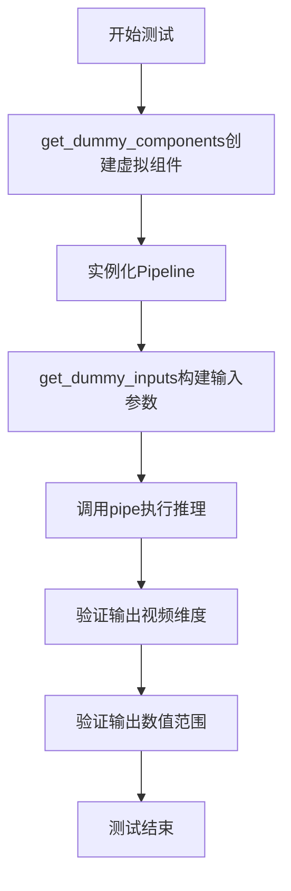
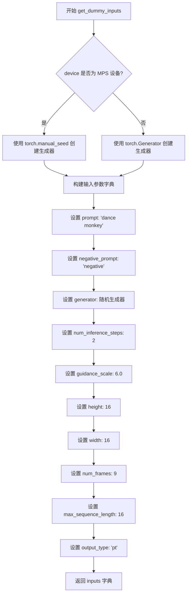
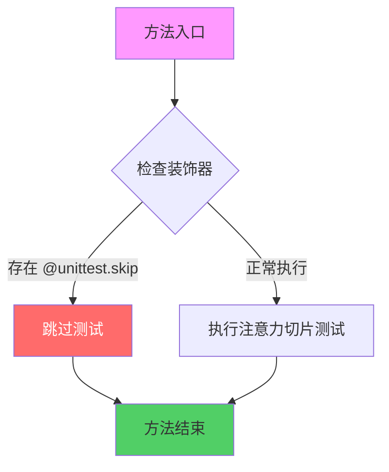
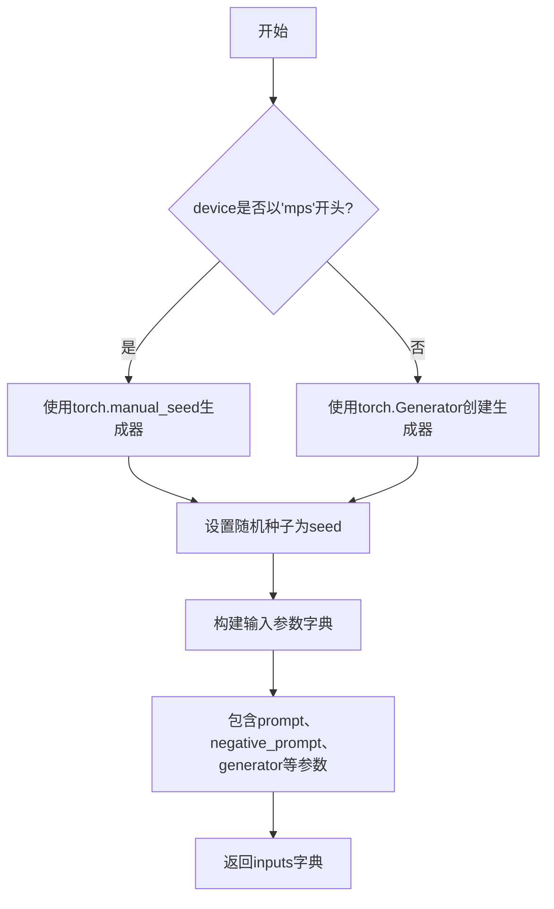
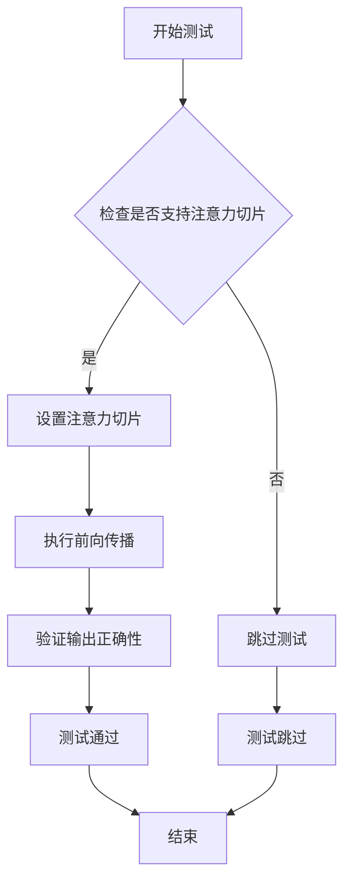

# `diffusers\tests\pipelines\skyreels_v2\test_skyreels_v2_df.py` 详细设计文档

这是一个针对SkyReelsV2DiffusionForcingPipeline的单元测试文件，用于验证视频生成pipeline的推理功能，包含虚拟组件配置、输入参数构建和推理结果验证。

## 整体流程



## 类结构

```
unittest.TestCase
└── PipelineTesterMixin
    └── SkyReelsV2DiffusionForcingPipelineFastTests
```

## 全局变量及字段


### `enable_full_determinism`
    
启用测试完全确定性结果的函数，确保每次运行测试时随机数种子一致

类型：`function`
    


### `SkyReelsV2DiffusionForcingPipelineFastTests.pipeline_class`
    
待测试的SkyReelsV2扩散强制管道类，用于生成视频帧

类型：`type`
    


### `SkyReelsV2DiffusionForcingPipelineFastTests.params`
    
文本到图像推理参数集合（已排除cross_attention_kwargs）

类型：`set`
    


### `SkyReelsV2DiffusionForcingPipelineFastTests.batch_params`
    
批处理参数集合，用于批量推理测试

类型：`set`
    


### `SkyReelsV2DiffusionForcingPipelineFastTests.image_params`
    
图像参数集合，用于图像生成验证

类型：`set`
    


### `SkyReelsV2DiffusionForcingPipelineFastTests.image_latents_params`
    
图像潜在向量参数集合，用于验证潜在向量输出

类型：`set`
    


### `SkyReelsV2DiffusionForcingPipelineFastTests.required_optional_params`
    
必需的可选参数集合，包含推理步骤生成器等参数

类型：`frozenset`
    


### `SkyReelsV2DiffusionForcingPipelineFastTests.test_xformers_attention`
    
标志位，指示是否测试xFormers注意力机制优化（当前禁用）

类型：`bool`
    


### `SkyReelsV2DiffusionForcingPipelineFastTests.supports_dduf`
    
标志位，指示管道是否支持DDUF（Diffusion-Direct Upsampling Fusion）功能

类型：`bool`
    
    

## 全局函数及方法


### `SkyReelsV2DiffusionForcingPipelineFastTests.get_dummy_components`

该方法用于创建测试所需的虚拟组件（dummy components），包括 VAE、调度器、文本编码器、分词器和 Transformer 模型，以便在单元测试中进行推理验证。

参数：

- 无参数（仅包含 `self`）

返回值：`Dict[str, Any]`，返回包含虚拟组件的字典，包括 transformer、vae、scheduler、text_encoder 和 tokenizer

#### 流程图

```mermaid
flowchart TD
    A[开始 get_dummy_components] --> B[设置随机种子 torch.manual_seed(0)]
    B --> C[创建 VAE: AutoencoderKLWan]
    C --> D[设置随机种子 torch.manual_seed(0)]
    D --> E[创建 Scheduler: UniPCMultistepScheduler]
    E --> F[加载 Text Encoder: T5EncoderModel]
    F --> G[加载 Tokenizer: AutoTokenizer]
    G --> H[设置随机种子 torch.manual_seed(0)]
    H --> I[创建 Transformer: SkyReelsV2Transformer3DModel]
    I --> J[组装 components 字典]
    J --> K[返回 components]
```

#### 带注释源码

```python
def get_dummy_components(self):
    """
    创建用于测试的虚拟组件
    
    该方法初始化所有必需的模型组件用于单元测试，
    包括 VAE、调度器、文本编码器、分词器和 Transformer 模型
    """
    # 设置随机种子以确保测试可重复性
    torch.manual_seed(0)
    # 创建虚拟 VAE 模型，配置参数：3通道输入，16维潜在空间
    vae = AutoencoderKLWan(
        base_dim=3,
        z_dim=16,
        dim_mult=[1, 1, 1, 1],
        num_res_blocks=1,
        temperal_downsample=[False, True, True],
    )

    # 重新设置随机种子确保各组件独立性
    torch.manual_seed(0)
    # 创建 UniPC 多步调度器，用于扩散模型的去噪过程
    scheduler = UniPCMultistepScheduler(flow_shift=8.0, use_flow_sigmas=True)
    # 加载预训练的 T5 文本编码器（测试用小型模型）
    text_encoder = T5EncoderModel.from_pretrained("hf-internal-testing/tiny-random-t5")
    # 加载对应的分词器
    tokenizer = AutoTokenizer.from_pretrained("hf-internal-testing/tiny-random-t5")

    # 再次设置随机种子
    torch.manual_seed(0)
    # 创建 3D Transformer 模型，用于视频扩散
    transformer = SkyReelsV2Transformer3DModel(
        patch_size=(1, 2, 2),       # 时空补丁大小
        num_attention_heads=2,      # 注意力头数量
        attention_head_dim=12,      # 注意力维度
        in_channels=16,             # 输入通道数
        out_channels=16,            # 输出通道数
        text_dim=32,                # 文本嵌入维度
        freq_dim=256,               # 频率维度
        ffn_dim=32,                 # 前馈网络维度
        num_layers=2,               # Transformer 层数
        cross_attn_norm=True,       # 启用交叉注意力归一化
        qk_norm="rms_norm_across_heads",  # Query/Key 归一化方式
        rope_max_seq_len=32,        # RoPE 位置编码最大序列长度
    )

    # 组装组件字典，统一管理所有模型组件
    components = {
        "transformer": transformer,     # 3D 扩散 Transformer 模型
        "vae": vae,                     # 变分自编码器
        "scheduler": scheduler,         # 噪声调度器
        "text_encoder": text_encoder,   # 文本编码器
        "tokenizer": tokenizer,         # 分词器
    }
    # 返回组件字典供 pipeline 初始化使用
    return components
```


### `SkyReelsV2DiffusionForcingPipelineFastTests.get_dummy_inputs`

该方法是一个测试辅助函数，用于生成虚拟输入参数字典，模拟 SkyReelsV2 扩散强制管道的推理调用所需的全部参数，包括文本提示、负提示、随机数生成器、推理步数、引导系数、输出尺寸（高度、宽度、帧数）和最大序列长度等关键配置。

参数：

- `device`：`str` 或 `torch.device`，执行设备，用于创建随机数生成器
- `seed`：`int`，随机种子，默认为 0，用于确保测试可复现

返回值：`Dict[str, Any]`，包含测试所需的所有虚拟输入参数的字典

#### 流程图



#### 带注释源码

```python
def get_dummy_inputs(self, device, seed=0):
    # 判断设备是否为 MPS (Apple Silicon GPU)
    if str(device).startswith("mps"):
        # MPS 设备使用 torch.manual_seed 创建生成器
        generator = torch.manual_seed(seed)
    else:
        # 其他设备使用 torch.Generator 创建带设备的生成器
        generator = torch.Generator(device=device).manual_seed(seed)
    
    # 构建包含所有测试所需参数的字典
    inputs = {
        "prompt": "dance monkey",           # 正向提示词
        "negative_prompt": "negative",      # 负向提示词（标记为 TODO）
        "generator": generator,             # 随机数生成器，确保可复现性
        "num_inference_steps": 2,           # 扩散模型推理步数
        "guidance_scale": 6.0,              # Classifier-free guidance 引导系数
        "height": 16,                       # 生成图像高度（像素）
        "width": 16,                        # 生成图像宽度（像素）
        "num_frames": 9,                    # 生成视频的帧数
        "max_sequence_length": 16,         # 文本编码器的最大序列长度
        "output_type": "pt",                # 输出类型：PyTorch 张量
    }
    return inputs  # 返回完整的输入参数字典
```


### `SkyReelsV2DiffusionForcingPipelineFastTests.test_inference`

这是一个集成测试方法，用于验证 `SkyReelsV2DiffusionForcingPipeline` 推理流程的正确性。测试创建虚拟组件（VAE、Transformer、Scheduler、Text Encoder 等）和虚拟输入，然后执行完整的推理流程，最后验证生成的视频帧的形状和数值是否在预期范围内。

参数：

- `self`：`SkyReelsV2DiffusionForcingPipelineFastTests`，测试类实例本身

返回值：`None`，测试方法无返回值，通过断言验证

#### 流程图

```mermaid
flowchart TD
    A[开始 test_inference] --> B[设置设备为 CPU]
    B --> C[获取虚拟组件: get_dummy_components]
    C --> D[创建管道实例并移到 CPU]
    D --> E[设置进度条配置]
    E --> F[获取虚拟输入: get_dummy_inputs]
    F --> G[执行管道推理: pipe(**inputs)]
    G --> H[提取生成的视频帧: frames]
    H --> I[验证视频形状: 9, 3, 16, 16]
    I --> J[生成期望视频: torch.randn]
    J --> K[计算最大差异: np.abs]
    K --> L{最大差异 <= 1e10?}
    L -->|是| M[测试通过]
    L -->|否| N[测试失败]
    M --> O[结束]
    N --> O
```

#### 带注释源码

```python
def test_inference(self):
    """
    集成测试：验证 SkyReelsV2DiffusionForcingPipeline 的推理功能
    
    测试流程：
    1. 创建虚拟组件（VAE、Transformer、Scheduler 等）
    2. 初始化管道并移动到 CPU
    3. 执行推理生成视频
    4. 验证输出形状和数值范围
    """
    # 步骤1: 设置测试设备为 CPU
    device = "cpu"

    # 步骤2: 获取预定义的虚拟组件
    # 包含: transformer, vae, scheduler, text_encoder, tokenizer
    components = self.get_dummy_components()
    
    # 步骤3: 使用虚拟组件实例化管道
    pipe = self.pipeline_class(**components)
    
    # 步骤4: 将管道移动到指定设备
    pipe.to(device)
    
    # 步骤5: 配置进度条（disable=None 表示不禁用）
    pipe.set_progress_bar_config(disable=None)

    # 步骤6: 获取虚拟输入参数
    # 包含: prompt, negative_prompt, generator, num_inference_steps 等
    inputs = self.get_dummy_inputs(device)
    
    # 步骤7: 执行推理，获取生成的视频帧
    # pipe(**inputs) 返回 PipelineOutput 对象
    # .frames 属性提取视频帧列表
    video = pipe(**inputs).frames
    
    # 步骤8: 提取第一个（通常也是唯一的）视频
    generated_video = video[0]

    # 步骤9: 断言验证 - 视频形状必须为 (9, 3, 16, 16)
    # 9: 帧数, 3: 通道数(RGB), 16x16: 空间分辨率
    self.assertEqual(generated_video.shape, (9, 3, 16, 16))
    
    # 步骤10: 生成随机期望视频用于比较
    # 注意：这里使用随机值，所以数值比较的目的是检查数值范围而非精确匹配
    expected_video = torch.randn(9, 3, 16, 16)
    
    # 步骤11: 计算生成视频与期望视频的最大绝对差异
    max_diff = np.abs(generated_video - expected_video).max()
    
    # 步骤12: 断言验证 - 最大差异应小于等于 1e10
    # 这个阈值非常大，实际上主要是检查输出是否为有效数值（非 NaN/Inf）
    self.assertLessEqual(max_diff, 1e10)
```


### `SkyReelsV2DiffusionForcingPipelineFastTests.test_attention_slicing_forward_pass`

该测试方法用于验证注意力切片（Attention Slicing）技术在前向传播中的正确性，通过在推理过程中启用注意力切片来减少显存占用。由于测试暂不被支持，该方法当前被跳过，仅包含空实现。

参数：

- `self`：`SkyReelsV2DiffusionForcingPipelineFastTests`，表示该方法是类的实例方法，通过类的实例调用

返回值：`None`，该方法不返回任何值（方法体为空，仅包含 `pass` 语句）

#### 流程图



#### 带注释源码

```python
@unittest.skip("Test not supported")
def test_attention_slicing_forward_pass(self):
    """
    测试注意力切片（Attention Slicing）前向传播功能。
    
    该测试方法原本用于验证在使用注意力切片技术时，
    扩散模型前向传播的正确性。注意力切片是一种内存优化技术，
    通过将注意力计算分片处理来减少GPU显存占用。
    
    当前该测试被跳过，原因是测试功能暂未实现或不支持。
    """
    pass  # 空方法体，等待后续实现
```


### `SkyReelsV2DiffusionForcingPipelineFastTests.get_dummy_components`

该方法用于生成测试所需的虚拟组件，初始化并返回包含Transformer、VAE、Scheduler、TextEncoder和Tokenizer的字典，以支持SkyReelsV2DiffusionForcingPipeline的单元测试。

参数：无

返回值：`Dict[str, Any]`，返回包含虚拟组件的字典，包括transformer、vae、scheduler、text_encoder和tokenizer，用于测试Pipeline的推理功能。

#### 流程图

```mermaid
flowchart TD
    A[开始 get_dummy_components] --> B[设置随机种子 torch.manual_seed(0)]
    B --> C[创建 AutoencoderKLWan VAE 组件]
    C --> D[设置随机种子 torch.manual_seed(0)]
    D --> E[创建 UniPCMultistepScheduler 调度器]
    E --> F[加载 T5EncoderModel 文本编码器]
    F --> G[加载 AutoTokenizer 分词器]
    G --> H[设置随机种子 torch.manual_seed(0)]
    H --> I[创建 SkyReelsV2Transformer3DModel 变换器]
    I --> J[组装 components 字典]
    J --> K[返回 components 字典]
    K --> L[结束]
```

#### 带注释源码

```python
def get_dummy_components(self):
    """
    生成用于测试的虚拟组件。
    
    该方法初始化Diffusion Pipeline所需的所有模型组件，包括：
    - VAE (Variational Autoencoder)
    - Scheduler (调度器)
    - Text Encoder (文本编码器)
    - Tokenizer (分词器)
    - Transformer (3D变换器)
    
    Returns:
        Dict[str, Any]: 包含所有虚拟组件的字典
    """
    # 设置随机种子以确保测试可重复性
    torch.manual_seed(0)
    
    # 创建虚拟VAE (Variational Autoencoder)组件
    # AutoencoderKLWan 用于将图像编码到潜在空间和解码回来
    vae = AutoencoderKLWan(
        base_dim=3,                    # 基础维度
        z_dim=16,                      # 潜在空间维度
        dim_mult=[1, 1, 1, 1],         # 各层维度倍数
        num_res_blocks=1,              # 残差块数量
        temperal_downsample=[False, True, True],  # 时序下采样配置
    )

    # 重新设置随机种子确保各组件独立性
    torch.manual_seed(0)
    
    # 创建虚拟调度器 (Scheduler)
    # UniPCMultistepScheduler 用于控制扩散过程的噪声调度
    scheduler = UniPCMultistepScheduler(
        flow_shift=8.0,       # 流偏移参数
        use_flow_sigmas=True  # 是否使用流签名
    )
    
    # 加载虚拟文本编码器 (Text Encoder)
    # 使用T5EncoderModel用于将文本提示编码为向量表示
    text_encoder = T5EncoderModel.from_pretrained("hf-internal-testing/tiny-random-t5")
    
    # 加载虚拟分词器 (Tokenizer)
    # 用于将文本提示转换为模型可处理的token序列
    tokenizer = AutoTokenizer.from_pretrained("hf-internal-testing/tiny-random-t5")

    # 重新设置随机种子
    torch.manual_seed(0)
    
    # 创建虚拟3D变换器 (Transformer)组件
    # SkyReelsV2Transformer3DModel 是核心的Diffusion变换器模型
    transformer = SkyReelsV2Transformer3DModel(
        patch_size=(1, 2, 2),              # Patch尺寸 (时间, 高度, 宽度)
        num_attention_heads=2,              # 注意力头数量
        attention_head_dim=12,              # 注意力头维度
        in_channels=16,                     # 输入通道数
        out_channels=16,                    # 输出通道数
        text_dim=32,                        # 文本嵌入维度
        freq_dim=256,                       # 频率维度
        ffn_dim=32,                         # 前馈网络维度
        num_layers=2,                       # Transformer层数
        cross_attn_norm=True,               # 是否使用跨注意力归一化
        qk_norm="rms_norm_across_heads",    # Query-Key归一化方式
        rope_max_seq_len=32,                # RoPE最大序列长度
    )

    # 组装所有组件到字典中
    components = {
        "transformer": transformer,    # 3D变换器模型
        "vae": vae,                    # VAE编解码器
        "scheduler": scheduler,        # 扩散调度器
        "text_encoder": text_encoder, # 文本编码器
        "tokenizer": tokenizer,        # 分词器
    }
    
    # 返回包含所有虚拟组件的字典
    return components
```


### `SkyReelsV2DiffusionForcingPipelineFastTests.get_dummy_inputs`

该方法用于生成测试用的虚拟输入参数，根据设备类型（MPS或其他）创建随机数生成器，并返回一个包含推理所需参数的字典。

参数：

- `device`：`torch.device` 或 `str`，执行推理的目标设备
- `seed`：`int`，随机种子，默认为0，用于确保测试的可重复性

返回值：`Dict`，包含以下键值对的字典：
- `prompt`：str，文本提示
- `negative_prompt`：str，负面文本提示
- `generator`：torch.Generator，随机数生成器
- `num_inference_steps`：int，推理步数
- `guidance_scale`：float， Guidance Scale
- `height`：int，生成图像高度
- `width`：int，生成图像宽度
- `num_frames`：int，生成的视频帧数
- `max_sequence_length`：int， 最大序列长度
- `output_type`：str，输出类型

#### 流程图



#### 带注释源码

```python
def get_dummy_inputs(self, device, seed=0):
    """
    生成用于测试的虚拟输入参数。
    
    Args:
        device: 目标设备，用于创建随机数生成器
        seed: 随机种子，确保测试结果可重复
    
    Returns:
        包含测试所需参数的字典
    """
    # 判断设备类型，MPS设备需要特殊处理
    if str(device).startswith("mps"):
        # MPS设备不支持torch.Generator，使用torch.manual_seed代替
        generator = torch.manual_seed(seed)
    else:
        # 其他设备使用torch.Generator创建随机数生成器
        generator = torch.Generator(device=device).manual_seed(seed)
    
    # 构建测试输入参数字典
    inputs = {
        "prompt": "dance monkey",           # 文本提示
        "negative_prompt": "negative",      # 负面提示（待完善）
        "generator": generator,             # 随机数生成器
        "num_inference_steps": 2,           # 推理步数
        "guidance_scale": 6.0,             # Guidance Scale
        "height": 16,                       # 输出高度
        "width": 16,                        # 输出宽度
        "num_frames": 9,                    # 视频帧数
        "max_sequence_length": 16,         # 最大序列长度
        "output_type": "pt",                # 输出类型（PyTorch张量）
    }
    return inputs
```


### `SkyReelsV2DiffusionForcingPipelineFastTests.test_inference`

该方法是 `SkyReelsV2DiffusionForcingPipelineFastTests` 测试类中的一个推理测试用例，用于验证 SkyReelsV2 扩散强制管道（Diffusion Forcing Pipeline）的核心推理功能是否正常工作，包括模型加载、pipeline 执行、视频生成和输出形状验证。

参数：

- `self`：隐式参数，`SkyReelsV2DiffusionForcingPipelineFastTests` 类的实例方法

返回值：`None`，无返回值（测试方法）

#### 流程图

```mermaid
flowchart TD
    A[开始 test_inference] --> B[设置设备为 cpu]
    B --> C[调用 get_dummy_components 获取虚拟组件]
    C --> D[使用虚拟组件创建 SkyReelsV2DiffusionForcingPipeline 实例]
    D --> E[将 pipeline 移动到设备]
    E --> F[调用 set_progress_bar_config 禁用进度条]
    F --> G[调用 get_dummy_inputs 获取虚拟输入]
    G --> H[执行 pipeline 推理: pipe(**inputs)]
    H --> I[从结果中提取 frames 视频帧]
    I --> J[验证生成的视频形状为 (9, 3, 16, 16)]
    J --> K[生成期望的随机噪声视频]
    K --> L[计算生成视频与期望视频的最大差异]
    L --> M{最大差异 <= 1e10?}
    M -->|是| N[测试通过]
    M -->|否| O[测试失败]
```

#### 带注释源码

```python
def test_inference(self):
    # 步骤1: 设置测试设备为 CPU
    device = "cpu"

    # 步骤2: 获取虚拟组件（用于测试的模拟模型组件）
    # 包含: transformer, vae, scheduler, text_encoder, tokenizer
    components = self.get_dummy_components()
    
    # 步骤3: 使用虚拟组件实例化扩散管道
    pipe = self.pipeline_class(**components)
    
    # 步骤4: 将管道移动到指定设备（CPU）
    pipe.to(device)
    
    # 步骤5: 配置进度条（disable=None 表示不禁用）
    pipe.set_progress_bar_config(disable=None)

    # 步骤6: 获取虚拟输入参数
    # 包含: prompt, negative_prompt, generator, num_inference_steps,
    #       guidance_scale, height, width, num_frames, max_sequence_length, output_type
    inputs = self.get_dummy_inputs(device)
    
    # 步骤7: 执行管道推理，传入输入参数，获取生成结果
    # 返回对象包含生成的视频帧
    video = pipe(**inputs).frames
    
    # 步骤8: 从结果中提取第一个（唯一的）生成的视频
    generated_video = video[0]

    # 步骤9: 断言验证生成视频的形状
    # 预期形状: (9帧, 3通道, 16高度, 16宽度)
    self.assertEqual(generated_video.shape, (9, 3, 16, 16))
    
    # 步骤10: 生成期望的随机噪声视频用于对比
    expected_video = torch.randn(9, 3, 16, 16)
    
    # 步骤11: 计算生成视频与期望视频之间的最大绝对差异
    max_diff = np.abs(generated_video - expected_video).max()
    
    # 步骤12: 断言验证最大差异在可接受范围内（允许较大的容差 1e10）
    self.assertLessEqual(max_diff, 1e10)
```


### `SkyReelsV2DiffusionForcingPipelineFastTests.test_attention_slicing_forward_pass`

该测试方法用于验证注意力切片（Attention Slicing）技术在前向传播中的功能是否正常，但由于实现尚未完成，当前被无条件跳过。

参数：

- `self`：`无`（隐式参数），类的实例本身，用于访问类属性和方法

返回值：`None`，该方法不返回任何值（被跳过的测试）

#### 流程图



#### 带注释源码

```python
@unittest.skip("Test not supported")  # 装饰器：标记该测试为跳过状态，原因是不支持
def test_attention_slicing_forward_pass(self):
    """
    测试注意力切片的前向传播功能。
    
    该测试原本旨在验证在推理过程中使用注意力切片优化
    是否能正确执行，但由于实现不完整或硬件不支持，
    当前被跳过。
    """
    pass  # 空方法体，不执行任何测试逻辑
```

## 关键组件


### SkyReelsV2DiffusionForcingPipeline

主管道类，负责协调整个视频生成流程，整合Transformer模型、VAE、调度器和文本编码器，实现基于扩散强迫技术的3D视频生成。

### SkyReelsV2Transformer3DModel

3D变换器模型核心组件，负责处理时空维度（时间、空间）的注意力计算，支持patchify、位置编码（RoPE）和跨注意力机制，实现视频内容的潜在空间建模。

### AutoencoderKLWan

基于KL散度的VAE变分自编码器，负责将像素空间视频压缩到潜在空间并进行重建，支持时序下采样以处理视频帧的时间维度信息。

### UniPCMultistepScheduler

UniPC多步调度器，遵循流匹配（flow matching）原则，通过flow_shift和flow_sigmas参数控制去噪过程中的噪声调度策略。

### T5EncoderModel

T5文本编码器，将文本提示（prompt）转换为文本嵌入向量，为扩散模型提供条件引导信息。

### AutoTokenizer

T5分词器，负责将文本字符串tokenize为模型可处理的token序列。

### PipelineTesterMixin

测试混入类，提供管道测试的通用方法框架，包括参数验证、推理测试等标准化测试流程。

### 测试参数配置

包含TEXT_TO_IMAGE_PARAMS、TEXT_TO_IMAGE_BATCH_PARAMS、TEXT_TO_IMAGE_IMAGE_PARAMS等参数集合，定义图像生成管道的输入参数规范。


## 问题及建议


### 已知问题

- **断言阈值过大**：`test_inference` 方法中使用 `self.assertLessEqual(max_diff, 1e10)`，1e10 的差异阈值几乎没有实际验证意义，随机生成的 `expected_video` 使得测试结果完全不可预测
- **硬编码的设备选择**：`test_inference` 中硬编码使用 `"cpu"`，没有考虑 GPU/CUDA 设备的测试场景
- **未完成的待办事项**：`"negative_prompt": "negative", # TODO` 存在未实现的占位符，表明负提示功能可能未完成
- **跳过的测试无说明**：`test_attention_slicing_forward_pass` 被无条件跳过且无任何解释或 issue 链接跟踪
- **重复的随机种子设置**：多处使用 `torch.manual_seed(0)`，这种重复设置在测试执行顺序改变时可能导致不确定行为
- **缺少资源清理**：测试没有 GPU 内存清理（如 `torch.cuda.empty_cache()`），也没有模型卸载逻辑
- **测试覆盖不足**：仅测试 `test_inference` 一个用例，缺少对可选参数（如 `callback_on_step_end`、`latents`）的测试
- **设备判断逻辑冗余**：`get_dummy_inputs` 中对 MPS 设备使用 `torch.manual_seed(seed)` 而其他设备使用 `torch.Generator`，这种不一致的处理方式可能导致行为差异
- **无异常处理**：测试方法中没有 try-except 块，失败时难以诊断问题

### 优化建议

- **修复断言逻辑**：使用固定的随机种子生成预期的 video，或与实际输出使用相同的生成器进行对比，阈值应调整为合理的数值（如 1e-2）
- **参数化设备测试**：使用 `@parameterized` 或 fixture 支持 CPU/CUDA 设备测试
- **实现或移除 TODO**：完成 `negative_prompt` 的测试实现，或添加占位符文档说明其状态
- **为跳过的测试添加说明**：使用 `@unittest.skip(reason="...")` 提供详细原因或关联 issue
- **统一随机种子管理**：创建测试 fixture 统一管理随机种子，或使用 `torch.Generator` 替代全局随机种子设置
- **添加资源管理**：使用 `setUp` 和 `tearDown` 方法管理模型生命周期和 GPU 内存
- **增加测试用例**：添加对 `callback_on_step_end`、`latents`、不同 `output_type` 等参数的测试
- **统一设备处理逻辑**：移除 `get_dummy_inputs` 中对 MPS 的特殊处理，统一使用 `torch.Generator`

## 其它


### 设计目标与约束

本测试文件旨在验证SkyReelsV2DiffusionForcingPipeline管道在文本到视频生成任务中的基本功能正确性。测试设计遵循以下约束：仅支持CPU设备测试，使用固定的随机种子确保测试可复现，跳过xformers注意力优化和dduf相关测试，测试参数不包含cross_attention_kwargs字段。

### 错误处理与异常设计

代码中使用了`@unittest.skip("Test not supported")`装饰器跳过不支持的测试用例（test_attention_slicing_forward_pass）。对于MPS设备，使用`torch.manual_seed(seed)`替代`torch.Generator`以确保兼容性。测试通过`assertLessEqual`验证生成结果的数值范围，确保输出不为NaN或无穷大值。

### 数据流与状态机

测试数据流如下：get_dummy_components()创建并初始化所有模型组件（VAE、Transformer、Scheduler、TextEncoder、Tokenizer）→ get_dummy_inputs()构建包含prompt、negative_prompt、generator等参数的输入字典 → pipe(**inputs)执行推理 → 返回的frames取索引[0]获取生成的视频张量 → 验证shape和数值范围。

### 外部依赖与接口契约

核心依赖包括：transformers库的T5EncoderModel和AutoTokenizer用于文本编码；diffusers库的AutoencoderKLWan、UniPCMultistepScheduler、SkyReelsV2DiffusionForcingPipeline、SkyReelsV2Transformer3DModel用于扩散模型；numpy和torch用于数值计算。管道类需实现__call__方法，接受prompt、negative_prompt、generator、num_inference_steps、guidance_scale、height、width、num_frames、max_sequence_length、output_type等参数，返回包含frames属性的对象。

### 性能基准与测试覆盖

测试覆盖范围包括：单次推理测试（test_inference）、参数验证（required_optional_params）、批处理参数（batch_params）、图像参数（image_params）、图像潜在参数（image_latents_params）。当前跳过的测试为attention_slicing_forward_pass，标记为不支持。性能基准依赖固定seed=0的随机数生成，确保每次运行结果一致。

### 版本兼容性要求

代码需要Python 3.8+环境，torch和transformers版本需兼容T5EncoderModel和AutoTokenizer的from_pretrained方法。diffusers库版本需支持AutoencoderKLWan、SkyReelsV2DiffusionForcingPipeline、SkyReelsV2Transformer3DModel、UniPCMultistepScheduler等类。测试使用hf-internal-testing/tiny-random-t5预训练模型进行快速测试。

### 配置与初始化细节

Transformer配置：patch_size=(1,2,2)，num_attention_heads=2，attention_head_dim=12，in_channels=16，out_channels=16，text_dim=32，freq_dim=256，ffn_dim=32，num_layers=2，cross_attn_norm=True，qk_norm="rms_norm_across_heads"，rope_max_seq_len=32。VAE配置：base_dim=3，z_dim=16，dim_mult=[1,1,1,1]，num_res_blocks=1，temperal_downsample=[False,True,True]。Scheduler配置：flow_shift=8.0，use_flow_sigmas=True。

### 资源需求与限制

测试在CPU设备上执行，使用torch.manual_seed(0)固定随机种子。生成的视频维度为(9,3,16,16)，包含9帧、3通道、16x16分辨率。推理步数设置为2以加快测试速度。预期视频使用torch.randn生成，用于对比测试结果。

### 维护注意事项

测试文件路径位于.../test_pipelines_common相关目录下，使用相对导入。enable_full_determinism()函数用于确保测试可复现性。TODO注释标记negative_prompt待完善。测试类继承PipelineTesterMixin以获得通用管道测试方法。

### 已知限制

test_attention_slicing_forward_pass测试被跳过，不支持xformers注意力优化（test_xformers_attention=False），不支持dduf（supports_dduf=False）。negative_prompt参数标记为TODO，测试中使用简单字符串"negative"。

    