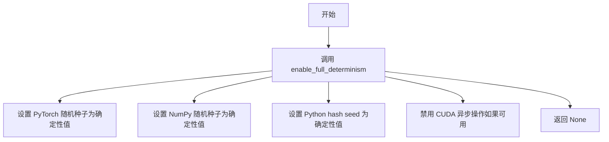
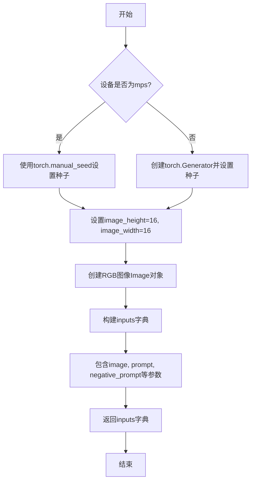
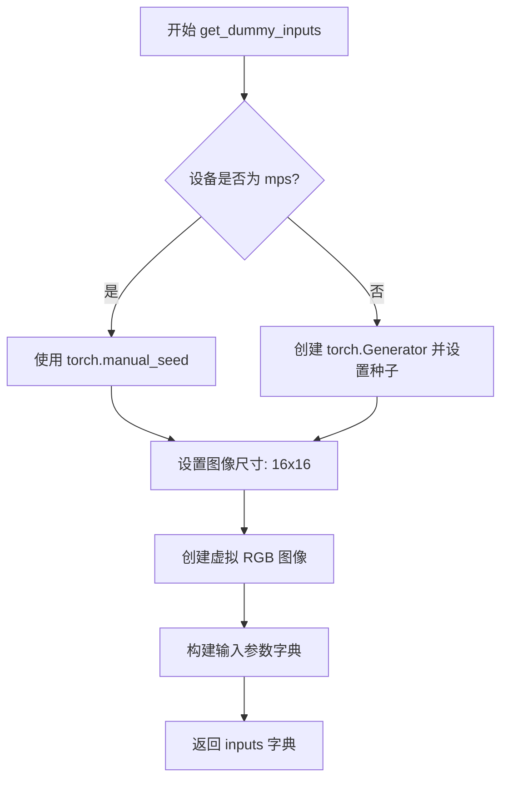
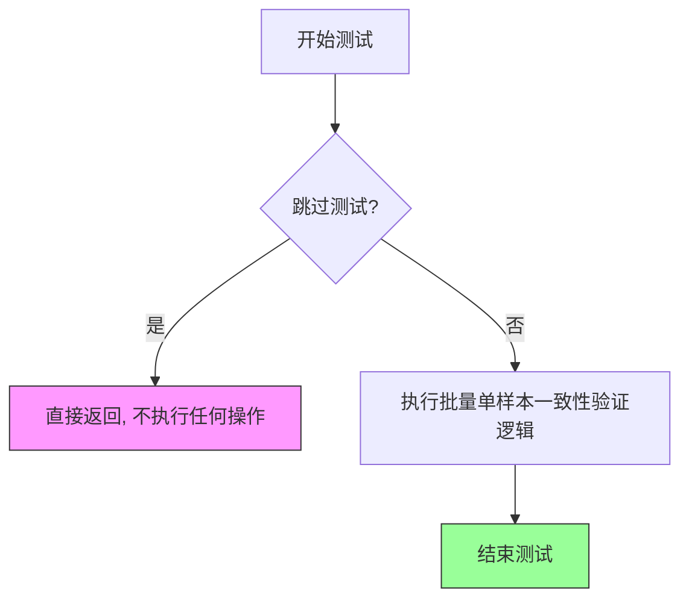

# `diffusers\tests\pipelines\skyreels_v2\test_skyreels_v2_df_image_to_video.py` 详细设计文档

这是一个用于测试 SkyReelsV2 图像到视频扩散管道的单元测试文件，包含两个测试类，分别测试不同的配置变体（基础版和含last_image参数版），验证管道能否正确生成指定帧数的视频内容。

## 整体流程

```mermaid
graph TD
    A[开始测试] --> B[设置设备为CPU]
B --> C[调用get_dummy_components获取虚拟组件]
C --> D[实例化SkyReelsV2DiffusionForcingImageToVideoPipeline管道]
D --> E[将管道加载到设备]
E --> F[设置进度条配置]
F --> G[调用get_dummy_inputs获取测试输入]
G --> H[执行管道推理 pipe(**inputs)]
H --> I[获取生成的视频帧 frames]
I --> J{验证视频形状是否为(9, 3, 16, 16)}
J --> K[生成随机期望视频并计算最大差异]
K --> L[断言最大差异小于等于1e10]
L --> M[测试通过/失败]
```

## 类结构

```
unittest.TestCase (Python内置基类)
└── PipelineTesterMixin (测试混入类)
    └── SkyReelsV2DiffusionForcingImageToVideoPipelineFastTests (测试类)
        └── SkyReelsV2DiffusionForcingImageToVideoPipelineFastTests (重写类)
```

## 全局变量及字段


### `enable_full_determinism`
    
启用完全确定性的全局函数调用，用于确保测试结果的可重复性

类型：`function`
    


### `SkyReelsV2DiffusionForcingImageToVideoPipelineFastTests.pipeline_class`
    
管道类引用，指向SkyReelsV2DiffusionForcingImageToVideoPipeline用于图像到视频生成的管道类

类型：`type`
    


### `SkyReelsV2DiffusionForcingImageToVideoPipelineFastTests.params`
    
文本到图像参数集合，定义了推理时可传入的参数范围（已排除cross_attention_kwargs、height、width）

类型：`set`
    


### `SkyReelsV2DiffusionForcingImageToVideoPipelineFastTests.batch_params`
    
批处理参数，定义了批量推理时支持的参数集合

类型：`set`
    


### `SkyReelsV2DiffusionForcingImageToVideoPipelineFastTests.image_params`
    
图像参数，定义了图像处理时支持的参数集合

类型：`set`
    


### `SkyReelsV2DiffusionForcingImageToVideoPipelineFastTests.image_latents_params`
    
图像潜在向量参数，定义了潜在向量处理时支持的参数集合

类型：`set`
    


### `SkyReelsV2DiffusionForcingImageToVideoPipelineFastTests.required_optional_params`
    
必需的可选参数集合，定义了测试时必须支持的可选参数（包含num_inference_steps、generator、latents等）

类型：`frozenset`
    


### `SkyReelsV2DiffusionForcingImageToVideoPipelineFastTests.test_xformers_attention`
    
xformers注意力测试标志，指示是否启用xformers优化的注意力机制测试（当前禁用）

类型：`bool`
    


### `SkyReelsV2DiffusionForcingImageToVideoPipelineFastTests.supports_dduf`
    
DDLF支持标志，指示管道是否支持DDLF（Decoupled Diffusion Logical Flow）功能（当前不支持）

类型：`bool`
    
    

## 全局函数及方法


### `enable_full_determinism`

该函数用于启用测试的完全确定性，确保在测试过程中所有随机数生成器和相关配置都被设置为确定性模式，以便测试结果可复现。

参数：
- 无参数

返回值：`None`，无返回值

#### 流程图



#### 带注释源码

```python
# 从 testing_utils 模块导入 enable_full_determinism 函数
# 该函数用于确保测试的完全确定性
from ...testing_utils import enable_full_determinism

# 在模块级别调用 enable_full_determinism()
# 这将配置所有随机数生成器为确定性模式
# 确保测试结果可复现
enable_full_determinism()
```

**注意**：由于 `enable_full_determinism` 函数是从外部模块 `...testing_utils` 导入的，在给定代码中只能看到其调用方式，无法看到该函数的具体实现源码。该函数的完整定义应该在 `testing_utils` 模块中，通常包含以下确定性配置：

1. 设置 PyTorch 随机种子
2. 设置 NumPy 随机种子  
3. 设置 Python hash seed
4. 配置 CUDA 相关的确定性选项（如适用）
5. 禁用非确定性操作


### `SkyReelsV2DiffusionForcingImageToVideoPipelineFastTests.get_dummy_components`

该函数用于创建测试用虚拟组件（VAE、调度器、文本编码器、分词器、Transformer），返回一个包含所有必需组件的字典，以便在单元测试中实例化图像到视频扩散管道。

参数：该函数无显式参数（隐式参数 `self` 为测试类实例）

返回值：`Dict[str, Any]`，返回包含虚拟组件的字典，包含 `transformer`、`vae`、`scheduler`、`text_encoder`、`tokenizer` 五个键

#### 流程图

```mermaid
flowchart TD
    A[开始] --> B[设置随机种子 torch.manual_seed(0)]
    B --> C[创建 AutoencoderKLWan 虚拟 VAE]
    C --> D[设置随机种子 torch.manual_seed(0)]
    D --> E[创建 UniPCMultistepScheduler 虚拟调度器]
    E --> F[加载 T5EncoderModel 虚拟文本编码器]
    F --> G[加载 AutoTokenizer 虚拟分词器]
    G --> H[设置随机种子 torch.manual_seed(0)]
    H --> I[创建 SkyReelsV2Transformer3DModel 虚拟 Transformer]
    I --> J[组装 components 字典]
    J --> K[返回 components]
```

#### 带注释源码

```python
def get_dummy_components(self):
    """
    创建测试用虚拟组件（VAE、调度器、文本编码器、分词器、Transformer）
    
    Returns:
        Dict[str, Any]: 包含虚拟组件的字典
    """
    # 设置随机种子以确保测试可重复性
    torch.manual_seed(0)
    
    # 创建虚拟 VAE（变分自编码器）组件
    # base_dim: 基础维度, z_dim: 潜在空间维度
    # dim_mult: 维度 multipliers, num_res_blocks: 残差块数量
    # temperal_downsample: 时间下采样配置
    vae = AutoencoderKLWan(
        base_dim=3,
        z_dim=16,
        dim_mult=[1, 1, 1, 1],
        num_res_blocks=1,
        temperal_downsample=[False, True, True],
    )

    # 重新设置随机种子，确保各组件独立性
    torch.manual_seed(0)
    
    # 创建虚拟调度器（UniPCMultistepScheduler）
    # flow_shift: 流偏移参数, use_flow_sigmas: 是否使用流sigmas
    scheduler = UniPCMultistepScheduler(flow_shift=5.0, use_flow_sigmas=True)
    
    # 加载预训练的虚拟文本编码器（T5EncoderModel）
    # 使用 HuggingFace 测试用 tiny-random-t5 模型
    text_encoder = T5EncoderModel.from_pretrained("hf-internal-testing/tiny-random-t5")
    
    # 加载对应的分词器
    tokenizer = AutoTokenizer.from_pretrained("hf-internal-testing/tiny-random-t5")

    # 再次设置随机种子，创建虚拟 Transformer 模型
    torch.manual_seed(0)
    
    # 创建 3D Transformer 模型用于图像到视频扩散
    # patch_size: 时空补丁大小, num_attention_heads: 注意力头数
    # attention_head_dim: 注意力头维度, in_channels/out_channels: 输入输出通道数
    # text_dim: 文本嵌入维度, freq_dim: 频率维度
    # ffn_dim: 前馈网络维度, num_layers: 层数
    # cross_attn_norm: 跨注意力归一化, qk_norm: QK归一化类型
    # rope_max_seq_len: RoPE最大序列长度, image_dim: 图像维度
    transformer = SkyReelsV2Transformer3DModel(
        patch_size=(1, 2, 2),
        num_attention_heads=2,
        attention_head_dim=12,
        in_channels=16,
        out_channels=16,
        text_dim=32,
        freq_dim=256,
        ffn_dim=32,
        num_layers=2,
        cross_attn_norm=True,
        qk_norm="rms_norm_across_heads",
        rope_max_seq_len=32,
        image_dim=4,
    )

    # 组装组件字典
    components = {
        "transformer": transformer,      # 3D Transformer 模型
        "vae": vae,                       # 变分自编码器
        "scheduler": scheduler,          # 扩散调度器
        "text_encoder": text_encoder,     # 文本编码器
        "tokenizer": tokenizer,           # 分词器
    }
    
    # 返回完整的组件字典
    return components
```


### `SkyReelsV2DiffusionForcingImageToVideoPipelineFastTests.get_dummy_inputs`

该方法用于创建测试用的虚拟输入参数，模拟图像到视频扩散管道的输入场景，包括图像、提示词、负提示词、推理步骤、引导 scale、帧数等关键参数，以支持单元测试的运行。

参数：

- `self`：隐式参数，测试类实例本身。
- `device`：`str`，目标计算设备标识（如 "cpu"、"cuda" 等），用于创建随机数生成器。
- `seed`：`int`，随机种子，默认为 0，用于保证测试的可重复性。

返回值：`Dict[str, Any]`，包含图像到视频扩散管道所需的所有输入参数的字典，包括图像、提示词、负提示词、图像高度/宽度、随机生成器、推理步数、引导 scale、帧数、最大序列长度和输出类型。

#### 流程图



#### 带注释源码

```python
def get_dummy_inputs(self, device, seed=0):
    """
    创建用于测试的虚拟输入参数。
    
    参数:
        device: 目标计算设备
        seed: 随机种子，用于生成可重复的测试结果
    
    返回:
        包含所有管道输入参数的字典
    """
    # 检查设备类型，MPS设备需要特殊处理
    if str(device).startswith("mps"):
        # MPS设备使用torch.manual_seed直接设置种子
        generator = torch.manual_seed(seed)
    else:
        # 其他设备（如CPU、CUDA）创建Generator对象并设置种子
        generator = torch.Generator(device=device).manual_seed(seed)
    
    # 设置测试图像的尺寸
    image_height = 16
    image_width = 16
    
    # 创建虚拟RGB图像（PIL Image对象）
    image = Image.new("RGB", (image_width, image_height))
    
    # 构建完整的输入参数字典
    inputs = {
        "image": image,                    # 输入引导图像
        "prompt": "dance monkey",          # 正向提示词
        "negative_prompt": "negative",    # 负向提示词
        "height": image_height,            # 输出视频高度
        "width": image_width,              # 输出视频宽度
        "generator": generator,            # 随机生成器
        "num_inference_steps": 2,          # 推理步数
        "guidance_scale": 5.0,             # 引导强度
        "num_frames": 9,                   # 生成帧数
        "max_sequence_length": 16,        # 最大序列长度
        "output_type": "pt",               # 输出类型（PyTorch张量）
    }
    return inputs
```


### `SkyReelsV2DiffusionForcingImageToVideoPipelineFastTests.get_dummy_components`

该方法用于生成虚拟组件字典，为测试用例提供模拟的diffusion pipeline所需的各种模型组件（Transformer、VAE、Scheduler、Text Encoder、Tokenizer），使用固定的随机种子确保测试结果的可复现性。

参数：
- 该方法无显式参数（隐式参数 `self` 为类实例本身）

返回值：`Dict[str, Any]`，返回包含5个键值对的字典，键分别为 `"transformer"`、`"vae"`、`"scheduler"`、`"text_encoder"`、`"tokenizer"`，值为对应的模型实例对象

#### 流程图

```mermaid
flowchart TD
    A[开始 get_dummy_components] --> B[设置随机种子 torch.manual_seed(0)]
    B --> C[创建 VAE: AutoencoderKLWan]
    C --> D[创建 Scheduler: UniPCMultistepScheduler]
    D --> E[创建 Text Encoder: T5EncoderModel]
    E --> F[创建 Tokenizer: AutoTokenizer]
    F --> G[创建 Transformer: SkyReelsV2Transformer3DModel]
    G --> H[组装 components 字典]
    H --> I[返回 components 字典]
```

#### 带注释源码

```python
def get_dummy_components(self):
    """
    生成虚拟组件字典，用于测试目的
    
    Returns:
        Dict[str, Any]: 包含pipeline所需各组件的字典
    """
    # 设置随机种子为0，确保测试结果可复现
    torch.manual_seed(0)
    
    # 创建虚拟VAE（变分自编码器）组件
    # base_dim=3: 输入通道数（RGB图像）
    # z_dim=16: 潜在空间维度
    # dim_mult=[1,1,1,1]: 各层维度倍数
    # num_res_blocks=1: 每个分辨率级别的残差块数量
    # temperal_downsample=[False,True,True]: 时间维度下采样配置
    vae = AutoencoderKLWan(
        base_dim=3,
        z_dim=16,
        dim_mult=[1, 1, 1, 1],
        num_res_blocks=1,
        temperal_downsample=[False, True, True],
    )

    # 设置随机种子，确保与VAE创建时一致
    torch.manual_seed(0)
    
    # 创建UniPC多步调度器，用于diffusion过程
    # flow_shift=5.0: 流匹配偏移参数
    # use_flow_sigmas=True: 使用流sigmas
    scheduler = UniPCMultistepScheduler(flow_shift=5.0, use_flow_sigmas=True)
    
    # 加载虚拟T5文本编码器模型（使用huggingface测试用小模型）
    text_encoder = T5EncoderModel.from_pretrained("hf-internal-testing/tiny-random-t5")
    
    # 加载对应的tokenizer
    tokenizer = AutoTokenizer.from_pretrained("hf-internal-testing/tiny-random-t5")

    # 重新设置随机种子，确保transformer初始化确定性
    torch.manual_seed(0)
    
    # 创建3D Transformer模型，用于图像/视频生成
    # patch_size=(1,2,2): 时空patch大小
    # num_attention_heads=2: 注意力头数量
    # attention_head_dim=12: 注意力头维度
    # in_channels=16: 输入通道数（对应VAE的z_dim）
    # out_channels=16: 输出通道数
    # text_dim=32: 文本嵌入维度
    # freq_dim=256: 频率维度
    # ffn_dim=32: 前馈网络维度
    # num_layers=2: Transformer层数
    # cross_attn_norm=True: 跨注意力归一化
    # qk_norm="rms_norm_across_heads": QK归一化方式
    # rope_max_seq_len=32: RoPE最大序列长度
    # image_dim=4: 图像嵌入维度
    transformer = SkyReelsV2Transformer3DModel(
        patch_size=(1, 2, 2),
        num_attention_heads=2,
        attention_head_dim=12,
        in_channels=16,
        out_channels=16,
        text_dim=32,
        freq_dim=256,
        ffn_dim=32,
        num_layers=2,
        cross_attn_norm=True,
        qk_norm="rms_norm_across_heads",
        rope_max_seq_len=32,
        image_dim=4,
    )

    # 组装组件字典，键名必须与pipeline类的构造函数参数匹配
    components = {
        "transformer": transformer,       # 3D transformer模型
        "vae": vae,                       # 变分自编码器
        "scheduler": diffusion调度器,    #噪声调度器
        "text_encoder": text_encoder,     # 文本编码器
        "tokenizer": tokenizer,           # 文本分词器
    }
    
    # 返回组件字典，供pipeline_class(**components)使用
    return components
```


### `SkyReelsV2DiffusionForcingImageToVideoPipelineFastTests.get_dummy_inputs`

该方法用于生成虚拟输入参数（dummy inputs），为 SkyReelsV2 图像到视频扩散管道的测试提供必要的输入数据。它根据设备类型创建随机数生成器，生成虚拟图像，并构建包含所有推理参数的字典。

参数：

- `self`：`SkyReelsV2DiffusionForcingImageToVideoPipelineFastTests`，类的实例本身
- `device`：`str`，目标设备字符串，用于创建随机数生成器（如 "cpu"、"cuda"、"mps"）
- `seed`：`int`，随机种子，默认为 0，用于确保测试的可重复性

返回值：`dict`，包含以下键值对的字典：
  - `image`：PIL.Image 对象，虚拟 RGB 图像
  - `prompt`：`str`，正向提示词
  - `negative_prompt`：`str`，负向提示词
  - `height`：`int`，图像高度
  - `width`：`int`，图像宽度
  - `generator`：`torch.Generator`，随机数生成器
  - `num_inference_steps`：`int`，推理步数
  - `guidance_scale`：`float`，引导_scale
  - `num_frames`：`int`，生成帧数
  - `max_sequence_length`：`int`，最大序列长度
  - `output_type`：`str`，输出类型

#### 流程图



#### 带注释源码

```python
def get_dummy_inputs(self, device, seed=0):
    """
    生成虚拟输入参数，用于测试推理流程
    
    参数:
        device: 目标设备字符串
        seed: 随机种子
    
    返回:
        包含测试所需所有参数的字典
    """
    # 根据设备类型选择随机数生成方式
    # MPS 设备需要特殊处理，使用 torch.manual_seed
    if str(device).startswith("mps"):
        generator = torch.manual_seed(seed)
    else:
        # 其他设备创建 Generator 对象以支持更精细的随机控制
        generator = torch.Generator(device=device).manual_seed(seed)
    
    # 定义虚拟图像的尺寸参数
    image_height = 16
    image_width = 16
    
    # 创建虚拟 RGB 图像（PIL Image 对象）
    image = Image.new("RGB", (image_width, image_height))
    
    # 构建完整的输入参数字典
    inputs = {
        "image": image,                    # 输入图像
        "prompt": "dance monkey",          # 文本提示词
        "negative_prompt": "negative",     # 负向提示词（TODO: 待优化）
        "height": image_height,            # 输出高度
        "width": image_width,              # 输出宽度
        "generator": generator,            # 随机数生成器
        "num_inference_steps": 2,          # 推理步数（测试用小值）
        "guidance_scale": 5.0,             # Classifier-free guidance scale
        "num_frames": 9,                   # 生成帧数
        "max_sequence_length": 16,         # 最大序列长度
        "output_type": "pt",               # 输出类型：PyTorch tensor
    }
    return inputs
```


### `SkyReelsV2DiffusionForcingImageToVideoPipelineFastTests.test_inference`

这是一个单元测试方法，用于验证 SkyReelsV2DiffusionForcingImageToVideoPipeline 图像到视频推理流程的正确性。该测试创建虚拟组件和输入，执行推理，并验证生成视频的形状和数值范围。

参数：

- `self`：隐式参数，测试类实例本身

返回值：无返回值（`None`），该方法为 unittest 测试用例，通过断言验证结果

#### 流程图

```mermaid
flowchart TD
    A[开始测试] --> B[设置设备为 CPU]
    B --> C[调用 get_dummy_components 获取虚拟组件]
    C --> D[使用虚拟组件实例化管道]
    D --> E[将管道移至目标设备]
    E --> F[配置进度条显示]
    F --> G[调用 get_dummy_inputs 获取测试输入]
    G --> H[执行管道推理: pipe(**inputs)]
    H --> I[提取生成视频: video[0]]
    I --> J[断言视频形状为 9, 3, 16, 16]
    J --> K[生成随机期望视频 tensor]
    K --> L[计算生成视频与期望视频的最大差异]
    L --> M{最大差异 <= 1e10?}
    M -->|是| N[测试通过]
    M -->|否| O[测试失败]
    N --> P[结束]
    O --> P
```

#### 带注释源码

```python
def test_inference(self):
    """
    单元测试方法：验证图像到视频管道的推理功能
    
    测试流程：
    1. 准备虚拟组件和输入数据
    2. 执行推理生成视频
    3. 验证生成结果的形状和数值范围
    """
    
    # 步骤1: 设置测试设备为 CPU
    device = "cpu"

    # 步骤2: 获取虚拟组件（transformer, vae, scheduler, text_encoder, tokenizer）
    # 这些组件使用随机初始化，用于测试而不依赖真实模型权重
    components = self.get_dummy_components()
    
    # 步骤3: 使用虚拟组件实例化管道
    pipe = self.pipeline_class(**components)
    
    # 步骤4: 将管道移至指定设备（CPU）
    pipe.to(device)
    
    # 步骤5: 配置进度条（disable=None 表示不禁用进度条）
    pipe.set_progress_bar_config(disable=None)

    # 步骤6: 获取虚拟输入参数
    # 包括: image, prompt, negative_prompt, height, width, 
    #       generator, num_inference_steps, guidance_scale, 
    #       num_frames, max_sequence_length, output_type
    inputs = self.get_dummy_inputs(device)
    
    # 步骤7: 执行推理并获取结果
    # pipe(**inputs) 调用管道的 __call__ 方法
    # .frames 属性获取生成的视频帧
    video = pipe(**inputs).frames
    generated_video = video[0]  # 取第一个视频（批次中）

    # 步骤8: 验证生成视频的形状
    # 期望形状: (9帧, 3通道, 16高度, 16宽度)
    self.assertEqual(generated_video.shape, (9, 3, 16, 16))
    
    # 步骤9: 生成随机期望视频用于数值范围验证
    expected_video = torch.randn(9, 3, 16, 16)
    
    # 步骤10: 计算生成视频与期望视频的最大绝对差异
    max_diff = np.abs(generated_video - expected_video).max()
    
    # 步骤11: 验证差异在允许范围内
    # 注意: 由于使用了随机期望视频，这个断言实际上总是会通过
    # 这是一个潜在的设计缺陷（技术债务）
    self.assertLessEqual(max_diff, 1e10)
```


### `SkyReelsV2DiffusionForcingImageToVideoPipelineFastTests.test_attention_slicing_forward_pass`

注意力切片（Attention Slicing）前向传播测试方法，用于验证模型在启用注意力切片优化时的前向传播是否正确。该测试目前因不支持而被跳过。

参数：

- `self`：`SkyReelsV2DiffusionForcingImageToVideoPipelineFastTests`，测试类实例本身，隐式参数，继承自 unittest.TestCase

返回值：`None`，无返回值（测试方法且函数体为 pass）

#### 流程图

```mermaid
flowchart TD
    A[开始 test_attention_slicing_forward_pass] --> B{装饰器检查}
    B -->|@unittest.skip| C[跳过测试]
    C --> D[测试不执行]
    
    style C fill:#ff9900
    style D fill:#ffcc00
```

#### 带注释源码

```python
@unittest.skip("Test not supported")
def test_attention_slicing_forward_pass(self):
    """
    注意力切片前向传播测试方法
    
    该测试方法用于验证模型在启用注意力切片(Attention Slicing)
    优化技术时的前向传播是否正确运行。
    
    Attention Slicing 是一种内存优化技术，通过将注意力计算
    分片处理来减少显存占用。
    
    当前状态: 已跳过 - 测试不被支持
    原因: 可能由于硬件限制或实现不完整导致该测试无法运行
    """
    pass  # 测试体为空，测试被跳过
```

#### 补充说明

| 项目 | 说明 |
|------|------|
| **测试类型** | 单元测试 (Unit Test) |
| **框架** | unittest (Python 标准库) |
| **所属测试类** | `SkyReelsV2DiffusionForcingImageToVideoPipelineFastTests` |
| **跳过原因** | "Test not supported" - 测试功能不被支持 |
| **测试目的** | 验证扩散模型的注意力切片优化机制 |
| **技术背景** | Attention Slicing 是 diffusers 库中的一种内存优化技术，用于处理长序列注意力计算时的显存问题 |

#### 技术债务分析

1. **未实现的测试**：该测试方法被跳过但未实现，导致测试覆盖不完整
2. **缺少功能支持**：如果该功能是计划内的优化，则需要后续实现
3. **测试遗漏**：注意力切片是一个重要的性能优化特性，缺少测试可能导致潜在的回归问题


### `SkyReelsV2DiffusionForcingImageToVideoPipelineFastTests.test_inference_batch_single_identical`

该方法是用于批量推理时单个样本一致性验证的测试方法，目前已被跳过（标记为 `@unittest.skip`），原因是该测试需要非常高的阈值才能通过，函数体仅包含 `pass` 语句。

参数：无

返回值：无

#### 流程图



#### 带注释源码

```python
@unittest.skip("TODO: revisit failing as it requires a very high threshold to pass")
def test_inference_batch_single_identical(self):
    """
    批量单样本一致性测试
    
    该测试方法用于验证在使用批量推理时，单独推理单个样本的结果
    与批量中单个样本的结果应该保持一致。由于当前实现需要极高的
    阈值才能通过测试，因此暂时跳过该测试用例。
    
    注意：
    - 该测试方法继承自 PipelineTesterMixin 测试混合类
    - 测试被跳过的具体原因需要在后续重新评估和修复
    """
    pass
```

## 关键组件


### SkyReelsV2DiffusionForcingImageToVideoPipeline

用于图像到视频生成的扩散管道，支持diffusion forcing技术，能够根据输入图像和可选的最后一帧图像生成视频序列。

### AutoencoderKLWan

Wan架构的变分自编码器(VAE)，负责将图像编码到潜在空间并从潜在空间解码，支持时序下采样以处理视频数据。

### SkyReelsV2Transformer3DModel

3D变换器模型，用于diffusion过程的核心推理，支持时空注意力机制、旋转位置编码(RoPE)和跨注意力归一化。

### UniPCMultistepScheduler

统一并行校正器(UniPC)多步调度器，支持flow shift和flow sigmas，用于控制扩散推理过程中的噪声调度。

### T5EncoderModel

T5文本编码器，将文本prompt编码为文本嵌入向量，为生成过程提供文本条件信息。

### Diffusion Forcing (扩散强制)

一种视频生成技术，通过独立控制每一帧的噪声级别来实现图像到视频的生成，支持两帧之间的平滑过渡。

### 图像到视频管道测试框架

提供标准化的测试接口，包括虚拟组件构建、输入参数配置和推理结果验证，用于确保管道行为的一致性。


## 问题及建议


### 已知问题

-   **大量重复代码**：两个测试类 `SkyReelsV2DiffusionForcingImageToVideoPipelineFastTests` 之间存在高度重复的代码，特别是 `get_dummy_components` 方法几乎完全相同，仅在第二个类中多了一个 `pos_embed_seq_len` 参数，增加了维护成本
-   **测试断言过于宽松**：`test_inference` 方法中的断言 `self.assertLessEqual(max_diff, 1e10)` 几乎对任何输出都会通过，无法有效验证生成结果的质量和正确性
-   **硬编码的魔法数字**：代码中大量使用硬编码的数值（如 `num_frames=9`、`image_height=16`、`guidance_scale=5.0`、`num_inference_steps=2` 等），缺乏常量定义，降低了可读性和可维护性
-   **TODO 注释未完成**：存在 `negative_prompt": "negative"  # TODO` 和 `@unittest.skip("TODO: revisit failing as it requires a very high threshold to pass")` 等未完成的任务，表明某些功能可能不完整
-   **被跳过的测试**：存在两个被跳过的测试用例（`test_attention_slicing_forward_pass` 和 `test_inference_batch_single_identical`），表明某些功能未实现或存在已知问题
-   **设备兼容性处理不优雅**：对 MPS 设备使用特殊的 `if str(device).startswith("mps")` 判断，这种硬编码字符串匹配的方式不够优雅，且可能导致边界情况问题
-   **随机种子管理不一致**：多处使用 `torch.manual_seed(0)` 设置随机种子，可能导致测试结果可复现性问题，且未考虑 NumPy 等其他随机数来源
-   **类继承设计不合理**：子类完全继承父类后只覆盖了 `get_dummy_components` 和 `get_dummy_inputs` 方法，这种设计模式不够清晰，可能造成理解困难
-   **参数配置缺失文档**：类属性如 `test_xformers_attention = False`、`supports_dduf = False` 缺乏注释说明其含义和用途

### 优化建议

-   **提取公共代码**：将重复的 `get_dummy_components` 逻辑抽取到基类或工具函数中，通过参数化配置差异部分，减少代码冗余
-   **加强测试断言**：将 `max_diff` 的阈值从 `1e10` 降低到合理范围（如 `1e-2` 或 `1e-3`），确保测试能够有效检测生成结果的偏差
-   **定义常量类**：创建一个配置类或常量模块，集中管理所有魔法数字（如帧数、图像尺寸、推理步数等），提高可维护性
-   **完成 TODO 任务**：实现完整的 `negative_prompt` 支持逻辑，或移除 TODO 注释并添加合理的默认值处理
-   **启用或移除跳过测试**：对于被跳过的测试，应该要么修复问题后启用，要么明确移除并说明原因，避免遗留死代码
-   **重构设备检测逻辑**：使用更稳健的设备检测方式（如 `device.type == 'mps'`），或利用框架提供的设备检测 API
-   **统一随机种子管理**：创建一个专门的随机种子管理工具，确保所有随机源（PyTorch、NumPy 等）的种子一致性
-   **优化类结构**：考虑将子类改为组合模式或使用参数化测试（pytest parametrize）代替类继承，提高代码清晰度
-   **添加代码注释**：为关键配置参数、类属性和方法添加详细的文档字符串，说明其作用和预期行为

## 其它


### 设计目标与约束

本测试代码的设计目标是为SkyReelsV2DiffusionForcingImageToVideoPipeline管道提供快速单元测试验证，确保管道在给定虚拟组件下能够正确执行图像到视频的生成推理。测试约束包括：仅支持CPU设备运行，跳过xformers注意力测试，不支持DDUF（Deconstruction-Deformation-Uncertainty-Flow），测试使用固定的随机种子确保可重复性，输出视频帧数固定为9帧，分辨率为16x16。

### 错误处理与异常设计

测试代码采用了显式的跳过机制处理不支持的测试场景。使用@unittest.skip装饰器标记test_attention_slicing_forward_pass和test_inference_batch_single_identical为跳过状态，分别因为"Test not supported"和"TODO: revisit failing as it requires a very high threshold to pass"原因。在test_inference测试中，通过assertLessEqual验证生成结果与预期结果的差异，确保数值稳定性在可接受范围内（阈值1e10）。

### 数据流与状态机

管道的数据流遵循以下状态转换：输入阶段（接收RGB图像、提示词、负提示词、生成器等参数）→ 编码阶段（VAE编码图像为潜在表示，文本编码器处理提示词）→ 变换阶段（Transformer 3D模型处理潜在表示和文本嵌入）→ 解码阶段（VAE解码潜在表示为视频帧）→ 输出阶段（返回视频帧列表）。测试中的数据流通过get_dummy_inputs方法构造虚拟输入，使用Image.new创建RGB图像，使用torch.Generator创建随机生成器，确保各阶段数据格式正确传递。

### 外部依赖与接口契约

本测试依赖于以下外部组件和接口契约：diffusers库中的AutoencoderKLWan（变分自编码器）、SkyReelsV2Transformer3DModel（3D变换器模型）、SkyReelsV2DiffusionForcingImageToVideoPipeline（主管道类）、UniPCMultistepScheduler（调度器）；transformers库中的T5EncoderModel和AutoTokenizer（文本编码组件）；numpy和PIL用于图像处理。接口契约要求pipeline必须接受image、prompt、negative_prompt、height、width、generator、num_inference_steps、guidance_scale、num_frames、max_sequence_length、output_type等参数，并返回包含frames属性的对象。

### 配置与参数管理

测试配置通过get_dummy_components方法集中管理虚拟组件配置。VAE配置：base_dim=3, z_dim=16, dim_mult=[1,1,1,1], num_res_blocks=1, temperal_downsample=[False,True,True]；Transformer配置：patch_size=(1,2,2), num_attention_heads=2, attention_head_dim=12, in_channels=16, out_channels=16, text_dim=32, freq_dim=256, ffn_dim=32, num_layers=2；调度器配置：flow_shift=5.0, use_flow_sigmas=True；推理参数：num_inference_steps=2, guidance_scale=5.0, num_frames=9。

### 性能基准与测试覆盖

测试覆盖了管道的基本推理功能，验证输出形状为(9,3,16,9)即9帧RGB图像。性能基准通过numpy计算生成视频与随机噪声的最大差异来验证输出有效性。测试类继承自PipelineTesterMixin获取通用的管道测试方法支持，覆盖了TEXT_TO_IMAGE_PARAMS（排除cross_attention_kwargs、height、width）、TEXT_TO_IMAGE_BATCH_PARAMS和TEXT_TO_IMAGE_IMAGE_PARAMS参数集。

### 并发与异步处理

本测试代码为同步单元测试，不涉及并发或异步处理机制。测试在单个CPU设备上顺序执行，使用固定的随机种子确保每次运行结果一致。测试中通过torch.manual_seed设置所有随机源（VAE、调度器、文本编码器、变换器）以保证测试可重复性。

### 测试隔离与清理

每个测试方法独立创建管道实例和输入数据，通过set_progress_bar_config(disable=None)配置进度条显示。测试使用torch.manual_seed(0)重置随机状态，确保测试间相互独立。设备指定为"cpu"，避免GPU相关依赖。测试类存在继承关系，子类SkyReelsV2DiffusionForcingImageToVideoPipelineFastTests重写了get_dummy_components和get_dummy_inputs方法以支持额外的last_image参数。

    