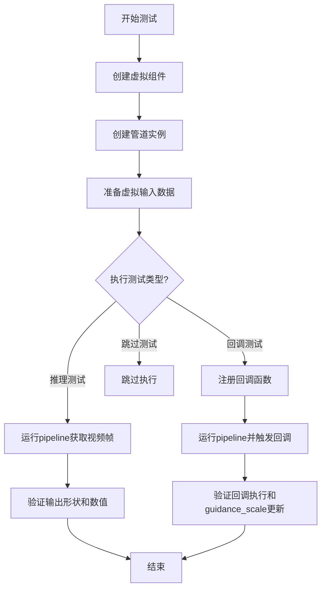
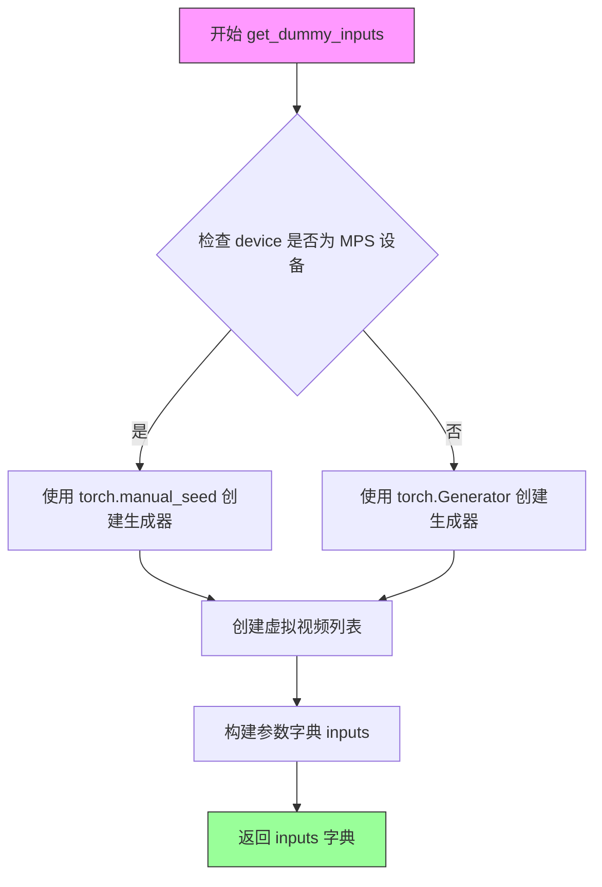
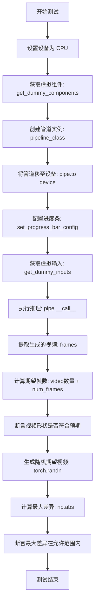
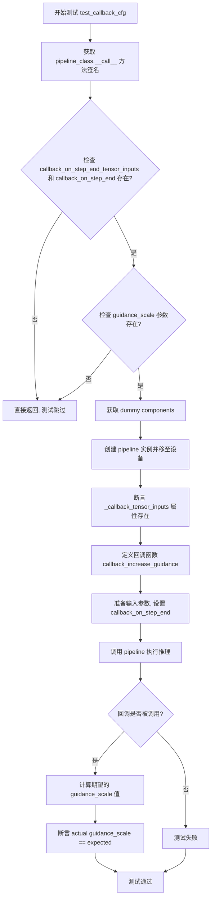
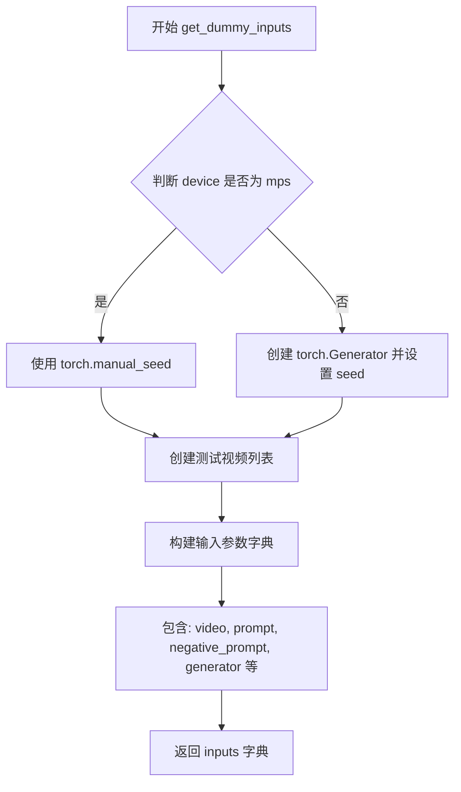
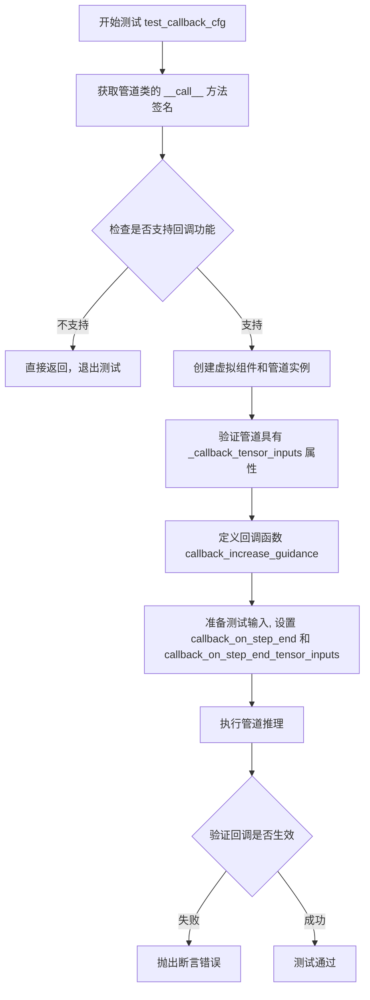
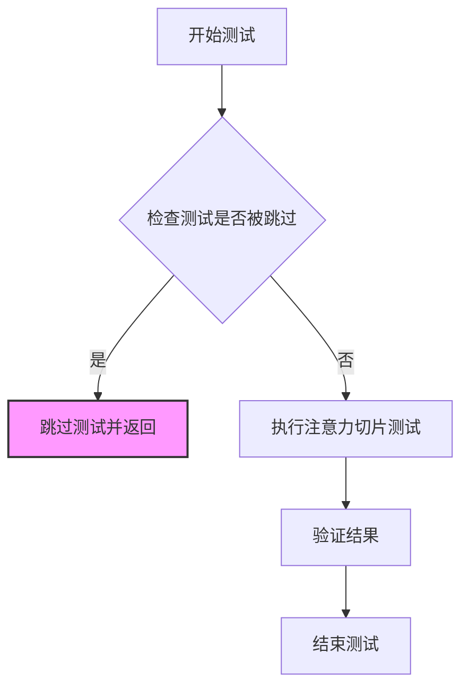
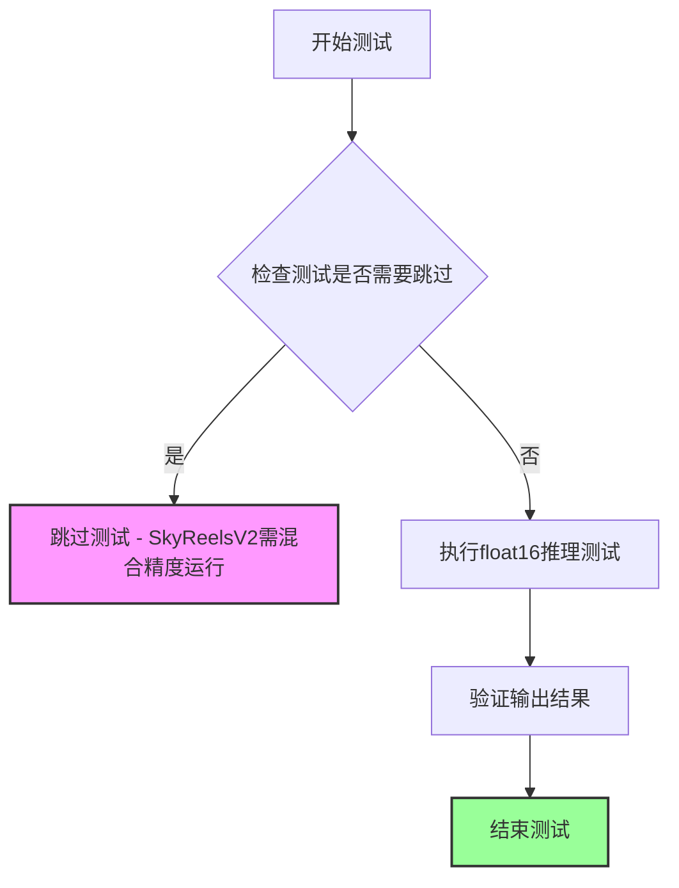
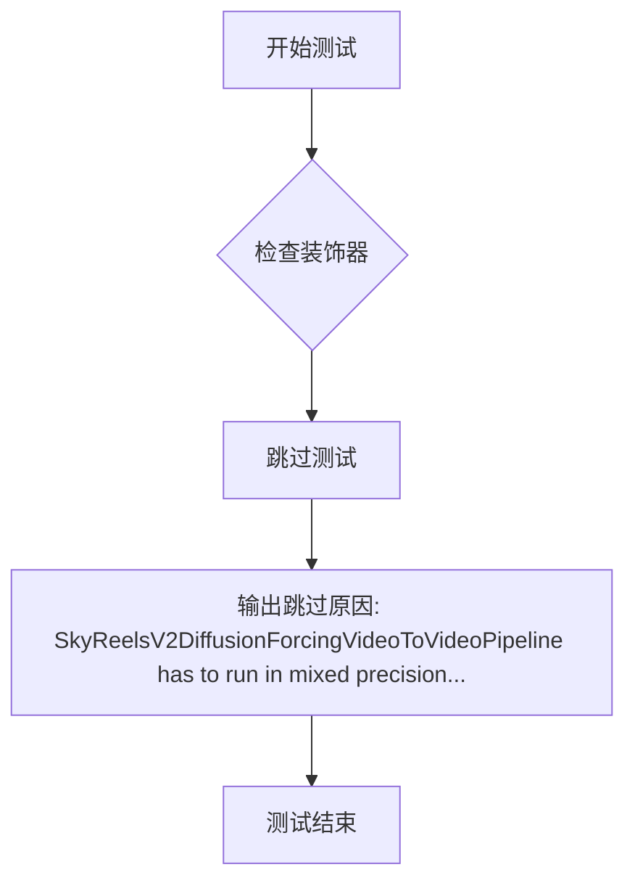

# `diffusers\tests\pipelines\skyreels_v2\test_skyreels_v2_df_video_to_video.py` 详细设计文档

这是一个Hugging Face diffusers库的单元测试文件，用于测试SkyReelsV2DiffusionForcingVideoToVideoPipeline（视频到视频扩散强制管道）的功能，包括推理测试和回调机制验证。

## 整体流程



## 类结构

```
SkyReelsV2DiffusionForcingVideoToVideoPipelineFastTests (测试类)
└── 继承自 PipelineTesterMixin, unittest.TestCase
```

## 全局变量及字段


### `np`
    
NumPy库，用于数值计算和数组操作

类型：`module`
    


### `torch`
    
PyTorch库，用于深度学习张量操作和模型构建

类型：`module`
    


### `Image`
    
PIL图像库，用于图像处理和创建

类型：`class`
    


### `AutoTokenizer`
    
Hugging Face Transformers库中的自动分词器类，用于文本编码

类型：`class`
    


### `T5EncoderModel`
    
T5文本编码器模型类，用于将文本转换为嵌入向量

类型：`class`
    


### `AutoencoderKLWan`
    
Wan VAE变分自编码器模型类，用于图像潜在空间编码和解码

类型：`class`
    


### `SkyReelsV2DiffusionForcingVideoToVideoPipeline`
    
SkyReels V2扩散强制视频到视频生成管道类，用于基于视频和文本提示生成新视频

类型：`class`
    


### `SkyReelsV2Transformer3DModel`
    
SkyReels V2 3D变换器模型类，用于视频生成的扩散过程

类型：`class`
    


### `UniPCMultistepScheduler`
    
UniPC多步调度器类，用于控制扩散模型的采样过程

类型：`class`
    


### `enable_full_determinism`
    
启用完全确定性测试的函数，确保测试结果可复现

类型：`function`
    


### `torch_device`
    
PyTorch设备变量，指定计算设备如CPU或CUDA

类型：`str`
    


### `TEXT_TO_IMAGE_IMAGE_PARAMS`
    
文本到图像图像参数集合，定义图像相关的输入参数

类型：`frozenset`
    


### `TEXT_TO_IMAGE_PARAMS`
    
文本到图像参数集合，定义文本生成图像的输入参数

类型：`frozenset`
    


### `PipelineTesterMixin`
    
管道测试混入类，提供通用管道测试方法和断言

类型：`class`
    


### `SkyReelsV2DiffusionForcingVideoToVideoPipelineFastTests.pipeline_class`
    
被测管道类对象，指向SkyReelsV2DiffusionForcingVideoToVideoPipeline

类型：`type`
    


### `SkyReelsV2DiffusionForcingVideoToVideoPipelineFastTests.params`
    
参数字符集，定义管道调用所需的核心参数（不含cross_attention_kwargs）

类型：`frozenset`
    


### `SkyReelsV2DiffusionForcingVideoToVideoPipelineFastTests.batch_params`
    
批处理参数字符集，定义支持批处理的输入参数包括video、prompt、negative_prompt

类型：`frozenset`
    


### `SkyReelsV2DiffusionForcingVideoToVideoPipelineFastTests.image_latents_params`
    
图像潜在参数字符集，定义图像潜在向量相关的输入参数

类型：`frozenset`
    


### `SkyReelsV2DiffusionForcingVideoToVideoPipelineFastTests.required_optional_params`
    
必需可选参数字符集，定义虽然可选但测试中必须包含的参数如num_inference_steps、generator等

类型：`frozenset`
    


### `SkyReelsV2DiffusionForcingVideoToVideoPipelineFastTests.test_xformers_attention`
    
xformers注意力测试标志，指示是否测试xformers优化的注意力机制

类型：`bool`
    


### `SkyReelsV2DiffusionForcingVideoToVideoPipelineFastTests.supports_dduf`
    
是否支持dduf标志，指示管道是否支持数据驱动的上采样特征

类型：`bool`
    
    

## 全局函数及方法


### `SkyReelsV2DiffusionForcingVideoToVideoPipelineFastTests.get_dummy_components`

该方法用于创建虚拟（dummy）组件字典，为测试 `SkyReelsV2DiffusionForcingVideoToVideoPipeline` 管道提供所需的各个模型组件，包括 VAE、调度器、文本编码器、分词器和 Transformer 模型。

参数：无（仅包含隐式参数 `self`）

返回值：`Dict[str, Any]`，返回包含虚拟组件的字典，用于初始化视频生成管道

#### 流程图

```mermaid
flowchart TD
    A[开始 get_dummy_components] --> B[设置随机种子 torch.manual_seed(0)]
    B --> C[创建 AutoencoderKLWan 虚拟 VAE]
    C --> D[设置随机种子 torch.manual_seed(0)]
    D --> E[创建 UniPCMultistepScheduler 虚拟调度器]
    E --> F[加载 T5EncoderModel 虚拟文本编码器]
    F --> G[加载 AutoTokenizer 虚拟分词器]
    G --> H[设置随机种子 torch.manual_seed(0)]
    H --> I[创建 SkyReelsV2Transformer3DModel 虚拟 Transformer]
    I --> J[组装 components 字典]
    J --> K[返回 components 字典]
    
    C -.-> C1[base_dim=3, z_dim=16, dim_mult=[1,1,1,1]]
    E -.-> E1[flow_shift=5.0, use_flow_sigmas=True]
    I -.-> I1[patch_size=(1,2,2), num_attention_heads=2, num_layers=2]
    J -.-> J1[包含: transformer, vae, scheduler, text_encoder, tokenizer]
```

#### 带注释源码

```python
def get_dummy_components(self):
    """
    创建虚拟组件字典，用于测试 SkyReelsV2DiffusionForcingVideoToVideoPipeline
    所有组件使用固定随机种子确保测试可复现
    """
    # 设置随机种子，确保 VAE 创建的可复现性
    torch.manual_seed(0)
    # 创建虚拟 VAE 模型 (AutoencoderKLWan)
    # 参数配置：3维输入，16维潜在空间，1个残差块，时间下采样配置
    vae = AutoencoderKLWan(
        base_dim=3,
        z_dim=16,
        dim_mult=[1, 1, 1, 1],
        num_res_blocks=1,
        temperal_downsample=[False, True, True],
    )

    # 重新设置随机种子，确保调度器创建的可复现性
    torch.manual_seed(0)
    # 创建虚拟调度器 (UniPCMultistepScheduler)
    # 配置 flow_shift 和 use_flow_sigmas 参数
    scheduler = UniPCMultistepScheduler(flow_shift=5.0, use_flow_sigmas=True)
    
    # 加载虚拟 T5 文本编码器模型 (使用 tiny-random-t5 预训练权重)
    text_encoder = T5EncoderModel.from_pretrained("hf-internal-testing/tiny-random-t5")
    # 加载虚拟 T5 分词器 (与文本编码器配套)
    tokenizer = AutoTokenizer.from_pretrained("hf-internal-testing/tiny-random-t5")

    # 重新设置随机种子，确保 Transformer 创建的可复现性
    torch.manual_seed(0)
    # 创建虚拟 3D Transformer 模型 (SkyReelsV2Transformer3DModel)
    # 配置注意力头维度、层数、位置编码等参数
    transformer = SkyReelsV2Transformer3DModel(
        patch_size=(1, 2, 2),          # 时空patch大小
        num_attention_heads=2,         # 注意力头数量
        attention_head_dim=12,         # 注意力头维度
        in_channels=16,                # 输入通道数
        out_channels=16,               # 输出通道数
        text_dim=32,                   # 文本嵌入维度
        freq_dim=256,                  # 频率维度
        ffn_dim=32,                    # 前馈网络维度
        num_layers=2,                  # Transformer层数
        cross_attn_norm=True,          # 是否使用交叉注意力归一化
        qk_norm="rms_norm_across_heads", # QK归一化类型
        rope_max_seq_len=32,           # RoPE最大序列长度
    )

    # 组装组件字典，将所有虚拟组件整合在一起
    components = {
        "transformer": transformer,    # 3D Transformer模型
        "vae": vae,                     # VAE变分自编码器
        "scheduler": scheduler,         # 调度器
        "text_encoder": text_encoder,  # 文本编码器
        "tokenizer": tokenizer,         # 分词器
    }
    # 返回包含所有虚拟组件的字典
    return components
```


### `SkyReelsV2DiffusionForcingVideoToVideoPipelineFastTests.get_dummy_inputs`

该方法用于创建虚拟输入字典，为视频到视频扩散管道测试提供必要的参数配置，包括视频帧、提示词、随机生成器、推理步数等关键参数。

参数：

- `self`：类实例，隐式参数，代表当前测试类的实例
- `device`：`str` 或 `torch.device`，目标设备标识，用于创建随机数生成器
- `seed`：`int`，随机种子，默认值为0，用于确保测试的可重复性

返回值：`dict`，包含以下键值的参数字典：
  - `video`：图像列表，长度为7的PIL Image列表
  - `prompt`：`str`，正向提示词
  - `negative_prompt`：`str`，负向提示词
  - `generator`：`torch.Generator`，随机数生成器
  - `num_inference_steps`：`int`，推理步数（值为4）
  - `guidance_scale`：`float`，引导比例（值为6.0）
  - `height`：`int`，生成视频高度（值为16）
  - `width`：`int`，生成视频宽度（值为16）
  - `max_sequence_length`：`int`，最大序列长度（值为16）
  - `output_type`：`str`，输出类型（值为"pt"）
  - `overlap_history`：`int`，历史重叠帧数（值为3）
  - `num_frames`：`int`，总帧数（值为17）
  - `base_num_frames`：`int`，基础帧数（值为5）

#### 流程图



#### 带注释源码

```python
def get_dummy_inputs(self, device, seed=0):
    """
    创建虚拟输入字典，用于测试视频到视频扩散管道
    
    参数:
        device: 目标设备（cpu, cuda, mps等）
        seed: 随机种子，用于确保测试结果可重复
    
    返回:
        包含测试所需所有参数的字典
    """
    # 针对MPS设备特殊处理，使用torch.manual_seed直接设置种子
    if str(device).startswith("mps"):
        generator = torch.manual_seed(seed)
    else:
        # 对于其他设备，创建Generator对象并设置种子
        generator = torch.Generator(device=device).manual_seed(seed)

    # 创建虚拟视频帧：7帧16x16的RGB图像
    video = [Image.new("RGB", (16, 16))] * 7
    
    # 构建完整的输入参数字典
    inputs = {
        "video": video,                        # 输入视频帧列表
        "prompt": "dance monkey",              # 正向提示词
        "negative_prompt": "negative",        # 负向提示词（标记为TODO）
        "generator": generator,               # 随机数生成器
        "num_inference_steps": 4,              # 扩散推理步数
        "guidance_scale": 6.0,                # CFG引导强度
        "height": 16,                         # 输出高度
        "width": 16,                          # 输出宽度
        "max_sequence_length": 16,            # T5文本编码器最大序列长度
        "output_type": "pt",                  # 输出格式为PyTorch张量
        "overlap_history": 3,                 # 扩散强制重叠历史帧数
        "num_frames": 17,                     # 输出总帧数
        "base_num_frames": 5,                 # 基础帧数（用于扩散强制）
    }
    return inputs
```


### `SkyReelsV2DiffusionForcingVideoToVideoPipelineFastTests.test_inference`

该测试方法用于执行推理并验证视频生成管道的输出结果，通过创建虚拟组件和输入，执行推理流程，并验证生成的视频帧数、形状和数值范围是否符合预期。

参数：无（该方法为 unittest.TestCase 的测试方法，隐含接收 self 参数）

返回值：无返回值（该方法为测试方法，通过 unittest 断言验证结果）

#### 流程图



#### 带注释源码

```python
def test_inference(self):
    """执行推理并验证视频生成管道的输出结果"""
    
    # 步骤1: 设置计算设备为 CPU
    device = "cpu"

    # 步骤2: 获取虚拟组件（transformer, vae, scheduler, text_encoder, tokenizer）
    components = self.get_dummy_components()
    
    # 步骤3: 使用虚拟组件实例化视频到视频扩散管道
    pipe = self.pipeline_class(**components)
    
    # 步骤4: 将管道移至指定计算设备
    pipe.to(device)
    
    # 步骤5: 配置进度条（disable=None 表示不禁用）
    pipe.set_progress_bar_config(disable=None)

    # 步骤6: 获取虚拟输入参数（包含视频、提示词、生成器等）
    inputs = self.get_dummy_inputs(device)
    
    # 步骤7: 执行管道推理，获取生成的视频帧
    # pipe(**inputs) 返回包含 frames 属性的对象
    video = pipe(**inputs).frames
    
    # 步骤8: 提取第一个生成的视频
    generated_video = video[0]

    # 步骤9: 计算期望的视频帧数
    # 期望帧数 = 输入视频帧数 + 额外生成帧数
    total_frames = len(inputs["video"]) + inputs["num_frames"]
    
    # 步骤10: 定义期望的视频形状
    # 形状格式: (总帧数, 通道数, 高度, 宽度)
    expected_shape = (total_frames, 3, 16, 16)
    
    # 步骤11: 断言验证生成的视频形状是否与期望形状匹配
    self.assertEqual(generated_video.shape, expected_shape)
    
    # 步骤12: 生成随机期望视频用于差异比较
    expected_video = torch.randn(*expected_shape)
    
    # 步骤13: 计算生成视频与期望视频之间的最大绝对差异
    max_diff = np.abs(generated_video - expected_video).max()
    
    # 步骤14: 断言验证最大差异是否在允许范围内（1e10）
    # 注意: 该阈值较大，主要用于检测严重的数值异常
    self.assertLessEqual(max_diff, 1e10)
```


### `SkyReelsV2DiffusionForcingVideoToVideoPipelineFastTests.test_callback_cfg`

该测试方法用于验证扩散强制（Diffusion Forcing）视频到视频管道的回调机制是否正常工作，包括检查回调参数的存在性、回调张量输入的定义、以及回调函数在推理过程中能否正确修改管道参数（如 guidance_scale）。

参数：

- `self`：隐式参数，`SkyReelsV2DiffusionForcingVideoToVideoPipelineFastTests` 类实例本身

返回值：`None`，该方法为单元测试方法，通过断言验证回调机制，不返回具体数据

#### 流程图



#### 带注释源码

```python
def test_callback_cfg(self):
    """
    测试回调机制（Callback Configuration）是否正常工作。
    验证 diffusion forcing 管道中的回调函数能否在推理过程中
    正确修改管道参数（如 guidance_scale）。
    """
    # 1. 获取 pipeline 的 __call__ 方法的签名
    sig = inspect.signature(self.pipeline_class.__call__)
    
    # 2. 检查方法签名中是否包含回调相关的参数
    has_callback_tensor_inputs = "callback_on_step_end_tensor_inputs" in sig.parameters
    has_callback_step_end = "callback_on_step_end" in sig.parameters

    # 3. 如果回调参数不存在，则跳过测试
    if not (has_callback_tensor_inputs and has_callback_step_end):
        return

    # 4. 检查是否存在 guidance_scale 参数（某些管道可能会修改 latents shape）
    if "guidance_scale" not in sig.parameters:
        return

    # 5. 创建虚拟组件（dummy components）用于测试
    components = self.get_dummy_components()
    
    # 6. 创建 pipeline 实例并移至测试设备
    pipe = self.pipeline_class(**components)
    pipe.to(torch_device)
    pipe.set_progress_bar_config(disable=None)
    
    # 7. 验证 pipeline 是否定义了 _callback_tensor_inputs 属性
    # 该属性列出了回调函数可以使用的张量变量
    self.assertTrue(
        hasattr(pipe, "_callback_tensor_inputs"),
        f" {self.pipeline_class} should have `_callback_tensor_inputs` that defines a list of tensor variables its callback function can use as inputs",
    )

    # 8. 初始化回调调用计数器（使用列表以在闭包中可变）
    callback_call_count = [0]

    # 9. 定义回调函数：在每个推理步骤结束时增加 guidance_scale
    def callback_increase_guidance(pipe, i, t, callback_kwargs):
        """
        回调函数示例：增加 guidance_scale 值
        
        参数:
            pipe: pipeline 实例
            i: 当前步骤索引
            t: 当前时间步（timestep）
            callback_kwargs: 回调关键字参数
            
        返回:
            callback_kwargs: 返回修改后的回调参数
        """
        pipe._guidance_scale += 1.0  # 增加 guidance_scale
        callback_call_count[0] += 1  # 记录回调被调用的次数
        return callback_kwargs

    # 10. 获取测试输入
    inputs = self.get_dummy_inputs(torch_device)

    # 11. 设置 guidance_scale 为 2.0（使用 cfg 模式）
    # 某些管道可能会在去噪循环外修改 latents shape
    inputs["guidance_scale"] = 2.0
    
    # 12. 注册回调函数和回调张量输入列表
    inputs["callback_on_step_end"] = callback_increase_guidance
    inputs["callback_on_step_end_tensor_inputs"] = pipe._callback_tensor_inputs
    
    # 13. 执行 pipeline 推理（忽略返回的 frames）
    _ = pipe(**inputs)[0]

    # 14. 对于 diffusion forcing 管道，计算期望的 guidance_scale
    # 因为它们运行多个迭代（包含嵌套的去噪循环）
    expected_guidance_scale = inputs["guidance_scale"] + callback_call_count[0]

    # 15. 断言实际的 guidance_scale 与期望值一致
    assert pipe.guidance_scale == expected_guidance_scale
```


### `callback_increase_guidance`

这是一个嵌套在 `test_callback_cfg` 测试方法中的回调函数示例，用于演示如何在扩散模型的推理过程中通过回调函数动态修改管道参数（如 guidance_scale）。该函数在每个去噪步骤结束时被调用，累计增加 guidance_scale 的值以测试管道的回调机制是否正常工作。

参数：

- `pipe`：`SkyReelsV2DiffusionForcingVideoToVideoPipeline`，管道实例，通过该参数可以直接访问和修改管道的内部状态（如 `_guidance_scale`）
- `i`：`int`，当前去噪步骤的索引，表示当前处于第几个推理步骤
- `t`：`Any`，时间步（timestep）信息，具体类型取决于扩散模型的调度器（scheduler），通常为 Tensor 或整数
- `callback_kwargs`：`Dict[str, Any]`，回调函数接收的参数字典，包含推理过程中的中间状态信息，函数需要返回该字典以保持调用链的完整性

返回值：`Dict[str, Any]`，返回修改后的 `callback_kwargs` 字典，供后续回调使用

#### 流程图

```mermaid
flowchart TD
    A[开始: 接收回调参数 pipe, i, t, callback_kwargs] --> B{修改管道状态}
    B --> C[将 pipe._guidance_scale 增加 1.0]
    C --> D{更新调用计数}
    D --> E[callback_call_count[0] += 1]
    E --> F{返回 callback_kwargs}
    F --> G[返回修改后的字典, 保持回调链完整]
    A --> G
```

#### 带注释源码

```python
def callback_increase_guidance(pipe, i, t, callback_kwargs):
    """
    回调函数示例：在每个推理步骤结束时增加 guidance_scale 的值
    
    参数:
        pipe: 扩散管道实例，用于访问和修改管道内部状态
        i: 当前步骤索引，表示去噪循环中的第几次迭代
        t: 时间步（timestep），扩散过程中的时间参数
        callback_kwargs: 回调关键字参数，包含推理中间状态的字典
    
    返回:
        callback_kwargs: 返回原始参数字典，确保回调链正常传递
    """
    # 通过管道实例直接修改内部属性 _guidance_scale
    # 这里演示了在推理过程中动态调整 CFG 引导强度的能力
    pipe._guidance_scale += 1.0
    
    # 使用列表的可变特性在闭包中更新调用计数
    # 列表作为可变对象可以在嵌套函数中被修改
    callback_call_count[0] += 1
    
    # 必须返回 callback_kwargs 以保持回调链的完整性
    # 某些实现可能依赖此字典传递中间结果给后续回调
    return callback_kwargs
```

#### 设计说明

该函数体现了扩散模型管道中常见的回调机制设计：

1. **闭包变量**：使用列表 `callback_call_count[0]` 解决嵌套函数中修改外部变量的问题，因为 Python 中嵌套函数无法直接修改外部作用域的简单变量
2. **状态修改**：通过直接访问 `pipe._guidance_scale` 展示了管道内部状态的动态修改能力，这在高级用例（如自适应引导强度）中很有用
3. **回调链**：返回 `callback_kwargs` 是管道回调接口的标准约定，确保多个回调可以串联执行


### `SkyReelsV2DiffusionForcingVideoToVideoPipelineFastTests.get_dummy_components`

该方法用于创建虚拟（dummy）组件，初始化测试所需的 VAE、调度器、文本编码器、分词器和 Transformer 模型，并将其打包到字典中返回，以供后续的推理测试使用。

参数：无（仅包含 `self` 隐式参数）

返回值：`Dict[str, Any]`，返回包含虚拟组件的字典，包括 `transformer`、`vae`、`scheduler`、`text_encoder` 和 `tokenizer`。

#### 流程图

```mermaid
flowchart TD
    A[开始 get_dummy_components] --> B[设置随机种子 torch.manual_seed(0)]
    B --> C[创建虚拟 VAE: AutoencoderKLWan]
    C --> D[设置随机种子 torch.manual_seed(0)]
    D --> E[创建虚拟调度器: UniPCMultistepScheduler]
    E --> F[加载虚拟文本编码器: T5EncoderModel]
    F --> G[加载虚拟分词器: AutoTokenizer]
    G --> H[设置随机种子 torch.manual_seed(0)]
    H --> I[创建虚拟Transformer: SkyReelsV2Transformer3DModel]
    I --> J[组装组件到字典]
    J --> K[返回 components 字典]
```

#### 带注释源码

```python
def get_dummy_components(self):
    """
    创建虚拟组件用于测试推理流程。
    使用固定随机种子确保测试可重复性。
    """
    # 设置随机种子，确保VAE初始化可重复
    torch.manual_seed(0)
    # 创建虚拟VAE模型，配置参数：base_dim=3, z_dim=16, 
    # dim_mult=[1, 1, 1, 1], num_res_blocks=1, temperal_downsample=[False, True, True]
    vae = AutoencoderKLWan(
        base_dim=3,
        z_dim=16,
        dim_mult=[1, 1, 1, 1],
        num_res_blocks=1,
        temperal_downsample=[False, True, True],
    )

    # 重新设置随机种子，确保调度器初始化可重复
    torch.manual_seed(0)
    # 创建UniPC多步调度器，用于扩散模型的去噪调度
    scheduler = UniPCMultistepScheduler(flow_shift=5.0, use_flow_sigmas=True)
    # 加载虚拟T5文本编码器模型（从huggingface测试仓库）
    text_encoder = T5EncoderModel.from_pretrained("hf-internal-testing/tiny-random-t5")
    # 加载对应的分词器
    tokenizer = AutoTokenizer.from_pretrained("hf-internal-testing/tiny-random-t5")

    # 再次设置随机种子，确保Transformer初始化可重复
    torch.manual_seed(0)
    # 创建虚拟3D Transformer模型，配置参数：
    # patch_size=(1, 2, 2), num_attention_heads=2, attention_head_dim=12,
    # in_channels=16, out_channels=16, text_dim=32, freq_dim=256, ffn_dim=32,
    # num_layers=2, cross_attn_norm=True, qk_norm="rms_norm_across_heads", rope_max_seq_len=32
    transformer = SkyReelsV2Transformer3DModel(
        patch_size=(1, 2, 2),
        num_attention_heads=2,
        attention_head_dim=12,
        in_channels=16,
        out_channels=16,
        text_dim=32,
        freq_dim=256,
        ffn_dim=32,
        num_layers=2,
        cross_attn_norm=True,
        qk_norm="rms_norm_across_heads",
        rope_max_seq_len=32,
    )

    # 将所有虚拟组件组装到字典中返回
    components = {
        "transformer": transformer,      # 3D Transformer模型
        "vae": vae,                       # VAE变分自编码器
        "scheduler": UniPCMultistepScheduler,  # 扩散调度器
        "text_encoder": text_encoder,    # T5文本编码器
        "tokenizer": tokenizer,          # 分词器
    }
    return components
```


### `SkyReelsV2DiffusionForcingVideoToVideoPipelineFastTests.get_dummy_inputs`

生成用于测试 `SkyReelsV2DiffusionForcingVideoToVideoPipeline` 的虚拟输入数据，包括视频、提示词、生成器等参数。

参数：

- `device`：`torch.device`，执行设备，用于创建随机数生成器
- `seed`：`int`，随机种子，默认值为 0，用于确保测试可复现

返回值：`Dict[str, Any]`，包含测试所需的虚拟输入参数字典

#### 流程图



#### 带注释源码

```python
def get_dummy_inputs(self, device, seed=0):
    """
    生成用于测试 pipeline 的虚拟输入数据
    
    参数:
        device: 目标设备 (如 "cpu", "mps", "cuda")
        seed: 随机种子，用于生成可复现的测试结果
    
    返回:
        包含测试所需所有参数的字典
    """
    # MPS 设备需要特殊处理，使用 torch.manual_seed 而非 Generator
    if str(device).startswith("mps"):
        generator = torch.manual_seed(seed)
    else:
        # 为其他设备创建随机数生成器
        generator = torch.Generator(device=device).manual_seed(seed)

    # 创建测试用视频帧列表 (7帧，每帧 16x16 RGB 图像)
    video = [Image.new("RGB", (16, 16))] * 7
    
    # 构建完整的输入参数字典
    inputs = {
        "video": video,                         # 输入视频帧列表
        "prompt": "dance monkey",               # 正向提示词
        "negative_prompt": "negative",          # 负向提示词 (TODO: 待完善)
        "generator": generator,                 # 随机数生成器
        "num_inference_steps": 4,               # 推理步数
        "guidance_scale": 6.0,                  # CFG 引导强度
        "height": 16,                           # 输出高度
        "width": 16,                             # 输出宽度
        "max_sequence_length": 16,              # 最大序列长度
        "output_type": "pt",                     # 输出类型 (PyTorch tensor)
        "overlap_history": 3,                   # 历史重叠帧数
        "num_frames": 17,                        # 生成帧数
        "base_num_frames": 5,                   # 基础帧数
    }
    return inputs
```


### `SkyReelsV2DiffusionForcingVideoToVideoPipelineFastTests.test_inference`

该测试方法用于验证 `SkyReelsV2DiffusionForcingVideoToVideoPipeline` 推理流程的正确性，通过创建虚拟组件和输入，执行视频生成推理，并验证生成视频的形状和数值是否在预期范围内。

参数：

- `self`：隐式参数，`SkyReelsV2DiffusionForcingVideoToVideoPipelineFastTests` 类型，测试类实例本身

返回值：`None`，该方法为 `void` 类型，不返回任何值

#### 流程图

```mermaid
flowchart TD
    A[开始 test_inference 测试] --> B[设置 device = 'cpu']
    B --> C[调用 get_dummy_components 获取虚拟组件]
    C --> D[使用虚拟组件实例化 Pipeline]
    D --> E[将 Pipeline 移动到 device]
    E --> F[配置进度条: set_progress_bar_config]
    F --> G[调用 get_dummy_inputs 获取测试输入]
    G --> H[执行 Pipeline 推理: pipe(**inputs)]
    H --> I[提取生成视频: video[0]]
    I --> J[计算预期形状: total_frames = len(video) + num_frames]
    J --> K[断言验证: generated_video.shape == expected_shape]
    K --> L[生成随机期望视频: torch.randn]
    L --> M[计算最大差异: max_diff = np.abs(...)]
    M --> N[断言验证: max_diff <= 1e10]
    N --> O[测试结束]
```

#### 带注释源码

```python
def test_inference(self):
    # 1. 设置测试设备为 CPU
    device = "cpu"

    # 2. 获取虚拟组件（transformer, vae, scheduler, text_encoder, tokenizer）
    components = self.get_dummy_components()
    
    # 3. 使用虚拟组件实例化视频到视频扩散管道
    pipe = self.pipeline_class(**components)
    
    # 4. 将管道移动到指定设备（CPU）
    pipe.to(device)
    
    # 5. 配置进度条（disable=None 表示不禁用）
    pipe.set_progress_bar_config(disable=None)

    # 6. 获取虚拟输入参数
    # 包含: video, prompt, negative_prompt, generator, num_inference_steps,
    #       guidance_scale, height, width, max_sequence_length, output_type,
    #       overlap_history, num_frames, base_num_frames
    inputs = self.get_dummy_inputs(device)
    
    # 7. 执行管道推理，返回结果包含 frames 属性
    # 调用参数展开: video, prompt, negative_prompt, generator, 
    #               num_inference_steps, guidance_scale, height, width 等
    video = pipe(**inputs).frames
    
    # 8. 提取第一个（也是唯一的）生成视频
    generated_video = video[0]

    # 9. 计算预期形状
    # 总帧数 = 输入视频帧数 + 额外生成帧数
    # 预期形状: (total_frames, 3, height, width) = (17+5, 3, 16, 16)
    total_frames = len(inputs["video"]) + inputs["num_frames"]
    expected_shape = (total_frames, 3, 16, 16)
    
    # 10. 断言验证生成视频的形状是否符合预期
    self.assertEqual(generated_video.shape, expected_shape)
    
    # 11. 生成随机期望视频用于差异比较
    expected_video = torch.randn(*expected_shape)
    
    # 12. 计算生成视频与期望视频的最大差异
    max_diff = np.abs(generated_video - expected_video).max()
    
    # 13. 断言验证最大差异在允许范围内（此处阈值较大，仅验证无极端异常）
    self.assertLessEqual(max_diff, 1e10)
```


### `SkyReelsV2DiffusionForcingVideoToVideoPipelineFastTests.test_callback_cfg`

该测试方法用于验证 SkyReelsV2DiffusionForcingVideoToVideoPipeline 管道是否正确支持回调配置功能（callback_on_step_end 和 callback_on_step_end_tensor_inputs），并通过在推理过程中动态修改 guidance_scale 来验证回调机制的有效性。

参数：

- `self`：`unittest.TestCase`，测试类的实例方法，代表当前测试对象本身

返回值：`None`，该方法为单元测试方法，通过 `assert` 语句验证回调功能的正确性，不返回任何值

#### 流程图



#### 带注释源码

```python
def test_callback_cfg(self):
    """
    测试管道是否正确支持回调配置功能 (callback_on_step_end)
    验证管道能够在推理过程中通过回调函数动态修改参数
    """
    # 步骤1: 获取管道类的 __call__ 方法的签名对象
    # 用于后续检查该方法是否支持回调相关参数
    sig = inspect.signature(self.pipeline_class.__call__)
    
    # 步骤2: 检查签名中是否包含回调相关的参数
    # callback_on_step_end_tensor_inputs: 指定回调函数可使用的tensor输入列表
    # callback_on_step_end: 在每个推理步骤结束时调用的回调函数
    has_callback_tensor_inputs = "callback_on_step_end_tensor_inputs" in sig.parameters
    has_callback_step_end = "callback_on_step_end" in sig.parameters

    # 步骤3: 如果管道不支持回调功能则直接返回，跳过测试
    if not (has_callback_tensor_inputs and has_callback_step_end):
        return

    # 步骤4: 检查管道是否支持 guidance_scale 参数
    # 因为回调测试需要修改该参数来验证回调是否生效
    if "guidance_scale" not in sig.parameters:
        return

    # 步骤5: 创建虚拟组件用于测试
    # get_dummy_components() 返回包含 transformer, vae, scheduler, 
    # text_encoder, tokenizer 的虚拟组件字典
    components = self.get_dummy_components()
    
    # 步骤6: 使用虚拟组件实例化管道并移至测试设备
    pipe = self.pipeline_class(**components)
    pipe.to(torch_device)
    pipe.set_progress_bar_config(disable=None)
    
    # 步骤7: 断言管道具有 _callback_tensor_inputs 属性
    # 该属性定义了回调函数可以使用的 tensor 变量列表
    self.assertTrue(
        hasattr(pipe, "_callback_tensor_inputs"),
        f" {self.pipeline_class} should have `_callback_tensor_inputs` that defines a list of tensor variables its callback function can use as inputs",
    )

    # 步骤8: 创建回调调用计数器
    # 使用列表包装整数以便在闭包中修改其值
    callback_call_count = [0]  # Use list to make it mutable in closure

    # 步骤9: 定义测试用回调函数
    # 该回调函数会在每个推理步骤结束时被调用
    # 参数:
    #   pipe: 管道实例
    #   i: 当前推理步骤索引
    #   t: 当前时间步/噪声调度相关参数
    #   callback_kwargs: 回调函数可访问的参数字典
    def callback_increase_guidance(pipe, i, t, callback_kwargs):
        # 在回调中增加 guidance_scale 值
        pipe._guidance_scale += 1.0
        # 记录回调被调用的次数
        callback_call_count[0] += 1
        # 返回修改后的 kwargs（保持接口一致性）
        return callback_kwargs

    # 步骤10: 获取测试输入
    inputs = self.get_dummy_inputs(torch_device)

    # 步骤11: 设置 guidance_scale 为 2.0
    # 使用 CFG guidance 因为某些管道会在去噪循环外修改 latents 的形状
    inputs["guidance_scale"] = 2.0
    
    # 步骤12: 关联回调函数到输入参数
    inputs["callback_on_step_end"] = callback_increase_guidance
    inputs["callback_on_step_end_tensor_inputs"] = pipe._callback_tensor_inputs
    
    # 步骤13: 执行管道推理
    # 回调函数会在每个推理步骤被调用，每次增加 guidance_scale 1.0
    _ = pipe(**inputs)[0]

    # 步骤14: 计算预期的最终 guidance_scale
    # 初始值 + 回调调用次数 = 2.0 + callback_call_count[0]
    expected_guidance_scale = inputs["guidance_scale"] + callback_call_count[0]

    # 步骤15: 断言管道的 guidance_scale 是否等于预期值
    # 如果回调正常工作，guidance_scale 应该被回调函数修改
    assert pipe.guidance_scale == expected_guidance_scale
```


### `SkyReelsV2DiffusionForcingVideoToVideoPipelineFastTests.test_attention_slicing_forward_pass`

该方法是一个被跳过的单元测试，用于测试注意力切片前向传播功能，由于不支持而被标记为跳过。

参数：

- `self`：`SkyReelsV2DiffusionForcingVideoToVideoPipelineFastTests`，测试类实例本身

返回值：`None`，无返回值（测试方法被跳过）

#### 流程图



#### 带注释源码

```python
@unittest.skip("Test not supported")  # 标记该测试不支持，跳过执行
def test_attention_slicing_forward_pass(self):
    """
    注意力切片前向传播测试方法
    
    该测试方法用于验证 pipeline 的注意力切片功能是否正常工作。
    由于当前实现不支持此测试功能，因此使用 @unittest.skip 装饰器
    跳过该测试的執行，避免测试失败。
    
    Args:
        self: 测试类实例，继承自 unittest.TestCase
        
    Returns:
        None: 该方法不执行任何测试逻辑，直接返回
        
    Note:
        注意力切片（Attention Slicing）是一种优化技术，用于减少
        内存占用。该测试旨在验证该功能在视频到视频扩散 pipeline 中的正确性。
    """
    pass  # 测试体为空，测试被跳过
```


### `test_float16_inference`

float16推理测试函数，用于验证模型在float16精度下的推理能力，但该测试被跳过（因SkyReelsV2DiffusionForcingVideoToVideoPipeline必须在混合精度下运行）。

参数：

- 该函数没有参数

返回值：`None`，无返回值（测试被跳过）

#### 流程图



#### 带注释源码

```python
@unittest.skip(
    "SkyReelsV2DiffusionForcingVideoToVideoPipeline has to run in mixed precision. Casting the entire pipeline will result in errors"
)
def test_float16_inference(self):
    """
    float16推理测试方法
    
    该测试方法用于验证Pipeline在float16（半精度）模式下的推理能力。
    由于SkyReelsV2DiffusionForcingVideoToVideoPipeline必须在混合精度模式下运行，
    将整个pipeline转换为float16会导致错误，因此该测试被跳过。
    
    测试被标记为跳过，函数体为空（pass）。
    """
    pass
```


### `SkyReelsV2DiffusionForcingVideoToVideoPipelineFastTests.test_save_load_float16`

float16保存加载测试，该测试被跳过，原因是SkyReelsV2DiffusionForcingVideoToVideoPipeline需要在混合精度模式下运行，在FP16模式下保存/加载整个管道会导致错误。

参数：

- `self`：`unittest.TestCase`，测试类的实例对象，隐含参数

返回值：`None`，无返回值（测试被跳过）

#### 流程图



#### 带注释源码

```python
@unittest.skip(
    "SkyReelsV2DiffusionForcingVideoToVideoPipeline has to run in mixed precision. Save/Load the entire pipeline in FP16 will result in errors"
)
def test_save_load_float16(self):
    """
    测试 float16 格式的模型保存和加载功能。
    
    注意: 该测试当前被跳过，原因如下:
    1. SkyReelsV2DiffusionForcingVideoToVideoPipeline 需要在混合精度模式下运行
    2. 在 FP16 模式下保存/加载整个管道会导致错误
    """
    pass  # 测试体为空，被跳过执行
```

#### 补充说明

| 属性 | 值 |
|------|-----|
| 装饰器 | `@unittest.skip(...)` |
| 测试状态 | 已跳过 (Skipped) |
| 跳过原因 | 混合精度兼容性限制 |
| 测试类型 | 单元测试 (float16模型持久化验证) |

## 关键组件


### SkyReelsV2DiffusionForcingVideoToVideoPipeline

这是测试文件的核心被测对象，是一个基于扩散强制(Diffusion Forcing)技术的视频到视频生成管道，支持通过多个嵌套去噪循环处理视频帧的重叠历史。

### AutoencoderKLWan

视频的变分自编码器(VAE)组件，负责将视频帧编码到潜在空间并从潜在空间解码回像素空间，支持时间维度的下采样。

### SkyReelsV2Transformer3DModel

3D时空变换器模型，作为去噪网络的核心，接受带噪声的潜在表示、文本嵌入和时间步信息，输出预测的去噪潜在表示。

### UniPCMultistepScheduler

统一预测器-校正器(UniPC)多步调度器，负责管理扩散模型的噪声调度，使用流匹配(flow matching)和流动位移(flow shift)参数控制去噪过程。

### T5EncoderModel

基于T5架构的文本编码器，将文本提示(prompt)转换为变换器可理解的嵌入向量，用于引导视频生成内容。

### Diffusion Forcing (扩散强制)

一种扩散模型推理技术，通过overlap_history参数控制历史帧的重叠数量，在嵌套的去噪循环中处理不同时间步的噪声，实现视频帧的时间一致性传播。

### Video-to-Video Pipeline (视频到视频管道)

基于输入视频帧进行条件生成的扩散管道，通过guidance_scale控制文本引导强度，num_frames指定生成的总帧数，base_num_frames定义基础帧数。

### Callback机制

测试中实现的回调函数机制，允许在每个去噪步骤结束后动态修改管道参数(如guidance_scale)，用于验证扩散强制管道中嵌套循环的正确调用次数。


## 问题及建议


### 已知问题

- **断言阈值过于宽松**：`test_inference` 方法中的 `self.assertLessEqual(max_diff, 1e10)` 阈值设置过大（1e10），几乎任何输出都能通过，无法有效验证管道功能的正确性
- **测试数据随机性**：`expected_video = torch.randn(*expected_shape)` 每次运行生成不同的随机数据，而比较时使用的是相同随机种子初始化的 `generated_video`，逻辑存在矛盾，导致测试结果不可预测
- **TODO 未完成**：`"negative_prompt": "negative",  # TODO` 注释表明负提示词仅为临时占位符，测试用例设计不完整
- **设备兼容性处理不一致**：`get_dummy_inputs` 方法中对 MPS 设备单独处理 `generator` 创建方式，但其他部分可能未考虑这种差异
- **魔法数字缺乏解释**：多个关键参数（如 `num_inference_steps=4`, `guidance_scale=6.0`, `height=16`, `width=16` 等）使用硬编码值，缺乏注释说明为何选择这些特定值
- **跳过测试缺乏文档**：多个测试方法使用 `@unittest.skip` 跳过，但仅提供简短的跳过原因，未详细说明何时可以恢复这些测试
- **重复的随机种子设置**：在 `get_dummy_components` 方法中多次调用 `torch.manual_seed(0)`，代码重复且可提取为独立辅助方法
- **缺失关键验证**：测试未验证输出视频的合法性（如数值范围、内容非零、形状正确性等），仅检查形状匹配

### 优化建议

- **改进断言逻辑**：使用固定的预期输出或更合理的相似度度量（如 SSIM、LPIPS），并将阈值调整为更严格的值（如 1e-2 或根据实际需求）
- **统一测试数据**：使用固定的随机种子生成 `expected_video`，或直接从已保存的基准文件加载预期输出
- **完善 TODO 项**：为负提示词提供有意义的测试用例，或在文档中说明当前设计的考量
- **统一设备处理**：创建统一的设备辅助方法处理不同设备（CPU、MPS、CUDA）的兼容性
- **提取配置常量**：将硬编码的配置值提取为类级别常量或配置文件，提高可维护性
- **补充跳过测试说明**：为跳过的测试添加详细的技术说明文档，记录问题根因和解决计划
- **减少代码重复**：将重复的随机种子设置封装为辅助方法
- **增强测试覆盖**：添加输出合法性验证、边缘情况测试和性能基准测试

## 其它


### 设计目标与约束

该测试文件旨在验证 SkyReelsV2DiffusionForcingVideoToVideoPipeline 管道在视频生成任务中的核心功能正确性。设计目标包括：确保管道能够正确处理视频到视频的扩散生成任务，验证回调机制在扩散强制（Diffusion Forcing）管道中的正常工作，测试生成的视频帧数、尺寸和形状符合预期。约束条件包括：不支持xFormers注意力优化（test_xformers_attention = False），不支持DDUF调度器（supports_dduf = False），必须使用混合精度运行（代码中明确跳过float16测试），测试在CPU和MPS设备上运行，使用固定随机种子确保可复现性。

### 错误处理与异常设计

测试代码通过多种方式进行错误处理和异常管理。首先，使用 @unittest.skip 装饰器明确跳过不支持的测试用例，包括注意力切片、float16推理和float16保存加载测试，这些测试因混合精度限制而被跳过。其次，在 test_callback_cfg 方法中，使用条件判断检查管道是否支持回调张量输入和步骤结束回调，如果不支持则提前返回。第三，代码通过 inspect.signature 检查管道 __call__ 方法的参数签名，确保在进行回调测试前验证必要的参数存在。第四，对于MPS设备，使用 torch.manual_seed 而非 Generator，以兼容Apple Silicon设备的随机数生成方式。最后，测试中的断言用于验证生成结果的正确性，包括帧数验证和数值范围检查。

### 数据流与状态机

测试数据流遵循以下流程：首先通过 get_dummy_components 方法创建虚拟组件（VAE、调度器、文本编码器、分词器、Transformer），然后通过 get_dummy_inputs 方法构建输入字典。输入数据包括：video（RGB图像列表）、prompt（文本提示）、negative_prompt（负向提示）、generator（随机数生成器）、推理步数、引导系数、输出尺寸等参数。数据在管道调用时传递给 __call__ 方法，输出为视频帧序列。关键的状态转换包括：组件初始化状态 -> 输入准备状态 -> 管道调用状态 -> 结果验证状态。对于回调测试，还涉及回调状态跟踪，通过 callback_call_count 列表记录回调调用次数。

### 外部依赖与接口契约

该测试依赖于多个外部系统和库。核心依赖包括：PyTorch（张量计算和设备管理）、NumPy（数值计算和差异比较）、PIL（图像处理）、transformers库（T5EncoderModel和AutoTokenizer）、diffusers库（Pipeline和调度器组件）。内部依赖包括：testing_utils模块（enable_full_determinism和torch_device）、pipeline_params模块（TEXT_TO_IMAGE_IMAGE_PARAMS和TEXT_TO_IMAGE_PARAMS）、test_pipelines_common模块（PipelineTesterMixin）。接口契约方面，管道类必须实现 __call__ 方法并返回包含 frames 属性的对象，组件字典必须包含 transformer、vae、scheduler、text_encoder 和 tokenizer 五个键，回调函数必须接受 pipe、i、t、callback_kwargs 四个参数并返回 callback_kwargs。

### 性能基准与测试指标

测试性能通过以下指标衡量：推理步数设置为4步（远低于生产环境常用值，用于快速验证），测试批量为单个视频输入，输出帧数为动态计算（输入视频帧数 + num_frames，示例中为7 + 17 = 24帧），输出图像尺寸为16x16像素。测试使用 torch.randn 生成期望值并计算最大绝对差异（max_diff），要求差异值小于等于1e10（此阈值较宽松，主要用于验证数值稳定性而非精确匹配）。测试执行时间受设备性能影响，代码中包含进度条配置接口（set_progress_bar_config）用于监控。

### 并发与线程安全

测试代码本身为单线程执行，不涉及并发测试场景。Generator对象在每个测试方法中独立创建，确保随机性的隔离。回调测试中使用列表（callback_call_count = [0]）而非普通变量，以解决闭包中的可变状态问题。对于多设备支持，代码通过 str(device).startswith("mps") 判断设备类型，并相应调整随机数生成策略（MPS设备使用 torch.manual_seed，其他设备使用 Generator对象）。测试未显式测试线程安全性，但diffusers管道本身支持在多线程环境中使用。

### 资源管理与内存

测试使用虚拟组件以降低资源消耗：VAE和Transformer使用较小的配置（base_dim=3, z_dim=16, num_res_blocks=1, num_layers=2），文本编码器使用 hf-internal-testing/tiny-random-t5 预训练模型（极小的测试模型），图像尺寸限制为16x16像素，视频帧数限制为少量帧。测试完成后未显式释放资源，依赖Python垃圾回收机制。内存使用通过输出张量形状可估算：示例中为(24, 3, 16, 16)的float32张量，约为184KB。代码中包含进度条配置接口，允许用户禁用进度条以减少I/O开销。

### 测试覆盖范围

测试覆盖以下功能场景：基本推理功能（test_inference）验证管道能够生成符合预期形状的视频帧，回调机制（test_callback_cfg）验证扩散强制管道中的步骤结束回调和张量输入回调的兼容性。测试还覆盖了多种参数组合，包括不同的引导系数、推理步数、随机种子等。未覆盖的场景包括：xFormers注意力优化、float16推理、保存加载流程、分布式推理、视频编码/解码、跨注意力 kwargs 参数（已从 params 中排除）。

### 版本兼容性

代码中设置了版本兼容性相关的配置：test_xformers_attention = False 表示当前不支持xFormers注意力优化，supports_dduf = False 表示不支持DDUF调度器。测试依赖的transformers和diffusers库版本需兼容T5EncoderModel和AutoencoderKLWan等类。代码使用Python 3风格类型注解（如 frozenset），需要Python 3.7+运行环境。对于MPS设备的特殊处理（torch.manual_seed）表明需要较新版本的PyTorch以支持Apple Silicon。测试中跳过float16测试表明存在已知的版本兼容性问题，可能与特定PyTorch或diffusers版本相关。

### 配置与参数说明

关键配置参数包括：pipeline_class指定测试的管道类为SkyReelsV2DiffusionForcingVideoToVideoPipeline，params定义了可调参数集合（排除cross_attention_kwargs），batch_params指定批处理参数（video、prompt、negative_prompt），required_optional_params定义了可选参数的最小集合。get_dummy_components中的配置参数：VAE(base_dim=3, z_dim=16, dim_mult=[1,1,1,1], num_res_blocks=1, temperal_downsample=[False,True,True])，调度器(flow_shift=5.0, use_flow_sigmas=True)，Transformer(patch_size=(1,2,2), num_attention_heads=2, attention_head_dim=12, in_channels=16, out_channels=16, text_dim=32, freq_dim=256, ffn_dim=32, num_layers=2, cross_attn_norm=True, qk_norm="rms_norm_across_heads", rope_max_seq_len=32)。get_dummy_inputs中的参数：num_inference_steps=4, guidance_scale=6.0, height=16, width=16, max_sequence_length=16, overlap_history=3, num_frames=17, base_num_frames=5。

### 安全与权限

测试代码无直接的安全漏洞风险。代码仅执行确定性计算，不涉及网络请求、文件系统访问或用户输入处理。随机数生成使用固定种子确保可复现性，避免潜在的可预测性问题。测试使用Apache 2.0许可证声明，代码源自HuggingFace团队，符合开源许可要求。测试中使用的模型均为测试用模型（hf-internal-testing/tiny-random-t5），不涉及真实用户数据或敏感信息。

### 关键测试场景与边界条件

边界条件测试包括：MPS设备兼容性处理（检测设备类型并选择合适的随机数生成方式），回调张量输入检查（验证回调可使用的张量变量列表），引导系数动态调整（回调中修改guidance_scale并验证生效），视频帧数累积计算（输入帧数+新增帧数）。未明确测试的边界条件包括：空视频输入、单帧视频、极大分辨率、极多帧数、负数参数、None参数处理、类型错误输入等。

    