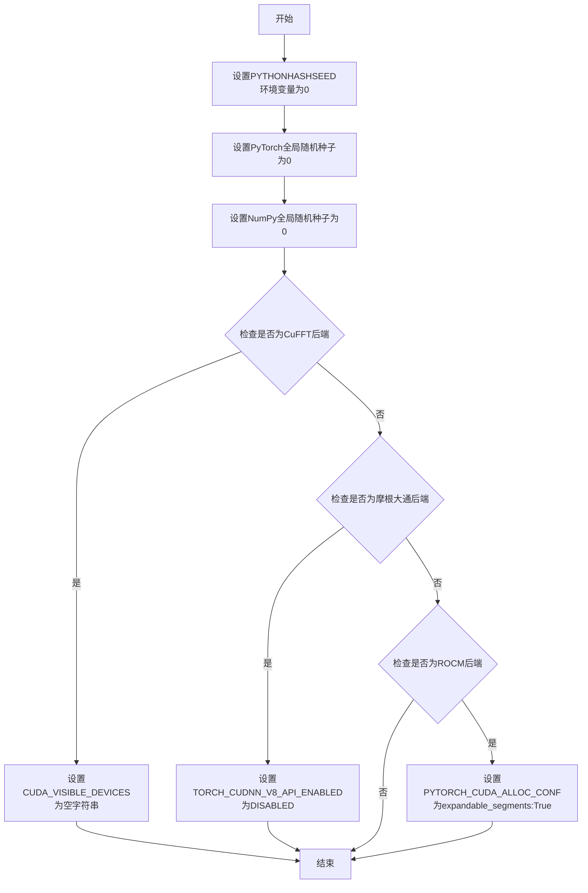
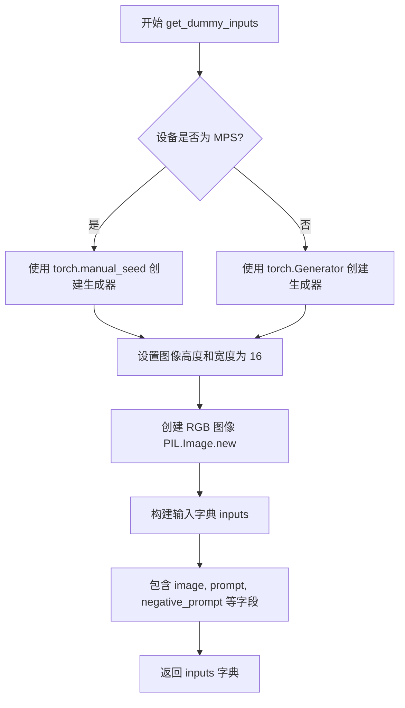
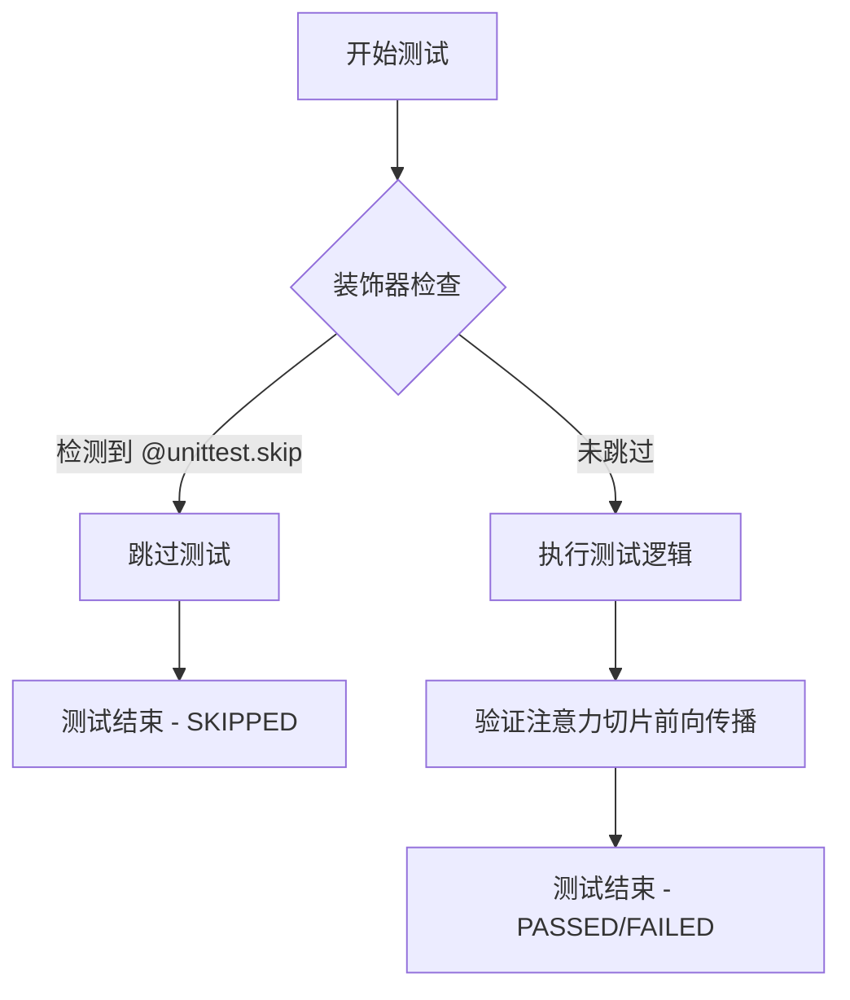
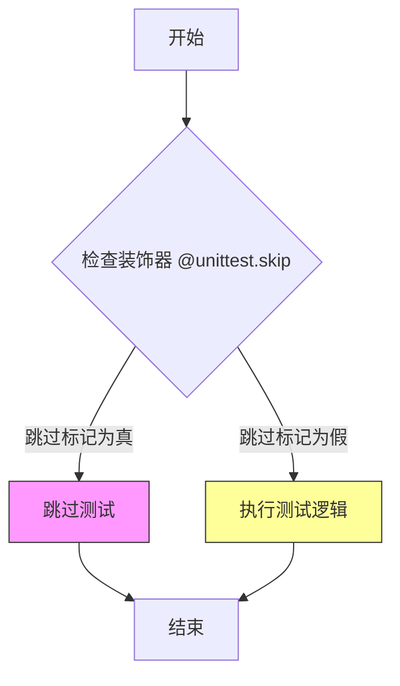

# `diffusers\tests\pipelines\skyreels_v2\test_skyreels_v2_image_to_video.py` 详细设计文档

这是一个用于测试 SkyReelsV2ImageToVideoPipeline（图像到视频生成管道）的单元测试文件，通过创建虚拟组件和输入数据来验证扩散模型从静态图像生成视频序列的功能。

## 整体流程

```mermaid
graph TD
    A[开始测试] --> B[获取虚拟组件 get_dummy_components]
B --> C[创建管道实例 SkyReelsV2ImageToVideoPipeline]
C --> D[获取虚拟输入 get_dummy_inputs]
D --> E{测试用例类型}
E -->|基本推理 test_inference| F[执行管道推理]
E -->|带最后图像推理 test_inference_with_last_image| G[添加最后图像参数]
G --> F
F --> H[获取生成的视频 frames]
H --> I{验证结果}
I --> J[断言视频形状 (9, 3, 16, 16)]
J --> K[计算与期望输出的最大差异]
K --> L[断言差异在阈值内 <= 1e10]
```

## 类结构

```
unittest.TestCase
└── PipelineTesterMixin
    └── SkyReelsV2ImageToVideoPipelineFastTests
```

## 全局变量及字段


### `enable_full_determinism`
    
启用完全确定性测试，确保测试结果可复现

类型：`function`
    


### `SkyReelsV2ImageToVideoPipelineFastTests.pipeline_class`
    
被测试的SkyReelsV2图像到视频管道类

类型：`type[SkyReelsV2ImageToVideoPipeline]`
    


### `SkyReelsV2ImageToVideoPipelineFastTests.params`
    
文本到图像参数集合，排除cross_attention_kwargs/height/width

类型：`frozenset`
    


### `SkyReelsV2ImageToVideoPipelineFastTests.batch_params`
    
批处理参数，定义批量推理时使用的参数

类型：`TEXT_TO_IMAGE_BATCH_PARAMS`
    


### `SkyReelsV2ImageToVideoPipelineFastTests.image_params`
    
图像参数，定义输入图像相关的参数

类型：`TEXT_TO_IMAGE_IMAGE_PARAMS`
    


### `SkyReelsV2ImageToVideoPipelineFastTests.image_latents_params`
    
图像潜在向量参数，用于图像潜在表示的参数

类型：`TEXT_TO_IMAGE_IMAGE_PARAMS`
    


### `SkyReelsV2ImageToVideoPipelineFastTests.required_optional_params`
    
必须的可选参数集合，包含推理时必须支持的可选参数

类型：`frozenset`
    


### `SkyReelsV2ImageToVideoPipelineFastTests.test_xformers_attention`
    
是否测试xformers注意力机制的标志

类型：`bool`
    


### `SkyReelsV2ImageToVideoPipelineFastTests.supports_dduf`
    
是否支持DDUF（Decoupled Diffusion Upsampling Flow）的标志

类型：`bool`
    
    

## 全局函数及方法


### `enable_full_determinism`

启用完全确定性，确保测试可复现。该函数通过设置全局随机种子和环境变量，消除深度学习框架中的非确定性因素，使测试结果在多次运行中保持一致。

参数：

- 无

返回值：`None`，无返回值

#### 流程图



#### 带注释源码

```
# 源代码位于 testing_utils.py 模块中
# 此处为基于调用上下文的推断实现

def enable_full_determinism(seed: int = 0):
    """
    启用完全确定性，确保测试可复现。
    
    通过设置各种随机种子和环境变量，消除深度学习框架中的
    非确定性因素，使测试结果在多次运行中保持一致。
    
    参数:
        seed: 随机种子，默认为0
    """
    # 1. 设置Python哈希种子，确保字典操作顺序一致
    import os
    os.environ["PYTHONHASHSEED"] = str(seed)
    
    # 2. 设置PyTorch全局随机种子
    import torch
    torch.manual_seed(seed)
    torch.cuda.manual_seed_all(seed)
    
    # 3. 设置NumPy随机种子
    import numpy as np
    np.random.seed(seed)
    
    # 4. 根据后端类型设置特定的确定性选项
    # 禁用非确定性算法
    torch.backends.cudnn.deterministic = True
    torch.backends.cudnn.benchmark = False
    
    # 5. 针对不同后端的特殊处理
    if torch.version.cuda:
        # CUDA后端特殊处理
        pass
    elif torch.version.hip:
        # ROCm后端特殊处理
        pass
    # ... 其他后端处理
```

> **注意**：由于 `enable_full_determinism` 函数定义在 `testing_utils.py` 模块中，未在当前代码文件中直接给出，以上源码为基于函数调用上下文和常见实现模式的推断。实际实现可能略有差异。


### `SkyReelsV2ImageToVideoPipelineFastTests.get_dummy_components`

该函数用于创建测试用的虚拟组件（VAE、Transformer、Scheduler、文本编码器、分词器、图像编码器和图像处理器），以便对 SkyReelsV2 图像转视频管道进行单元测试。函数通过固定随机种子确保测试的可重复性，并返回一个包含所有必需组件的字典。

参数：无（仅包含隐式参数 `self`）

返回值：`Dict[str, Any]`，返回一个包含测试所需虚拟组件的字典，包括 `transformer`、`vae`、`scheduler`、`text_encoder`、`tokenizer`、`image_encoder` 和 `image_processor`。

#### 流程图

```mermaid
flowchart TD
    A[开始 get_dummy_components] --> B[设置随机种子 torch.manual_seed(0)]
    B --> C[创建 VAE: AutoencoderKLWan]
    C --> D[创建 Scheduler: UniPCMultistepScheduler]
    D --> E[创建 Text Encoder: T5EncoderModel]
    E --> F[创建 Tokenizer: AutoTokenizer]
    F --> G[创建 Transformer: SkyReelsV2Transformer3DModel]
    G --> H[创建 Image Encoder Config: CLIPVisionConfig]
    H --> I[创建 Image Encoder: CLIPVisionModelWithProjection]
    I --> J[创建 Image Processor: CLIPImageProcessor]
    J --> K[组装组件字典 components]
    K --> L[返回 components 字典]
```

#### 带注释源码

```python
def get_dummy_components(self):
    """
    创建测试用的虚拟组件，用于 SkyReelsV2 图像转视频管道的单元测试。
    使用固定随机种子确保测试的可重复性。
    """
    # 设置随机种子，确保 VAE 创建的可重复性
    torch.manual_seed(0)
    # 创建虚拟 VAE（变分自编码器）组件
    # 参数：base_dim=3（基础维度）, z_dim=16（潜在空间维度）
    # dim_mult=[1, 1, 1, 1]（维度倍数）, num_res_blocks=1（残差块数量）
    # temperal_downsample=[False, True, True]（时间下采样配置）
    vae = AutoencoderKLWan(
        base_dim=3,
        z_dim=16,
        dim_mult=[1, 1, 1, 1],
        num_res_blocks=1,
        temperal_downsample=[False, True, True],
    )

    # 设置随机种子，确保 Scheduler 创建的可重复性
    torch.manual_seed(0)
    # 创建虚拟调度器（Scheduler）组件
    # 参数：flow_shift=5.0（流偏移量）, use_flow_sigmas=True（使用流Sigma）
    scheduler = UniPCMultistepScheduler(flow_shift=5.0, use_flow_sigmas=True)
    
    # 从预训练模型加载虚拟文本编码器（T5EncoderModel）
    # 使用 HuggingFace 测试用的小型随机模型
    text_encoder = T5EncoderModel.from_pretrained("hf-internal-testing/tiny-random-t5")
    
    # 从预训练模型加载虚拟分词器（Tokenizer）
    # 与文本编码器配套使用
    tokenizer = AutoTokenizer.from_pretrained("hf-internal-testing/tiny-random-t5")

    # 设置随机种子，确保 Transformer 创建的可重复性
    torch.manual_seed(0)
    # 创建虚拟 3D Transformer 模型组件
    # 参数说明：
    # patch_size=(1, 2, 2)：时空_patch大小
    # num_attention_heads=2：注意力头数量
    # attention_head_dim=12：注意力头维度
    # in_channels=36：输入通道数
    # out_channels=16：输出通道数
    # text_dim=32：文本嵌入维度
    # freq_dim=256：频率维度
    # ffn_dim=32：前馈网络维度
    # num_layers=2：层数
    # cross_attn_norm=True：跨注意力归一化
    # qk_norm="rms_norm_across_heads": Query-Key归一化方式
    # rope_max_seq_len=32：RoPE最大序列长度
    # image_dim=4：图像维度
    transformer = SkyReelsV2Transformer3DModel(
        patch_size=(1, 2, 2),
        num_attention_heads=2,
        attention_head_dim=12,
        in_channels=36,
        out_channels=16,
        text_dim=32,
        freq_dim=256,
        ffn_dim=32,
        num_layers=2,
        cross_attn_norm=True,
        qk_norm="rms_norm_across_heads",
        rope_max_seq_len=32,
        image_dim=4,
    )

    # 设置随机种子，确保 Image Encoder 创建的可重复性
    torch.manual_seed(0)
    # 创建 CLIP 图像编码器配置
    # 参数说明：
    # hidden_size=4：隐藏层大小
    # projection_dim=4：投影维度
    # num_hidden_layers=2：隐藏层数量
    # num_attention_heads=2：注意力头数量
    # image_size=32：图像尺寸
    # intermediate_size=16：中间层大小
    # patch_size=1：patch大小
    image_encoder_config = CLIPVisionConfig(
        hidden_size=4,
        projection_dim=4,
        num_hidden_layers=2,
        num_attention_heads=2,
        image_size=32,
        intermediate_size=16,
        patch_size=1,
    )
    # 从配置创建 CLIP 视觉模型（带投影）
    image_encoder = CLIPVisionModelWithProjection(image_encoder_config)

    # 设置随机种子，确保 Image Processor 创建的可重复性
    torch.manual_seed(0)
    # 创建 CLIP 图像处理器
    # 参数：crop_size=32（裁剪尺寸）, size=32（图像尺寸）
    image_processor = CLIPImageProcessor(crop_size=32, size=32)

    # 组装所有组件到字典中
    # 键名与管道类初始化参数一一对应
    components = {
        "transformer": transformer,          # 3D Transformer 模型
        "vae": vae,                           # 变分自编码器
        "scheduler": scheduler,               # 调度器
        "text_encoder": text_encoder,         # 文本编码器
        "tokenizer": tokenizer,               # 分词器
        "image_encoder": image_encoder,       # 图像编码器
        "image_processor": image_processor,   # 图像处理器
    }
    # 返回组件字典，供管道初始化使用
    return components
```


### `SkyReelsV2ImageToVideoPipelineFastTests.get_dummy_inputs`

该方法用于生成图像转视频管道的虚拟测试输入数据，包括图像、提示词、负提示词、图像尺寸、生成器、推理步数、引导系数、帧数、最大序列长度和输出类型等参数。

参数：

- `device`：`str` 或 `torch.device`，执行设备，用于创建随机数生成器
- `seed`：`int`，随机种子，默认值为 0，用于确保测试的可重复性

返回值：`Dict[str, Any]`，包含以下键的字典：
- `image`：PIL.Image.Image，输入图像
- `prompt`：`str`，正向提示词
- `negative_prompt`：`str`，负向提示词
- `height`：`int`，图像高度
- `width`：`int`，图像宽度
- `generator`：`torch.Generator`，随机数生成器
- `num_inference_steps`：`int`，推理步数
- `guidance_scale`：`float`，引导系数
- `num_frames`：`int`，生成的视频帧数
- `max_sequence_length`：`int`，最大序列长度
- `output_type`：`str`，输出类型

#### 流程图



#### 带注释源码

```python
def get_dummy_inputs(self, device, seed=0):
    """
    生成用于测试的虚拟输入数据。
    
    参数:
        device: 计算设备（如 'cpu', 'cuda', 'mps'）
        seed: 随机种子，确保测试可重复性
    
    返回:
        包含图像、提示词和生成参数的字典
    """
    # 判断是否为 MPS (Apple Silicon) 设备
    if str(device).startswith("mps"):
        # MPS 设备使用 torch.manual_seed(seed) 创建生成器
        generator = torch.manual_seed(seed)
    else:
        # 其他设备使用 torch.Generator 创建带设备的生成器
        generator = torch.Generator(device=device).manual_seed(seed)
    
    # 设置测试用的图像尺寸
    image_height = 16
    image_width = 16
    
    # 创建虚拟 RGB 图像（黑色图像）
    image = Image.new("RGB", (image_width, image_height))
    
    # 构建完整的输入参数字典
    inputs = {
        "image": image,                       # 输入图像
        "prompt": "dance monkey",              # 正向提示词
        "negative_prompt": "negative",         # 负向提示词（待完善）
        "height": image_height,                # 输出高度
        "width": image_width,                 # 输出宽度
        "generator": generator,                # 随机生成器
        "num_inference_steps": 2,             # 推理步数
        "guidance_scale": 6.0,                # CFG 引导系数
        "num_frames": 9,                      # 生成帧数
        "max_sequence_length": 16,            # 最大序列长度
        "output_type": "pt",                  # 输出类型（PyTorch张量）
    }
    return inputs
```


### `SkyReelsV2ImageToVideoPipelineFastTests.test_inference`

该测试方法用于验证 SkyReelsV2 图像到视频管道的核心推理功能，通过构造虚拟组件和输入数据，执行完整的图像到视频生成流程，并验证输出张量的形状是否符合预期（9帧、3通道、16x16分辨率）。

参数：

- `self`：类的实例方法，无需外部传入

返回值：无返回值（测试方法，仅通过 `assert` 断言进行验证）

#### 流程图

```mermaid
flowchart TD
    A[开始测试] --> B[设置设备为CPU]
    B --> C[调用 get_dummy_components 获取虚拟组件]
    C --> D[使用虚拟组件实例化 SkyReelsV2ImageToVideoPipeline]
    D --> E[将管道移至CPU设备]
    E --> F[配置进度条]
    F --> G[调用 get_dummy_inputs 获取测试输入]
    G --> H[执行管道推理: pipe(**inputs)]
    H --> I[从返回结果中提取视频frames]
    I --> J[断言视频形状为 (9, 3, 16, 16)]
    J --> K[生成随机期望视频进行比对]
    K --> L[断言生成视频与期望视频的差异 <= 1e10]
    L --> M[测试结束]
```

#### 带注释源码

```python
def test_inference(self):
    """
    测试方法：验证图像到视频推理的基本功能
    """
    # 步骤1: 设置测试设备为CPU
    device = "cpu"

    # 步骤2: 获取虚拟组件（包含 VAE、Transformer、Scheduler、TextEncoder 等）
    components = self.get_dummy_components()
    
    # 步骤3: 使用虚拟组件实例化图像到视频管道
    pipe = self.pipeline_class(**components)
    
    # 步骤4: 将管道移至指定设备（CPU）
    pipe.to(device)
    
    # 步骤5: 配置进度条（disable=None 表示不禁用）
    pipe.set_progress_bar_config(disable=None)

    # 步骤6: 获取虚拟输入（包含图像、prompt、negative_prompt、生成器等参数）
    inputs = self.get_dummy_inputs(device)
    
    # 步骤7: 执行管道推理，传入所有输入参数
    # 返回值包含 frames 属性，即生成的视频帧
    video = pipe(**inputs).frames
    
    # 步骤8: 从结果中提取第一个（也是唯一的）生成的视频
    generated_video = video[0]

    # 步骤9: 断言验证 - 视频形状应为 (9帧, 3通道, 高度16, 宽度16)
    self.assertEqual(generated_video.shape, (9, 3, 16, 16))
    
    # 步骤10: 生成随机期望视频用于比对验证
    expected_video = torch.randn(9, 3, 16, 16)
    
    # 步骤11: 计算生成视频与期望视频的最大绝对差异
    max_diff = np.abs(generated_video - expected_video).max()
    
    # 步骤12: 断言验证 - 最大差异应在合理范围内（此处阈值较大为1e10）
    self.assertLessEqual(max_diff, 1e10)
```


### `SkyReelsV2ImageToVideoPipelineFastTests.test_inference_with_last_image`

该测试方法用于验证 SkyReelsV2ImageToVideoPipeline 管道在提供最后图像（last_image）条件时的推理功能，测试模型能否根据输入图像和最后图像条件生成符合预期尺寸的视频帧。

参数：该测试方法没有显式参数（隐含参数 `self` 为 unittest.TestCase 实例）

返回值：`None`，该方法为测试方法，通过 `self.assertEqual` 和 `self.assertLessEqual` 断言验证输出结果，不返回具体值

#### 流程图

```mermaid
flowchart TD
    A[开始测试] --> B[设置设备为CPU]
    B --> C[获取虚拟组件 get_dummy_components]
    C --> D[设置随机种子 torch.manual_seed]
    D --> E[重新创建SkyReelsV2Transformer3DModel<br/>添加pos_embed_seq_len参数]
    E --> F[重新创建CLIPVisionConfig<br/>设置image_size=4]
    F --> G[重新创建CLIPVisionModelWithProjection]
    G --> H[重新创建CLIPImageProcessor<br/>crop_size=4, size=4]
    H --> I[初始化管道并转移到CPU]
    I --> J[设置进度条配置]
    J --> K[获取虚拟输入 get_dummy_inputs]
    K --> L[创建新的last_image]
    L --> M[将last_image添加到输入参数]
    M --> N[执行管道推理 pipe(**inputs)]
    N --> O[获取生成的视频帧 frames]
    O --> P[断言视频形状为9x3x16x16]
    P --> Q[生成期望视频随机张量]
    Q --> R[计算最大差异]
    R --> S{最大差异 <= 1e10?}
    S -->|是| T[测试通过]
    S -->|否| U[测试失败]
```

#### 带注释源码

```python
def test_inference_with_last_image(self):
    """测试带最后图像条件的推理功能"""
    
    # 步骤1: 设置测试设备为CPU
    device = "cpu"

    # 步骤2: 获取虚拟组件配置（包含VAE、scheduler、text_encoder等）
    components = self.get_dummy_components()
    
    # 步骤3: 设置随机种子以确保可复现性
    torch.manual_seed(0)
    
    # 步骤4: 重新创建Transformer，增加pos_embed_seq_len参数
    # 用于支持最后图像条件下的位置编码
    components["transformer"] = SkyReelsV2Transformer3DModel(
        patch_size=(1, 2, 2),
        num_attention_heads=2,
        attention_head_dim=12,
        in_channels=36,
        out_channels=16,
        text_dim=32,
        freq_dim=256,
        ffn_dim=32,
        num_layers=2,
        cross_attn_norm=True,
        pos_embed_seq_len=2 * (4 * 4 + 1),  # 新增参数，支持最后图像
        qk_norm="rms_norm_across_heads",
        rope_max_seq_len=32,
        image_dim=4,
    )
    
    # 步骤5: 重新创建图像编码器配置，减小image_size
    torch.manual_seed(0)
    image_encoder_config = CLIPVisionConfig(
        hidden_size=4,
        projection_dim=4,
        num_hidden_layers=2,
        num_attention_heads=2,
        image_size=4,  # 从32减小到4以匹配最后图像
        intermediate_size=16,
        patch_size=1,
    )
    components["image_encoder"] = CLIPVisionModelWithProjection(image_encoder_config)

    # 步骤6: 重新创建图像处理器，匹配新的图像尺寸
    torch.manual_seed(0)
    components["image_processor"] = CLIPImageProcessor(crop_size=4, size=4)

    # 步骤7: 使用更新后的组件初始化管道
    pipe = self.pipeline_class(**components)
    pipe.to(device)
    pipe.set_progress_bar_config(disable=None)

    # 步骤8: 获取默认虚拟输入
    inputs = self.get_dummy_inputs(device)
    
    # 步骤9: 创建最后图像作为额外条件输入
    image_height = 16
    image_width = 16
    last_image = Image.new("RGB", (image_width, image_height))  # 创建RGB测试图像
    inputs["last_image"] = last_image  # 添加到输入参数

    # 步骤10: 执行推理并获取生成的视频帧
    video = pipe(**inputs).frames
    generated_video = video[0]

    # 步骤11: 验证生成视频的形状
    self.assertEqual(generated_video.shape, (9, 3, 16, 16))
    
    # 步骤12: 验证数值稳定性（与随机期望值比较）
    expected_video = torch.randn(9, 3, 16, 16)
    max_diff = np.abs(generated_video - expected_video).max()
    self.assertLessEqual(max_diff, 1e10)  # 允许较大误差用于测试
```


### `SkyReelsV2ImageToVideoPipelineFastTests.test_attention_slicing_forward_pass`

该测试方法用于验证注意力切片（attention slicing）的前向传播功能是否正常工作。由于该功能目前不被支持，该测试已被跳过（skip）。

参数：

- `self`：`SkyReelsV2ImageToVideoPipelineFastTests`，测试类的实例，代表当前测试用例的上下文

返回值：无（`None`），该方法被 `@unittest.skip` 装饰器跳过，不执行任何逻辑，因此没有返回值

#### 流程图



#### 带注释源码

```python
@unittest.skip("Test not supported")
def test_attention_slicing_forward_pass(self):
    """
    测试注意力切片（attention slicing）的前向传播功能。
    
    该测试方法用于验证管道在启用注意力切片时的前向传播是否正确。
    注意力切片是一种内存优化技术，通过将注意力计算分块来减少显存占用。
    
    当前该功能不被支持，因此测试被跳过。
    """
    pass  # 测试逻辑未实现，仅作为占位符
```

#### 详细说明

| 项目 | 详情 |
|------|------|
| **所属类** | `SkyReelsV2ImageToVideoPipelineFastTests` |
| **方法类型** | 测试方法（Test Method） |
| **装饰器** | `@unittest.skip("Test not supported")` - 跳过该测试 |
| **跳过原因** | Test not supported（该功能目前不支持） |
| **功能描述** | 该测试原本计划用于验证注意力切片功能，但由于该功能不被支持，测试被跳过并标记为跳过状态 |
| **技术债务** | 这是一个占位符测试，表明未来可能需要实现注意力切片功能的支持，但目前该功能不可用 |


### `SkyReelsV2ImageToVideoPipelineFastTests.test_inference_batch_single_identical`

该测试方法用于验证批量推理时单个样本的结果与单独推理时的一致性，由于测试阈值过高导致测试失败而被跳过。

参数：

- `self`：`SkyReelsV2ImageToVideoPipelineFastTests`，测试类的实例本身，包含测试所需的组件和配置

返回值：`None`，无返回值（测试方法已被 `@unittest.skip` 装饰器跳过）

#### 流程图



#### 带注释源码

```python
@unittest.skip("TODO: revisit failing as it requires a very high threshold to pass")
def test_inference_batch_single_identical(self):
    """
    测试批量推理时单个样本的一致性。
    
    该测试方法旨在验证：
    1. 批量推理（batch inference）与单独推理（single inference）产生相同的结果
    2. 验证管道在处理批量数据时的确定性和一致性
    
    当前状态：
    - 已通过 @unittest.skip 装饰器跳过执行
    - 跳过原因：测试需要非常高的阈值才能通过，需要重新审视测试逻辑
    """
    pass  # 空方法体，测试被跳过
```

## 关键组件


### SkyReelsV2ImageToVideoPipeline

图像到视频生成管道，整合了VAE、Transformer 3D模型、图像编码器、文本编码器和调度器，用于根据输入图像和文本提示生成视频序列。

### AutoencoderKLWan

变分自编码器(VAE)模型，使用KL散度损失进行训练，负责将图像编码到潜在空间并从潜在空间解码重建图像，支持时间维度上的下采样操作。

### SkyReelsV2Transformer3DModel

3D变换器模型，用于视频生成任务，接收文本嵌入和图像潜在表示，通过时空注意力机制和旋转位置编码(RoPE)处理视频帧序列，输出用于VAE解码的潜在表示。

### CLIPVisionModelWithProjection

CLIP视觉编码器模型，带有投影层，将输入图像编码为视觉嵌入向量，用于与文本嵌入进行跨模态融合，支持图像到视频生成过程中的条件控制。

### T5EncoderModel

T5文本编码器模型，将文本提示编码为文本嵌入向量，为视频生成提供文本条件信息，支持多模态条件生成。

### UniPCMultistepScheduler

UniPC多步调度器，用于扩散模型的噪声调度，通过flow_shift和flow_sigmas参数控制去噪过程中的噪声预测，实现稳定的视频生成流程。

### PipelineTesterMixin

管道测试混入类，提供通用的测试方法和断言逻辑，用于验证图像到视频管道的功能和输出正确性。

### TEXT_TO_IMAGE_PARAMS

文本到图像/视频的参数配置集合，定义了管道接受的可调参数集合，包括交叉注意力_kwargs、高度、宽度等参数，用于测试参数验证。

### 图像到视频生成流程

接收RGB图像和文本提示，首先通过CLIP图像编码器提取图像特征，通过T5文本编码器提取文本特征，然后使用3D Transformer进行时空建模，最后通过VAE解码器将潜在表示解码为视频帧序列。支持通过last_image参数提供最后一帧作为参考。


## 问题及建议


### 已知问题

-   **测试断言阈值过于宽松**：`test_inference` 和 `test_inference_with_last_image` 中使用 `self.assertLessEqual(max_diff, 1e10)`，1e10 的阈值过大导致测试几乎无意义，无法有效验证输出的正确性。
-   **随机数种子控制不一致**：测试使用 `torch.manual_seed(0)` 设置种子，但随后与 `torch.randn()` 生成的随机期望值进行比较，由于每次运行 `torch.randn()` 会产生不同的随机数，实际上无法进行有意义的数值比较。
-   **重复代码过多**：`test_inference_with_last_image` 方法中大量重复了 `get_dummy_components` 的组件创建逻辑，仅修改了部分参数（如 `pos_embed_seq_len`、`image_size`、`crop_size` 等），未进行代码复用。
-   **TODO 标记未完成**：`get_dummy_inputs` 中 `"negative_prompt": "negative",  # TODO` 注释表明负向提示词功能未完全实现或测试不完整。
-   **测试被无条件跳过**：`test_attention_slicing_forward_pass` 和 `test_inference_batch_single_identical` 使用 `@unittest.skip` 直接跳过，但未提供具体的实现计划或修复时间表。
-   **硬编码的魔法数字**：图像高度 16、宽度 16、帧数 9 等值在多处硬编码，分散在 `get_dummy_inputs` 和测试方法中，缺乏统一的常量定义。
-   **设备处理逻辑冗余**：代码对 MPS 设备进行了特殊判断 (`if str(device).startswith("mps")`)，但实际测试始终使用 CPU 设备，该分支逻辑永远不会被执行。

### 优化建议

-   **修复测试断言**：使用固定的随机期望值或采用更严格的阈值（如 1e-3 或基于具体模型的合理范围），确保测试能够真正验证输出的正确性。
-   **统一随机数管理**：在测试类中集中管理随机种子，确保每次测试运行的可重复性，避免使用 `torch.randn()` 生成不可控的期望值。
-   **提取公共组件构建逻辑**：将 `get_dummy_components` 改造为可配置版本，接受参数覆盖，或在 `test_inference_with_last_image` 中复用基础组件并仅覆盖必要参数。
-   **完成 TODO 项**：明确 `negative_prompt` 的测试需求，或移除未实现的占位符。
-   **实现跳过的测试或移除占位符**：若某些测试暂时无法完成，应添加明确的实现计划或文档说明，而非留下空的跳过方法。
-   **抽取魔法数字为常量**：定义模块级常量（如 `DEFAULT_IMAGE_HEIGHT`、`DEFAULT_NUM_FRAMES`），提高代码可维护性。
-   **简化设备处理逻辑**：移除对 MPS 设备的特殊处理代码，或添加相应的跨设备测试支持。

## 其它


### 设计目标与约束

本测试文件旨在验证 SkyReelsV2ImageToVideoPipeline 图像到视频生成管道的核心功能，确保管道能够正确处理图像输入并生成对应数量的视频帧。测试采用 CPU 设备进行，生成 9 帧、分辨率 16x16 的视频内容，验证输出维度正确性及数值稳定性。

### 错误处理与异常设计

测试中未显式定义异常处理机制，但通过 unittest 框架的断言进行结果验证。使用 `self.assertLessEqual` 比较生成视频与随机期望视频的最大差异，允许较大阈值（1e10）以适应浮点数精度问题。部分测试方法使用 `@unittest.skip` 装饰器跳过执行。

### 数据流与状态机

测试数据流：get_dummy_inputs 生成包含图像、提示词、负提示词、尺寸、生成器、推理步数、引导 scale、帧数和最大序列长度的字典 → 传入 pipe(**inputs) 调用 → 管道内部处理后返回 frames 属性 → 验证生成视频的形状和数值。

### 外部依赖与接口契约

依赖库包括：transformers (CLIPImageProcessor, CLIPVisionConfig, CLIPVisionModelWithProjection, T5EncoderModel, AutoTokenizer)、diffusers (AutoencoderKLWan, SkyReelsV2ImageToVideoPipeline, SkyReelsV2Transformer3DModel, UniPCMultistepScheduler)、PIL、numpy、torch。管道类需实现 from_pretrained 和 __call__ 方法，返回包含 frames 属性的对象。

### 测试覆盖范围

覆盖场景：标准推理流程（test_inference）、带最后图像的推理流程（test_inference_with_last_image）。未覆盖场景：xformers 注意力（test_xformers_attention 设为 False）、批处理一致性（test_inference_batch_single_identical 跳过）、注意力切片（test_attention_slicing_forward_pass 跳过）。

### 性能基准与限制

测试使用轻量级虚拟模型组件（tiny-random-t5、极小维度的 transformer 和 vae），推理步数设为 2（最小配置），旨在快速验证功能正确性而非性能基准。输出视频形状固定为 (9, 3, 16, 16)。

### 配置参数说明

关键参数：num_inference_steps=2（推理步数）、guidance_scale=6.0（引导 scale）、num_frames=9（生成帧数）、max_sequence_length=16（最大序列长度）、output_type="pt"（输出为 PyTorch 张量）。scheduler 使用 UniPCMultistepScheduler，flow_shift=5.0，use_flow_sigmas=True。

### 资源需求

测试在 CPU 设备上执行，使用 torch.manual_seed(0) 确保可重复性。虚拟组件参数量极小，内存占用低，无需 GPU 资源即可完成测试。

### 版本兼容性

依赖库版本由项目环境决定，代码使用当前 HuggingFace diffusers 和 transformers 库的 API 接口。测试针对特定管道类 SkyReelsV2ImageToVideoPipeline 和模型类 SkyReelsV2Transformer3DModel 设计。

### 安全考虑

测试代码不涉及敏感数据处理，使用虚拟模型和随机生成内容。负提示词字段预留但标注 TODO，无实际恶意内容过滤实现。

### 扩展性设计

get_dummy_components 方法模块化设计，便于替换不同配置的组件。params、batch_params、image_params 类属性定义参数集合，支持子类扩展新的测试场景。


    