# `diffusers\tests\pipelines\stable_audio\test_stable_audio.py` 详细设计文档

这是 Stable Audio Pipeline 的测试文件，包含了单元测试和集成测试，用于验证 StableAudioPipeline 的各种功能，包括音频生成、提示词处理、模型保存加载、批处理、负向提示词、条件音频输入等核心功能。

## 整体流程

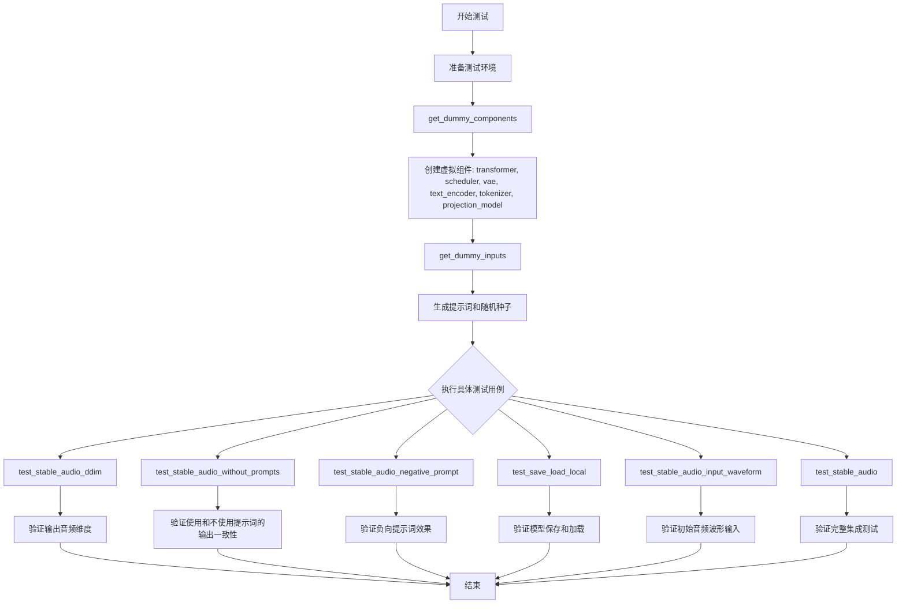

## 类结构

```
unittest.TestCase (Python标准库)
└── PipelineTesterMixin (测试混入类)
    └── StableAudioPipelineFastTests (快速测试类)
        ├── get_dummy_components() [创建虚拟模型组件]
        ├── get_dummy_inputs() [生成测试输入]
        ├── test_save_load_local() [测试保存加载]
        ├── test_save_load_optional_components() [测试可选组件]
        ├── test_stable_audio_ddim() [测试DDIM采样]
        ├── test_stable_audio_without_prompts() [测试无提示词]
        ├── test_stable_audio_negative_without_prompts() [测试无提示词的负向提示词]
        ├── test_stable_audio_negative_prompt() [测试负向提示词]
        ├── test_stable_audio_num_waveforms_per_prompt() [测试多波形生成]
        ├── test_stable_audio_audio_end_in_s() [测试音频结束时间]
        ├── test_attention_slicing_forward_pass() [测试注意力切片]
        ├── test_inference_batch_single_identical() [测试批处理一致性]
        ├── test_xformers_attention_forwardGenerator_pass() [测试xformers注意力]
        └── test_stable_audio_input_waveform() [测试输入波形]
└── StableAudioPipelineIntegrationTests (集成测试类)
    ├── setUp() [测试前设置]
    ├── tearDown() [测试后清理]
    ├── get_inputs() [获取集成测试输入]
    └── test_stable_audio() [完整集成测试]
```

## 全局变量及字段


### `StableAudioPipelineFastTests.pipeline_class`
    
测试所使用的管道类，指向 StableAudioPipeline

类型：`type`
    


### `StableAudioPipelineFastTests.params`
    
包含管道推理所需参数的不可变集合，如 prompt、guidance_scale 等

类型：`frozenset`
    


### `StableAudioPipelineFastTests.batch_params`
    
批量推理时使用的参数集合，定义了批量输入的配置

类型：`TEXT_TO_AUDIO_BATCH_PARAMS`
    


### `StableAudioPipelineFastTests.required_optional_params`
    
可选参数的不可变集合，包含可选的推理配置如 num_inference_steps、generator 等

类型：`frozenset`
    


### `StableAudioPipelineFastTests.test_xformers_attention`
    
标志位，指示是否测试 xFormers 注意力机制（当前设为 False）

类型：`bool`
    


### `StableAudioPipelineFastTests.supports_dduf`
    
标志位，指示管道是否支持 DDUF（Decoupled Diffusion Upsampling Feature）功能

类型：`bool`
    
    

## 全局函数及方法


### `enable_full_determinism`

该函数用于启用PyTorch的完全确定性模式，通过设置`torch.use_deterministic_algorithms()`和相关环境变量，确保深度学习模型在运行时产生可重复的结果，这对于测试和调试非常重要。

参数：

- 该函数无参数

返回值：`None`，无返回值

#### 流程图

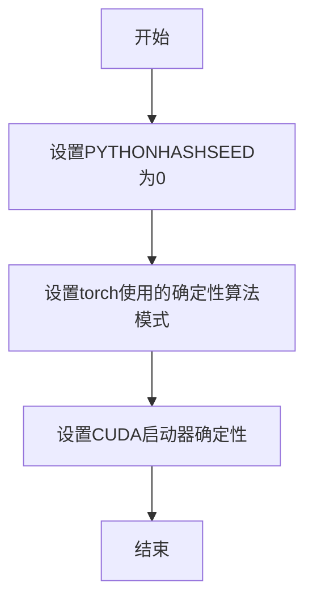

#### 带注释源码

```
# 该函数定义位于 diffusers.testing_utils 模块中
# 当前文件只是导入并调用该函数

# 第46行：导入函数
from ...testing_utils import (
    Expectations,
    backend_empty_cache,
    enable_full_determinism,  # <-- 从 testing_utils 模块导入
    nightly,
    require_torch_accelerator,
    torch_device,
)

# 第58行：在模块级别调用函数，确保后续所有测试都是确定性的
enable_full_determinism()
```

---

**注意**：给定代码文件中并未包含 `enable_full_determinism()` 函数的具体实现，该函数是从 `...testing_utils` 模块导入的。上述信息基于该函数的标准实现模式（用于设置PyTorch确定性）。如需查看该函数的具体实现源码，请参考 `diffusers/testing_utils.py` 文件。


### `StableAudioPipelineFastTests.get_dummy_components`

该方法用于创建StableAudioPipeline测试所需的虚拟组件（transformer、scheduler、vae、text_encoder、tokenizer、projection_model），通过固定的随机种子确保测试的可重复性，并返回一个包含所有组件的字典供后续测试用例使用。

参数：

- 无（除隐含的 `self` 参数）

返回值：`Dict[str, Any]`，返回包含虚拟组件的字典，用于初始化 StableAudioPipeline 进行单元测试

#### 流程图

```mermaid
flowchart TD
    A[开始 get_dummy_components] --> B[设置随机种子 torch.manual_seed(0)]
    B --> C[创建 StableAudioDiTModel transformer]
    C --> D[创建 CosineDPMSolverMultepScheduler scheduler]
    D --> E[设置随机种子 torch.manual_seed(0)]
    E --> F[创建 AutoencoderOobleck vae]
    F --> G[加载 T5EncoderModel text_encoder]
    G --> H[加载 T5Tokenizer tokenizer]
    H --> I[设置随机种子 torch.manual_seed(0)]
    I --> J[创建 StableAudioProjectionModel projection_model]
    J --> K[组装 components 字典]
    K --> L[返回 components]
```

#### 带注释源码

```python
def get_dummy_components(self):
    """
    创建用于测试的虚拟组件。
    
    该方法初始化 StableAudioPipeline 需要的所有模型组件，
    使用固定的随机种子确保测试结果的可重复性。
    """
    # 设置随机种子以确保可重复性
    torch.manual_seed(0)
    
    # 创建 Transformer 模型 (StableAudioDiTModel)
    # 用于音频生成的扩散变换器核心模型
    transformer = StableAudioDiTModel(
        sample_size=4,              # 输入样本的空间维度
        in_channels=3,               # 输入通道数
        num_layers=2,               # Transformer 层数
        attention_head_dim=4,       # 注意力头维度
        num_key_value_attention_heads=2,  # KV 注意力头数量
        out_channels=3,             # 输出通道数
        cross_attention_dim=4,      # 跨注意力维度
        time_proj_dim=8,            # 时间嵌入投影维度
        global_states_input_dim=8,  # 全局状态输入维度
        cross_attention_input_dim=4,  # 跨注意力输入维度
    )
    
    # 创建调度器 (scheduler)
    # 使用 Cosine DPMSolver 多步调度器
    scheduler = CosineDPMSolverMultistepScheduler(
        solver_order=2,             # 求解器阶数
        prediction_type="v_prediction",  # 预测类型
        sigma_data=1.0,             # sigma 数据参数
        sigma_schedule="exponential",  # sigma 调度策略
    )
    
    # 重新设置随机种子，确保 VAE 的初始化可重复
    torch.manual_seed(0)
    
    # 创建 VAE (Variational Autoencoder)
    # 用于音频的编码器-解码器模型
    vae = AutoencoderOobleck(
        encoder_hidden_size=6,      # 编码器隐藏层大小
        downsampling_ratios=[1, 2], # 下采样比率
        decoder_channels=3,         # 解码器通道数
        decoder_input_channels=3,   # 解码器输入通道数
        audio_channels=2,           # 音频通道数 (立体声)
        channel_multiples=[2, 4],   # 通道倍数
        sampling_rate=4,            # 采样率
    )
    
    # 加载预训练的 T5 文本编码器
    # 用于将文本提示转换为文本嵌入
    torch.manual_seed(0)
    t5_repo_id = "hf-internal-testing/tiny-random-T5ForConditionalGeneration"
    text_encoder = T5EncoderModel.from_pretrained(t5_repo_id)
    tokenizer = T5Tokenizer.from_pretrained(
        t5_repo_id, 
        truncation=True, 
        model_max_length=25
    )
    
    # 设置随机种子，创建投影模型
    torch.manual_seed(0)
    
    # 创建投影模型
    # 将文本编码器输出投影到与音频扩散模型兼容的空间
    projection_model = StableAudioProjectionModel(
        text_encoder_dim=text_encoder.config.d_model,  # 文本编码器维度
        conditioning_dim=4,         # 条件维度
        min_value=0,                # 最小值
        max_value=32,               # 最大值
    )
    
    # 组装所有组件到字典中
    components = {
        "transformer": transformer,      # 音频扩散变换器
        "scheduler": scheduler,         # 噪声调度器
        "vae": vae,                     # 变分自编码器
        "text_encoder": text_encoder,   # T5 文本编码器
        "tokenizer": T5Tokenizer,       # T5 分词器
        "projection_model": projection_model,  # 投影模型
    }
    
    # 返回组件字典，供 StableAudioPipeline 初始化使用
    return components
```


### `StableAudioPipelineFastTests.get_dummy_inputs`

该方法为StableAudioPipeline测试类生成虚拟输入参数，根据设备类型（MPS或其他）创建随机数生成器，并返回包含提示词、生成器、推理步骤数和引导比例的字典，用于pipeline的单元测试。

参数：

- `self`：隐式参数，类方法的标准第一个参数，代表StableAudioPipelineFastTests类的实例
- `device`：`Union[str, torch.device]`，目标设备，用于创建随机数生成器。如果设备是MPS（Apple Silicon），则使用torch.manual_seed；否则使用torch.Generator
- `seed`：`int`，随机种子，默认值为0，用于确保测试的可重复性

返回值：`Dict[str, Any]`，返回包含以下键的字典：
- `prompt`：`str`，测试用的提示词，描述一个敲击木板的声音场景
- `generator`：`torch.Generator`，PyTorch随机数生成器，用于确保扩散过程的确定性
- `num_inference_steps`：`int`，推理步数，设置为2以加快测试速度
- `guidance_scale`：`float`，引导比例，控制生成内容与提示词的相关程度

#### 流程图

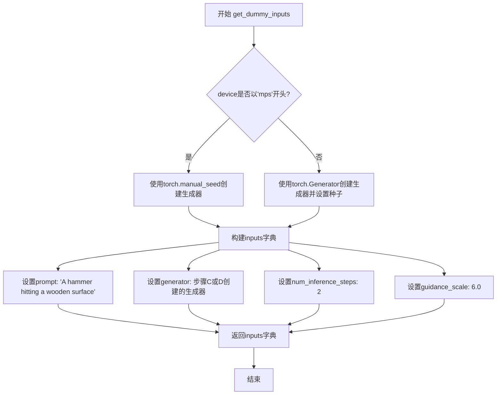

#### 带注释源码

```python
def get_dummy_inputs(self, device, seed=0):
    """
    生成用于StableAudioPipeline测试的虚拟输入参数。
    
    该方法根据不同的设备类型创建确定性随机数生成器，
    以确保测试结果的可重复性。
    
    参数:
        device: 目标设备，可以是'cpu', 'cuda', 'mps'等
        seed: 随机种子，默认值为0
    
    返回:
        包含测试所需输入参数的字典
    """
    
    # 判断设备是否为Apple MPS (Metal Performance Shaders)
    # MPS设备不支持torch.Generator，需要使用torch.manual_seed替代
    if str(device).startswith("mps"):
        # MPS设备：直接使用torch.manual_seed设置全局随机种子
        generator = torch.manual_seed(seed)
    else:
        # 其他设备（CPU/CUDA）：创建设备特定的随机数生成器
        # 这样可以更好地控制随机性，确保测试的确定性
        generator = torch.Generator(device=device).manual_seed(seed)
    
    # 构建测试输入字典，包含pipeline运行所需的最小参数集
    inputs = {
        # 文本提示词，描述期望生成的音频内容
        "prompt": "A hammer hitting a wooden surface",
        
        # 随机数生成器，确保扩散采样过程的可重复性
        "generator": generator,
        
        # 推理步数，较小的值可以加快测试速度
        "num_inference_steps": 2,
        
        # 引导比例，控制分类器自由引导的强度
        # 较高的值会使输出更接近提示词描述的内容
        "guidance_scale": 6.0,
    }
    
    # 返回包含所有测试参数的字典
    return inputs
```


### `StableAudioPipelineIntegrationTests.get_inputs`

该函数用于准备 Stable Audio Pipeline 集成测试的输入参数，创建一个包含提示词、潜在向量、生成器、推理步数、音频结束时间和指导比例的字典，供后续管道推理使用。

参数：

- `self`：隐式参数，TestCase 实例，表示测试类本身
- `device`：`torch.device`，指定计算设备（如 cuda、cpu 等）
- `generator_device`：`str`，生成器设备，默认为 `"cpu"`，用于创建随机数生成器
- `dtype`：`torch.dtype`，张量数据类型，默认为 `torch.float32`
- `seed`：`int`，随机种子，默认为 `0`，确保测试可重复性

返回值：`Dict[str, Any]`，返回一个包含以下键的字典：
- `prompt` (str): 音频生成提示词
- `latents` (torch.Tensor): 初始潜在向量，形状为 (1, 64, 1024)
- `generator` (torch.Generator): 随机数生成器
- `num_inference_steps` (int): 推理步数，固定为 3
- `audio_end_in_s` (float): 音频结束时间（秒），固定为 30
- `guidance_scale` (float): 指导比例，固定为 2.5

#### 流程图

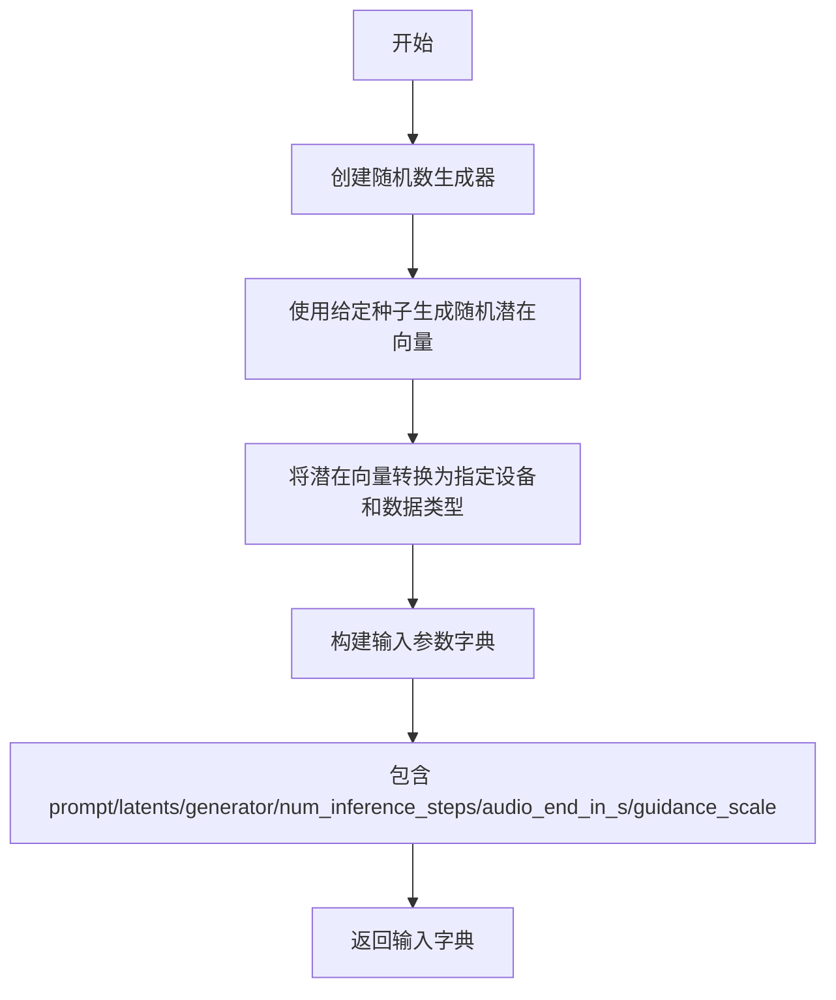

#### 带注释源码

```python
def get_inputs(self, device, generator_device="cpu", dtype=torch.float32, seed=0):
    # 创建一个指定设备的随机数生成器，并使用给定种子初始化
    # generator_device 默认为 "cpu"，确保跨设备测试的确定性
    generator = torch.Generator(device=generator_device).manual_seed(seed)
    
    # 使用 NumPy 的随机状态生成标准正态分布的潜在向量
    # 形状为 (1, 64, 1024)，对应批大小1、潜在空间维度64、序列长度1024
    latents = np.random.RandomState(seed).standard_normal((1, 64, 1024))
    
    # 将 NumPy 数组转换为 PyTorch 张量，并移动到指定设备
    # dtype 参数控制张量的数据类型（默认 float32）
    latents = torch.from_numpy(latents).to(device=device, dtype=dtype)
    
    # 构建完整的输入参数字典
    # prompt: 音频生成的文本提示词
    # latents: 初始潜在向量，用于 DDPM/DDIM 等采样器的初始化
    # generator: 确保可重复性的随机数生成器
    # num_inference_steps: 扩散模型推理步数
    # audio_end_in_s: 生成音频的结束时间（秒），决定音频长度
    # guidance_scale: classifier-free guidance 的强度，值越大越忠于提示词
    inputs = {
        "prompt": "A hammer hitting a wooden surface",
        "latents": latents,
        "generator": generator,
        "num_inference_steps": 3,
        "audio_end_in_s": 30,
        "guidance_scale": 2.5,
    }
    return inputs
```


### `StableAudioPipelineIntegrationTests.setUp`

这是集成测试类的初始化方法，用于在每个测试方法运行前进行资源清理和准备工作，确保测试环境干净。

参数：

- `self`：实例本身，隐式参数，代表测试类实例

返回值：`None`，无返回值，仅执行清理操作

#### 流程图

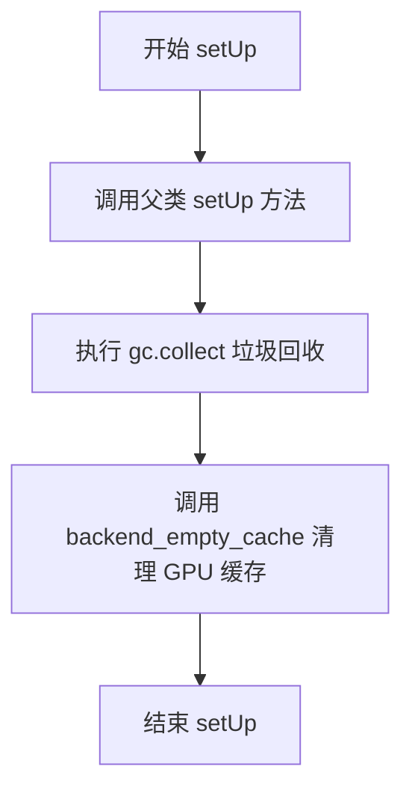

#### 带注释源码

```python
def setUp(self):
    """
    测试前置设置方法，在每个测试方法执行前调用
    """
    # 调用父类的 setUp 方法，执行 unittest.TestCase 的标准初始化
    super().setUp()
    
    # 手动触发 Python 垃圾回收，释放未使用的内存对象
    gc.collect()
    
    # 调用后端工具函数清理 GPU/CUDA 缓存，确保测试间无显存残留
    backend_empty_cache(torch_device)
```


### `StableAudioPipelineIntegrationTests.tearDown`

该方法是测试类的清理方法，用于在每个集成测试完成后执行资源清理操作，确保GPU内存被正确释放，防止测试之间的状态污染。

参数：

- `self`：实例方法隐含参数，表示测试类实例本身，无实际描述意义

返回值：`None`，无返回值描述

#### 流程图

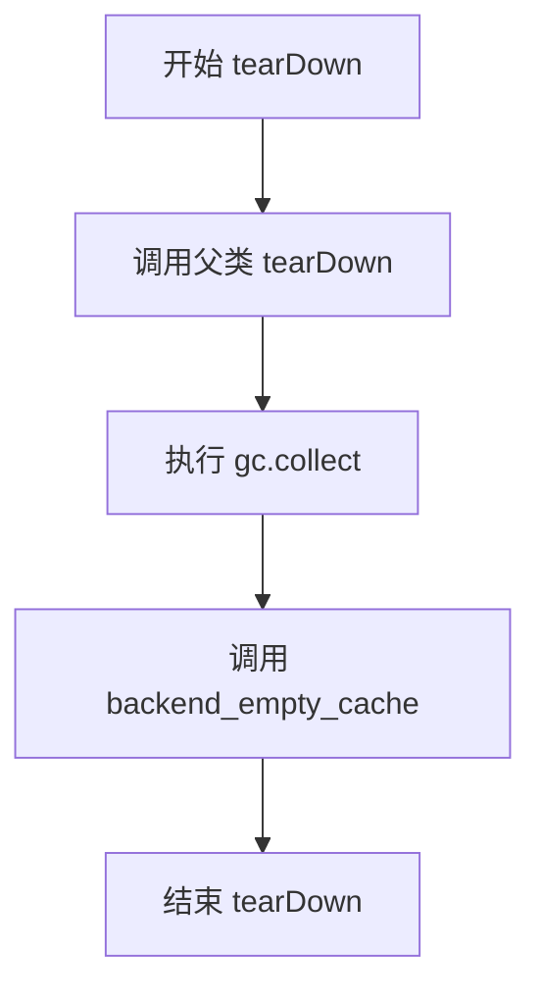

#### 带注释源码

```python
def tearDown(self):
    """
    测试用例清理方法，在每个集成测试完成后执行。
    负责释放GPU内存和清理Python垃圾回收站，防止测试间的资源泄漏。
    """
    # 调用父类的tearDown方法，确保父类定义的清理逻辑也被执行
    super().tearDown()
    
    # 手动触发Python的垃圾回收，释放不再使用的对象内存
    gc.collect()
    
    # 调用后端特定的缓存清理函数，释放GPU显存
    backend_empty_cache(torch_device)
```


### `StableAudioPipelineFastTests.test_save_load_local`

该测试方法用于验证 StableAudioPipeline 的本地保存和加载功能，通过调用父类的测试方法并调整容差参数来适应大型复合模型的数值精度差异。

参数：

- `self`：`StableAudioPipelineFastTests`，隐含的测试类实例参数，代表当前测试对象

返回值：`None`，该方法为 unittest 测试方法，不返回任何值，仅通过断言验证保存/加载后的模型输出与原始输出的差异是否在容差范围内

#### 流程图

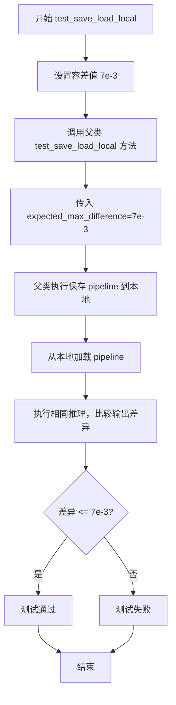

#### 带注释源码

```python
def test_save_load_local(self):
    """
    测试 StableAudioPipeline 的本地保存和加载功能。
    
    该测试方法继承自 PipelineTesterMixin，通过保存和重新加载 pipeline，
    验证模型组件（transformer、vae、text_encoder 等）能否正确序列化和反序列化。
    由于 StableAudioPipeline 是大型复合模型，数值精度可能略有差异，
    因此将默认容差从 1e-4 增加到 7e-3 以适应这种情况。
    """
    # increase tolerance from 1e-4 -> 7e-3 to account for large composite model
    # 增加容差值：从默认的 1e-4 增加到 7e-3，以适应大型复合模型的数值精度差异
    super().test_save_load_local(expected_max_difference=7e-3)
```


### `StableAudioPipelineFastTests.test_save_load_optional_components`

该测试方法用于验证 StableAudioPipeline 在保存和加载可选组件时的正确性，通过增加容差值（从 1e-4 到 7e-3）以适应大型复合模型的数值精度差异。

参数：

- `self`：`StableAudioPipelineFastTests`，测试类实例本身

返回值：`None`，无返回值（测试方法）

#### 流程图

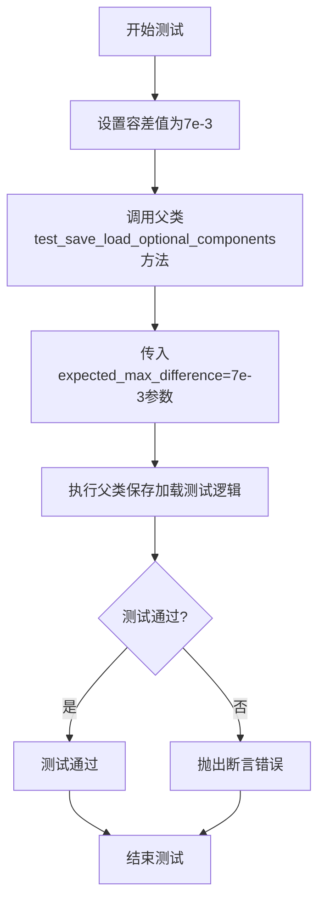

#### 带注释源码

```python
def test_save_load_optional_components(self):
    """
    测试 StableAudioPipeline 的保存和加载功能，特别针对可选组件。
    
    该测试继承自 PipelineTesterMixin，验证管道在序列化（保存）和反序列化（加载）
    后的功能完整性。由于 StableAudioPipeline 是大型复合模型，增加了容差值以
    适应数值精度差异。
    """
    # 增加容差值从 1e-4 到 7e-3，以适应大型复合模型
    # 这是因为复合模型（如包含 transformer、vae、text_encoder 等多个组件）
    # 在保存和加载过程中可能引入更大的数值误差
    super().test_save_load_optional_components(expected_max_difference=7e-3)
```


### `StableAudioPipelineFastTests.test_stable_audio_ddim`

这是一个单元测试方法，用于验证 StableAudioPipeline 在使用 2 个推理步骤（类似 DDIM 的配置）下能否正确生成音频，并检查输出音频的维度与形状是否符合预期。

参数：

- `self`：`StableAudioPipelineFastTests` 实例，隐式参数，表示测试类本身

返回值：`None`，无返回值（测试方法，使用断言进行验证）

#### 流程图

```mermaid
flowchart TD
    A[开始测试] --> B[设置device为cpu以保证确定性]
    B --> C[调用get_dummy_components获取虚拟组件]
    C --> D[创建StableAudioPipeline实例]
    D --> E[将pipeline移动到torch_device设备]
    E --> F[设置进度条配置disable=None]
    F --> G[调用get_dummy_inputs获取测试输入]
    G --> H[执行pipeline生成音频]
    H --> I[从输出中提取第一个音频]
    I --> J{断言: audio.ndim == 2?}
    J -->|是| K{断言: audio.shape == (2, 7)?}
    J -->|否| L[测试失败]
    K -->|是| M[测试通过]
    K -->|否| L
```

#### 带注释源码

```python
def test_stable_audio_ddim(self):
    # 设置设备为 CPU，以确保依赖于 torch.Generator 的确定性
    device = "cpu"  # ensure determinism for the device-dependent torch.Generator

    # 获取虚拟组件：包含 transformer、scheduler、vae、text_encoder、tokenizer、projection_model
    components = self.get_dummy_components()
    
    # 使用虚拟组件实例化 StableAudioPipeline
    stable_audio_pipe = StableAudioPipeline(**components)
    
    # 将 pipeline 移动到指定的计算设备（如 CUDA）
    stable_audio_pipe = stable_audio_pipe.to(torch_device)
    
    # 配置进度条：disable=None 表示不禁用进度条
    stable_audio_pipe.set_progress_bar_config(disable=None)

    # 获取虚拟输入：包含 prompt、generator、num_inference_steps、guidance_scale
    inputs = self.get_dummy_inputs(device)
    
    # 执行推理生成音频
    output = stable_audio_pipe(**inputs)
    
    # 从输出中提取第一个生成的音频
    audio = output.audios[0]

    # 断言：音频应为 2 维（通道数 x 采样点数）
    assert audio.ndim == 2
    
    # 断言：音频形状应为 (2, 7)，即 2 个通道、7 个采样点
    assert audio.shape == (2, 7)
```


### `StableAudioPipelineFastTests.test_stable_audio_without_prompts`

该测试方法验证了 StableAudioPipeline 在使用预计算的 `prompt_embeds` 和 `attention_mask` 时，生成的音频与使用原始 prompt 字符串时保持一致，确保文本编码过程的正确性和一致性。

参数：

- `self`：隐式参数，`StableAudioPipelineFastTests` 类的实例

返回值：`None`，该方法为测试用例，通过断言验证音频一致性，不返回实际数据

#### 流程图

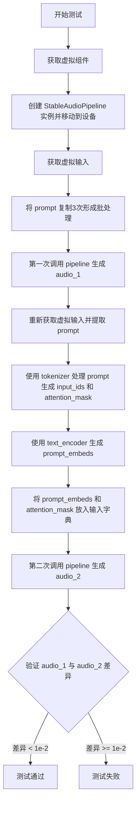

#### 带注释源码

```python
def test_stable_audio_without_prompts(self):
    """测试使用预计算的 prompt_embeds 与使用原始 prompt 生成的音频一致性"""
    
    # 获取虚拟组件（transformer, scheduler, vae, text_encoder, tokenizer, projection_model）
    components = self.get_dummy_components()
    
    # 使用虚拟组件创建 StableAudioPipeline 实例
    stable_audio_pipe = StableAudioPipeline(**components)
    
    # 将 pipeline 移动到指定的计算设备（如 CUDA）
    stable_audio_pipe = stable_audio_pipe.to(torch_device)
    
    # 重复移动到设备（可能是冗余操作，属于技术债务）
    stable_audio_pipe = stable_audio_pipe.to(torch_device)
    
    # 配置进度条（disable=None 表示启用进度条）
    stable_audio_pipe.set_progress_bar_config(disable=None)

    # 获取虚拟输入参数（包含 prompt, generator, num_inference_steps, guidance_scale）
    inputs = self.get_dummy_inputs(torch_device)
    
    # 将 prompt 复制3次以形成批处理输入
    inputs["prompt"] = 3 * [inputs["prompt"]]

    # 第一次前向传播：使用原始 prompt 字符串
    output = stable_audio_pipe(**inputs)
    audio_1 = output.audios[0]  # 获取第一个音频样本

    # 重新获取虚拟输入
    inputs = self.get_dummy_inputs(torch_device)
    
    # 提取并复制 prompt 为批处理
    prompt = 3 * [inputs.pop("prompt")]

    # 使用 tokenizer 对 prompt 进行分词和编码
    # 返回 PyTorch 格式的 tensor
    text_inputs = stable_audio_pipe.tokenizer(
        prompt,
        padding="max_length",
        max_length=stable_audio_pipe.tokenizer.model_max_length,
        truncation=True,
        return_tensors="pt",
    ).to(torch_device)
    
    # 获取 input_ids 和 attention_mask
    text_input_ids = text_inputs.input_ids
    attention_mask = text_inputs.attention_mask

    # 使用 text_encoder 生成文本嵌入表示
    # 返回包含隐藏状态的元组，取第一个元素为 prompt_embeds
    prompt_embeds = stable_audio_pipe.text_encoder(
        text_input_ids,
        attention_mask=attention_mask,
    )[0]

    # 将预计算的 prompt_embeds 和 attention_mask 放入输入字典
    # 替换原始的 prompt 参数
    inputs["prompt_embeds"] = prompt_embeds
    inputs["attention_mask"] = attention_mask

    # 第二次前向传播：使用预计算的 prompt_embeds
    output = stable_audio_pipe(**inputs)
    audio_2 = output.audios[0]  # 获取第一个音频样本

    # 断言：验证两次生成的音频差异小于阈值
    # 确保使用 prompt 字符串和预计算的 prompt_embeds 生成的结果一致
    assert (audio_1 - audio_2).abs().max() < 1e-2
```


### `StableAudioPipelineFastTests.test_stable_audio_negative_without_prompts`

该测试函数验证了 `StableAudioPipeline` 在使用负向提示词（negative prompt）时的功能一致性。它通过两种方式生成音频：一种直接使用字符串形式的 `negative_prompt`，另一种手动编码负向提示词并传入 `negative_prompt_embeds`，然后比较两次生成的音频是否相等，以确保负向提示词的处理逻辑正确。

参数：

- `self`：测试类实例本身，无显式参数

返回值：`None`，该函数为测试函数，无返回值，通过断言验证逻辑正确性

#### 流程图

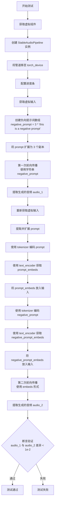

#### 带注释源码

```python
def test_stable_audio_negative_without_prompts(self):
    """
    测试 StableAudioPipeline 在使用负向提示词时的功能一致性。
    比较直接使用字符串 negative_prompt 和手动传入 negative_prompt_embeds
    两种方式生成的音频是否一致。
    """
    
    # 获取虚拟组件（transformer, scheduler, vae, text_encoder, tokenizer, projection_model）
    components = self.get_dummy_components()
    
    # 使用虚拟组件创建 StableAudioPipeline 实例
    stable_audio_pipe = StableAudioPipeline(**components)
    
    # 将管道移至指定设备（如 cuda 或 cpu）
    stable_audio_pipe = stable_audio_pipe.to(torch_device)
    
    # 配置进度条（disable=None 表示启用进度条）
    stable_audio_pipe.set_progress_bar_config(disable=None)
    
    # 获取虚拟输入参数（包含 prompt, generator, num_inference_steps, guidance_scale）
    inputs = self.get_dummy_inputs(torch_device)
    
    # 创建 3 个相同的负向提示词
    negative_prompt = 3 * ["this is a negative prompt"]
    
    # 将负向提示词加入输入参数
    inputs["negative_prompt"] = negative_prompt
    
    # 将 prompt 也扩展为 3 个副本（与负向提示词数量匹配为批处理）
    inputs["prompt"] = 3 * [inputs["prompt"]]
    
    # ===== 第一次前向传播：使用字符串形式的 prompt 和 negative_prompt =====
    output = stable_audio_pipe(**inputs)
    
    # 从输出中提取第一个音频样本
    audio_1 = output.audios[0]
    
    # ===== 准备第二次前向传播：手动编码 prompt 和 negative_prompt =====
    
    # 重新获取虚拟输入（重置输入状态）
    inputs = self.get_dummy_inputs(torch_device)
    
    # 提取并扩展 prompt 为 3 个副本
    prompt = 3 * [inputs.pop("prompt")]
    
    # 使用 tokenizer 对 prompt 进行编码
    # 返回包含 input_ids 和 attention_mask 的字典
    text_inputs = stable_audio_pipe.tokenizer(
        prompt,
        padding="max_length",
        max_length=stable_audio_pipe.tokenizer.model_max_length,
        truncation=True,
        return_tensors="pt",
    ).to(torch_device)
    
    # 提取编码后的 token IDs
    text_input_ids = text_inputs.input_ids
    
    # 提取注意力掩码
    attention_mask = text_inputs.attention_mask
    
    # 使用 text_encoder 将 token IDs 转换为 embedding 向量
    # 返回包含 last_hidden_state 的元组，取 [0] 得到 embeddings
    prompt_embeds = stable_audio_pipe.text_encoder(
        text_input_ids,
        attention_mask=attention_mask,
    )[0]
    
    # 将手动计算的 prompt_embeds 放入输入参数（覆盖字符串形式的 prompt）
    inputs["prompt_embeds"] = prompt_embeds
    
    # 将 attention_mask 放入输入参数
    inputs["attention_mask"] = attention_mask
    
    # ===== 手动编码 negative_prompt =====
    
    # 使用 tokenizer 对负向提示词进行编码
    negative_text_inputs = stable_audio_pipe.tokenizer(
        negative_prompt,
        padding="max_length",
        max_length=stable_audio_pipe.tokenizer.model_max_length,
        truncation=True,
        return_tensors="pt",
    ).to(torch_device)
    
    # 提取负向提示词的 token IDs 和 attention mask
    negative_text_input_ids = negative_text_inputs.input_ids
    negative_attention_mask = negative_text_inputs.attention_mask
    
    # 使用 text_encoder 将负向提示词转换为 embedding 向量
    negative_prompt_embeds = stable_audio_pipe.text_encoder(
        negative_text_input_ids,
        attention_mask=negative_attention_mask,
    )[0]
    
    # 将手动计算的 negative_prompt_embeds 放入输入参数
    inputs["negative_prompt_embeds"] = negative_prompt_embeds
    
    # 将负向 attention_mask 放入输入参数
    inputs["negative_attention_mask"] = negative_attention_mask
    
    # ===== 第二次前向传播：使用 embedding 形式的 prompt 和 negative_prompt =====
    output = stable_audio_pipe(**inputs)
    
    # 从输出中提取第一个音频样本
    audio_2 = output.audios[0]
    
    # ===== 断言验证：比较两次生成的音频是否一致 =====
    # 如果差异小于阈值（1e-2），说明负向提示词的两种处理方式结果一致
    assert (audio_1 - audio_2).abs().max() < 1e-2
```


### `StableAudioPipelineFastTests.test_stable_audio_negative_prompt`

该测试方法用于验证 StableAudioPipeline 在提供负向提示（negative_prompt）时能够正确生成音频，并检查输出音频的维度是否正确。

参数：

- `self`：`StableAudioPipelineFastTests`，表示类的实例对象（Python 类方法的隐式参数）

返回值：`None`，该测试方法无返回值，仅通过断言验证结果的正确性

#### 流程图

```mermaid
flowchart TD
    A[开始测试] --> B[设置device为cpu保证确定性]
    B --> C[获取虚拟组件get_dummy_components]
    C --> D[创建StableAudioPipeline实例]
    D --> E[将pipeline移动到device]
    E --> F[设置进度条配置]
    F --> G[获取虚拟输入get_dummy_inputs]
    G --> H[设置negative_prompt为egg cracking]
    H --> I[调用pipeline执行推理]
    I --> J[获取输出的第一个音频]
    J --> K{断言: audio.ndim == 2?}
    K -->|是| L{断言: audio.shape == (2, 7)?}
    K -->|否| M[测试失败]
    L -->|是| N[测试通过]
    L -->|否| M
```

#### 带注释源码

```python
def test_stable_audio_negative_prompt(self):
    """测试 StableAudioPipeline 对 negative_prompt 参数的处理"""
    
    # 设置设备为 CPU，确保 torch.Generator 的确定性
    device = "cpu"  # ensure determinism for the device-dependent torch.Generator
    
    # 获取用于测试的虚拟组件（transformer, scheduler, vae, text_encoder, tokenizer, projection_model）
    components = self.get_dummy_components()
    
    # 使用虚拟组件实例化 StableAudioPipeline
    stable_audio_pipe = StableAudioPipeline(**components)
    
    # 将 pipeline 移动到指定设备（CPU）
    stable_audio_pipe = stable_audio_pipe.to(device)
    
    # 配置进度条（disable=None 表示不禁用进度条）
    stable_audio_pipe.set_progress_bar_config(disable=None)
    
    # 获取虚拟输入，包含 prompt, generator, num_inference_steps, guidance_scale
    inputs = self.get_dummy_inputs(device)
    
    # 定义负向提示，用于引导模型避免生成与该提示相关的内容
    negative_prompt = "egg cracking"
    
    # 调用 pipeline 进行推理，传入 inputs 和 negative_prompt
    output = stable_audio_pipe(**inputs, negative_prompt=negative_prompt)
    
    # 从输出中获取第一个（也是唯一的）生成的音频
    audio = output.audios[0]
    
    # 断言：生成的音频应该是二维的（通道数, 采样点数）
    assert audio.ndim == 2
    
    # 断言：音频形状应为 (2, 7)，其中 2 是通道数，7 是采样点数
    assert audio.shape == (2, 7)
```


### `StableAudioPipelineFastTests.test_stable_audio_num_waveforms_per_prompt`

该测试方法用于验证 `StableAudioPipeline` 在不同 `num_waveforms_per_prompt` 参数下的行为，包括单提示词、批量提示词以及不同波形数量配置的音频生成功能，确保管道正确返回预期形状的音频数据。

参数：

- `self`：`unittest.TestCase`，测试类实例本身，无需显式传入

返回值：`None`，该方法为测试用例，通过断言验证行为，不返回具体数值

#### 流程图

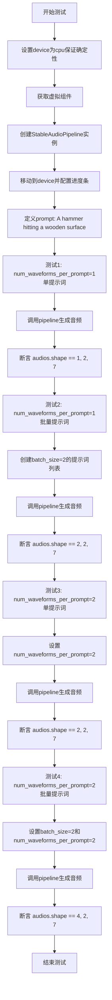

#### 带注释源码

```python
def test_stable_audio_num_waveforms_per_prompt(self):
    """测试 StableAudioPipeline 的 num_waveforms_per_prompt 参数功能"""
    # 设置设备为 CPU，确保 torch.Generator 的确定性
    device = "cpu"  # ensure determinism for the device-dependent torch.Generator
    
    # 获取用于测试的虚拟/模拟组件（transformer, scheduler, vae, text_encoder, tokenizer, projection_model）
    components = self.get_dummy_components()
    
    # 使用虚拟组件实例化 StableAudioPipeline
    stable_audio_pipe = StableAudioPipeline(**components)
    
    # 将管道移动到指定设备（CPU）
    stable_audio_pipe = stable_audio_pipe.to(device)
    
    # 配置进度条（disable=None 表示不禁用进度条）
    stable_audio_pipe.set_progress_bar_config(disable=None)

    # 定义测试用的提示词
    prompt = "A hammer hitting a wooden surface"

    # ==================== 测试场景 1：num_waveforms_per_prompt=1（默认）的单提示词 ====================
    # 调用 pipeline 生成音频，使用默认 num_waveforms_per_prompt=1
    audios = stable_audio_pipe(prompt, num_inference_steps=2).audios

    # 验证输出形状：(1, 2, 7) - 1个波形，2个通道，7个采样点
    assert audios.shape == (1, 2, 7)

    # ==================== 测试场景 2：num_waveforms_per_prompt=1（默认）的批量提示词 ====================
    # 创建批量大小为 2 的提示词列表
    batch_size = 2
    audios = stable_audio_pipe([prompt] * batch_size, num_inference_steps=2).audios

    # 验证输出形状：(2, 2, 7) - 2个波形（对应2个提示词），2个通道，7个采样点
    assert audios.shape == (batch_size, 2, 7)

    # ==================== 测试场景 3：num_waveforms_per_prompt=2 的单提示词 ====================
    # 设置每个提示词生成 2 个波形
    num_waveforms_per_prompt = 2
    audios = stable_audio_pipe(
        prompt, num_inference_steps=2, num_waveforms_per_prompt=num_waveforms_per_prompt
    ).audios

    # 验证输出形状：(2, 2, 7) - 2个波形（单提示词 x 2），2个通道，7个采样点
    assert audios.shape == (num_waveforms_per_prompt, 2, 7)

    # ==================== 测试场景 4：num_waveforms_per_prompt=2 的批量提示词 ====================
    # 设置批量大小为 2，每个提示词生成 2 个波形
    batch_size = 2
    audios = stable_audio_pipe(
        [prompt] * batch_size, num_inference_steps=2, num_waveforms_per_prompt=num_waveforms_per_prompt
    ).audios

    # 验证输出形状：(4, 2, 7) - 总波形数 = batch_size * num_waveforms_per_prompt = 2 * 2 = 4
    assert audios.shape == (batch_size * num_waveforms_per_prompt, 2, 7)
```


### `test_stable_audio_audio_end_in_s`

该测试方法用于验证 StableAudioPipeline 在指定音频结束时间（audio_end_in_s）参数下的生成功能是否正确，包括验证生成的音频形状是否符合预期的时间长度。

参数：

- `self`：无，显式隐含参数，StableAudioPipelineFastTests 类的实例，表示测试用例本身

返回值：`None`，测试方法无返回值，通过断言验证音频属性

#### 流程图

```mermaid
flowchart TD
    A[开始测试] --> B[设置device为cpu保证确定性]
    B --> C[获取虚拟组件get_dummy_components]
    C --> D[创建StableAudioPipeline实例]
    D --> E[将pipeline移动到torch_device]
    E --> F[设置进度条配置]
    F --> G[获取虚拟输入get_dummy_inputs]
    G --> H[调用pipeline: audio_end_in_s=1.5]
    H --> I[获取生成的音频output.audios[0]]
    I --> J[断言: audio.ndim == 2]
    J --> K{断言通过?}
    K -->|是| L[断言: audio.shape[1] / vae.sampling_rate == 1.5]
    K -->|否| M[测试失败]
    L --> N[再次调用pipeline: audio_end_in_s=1.1875]
    N --> O[获取生成的音频]
    O --> P[断言: audio.ndim == 2]
    P --> Q{断言通过?}
    Q -->|是| R[断言: audio.shape[1] / vae.sampling_rate == 1.0]
    Q -->|否| M
    R --> S[测试通过]
```

#### 带注释源码

```python
def test_stable_audio_audio_end_in_s(self):
    """
    测试 StableAudioPipeline 的 audio_end_in_s 参数功能
    
    该测试验证:
    1. 当 audio_end_in_s=1.5 时，生成的音频长度应为 1.5 秒
    2. 当 audio_end_in_s=1.1875 时，由于采样率限制，实际生成 1.0 秒
    """
    # 设置设备为 CPU 以确保 torch.Generator 的确定性
    device = "cpu"  # ensure determinism for the device-dependent torch.Generator
    
    # 获取虚拟组件（transformer, scheduler, vae, text_encoder, tokenizer, projection_model）
    components = self.get_dummy_components()
    
    # 使用虚拟组件创建 StableAudioPipeline 实例
    stable_audio_pipe = StableAudioPipeline(**components)
    
    # 将 pipeline 移动到指定的计算设备
    stable_audio_pipe = stable_audio_pipe.to(torch_device)
    
    # 配置进度条（disable=None 表示不禁用进度条）
    stable_audio_pipe.set_progress_bar_config(disable=None)
    
    # 获取测试用的虚拟输入（包含 prompt, generator, num_inference_steps, guidance_scale）
    inputs = self.get_dummy_inputs(device)
    
    # 第一次调用：使用 audio_end_in_s=1.5 参数生成音频
    output = stable_audio_pipe(audio_end_in_s=1.5, **inputs)
    
    # 获取生成的第一个音频
    audio = output.audios[0]
    
    # 断言：音频应为二维张量（通道数 x 采样点数）
    assert audio.ndim == 2
    
    # 断言：音频长度（采样点数除以采样率）应等于 1.5 秒
    assert audio.shape[1] / stable_audio_pipe.vae.sampling_rate == 1.5
    
    # 第二次调用：使用 audio_end_in_s=1.1875 参数
    # 由于虚拟组件的采样率配置，可能只能生成 1.0 秒的音频
    output = stable_audio_pipe(audio_end_in_s=1.1875, **inputs)
    audio = output.audios[0]
    
    # 断言：音频应为二维张量
    assert audio.ndim == 2
    
    # 断言：音频长度应等于 1.0 秒（受采样率限制）
    assert audio.shape[1] / stable_audio_pipe.vae.sampling_rate == 1.0
```


### `StableAudioPipelineFastTests.test_attention_slicing_forward_pass`

该测试方法用于验证 StableAudioPipeline 在启用注意力切片（Attention Slicing）功能时的前向传播是否正常工作，确保音频生成功能在优化内存使用场景下保持正确性。

参数：无（仅包含隐式参数 `self`）

返回值：`None`，该方法为单元测试方法，不返回任何值，仅通过断言验证内部逻辑

#### 流程图

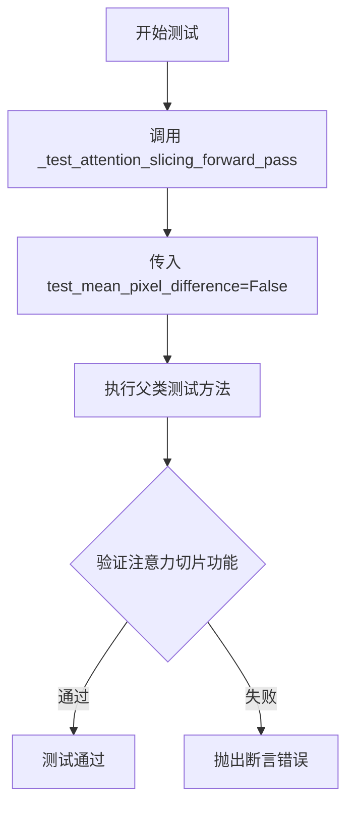

#### 带注释源码

```python
def test_attention_slicing_forward_pass(self):
    """
    测试 StableAudioPipeline 在启用注意力切片(Attention Slicing)时的前向传播功能。
    
    Attention Slicing 是一种内存优化技术，将大型注意力计算拆分为多个小块，
    以减少峰值内存占用。该测试确保启用该功能后管道仍能正确生成音频。
    
    参数:
        self: StableAudioPipelineFastTests 实例引用
    
    返回值:
        None: 测试方法，通过内部断言验证功能正确性
    
    注意:
        - 该方法委托给父类 PipelineTesterMixin 中的 _test_attention_slicing_forward_pass 方法执行
        - test_mean_pixel_difference=False 表示不测试像素均值差异（音频使用场景）
    """
    # 调用父类或混合类中的实际测试实现
    # test_mean_pixel_difference=False 参数表示不计算像素均值差异
    # 因为音频数据的验证方式与图像不同
    self._test_attention_slicing_forward_pass(test_mean_pixel_difference=False)
```


### `StableAudioPipelineFastTests.test_inference_batch_single_identical`

该测试方法用于验证 StableAudioPipeline 在批量推理模式下，针对单个提示词的推理结果与将该单个提示词放入批量中进行推理的结果保持一致性（数值误差在允许范围内），以确保管道实现的正确性和可重复性。

参数：

- `self`：`StableAudioPipelineFastTests`，隐式参数，表示测试类的实例本身

返回值：`None`，无返回值（测试方法）

#### 流程图

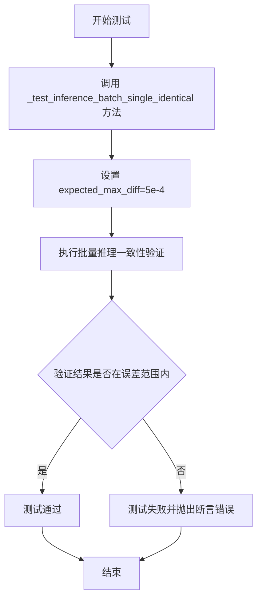

#### 带注释源码

```python
def test_inference_batch_single_identical(self):
    # 测试方法：验证批量推理时单个提示词的推理结果与单独推理结果的一致性
    # 该测试确保管道在批量模式下的数值输出与单独处理时保持一致
    # 参数 expected_max_diff=5e-4 设置了最大允许的数值差异阈值
    self._test_inference_batch_single_identical(expected_max_diff=5e-4)
```


### `StableAudioPipelineFastTests.test_xformers_attention_forwardGenerator_pass`

该测试方法用于验证 StableAudioPipeline 在启用 xFormers 注意力机制时的前向传播是否正常工作，通过调用内部测试方法 `_test_xformers_attention_forwardGenerator_pass` 进行断言验证。

参数：

- `self`：`StableAudioPipelineFastTests`，测试类实例本身，隐含参数

返回值：`None`，无返回值（测试方法）

#### 流程图

```mermaid
flowchart TD
    A[开始测试] --> B{检查条件:<br/>torch_device == 'cuda'<br/>且 is_xformers_available()}
    B -->|条件不满足| C[跳过测试<br/>Skip Test]
    B -->|条件满足| D[调用内部测试方法<br/>_test_xformers_attention_forwardGenerator_pass]
    D --> E[传入参数:<br/>test_mean_pixel_difference=False]
    E --> F[执行注意力机制验证]
    F --> G[断言验证通过]
    G --> H[结束测试]
    C --> H
```

#### 带注释源码

```python
@unittest.skipIf(
    torch_device != "cuda" or not is_xformers_available(),
    reason="XFormers attention is only available with CUDA and `xformers` installed",
)
def test_xformers_attention_forwardGenerator_pass(self):
    """
    测试 StableAudioPipeline 在使用 xFormers 注意力机制时的前向传播。
    
    该测试方法:
    1. 检查运行条件是否满足 (CUDA 设备且 xFormers 可用)
    2. 调用内部测试方法 _test_xformers_attention_forwardGenerator_pass 进行验证
    3. 传入 test_mean_pixel_difference=False 表示不测试像素差异的均值
    
    注意: 这是 StableAudioPipelineFastTests 类中少数禁用了 xFormers 测试的
    方法之一 (因为类级别的 test_xformers_attention = False)
    """
    # 调用父类或混入类中定义的内部测试方法
    # 该方法真正执行 xFormers 注意力机制的测试逻辑
    self._test_xformers_attention_forwardGenerator_pass(test_mean_pixel_difference=False)
```


### `StableAudioPipelineFastTests.test_stable_audio_input_waveform`

该测试方法用于验证 `StableAudioPipeline` 在使用初始音频波形（initial_audio_waveforms）作为输入时的功能和错误处理，包括：无采样率时的错误抛出、错误采样率时的错误抛出、正常情况下的音频生成、以及与 `num_waveforms_per_prompt` 和批量提示词的组合测试。

参数：

- `self`：`StableAudioPipelineFastTests`，测试类实例本身

返回值：`None`，该方法为单元测试方法，无返回值，通过断言验证功能正确性

#### 流程图

```mermaid
flowchart TD
    A[开始测试 test_stable_audio_input_waveform] --> B[设置设备为cpu]
    B --> C[获取虚拟组件]
    C --> D[创建并初始化StableAudioPipeline]
    D --> E[设置提示词: 'A hammer hitting a wooden surface']
    E --> F[创建初始音频波形: torch.ones((1, 5))]
    F --> G{测试1: 无采样率时是否抛出ValueError}
    G -->|是| H[调用pipeline不传initial_audio_sampling_rate]
    H --> I[断言抛出ValueError]
    I --> J{测试2: 错误采样率时是否抛出ValueError}
    J --> K[调用pipeline传错误的采样率]
    K --> L[断言抛出ValueError]
    L --> M{测试3: 正常情况生成音频}
    M --> N[调用pipeline传正确的采样率]
    N --> O[断言音频形状为(1, 2, 7)]
    O --> P{测试4: num_waveforms_per_prompt=2}
    P --> Q[设置num_waveforms_per_prompt=2]
    Q --> R[调用pipeline生成音频]
    R --> S[断言音频形状为(2, 2, 7)]
    S --> T{测试5: 批量提示词+输入音频}
    T --> U[设置batch_size=2, 初始波形torch.ones((2, 2, 5))]
    U --> V[调用pipeline生成音频]
    V --> W[断言音频形状为(4, 2, 7)]
    W --> X[结束测试]
```

#### 带注释源码

```python
def test_stable_audio_input_waveform(self):
    """
    测试StableAudioPipeline使用初始音频波形作为输入的功能
    
    测试场景:
    1. 未提供采样率时应抛出ValueError
    2. 提供错误的采样率时应抛出ValueError
    3. 正常情况下应能生成音频
    4. 支持num_waveforms_per_prompt参数
    5. 支持批量提示词和输入音频
    """
    # 设置设备为cpu以确保torch.Generator的确定性
    device = "cpu"  # ensure determinism for the device-dependent torch.Generator
    
    # 获取虚拟组件用于测试
    components = self.get_dummy_components()
    
    # 创建StableAudioPipeline实例
    stable_audio_pipe = StableAudioPipeline(**components)
    stable_audio_pipe = stable_audio_pipe.to(device)
    
    # 禁用进度条配置
    stable_audio_pipe.set_progress_bar_config(disable=None)

    # 设置测试提示词
    prompt = "A hammer hitting a wooden surface"

    # 创建初始音频波形 (单通道, 5个样本)
    initial_audio_waveforms = torch.ones((1, 5))

    # 测试1: 验证未提供采样率时抛出ValueError
    # test raises error when no sampling rate
    with self.assertRaises(ValueError):
        audios = stable_audio_pipe(
            prompt, num_inference_steps=2, initial_audio_waveforms=initial_audio_waveforms
        ).audios

    # 测试2: 验证提供错误采样率时抛出ValueError
    # test raises error when wrong sampling rate
    with self.assertRaises(ValueError):
        audios = stable_audio_pipe(
            prompt,
            num_inference_steps=2,
            initial_audio_waveforms=initial_audio_waveforms,
            initial_audio_sampling_rate=stable_audio_pipe.vae.sampling_rate - 1,
        ).audios

    # 测试3: 使用正确的采样率生成音频
    audios = stable_audio_pipe(
        prompt,
        num_inference_steps=2,
        initial_audio_waveforms=initial_audio_waveforms,
        initial_audio_sampling_rate=stable_audio_pipe.vae.sampling_rate,
    ).audios
    
    # 验证输出形状: (1, 2, 7) - 1个波形, 2通道, 7个采样点
    assert audios.shape == (1, 2, 7)

    # 测试4: 验证与num_waveforms_per_prompt参数配合工作
    # test works with num_waveforms_per_prompt
    num_waveforms_per_prompt = 2
    audios = stable_audio_pipe(
        prompt,
        num_inference_steps=2,
        num_waveforms_per_prompt=num_waveforms_per_prompt,
        initial_audio_waveforms=initial_audio_waveforms,
        initial_audio_sampling_rate=stable_audio_pipe.vae.sampling_rate,
    ).audios

    # 验证输出形状: (2, 2, 7) - 2个波形
    assert audios.shape == (num_waveforms_per_prompt, 2, 7)

    # 测试5: 验证批量提示词和输入音频的组合 (双通道)
    # test num_waveforms_per_prompt for batch of prompts and input audio (two channels)
    batch_size = 2
    # 创建批量初始音频波形 (2个样本, 2通道, 5个采样点)
    initial_audio_waveforms = torch.ones((batch_size, 2, 5))
    audios = stable_audio_pipe(
        [prompt] * batch_size,
        num_inference_steps=2,
        num_waveforms_per_prompt=num_waveforms_per_prompt,
        initial_audio_waveforms=initial_audio_waveforms,
        initial_audio_sampling_rate=stable_audio_pipe.vae.sampling_rate,
    ).audios

    # 验证输出形状: (4, 2, 7) - batch_size * num_waveforms_per_prompt = 2*2 = 4个波形
    assert audios.shape == (batch_size * num_waveforms_per_prompt, 2, 7)
```


### `StableAudioPipelineIntegrationTests.test_stable_audio`

这是 Stable Audio 管道集成测试的核心方法，负责验证完整的多模态音频生成流程（从文本提示到音频输出）。该测试加载预训练模型，执行推理，并验证生成音频的维度、采样率以及数值精度是否符合预期。

参数：

- `self`：隐式参数，测试类实例本身

返回值：`None`，该方法为测试方法，通过断言验证输出，不返回具体值

#### 流程图

```mermaid
flowchart TD
    A[开始测试] --> B[从预训练模型加载StableAudioPipeline]
    B --> C[将管道移动到torch_device]
    C --> D[配置进度条为可用状态]
    D --> E[获取测试输入参数]
    E --> F[设置推理步数为25]
    F --> G[执行管道推理: stable_audio_pipe(**inputs)]
    G --> H[获取生成的第一个音频: audio = output.audios[0]]
    H --> I[断言: 音频为2维张量]
    I --> J[断言: 音频形状正确]
    J --> K[提取音频片段用于数值验证]
    K --> L[获取期望的音频片段数值]
    L --> M[计算最大误差: max_diff]
    M --> N{max_diff < 1.5e-3?}
    N -->|是| O[测试通过]
    N -->|否| P[测试失败-断言错误]
```

#### 带注释源码

```python
@nightly                                          # 标记为夜间测试（需单独运行）
@require_torch_accelerator                        # 要求有GPU加速器
def test_stable_audio(self):
    # 1. 从预训练模型加载StableAudioPipeline
    #    这会加载完整的音频生成管道，包括:
    #    - T5文本编码器
    #    - StableAudioDiTTransformer模型
    #    - VAE解码器
    #    - 调度器
    stable_audio_pipe = StableAudioPipeline.from_pretrained("stabilityai/stable-audio-open-1.0")
    
    # 2. 将管道移动到指定的计算设备(CPU/CUDA/XPU等)
    stable_audio_pipe = stable_audio_pipe.to(torch_device)
    
    # 3. 配置进度条（设为可用，不禁用）
    stable_audio_pipe.set_progress_bar_config(disable=None)
    
    # 4. 获取测试输入参数，包括:
    #    - prompt: 文本提示 "A hammer hitting a wooden surface"
    #    - latents: 预定义的噪声潜在向量
    #    - generator: 随机数生成器（用于可复现性）
    #    - num_inference_steps: 推理步数
    #    - audio_end_in_s: 目标音频时长（秒）
    #    - guidance_scale: 引导强度
    inputs = self.get_inputs(torch_device)
    
    # 5. 覆盖推理步数为25（比默认更多的步数以提高质量）
    inputs["num_inference_steps"] = 25
    
    # 6. 执行管道推理，传入所有输入参数
    #    返回Audio对象，包含生成的音频数组
    audio = stable_audio_pipe(**inputs).audios[0]
    
    # 7. 验证生成的音频维度为2维（channels, samples）
    assert audio.ndim == 2
    
    # 8. 验证音频形状正确:
    #    - 2个通道（立体声）
    #    - 采样点数 = 时长 × 采样率
    assert audio.shape == (2, int(inputs["audio_end_in_s"] * stable_audio_pipe.vae.sampling_rate))
    
    # 9. 提取音频片段进行数值精度验证
    #    选择动态范围较大的片段以减少测试不稳定性
    audio_slice = audio[0, 447590:447600]
    
    # 10. 根据设备类型获取期望的音频数值（不同硬件平台有微小差异）
    #      支持xpu:3, cuda:7, cuda:8等设备
    expected_slices = Expectations(
        {
            ("xpu", 3): np.array([-0.0285, 0.1083, 0.1863, 0.3165, 0.5312, 0.6971, 0.6958, 0.6177, 0.5598, 0.5048]),
            ("cuda", 7): np.array([-0.0278, 0.1096, 0.1877, 0.3178, 0.5329, 0.6990, 0.6972, 0.6186, 0.5608, 0.5060]),
            ("cuda", 8): np.array([-0.0285, 0.1082, 0.1862, 0.3163, 0.5306, 0.6964, 0.6953, 0.6172, 0.5593, 0.5044]),
        }
    )
    
    # 11. 获取当前设备对应的期望值
    expected_slice = expected_slices.get_expectation()
    
    # 12. 计算实际输出与期望值的最大绝对误差
    max_diff = np.abs(expected_slice - audio_slice.detach().cpu().numpy()).max()
    
    # 13. 验证误差在容许范围内（1.5e-3）
    assert max_diff < 1.5e-3
```


### `StableAudioPipelineFastTests.get_dummy_components`

该方法用于创建并返回一个包含 StableAudioPipeline 所需的所有虚拟（dummy）组件的字典，主要用于单元测试。这些虚拟组件包括 DiT Transformer、VAE 编码器、文本编码器、分词器、投影模型和调度器，每个组件都使用最小的配置以加快测试执行速度。

参数：无（仅包含隐式参数 `self`）

返回值：`Dict[str, object]`，返回一个字典，包含以下键值对：
- `"transformer"`：`StableAudioDiTModel` 实例，DiT 变换器模型
- `"scheduler"`：`CosineDPMSolverMultistepScheduler` 实例，调度器
- `"vae"`：`AutoencoderOobleck` 实例，VAE 编码器-解码器
- `"text_encoder"`：`T5EncoderModel` 实例，文本编码器
- `"tokenizer"`：`T5Tokenizer` 实例，分词器
- `"projection_model"`：`StableAudioProjectionModel` 实例，投影模型

#### 流程图

```mermaid
flowchart TD
    A[开始 get_dummy_components] --> B[设置随机种子 torch.manual_seed(0)]
    B --> C[创建 StableAudioDiTModel 变换器]
    C --> D[创建 CosineDPMSolverMultistepScheduler 调度器]
    D --> E[设置随机种子 torch.manual_seed(0)]
    E --> F[创建 AutoencoderOobleck VAE]
    F --> G[设置随机种子并加载 T5EncoderModel 和 T5Tokenizer]
    G --> H[设置随机种子 torch.manual_seed(0)]
    H --> I[创建 StableAudioProjectionModel 投影模型]
    I --> J[组装 components 字典]
    J --> K[返回 components]
```

#### 带注释源码

```python
def get_dummy_components(self):
    """
    创建并返回用于测试的虚拟组件字典
    
    Returns:
        dict: 包含 StableAudioPipeline 所有必要组件的字典
    """
    # 设置随机种子以确保测试可重复性
    torch.manual_seed(0)
    
    # 创建 StableAudioDiTModel（DiT 变换器模型）
    # 参数配置：sample_size=4, in_channels=3, num_layers=2 等
    # 用于音频生成的变换器核心组件
    transformer = StableAudioDiTModel(
        sample_size=4,
        in_channels=3,
        num_layers=2,
        attention_head_dim=4,
        num_key_value_attention_heads=2,
        out_channels=3,
        cross_attention_dim=4,
        time_proj_dim=8,
        global_states_input_dim=8,
        cross_attention_input_dim=4,
    )
    
    # 创建调度器（用于扩散模型的多步求解）
    # 使用余弦 DPM Solver，配置为二阶求解器和 v_prediction 预测类型
    scheduler = CosineDPMSolverMultistepScheduler(
        solver_order=2,
        prediction_type="v_prediction",
        sigma_data=1.0,
        sigma_schedule="exponential",
    )
    
    # 重新设置随机种子，确保 VAE 初始化独立
    torch.manual_seed(0)
    
    # 创建 AutoencoderOobleck（VAE 变分自编码器）
    # 用于将潜在表示编码/解码为音频波形
    vae = AutoencoderOobleck(
        encoder_hidden_size=6,
        downsampling_ratios=[1, 2],
        decoder_channels=3,
        decoder_input_channels=3,
        audio_channels=2,
        channel_multiples=[2, 4],
        sampling_rate=4,
    )
    
    # 加载预训练的 T5 文本编码器（微小版本用于测试）
    # 从 HuggingFace Hub 加载 tiny-random-T5ForConditionalGeneration
    torch.manual_seed(0)
    t5_repo_id = "hf-internal-testing/tiny-random-T5ForConditionalGeneration"
    text_encoder = T5EncoderModel.from_pretrained(t5_repo_id)
    tokenizer = T5Tokenizer.from_pretrained(t5_repo_id, truncation=True, model_max_length=25)

    # 创建投影模型，用于将文本嵌入投影到音频条件空间
    torch.manual_seed(0)
    projection_model = StableAudioProjectionModel(
        text_encoder_dim=text_encoder.config.d_model,
        conditioning_dim=4,
        min_value=0,
        max_value=32,
    )

    # 组装所有组件到字典中
    components = {
        "transformer": transformer,
        "scheduler": scheduler,
        "vae": vae,
        "text_encoder": text_encoder,
        "tokenizer": tokenizer,
        "projection_model": projection_model,
    }
    
    # 返回组件字典，供 StableAudioPipeline 初始化使用
    return components
```


### `StableAudioPipelineFastTests.get_dummy_inputs`

该方法是一个测试辅助函数，用于生成 StableAudioPipeline 的虚拟输入参数，以便在单元测试中进行 pipeline 推理测试。它根据传入的设备类型和随机种子创建确定性的生成器，并返回包含提示词、生成器、推理步数和引导比例的标准输入字典。

参数：

- `device`：`str` 或 `torch.device`，运行设备，用于创建随机数生成器
- `seed`：`int`，随机种子，默认值为 0，用于确保测试的可重复性

返回值：`Dict[str, Any]`，返回一个包含测试所需输入参数的字典，包括 prompt（提示词）、generator（随机数生成器）、num_inference_steps（推理步数）和 guidance_scale（引导比例）

#### 流程图

```mermaid
flowchart TD
    A[开始 get_dummy_inputs] --> B{device 是否为 MPS 设备?}
    B -->|是| C[使用 torch.manual_seed 设置种子]
    B -->|否| D[创建 torch.Generator 并设置种子]
    C --> E[构建输入字典]
    D --> E
    E --> F[返回输入字典]
    
    style A fill:#f9f,color:#333
    style F fill:#9f9,color:#333
```

#### 带注释源码

```python
def get_dummy_inputs(self, device, seed=0):
    """
    生成用于测试 StableAudioPipeline 的虚拟输入参数。
    
    Args:
        device: 运行设备，用于创建随机数生成器
        seed: 随机种子，默认值为 0，用于确保测试的可重复性
    
    Returns:
        包含测试所需输入参数的字典
    """
    # 判断设备是否为 Apple MPS (Metal Performance Shaders)
    if str(device).startswith("mps"):
        # MPS 设备不支持 torch.Generator，使用 torch.manual_seed 替代
        generator = torch.manual_seed(seed)
    else:
        # 其他设备（如 CPU/CUDA）使用 torch.Generator 以确保确定性
        generator = torch.Generator(device=device).manual_seed(seed)
    
    # 构建测试输入字典
    inputs = {
        "prompt": "A hammer hitting a wooden surface",  # 测试用提示词
        "generator": generator,                         # 随机数生成器
        "num_inference_steps": 2,                       # 推理步数（测试用小值）
        "guidance_scale": 6.0,                          #引导比例
    }
    return inputs
```


### `StableAudioPipelineFastTests.test_save_load_local`

该测试方法继承自 `PipelineTesterMixin`，用于验证 `StableAudioPipeline` 对象的本地保存和加载功能是否正常工作。通过调用父类的测试方法，确保管道在序列化与反序列化后能产生一致的输出。为适应大型复合模型的数值误差，容差从默认的 `1e-4` 提高到 `7e-3`。

参数：

- `self`：`StableAudioPipelineFastTests`，测试类实例本身，隐式的 `this` 引用

返回值：`None`，无返回值，执行父类测试方法进行保存/加载验证

#### 流程图

```mermaid
flowchart TD
    A[开始 test_save_load_local] --> B[设置容差值 7e-3]
    B --> C[调用父类 test_save_load_local 方法]
    C --> D{验证保存/加载是否一致}
    D -->|通过| E[测试通过]
    D -->|失败| F[抛出断言错误]
    E --> G[结束]
    F --> G
```

#### 带注释源码

```python
def test_save_load_local(self):
    """
    测试 StableAudioPipeline 的本地保存和加载功能。
    
    该方法继承自 PipelineTesterMixin，通过调用父类方法验证：
    1. 管道对象可以被保存到本地
    2. 管道对象可以从本地加载
    3. 加载后的管道能够产生与原始管道数值一致的输出
    
    容差从默认的 1e-4 增加到 7e-3，以适应 StableAudioPipeline 
    这类大型复合模型（包含 transformer、vae、text_encoder、projection_model 
    等多个组件）带来的累积数值误差。
    """
    # increase tolerance from 1e-4 -> 7e-3 to account for large composite model
    # 增加容差阈值：默认值 1e-4 不足以容纳大型复合模型各组件
    #（如 StableAudioDiTModel、AutoencoderOobleck、T5EncoderModel 等）
    # 叠加产生的数值误差，因此提高到 7e-3
    super().test_save_load_local(expected_max_difference=7e-3)
```


### `StableAudioPipelineFastTests.test_save_load_optional_components`

该测试方法用于验证 StableAudioPipeline 可选组件的保存和加载功能是否正确，通过调用父类测试方法并增加容差值（从 1e-4 提升至 7e-3）来适应大型复合模型的数值误差。

参数：

- `self`：`StableAudioPipelineFastTests`，测试类实例本身，用于访问测试类的属性和方法

返回值：`None`，无返回值（测试方法）

#### 流程图

```mermaid
flowchart TD
    A[开始测试 test_save_load_optional_components] --> B[设置容差值 7e-3]
    B --> C[调用父类 test_save_load_optional_components 方法]
    C --> D[传入 expected_max_difference=7e-3 参数]
    D --> E{父类测试执行}
    E -->|成功| F[测试通过]
    E -->|失败| G[测试失败]
    F --> H[结束]
    G --> H
```

#### 带注释源码

```python
def test_save_load_optional_components(self):
    """
    测试 StableAudioPipeline 可选组件的保存和加载功能
    
    该测试方法继承自 PipelineTesterMixin，用于验证管道在保存和加载时
    对可选组件的处理是否正确。由于 StableAudioPipeline 是大型复合模型，
    数值精度误差较大，因此增加容差值以避免误报。
    """
    # 增加容差值从 1e-4 到 7e-3，以适应大型复合模型的数值误差
    # super() 调用父类 PipelineTesterMixin 的同名测试方法
    super().test_save_load_optional_components(expected_max_difference=7e-3)
```


### `StableAudioPipelineFastTests.test_stable_audio_ddim`

该测试方法验证 StableAudioPipeline 使用虚拟组件和 DDIM 调度器生成音频的基本功能，确保管道能够成功执行推理并输出正确维度的音频数据。

参数：

- `self`：测试类实例，无需显式传递

返回值：`None`，该方法为测试函数，不返回任何值

#### 流程图

```mermaid
flowchart TD
    A[开始测试] --> B[设置device为cpu确保确定性]
    B --> C[调用get_dummy_components获取虚拟组件]
    C --> D[创建StableAudioPipeline实例并传入组件]
    D --> E[将pipeline移动到torch_device设备]
    E --> F[设置进度条配置disable=None]
    F --> G[调用get_dummy_inputs获取虚拟输入]
    G --> H[执行pipeline推理: stable_audio_pipe(**inputs)]
    H --> I[从输出中提取音频: output.audios[0]]
    I --> J{断言: audio.ndim == 2?}
    J -->|是| K{断言: audio.shape == (2, 7)?}
    J -->|否| L[测试失败: 音频维度不正确]
    K -->|是| M[测试通过]
    K -->|否| N[测试失败: 音频形状不正确]
```

#### 带注释源码

```python
def test_stable_audio_ddim(self):
    """
    测试 StableAudioPipeline 使用 DDIM 调度器生成音频的功能
    
    该测试验证:
    1. 管道能够使用虚拟组件成功初始化
    2. 管道能够执行推理生成音频
    3. 生成的音频具有正确的维度 (2D) 和形状 (2, 7)
    """
    # 设置设备为 CPU 以确保 torch.Generator 的确定性
    device = "cpu"  # ensure determinism for the device-dependent torch.Generator

    # 获取虚拟组件 (transformer, scheduler, vae, text_encoder, tokenizer, projection_model)
    components = self.get_dummy_components()
    
    # 使用虚拟组件创建 StableAudioPipeline 实例
    stable_audio_pipe = StableAudioPipeline(**components)
    
    # 将管道移动到指定的 torch 设备 (torch_device)
    stable_audio_pipe = stable_audio_pipe.to(torch_device)
    
    # 配置进度条,disable=None 表示不禁用进度条
    stable_audio_pipe.set_progress_bar_config(disable=None)

    # 获取虚拟输入 (prompt, generator, num_inference_steps, guidance_scale)
    inputs = self.get_dummy_inputs(device)
    
    # 执行推理: 将输入参数解包传递给 pipeline
    output = stable_audio_pipe(**inputs)
    
    # 从输出对象中提取第一个音频样本
    audio = output.audios[0]

    # 断言: 验证音频是二维张量 (channels, samples)
    assert audio.ndim == 2
    
    # 断言: 验证音频形状为 (2, 7) 即 2 个通道, 7 个采样点
    assert audio.shape == (2, 7)
```


### `StableAudioPipelineFastTests.test_stable_audio_without_prompts`

该测试方法验证 StableAudioPipeline 在使用预计算的 prompt_embeds 时能够产生与使用原始 prompt 相同的结果，通过两次前向传播（一次使用 prompt，一次使用 prompt_embeds）并比较生成的音频差异是否小于阈值来确保一致性。

参数：
- `self`：隐式参数，测试类实例

返回值：`None`，无返回值（测试方法）

#### 流程图

```mermaid
flowchart TD
    A[开始测试] --> B[获取虚拟组件 get_dummy_components]
    B --> C[创建 StableAudioPipeline 并移动到 torch_device]
    C --> D[获取虚拟输入 get_dummy_inputs]
    D --> E[将 prompt 复制3次形成批次]
    E --> F[第一次前向传播使用原始 prompt]
    F --> G[提取 audio_1]
    G --> H[重新获取输入并弹出 prompt]
    H --> I[使用 tokenizer 处理 prompt 生成 text_input_ids 和 attention_mask]
    I --> J[使用 text_encoder 生成 prompt_embeds]
    J --> K[将 prompt_embeds 和 attention_mask 放入输入字典]
    K --> L[第二次前向传播使用 prompt_embeds]
    L --> M[提取 audio_2]
    M --> N{断言 audio_1 和 audio_2 差异 < 1e-2}
    N -->|通过| O[测试通过]
    N -->|失败| P[测试失败]
```

#### 带注释源码

```python
def test_stable_audio_without_prompts(self):
    """
    测试 StableAudioPipeline 在使用预计算的 prompt_embeds 时
    能够产生与使用原始 prompt 相同的结果
    
    该测试验证了：
    1. pipeline 正确处理批量的 prompt
    2. 直接传入 prompt_embeds 与传入 prompt 然后内部编码产生相同结果
    """
    # Step 1: 获取虚拟组件（transformer, scheduler, vae, text_encoder, tokenizer, projection_model）
    components = self.get_dummy_components()
    
    # Step 2: 创建 StableAudioPipeline 实例并配置设备
    # 注意：这里重复调用了 to(torch_device) 两次，可能是代码冗余
    stable_audio_pipe = StableAudioPipeline(**components)
    stable_audio_pipe = stable_audio_pipe.to(torch_device)
    stable_audio_pipe = stable_audio_pipe.to(torch_device)  # 冗余：重复调用
    stable_audio_pipe.set_progress_bar_config(disable=None)

    # Step 3: 获取虚拟输入参数
    inputs = self.get_dummy_inputs(torch_device)
    
    # Step 4: 将 prompt 扩展为3个副本（批处理测试）
    inputs["prompt"] = 3 * [inputs["prompt"]]

    # Step 5: 第一次前向传播 - 使用原始字符串 prompt
    output = stable_audio_pipe(**inputs)
    audio_1 = output.audios[0]  # 获取第一个批次的音频输出

    # Step 6: 准备第二次前向传播 - 使用预计算的 prompt_embeds
    inputs = self.get_dummy_inputs(torch_device)
    
    # 弹出 prompt 并复制为3个副本
    prompt = 3 * [inputs.pop("prompt")]

    # Step 7: 手动使用 tokenizer 将文本转换为 token IDs
    text_inputs = stable_audio_pipe.tokenizer(
        prompt,
        padding="max_length",
        max_length=stable_audio_pipe.tokenizer.model_max_length,
        truncation=True,
        return_tensors="pt",
    ).to(torch_device)
    
    # 提取 input_ids 和 attention_mask
    text_input_ids = text_inputs.input_ids
    attention_mask = text_inputs.attention_mask

    # Step 8: 使用 text_encoder 生成 prompt embeddings
    # 这是关键步骤：手动生成 prompt_embeds 而不是让 pipeline 内部处理
    prompt_embeds = stable_audio_pipe.text_encoder(
        text_input_ids,
        attention_mask=attention_mask,
    )[0]  # [0] 表示取隐藏状态

    # Step 9: 将预计算的 embeddings 添加到输入中
    inputs["prompt_embeds"] = prompt_embeds
    inputs["attention_mask"] = attention_mask

    # Step 10: 第二次前向传播 - 使用预计算的 prompt_embeds
    output = stable_audio_pipe(**inputs)
    audio_2 = output.audios[0]

    # Step 11: 验证两次生成的音频是否在容差范围内一致
    # 这确保了使用 prompt_embeds 和使用 prompt 产生相同结果
    assert (audio_1 - audio_2).abs().max() < 1e-2
```


### `StableAudioPipelineFastTests.test_stable_audio_negative_without_prompts`

该测试方法验证 StableAudioPipeline 在使用 negative_prompt 但不直接提供 prompt_embeds 和 negative_prompt_embeds 时，能够通过内部处理生成与手动提供 embeddings 时一致的音频输出。

参数：

- `self`：隐式参数，TestCase实例，表示测试类本身

返回值：`None`，该方法为测试方法，通过 assert 语句进行断言验证，不返回任何值

#### 流程图

```mermaid
flowchart TD
    A[开始测试] --> B[获取虚拟组件 components]
    B --> C[创建 StableAudioPipeline 并移至 torch_device]
    C --> D[设置进度条配置]
    D --> E[获取虚拟输入 inputs]
    E --> F[设置 negative_prompt 和重复 prompt]
    F --> G[第一次前向传播 output]
    G --> H[提取 audio_1]
    H --> I[重新获取虚拟输入]
    I --> J[从 inputs 中弹出 prompt 并重复3次]
    J --> K[使用 tokenizer 处理 prompt]
    K --> L[使用 text_encoder 获取 prompt_embeds]
    L --> M[将 prompt_embeds 放入 inputs]
    M --> N[使用 tokenizer 处理 negative_prompt]
    N --> O[使用 text_encoder 获取 negative_prompt_embeds]
    O --> P[将 negative_prompt_embeds 放入 inputs]
    P --> Q[第二次前向传播 output]
    Q --> R[提取 audio_2]
    R --> S{验证 audio_1 与 audio_2 差异}
    S -->|差异 < 1e-2| T[测试通过]
    S -->|差异 >= 1e-2| U[测试失败]
```

#### 带注释源码

```python
def test_stable_audio_negative_without_prompts(self):
    # 1. 获取虚拟组件（transformer, scheduler, vae, text_encoder, tokenizer, projection_model）
    components = self.get_dummy_components()
    
    # 2. 使用虚拟组件创建 StableAudioPipeline 并移至计算设备
    stable_audio_pipe = StableAudioPipeline(**components)
    stable_audio_pipe = stable_audio_pipe.to(torch_device)
    
    # 3. 配置进度条（传入 None 表示不禁用）
    stable_audio_pipe.set_progress_bar_config(disable=None)

    # 4. 获取虚拟输入（包含 prompt, generator, num_inference_steps, guidance_scale）
    inputs = self.get_dummy_inputs(torch_device)
    
    # 5. 创建 3 个相同的 negative_prompt
    negative_prompt = 3 * ["this is a negative prompt"]
    
    # 6. 将 negative_prompt 放入输入字典
    inputs["negative_prompt"] = negative_prompt
    
    # 7. 将 prompt 重复 3 次以匹配 batch size
    inputs["prompt"] = 3 * [inputs["prompt"]]

    # 8. 第一次前向传播：使用 prompt 和 negative_prompt 字符串
    output = stable_audio_pipe(**inputs)
    audio_1 = output.audios[0]  # 提取第一个音频样本

    # 9. 重新获取虚拟输入（重置 generator 状态）
    inputs = self.get_dummy_inputs(torch_device)
    
    # 10. 从输入中弹出 prompt 并重复 3 次
    prompt = 3 * [inputs.pop("prompt")]

    # 11. 使用 tokenizer 对 prompt 进行编码
    text_inputs = stable_audio_pipe.tokenizer(
        prompt,
        padding="max_length",
        max_length=stable_audio_pipe.tokenizer.model_max_length,
        truncation=True,
        return_tensors="pt",
    ).to(torch_device)
    
    # 12. 提取 input_ids 和 attention_mask
    text_input_ids = text_inputs.input_ids
    attention_mask = text_inputs.attention_mask

    # 13. 使用 text_encoder 获取 prompt 的 embeddings
    prompt_embeds = stable_audio_pipe.text_encoder(
        text_input_ids,
        attention_mask=attention_mask,
    )[0]

    # 14. 将手动计算的 prompt_embeds 放入输入字典
    inputs["prompt_embeds"] = prompt_embeds
    inputs["attention_mask"] = attention_mask

    # 15. 使用 tokenizer 对 negative_prompt 进行编码
    negative_text_inputs = stable_audio_pipe.tokenizer(
        negative_prompt,
        padding="max_length",
        max_length=stable_audio_pipe.tokenizer.model_max_length,
        truncation=True,
        return_tensors="pt",
    ).to(torch_device)
    
    # 16. 提取 negative_prompt 的 input_ids 和 attention_mask
    negative_text_input_ids = negative_text_inputs.input_ids
    negative_attention_mask = negative_text_inputs.attention_mask

    # 17. 使用 text_encoder 获取 negative_prompt 的 embeddings
    negative_prompt_embeds = stable_audio_pipe.text_encoder(
        negative_text_input_ids,
        attention_mask=negative_attention_mask,
    )[0]

    # 18. 将手动计算的 negative_prompt_embeds 放入输入字典
    inputs["negative_prompt_embeds"] = negative_prompt_embeds
    inputs["negative_attention_mask"] = negative_attention_mask

    # 19. 第二次前向传播：使用手动计算的 embeddings
    output = stable_audio_pipe(**inputs)
    audio_2 = output.audios[0]  # 提取第一个音频样本

    # 20. 断言：验证两种方式生成的音频差异小于阈值（1e-2）
    assert (audio_1 - audio_2).abs().max() < 1e-2
```


### `StableAudioPipelineFastTests.test_stable_audio_negative_prompt`

该方法用于测试 StableAudioPipeline 在使用 negative_prompt（负向提示词）功能时的正确性，验证生成音频的维度和平铺形状是否符合预期。

参数：

- `self`：`StableAudioPipelineFastTests`，测试类实例，包含测试所需的组件和配置

返回值：`None`，该方法为测试方法，通过断言验证功能正确性，不返回任何值

#### 流程图

```mermaid
flowchart TD
    A[开始测试] --> B[设置device为cpu确保确定性]
    B --> C[调用get_dummy_components获取虚拟组件]
    C --> D[创建StableAudioPipeline实例并加载组件]
    D --> E[将pipeline移动到device设备]
    E --> F[设置进度条配置disable=None]
    F --> G[调用get_dummy_inputs获取虚拟输入]
    G --> H[设置negative_prompt为'egg cracking']
    H --> I[调用pipeline执行推理,传入inputs和negative_prompt]
    I --> J[从输出中获取第一个音频]
    J --> K[断言音频维度为2]
    K --> L[断言音频形状为2x7]
    L --> M[结束测试]
```

#### 带注释源码

```python
def test_stable_audio_negative_prompt(self):
    """
    测试 StableAudioPipeline 使用 negative_prompt 的功能
    
    该测试方法验证当提供负向提示词时，pipeline能够正确处理并生成音频。
    负向提示词用于引导模型避免生成提示词中描述的内容。
    """
    # 设置设备为CPU，确保torch.Generator的确定性
    device = "cpu"  # ensure determinism for the device-dependent torch.Generator
    
    # 获取虚拟组件（transformer, scheduler, vae, text_encoder, tokenizer, projection_model）
    components = self.get_dummy_components()
    
    # 使用虚拟组件实例化StableAudioPipeline
    stable_audio_pipe = StableAudioPipeline(**components)
    
    # 将pipeline移动到指定设备（CPU）
    stable_audio_pipe = stable_audio_pipe.to(device)
    
    # 配置进度条，disable=None表示不禁用进度条
    stable_audio_pipe.set_progress_bar_config(disable=None)
    
    # 获取虚拟输入（包含prompt, generator, num_inference_steps, guidance_scale）
    inputs = self.get_dummy_inputs(device)
    
    # 设置负向提示词，用于引导模型避免生成"蛋碎"相关的声音
    negative_prompt = "egg cracking"
    
    # 执行推理，传入输入参数和负向提示词
    # 负向提示词会被tokenize并编码，用于在扩散过程中引导模型
    output = stable_audio_pipe(**inputs, negative_prompt=negative_prompt)
    
    # 从输出对象中获取第一个音频样本
    audio = output.audios[0]
    
    # 断言：验证音频是二维的（通道数，时间步）
    assert audio.ndim == 2
    
    # 断言：验证音频形状为(2, 7)，即2个通道，每个通道7个采样点
    assert audio.shape == (2, 7)
```


### `StableAudioPipelineFastTests.test_stable_audio_num_waveforms_per_prompt`

该测试方法用于验证 StableAudioPipeline 在不同 `num_waveforms_per_prompt` 参数设置下的音频生成功能，确保单个提示词和批量提示词场景下生成的音频波形数量符合预期。

参数：

- `self`：隐式参数，`StableAudioPipelineFastTests` 实例，测试类本身

返回值：`None`，该方法为单元测试方法，无返回值，通过断言验证功能正确性

#### 流程图

```mermaid
flowchart TD
    A[开始测试] --> B[设置设备为 CPU 确保确定性]
    B --> C[获取虚拟组件]
    C --> D[创建并配置 StableAudioPipeline]
    D --> E[定义测试提示词: 'A hammer hitting a wooden surface']
    E --> F1[测试1: 默认 num_waveforms_per_prompt=1]
    F1 --> A1[调用 pipeline 生成音频]
    A1 --> A2[断言 audios.shape == (1, 2, 7)]
    F --> F2[测试2: 批量提示词, 默认 num_waveforms_per_prompt=1]
    F2 --> B1[设置 batch_size=2]
    B1 --> B2[调用 pipeline 生成批量音频]
    B2 --> B3[断言 audios.shape == (2, 2, 7)]
    F --> F3[测试3: 单提示词, num_waveforms_per_prompt=2]
    F3 --> C1[设置 num_waveforms_per_prompt=2]
    C1 --> C2[调用 pipeline 生成音频]
    C2 --> C3[断言 audios.shape == (2, 2, 7)]
    F --> F4[测试4: 批量提示词, num_waveforms_per_prompt=2]
    F4 --> D1[设置 batch_size=2, num_waveforms_per_prompt=2]
    D1 --> D2[调用 pipeline 生成批量音频]
    D2 --> D3[断言 audios.shape == (4, 2, 7)]
    A2 --> F
    B3 --> F
    C3 --> F
    D3 --> G[结束测试]
```

#### 带注释源码

```python
def test_stable_audio_num_waveforms_per_prompt(self):
    """
    测试 StableAudioPipeline 在不同 num_waveforms_per_prompt 参数下的音频生成功能
    
    该测试验证:
    1. 默认情况下 (num_waveforms_per_prompt=1), 单提示词生成1个音频
    2. 默认情况下, 批量提示词生成与提示词数量相等的音频
    3. 指定 num_waveforms_per_prompt=2 时, 单提示词生成2个音频
    4. 指定 num_waveforms_per_prompt=2 时, 批量提示词生成 batch_size * num_waveforms_per_prompt 个音频
    """
    # 设置设备为 CPU 以确保 torch.Generator 的确定性
    device = "cpu"  # ensure determinism for the device-dependent torch.Generator
    
    # 获取预定义的虚拟组件 (transformer, scheduler, vae, text_encoder, tokenizer, projection_model)
    components = self.get_dummy_components()
    
    # 使用虚拟组件实例化 StableAudioPipeline
    stable_audio_pipe = StableAudioPipeline(**components)
    # 将 pipeline 移动到指定设备
    stable_audio_pipe = stable_audio_pipe.to(device)
    # 配置进度条 (disable=None 表示不禁用进度条)
    stable_audio_pipe.set_progress_bar_config(disable=None)

    # 定义测试用的提示词
    prompt = "A hammer hitting a wooden surface"

    # --- 测试1: 默认 num_waveforms_per_prompt=1 (单提示词) ---
    # 调用 pipeline, 使用默认参数 num_waveforms_per_prompt=1
    audios = stable_audio_pipe(prompt, num_inference_steps=2).audios

    # 断言: 生成的音频形状应为 (1, 2, 7)
    # 1 表示生成1个音频, 2 表示音频通道数, 7 表示音频采样点数
    assert audios.shape == (1, 2, 7)

    # --- 测试2: 默认 num_waveforms_per_prompt=1 (批量提示词) ---
    batch_size = 2
    # 使用包含2个相同提示词的列表进行批量生成
    audios = stable_audio_pipe([prompt] * batch_size, num_inference_steps=2).audios

    # 断言: 批量提示词应生成 batch_size 个音频
    assert audios.shape == (batch_size, 2, 7)

    # --- 测试3: 指定 num_waveforms_per_prompt=2 (单提示词) ---
    # 设置每个提示词生成2个音频波形
    num_waveforms_per_prompt = 2
    audios = stable_audio_pipe(
        prompt, num_inference_steps=2, num_waveforms_per_prompt=num_waveforms_per_prompt
    ).audios

    # 断言: 单提示词应生成 num_waveforms_per_prompt 个音频
    assert audios.shape == (num_waveforms_per_prompt, 2, 7)

    # --- 测试4: 指定 num_waveforms_per_prompt=2 (批量提示词) ---
    batch_size = 2
    # 批量提示词 + 指定 num_waveforms_per_prompt
    audios = stable_audio_pipe(
        [prompt] * batch_size, num_inference_steps=2, num_waveforms_per_prompt=num_waveforms_per_prompt
    ).audios

    # 断言: 批量提示词应生成 batch_size * num_waveforms_per_prompt 个音频
    # 此处期望生成 2*2=4 个音频
    assert audios.shape == (batch_size * num_waveforms_per_prompt, 2, 7)
```


### `StableAudioPipelineFastTests.test_stable_audio_audio_end_in_s`

该测试方法用于验证 `StableAudioPipeline` 在指定音频结束时间（`audio_end_in_s`）参数下的功能正确性，包括音频形状是否符合预期的持续时间。

参数：

- `self`：隐式参数，`unittest.TestCase`，测试类的实例本身

返回值：`None`，测试方法不返回值，通过断言验证正确性

#### 流程图

```mermaid
flowchart TD
    A[开始测试] --> B[设置device为cpu确保确定性]
    B --> C[获取虚拟组件: get_dummy_components]
    C --> D[创建StableAudioPipeline并转移到torch_device]
    D --> E[设置进度条配置]
    E --> F[获取虚拟输入: get_dummy_inputs]
    F --> G[第一次调用pipeline: audio_end_in_s=1.5]
    G --> H[提取输出的音频: output.audios[0]]
    H --> I[断言: audio.ndim == 2]
    I --> J[断言: audio.shape[1] / vae.sampling_rate == 1.5]
    J --> K[第二次调用pipeline: audio_end_in_s=1.1875]
    K --> L[提取输出的音频]
    L --> M[断言: audio.ndim == 2]
    M --> N[断言: audio.shape[1] / vae.sampling_rate == 1.0]
    N --> O[测试结束]
```

#### 带注释源码

```python
def test_stable_audio_audio_end_in_s(self):
    # 设置设备为CPU以确保torch.Generator的确定性
    device = "cpu"  # ensure determinism for the device-dependent torch.Generator
    
    # 获取用于测试的虚拟组件（transformer, scheduler, vae, text_encoder, tokenizer, projection_model）
    components = self.get_dummy_components()
    
    # 使用虚拟组件实例化StableAudioPipeline
    stable_audio_pipe = StableAudioPipeline(**components)
    
    # 将pipeline移动到测试设备（torch_device）
    stable_audio_pipe = stable_audio_pipe.to(torch_device)
    
    # 配置进度条（disable=None表示不禁用）
    stable_audio_pipe.set_progress_bar_config(disable=None)
    
    # 获取虚拟输入：包含prompt、generator、num_inference_steps、guidance_scale
    inputs = self.get_dummy_inputs(device)
    
    # 第一次调用：指定音频结束时间为1.5秒
    output = stable_audio_pipe(audio_end_in_s=1.5, **inputs)
    
    # 从输出中提取第一个音频样本
    audio = output.audios[0]
    
    # 断言：音频应该是二维的（channels, samples）
    assert audio.ndim == 2
    
    # 断言：音频长度除以采样率应等于1.5秒
    # 验证实际生成的音频持续时间是否符合指定的audio_end_in_s参数
    assert audio.shape[1] / stable_audio_pipe.vae.sampling_rate == 1.5
    
    # 第二次调用：指定音频结束时间为1.1875秒
    output = stable_audio_pipe(audio_end_in_s=1.1875, **inputs)
    
    # 提取输出音频
    audio = output.audios[0]
    
    # 断言：音频应该是二维的
    assert audio.ndim == 2
    
    # 断言：音频长度除以采样率应等于1.0秒
    # 验证即使audio_end_in_s为1.1875，实际音频持续时间也会被规范化为1.0秒
    assert audio.shape[1] / stable_audio_pipe.vae.sampling_rate == 1.0
```


### `StableAudioPipelineFastTests.test_attention_slicing_forward_pass`

该测试方法用于验证 StableAudioPipeline 在使用注意力切片（Attention Slicing）优化技术时的前向传播是否正常工作，确保在减少显存消耗的场景下仍能生成正确的音频输出。

参数：

- `self`：`StableAudioPipelineFastTests` 类型，测试类实例本身，包含测试所需的组件和配置

返回值：`None`，该方法为测试方法，通过断言验证结果而非返回值

#### 流程图

```mermaid
flowchart TD
    A[开始测试 test_attention_slicing_forward_pass] --> B[调用 _test_attention_slicing_forward_pass 方法]
    B --> C{传入参数 test_mean_pixel_difference=False}
    C --> D[在 PipelineTesterMixin 中执行注意力切片测试]
    D --> E[创建 StableAudioPipeline 实例并启用注意力切片]
    E --> F[执行前向传播生成音频]
    F --> G[验证输出音频的维度、形状是否符合预期]
    G --> H{验证通过?}
    H -->|是| I[测试通过]
    H -->|否| J[抛出断言错误]
    I --> K[结束测试]
    J --> K
```

#### 带注释源码

```python
def test_attention_slicing_forward_pass(self):
    """
    测试 StableAudioPipeline 在启用注意力切片优化时的前向传播功能。
    
    注意力切片是一种减少显存占用的技术，通过将注意力计算分块处理
    来降低峰值显存需求。此测试确保启用该优化后管道仍能正常工作。
    
    注意：此方法是测试入口，实际测试逻辑在父类 PipelineTesterMixin 的
    _test_attention_slicing_forward_pass 方法中实现。
    
    参数:
        self: StableAudioPipelineFastTests 实例
        
    返回值:
        None: 测试方法不返回数据，通过断言验证正确性
    """
    # 调用父类 PipelineTesterMixin 提供的通用注意力切片测试方法
    # test_mean_pixel_difference=False 表示不进行像素级均值差异测试
    # 这在音频生成场景中可能不适用或不必要
    self._test_attention_slicing_forward_pass(test_mean_pixel_difference=False)
```


### `StableAudioPipelineFastTests.test_inference_batch_single_identical`

该测试方法用于验证 StableAudioPipeline 在批量推理（batch）与单次推理（single）模式下生成的音频结果是否保持数值一致性，通过设定最大允许差异阈值（5e-4）来确保模型推理的确定性。

参数：

- `self`：隐式参数，类型为 `StableAudioPipelineFastTests`，表示测试类实例本身

返回值：`None`，测试方法无返回值，通过断言验证一致性

#### 流程图

```mermaid
flowchart TD
    A[开始测试] --> B[调用父类方法 _test_inference_batch_single_identical]
    B --> C[设置期望最大差异值为 5e-4]
    C --> D[执行批量推理与单次推理一致性验证]
    D --> E{结果差异 <= 5e-4?}
    E -->|是| F[测试通过]
    E -->|否| G[测试失败 - 抛出断言错误]
```

#### 带注释源码

```python
def test_inference_batch_single_identical(self):
    """
    测试方法：验证批量推理与单次推理的输出结果一致性
    
    该测试方法继承自 PipelineTesterMixin，调用父类的 _test_inference_batch_single_identical 方法。
    用于确保 StableAudioPipeline 在处理单个提示词时，
    与处理包含该提示词的批量数据时产生的音频结果在数值上保持一致。
    
    期望最大差异：5e-4（0.0005）
    这个阈值用于处理浮点数运算的精度误差，确保模型的确定性输出。
    """
    # 调用父类（PipelineTesterMixin）的测试方法
    # 参数 expected_max_diff=5e-4 表示批量与单次推理输出的最大允许差异
    self._test_inference_batch_single_identical(expected_max_diff=5e-4)
```


### `StableAudioPipelineFastTests.test_xformers_attention_forwardGenerator_pass`

该测试方法用于验证 StableAudioPipeline 在使用 xformers 注意力机制时的前向传播是否正确，仅在 CUDA 设备且 xformers 可用时执行。

参数：

- `self`：`StableAudioPipelineFastTests`，测试类实例本身，包含测试所需的组件和辅助方法

返回值：`None`，无返回值，这是一个单元测试方法，通过断言验证行为

#### 流程图

```mermaid
flowchart TD
    A[开始测试] --> B{检查条件: torch_device == 'cuda' 且 xformers 可用?}
    B -->|是| C[调用 self._test_xformers_attention_forwardGenerator_pass]
    C --> D[传入参数 test_mean_pixel_difference=False]
    D --> E[执行内部测试方法]
    E --> F[测试通过/失败]
    F --> G[结束]
    B -->|否| H[跳过测试]
    H --> G
```

#### 带注释源码

```python
@unittest.skipIf(
    torch_device != "cuda" or not is_xformers_available(),
    reason="XFormers attention is only available with CUDA and `xformers` installed",
)
def test_xformers_attention_forwardGenerator_pass(self):
    """
    测试 xformers 注意力机制的前向传播是否正常工作。
    
    装饰器说明:
    - 仅在 CUDA 设备上运行
    - 仅在 xformers 库已安装时运行
    - 否则跳过测试并显示指定原因
    """
    # 调用父类或混合类中实现的通用 xformers 注意力测试方法
    # test_mean_pixel_difference=False 表示不测试像素差异均值（音频场景）
    self._test_xformers_attention_forwardGenerator_pass(test_mean_pixel_difference=False)
```


### `StableAudioPipelineFastTests.test_stable_audio_input_waveform`

该测试方法用于验证 StableAudioPipeline 能否正确处理用户提供的初始音频波形（initial_audio_waveforms）作为生成音频的起点。测试覆盖了缺少采样率、错误采样率、单个波形、多个波形以及批次处理等多种场景。

参数：

- `self`：测试类实例本身，包含测试所需的资源和配置

返回值：`None`，该方法为单元测试方法，通过断言验证功能，不返回具体数值

#### 流程图

```mermaid
flowchart TD
    A[开始测试 test_stable_audio_input_waveform] --> B[设置设备为 CPU 确保确定性]
    B --> C[获取虚拟组件 components]
    C --> D[创建 StableAudioPipeline 实例]
    D --> E[将 pipeline 移至设备并禁用进度条]
    E --> F[设置提示词和初始音频波形]
    F --> G{测试场景1: 缺少采样率}
    G --> H[断言应抛出 ValueError]
    H --> I{测试场景2: 错误的采样率}
    I --> J[断言应抛出 ValueError]
    J --> K[测试场景3: 正确的采样率]
    K --> L[调用 pipeline 生成音频]
    L --> M[断言音频形状为 1, 2, 7]
    M --> N[测试场景4: 多个波形 per prompt]
    N --> O[设置 num_waveforms_per_prompt=2]
    O --> P[调用 pipeline 生成音频]
    P --> Q[断言音频形状为 2, 2, 7]
    Q --> R[测试场景5: 批次提示词和输入音频]
    R --> S[设置批次大小=2, 双通道波形]
    S --> T[调用 pipeline 生成音频]
    T --> U[断言音频形状为 4, 2, 7]
    U --> V[测试结束]
```

#### 带注释源码

```python
def test_stable_audio_input_waveform(self):
    """
    测试 StableAudioPipeline 处理初始音频波形输入的功能。
    验证管道能够：
    1. 在缺少采样率时抛出 ValueError
    2. 在采样率错误时抛出 ValueError
    3. 正确处理单个初始波形
    4. 正确处理 num_waveforms_per_prompt 参数
    5. 正确处理批次提示词和双通道输入音频
    """
    # 设置设备为 CPU，确保 torch.Generator 的确定性
    device = "cpu"  # ensure determinism for the device-dependent torch.Generator
    
    # 获取虚拟组件（transformer, scheduler, vae, text_encoder, tokenizer, projection_model）
    components = self.get_dummy_components()
    
    # 使用虚拟组件创建 StableAudioPipeline 实例
    stable_audio_pipe = StableAudioPipeline(**components)
    
    # 将 pipeline 移至指定设备
    stable_audio_pipe = stable_audio_pipe.to(device)
    
    # 禁用进度条配置
    stable_audio_pipe.set_progress_bar_config(disable=None)

    # 设置测试用的提示词
    prompt = "A hammer hitting a wooden surface"

    # 创建初始音频波形张量 (单通道, 5个采样点)
    initial_audio_waveforms = torch.ones((1, 5))

    # ========== 测试场景 1: 缺少采样率应抛出错误 ==========
    # test raises error when no sampling rate
    with self.assertRaises(ValueError):
        audios = stable_audio_pipe(
            prompt, num_inference_steps=2, initial_audio_waveforms=initial_audio_waveforms
        ).audios

    # ========== 测试场景 2: 错误的采样率应抛出错误 ==========
    # test raises error when wrong sampling rate
    with self.assertRaises(ValueError):
        audios = stable_audio_pipe(
            prompt,
            num_inference_steps=2,
            initial_audio_waveforms=initial_audio_waveforms,
            # 使用错误的采样率 (实际采样率 - 1)
            initial_audio_sampling_rate=stable_audio_pipe.vae.sampling_rate - 1,
        ).audios

    # ========== 测试场景 3: 正确的采样率应成功生成音频 ==========
    audios = stable_audio_pipe(
        prompt,
        num_inference_steps=2,
        initial_audio_waveforms=initial_audio_waveforms,
        # 使用正确的采样率
        initial_audio_sampling_rate=stable_audio_pipe.vae.sampling_rate,
    ).audios
    
    # 验证输出形状: (1, 2, 7) -> (batch_size, channels, samples)
    assert audios.shape == (1, 2, 7)

    # ========== 测试场景 4: 支持 num_waveforms_per_prompt ==========
    # test works with num_waveforms_per_prompt
    num_waveforms_per_prompt = 2
    audios = stable_audio_pipe(
        prompt,
        num_inference_steps=2,
        num_waveforms_per_prompt=num_waveforms_per_prompt,
        initial_audio_waveforms=initial_audio_waveforms,
        initial_audio_sampling_rate=stable_audio_pipe.vae.sampling_rate,
    ).audios

    # 验证输出形状: (2, 2, 7) -> (num_waveforms_per_prompt * batch_size, channels, samples)
    assert audios.shape == (num_waveforms_per_prompt, 2, 7)

    # ========== 测试场景 5: 批次提示词 + 双通道输入音频 ==========
    # test num_waveforms_per_prompt for batch of prompts and input audio (two channels)
    batch_size = 2
    # 创建双通道初始音频波形 (batch_size, channels, samples)
    initial_audio_waveforms = torch.ones((batch_size, 2, 5))
    audios = stable_audio_pipe(
        [prompt] * batch_size,
        num_inference_steps=2,
        num_waveforms_per_prompt=num_waveforms_per_prompt,
        initial_audio_waveforms=initial_audio_waveforms,
        initial_audio_sampling_rate=stable_audio_pipe.vae.sampling_rate,
    ).audios

    # 验证输出形状: (4, 2, 7) -> (batch_size * num_waveforms_per_prompt, channels, samples)
    assert audios.shape == (batch_size * num_waveforms_per_prompt, 2, 7)
```


### `StableAudioPipelineIntegrationTests.setUp`

该方法为集成测试类 `StableAudioPipelineIntegrationTests` 的初始化方法，在每个测试方法执行前被调用，用于清理内存和GPU缓存，确保测试环境的一致性和可重复性。

参数：

- `self`：隐式参数，`StableAudioPipelineIntegrationTests` 实例，表示当前测试类的实例本身。

返回值：`None`，该方法不返回任何值，仅执行清理操作。

#### 流程图

```mermaid
flowchart TD
    A[开始 setUp] --> B[调用父类 setUp 方法]
    B --> C[执行 gc.collect 垃圾回收]
    C --> D[调用 backend_empty_cache 清理GPU缓存]
    D --> E[结束 setUp]
```

#### 带注释源码

```python
def setUp(self):
    """
    测试用例初始化方法，在每个测试方法执行前调用。
    负责清理内存和GPU缓存，确保测试环境的干净状态。
    """
    super().setUp()  # 调用父类的 setUp 方法，执行 unittest.TestCase 的标准初始化
    gc.collect()  # 手动触发 Python 垃圾回收，释放未使用的内存对象
    backend_empty_cache(torch_device)  # 清理指定设备的后端缓存（通常是 GPU 显存）
```


### `StableAudioPipelineIntegrationTests.tearDown`

该方法为集成测试的清理方法，在每个测试用例执行完毕后被调用，用于回收测试过程中占用的 GPU 内存资源，防止内存泄漏影响后续测试的执行。

参数：無

返回值：`None`，无返回值描述

#### 流程图

```mermaid
flowchart TD
    A[开始 tearDown] --> B[调用父类 tearDown: super().tearDown]
    B --> C[执行垃圾回收: gc.collect]
    C --> D[清空 GPU 缓存: backend_empty_cache]
    D --> E[结束]
```

#### 带注释源码

```python
def tearDown(self):
    """
    清理测试环境，回收 GPU 内存资源。
    在每个集成测试用例执行完毕后被调用，确保释放测试过程中
    分配的 GPU 显存和 Python 垃圾对象，防止内存泄漏。
    """
    # 调用父类的 tearDown 方法，执行 unittest 标准清理逻辑
    super().tearDown()
    
    # 强制进行 Python 垃圾回收，释放测试过程中创建的临时对象
    gc.collect()
    
    # 清空 GPU 显存缓存，释放 PyTorch 在 GPU 上分配的显存
    backend_empty_cache(torch_device)
```


### `StableAudioPipelineIntegrationTests.get_inputs`

该方法用于生成 StableAudioPipeline 的测试输入参数，创建一个包含提示词、潜在向量、生成器、推理步数、音频时长和引导规模的字典，以供集成测试使用。

参数：

- `self`：`StableAudioPipelineIntegrationTests`，测试类实例
- `device`：`torch.device`，运行管道的目标设备
- `generator_device`：`str`，随机生成器设备，默认为 `"cpu"`
- `dtype`：`torch.dtype`，潜在向量的数据类型，默认为 `torch.float32`
- `seed`：`int`，随机种子，默认为 `0`

返回值：`dict`，包含以下键值对的字典：
- `"prompt"`：提示词文本
- `"latents"`：潜在向量张量
- `"generator"`：随机生成器
- `"num_inference_steps"`：推理步数
- `"audio_end_in_s"`：音频结束时间（秒）
- `"guidance_scale"`：引导规模

#### 流程图

```mermaid
flowchart TD
    A[开始 get_inputs] --> B[创建随机生成器]
    B --> C[使用 numpy 生成随机潜在向量]
    C --> D[转换为 PyTorch 张量并移动到目标设备]
    D --> E[构建输入参数字典]
    E --> F[返回输入字典]
    
    B -.-> B1[device=generator_device<br/>seed=seed]
    C -.-> C1[shape=(1, 64, 1024)<br/>standard_normal分布]
    D -.-> D1[dtype=dtype<br/>device=device]
    E -.-> E1[prompt: 'A hammer hitting a wooden surface'<br/>num_inference_steps: 3<br/>audio_end_in_s: 30<br/>guidance_scale: 2.5]
```

#### 带注释源码

```python
def get_inputs(self, device, generator_device="cpu", dtype=torch.float32, seed=0):
    """
    生成 StableAudioPipeline 集成测试的输入参数
    
    参数:
        device: 运行管道的目标设备 (torch.device)
        generator_device: 随机生成器设备，默认为 "cpu" (str)
        dtype: 潜在向量的数据类型，默认为 torch.float32 (torch.dtype)
        seed: 随机种子，默认为 0 (int)
    
    返回:
        包含管道输入参数的字典 (dict)
    """
    # 使用指定设备和种子创建随机生成器，确保测试可复现
    generator = torch.Generator(device=generator_device).manual_seed(seed)
    
    # 使用 numpy 生成标准正态分布的随机潜在向量，形状为 (1, 64, 1024)
    # 64 和 1024 可能对应于潜在空间的维度
    latents = np.random.RandomState(seed).standard_normal((1, 64, 1024))
    
    # 将 numpy 数组转换为 PyTorch 张量，并移动到目标设备指定数据类型
    latents = torch.from_numpy(latents).to(device=device, dtype=dtype)
    
    # 构建完整的输入参数字典
    inputs = {
        "prompt": "A hammer hitting a wooden surface",  # 测试用提示词
        "latents": latents,                              # 预生成的潜在向量
        "generator": generator,                          # 随机生成器确保可复现性
        "num_inference_steps": 3,                        # 推理步数（测试用小值）
        "audio_end_in_s": 30,                            # 生成音频时长（秒）
        "guidance_scale": 2.5,                           # Classifier-free guidance 规模
    }
    return inputs
```


### `StableAudioPipelineIntegrationTests.test_stable_audio`

这是一个集成测试方法，用于测试 StableAudioPipeline 从预训练模型加载并生成音频的完整流程。测试验证生成的音频维度、采样率以及与期望值的数值差异是否符合预期。

参数：

- `self`：隐式参数，测试类实例本身

返回值：无（`None`），测试方法通过断言进行验证，不返回具体值

#### 流程图

```mermaid
flowchart TD
    A[开始测试] --> B[从预训练模型加载 StableAudioPipeline]
    B --> C[将 Pipeline 移动到 torch_device]
    C --> D[设置进度条配置]
    D --> E[调用 get_inputs 获取输入参数]
    E --> F[修改 num_inference_steps 为 25]
    F --> G[调用 Pipeline 生成音频]
    G --> H[获取生成的音频结果]
    H --> I{断言: audio.ndim == 2}
    I --> J{断言: audio.shape 正确}
    J --> K[提取音频切片用于验证]
    K --> L[获取期望的音频切片]
    L --> M{计算最大差异}
    M --> N{断言: max_diff < 1.5e-3}
    N --> O[测试通过]
    
    I --> |失败| P[抛出 AssertionError]
    J --> |失败| P
    N --> |失败| P
```

#### 带注释源码

```python
@nightly
@require_torch_accelerator
def test_stable_audio(self):
    """
    集成测试：验证 StableAudioPipeline 能够从预训练模型加载并生成符合预期的音频。
    
    测试流程：
    1. 从 HuggingFace Hub 加载预训练的 StableAudioPipeline 模型
    2. 将模型移至指定的计算设备（torch_device）
    3. 配置输入参数并执行音频生成
    4. 验证生成的音频维度、采样率以及数值精度
    """
    # 步骤1: 从预训练模型加载 StableAudioPipeline
    # "stabilityai/stable-audio-open-1.0" 是 HuggingFace Hub 上的预训练模型标识符
    stable_audio_pipe = StableAudioPipeline.from_pretrained("stabilityai/stable-audio-open-1.0")
    
    # 步骤2: 将 Pipeline 移至指定的计算设备（如 CUDA、CPU 等）
    # torch_device 是测试工具函数，返回当前可用的 PyTorch 设备
    stable_audio_pipe = stable_audio_pipe.to(torch_device)
    
    # 步骤3: 配置进度条
    # disable=None 表示不禁用进度条，使用默认配置
    stable_audio_pipe.set_progress_bar_config(disable=None)

    # 步骤4: 获取输入参数
    # 调用类方法 get_inputs 获取标准输入配置，包括：
    # - prompt: 文本提示 "A hammer hitting a wooden surface"
    # - latents: 潜在向量，形状为 (1, 64, 1024)
    # - generator: 随机数生成器，用于确保可重复性
    # - num_inference_steps: 推理步数（将在下一步被覆盖）
    # - audio_end_in_s: 音频结束时间（秒）
    # - guidance_scale: 引导比例
    inputs = self.get_inputs(torch_device)
    
    # 步骤5: 修改推理步数
    # 将推理步数设置为 25，以获得更高质量的生成结果
    inputs["num_inference_steps"] = 25
    
    # 步骤6: 执行音频生成
    # 使用 **inputs 将字典解包为关键字参数传递给 Pipeline
    # 返回的 Audio 对象包含生成的音频数据
    # .audios[0] 获取第一个（也是唯一的）生成的音频
    audio = stable_audio_pipe(**inputs).audios[0]

    # 步骤7: 验证音频维度
    # assert audio.ndim == 2 确保音频是二维的（通常为 [channels, samples]）
    assert audio.ndim == 2
    
    # 步骤8: 验证音频形状
    # audio.shape[0] 应该是通道数（2 表示立体声）
    # audio.shape[1] 应该是采样点数，等于 audio_end_in_s * sampling_rate
    assert audio.shape == (2, int(inputs["audio_end_in_s"] * stable_audio_pipe.vae.sampling_rate))

    # 步骤9: 提取音频切片用于精度验证
    # 选择具有最大动态范围的音频片段（减少测试的随机性）
    # 切片范围为 audio[0, 447590:447600]，即第一个通道的第 447590 到 447599 个采样点
    audio_slice = audio[0, 447590:447600]

    # 步骤10: 定义期望的音频切片值
    # 针对不同硬件平台（xpu, cuda）和 CUDA 版本预定义了期望值
    # 这确保了测试在不同环境下的一致性
    expected_slices = Expectations(
        {
            ("xpu", 3): np.array([-0.0285, 0.1083, 0.1863, 0.3165, 0.5312, 0.6971, 0.6958, 0.6177, 0.5598, 0.5048]),
            ("cuda", 7): np.array([-0.0278, 0.1096, 0.1877, 0.3178, 0.5329, 0.6990, 0.6972, 0.6186, 0.5608, 0.5060]),
            ("cuda", 8): np.array([-0.0285, 0.1082, 0.1862, 0.3163, 0.5306, 0.6964, 0.6953, 0.6172, 0.5593, 0.5044]),
        }
    )

    # 步骤11: 获取当前硬件平台对应的期望值
    expected_slice = expected_slices.get_expectation()
    
    # 步骤12: 计算生成音频与期望值的最大差异
    # 将 PyTorch 张量转换为 NumPy 数组进行计算
    max_diff = np.abs(expected_slice - audio_slice.detach().cpu().numpy()).max()
    
    # 步骤13: 验证精度
    # 最大差异必须小于 1.5e-3，否则测试失败
    assert max_diff < 1.5e-3
```

## 关键组件


### StableAudioPipeline

StableAudioPipeline是用于文本到音频生成的完整推理管道，集成了T5文本编码器、StableAudioDiTModel扩散变压器、VAE解码器和调度器，支持负提示、批量生成、音频起始位置控制和初始波形输入等功能。

### StableAudioDiTModel

StableAudioDiTModel是Diffusion Transformer模型，负责在潜在空间中进行去噪过程，接收文本嵌入、时间步条件和全局状态信息，输出去噪后的潜在表示。

### AutoencoderOobleck

AutoencoderOobleck是变分自编码器，负责将音频波形编码到潜在空间以及从潜在空间解码回音频波形，包含编码器和解码器组件，支持可配置的通道倍数和下采样比率。

### T5EncoderModel

T5EncoderModel是基于T5架构的文本编码器，将输入的文本提示转换为文本嵌入向量，用于条件引导音频生成过程。

### StableAudioProjectionModel

StableAudioProjectionModel是投影层模块，负责将文本编码器的输出维度投影到扩散模型所需的条件维度空间，实现跨模态特征的适配。

### CosineDPMSolverMultistepScheduler

CosineDPMSolverMultistepScheduler是余弦DPM多步求解器调度器，实现了基于余弦时间表的扩散采样策略，支持v_prediction预测类型配置。

### get_dummy_components

get_dummy_components方法创建用于测试的虚拟组件集合，初始化所有模型（transformer、vae、text_encoder、projection_model）和调度器，设置特定的维度和参数配置用于单元测试。

### test_stable_audio_ddim

test_stable_audio_ddim测试基本的音频生成流程，验证管道能够根据文本提示生成指定形状的音频输出，检查输出维度为2D张量且形状符合预期。

### test_stable_audio_without_prompts

test_stable_audio_without_prompts测试在没有文本提示但提供预计算prompt_embeds情况下的生成功能，验证手动提供的嵌入与管道内部计算的嵌入产生一致的输出。

### test_stable_audio_negative_prompt

test_stable_audio_negative_prompt测试负提示功能，验证负提示能够影响生成音频的特性，实现分类器自由引导效果。

### test_stable_audio_num_waveforms_per_prompt

test_stable_audio_num_waveforms_per_prompt测试每个提示生成多个波形的能力，验证批量生成功能和输出形状的正确性。

### test_stable_audio_audio_end_in_s

test_stable_audio_audio_end_in_s测试音频结束时间参数的控制功能，验证生成的音频时长与指定的audio_end_in_s参数一致。

### test_stable_audio_input_waveform

test_stable_audio_input_waveform测试初始波形输入功能，支持基于现有音频进行扩展生成，验证采样率验证逻辑和批量输入的处理。

### test_attention_slicing_forward_pass

test_attention_slicing_forward_pass测试注意力切片优化功能，用于减少显存占用的推理优化策略。

### test_inference_batch_single_identical

test_inference_batch_single_identical测试批量推理与单样本推理的一致性，确保批处理不会引入额外的数值误差。

### StableAudioPipelineIntegrationTests

StableAudioPipelineIntegrationTests是集成测试类，在真实硬件（需要torch_accelerator）上测试完整的音频生成流程，使用预训练模型"stabilityai/stable-audio-open-1.0"进行端到端验证。

### test_stable_audio

test_stable_audio是完整的集成测试，验证生成音频的质量和数值正确性，通过对比音频切片与预期值的差异确保模型输出的稳定性。

## 问题及建议


### 已知问题

-   **代码重复**：多个测试方法中存在大量重复的文本编码逻辑（如 `test_stable_audio_without_prompts` 和 `test_stable_audio_negative_without_prompts` 中对 tokenizer 和 text_encoder 的调用），以及重复设置 `set_progress_bar_config` 的代码。
-   **硬编码的测试参数**：多处使用硬编码的数值如 `audio.shape == (2, 7)`、`num_inference_steps=2`、`batch_size = 2`、`model_max_length=25` 等，降低了测试的可维护性。
-   **设备依赖性问题**：某些测试使用 `"cpu"` 设备来确保确定性，但实际推理可能使用其他设备（如 CUDA），导致测试覆盖不足。
-   **魔法数字和字符串**：存在难以理解的硬编码值，如 `audio_slice = audio[0, 447590:447600]`，缺乏注释说明其含义。
-   **被跳过的测试**：三个测试方法（`test_sequential_cpu_offload_forward_pass`、`test_sequential_offload_forward_pass_twice`、`test_encode_prompt_works_in_isolation`）被 `@unittest.skip` 装饰器跳过，导致关键功能（CPU offload、序列offload）未被测试。
-   **集成测试环境依赖**：`test_stable_audio` 中硬编码了特定 GPU 版本（如 `("cuda", 7)`、`("cuda", 8)`、`("xpu", 3)`）的期望值，版本差异可能导致测试失败。
-   **测试隔离性不足**：某些测试复用 `get_dummy_inputs` 可能受随机种子影响，缺乏明确的测试状态重置机制。
-   **错误信息验证缺失**：`test_stable_audio_input_waveform` 中使用 `assertRaises` 捕获异常但未验证具体错误信息内容。

### 优化建议

-   **提取公共方法**：将重复的文本编码逻辑、设备设置代码、progress bar 配置等提取为私有辅助方法（如 `_encode_prompts`、`_setup_pipeline`）。
-   **参数化测试**：使用 `@pytest.mark.parametrize` 或测试数据类来管理硬编码的测试参数，将关键数值（如 shape、tolerance）抽取为常量或配置。
-   **增加设备兼容性测试**：添加跨设备（CPU、CUDA、 MPS）的参数化测试，或使用 `torch_device` 统一管理设备依赖。
-   **移除不必要的 skip**：分析并实现被跳过的测试功能（如 CPU offload），或添加明确的文档说明为何跳过。
-   **解耦集成测试期望值**：将 GPU 版本相关的期望值迁移到外部配置文件或环境变量中，避免硬编码。
-   **完善错误验证**：在异常测试中增加对错误信息的具体验证，提高测试的精确性。
-   **添加测试隔离**：每个测试方法前显式重置随机种子和模型状态，确保测试间无副作用。

## 其它


### 设计目标与约束

本测试套件旨在验证StableAudioPipeline的完整功能，包括文本到音频生成、negative prompt处理、批量生成、音频片段控制等核心能力。测试覆盖CPU和CUDA设备，支持xformers注意力优化（但该pipeline自定义attention processor不支持xformers版本）。设计约束包括：测试必须在确定性环境下运行（使用固定随机种子），集成测试仅在nightly模式下运行以控制资源消耗，容忍度从默认的1e-4提升到7e-3以适应大型复合模型。

### 错误处理与异常设计

测试中显式处理的异常场景包括：1) 缺少sampling rate时的ValueError抛出；2) sampling rate不匹配时的ValueError抛出。此外，代码通过skip装饰器跳过暂不支持的功能测试（sequential_cpu_offload、sequential_offload、encode_prompt_isolation）。未明确处理的潜在异常包括：模型加载失败、设备不兼容、内存不足等运行时错误。

### 数据流与状态机

测试数据流如下：get_dummy_components()创建虚拟组件（Transformer、Scheduler、VAE、TextEncoder、Tokenizer、ProjectionModel）-> get_dummy_inputs()生成测试输入（prompt、generator、num_inference_steps、guidance_scale）-> pipeline(**inputs)执行推理 -> 验证output.audios的形状和数值。状态转换包括：组件初始化 -> 设备迁移(to device) -> 进度条配置 -> 推理执行 -> 输出验证。

### 外部依赖与接口契约

核心依赖包括：transformers(T5EncoderModel, T5Tokenizer)、diffusers(StableAudioPipeline及相关组件)、torch、numpy、unittest。外部模型依赖：hf-internal-testing/tiny-random-T5ForConditionalGeneration（测试用）、stabilityai/stable-audio-open-1.0（集成测试用）。接口契约：pipeline接受prompt/text_embeds、negative_prompt/negative_prompt_embeds、guidance_scale、num_inference_steps、generator、latents、callback等参数，返回包含audios的输出对象。

### 性能考虑与优化建议

测试中涉及的优化点包括：attention_slicing_forward_pass测试内存优化策略；xformers注意力测试（但当前pipeline不支持）；_test_inference_batch_single_identical验证批量推理一致性。优化建议：1) 集成测试的num_inference_steps从25降至3以加快测试速度；2) 可考虑添加推理时间基准测试；3) 可添加内存使用监控；4) 批量测试应验证不同batch_size下的性能表现。

### 安全性考虑

测试代码本身无直接安全风险，但需注意：1) 集成测试加载外部预训练模型需网络连接；2) 测试使用随机数生成器需确保种子固定以保证可复现性；3) 模型输出验证使用硬编码的期望值切片，需与模型版本严格对应否则可能产生误报。

### 测试策略

采用分层测试策略：单元测试(StableAudioPipelineFastTests)使用虚拟组件覆盖核心功能路径，包括save/load、negative prompt、批量生成、音频时间控制、attention slicing、xformers等；集成测试(StableAudioPipelineIntegrationTests)使用真实模型验证端到端能力，通过 Expectations 类管理不同设备(CPU/XPU/CUDA)的期望值。测试覆盖正常路径和边界情况(如无prompt输入、波形输入等)。

### 版本兼容性

代码使用Python 3编码，依赖版本需兼容：Python 3.x、torch、transformers、diffusers(包含AutoencoderOobleck、StableAudioDiTModel等组件)。集成测试期望的模型版本为stabilityai/stable-audio-open-1.0，不同模型版本可能产生不同输出。xformers依赖可选但当前pipeline不支持其attention processor。

### 配置与参数说明

关键测试参数：num_inference_steps=2/25（快速测试/完整测试）、guidance_scale=6.0/2.5/2.5、audio_end_in_s控制生成音频时长、num_waveforms_per_prompt控制每个prompt生成的波形数量、initial_audio_waveforms支持音频修复/扩展任务。容差设置：save_load测试7e-3、inference_batch_single_identical测试5e-4、集成测试1.5e-3。

### 部署与运维注意事项

测试环境要求：CUDA设备支持xformers（可选）、足够显存运行完整模型（集成测试）、网络访问以下载预训练模型。CI/CD集成建议：fast tests在每次提交时运行、integration tests仅在nightly版本或定时任务中运行、跳过不支持的功能测试以避免误报。

    