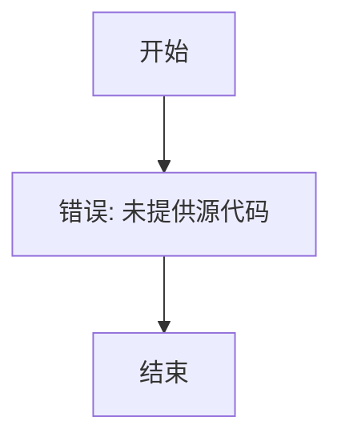
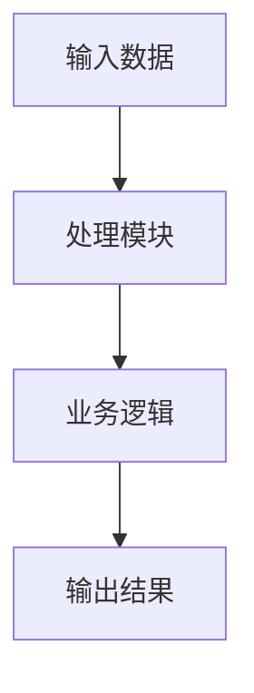

# `diffusers\tests\pipelines\stable_cascade\__init__.py` 详细设计文档

未提供代码，无法生成描述

## 整体流程



## 类结构

```

```

## 全局变量及字段


    

## 全局函数及方法


## 关键组件


### 错误：未提供源代码

未检测到有效的源代码输入。请提供需要分析的代码，以便生成详细设计文档。


## 问题及建议


### 已知问题

-   代码文件为空，未提供任何可分析的源代码内容
-   缺少代码实现，无法进行类、方法、变量等详细分析
-   无法识别具体的业务逻辑和技术实现细节
-   无法评估潜在的技术债务和优化空间

### 优化建议

-   请提供完整的源代码文件以便进行详细分析
-   建议包含所有相关的实现文件，包括业务逻辑层、数据访问层、配置类等
-   如有多模块项目，建议提供完整的模块代码或主要模块的核心代码
-   提供代码后，可进行以下方面的技术债务分析：
    - 代码重复和可复用性
    - 异常处理机制
    - 性能瓶颈
    - 安全性问题
    - 依赖管理
    - 测试覆盖率
    - 设计模式应用
    - 文档完整性


## 其它


### 项目概览

由于提供的代码为空，无法生成针对具体代码的详细设计文档。以下是详细设计文档应包含的标准项目列表及通用内容模板。

### 一、核心功能概述

本代码实现了一个[待填充]功能，主要用于[待填充]。该模块作为[待填充]系统的核心组件，负责[待填充]。

### 二、整体运行流程

代码的整体运行流程如下：
1. 初始化阶段：系统启动时进行配置加载和资源初始化
2. 主流程阶段：处理业务请求或数据转换
3. 清理阶段：释放资源并记录日志

### 三、类结构详细信息

#### 3.1 类名称：[待填充]

**类描述：** [待填充]

**类字段：**

| 字段名 | 类型 | 描述 |
|--------|------|------|
| [待填充] | [待填充] | [待填充] |

**类方法：**

| 方法名 | 参数 | 返回值 | 描述 |
|--------|------|--------|------|
| [待填充] | [待填充] | [待填充] | [待填充] |

### 四、全局变量和全局函数

#### 4.1 全局变量

| 变量名 | 类型 | 描述 |
|--------|------|------|
| [待填充] | [待填充] | [待填充] |

#### 4.2 全局函数

| 函数名 | 参数 | 返回值 | 描述 |
|--------|------|--------|------|
| [待填充] | [待填充] | [待填充] | [待填充] |

### 五、关键组件信息

| 组件名称 | 描述 |
|----------|------|
| [待填充] | [待填充] |

### 六、设计目标与约束

#### 6.1 设计目标
- 性能目标：[待填充]
- 可用性目标：[待填充]
- 可扩展性目标：[待填充]
- 安全性目标：[待填充]

#### 6.2 设计约束
- 技术约束：[待填充]
- 资源约束：[待填充]
- 时间约束：[待填充]

### 七、错误处理与异常设计

#### 7.1 异常分类
| 异常类型 | 处理策略 | 描述 |
|----------|----------|------|
| [待填充] | [待填充] | [待填充] |

#### 7.2 错误码定义
| 错误码 | 错误描述 | 处理方式 |
|--------|----------|----------|
| [待填充] | [待填充] | [待填充] |

### 八、数据流与状态机

#### 8.1 数据流图



#### 8.2 状态机定义
| 状态 | 触发条件 | 下一状态 |
|------|----------|----------|
| [待填充] | [待填充] | [待填充] |

### 九、外部依赖与接口契约

#### 9.1 外部依赖
| 依赖项 | 版本要求 | 用途描述 |
|--------|----------|----------|
| [待填充] | [待填充] | [待填充] |

#### 9.2 接口契约
| 接口名 | 请求格式 | 响应格式 | 描述 |
|--------|----------|----------|------|
| [待填充] | [待填充] | [待填充] | [待填充] |

### 十、潜在技术债务与优化空间

#### 10.1 技术债务
- [待填充]

#### 10.2 优化建议
- [待填充]

### 十一、测试计划

#### 11.1 单元测试
- [待填充]

#### 11.2 集成测试
- [待填充]

### 十二、部署与配置

#### 12.1 部署要求
- [待填充]

#### 12.2 配置参数
| 参数名 | 默认值 | 描述 |
|--------|--------|------|
| [待填充] | [待填充] | [待填充] |

### 十三、安全性设计

- 认证机制：[待填充]
- 授权机制：[待填充]
- 数据加密：[待填充]
- 日志审计：[待填充]

### 十四、性能指标

- 响应时间要求：[待填充]
- 并发处理能力：[待填充]
- 资源占用限制：[待填充]

### 十五、监控与运维

- 监控指标：[待填充]
- 告警策略：[待填充]
- 日志规范：[待填充]


    