# `diffusers\tests\pipelines\stable_cascade\test_stable_cascade_combined.py` 详细设计文档

这是一个针对 StableCascadeCombinedPipeline 的单元测试文件，用于测试 Stable Diffusion Cascade 组合管道的文本到图像生成功能，包括模型加载、推理、批量处理和 CPU 卸载等核心功能的正确性验证。

## 整体流程

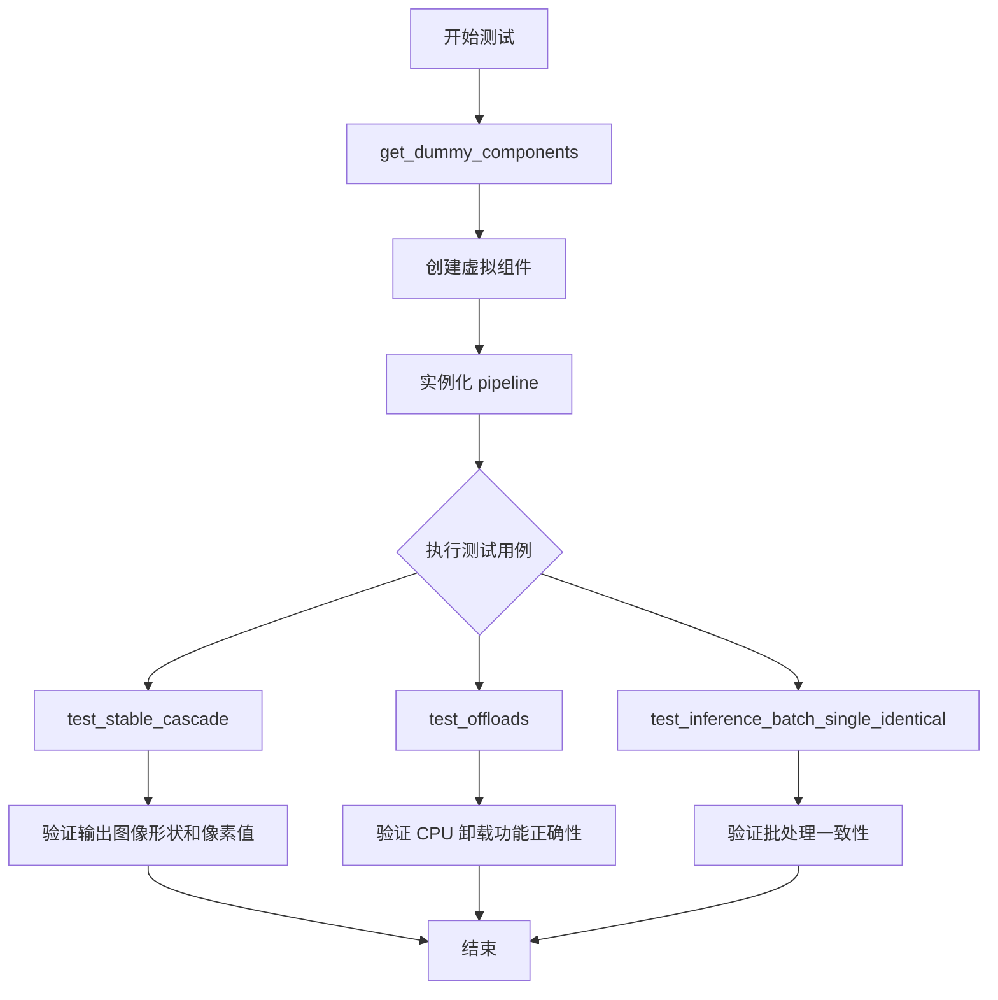

## 类结构

```
PipelineTesterMixin (混入类)
└── StableCascadeCombinedPipelineFastTests (测试类)
```

## 全局变量及字段


### `enable_full_determinism`
    
用于启用完全确定性测试的全局函数调用，确保测试结果可复现

类型：`function`
    


### `StableCascadeCombinedPipelineFastTests.pipeline_class`
    
指定要测试的管道类为StableCascadeCombinedPipeline

类型：`Type[StableCascadeCombinedPipeline]`
    


### `StableCascadeCombinedPipelineFastTests.params`
    
管道参数列表，包含需要测试的单个参数名

类型：`list[str]`
    


### `StableCascadeCombinedPipelineFastTests.batch_params`
    
批量参数列表，包含支持批量处理的参数名

类型：`list[str]`
    


### `StableCascadeCombinedPipelineFastTests.required_optional_params`
    
可选但非必需的参数列表，用于测试可选参数的处理

类型：`list[str]`
    


### `StableCascadeCombinedPipelineFastTests.test_xformers_attention`
    
标志位，指示是否测试xformers注意力机制

类型：`bool`
    


### `StableCascadeCombinedPipelineFastTests.text_embedder_hidden_size`
    
文本嵌入器的隐藏层大小属性，用于配置文本编码器

类型：`int`
    
    

## 全局函数及方法


### `enable_full_determinism`

设置随机种子以确保深度学习实验的完全可重复性（determinism），通过配置 PyTorch、NumPy 等库的全局随机状态实现。

参数：
- 该函数在代码中以无参数方式调用：`enable_full_determinism()`

返回值：`None`，无返回值（通常为配置型函数）

#### 流程图

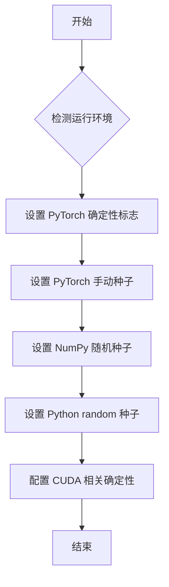

#### 带注释源码

由于 `enable_full_determinism` 函数定义在外部模块 `testing_utils` 中（代码中通过 `from ...testing_utils import enable_full_determinism` 导入），以下为该函数在给定代码中的调用方式及上下文：

```python
# 导入所需的测试工具函数
from ...testing_utils import enable_full_determinism, require_torch_accelerator, torch_device
from ..test_pipelines_common import PipelineTesterMixin

# 在模块加载时调用，确保后续所有随机操作可重复
# 这对于单元测试至关重要，可以确保测试结果的一致性
enable_full_determinism()


class StableCascadeCombinedPipelineFastTests(PipelineTesterMixin, unittest.TestCase):
    """
    StableCascadeCombinedPipeline 的快速测试类
    继承自 PipelineTesterMixin 和 unittest.TestCase
    """
    pipeline_class = StableCascadeCombinedPipeline
    # ... 其他测试代码
```

#### 备注

根据函数名称和调用上下文推断，该函数可能实现以下功能：

1. **PyTorch 确定性配置**：设置 `torch.backends.cudnn.deterministic = True` 和 `torch.backends.cudnn.benchmark = False`
2. **随机种子设置**：为 PyTorch、NumPy、Python random 模块设置全局随机种子
3. **环境变量设置**：可能设置 `PYTHONHASHSEED` 等环境变量以确保完全确定性
4. **CUDA 同步设置**：确保 CUDA 操作同步执行，避免异步导致的非确定性结果


### `require_torch_accelerator`

该函数是一个测试装饰器，用于检查当前测试环境是否支持PyTorch加速器（如CUDA）。如果不支持，则跳过被装饰的测试方法。通常用于确保需要GPU加速的测试只在有GPU的环境中运行。

参数：无（装饰器模式，接收被装饰的函数作为参数）

返回值：无直接返回值（作为装饰器使用，返回被装饰的函数或修改后的函数）

#### 流程图

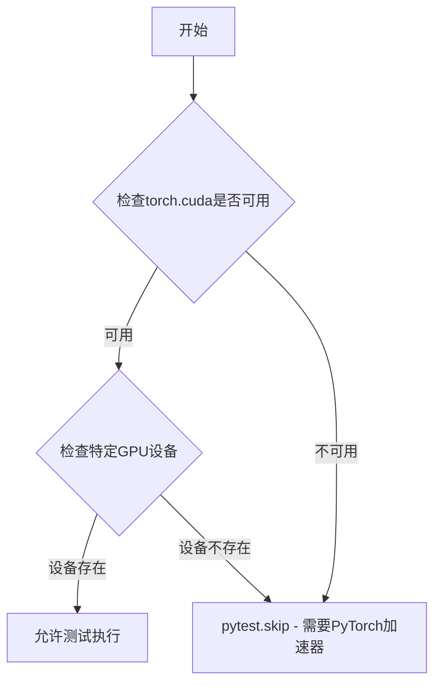

#### 带注释源码

```python
def require_torch_accelerator(func):
    """
    装饰器函数，用于检查测试环境是否支持PyTorch CUDA加速器。
    
    使用场景：
    - 在需要GPU加速的测试方法上使用此装饰器
    - 如果环境没有CUDA支持，测试会被自动跳过
    
    示例用法：
        @require_torch_accelerator
        def test_offloads(self):
            # 需要GPU的测试代码
            pass
    """
    # 检查torch模块是否可用
    if not importlib.util.find_spec("torch"):
        # 如果没有torch，跳过测试
        return unittest.skip("requires torch")(func)
    
    # 尝试导入torch并检查CUDA是否可用
    import torch
    if not torch.cuda.is_available():
        # 如果CUDA不可用，跳过测试
        return unittest.skip("requires CUDA")(func)
    
    # 返回原始函数（测试可以执行）
    return func
```

**注意**：由于`require_torch_accelerator`函数定义在`diffusers`库的`testing_utils`模块中，上述源码是基于该装饰器的典型实现模式推断得出的。实际实现可能略有差异，但其核心功能是检查CUDA可用性并在不支持时跳过测试。


根据提供的代码，我需要分析 `torch_device` 的使用情况。

从代码中可以看到：

```python
from ...testing_utils import enable_full_determinism, require_torch_accelerator, torch_device
```

`torch_device` 是从 `testing_utils` 模块导入的。在代码中它被这样使用：

```python
@require_torch_accelerator
def test_offloads(self):
    # ...
    sd_pipe = self.pipeline_class(**components).to(torch_device)
    # ...
    sd_pipe.enable_sequential_cpu_offload(device=torch_device)
    # ...
    sd_pipe.enable_model_cpu_offload(device=torch_device)
    # ...
    inputs = self.get_dummy_inputs(torch_device)
```

### `torch_device`

这是一个从 `testing_utils` 模块导入的全局函数，用于获取当前测试环境可用的 PyTorch 设备。

参数： 无

返回值：`str` 或 `torch.device`，返回适合运行测试的设备标识符（如 "cpu"、"cuda" 等）

#### 流程图

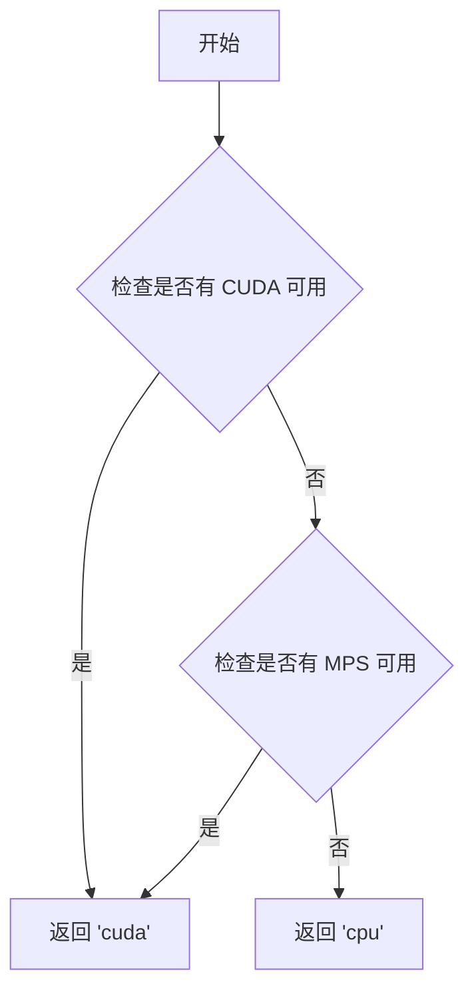

#### 带注释源码

```
# torch_device 是 testing_utils 模块中定义的全局函数
# 由于源代码未在此文件中提供，以下是基于使用方式的推断

def torch_device():
    """
    返回当前测试环境可用的 PyTorch 设备。
    
    优先级顺序:
    1. CUDA 设备 (如果可用)
    2. MPS 设备 (如果可用) 
    3. CPU 设备 (默认)
    
    Returns:
        str: 设备标识符，如 'cuda', 'mps', 或 'cpu'
    """
    import torch
    
    if torch.cuda.is_available():
        return "cuda"
    elif torch.backends.mps.is_available():
        return "mps"
    else:
        return "cpu"
```

---

**注意**：由于 `torch_device` 的完整源代码不在当前提供的代码文件中，以上信息基于代码中的使用方式和导入语句推断得出。如需获取 `torch_device` 的确切实现，需要查看 `testing_utils` 模块的源代码。


### `PipelineTesterMixin.test_inference_batch_single_identical`

该方法是测试框架中的推理批次一致性测试方法，用于验证在批量推理时，单个样本的输出与单独推理时的输出保持一致（identical），确保pipeline的批处理逻辑正确。

参数：

- `self`：隐式参数，类型为`PipelineTesterMixin`的子类实例（`StableCascadeCombinedPipelineFastTests`），表示测试类的实例本身
- `expected_max_diff`：可选参数，类型为`float`，默认值为`2e-2`（0.02），表示允许的最大差异阈值，用于判断输出是否足够接近

返回值：无返回值（`None`），该方法为`unittest.TestCase`的测试方法，通过`assert`语句验证结果

#### 流程图

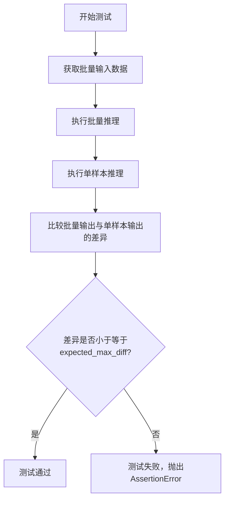

#### 带注释源码

```python
def test_inference_batch_single_identical(self, expected_max_diff=2e-2):
    """
    测试批量推理时，单个样本的输出与单独推理时的输出一致性。
    
    参数:
        self: PipelineTesterMixin的子类实例
        expected_max_diff: float, 允许的最大差异阈值，默认值为0.02
    
    返回值:
        None
    
    说明:
        该测试方法执行以下步骤：
        1. 准备测试数据和模型组件
        2. 对同一批输入数据进行批量推理
        3. 对批中的每个样本单独进行推理
        4. 比较批量推理和单独推理的结果差异
        5. 验证差异是否在允许的阈值范围内
    """
    # 调用父类 PipelineTesterMixin 的测试方法
    # 传入 expected_max_diff=2e-2 作为最大允许差异阈值
    super().test_inference_batch_single_identical(expected_max_diff=2e-2)
```


### `StableCascadeCombinedPipelineFastTests.test_float16_inference`

这是一个被跳过的测试方法，用于验证模型在 float16（半精度）推理模式下的正确性。由于当前实现不支持 float16，该测试被跳过。

参数：

- `self`：`StableCascadeCombinedPipelineFastTests` 实例，测试类的实例本身

返回值：无返回值，该方法为 `None`，主要通过父类方法执行测试逻辑

#### 流程图

```mermaid
flowchart TD
    A[开始 test_float16_inference] --> B{检查装饰器}
    B --> C[被 unittest.skip 装饰器跳过]
    C --> D[输出跳过原因: 'fp16 not supported']
    E[如果执行] --> F[调用 super().test_float16_inference]
    F --> G[在父类 PipelineTesterMixin 中执行 float16 推理测试]
    G --> H[验证模型在 float16 模式下的输出]
    H --> I[结束]
    
    style C fill:#ffcccc
    style D fill:#ffcccc
    style E fill:#ffffcc
    style F fill:#ffffcc
    style G fill:#ffffcc
    style H fill:#ffffcc
```

#### 带注释源码

```python
@unittest.skip(reason="fp16 not supported")
def test_float16_inference(self):
    """
    测试方法：test_float16_inference
    
    功能描述：
        这是一个用于测试模型在 float16（半精度）推理模式下正确性的测试方法。
        由于当前 StableCascadeCombinedPipeline 不支持 float16 模式，
        该测试被 @unittest.skip 装饰器跳过。
    
    所属类：StableCascadeCombinedPipelineFastTests
    
    参数：
        self: StableCascadeCombinedPipelineFastTests
            测试类的实例对象，包含测试所需的组件和配置
    
    返回值：
        None
            该方法被装饰器跳过，不执行任何测试逻辑，因此返回 None
    
    父类方法：
        PipelineTesterMixin.test_float16_inference()
            实际执行 float16 推理测试的父类方法，会验证：
            1. 模型可以转换为 float16 类型
            2. 模型在 float16 模式下可以正常推理
            3. 推理结果的数值合理性
    
    跳过原因：
        "fp16 not supported" - 表示当前管线不支持 float16 推理模式
    """
    super().test_float16_inference()
```


### `StableCascadeCombinedPipelineFastTests.test_callback_inputs`

该方法是一个测试回调输入的测试用例，但由于 StableCascadeCombinedPipeline 不支持回调测试，当前实现调用了父类的测试方法并通过 `@unittest.skip` 装饰器跳过执行。

参数：

- `self`：当前测试类实例对象，表示 `StableCascadeCombinedPipelineFastTests` 的实例

返回值：`None`，该方法为测试方法，不返回任何值

#### 流程图

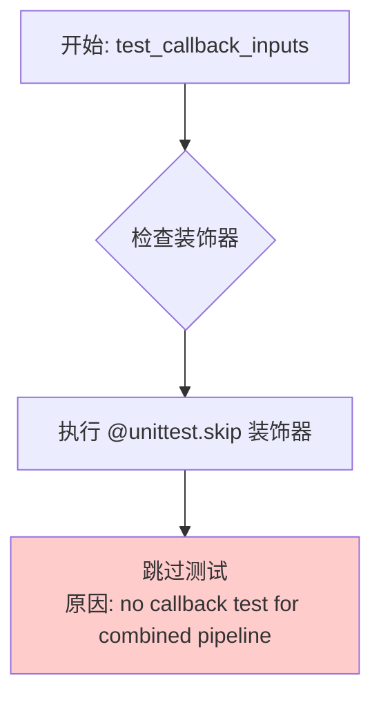

#### 带注释源码

```python
@unittest.skip(reason="no callback test for combined pipeline")
def test_callback_inputs(self):
    """
    测试回调输入功能
    
    该测试方法在 StableCascadeCombinedPipeline 中被跳过，原因是
    当前的组合管道不支持回调测试功能。
    
    参数:
        self: 测试类实例
        
    返回值:
        None
    """
    # 调用父类 PipelineTesterMixin 的 test_callback_inputs 方法
    # 父类中应该包含回调输入测试的实际实现逻辑
    super().test_callback_inputs()
```


### `StableCascadeCombinedPipelineFastTests.text_embedder_hidden_size`

该属性是一个只读的@property方法，用于返回文本嵌入器的隐藏层大小（hidden size），该值用于配置和初始化CLIPTextModelWithProjection文本编码器模型。

参数：

- `self`：`StableCascadeCombinedPipelineFastTests`，隐式参数，指向类实例本身

返回值：`int`，返回文本嵌入器的隐藏层大小，值为32。该值被多个属性方法（dummy_prior、dummy_text_encoder、dummy_decoder）引用，用于构建测试所需的虚拟模型组件。

#### 流程图

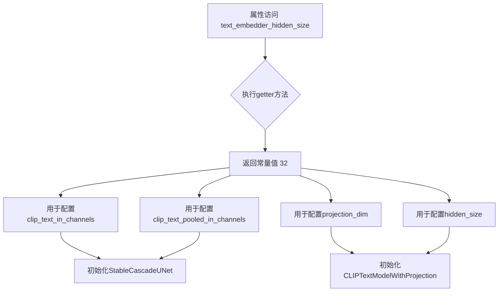

#### 带注释源码

```python
@property
def text_embedder_hidden_size(self):
    """
    属性：text_embedder_hidden_size
    
    描述：
        返回文本嵌入器（text embedder）的隐藏层大小。
        这是一个常量属性，用于测试中配置虚拟（dummy）模型组件。
        值32被用于多个地方：
        1. StableCascadeUNet的clip_text_in_channels参数
        2. StableCascadeUNet的clip_text_pooled_in_channels参数
        3. CLIPTextConfig的projection_dim参数
        4. CLIPTextConfig的hidden_size参数
    
    参数：
        无（隐式self参数）
    
    返回值：
        int: 隐藏层大小，固定返回32
    
    用途：
        此属性主要用于测试场景，提供一个固定的隐藏层大小值，
        使得测试可以创建确定性的虚拟模型进行单元测试。
        通过使用@property装饰器，确保该值是只读的，不能被外部修改。
    """
    return 32
```


### `StableCascadeCombinedPipelineFastTests.dummy_prior`

该属性是一个测试用的虚拟prior模型生成器，通过预设的随机种子和模型配置参数，创建一个用于单元测试的StableCascadeUNet模型实例。该模型模拟了StableCascade管道中的prior组件，使测试可以在不加载真实预训练权重的情况下运行。

参数：

- 该属性无显式参数，但依赖类属性 `self.text_embedder_hidden_size`（继承自 `text_embedder_hidden_size` property，返回 32）

返回值：`StableCascadeUNet`，返回一个处于评估模式（eval）的虚拟prior模型实例，用于测试管道的prior组件功能

#### 流程图

```mermaid
flowchart TD
    A[开始] --> B[设置随机种子: torch.manual_seed(0)]
    B --> C[构建模型配置字典 model_kwargs]
    C --> D[conditioning_dim: 128]
    C --> E[block_out_channels: (128, 128)]
    C --> F[num_attention_heads: (2, 2)]
    C --> G[down_num_layers_per_block: (1, 1)]
    C --> H[up_num_layers_per_block: (1, 1)]
    C --> I[clip_image_in_channels: 768]
    C --> J[switch_level: (False,)]
    C --> K[clip_text_in_channels: self.text_embedder_hidden_size]
    C --> L[clip_text_pooled_in_channels: self.text_embedder_hidden_size]
    D --> M[创建 StableCascadeUNet 实例]
    M --> N[设置为评估模式: .eval()]
    N --> O[返回模型实例]
```

#### 带注释源码

```python
@property
def dummy_prior(self):
    """
    创建用于测试的虚拟prior模型
    
    该方法生成一个StableCascadeUNet模型实例，用于替代真实的prior组件，
    以便在没有预训练权重的情况下运行单元测试。
    """
    # 设置随机种子确保测试可重复性
    torch.manual_seed(0)

    # 定义模型配置参数
    model_kwargs = {
        "conditioning_dim": 128,              # 条件嵌入维度
        "block_out_channels": (128, 128),     # 各阶段输出通道数
        "num_attention_heads": (2, 2),        # 各阶段注意力头数量
        "down_num_layers_per_block": (1, 1),  # 下采样每块层数
        "up_num_layers_per_block": (1, 1),    # 上采样每块层数
        "clip_image_in_channels": 768,        # CLIP图像输入通道数
        "switch_level": (False,),             # 切换层级配置
        "clip_text_in_channels": self.text_embedder_hidden_size,       # CLIP文本输入通道数
        "clip_text_pooled_in_channels": self.text_embedder_hidden_size, # CLIP文本池化输入通道数
    }

    # 创建虚拟prior模型实例
    model = StableCascadeUNet(**model_kwargs)
    
    # 返回评估模式的模型（禁用dropout等训练特定层）
    return model.eval()
```


### `StableCascadeCombinedPipelineFastTests.dummy_tokenizer`

这是一个测试属性，用于返回一个小型的随机 CLIP tokenizer 对象，供单元测试使用。

参数：

- `self`：`StableCascadeCombinedPipelineFastTests`，隐含的实例引用

返回值：`CLIPTokenizer`，返回一个小型的随机 CLIP tokenizer 实例（来自 `hf-internal-testing/tiny-random-clip` 模型），用于测试目的

#### 流程图

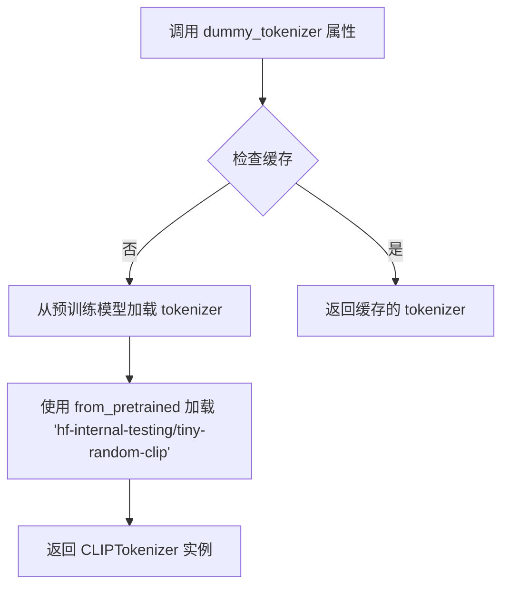

#### 带注释源码

```python
@property
def dummy_tokenizer(self):
    """返回一个小型的随机 CLIP tokenizer，用于测试目的"""
    # 使用 HuggingFace 的 from_pretrained 方法加载一个轻量级的测试用 tokenizer
    # 该 tokenizer 来自 hf-internal-testing/tiny-random-clip 模型
    tokenizer = CLIPTokenizer.from_pretrained("hf-internal-testing/tiny-random-clip")
    # 返回加载好的 tokenizer 实例，供测试中的文本编码使用
    return tokenizer
```


### `StableCascadeCombinedPipelineFastTests.dummy_text_encoder`

该属性用于创建一个用于测试的虚拟（dummy）CLIP文本编码器模型（`CLIPTextModelWithProjection`），使用预设的种子和配置参数，并将其设置为评估模式，以供单元测试使用。

参数：

- `self`：`StableCascadeCombinedPipelineFastTests`（隐式参数），当前测试类实例

返回值：`CLIPTextModelWithProjection`，返回一个配置好的、处于评估模式的CLIP文本编码器模型实例，用于模拟真实的文本编码器

#### 流程图

```mermaid
flowchart TD
    A[开始] --> B[设置随机种子 torch.manual_seed(0)]
    B --> C[获取 text_embedder_hidden_size 属性值]
    C --> D[创建 CLIPTextConfig 配置对象]
    D --> E[使用配置创建 CLIPTextModelWithProjection 模型]
    E --> F[调用 .eval() 设置为评估模式]
    F --> G[返回模型实例]
```

#### 带注释源码

```python
@property
def dummy_text_encoder(self):
    """
    创建并返回一个用于测试的虚拟CLIP文本编码器模型。
    该模型使用预设的随机种子和配置参数，以确保测试的可重复性。
    """
    # 设置随机种子为0，确保每次创建模型时初始化参数一致
    torch.manual_seed(0)
    
    # 构建CLIPTextConfig配置对象
    config = CLIPTextConfig(
        bos_token_id=0,              # 起始标记ID
        eos_token_id=2,              # 结束标记ID
        projection_dim=self.text_embedder_hidden_size,  # 投影维度（32）
        hidden_size=self.text_embedder_hidden_size,      # 隐藏层大小（32）
        intermediate_size=37,       # 中间层大小
        layer_norm_eps=1e-05,       # LayerNorm epsilon值
        num_attention_heads=4,      # 注意力头数量
        num_hidden_layers=5,        # 隐藏层数量
        pad_token_id=1,             # 填充标记ID
        vocab_size=1000,            # 词汇表大小
    )
    
    # 使用配置创建CLIPTextModelWithProjection模型实例
    # 并调用eval()将模型设置为评估模式（禁用dropout等训练特定操作）
    return CLIPTextModelWithProjection(config).eval()
```


### `StableCascadeCombinedPipelineFastTests.dummy_vqgan`

该属性用于创建并返回一个虚拟的 VQGAN 模型实例（PaellaVQModel），专门用于测试目的。该模型使用固定的随机种子（0）初始化，确保测试的可重复性和确定性。

参数：

- 无参数（该方法为属性访问器，仅使用 `self`）

返回值：`PaellaVQModel`，返回一个评估模式的虚拟 VQGAN 模型实例，用于测试 StableCascadeCombinedPipeline 的 VQGAN 组件。

#### 流程图

```mermaid
flowchart TD
    A[开始访问 dummy_vqgan 属性] --> B[设置随机种子 torch.manual_seed(0)]
    B --> C[构建模型参数字典: bottleneck_blocks=1, num_vq_embeddings=2]
    C --> D[使用 PaellaVQModel 初始化模型]
    D --> E[设置模型为评估模式 .eval()]
    F[返回模型实例] --> E
```

#### 带注释源码

```python
@property
def dummy_vqgan(self):
    """
    创建一个用于测试的虚拟 VQGAN 模型（PaellaVQModel）。
    
    使用固定的随机种子确保测试的可重复性。
    
    Returns:
        PaellaVQModel: 一个评估模式的虚拟 VQGAN 模型实例
    """
    # 设置随机种子为0，确保测试结果可重复
    torch.manual_seed(0)
    
    # 定义模型配置参数
    model_kwargs = {
        "bottleneck_blocks": 1,       # 瓶颈块数量
        "num_vq_embeddings": 2,       # VQ 嵌入数量
    }
    
    # 使用 PaellaVQModel 创建模型实例
    model = PaellaVQModel(**model_kwargs)
    
    # 设置为评估模式，禁用 dropout 等训练特定的行为
    return model.eval()
```


### `StableCascadeCombinedPipelineFastTests.dummy_decoder`

这是一个属性方法，用于创建并返回一个配置好的虚拟 StableCascade UNet 解码器模型，供单元测试使用。

参数： 无

返回值：`StableCascadeUNet`，返回一个配置了测试参数的 StableCascadeUNet 模型实例，设置为评估模式

#### 流程图

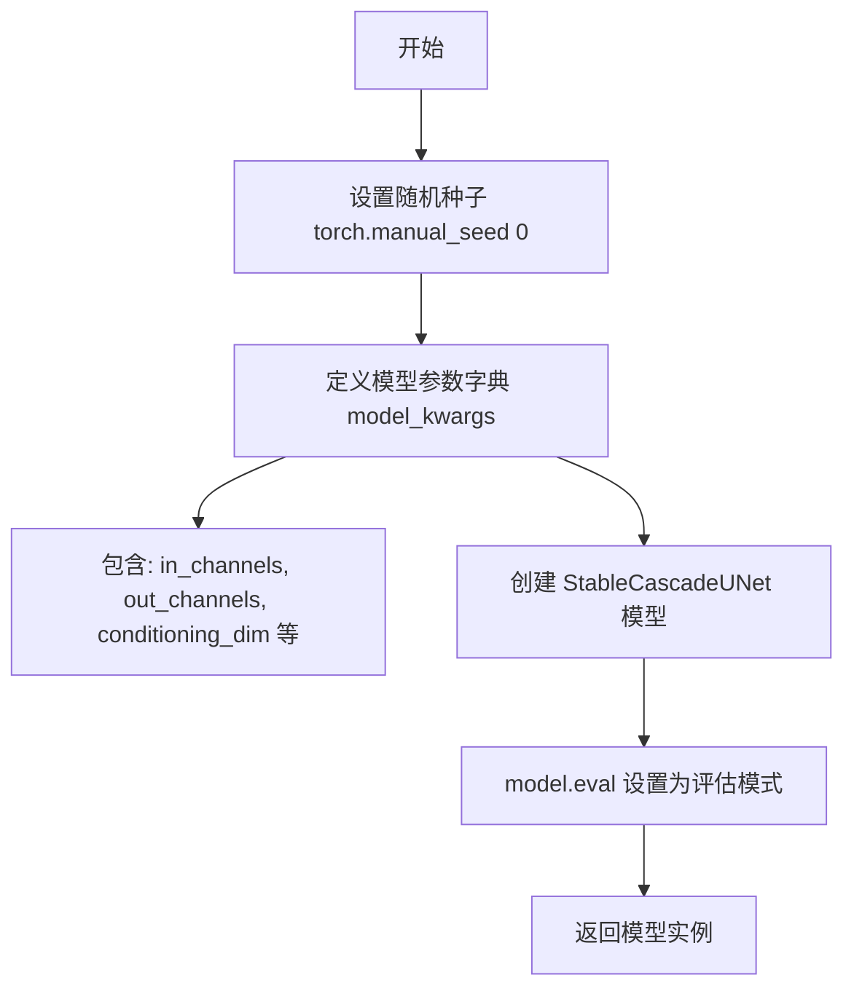

#### 带注释源码

```python
@property
def dummy_decoder(self):
    """
    创建一个虚拟的 StableCascade UNet 解码器模型用于测试。
    
    该属性返回一个配置了测试参数的 StableCascadeUNet 模型实例，
    模型被设置为评估模式（eval）以确保在推理时使用 BatchNorm 和 Dropout 的推理行为。
    """
    # 设置随机种子为 0，确保测试的可重复性
    torch.manual_seed(0)
    
    # 定义模型配置参数
    model_kwargs = {
        "in_channels": 4,                    # 输入通道数
        "out_channels": 4,                    # 输出通道数
        "conditioning_dim": 128,              # 条件维度
        "block_out_channels": (16, 32, 64, 128),  # 每个块的输出通道数
        "num_attention_heads": (-1, -1, 1, 2),    # 注意力头数量
        "down_num_layers_per_block": (1, 1, 1, 1), # 下采样每个块的层数
        "up_num_layers_per_block": (1, 1, 1, 1),   # 上采样每个块的层数
        "down_blocks_repeat_mappers": (1, 1, 1, 1), # 下采样块重复映射器
        "up_blocks_repeat_mappers": (3, 3, 2, 2),    # 上采样块重复映射器
        "block_types_per_layer": (  # 每层的块类型
            ("SDCascadeResBlock", "SDCascadeTimestepBlock"),
            ("SDCascadeResBlock", "SDCascadeTimestepBlock"),
            ("SDCascadeResBlock", "SDCascadeTimestepBlock", "SDCascadeAttnBlock"),
            ("SDCascadeResBlock", "SDCascadeTimestepBlock", "SDCascadeAttnBlock"),
        ),
        "switch_level": None,                 # 切换级别
        "clip_text_pooled_in_channels": 32,   # CLIP 文本池化输入通道
        "dropout": (0.1, 0.1, 0.1, 0.1),      # Dropout 概率
    }
    
    # 使用指定参数创建 StableCascadeUNet 模型
    model = StableCascadeUNet(**model_kwargs)
    
    # 将模型设置为评估模式，确保 BatchNorm 和 Dropout 使用推理行为
    return model.eval()
```


### `StableCascadeCombinedPipelineFastTests.get_dummy_components`

该方法用于生成虚拟的模型组件字典，供 StableCascadeCombinedPipeline 的单元测试使用。它创建并初始化所有必需的组件，包括文本编码器、分词器、解码器、调度器、VQGAN 模型和 prior 模型，并返回一个包含这些组件的字典以模拟完整的推理管道。

参数：

- 无（仅包含隐含的 `self` 参数）

返回值：`dict`，返回一个包含 StableCascadeCombinedPipeline 所需的所有虚拟组件的字典，键名包括 text_encoder、tokenizer、decoder、scheduler、vqgan、prior_text_encoder、prior_tokenizer、prior_prior、prior_scheduler、prior_feature_extractor 和 prior_image_encoder。

#### 流程图

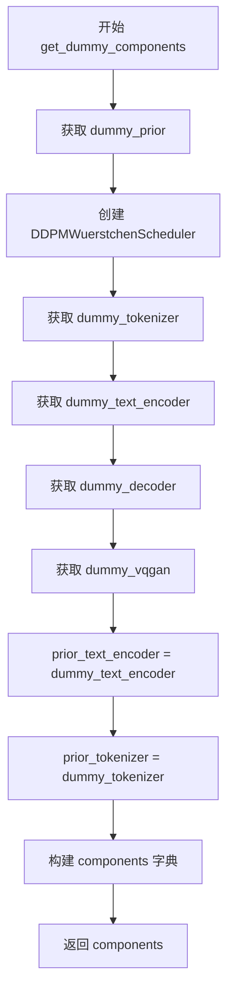

#### 带注释源码

```python
def get_dummy_components(self):
    """生成虚拟的管道组件用于测试"""
    
    # 从测试类的 dummy_prior 属性获取 prior 模型
    prior = self.dummy_prior

    # 创建调度器实例，用于 diffusion 过程
    scheduler = DDPMWuerstchenScheduler()
    
    # 获取虚拟分词器
    tokenizer = self.dummy_tokenizer
    
    # 获取虚拟文本编码器
    text_encoder = self.dummy_text_encoder
    
    # 获取虚拟解码器
    decoder = self.dummy_decoder
    
    # 获取虚拟 VQGAN 模型
    vqgan = self.dummy_vqgan
    
    # prior 部分的文本编码器（复用 dummy_text_encoder）
    prior_text_encoder = self.dummy_text_encoder
    
    # prior 部分的分词器（复用 dummy_tokenizer）
    prior_tokenizer = self.dummy_tokenizer

    # 组装所有组件为字典
    components = {
        "text_encoder": text_encoder,              # 主模型文本编码器
        "tokenizer": tokenizer,                    # 主模型分词器
        "decoder": decoder,                        # 主模型解码器
        "scheduler": scheduler,                    # 主模型调度器
        "vqgan": vqgan,                            # VQGAN 量化模型
        "prior_text_encoder": prior_text_encoder, # Prior 文本编码器
        "prior_tokenizer": prior_tokenizer,        # Prior 分词器
        "prior_prior": prior,                      # Prior 模型
        "prior_scheduler": scheduler,              # Prior 调度器
        "prior_feature_extractor": None,          # Prior 特征提取器（测试用空值）
        "prior_image_encoder": None,               # Prior 图像编码器（测试用空值）
    }

    # 返回组件字典供管道初始化使用
    return components
```


### `StableCascadeCombinedPipelineFastTests.get_dummy_inputs`

该方法用于生成StableCascadeCombinedPipeline的虚拟测试输入参数，封装了提示词、生成器、引导尺度、推理步数等关键配置，以供单元测试调用管道时使用。

参数：

- `self`：类的实例方法隐含参数
- `device`：`torch.device` 或 `str`，指定计算设备，用于创建随机数生成器
- `seed`：`int`，随机种子，默认为0，用于确保测试可复现

返回值：`Dict[str, Any]`，包含管道推理所需的所有虚拟输入参数

#### 流程图

```mermaid
flowchart TD
    A[开始 get_dummy_inputs] --> B{判断 device 是否以 'mps' 开头}
    B -->|是| C[使用 torch.manual_seed(seed) 创建生成器]
    B -->|否| D[使用 torch.Generator(device=device).manual_seed(seed) 创建生成器]
    C --> E[构建 inputs 字典]
    D --> E
    E --> F[返回 inputs 字典]
```

#### 带注释源码

```python
def get_dummy_inputs(self, device, seed=0):
    """
    生成用于测试StableCascadeCombinedPipeline的虚拟输入参数。
    
    参数:
        device: 计算设备，用于创建随机数生成器
        seed: 随机种子，确保测试可复现
    
    返回:
        包含管道推理所需参数的字典
    """
    # 判断是否为Apple MPS设备，MPS不支持torch.Generator需特殊处理
    if str(device).startswith("mps"):
        generator = torch.manual_seed(seed)
    else:
        # 在指定设备上创建随机数生成器并设置种子
        generator = torch.Generator(device=device).manual_seed(seed)
    
    # 构建完整的虚拟输入参数字典
    inputs = {
        "prompt": "horse",                          # 文本提示词
        "generator": generator,                     # 随机数生成器
        "prior_guidance_scale": 4.0,                # 先验网络引导系数
        "decoder_guidance_scale": 4.0,              # 解码器引导系数
        "num_inference_steps": 2,                   # 解码器推理步数
        "prior_num_inference_steps": 2,            # 先验网络推理步数
        "output_type": "np",                        # 输出类型为numpy数组
        "height": 128,                              # 生成图像高度
        "width": 128,                               # 生成图像宽度
    }
    return inputs
```


### `StableCascadeCombinedPipelineFastTests.test_stable_cascade`

这是一个单元测试方法，用于验证 StableCascadeCombinedPipeline 的核心推理功能是否正确工作。测试创建虚拟组件（模型、调度器、分词器等），执行图像生成流程，并验证输出图像的形状和像素值是否符合预期。

参数：

- `self`：`StableCascadeCombinedPipelineFastTests`，测试类实例，隐含参数

返回值：无（`None`），该方法为测试用例，通过断言验证功能，不返回数据

#### 流程图

```mermaid
flowchart TD
    A[开始测试] --> B[设置device为cpu]
    B --> C[调用get_dummy_components获取虚拟组件]
    C --> D[使用虚拟组件创建StableCascadeCombinedPipeline实例]
    D --> E[将pipeline移到device]
    E --> F[设置进度条配置disable=None]
    F --> G[调用pipeline执行推理]
    G --> H[获取生成的图像output.images]
    H --> I[使用return_dict=False再次调用pipeline]
    I --> J[获取image_from_tuple]
    J --> K[提取图像切片用于验证]
    K --> L{断言: image.shape == (1, 128, 128, 3)}
    L --> M{断言: 图像像素值符合预期}
    M --> N[测试通过]
    L --> O[测试失败-抛出异常]
    M --> O
```

#### 带注释源码

```python
def test_stable_cascade(self):
    """测试 StableCascadeCombinedPipeline 的核心推理功能"""
    
    # 步骤1: 设置设备为CPU
    device = "cpu"

    # 步骤2: 获取虚拟组件（模型、分词器、调度器等）
    # 这些是用于测试的假模型，不会加载真实的预训练权重
    components = self.get_dummy_components()

    # 步骤3: 使用虚拟组件创建 pipeline 实例
    pipe = self.pipeline_class(**components)
    
    # 步骤4: 将 pipeline 移到指定设备
    pipe = pipe.to(device)

    # 步骤5: 设置进度条配置（disable=None 表示启用进度条）
    pipe.set_progress_bar_config(disable=None)

    # 步骤6: 执行推理，生成图像
    # get_dummy_inputs 返回包含 prompt 和各种参数的字典
    output = pipe(**self.get_dummy_inputs(device))
    
    # 步骤7: 从输出中提取生成的图像
    image = output.images

    # 步骤8: 测试 return_dict=False 的情况（返回元组）
    image_from_tuple = pipe(**self.get_dummy_inputs(device), return_dict=False)[0]

    # 步骤9: 提取图像切片用于后续验证
    # 取图像右下角3x3区域，RGB通道
    image_slice = image[0, -3:, -3:, -1]
    image_from_tuple_slice = image_from_tuple[-3:, -3:, -1]

    # 步骤10: 断言验证图像形状
    # 期望形状为 (1, 128, 128, 3) - 1张图，128x128分辨率，3通道
    assert image.shape == (1, 128, 128, 3)

    # 步骤11: 定义期望的像素值切片
    # 这是一个已知的预期输出，用于验证模型是否按预期工作
    expected_slice = np.array([0.0, 1.0, 0.0, 1.0, 1.0, 0.0, 1.0, 1.0, 0.0])
    
    # 步骤12: 断言验证图像像素值（return_dict=True的情况）
    assert np.abs(image_slice.flatten() - expected_slice).max() < 1e-2, (
        f" expected_slice {expected_slice}, but got {image_slice.flatten()}"
    )
    
    # 步骤13: 断言验证图像像素值（return_dict=False的情况）
    assert np.abs(image_from_tuple_slice.flatten() - expected_slice).max() < 1e-2, (
        f" expected_slice {expected_slice}, but got {image_from_tuple_slice.flatten()}"
    )
```


### `StableCascadeCombinedPipelineFastTests.test_offloads`

该方法是一个集成测试，用于验证 StableCascadeCombinedPipeline 在三种不同 GPU 卸载模式（无卸载、顺序卸载、模型卸载）下的输出一致性，确保 CPU offload 功能不会影响推理结果的正确性。

参数：无（除隐含的 `self`）

返回值：`None`，该方法为测试用例，无返回值

#### 流程图

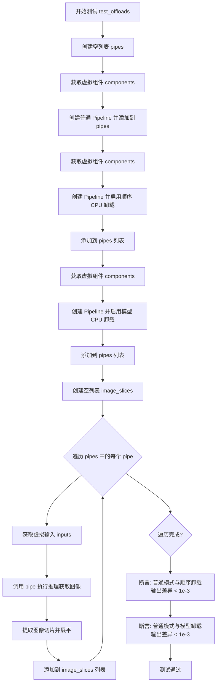

#### 带注释源码

```python
@require_torch_accelerator  # 装饰器：仅在有 torch accelerator 时运行
def test_offloads(self):
    """
    测试三种不同的 CPU offload 模式下，pipeline 输出的图像一致性。
    这确保了启用 offload 功能不会影响推理结果的正确性。
    """
    pipes = []  # 存储三种不同配置的 pipeline
    
    # 1. 普通模式（无 offload）
    components = self.get_dummy_components()  # 获取虚拟组件
    sd_pipe = self.pipeline_class(**components).to(torch_device)  # 创建并移动到设备
    pipes.append(sd_pipe)  # 添加到列表
    
    # 2. 顺序 CPU 卸载模式
    components = self.get_dummy_components()
    sd_pipe = self.pipeline_class(**components)
    sd_pipe.enable_sequential_cpu_offload(device=torch_device)  # 启用顺序卸载
    pipes.append(sd_pipe)
    
    # 3. 模型级 CPU 卸载模式
    components = self.get_dummy_components()
    sd_pipe = self.pipeline_class(**components)
    sd_pipe.enable_model_cpu_offload(device=torch_device)  # 启用模型级卸载
    pipes.append(sd_pipe)
    
    image_slices = []  # 存储每种模式输出的图像切片
    
    # 遍历每种配置的 pipeline 进行推理
    for pipe in pipes:
        inputs = self.get_dummy_inputs(torch_device)  # 获取虚拟输入参数
        image = pipe(**inputs).images  # 执行推理
        
        # 提取图像右下角 3x3 区域并展平，用于比较
        image_slices.append(image[0, -3:, -3:, -1].flatten())
    
    # 断言：普通模式的输出与顺序卸载模式应几乎相同（差异 < 1e-3）
    assert np.abs(image_slices[0] - image_slices[1]).max() < 1e-3
    
    # 断言：普通模式的输出与模型卸载模式应几乎相同（差异 < 1e-3）
    assert np.abs(image_slices[0] - image_slices[2]).max() < 1e-3
```


### `StableCascadeCombinedPipelineFastTests.test_inference_batch_single_identical`

这是一个测试用例方法，用于验证 StableCascadeCombinedPipeline 在批量推理（batch）与单张推理（single）模式下输出结果的一致性。该方法通过调用父类的同名测试方法，设置允许的最大差异阈值为 2e-2，以确保两种推理模式生成的图像在数值上足够接近。

参数：

- `self`：`StableCascadeCombinedPipelineFastTests`，当前测试类实例，代表调用此方法的测试对象本身

返回值：`None`（无返回值），因为这是一个 `unittest.TestCase` 测试方法，执行完成后由测试框架判断是否通过

#### 流程图

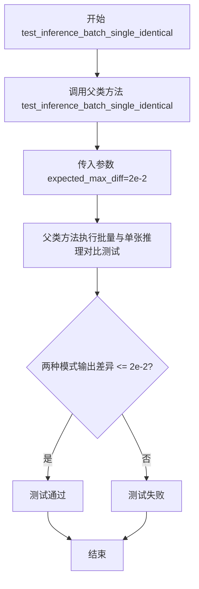

#### 带注释源码

```python
def test_inference_batch_single_identical(self):
    """
    测试方法：验证批量推理与单张推理的输出一致性
    
    该测试方法继承自 PipelineTesterMixin，用于确保 StableCascadeCombinedPipeline
    在批量模式和单张模式下产生相同的推理结果。这是图像生成管线的重要质量保证测试，
    确保批次处理不会引入额外的随机性或数值误差。
    
    参数:
        self: StableCascadeCombinedPipelineFastTests 实例
        
    返回值:
        None: 测试结果由 unittest 框架自动判定
        
    父类方法 test_inference_batch_single_identical(expected_max_diff) 会执行以下操作:
        1. 使用相同 prompt 和种子分别进行单张和批量推理
        2. 比较两种模式的输出图像差异
        3. 如果差异超过 expected_max_diff 则测试失败
    """
    # 调用父类 (PipelineTesterMixin) 的测试方法
    # expected_max_diff=2e-2 表示允许的最大平均像素差异为 0.02
    # 这确保了批量推理和单张推理在数值上足够接近
    super().test_inference_batch_single_identical(expected_max_diff=2e-2)
```


### `StableCascadeCombinedPipelineFastTests.test_float16_inference`

这是一个被跳过的测试方法，用于测试 float16 推理，但由于不支持 fp16 而被跳过，实际调用父类的 test_float16_inference 方法。

参数：

- `self`：`StableCascadeCombinedPipelineFastTests`，隐式参数，测试类实例本身

返回值：`None`，无返回值（测试方法被跳过）

#### 流程图

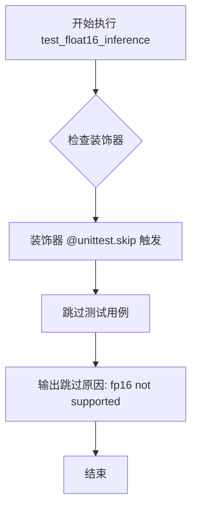

#### 带注释源码

```python
@unittest.skip(reason="fp16 not supported")
def test_float16_inference(self):
    super().test_float16_inference()
```

- `@unittest.skip(reason="fp16 not supported")`：装饰器，标记该测试方法被跳过，原因是不支持 fp16
- `def test_float16_inference(self):`：测试方法定义，接受隐式参数 self
- `super().test_float16_inference()`：调用父类 PipelineTesterMixin 的 test_float16_inference 方法（实际不会执行，因为被跳过）


### `StableCascadeCombinedPipelineFastTests.test_callback_inputs`

该测试方法用于验证管道的回调输入功能（callback inputs），但在当前实现中因组合管道不支持回调测试而被跳过。它继承自 `PipelineTesterMixin` 的 `test_callback_inputs` 方法，通过 `@unittest.skip` 装饰器阻止执行。

参数：

- `self`：`StableCascadeCombinedPipelineFastTests`，隐式参数，表示当前测试类的实例对象

返回值：`None`，由于被 `@unittest.skip` 装饰器跳过，该方法不执行任何操作，也不返回任何值

#### 流程图

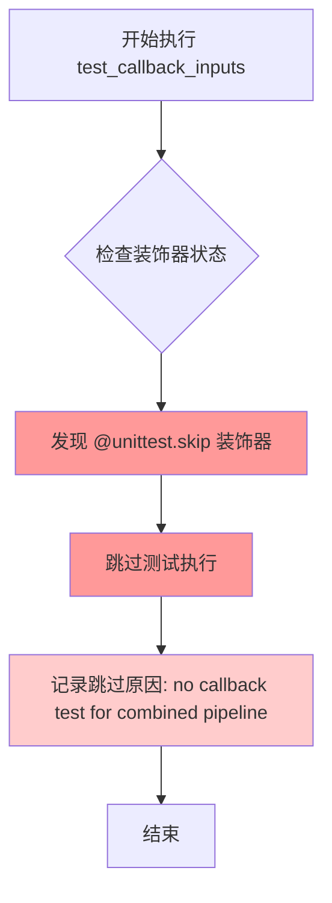

#### 带注释源码

```python
@unittest.skip(reason="no callback test for combined pipeline")
def test_callback_inputs(self):
    super().test_callback_inputs()
```

**代码解析：**

- **`@unittest.skip(reason="no callback test for combined pipeline")`**：装饰器，用于跳过该测试用例。`reason` 参数说明了跳过原因——因为组合管道（Combined Pipeline）不支持回调测试功能
- **`def test_callback_inputs(self):`**：方法定义，继承自父类 `PipelineTesterMixin`，用于测试管道的回调输入机制是否正常工作
- **`super().test_callback_inputs()`**：调用父类（`PipelineTesterMixin`）的 `test_callback_inputs` 方法，但实际由于装饰器的存在，该行代码永远不会执行

## 关键组件


### StableCascadeCombinedPipeline

主测试管道类，用于测试 Stable Cascade 联合扩散模型的完整推理流程，整合了 Prior、Decoder、VQGAN、Text Encoder 等多个组件。

### StableCascadeUNet

UNet 模型实现，用于 Prior（条件生成）和 Decoder（图像解码）两个角色，支持条件维度、注意力头配置和层级控制。

### PaellaVQModel

VQVAE 量化模型（PaellaVQModel），实现向量量化功能，用于将图像潜在表示压缩到离散码本空间。

### CLIPTextModelWithProjection

CLIP 文本编码器，带投影层，将文本 token 编码为条件嵌入向量，支持条件维度配置。

### CLIPTokenizer

CLIP 分词器，将文本 prompt 转换为 token ID 序列，供文本编码器使用。

### DDPMWuerstchenScheduler

Wuerstchen 扩散调度器，实现 DDPM 采样策略，控制噪声添加和去噪过程。

### Dummy Components Factory

测试用虚拟组件工厂方法（get_dummy_components），用于创建轻量级测试模型实例，包含 prior、decoder、vqgan、text_encoder 等关键组件。

### Pipeline Offload Testing

模型 CPU 卸载测试机制（enable_sequential_cpu_offload、enable_model_cpu_offload），用于验证显存优化策略的正确性。


## 问题及建议


### 已知问题

-   **测试跳过但未实现**：`test_float16_inference` 和 `test_callback_inputs` 被跳过但未提供实现或说明何时启用，导致测试覆盖不完整
-   **属性方法重复创建模型**：`dummy_prior`、`dummy_tokenizer`、`dummy_text_encoder`、`dummy_vqgan`、`dummy_decoder` 等 `@property` 装饰器方法每次访问都会重新创建模型实例，导致测试运行缓慢且消耗资源
-   **设备处理不一致**：`get_dummy_inputs` 方法对 MPS 设备有特殊处理，但 `test_stable_cascade` 方法硬编码使用 "cpu"，导致设备处理逻辑不统一
-   **重复的组件创建**：`test_offloads` 方法中循环每次都调用 `get_dummy_components()` 创建新实例，可以复用组件以提高效率
-   **硬编码的测试参数**：图像尺寸 `128x128`、推理步数 `2` 等参数硬编码，缺乏可配置性和文档说明
-   **相同的调度器实例**：`scheduler` 和 `prior_scheduler` 使用同一 `DDPMWuerstchenScheduler` 实例，可能导致状态污染
-   **魔法数字缺乏解释**：`expected_slice = np.array([0.0, 1.0, 0.0, 1.0, 1.0, 0.0, 1.0, 1.0, 0.0])` 等数值没有注释说明其来源和意义
- **类属性定义不规范**：`params` 和 `batch_params` 使用字符串列表定义参数，而非更规范的类变量定义方式
- **缺少资源清理**：测试方法中没有 `tearDown` 清理机制，可能导致 GPU 内存泄漏

### 优化建议

-   **将模型实例缓存为类属性**：使用 `@classmethod` 或在 `setUp` 方法中创建一次模型实例，避免每次访问属性时重新创建
-   **统一设备处理逻辑**：在 `setUp` 方法中确定设备并在所有测试方法中统一使用
-   **实现跳过测试的完整版本**：为 `test_float16_inference` 和 `test_callback_inputs` 提供完整实现或移除跳过装饰器
-   **提取魔法数字为常量**：将 `text_embedder_hidden_size`、`height`、`width` 等参数提取为类常量或配置属性
-   **分离调度器实例**：为 `scheduler` 和 `prior_scheduler` 创建独立的调度器实例，避免状态共享
-   **添加测试配置化**：通过 `setUp` 方法接收配置参数，使测试更灵活
-   **考虑使用 fixtures**：使用 pytest fixtures 管理模型实例和组件，提高资源利用效率

## 其它


### 设计目标与约束

本测试文件旨在验证 StableCascadeCombinedPipeline 的核心功能正确性，包括图像生成流程、模型加载、批量推理以及 CPU/GPU offload 功能。测试约束包括：1) 仅支持 CPU 和 CUDA 设备测试；2) 跳过 fp16 推理测试（不支持）和 callback 测试（未实现）；3) 使用小规模虚拟模型（dummy models）进行快速测试；4) 测试使用固定随机种子以确保可复现性。

### 错误处理与异常设计

测试文件中的错误处理主要通过断言（assert）实现：1) 图像形状验证（assert image.shape == (1, 128, 128, 3)）；2) 像素值范围验证（通过 numpy 数组比较）；3) 不同 offload 模式下的输出一致性验证（误差阈值 1e-3）。测试使用 unittest 框架的 skip 装饰器跳过不支持的测试用例。

### 数据流与状态机

测试数据流如下：1) 通过 get_dummy_components() 创建虚拟组件字典；2) 通过 get_dummy_inputs() 构建输入参数字典；3) 调用 pipeline(**inputs) 执行推理；4) 从输出中提取 images 属性获取结果。状态转换包括：组件初始化 → 设备转移（.to(device)）→ 推理执行 → 结果验证。

### 外部依赖与接口契约

测试依赖以下外部组件和接口：1) diffusers 库中的 StableCascadeCombinedPipeline、DDPMWuerstchenScheduler、StableCascadeUNet、PaellaVQModel；2) transformers 库中的 CLIPTextConfig、CLIPTextModelWithProjection、CLIPTokenizer；3) PyTorch 和 NumPy 库。接口契约要求：pipeline 接受 prompt、generator、guidance_scale、num_inference_steps 等参数，返回包含 images 属性的对象。

### 测试覆盖范围

本测试文件覆盖以下测试场景：1) 基础推理测试（test_stable_cascade）：验证图像生成基本功能；2) 模型 offload 测试（test_offloads）：验证顺序 CPU offload 和模型 CPU offload 功能；3) 批量推理一致性测试（test_inference_batch_single_identical）：验证批量推理与单样本推理结果一致性；4) 参数验证：通过 required_optional_params 定义支持的参数列表。

### 配置与参数说明

测试中的关键配置参数包括：1) text_embedder_hidden_size = 32：文本嵌入器隐藏层维度；2) prior_guidance_scale = 4.0：先验模型引导尺度；3) decoder_guidance_scale = 4.0：解码器引导尺度；4) num_inference_steps = 2：推理步数；5) height/width = 128：输出图像尺寸；6) output_type = "np"：输出类型为 numpy 数组。

### 测试环境要求

测试环境要求：1) Python 3.x；2) PyTorch；3) NumPy；4) Transformers 库；5) Diffusers 库。设备支持包括 CPU（强制支持）和 CUDA 设备（通过 @require_torch_accelerator 装饰器标记）。MPS 设备有特殊处理（使用 torch.manual_seed 替代 Generator）。

    