# `diffusers\tests\pipelines\stable_cascade\test_stable_cascade_decoder.py` 详细设计文档

这是 StableCascadeDecoderPipeline 的单元测试和集成测试文件，用于验证 Wuerstchen 模型的解码器管道功能，包括文本编码、VQ-VAE 量化解码和图像生成流程的正确性。

## 整体流程

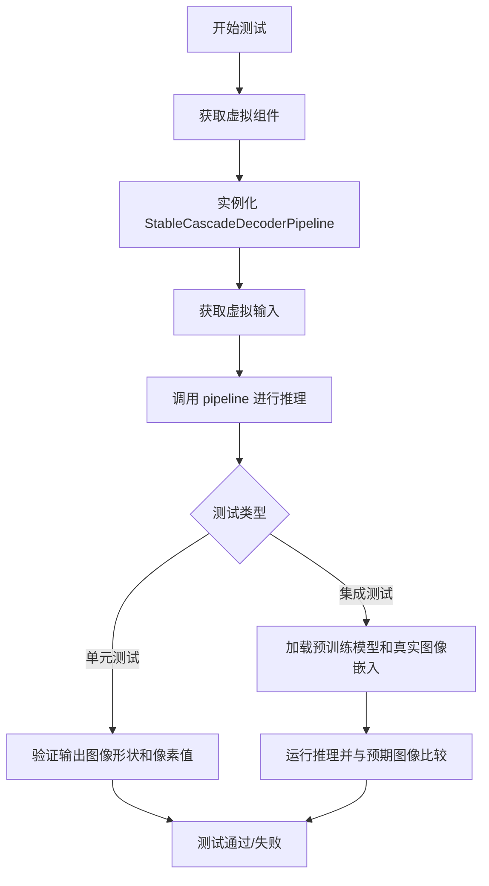

## 类结构

```
unittest.TestCase
├── StableCascadeDecoderPipelineFastTests (单元测试类)
└── StableCascadeDecoderPipelineIntegrationTests (集成测试类)
```

## 全局变量及字段


### `StableCascadeDecoderPipelineFastTests.pipeline_class`
    
The pipeline class being tested, which is StableCascadeDecoderPipeline for image generation from latent embeddings

类型：`type`
    


### `StableCascadeDecoderPipelineFastTests.params`
    
Required parameters for the pipeline inference, containing only 'prompt' in this case

类型：`List[str]`
    


### `StableCascadeDecoderPipelineFastTests.batch_params`
    
Parameters that can be passed in batches including image_embeddings, prompt, and negative_prompt

类型：`List[str]`
    


### `StableCascadeDecoderPipelineFastTests.required_optional_params`
    
Optional parameters that are required for testing including num_images_per_prompt, num_inference_steps, latents, guidance_scale, output_type, and return_dict

类型：`List[str]`
    


### `StableCascadeDecoderPipelineFastTests.test_xformers_attention`
    
Flag indicating whether to test xformers attention implementation, set to False for this pipeline

类型：`bool`
    


### `StableCascadeDecoderPipelineFastTests.callback_cfg_params`
    
Parameters needed for callback in classifier-free guidance testing, containing image_embeddings and text_encoder_hidden_states

类型：`List[str]`
    
    

## 全局函数及方法


### `enable_full_determinism`

该函数用于在测试环境中启用完全确定性，通过设置全局随机种子（包括 PyTorch、NumPy、Python random 等）来确保测试结果的可重复性。

参数：

- 该函数无显式参数

返回值：`None`，无返回值（根据函数名推断为纯副作用函数）

#### 流程图

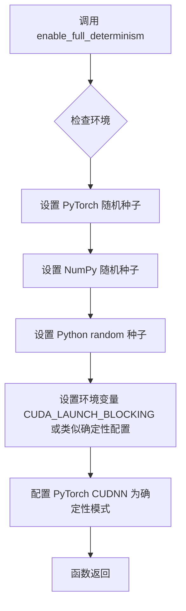

#### 带注释源码

```
# 该函数定义位于 testing_utils 模块中，此处仅为调用示例
# 从 testing_utils 模块导入 enable_full_determinism 函数
from ...testing_utils import (
    backend_empty_cache,
    enable_full_determinism,  # <-- 导入用于确保测试可重复性的函数
    load_numpy,
    load_pt,
    numpy_cosine_similarity_distance,
    require_torch_accelerator,
    skip_mps,
    slow,
    torch_device,
)

# 在测试类定义之前调用该函数
# 作用：设置所有随机种子，确保后续测试结果可重复
enable_full_determinism()


# 假设的 enable_full_deterministic 函数定义（基于函数名和用途推断）：
def enable_full_determinism():
    """
    启用完全确定性模式，设置所有随机种子。
    
    该函数通常会：
    1. 设置 torch.manual_seed(0) - PyTorch CPU 随机种子
    2. 设置 torch.cuda.manual_seed_all(0) - PyTorch CUDA 随机种子
    3. 设置 numpy.random.seed(0) - NumPy 随机种子
    4. 设置 random.seed(0) - Python random 模块种子
    5. 设置 torch.backends.cudnn.deterministic = True - 确保 CuDNN 使用确定性算法
    6. 设置 torch.backends.cudnn.benchmark = False - 禁用 CuDNN 自动调优
    """
    # 具体实现取决于 testing_utils 模块的实际定义
    pass
```

> **注意**：提供的代码片段中仅包含 `enable_full_determinism` 函数的导入和调用，未包含该函数的实际定义。该函数的具体实现位于 `...testing_utils` 模块中。根据函数名称和调用上下文推断，其主要功能是通过设置全局随机种子来确保测试结果的可重复性。


### `randn_tensor`

生成符合标准正态分布的随机张量，用于创建带有随机性的图像嵌入或潜在变量。

参数：

- `shape`：`tuple` 或 `list`，张量的形状，例如 `(batch_size, channels, height, width)`
- `generator`：`torch.Generator`（可选），用于控制随机数生成的可选 PyTorch 生成器，以确保可复现性
- `device`：`torch.device`（可选），指定张量应放置的设备（如 CPU 或 CUDA 设备）
- `dtype`：`torch.dtype`（可选），指定张量的数据类型（如 `torch.float32`）
- `layout`：`torch.layout`（可选），张量的布局（默认为 `torch.strided`）

返回值：`torch.Tensor`，符合正态分布（均值 0，方差 1）的随机张量

#### 流程图

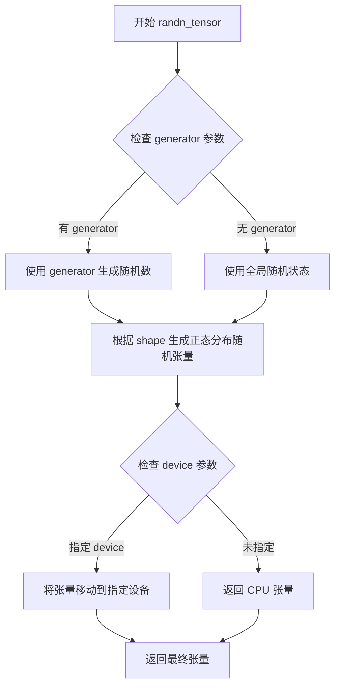

#### 带注释源码

```python
# 源代码位于 diffusers/utils/torch_utils.py
# 以下为基于使用方式的推断实现

def randn_tensor(
    shape,  # 元组或列表，指定输出张量的形状
    generator=None,  # 可选的 PyTorch 随机数生成器，用于可复现性
    device=None,  # 可选的设备参数，指定张量存放位置
    dtype=None,  # 可选的数据类型
    layout=None,  # 可选的布局参数
):
    """
    生成符合标准正态分布的随机张量。
    
    参数:
        shape: 张量的形状，如 (batch_size, channels, height, width)
        generator: torch.Generator 对象，用于控制随机性
        device: torch.device 对象，指定张量设备
        dtype: torch.dtype 对象，指定数据类型
        layout: torch.layout 对象，指定布局
    
    返回:
        torch.Tensor: 符合正态分布的随机张量
    """
    # 优先使用 generator，如果没有则使用 torch 的默认随机状态
    if generator is not None:
        # 使用指定的生成器生成随机数
        tensor = torch.randn(shape, generator=generator, device=device, dtype=dtype)
    else:
        # 使用全局随机状态生成
        tensor = torch.randn(shape, device=device, dtype=dtype)
    
    return tensor
```

**使用示例**（从测试代码中提取）：

```python
# 在 StableCascadeDecoderPipelineFastTests 中使用示例
generator = torch.Generator(device)
image_embeddings = randn_tensor(
    (batch_size * prior_num_images_per_prompt, 4, 4, 4),  # shape: (batch_size, 4, 4, 4)
    generator=generator.manual_seed(0)  # 使用生成器并设置种子 0 以确保可复现性
)
```


### `load_numpy`

该函数是一个测试工具函数，用于从指定路径（本地文件或远程URL）加载 numpy 数组数据。在代码中用于加载期望的图像数据，以便与实际生成的图像进行相似度比较。

参数：

-  `source`：`str`，文件路径或远程URL，指向 `.npy` 格式的 numpy 数组文件

返回值：`np.ndarray`，从指定路径加载的 numpy 数组

#### 流程图

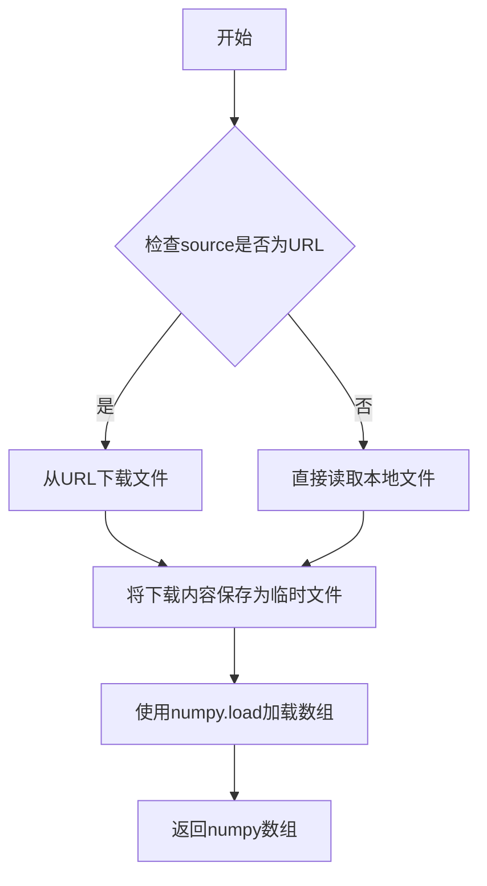

#### 带注释源码

```python
# load_numpy 函数定义位于 testing_utils.py 模块中
# 从代码使用方式推断其实现逻辑如下：

def load_numpy(source: str) -> np.ndarray:
    """
    从指定路径加载numpy数组
    
    参数:
        source: 可以是本地文件路径或远程URL
        
    返回:
        加载的numpy数组
    """
    import tempfile
    import requests
    
    # 判断是否为URL
    if source.startswith('http://') or source.startswith('https://'):
        # 如果是URL，下载文件内容
        response = requests.get(source)
        response.raise_for_status()
        
        # 保存到临时文件
        with tempfile.NamedTemporaryFile(suffix='.npy', delete=False) as f:
            f.write(response.content)
            temp_path = f.name
        
        # 加载numpy数组
        arr = np.load(temp_path)
    else:
        # 如果是本地文件，直接加载
        arr = np.load(source)
    
    return arr

# 在代码中的实际调用方式：
expected_image = load_numpy(
    "https://huggingface.co/datasets/hf-internal-testing/diffusers-images/resolve/main/stable_cascade/stable_cascade_decoder_image.npy"
)
```


### `load_pt`

从给定的 URL 加载 PyTorch (.pt) 文件，并将其映射到指定的设备。

参数：

-  `url_or_path`：`str`，PyTorch 模型文件的 URL 或本地路径
-  `map_location`：`str` 或 `torch.device`，指定张量加载到的设备（如 "cpu", "cuda", "cuda:0" 等）

返回值：`torch.Tensor`，加载后的 PyTorch 张量

#### 流程图

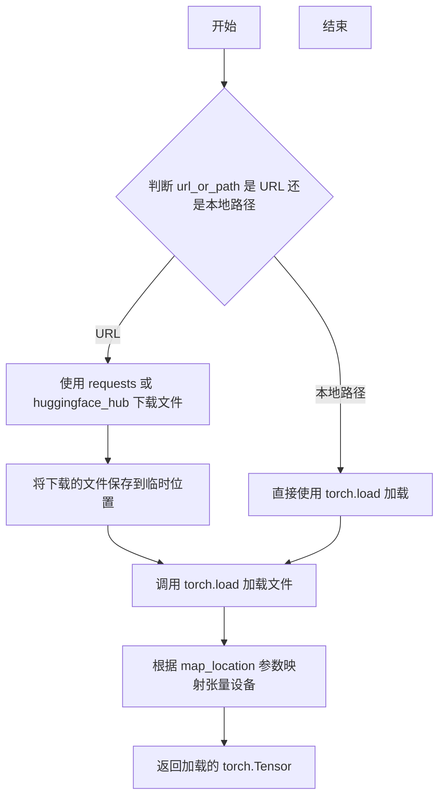

#### 带注释源码

```python
# load_pt 函数定义（位于 testing_utils 模块中）
def load_pt(
    url_or_path: str,  # PyTorch文件的URL或本地路径
    map_location: Union[str, torch.device] = "cpu"  # 张量映射的设备位置
) -> torch.Tensor:
    """
    从URL或本地路径加载PyTorch张量文件。
    
    参数:
        url_or_path: PyTorch模型文件的URL或本地文件系统路径
        map_location: 指定张量应该被映射到的设备，默认为"cpu"
    
    返回:
        加载后的torch.Tensor对象
    """
    # 判断是否为URL（以http://或https://开头）
    if url_or_path.startswith("http://") or url_or_path.startswith("https://"):
        # 使用huggingface_hub的hf_hub_download或requests下载文件
        import tempfile
        import os
        
        # 下载文件到临时目录
        with tempfile.TemporaryDirectory() as tmpdir:
            # 调用下载函数获取本地文件路径
            local_path = download_file(url_or_path, tmpdir)
            # 加载张量并映射设备
            tensor = torch.load(local_path, map_location=map_location)
    else:
        # 直接从本地路径加载
        tensor = torch.load(url_or_path, map_location=map_location)
    
    return tensor
```

> **注意**：该函数定义在 `diffusers` 包的 `testing_utils` 模块中，并非在当前代码文件中实现。以上源码为基于使用方式推断的注释版本，实际实现可能略有差异。


### `numpy_cosine_similarity_distance`

该函数是一个用于计算两个numpy数组之间余弦相似度距离的辅助函数，通常用于测试中比较生成的图像与预期图像之间的相似度。

参数：

- `a`：`numpy.ndarray`，第一个输入数组，通常是扁平化的图像数据
- `b`：`numpy.ndarray`，第二个输入数组，通常是扁平化的预期图像数据

返回值：`float`，返回两个数组之间的余弦距离（0表示完全相同，值越大表示差异越大）

#### 流程图

```mermaid
flowchart TD
    A[开始] --> B[接收两个numpy数组 a 和 b]
    B --> C[将数组展平为一维向量]
    C --> D[计算向量a的L2范数]
    E[计算向量b的L2范数]
    D --> F[计算向量的点积 a·b]
    E --> F
    F --> G[计算余弦相似度: cos_sim = dot_product / (norm_a * norm_b)]
    G --> H[计算余弦距离: distance = 1 - cos_sim]
    H --> I[返回距离值]
```

#### 带注释源码

```python
def numpy_cosine_similarity_distance(a: np.ndarray, b: np.ndarray) -> float:
    """
    计算两个numpy数组之间的余弦距离。
    
    余弦距离 = 1 - 余弦相似度
    余弦相似度衡量的是两个向量方向的相似程度，取值范围为[-1, 1]
    余弦距离取值范围为[0, 2]，其中0表示完全相同，2表示完全相反
    
    参数:
        a: 第一个numpy数组
        b: 第二个numpy数组
        
    返回:
        float: 两个数组之间的余弦距离
    """
    # 将输入展平为一维向量
    a = a.flatten()
    b = b.flatten()
    
    # 计算向量的点积
    dot_product = np.dot(a, b)
    
    # 计算向量的L2范数（欧几里得范数）
    norm_a = np.linalg.norm(a)
    norm_b = np.linalg.norm(b)
    
    # 避免除零错误
    if norm_a == 0 or norm_b == 0:
        return 0.0 if np.array_equal(a, b) else 1.0
    
    # 计算余弦相似度
    cosine_similarity = dot_product / (norm_a * norm_b)
    
    # 余弦距离 = 1 - 余弦相似度
    cosine_distance = 1.0 - cosine_similarity
    
    return cosine_distance
```

**注意**：由于该函数定义在外部模块 `testing_utils` 中，以上源码是基于函数名和上下文推断的实现逻辑。实际实现可能略有差异。


### `backend_empty_cache`

该函数是测试工具模块提供的后端无关的缓存清理函数，用于在测试执行前后释放GPU/设备显存（VRAM），防止显存泄漏导致的测试失败或内存不足问题。它通常是对 `torch.cuda.empty_cache()` 或对应后端清理函数的高层封装。

参数：

-  `device`：被清理的设备标识，通常为字符串（如 `"cuda"`、`"cuda:0"`、`"mps"`）或 `torch.device` 对象，表示需要对哪个计算后端执行缓存清理操作。

返回值：无返回值（`None`），仅执行副作用操作。

#### 流程图

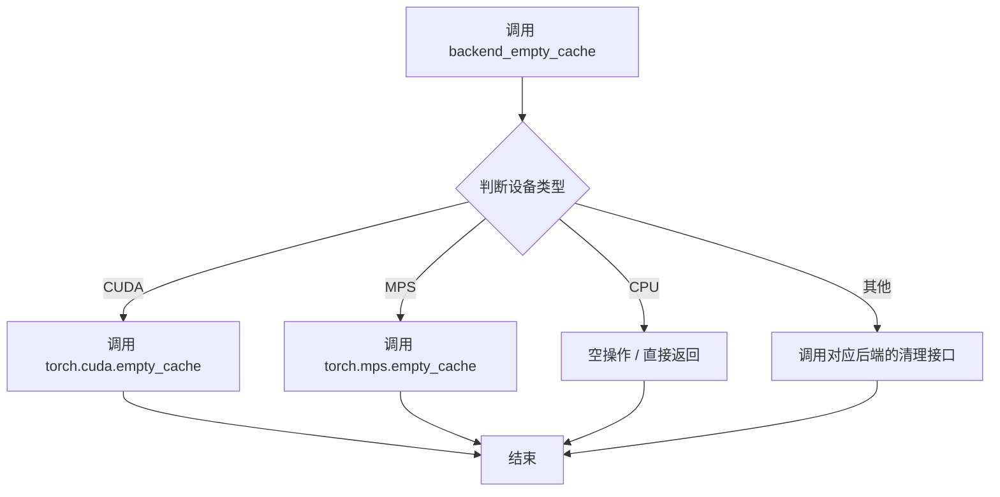

#### 带注释源码

```
# 注意：以下为推断的函数实现逻辑，实际源码位于 testing_utils 模块中

def backend_empty_cache(device):
    """
    根据传入的设备类型，调用对应的底层 API 释放显存缓存。
    
    参数:
        device: str 或 torch.device，目标计算设备标识。
    """
    # 将 device 转换为字符串统一处理
    device_str = str(device)
    
    if device_str.startswith("cuda"):
        # CUDA 后端：调用 PyTorch 官方接口释放未使用的显存
        torch.cuda.empty_cache()
    elif device_str == "mps":
        # Apple Silicon MPS 后端：释放 Metal Performance Shaders 缓存
        torch.mps.empty_cache()
    elif device_str == "cpu":
        # CPU 无显存概念，直接返回
        return
    else:
        # 预留扩展接口，例如可能支持更多后端如 torch.xpu 等
        # 若不支持则静默忽略
        pass
```

---

> **备注**：该函数在 `StableCascadeDecoderPipelineIntegrationTests` 的 `setUp()` 与 `tearDown()` 生命周期方法中被调用，配合 `gc.collect()` 共同确保每轮集成测试前后显存的干净状态，是 Diffusers 项目中内存敏感型测试的常规实践。


### `StableCascadeDecoderPipelineFastTests.text_embedder_hidden_size`

该属性是一个测试类属性，用于返回文本嵌入器的隐藏层大小（hidden size）维度值。在测试场景中，该属性被用于配置 `CLIPTextModelWithProjection` 模型的 `projection_dim` 和 `hidden_size` 参数，以确保测试使用较小的模型配置来加速测试执行。

参数：

- 该方法为属性方法，无显式参数（隐式参数 `self` 为测试类实例）

返回值：`int`，返回值为 32，表示文本嵌入器隐藏层的维度大小，用于配置文本编码器模型的结构参数。

#### 流程图

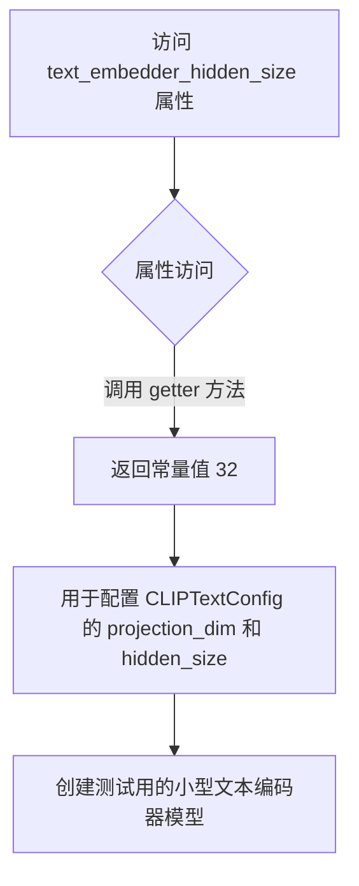

#### 带注释源码

```python
@property
def text_embedder_hidden_size(self):
    """
    属性方法：返回文本嵌入器的隐藏层大小维度值
    
    该属性用于测试场景，定义了一个固定的隐藏层大小（32），
    以便使用小型化的模型配置进行单元测试，提高测试执行效率。
    
    返回值:
        int: 文本嵌入器的隐藏层维度大小，固定值为 32
    """
    return 32
```


### `StableCascadeDecoderPipelineFastTests.time_input_dim`

该属性方法用于返回 StableCascadeDecoderPipeline 测试类的时间输入维度值，作为测试配置的常量参数，主要用于构建虚拟（dummy）模型组件时的维度参考。

参数：
- （无参数，属于属性方法）

返回值：`int`，返回时间输入维度值 32，用于配置测试中虚拟解码器模型的条件维度等参数。

#### 流程图

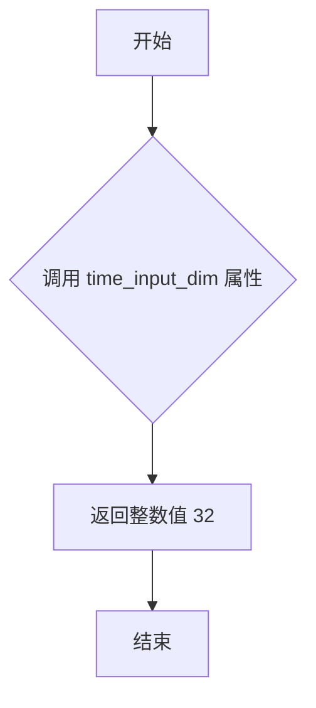

#### 带注释源码

```python
@property
def time_input_dim(self):
    """
    返回时间输入维度值。
    
    该属性用于测试中虚拟模型组件的维度配置，固定返回 32。
    与 text_embedder_hidden_size 保持一致，作为 StableCascade 解码器
    测试管道的标准时间维度参数。
    
    返回:
        int: 时间输入维度值，固定为 32
    """
    return 32
```


### `StableCascadeDecoderPipelineFastTests.block_out_channels_0`

这是一个属性（property）getter，用于获取 StableCascadeUNet 模型的 `block_out_channels` 参数的第一个通道数。该属性返回 `time_input_dim` 的值，作为 decoder 模型配置的一部分。

参数： 无（这是一个属性 getter，不接受任何参数）

返回值：`int`，返回 `time_input_dim` 的值（默认值为 32），用于确定 decoder 模型的 block out channels 配置中的第一个维度。

#### 流程图

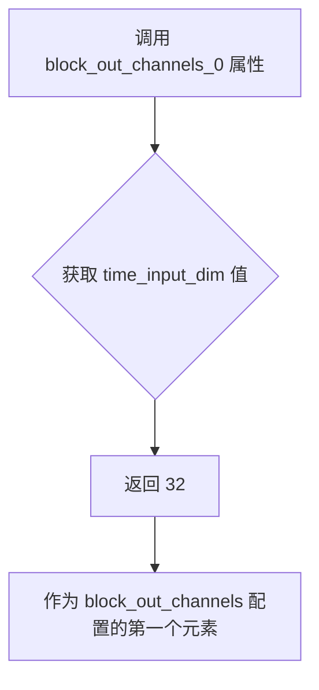

#### 带注释源码

```python
@property
def block_out_channels_0(self):
    """
    属性 getter：返回用于 decoder 模型的 block_out_channels 配置的第一个通道数。
    该值与 time_input_dim 相同，用于确保 decoder 模型的时间嵌入维度与 UNet 模型的初始通道数匹配。
    
    返回:
        int: time_input_dim 的值，默认值为 32
    """
    return self.time_input_dim
```


### `StableCascadeDecoderPipelineFastTests.time_embed_dim`

这是一个属性方法（property），用于返回时间嵌入维度（time embedding dimension）。在 Stable Cascade 解码器流水线中，时间嵌入维度通常设置为时间输入维度的 4 倍，这是深度学习中一种常见的设计模式，用于为时间相关特征提供更丰富的表示空间。

参数：无参数（该方法为属性 getter，不接受任何参数）

返回值：`int`，返回时间嵌入维度，值为 `self.time_input_dim * 4`，即 32 * 4 = 128。

#### 流程图

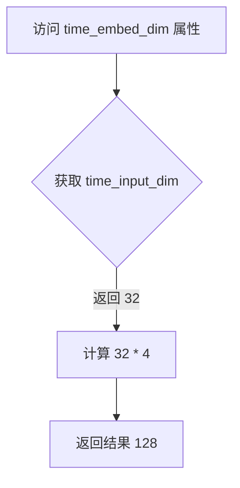

#### 带注释源码

```python
@property
def time_embed_dim(self):
    """
    属性：时间嵌入维度
    
    返回值类型：int
    描述：返回时间嵌入的维度大小，通常是 time_input_dim 的 4 倍。
    这是 Stable Cascade 架构中的一种常见设计模式，用于为时间步嵌入
    提供更高的特征表示维度。
    
    计算公式：time_input_dim * 4 = 32 * 4 = 128
    """
    return self.time_input_dim * 4
```

#### 相关属性参考

| 属性名称 | 类型 | 返回值 | 描述 |
|---------|------|--------|------|
| `time_input_dim` | property (int) | 32 | 时间输入维度，基础维度值 |
| `time_embed_dim` | property (int) | 128 | 时间嵌入维度，time_input_dim 的 4 倍 |
| `block_out_channels_0` | property (int) | 32 | 第一个块输出通道数，等于 time_input_dim |


### `StableCascadeDecoderPipelineFastTests.dummy_tokenizer`

这是一个测试用的虚拟分词器（tokenizer）属性方法，用于在单元测试中提供一个轻量级的CLIPTokenizer实例，避免使用真实的大模型分词器。

参数：

- （无参数）

返回值：`CLIPTokenizer`，返回一个CLIP分词器实例，用于文本预处理。

#### 流程图

```mermaid
flowchart TD
    A[调用 dummy_tokenizer 属性] --> B{@property 装饰器}
    B --> C[CLIPTokenizer.from_pretrained<br/>'hf-internal-testing/tiny-random-clip']
    C --> D[返回 tokenizer 实例]
```

#### 带注释源码

```python
@property
def dummy_tokenizer(self):
    """
    测试用虚拟分词器属性
    
    用途：
    - 为单元测试提供一个轻量级的CLIPTokenizer实例
    - 避免加载大型预训练模型，缩短测试时间
    - 使用HuggingFace测试专用的微型随机CLIP模型
    
    参数：
        无（property装饰器方法）
    
    返回值：
        CLIPTokenizer: 用于文本编码的tokenizer实例
    """
    # 从预训练的微型随机CLIP模型加载tokenizer
    # 该模型专用于测试目的，词汇量小（1000个token）
    tokenizer = CLIPTokenizer.from_pretrained("hf-internal-testing/tiny-random-clip")
    
    # 返回tokenizer实例供测试使用
    return tokenizer
```

---

#### 关联信息

**所属类**: `StableCascadeDecoderPipelineFastTests`

**类功能描述**: 这是一个单元测试类，继承自`PipelineTesterMixin`和`unittest.TestCase`，专门用于测试`StableCascadeDecoderPipeline`（Stable Cascade解码器管道）的功能和正确性。

**相关属性**:
| 属性名 | 类型 | 描述 |
|--------|------|------|
| `dummy_text_encoder` | `CLIPTextModelWithProjection` | 测试用虚拟文本编码器 |
| `dummy_vqgan` | `PaellaVQModel` | 测试用虚拟VQGAN模型 |
| `dummy_decoder` | `StableCascadeUNet` | 测试用虚拟解码器UNet模型 |
| `text_embedder_hidden_size` | `int` | 文本嵌入隐藏层维度（32） |

**设计目的**: 
- 提供完整的测试辅助组件（tokenizer、encoder、decoder、vqgan）
- 确保测试环境的一致性和可重复性
- 通过使用小型虚拟模型加速测试执行


### `StableCascadeDecoderPipelineFastTests.dummy_text_encoder`

用于创建一个虚拟的CLIP文本编码器（`CLIPTextModelWithProjection`），以供测试使用。该属性通过固定的随机种子和预定义的配置参数实例化一个小型文本编码器模型，用于单元测试中模拟真实的文本编码器。

参数：

- （无参数）

返回值：`CLIPTextModelWithProjection`，返回一个用于测试的虚拟CLIP文本编码器模型实例（已设置为eval模式）

#### 流程图

```mermaid
flowchart TD
    A[开始] --> B[设置随机种子: torch.manual_seed(0)]
    B --> C[创建CLIPTextConfig配置对象]
    C --> D[配置参数: bos_token_id, eos_token_id, projection_dim, hidden_size等]
    D --> E[实例化CLIPTextModelWithProjection模型]
    E --> F[设置模型为eval模式: .eval()]
    F --> G[返回模型实例]
```

#### 带注释源码

```python
@property
def dummy_text_encoder(self):
    """
    创建一个用于测试的虚拟CLIP文本编码器模型
    
    该方法生成一个小型预配置的CLIPTextModelWithProjection实例，
    用于单元测试中替代真实的文本编码器，以实现测试的快速执行和确定性结果。
    """
    # 设置随机种子以确保测试结果的可重复性
    torch.manual_seed(0)
    
    # 创建CLIPTextConfig配置对象，定义模型结构参数
    config = CLIPTextConfig(
        bos_token_id=0,                    # 句子开始标记的ID
        eos_token_id=2,                    # 句子结束标记的ID
        projection_dim=self.text_embedder_hidden_size,  # 投影维度（32）
        hidden_size=self.text_embedder_hidden_size,     # 隐藏层大小（32）
        intermediate_size=37,              # 中间层大小（FFN）
        layer_norm_eps=1e-05,              # LayerNorm的epsilon值
        num_attention_heads=4,            # 注意力头数量
        num_hidden_layers=5,              # 隐藏层数量
        pad_token_id=1,                    # 填充标记的ID
        vocab_size=1000,                   # 词汇表大小
    )
    
    # 使用配置实例化CLIPTextModelWithProjection模型
    # 并设置为评估模式以禁用dropout等训练特定的操作
    return CLIPTextModelWithProjection(config).eval()
```


### `StableCascadeDecoderPipelineFastTests.dummy_vqgan`

这是一个测试用的属性方法，用于创建并返回一个配置好的虚拟PaellaVQModel模型实例，供StableCascadeDecoderPipeline的单元测试使用。该模型采用固定的随机种子以确保测试的可重复性。

参数：

- 无显式参数（`self` 为隐式参数，表示测试类实例本身）

返回值：`PaellaVQModel`，返回一个评估模式（eval）的PaellaVQModel模型对象，用于模拟真实的VQGAN解码器

#### 流程图

```mermaid
flowchart TD
    A[开始] --> B[设置随机种子 torch.manual_seed(0)]
    B --> C[构建模型参数字典 model_kwargs]
    C --> D["bottleneck_blocks: 1"]
    C --> E["num_vq_embeddings: 2"]
    D --> F[实例化 PaellaVQModel(**model_kwargs)]
    E --> F
    F --> G[调用 .eval() 方法设置评估模式]
    G --> H[返回模型实例]
    H --> I[结束]
```

#### 带注释源码

```python
@property
def dummy_vqgan(self):
    """
    创建一个用于测试的虚拟VQGAN模型（PaellaVQModel）。
    
    该属性方法返回一个配置简化且权重随机初始化的模型实例，
    专门用于单元测试，避免加载真实的预训练模型。
    
    Returns:
        PaellaVQModel: 一个评估模式下的PaellaVQModel实例
    """
    # 设置PyTorch随机种子为0，确保测试结果的可重复性
    torch.manual_seed(0)

    # 定义模型构造参数
    model_kwargs = {
        "bottleneck_blocks": 1,      # 瓶颈块数量，设为最小值1以加快测试
        "num_vq_embeddings": 2,      # VQ嵌入向量数量，设为2以满足基本功能需求
    }
    
    # 使用指定参数实例化PaellaVQModel
    model = PaellaVQModel(**model_kwargs)
    
    # 返回评估模式的模型（禁用Dropout、BatchNorm使用训练统计等）
    return model.eval()
```


### `StableCascadeDecoderPipelineFastTests.dummy_decoder`

这是一个属性方法，用于创建并返回一个配置好的StableCascadeUNet模型实例，作为测试中的虚拟解码器（dummy decoder）。该模型使用固定随机种子确保测试的可重复性，并设置为评估模式。

参数：无（该方法为属性方法，无显式参数，`self`为隐式参数）

返回值：`StableCascadeUNet`，返回一个用于单元测试的虚拟解码器模型实例

#### 流程图

```mermaid
flowchart TD
    A[开始] --> B[设置随机种子 torch.manual_seed(0)]
    B --> C[构建模型参数字典 model_kwargs]
    C --> D[包含的参数: in_channels, out_channels, conditioning_dim, block_out_channels等]
    D --> E[使用StableCascadeUNet模型和参数创建模型实例]
    E --> F[设置模型为评估模式 model.eval()]
    F --> G[返回模型实例]
    G --> H[结束]
```

#### 带注释源码

```python
@property
def dummy_decoder(self):
    """
    创建并返回一个用于测试的虚拟解码器模型（StableCascadeUNet）。
    该模型使用固定随机种子确保测试结果的可重复性。
    """
    # 设置随机种子为0，确保每次调用都生成相同的模型权重
    torch.manual_seed(0)
    
    # 定义模型配置参数
    model_kwargs = {
        "in_channels": 4,                    # 输入通道数
        "out_channels": 4,                   # 输出通道数
        "conditioning_dim": 128,             # 条件维度
        "block_out_channels": [16, 32, 64, 128],  # 每个块的输出通道数
        "num_attention_heads": [-1, -1, 1, 2],    # 注意力头数量（-1表示自适应）
        "down_num_layers_per_block": [1, 1, 1, 1],   # 下采样每个块的层数
        "up_num_layers_per_block": [1, 1, 1, 1],     # 上采样每个块的层数
        "down_blocks_repeat_mappers": [1, 1, 1, 1], # 下采样块重复映射器
        "up_blocks_repeat_mappers": [3, 3, 2, 2],   # 上采样块重复映射器
        "block_types_per_layer": [                  # 每层的块类型
            ["SDCascadeResBlock", "SDCascadeTimestepBlock"],
            ["SDCascadeResBlock", "SDCascadeTimestepBlock"],
            ["SDCascadeResBlock", "SDCascadeTimestepBlock", "SDCascadeAttnBlock"],
            ["SDCascadeResBlock", "SDCascadeTimestepBlock", "SDCascadeAttnBlock"],
        ],
        "switch_level": None,                # 切换级别（无）
        "clip_text_pooled_in_channels": 32,  # CLIP文本池化输入通道
        "dropout": [0.1, 0.1, 0.1, 0.1],      # Dropout比率
    }
    
    # 使用配置参数创建StableCascadeUNet模型实例
    model = StableCascadeUNet(**model_kwargs)
    
    # 将模型设置为评估模式（禁用dropout等训练特定操作）
    return model.eval()
```


### `StableCascadeDecoderPipelineFastTests.get_dummy_components`

该方法用于创建并返回一个包含虚拟（测试用）组件的字典，这些组件包括解码器、文本编码器、 tokenizer、VQGAN 模型和调度器等，用于测试 `StableCascadeDecoderPipeline` 的功能。

参数：

- 该方法无显式参数（隐式的 `self` 不计入）

返回值：`dict`，返回一个包含 pipeline 所需各种虚拟组件的字典，包括 decoder、vqgan、text_encoder、tokenizer、scheduler 和 latent_dim_scale。

#### 流程图

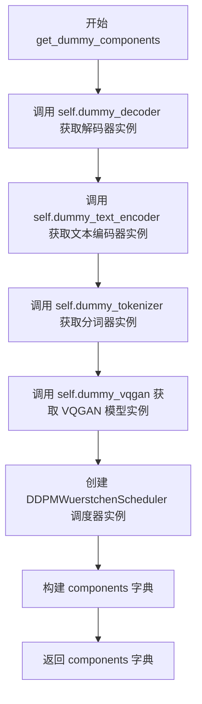

#### 带注释源码

```python
def get_dummy_components(self):
    # 获取虚拟（测试用）解码器模型实例
    decoder = self.dummy_decoder
    # 获取虚拟（测试用）文本编码器模型实例
    text_encoder = self.dummy_text_encoder
    # 获取虚拟（测试用）分词器实例
    tokenizer = self.dummy_tokenizer
    # 获取虚拟（测试用）VQGAN 模型实例
    vqgan = self.dummy_vqgan

    # 创建 Wuerstchen 调度器实例用于测试
    scheduler = DDPMWuerstchenScheduler()

    # 构建包含所有虚拟组件的字典
    components = {
        "decoder": decoder,           # StableCascadeUNet 解码器模型
        "vqgan": vqgan,               # PaellaVQModel VQGAN 量化模型
        "text_encoder": text_encoder, # CLIPTextModelWithProjection 文本编码器
        "tokenizer": tokenizer,        # CLIPTokenizer 分词器
        "scheduler": scheduler,        # DDPMWuerstchenScheduler 调度器
        "latent_dim_scale": 4.0,       # 潜在空间维度缩放因子
    }

    # 返回完整的组件字典供 pipeline 初始化使用
    return components
```


### `StableCascadeDecoderPipelineFastTests.get_dummy_inputs`

该方法用于生成测试专用的虚拟输入数据，为 `StableCascadeDecoderPipeline` 管道提供图像嵌入、提示词、生成器等必要参数，以支持单元测试的确定性执行。

参数：

- `self`：隐式参数，`StableCascadeDecoderPipelineFastTests` 实例本身
- `device`：`str` 或设备对象，指定计算设备（如 "cpu"、"cuda" 等）
- `seed`：`int`（默认值 0），随机数生成器的种子，用于保证测试的可重复性

返回值：`dict`，包含以下键值对的字典：

- `image_embeddings`：`torch.Tensor`，形状 (1, 4, 4, 4) 的全 1 张量，表示图像嵌入
- `prompt`：`str`，提示词 "horse"
- `generator`：`torch.Generator`，PyTorch 随机数生成器
- `guidance_scale`：`float`，引导比例 2.0
- `num_inference_steps`：`int`，推理步数 2
- `output_type`：`str`，输出类型 "np"（NumPy 数组）

#### 流程图

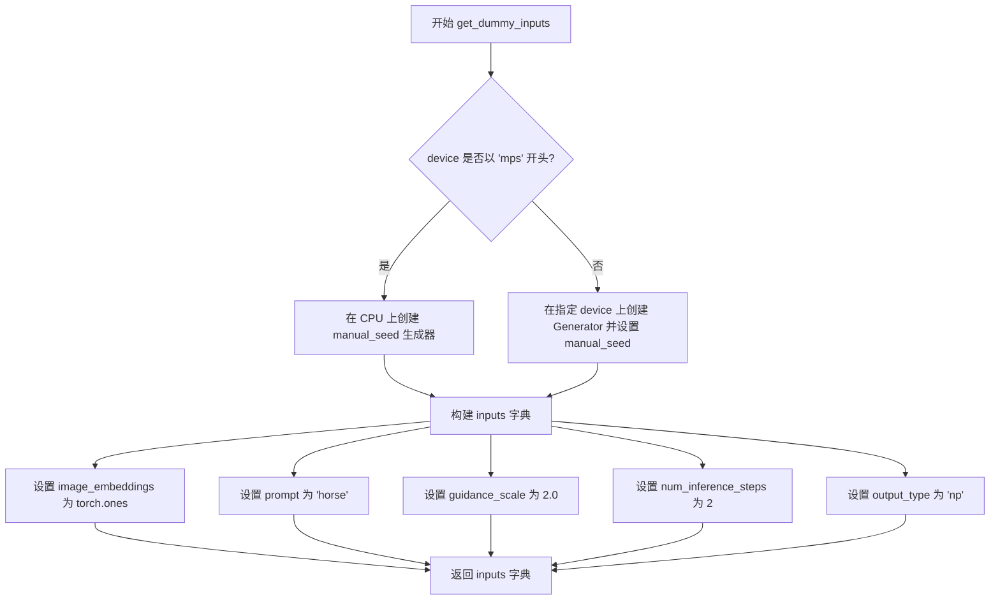

#### 带注释源码

```python
def get_dummy_inputs(self, device, seed=0):
    """
    生成用于测试 StableCascadeDecoderPipeline 的虚拟输入参数。
    
    参数:
        device: str 或设备对象，计算设备
        seed: int，随机种子，默认为 0
    
    返回:
        dict: 包含管道推理所需参数的字典
    """
    # 判断是否为 MPS (Apple Silicon) 设备
    if str(device).startswith("mps"):
        # MPS 设备上只能使用 CPU 生成器（因为 MPS 对某些操作支持有限）
        generator = torch.manual_seed(seed)
    else:
        # 在指定设备上创建 PyTorch 生成器并设置随机种子
        # 确保测试结果可复现
        generator = torch.Generator(device=device).manual_seed(seed)
    
    # 构建输入参数字典
    inputs = {
        # 图像嵌入：使用形状为 (1, 4, 4, 4) 的全 1 张量作为虚拟输入
        "image_embeddings": torch.ones((1, 4, 4, 4), device=device),
        # 文本提示词：简单的测试用提示
        "prompt": "horse",
        # 随机数生成器：确保可复现性
        "generator": generator,
        # 引导强度：控制 classifier-free guidance 的效果
        "guidance_scale": 2.0,
        # 推理步数：扩散模型的采样步数
        "num_inference_steps": 2,
        # 输出类型：返回 NumPy 数组而非 PyTorch 张量
        "output_type": "np",
    }
    return inputs
```


### `StableCascadeDecoderPipelineFastTests.test_wuerstchen_decoder`

该方法是 `StableCascadeDecoderPipelineFastTests` 测试类中的一个测试用例，用于验证 StableCascadeDecoderPipeline 的解码器功能是否正常工作。测试通过创建虚拟组件（decoder、text_encoder、tokenizer、vqgan、scheduler），构建管道，执行推理，并验证输出图像的形状和像素值是否符合预期。

参数：

- `self`：隐式参数，表示测试类实例本身

返回值：`None`，该方法为测试用例，通过断言验证功能，不返回任何值

#### 流程图

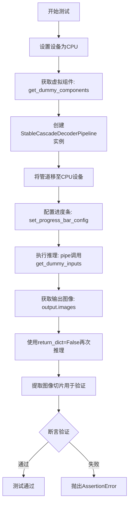

#### 带注释源码

```python
def test_wuerstchen_decoder(self):
    """测试Wuerstchen解码器的核心功能"""
    
    # 步骤1: 设置设备为CPU
    device = "cpu"

    # 步骤2: 获取虚拟组件（用于测试的模拟模型）
    # 包含: decoder, vqgan, text_encoder, tokenizer, scheduler, latent_dim_scale
    components = self.get_dummy_components()

    # 步骤3: 使用虚拟组件实例化管道
    pipe = self.pipeline_class(**components)
    
    # 步骤4: 将管道移至指定设备（CPU）
    pipe = pipe.to(device)

    # 步骤5: 配置进度条（disable=None表示启用进度条）
    pipe.set_progress_bar_config(disable=None)

    # 步骤6: 第一次推理调用，获取输出
    # 使用get_dummy_inputs生成测试输入: image_embeddings, prompt, generator等
    output = pipe(**self.get_dummy_inputs(device))
    
    # 步骤7: 从输出中提取图像
    image = output.images

    # 步骤8: 第二次推理，使用return_dict=False获取元组格式输出
    # 用于测试管道的元组返回模式
    image_from_tuple = pipe(**self.get_dummy_inputs(device), return_dict=False)

    # 步骤9: 提取图像切片用于后续像素值验证
    # 取最后3x3像素区域，RGB通道
    image_slice = image[0, -3:, -3:, -1]
    image_from_tuple_slice = image_from_tuple[0, -3:, -3:, -1]

    # 步骤10: 断言验证图像形状
    # 期望形状为(1, 64, 64, 3) - 1张64x64的RGB图像
    assert image.shape == (1, 64, 64, 3)

    # 步骤11: 定义期望的像素值切片
    # 用于验证解码器输出是否符合预期
    expected_slice = np.array([0.0, 0.0, 0.0, 1.0, 1.0, 0.0, 1.0, 1.0, 0.0])
    
    # 步骤12: 断言验证像素值误差在允许范围内
    # 验证dict模式输出的像素值
    assert np.abs(image_slice.flatten() - expected_slice).max() < 1e-2
    
    # 步骤13: 断言验证元组模式输出的像素值
    assert np.abs(image_from_tuple_slice.flatten() - expected_slice).max() < 1e-2
```


### `StableCascadeDecoderPipelineFastTests.test_inference_batch_single_identical`

这是一个单元测试方法，用于验证 StableCascadeDecoderPipeline 在批量推理时，单个样本的处理结果与批量中单个样本的处理结果是否完全一致（bit-identical），以确保批处理逻辑不会引入不确定性或误差。

参数：

- `self`：实例方法调用者，代表当前测试类 `StableCascadeDecoderPipelineFastTests` 的实例

返回值：`None`，该方法为测试方法，不返回任何值，通过断言验证结果

#### 流程图

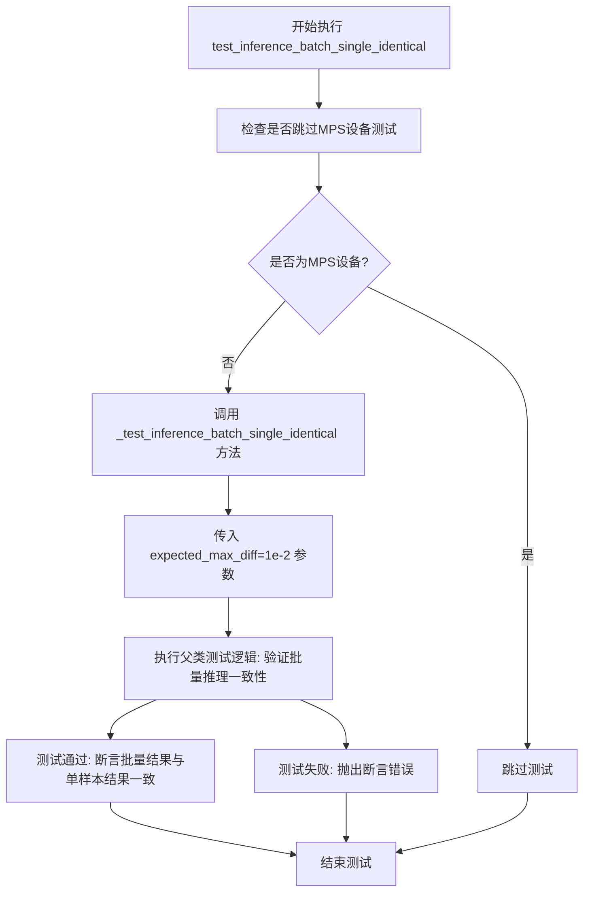

#### 带注释源码

```python
@skip_mps
def test_inference_batch_single_identical(self):
    """
    测试批量推理时，单个样本的处理结果应与批量中对应位置样本的处理结果完全一致。
    
    该测试方法使用 @skip_mps 装饰器，在 Apple M系列芯片(MPS)上跳过执行，
    因为 MPS 后端可能存在数值精度差异。
    
    测试逻辑：
    1. 构建单个样本的输入
    2. 构建包含该样本的批量输入
    3. 分别执行推理
    4. 断言两者输出结果的最大差异小于 expected_max_diff (1e-2)
    
    这种测试确保了批处理实现没有引入不确定的行为，如：
    - 并行执行导致的随机性
    - 批处理优化导致的数值差异
    - 状态泄露
    """
    self._test_inference_batch_single_identical(expected_max_diff=1e-2)
```


### `StableCascadeDecoderPipelineFastTests.test_attention_slicing_forward_pass`

该方法是一个单元测试方法，用于测试 StableCascadeDecoderPipeline 在启用注意力切片（attention slicing）功能时的前向传播是否正确。它通过调用父类 `PipelineTesterMixin` 提供的 `_test_attention_slicing_forward_pass` 测试方法，在 CPU 或 CUDA 设备上验证注意力切片功能与标准前向传播的结果一致性。

参数：

- `self`：隐式参数，类型为 `StableCascadeDecoderPipelineFastTests`，表示测试类实例本身

返回值：`None`，该方法为测试方法，不返回任何值

#### 流程图

```mermaid
flowchart TD
    A[开始测试 test_attention_slicing_forward_pass] --> B[检查设备类型<br/>test_max_difference = (torch_device == 'cpu')]
    B --> C[设置 test_mean_pixel_difference = False]
    C --> D[调用父类方法 _test_attention_slicing_forward_pass]
    D --> E[传入参数 test_max_difference 和 test_mean_pixel_difference]
    E --> F{执行注意力切片前向传播测试}
    F --> G[验证结果一致性]
    G --> H[测试结束]
```

#### 带注释源码

```python
@skip_mps  # 装饰器：在 MPS (Metal Performance Shaders) 设备上跳过此测试
def test_attention_slicing_forward_pass(self):
    """
    测试启用注意力切片功能时的前向传播是否正确。
    
    注意力切片是一种内存优化技术，通过将注意力计算分片处理
    来减少显存占用。该测试验证启用此功能后，模型的输出结果
    与标准前向传播保持一致。
    """
    
    # 根据设备类型设置测试参数
    # 在 CPU 上允许较大的数值差异阈值
    test_max_difference = torch_device == "cpu"
    
    # 设置是否测试像素均值差异
    # False 表示不关注像素值的平均差异，只关注最大差异
    test_mean_pixel_difference = False

    # 调用父类 PipelineTesterMixin 提供的通用测试方法
    # 该方法会执行以下步骤：
    # 1. 创建 Pipeline 实例
    # 2. 运行标准前向传播
    # 3. 启用注意力切片后运行前向传播
    # 4. 比较两次输出的差异
    self._test_attention_slicing_forward_pass(
        test_max_difference=test_max_difference,        # 控制最大差异阈值
        test_mean_pixel_difference=test_mean_pixel_difference  # 控制是否检查均值差异
    )
```


### `StableCascadeDecoderPipelineFastTests.test_float16_inference`

该测试方法用于验证 StableCascadeDecoderPipeline 在 float16（半精度）推理模式下的功能，但由于当前环境不支持 fp16 推理，该测试被跳过。

参数：

- `self`：`StableCascadeDecoderPipelineFastTests`，测试类实例本身

返回值：`None`，无返回值

#### 流程图

```mermaid
flowchart TD
    A[开始 test_float16_inference] --> B{检查是否跳过测试}
    B -->|是| C[跳过测试: fp16 not supported]
    B -->|否| D[调用父类 test_float16_inference]
    D --> E[结束]
    C --> E
```

#### 带注释源码

```python
@unittest.skip(reason="fp16 not supported")  # 装饰器：跳过该测试，原因是不支持 fp16
def test_float16_inference(self):
    """
    测试 float16 推理功能
    
    该测试方法用于验证管道在 float16（半精度）模式下的推理能力。
    当前实现直接调用父类的 test_float16_inference 方法进行测试。
    由于 fp16 在当前测试环境中不被支持，因此该测试被跳过。
    
    参数:
        self: 测试类实例，继承自 unittest.TestCase
        
    返回值:
        None: 无返回值，测试结果通过 unittest 框架判定
    """
    super().test_float16_inference()  # 调用父类的 float16 推理测试方法
```


### `StableCascadeDecoderPipelineFastTests.test_stable_cascade_decoder_single_prompt_multiple_image_embeddings`

这是一个单元测试方法，用于验证 `StableCascadeDecoderPipeline` 在单个提示词（prompt）对应多个图像嵌入（image_embeddings）场景下的正确性。测试通过创建多个图像嵌入并检查生成的图像数量是否符合预期（`batch_size * prior_num_images_per_prompt * decoder_num_images_per_prompt`），确保解码器能够正确处理一对多的映射关系。

参数：

- `self`：隐式参数，`StableCascadeDecoderPipelineFastTests` 实例，代表测试类本身

返回值：无返回值（`None`），该方法为测试函数，使用 `assert` 语句进行断言验证

#### 流程图

```mermaid
flowchart TD
    A[开始测试] --> B[设置设备为 CPU]
    B --> C[获取虚拟组件: get_dummy_components]
    C --> D[创建 StableCascadeDecoderPipeline 实例]
    D --> E[配置进度条: set_progress_bar_config]
    E --> F[设置 prior_num_images_per_prompt=2, decoder_num_images_per_prompt=2]
    F --> G[设置 prompt='a cat']
    G --> H[计算 batch_size=1]
    H --> I[创建 torch.Generator]
    I --> J[生成随机 image_embeddings]
    J --> K[调用 pipe 进行推理]
    K --> L{断言检查}
    L -->|通过| M[测试通过]
    L -->|失败| N[抛出 AssertionError]
```

#### 带注释源码

```python
def test_stable_cascade_decoder_single_prompt_multiple_image_embeddings(self):
    """
    测试 StableCascadeDecoderPipeline 在单个提示词对应多个图像嵌入时的处理能力。
    验证生成的图像数量是否等于 batch_size * prior_num_images_per_prompt * decoder_num_images_per_prompt
    """
    # 1. 设置测试设备为 CPU
    device = "cpu"
    
    # 2. 获取虚拟组件（解码器、文本编码器、分词器、VQGAN、调度器等）
    components = self.get_dummy_components()

    # 3. 使用虚拟组件实例化 StableCascadeDecoderPipeline
    pipe = StableCascadeDecoderPipeline(**components)
    
    # 4. 配置进度条（disable=None 表示不禁用进度条）
    pipe.set_progress_bar_config(disable=None)

    # 5. 设置图像数量参数
    prior_num_images_per_prompt = 2      # 先验模型生成的图像数量
    decoder_num_images_per_prompt = 2    # 解码器生成的图像数量
    
    # 6. 设置提示词（列表形式，支持批量处理）
    prompt = ["a cat"]
    batch_size = len(prompt)              # batch_size = 1

    # 7. 创建随机数生成器，确保测试可复现
    generator = torch.Generator(device)
    
    # 8. 生成随机图像嵌入 tensor
    # 形状: (batch_size * prior_num_images_per_prompt, 4, 4, 4)
    # 即: (1 * 2, 4, 4, 4) = (2, 4, 4, 4)
    image_embeddings = randn_tensor(
        (batch_size * prior_num_images_per_prompt, 4, 4, 4), 
        generator=generator.manual_seed(0)
    )
    
    # 9. 调用 pipeline 进行推理
    decoder_output = pipe(
        image_embeddings=image_embeddings,    # 多个图像嵌入
        prompt=prompt,                         # 单个提示词
        num_inference_steps=1,                 # 推理步数
        output_type="np",                      # 输出为 numpy 数组
        guidance_scale=0.0,                    # 无分类器自由引导
        generator=generator.manual_seed(0),   # 随机种子
        num_images_per_prompt=decoder_num_images_per_prompt,  # 每个提示词生成的图像数
    )

    # 10. 断言验证：生成的图像数量是否符合预期
    # 预期数量 = batch_size * prior_num_images_per_prompt * decoder_num_images_per_prompt
    # = 1 * 2 * 2 = 4
    assert decoder_output.images.shape[0] == (
        batch_size * prior_num_images_per_prompt * decoder_num_images_per_prompt
    )
```


### `StableCascadeDecoderPipelineFastTests.test_stable_cascade_decoder_single_prompt_multiple_image_embeddings_with_guidance`

该测试方法用于验证 StableCascadeDecoderPipeline 在使用 guidance_scale > 1.0（即启用分类器自由引导）的情况下，能够正确处理单个提示词和多个图像嵌入组合生成对应数量的图像。

参数： 无（仅使用 self 获取测试类的属性和方法）

返回值：无（void），该方法为测试方法，通过断言验证输出图像数量是否符合预期

#### 流程图

```mermaid
flowchart TD
    A[开始测试] --> B[设置设备为 CPU]
    B --> C[获取虚拟组件]
    C --> D[创建 StableCascadeDecoderPipeline 实例]
    D --> E[配置进度条显示]
    E --> F[设置参数: prior_num_images_per_prompt=2, decoder_num_images_per_prompt=2]
    F --> G[准备提示词: 'a cat']
    G --> H[创建随机数生成器]
    H --> I[生成随机图像嵌入张量]
    I --> J[调用 pipeline 进行推理]
    J --> K[设置 guidance_scale=2.0 启用引导]
    K --> L[执行断言验证图像数量]
    L --> M{断言通过?}
    M -->|是| N[测试通过]
    M -->|否| O[测试失败]
```

#### 带注释源码

```python
def test_stable_cascade_decoder_single_prompt_multiple_image_embeddings_with_guidance(self):
    """
    测试 StableCascadeDecoderPipeline 在启用引导（guidance_scale > 1.0）时
    对单个提示词和多个图像嵌入的处理能力
    
    验证要点：
    - pipeline 能正确处理多图像嵌入
    - guidance_scale 能正确影响生成过程
    - 输出的图像数量等于 batch_size * prior_num_images_per_prompt * decoder_num_images_per_prompt
    """
    # 1. 设置测试设备为 CPU
    device = "cpu"
    
    # 2. 获取虚拟组件（用于测试的模拟模型组件）
    components = self.get_dummy_components()

    # 3. 使用虚拟组件实例化 StableCascadeDecoderPipeline
    pipe = StableCascadeDecoderPipeline(**components)
    
    # 4. 配置进度条显示（disable=None 表示启用进度条）
    pipe.set_progress_bar_config(disable=None)

    # 5. 设置测试参数
    prior_num_images_per_prompt = 2  # 来自 prior 模型的图像嵌入数量
    decoder_num_images_per_prompt = 2  # 解码器生成的图像数量
    prompt = ["a cat"]  # 测试用提示词
    batch_size = len(prompt)  # 批大小 = 1

    # 6. 创建随机数生成器并设置种子以确保可复现性
    generator = torch.Generator(device)
    
    # 7. 生成随机图像嵌入张量
    # 形状: (batch_size * prior_num_images_per_prompt, 4, 4, 4)
    # 这里模拟来自 StableCascadePriorPipeline 的输出
    image_embeddings = randn_tensor(
        (batch_size * prior_num_images_per_prompt, 4, 4, 4), generator=generator.manual_seed(0)
    )
    
    # 8. 调用 pipeline 进行推理
    # 关键参数：
    # - guidance_scale=2.0: 启用分类器自由引导（CFG）
    # - num_inference_steps=1: 最少推理步数（快速测试）
    # - output_type="np": 输出 NumPy 数组
    # - num_images_per_prompt: 每个提示词生成的图像数量
    decoder_output = pipe(
        image_embeddings=image_embeddings,
        prompt=prompt,
        num_inference_steps=1,
        output_type="np",
        guidance_scale=2.0,  # 启用引导，这是与无引导版本的主要区别
        generator=generator.manual_seed(0),
        num_images_per_prompt=decoder_num_images_per_prompt,
    )

    # 9. 验证输出图像数量
    # 预期数量 = 批大小 * prior生成的图像数 * decoder生成的图像数
    # = 1 * 2 * 2 = 4
    assert decoder_output.images.shape[0] == (
        batch_size * prior_num_images_per_prompt * decoder_num_images_per_prompt
    )
```


### `StableCascadeDecoderPipelineFastTests.test_encode_prompt_works_in_isolation`

该方法是一个测试用例，用于验证 `StableCascadeDecoderPipeline` 的 `encode_prompt` 方法能够独立正常工作，不受其他组件的影响。它通过构建特定的测试参数（包括设备类型、批量大小和分类器自由引导标志）来调用父类的同名测试方法。

参数：

- `self`：`StableCascadeDecoderPipelineFastTests` 实例，测试类本身的引用

返回值：`any`，返回父类 `PipelineTesterMixin.test_encode_prompt_works_in_isolation` 方法的执行结果，通常是测试断言的结果

#### 流程图

```mermaid
flowchart TD
    A[开始: test_encode_prompt_works_in_isolation] --> B[构建 extra_required_param_value_dict]
    B --> C{获取 torch_device}
    C --> D[设置 device: torch.device(torch_device).type]
    E[设置 batch_size: 1]
    C --> E
    F[获取 guidance_scale 并判断是否 > 1.0]
    E --> F
    D --> G[组装参数字典]
    F --> G
    G --> H[调用父类 test_encode_prompt_works_in_isolation]
    H --> I[返回测试结果]
    I --> J[结束]
```

#### 带注释源码

```python
def test_encode_prompt_works_in_isolation(self):
    """
    测试 encode_prompt 方法能否独立工作
    继承自 PipelineTesterMixin 的测试方法，用于验证文本编码器
    在隔离环境下的正确性
    """
    # 构建额外的必需参数字典，用于配置父类测试环境
    extra_required_param_value_dict = {
        # 获取当前测试设备类型（如 'cuda', 'cpu', 'mps' 等）
        "device": torch.device(torch_device).type,
        # 设置测试批量大小为 1
        "batch_size": 1,
        # 判断是否启用分类器自由引导（guidance_scale > 1.0 时启用）
        "do_classifier_free_guidance": self.get_dummy_inputs(device=torch_device).get("guidance_scale", 1.0) > 1.0,
    }
    # 调用父类（PipelineTesterMixin）的测试方法，传入配置好的参数字典
    return super().test_encode_prompt_works_in_isolation(extra_required_param_value_dict)
```


### `StableCascadeDecoderPipelineIntegrationTests.setUp`

该方法是一个测试初始化方法（setUp），在每个测试用例运行前被调用，用于清理VRAM（显存）内存，确保测试环境干净，避免因显存未释放导致的测试失败。

参数：

-  `self`：`StableCascadeDecoderPipelineIntegrationTests` 类型，隐式参数，代表测试类实例本身

返回值：`None`，无返回值，该方法仅执行清理操作

#### 流程图

```mermaid
flowchart TD
    A[开始 setUp] --> B[调用父类 setUp 方法]
    B --> C[执行 gc.collect 清理 Python 垃圾对象]
    C --> D[调用 backend_empty_cache 清理 VRAM]
    D --> E[结束 setUp]
```

#### 带注释源码

```python
def setUp(self):
    # 在每个测试之前清理 VRAM（显存）
    # 首先调用 unittest.TestCase 的 setUp 方法
    super().setUp()
    # 强制执行 Python 垃圾回收，释放不再使用的对象
    gc.collect()
    # 调用后端工具函数清理 GPU 显存缓存
    backend_empty_cache(torch_device)
```


### `StableCascadeDecoderPipelineIntegrationTests.tearDown`

该方法用于在每个集成测试执行完毕后清理 VRAM 内存，通过调用父类 tearDown 方法、执行垃圾回收以及清空 GPU 缓存来确保测试环境被正确重置，防止内存泄漏。

参数：

- `self`：实例本身，无额外参数

返回值：`None`，无返回值

#### 流程图

```mermaid
flowchart TD
    A[开始 tearDown] --> B[调用父类 tearDown 方法]
    B --> C[执行 gc.collect 进行垃圾回收]
    C --> D[调用 backend_empty_cache 清理 GPU 缓存]
    D --> E[结束]
```

#### 带注释源码

```python
def tearDown(self):
    # clean up the VRAM after each test
    # 清理每次测试后的 VRAM
    super().tearDown()  # 调用父类的 tearDown 方法
    gc.collect()  # 执行 Python 垃圾回收，释放内存
    backend_empty_cache(torch_device)  # 清空 GPU 缓存，释放显存
```


### `StableCascadeDecoderPipelineIntegrationTests.test_stable_cascade_decoder`

这是一个集成测试方法，用于测试 StableCascadeDecoderPipeline 的完整推理流程，包括模型加载、图像生成和结果验证。

参数：

- `self`：unittest.TestCase，测试类实例本身

返回值：`None`，该方法为测试方法，通过断言验证功能，不返回具体值

#### 流程图

```mermaid
flowchart TD
    A[测试开始] --> B[GC清理VRAM]
    B --> C[从预训练模型加载StableCascadeDecoderPipeline]
    C --> D[启用模型CPU卸载]
    D --> E[设置进度条配置]
    E --> F[准备提示词和生成器]
    F --> G[加载image_embedding]
    G --> H[调用pipe生成图像]
    H --> I[验证图像形状为1024x1024x3]
    I --> J[加载期望图像numpy数组]
    J --> K[计算余弦相似度距离]
    K --> L{最大差异 < 2e-4?}
    L -->|是| M[测试通过]
    L -->|否| N[测试失败抛出AssertionError]
```

#### 带注释源码

```python
@slow  # 标记为慢速测试
@require_torch_accelerator  # 需要CUDA加速器
class StableCascadeDecoderPipelineIntegrationTests(unittest.TestCase):
    def setUp(self):
        """
        测试前置设置：每次测试前清理VRAM缓存
        """
        # clean up the VRAM before each test
        super().setUp()
        gc.collect()  # 垃圾回收，释放GPU内存
        backend_empty_cache(torch_device)  # 清空GPU缓存

    def tearDown(self):
        """
        测试后置清理：每次测试后清理VRAM缓存
        """
        # clean up the VRAM after each test
        super().tearDown()
        gc.collect()
        backend_empty_cache(torch_device)

    def test_stable_cascade_decoder(self):
        """
        集成测试：验证StableCascadeDecoderPipeline端到端推理功能
        1. 加载预训练模型
        2. 生成图像
        3. 验证输出形状和像素相似度
        """
        # 从HuggingFace Hub加载预训练的StableCascadeDecoderPipeline
        # variant="bf16": 使用bfloat16精度变体
        # torch_dtype=torch.bfloat16: 使用bfloat16数据类型
        pipe = StableCascadeDecoderPipeline.from_pretrained(
            "stabilityai/stable-cascade", variant="bf16", torch_dtype=torch.bfloat16
        )
        # 启用模型CPU卸载，将不活跃的模块卸载到CPU以节省GPU显存
        pipe.enable_model_cpu_offload(device=torch_device)
        # 设置进度条配置，disable=None表示不禁用进度条
        pipe.set_progress_bar_config(disable=None)

        # 定义文本提示词，描述期望生成的图像内容
        prompt = "A photograph of the inside of a subway train. There are raccoons sitting on the seats. One of them is reading a newspaper. The window shows the city in the background."

        # 创建随机数生成器，seed=0确保可复现性
        generator = torch.Generator(device="cpu").manual_seed(0)
        
        # 从远程URL加载预计算的image_embedding
        # 用于条件生成过程的图像嵌入表示
        image_embedding = load_pt(
            "https://huggingface.co/datasets/hf-internal-testing/diffusers-images/resolve/main/stable_cascade/image_embedding.pt",
            map_location=torch_device,
        )

        # 调用pipeline执行推理生成图像
        # prompt: 文本提示词
        # image_embeddings: 图像条件嵌入
        # output_type="np": 输出numpy数组
        # num_inference_steps=2: 推理步数（低分辨率测试用）
        # generator: 随机数生成器确保可复现
        image = pipe(
            prompt=prompt,
            image_embeddings=image_embedding,
            output_type="np",
            num_inference_steps=2,
            generator=generator,
        ).images[0]

        # 断言验证生成图像的形状
        # StableCascade decoder输出1024x1024分辨率的RGB图像
        assert image.shape == (1024, 1024, 3)
        
        # 加载期望的参考图像（numpy数组格式）
        expected_image = load_numpy(
            "https://huggingface.co/datasets/hf-internal-testing/diffusers-images/resolve/main/stable_cascade/stable_cascade_decoder_image.npy"
        )
        # 计算生成图像与期望图像的余弦相似度距离
        max_diff = numpy_cosine_similarity_distance(image.flatten(), expected_image.flatten())
        # 断言验证图像相似度，确保差异小于阈值2e-4
        assert max_diff < 2e-4
```

## 关键组件


### StableCascadeDecoderPipeline

StableCascadeDecoderPipeline 是 Wuerstchen 架构的核心解码管道，负责将图像嵌入（latent representations）解码为最终图像，支持文本提示引导和批量生成功能。

### PaellaVQModel

PaellaVQModel 是基于 VQ（Vector Quantization）技术的生成模型，负责将离散编码映射回潜在空间，实现高效的图像重建与量化表示。

### StableCascadeUNet

StableCascadeUNet 是级联解码器的核心神经网络架构，包含多个下采样和上采样块，支持时间步条件注入和注意力机制，用于从潜在表示逐步重建图像。

### CLIPTextModelWithProjection

CLIPTextModelWithProjection 是基于 CLIP 的文本编码器，将文本提示转换为高维语义嵌入向量，为图像生成提供文本条件信息。

### CLIPTokenizer

CLIPTokenizer 负责将自然语言文本分词为 token 序列，作为文本编码器的输入，实现文本到数值的转换。

### DDPMWuerstchenScheduler

DDPMWuerstchenScheduler 是扩散模型调度器，管理去噪过程中的噪声调度和时间步采样，控制从噪声到清晰图像的生成轨迹。

### image_embeddings

图像嵌入是预训练_prior_模型输出的潜在表示，包含图像的语义和结构信息，作为解码器的条件输入。

### guidance_scale

引导尺度参数控制 classifier-free guidance 的强度，用于在文本条件和无条件预测之间插值，平衡图像质量与多样性。

### num_images_per_prompt

每提示图像数量参数，支持批量生成功能，允许单次推理生成多张图像，提高推理效率。

### latent_dim_scale

潜在维度缩放因子，定义了潜在空间与像素空间的比例关系，用于调整解码器输出的空间分辨率。


## 问题及建议


### 已知问题

- **代码重复**：`test_stable_cascade_decoder_single_prompt_multiple_image_embeddings` 和 `test_stable_cascade_decoder_single_prompt_multiple_image_embeddings_with_guidance` 两个测试方法代码几乎完全相同，仅 `guidance_scale` 参数不同，存在代码重复
- **硬编码配置值**：`text_embedder_hidden_size=32`、`time_input_dim=32`、`latent_dim_scale=4.0` 等配置值硬编码在类属性中，缺乏配置管理机制
- **魔法数字泛滥**：多处使用硬编码的尺寸数值如 `(1, 64, 64, 3)`、`(4, 4, 4)`、`(1024, 1024, 3)` 等，缺乏常量定义
- **资源管理分散**：`gc.collect()` 和 `backend_empty_cache()` 在 `setUp`/`tearDown` 中重复调用，且在集成测试中手动调用，缺少统一的资源管理抽象
- **未实现的测试**：`test_xformers_attention = False` 明确禁用了 xformers 注意力测试，但未说明原因或后续计划
- **跳过测试无说明**：`test_float16_inference` 被跳过仅因 "fp16 not supported"，但未检查当前环境是否支持或提供条件性测试
- **设备处理不一致**：使用 `torch_device` 全局变量和 `device = "cpu"` 硬编码混用，`mps` 设备判断使用字符串匹配 `str(device).startswith("mps")` 不够健壮
- **错误处理缺失**：`from_pretrained` 加载模型无异常处理，网络 URL 加载无重试机制
- **测试隔离性问题**：多个测试复用相同的 `generator` 种子和组件，可能存在测试间隐式依赖
- **缺少文档注释**：测试类和测试方法均无 docstring，难以理解测试意图和预期行为

### 优化建议

- **提取公共逻辑**：将 `test_stable_cascade_decoder_single_prompt_multiple_image_embeddings` 和带 guidance 的版本合并为参数化测试
- **配置对象化**：创建配置类或字典管理所有硬编码的配置值，避免散落的魔法数字
- **定义常量**：将尺寸相关的魔法数字提取为类或模块级常量，如 `IMAGE_SHAPE`、`EMBEDDING_SHAPE` 等
- **统一资源管理**：通过 context manager 或测试基类封装 GPU 内存管理逻辑
- **条件化测试**：使用 `@unittest.skipIf` 替代无条件跳过，检查环境能力后决定是否执行
- **设备抽象**：使用统一的设备获取方法，避免硬编码 "cpu" 和字符串匹配判断
- **添加错误处理**：为 `from_pretrained` 和 `load_pt`/`load_numpy` 添加 try-except 和重试逻辑
- **测试隔离**：每个测试使用独立的 generator 种子或显式重置随机状态
- **补充文档**：为关键测试方法添加 docstring 说明测试目的、输入和预期输出

## 其它


### 设计目标与约束

本文档描述的代码为StableCascadeDecoderPipeline的单元测试套件，主要目标包括：验证解码器管道的正确性、确保图像生成功能符合预期、处理多图像嵌入和引导缩放等场景。设计约束包括：需要在CPU和GPU环境下运行、需支持不同输出类型（numpy数组）、需兼容MPS设备（部分测试跳过）、需遵循diffusers库的测试框架规范。

### 错误处理与异常设计

测试类中通过unittest框架进行断言验证，使用np.abs().max() < 1e-2进行数值精度验证。集成测试中使用try-except-finally结构确保VRAM清理（gc.collect()和backend_empty_cache）。部分测试标记为@unittest.skip(reason="fp16 not supported")以处理不支持的场景。错误类型主要包括：数值精度不匹配、内存溢出、设备不支持等。

### 数据流与测试数据

测试数据流转路径为：get_dummy_components()创建模拟组件→get_dummy_inputs()生成测试输入→pipe()执行推理→验证output.images的shape和数值。关键输入包括：image_embeddings (1,4,4,4)张量、prompt字符串、guidance_scale浮点数、num_inference_steps整数。输出为(1,64,64,3)的numpy数组或(1024,1024,3)的集成测试结果。

### 外部依赖与接口契约

核心依赖包括：transformers库（CLIPTextConfig、CLIPTextModelWithProjection、CLIPTokenizer）、diffusers库（StableCascadeDecoderPipeline、DDPMWuerstchenScheduler、StableCascadeUNet、PaellaVQModel）、torch和numpy。接口契约方面，pipeline_class = StableCascadeDecoderPipeline，params = ["prompt"]，batch_params = ["image_embeddings", "prompt", "negative_prompt"]，required_optional_params包含num_images_per_prompt、num_inference_steps、latents等参数。

### 性能考量与资源管理

集成测试中使用pipe.enable_model_cpu_offload()实现CPU offload以节省显存。每个测试前后执行gc.collect()和backend_empty_cache()清理VRAM。测试套件使用@slow和@require_torch_accelerator标记耗时测试，支持通过环境变量控制测试行为。dummy模型采用最小化配置（hidden_size=32, num_hidden_layers=5等）以加速测试执行。

### 可测试性设计

通过@property装饰器提供可配置的dummy模型生成器，支持不同设备适配。get_dummy_components()和get_dummy_inputs()方法解耦测试数据创建逻辑。继承PipelineTesterMixin获得标准测试方法（_test_inference_batch_single_identical、_test_attention_slicing_forward_pass等）。支持参数化测试场景（单/多图像嵌入、有/无引导等）。

### 版本兼容性与平台支持

测试代码兼容Python 3.8+、PyTorch 1.0+、diffusers库。设备支持包括：CPU（test_max_difference=True）、CUDA GPU、MPS设备（部分测试跳过@skip_mps）。float16推理测试被跳过（@unittest.skip(reason="fp16 not supported")）。集成测试使用variant="bf16"加载模型。

### 关键测试场景覆盖

代码覆盖的核心测试场景包括：基础推理验证（test_wuerstchen_decoder）、批处理一致性（test_inference_batch_single_identical）、注意力切片（test_attention_slicing_forward_pass）、多图像嵌入单提示词（test_stable_cascade_decoder_single_prompt_multiple_image_embeddings）、引导模式（test_stable_cascade_decoder_single_prompt_multiple_image_embeddings_with_guidance）、提示词编码隔离性（test_encode_prompt_works_in_isolation）、集成真实模型推理（test_stable_cascade_decoder）。

    