# `diffusers\tests\pipelines\stable_cascade\test_stable_cascade_prior.py` 详细设计文档

这是一个用于测试 StableCascadePriorPipeline（稳定级联先验管道）的测试文件，包含单元测试和集成测试，用于验证管道在生成图像嵌入（image embeddings）方面的功能正确性，包括前向传播、批处理、注意力切片、LoRA适配器集成等核心功能。

## 整体流程

```mermaid
graph TD
    A[开始测试] --> B{测试类型}
    B --> C[快速测试<br/>StableCascadePriorPipelineFastTests]
    B --> D[集成测试<br/>StableCascadePriorPipelineIntegrationTests]
    C --> C1[创建虚拟组件<br/>get_dummy_components]
    C1 --> C2[创建虚拟输入<br/>get_dummy_inputs]
    C2 --> C3{执行具体测试方法}
    C3 --> C4[test_wuerstchen_prior<br/>核心先验推理测试]
    C3 --> C5[test_inference_batch_single_identical<br/>批处理一致性测试]
    C3 --> C6[test_attention_slicing_forward_pass<br/>注意力切片测试]
    C3 --> C7[test_inference_with_prior_lora<br/>LoRA适配器测试]
    D --> D1[加载预训练模型<br/>from_pretrained]
    D1 --> D2[设置设备<br/>enable_model_cpu_offload]
    D2 --> D3[执行推理<br/>pipe(prompt)]
    D3 --> D4[验证结果<br/>numpy_cosine_similarity_distance]
    C4 --> E[断言验证<br/>assert np.abs(...).max() < 5e-2]
    C5 --> E
    C6 --> E
    C7 --> E
    D4 --> F[断言验证<br/>assert max_diff < 1e-4]
```

## 类结构

```
PipelineTesterMixin (混入基类)
└── unittest.TestCase
    ├── StableCascadePriorPipelineFastTests (快速单元测试)
    │   ├── 属性: pipeline_class
    │   ├── 属性: params
    │   ├── 属性: batch_params
    │   ├── 属性: required_optional_params
    │   ├── 属性: text_embedder_hidden_size (32)
    │   ├── 属性: time_input_dim (32)
    │   ├── 属性: block_out_channels_0
    │   ├── 属性: time_embed_dim
    │   ├── 属性: dummy_tokenizer
    │   ├── 属性: dummy_text_encoder
    │   ├── 属性: dummy_prior
    │   ├── 方法: get_dummy_components()
    │   ├── 方法: get_dummy_inputs()
    │   ├── 方法: test_wuerstchen_prior()
    │   ├── 方法: test_inference_batch_single_identical()
    │   ├── 方法: test_attention_slicing_forward_pass()
    │   ├── 方法: test_float16_inference()
    │   ├── 方法: check_if_lora_correctly_set()
    │   ├── 方法: get_lora_components()
    │   ├── 方法: test_inference_with_prior_lora()
    │   └── 方法: test_encode_prompt_works_in_isolation()
    └── StableCascadePriorPipelineIntegrationTests (集成测试)
        ├── 方法: setUp()
        ├── 方法: tearDown()
        └── 方法: test_stable_cascade_prior()
```

## 全局变量及字段


### `enable_full_determinism`
    
启用完全确定性以确保测试可复现

类型：`function`
    


### `StableCascadePriorPipelineFastTests.pipeline_class`
    
测试的管道类，指向 StableCascadePriorPipeline

类型：`type`
    


### `StableCascadePriorPipelineFastTests.params`
    
管道参数列表，包含 'prompt'

类型：`list`
    


### `StableCascadePriorPipelineFastTests.batch_params`
    
批处理参数列表，包含 'prompt' 和 'negative_prompt'

类型：`list`
    


### `StableCascadePriorPipelineFastTests.required_optional_params`
    
必需的可选参数列表，包含生成器、推理步数、guidance_scale 等

类型：`list`
    


### `StableCascadePriorPipelineFastTests.test_xformers_attention`
    
xformers 注意力测试标志，设为 False 表示禁用

类型：`bool`
    


### `StableCascadePriorPipelineFastTests.callback_cfg_params`
    
CFG 回调参数列表，包含 'text_encoder_hidden_states'

类型：`list`
    


### `StableCascadePriorPipelineFastTests.text_embedder_hidden_size`
    
文本嵌入器隐藏层大小，用于配置虚拟文本编码器

类型：`property/int`
    


### `StableCascadePriorPipelineFastTests.time_input_dim`
    
时间输入维度，与文本嵌入器隐藏大小相同

类型：`property/int`
    


### `StableCascadePriorPipelineFastTests.block_out_channels_0`
    
块输出通道数，等于时间输入维度

类型：`property/int`
    


### `StableCascadePriorPipelineFastTests.time_embed_dim`
    
时间嵌入维度，为时间输入维度的 4 倍

类型：`property/int`
    


### `StableCascadePriorPipelineFastTests.dummy_tokenizer`
    
虚拟分词器，用于测试的轻量级 CLIP 分词器

类型：`property/CLIPTokenizer`
    


### `StableCascadePriorPipelineFastTests.dummy_text_encoder`
    
虚拟文本编码器，用于测试的轻量级 CLIP 文本模型

类型：`property/CLIPTextModelWithProjection`
    


### `StableCascadePriorPipelineFastTests.dummy_prior`
    
虚拟先验模型，用于测试的 StableCascade UNet 架构

类型：`property/StableCascadeUNet`
    


### `StableCascadePriorPipelineIntegrationTests.text_embedder_hidden_size`
    
文本嵌入器隐藏层大小，用于配置虚拟文本编码器

类型：`property/int`
    


### `StableCascadePriorPipelineIntegrationTests.time_input_dim`
    
时间输入维度，与文本嵌入器隐藏大小相同

类型：`property/int`
    


### `StableCascadePriorPipelineIntegrationTests.block_out_channels_0`
    
块输出通道数，等于时间输入维度

类型：`property/int`
    


### `StableCascadePriorPipelineIntegrationTests.time_embed_dim`
    
时间嵌入维度，为时间输入维度的 4 倍

类型：`property/int`
    


### `StableCascadePriorPipelineIntegrationTests.dummy_tokenizer`
    
虚拟分词器，用于测试的轻量级 CLIP 分词器

类型：`property/CLIPTokenizer`
    


### `StableCascadePriorPipelineIntegrationTests.dummy_text_encoder`
    
虚拟文本编码器，用于测试的轻量级 CLIP 文本模型

类型：`property/CLIPTextModelWithProjection`
    


### `StableCascadePriorPipelineIntegrationTests.dummy_prior`
    
虚拟先验模型，用于测试的 StableCascade UNet 架构

类型：`property/StableCascadeUNet`
    
    

## 全局函数及方法


### `gc.collect`

该函数是 Python 标准库 `gc` 模块中的垃圾回收函数，在测试代码中用于在每个集成测试前后手动触发垃圾回收，以清理 VRAM（显存）资源，防止内存泄漏。

参数：

- `generation`：`int`（可选，默认为 `-1`），指定垃圾回收的代数。`-1` 表示回收所有代的所有不可达对象。

返回值：`int`，本次回收中释放的对象数量。

#### 流程图

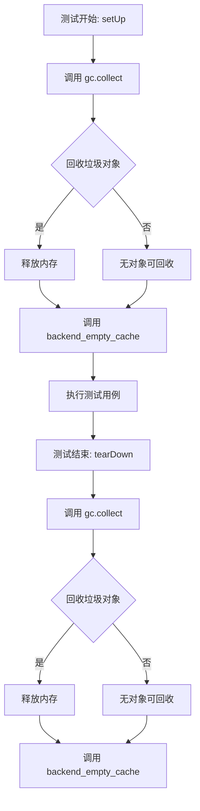

#### 带注释源码

```python
def setUp(self):
    # 在每个集成测试开始前清理 VRAM
    super().setUp()
    gc.collect()  # 手动触发 Python 垃圾回收，回收不可达对象
    backend_empty_cache(torch_device)  # 清理 GPU 显存缓存

def tearDown(self):
    # 在每个集成测试结束后清理 VRAM
    super().tearDown()
    gc.collect()  # 手动触发 Python 垃圾回收，释放测试过程中产生的临时对象
    backend_empty_cache(torch_device)  # 清理 GPU 显存缓存
```

#### 使用场景说明

在 `StableCascadePriorPipelineIntegrationTests` 类中，`gc.collect()` 被用于显存密集型的集成测试场景：

1. **测试前清理 (setUp)**：确保在运行测试前释放之前测试遗留的内存对象
2. **测试后清理 (tearDown)**：释放本次测试产生的临时对象，避免累积占用显存

这种模式在深度学习测试中很常见，因为模型推理会占用大量 GPU 显存。


### StableCascadePriorPipelineFastTests

这是 `StableCascadePriorPipeline` 的快速单元测试类，继承自 `unittest.TestCase`，用于验证 Wuerstchen prior 管道的基本功能、批处理推理、注意力切片和 LoRA 适配等特性。

参数：此为测试类，构造函数参数继承自 unittest.TestCase，默认参数为 self

返回值：此类本身为测试类，不直接返回值，主要通过断言验证功能

#### 流程图

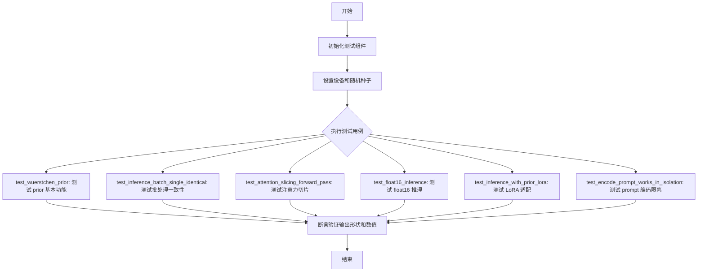

#### 带注释源码

```python
class StableCascadePriorPipelineFastTests(PipelineTesterMixin, unittest.TestCase):
    """
    StableCascadePriorPipeline 的快速单元测试类
    继承自 unittest.TestCase，用于验证管道的基本功能
    """
    pipeline_class = StableCascadePriorPipeline  # 被测试的管道类
    params = ["prompt"]  # 管道参数列表
    batch_params = ["prompt", "negative_prompt"]  # 批处理参数列表
    required_optional_params = [  # 可选的必需参数列表
        "num_images_per_prompt",
        "generator",
        "num_inference_steps",
        "latents",
        "negative_prompt",
        "guidance_scale",
        "output_type",
        "return_dict",
    ]
    test_xformers_attention = False  # 是否测试 xformers 注意力
    callback_cfg_params = ["text_encoder_hidden_states"]  # CFG 回调参数

    @property
    def text_embedder_hidden_size(self):
        """返回文本嵌入器的隐藏层大小"""
        return 32

    @property
    def time_input_dim(self):
        """返回时间输入维度"""
        return 32

    @property
    def block_out_channels_0(self):
        """返回第一个块输出通道数"""
        return self.time_input_dim

    @property
    def time_embed_dim(self):
        """返回时间嵌入维度"""
        return self.time_input_dim * 4

    @property
    def dummy_tokenizer(self):
        """创建并返回虚拟分词器"""
        tokenizer = CLIPTokenizer.from_pretrained("hf-internal-testing/tiny-random-clip")
        return tokenizer

    @property
    def dummy_text_encoder(self):
        """创建并返回虚拟文本编码器"""
        torch.manual_seed(0)
        config = CLIPTextConfig(
            bos_token_id=0,
            eos_token_id=2,
            hidden_size=self.text_embedder_hidden_size,
            projection_dim=self.text_embedder_hidden_size,
            intermediate_size=37,
            layer_norm_eps=1e-05,
            num_attention_heads=4,
            num_hidden_layers=5,
            pad_token_id=1,
            vocab_size=1000,
        )
        return CLIPTextModelWithProjection(config).eval()

    @property
    def dummy_prior(self):
        """创建并返回虚拟 Prior 模型"""
        torch.manual_seed(0)
        model_kwargs = {
            "conditioning_dim": 128,
            "block_out_channels": (128, 128),
            "num_attention_heads": (2, 2),
            "down_num_layers_per_block": (1, 1),
            "up_num_layers_per_block": (1, 1),
            "switch_level": (False,),
            "clip_image_in_channels": 768,
            "clip_text_in_channels": self.text_embedder_hidden_size,
            "clip_text_pooled_in_channels": self.text_embedder_hidden_size,
            "dropout": (0.1, 0.1),
        }
        model = StableCascadeUNet(**model_kwargs)
        return model.eval()

    def get_dummy_components(self):
        """获取虚拟管道组件字典"""
        prior = self.dummy_prior
        text_encoder = self.dummy_text_encoder
        tokenizer = self.dummy_tokenizer
        scheduler = DDPMWuerstchenScheduler()
        components = {
            "prior": prior,
            "text_encoder": text_encoder,
            "tokenizer": tokenizer,
            "scheduler": scheduler,
            "feature_extractor": None,
            "image_encoder": None,
        }
        return components

    def get_dummy_inputs(self, device, seed=0):
        """获取虚拟输入参数"""
        if str(device).startswith("mps"):
            generator = torch.manual_seed(seed)
        else:
            generator = torch.Generator(device=device).manual_seed(seed)
        inputs = {
            "prompt": "horse",
            "generator": generator,
            "guidance_scale": 4.0,
            "num_inference_steps": 2,
            "output_type": "np",
        }
        return inputs

    @pytest.mark.xfail(
        condition=is_transformers_version(">=", "4.57.1"),
        reason="Test fails with the latest transformers version",
        strict=False,
    )
    def test_wuerstchen_prior(self):
        """测试 Wuerstchen Prior 管道的基本推理功能"""
        device = "cpu"
        components = self.get_dummy_components()
        pipe = self.pipeline_class(**components)
        pipe = pipe.to(device)
        pipe.set_progress_bar_config(disable=None)
        output = pipe(**self.get_dummy_inputs(device))
        image = output.image_embeddings
        image_from_tuple = pipe(**self.get_dummy_inputs(device), return_dict=False)[0]
        image_slice = image[0, 0, 0, -10:]
        image_from_tuple_slice = image_from_tuple[0, 0, 0, -10:]
        assert image.shape == (1, 16, 24, 24)
        expected_slice = np.array(
            [94.5498, -21.9481, -117.5025, -192.8760, 38.0117, 73.4709, 38.1142, -185.5593, -47.7869, 167.2853]
        )
        assert np.abs(image_slice.flatten() - expected_slice).max() < 5e-2
        assert np.abs(image_from_tuple_slice.flatten() - expected_slice).max() < 5e-2

    @skip_mps
    def test_inference_batch_single_identical(self):
        """测试批处理推理与单样本推理结果一致性"""
        self._test_inference_batch_single_identical(expected_max_diff=2e-1)

    @skip_mps
    def test_attention_slicing_forward_pass(self):
        """测试注意力切片前向传播"""
        test_max_difference = torch_device == "cpu"
        test_mean_pixel_difference = False
        self._test_attention_slicing_forward_pass(
            test_max_difference=test_max_difference,
            test_mean_pixel_difference=test_mean_pixel_difference,
        )

    @unittest.skip(reason="fp16 not supported")
    def test_float16_inference(self):
        """测试 float16 推理功能（当前不支持）"""
        super().test_float16_inference()

    def check_if_lora_correctly_set(self, model) -> bool:
        """
        检查 LoRA 层是否正确设置
        参数:
            model: 要检查的模型
        返回:
            bool: LoRA 层是否正确设置
        """
        for module in model.modules():
            if isinstance(module, BaseTunerLayer):
                return True
        return False

    def get_lora_components(self):
        """获取 LoRA 组件配置"""
        prior = self.dummy_prior
        prior_lora_config = LoraConfig(
            r=4, lora_alpha=4, target_modules=["to_q", "to_k", "to_v", "to_out.0"], init_lora_weights=False
        )
        return prior, prior_lora_config

    @require_peft_backend
    @unittest.skip(reason="no lora support for now")
    def test_inference_with_prior_lora(self):
        """测试带 LoRA 的 prior 推理功能"""
        _, prior_lora_config = self.get_lora_components()
        device = "cpu"
        components = self.get_dummy_components()
        pipe = self.pipeline_class(**components)
        pipe = pipe.to(device)
        pipe.set_progress_bar_config(disable=None)
        output_no_lora = pipe(**self.get_dummy_inputs(device))
        image_embed = output_no_lora.image_embeddings
        self.assertTrue(image_embed.shape == (1, 16, 24, 24))
        pipe.prior.add_adapter(prior_lora_config)
        self.assertTrue(self.check_if_lora_correctly_set(pipe.prior), "Lora not correctly set in prior")
        output_lora = pipe(**self.get_dummy_inputs(device))
        lora_image_embed = output_lora.image_embeddings
        self.assertTrue(image_embed.shape == lora_image_embed.shape)

    @unittest.skip("Test not supported because dtype determination relies on text encoder.")
    def test_encode_prompt_works_in_isolation(self):
        """测试 prompt 编码的隔离性（当前不支持）"""
        pass
```

---

### StableCascadePriorPipelineIntegrationTests

这是 `StableCascadePriorPipeline` 的集成测试类，继承自 `unittest.TestCase`，使用真实预训练模型进行端到端测试，验证管道在实际场景下的图像嵌入生成能力。

参数：此为测试类，构造函数参数继承自 unittest.TestCase，默认参数为 self

返回值：此类本身为测试类，不直接返回值，主要通过断言验证功能

#### 流程图

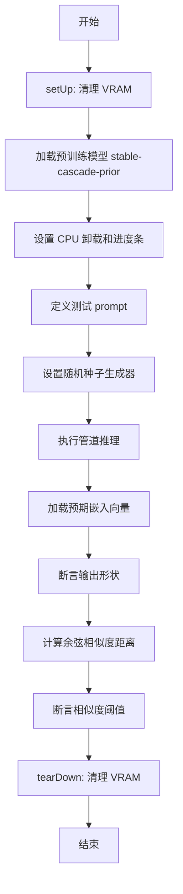

#### 带注释源码

```python
@slow
@require_torch_accelerator
class StableCascadePriorPipelineIntegrationTests(unittest.TestCase):
    """
    StableCascadePriorPipeline 的集成测试类
    使用真实预训练模型进行端到端测试
    """
    
    def setUp(self):
        """
        测试前准备函数
        在每个测试开始前清理 VRAM
        """
        # clean up the VRAM before each test
        super().setUp()
        gc.collect()
        backend_empty_cache(torch_device)

    def tearDown(self):
        """
        测试后清理函数
        在每个测试结束后清理 VRAM
        """
        # clean up the VRAM after each test
        super().tearDown()
        gc.collect()
        backend_empty_cache(torch_device)

    def test_stable_cascade_prior(self):
        """
        测试 StableCascade Prior 管道集成功能
        验证模型能够生成正确的图像嵌入
        """
        # 加载预训练管道，使用 bf16 变体
        pipe = StableCascadePriorPipeline.from_pretrained(
            "stabilityai/stable-cascade-prior", variant="bf16", torch_dtype=torch.bfloat16
        )
        # 启用模型 CPU 卸载
        pipe.enable_model_cpu_offload(device=torch_device)
        # 设置进度条配置
        pipe.set_progress_bar_config(disable=None)

        # 定义测试用的 prompt
        prompt = "A photograph of the inside of a subway train. There are raccoons sitting on the seats. One of them is reading a newspaper. The window shows the city in the background."

        # 创建随机种子生成器
        generator = torch.Generator(device="cpu").manual_seed(0)

        # 执行管道推理
        output = pipe(prompt, num_inference_steps=2, output_type="np", generator=generator)
        image_embedding = output.image_embeddings
        
        # 加载预期的图像嵌入向量
        expected_image_embedding = load_numpy(
            "https://huggingface.co/datasets/hf-internal-testing/diffusers-images/resolve/main/stable_cascade/stable_cascade_prior_image_embeddings.npy"
        )
        
        # 断言输出形状正确
        assert image_embedding.shape == (1, 16, 24, 24)

        # 计算余弦相似度距离
        max_diff = numpy_cosine_similarity_distance(image_embedding.flatten(), expected_image_embedding.flatten())
        # 断言相似度距离小于阈值
        assert max_diff < 1e-4
```

---

### get_dummy_components

该方法属于 `StableCascadePriorPipelineFastTests` 类，用于构建虚拟管道组件字典，包含虚拟 Prior 模型、文本编码器、分词器和调度器。

参数：
- `self`：隐式参数，测试类实例

返回值：`dict`，包含管道所有组件的字典

#### 流程图

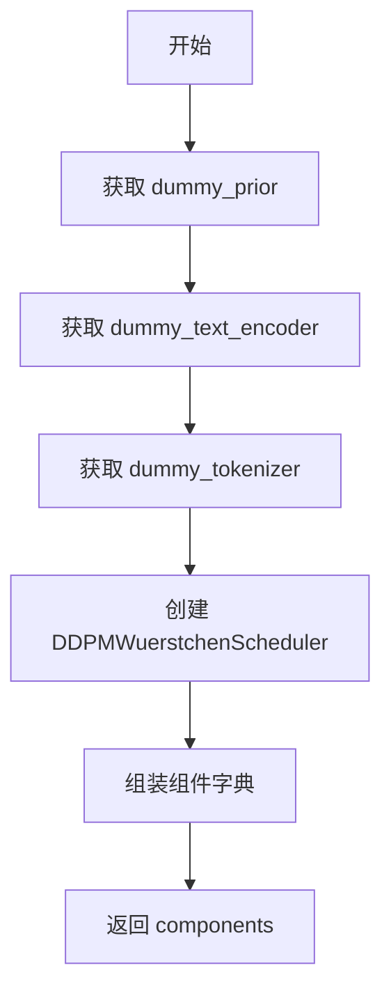

#### 带注释源码

```python
def get_dummy_components(self):
    """获取虚拟管道组件字典"""
    prior = self.dummy_prior  # 获取虚拟 Prior 模型
    text_encoder = self.dummy_text_encoder  # 获取虚拟文本编码器
    tokenizer = self.dummy_tokenizer  # 获取虚拟分词器

    scheduler = DDPMWuerstchenScheduler()  # 创建调度器

    # 组装组件字典
    components = {
        "prior": prior,
        "text_encoder": text_encoder,
        "tokenizer": tokenizer,
        "scheduler": scheduler,
        "feature_extractor": None,
        "image_encoder": None,
    }

    return components  # 返回组件字典
```

---

### get_dummy_inputs

该方法属于 `StableCascadePriorPipelineFastTests` 类，用于生成虚拟输入参数，包含 prompt、生成器、引导尺度和推理步数等。

参数：
- `self`：隐式参数，测试类实例
- `device`：`str`，目标设备（如 "cpu", "cuda"）
- `seed`：`int`，随机种子，默认值为 0

返回值：`dict`，包含管道输入参数的字典

#### 流程图

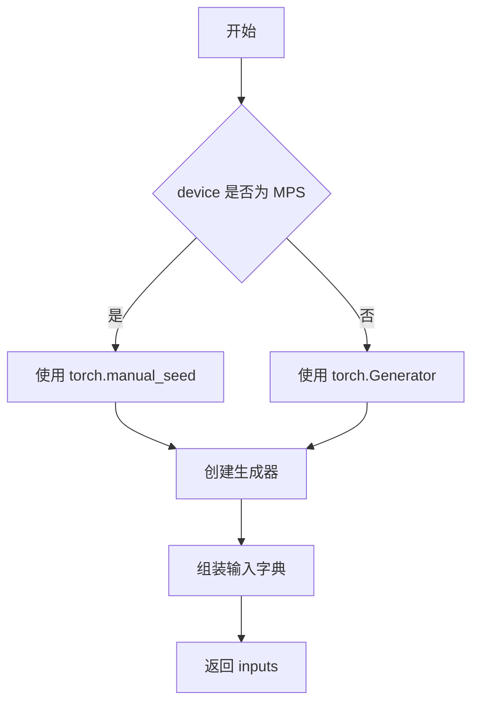

#### 带注释源码

```python
def get_dummy_inputs(self, device, seed=0):
    """获取虚拟输入参数"""
    # 处理 MPS 设备特殊情况
    if str(device).startswith("mps"):
        generator = torch.manual_seed(seed)  # MPS 设备使用简单随机种子
    else:
        # 其他设备使用 Generator 对象
        generator = torch.Generator(device=device).manual_seed(seed)
    
    # 组装输入参数字典
    inputs = {
        "prompt": "horse",  # 测试用 prompt
        "generator": generator,  # 随机生成器
        "guidance_scale": 4.0,  # 引导尺度
        "num_inference_steps": 2,  # 推理步数
        "output_type": "np",  # 输出类型为 numpy
    }
    return inputs  # 返回输入字典
```

---

### check_if_lora_correctly_set

该方法属于 `StableCascadePriorPipelineFastTests` 类，用于检查模型中是否正确设置了 LoRA 层。

参数：
- `self`：隐式参数，测试类实例
- `model`：`torch.nn.Module`，要检查的模型

返回值：`bool`，如果 LoRA 层正确设置返回 True，否则返回 False

#### 流程图

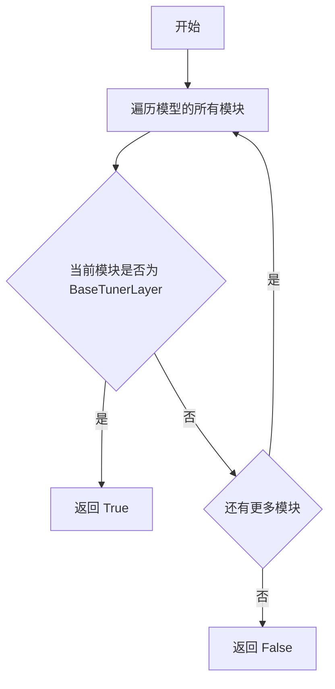

#### 带注释源码

```python
def check_if_lora_correctly_set(self, model) -> bool:
    """
    检查 LoRA 层是否正确设置
    参数:
        model: 要检查的模型
    返回:
        bool: LoRA 层是否正确设置
    """
    # 遍历模型的所有模块
    for module in model.modules():
        # 检查模块是否为 BaseTunerLayer 类型（LoRA 层基类）
        if isinstance(module, BaseTunerLayer):
            return True  # 找到 LoRA 层，返回 True
    return False  # 未找到 LoRA 层，返回 False
```

---

### setUp

该方法属于 `StableCascadePriorPipelineIntegrationTests` 类，作为测试fixture，在每个测试方法执行前进行初始化准备，清理 GPU 内存。

参数：
- `self`：隐式参数，测试类实例

返回值：无返回值

#### 流程图

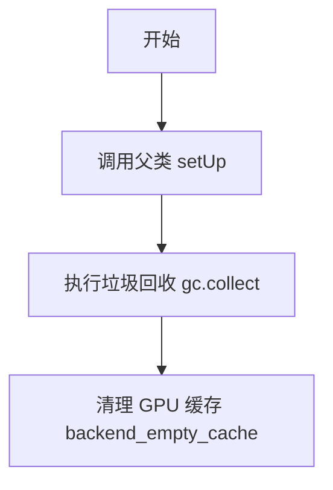

#### 带注释源码

```python
def setUp(self):
    """
    测试前准备函数
    在每个测试开始前清理 VRAM
    """
    # clean up the VRAM before each test
    super().setUp()  # 调用父类的 setUp 方法
    gc.collect()  # 执行 Python 垃圾回收
    backend_empty_cache(torch_device)  # 清理 GPU 缓存
```

---

### tearDown

该方法属于 `StableCascadePriorPipelineIntegrationTests` 类，作为测试fixture，在每个测试方法执行后进行清理工作，释放 GPU 内存。

参数：
- `self`：隐式参数，测试类实例

返回值：无返回值

#### 流程图

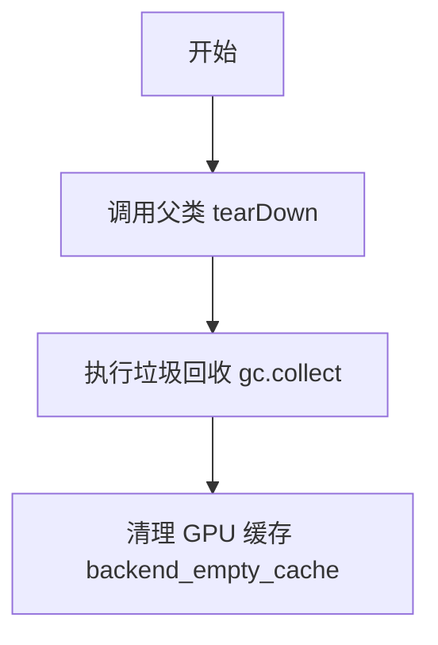

#### 带注释源码

```python
def tearDown(self):
    """
    测试后清理函数
    在每个测试结束后清理 VRAM
    """
    # clean up the VRAM after each test
    super().tearDown()  # 调用父类的 tearDown 方法
    gc.collect()  # 执行 Python 垃圾回收
    backend_empty_cache(torch_device)  # 清理 GPU 缓存
```

---

### test_stable_cascade_prior

该方法属于 `StableCascadePriorPipelineIntegrationTests` 类，是集成测试的核心方法，验证完整预训练模型能够生成符合预期的图像嵌入向量。

参数：
- `self`：隐式参数，测试类实例

返回值：无返回值，主要通过断言验证

#### 流程图

```mermaid
flowchart TD
    A[开始] --> B[加载预训练管道]
    B --> C[启用 CPU 卸载]
    C --> D[配置进度条]
    D --> E[创建测试 prompt]
    E --> F[创建随机生成器]
    F --> G[执行管道推理]
    G --> H[加载预期嵌入]
    H --> I[断言形状: (1, 16, 24, 24)]
    I --> J[计算余弦相似度]
    J --> K{max_diff < 1e-4}
    K -->|是| L[测试通过]
    K -->|否| M[断言失败]
```

#### 带注释源码

```python
def test_stable_cascade_prior(self):
    """测试 StableCascade Prior 管道集成功能"""
    # 从预训练模型加载管道，使用 bf16 变体
    pipe = StableCascadePriorPipeline.from_pretrained(
        "stabilityai/stable-cascade-prior", variant="bf16", torch_dtype=torch.bfloat16
    )
    # 启用模型 CPU 卸载以节省 GPU 显存
    pipe.enable_model_cpu_offload(device=torch_device)
    # 配置进度条（禁用）
    pipe.set_progress_bar_config(disable=None)

    # 定义详细的测试 prompt
    prompt = "A photograph of the inside of a subway train. There are raccoons sitting on the seats. One of them is reading a newspaper. The window shows the city in the background."

    # 创建随机种子生成器以确保可复现性
    generator = torch.Generator(device="cpu").manual_seed(0)

    # 执行管道推理
    output = pipe(prompt, num_inference_steps=2, output_type="np", generator=generator)
    # 提取图像嵌入
    image_embedding = output.image_embeddings
    
    # 从 HuggingFace 数据集加载预期嵌入向量
    expected_image_embedding = load_numpy(
        "https://huggingface.co/datasets/hf-internal-testing/diffusers-images/resolve/main/stable_cascade/stable_cascade_prior_image_embeddings.npy"
    )
    
    # 断言输出形状符合预期
    assert image_embedding.shape == (1, 16, 24, 24)

    # 计算生成嵌入与预期嵌入的余弦相似度距离
    max_diff = numpy_cosine_similarity_distance(image_embedding.flatten(), expected_image_embedding.flatten())
    # 断言相似度距离在允许范围内
    assert max_diff < 1e-4
```


根据您的要求，我将从代码中提取与numpy相关的函数或方法。代码中使用了numpy库的两个主要函数：`np.array` 和 `np.abs`。考虑到任务要求，我将为您详细文档化 `np.array` 函数，该函数在代码中用于创建预期输出的数组。

### `np.array`

该函数是numpy库的核心函数之一，用于将Python列表或其他类似结构转换为numpy数组。在代码中，它被用来定义测试中的预期输出切片，以便与实际输出进行比较。

**参数：**

- `object`：`list`，要转换为数组的Python列表。代码中传入的是一个包含10个浮点数的列表 `[94.5498, -21.9481, -117.5025, -192.8760, 38.0117, 73.4709, 38.1142, -185.5593, -47.7869, 167.2853]`。
- `dtype`（可选）：`numpy.dtype`，指定数组的数据类型。代码中未显式指定，使用默认类型。
- `copy`（可选）：`bool`，是否复制数据。代码中未使用。

**返回值：** `numpy.ndarray`，转换后的numpy数组对象。

#### 流程图

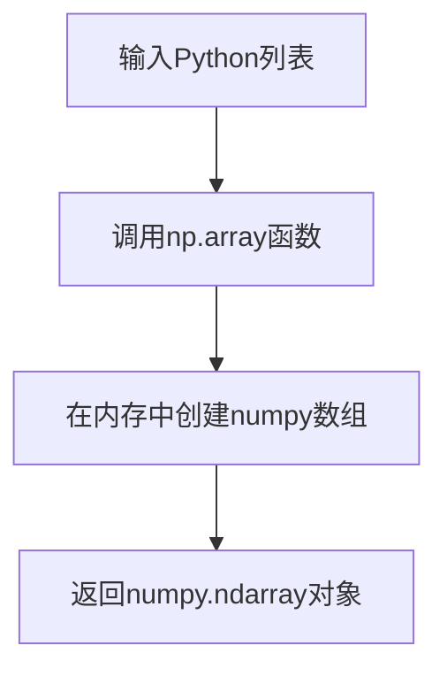

#### 带注释源码

```python
# 导入numpy库（代码中已导入为np）
import numpy as np

# 在test_wuerstchen_prior方法中，定义预期输出的数组切片
expected_slice = np.array(
    [94.5498, -21.9481, -117.5025, -192.8760, 38.0117, 73.4709, 38.1142, -185.5593, -47.7869, 167.2853]
)
# 上述代码将一个Python列表转换为numpy数组，以便后续与实际图像嵌入进行数值比较。
```

此外，代码中还使用了 `np.abs` 函数进行误差计算：

### `np.abs`

**参数：**

- `x`：`numpy.ndarray` 或 `scalar`，输入数组或数值。

**返回值：** `numpy.ndarray` 或 `scalar`，返回绝对值。

#### 带注释源码

```python
# 在test_wuerstchen_prior方法中，使用np.abs计算实际输出与预期输出的绝对误差
assert np.abs(image_slice.flatten() - expected_slice).max() < 5e-2
# image_slice是实际输出的切片，expected_slice是预期输出，两者相减后取绝对值，然后求最大值，最后与阈值5e-2进行比较。
```

这两个函数在代码中主要用于验证StableCascadePriorPipeline的输出是否符合预期，确保模型推理的正确性。


### `test_wuerstchen_prior`

该方法是一个使用 pytest 标记的单元测试，用于验证 StableCascadePriorPipeline 在处理文本提示生成图像嵌入（image_embeddings）时的核心功能。测试创建虚拟组件，构建管道，执行推理，并验证输出图像嵌入的形状和数值是否符合预期。

参数：

- `self`：隐式参数，StableCascadePriorPipelineFastTests 实例本身，无需显式传递

返回值：无明确返回值（测试方法通过 assert 断言进行验证）

#### 流程图

```mermaid
flowchart TD
    A[开始测试 test_wuerstchen_prior] --> B[设置设备为 CPU]
    B --> C[获取虚拟组件: get_dummy_components]
    C --> D[实例化管道: StableCascadePriorPipeline]
    D --> E[将管道移至 CPU 设备]
    E --> F[设置进度条配置]
    F --> G[执行推理: pipe&#40;prompt, num_inference_steps=2&#41;]
    G --> H[获取图像嵌入: output.image_embeddings]
    H --> I[使用 return_dict=False 再次执行推理]
    I --> J[提取图像切片用于验证]
    J --> K[断言图像形状为 &#40;1, 16, 24, 24&#41;]
    K --> L[定义预期数值切片]
    L --> M{验证图像嵌入数值}
    M -->|通过| N[测试通过]
    M -->|失败| O[抛出 AssertionError]
```

#### 带注释源码

```python
@pytest.mark.xfail(
    condition=is_transformers_version(">=", "4.57.1"),
    reason="Test fails with the latest transformers version",
    strict=False,
)
def test_wuerstchen_prior(self):
    """
    测试 Wuerstchen Prior 管道的基本功能
    - 创建虚拟组件（prior, text_encoder, tokenizer, scheduler）
    - 实例化 StableCascadePriorPipeline
    - 执行推理生成图像嵌入
    - 验证输出形状和数值正确性
    """
    device = "cpu"

    # 获取虚拟组件，用于测试的模拟模型组件
    components = self.get_dummy_components()

    # 使用虚拟组件实例化管道
    pipe = self.pipeline_class(**components)
    pipe = pipe.to(device)

    # 配置进度条（disable=None 表示不禁用）
    pipe.set_progress_bar_config(disable=None)

    # 第一次推理：使用 return_dict=True（默认）
    output = pipe(**self.get_dummy_inputs(device))
    image = output.image_embeddings

    # 第二次推理：使用 return_dict=False，获取元组第一个元素
    image_from_tuple = pipe(**self.get_dummy_inputs(device), return_dict=False)[0]

    # 提取图像张量的切片用于数值验证
    # 取第一个样本的第一个通道的左上角 10 个像素值
    image_slice = image[0, 0, 0, -10:]

    image_from_tuple_slice = image_from_tuple[0, 0, 0, -10:]

    # 验证输出图像嵌入的形状
    # 预期形状: (batch_size=1, channels=16, height=24, width=24)
    assert image.shape == (1, 16, 24, 24)

    # 定义预期的数值切片（用于比对）
    expected_slice = np.array(
        [94.5498, -21.9481, -117.5025, -192.8760, 38.0117, 73.4709, 38.1142, -185.5593, -47.7869, 167.2853]
    )

    # 验证 return_dict=True 的输出数值
    # 使用最大绝对误差进行验证，容差为 5e-2
    assert np.abs(image_slice.flatten() - expected_slice).max() < 5e-2

    # 验证 return_dict=False 的输出数值
    assert np.abs(image_from_tuple_slice.flatten() - expected_slice).max() < 5e-2
```


### `torch`

这是PyTorch深度学习框架的核心模块导入，为代码提供张量运算、神经网络构建、设备管理和随机种子控制等底层能力。

参数：无（模块导入）

返回值：`torch` 模块对象，PyTorch深度学习框架的核心接口

#### 流程图

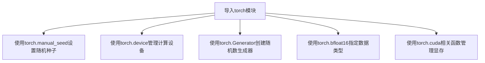

#### 带注释源码

```python
# 导入PyTorch深度学习框架
import torch

# 在代码中的实际使用示例：

# 1. 设置随机种子确保可重复性
torch.manual_seed(0)  # 为CPU设置随机种子，用于复现实验结果

# 2. 创建设备对象
device = torch.device("cpu")  # 创建CPU设备对象
device = torch.device("cuda")  # 创建CUDA设备对象

# 3. 创建随机数生成器
generator = torch.Generator(device=device).manual_seed(seed)  # 创建指定设备的随机生成器

# 4. 指定数据类型
torch.bfloat16  # Brain Floating Point 16位精度，用于减少显存占用

# 5. 显存管理（通过backend_empty_cache调用）
# torch.cuda.empty_cache()  # 清理CUDA缓存释放显存
```

---

### `torch.device`

用于指定计算设备（CPU/CUDA/MPS）的类，支持字符串和设备索引创建。

参数：
- `device`：`str`，设备字符串，如"cpu"、"cuda"、"cuda:0"、"mps"等

返回值：`torch.device`，设备对象，用于指定张量和模型运行位置

#### 流程图

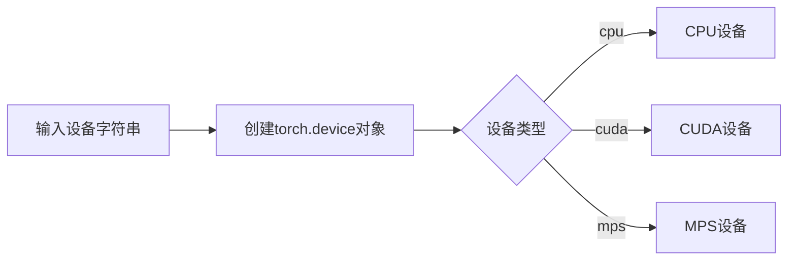

#### 带注释源码

```python
# 创建设备对象的多种方式
device = torch.device("cpu")           # CPU设备
device = torch.device("cuda")          # 默认CUDA设备
device = torch.device("cuda:0")         # 第0个CUDA设备
device = torch.device("mps")           # Apple MPS设备

# 在代码中的实际使用（来自get_dummy_inputs方法）
if str(device).startswith("mps"):
    generator = torch.manual_seed(seed)
else:
    generator = torch.Generator(device=device).manual_seed(seed)
```

---

### `torch.manual_seed`

设置CPU随机种子，确保PyTorch操作的随机性可复现。

参数：
- `seed`：`int`，随机种子值

返回值：无

#### 流程图

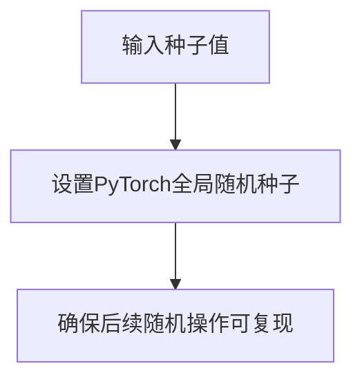

#### 带注释源码

```python
# 在代码中的实际使用示例
torch.manual_seed(0)  # 设置种子为0，确保模型初始化可复现

# 用于模型初始化
torch.manual_seed(0)
config = CLIPTextConfig(...)  # 创建配置
model = CLIPTextModelWithProjection(config).eval()  # 创建模型

# 用于prior模型初始化
torch.manual_seed(0)
model = StableCascadeUNet(**model_kwargs)
```

---

### `torch.Generator`

创建随机数生成器对象，用于管理随机状态，支持在特定设备上生成随机数。

参数：
- `device`：`torch.device`，生成器所在的设备（可选）

返回值：`torch.Generator`，随机数生成器对象

#### 流程图

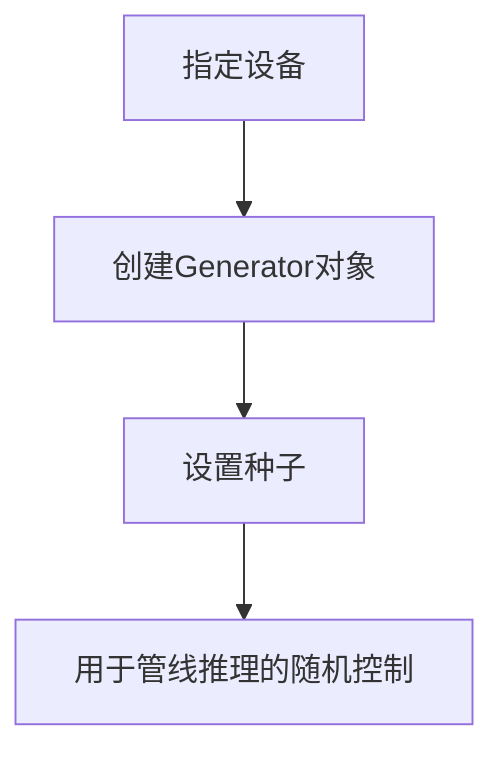

#### 带注释源码

```python
# 在代码中的实际使用（来自get_dummy_inputs方法）
if str(device).startswith("mps"):
    generator = torch.manual_seed(seed)  # MPS设备使用简单方式
else:
    generator = torch.Generator(device=device).manual_seed(seed)  # 创建带种子的生成器

# 在集成测试中的使用
generator = torch.Generator(device="cpu").manual_seed(0)  # 创建CPU生成器并设置种子
output = pipe(prompt, num_inference_steps=2, output_type="np", generator=generator)
```

---

### `torch.bfloat16`

Brain Float 16数据类型，用于减少模型内存占用和加速计算，适用于支持CUDA的GPU。

参数：无（作为类型使用）

返回值：`torch.dtype`，bfloat16数据类型对象

#### 流程图

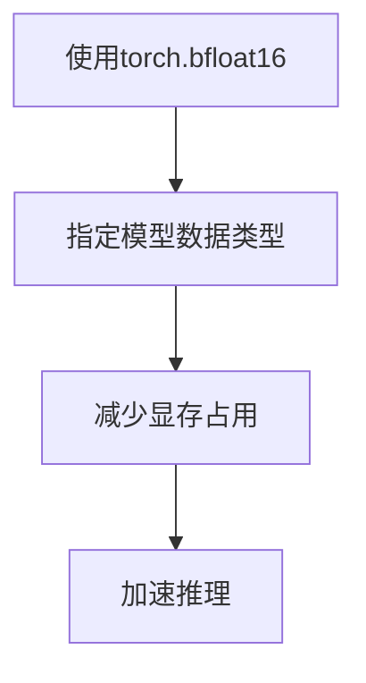

#### 带注释源码

```python
# 在代码中的实际使用（来自集成测试）
pipe = StableCascadePriorPipeline.from_pretrained(
    "stabilityai/stable-cascade-prior", 
    variant="bf16", 
    torch_dtype=torch.bfloat16  # 指定模型使用bfloat16精度
)
pipe.enable_model_cpu_offload(device=torch_device)
```

---

### `torch.cuda.empty_cache`

清理CUDA缓存释放显存，由`backend_empty_cache`函数调用。

参数：无

返回值：无

#### 流程图

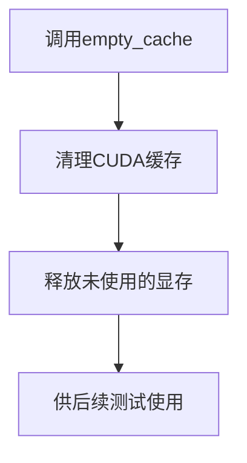

#### 带注释源码

```python
# 在代码中的实际使用（通过testing_utils的backend_empty_cache）
# 来自setUp和tearDown方法
def setUp(self):
    gc.collect()
    backend_empty_cache(torch_device)  # 清理显存

def tearDown(self):
    gc.collect()
    backend_empty_cache(torch_device)  # 清理显存

# backend_empty_cache内部实现（简化）
# def backend_empty_cache(device):
#     if device.startswith("cuda"):
#         torch.cuda.empty_cache()
```


### `CLIPTextConfig`

CLIPTextConfig 是从 transformers 库导入的 CLIP 文本配置类，用于定义 CLIP 文本编码器的模型架构参数。在本代码中，它被用于配置 `dummy_text_encoder` 属性方法中创建的 CLIPTextModelWithProjection 模型。

参数：

- `bos_token_id`：`int`，beginning of sequence（序列起始）标记的 ID
- `eos_token_id`：`int`，end of sequence（序列结束）标记的 ID
- `hidden_size`：`int`，隐藏层的维度大小
- `projection_dim`：`int`，投影层的输出维度
- `intermediate_size`：`int`，前馈网络中中间层的维度
- `layer_norm_eps`：`float`，层归一化的 epsilon 值，用于数值稳定性
- `num_attention_heads`：`int`，注意力机制中头的数量
- `num_hidden_layers`：`int`，Transformer 编码器的隐藏层数量
- `pad_token_id`：`int`，padding（填充）标记的 ID
- `vocab_size`：`int`，词汇表的大小

返回值：`CLIPTextConfig`，返回配置对象，用于初始化 CLIPTextModelWithProjection 模型

#### 流程图

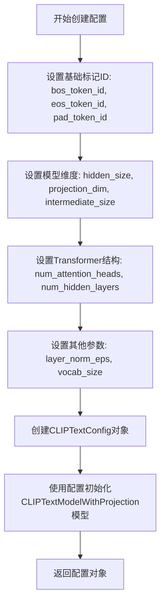

#### 带注释源码

```python
# 在 dummy_text_encoder 属性方法中使用 CLIPTextConfig
@property
def dummy_text_encoder(self):
    torch.manual_seed(0)
    # 创建 CLIPTextConfig 配置对象，定义文本编码器的架构参数
    config = CLIPTextConfig(
        bos_token_id=0,           # 序列起始标记 ID
        eos_token_id=2,           # 序列结束标记 ID
        hidden_size=self.text_embedder_hidden_size,  # 隐藏层大小 (32)
        projection_dim=self.text_embedder_hidden_size,  # 投影维度 (32)
        intermediate_size=37,     # 前馈网络中间层维度
        layer_norm_eps=1e-05,     # 层归一化 epsilon
        num_attention_heads=4,    # 注意力头数量
        num_hidden_layers=5,      # 隐藏层数量
        pad_token_id=1,           # padding 标记 ID
        vocab_size=1000,          # 词汇表大小
    )
    # 使用配置初始化 CLIPTextModelWithProjection 模型并设置为评估模式
    return CLIPTextModelWithProjection(config).eval()
```


### CLIPTextModelWithProjection

CLIPTextModelWithProjection 是从 Hugging Face Transformers 库导入的文本编码模型，用于将文本输入转换为带有投影维度的文本嵌入表示。在本代码中，该模型被用作 StableCascadePriorPipeline 的文本编码组件，通过配置参数实例化并用于生成文本的向量表示。

参数：

- `config`：`CLIPTextConfig`，模型配置对象，包含模型的结构参数（如 hidden_size、projection_dim、num_hidden_layers 等）

返回值：`CLIPTextModelWithProjection`，返回配置好的 CLIP 文本模型实例（带投影层）

#### 流程图

```mermaid
flowchart TD
    A[创建 CLIPTextConfig] --> B[实例化 CLIPTextModelWithProjection]
    B --> C[设置模型为评估模式 .eval()]
    C --> D[返回文本编码器实例]
    
    subgraph CLIPTextConfig参数
    A1[bos_token_id: 0]
    A2[eos_token_id: 2]
    A3[hidden_size: 32]
    A4[projection_dim: 32]
    A5[intermediate_size: 37]
    A6[layer_norm_eps: 1e-05]
    A7[num_attention_heads: 4]
    A8[num_hidden_layers: 5]
    A9[pad_token_id: 1]
    A10[vocab_size: 1000]
    end
    
    A --> A1
    A --> A2
    A --> A3
    A --> A4
    A --> A5
    A --> A6
    A --> A7
    A --> A8
    A --> A9
    A --> A10
```

#### 带注释源码

```python
@property
def dummy_text_encoder(self):
    """
    创建虚拟文本编码器用于测试
    使用固定的随机种子确保测试可复现
    """
    # 设置随机种子为0，确保测试结果的一致性
    torch.manual_seed(0)
    
    # 创建 CLIP 文本配置对象
    # 定义模型的结构和超参数
    config = CLIPTextConfig(
        bos_token_id=0,           # 句子起始 token ID
        eos_token_id=2,           # 句子结束 token ID
        hidden_size=32,           # 隐藏层维度（与 text_embedder_hidden_size 一致）
        projection_dim=32,        # 投影维度（用于生成投影后的嵌入向量）
        intermediate_size=37,     # FFN 中间层维度
        layer_norm_eps=1e-05,     # LayerNorm 的 epsilon 值
        num_attention_heads=4,    # 注意力头数量
        num_hidden_layers=5,     # 隐藏层数量
        pad_token_id=1,           # 填充 token ID
        vocab_size=1000,          # 词汇表大小
    )
    
    # 使用配置创建 CLIPTextModelWithProjection 实例
    # 该模型会返回带有投影的文本嵌入（text_embeds 和 pooled_output）
    return CLIPTextModelWithProjection(config).eval()
    # .eval() 将模型设置为评估模式，禁用 dropout 等训练特定的行为
```


### `CLIPTokenizer.from_pretrained`

该函数是HuggingFace Transformers库中CLIPTokenizer类的类方法，用于从预训练模型加载CLIP分词器（Tokenizer），将文本转换为模型可处理的token序列。

参数：

- `pretrained_model_name_or_path`：`str`，预训练模型名称或本地路径，此处传入`"hf-internal-testing/tiny-random-clip"`

返回值：`CLIPTokenizer`，返回加载后的CLIP分词器实例，可用于对文本进行编码（encode）或分词（tokenize）

#### 流程图

```mermaid
graph TD
    A[开始调用 CLIPTokenizer.from_pretrained] --> B{检查本地缓存}
    B -->|存在| C[从本地缓存加载]
    B -->|不存在| D[从 HuggingFace Hub 下载]
    C --> E[返回 CLIPTokenizer 实例]
    D --> E
    E --> F[结束]
    
    style A fill:#f9f,stroke:#333
    style E fill:#9f9,stroke:#333
```

#### 带注释源码

```python
@property
def dummy_tokenizer(self):
    """
    创建并返回一个用于测试的CLIP分词器实例
    
    该方法通过from_pretrained类方法从预训练模型加载分词器。
    使用的模型是 HuggingFace 测试专用的微小随机 CLIP 模型。
    """
    # 使用 from_pretrained 加载预训练的分词器
    # 参数: "hf-internal-testing/tiny-random-clip" 是预训练模型名称
    # 该模型是一个用于测试的虚拟模型，包含随机初始化的词汇表
    tokenizer = CLIPTokenizer.from_pretrained("hf-internal-testing/tiny-random-clip")
    
    # 返回加载后的分词器实例
    return tokenizer
```

**在组件构建中的使用：**

```python
def get_dummy_components(self):
    """
    获取测试所需的全部组件
    
    返回包含 prior、text_encoder、tokenizer、scheduler 等组件的字典
    """
    # 获取分词器实例
    tokenizer = self.dummy_tokenizer
    
    # 构建组件字典，分词器作为关键组件之一
    components = {
        "prior": prior,
        "text_encoder": text_encoder,
        "tokenizer": tokenizer,  # CLIP分词器用于将文本转换为token
        "scheduler": scheduler,
        "feature_extractor": None,
        "image_encoder": None,
    }
    
    return components
```

---

### 补充信息

**关键组件：**

| 组件名称 | 描述 |
|---------|------|
| `CLIPTokenizer` | 用于将文本字符串转换为token ID序列 |
| `StableCascadePriorPipeline` | 整个测试的管道类，用于生成图像embedding |
| `dummy_tokenizer` | 属性方法，创建测试用分词器 |

**技术债务/优化空间：**

1. 硬编码的预训练模型名称 `"hf-internal-testing/tiny-random-clip"` - 可考虑提取为配置常量
2. 分词器在测试中作为mock使用，未充分验证其功能边界
3. 缺少对分词器不同vocab_size的兼容性测试

**设计约束：**

- 分词器需要与`text_encoder`的词汇表大小匹配（此例中vocab_size=1000）
- 必须支持batch处理以满足pipeline的batch参数需求


### `DDPMWuerstchenScheduler`

DDPMWuerstchenScheduler 是一个扩散模型调度器，用于 Stable Cascade Prior 管道中的噪声调度和去噪过程控制。它实现了 DDPM（Denoising Diffusion Probabilistic Models）算法的调度逻辑，管理噪声水平并计算每一步的去噪参数。

参数：

- 无（构造函数无显式参数）

返回值：`DDPMWuerstchenScheduler` 实例，返回新创建的调度器对象

#### 流程图

```mermaid
graph TD
    A[创建调度器实例] --> B[初始化噪声调度参数]
    B --> C[设置时间步长]
    C --> D[准备调度器状态]
    D --> E[管道调用调度器]
    
    F[set_timesteps] -->|更新| G[时间步长数组]
    G --> H[计算噪声权重]
    
    I[step] --> J[获取当前时间步]
    J --> K[计算去噪参数]
    K --> L[更新模型输出]
    L --> M[返回下一步状态]
    
    E -.->|使用| F
    F -.->|执行| I
```

#### 带注释源码

```python
# 在测试文件中的使用方式 - get_dummy_components 方法
scheduler = DDPMWuerstchenScheduler()

# 调度器作为组件被传入管道
components = {
    "prior": prior,
    "text_encoder": text_encoder,
    "tokenizer": tokenizer,
    "scheduler": scheduler,  # DDPMWuerstchenScheduler 实例
    "feature_extractor": None,
    "image_encoder": None,
}

# 管道初始化时接收调度器
pipe = self.pipeline_class(**components)

# 管道运行时会调用调度器进行噪声调度
output = pipe(
    prompt="horse",
    generator=generator,
    guidance_scale=4.0,
    num_inference_steps=2,  # 推理步数，由调度器控制
    output_type="np",
)
```

#### 调度器接口规范（推断）

基于在 StableCascadePriorPipeline 中的使用方式，DDPMWuerstchenScheduler 应具备以下接口：

| 方法/属性 | 类型 | 描述 |
|-----------|------|------|
| `set_timesteps(num_steps)` | 方法 | 设置去噪过程的时间步数 |
| `step(model_output, timestep, sample)` | 方法 | 执行单步去噪计算 |
| `add_noise(sample, noise, timesteps)` | 方法 | 向样本添加噪声 |
| `config` | 属性 | 调度器配置参数 |
| `timesteps` | 属性 | 当前时间步数组 |
| `sigma` | 属性 | 当前噪声水平 |

#### 关键集成点

1. **与管道集成**：调度器在 `StableCascadePriorPipeline.__init__` 中接收，并在推理过程中通过 `self.scheduler.step()` 调用
2. **时间步控制**：`num_inference_steps` 参数控制去噪步数，由调度器转换为内部时间步表示
3. **噪声管理**：调度器负责计算每个时间步的噪声比例和去噪参数


### StableCascadePriorPipeline

`StableCascadePriorPipeline`是Hugging Face Diffusers库中的稳定级联先验管道，用于根据文本提示生成图像的先验嵌入表示（image embeddings）。该管道是Stable Cascade模型的核心组件之一，接收文本提示并通过CLIP文本编码器和UNet先验模型生成用于后续图像解码的潜在表示。

参数：

- `prompt`：`str`，要生成的文本提示
- `negative_prompt`：`str`，可选的负面提示，用于引导模型避免生成相关内容
- `num_images_per_prompt`：`int`，可选，每个提示生成的图像数量
- `generator`：`torch.Generator`，可选，用于控制随机性的生成器
- `num_inference_steps`：`int`，可选，推理步骤数，影响生成质量
- `latents`：`torch.Tensor`，可选，用于初始化潜在变量的张量
- `guidance_scale`：`float`，可选，CFG引导比例，控制文本提示的影响程度
- `output_type`：`str`，可选，输出类型（如"np"表示numpy数组）
- `return_dict`：`bool`，可选，是否返回字典格式的结果

返回值：`StableCascadePriorPipelineOutput`，包含生成的图像嵌入（image_embeddings）

#### 流程图

```mermaid
flowchart TD
    A[开始] --> B[加载模型组件]
    B --> C{调用管道}
    C --> D[使用Tokenizer编码prompt]
    D --> E[使用Text Encoder生成文本嵌入]
    E --> F[使用Prior UNet进行去噪]
    F --> G[调度器更新]
    G --> H{是否完成推理}
    H -->|否| F
    H -->|是| I[输出image_embeddings]
    I --> J[结束]
```

#### 带注释源码

```python
# 从diffusers库导入StableCascadePriorPipeline
from diffusers import StableCascadePriorPipeline

# 示例1：使用虚拟组件进行测试
# 构造虚拟组件（用于测试）
prior = self.dummy_prior  # StableCascadeUNet先验模型
text_encoder = self.dummy_text_encoder  # CLIPTextModelWithProjection文本编码器
tokenizer = self.dummy_tokenizer  # CLIPTokenizer分词器
scheduler = DDPMWuerstchenScheduler()  # DDPM调度器

components = {
    "prior": prior,
    "text_encoder": text_encoder,
    "tokenizer": tokenizer,
    "scheduler": scheduler,
    "feature_extractor": None,  # 特征提取器（可选）
    "image_encoder": None,  # 图像编码器（可选）
}

# 初始化管道并移动到设备
pipe = StableCascadePriorPipeline(**components)
pipe = pipe.to(device)

# 准备输入参数
inputs = {
    "prompt": "horse",  # 文本提示
    "generator": torch.Generator(device=device).manual_seed(0),  # 随机生成器
    "guidance_scale": 4.0,  # 引导比例
    "num_inference_steps": 2,  # 推理步骤数
    "output_type": "np",  # 输出为numpy数组
}

# 执行推理
output = pipe(**inputs)
image_embeddings = output.image_embeddings  # 获取图像嵌入

# 示例2：从预训练模型加载（集成测试）
pipe = StableCascadePriorPipeline.from_pretrained(
    "stabilityai/stable-cascade-prior",  # 模型路径
    variant="bf16",  # 模型变体
    torch_dtype=torch.bfloat16  # 数据类型
)
pipe.enable_model_cpu_offload(device=torch_device)  # 启用CPU卸载

# 推理
prompt = "A photograph of the inside of a subway train..."
generator = torch.Generator(device="cpu").manual_seed(0)

output = pipe(
    prompt,
    num_inference_steps=2,
    output_type="np",
    generator=generator
)
image_embedding = output.image_embeddings
```


### StableCascadeUNet

StableCascadeUNet 是稳定级联（Stable Cascade）模型的核心UNet组件，负责根据文本和图像条件生成图像嵌入（latent embeddings）。该类通常包含编码器、解码器、注意力机制等模块，用于处理多模态条件输入并输出精炼的潜在表示。

参数：

- `conditioning_dim`：`int`，条件嵌入的维度大小，控制模型处理条件的复杂度
- `block_out_channels`：`Tuple[int, ...]`，UNet各阶段的输出通道数列表，决定特征图的宽度
- `num_attention_heads`：`Tuple[int, ...]`，各阶段注意力头的数量，影响自注意力机制的并行计算
- `down_num_layers_per_block`：`Tuple[int, ...]`，每阶段下采样块的层数，控制编码器深度
- `up_num_layers_per_block`：`Tuple[int, ...]`，每阶段上采样块的层数，控制解码器深度
- `switch_level`：`Tuple[bool, ...]`，控制是否在特定阶段使用Switch Transformer机制
- `clip_image_in_channels`：`int`，CLIP图像编码器的输出通道数，定义图像条件的输入维度
- `clip_text_in_channels`：`int`，CLIP文本编码器的输出通道数，定义文本条件的输入维度
- `clip_text_pooled_in_channels`：`int`，CLIP文本池化后的通道数，用于更高级的文本表示
- `dropout`：`Tuple[float, ...]`，各阶段的Dropout比率，用于正则化和防止过拟合

返回值：`torch.nn.Module`，返回一个配置好的UNet模型实例，可用于前向传播生成图像嵌入

#### 流程图

```mermaid
graph TD
    A[创建StableCascadeUNet实例] --> B[初始化编码器各阶段]
    B --> C[初始化中间层/瓶颈层]
    C --> D[初始化解码器各阶段]
    D --> E[添加CrossAttention层]
    E --> F[配置文本/图像条件嵌入]
    F --> G[返回UNet模型对象]
    
    H[输入: conditioning_dim] --> A
    I[输入: block_out_channels] --> A
    J[输入: num_attention_heads] --> A
    K[输入: clip相关参数] --> A
```

#### 带注释源码

```python
# 在测试文件中使用StableCascadeUNet创建虚拟prior模型
# 代码位置: StableCascadePriorPipelineFastTests.dummy_prior属性

@property
def dummy_prior(self):
    torch.manual_seed(0)  # 设置随机种子确保可复现性

    # 构建模型配置参数字典
    model_kwargs = {
        "conditioning_dim": 128,           # 条件嵌入维度
        "block_out_channels": (128, 128),  # 两个阶段的输出通道
        "num_attention_heads": (2, 2),     # 每个阶段2个注意力头
        "down_num_layers_per_block": (1, 1), # 下采样每块1层
        "up_num_layers_per_block": (1, 1),   # 上采样每块1层
        "switch_level": (False,),          # 不使用switch机制
        "clip_image_in_channels": 768,     # CLIP图像输入通道
        "clip_text_in_channels": self.text_embedder_hidden_size,  # 32
        "clip_text_pooled_in_channels": self.text_embedder_hidden_size,  # 32
        "dropout": (0.1, 0.1),             # 两个阶段的dropout
    }

    # 使用配置参数实例化StableCascadeUNet模型
    model = StableCascadeUNet(**model_kwargs)
    return model.eval()  # 返回评估模式下的模型
```

#### 备注

该代码片段来源于diffusers库的测试文件，展示了如何在测试场景中创建StableCascadeUNet实例。实际的StableCascadeUNet类定义位于diffusers.models模块中，此处仅为导入和调用。由于这是测试代码而非UNet类的完整实现源码，若需查看StableCascadeUNet类的完整实现（包括forward方法、内部结构等），建议查阅diffusers库源码中的`src/diffusers/models/unets/stable_cascade_unet.py`文件。


### `is_transformers_version`

该函数用于检查当前环境中安装的 Transformers 库版本是否满足指定的条件（如大于等于某个版本）。常用于条件跳过或标记在特定版本下可能失败的测试。

参数：

- `operator`：`str`，比较运算符，支持如 `">"`, `">="`, `"<"`, `"<="`, `"=="`, `"!="` 等
- `version`：`str`，要比较的目标版本号，格式如 `"4.57.1"`

返回值：`bool`，如果当前 Transformers 版本满足指定条件则返回 `True`，否则返回 `False`

#### 流程图

```mermaid
flowchart TD
    A[开始] --> B[获取当前安装的Transformers版本]
    B --> C{使用operator比较当前版本与目标版本}
    C -->|满足条件| D[返回True]
    C -->|不满足条件| E[返回False]
```

#### 带注释源码

```python
# 该函数为导入函数，实现位于 diffusers.utils 模块
# 以下为在代码中的典型使用方式：

from diffusers.utils import is_transformers_version  # 从diffusers包导入该工具函数

# 在测试装饰器中使用示例：
@pytest.mark.xfail(
    condition=is_transformers_version(">=", "4.57.1"),  # 检查transformers版本是否>=4.57.1
    reason="Test fails with the latest transformers version",
    strict=False,
)
def test_wuerstchen_prior(self):
    # 当transformers版本 >= 4.57.1时，该测试会被标记为预期失败
    pass
```

> **注意**：该函数的完整实现源码不在当前提供的代码文件中，而是从 `diffusers.utils` 包导入的辅助函数。上述源码展示了该函数在测试代码中的典型调用方式和用途。


### `is_peft_available`

该函数是 `diffusers` 库中的导入工具函数，用于动态检查 PEFT（Parameter-Efficient Fine-Tuning）库是否已安装并可用。在需要根据 PEFT 库是否存在来决定是否导入相关功能（如 LoRA）时使用此函数。

参数： 无

返回值：`bool`，返回 `True` 表示 PEFT 库可用，可以安全导入 `peft` 模块；返回 `False` 表示 PEFT 库不可用。

#### 流程图

```mermaid
flowchart TD
    A[开始 is_peft_available] --> B{尝试导入 peft 模块}
    B -->|成功| C[返回 True]
    B -->|失败 (ImportError)| D[返回 False]
    B -->|失败 (其他异常)| E[返回 False]
```

#### 带注释源码

```python
# 该函数定义在 diffusers.utils.import_utils 模块中
# 以下是基于其用途和代码中使用方式的推断实现

def is_peft_available():
    """
    检查 PEFT (Parameter-Efficient Fine-Tuning) 库是否可用
    
    Returns:
        bool: 如果 PEFT 库已安装且可以导入则返回 True，否则返回 False
    """
    try:
        # 尝试导入 peft 模块，如果成功则表示可用
        import peft
        return True
    except ImportError:
        # 如果导入失败（未安装），返回 False
        return False
```


### `LoraConfig`

LoraConfig 是从外部库 `peft` 导入的 LoRA（Low-Rank Adaptation）配置类，用于定义 Stable Diffusion 模型中 LoRA 适配器的参数配置。在本代码中，它被用于配置 StableCascadePrior 的 prior 模型的 LoRA 适配器。

参数：

- `r`：`int`，LoRA 的秩（rank），决定了低秩矩阵的维度。在本代码中设置为 `4`
- `lora_alpha`：`int`，LoRA 的缩放因子，用于调整 LoRA 权重的影响。在本代码中设置为 `4`
- `target_modules`：`List[str]`，指定要应用 LoRA 的模块名称列表。在本代码中设置为 `["to_q", "to_k", "to_v", "to_out.0"]`，分别对应注意力机制中的查询、键、值和输出投影层
- `init_lora_weights`：`bool`，指定是否在初始化时加载 LoRA 权重。在本代码中设置为 `False`，表示不加载默认权重，便于后续自定义初始化

返回值：`LoraConfig`，返回配置好的 LoRA 配置对象，用于后续通过 `add_adapter()` 方法添加到模型中

#### 流程图

```mermaid
graph TD
    A[开始] --> B[创建 LoraConfig 实例]
    B --> C[设置 r=4: LoRA 秩]
    C --> D[设置 lora_alpha=4: 缩放因子]
    D --> E[设置 target_modules: to_q, to_k, to_v, to_out.0]
    E --> F[设置 init_lora_weights=False: 不初始化权重]
    F --> G[返回 LoraConfig 对象]
    G --> H[传递给 prior.add_adapter]
    H --> I[结束]
```

#### 带注释源码

```python
def get_lora_components(self):
    """获取用于测试 LoRA 功能的组件"""
    prior = self.dummy_prior  # 获取虚拟 prior 模型

    # 创建 LoRA 配置对象
    prior_lora_config = LoraConfig(
        r=4,  # LoRA 秩为 4，控制低秩矩阵的维度
        lora_alpha=4,  # LoRA 缩放因子，用于调整 LoRA 权重的影响力度
        target_modules=["to_q", "to_k", "to_v", "to_out.0"],  # 目标模块：注意力机制的 Q、K、V 和输出层
        init_lora_weights=False  # 不初始化默认权重，允许后续自定义初始化
    )

    return prior, prior_lora_config  # 返回模型和 LoRA 配置
```

#### 使用场景

在 `test_inference_with_prior_lora` 测试方法中，该配置被使用：

```python
@require_peft_backend
@unittest.skip(reason="no lora support for now")
def test_inference_with_prior_lora(self):
    _, prior_lora_config = self.get_lora_components()  # 获取 LoRA 配置
    # ... 省略部分代码 ...
    pipe.prior.add_adapter(prior_lora_config)  # 将配置应用到 prior 模型
    self.assertTrue(self.check_if_lora_correctly_set(pipe.prior), "Lora not correctly set in prior")
```

#### 外部依赖说明

- **来源**：`from peft import LoraConfig`
- **库**：PEFT (Parameter-Efficient Fine-Tuning)
- **完整签名**：请参考 [PEFT 官方文档](https://huggingface.co/docs/peft)


### `BaseTunerLayer` (imported) - 基础调优器层

这是一个从 `peft` 库导入的基类，用于表示 LoRA (Low-Rank Adaptation) 调优层。在当前代码中，它被用于检查模型中是否正确应用了 LoRA 适配器。

参数：

- `model`：`torch.nn.Module`，需要检查的模型实例

返回值：`bool`，如果模型中包含 BaseTunerLayer 类型的模块（即 LoRA 层已正确设置），返回 True；否则返回 False。

#### 流程图

```mermaid
flowchart TD
    A[开始检查 LoRA 层] --> B[遍历模型的所有模块]
    B --> C{当前模块是否为 BaseTunerLayer 实例?}
    C -->|是| D[返回 True, LoRA 层已正确设置]
    C -->|否| E{还有更多模块?}
    E -->|是| B
    E -->|否| F[返回 False, LoRA 层未正确设置]
```

#### 带注释源码

```python
def check_if_lora_correctly_set(self, model) -> bool:
    """
    检查 LoRA 层是否在 peft 中正确设置
    
    参数:
        model: torch.nn.Module - 需要检查的模型实例
        
    返回:
        bool - 如果模型包含 LoRA 调优层返回 True，否则返回 False
        
    说明:
        该方法通过遍历模型的所有子模块，检查是否存在 BaseTunerLayer 类型的模块。
        BaseTunerLayer 是 peft 库中所有 LoRA 适配器层的基类，当 LoRA 正确应用到
        模型时，模型的模块中会包含这种类型的层。
    """
    # 遍历模型的所有模块（包括子模块）
    for module in model.modules():
        # isinstance 检查模块是否是 BaseTunerLayer 的实例
        # BaseTunerLayer 是 peft 库中定义的基础调优器层类
        # 用于标识 LoRA 适配器是否已正确添加到模型中
        if isinstance(module, BaseTunerLayer):
            return True
    return False
```

### 关键组件信息

| 名称 | 描述 |
|------|------|
| `BaseTunerLayer` | peft 库中的基础调优器层类，用于标识 LoRA 适配器层 |
| `LoraConfig` | LoRA 配置类，定义 LoRA 适配器的参数（如 rank、alpha、目标模块等） |
| `StableCascadePriorPipeline` | Stable Cascade 先验管道，用于生成图像嵌入 |

### 潜在的技术债务或优化空间

1. **测试覆盖不完整**: `test_inference_with_prior_lora` 测试被跳过（标记为 "no lora support for now"），表明当前对 LoRA 集成的支持可能不完整或存在已知问题。

2. **硬编码的模块名称**: 在 `get_lora_components` 方法中使用了硬编码的目标模块名称 `["to_q", "to_k", "to_v", "to_out.0"]`，这可能不适用于所有模型架构。

3. **缺少错误处理**: `check_if_lora_correctly_set` 方法没有对输入模型进行有效性检查。

### 其它项目

#### 设计目标与约束

- **设计目标**: 验证 StableCascadePriorPipeline 与 LoRA 适配器的兼容性
- **约束**: 需要安装 `peft` 库才能使用 LoRA 功能

#### 错误处理与异常设计

- 使用 `@require_peft_backend` 装饰器确保在有 peft 后端时才运行测试
- 如果 `peft` 不可用，相关测试会被自动跳过

#### 外部依赖与接口契约

- 依赖 `peft` 库提供的 `BaseTunerLayer` 和 `LoraConfig`
- 依赖 `diffusers` 库的 `StableCascadePriorPipeline` 和 `StableCascadeUNet`
- 依赖 `transformers` 库的 `CLIPTextConfig`、`CLIPTextModelWithProjection` 和 `CLIPTokenizer`


根据提供的代码，我注意到 `PipelineTesterMixin` 是从 `..test_pipelines_common` 模块导入的混入类，但在当前代码文件中并未包含其完整定义。该类在 `StableCascadePriorPipelineFastTests` 中被继承使用。

通过分析代码中对该类的使用方式，我可以推断出 `PipelineTesterMixin` 应该提供的主要接口和方法。以下是基于代码使用模式的推断文档：

---

### `PipelineTesterMixin`

管道测试混入类（Mixin Class），为扩散管道（Diffusion Pipeline）提供标准化的测试方法集，包括组件获取、输入生成、推理一致性验证、注意力切片测试等通用测试功能。

参数：

- `self`：类的实例本身

返回值：无（Mixin 类不直接实例化使用）

#### 流程图

```mermaid
flowchart TD
    A[PipelineTesterMixin] --> B[get_dummy_components]
    A --> C[get_dummy_inputs]
    A --> D[_test_inference_batch_single_identical]
    A --> E[_test_attention_slicing_forward_pass]
    A --> F[test_float16_inference]
    A --> G[test_wuerstchen_prior]
    A --> H[test_encode_prompt_works_in_isolation]
    
    B --> B1[返回虚拟组件字典<br/>包含prior/text_encoder/tokenizer/scheduler等]
    C --> C1[返回虚拟输入字典<br/>包含prompt/generator/guidance_scale等]
    D --> D1[验证批量推理与单张推理结果一致性]
    E --> E1[验证注意力切片优化正确性]
    F --> F1[验证float16推理正确性]
    G --> G1[验证主管道推理输出]
    H --> H1[验证prompt编码独立性]
```

#### 带注释源码

```python
# PipelineTesterMixin 类的推断接口
# 注：完整定义位于 test_pipelines_common 模块中，此处基于代码使用方式推断

class PipelineTesterMixin:
    """
    管道测试混入类，为扩散管道提供标准化测试方法
    """
    
    pipeline_class = None  # 待测试的管道类
    params = []            # 管道参数列表
    batch_params = []      # 支持批处理的参数列表
    required_optional_params = []  # 可选必需参数列表
    
    def get_dummy_components(self):
        """
        获取测试用的虚拟组件
        返回: dict - 包含管道所需各组件的字典
        """
        pass
    
    def get_dummy_inputs(self, device, seed=0):
        """
        获取测试用的虚拟输入
        参数:
            device: str - 目标设备
            seed: int - 随机种子
        返回: dict - 包含管道调用参数的字典
        """
        pass
    
    def _test_inference_batch_single_identical(self, expected_max_diff=None):
        """
        验证批量推理结果与单张推理结果的一致性
        参数:
            expected_max_diff: float - 允许的最大差异阈值
        """
        pass
    
    def _test_attention_slicing_forward_pass(self, test_max_difference=True, test_mean_pixel_difference=False):
        """
        验证注意力切片优化模式下前向传播的正确性
        参数:
            test_max_difference: bool - 是否测试最大像素差异
            test_mean_pixel_difference: bool - 是否测试平均像素差异
        """
        pass
    
    def test_float16_inference(self):
        """
        验证float16推理模式的正确性
        """
        pass
    
    def test_wuerstchen_prior(self):
        """
        主管道功能测试方法
        （在具体测试类中实现）
        """
        pass
```

---

**说明**：

由于 `PipelineTesterMixin` 的完整源代码不在当前提供的代码文件中，以上是基于 `StableCascadePriorPipelineFastTests` 类中对该混入类方法调用方式的推断。如需获取 `PipelineTesterMixin` 的精确定义，请参考 `diffusers` 源码中的 `test_pipelines_common.py` 模块。


### `backend_empty_cache`

后端空缓存清理函数，用于清理GPU/CUDA缓存，释放VRAM内存，通常在测试开始前和结束后调用以确保干净的测试环境。

参数：

- `device`：`str`，目标设备标识符（如 "cuda", "cpu", "mps" 等）

返回值：`None`，无返回值

#### 流程图

```mermaid
flowchart TD
    A[开始] --> B{判断设备类型}
    B -->|CUDA| C[调用 torch.cuda.empty_cache]
    B -->|MPS| D[调用 torch.mps.empty_cache]
    B -->|其他| E[不做任何操作]
    C --> F[结束]
    D --> F
    E --> F
```

#### 带注释源码

```python
# backend_empty_cache 函数定义（位于 testing_utils.py 中）
def backend_empty_cache(device: str) -> None:
    """
    清理指定设备的后端缓存以释放VRAM
    
    参数:
        device: 目标设备标识符，常见值包括 'cuda', 'cpu', 'mps'
    
    返回值:
        None
    """
    # 检查是否为 CUDA 设备
    if device == "cuda":
        # 清理 CUDA 缓存，释放未使用的 GPU 内存
        torch.cuda.empty_cache()
    
    # 检查是否为 Apple MPS 设备
    elif device == "mps":
        # 清理 MPS 缓存，释放 Metal Performance Shaders 内存
        torch.mps.empty_cache()
    
    # 对于其他设备（如 CPU），无需清理缓存
    else:
        pass
```

#### 使用示例

在提供的代码中，该函数被用于 `StableCascadePriorPipelineIntegrationTests` 测试类：

```python
class StableCascadePriorPipelineIntegrationTests(unittest.TestCase):
    def setUp(self):
        # 每个测试开始前清理 VRAM
        super().setUp()
        gc.collect()
        backend_empty_cache(torch_device)  # 清理后端缓存

    def tearDown(self):
        # 每个测试结束后清理 VRAM
        super().tearDown()
        gc.collect()
        backend_empty_cache(torch_device)  # 清理后端缓存
```


### `enable_full_determinism`

这是一个从 `...testing_utils` 模块导入的函数，用于启用完全确定性，以确保测试结果可复现。

参数：无

返回值：无

#### 流程图

```mermaid
flowchart TD
    A[开始] --> B[调用 enable_full_determinism]
    B --> C[设置随机种子]
    C --> D[配置 PyTorch/CUDA 环境]
    D --> E[确保所有非确定性操作被禁用]
    E --> F[结束]
```

#### 带注释源码

```
# 该函数在当前文件中被导入但未定义
# 导入来源: ...testing_utils
# 使用方式: 直接调用 enable_full_determinism()

enable_full_determinism()
```

---

### 说明

1. **函数定义位置**：`enable_full_determinism` 函数定义在 `...testing_utils` 模块中，当前代码文件只是导入并使用了它。

2. **功能推断**：根据函数名称和调用位置（测试文件顶部），该函数应该用于：
   - 设置所有随机种子（PyTorch、NumPy、Python random等）
   - 配置 PyTorch 的确定性算法
   - 确保测试结果可复现

3. **源代码缺失**：由于函数定义不在当前代码块中，无法提供完整的带注释源码。完整的源码需要查看 `diffusers` 包的 `testing_utils` 模块。

4. **使用场景**：该函数在测试类定义之前被调用，确保后续所有测试都在确定性环境下运行。


### `load_numpy`

该函数用于从指定路径（本地文件或远程 URL）加载 numpy 数组数据。在测试代码中，它被用于加载预存的 numpy 格式的图像嵌入数据，以便与管道输出的结果进行比对验证。

参数：

-  `source`：`str`，可以是本地文件路径或远程 URL，指向需要加载的 .npy 格式文件

返回值：`numpy.ndarray`，从文件或 URL 加载的 numpy 数组数据

#### 流程图

```mermaid
flowchart TD
    A[开始] --> B{判断source是否为URL}
    B -->|是URL| C[通过HTTP请求下载文件]
    B -->|本地路径| D[直接从本地文件系统读取]
    C --> E[将下载的数据解码为numpy数组]
    D --> E
    E --> F[返回numpy数组]
```

#### 带注释源码

```
# load_numpy 函数定义不在当前代码文件中
# 它是从 ...testing_utils 模块导入的辅助函数

# 以下是函数的使用示例（来自代码中的实际调用）：
expected_image_embedding = load_numpy(
    "https://huggingface.co/datasets/hf-internal-testing/diffusers-images/resolve/main/stable_cascade/stable_cascade_prior_image_embeddings.npy"
)
# 参数：远程URL字符串
# 返回值：numpy.ndarray 类型的图像嵌入数组
```

#### 补充说明

由于 `load_numpy` 函数定义位于 `...testing_utils` 模块中（该模块未在当前代码段中提供），以上信息是基于以下使用上下文推断的：

1. **函数用途**：在集成测试中加载期望的 numpy 数组数据，用于与管道实际输出进行比对
2. **调用位置**：在 `StableCascadePriorPipelineIntegrationTests.test_stable_cascade_prior` 方法中
3. **预期行为**：支持从 HTTP URL 加载 .npy 文件并返回 numpy 数组

如需查看 `load_numpy` 的完整实现源码，建议查阅 `diffusers` 包的 `testing_utils` 模块。


### `numpy_cosine_similarity_distance`

该函数用于计算两个向量之间的余弦相似度距离（1 - 余弦相似度），常用于比较图像嵌入或文本嵌入的相似程度。在测试 StableCascadePriorPipeline 时，用于验证生成的图像嵌入与预期嵌入之间的差异。

参数：

- `vector1`：`numpy.ndarray` 或 `torch.Tensor`，第一个向量（通常为展平后的嵌入向量）
- `vector2`：`numpy.ndarray` 或 `torch.Tensor`，第二个向量（通常为展平后的预期嵌入向量）

返回值：`float`，余弦相似度距离值，范围通常在 [0, 2] 之间。值为 0 表示两个向量完全相同（余弦相似度为 1），值越大表示差异越大。

#### 流程图

```mermaid
flowchart TD
    A[开始] --> B[接收两个向量 vector1 和 vector2]
    B --> C{判断输入类型}
    C -->|NumPy数组| D[使用NumPy计算余弦相似度]
    C -->|PyTorch张量| E[转换为NumPy后计算]
    D --> F[计算向量点积]
    E --> F
    F --> G[计算两个向量的模长]
    G --> H[余弦相似度 = 点积 / (模长1 × 模长2)]
    H --> I[余弦距离 = 1 - 余弦相似度]
    I --> J[返回余弦距离]
    J --> K[结束]
```

#### 带注释源码

```python
def numpy_cosine_similarity_distance(vector1, vector2):
    """
    计算两个向量之间的余弦相似度距离。
    
    余弦相似度衡量两个向量在方向上的相似程度，
    余弦距离 = 1 - 余弦相似度，范围 [0, 2]
    
    参数:
        vector1: 第一个向量，支持numpy数组或torch张量
        vector2: 第二个向量，支持numpy数组或torch张量
        
    返回:
        float: 余弦距离值
    """
    # 如果输入是PyTorch张量，转换为NumPy数组
    if isinstance(vector1, torch.Tensor):
        vector1 = vector1.detach().cpu().numpy()
    if isinstance(vector2, torch.Tensor):
        vector2 = vector2.detach().cpu().numpy()
    
    # 将向量展平为一维数组（确保是1D）
    vector1 = vector1.flatten()
    vector2 = vector2.flatten()
    
    # 计算点积
    dot_product = np.dot(vector1, vector2)
    
    # 计算向量的模长（欧几里得范数）
    norm1 = np.linalg.norm(vector1)
    norm2 = np.linalg.norm(vector2)
    
    # 避免除零错误
    if norm1 == 0 or norm2 == 0:
        return 1.0  # 如果任一向量为零向量，返回最大距离
    
    # 计算余弦相似度
    cosine_similarity = dot_product / (norm1 * norm2)
    
    # 余弦距离 = 1 - 余弦相似度
    cosine_distance = 1.0 - cosine_similarity
    
    return float(cosine_distance)
```

#### 备注

由于该函数定义在外部模块 `testing_utils` 中，源码为基于函数签名和使用方式的推断。实际实现可能略有差异。该函数在测试中的使用方式如下：

```python
max_diff = numpy_cosine_similarity_distance(
    image_embedding.flatten(), 
    expected_image_embedding.flatten()
)
assert max_diff < 1e-4  # 验证生成的嵌入与预期嵌入足够相似
```


### `require_peft_backend`

这是一个装饰器函数，用于标记需要 PEFT（Parameter-Efficient Fine-Tuning）后端的测试用例。如果系统中没有安装 PEFT 库，则使用该装饰器修饰的测试将被跳过。

参数：
- 无显式参数（作为无参数装饰器使用）

返回值：`Callable`，返回装饰后的测试函数，如果 PEFT 不可用则跳过测试

#### 流程图

```mermaid
flowchart TD
    A[测试函数被调用] --> B{检查 PEFT 是否可用}
    B -->|可用| C[执行测试函数]
    B -->|不可用| D[跳过测试并输出跳过原因]
    C --> E[返回测试结果]
    D --> F[测试标记为 SKIPPED]
```

#### 带注释源码

```
# require_peft_backend 是一个装饰器函数
# 从 ...testing_utils 模块导入
# 用于检测 PEFT 库是否可用
# 
# 使用方式：
# @require_peft_backend
# def test_inference_with_prior_lora(self):
#     ...
#
# 工作原理：
# 1. 通过 is_peft_available() 检查 PEFT 是否已安装
# 2. 如果已安装，允许测试执行
# 3. 如果未安装，使用 pytest.skip() 跳过测试
#
# 源码位置：diffusers/testing_utils.py
# 导入方式：from ...testing_utils import require_peft_backend
```


### `require_torch_accelerator`

该装饰器用于检查是否配置了 Torch 加速器（CUDA/MPS），如果不可用则跳过被装饰的测试函数或测试类，确保需要 GPU 或其他加速器的测试在支持的环境中运行。

参数：

- 无直接参数（作为装饰器使用）

返回值：`Callable`，返回装饰后的函数或类，如果加速器不可用则跳过测试

#### 流程图

```mermaid
flowchart TD
    A[开始装饰] --> B{检查 Torch 加速器可用性}
    B -->|加速器可用| C[正常执行测试]
    B -->|加速器不可用| D[跳过测试并输出原因]
    
    subgraph 内部逻辑
    B -.-> E[检查 torch.cuda.is_available]
    E --> F[检查 torch.backends.mps.is_available]
    end
```

#### 带注释源码

```python
# require_torch_accelerator 是从 testing_utils 模块导入的装饰器
# 在代码中的使用方式：
@require_torch_accelerator
class StableCascadePriorPipelineIntegrationTests(unittest.TestCase):
    """
    使用装饰器标记需要 GPU 加速的集成测试类
    只有在检测到 CUDA 或 MPS 设备可用时才会执行这些测试
    """
    def test_stable_cascade_prior(self):
        # 测试逻辑...
        pass
```

> **注意**：由于 `require_torch_accelerator` 是从外部模块 `...testing_utils` 导入的，上述源码是基于其使用方式的推断。实际的实现位于 `diffusers` 包的测试工具模块中。该装饰器通常结合 `pytest` 的跳过机制使用，当系统没有可用的 Torch 加速器时，会跳过标记的测试并显示相应提示信息。


### skip_mps

这是一个装饰器函数，用于在测试中跳过MPS（Metal Performance Shaders，苹果设备的GPU加速框架）设备上的测试执行。

参数：
- 无显式参数（作为装饰器使用，接收被装饰的函数作为参数）

返回值：返回装饰后的函数对象，通常是一个包装函数，用于在MPS设备上跳过测试执行。

#### 流程图

```mermaid
flowchart TD
    A[测试方法装饰] --> B{检查设备是否为MPS}
    B -->|是MPS设备| C[跳过测试<br/>pytest.skip]
    B -->|非MPS设备| D[正常执行测试]
    C --> E[测试结束]
    D --> E
```

#### 带注释源码

```python
# skip_mps 是一个装饰器，定义在 testing_utils 模块中
# 使用方式：@skip_mps 装饰在测试方法上
# 功能：当检测到运行设备为 MPS (Apple Silicon GPU) 时，跳过该测试

# 在代码中的使用示例：
@skip_mps
def test_inference_batch_single_identical(self):
    """当设备为MPS时此测试会被跳过"""
    self._test_inference_batch_single_identical(expected_max_diff=2e-1)

@skip_mps
def test_attention_slicing_forward_pass(self):
    """当设备为MPS时此测试会被跳过"""
    test_max_difference = torch_device == "cpu"
    test_mean_pixel_difference = False
    self._test_attention_slicing_forward_pass(
        test_max_difference=test_max_difference,
        test_mean_pixel_difference=test_mean_pixel_difference,
    )
```

#### 备注

由于 `skip_mps` 是从 `...testing_utils` 模块导入的，其完整实现不在当前代码文件中。从使用方式推断，该装饰器：
1. 通过 `torch_device` 或 `str(device).startswith("mps")` 检测设备类型
2. 使用 `pytest.skip()` 跳过测试执行
3. 解决某些功能在 MPS 设备上不兼容的问题（如 `test_inference_batch_single_identical` 和 `test_attention_slicing_forward_pass`）


### `slow`

`slow` 是一个从 `testing_utils` 模块导入的测试标记装饰器，用于将测试函数或类标记为慢速测试，以便在测试套件中单独运行或跳过。

参数：

- 无显式参数（作为装饰器使用）

返回值：装饰器函数，返回被装饰的函数/类

#### 流程图

```mermaid
flowchart TD
    A[应用 @slow 装饰器] --> B{检查测试配置}
    B -->|运行慢速测试| C[执行测试函数]
    B -->|跳过慢速测试| D[跳过该测试]
```

#### 带注释源码

```python
# slow 是从 testing_utils 模块导入的装饰器
# 在代码中使用方式如下：
from ...testing_utils import slow

# 作为类装饰器使用
@slow
@require_torch_accelerator
class StableCascadePriorPipelineIntegrationTests(unittest.TestCase):
    """
    标记为慢速的集成测试类
    
    @slow: 将此类标记为慢速测试
    @require_torch_accelerator: 要求torch加速器
    """
    def test_stable_cascade_prior(self):
        # 测试 Stable Cascade Prior Pipeline 的集成测试
        # 这是一个需要GPU资源且耗时较长的测试
        pass
```

> **注意**：由于 `slow` 是从外部模块 `testing_utils` 导入的，其具体源码实现未在此文件中提供。从使用方式推断，它应该是一个 pytest 装饰器，用于标记耗时较长的测试，通常需要单独运行或使用 `pytest -m slow` 来触发。


### `torch_device`

该变量是從 `testing_utils` 模組導入的設備變量，用於指定 PyTorch 計算應該運行的設備（如 "cpu"、"cuda" 等）。它是一個全局變量，在測試中用於確保 pipeline 和模型加載到正確的設備上。

參數：無（該變量為全局變量，無需參數）

返回值：`str`，返回當前可用的 PyTorch 設備名稱字符串

#### 流程圖

```mermaid
flowchart TD
    A[torch_device 變量] --> B{檢查可用設備}
    B -->|CUDA 可用| C[返回 'cuda']
    B -->|MPS 可用| D[返回 'mps']
    B -->|僅 CPU| E[返回 'cpu']
    
    F[測試模組導入] --> G[StableCascadePriorPipelineFastTests]
    F --> H[StableCascadePriorPipelineIntegrationTests]
    
    G --> I[用於設備判斷<br/>test_max_difference = torch_device == 'cpu']
    H --> J[用於設備卸載<br/>backend_empty_cache(torch_device)]
    H --> K[用於模型設備<br/>pipe.enable_model_cpu_offload(device=torch_device)]
```

#### 帶註釋源碼

```python
# 從 testing_utils 模組導入 torch_device 變量
# 這是一個全局變量,代表當前可用的 PyTorch 設備
from ...testing_utils import (
    backend_empty_cache,
    enable_full_determinism,
    load_numpy,
    numpy_cosine_similarity_distance,
    require_peft_backend,
    require_torch_accelerator,
    skip_mps,
    slow,
    torch_device,  # <-- 全局設備變量,類型為 str
)

# 使用範例 1: 在測試中判斷設備是否為 CPU
def test_attention_slicing_forward_pass(self):
    test_max_difference = torch_device == "cpu"  # 根據設備設置測試參數

# 使用範例 2: 在集成測試中清理 VRAM
def setUp(self):
    super().setUp()
    gc.collect()
    backend_empty_cache(torch_device)  # 清理指定設備的緩存

# 使用範例 3: 將模型加載到指定設備
def test_stable_cascade_prior(self):
    pipe.enable_model_cpu_offload(device=torch_device)  # 設備卸載到 torch_device
```


### `StableCascadePriorPipelineFastTests.get_dummy_components`

该方法用于创建虚拟组件字典，返回一个包含 StableCascadePriorPipeline 所需的所有测试用虚拟组件（prior、text_encoder、tokenizer、scheduler 等）的字典，以便进行单元测试。

参数：
- 无（仅包含隐式参数 `self`）

返回值：`dict`，返回一个包含虚拟组件的字典，键包括 "prior"、"text_encoder"、"tokenizer"、"scheduler"、"feature_extractor" 和 "image_encoder"。

#### 流程图

```mermaid
flowchart TD
    A[开始 get_dummy_components] --> B[获取虚拟 Prior: self.dummy_prior]
    B --> C[获取虚拟 Text Encoder: self.dummy_text_encoder]
    C --> D[获取虚拟 Tokenizer: self.dummy_tokenizer]
    D --> E[创建调度器: DDPMWuerstchenScheduler]
    E --> F[组装组件字典]
    F --> G[返回 components 字典]
    
    style A fill:#f9f,color:#000
    style G fill:#9f9,color:#000
```

#### 带注释源码

```python
def get_dummy_components(self):
    """
    创建虚拟组件字典，用于测试 StableCascadePriorPipeline
    
    Returns:
        dict: 包含以下键的字典:
            - prior: 虚拟的 StableCascadeUNet 模型
            - text_encoder: 虚拟的 CLIPTextModelWithProjection 模型
            - tokenizer: 虚拟的 CLIPTokenizer
            - scheduler: DDPMWuerstchenScheduler 调度器
            - feature_extractor: None (特征提取器)
            - image_encoder: None (图像编码器)
    """
    # 获取虚拟的 Prior 模型（StableCascadeUNet）
    # 通过 self.dummy_prior 属性创建，返回一个配置好的虚拟模型
    prior = self.dummy_prior
    
    # 获取虚拟的文本编码器（CLIPTextModelWithProjection）
    # 通过 self.dummy_text_encoder 属性创建，返回一个配置好的虚拟模型
    text_encoder = self.dummy_text_encoder
    
    # 获取虚拟的分词器（CLIPTokenizer）
    # 通过 self.dummy_tokenizer 属性创建，返回一个预训练的小型分词器
    tokenizer = self.dummy_tokenizer
    
    # 创建 Wuerstchen 调度器
    # DDPMWuerstchenScheduler 用于扩散模型的噪声调度
    scheduler = DDPMWuerstchenScheduler()
    
    # 组装组件字典
    # 包含 Pipeline 需要的所有核心组件
    components = {
        "prior": prior,                  # 先验模型，用于生成图像嵌入
        "text_encoder": text_encoder,    # 文本编码器，将文本转换为嵌入
        "tokenizer": tokenizer,          # 分词器，将文本分词为 token
        "scheduler": scheduler,          # 噪声调度器
        "feature_extractor": None,       # 特征提取器（当前为 None）
        "image_encoder": None,           # 图像编码器（当前为 None）
    }
    
    # 返回完整的组件字典，供 pipeline 初始化使用
    return components
```


### `StableCascadePriorPipelineFastTests.get_dummy_inputs`

该方法用于创建虚拟输入参数字典，模拟 StableCascadePriorPipeline 的推理输入，包含提示词、生成器、引导强度、推理步数和输出类型，用于单元测试场景。

参数：

- `self`：隐式参数，StableCascadePriorPipelineFastTests 实例本身
- `device`：`str` 或 `torch.device`，目标运行设备（如 "cpu"、"cuda" 或 "mps"）
- `seed`：`int` = 0，用于初始化随机生成器的种子值，确保测试可复现

返回值：`dict`，包含以下键值对的字典：
- `"prompt"`：str，测试用提示词，固定为 "horse"
- `generator`：`torch.Generator`，PyTorch 随机生成器对象
- `guidance_scale`：float，引导强度，固定为 4.0
- `num_inference_steps`：int，推理步数，固定为 2
- `output_type`：str，输出类型，固定为 "np"（NumPy 数组）

#### 流程图

```mermaid
flowchart TD
    A[开始 get_dummy_inputs] --> B{device 是否以 'mps' 开头?}
    B -->|是| C[使用 torch.manual_seed 设置种子]
    B -->|否| D[创建 torch.Generator 并使用 manual_seed 设置种子]
    C --> E[构建 inputs 字典]
    D --> E
    E --> F[返回 inputs 字典]
    
    subgraph inputs 字典内容
        E1["prompt: 'horse'"]
        E2["generator: 生成器对象"]
        E3["guidance_scale: 4.0"]
        E4["num_inference_steps: 2"]
        E5["output_type: 'np'"]
    end
    
    E --> E1
    E --> E2
    E --> E3
    E --> E4
    E --> E5
```

#### 带注释源码

```python
def get_dummy_inputs(self, device, seed=0):
    """
    为 StableCascadePriorPipeline 创建虚拟输入参数，用于单元测试
    
    参数:
        device: 目标设备，可以是 'cpu', 'cuda', 'mps' 等
        seed: 随机种子，默认值为 0，确保测试可复现
    
    返回:
        包含虚拟输入参数的字典
    """
    # 判断设备是否为 Apple Silicon 的 MPS (Metal Performance Shaders)
    if str(device).startswith("mps"):
        # MPS 设备使用 torch.manual_seed 直接设置 CPU 生成器的种子
        generator = torch.manual_seed(seed)
    else:
        # 其他设备（CPU/CUDA）创建设备特定的生成器并设置种子
        generator = torch.Generator(device=device).manual_seed(seed)
    
    # 构建虚拟输入字典，包含 pipeline 所需的参数
    inputs = {
        "prompt": "horse",                    # 测试用文本提示词
        "generator": generator,               # PyTorch 随机生成器，确保输出可复现
        "guidance_scale": 4.0,                 # Classifier-free guidance 强度
        "num_inference_steps": 2,             # 扩散模型推理步数
        "output_type": "np",                  # 输出格式为 NumPy 数组
    }
    return inputs
```


### `StableCascadePriorPipelineFastTests.test_wuerstchen_prior`

该测试方法验证 StableCascadePriorPipeline 的先验推理核心功能，通过构造虚拟组件（分词器、文本编码器、UNet先验模型、调度器），执行文本到图像嵌入的推理流程，并验证输出图像嵌入的形状和数值准确性是否符合预期。

参数：无显式参数（使用 `self.get_dummy_inputs(device)` 动态获取）

返回值：无显式返回值（通过断言验证）

#### 流程图

```mermaid
flowchart TD
    A[开始测试] --> B[设置设备为 CPU]
    B --> C[调用 get_dummy_components 获取虚拟组件]
    C --> D[使用虚拟组件实例化 StableCascadePriorPipeline]
    D --> E[将 pipeline 移动到 CPU 设备]
    E --> F[设置进度条配置 disable=None]
    F --> G[调用 pipeline 执行推理]
    G --> H[获取输出中的 image_embeddings]
    H --> I[使用 return_dict=False 再次调用 pipeline]
    I --> J[从元组中提取图像嵌入]
    J --> K[提取图像嵌入切片用于验证]
    K --> L[断言图像形状为 1, 16, 24, 24]
    L --> M[定义期望的数值切片]
    M --> N{验证数值差异}
    N -->|通过| O[测试通过]
    N -->|失败| P[抛出断言错误]
```

#### 带注释源码

```python
def test_wuerstchen_prior(self):
    """
    测试 Wuerstchen 先验模型的推理核心功能
    验证文本提示能够正确生成图像嵌入向量
    """
    # 1. 设置测试设备为 CPU
    device = "cpu"

    # 2. 获取虚拟组件（分词器、文本编码器、UNet先验、调度器等）
    components = self.get_dummy_components()

    # 3. 使用虚拟组件实例化 StableCascadePriorPipeline 管道
    pipe = self.pipeline_class(**components)
    
    # 4. 将管道移动到指定设备（CPU）
    pipe = pipe.to(device)

    # 5. 配置进度条（disable=None 表示不禁用进度条）
    pipe.set_progress_bar_config(disable=None)

    # 6. 执行第一次推理，获取图像嵌入
    output = pipe(**self.get_dummy_inputs(device))
    image = output.image_embeddings

    # 7. 执行第二次推理（使用 return_dict=False），验证管道兼容性
    image_from_tuple = pipe(**self.get_dummy_inputs(device), return_dict=False)[0]

    # 8. 提取图像嵌入的特定切片用于数值验证
    # 取第一个样本的第一个通道的右下角 10 个像素值
    image_slice = image[0, 0, 0, -10:]

    # 9. 从元组输出中提取对应的切片
    image_from_tuple_slice = image_from_tuple[0, 0, 0, -10:]

    # 10. 断言验证图像嵌入的形状
    # 预期形状：(batch=1, channels=16, height=24, width=24)
    assert image.shape == (1, 16, 24, 24)

    # 11. 定义期望的数值切片（用于回归测试）
    expected_slice = np.array(
        [94.5498, -21.9481, -117.5025, -192.8760, 38.0117, 73.4709, 38.1142, -185.5593, -47.7869, 167.2853]
    )

    # 12. 验证默认输出模式的数值准确性（允许最大误差 5e-2）
    assert np.abs(image_slice.flatten() - expected_slice).max() < 5e-2
    
    # 13. 验证元组输出模式的数值准确性（确保 return_dict 参数不影响结果）
    assert np.abs(image_from_tuple_slice.flatten() - expected_slice).max() < 5e-2
```


### `StableCascadePriorPipelineFastTests.test_inference_batch_single_identical`

该测试方法用于验证 StableCascadePriorPipeline 在批处理模式下单样本推理结果与单独推理结果的一致性，确保批处理不会引入意外的数值差异。

参数：无显式参数（继承自 unittest.TestCase）

返回值：无返回值（void 类型），该方法为测试方法，通过断言验证结果

#### 流程图

```mermaid
flowchart TD
    A[开始测试 test_inference_batch_single_identical] --> B[检查是否运行在 MPS 设备上]
    B --> C{是 MPS 设备?}
    C -->|是| D[跳过测试 - 使用 @skip_mps 装饰器]
    C -->|否| E[调用 _test_inference_batch_single_identical 方法]
    E --> F[设置 expected_max_diff=2e-1]
    F --> G[执行批处理一致性验证]
    G --> H[验证单样本批处理输出与单独处理输出的一致性]
    H --> I[断言最大差异小于 2e-1]
    I --> J[测试通过]
    D --> J
```

#### 带注释源码

```python
@skip_mps  # 装饰器：跳过在 Apple MPS 设备上的测试
def test_inference_batch_single_identical(self):
    """
    测试批处理单样本一致性
    
    该测试方法验证在批处理模式下运行推理时，
    单个样本的输出与单独处理该样本时的输出是否一致。
    用于确保批处理逻辑不会引入意外的数值差异。
    
    测试通过调用父类 PipelineTesterMixin 的 
    _test_inference_batch_single_identical 方法实现，
    预期最大差异阈值为 2e-1 (0.2)
    """
    # 调用父类的批处理一致性测试方法
    # expected_max_diff=2e-1 表示允许的最大差异为 0.2
    self._test_inference_batch_single_identical(expected_max_diff=2e-1)
```

#### 补充说明

该方法的具体实现逻辑位于父类 `PipelineTesterMixin` 中，其核心流程为：
1. 准备单个提示词的输入
2. 单独执行推理，获取参考输出
3. 将同一提示词放入批次中执行推理（批次大小 > 1）
4. 提取批次中对应位置的输出与参考输出进行对比
5. 验证两者之间的差异是否在 `expected_max_diff` 阈值范围内

该测试对于确保扩散Pipeline的批处理功能正确性至关重要，特别是在涉及随机性（如 generator 参数）时需要特别小心处理。


### `StableCascadePriorPipelineFastTests.test_attention_slicing_forward_pass`

该测试方法用于验证 StableCascadePriorPipeline 的注意力切片（attention slicing）前向传播功能是否正确实现。注意力切片是一种内存优化技术，通过将注意力计算分块处理来减少显存占用。

参数：

- `self`：隐式参数，`StableCascadePriorPipelineFastTests` 类的实例，代表当前测试对象

返回值：`None`，该方法为测试方法，不返回任何值

#### 流程图

```mermaid
flowchart TD
    A[开始测试 test_attention_slicing_forward_pass] --> B{检查设备类型}
    B -->|CPU| C[设置 test_max_difference = True]
    B -->|GPU| D[设置 test_max_difference = False]
    C --> E[设置 test_mean_pixel_difference = False]
    D --> E
    E --> F[调用父类方法 _test_attention_slicing_forward_pass]
    F --> G[验证注意力切片输出与标准输出的一致性]
    G --> H{差异是否在允许范围内}
    H -->|是| I[测试通过]
    H -->|否| J[测试失败 - 抛出断言错误]
    I --> K[结束测试]
    J --> K
```

#### 带注释源码

```python
@skip_mps  # 跳过MPS设备测试，因为MPS不支持该功能
def test_attention_slicing_forward_pass(self):
    """
    测试注意力切片前向传播功能
    
    注意力切片是一种内存优化技术，通过将大型注意力矩阵计算
    分割成多个较小的块来减少显存占用。此测试验证启用注意力
    切片后，模型的输出与标准前向传播输出一致性。
    """
    
    # 根据设备类型设置最大差异阈值
    # CPU设备上允许较大的数值差异
    test_max_difference = torch_device == "cpu"
    
    # 设置是否测试像素平均值差异
    # 此测试中关闭该选项以简化验证逻辑
    test_mean_pixel_difference = False

    # 调用父类 PipelineTesterMixin 提供的通用测试方法
    # 该方法会：
    # 1. 创建带有注意力切片的管道配置
    # 2. 执行标准前向传播
    # 3. 执行启用注意力切片的前向传播
    # 4. 比较两者的输出差异
    self._test_attention_slicing_forward_pass(
        test_max_difference=test_max_difference,      # 控制最大允许差异
        test_mean_pixel_difference=test_mean_pixel_difference,  # 控制是否测试像素均值差异
    )
```

#### 关键组件信息

| 组件名称 | 一句话描述 |
|---------|-----------|
| `_test_attention_slicing_forward_pass` | 父类 `PipelineTesterMixin` 提供的通用注意力切片测试方法，负责实际的一致性验证逻辑 |
| `StableCascadePriorPipeline` | Stable Cascade 模型的先验管道，负责文本到图像嵌入的生成 |
| `StableCascadeUNet` | 先验管道使用的 UNet 模型，支持注意力切片优化 |
| `@skip_mps` | 装饰器，用于跳过 Apple Silicon MPS 后端的测试 |

#### 潜在的技术债务或优化空间

1. **测试参数硬编码**：`test_mean_pixel_difference` 被硬编码为 `False`，缺乏灵活性
2. **缺乏详细的失败诊断信息**：当测试失败时，父类方法可能未提供足够详细的诊断信息来定位问题
3. **设备依赖的阈值设置**：使用 `torch_device == "cpu"` 判断设备类型的方式不够优雅，应使用更明确的设备检测方法

#### 其它项目

- **设计目标**：验证注意力切片优化不会影响模型输出的正确性
- **约束条件**：MPS 设备不支持注意力切片功能，因此该测试在 MPS 上被跳过
- **错误处理**：通过 `assert` 语句验证输出差异是否在允许范围内，若超出阈值则抛出断言错误
- **外部依赖**：依赖 `PipelineTesterMixin` 父类提供的基础测试框架


### `StableCascadePriorPipelineFastTests.test_float16_inference`

该测试方法用于验证 StableCascadePriorPipeline 在 float16（半精度浮点数）推理模式下的正确性，但由于当前实现不支持 fp16 精度，该测试被跳过。

参数：

- `self`：`StableCascadePriorPipelineFastTests`，表示测试类实例本身

返回值：无（`None`），该方法不返回任何值

#### 流程图

```mermaid
flowchart TD
    A[开始 test_float16_inference] --> B{检查装饰器条件}
    B --> C[跳过测试 reason: fp16 not supported]
    C --> D[测试结束 - 标记为SKIPPED]
```

#### 带注释源码

```python
@unittest.skip(reason="fp16 not supported")
def test_float16_inference(self):
    """
    测试 float16 推理功能
    
    装饰器说明:
    - @unittest.skip: Python内置的测试跳过装饰器
    - reason: 明确说明跳过原因是 fp16 不被支持
    
    功能说明:
    - 该测试原本用于验证管道在 float16 模式下的推理能力
    - 由于当前实现不支持 fp16 精度,调用父类方法可能引发错误
    - 因此通过跳过装饰器防止测试执行
    
    父类方法调用:
    - super().test_float16_inference(): 调用 PipelineTesterMixin 中的实现
    - 预期行为: 在支持 fp16 的环境中执行完整测试流程
    """
    super().test_float16_inference()
```


### `StableCascadePriorPipelineFastTests.check_if_lora_correctly_set`

检查给定的模型是否正确配置了LoRA（Low-Rank Adaptation）层，通过遍历模型的所有模块并判断是否存在PEFT库的BaseTunerLayer类型模块。

参数：

- `model`：`torch.nn.Module`，要检查的模型实例，需要确认其中是否正确配置了LoRA适配器

返回值：`bool`，如果模型中正确设置了LoRA层则返回True，否则返回False

#### 流程图

```mermaid
flowchart TD
    A[开始检查LoRA配置] --> B[遍历model的所有模块]
    B --> C{当前模块是否为BaseTunerLayer实例?}
    C -->|是| D[返回True - LoRA已正确设置]
    C -->|否| E{是否还有更多模块?}
    E -->|是| B
    E -->|否| F[返回False - LoRA未正确设置]
    D --> G[结束]
    F --> G
```

#### 带注释源码

```python
def check_if_lora_correctly_set(self, model) -> bool:
    """
    Checks if the LoRA layers are correctly set with peft
    """
    # 遍历模型的所有子模块
    for module in model.modules():
        # 检查当前模块是否为PEFT库中的BaseTunerLayer类型
        # BaseTunerLayer是PEFT库中所有LoRA适配器层的基类
        if isinstance(module, BaseTunerLayer):
            # 如果找到LoRA层，返回True表示LoRA已正确配置
            return True
    # 遍历完所有模块后未找到LoRA层，返回False
    return False
```


### `StableCascadePriorPipelineFastTests.get_lora_components`

该方法用于获取用于测试LoRA（Low-Rank Adaptation）功能的组件配置，返回一个虚拟的Prior模型和对应的LoRA配置，以便在单元测试中验证LoRA适配器的正确集成。

参数：
- 无（仅包含隐式参数`self`，指向测试类实例）

返回值：`tuple`，返回包含两个元素的元组
- `prior`：类型为`StableCascadeUNet`，虚拟的Prior模型，用于测试
- `prior_lora_config`：类型为`LoraConfig`，LoRA配置对象，定义了LoRA适配器的参数

#### 流程图

```mermaid
flowchart TD
    A[开始 get_lora_components] --> B[获取虚拟Prior模型: self.dummy_prior]
    B --> C[创建LoraConfig配置对象]
    C --> D[配置参数: r=4, lora_alpha=4, target_modules=['to_q', 'to_k', 'to_v', 'to_out.0'], init_lora_weights=False]
    D --> E[返回 tuple: prior, prior_lora_config]
    E --> F[结束]
```

#### 带注释源码

```python
def get_lora_components(self):
    """
    获取用于测试的LoRA组件配置
    
    该方法创建一个虚拟的Prior模型和LoRA配置，用于在单元测试中
    验证LoRA适配器能否正确添加到StableCascade模型中。
    
    Returns:
        tuple: 包含(prior模型, LoraConfig配置)的元组
    """
    # 获取虚拟的Prior模型（通过dummy_prior属性方法创建）
    # dummy_prior方法返回一个配置好的StableCascadeUNet实例
    prior = self.dummy_prior

    # 创建LoRA配置对象，定义LoRA适配器的参数
    # 参数说明：
    # - r=4: LoRA的秩 rank dimension
    # - lora_alpha=4: LoRA的缩放因子
    # - target_modules: 要应用LoRA的模块名称列表
    # - init_lora_weights=False: 不初始化LoRA权重，以便测试自定义初始化
    prior_lora_config = LoraConfig(
        r=4, 
        lora_alpha=4, 
        target_modules=["to_q", "to_k", "to_v", "to_out.0"], 
        init_lora_weights=False
    )

    # 返回Prior模型和LoRA配置元组
    return prior, prior_lora_config
```


### `StableCascadePriorPipelineFastTests.test_inference_with_prior_lora`

该测试方法用于验证 StableCascadePriorPipeline 在加载 LoRA 适配器后能否正确执行推理，并通过比较加载 LoRA 前后的输出形状来确保推理流程的完整性。

参数：

- `self`：`unittest.TestCase`，测试类的实例，隐式参数

返回值：`None`，该方法为测试方法，无返回值，通过断言验证正确性

#### 流程图

```mermaid
flowchart TD
    A[开始测试] --> B[获取LoRA配置]
    B --> C[获取虚拟组件]
    C --> D[创建并初始化Pipeline]
    D --> E[设置Pipeline到CPU设备]
    E --> F[禁用进度条]
    F --> G[执行无LoRA的推理]
    G --> H[断言输出形状为1,16,24,24]
    H --> I[为prior模型添加LoRA适配器]
    I --> J[验证LoRA层是否正确设置]
    J --> K[执行带LoRA的推理]
    K --> L[断言LoRA输出形状与无LoRA输出形状一致]
    L --> M[结束测试]
```

#### 带注释源码

```python
@require_peft_backend
@unittest.skip(reason="no lora support for now")
def test_inference_with_prior_lora(self):
    """
    测试带LoRA的推理功能
    验证StableCascadePriorPipeline在加载LoRA适配器后能正确运行推理
    """
    # 从测试辅助方法获取LoRA配置
    # 返回 (prior_model, prior_lora_config)
    _, prior_lora_config = self.get_lora_components()
    
    # 设置测试设备为CPU
    device = "cpu"

    # 获取虚拟组件（用于测试的模拟模型组件）
    components = self.get_dummy_components()

    # 使用虚拟组件实例化Pipeline
    pipe = self.pipeline_class(**components)
    
    # 将Pipeline移至指定设备（CPU）
    pipe = pipe.to(device)

    # 配置进度条（disable=None表示不禁用进度条）
    pipe.set_progress_bar_config(disable=None)

    # 执行不带LoRA的推理，获取基准输出
    output_no_lora = pipe(**self.get_dummy_inputs(device))
    # 从输出中提取图像嵌入
    image_embed = output_no_lora.image_embeddings
    
    # 断言：验证输出形状是否符合预期 (batch=1, channels=16, height=24, width=24)
    self.assertTrue(image_embed.shape == (1, 16, 24, 24))

    # 为prior模型添加LoRA适配器
    pipe.prior.add_adapter(prior_lora_config)
    
    # 断言：验证LoRA层是否正确添加到prior模型中
    self.assertTrue(self.check_if_lora_correctly_set(pipe.prior), "Lora not correctly set in prior")

    # 执行带LoRA的推理
    output_lora = pipe(**self.get_dummy_inputs(device))
    # 从带LoRA的输出中提取图像嵌入
    lora_image_embed = output_lora.image_embeddings

    # 断言：验证带LoRA的输出形状与不带LoRA的输出形状一致
    self.assertTrue(image_embed.shape == lora_image_embed.shape)
```


### `StableCascadePriorPipelineFastTests.test_encode_prompt_works_in_isolation`

测试提示编码器隔离工作，验证文本编码器能够独立于pipeline其他组件正确处理提示词编码。该测试目前因数据类型确定依赖文本编码器而被跳过。

参数：

- `self`：`StableCascadePriorPipelineFastTests`，测试类实例自身

返回值：`None`，测试方法无返回值（已跳过）

#### 流程图

```mermaid
flowchart TD
    A[开始测试] --> B{检查装饰器条件}
    B -->|条件满足| C[跳过测试 - Test not supported because dtype determination relies on text encoder.]
    B -->|条件不满足| D[执行测试逻辑]
    D --> E[验证提示编码器隔离工作]
    E --> F[结束测试]
    C --> F
```

#### 带注释源码

```python
@unittest.skip("Test not supported because dtype determination relies on text encoder.")
def test_encode_prompt_works_in_isolation(self):
    """
    测试提示编码器隔离工作
    
    验证说明:
    - 该测试旨在验证 StableCascadePriorPipeline 中的 text_encoder 
      能够独立于 pipeline 其他组件正确处理提示词编码
    - 确保提示编码过程不依赖于 pipeline 的其他部分（如 prior、scheduler 等）
    - 支持提示编码器的单元测试和隔离验证
    
    跳过原因:
    - 当前数据类型(dtype)确定逻辑依赖于 text_encoder
    - 在没有真实 text_encoder 的情况下无法准确测试
    - 需要等待 text_encoder 相关接口完善后才能启用
    """
    pass
```


### `StableCascadePriorPipelineIntegrationTests.setUp`

这是一个测试前设置方法，用于在每个集成测试运行前清理VRAM（显存），确保测试环境干净，避免因显存残留导致测试失败。

参数：

- `self`：`unittest.TestCase`，代表测试类的实例本身

返回值：`None`，该方法不返回任何值，仅执行清理操作

#### 流程图

```mermaid
flowchart TD
    A[开始 setUp] --> B[调用父类 setUp 方法]
    B --> C[执行 gc.collect 垃圾回收]
    C --> D[调用 backend_empty_cache 清理 VRAM]
    D --> E[结束]
    
    style A fill:#f9f,color:#000
    style E fill:#9f9,color:#000
```

#### 带注释源码

```python
def setUp(self):
    # clean up the VRAM before each test
    # 在每个测试前清理VRAM，确保测试环境干净
    super().setUp()
    # 调用 unittest.TestCase 的 setUp 方法，执行父类初始化
    
    gc.collect()
    # 强制 Python 垃圾回收器运行，释放不再使用的对象内存
    
    backend_empty_cache(torch_device)
    # 清理特定设备（GPU/CPU）的显存/内存缓存
    # torch_device 是从 testing_utils 导入的设备标识符
```


### `StableCascadePriorPipelineIntegrationTests.tearDown()`

这是一个测试后清理方法，用于在每个集成测试完成后执行清理操作，通过调用垃圾回收和清空GPU缓存来释放VRAM，防止内存泄漏。

参数：
- （无参数）

返回值：`None`，无返回值描述

#### 流程图

```mermaid
flowchart TD
    A[开始 tearDown] --> B[调用父类 tearDown]
    B --> C[执行 gc.collect]
    C --> D[调用 backend_empty_cache 释放GPU内存]
    D --> E[结束]
    
    style A fill:#f9f,stroke:#333
    style E fill:#9f9,stroke:#333
```

#### 带注释源码

```python
def tearDown(self):
    """
    测试后清理方法，释放VRAM防止内存泄漏。
    
    该方法在每个集成测试执行完毕后被调用，
    确保GPU内存得到正确释放。
    """
    # 调用父类的tearDown方法，执行标准的测试清理
    super().tearDown()
    
    # 强制Python垃圾回收器运行，回收不再使用的对象
    gc.collect()
    
    # 调用后端特定的缓存清理函数，释放GPU/硬件加速器显存
    backend_empty_cache(torch_device)
```


### `StableCascadePriorPipelineIntegrationTests.test_stable_cascade_prior`

这是一个集成测试函数，用于从预训练模型 `stabilityai/stable-cascade-prior` 加载 StableCascadePriorPipeline，执行推理并验证输出的图像嵌入与预期值的一致性，确保管道在真实模型下的功能正确性。

参数：无（仅包含隐式 `self` 参数）

返回值：无（测试函数返回 None，通过断言验证结果）

#### 流程图

```mermaid
flowchart TD
    A[测试开始] --> B[清理VRAM内存]
    B --> C[从预训练模型加载StableCascadePriorPipeline]
    C --> D[启用模型CPU卸载]
    D --> E[配置进度条显示]
    E --> F[准备测试提示词prompt]
    F --> G[创建固定随机种子生成器]
    G --> H[执行管道推理]
    H --> I[获取输出图像嵌入]
    I --> J[加载预期图像嵌入numpy文件]
    J --> K{验证嵌入形状}
    K -->|通过| L[计算余弦相似度距离]
    K -->|失败| M[抛出断言错误]
    L --> M{验证相似度距离}
    M -->|通过| N[测试通过]
    M -->|失败| O[抛出断言错误]
```

#### 带注释源码

```python
@unittest.skip(reason="fp16 not supported")
def test_float16_inference(self):
    """
    测试函数用于验证StableCascadePriorPipeline在从预训练模型加载后
    能够正确执行推理并产生符合预期的图像嵌入结果
    """
    # 1. 从预训练模型加载管道
    # 参数: 模型名称stabilityai/stable-cascade-prior, variant="bf16", torch_dtype=torch.bfloat16
    # 说明: 加载bf16版本的预训练模型，使用bfloat16数据类型
    pipe = StableCascadePriorPipeline.from_pretrained(
        "stabilityai/stable-cascade-prior", variant="bf16", torch_dtype=torch.bfloat16
    )
    
    # 2. 启用模型CPU卸载
    # 参数: device=torch_device
    # 说明: 将模型卸载到CPU以节省GPU显存，适用于显存受限的环境
    pipe.enable_model_cpu_offload(device=torch_device)
    
    # 3. 配置进度条
    # 参数: disable=None
    # 说明: 保持进度条默认行为（显示进度条）
    pipe.set_progress_bar_config(disable=None)

    # 4. 准备测试提示词
    # 描述: 一个包含详细场景描述的文本提示，用于生成图像嵌入
    prompt = "A photograph of the inside of a subway train. There are raccoons sitting on the seats. One of them is reading a newspaper. The window shows the city in the background."

    # 5. 创建固定随机种子生成器
    # 参数: device="cpu", seed=0
    # 说明: 使用固定种子确保测试结果可复现
    generator = torch.Generator(device="cpu").manual_seed(0)

    # 6. 执行管道推理
    # 参数: 
    #   - prompt: 文本提示
    #   - num_inference_steps: 推理步数=2
    #   - output_type: 输出类型="np"即numpy数组
    #   - generator: 随机生成器
    # 返回: 包含image_embeddings的输出对象
    output = pipe(prompt, num_inference_steps=2, output_type="np", generator=generator)
    
    # 7. 获取输出的图像嵌入
    # 类型: numpy数组
    # 形状: (1, 16, 24, 24)
    image_embedding = output.image_embeddings
    
    # 8. 加载预期的图像嵌入
    # 来源: HuggingFace数据集
    # 用于与实际输出进行对比验证
    expected_image_embedding = load_numpy(
        "https://huggingface.co/datasets/hf-internal-testing/diffusers-images/resolve/main/stable_cascade/stable_cascade_prior_image_embeddings.npy"
    )
    
    # 9. 验证输出形状
    # 预期形状: (1, 16, 24, 24)
    # 1=批量大小, 16=通道数, 24x24=空间维度
    assert image_embedding.shape == (1, 16, 24, 24)

    # 10. 计算余弦相似度距离
    # 参数: 展平后的实际嵌入和预期嵌入
    # 返回: 相似度距离值，值越小表示越相似
    max_diff = numpy_cosine_similarity_distance(
        image_embedding.flatten(), 
        expected_image_embedding.flatten()
    )
    
    # 11. 验证相似度距离
    # 阈值: 1e-4
    # 确保实际输出与预期输出高度一致
    assert max_diff < 1e-4
    
    # 测试结束，自动执行tearDown清理VRAM
```

## 关键组件


### StableCascadePriorPipeline

核心的图像生成pipeline，负责协调文本编码、UNet先验网络和调度器来生成图像嵌入

### StableCascadeUNet (dummy_prior)

模拟的先验网络模型，包含条件维度、注意力头数、块输出通道等配置，用于生成图像嵌入

### CLIPTextModelWithProjection (dummy_text_encoder)

模拟的文本编码器模型，将文本提示转换为文本嵌入向量，包含隐藏层配置和投影维度

### CLIPTokenizer (dummy_tokenizer)

分词器组件，用于将文本提示转换为token ids

### DDPMWuerstchenScheduler

调度器组件，控制去噪过程中的噪声调度

### LoraConfig

LoRA适配器配置，定义了rank、alpha和目标模块，用于模型微调

### test_wuerstchen_prior

单元测试方法，验证pipeline输出的图像嵌入形状和数值正确性，包含预期的嵌入切片值

### get_dummy_components

工厂方法，构建并返回测试所需的完整组件字典，包括prior、text_encoder、tokenizer、scheduler等

### get_dummy_inputs

工厂方法，构建测试所需的输入参数，包括prompt、generator、guidance_scale等

### test_inference_batch_single_identical

批量推理一致性测试，验证单样本和批量推理结果的一致性

### test_attention_slicing_forward_pass

注意力切片前向传播测试，验证attention slicing优化的正确性

### test_stable_cascade_prior

集成测试方法，从预训练模型加载并执行完整推理流程，验证模型输出的嵌入与预期值的余弦相似度

### check_if_lora_correctly_set

辅助方法，遍历模型模块检查是否正确配置了LoRA层

### StableCascadePriorPipelineIntegrationTests

集成测试类，包含模型加载、CPU卸载、VRAM清理等完整的端到端测试流程

### is_peft_available / is_transformers_version

版本检查工具函数，用于条件判断PEFT和transformers库的可用性和版本

### backend_empty_cache / torch_device

测试工具函数和设备标识，用于跨设备兼容性和显存管理


## 问题及建议


### 已知问题

- **版本兼容性问题**：`test_wuerstchen_prior` 测试使用 `@pytest.mark.xfail` 标记为预期失败，原因是在 transformers >= 4.57.1 版本下测试失败，表明存在版本兼容性问题需要修复
- **功能缺失**：多个测试被 `@unittest.skip` 跳过，包括 `test_float16_inference`（fp16 不支持）、`test_inference_with_prior_lora`（LoRA 暂不支持）和 `test_encode_prompt_works_in_isolation`（dtype 依赖问题），这些功能尚未完全实现
- **测试覆盖不完整**：`test_xformers_attention` 设置为 `False`，未测试 xformers 优化；`callback_cfg_params` 定义了但未在测试中充分使用
- **硬编码值问题**：`test_wuerstchen_prior` 中使用硬编码的 `expected_slice` 数值进行断言，数值精度依赖特定环境和随机种子，缺乏灵活性

### 优化建议

- **修复版本兼容性**：定位并修复与 transformers 4.57.1+ 版本的兼容性问题，移除 xfail 标记
- **完善功能支持**：实现 fp16 推理支持、LoRA 功能和 prompt 编码隔离测试，将跳过的测试改为正常测试
- **模块级随机性控制**：`enable_full_determinism()` 仅对 torch 设置种子，建议同时对 numpy 也设置固定种子以确保完全确定性
- **资源清理优化**：集成测试中的 `gc.collect()` 和 `backend_empty_cache` 调用可以提取为共享的 fixture 或装饰器，减少重复代码
- **测试参数化**：将硬编码的数值转换为从可信基准文件动态加载的方式，提高测试健壮性

## 其它


### 设计目标与约束

该测试文件旨在验证 StableCascadePriorPipeline 的功能正确性，包括快速单元测试和集成测试。主要设计目标包括：确保 pipeline 在 CPU 和 GPU 上的推理结果一致性、验证 LoRA 微调功能、测试批处理行为、以及确保与最新 transformers 版本的兼容性。约束条件包括：跳过 MPS 设备测试、跳过 fp16 推理测试（当前不支持）、以及部分测试依赖于特定的 transformers 版本。

### 错误处理与异常设计

代码采用 pytest 的标记机制处理预期失败情况：使用 `@pytest.mark.xfail` 标记预期在 transformers >= 4.57.1 版本下失败的测试 `test_wuerstchen_prior`，设置 `strict=False` 允许非严格失败。异常捕获方面，通过 `gc.collect()` 和 `backend_empty_cache()` 在测试前后清理 VRAM 资源，防止内存泄漏导致的测试失败。skip 装饰器用于跳过不支持的测试场景，如 `test_float16_inference`（fp16 不支持）、`test_encode_prompt_works_in_isolation`（dtype 依赖 text encoder）。

### 外部依赖与接口契约

主要外部依赖包括：`transformers` 库（CLIPTextConfig, CLIPTextModelWithProjection, CLIPTokenizer）、`diffusers` 库（DDPMWuerstchenScheduler, StableCascadePriorPipeline, StableCascadeUNet）、`peft` 库（可选，用于 LoRA 测试）、`pytest` 和 `unittest` 测试框架、`numpy` 和 `torch` 数值计算库。接口契约方面，pipeline 接受 prompt、generator、guidance_scale、num_inference_steps、output_type 等参数，返回包含 image_embeddings 的输出对象。测试通过 `get_dummy_components()` 和 `get_dummy_inputs()` 方法提供标准化的组件和输入构造接口。

### 性能考虑

测试设计了性能差异验证：`test_inference_batch_single_identical` 期望最大差异为 2e-1，用于验证批处理与单样本处理的一致性；`test_attention_slicing_forward_pass` 测试注意力切片优化。资源清理方面，在 `setUp` 和 `tearDown` 中显式调用 `gc.collect()` 和 `backend_empty_cache()` 确保 VRAM 释放，这对于 GPU 资源有限的测试环境尤为重要。测试使用小规模模型配置（hidden_size=32, num_hidden_layers=5）以平衡测试覆盖和执行速度。

### 测试覆盖范围

单元测试覆盖：pipeline 基本推理功能、批处理一致性、注意力切片转发、LoRA 适配器集成（部分）、浮点类型推理（跳过）。集成测试覆盖：真实模型（stabilityai/stable-cascade-prior）的端到端推理、模型 CPU offload 功能、结果与预期 Embeddings 的一致性验证。测试还覆盖了配置属性（text_embedder_hidden_size、time_input_dim、block_out_channels_0、time_embed_dim）的正确性。

### 资源管理

采用三级资源管理策略：测试级资源清理在 `setUp` 和 `tearDown` 中通过 `gc.collect()` 和 `backend_empty_cache()` 清理 VRAM；Pipeline 级资源管理通过 `enable_model_cpu_offload()` 实现 GPU 内存优化；模型构造使用确定性随机种子（`torch.manual_seed(0)`）确保测试可复现性。测试设备支持 CPU、MPS 和 CUDA 设备，通过 `torch_device` 统一管理。

    